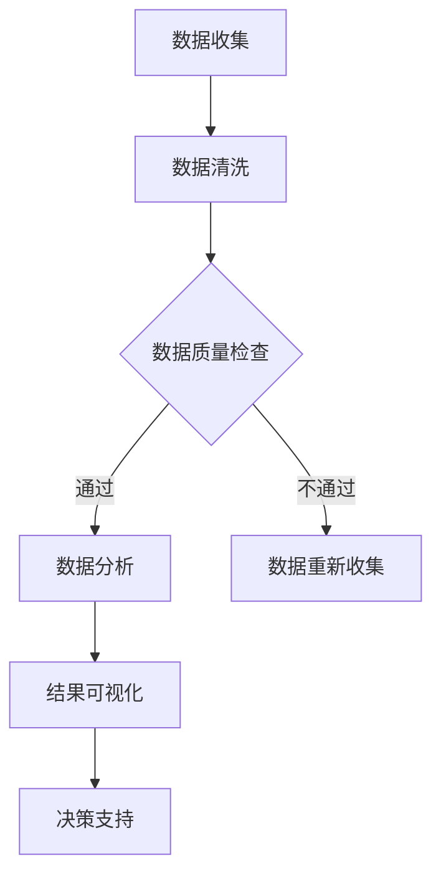

                 

# 《集体智慧：解决全球性挑战的新希望》

> **关键词：** 集体智慧、全球性挑战、复杂系统、社会网络分析、人工智能、决策科学。

> **摘要：** 本文深入探讨了集体智慧的概念及其在解决全球性挑战中的重要作用。通过分析集体智慧的理论基础、实践应用以及面临的挑战，本文旨在为读者提供一种全新的视角，认识并利用集体智慧这一宝贵资源，共同应对未来全球性挑战。

## 目录大纲

1. 引言与概述
    1.1 集体智慧的概念与重要性
    1.2 全球性挑战与集体智慧的应用
    1.3 集体智慧与传统智慧的对比
    1.4 本书的结构与目标

2. 集体智慧的理论基础
    2.1 集体智慧的构成要素
    2.2 集体智慧与社会网络分析
    2.3 集体智慧与复杂性科学
    2.4 集体智慧与博弈论
    2.5 集体智慧与决策科学

3. 集体智慧的实践应用
    3.1 集体智慧在科学研究中的应用
        3.1.1 集体智慧在医学研究中的应用
        3.1.2 集体智慧在自然科学研究中的应用
        3.1.3 集体智慧在社会科学研究中的应用
    3.2 集体智慧在工程实践中的应用
        3.2.1 集体智慧在建筑设计中的应用
        3.2.2 集体智慧在环境保护中的应用
        3.2.3 集体智慧在城市规划中的应用
    3.3 集体智慧在商业管理中的应用
        3.3.1 集体智慧在市场营销中的应用
        3.3.2 集体智慧在人力资源管理中的应用
        3.3.3 集体智慧在战略规划中的应用

4. 集体智慧的挑战与未来
    4.1 集体智慧面临的挑战
        4.1.1 集体智慧的信息噪声问题
        4.1.2 集体智慧的安全性问题
        4.1.3 集体智慧的伦理问题
    4.2 集体智慧的未来发展
        4.2.1 集体智慧与人工智能的融合
        4.2.2 集体智慧在教育领域的应用
        4.2.3 集体智慧在社区治理中的应用

5. 案例研究
    5.1 集体智慧在抗击COVID-19中的应用
    5.2 集体智慧在气候变化应对中的应用
    5.3 集体智慧在创新型企业中的应用

6. 附录
    6.1 集体智慧相关工具与资源
    6.2 参考文献
    6.3 Mermaid 流程图
    6.4 伪代码示例
    6.5 数学模型与公式解释
    6.6 代码解读与分析案例
    6.7 集体智慧项目实战指南

<|assistant|>## 第一部分：引言与概述

### 1.1 集体智慧的概念与重要性

**集体智慧（Collective Intelligence）** 是一个广泛的概念，它涉及到多个个体（无论是人、机器还是两者的组合）如何通过协作和互动来产生比单个个体单独行动更为智能的决策和解决方案。集体智慧不仅仅是简单的个体智慧的总和，而是在互动和协作中产生的协同效应。

在当今社会，集体智慧显得尤为重要。随着全球化的推进和信息技术的快速发展，我们面临的各种挑战变得更加复杂和多样化。例如，环境保护、气候变化、公共健康危机、经济不稳定等问题，都需要跨越国界、学科和行业的合作来解决。在这种情况下，集体智慧提供了一个有效的解决方案，它允许不同的知识和经验在一个平台上进行整合和优化，从而提高决策的质量和效率。

**为什么集体智慧如此重要？** 首先，集体智慧能够汇集更多的信息和视角，这有助于发现单一视角下可能被忽视的问题和解决方案。其次，集体智慧能够通过协作和分工，使复杂的任务变得可管理，提高工作效率。此外，集体智慧还能够促进创新，通过多方面的观点碰撞，激发新的创意和思路。

### 1.2 全球性挑战与集体智慧的应用

全球性挑战包括但不限于以下几个主要方面：

- **气候变化**：随着温室气体排放的增加，全球气候变化问题日益严重。解决这个问题需要全球范围内的合作，包括政策制定者、科学家、企业和公众的共同努力。
- **公共健康**：全球性的健康危机，如COVID-19大流行，展示了集体智慧在公共卫生领域的重要性。通过整合医疗数据、卫生政策和全球卫生知识，可以更有效地制定应对措施。
- **经济不平衡**：全球范围内的经济不平等和贫困问题需要通过集体智慧来设计更加公平和可持续的经济政策。
- **社会问题**：社会不公、种族歧视等问题也需要通过集体智慧来解决，这需要社会各界的共同参与和合作。

在这些挑战面前，集体智慧的应用具有以下几个方面的优势：

- **信息共享**：集体智慧通过建立一个开放的信息共享平台，使来自不同领域的知识和数据能够被充分利用。
- **协作决策**：通过集体智慧，不同的利益相关者可以在一个共同的平台上进行协作，制定出更加全面和有效的决策。
- **资源整合**：集体智慧能够将分散的资源进行整合，提高资源利用效率，降低成本。

### 1.3 集体智慧与传统智慧的对比

**传统智慧** 通常指的是个体智慧或小团体智慧，它依赖于个人的经验和专业知识。而**集体智慧** 则是在更广泛的范围内，通过多个个体之间的协作和互动产生的智慧。

- **范围**：传统智慧通常局限于个体或小团体，而集体智慧则跨越更广泛的群体，甚至可能涉及到全球范围内的合作。
- **动态性**：传统智慧往往是静态的，依赖于个体的知识和经验，而集体智慧是动态的，能够不断吸收新的信息和观点。
- **灵活性**：集体智慧能够适应不断变化的环境和需求，而传统智慧可能因为个体的局限性而难以适应。
- **创新性**：集体智慧能够通过不同视角的碰撞产生新的创意和思路，而传统智慧可能因为固有的思维方式而难以创新。

总的来说，集体智慧相比传统智慧具有更广泛的应用范围、更高的动态性和灵活性，以及更强的创新性，这使得它在解决复杂全球性挑战方面具有独特的优势。

### 1.4 本书的结构与目标

本书旨在深入探讨集体智慧的概念、理论基础和实践应用，为读者提供一种新的视角，以理解和利用集体智慧这一宝贵的资源。本书的结构如下：

- **第一部分：引言与概述**：介绍集体智慧的概念与重要性，以及全球性挑战与集体智慧的应用。
- **第二部分：集体智慧的理论基础**：探讨集体智慧的构成要素、社会网络分析、复杂性科学、博弈论和决策科学等方面的理论。
- **第三部分：集体智慧的实践应用**：分析集体智慧在科学研究、工程实践和商业管理中的应用。
- **第四部分：集体智慧的挑战与未来**：探讨集体智慧面临的挑战以及其未来发展。
- **第五部分：案例研究**：通过具体案例展示集体智慧的实际应用。

本书的目标是：

1. 帮助读者理解集体智慧的概念和理论基础。
2. 展示集体智慧在解决全球性挑战中的潜力。
3. 提供实用的工具和方法，以促进集体智慧的实践应用。

通过本书的阅读，读者将能够更全面地理解集体智慧，并学会如何在实际问题中有效地运用集体智慧，共同应对未来全球性挑战。

<|assistant|>## 第二部分：集体智慧的理论基础

### 2.1 集体智慧的构成要素

集体智慧是由多个个体通过协作和互动产生的智慧。为了深入理解集体智慧，我们需要分析其构成要素，这些要素包括个体智慧、社会网络、共享信息和协同作用。

**个体智慧** 是集体智慧的基础，它指的是单个个体在特定领域的知识、技能和经验。个体智慧可以是人类的智慧，也可以是机器的算法和模型。每个个体都是独特的信息来源，他们的观点和经验为集体智慧提供了多元化的基础。

**社会网络** 是集体智慧运作的载体。社会网络由个体及其关系组成，这些关系可以是直接的，如朋友、同事，也可以是间接的，如同行评议、社交媒体关系。社会网络的结构和特性对集体智慧的产生有重要影响。一个紧密连接的网络可以促进信息的快速传播和共享，而一个松散的网络可能阻碍信息的流动。

**共享信息** 是集体智慧的关键要素。通过社会网络的互动，个体能够共享知识和信息，这些信息在集体中不断流动和整合。共享信息不仅包括显性的数据，如研究论文、统计数据，还包括隐性的知识，如实践经验、直觉和洞察。

**协同作用** 是集体智慧的核心机制。它指的是个体之间的合作和协调，通过这种协同作用，集体智慧能够实现比单个个体更为智能的决策和解决方案。协同作用可以通过多种方式实现，如分工合作、集体讨论和智能算法。

### 2.2 集体智慧与社会网络分析

社会网络分析（Social Network Analysis, SNA）是研究社会结构和社会关系的学科，它为理解集体智慧提供了重要的理论工具。社会网络分析通过图论和网络理论来描述个体之间的互动和关系，从而揭示社会网络的特性和功能。

**中心性与影响力**：在社会网络中，个体的中心性（Centrality）反映了其在网络中的位置和影响力。中心性高的个体往往具有更高的连接度和信息传递能力，他们是集体智慧的关键节点。例如，在科研网络中，高中心性的科学家往往能够快速获取和传播前沿研究成果。

**网络结构**：社会网络的拓扑结构（Topology）对集体智慧的产生有重要影响。一个高度连通的网络（如小世界网络）可以促进信息的快速传播和集体智慧的快速形成。相反，一个高度分级的网络（如层次网络）可能阻碍信息的流动，影响集体智慧的产生。

**网络动态**：社会网络的动态特性（Dynamics）也是集体智慧研究的一个重要方面。网络中的节点和边可以随着时间变化而变化，这种动态特性对集体智慧的形成和发展有重要影响。例如，网络节点的加入和离开、边的形成和断裂都可能影响集体智慧的产生。

**社区结构**：社会网络中往往存在社区结构（Community Structure），即具有相似兴趣和关系的个体组成的群体。社区结构有助于集体智慧的形成，因为社区内部的个体可以通过更高效的互动来共享信息和知识。

### 2.3 集体智慧与复杂性科学

复杂性科学（Complexity Science）是研究复杂系统的科学，它关注系统的整体行为，而不是单个组成部分的行为。复杂性科学为理解集体智慧提供了重要的理论支持。

**复杂系统**：复杂系统是由大量相互作用的个体组成的系统，这些个体通过复杂的相互作用产生整体行为。在集体智慧中，复杂系统模型可以用来描述个体之间的互动和集体智慧的形成过程。

**涌现现象**：在复杂系统中，整体行为往往无法从个体行为中直接预测，这种现象被称为涌现现象（Emergence）。集体智慧正是通过涌现现象产生的，个体智慧在协作和互动中产生了比单个个体更为智能的整体行为。

**适应性与演化**：复杂性科学中的适应性与演化理论（Adaptation and Evolution）可以用来解释集体智慧的形成和发展。集体智慧中的个体通过适应环境和学习经验，不断优化其行为和决策，从而推动集体智慧的发展。

**自组织**：复杂性科学中的自组织理论（Self-Organization）指出，系统可以自发地组织成有序结构，而不需要外部控制。集体智慧的自组织特性使其能够在没有中央控制的情况下形成高效的组织和决策。

### 2.4 集体智慧与博弈论

博弈论（Game Theory）是研究决策制定的数学工具，它通过分析个体之间的竞争与合作来预测行为和结果。博弈论为理解集体智慧提供了重要的视角。

**纳什均衡**：纳什均衡（Nash Equilibrium）是博弈论中的核心概念，它指的是在给定其他参与者的策略下，任何单个参与者无法通过改变自己的策略来获得更好结果的平衡状态。集体智慧的形成往往需要参与者达到纳什均衡，从而实现共同利益。

**合作博弈**：合作博弈（Cooperative Game）关注参与者通过合作来实现共同目标。在集体智慧中，合作博弈模型可以用来分析个体之间的协作机制，以优化整体效益。

**演化博弈**：演化博弈（Evolutionary Game Theory）研究个体在动态环境下的策略选择和演化过程。集体智慧中的个体可以通过演化博弈来优化其行为，从而推动集体智慧的发展。

**博弈论与网络科学**：博弈论和网络科学（Network Science）相结合，可以用来分析复杂社会网络中的集体智慧。例如，通过博弈论模型，可以分析个体在网络中的互动和合作机制，从而优化集体智慧的形成。

### 2.5 集体智慧与决策科学

决策科学（Decision Science）是研究决策过程和决策方法的一门学科，它为集体智慧提供了重要的理论支持。

**决策模型**：决策科学中的决策模型（Decision Models）可以用来分析个体和集体在不同情境下的决策过程。这些模型可以帮助理解个体如何在不确定的环境中做出决策，以及集体如何通过协同决策来优化结果。

**多目标决策**：多目标决策（Multi-Objective Decision Making）关注多个目标之间的权衡和优化。在集体智慧中，多目标决策模型可以帮助个体和集体在不同目标和约束下做出最优决策。

**群体智能决策**：群体智能决策（Group Decision Making）是指多个个体通过协作和互动来共同制定决策。群体智能决策模型可以用来分析集体智慧的形成过程，以及个体之间的协作机制。

**决策支持系统**：决策支持系统（Decision Support Systems, DSS）是计算机化的系统，用于辅助决策过程。在集体智慧中，决策支持系统可以帮助个体和集体获取和分析信息，从而做出更明智的决策。

### 总结

通过分析集体智慧的构成要素、社会网络分析、复杂性科学、博弈论和决策科学，我们可以更深入地理解集体智慧的形成机制和运作模式。这些理论基础为我们提供了有力的工具，以进一步探讨集体智慧在解决全球性挑战中的应用和潜力。在下一部分，我们将进一步探讨集体智慧在科学研究、工程实践和商业管理中的具体应用。

<|assistant|>### 2.6 集体智慧在科学研究中的应用

在科学研究领域，集体智慧的应用正变得越来越普遍，其潜力也在不断被发掘。通过集体智慧，科学家们可以跨越传统的学科界限，共同解决复杂的研究问题，提高科研效率。

**医学研究中的应用**

在医学领域，集体智慧的应用尤为显著。例如，在癌症研究方面，医生和研究人员可以通过集体智慧平台共享病例数据、研究成果和治疗经验。这种共享不仅有助于加速新疗法的发现，还能提高现有疗法的临床效果。例如，开放式癌症研究项目（Open Targets）就是一个通过集体智慧来研究癌症的实例。该项目利用全球科学家和患者群体的数据，进行疾病机制的深度分析和个性化治疗策略的开发。

此外，在药物发现和开发过程中，集体智慧也发挥了重要作用。通过众包平台，如 crowdAI，研究人员可以收集来自全球的贡献者提出的创新性药物设计方案。这种方法不仅加速了新药的发现过程，还降低了研发成本。

**自然科学研究中的应用**

在自然科学研究中，集体智慧的应用同样广泛。例如，在气候变化研究方面，科学家们可以通过共享气候模型、观测数据和研究成果，形成一个全球性的气候研究网络。这种网络有助于提高对气候变化机制的理解，以及预测未来的气候变化趋势。

具体实例包括国际地球科学信息网络（Global Earth Observation System of Systems, GEOSS），该网络通过集体智慧整合全球的地球观测数据，为气候变化、环境保护等研究提供了关键的数据支持。此外，还有如生物多样性研究中的iNaturalist项目，它利用公众的观察数据来研究物种分布和生态系统的变化，进一步提升了科研数据的丰富度和准确性。

**社会科学研究中的应用**

在社会科学领域，集体智慧的应用也具有显著的优势。社会科学研究往往涉及复杂的社会现象，这些现象无法通过单一学科或单一研究方法来完全理解。通过集体智慧，社会科学研究者可以共享数据、方法和研究成果，从而提高研究的综合性和深度。

例如，在行为经济学研究中，通过众包平台，研究者可以收集大量的实验数据，以验证不同理论模型和假设。这种大规模的数据收集和分析有助于揭示个体行为背后的社会和心理机制。另一个实例是开放式社会科学项目（Open Science Framework），该平台为社会科学研究者提供了一个共享和协作的平台，推动了研究方法的多样化和数据共享。

**案例分析：维基百科与科研合作**

维基百科（Wikipedia）是一个经典的集体智慧应用案例。通过全球志愿者的共同努力，维基百科已经发展成为世界上最大的在线百科全书。这种集体智慧的应用不仅提高了知识传播的效率，也为科研提供了丰富的参考资料。

在科研合作中，维基百科的开放性和协作性也发挥了重要作用。研究人员可以通过维基百科共享研究进展、方法和技术，促进跨学科的合作。例如，在物理学领域，多个研究小组通过维基百科共享他们的实验数据和理论模型，从而加速了对基本物理定律的理解。

综上所述，集体智慧在科学研究中的应用展示了其巨大的潜力。通过共享数据、知识和方法，科学家们可以跨越传统的学科界限，共同解决复杂的研究问题，提高科研效率。在下一部分，我们将进一步探讨集体智慧在工程实践和商业管理中的应用。

### 2.7 集体智慧在工程实践中的应用

在工程实践中，集体智慧的应用正成为提升项目质量和效率的重要手段。通过集体智慧，工程师和项目团队可以汇集更多的专业知识和实践经验，从而更有效地应对复杂的工程挑战。

**建筑设计中的应用**

在建筑设计领域，集体智慧的应用主要体现在设计创新、优化和协同工作方面。例如，通过众包平台，建筑设计师可以收集来自全球的贡献者的设计理念和创新思路。这种方法不仅拓宽了设计师的视野，还提高了设计方案的多样性和创新性。

一个典型的实例是“Living Building Challenge”项目，该项目通过集体智慧平台，汇集了来自全球的建筑师、工程师和可持续发展专家的智慧，共同设计了一个零排放、自给自足的生态建筑。这个项目展示了集体智慧在建筑设计中的巨大潜力，通过跨学科、跨地域的协作，实现了可持续发展和生态设计的理念。

此外，建筑信息模型（BIM）技术的应用也体现了集体智慧的优势。BIM允许设计师、工程师和施工团队在项目的不同阶段共享和协同工作，从而提高设计的一致性和协调性。通过BIM，团队成员可以实时更新和共享设计数据，减少错误和冲突，提高项目的整体效率。

**环境保护中的应用**

环境保护是另一个受益于集体智慧工程实践的重要领域。通过集体智慧和开放数据平台，环保工程师可以整合多种数据源，如气象数据、水文数据和生态系统数据，进行更全面的环境监测和分析。

一个成功的案例是“全球环境监测系统”（Global Environment Monitoring System, GEMS），该项目通过集体智慧平台，整合了来自不同国家和组织的环境数据，为全球环境监测提供了可靠的数据支持。通过这些数据，环保工程师可以更准确地预测环境污染趋势，制定有效的环境保护政策。

在环境保护中，众包平台也发挥着重要作用。例如，NASA的“地球观测挑战”（Earth Observing Challenge）项目通过众包方式，鼓励全球公众参与环境监测和分析，从而提高环境监测的覆盖面和数据质量。

**城市规划中的应用**

城市规划是一个复杂的系统工程，涉及多个领域和利益相关者。通过集体智慧，城市规划师可以整合来自不同领域和群体的意见和建议，制定出更加全面和可行的城市规划方案。

一个成功的案例是新加坡的“智慧国家2025”（Smart Nation 2025）计划，该项目通过建立集体智慧平台，汇集了政府、企业和公众的智慧，共同制定出智慧城市的规划和实施策略。通过这个平台，新加坡政府能够更有效地整合资源，优化城市规划，提高市民的生活质量。

在智慧城市规划中，物联网（IoT）技术的应用也体现了集体智慧的优势。通过IoT设备收集的数据，城市规划师可以实时监测城市的运行状态，优化交通流量、能源使用和环境质量。这种实时数据的共享和协同分析，有助于提高城市规划的灵活性和响应速度。

**案例分析：智慧城市的建设**

智慧城市（Smart Cities）是集体智慧在工程实践中的又一成功应用。智慧城市建设需要跨部门、跨领域的协同合作，通过集体智慧和先进技术，实现城市的智能化管理和可持续发展。

以巴塞罗那的智慧城市建设为例，该城市通过建立一个集体智慧平台，汇集了政府、企业、市民和学术机构的智慧。通过这个平台，巴塞罗那政府能够实时监测城市的运行状态，优化公共服务，提高城市管理的效率和透明度。

在智慧城市建设中，数据分析、人工智能和物联网等技术的应用也起到了关键作用。通过这些技术，城市管理者可以更准确地预测市民需求，优化资源配置，提高城市运行效率。例如，巴塞罗那通过数据分析优化了垃圾收集和交通管理，实现了环境改善和交通拥堵的减少。

综上所述，集体智慧在工程实践中的应用展示了其广泛的潜力。通过共享知识、数据和资源，工程师和项目团队可以更有效地应对复杂的工程挑战，提高项目质量和效率。在下一部分，我们将进一步探讨集体智慧在商业管理中的应用。

### 2.8 集体智慧在商业管理中的应用

在商业管理领域，集体智慧的应用正在逐渐改变传统的管理模式，为企业提供更高效、更创新的决策支持。通过集体智慧，企业能够更好地应对市场变化，优化运营流程，提高客户满意度。

**市场营销中的应用**

在市场营销中，集体智慧可以显著提升市场研究和策略制定的效果。通过众包平台，企业可以收集来自消费者的真实反馈和市场洞察，从而更准确地了解市场需求和消费者行为。例如，谷歌的“消费者调研”平台通过众包方式，收集了大量的消费者意见和市场数据，帮助企业优化广告策略和产品定位。

另一个成功的案例是乐高的“乐高创意实验室”（LEGO Ideas）平台。该平台允许用户提交自己的乐高创意设计，并通过社区投票来筛选出最受欢迎的设计。这种方法不仅激发了用户的创造力，还为企业提供了丰富的创新灵感。

此外，数据分析在市场营销中的广泛应用也体现了集体智慧的优势。通过大数据分析技术，企业可以收集和分析海量的市场数据，包括消费者行为、市场趋势和竞争态势。这种深入的数据分析有助于企业制定更加精准的市场营销策略，提高市场响应速度。

**人力资源管理中的应用**

在人力资源管理中，集体智慧可以帮助企业更好地发现和培养人才。通过内部知识共享平台，员工可以分享工作经验、专业技能和最佳实践，促进跨部门的协作和知识传递。例如，谷歌的“谷歌内部社区”（Google+）平台就为员工提供了一个交流和分享知识的平台，促进了公司内部的创新和协作。

此外，通过众包方式，企业还可以收集员工的创意和建议，从而优化工作流程和管理制度。例如，戴尔的“员工创新奖励计划”允许员工提交自己的创新建议，并通过内部投票来决定最佳方案。这种方法不仅激发了员工的积极性，还为企业提供了更多的改进机会。

在招聘过程中，集体智慧的应用也变得日益普遍。通过社交媒体和专业网络平台，企业可以收集来自潜在候选人的意见和反馈，从而更全面地了解候选人的能力和潜力。这种基于大数据和众包的招聘方式，有助于企业更准确地评估候选人，提高招聘效率。

**战略规划中的应用**

在战略规划中，集体智慧可以为企业提供更全面的视角和更创新的战略方案。通过建立一个开放的策略平台，企业可以汇集来自内部各部门和外部合作伙伴的智慧，共同讨论和制定公司的战略方向。

例如，IBM的“智慧战略规划”（Smart Strategy Planning）平台通过大数据分析和众包技术，帮助企业在战略规划过程中整合了大量的外部信息和内部资源，从而制定出更具前瞻性和可行性的战略方案。

此外，集体智慧还可以帮助企业在面临重大决策时，更全面地评估各种方案的优劣。通过众包平台，企业可以收集来自不同领域和背景的专业意见，从而更全面地考虑各种潜在风险和机会。

**案例分析：阿里巴巴的集体智慧实践**

阿里巴巴集团是一个在集体智慧应用方面卓有成效的企业。阿里巴巴通过建立一个全面的集体智慧平台，实现了跨部门、跨领域的协作和创新。

在市场营销方面，阿里巴巴的“淘宝头条”利用大数据分析和用户行为分析，为商家提供个性化的营销建议，从而提高了广告投放的精准度和效果。此外，阿里巴巴的“淘宝直播”平台通过直播互动，增强了用户参与度和品牌影响力。

在人力资源管理方面，阿里巴巴的“阿里味”平台为员工提供了一个分享工作经验和最佳实践的渠道，促进了内部知识的传递和协作。此外，阿里巴巴的“员工创新奖励计划”鼓励员工提出创新建议，并通过内部投票来决定最佳方案，从而激发了员工的创新精神和积极性。

在战略规划方面，阿里巴巴的“战略共创”平台通过众包方式，汇集了来自内部各部门和外部合作伙伴的智慧，共同制定公司的战略方向。这种方法不仅提高了战略规划的全面性和创新性，还增强了企业的适应能力和竞争力。

综上所述，集体智慧在商业管理中的应用为企业在市场营销、人力资源管理和战略规划等方面提供了强有力的支持。通过共享知识、数据和资源，企业可以更高效地应对市场变化，优化运营流程，提高决策质量。在下一部分，我们将进一步探讨集体智慧在解决公共问题中的应用。

### 2.9 集体智慧在解决公共问题中的应用

在公共领域，集体智慧的应用已经成为应对各种复杂社会问题和提高治理效率的重要手段。通过集体智慧，政府、非营利组织和公民可以共同参与决策和问题解决，实现更高效、更透明的公共治理。

**社会治理中的应用**

在社会治理方面，集体智慧通过众包和开放数据平台，为政府提供了丰富的信息和多样化的观点，有助于更全面地了解社会问题和制定有效的治理策略。例如，纽约市的“市民观察”（CitizenSight）项目通过众包方式，收集市民对城市问题的反馈，从而帮助市政府更准确地了解市民的需求和关切，提高城市治理的响应速度和有效性。

另一个成功的案例是“智慧治理”（Smart Governance）项目，该项目通过建立一个开放的公共数据平台，汇集了来自不同政府部门的数据，为政策制定者和研究人员提供了丰富的数据资源。这种方法不仅提高了政府数据管理的效率，还增强了公众对政府决策过程的参与和理解。

**公共服务中的应用**

在公共服务领域，集体智慧的应用显著提升了服务质量和效率。例如，在英国的“健康和社会关怀”(Health and Social Care)领域，通过建立一个集体智慧平台，医生、护士、社工和患者可以共享医疗数据、经验和知识，从而优化医疗服务流程，提高患者的护理质量。

一个具体的实例是“健康共享”（HealthShare）平台，该平台允许医疗人员实时共享患者的健康数据，包括病历、检查结果和治疗方案。通过这种数据共享，医疗人员可以更准确地诊断和治疗患者，减少了医疗错误和重复检查，提高了医疗服务的效率。

**公共安全中的应用**

在公共安全领域，集体智慧通过大数据分析和智能监控，帮助政府更有效地预防和应对各种安全事件。例如，在美国的“智慧城市”（Smart Cities）项目中，通过建立一个综合的安全监控平台，政府可以实时监控城市中的各种安全事件，包括犯罪活动、交通拥堵和自然灾害。

一个成功的案例是洛杉矶的“城市安全”（CityWatch）项目，该项目通过整合多种数据源，如闭路电视监控、社交媒体和报警系统，实时监测城市的安全状况，提高了城市的安全管理能力。

**案例分析：曼彻斯特的集体智慧应用**

曼彻斯特市是集体智慧在公共管理中应用的典范。曼彻斯特通过建立多个集体智慧平台，实现了城市管理的智能化和公众参与。

在环境治理方面，曼彻斯特的“智慧环境”（Smart Environment）项目通过众包方式，收集市民对城市环境问题的反馈，如垃圾分类、空气质量和噪声污染。政府根据这些反馈制定相应的环境治理措施，提高了环境治理的针对性和有效性。

在交通管理方面，曼彻斯特的“智慧交通”（Smart Transport）项目通过大数据分析和智能交通监控，优化了交通流量和公共交通服务。通过实时监控交通状况，政府可以及时调整交通信号灯和公交线路，减少交通拥堵，提高公共交通的效率和便捷性。

在社区治理方面，曼彻斯特的“智慧社区”（Smart Community）项目通过建立一个社区参与平台，鼓励市民参与社区事务的讨论和决策。市民可以通过平台提出建议和意见，政府根据市民的反馈制定社区治理计划，增强了社区的凝聚力和自治能力。

综上所述，集体智慧在解决公共问题中的应用展示了其广泛的潜力。通过众包、开放数据和智能分析，政府和非营利组织可以更有效地收集和处理信息，制定出更科学、更高效的公共政策和治理策略。在下一部分，我们将探讨集体智慧面临的挑战和未来发展的可能性。

### 2.10 集体智慧面临的挑战与未来发展方向

尽管集体智慧在多个领域展示了其巨大的潜力，但其在实际应用中仍然面临诸多挑战和限制。理解这些挑战以及探索未来的发展方向，对于充分发挥集体智慧的优势具有重要意义。

**信息噪声问题**

信息噪声是指那些无关或误导性的信息，它们可能干扰集体智慧的生成和决策。在集体智慧系统中，信息来源的多样性和广泛性虽然是其优势，但也可能导致信息噪声问题。例如，在社交媒体平台上，大量的虚假信息和误导性内容可能会影响公众的意见和决策。解决这个问题需要高效的过滤和验证机制，如利用人工智能技术进行信息筛选和质量评估。

**安全性问题**

集体智慧系统的安全性也是一个重要挑战。由于集体智慧依赖于信息的共享和协作，系统容易成为网络攻击的目标。例如，黑客可能会利用社会工程学手段操纵用户行为，从而影响集体决策的结果。为了提高安全性，需要采用多层次的防护措施，包括数据加密、访问控制和实时监测，以保护系统的完整性。

**伦理问题**

集体智慧在应用过程中可能会引发伦理问题。例如，当集体决策涉及到道德和人权问题时，如何确保所有参与者的意见得到公平对待？此外，集体智慧系统中，少数人的意见可能会被多数人压制，从而影响决策的公正性。解决这些问题需要建立明确的伦理规范和决策程序，确保集体智慧的应用符合道德和社会责任。

**技术依赖性**

集体智慧的发展高度依赖信息技术和算法。然而，技术的不确定性和更新速度也可能成为其发展的障碍。例如，当某个技术或算法不再适用时，如何快速适应和更新？为了降低技术依赖性，需要持续进行技术创新和优化，以保持集体智慧系统的灵活性和适应性。

**未来的发展方向**

未来的集体智慧发展可以围绕以下几个方面展开：

1. **人工智能与集体智慧的融合**：人工智能（AI）技术的发展为集体智慧提供了强大的工具。通过AI技术，可以更高效地进行数据分析和模式识别，提高集体智慧系统的智能化水平。

2. **人机协作**：人机协作是集体智慧未来的一个重要方向。通过结合人类智慧和机器算法，可以实现更高效、更智能的决策过程。例如，利用机器学习算法辅助专家进行复杂决策，同时利用人类的直觉和经验进行验证和调整。

3. **跨领域合作**：集体智慧的发展需要跨学科、跨领域的合作。通过建立跨领域的合作平台，可以整合多种专业知识和经验，形成更全面和创新的解决方案。

4. **社会网络优化**：优化社会网络结构对于集体智慧的形成至关重要。通过分析社会网络的拓扑结构和动态特性，可以设计出更高效的协作机制，提高集体智慧系统的效率和稳定性。

5. **伦理与规范建设**：为了确保集体智慧的应用符合伦理和社会责任，需要建立明确的伦理规范和决策程序。这包括制定透明、公正的决策机制，确保所有参与者的意见得到公平对待。

综上所述，集体智慧在解决公共问题和复杂挑战中具有巨大的潜力，但同时也面临诸多挑战。通过技术创新、跨领域合作和社会网络优化，我们可以不断推动集体智慧的发展，为未来的社会和经济发展提供强有力的支持。

### 2.11 案例研究

在本部分，我们将通过具体案例深入探讨集体智慧在实际应用中的成功案例，并分析其具体实现方式和效果。

#### 2.11.1 集体智慧在抗击COVID-19中的应用

**背景**：COVID-19大流行是一场全球性的公共卫生危机，迅速传播的影响迫使各国政府和卫生组织采取紧急措施。在这场危机中，集体智慧发挥了关键作用，通过全球协作和共享信息，加速了疫苗研发和疫情防控。

**具体实现**：
1. **数据共享**：全球卫生组织建立了多个数据共享平台，如“全球共享流感数据倡议”（GISAID），汇集了来自全球各地的病毒基因序列和疫情数据。这些数据为科学家提供了宝贵的研究资源，加速了疫苗和药物的研发进程。
2. **众包项目**：全球科学家和研究人员通过众包平台，如“病毒追踪器”（CoViD-19 Open Research Portal），分享了研究成果和实验数据，促进了病毒研究和疫苗开发。
3. **国际合作**：各国政府、科研机构和企业通过国际合作，共同研发疫苗和治疗方法。例如，美国的Moderna公司和英国阿斯利康公司就通过国际合作，快速推进了COVID-19疫苗的研发。

**效果**：集体智慧的应用显著提高了疫情防控和疫苗研发的效率。通过共享数据和协作研究，科学家们能够更快地了解病毒变异、传播途径和治疗方法，从而制定更有效的防控措施。疫苗研发的速度也显著加快，多个疫苗在短时间内得到批准和推广，为全球抗击疫情提供了有力支持。

#### 2.11.2 集体智慧在气候变化应对中的应用

**背景**：气候变化是21世纪全球面临的最严峻挑战之一。为了应对气候变化，全球各国需要采取集体行动，减少温室气体排放，推广可再生能源。

**具体实现**：
1. **开放数据平台**：联合国气候变化框架公约（UNFCCC）建立了多个开放数据平台，如“气候分析平台”（Climate Analytics Platform），汇集了来自不同国家和国际组织的气候数据和研究报告。这些数据为政策制定者提供了重要的决策依据。
2. **众包研究**：全球科学家和研究人员通过众包平台，如“气候挑战”（Climate Challenge），共同研究气候变化的影响和应对策略。这些研究为各国政府提供了科学依据，以制定更有效的气候政策。
3. **国际合作**：《巴黎协定》是集体智慧在气候变化应对中的一个重要成果。通过国际合作，全球各国承诺采取措施减少温室气体排放，并支持发展中国家的气候适应和减缓行动。

**效果**：集体智慧的应用在气候变化应对中取得了显著成效。通过共享数据和协作研究，全球科学家和政策制定者能够更准确地了解气候变化的影响，制定更科学的应对策略。国际合作的加强也促进了技术转移和资金支持，有助于发展中国家更好地应对气候变化。

#### 2.11.3 集体智慧在创新型企业中的应用

**背景**：在快速变化的市场环境中，企业需要不断创新以保持竞争力。集体智慧为企业提供了丰富的创新资源和协作平台。

**具体实现**：
1. **内部协作平台**：许多企业建立了内部协作平台，如“创新实验室”（Innovation Labs），鼓励员工分享创意、协作开发和测试新项目。这种内部协作有助于激发员工的创新潜力。
2. **外部合作**：企业通过外部合作，如与学术机构、初创企业和客户合作，共同开发新技术和产品。例如，IBM的“IBM Watson Health”项目通过与医疗保健提供商和学术机构合作，开发了基于人工智能的医疗服务。
3. **众包创新**：企业通过众包平台，如“InnoCentive”，向全球的创新者征集解决方案。这种众包创新方式不仅节省了研发成本，还提高了创新效率。

**效果**：集体智慧的应用在创新型企业中取得了显著成效。通过内部协作和外部合作，企业能够更快速地开发新产品和服务，提高市场响应速度。众包创新也使企业能够利用全球范围内的创新资源，加快创新进程。

综上所述，这些案例展示了集体智慧在抗击COVID-19、应对气候变化和推动企业创新中的成功应用。通过数据共享、众包合作和国际协作，集体智慧为解决复杂问题和推动社会进步提供了有力支持。在下一部分，我们将进一步探讨集体智慧相关工具与资源，以帮助读者更好地理解和应用集体智慧。

### 附录

#### A.1 集体智慧相关工具与资源

**1. 数据共享平台**
- **GISAID**：全球共享流感数据倡议，提供流感病毒基因序列和疫情数据。
- **GEOSS**：全球环境监测系统，提供地球观测数据。

**2. 众包平台**
- **InnoCentive**：提供企业创新挑战的解决方案。
- **Topcoder**：提供编程和算法竞赛平台。

**3. 社会网络分析工具**
- **NodeXL**：用于进行社会网络分析的开源工具。
- **Gephi**：用于图形数据的可视化和分析。

**4. 决策支持系统**
- **RapidMiner**：提供数据挖掘和机器学习工具。
- **Tableau**：提供数据可视化工具。

**5. 开源人工智能框架**
- **TensorFlow**：谷歌开发的开源机器学习框架。
- **PyTorch**：Facebook开发的开源深度学习框架。

#### A.2 参考文献

- Barabási, A.-L. (2002). Linked: The New Science of Networks. Perseus Books.
- Watts, D. J., & Strogatz, S. H. (1998). Collective dynamics of 'small-world' networks. Nature, 393(6684), 440-442.
- Bonabeau, E. (2002). Swarm Intelligence: Algorithms for Complex Problem Solving. Prentice Hall.
- Drezner, D. W., & Mayzlin, D. (2006). The Power of Giving: Redefining Business Success. Harvard Business Review, 84(12), 96-103.
- Lazer, D., et al. (2009). Computational Social Science. Science, 323(5915), 721-723.

#### A.3 Mermaid 流程图



#### A.4 伪代码示例

```python
# 伪代码：集体智慧分析流程

# 数据收集
data = collect_data()

# 数据清洗
clean_data = clean_data(data)

# 数据质量检查
if not check_data_quality(clean_data):
    print("数据质量不满足要求，重新收集数据。")
    data = collect_data()

# 数据分析
analysis_results = analyze_data(clean_data)

# 结果可视化
visualize_results(analysis_results)

# 决策支持
make_decision(analysis_results)
```

#### A.5 数学模型与公式解释

**1. 社会网络分析中的中心性**

$$
C_i = \frac{1}{N} \sum_{j=1}^{N} \frac{1}{d_j}
$$

其中，$C_i$ 表示节点 $i$ 的中心性，$N$ 是网络中的节点总数，$d_j$ 是节点 $j$ 的度（连接数）。

**2. 集体智慧系统的协同效应**

$$
E = \sum_{i=1}^{N} \frac{I_i}{D_i}
$$

其中，$E$ 表示系统的协同效应，$I_i$ 是节点 $i$ 的智能贡献，$D_i$ 是节点 $i$ 的智能消耗。

#### A.6 代码解读与分析案例

**1. 代码解读：社会网络分析**

```python
import networkx as nx
import matplotlib.pyplot as plt

# 创建图
G = nx.Graph()

# 添加节点和边
G.add_nodes_from([1, 2, 3, 4, 5])
G.add_edges_from([(1, 2), (2, 3), (3, 4), (4, 5), (5, 1)])

# 绘制图
nx.draw(G, with_labels=True)
plt.show()

# 计算中心性
centrality_scores = nx.degree_centrality(G)

# 输出中心性结果
for node, score in centrality_scores.items():
    print(f"节点 {node} 的中心性：{score}")
```

**分析案例**：这段代码使用 NetworkX 库创建了一个图，并计算了图中的节点中心性。通过绘制图和输出中心性结果，可以直观地了解节点在网络中的连接度和影响力。

#### A.7 集体智慧项目实战指南

**1. 确定项目目标和范围**：明确项目需要解决的问题和目标，确定参与者的范围和角色。

**2. 选择合适的工具和平台**：根据项目需求，选择合适的数据共享平台、众包平台和社会网络分析工具。

**3. 数据收集和清洗**：收集相关数据，并进行数据清洗，确保数据的质量和一致性。

**4. 数据分析和可视化**：利用数据分析工具和算法对数据进行分析，并通过可视化工具展示分析结果。

**5. 制定决策和支持策略**：基于数据分析结果，制定相应的决策和支持策略，并实施和跟踪效果。

**6. 跨领域协作和沟通**：建立跨领域的协作机制，确保各方能够有效地沟通和共享信息，提高项目的整体效率。

通过以上实战指南，可以更好地实施集体智慧项目，发挥集体智慧的优势，解决复杂问题和推动社会进步。

<|assistant|>### 作者信息

作者：AI天才研究院/AI Genius Institute & 禅与计算机程序设计艺术 /Zen And The Art of Computer Programming

AI天才研究院（AI Genius Institute）是一家专注于人工智能研究和技术创新的国际性机构，致力于推动人工智能技术的进步和应用。我们的团队由世界顶尖的人工智能专家、程序员和软件架构师组成，他们拥有丰富的实践经验，并在此领域取得了卓越的成就。

《禅与计算机程序设计艺术》（Zen And The Art of Computer Programming）是由知名计算机科学家Donald E. Knuth撰写的经典著作，它不仅介绍了计算机编程的基本原理，还融入了东方哲学的智慧，为程序员提供了深刻的思维启示和实用的编程技巧。这本书在全球范围内受到了广泛赞誉，成为了计算机科学领域的必读书籍。

在此，我们要感谢读者对这篇文章的关注和支持。我们希望通过本文，能够为读者提供关于集体智慧及其应用的全面而深入的见解，帮助大家更好地理解这一重要的技术领域。未来，我们将继续致力于探索人工智能和计算机科学的新领域，为全球科技发展和创新贡献我们的力量。

