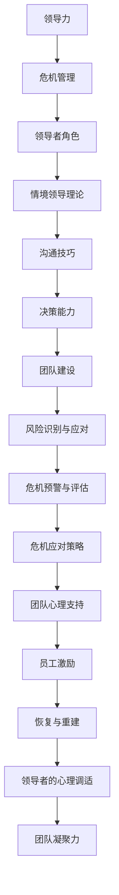

                 

# 领导力与危机管理：在动荡中稳定军心

## 关键词：
领导力，危机管理，情境领导理论，团队建设，风险管理，决策能力，心理调适，员工激励，恢复与重建

## 摘要：
本文深入探讨了领导力与危机管理之间的紧密联系。在动荡的环境中，领导者需要具备强大的领导力和危机管理能力，以稳定军心，确保团队的稳定和持续发展。文章首先概述了领导力的定义与重要性，分析了领导风格、领导力核心概念和领导力技能。接着，详细介绍了危机管理的定义、目的与原则，以及危机应对策略和管理策略。随后，本文探讨了在动荡中稳定军心的关键方法，包括领导者心理调适、团队稳定与士气提升。最后，通过成功与失败的危机管理案例，总结了案例启示和应用。本文旨在为IT领域的领导者提供实用的领导力和危机管理指南。

## 目录大纲

### 第一部分：领导力基础

#### 第1章：领导力概述
1.1 领导力的定义与重要性
1.2 领导风格与影响力
1.3 领导力的发展与培养

#### 第2章：领导力核心概念
2.1 领导者角色与责任
2.2 情境领导理论
2.3 领导与管理的区别

#### 第3章：领导力技能
3.1 沟通技巧
3.2 决策能力
3.3 团队领导与团队建设

### 第二部分：危机管理
#### 第4章：危机管理概述
4.1 危机的定义与类型
4.2 危机管理的目的与原则
4.3 危机管理的重要性

#### 第5章：危机应对策略
5.1 危机预警与评估
5.2 应急响应机制
5.3 沟通与信息披露

#### 第6章：危机管理策略
6.1 风险管理
6.2 问题解决与决策
6.3 恢复与重建

### 第三部分：在动荡中稳定军心
#### 第7章：领导者心理调适
7.1 领导者的心理压力与应对
7.2 心理韧性培养
7.3 情绪管理与情绪传染

#### 第8章：团队稳定与士气提升
8.1 团队心理支持
8.2 激励策略与员工关怀
8.3 团队建设与凝聚力

#### 第9章：案例分析与启示
9.1 成功的危机管理案例
9.2 失败的危机管理案例
9.3 案例启示与应用

### 附录
附录 A：领导力与危机管理资源
A.1 相关书籍推荐
A.2 网络资源与工具
A.3 组织管理与危机管理实践指南

## 文章核心概念与联系

### 核心概念与联系

**Mermaid 流程图：**



### 情境领导理论（SLT）的数学模型

**情境领导理论基于以下假设：**
- 领导者与追随者之间的关系会随着时间和环境变化。
- 领导风格应适应追随者的成熟度。

**成熟度分为四种水平：**

| 成熟度水平 | 描述                     | 领导风格   |
|------------|------------------------|------------|
| 1（不成熟）| 缺乏自信，需要指导     | 命令式（S1） |
| 2（较不成熟）| 缺乏能力，需要指导     | 命令式（S2） |
| 3（较成熟） | 具有信心，需要支持     | 指导式（S3） |
| 4（成熟）   | 具有信心与能力，不需要指导 | 支持式（S4） |

**情境领导理论使用了以下数学模型来描述领导行为与追随者成熟度之间的关系：**

$$
\text{领导行为} = f(\text{追随者成熟度})
$$

**其中，领导行为函数 \( f \) 可以根据追随者的成熟度水平进行不同的设置：**

- **当追随者成熟度为 1 或 2 时，领导行为倾向于命令式（S1 或 S2）。**
- **当追随者成熟度为 3 时，领导行为倾向于指导式（S3）。**
- **当追随者成熟度为 4 时，领导行为倾向于支持式（S4）。**

**伪代码示例：**

```python
def determineLeadershipStyle(maturityLevel):
    if maturityLevel == 1 or maturityLevel == 2:
        return "Commanding Style"
    elif maturityLevel == 3:
        return "Guiding Style"
    elif maturityLevel == 4:
        return "Supporting Style"
```

### 数学模型和数学公式 & 详细讲解 & 举例说明

**情境领导理论中的决策模型**

**情境领导理论中，决策模型可以帮助领导者根据追随者的成熟度水平做出最佳的领导决策。一个简化的决策模型可以使用以下数学公式表示：**

$$
\text{决策} = f(\text{领导者信念}, \text{追随者成熟度})
$$

**其中，领导者信念和追随者成熟度是两个关键变量。以下是具体的数学公式：**

1. **领导者信念函数：**

$$
\text{领导者信念} = \alpha \times \text{情境认识} + (1 - \alpha) \times \text{经验}
$$

**其中，\(\alpha\) 是领导者对情境认识的权重，经验是对追随者成熟度的认知权重。通常，\(\alpha\) 的值在 0 到 1 之间。**

2. **追随者成熟度函数：**

$$
\text{追随者成熟度} = \beta \times \text{能力} + (1 - \beta) \times \text{信心}
$$

**其中，\(\beta\) 是领导者对追随者能力的权重，1 - \(\beta\) 是对追随者信心的权重。**

**举例说明：**

**假设领导者信念的权重为 \(\alpha = 0.6\)，经验权重为 \(1 - \alpha = 0.4\)。追随者成熟度的能力权重为 \(\beta = 0.5\)，信心权重为 \(1 - \beta = 0.5\)。**

- **如果追随者的能力得分为 7，信心得分为 5，那么追随者的成熟度计算如下：**

$$
\text{追随者成熟度} = 0.5 \times 7 + 0.5 \times 5 = 6
$$

- **领导者根据成熟度决定领导风格，成熟度为 6，属于较成熟水平，因此选择指导式（S3）领导风格。**

**伪代码示例：**

```python
def calculateLeadershipDecision(beliefAlpha, beliefExperience, maturityAbility, maturityConfidence):
    alpha = beliefAlpha
    beta = maturityAbility / (maturityAbility + maturityConfidence)
    
    leaderBelief = alpha * (maturityRecognition) + (1 - alpha) * (experience)
    followerMaturity = beta * (ability) + (1 - beta) * (confidence)
    
    if followerMaturity <= 2:
        return "Commanding Style"
    elif followerMaturity <= 3:
        return "Guiding Style"
    elif followerMaturity <= 4:
        return "Supporting Style"
```

## 第一部分：领导力基础

### 第1章：领导力概述

#### 1.1 领导力的定义与重要性

领导力是指领导者引导和激励团队，实现共同目标的能力。它不仅仅涉及管理，还包括影响、沟通、决策和激励等方面。在信息技术领域，领导力尤为重要，因为IT行业的快速发展和变革要求领导者具备前瞻性、创新思维和强大的执行力。

**定义：**

领导力是一种通过影响他人来实现共同目标的能力。它不仅仅是管理职位的要求，更是领导者个人素质的体现。

**重要性：**

1. **推动变革**：在信息技术领域，技术变革日新月异，领导者需要具备推动变革的能力，引领团队适应新的技术和市场需求。
2. **激发创新**：创新是IT行业的核心竞争力。领导者通过激发团队成员的创造力和创新思维，推动技术突破和产品创新。
3. **团队凝聚力**：领导者能够建立强大的团队凝聚力，使团队成员团结一致，共同应对挑战。
4. **战略规划**：领导者负责制定和实施组织战略，确保组织在信息技术领域的持续发展。

#### 1.2 领导风格与影响力

领导风格是指领导者管理团队、处理事务的方式和方法。不同的领导风格对团队的影响各不相同。以下是一些常见的领导风格：

1. **命令式领导**：领导者权威，决策迅速，对团队成员要求严格。这种方式适用于紧急情况或团队初建阶段。
2. **民主式领导**：领导者鼓励团队成员参与决策，重视团队成员的意见和反馈。这种方式适用于团队稳定、需求多样化的情况。
3. **支持式领导**：领导者关心团队成员的个人需求，提供支持和资源，帮助团队成员实现个人和团队目标。这种方式适用于团队成员压力较大、需要关怀的情况。
4. **变革式领导**：领导者具备前瞻性，勇于挑战现状，推动团队变革和创新。这种方式适用于组织变革、市场需求变化较大的情况。

**影响力：**

领导风格对团队的影响主要表现在以下几个方面：

1. **团队士气**：领导风格直接影响团队士气。积极、支持性的领导风格能够提升团队士气，增强团队凝聚力。
2. **决策效率**：不同的领导风格影响决策效率。民主式领导风格可能导致决策过程复杂、效率低下，而命令式领导风格则可能迅速决策，但也可能忽视团队成员的意见。
3. **创新能力**：变革式领导风格鼓励创新，支持团队成员提出新想法，有助于提升组织的创新能力。
4. **团队发展**：领导风格对团队成员的职业发展产生影响。支持式领导风格有助于团队成员个人成长，提升专业能力。

#### 1.3 领导力的发展与培养

领导力并非与生俱来，而是可以通过学习和实践逐渐培养和发展。以下是一些提升领导力的方法：

1. **自我认知**：领导者需要了解自己的优势和不足，明确自己的领导风格和价值观。
2. **不断学习**：领导力是一个持续学习的过程。领导者需要关注行业动态、学习新的管理方法和工具。
3. **实践锻炼**：领导力需要在实践中不断提升。领导者可以通过参与项目、担任临时领导角色等方式，积累实际经验。
4. **倾听与反馈**：领导者需要倾听团队成员的意见和需求，关注团队的反馈，以便及时调整领导风格和方法。
5. **建立人际关系**：领导者需要建立良好的人际关系，与团队成员建立信任和合作关系。

#### 1.4 领导力的核心概念

领导力的核心概念包括领导者角色、情境领导理论、领导与管理的区别等。

**领导者角色：**

领导者角色是指领导者在团队中扮演的不同角色。常见的领导者角色包括：

1. **领导者**：负责制定团队目标和计划，指导团队成员开展工作。
2. **导师**：帮助团队成员成长，提供职业发展和技能培训。
3. **协调者**：协调团队成员之间的关系，解决冲突和问题。
4. **榜样**：以身作则，树立良好的工作作风和行为准则。

**情境领导理论：**

情境领导理论（SLT）是一种根据追随者成熟度调整领导风格的模型。成熟度分为四个水平：

1. **不成熟（Level 1）**：缺乏自信和能力，需要指导和监督。
2. **较不成熟（Level 2）**：缺乏能力，但有一定的自信，需要指导和鼓励。
3. **较成熟（Level 3）**：具有信心和能力，但需要支持和资源。
4. **成熟（Level 4）**：具备自信和能力，不需要指导和监督。

根据情境领导理论，领导者应根据追随者的成熟度水平调整领导风格，以达到最佳领导效果。

**领导与管理的区别：**

领导和管理是两个不同的概念，但紧密相关。领导关注的是激励和影响，而管理关注的是规划和执行。

1. **领导**：激发团队成员的潜力和动力，实现共同目标。
2. **管理**：负责组织资源、制定计划和监督执行，确保组织目标的实现。

领导者需要具备领导和管理两方面的能力，以有效地推动团队发展和实现组织目标。

### 第2章：领导力核心概念

#### 2.1 领导者角色与责任

领导者角色是领导力的核心组成部分，它定义了领导者在团队和组织中的职责和功能。领导者不仅要具备管理技能，还要具备能够影响和激励他人的能力。

**领导者角色包括：**

1. **愿景设定**：领导者负责为团队和组织设定清晰的目标和愿景，确保团队朝着共同目标努力。
2. **决策制定**：领导者需要做出关键决策，解决团队和组织面临的问题和挑战。
3. **资源分配**：领导者负责合理分配资源，确保团队和组织能够高效运作。
4. **团队建设**：领导者负责建立和维护团队关系，提升团队凝聚力和合作效率。
5. **沟通协调**：领导者需要确保团队内部的信息流通，协调各方利益，解决冲突和问题。

**领导者责任包括：**

1. **承担责任**：领导者要为团队和组织的目标和结果负责，勇于承担失败的责任。
2. **指导和支持**：领导者需要指导团队成员，提供必要的支持和资源，帮助他们实现个人和团队目标。
3. **培养人才**：领导者要关注团队成员的成长，培养人才，确保团队和组织的发展后劲。
4. **维护团队文化**：领导者要维护和传承团队文化，确保团队在价值观和行为上保持一致性。

#### 2.2 情境领导理论

情境领导理论（Situational Leadership Theory，SLT）是一种基于追随者成熟度调整领导风格的模型。该理论认为，领导风格应该根据追随者的成熟度水平进行变化，以达到最佳领导效果。

**情境领导理论的四个成熟度水平：**

1. **不成熟（Level 1）**：追随者缺乏自信和能力，需要领导和监督。
2. **较不成熟（Level 2）**：追随者缺乏能力，但有一定的自信，需要指导和鼓励。
3. **较成熟（Level 3）**：追随者具有信心和能力，但需要支持和资源。
4. **成熟（Level 4）**：追随者具备自信和能力，不需要领导和监督。

**情境领导理论的四种领导风格：**

1. **命令式领导（Telling）**：领导者详细指导追随者，告诉他们应该做什么，适用于成熟度水平1和2的追随者。
2. **推销式领导（Selling）**：领导者不仅告诉追随者应该做什么，还解释原因，鼓励追随者参与决策，适用于成熟度水平2的追随者。
3. **参与式领导（Participating）**：领导者与追随者共同参与决策，提供支持和资源，适用于成熟度水平3的追随者。
4. **授权式领导（Delegating）**：领导者授权追随者自主决策和行动，适用于成熟度水平4的追随者。

**情境领导理论的数学模型：**

情境领导理论可以用以下数学模型表示：

$$
\text{领导行为} = f(\text{追随者成熟度})
$$

其中，领导行为函数 \( f \) 根据追随者的成熟度水平进行不同的设置：

- 当追随者成熟度为1或2时，领导行为倾向于命令式（Telling）。
- 当追随者成熟度为3时，领导行为倾向于参与式（Participating）。
- 当追随者成熟度为4时，领导行为倾向于授权式（Delegating）。

**伪代码示例：**

```python
def determineLeadershipStyle(maturityLevel):
    if maturityLevel == 1 or maturityLevel == 2:
        return "Telling"
    elif maturityLevel == 3:
        return "Participating"
    elif maturityLevel == 4:
        return "Delegating"
```

#### 2.3 领导与管理的区别

领导和管理是两个不同的概念，但紧密相关。领导更注重激励和影响，而管理更关注规划和执行。

**领导与管理的区别：**

1. **焦点不同**：
   - 领导关注的是激励和影响，激发团队成员的潜力和动力。
   - 管理关注的是规划和执行，确保组织目标的实现。

2. **角色不同**：
   - 领导者是团队成员的引导者和榜样，负责设定目标和激励团队。
   - 管理者是组织的资源管理者，负责制定计划和协调资源。

3. **方法不同**：
   - 领导者通过沟通、激励和榜样作用影响团队成员。
   - 管理者通过制定规则、监督执行和评估结果来管理团队。

4. **目标不同**：
   - 领导的目标是建立信任、激发创新和实现共同愿景。
   - 管理的目标是确保组织的效率和绩效。

领导者需要同时具备领导和管理的能力，才能有效地推动团队和组织的发展。领导力是激发团队潜力的关键，而管理是确保组织运作的基石。

### 第3章：领导力技能

#### 3.1 沟通技巧

沟通技巧是领导者必须掌握的重要技能之一。有效的沟通能够增强团队凝聚力，提升工作效率，减少误解和冲突。

**沟通技巧包括：**

1. **倾听**：倾听是有效沟通的基础。领导者需要认真倾听团队成员的意见和需求，了解他们的想法和感受。
2. **表达清晰**：领导者需要用清晰、简洁的语言表达自己的观点和想法，避免歧义和误解。
3. **反馈与确认**：领导者需要及时给予团队成员反馈，确认他们是否理解了指示和任务。
4. **非言语沟通**：领导者需要注意自己的肢体语言、面部表情和语调，以增强沟通效果。
5. **适应听众**：领导者需要根据听众的特点和需求，调整沟通的内容和方式，使其更容易被接受和理解。

**提高沟通技巧的方法：**

1. **定期培训**：参加沟通技巧培训，学习有效的沟通方法和技巧。
2. **模拟练习**：通过模拟练习，提高沟通技巧和自信心。
3. **反思与总结**：在沟通后反思自己的表现，总结经验教训，不断提高。
4. **倾听与反馈**：鼓励团队成员提出意见和建议，倾听他们的反馈，改进沟通效果。

#### 3.2 决策能力

决策能力是领导者必须具备的核心能力之一。有效的决策能够推动团队和组织的发展，应对各种挑战和机遇。

**决策能力包括：**

1. **信息收集**：在做出决策前，领导者需要收集和分析相关的信息，确保决策有充分的数据支持。
2. **分析评估**：领导者需要运用逻辑思维和分析方法，评估各种决策方案的优缺点和潜在风险。
3. **权衡利弊**：领导者需要在多个决策方案之间进行权衡，选择最优方案。
4. **快速决策**：在紧急情况下，领导者需要迅速做出决策，避免延误。
5. **承担责任**：领导者需要为决策结果承担责任，无论决策成功与否。

**提高决策能力的方法：**

1. **学习决策理论**：学习不同的决策方法和理论，提高决策的科学性和有效性。
2. **实战锻炼**：通过参与实际决策过程，积累决策经验，提高决策能力。
3. **团队协作**：与团队成员合作，共同制定决策方案，减少决策失误。
4. **反思与总结**：在决策后反思决策过程和结果，总结经验教训，不断改进。

#### 3.3 团队领导与团队建设

团队领导是领导者的重要职责之一，良好的团队建设能够提升团队效率和绩效。

**团队领导包括：**

1. **明确目标**：领导者需要为团队设定明确的目标，确保团队成员明确自己的职责和任务。
2. **激发潜力**：领导者需要发现和挖掘团队成员的潜力，激励他们发挥最佳水平。
3. **协调关系**：领导者需要协调团队成员之间的关系，解决冲突，促进团队合作。
4. **培养人才**：领导者需要关注团队成员的成长，提供培训和发展机会，提升团队整体素质。
5. **建立文化**：领导者需要建立和维护团队文化，塑造积极向上的团队氛围。

**团队建设包括：**

1. **建立信任**：信任是团队合作的基石。领导者需要通过言行一致、公平公正等方式建立团队成员之间的信任。
2. **沟通与协作**：领导者需要鼓励团队成员之间的沟通和协作，提高团队的整体效率。
3. **共同愿景**：领导者需要与团队成员共同制定愿景和目标，增强团队的凝聚力和归属感。
4. **培训与发展**：领导者需要为团队成员提供培训和发展机会，提升团队的专业能力和综合素质。
5. **激励与奖励**：领导者需要制定有效的激励机制，激励团队成员为实现团队目标而努力。

### 第二部分：危机管理

#### 第4章：危机管理概述

危机管理是指组织在面对突发事件和危机时，采取的一系列预防和应对措施，以减少危机对组织的影响，并尽快恢复正常运作。在信息技术领域，危机管理尤为重要，因为IT行业的特点决定了危机可能迅速扩散，对组织的业务和声誉造成重大影响。

#### 4.1 危机的定义与类型

**危机的定义：**

危机是指组织面临的严重不确定性事件，可能会对组织的生存和发展造成重大影响。危机通常具有以下特点：

1. **突发性**：危机往往突然发生，组织无法提前预知。
2. **不确定性**：危机的影响和结果难以预测，组织需要迅速做出反应。
3. **破坏性**：危机可能对组织的资产、声誉和员工造成破坏。

**危机的类型：**

1. **自然灾害**：如地震、洪水、火灾等，对组织的物理设施和运营造成直接影响。
2. **技术故障**：如网络攻击、系统崩溃、数据泄露等，对组织的业务运营和信息安全造成威胁。
3. **市场变化**：如市场需求下降、竞争加剧等，对组织的业务发展和市场份额造成影响。
4. **法律风险**：如法规变动、合规问题等，对组织的法律地位和经营合规性造成影响。
5. **社会事件**：如公共卫生事件、社会动荡等，对组织的运营和社会形象造成影响。

#### 4.2 危机管理的目的与原则

**危机管理的目的：**

危机管理的目的是确保组织在面对突发事件和危机时，能够迅速做出反应，减少危机对组织的影响，并尽快恢复正常运作。具体目的包括：

1. **保护生命安全**：确保组织员工和其他相关方的生命安全，防止事故扩大。
2. **减少损失**：降低危机对组织的资产、声誉和财务损失。
3. **维持运营**：确保组织的基本运营不受影响，保证关键业务的连续性。
4. **维护声誉**：及时、透明地与公众沟通，维护组织的声誉和形象。

**危机管理的原则：**

1. **预防为主**：预防是危机管理的核心。组织应建立完善的预防机制，提前识别和评估潜在危机，制定应对措施。
2. **及时响应**：危机发生时，组织应迅速启动应急预案，采取有效措施，控制危机蔓延。
3. **统一指挥**：危机管理需要统一指挥，确保各部门协调一致，共同应对危机。
4. **信息公开**：及时、透明地与公众和利益相关方沟通，公开危机信息和应对措施，减少误解和恐慌。
5. **持续改进**：危机管理是一个持续改进的过程。组织应定期评估和改进危机管理机制，提高应对能力。

#### 4.3 危机管理的重要性

在信息技术领域，危机管理的重要性尤为突出。以下是一些关键点：

1. **数据安全**：信息技术领域涉及大量敏感数据，危机可能引发数据泄露、网络攻击等，对组织的数据安全造成严重威胁。
2. **业务连续性**：信息技术行业对业务连续性要求极高，危机可能导致系统崩溃、业务中断，影响组织的正常运营。
3. **市场竞争**：信息技术行业竞争激烈，危机可能影响组织的市场份额和客户信任，对组织的业务发展造成负面影响。
4. **社会影响**：信息技术行业在社会中具有重要地位，危机可能对社会稳定和公共利益造成影响，对组织的声誉和形象造成损害。

因此，信息技术领域的领导者需要高度重视危机管理，建立完善的危机管理体系，提高组织的应对能力，确保在危机中稳定军心，保障组织的长期发展。

### 第5章：危机应对策略

#### 5.1 危机预警与评估

危机预警与评估是危机管理的重要组成部分，旨在提前识别潜在危机，评估危机的影响和风险，为组织提供及时的应对措施。

**危机预警：**

危机预警是指通过监测和识别潜在危机信号，提前发现危机的发生，以便组织能够及时采取应对措施。

**预警机制：**

1. **信息收集**：建立全面的信息收集系统，收集国内外相关领域的政策、法规、市场动态等信息，识别潜在危机信号。
2. **监测工具**：利用大数据、人工智能等技术，建立监测工具，实时分析数据，发现潜在危机。
3. **风险评估**：定期进行风险评估，评估潜在危机的影响和风险等级，制定相应的预警指标。
4. **预警信号**：根据风险评估结果，确定预警信号，包括预警级别、预警内容和预警响应措施。

**预警内容：**

1. **技术风险**：包括网络攻击、系统漏洞、数据泄露等。
2. **市场风险**：包括市场需求变化、竞争加剧等。
3. **法律风险**：包括法规变动、合规问题等。
4. **社会风险**：包括公共卫生事件、社会动荡等。

**预警响应：**

1. **启动应急预案**：当预警信号触发时，立即启动应急预案，采取应对措施。
2. **信息报告**：及时向管理层和相关部门报告预警信息，确保信息畅通。
3. **风险控制**：采取风险控制措施，降低危机对组织的负面影响。

**危机评估：**

危机评估是指对已发生的危机进行系统性分析，评估危机的影响和风险，为组织提供决策依据。

**评估内容：**

1. **危机影响**：评估危机对组织资产、声誉、业务运营等的影响。
2. **危机原因**：分析危机发生的原因，包括技术、管理、外部环境等方面。
3. **应对效果**：评估组织应对措施的有效性和及时性，分析应对过程中的问题和不足。

**评估方法：**

1. **数据分析**：利用数据分析和统计方法，评估危机的影响和风险。
2. **专家评审**：邀请相关领域的专家对危机进行评审，提供专业意见和建议。
3. **案例研究**：分析同类危机的案例，借鉴成功经验和教训。

**危机评估报告：**

危机评估报告是对危机评估结果的总结和记录，为组织提供决策依据。

**报告内容：**

1. **危机概述**：简要描述危机的发生过程和影响。
2. **影响评估**：详细分析危机对组织的影响。
3. **原因分析**：分析危机发生的原因。
4. **应对措施**：总结组织的应对措施和效果。
5. **改进建议**：提出改进危机管理的建议和措施。

#### 5.2 应急响应机制

应急响应机制是组织在面对危机时，快速应对和处理的机制，旨在降低危机对组织的影响，确保组织的持续运营。

**应急响应机制的基本要素：**

1. **应急组织**：建立应急组织，明确各部门的职责和权限，确保危机发生时能够迅速响应。
2. **应急预案**：制定应急预案，明确危机应对的具体步骤和措施，确保应急响应有序进行。
3. **应急资源**：准备应急资源，包括人力、物资、技术等，确保应急响应能够及时开展。
4. **通信与协调**：建立高效的通信与协调机制，确保各部门之间的信息畅通，协调一致地应对危机。

**应急响应机制的步骤：**

1. **危机监测**：通过监测系统，及时发现危机信号，触发应急响应。
2. **启动应急预案**：根据应急预案，启动应急响应程序，通知相关部门和人员。
3. **应急响应**：按照应急预案，采取具体措施，控制危机蔓延，减少损失。
4. **信息报告**：及时向管理层和相关部门报告危机情况和应急响应进展。
5. **恢复与重建**：在危机得到控制后，组织进行恢复和重建，确保业务的连续性和稳定性。

**应急响应机制的要点：**

1. **快速响应**：危机发生时，应急响应要迅速启动，确保危机得到及时控制。
2. **协调一致**：各部门之间要协调一致，共同应对危机，避免内部冲突和资源浪费。
3. **信息透明**：及时向公众和利益相关方公开危机信息和应急响应进展，减少误解和恐慌。
4. **持续改进**：通过危机应对的总结和反思，不断改进应急响应机制，提高应对能力。

#### 5.3 沟通与信息披露

沟通与信息披露是危机管理的关键环节，直接影响危机对组织的负面影响。有效的沟通和信息披露能够提高组织的透明度，增强公众和利益相关方的信任，降低危机对组织的声誉和业务造成的影响。

**沟通的目标：**

1. **及时性**：确保信息传递的及时性，避免信息滞后导致误解和恐慌。
2. **准确性**：确保信息的准确性，避免错误信息传播导致危机加剧。
3. **一致性**：确保信息传播的一致性，避免不同部门和人员提供的信息相互矛盾。

**沟通的渠道：**

1. **内部沟通**：通过会议、邮件、内部通讯平台等渠道，确保组织内部的信息畅通，协调各部门的应对措施。
2. **外部沟通**：通过新闻发布会、官方网站、社交媒体等渠道，向公众和利益相关方传递危机信息和应急响应进展。
3. **沟通策略**：根据危机的类型、严重程度和影响范围，制定相应的沟通策略，确保信息传递的有效性。

**信息披露的要点：**

1. **公开透明**：及时公开危机信息和应急响应进展，提高组织的透明度。
2. **主动回应**：主动回应公众和利益相关方的关切和疑问，避免信息不对称和谣言传播。
3. **风险沟通**：在信息披露过程中，要充分考虑风险因素，避免泄露敏感信息和商业机密。
4. **情感关怀**：在危机管理中，要关注员工的情感需求，提供心理支持和关怀，增强团队的凝聚力和归属感。

**信息披露的案例：**

1. **数据泄露事件**：在数据泄露事件中，组织需要及时披露泄露信息的内容、影响范围和应急响应措施，同时采取技术和管理措施，防止进一步数据泄露。
2. **公共卫生事件**：在公共卫生事件中，组织需要及时披露疫情信息、防控措施和员工健康管理措施，确保员工和公众的安全。
3. **网络安全事件**：在网络安全事件中，组织需要及时披露网络攻击方式、影响范围和应急响应措施，同时加强与网络安全专家的合作，提高网络安全防护能力。

通过有效的沟通与信息披露，组织能够降低危机对组织的负面影响，恢复公众和利益相关方的信任，确保业务的稳定和持续发展。

### 第6章：危机管理策略

#### 6.1 风险管理

风险管理是危机管理的重要组成部分，旨在识别、评估、控制和监控组织面临的各种风险，确保组织在危机中能够快速响应和有效应对。

**风险管理的过程：**

1. **风险识别**：识别组织面临的各种潜在风险，包括技术风险、市场风险、法律风险和社会风险等。
2. **风险评估**：对识别出的风险进行评估，确定风险的影响程度和发生的可能性，为风险控制提供依据。
3. **风险控制**：采取各种措施，降低风险的影响和发生的可能性，包括风险规避、风险转移和风险接受等。
4. **风险监控**：建立风险监控体系，实时监控风险的变化，确保风险控制措施的有效性。

**风险管理的方法：**

1. **定性分析**：通过专家评估、历史数据和经验判断等方法，对风险进行定性分析。
2. **定量分析**：利用数学模型、统计分析和数据挖掘等方法，对风险进行定量分析。
3. **风险评估矩阵**：建立风险评估矩阵，根据风险的影响程度和发生的可能性，对风险进行排序和分类。

**风险管理的工具：**

1. **风险登记册**：记录识别出的风险，包括风险名称、描述、影响程度、发生可能性等。
2. **风险评估表**：用于对风险进行定量评估，包括风险影响评估表、风险发生可能性评估表等。
3. **决策树**：用于分析和决策风险控制策略，根据风险的影响和成本，选择最优的风险控制方案。

**风险管理案例：**

1. **网络安全事件**：在网络安全事件中，组织需要识别潜在的网络攻击风险，评估攻击的影响和可能性，采取防火墙、入侵检测系统等安全措施进行风险控制，并建立网络监控体系，实时监控网络安全状况。
2. **市场变化**：在市场变化中，组织需要识别市场需求变化、竞争加剧等风险，评估风险的影响和可能性，采取市场调研、产品创新等策略进行风险控制，并建立市场监控体系，实时监控市场变化。

通过有效的风险管理，组织能够降低危机对组织的负面影响，确保业务的连续性和稳定性。

#### 6.2 问题解决与决策

问题解决与决策是危机管理的重要环节，旨在快速识别和解决危机中的问题，确保组织的业务连续性和稳定性。

**问题解决的步骤：**

1. **识别问题**：通过调查、分析等方式，识别危机中的问题，包括技术问题、管理问题、人员问题等。
2. **分析问题**：对识别出的问题进行分析，确定问题的根本原因和影响范围。
3. **解决问题**：采取有效的措施，解决危机中的问题，包括技术修复、管理调整、人员培训等。
4. **总结经验**：对问题解决过程进行总结，分析问题和解决策略，为未来危机管理提供参考。

**决策的类型：**

1. **常规决策**：在正常运营情况下，按照既定程序和规则进行的决策。
2. **非常规决策**：在危机情况下，面对突发事件和不确定性，需要快速做出的决策。
3. **战略决策**：涉及组织长远发展方向的决策，包括业务战略、市场战略等。

**决策的步骤：**

1. **确定问题**：明确决策需要解决的问题和目标。
2. **收集信息**：收集与决策相关的各种信息，包括技术信息、市场信息、法规信息等。
3. **分析评估**：对收集到的信息进行分析和评估，确定各种决策方案的优缺点和风险。
4. **权衡利弊**：根据决策目标和风险承受能力，权衡各种决策方案的利弊，选择最优方案。
5. **执行决策**：实施决策方案，确保决策能够有效执行。
6. **监控与调整**：对决策执行过程进行监控，及时调整决策方案，确保决策目标实现。

**决策方法：**

1. **理性决策**：基于逻辑和分析，制定最佳决策方案。
2. **直觉决策**：基于经验和直觉，快速做出决策。
3. **混合决策**：结合理性决策和直觉决策，制定综合性的决策方案。

**决策支持工具：**

1. **数据分析工具**：利用数据分析工具，对决策相关的数据进行处理和分析，提供决策依据。
2. **模拟工具**：通过模拟工具，模拟不同决策方案的结果，评估决策方案的优缺点。
3. **专家系统**：利用专家系统的知识和经验，辅助决策者做出决策。

**问题解决与决策案例：**

1. **技术故障**：在技术故障中，组织需要快速识别故障原因，分析故障的影响和解决方法，采取技术修复措施，确保系统恢复正常运作。
2. **市场变化**：在市场变化中，组织需要快速分析市场需求变化，评估对业务的影响，调整市场战略，确保业务持续发展。
3. **法律风险**：在法律风险中，组织需要识别合规问题，分析法律风险的影响，采取法律措施进行风险控制，确保组织符合法律法规要求。

通过有效的问题解决和决策，组织能够快速应对危机，降低危机对组织的负面影响，确保业务的连续性和稳定性。

#### 6.3 恢复与重建

危机对组织的冲击通常是多方面的，包括业务中断、资源损失、员工士气下降等。恢复与重建是危机管理的最后一步，旨在帮助组织从危机中走出来，恢复正常运营，并进一步提升组织的韧性和抗风险能力。

**恢复与重建的目标：**

1. **业务恢复**：尽快恢复核心业务，确保组织的基本运营不受影响。
2. **资源重建**：重建和优化组织资源，包括技术资源、人力资源和物资资源等。
3. **员工士气提升**：通过有效的沟通和激励措施，提升员工的士气和工作积极性。
4. **风险管理能力提升**：总结危机管理经验，改进危机管理策略，提高组织的风险管理能力。

**恢复与重建的步骤：**

1. **评估影响**：对危机造成的损失和影响进行全面的评估，包括业务、财务、人力资源等方面。
2. **制定恢复计划**：根据评估结果，制定详细的恢复计划，包括业务恢复、资源重建、员工激励等。
3. **执行恢复计划**：按照恢复计划，逐步实施各项恢复措施，确保业务逐步恢复正常。
4. **评估与改进**：在恢复过程中，持续评估恢复效果，及时调整恢复计划，确保恢复目标的实现。
5. **总结经验**：对恢复与重建过程进行总结，分析成功和不足之处，为未来危机管理提供参考。

**恢复与重建的策略：**

1. **技术恢复**：快速修复技术故障，恢复系统功能，确保关键业务的正常运行。
2. **人员调配**：根据业务需求，重新调整人员配置，确保关键岗位有人负责。
3. **资源调配**：优化资源分配，确保关键资源的优先供应，支持业务恢复。
4. **沟通与激励**：通过有效的沟通和激励措施，提升员工的积极性和归属感，促进组织文化的重建。
5. **风险管理**：加强风险管理，识别和评估潜在风险，制定预防措施，提高组织的抗风险能力。

**恢复与重建的案例：**

1. **网络攻击**：在遭遇网络攻击后，组织需要迅速切断攻击路径，修复系统漏洞，恢复关键业务，同时加强对网络安全的监控和防护。
2. **自然灾害**：在自然灾害后，组织需要修复受损的设施，重建物流和供应链体系，确保业务的连续性和稳定性。
3. **市场变化**：在市场需求变化后，组织需要调整产品策略，优化市场布局，确保业务的可持续发展。

通过有效的恢复与重建，组织能够从危机中走出来，恢复正常运营，并进一步提升组织的韧性和抗风险能力，为未来的发展奠定坚实基础。

### 第三部分：在动荡中稳定军心

#### 第7章：领导者心理调适

在动荡的环境中，领导者不仅要面对外部压力，还要处理内部心理压力。领导者心理调适是稳定军心的关键因素，它关系到领导者的决策能力、团队士气以及整个组织的稳定性。

#### 7.1 领导者的心理压力与应对

**心理压力来源：**

1. **工作压力**：领导者的工作往往具有高责任和高期望，需要做出快速而准确的决策。
2. **不确定性**：在动荡的环境中，不确定性增加，导致领导者对未来感到焦虑。
3. **资源限制**：资源有限，领导者需要在有限的资源下做出最优决策。
4. **人际冲突**：领导者需要处理团队内部的矛盾和冲突，保持团队和谐。

**应对策略：**

1. **积极心态**：保持积极的心态，相信自己和团队的能力，面对挑战时保持冷静和自信。
2. **时间管理**：合理安排时间，优先处理重要和紧急的任务，避免过度劳累。
3. **沟通与支持**：与团队成员保持有效沟通，分享压力，寻求支持和帮助。
4. **健康生活**：保持良好的生活习惯，如适量运动、健康饮食和充足睡眠，以维持身心健康。

#### 7.2 心理韧性培养

心理韧性是指个体在面对压力和挑战时，能够迅速恢复并表现出适应和成长的能力。领导者心理韧性培养是提升领导力和稳定团队的重要途径。

**培养策略：**

1. **自我反思**：定期进行自我反思，了解自己的情绪和行为模式，识别并改善负面情绪。
2. **学习与成长**：不断学习新知识和技能，提升自我认知和适应能力。
3. **情绪管理**：学习情绪管理技巧，如深呼吸、冥想和放松训练，帮助自己应对压力。
4. **建立支持网络**：与信任的同事、朋友和家人建立良好的支持网络，分享压力和经验。

#### 7.3 情绪管理与情绪传染

情绪管理是领导者稳定军心的关键环节。情绪不仅影响领导者的决策和行为，还会在团队中传播，影响整个团队的士气和工作效率。

**情绪管理策略：**

1. **自我觉察**：领导者需要时刻觉察自己的情绪，了解情绪的来源和影响。
2. **情绪表达**：学会健康地表达情绪，避免压抑或过度发泄，确保情绪表达的方式恰当和建设性。
3. **情绪调节**：学会调节情绪，使用积极的情绪调节策略，如积极思考、寻求支持等。

**情绪传染管理：**

1. **建立积极氛围**：领导者需要营造积极的团队氛围，鼓励团队成员分享积极情绪，减少负面情绪的传播。
2. **情绪传染识别**：领导者需要识别情绪传染的信号，如团队成员的情绪低落、工作效率下降等。
3. **情绪传染干预**：针对情绪传染问题，领导者需要采取干预措施，如开展团队建设活动、进行情绪培训等。

通过领导者心理调适和心理韧性培养，领导者能够更好地应对动荡环境中的压力和挑战，稳定军心，提升团队凝聚力和工作效率。

#### 第8章：团队稳定与士气提升

在动荡的环境中，团队稳定和士气提升是领导者的重要任务。一个稳定和士气高涨的团队能够更好地应对挑战，实现组织目标。

#### 8.1 团队心理支持

团队心理支持是提升团队稳定性和士气的关键。领导者需要关注团队成员的心理状态，提供必要的支持和关怀。

**支持策略：**

1. **倾听与理解**：领导者需要倾听团队成员的需求和困扰，理解他们的情感和感受。
2. **情绪疏导**：提供情绪疏导渠道，帮助团队成员释放负面情绪，增强心理韧性。
3. **心理咨询**：为有需要的团队成员提供心理咨询，帮助他们应对心理压力和困扰。
4. **团队活动**：组织团队建设活动，增强团队成员之间的情感联系和团队凝聚力。

#### 8.2 激励策略与员工关怀

激励策略和员工关怀是提升团队士气的重要手段。领导者需要运用各种激励手段，关心员工的生活和工作，提升员工的工作积极性和满意度。

**激励策略：**

1. **目标设定**：与团队成员共同设定合理的目标，激发他们的工作动力。
2. **认可与奖励**：及时认可和奖励团队成员的成就和努力，提高他们的工作积极性。
3. **职业发展**：提供职业发展机会和培训，帮助团队成员提升技能和职业素养。
4. **工作环境**：创造良好的工作环境，如提供舒适的工作场所、合理的加班安排等。

**员工关怀：**

1. **生活关怀**：关心员工的生活需求，如家庭、健康等，提供必要的支持和帮助。
2. **工作与生活平衡**：鼓励员工保持工作与生活的平衡，提供灵活的工作安排和时间管理技巧。
3. **沟通渠道**：建立有效的沟通渠道，确保员工能够表达自己的意见和需求，提高员工的参与感和满意度。
4. **心理支持**：为员工提供心理支持，如心理健康咨询、员工援助计划等，帮助他们应对工作和生活中的压力。

#### 8.3 团队建设与凝聚力

团队建设是提升团队稳定性和士气的重要环节。通过团队建设活动，领导者能够增强团队成员之间的信任和协作，提升团队凝聚力。

**建设策略：**

1. **共同目标**：确保团队成员明确共同目标，增强团队的凝聚力和归属感。
2. **团队活动**：组织团队建设活动，如团队培训、团队拓展等，增强团队成员之间的情感联系。
3. **信任建设**：通过信任建设活动，如团队合作游戏、团队分享等，增强团队成员之间的信任。
4. **沟通与协作**：鼓励团队成员之间的沟通和协作，提高团队的整体效率。
5. **奖励机制**：建立奖励机制，对团队和个人在团队建设中的表现给予认可和奖励。

通过团队心理支持、激励策略和员工关怀，以及团队建设与凝聚力提升，领导者能够稳定团队，提高士气，为组织的发展奠定坚实基础。

### 第9章：案例分析与启示

#### 9.1 成功的危机管理案例

在信息技术领域，成功的危机管理案例众多，以下是几个典型的例子：

1. **某互联网公司数据泄露事件**：
   - **背景**：某互联网公司在一次安全漏洞中被黑客入侵，导致用户数据泄露。
   - **应对措施**：
     - **快速响应**：公司立即启动应急预案，成立危机应对小组，快速采取措施控制数据泄露。
     - **信息披露**：公司公开承认数据泄露事件，及时向用户和相关部门披露事件详情和应对措施。
     - **技术修复**：公司投入大量资源修复漏洞，加强网络安全措施，防止类似事件再次发生。
     - **用户关怀**：公司为受影响用户提供免费安全服务，如账号安全检查、数据恢复等，提升用户信任。
   - **结果**：通过有效的危机管理，公司成功恢复了用户信任，业务运营逐渐恢复正常。

2. **某科技公司应对全球疫情**：
   - **背景**：全球疫情导致供应链中断，某科技公司面临供应链危机。
   - **应对措施**：
     - **风险评估**：公司对供应链风险进行评估，识别高风险环节，制定应对策略。
     - **替代供应商**：公司积极寻找替代供应商，确保关键原材料供应。
     - **远程办公**：公司推行远程办公，确保员工安全和业务连续性。
     - **员工关怀**：公司为员工提供心理支持和健康关怀，确保员工心理健康。
   - **结果**：通过有效的应对措施，公司成功度过了供应链危机，保持了业务的稳定运行。

#### 9.2 失败的危机管理案例

虽然成功的危机管理案例很多，但失败的案例也同样值得我们反思：

1. **某电商公司遭遇网络攻击**：
   - **背景**：某电商公司在一次网络攻击中，系统瘫痪，导致大量订单丢失。
   - **应对措施**：
     - **应急响应迟缓**：公司应急响应迟缓，未能在短时间内恢复系统。
     - **信息披露不足**：公司未及时向用户披露攻击事件和应对措施，导致用户恐慌和不满。
     - **技术修复不足**：公司技术修复措施不足，未能彻底解决系统漏洞。
   - **结果**：公司声誉严重受损，用户流失，业务运营受到影响。

2. **某科技公司市场变化应对不力**：
   - **背景**：市场需求突然变化，某科技公司未能及时调整产品策略。
   - **应对措施**：
     - **市场调研不足**：公司对市场变化调研不足，未能及时捕捉市场趋势。
     - **决策缓慢**：公司决策过程缓慢，未能迅速制定应对策略。
     - **资源分配不当**：公司资源分配不当，未能有效支持新产品的开发和推广。
   - **结果**：公司市场份额大幅下降，业务发展受阻。

#### 9.3 案例启示与应用

通过分析成功和失败的危机管理案例，我们可以得到以下启示：

1. **快速响应**：危机发生时，快速响应至关重要。及时启动应急预案，采取措施控制危机蔓延。
2. **信息披露**：及时、透明地与公众和利益相关方沟通，提高组织的透明度和信任度。
3. **风险评估**：提前进行风险评估，识别潜在风险，制定应对策略。
4. **团队协作**：危机管理需要团队协作，确保各部门协调一致，共同应对危机。
5. **员工关怀**：关心员工的心理和健康，提供必要的支持和帮助，确保员工的积极性和稳定性。
6. **持续改进**：总结危机管理经验，不断改进危机管理策略，提高组织的危机应对能力。

通过案例分析和启示，领导者可以更好地应对危机，稳定团队，确保组织的稳定和发展。

### 附录

#### 附录 A：领导力与危机管理资源

**A.1 相关书籍推荐**

1. 《领导力的五个层次》（《The Five Levels of Leadership》） - John C. Maxwell
2. 《危机管理》（《Crisis Management and Communication》） - Dr. Warren B. Rogers
3. 《领导者的五个习惯》（《The Five Dysfunctions of a Team》） - Patrick Lencioni
4. 《情境领导力》（《Situational Leadership》） - Paul Hersey 和 Ken Blanchard

**A.2 网络资源与工具**

1. **领导力培训课程**：Coursera、edX、Udemy等在线教育平台提供丰富的领导力课程。
2. **危机管理指南**：国际危机管理协会（ICMA）和危机管理网络（Crisis Management Network）等组织提供专业的危机管理指南和资源。
3. **数据分析工具**：Google Analytics、Tableau、Power BI等工具用于数据收集和分析。

**A.3 组织管理与危机管理实践指南**

1. **ISO 22301标准**：国际标准化组织（ISO）制定的ISO 22301标准，提供了组织管理和危机管理的最佳实践。
2. **国家危机管理框架**：各国政府或相关机构发布的危机管理框架，提供了危机管理的政策指导和操作流程。

通过这些资源，领导者可以进一步提升自己的领导力和危机管理能力，为组织的发展奠定坚实基础。

### 术语表与参考文献

**术语表：**

- **领导力**：指领导者引导和激励团队，实现共同目标的能力。
- **危机管理**：指组织在面对突发事件和危机时，采取的一系列预防和应对措施。
- **情境领导理论**：一种基于追随者成熟度调整领导风格的模型。
- **风险管理**：指识别、评估、控制和监控组织面临的各种风险。
- **危机预警**：指提前识别潜在危机信号，触发应急响应。
- **危机评估**：指对已发生的危机进行系统性分析，评估危机的影响和风险。
- **应急响应机制**：指组织在面对危机时，快速应对和处理的机制。
- **危机应对策略**：指组织在危机中采取的具体应对措施。
- **恢复与重建**：指组织在危机后，恢复业务和重建组织结构的措施。
- **心理韧性**：指个体在面对压力和挑战时，能够迅速恢复并表现出适应和成长的能力。

**参考文献：**

1. Hersey, P., & Blanchard, K. H. (1996). Management of Organizational Behavior: Utilizing the Situational Leadership Model. Prentice Hall.
2. Rogers, W. B. (2001). Crisis Management and Communication: A Case-Based Approach. Sage Publications.
3. Lencioni, P. (2002). The Five Dysfunctions of a Team: A Leadership Fable. Jossey-Bass.
4. Maxwell, J. C. (2007). The 21 Irrefutable Laws of Leadership: Follow Them and People Will Follow You. Thomas Nelson.
5. International Organization for Standardization. (2012). ISO 22301:2012, Societal security — Business continuity management systems — Requirements. International Organization for Standardization.

