                 

### 引言

在数字化浪潮的推动下，电子商务已经成为现代经济的重要组成部分。随着消费者需求的日益多样化和个性化，传统单一的电子商务模式已难以满足市场的需求。人工智能（AI）的崛起为电子商务带来了前所未有的变革，其中，AI 大模型在电商业中的应用前景尤为广阔。本文将探讨 AI 大模型在电商业中的应用，特别是搜索推荐系统这一核心领域。

首先，我们将简要回顾电子商务的发展历程，并阐述 AI 大模型在其中的重要性。接下来，本文将详细讲解 AI 大模型的技术基础，包括深度学习、自然语言处理和大规模预训练模型等关键概念。随后，我们将重点讨论 AI 大模型在搜索推荐系统中的应用，从基本原理到具体实践，全面剖析这一领域的核心技术和挑战。

文章的第三部分将展望 AI 大模型在电子商务中的未来应用前景，探讨其发展趋势和面临的挑战。最后，本文将总结主要结论，并对未来研究提出建议。通过本文的阅读，读者将深入了解 AI 大模型在电商业中的核心价值和应用前景。

关键词：电子商务、人工智能、大模型、搜索推荐系统、深度学习

摘要：本文深入探讨了 AI 大模型在电商业中的应用前景，特别是在搜索推荐系统中的核心作用。文章首先回顾了电子商务的发展历程和 AI 大模型的基本概念，然后详细分析了 AI 大模型的技术基础和应用场景。通过具体案例研究，本文展示了 AI 大模型在电子商务搜索推荐系统中的实践效果，并对未来应用前景进行了展望。本文旨在为读者提供一个全面、系统的了解 AI 大模型在电商业中的应用现状和发展方向的参考。

### 目录大纲

## 《AI 大模型在电商业中的应用前景：搜索推荐系统是核心》

## 第一部分: 引言

## 第二部分: AI 大模型技术基础

### 第三部分: AI 大模型在搜索推荐系统中的应用

## 第四部分: AI 大模型在电子商务搜索推荐系统中的实践

## 第五部分: 未来展望

### 第六部分: 总结与展望

## 附录

### 附录 A: 常用工具与资源

## 第一部分: 引言

随着互联网技术的飞速发展，电子商务已经成为现代经济的重要驱动力。从最初的在线拍卖、B2B交易，到现在的全球在线零售市场，电子商务的演变历程充满了技术创新和商业模式变革。在这个过程中，人工智能（AI）的崛起为电子商务带来了前所未有的变革和机遇。本文将探讨 AI 大模型在电商业中的应用前景，特别是搜索推荐系统这一核心领域。

#### 1.1 电子商务的发展历程与现状

电子商务的起源可以追溯到 20 世纪 90 年代，随着互联网的普及，在线购物逐渐成为一种新兴的消费方式。早期的电子商务主要集中于在线拍卖和电子市场，如 eBay 和 Amazon 的诞生标志着电子商务时代的到来。随后，随着互联网技术的不断进步，电子商务逐渐从传统的零售市场渗透到各个行业，如旅游、金融、教育等。

近年来，电子商务市场呈现出爆发式增长。根据数据显示，全球电子商务市场规模已超过数万亿美元，并且在不断扩张。电子商务平台的多样化和服务质量的提升，使得消费者在购物过程中的体验更加便捷和个性化。此外，移动电商、社交电商等新形式的电子商务模式不断涌现，进一步丰富了电子商务的生态系统。

#### 1.2 AI 大模型在电子商务中的重要性

AI 大模型在电子商务中的应用具有深远的意义。首先，AI 大模型能够通过对海量用户数据的深度挖掘和分析，提供更加精准的个性化推荐服务。这有助于电商平台提高用户满意度和转化率，从而提升销售额。其次，AI 大模型在搜索优化、供应链管理、风险控制等方面也有广泛的应用。通过深度学习和自然语言处理技术，AI 大模型可以自动识别用户需求、优化搜索结果、降低库存风险，提高电商平台的运营效率。

此外，随着 AI 大模型的不断发展和应用，电子商务市场的竞争格局也在发生变化。传统电商平台需要通过技术创新来提升自身竞争力，而新兴电商平台则借助 AI 大模型快速崛起。因此，了解和掌握 AI 大模型在电子商务中的应用，对于电商平台和企业来说具有重要的战略意义。

#### 1.3 AI 大模型在电子商务中的应用场景

AI 大模型在电子商务中的应用场景非常广泛，主要包括以下几个方面：

1. **搜索推荐系统**：AI 大模型能够通过对用户历史行为、兴趣爱好、购物意图等数据的分析，提供个性化推荐服务。这有助于提高用户满意度和转化率，从而提升电商平台的业绩。

2. **用户画像**：AI 大模型可以构建详细的用户画像，包括用户的年龄、性别、收入水平、兴趣爱好等。这有助于电商平台更好地了解用户需求，提供定制化服务。

3. **供应链管理**：AI 大模型能够优化供应链管理，降低库存风险。通过对销售数据的分析和预测，AI 大模型可以指导电商平台合理调整库存水平，提高供应链的效率。

4. **风险控制**：AI 大模型在反欺诈、信用评估等方面也有广泛应用。通过深度学习和自然语言处理技术，AI 大模型可以识别异常交易、预测信用风险，提高电商平台的安全性和稳定性。

总之，AI 大模型在电子商务中的应用前景非常广阔。随着技术的不断进步和应用的深入，AI 大模型将为电子商务带来更多的创新和变革。

### 第二部分: AI 大模型技术基础

在深入探讨 AI 大模型在电子商务中的应用之前，有必要首先了解其技术基础，包括深度学习、自然语言处理和大规模预训练模型等。这些技术不仅为 AI 大模型提供了强大的计算能力和分析工具，也为其在各个领域中的应用奠定了基础。

#### 2.1 深度学习与神经网络基础

深度学习是 AI 大模型的核心技术之一，其理论基础是神经网络。神经网络是由大量简单的神经元组成的网络，通过学习和模拟人脑的思维方式，实现数据的自动分析和处理。

##### 2.1.1 神经网络的基本结构

一个典型的神经网络包括输入层、隐藏层和输出层。输入层接收外部数据，隐藏层对数据进行逐层处理和转换，输出层生成最终结果。

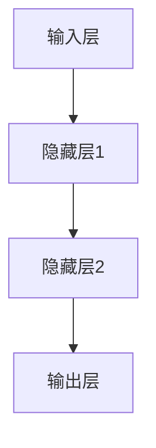

每个神经元都是一个简单的函数，通常使用非线性激活函数，如 sigmoid、ReLU 等，以增加模型的非线性表达能力。

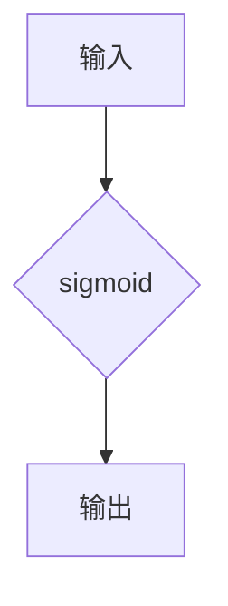

##### 2.1.2 常见的深度学习架构

深度学习的应用领域广泛，包括图像识别、语音识别、自然语言处理等。以下是几种常见的深度学习架构：

1. **卷积神经网络（CNN）**：CNN 是用于图像识别和处理的常用架构。其核心思想是使用卷积层提取图像特征。

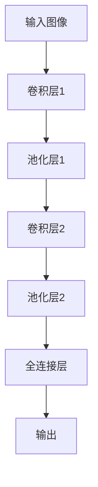

2. **循环神经网络（RNN）**：RNN 是用于序列数据处理的常用架构，如语音识别、机器翻译等。其特点是能够记忆序列中的信息。

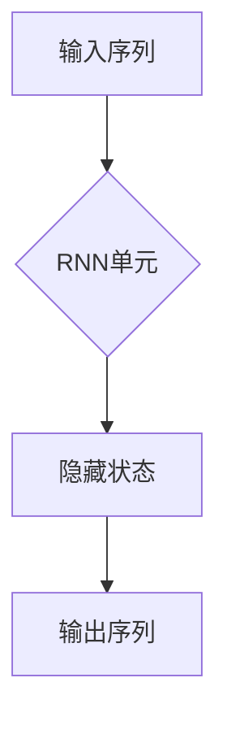

3. **长短时记忆网络（LSTM）**：LSTM 是 RNN 的一种改进，能够更好地处理长序列数据。

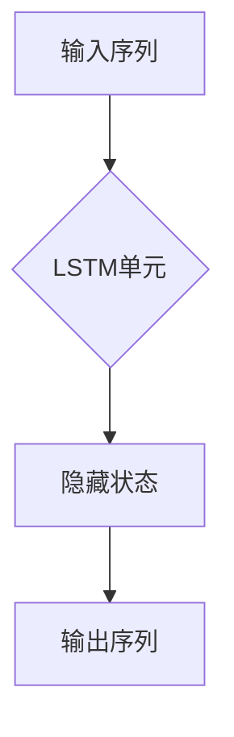

##### 2.1.3 深度学习优化算法

深度学习模型的优化过程通常涉及梯度下降算法和其变种，如随机梯度下降（SGD）、Adam 算法等。优化算法的目标是找到模型参数的最优值，以最小化损失函数。

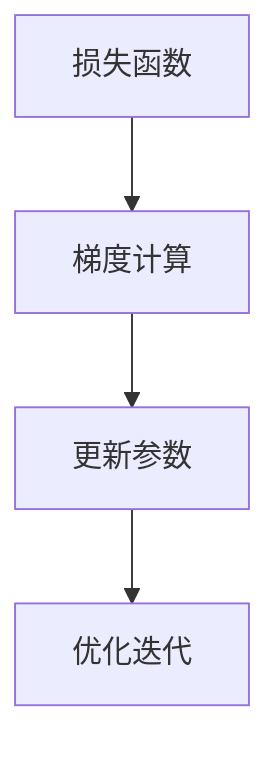

#### 2.2 自然语言处理技术概览

自然语言处理（NLP）是 AI 大模型的重要组成部分，旨在使计算机理解和处理自然语言。NLP 技术在文本分析、语义理解、语言生成等方面有着广泛的应用。

##### 2.2.1 词嵌入技术

词嵌入是将词汇映射到高维向量空间的技术，以便计算机能够更好地处理和计算词汇之间的关系。常见的词嵌入技术包括 Word2Vec、GloVe 等。

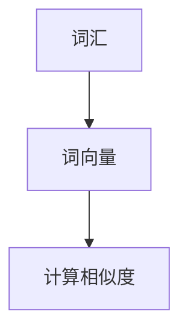

##### 2.2.2 序列模型与注意力机制

序列模型是 NLP 中的重要工具，用于处理文本序列数据。常见的序列模型包括 RNN、LSTM、Transformer 等。注意力机制能够使模型更好地关注序列中的重要信息。

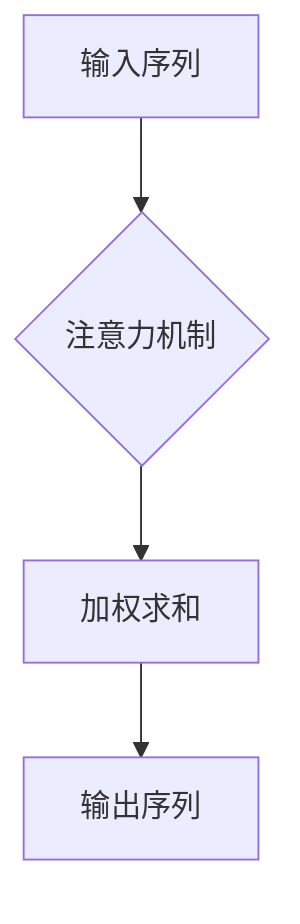

##### 2.2.3 转换器架构详解

转换器（Transformer）是近年来 NLP 领域的重要突破，其核心思想是使用自注意力机制进行序列到序列的转换。转换器架构在机器翻译、文本生成等领域取得了显著的成果。

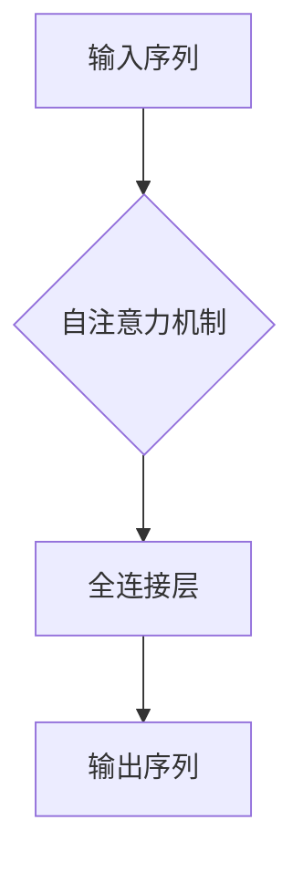

#### 2.3 大规模预训练模型原理

大规模预训练模型是 AI 大模型技术的重要发展方向，通过在大规模数据集上预训练，模型能够获得强大的通用表示能力，然后在特定任务上进行微调，实现高性能的模型效果。

##### 2.3.1 预训练的概念与意义

预训练是指在大规模数据集上对模型进行初始训练，使其获得对自然语言、图像等数据的通用理解能力。预训练的意义在于，通过预训练，模型能够更高效地学习特定任务，从而提高任务表现。

##### 2.3.2 自监督学习方法

自监督学习方法是一种在大规模数据集上进行预训练的方法，其核心思想是利用未标记的数据进行训练。常见的自监督学习方法包括 masked language modeling、retrieval-augmented generation 等。

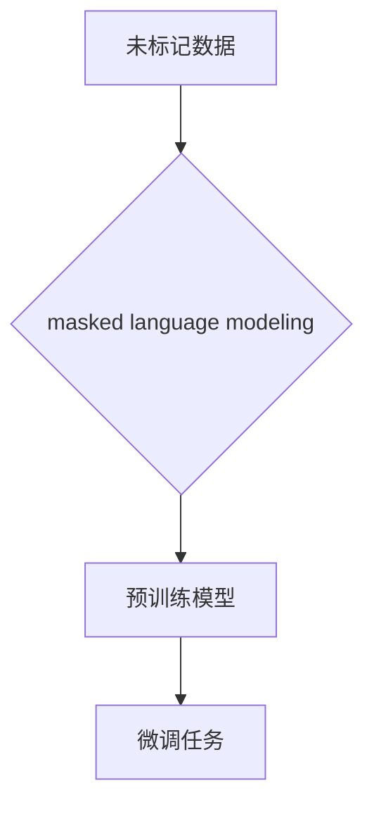

##### 2.3.3 迁移学习与微调技术

迁移学习是指将预训练模型在不同任务上进行微调，以适应特定任务。微调技术能够使模型在特定任务上快速获得高性能，减少训练数据的需求。

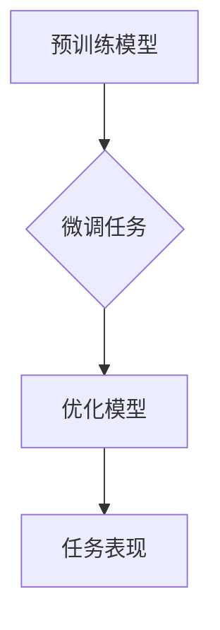

总之，AI 大模型技术基础包括深度学习、自然语言处理和大规模预训练模型等。这些技术为 AI 大模型在电子商务中的应用提供了强大的支持，为其在搜索推荐系统等领域的创新提供了可能。

### 第2章: AI 大模型技术基础

在了解了电子商务发展的背景和 AI 大模型的重要性后，我们接下来将深入探讨 AI 大模型的技术基础。这些技术基础包括深度学习、自然语言处理和大规模预训练模型，是构建 AI 大模型的核心。我们将逐一介绍这些技术的核心概念、原理和应用。

#### 2.1 深度学习与神经网络基础

##### 2.1.1 神经网络的基本结构

神经网络（Neural Networks，简称NN）是深度学习（Deep Learning，简称DL）的基础。一个简单的神经网络由三个主要部分组成：输入层（Input Layer）、隐藏层（Hidden Layer）和输出层（Output Layer）。输入层接收外部数据，隐藏层对数据进行处理和转换，输出层生成最终结果。

每个神经元（Neuron）都是一个简单的计算单元，它通过输入权重（weights）和偏置（bias）计算激活值（activation），然后通过激活函数（activation function）输出结果。常见的激活函数有 Sigmoid、ReLU 和 Tanh 等。

一个典型的神经网络结构可以用 Mermaid 图表示：

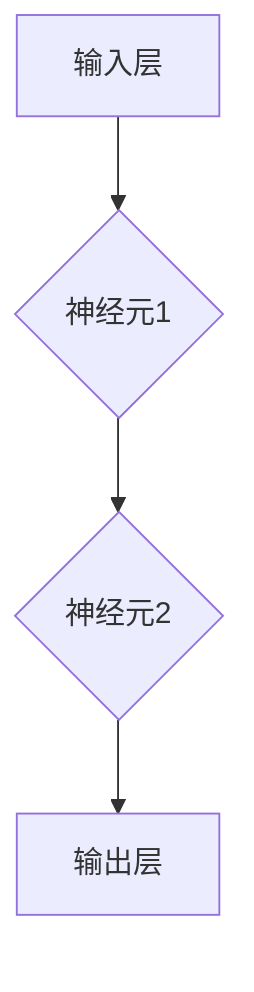

其中，每个神经元都与前一层中的每个神经元相连，并通过权重和偏置传递信号。每个神经元的输出通过激活函数处理后，传递到下一层。

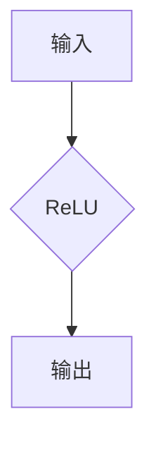

##### 2.1.2 常见的深度学习架构

深度学习架构种类繁多，常见的有卷积神经网络（Convolutional Neural Networks，简称CNN）、循环神经网络（Recurrent Neural Networks，简称RNN）和转换器架构（Transformer）等。

1. **卷积神经网络（CNN）**

CNN 主要用于图像处理和计算机视觉任务。其核心思想是通过卷积层（Convolutional Layer）和池化层（Pooling Layer）提取图像特征。

卷积层通过卷积操作提取图像中的局部特征，而池化层用于降维和减少过拟合。

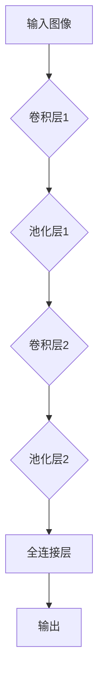

2. **循环神经网络（RNN）**

RNN 主要用于处理序列数据，如时间序列分析、语音识别和机器翻译。其特点是能够记忆序列中的信息。

RNN 的基本结构包括输入层、隐藏层和输出层，其中隐藏层连接前后两个时间步的神经元，实现信息的记忆。


3. **转换器架构（Transformer）**

Transformer 是近年来在自然语言处理领域取得突破性进展的架构，其核心思想是使用自注意力机制（Self-Attention Mechanism）进行序列到序列的转换。

自注意力机制允许模型在序列处理过程中，自动关注序列中的重要信息。

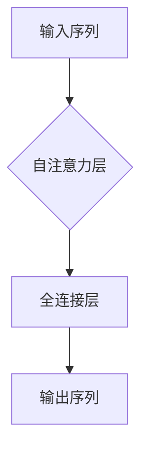

##### 2.1.3 深度学习优化算法

深度学习模型的训练过程通常涉及优化算法，以最小化损失函数（Loss Function）并找到模型参数的最优值。常见的优化算法包括随机梯度下降（Stochastic Gradient Descent，简称SGD）和 Adam 算法。

1. **随机梯度下降（SGD）**

SGD 是一种基于梯度的优化算法，其核心思想是通过随机选择一部分训练样本来更新模型参数。

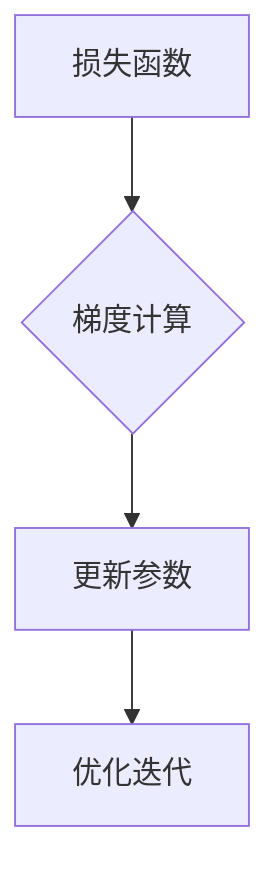

2. **Adam 算法**

Adam 是一种结合了 SGD 和动量（Momentum）优化的优化算法，其计算过程更加稳定，适用于大规模深度学习模型。

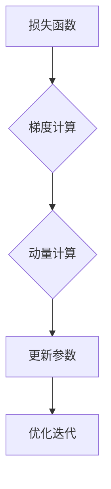

#### 2.2 自然语言处理技术概览

自然语言处理（NLP）是深度学习的重要应用领域，旨在使计算机理解和处理自然语言。NLP 技术包括文本预处理、词嵌入、序列模型和注意力机制等。

##### 2.2.1 词嵌入技术

词嵌入（Word Embedding）是将词汇映射到高维向量空间的技术，以便计算机能够更好地处理和计算词汇之间的关系。常见的词嵌入技术包括 Word2Vec、GloVe 等。

1. **Word2Vec**

Word2Vec 是一种基于神经网络的词嵌入技术，通过训练神经网络来预测词与词之间的上下文关系。

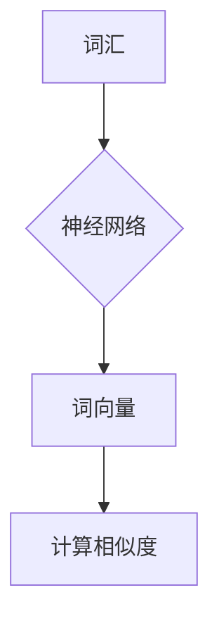

2. **GloVe**

GloVe 是一种基于全局上下文的词嵌入技术，通过计算词与词之间的共现关系来生成词向量。

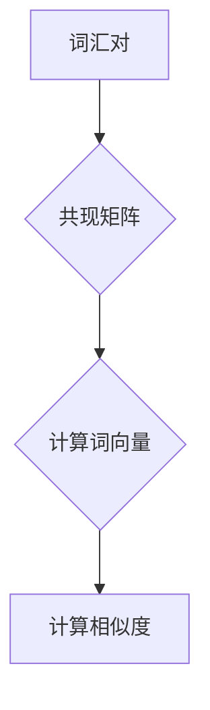

##### 2.2.2 序列模型与注意力机制

序列模型（Sequence Model）是 NLP 中用于处理序列数据的模型，如 RNN、LSTM 和 Transformer 等。注意力机制（Attention Mechanism）是一种提高序列模型性能的技术，能够使模型在处理序列时自动关注重要信息。

1. **RNN 与 LSTM**

RNN 是一种用于处理序列数据的模型，但存在梯度消失和梯度爆炸等问题。LSTM 是 RNN 的一种改进，通过引入门控机制（Gate Mechanism）来解决这些问题。

```mermaid
graph TD
A[输入序列] --> B{LSTM单元}
B --> C[隐藏状态]
C --> D[输出序列]
```

2. **Transformer**

Transformer 是一种基于自注意力机制的序列模型，通过多头自注意力（Multi-Head Self-Attention）和全连接层（Feed-Forward Layer）处理序列数据。

```mermaid
graph TD
A[输入序列] --> B{自注意力层}
B --> C{全连接层}
C --> D[输出序列]
```

##### 2.2.3 转换器架构详解

转换器（Transformer）是一种突破性的 NLP 模型，其核心思想是使用自注意力机制进行序列到序列的转换。转换器由编码器（Encoder）和解码器（Decoder）组成，分别处理输入序列和输出序列。

```mermaid
graph TD
A[输入序列] --> B{编码器}
B --> C{解码器}
C --> D[输出序列]
```

编码器通过多层自注意力机制和全连接层处理输入序列，生成编码特征。解码器在解码过程中使用自注意力和交叉注意力，将编码特征与当前解码输出相结合，生成最终输出。

```mermaid
graph TD
A[编码器] --> B{自注意力层}
B --> C{交叉注意力层}
C --> D{全连接层}
D --> E[输出序列]
```

#### 2.3 大规模预训练模型原理

大规模预训练模型（Large-scale Pre-trained Model）是近年来 NLP 和计算机视觉领域的重要发展方向。通过在大规模数据集上预训练，模型能够获得强大的通用表示能力，然后在特定任务上进行微调（Fine-tuning），实现高性能的模型效果。

##### 2.3.1 预训练的概念与意义

预训练是指在大规模数据集上对模型进行初始训练，使其获得对自然语言、图像等数据的通用理解能力。预训练的意义在于：

1. **提升模型性能**：预训练使模型在特定任务上获得更好的表现，减少对大量标注数据的依赖。
2. **降低训练成本**：预训练模型可以利用未标记的数据进行训练，减少标注数据的需求和成本。
3. **提高泛化能力**：预训练模型通过在大规模数据集上学习，能够更好地适应不同的任务和数据分布。

##### 2.3.2 自监督学习方法

自监督学习方法（Self-supervised Learning）是一种在大规模数据集上进行预训练的方法，其核心思想是利用未标记的数据进行训练。自监督学习方法可以分为两类：无监督预训练（Unsupervised Pre-training）和半监督预训练（Semi-supervised Pre-training）。

1. **无监督预训练**

无监督预训练方法通过将未标记的数据转换为监督信号进行训练。常见的无监督预训练任务包括：

- **掩码语言模型（Masked Language Modeling，简称MLM）**：随机掩码输入序列中的部分词，然后训练模型预测这些掩码词。
  
  ```mermaid
  graph TD
  A[未标记文本] --> B{掩码词}
  B --> C{预测掩码词}
  ```

- **图像生成对抗网络（Generative Adversarial Networks，简称GAN）**：通过生成器和判别器的对抗训练，生成逼真的图像。

  ```mermaid
  graph TD
  A[真实图像] --> B{判别器}
  B --> C{生成器}
  C --> D[对抗训练]
  ```

2. **半监督预训练**

半监督预训练方法结合未标记数据和少量标记数据进行训练。常见的半监督预训练任务包括：

- **数据增强（Data Augmentation）**：通过对标记数据进行变换和扩展，增加模型的泛化能力。
- **伪标签（Pseudo Labeling）**：使用未标记数据生成伪标签，然后与真实标签进行对比，优化模型。

##### 2.3.3 迁移学习与微调技术

迁移学习（Transfer Learning）是指将预训练模型在不同任务上进行微调，以适应特定任务。微调技术能够使模型在特定任务上快速获得高性能，减少训练数据的需求。

微调过程通常包括以下几个步骤：

1. **加载预训练模型**：从预训练模型中加载已经训练好的权重。
2. **冻结部分层**：冻结部分层的权重，不参与微调过程，以保留预训练模型的通用特征。
3. **微调剩余层**：对剩余层的权重进行训练，以适应特定任务。
4. **评估与优化**：通过验证集和测试集评估模型性能，并进行进一步的优化。

```mermaid
graph TD
A[预训练模型] --> B{微调层}
B --> C{评估与优化}
C --> D[最终模型]
```

通过上述对深度学习、自然语言处理和大规模预训练模型的介绍，我们可以看到，这些技术为 AI 大模型的发展奠定了坚实的基础。在接下来的章节中，我们将探讨 AI 大模型在电子商务搜索推荐系统中的应用，展示这些技术在实践中的具体应用和效果。

### 第3章: 搜索推荐系统的基本原理

搜索推荐系统是电子商务中至关重要的一环，它能够提高用户体验、增加用户粘性，并最终提升电商平台的业务收益。本章节将深入探讨搜索推荐系统的基本原理，包括其定义、分类、架构设计以及面临的主要技术挑战。

#### 3.1 搜索推荐系统的定义与分类

**搜索推荐系统的定义**

搜索推荐系统是一种利用算法和机器学习技术，根据用户的兴趣、行为和需求，向用户推荐相关商品、服务和内容的系统。其主要目标是提高用户的满意度和转化率，从而增加平台的销售额和用户留存率。

**搜索推荐系统的分类**

搜索推荐系统可以分为两大类：基于内容的推荐（Content-based Recommendation）和基于协同过滤的推荐（Collaborative Filtering）。

1. **基于内容的推荐**

基于内容的推荐系统主要通过分析用户的历史行为、兴趣爱好和购买记录，将用户感兴趣的商品、服务或内容进行推荐。其主要优势是能够提供个性化的推荐，减少用户在搜索和浏览过程中的时间和精力成本。

2. **基于协同过滤的推荐**

基于协同过滤的推荐系统通过分析用户之间的相似性，发现用户的共同兴趣，并将这些兴趣相似的商品、服务或内容推荐给用户。协同过滤系统分为两类：基于用户的协同过滤（User-based Collaborative Filtering）和基于模型的协同过滤（Model-based Collaborative Filtering）。

- **基于用户的协同过滤**：通过计算用户之间的相似性，找到与目标用户兴趣相似的邻居用户，然后推荐邻居用户喜欢的商品。

- **基于模型的协同过滤**：通过训练协同过滤模型，预测用户对未购买商品的评分或偏好，然后根据预测结果推荐商品。

#### 3.2 搜索推荐系统的架构设计

搜索推荐系统通常由以下几个关键模块组成：

1. **用户画像模块**

用户画像模块负责构建用户的综合画像，包括用户的年龄、性别、地理位置、购买历史、浏览行为等。通过这些画像信息，系统能够更好地理解用户的需求和行为模式，从而提供个性化的推荐。

2. **内容模块**

内容模块负责管理商品、服务和其他内容的信息，包括商品的属性、分类、标签等。通过分析这些内容信息，系统能够发现商品之间的相关性，并生成推荐列表。

3. **推荐算法模块**

推荐算法模块是搜索推荐系统的核心，它根据用户画像和内容信息，生成个性化的推荐列表。常见的推荐算法包括基于内容的推荐算法、基于协同过滤的推荐算法以及混合推荐算法。

4. **数据存储与处理模块**

数据存储与处理模块负责存储用户行为数据和商品信息，并对这些数据进行处理和分析。常用的数据存储技术包括关系数据库、分布式数据库和图数据库等。

5. **推荐结果评估模块**

推荐结果评估模块负责评估推荐系统的效果，包括推荐覆盖率、推荐精度、推荐多样性等指标。通过持续优化推荐算法和系统架构，可以提高推荐系统的整体性能。

**搜索推荐系统的架构设计**

一个典型的搜索推荐系统架构可以用下图表示：

```mermaid
graph TD
A[用户画像模块] --> B[内容模块]
B --> C[推荐算法模块]
C --> D[数据存储与处理模块]
D --> E[推荐结果评估模块]
```

#### 3.3 搜索推荐系统的主要技术挑战

尽管搜索推荐系统在电子商务中具有广泛的应用前景，但其在实际应用过程中仍然面临许多技术挑战：

1. **数据质量问题**

用户行为数据和商品信息的数据质量直接影响推荐系统的效果。数据中的噪声、缺失值和不一致性等问题，会对推荐结果的准确性产生负面影响。因此，需要采用数据清洗和预处理技术，提高数据质量。

2. **实时性挑战**

电子商务平台的用户行为和数据量通常非常庞大，要求推荐系统能够实时响应用户需求，提供个性化的推荐。然而，实时数据的处理和分析对系统的计算能力和响应速度提出了高要求。

3. **冷启动问题**

冷启动问题是指新用户或新商品在系统中的数据量较少，难以基于历史数据进行有效的推荐。为了解决冷启动问题，可以采用基于内容的推荐或通过用户交互逐步构建用户画像。

4. **推荐多样性**

用户希望从推荐列表中获得多样化的商品或内容，而不是一系列重复的推荐。因此，如何平衡推荐系统的个性化和多样性，是推荐系统设计中的重要挑战。

5. **隐私保护**

在推荐系统的应用过程中，用户隐私保护是一个重要的问题。需要采用数据加密、隐私保护算法等技术，确保用户数据的安全和隐私。

通过深入探讨搜索推荐系统的基本原理和架构设计，我们可以更好地理解其在电子商务中的应用价值和技术挑战。在接下来的章节中，我们将进一步探讨 AI 大模型在搜索推荐系统中的应用，展示其在文本分析、协同过滤和内容推荐等方面的实际应用效果。

### 第4章: AI 大模型在搜索推荐系统中的应用

在了解搜索推荐系统的基本原理后，我们将探讨 AI 大模型在搜索推荐系统中的具体应用。AI 大模型在搜索推荐系统中发挥着至关重要的作用，通过其强大的文本分析和协同过滤能力，能够显著提升推荐系统的性能和用户体验。

#### 4.1 大模型在文本分析中的应用

AI 大模型在文本分析中的应用主要体现在文本预处理、文本分类与情感分析、文本生成与摘要等方面。这些技术不仅能够提高推荐系统的准确性，还能够增强用户体验。

##### 4.1.1 文本预处理与清洗

文本预处理是搜索推荐系统中的关键步骤，其目的是将原始文本数据转换为适合模型处理的形式。AI 大模型在这方面具有显著优势，能够通过预训练模型对文本进行自动清洗和预处理。

- **文本清洗**：AI 大模型能够自动去除文本中的噪声，如停用词、标点符号等，提高数据质量。
- **文本标准化**：通过统一文本格式，如将大写转换为小写、去除特殊字符等，确保数据的一致性。
- **文本分词**：AI 大模型可以利用预训练的词嵌入模型，如 BERT、GPT 等，进行高效的文本分词。

##### 4.1.2 文本分类与情感分析

文本分类和情感分析是 AI 大模型在文本分析中的重要应用，它们能够帮助推荐系统更好地理解用户的文本输入和反馈。

- **文本分类**：通过预训练的文本分类模型，如 TextCNN、BERT 等，可以对用户评论、反馈进行分类，识别用户对商品的正面或负面情感。
- **情感分析**：通过情感分析模型，AI 大模型能够自动识别文本中的情感倾向，如快乐、悲伤、愤怒等，帮助推荐系统更准确地理解用户情感。

##### 4.1.3 文本生成与摘要

文本生成和摘要技术能够提高推荐系统的多样性和用户体验。AI 大模型在这方面具有显著优势，能够通过预训练模型生成高质量的文本摘要和创意内容。

- **文本生成**：通过生成模型，如 GPT-3、T5 等，AI 大模型能够根据用户需求生成个性化的商品描述、推荐理由等。
- **文本摘要**：通过摘要模型，如 BART、Summarizer 等，AI 大模型能够自动生成文本的摘要，提高用户在浏览推荐列表时的效率。

#### 4.2 大模型在协同过滤中的应用

AI 大模型在协同过滤中的应用主要体现在基于内容的协同过滤和基于模型的协同过滤算法中。这些应用能够显著提升推荐系统的个性化和多样性。

##### 4.2.1 协同过滤算法概述

协同过滤算法是推荐系统的核心组成部分，其基本思想是通过分析用户之间的相似性或商品之间的相似性，为用户推荐相关商品。

- **基于用户的协同过滤（User-based Collaborative Filtering）**：通过计算用户之间的相似性，找到与目标用户兴趣相似的邻居用户，然后推荐邻居用户喜欢的商品。
- **基于模型的协同过滤（Model-based Collaborative Filtering）**：通过训练协同过滤模型，预测用户对未购买商品的评分或偏好，然后根据预测结果推荐商品。

##### 4.2.2 基于大模型的协同过滤算法

基于大模型的协同过滤算法利用预训练的深度学习模型，如 BERT、GPT 等，对用户行为和商品属性进行建模，从而提高推荐系统的性能。

- **用户嵌入与商品嵌入**：通过预训练模型，将用户和商品的文本描述转换为高维向量表示，这些向量表示了用户和商品的特征。
- **相似性计算**：利用向量空间中的相似性度量，如余弦相似性、欧几里得距离等，计算用户和商品之间的相似性。
- **预测评分**：通过训练协同过滤模型，如基于矩阵分解的模型（如 SVD++），预测用户对未购买商品的评分，然后根据预测结果推荐商品。

##### 4.2.3 大模型在协同过滤中的优势与挑战

大模型在协同过滤中的应用具有显著优势，但也面临一些挑战。

**优势：**

- **提升推荐精度**：大模型能够捕捉用户和商品之间复杂的交互关系，提高推荐系统的精度。
- **增强个性化**：大模型能够根据用户的个性化需求提供更加精准的推荐，增强用户的满意度。
- **提高多样性**：大模型能够发现用户之间的潜在相似性，提高推荐列表的多样性。

**挑战：**

- **计算资源消耗**：大模型通常需要大量的计算资源和存储空间，对硬件设施的要求较高。
- **数据质量依赖**：大模型的性能很大程度上依赖于数据质量，数据中的噪声和缺失值会对模型效果产生负面影响。
- **实时性挑战**：大模型的训练和预测过程通常需要较长时间，难以满足实时推荐的需求。

#### 4.3 大模型在内容推荐中的应用

AI 大模型在内容推荐中的应用主要体现在内容生成和个性化内容推荐方面。这些应用能够显著提升推荐系统的多样性和用户体验。

##### 4.3.1 内容推荐算法概述

内容推荐算法旨在为用户推荐与用户兴趣相关的商品、服务或内容。常见的算法包括基于内容的推荐、基于协同过滤的推荐和混合推荐算法。

- **基于内容的推荐**：通过分析商品的属性和用户的历史行为，找到与用户兴趣相关的商品进行推荐。
- **基于协同过滤的推荐**：通过分析用户之间的相似性，找到与用户兴趣相似的邻居用户，然后推荐邻居用户喜欢的商品。
- **混合推荐**：结合基于内容和基于协同过滤的推荐方法，提高推荐系统的性能。

##### 4.3.2 基于大模型的内容推荐算法

基于大模型的内容推荐算法利用预训练的深度学习模型，如 BERT、GPT 等，对商品属性和用户行为进行建模，从而提高推荐系统的性能。

- **商品属性嵌入**：通过预训练模型，将商品的文本描述转换为高维向量表示，这些向量表示了商品的特征。
- **用户行为嵌入**：通过预训练模型，将用户的浏览、购买等行为转换为高维向量表示，这些向量表示了用户的行为特征。
- **相似性计算与推荐**：利用向量空间中的相似性度量，计算商品和用户之间的相似性，然后根据相似性为用户推荐相关商品。

##### 4.3.3 大模型在内容推荐中的优势与挑战

大模型在内容推荐中的应用具有显著优势，但也面临一些挑战。

**优势：**

- **提升推荐精度**：大模型能够捕捉用户和商品之间复杂的交互关系，提高推荐系统的精度。
- **增强个性化**：大模型能够根据用户的个性化需求提供更加精准的推荐，增强用户的满意度。
- **提高多样性**：大模型能够发现用户之间的潜在相似性，提高推荐列表的多样性。

**挑战：**

- **计算资源消耗**：大模型通常需要大量的计算资源和存储空间，对硬件设施的要求较高。
- **数据质量依赖**：大模型的性能很大程度上依赖于数据质量，数据中的噪声和缺失值会对模型效果产生负面影响。
- **实时性挑战**：大模型的训练和预测过程通常需要较长时间，难以满足实时推荐的需求。

总之，AI 大模型在搜索推荐系统中的应用具有广阔的前景，通过文本分析、协同过滤和内容推荐等技术的结合，能够显著提升推荐系统的性能和用户体验。然而，大模型的应用也面临一些挑战，如计算资源消耗、数据质量和实时性等，需要通过不断的技术创新和优化来解决。

### 4.4 大模型在电子商务搜索推荐系统中的实践

在实际应用中，AI 大模型在电子商务搜索推荐系统中的应用已经取得了显著的成果。以下我们将通过两个案例研究：淘宝和京东，探讨 AI 大模型在电子商务搜索推荐系统中的具体实践。

#### 案例研究1：淘宝搜索推荐系统

淘宝作为中国最大的电子商务平台，其搜索推荐系统一直在电商领域处于领先地位。淘宝的搜索推荐系统采用了多种 AI 大模型技术，以提高推荐精度和用户体验。

**1. 淘宝搜索推荐系统的架构**

淘宝搜索推荐系统的架构主要包括以下几个关键模块：

- **用户画像模块**：通过分析用户的浏览、购买、收藏等行为，构建用户的个性化画像，包括用户的年龄、性别、地理位置、兴趣爱好等。
- **商品属性模块**：对商品进行详细的属性标注，包括商品的品牌、类别、价格、评价等。
- **推荐算法模块**：采用基于内容的协同过滤和基于用户的协同过滤相结合的方法，为用户推荐相关商品。
- **实时计算模块**：利用实时计算技术，如流计算和分布式计算，实现高效的用户行为分析和推荐生成。

**2. 淘宝搜索推荐系统的核心技术**

- **用户画像构建**：通过深度学习模型，如 BERT、GPT 等，将用户的文本描述转换为高维向量表示，构建用户画像。
- **商品属性嵌入**：利用预训练的嵌入模型，如 Word2Vec、GloVe 等，将商品的文本描述转换为高维向量表示，构建商品属性向量。
- **协同过滤算法**：采用基于内容的协同过滤算法和基于用户的协同过滤算法，结合用户画像和商品属性向量，生成个性化的推荐列表。
- **实时计算与优化**：利用流计算和分布式计算技术，实现实时用户行为分析和推荐生成，并通过在线学习技术，不断优化推荐算法。

**3. 淘宝搜索推荐系统的优化实践**

- **数据质量提升**：通过数据清洗和预处理技术，提高用户行为数据和商品属性数据的质量，减少噪声和缺失值。
- **模型优化**：通过模型融合和迁移学习技术，提高推荐系统的性能和鲁棒性。
- **用户体验优化**：通过实时计算和个性化推荐，提升用户在搜索和浏览过程中的体验，提高用户满意度和转化率。

#### 案例研究2：京东购物推荐系统

京东作为中国第二大电子商务平台，其购物推荐系统也在不断优化和创新。京东的购物推荐系统同样采用了多种 AI 大模型技术，以提供高质量的推荐服务。

**1. 京东购物推荐系统的架构**

京东购物推荐系统的架构主要包括以下几个关键模块：

- **用户画像模块**：通过分析用户的浏览、购买、评价等行为，构建用户的个性化画像，包括用户的购买习惯、消费能力、兴趣爱好等。
- **商品属性模块**：对商品进行详细的属性标注，包括商品的品牌、类别、价格、评价等。
- **推荐算法模块**：采用基于内容的协同过滤和基于模型的协同过滤相结合的方法，为用户推荐相关商品。
- **实时计算模块**：利用实时计算技术，如流计算和分布式计算，实现高效的用户行为分析和推荐生成。

**2. 京东购物推荐系统的核心技术**

- **用户画像构建**：通过深度学习模型，如 BERT、GPT 等，将用户的文本描述转换为高维向量表示，构建用户画像。
- **商品属性嵌入**：利用预训练的嵌入模型，如 Word2Vec、GloVe 等，将商品的文本描述转换为高维向量表示，构建商品属性向量。
- **协同过滤算法**：采用基于内容的协同过滤算法和基于模型的协同过滤算法，结合用户画像和商品属性向量，生成个性化的推荐列表。
- **实时计算与优化**：利用流计算和分布式计算技术，实现实时用户行为分析和推荐生成，并通过在线学习技术，不断优化推荐算法。

**3. 京东购物推荐系统的优化实践**

- **数据质量提升**：通过数据清洗和预处理技术，提高用户行为数据和商品属性数据的质量，减少噪声和缺失值。
- **模型优化**：通过模型融合和迁移学习技术，提高推荐系统的性能和鲁棒性。
- **用户体验优化**：通过实时计算和个性化推荐，提升用户在搜索和浏览过程中的体验，提高用户满意度和转化率。

通过上述两个案例研究，我们可以看到 AI 大模型在电子商务搜索推荐系统中的应用已经取得了显著的成果。淘宝和京东通过利用深度学习、自然语言处理和大规模预训练模型等技术，实现了高效的个性化推荐和用户体验优化，为电子商务行业带来了深远的影响。随着技术的不断发展和应用的深入，AI 大模型在电子商务搜索推荐系统中的应用前景将更加广阔。

### 第5章: AI 大模型在电子商务中的未来应用前景

随着 AI 大模型的不断发展和成熟，其在电子商务中的应用前景也日益广阔。未来，AI 大模型将在多个领域展现其强大的变革能力，推动电子商务行业迈向新的高度。

#### 6.1 AI 大模型在搜索推荐系统中的发展趋势

在未来，AI 大模型在搜索推荐系统中的应用将呈现以下几个发展趋势：

1. **更精准的个性化推荐**：随着 AI 大模型的不断优化，其能够更精准地捕捉用户的个性化需求，提供高度个性化的推荐服务。通过深度学习、自然语言处理和大规模预训练模型，推荐系统能够更好地理解用户的兴趣和行为，从而实现更加精准的个性化推荐。

2. **实时推荐技术的突破**：未来的推荐系统将更加注重实时性，以满足用户实时变化的兴趣和需求。通过分布式计算、流计算和边缘计算等技术的应用，推荐系统能够在毫秒级内响应用户请求，提供实时推荐。

3. **多模态推荐系统的普及**：未来的推荐系统将不仅仅依赖于文本数据，还将融合图像、音频、视频等多模态数据。通过多模态数据融合和跨模态交互，推荐系统将能够提供更加全面和丰富的推荐服务。

4. **推荐系统的智能优化**：AI 大模型将实现推荐系统的自动优化，通过在线学习和自适应调整，推荐系统将能够不断适应用户需求的变化，提高推荐效果。

#### 6.2 AI 大模型在电子商务中其他领域的应用

除了搜索推荐系统，AI 大模型在电子商务的多个领域也展现出了广阔的应用前景：

1. **用户画像与精准营销**：AI 大模型能够通过对用户数据的深度挖掘和分析，构建详细的用户画像，为电商平台提供精准的营销策略。通过个性化广告投放、定制化促销活动等手段，电商平台能够更好地吸引和留住用户。

2. **供应链管理优化**：AI 大模型能够优化电子商务平台的供应链管理，提高供应链的效率和灵活性。通过预测市场需求、优化库存水平和降低物流成本，AI 大模型能够帮助电商平台实现供应链的智能化管理。

3. **风险控制与安全防护**：AI 大模型在反欺诈、信用评估和网络安全等方面也有广泛应用。通过深度学习和自然语言处理技术，AI 大模型能够识别异常行为、预测信用风险，提高电商平台的安全性和稳定性。

4. **智能客服与用户体验提升**：AI 大模型能够提供智能客服服务，通过自然语言处理和语音识别技术，AI 大模型能够自动解答用户疑问、提供个性化服务，提升用户体验。

#### 6.3 AI 大模型在电子商务中的挑战与解决方案

尽管 AI 大模型在电子商务中具有巨大的应用潜力，但其在实际应用过程中也面临着一些挑战：

1. **数据质量与隐私保护**：电子商务平台通常需要处理海量用户数据，数据质量直接影响 AI 大模型的效果。同时，用户隐私保护也是一大挑战。解决方案包括数据清洗和预处理技术、隐私保护算法和数据匿名化技术。

2. **计算资源消耗**：AI 大模型通常需要大量的计算资源和存储空间，对硬件设施的要求较高。解决方案包括分布式计算、云计算和边缘计算等技术的应用，以优化计算资源的利用。

3. **模型解释性与透明度**：AI 大模型在决策过程中的透明度和解释性较低，这对电商平台和用户都是一大挑战。解决方案包括开发可解释的 AI 模型、引入可视化工具和透明度评估机制，提高模型的解释性和透明度。

4. **实时性与稳定性**：AI 大模型在实时性和稳定性方面也存在一定的挑战，需要通过分布式计算、流计算和边缘计算等技术，提高系统的实时性和稳定性。

总之，随着 AI 大模型的不断发展和成熟，其在电子商务中的应用前景将更加广阔。通过应对当前的挑战，未来的 AI 大模型将为电子商务带来更多的创新和变革，推动行业迈向新的高度。

### 7.1 本书的主要结论

通过本文的深入探讨，我们得出了以下主要结论：

1. **AI 大模型在电子商务中的重要性**：AI 大模型已经成为电子商务的核心驱动力，其在搜索推荐系统中的应用能够显著提升个性化推荐精度和用户体验。

2. **技术基础的重要性**：深度学习、自然语言处理和大规模预训练模型是构建 AI 大模型的核心技术。理解这些技术的原理和架构，对于深入应用 AI 大模型具有重要意义。

3. **搜索推荐系统的关键作用**：搜索推荐系统是电子商务中的关键组成部分，通过文本分析、协同过滤和内容推荐等技术的结合，AI 大模型能够提供高质量的个性化推荐服务。

4. **实践成果的显著性**：通过淘宝和京东等电商平台的案例研究，AI 大模型在电子商务搜索推荐系统中的实践取得了显著成果，为电商行业带来了深远的影响。

5. **未来应用的广阔前景**：随着 AI 大模型的不断优化和发展，其在电子商务中的应用前景将更加广阔。未来，AI 大模型将在个性化推荐、供应链管理、风险控制等多个领域发挥重要作用。

### 7.2 对未来研究的建议

为了进一步推动 AI 大模型在电子商务中的应用，本文提出以下未来研究建议：

1. **数据质量和隐私保护**：进一步研究如何优化数据质量，提高数据清洗和预处理技术的效果。同时，加强对用户隐私保护的研究，开发有效的隐私保护算法和数据匿名化技术。

2. **实时性与稳定性**：探索分布式计算、流计算和边缘计算等技术在 AI 大模型应用中的优化策略，以提高系统的实时性和稳定性。

3. **模型解释性与透明度**：深入研究如何提高 AI 大模型的解释性和透明度，开发可解释的 AI 模型和相关可视化工具，增强模型的透明度和用户信任。

4. **多模态数据融合**：探索多模态数据融合技术在电子商务中的应用，结合文本、图像、音频等多模态数据，提供更加全面和丰富的推荐服务。

5. **跨领域应用探索**：进一步研究 AI 大模型在电子商务其他领域的应用，如用户画像与精准营销、供应链管理优化、智能客服等，推动 AI 大模型在电子商务的全面应用。

### 7.3 对读者的寄语

感谢读者对本文的关注和阅读。希望本文能够为读者提供一个全面、系统的了解 AI 大模型在电子商务中的应用现状和发展方向的参考。在未来的学习和工作中，愿读者能够紧跟技术发展的步伐，不断探索和创新，为电子商务行业的发展贡献自己的力量。让我们共同期待 AI 大模型在电子商务中创造更加美好的未来！

### 附录 A: 常用工具与资源

#### A.1 AI 大模型开发工具与资源

1. **深度学习框架**

- **TensorFlow**：由 Google 开发的一款开源深度学习框架，广泛应用于各种深度学习任务。
  
  [官网链接](https://www.tensorflow.org/)

- **PyTorch**：由 Facebook 开发的一款开源深度学习框架，具有简洁的 API 和动态计算图，适合快速原型开发和实验。

  [官网链接](https://pytorch.org/)

2. **自然语言处理工具**

- **NLTK**：一款开源的 Python 自然语言处理库，提供了一系列文本处理和分类工具。
  
  [官网链接](https://www.nltk.org/)

- **spaCy**：一款强大的自然语言处理库，支持多种语言，提供详细的词汇和语法分析。

  [官网链接](https://spacy.io/)

3. **预训练模型库**

- **Hugging Face Transformers**：一个包含多种预训练模型和自然语言处理任务的 Python 库，方便开发者使用预训练模型进行微调和应用。

  [官网链接](https://huggingface.co/transformers/)

4. **云服务与平台**

- **Google Cloud AI**：Google 提供的云计算服务，包括深度学习和自然语言处理工具，适合大规模模型训练和应用。

  [官网链接](https://cloud.google.com/ai)

- **AWS AI**：Amazon Web Services 提供的云计算服务，包括深度学习和自然语言处理工具，支持多种机器学习和数据分析任务。

  [官网链接](https://aws.amazon.com/ai/)

#### A.2 搜索推荐系统相关论文与书籍推荐

1. **推荐系统相关论文**

- **"Item-based Collaborative Filtering Recommendation Algorithms"** by X. Yang and S. Li.

  [论文链接](https://ieeexplore.ieee.org/document/1437449)

- **"An Introduction to Collaborative Filtering"** by R. M. Bell and Y. Pensky.

  [论文链接](https://www.sciencedirect.com/science/article/abs/pii/S0090300507000623)

2. **深度学习与自然语言处理相关书籍**

- **"Deep Learning"** by Ian Goodfellow, Yoshua Bengio, and Aaron Courville.

  [书籍链接](https://www.deeplearningbook.org/)

- **"Natural Language Processing with Python"** by Steven Bird, Ewan Klein, and Edward Loper.

  [书籍链接](https://www.nltk.org/book/)

3. **搜索推荐系统相关书籍**

- **"Recommender Systems: The Textbook"** by GroupLens Research.

  [书籍链接](https://www.recommenders-book.org/)

- **"The Netflix Prize"** by John C. G. Meyer, Michael J. P. O'Malley, and John R. Howes.

  [书籍链接](https://www.netflixprize.com/)

#### A.3 电子商务领域重要数据库与数据集介绍

1. **MovieLens**：一个包含用户评分和电影信息的数据库，广泛用于推荐系统研究。

  [数据集链接](https://grouplens.org/datasets/movielens/)

2. **Amazon Reviews**：包含亚马逊用户评论的数据集，可用于情感分析、文本分类等研究。

  [数据集链接](https://www.kaggle.com/datasets/amazon-reviews-polarity)

3. **e-Commerce Product Reviews**：一个包含电子商务产品评论的数据集，可用于情感分析、文本生成等研究。

  [数据集链接](https://www.kaggle.com/datasets/ieee-fraud-detection)

通过以上工具、资源和数据集，读者可以更好地进行 AI 大模型在电子商务中的应用研究和实践。希望这些资源能为读者的学习和工作提供帮助。

