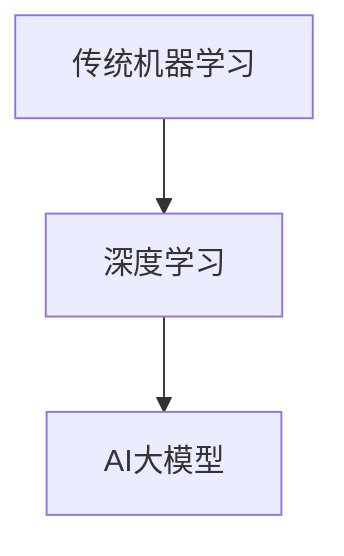
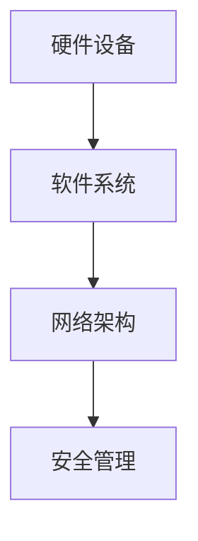
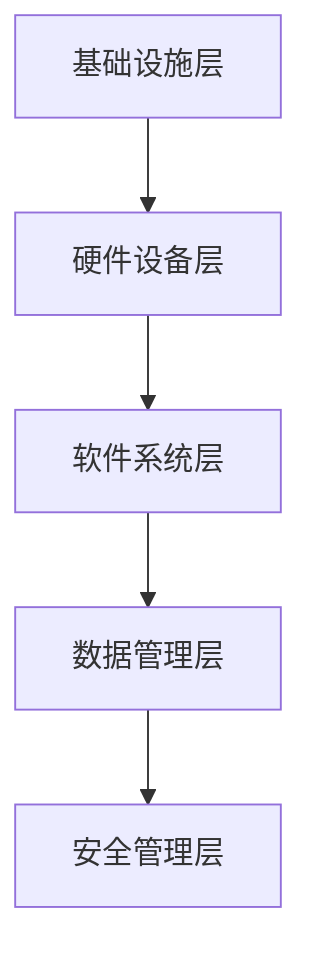
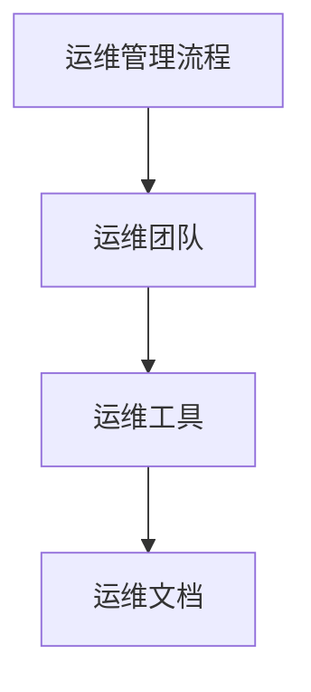
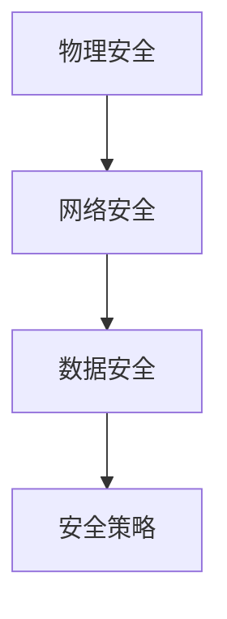

                 

### 第1章：AI大模型应用数据中心建设的背景与意义

#### 1.1 AI大模型应用数据中心建设的背景

##### 1.1.1 AI大模型的发展历程

人工智能（AI）作为一门研究、开发用于模拟、延伸和扩展人的智能的理论、方法、技术及应用系统的科学。近年来，随着深度学习、强化学习等技术的迅速发展，AI大模型（如GPT、BERT等）逐渐成为研究和应用的热点。AI大模型的发展历程可以分为以下几个阶段：

1. **传统机器学习时代（1980年代-2010年代初）**：在这一阶段，研究人员主要使用规则驱动的方法进行问题建模，如专家系统和决策树等。然而，这些方法在面对复杂问题时表现不佳。

2. **深度学习时代（2010年代初至今）**：随着计算能力的提升和数据量的增加，深度学习开始崭露头角。在这一阶段，神经网络结构得到了极大的改进，例如卷积神经网络（CNN）和递归神经网络（RNN）的出现，使得AI在图像识别、语音识别等领域取得了突破性进展。

3. **AI大模型时代（2010年代中后期至今）**：随着深度学习的进一步发展，AI大模型如GPT、BERT等逐渐成为研究焦点。这些模型具有庞大的参数规模和强大的表达能力，能够处理更复杂的任务。

 **Mermaid流程图**



##### 1.1.2 数据中心建设的重要性

数据中心是现代信息社会中不可或缺的基础设施，承担着存储、处理和分发大量数据的重要任务。随着AI大模型的应用日益广泛，数据中心的重要性更加凸显。以下是数据中心建设的重要性：

1. **存储和管理大量数据**：数据中心提供了强大的存储能力，能够存储和管理海量数据，为AI大模型训练提供了数据支持。

2. **提供计算资源**：数据中心提供了强大的计算能力，能够快速处理大量数据，加速AI大模型训练和推理过程。

3. **保障数据安全和可靠性**：数据中心通过多种安全措施确保数据的安全性和可靠性，为AI大模型应用提供了可靠的数据保障。

4. **支持业务连续性**：数据中心提供了高可用性服务，确保业务能够连续运行，减少因故障导致的数据丢失和业务中断。

##### 1.1.3 数据中心建设面临的挑战与机遇

数据中心建设面临着诸多挑战，同时也伴随着巨大的机遇：

1. **挑战**：

   - **资源消耗**：数据中心需要大量的电力、冷却资源等，导致高能耗问题。

   - **管理复杂性**：数据中心设备和系统的数量庞大，管理难度增加。

   - **安全性问题**：数据中心面临着网络攻击、数据泄露等安全威胁。

2. **机遇**：

   - **技术创新**：数据中心技术不断创新，如虚拟化、云计算、边缘计算等，为数据中心建设提供了更多可能性。

   - **商业模式变革**：数据中心建设与运营逐渐走向商业化和专业化，为企业和投资者提供了新的商业机会。

   - **市场需求**：随着AI大模型应用的普及，数据中心市场需求不断增长，为数据中心建设提供了广阔的市场空间。

**总结**：AI大模型应用数据中心建设具有重要的背景和意义，既面临着诸多挑战，也蕴含着巨大的机遇。理解这些背景和意义，有助于我们更好地规划和实施数据中心建设。

### 1.2 数据中心建设的重要性

#### 1.2.1 数据中心的基本架构

数据中心的基本架构通常包括以下几个方面：

1. **硬件设备**：包括服务器、存储设备、网络设备等。
2. **软件系统**：包括操作系统、数据库系统、监控与报警系统等。
3. **网络架构**：包括内部网络和外部网络连接。
4. **安全管理**：包括防火墙、入侵检测系统、加密技术等。

 **Mermaid流程图**



#### 1.2.2 数据中心在AI大模型应用中的角色

数据中心在AI大模型应用中扮演着至关重要的角色：

1. **数据存储与管理**：数据中心提供了强大的数据存储和管理能力，为AI大模型训练提供了数据支持。
2. **计算资源提供**：数据中心提供了强大的计算资源，能够快速处理大量数据，加速AI大模型训练和推理过程。
3. **性能优化与调度**：数据中心通过负载均衡和资源调度技术，优化AI大模型训练和推理的性能。
4. **安全保障**：数据中心通过多种安全措施确保数据的安全性和可靠性，为AI大模型应用提供可靠的数据保障。

**总结**：数据中心在AI大模型应用中具有不可替代的作用，其基本架构和角色对于数据中心建设和运营至关重要。

### 1.3 数据中心建设面临的挑战与机遇

#### 1.3.1 挑战

数据中心建设面临着诸多挑战，这些挑战需要我们认真应对：

1. **资源消耗**：

   - **电力消耗**：数据中心需要大量的电力来运行服务器、存储设备和网络设备等，导致高能耗问题。
   - **冷却资源**：数据中心需要充足的冷却资源来维持设备正常运行，否则可能导致设备过热损坏。

2. **管理复杂性**：

   - **设备管理**：数据中心设备和系统的数量庞大，管理难度增加。
   - **系统整合**：不同设备、系统和网络之间的整合与协调需要大量时间和精力。

3. **安全性问题**：

   - **网络攻击**：数据中心面临的网络攻击威胁不断，如DDoS攻击、数据泄露等。
   - **数据隐私**：在处理大量数据时，如何保护用户隐私和数据安全是一个重要挑战。

#### 1.3.2 机遇

数据中心建设同样蕴含着巨大的机遇：

1. **技术创新**：

   - **虚拟化技术**：虚拟化技术提高了资源利用率，降低了数据中心的建设和维护成本。
   - **云计算技术**：云计算提供了灵活的计算资源，为数据中心建设提供了更多可能性。

2. **商业模式变革**：

   - **服务化模式**：数据中心逐渐走向服务化模式，提供更多定制化服务。
   - **混合云模式**：混合云模式结合了公有云和私有云的优势，为数据中心建设提供了新的思路。

3. **市场需求**：

   - **AI大模型应用**：随着AI大模型应用的普及，对数据中心的需求不断增加。
   - **远程办公和边缘计算**：远程办公和边缘计算的发展，进一步推动了数据中心建设的需求。

**总结**：数据中心建设既面临挑战，也蕴含机遇。只有在充分认识到挑战的同时，把握机遇，才能实现数据中心建设的可持续发展。

### 第2章：数据中心运维与管理基础

#### 2.1 数据中心的基本架构

数据中心的基本架构是数据中心运维与管理的基石。一个典型的数据中心架构可以分为以下几个层次：

1. **基础设施层**：包括物理机房、电力系统、冷却系统、网络设备等。
2. **硬件设备层**：包括服务器、存储设备、网络设备等。
3. **软件系统层**：包括操作系统、数据库系统、监控与报警系统等。
4. **数据管理层**：包括数据存储、数据备份、数据恢复等。
5. **安全管理层**：包括防火墙、入侵检测系统、加密技术等。

 **Mermaid流程图**



#### 2.2 数据中心的运维管理体系

数据中心的运维管理体系是确保数据中心稳定运行的关键。一个完善的运维管理体系通常包括以下几个核心组成部分：

1. **运维管理流程**：包括运维计划、运维执行、运维监控和运维报告等。
2. **运维团队**：包括运维主管、运维工程师、网络工程师、存储工程师等。
3. **运维工具**：包括监控工具、自动化工具、配置管理工具等。
4. **运维文档**：包括运维手册、操作指南、故障处理手册等。

 **Mermaid流程图**



#### 2.3 数据中心的安全管理

数据中心的安全管理是确保数据中心稳定运行和信息安全的关键。数据中心的安全管理包括以下几个方面：

1. **物理安全**：包括机房门禁系统、视频监控、防火设施等。
2. **网络安全**：包括防火墙、入侵检测系统、DDoS攻击防护等。
3. **数据安全**：包括数据加密、访问控制、数据备份与恢复等。
4. **安全策略**：包括安全策略制定、安全策略实施、安全策略评估等。

 **Mermaid流程图**



**总结**：数据中心的基本架构、运维管理体系和安全管理是数据中心运维与管理的核心内容。理解并掌握这些基础概念，有助于我们更好地进行数据中心的建设和运维。

### 第3章：数据中心基础设施建设

#### 3.1 数据中心选址与规划

数据中心的选址与规划是数据中心建设的重要环节，直接影响到数据中心的运行效率和可靠性。以下是数据中心选址与规划的关键步骤：

1. **需求分析**：

   - **业务需求**：分析业务类型、数据量、计算需求等，确定数据中心的规模和性能要求。
   - **地理位置**：选择地理位置，考虑交通便利性、气候条件、地震风险等因素。

2. **电力供应**：

   - **电力需求**：根据数据中心设备需求，计算电力供应量。
   - **备用电源**：配置备用电源，如柴油发电机、UPS不间断电源等。

3. **冷却系统**：

   - **冷却方式**：选择合适的冷却方式，如空气冷却、液冷等。
   - **冷却能力**：根据设备热量需求，配置冷却设备。

4. **网络连接**：

   - **网络架构**：设计数据中心内部网络和外部网络连接。
   - **带宽需求**：根据业务需求，配置合适的网络带宽。

5. **安全措施**：

   - **物理安全**：配置机房门禁系统、视频监控、防火设施等。
   - **网络安全**：配置防火墙、入侵检测系统、DDoS攻击防护等。

6. **扩展性规划**：

   - **设备布局**：合理规划设备布局，考虑未来设备扩展。
   - **预留空间**：为未来扩展预留足够的空间和电力资源。

**总结**：数据中心选址与规划是数据中心建设的重要环节，需要综合考虑业务需求、地理位置、电力供应、冷却系统、网络连接和安全措施等因素，确保数据中心的高效稳定运行。

### 3.2 数据中心硬件设备选型

数据中心硬件设备的选型是数据中心建设的关键环节，直接影响数据中心的性能、稳定性和可靠性。以下是数据中心硬件设备选型的关键步骤和注意事项：

1. **服务器选型**：

   - **处理器**：选择合适的处理器，如CPU核心数、主频、缓存大小等。
   - **内存**：根据业务需求，配置足够的内存，确保系统性能。
   - **存储**：选择合适的存储设备，如SSD、HDD等，确保数据存储速度和容量。
   - **网络接口**：选择支持高速网络接口的服务器，确保网络传输速度。

2. **存储设备选型**：

   - **存储类型**：选择合适的存储类型，如块存储、文件存储、对象存储等。
   - **容量**：根据业务需求，配置足够的存储容量。
   - **性能**：选择高性能的存储设备，确保数据读写速度。
   - **可靠性**：选择具有高可靠性的存储设备，确保数据安全。

3. **网络设备选型**：

   - **交换机**：选择合适的交换机，如支持虚拟化技术、高带宽等。
   - **路由器**：选择合适的路由器，如支持多协议、高带宽等。
   - **防火墙**：选择具有高安全性和高性能的防火墙，确保网络安全。
   - **负载均衡器**：选择具有高负载均衡能力的负载均衡器，确保网络流量分配合理。

4. **注意事项**：

   - **兼容性**：确保所选硬件设备具有良好的兼容性，便于系统整合。
   - **可扩展性**：考虑未来设备扩展需求，选择可扩展的硬件设备。
   - **可靠性**：选择具有高可靠性的硬件设备，确保系统稳定运行。
   - **成本效益**：在满足性能要求的前提下，考虑硬件设备的成本效益。

**总结**：数据中心硬件设备选型需要综合考虑处理器、内存、存储、网络设备等因素，确保数据中心的性能、稳定性和可靠性。同时，需要注意兼容性、可扩展性和可靠性等关键因素。

### 3.3 数据中心网络架构设计

数据中心网络架构设计是数据中心建设的重要组成部分，直接影响数据中心的性能、可靠性和可扩展性。以下是数据中心网络架构设计的关键步骤和注意事项：

1. **网络架构类型**：

   - **层次化架构**：将网络分为核心层、汇聚层和接入层，便于管理和维护。
   - **环状架构**：通过环状网络结构实现冗余连接，提高网络可靠性。
   - **树状架构**：通过树状网络结构实现层级管理和流量控制。

2. **网络拓扑**：

   - **平面拓扑**：采用平面拓扑结构，实现简单、易于扩展。
   - **分层拓扑**：采用分层拓扑结构，实现网络分层管理和流量优化。
   - **混合拓扑**：结合多种拓扑结构，实现网络性能和可靠性的优化。

3. **网络设备选型**：

   - **核心交换机**：选择高性能、高吞吐量的核心交换机，承载核心网络流量。
   - **汇聚交换机**：选择高扩展性、高可靠性的汇聚交换机，连接核心层和接入层。
   - **接入交换机**：选择低成本、高接入能力的接入交换机，连接终端设备。

4. **网络连接方式**：

   - **光纤连接**：采用光纤连接，实现高速、低延迟的网络传输。
   - **铜缆连接**：采用铜缆连接，实现低成本、高带宽的网络传输。
   - **无线连接**：采用无线连接，实现灵活、便捷的网络部署。

5. **注意事项**：

   - **冗余设计**：在网络架构中引入冗余设计，提高网络可靠性。
   - **安全性**：在网络架构中配置防火墙、入侵检测系统等安全设备，保障网络安全。
   - **可扩展性**：考虑未来网络扩展需求，设计可扩展的网络架构。
   - **负载均衡**：通过负载均衡技术，实现网络流量的合理分配。

**总结**：数据中心网络架构设计需要综合考虑网络架构类型、网络拓扑、网络设备选型和网络连接方式等因素，确保数据中心的性能、可靠性和可扩展性。同时，需要注意冗余设计、安全性和可扩展性等关键因素。

### 4.1 数据中心操作系统选择

数据中心操作系统的选择对数据中心的性能、稳定性和安全性具有重要影响。以下是数据中心操作系统选择的关键步骤和注意事项：

1. **需求分析**：

   - **业务需求**：根据业务类型和需求，选择合适的操作系统。
   - **硬件兼容性**：考虑所选操作系统的硬件兼容性，确保硬件设备能够正常运行。
   - **性能要求**：根据性能要求，选择具有高性能和高可扩展性的操作系统。

2. **操作系统类型**：

   - **Linux操作系统**：如Red Hat、CentOS、Ubuntu等，具有开源、可定制、安全性高等优点。
   - **Windows操作系统**：如Windows Server等，具有易于使用、丰富的软件生态等优点。

3. **关键特性**：

   - **稳定性**：选择具有高稳定性的操作系统，确保数据中心长期稳定运行。
   - **安全性**：选择具有高安全性的操作系统，保障数据安全和系统安全。
   - **可扩展性**：选择具有高可扩展性的操作系统，支持未来业务扩展和性能优化。

4. **注意事项**：

   - **社区支持**：选择具有良好社区支持的操作系统，便于解决技术问题和获取资源。
   - **稳定性与性能**：在满足业务需求的前提下，综合考虑操作系统的稳定性和性能。
   - **安全更新**：确保操作系统及时获取安全更新和补丁，提高系统安全性。

**总结**：数据中心操作系统选择需要综合考虑需求分析、操作系统类型、关键特性等因素，确保数据中心的性能、稳定性和安全性。同时，需要注意社区支持、稳定性与性能、安全更新等关键因素。

### 4.2 数据库系统配置

数据库系统配置是数据中心建设的关键步骤之一，直接影响数据中心的性能、稳定性和数据管理能力。以下是数据库系统配置的关键步骤和注意事项：

1. **需求分析**：

   - **业务需求**：根据业务需求，分析数据库系统所需的性能、容量和可靠性要求。
   - **数据类型**：根据数据类型，选择合适的数据库系统，如关系型数据库、NoSQL数据库等。

2. **数据库选型**：

   - **关系型数据库**：如MySQL、Oracle、PostgreSQL等，具有结构化查询语言（SQL）支持、事务处理等特性。
   - **NoSQL数据库**：如MongoDB、Redis、Cassandra等，具有高扩展性、高性能等特性。

3. **配置优化**：

   - **内存配置**：根据业务需求，配置足够的内存，提高数据库系统性能。
   - **存储配置**：根据数据量和访问模式，配置合适的存储设备，如SSD、HDD等。
   - **网络配置**：优化数据库网络配置，提高数据传输速度和稳定性。

4. **性能监控**：

   - **监控指标**：监控数据库系统性能指标，如CPU利用率、内存使用率、磁盘IO等。
   - **性能优化**：根据监控数据，进行数据库性能优化，如索引优化、查询优化等。

5. **安全性配置**：

   - **用户权限**：设置合适的用户权限，确保数据库系统的安全。
   - **数据备份**：配置数据备份策略，确保数据安全。

6. **注意事项**：

   - **兼容性**：确保所选数据库系统与其他系统（如应用程序、中间件等）具有良好的兼容性。
   - **可扩展性**：选择具有高可扩展性的数据库系统，支持业务扩展。
   - **备份与恢复**：配置完善的备份与恢复策略，确保数据安全。

**总结**：数据库系统配置需要综合考虑需求分析、数据库选型、配置优化、性能监控、安全性配置等因素，确保数据中心的性能、稳定性和数据管理能力。同时，需要注意兼容性、可扩展性、备份与恢复等关键因素。

### 4.3 数据中心监控与报警系统

数据中心监控与报警系统是确保数据中心稳定运行和快速响应故障的重要保障。以下是数据中心监控与报警系统的配置与优化方法：

1. **监控目标**：

   - **硬件监控**：监控服务器、存储设备、网络设备的运行状态，如CPU利用率、内存使用率、磁盘IO等。
   - **系统监控**：监控操作系统性能指标，如CPU利用率、内存使用率、网络延迟等。
   - **应用监控**：监控应用程序运行状态，如响应时间、错误率、负载等。

2. **监控工具**：

   - **开源监控工具**：如Nagios、Zabbix、Prometheus等，具有功能丰富、成本低等优点。
   - **商业监控工具**：如Nutanix、VMware vRealize Operations等，具有高性能、高可靠性等优点。

3. **监控配置**：

   - **指标配置**：根据监控目标，配置需要监控的指标，如CPU利用率、内存使用率、网络延迟等。
   - **阈值配置**：设置监控指标的阈值，当指标超过阈值时，触发报警。
   - **报警方式**：配置报警方式，如邮件、短信、微信等，确保能够及时通知相关人员。

4. **报警优化**：

   - **降噪处理**：过滤掉频繁触发但无关紧要的报警，减少噪声干扰。
   - **报警合并**：将多个相关的报警合并为一个，提高报警的优先级和重要性。
   - **自动化处理**：配置自动化处理脚本，根据报警类型，自动执行相应的处理措施，如重启服务、清理日志等。

5. **注意事项**：

   - **监控数据存储**：确保监控数据的存储和备份，避免数据丢失。
   - **监控策略调整**：根据业务需求和系统变化，及时调整监控策略。
   - **监控工具选择**：选择适合自己业务需求的监控工具，避免功能冗余或不足。

**总结**：数据中心监控与报警系统的配置与优化是确保数据中心稳定运行和快速响应故障的关键。通过合理的监控配置和报警优化，可以有效地提高数据中心的运行效率和可靠性。

### 第5章：数据中心部署与上线

#### 5.1 数据中心部署流程

数据中心部署是数据中心建设的关键环节，确保数据中心顺利上线并稳定运行。以下是数据中心部署的详细流程：

1. **准备工作**：

   - **需求确认**：与业务部门沟通，确认数据中心部署的需求，包括性能、容量、安全性等。
   - **硬件准备**：检查并准备所需硬件设备，确保硬件设备符合部署要求。
   - **软件准备**：下载并准备操作系统、数据库系统、监控工具等软件包，确保软件版本符合部署要求。

2. **部署环境搭建**：

   - **网络环境**：配置数据中心内部网络和外部网络连接，确保网络通畅。
   - **存储环境**：配置存储设备，确保数据存储设备正常工作。
   - **安全环境**：配置防火墙、入侵检测系统等安全设备，确保数据中心安全。

3. **操作系统部署**：

   - **安装操作系统**：在服务器上安装操作系统，配置网络、用户等基本设置。
   - **安装补丁和更新**：安装操作系统补丁和更新，确保操作系统安全性和稳定性。

4. **数据库系统部署**：

   - **安装数据库系统**：在服务器上安装数据库系统，配置数据库实例、用户等。
   - **数据库优化**：根据业务需求，对数据库系统进行优化，如调整参数、创建索引等。

5. **监控工具部署**：

   - **安装监控工具**：在服务器上安装监控工具，配置监控项、报警规则等。
   - **监控数据存储**：配置监控数据存储，确保监控数据安全可靠。

6. **测试与验收**：

   - **功能测试**：进行功能测试，确保数据中心各项功能正常运行。
   - **性能测试**：进行性能测试，确保数据中心性能满足业务需求。
   - **验收报告**：编写验收报告，与业务部门确认数据中心部署是否满足需求。

7. **上线与运营**：

   - **上线准备**：准备上线计划，确保上线过程平稳。
   - **上线执行**：按照上线计划，将数据中心部署上线。
   - **运营监控**：上线后，持续监控数据中心运行状态，确保稳定运行。

**总结**：数据中心部署流程是确保数据中心顺利上线并稳定运行的关键步骤。通过合理的部署流程和详细的部署计划，可以有效地提高数据中心部署的成功率和运行效率。

### 5.2 系统集成与调试

数据中心集成与调试是确保数据中心部署成功的关键环节。以下是系统集成与调试的详细步骤：

1. **硬件设备集成**：

   - **服务器集成**：将服务器硬件设备进行集成，包括主板、CPU、内存、硬盘等。
   - **存储设备集成**：将存储设备进行集成，包括硬盘、阵列卡、备份设备等。
   - **网络设备集成**：将网络设备进行集成，包括交换机、路由器、防火墙等。

2. **软件系统集成**：

   - **操作系统集成**：在服务器上安装操作系统，配置网络、用户等基本设置。
   - **数据库系统集成**：在服务器上安装数据库系统，配置数据库实例、用户等。
   - **监控工具集成**：在服务器上安装监控工具，配置监控项、报警规则等。

3. **系统集成与调试**：

   - **服务器调试**：检查服务器硬件设备是否正常工作，包括CPU、内存、硬盘等。
   - **存储调试**：检查存储设备是否正常工作，包括硬盘、阵列卡等。
   - **网络调试**：检查网络设备是否正常工作，包括交换机、路由器、防火墙等。

4. **系统性能调试**：

   - **性能测试**：进行性能测试，包括CPU利用率、内存使用率、磁盘IO等。
   - **负载测试**：进行负载测试，模拟高并发场景，检查系统性能和稳定性。
   - **稳定性测试**：进行稳定性测试，检查系统在长时间运行下的稳定性。

5. **系统调试与优化**：

   - **性能优化**：根据性能测试结果，进行系统性能优化，如调整参数、优化查询等。
   - **稳定性优化**：根据稳定性测试结果，进行系统稳定性优化，如调整网络参数、优化存储路径等。

6. **系统集成验收**：

   - **功能验收**：检查系统功能是否正常，包括操作系统、数据库系统、监控工具等。
   - **性能验收**：检查系统性能是否满足需求，包括CPU利用率、内存使用率、磁盘IO等。
   - **稳定性验收**：检查系统在长时间运行下的稳定性，包括CPU利用率、内存使用率、磁盘IO等。

7. **调试记录与报告**：

   - **调试记录**：记录集成与调试过程中的关键步骤、问题和解决方案。
   - **调试报告**：编写集成与调试报告，包括调试过程、调试结果和优化建议。

**总结**：系统集成与调试是确保数据中心部署成功的关键环节。通过详细的集成与调试步骤，可以有效地提高数据中心系统的稳定性和性能，确保数据中心的正常运行。

### 5.3 系统上线与验收

系统上线与验收是数据中心部署的关键步骤，确保数据中心能够稳定运行并满足业务需求。以下是系统上线与验收的详细步骤：

1. **上线前准备**：

   - **制定上线计划**：根据数据中心部署情况，制定详细的上线计划，包括上线时间、上线步骤、上线人员等。
   - **数据备份**：在上线前，对重要数据进行备份，确保数据安全。
   - **测试验证**：对数据中心系统进行测试验证，包括功能测试、性能测试、稳定性测试等，确保系统正常运行。

2. **系统上线**：

   - **环境准备**：确保数据中心环境满足上线要求，包括网络、存储、硬件等。
   - **系统部署**：按照上线计划，将数据中心系统部署上线，包括操作系统、数据库系统、监控工具等。
   - **验证部署**：检查系统部署是否正确，包括服务器状态、数据库连接、监控工具运行等。

3. **性能测试**：

   - **负载测试**：模拟高并发场景，测试数据中心系统的性能，包括CPU利用率、内存使用率、磁盘IO等。
   - **压力测试**：在极限条件下，测试数据中心系统的稳定性，包括系统响应时间、错误率等。

4. **稳定性测试**：

   - **长时间运行测试**：在正常负载下，持续运行数据中心系统，观察系统稳定性，包括CPU利用率、内存使用率、磁盘IO等。
   - **故障恢复测试**：模拟系统故障，测试数据中心系统的故障恢复能力，包括自动重启、数据恢复等。

5. **验收标准**：

   - **功能验收**：确保数据中心各项功能正常运行，包括操作系统、数据库系统、监控工具等。
   - **性能验收**：确保数据中心系统性能满足需求，包括CPU利用率、内存使用率、磁盘IO等。
   - **稳定性验收**：确保数据中心系统在长时间运行下的稳定性，包括CPU利用率、内存使用率、磁盘IO等。

6. **验收报告**：

   - **编写验收报告**：根据验收标准，编写详细的验收报告，包括测试结果、优化建议等。
   - **验收确认**：与业务部门进行验收确认，确保数据中心系统满足业务需求。

7. **上线后监控**：

   - **持续监控**：上线后，持续监控数据中心系统运行状态，包括CPU利用率、内存使用率、磁盘IO等。
   - **故障处理**：及时发现并处理系统故障，确保数据中心系统稳定运行。

**总结**：系统上线与验收是数据中心部署的关键步骤，通过详细的上线计划和验收标准，确保数据中心能够稳定运行并满足业务需求。同时，上线后的持续监控和故障处理是保障数据中心稳定运行的重要措施。

### 第6章：数据中心日常运维

#### 6.1 服务器与存储设备管理

数据中心日常运维的关键任务是确保服务器与存储设备的正常运行。以下是服务器与存储设备管理的详细步骤：

1. **服务器管理**：

   - **硬件维护**：定期检查服务器硬件设备，包括CPU、内存、硬盘等，确保硬件设备正常工作。
     ```mermaid
     graph TD
     A[CPU] --> B[检查]
     B --> C[内存]
     C --> D[硬盘]
     ```
     
   - **软件维护**：定期更新服务器操作系统和应用程序，修复已知漏洞，确保软件环境安全稳定。
     ```mermaid
     graph TD
     A[操作系统] --> B[更新]
     B --> C[应用程序]
     C --> D[漏洞修复]
     ```

2. **存储设备管理**：

   - **性能监控**：使用监控工具，定期检查存储设备的性能指标，如读写速度、硬盘健康状态等。
     ```mermaid
     graph TD
     A[读写速度] --> B[监控]
     B --> C[硬盘健康状态]
     ```

   - **故障处理**：当存储设备出现故障时，及时进行故障诊断和修复，确保数据存储的连续性和安全性。
     ```mermaid
     graph TD
     A[故障诊断] --> B[修复]
     ```

**总结**：服务器与存储设备管理是数据中心日常运维的核心任务，通过定期的硬件维护、软件更新、性能监控和故障处理，可以确保数据中心的高效稳定运行。

#### 6.2 网络设备管理

数据中心网络设备管理是确保数据中心网络稳定性和可靠性的关键环节。以下是网络设备管理的详细步骤：

1. **网络设备配置**：

   - **基础配置**：对网络设备进行基础配置，包括IP地址分配、子网掩码设置、网关配置等。
     ```mermaid
     graph TD
     A[IP地址] --> B[分配]
     B --> C[子网掩码]
     C --> D[网关配置]
     ```

   - **安全配置**：对网络设备进行安全配置，包括防火墙规则设置、访问控制列表配置等，确保网络设备的安全。
     ```mermaid
     graph TD
     A[防火墙规则] --> B[设置]
     B --> C[访问控制列表]
     ```

2. **网络设备监控**：

   - **性能监控**：使用监控工具，定期检查网络设备的性能指标，如带宽利用率、延迟等。
     ```mermaid
     graph TD
     A[带宽利用率] --> B[监控]
     B --> C[延迟]
     ```

   - **故障监控**：监控网络设备的故障，如接口故障、路由故障等，及时进行故障处理。
     ```mermaid
     graph TD
     A[接口故障] --> B[监控]
     B --> C[路由故障]
     ```

3. **网络设备故障处理**：

   - **故障诊断**：当网络设备出现故障时，进行故障诊断，定位故障原因。
     ```mermaid
     graph TD
     A[故障诊断] --> B[定位故障原因]
     ```

   - **故障处理**：根据故障原因，进行故障处理，如重启设备、更换设备等，确保网络设备恢复正常运行。
     ```mermaid
     graph TD
     A[故障处理] --> B[重启设备]
     B --> C[更换设备]
     ```

**总结**：网络设备管理是数据中心日常运维的重要部分，通过基础配置、性能监控和故障处理，可以确保数据中心网络的稳定性和可靠性。

#### 6.3 安全设备管理

数据中心的安全设备管理是保障数据中心安全的关键环节。以下是安全设备管理的详细步骤：

1. **防火墙配置**：

   - **基础配置**：对防火墙进行基础配置，包括接口配置、IP地址分配、端口映射等。
     ```mermaid
     graph TD
     A[接口配置] --> B[IP地址分配]
     B --> C[端口映射]
     ```

   - **安全策略**：配置防火墙安全策略，包括入站和出站流量控制、端口安全等。
     ```mermaid
     graph TD
     A[入站流量控制] --> B[出站流量控制]
     B --> C[端口安全]
     ```

2. **入侵检测系统配置**：

   - **规则配置**：配置入侵检测系统规则，包括攻击类型、告警级别等。
     ```mermaid
     graph TD
     A[攻击类型] --> B[告警级别]
     ```

   - **数据解析**：对入侵检测系统捕获的数据进行分析，识别潜在的安全威胁。
     ```mermaid
     graph TD
     A[数据解析] --> B[安全威胁识别]
     ```

3. **安全设备故障处理**：

   - **故障诊断**：当安全设备出现故障时，进行故障诊断，确定故障原因。
     ```mermaid
     graph TD
     A[故障诊断] --> B[确定故障原因]
     ```

   - **故障处理**：根据故障原因，进行故障处理，如重启设备、更新软件等，确保安全设备恢复正常运行。
     ```mermaid
     graph TD
     A[故障处理] --> B[重启设备]
     B --> C[更新软件]
     ```

**总结**：安全设备管理是保障数据中心安全的重要环节，通过防火墙配置、入侵检测系统配置和故障处理，可以确保数据中心的安全性和可靠性。

### 第7章：数据中心性能优化

#### 7.1 数据中心性能监控与评估

数据中心性能监控与评估是确保数据中心高效运行的关键步骤。以下是数据中心性能监控与评估的详细步骤：

1. **性能监控指标**：

   - **CPU利用率**：监控CPU的利用率，判断CPU是否处于饱和状态。
     ```mermaid
     graph TD
     A[CPU利用率] --> B[监控]
     ```

   - **内存使用率**：监控内存的使用率，判断内存是否充足。
     ```mermaid
     graph TD
     A[内存使用率] --> B[监控]
     ```

   - **磁盘IO**：监控磁盘的读写速度和IO等待时间，判断磁盘性能是否正常。
     ```mermaid
     graph TD
     A[磁盘IO] --> B[监控]
     ```

   - **网络带宽**：监控网络的带宽使用情况，判断网络是否拥堵。
     ```mermaid
     graph TD
     A[网络带宽] --> B[监控]
     ```

2. **性能监控工具**：

   - **开源监控工具**：如Nagios、Zabbix等，具有功能丰富、成本低等优点。
     ```mermaid
     graph TD
     A[Nagios] --> B[Zabbix]
     ```

   - **商业监控工具**：如Nutanix、VMware vRealize Operations等，具有高性能、高可靠性等优点。
     ```mermaid
     graph TD
     A[Nutanix] --> B[VMware vRealize Operations]
     ```

3. **性能评估方法**：

   - **基准测试**：通过基准测试，评估数据中心系统的性能，如SPEC基准测试等。
     ```mermaid
     graph TD
     A[基准测试] --> B[性能评估]
     ```

   - **负载测试**：模拟高并发场景，评估数据中心的性能，如Apache JMeter等。
     ```mermaid
     graph TD
     A[负载测试] --> B[性能评估]
     ```

   - **压力测试**：在极限条件下，评估数据中心的性能和稳定性，如LoadRunner等。
     ```mermaid
     graph TD
     A[压力测试] --> B[性能评估]
     ```

**总结**：数据中心性能监控与评估是确保数据中心高效运行的关键步骤，通过监控指标、监控工具和评估方法，可以全面了解数据中心的性能状况，为性能优化提供依据。

#### 7.2 性能优化策略与方法

数据中心性能优化是提高数据中心运行效率的重要手段。以下是数据中心性能优化策略与方法的详细描述：

1. **硬件优化策略**：

   - **服务器性能优化**：通过升级CPU、增加内存、更换SSD等硬件设备，提高服务器的计算能力和存储速度。
     ```mermaid
     graph TD
     A[升级CPU] --> B[增加内存]
     B --> C[更换SSD]
     ```

   - **网络性能优化**：通过优化网络拓扑、增加带宽、使用更高效的网络协议，提高网络的传输速度和稳定性。
     ```mermaid
     graph TD
     A[优化网络拓扑] --> B[增加带宽]
     B --> C[使用高效网络协议]
     ```

   - **存储性能优化**：通过使用RAID技术、优化存储路径、增加缓存等，提高存储设备的读写速度和性能。
     ```mermaid
     graph TD
     A[使用RAID技术] --> B[优化存储路径]
     B --> C[增加缓存]
     ```

2. **软件优化策略**：

   - **操作系统优化**：通过调整操作系统参数、优化系统服务、关闭不必要的功能等，提高操作系统的性能和响应速度。
     ```mermaid
     graph TD
     A[调整操作系统参数] --> B[优化系统服务]
     B --> C[关闭不必要的功能]
     ```

   - **数据库优化**：通过优化数据库查询、创建索引、调整数据库参数等，提高数据库的读写速度和性能。
     ```mermaid
     graph TD
     A[优化数据库查询] --> B[创建索引]
     B --> C[调整数据库参数]
     ```

   - **应用程序优化**：通过优化应用程序的代码、调整并发处理机制、使用缓存等，提高应用程序的性能和响应速度。
     ```mermaid
     graph TD
     A[优化应用程序代码] --> B[调整并发处理机制]
     B --> C[使用缓存]
     ```

**总结**：数据中心性能优化需要从硬件和软件两个方面进行，通过硬件优化策略和软件优化策略，可以有效地提高数据中心的运行效率，满足业务需求。

### 7.3 负载均衡与资源调度

数据中心负载均衡与资源调度是确保数据中心高性能和可扩展性的关键技术。以下是负载均衡与资源调度的原理和策略：

1. **负载均衡原理**：

   - **基于IP的负载均衡**：通过分配不同的IP地址，将请求分配到不同的服务器，实现负载均衡。
     ```mermaid
     graph TD
     A[请求] --> B[分配IP地址]
     B --> C[分配服务器]
     ```

   - **基于URL的负载均衡**：根据请求的URL，将请求分配到不同的服务器，实现负载均衡。
     ```mermaid
     graph TD
     A[请求] --> B[分析URL]
     B --> C[分配服务器]
     ```

   - **基于会话的负载均衡**：根据用户的会话信息，将请求分配到同一服务器，确保会话一致性。
     ```mermaid
     graph TD
     A[会话信息] --> B[分配服务器]
     ```

2. **负载均衡策略**：

   - **轮询策略**：将请求依次分配到服务器，实现简单的负载均衡。
     ```mermaid
     graph TD
     A[请求1] --> B[服务器1]
     B --> C[请求2]
     C --> D[服务器2]
     ```

   - **最小连接策略**：将请求分配到当前连接数最少的服务器，实现负载均衡。
     ```mermaid
     graph TD
     A[请求] --> B[服务器1](1连接)
     B --> C[请求] --> D[服务器2](2连接)
     ```

   - **源IP哈希策略**：根据源IP地址的哈希值，将请求分配到固定的服务器，实现会话一致性。
     ```mermaid
     graph TD
     A[请求1] --> B[服务器1]
     A[请求2] --> B[服务器1]
     ```

3. **资源调度原理**：

   - **基于需

