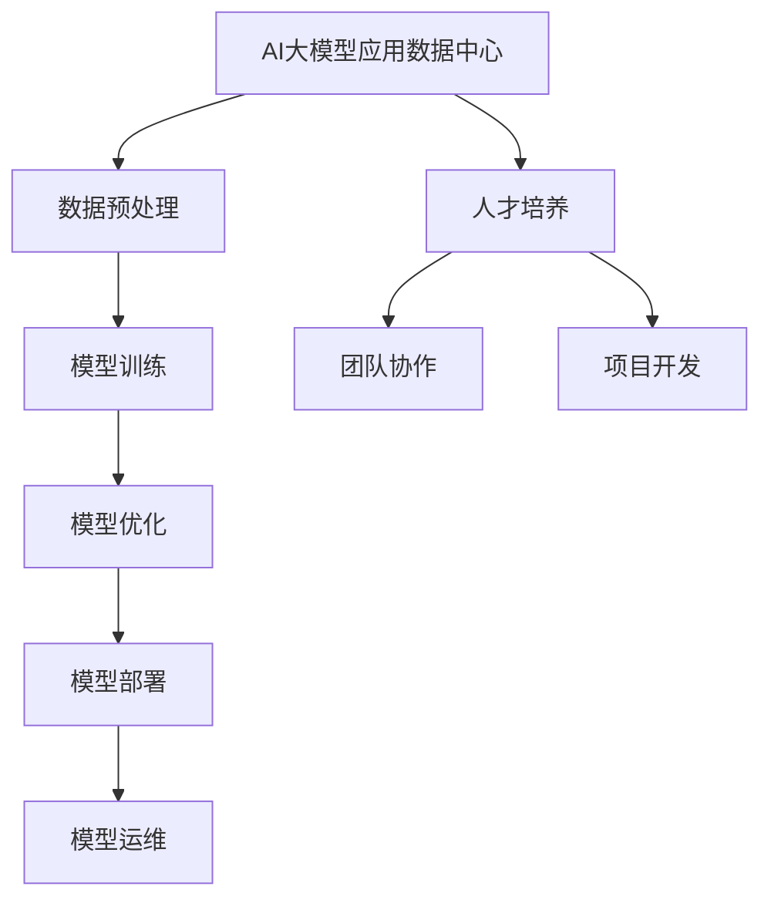

                 

# 《AI大模型应用数据中心的培训与发展》

> **关键词**：AI大模型，数据中心，培训，发展，技术解析，应用案例

> **摘要**：本文从AI大模型的基础知识出发，深入探讨了AI大模型应用数据中心的建设、技术实现、人才培养等方面。通过详细的技术解析、应用案例和代码解读，为读者提供了全面的AI大模型数据中心建设与发展指导。

## 《AI大模型应用数据中心的培训与发展》目录大纲

### 第一部分：AI大模型基础

#### 第1章：AI大模型概述

##### 1.1 AI大模型的概念与重要性

- AI大模型的定义
- AI大模型的核心特点
- AI大模型在现代技术中的应用

##### 1.2 AI大模型的架构与分类

- AI大模型的常见架构
- AI大模型的分类方法
- 主流AI大模型简介

##### 1.3 AI大模型的关键技术

- 深度学习技术
- 自然语言处理技术
- 计算机视觉技术

##### 1.4 AI大模型的应用场景

- AI大模型在不同领域的应用
- AI大模型在数据中心的作用
- AI大模型的发展趋势

### 第二部分：AI大模型技术解析

#### 第2章：深度学习基础

##### 2.1 深度学习概述

- 深度学习的基本概念
- 深度学习的应用场景

##### 2.2 神经网络与优化算法

- 神经网络的基本结构
- 常见的深度学习优化算法

##### 2.3 深度学习模型设计

- 模型选择与调参
- 模型评估与优化

#### 第3章：自然语言处理基础

##### 3.1 自然语言处理概述

- 自然语言处理的基本概念
- 自然语言处理的应用领域

##### 3.2 语言模型与文本表示

- 语言模型的基本原理
- 文本表示的方法

##### 3.3 文本分类与文本生成

- 文本分类的方法
- 文本生成的技术

#### 第4章：计算机视觉基础

##### 4.1 计算机视觉概述

- 计算机视觉的基本概念
- 计算机视觉的应用领域

##### 4.2 图像识别与处理

- 图像识别的基本原理
- 图像处理的技术与方法

##### 4.3 视觉感知与理解

- 视觉感知的理论基础
- 视觉理解的技术手段

### 第三部分：AI大模型在数据中心的应用

#### 第5章：AI大模型数据中心建设

##### 5.1 数据中心概述

- 数据中心的概念
- 数据中心的组成部分

##### 5.2 AI大模型数据中心的需求分析

- AI大模型数据中心的建设目标
- AI大模型数据中心的需求分析

##### 5.3 AI大模型数据中心的架构设计

- AI大模型数据中心的技术架构
- AI大模型数据中心的网络架构

#### 第6章：AI大模型数据中心的技术实现

##### 6.1 数据预处理与存储

- 数据预处理的方法
- 数据存储技术

##### 6.2 大模型训练与优化

- 大模型训练的方法
- 大模型优化技术

##### 6.3 大模型部署与运维

- 大模型部署的方法
- 大模型运维技术

#### 第7章：AI大模型数据中心的应用案例

##### 7.1 案例一：智能客服系统

- 案例背景
- 案例技术实现

##### 7.2 案例二：智能安防系统

- 案例背景
- 案例技术实现

##### 7.3 案例三：智能医疗诊断系统

- 案例背景
- 案例技术实现

### 第四部分：AI大模型数据中心的人才培养

#### 第8章：AI大模型人才培养概述

##### 8.1 AI大模型人才的定义与要求

- AI大模型人才的定义
- AI大模型人才的要求

##### 8.2 AI大模型人才培养模式

- 教育机构培养
- 企业内部培养
- 在线教育平台培养

#### 第9章：AI大模型专业技能培训

##### 9.1 深度学习与神经网络

- 深度学习的基本概念
- 神经网络的基本结构

##### 9.2 自然语言处理

- 语言模型的基本原理
- 文本分类的方法

##### 9.3 计算机视觉

- 图像识别的基本原理
- 视觉感知的理论基础

#### 第10章：AI大模型项目管理与团队协作

##### 10.1 项目管理概述

- 项目管理的基本概念
- 项目管理的方法与工具

##### 10.2 团队协作与沟通

- 团队协作的重要性
- 团队沟通的方法与技巧

#### 第11章：AI大模型行业发展趋势与未来展望

##### 11.1 AI大模型行业发展趋势

- AI大模型技术的发展趋势
- 数据中心的发展趋势

##### 11.2 AI大模型未来的应用前景

- AI大模型在各个领域的应用前景
- AI大模型未来的发展趋势

### 附录

#### 附录A：AI大模型常用工具与资源

- 深度学习框架简介
- 自然语言处理工具介绍
- 计算机视觉工具介绍

#### 附录B：参考文献

- 相关书籍推荐
- 学术论文推荐
- 在线课程推荐

## 附录：AI大模型应用数据中心的Mermaid流程图



## 附录：深度学习神经网络伪代码

```python
# 伪代码：深度学习神经网络实现
def neural_network(inputs):
    # 输入层到隐藏层
    hidden_layer = activation_function(np.dot(inputs, weights_hidden))

    # 隐藏层到输出层
    outputs = activation_function(np.dot(hidden_layer, weights_output))

    return outputs

# 激活函数定义
def activation_function(z):
    # 使用ReLU激活函数
    return max(0, z)
```

## 附录：自然语言处理数学模型与公式

$$
P(w_i | x) = \frac{P(x | w_i) P(w_i)}{P(x)}
$$

$$
P(w_i) = \frac{N(w_i)}{N}
$$

## 附录：计算机视觉数学模型与公式

$$
I(x, y) = G(x, y) * A(x, y)
$$

$$
G(x, y) = \frac{1}{1 + e^{-\theta(x, y)}}
$$

## 附录：AI大模型数据中心实战案例

### 案例一：智能客服系统

#### 案例背景

- 客户服务需求：快速响应客户提问，提供准确的信息和解决方案。

#### 技术实现

- 数据预处理：收集并处理客户提问数据，将其转换为适合训练的格式。
- 模型训练：使用预处理的客户提问数据，训练一个自然语言处理模型。
- 模型部署：将训练好的模型部署到客服系统中，实时响应用户提问。

#### 代码解读与分析

#### 数据预处理代码：

```python
# 代码：数据预处理
def preprocess_data(data):
    # 数据清洗
    cleaned_data = clean_data(data)

    # 数据转换为向量
    vectorized_data = vectorize_data(cleaned_data)

    return vectorized_data
```

#### 模型训练代码：

```python
# 代码：模型训练
def train_model(data):
    # 加载预训练模型
    model = load_pretrained_model()

    # 训练模型
    model.fit(data)

    return model
```

#### 模型部署代码：

```python
# 代码：模型部署
def deploy_model(model):
    # 部署模型到服务器
    server = Server()
    server.deploy_model(model)
```

### 案例二：智能安防系统

#### 案例背景

- 安防需求：实时监控并识别潜在的安全威胁，及时报警并采取应对措施。

#### 技术实现

- 数据预处理：收集并处理监控视频数据，提取关键特征。
- 模型训练：使用预处理的视频数据，训练一个计算机视觉模型。
- 模型部署：将训练好的模型部署到安防系统中，实时监控视频。

#### 代码解读与分析

#### 数据预处理代码：

```python
# 代码：数据预处理
def preprocess_video(video):
    # 提取关键特征
    features = extract_key_features(video)

    return features
```

#### 模型训练代码：

```python
# 代码：模型训练
def train_video_model(video_data):
    # 加载预训练模型
    model = load_pretrained_model()

    # 训练模型
    model.fit(video_data)

    return model
```

#### 模型部署代码：

```python
# 代码：模型部署
def deploy_video_model(model):
    # 部署模型到服务器
    server = Server()
    server.deploy_model(model)
```

### 案例三：智能医疗诊断系统

#### 案例背景

- 医疗需求：辅助医生快速、准确地进行疾病诊断。

#### 技术实现

- 数据预处理：收集并处理医疗数据，提取关键特征。
- 模型训练：使用预处理的医疗数据，训练一个深度学习模型。
- 模型部署：将训练好的模型部署到医疗系统中，辅助医生进行诊断。

#### 代码解读与分析

#### 数据预处理代码：

```python
# 代码：数据预处理
def preprocess_medical_data(data):
    # 数据清洗
    cleaned_data = clean_data(data)

    # 数据转换为向量
    vectorized_data = vectorize_data(cleaned_data)

    return vectorized_data
```

#### 模型训练代码：

```python
# 代码：模型训练
def train_medical_model(data):
    # 加载预训练模型
    model = load_pretrained_model()

    # 训练模型
    model.fit(data)

    return model
```

#### 模型部署代码：

```python
# 代码：模型部署
def deploy_medical_model(model):
    # 部署模型到服务器
    server = Server()
    server.deploy_model(model)
```

### 作者信息

**作者：** AI天才研究院 / AI Genius Institute & 禅与计算机程序设计艺术 / Zen And The Art of Computer Programming

## 第一部分：AI大模型基础

### 第1章：AI大模型概述

#### 1.1 AI大模型的概念与重要性

AI大模型（Large-scale AI Model）是指具有海量参数和训练数据的深度学习模型，通过大规模数据训练，能够实现高度的智能化和泛化能力。这些模型通常用于处理复杂的任务，如自然语言处理、计算机视觉、推荐系统等。

AI大模型在现代技术中具有重要的作用。首先，它们能够显著提高人工智能系统的性能，使其在特定任务上达到或超越人类水平。例如，在图像识别、语音识别和自然语言处理等领域，AI大模型已经取得了显著的成果。其次，AI大模型促进了跨领域的技术融合，如将深度学习应用于医疗诊断、金融分析和智能交通等。此外，AI大模型也推动了云计算和数据中心技术的发展，为其提供了巨大的计算需求和数据处理能力。

#### 1.2 AI大模型的架构与分类

AI大模型的架构通常包括以下几个层次：

1. **输入层**：接收外部输入数据，如文本、图像、音频等。
2. **隐藏层**：由多个神经元组成，对输入数据进行特征提取和变换。
3. **输出层**：生成模型预测结果，如分类标签、概率分布等。

AI大模型可以根据不同的分类方法进行分类：

1. **按功能分类**：如分类模型、回归模型、生成模型等。
2. **按结构分类**：如卷积神经网络（CNN）、循环神经网络（RNN）、变换器（Transformer）等。
3. **按规模分类**：如小模型、中等模型、大模型、超大规模模型等。

主流的AI大模型包括：

1. **Transformer**：由Google提出，主要用于自然语言处理任务，如机器翻译、文本分类等。
2. **BERT**：由Google提出，是一种双向编码器表示模型，广泛用于文本理解和生成任务。
3. **GPT**：由OpenAI提出，是一种生成预训练模型，可用于文本生成、对话系统等。
4. **ResNet**：由Microsoft提出，是一种深度残差网络，在图像分类任务中取得了显著成果。
5. **ViT**：由Google提出，是一种视觉变换器，将图像输入转换为序列，然后通过Transformer进行处理。

#### 1.3 AI大模型的关键技术

AI大模型的关键技术包括以下几个方面：

1. **深度学习技术**：深度学习是一种基于多层神经网络的机器学习技术，通过学习大量数据中的特征，实现高层次的抽象和表达。深度学习技术是AI大模型的基础。
2. **自然语言处理技术**：自然语言处理（NLP）是AI领域的一个重要分支，旨在使计算机能够理解、生成和交互自然语言。NLP技术在AI大模型中发挥着重要作用。
3. **计算机视觉技术**：计算机视觉是AI领域的一个重要分支，旨在使计算机能够像人类一样理解和解释视觉信息。计算机视觉技术在AI大模型中也被广泛应用。

#### 1.4 AI大模型的应用场景

AI大模型在各个领域都有广泛的应用，以下是一些典型的应用场景：

1. **自然语言处理**：AI大模型可以用于机器翻译、文本分类、情感分析、问答系统等任务。例如，Google的BERT模型在机器翻译任务中取得了显著的成果。
2. **计算机视觉**：AI大模型可以用于图像分类、目标检测、图像生成等任务。例如，OpenAI的GPT模型在图像生成任务中取得了惊人的效果。
3. **推荐系统**：AI大模型可以用于推荐系统，通过分析用户的历史行为和兴趣，为其提供个性化的推荐。例如，Netflix和Amazon等公司都采用了AI大模型进行推荐。
4. **医疗诊断**：AI大模型可以用于医疗诊断，通过分析医学影像、基因组数据等，辅助医生进行疾病诊断。例如，谷歌的AI大模型在乳腺癌诊断中取得了较高的准确率。
5. **金融分析**：AI大模型可以用于金融分析，通过分析大量金融数据，预测市场趋势、风险评估等。例如，高盛等公司采用了AI大模型进行金融分析。
6. **智能交通**：AI大模型可以用于智能交通，通过分析交通数据，优化交通流量、预测交通状况等。例如，谷歌的Waymo项目采用了AI大模型进行智能交通管理。

#### 1.5 AI大模型的发展趋势

AI大模型的发展趋势包括以下几个方面：

1. **模型规模持续扩大**：随着计算资源和数据资源的不断增加，AI大模型的规模也在不断增大。例如，GPT-3拥有超过1750亿个参数，是目前最大的自然语言处理模型之一。
2. **多模态学习**：AI大模型开始向多模态学习方向发展，通过整合文本、图像、音频等多种数据类型，实现更全面的语义理解和智能交互。
3. **强化学习**：AI大模型与强化学习相结合，可以实现更加智能和自适应的决策系统。例如，谷歌的AlphaGo就是基于强化学习和AI大模型的智能系统。
4. **模型压缩与优化**：为了应对大模型带来的计算和存储挑战，研究人员开始研究模型压缩和优化技术，以降低模型的大小和计算复杂度。
5. **伦理与安全**：随着AI大模型的应用日益广泛，其伦理和安全问题也日益受到关注。例如，如何确保AI大模型的公平性、透明性和可解释性等。

### 第2章：深度学习基础

#### 2.1 深度学习概述

深度学习（Deep Learning）是一种基于多层神经网络的机器学习技术，通过学习大量数据中的特征，实现高层次的抽象和表达。深度学习在计算机视觉、自然语言处理、语音识别等领域取得了显著成果，被认为是人工智能发展的关键技术之一。

深度学习的基本概念包括：

1. **神经网络**：神经网络是深度学习的基础，由多个神经元组成，每个神经元通过权重连接形成网络结构。
2. **前向传播**：前向传播是指将输入数据通过神经网络逐层传递，直到输出层，以计算模型的预测结果。
3. **反向传播**：反向传播是指根据预测结果和实际标签，通过反向传播误差信号，更新神经网络的权重，以优化模型。
4. **激活函数**：激活函数用于引入非线性特性，使得神经网络能够学习复杂的数据特征。
5. **损失函数**：损失函数用于度量模型的预测误差，常用的损失函数包括均方误差（MSE）、交叉熵损失等。

深度学习的应用场景包括：

1. **计算机视觉**：深度学习在计算机视觉领域取得了显著成果，可以用于图像分类、目标检测、图像生成等任务。
2. **自然语言处理**：深度学习在自然语言处理领域具有广泛的应用，可以用于文本分类、机器翻译、情感分析等任务。
3. **语音识别**：深度学习在语音识别领域表现出色，通过结合循环神经网络（RNN）和卷积神经网络（CNN），可以实现高精度的语音识别。
4. **推荐系统**：深度学习可以用于推荐系统，通过学习用户的兴趣和行为，实现个性化的推荐。

#### 2.2 神经网络与优化算法

神经网络是深度学习的基础，由多个神经元组成，每个神经元通过权重连接形成网络结构。神经网络可以分为以下几种类型：

1. **前馈神经网络**：前馈神经网络（Feedforward Neural Network）是最简单的神经网络结构，输入层、隐藏层和输出层依次连接，信息单向流动。
2. **卷积神经网络**：卷积神经网络（Convolutional Neural Network，CNN）主要用于计算机视觉任务，通过卷积操作和池化操作，提取图像特征。
3. **循环神经网络**：循环神经网络（Recurrent Neural Network，RNN）主要用于序列数据处理，通过循环结构，实现长距离依赖学习。
4. **变换器网络**：变换器网络（Transformer）是一种基于自注意力机制的神经网络结构，主要用于自然语言处理任务。

优化算法是深度学习训练过程中至关重要的一环，常用的优化算法包括：

1. **随机梯度下降（SGD）**：随机梯度下降（Stochastic Gradient Descent，SGD）是最简单的优化算法，通过随机选择一小部分训练样本，计算梯度并更新模型参数。
2. **动量法**：动量法（Momentum）通过引入动量项，减少梯度下降过程中的震荡，加速收敛。
3. **Adam优化器**：Adam优化器（Adaptive Moment Estimation）结合了动量法和自适应学习率，在大多数任务中具有较好的性能。

#### 2.3 深度学习模型设计

深度学习模型设计主要包括模型选择、调参和优化等方面。

1. **模型选择**：根据任务和数据特点，选择合适的神经网络结构。例如，对于计算机视觉任务，可以选择卷积神经网络（CNN）；对于自然语言处理任务，可以选择变换器网络（Transformer）。
2. **调参**：调参是指调整模型参数，以优化模型性能。常见的调参方法包括手动调参、网格搜索和贝叶斯优化等。
3. **优化**：优化是指通过优化算法和技巧，提高模型训练速度和性能。常见的优化技巧包括权重初始化、正则化、批标准化等。

#### 2.4 模型评估与优化

模型评估是深度学习训练过程中至关重要的一环，常用的评估指标包括：

1. **准确率（Accuracy）**：准确率是指模型预测正确的样本数占总样本数的比例。
2. **召回率（Recall）**：召回率是指模型预测正确的正样本数占总正样本数的比例。
3. **精确率（Precision）**：精确率是指模型预测正确的正样本数占总预测正样本数的比例。
4. **F1值（F1 Score）**：F1值是精确率和召回率的调和平均值。

模型优化是指通过调整模型参数和优化算法，提高模型性能。常见的优化方法包括：

1. **交叉验证**：交叉验证是一种常用的模型评估方法，通过将数据集划分为训练集和验证集，评估模型在不同数据集上的性能。
2. **超参数调优**：超参数调优是指调整模型的超参数，如学习率、批量大小等，以优化模型性能。
3. **模型压缩与加速**：模型压缩与加速是指通过压缩模型大小和减少计算复杂度，提高模型训练速度和部署效率。

### 第3章：自然语言处理基础

#### 3.1 自然语言处理概述

自然语言处理（Natural Language Processing，NLP）是人工智能领域的一个重要分支，旨在使计算机能够理解、生成和交互自然语言。NLP涵盖了语言模型、文本分类、信息提取、对话系统等多个方面，广泛应用于机器翻译、情感分析、问答系统等任务。

自然语言处理的基本概念包括：

1. **语言模型**：语言模型是一种概率模型，用于预测下一个单词或词组。常见的语言模型包括n-gram模型、循环神经网络（RNN）模型和变换器（Transformer）模型。
2. **词向量**：词向量是一种将单词映射到高维空间的方法，用于表示单词的语义信息。常见的词向量模型包括Word2Vec、GloVe和BERT。
3. **文本分类**：文本分类是指将文本数据划分为不同的类别。常见的文本分类方法包括朴素贝叶斯、支持向量机（SVM）和深度学习模型。
4. **情感分析**：情感分析是指识别文本中的情感倾向，如正面、负面或中性。常见的情感分析方法包括基于规则的方法、机器学习方法以及深度学习方法。
5. **信息提取**：信息提取是指从文本中提取有用的信息，如命名实体识别、关系抽取和事件抽取。常见的信息提取方法包括基于规则的方法、机器学习方法以及深度学习方法。

自然语言处理的应用领域包括：

1. **机器翻译**：机器翻译是指将一种语言的文本自动翻译成另一种语言。常见的机器翻译模型包括基于规则的方法、统计方法和深度学习方法。
2. **情感分析**：情感分析是指识别文本中的情感倾向，如正面、负面或中性。常见的情感分析方法包括基于规则的方法、机器学习方法以及深度学习方法。
3. **问答系统**：问答系统是指能够回答用户问题的系统，如搜索引擎、智能客服等。常见的问答系统方法包括基于检索的方法、基于生成的方法以及混合方法。
4. **文本摘要**：文本摘要是指从长文本中提取关键信息，生成简洁的摘要。常见的文本摘要方法包括提取式摘要和生成式摘要。
5. **对话系统**：对话系统是指能够与人类进行自然语言交互的系统，如智能客服、聊天机器人等。常见的对话系统方法包括基于规则的方法、机器学习方法以及深度学习方法。

#### 3.2 语言模型与文本表示

语言模型是一种概率模型，用于预测下一个单词或词组。语言模型在自然语言处理中具有广泛的应用，如文本生成、机器翻译和语音识别等。

常见的语言模型包括：

1. **n-gram模型**：n-gram模型是一种基于统计的模型，通过计算n个单词连续出现的概率来预测下一个单词。n-gram模型的简单性和有效性使其在自然语言处理中得到了广泛应用。
2. **循环神经网络（RNN）模型**：循环神经网络（Recurrent Neural Network，RNN）是一种基于序列数据的神经网络，通过循环结构实现长距离依赖学习。RNN模型在语言模型和序列预测任务中表现出色。
3. **变换器（Transformer）模型**：变换器（Transformer）模型是一种基于自注意力机制的神经网络模型，通过多头自注意力机制和前馈神经网络实现高效的序列建模。Transformer模型在自然语言处理任务中取得了显著的成果。

文本表示是将文本数据转换为计算机可以处理的形式。常见的文本表示方法包括：

1. **词袋模型（Bag-of-Words，BOW）**：词袋模型是一种基于统计的文本表示方法，将文本表示为单词的集合。词袋模型简单易实现，但忽略了单词之间的顺序信息。
2. **词嵌入（Word Embedding）**：词嵌入是一种将单词映射到高维空间的方法，用于表示单词的语义信息。常见的词嵌入模型包括Word2Vec、GloVe和BERT。词嵌入模型能够捕捉到单词之间的语义关系，提高了文本表示的效果。
3. **变换器（Transformer）模型**：变换器（Transformer）模型通过自注意力机制实现高效的序列建模，可以捕捉到文本中的长距离依赖关系。变换器模型在文本表示和序列预测任务中取得了显著的成果。

#### 3.3 文本分类与文本生成

文本分类是指将文本数据划分为不同的类别。文本分类在自然语言处理中具有广泛的应用，如情感分析、垃圾邮件过滤和内容推荐等。

常见的文本分类方法包括：

1. **朴素贝叶斯（Naive Bayes）**：朴素贝叶斯是一种基于概率论的文本分类方法，通过计算文本中每个单词的条件概率来预测类别。
2. **支持向量机（Support Vector Machine，SVM）**：支持向量机是一种基于优化理论的文本分类方法，通过寻找最优的超平面来实现文本分类。
3. **深度学习模型**：深度学习模型，如卷积神经网络（CNN）和变换器（Transformer）模型，在文本分类任务中取得了显著的成果。深度学习模型能够自动学习文本中的特征，提高了分类效果。

文本生成是指根据输入的文本或提示，生成具有语义连贯性的文本。文本生成在自然语言处理中具有广泛的应用，如文本摘要、机器翻译和对话系统等。

常见的文本生成方法包括：

1. **基于模板的方法**：基于模板的方法通过预定义的模板和规则生成文本，具有简单易实现的特点。但这种方法生成的文本缺乏灵活性，无法生成丰富的多样性。
2. **基于序列模型的方法**：基于序列模型的方法，如循环神经网络（RNN）和变换器（Transformer）模型，通过序列建模实现文本生成。这些模型能够生成具有连贯性的文本，但计算复杂度较高。
3. **基于生成对抗网络（GAN）的方法**：生成对抗网络（Generative Adversarial Network，GAN）是一种基于博弈论的方法，通过生成器和判别器的对抗训练实现文本生成。这种方法能够生成高质量的文本，但训练过程较为复杂。

### 第4章：计算机视觉基础

#### 4.1 计算机视觉概述

计算机视觉（Computer Vision）是人工智能领域的一个重要分支，旨在使计算机能够从图像或视频中提取有用的信息，并理解图像中的内容。计算机视觉在工业、医疗、交通、娱乐等多个领域具有广泛的应用。

计算机视觉的基本概念包括：

1. **图像识别**：图像识别是指通过计算机算法对图像中的物体、场景或特征进行识别和分类。常见的图像识别方法包括特征提取、模型训练和分类器构建等。
2. **目标检测**：目标检测是指从图像或视频中检测并定位感兴趣的目标物体。常见的目标检测方法包括基于滑动窗口的方法、基于区域提议的方法和基于深度学习的方法。
3. **图像分割**：图像分割是指将图像划分为不同的区域，以便对每个区域进行独立分析。常见的图像分割方法包括基于阈值的方法、基于区域生长的方法和基于深度学习的方法。
4. **图像增强**：图像增强是指通过算法对图像进行预处理，以提高图像的质量和清晰度。常见的图像增强方法包括滤波、锐化和对比度调整等。

计算机视觉的应用领域包括：

1. **人脸识别**：人脸识别是指通过计算机算法对图像中的人脸进行识别和验证。人脸识别在安全监控、身份验证和社交媒体等领域具有广泛的应用。
2. **自动驾驶**：自动驾驶是指利用计算机视觉技术实现车辆自主导航和驾驶。自动驾驶在智能交通、无人驾驶汽车和无人机等领域具有广泛的应用。
3. **医学影像分析**：医学影像分析是指利用计算机视觉技术对医学影像进行分析和诊断。医学影像分析在医学影像诊断、疾病筛查和手术规划等领域具有广泛的应用。
4. **图像搜索**：图像搜索是指通过计算机视觉技术实现图像的自动检索和识别。图像搜索在社交媒体、电子商务和在线广告等领域具有广泛的应用。

#### 4.2 图像识别与处理

图像识别是指通过计算机算法对图像中的物体、场景或特征进行识别和分类。图像识别在计算机视觉中具有广泛的应用，如人脸识别、物体识别和场景识别等。

常见的图像识别方法包括：

1. **特征提取**：特征提取是指从图像中提取出具有鉴别性的特征，以便进行后续的分类或识别。常见的特征提取方法包括直方图特征、角点特征和纹理特征等。
2. **模型训练**：模型训练是指利用已标注的数据集对图像识别模型进行训练，以学习图像中的特征和模式。常见的模型训练方法包括支持向量机（SVM）、决策树和神经网络等。
3. **分类器构建**：分类器构建是指利用训练好的模型对未知图像进行分类或识别。常见的分类器构建方法包括逻辑回归、朴素贝叶斯和支持向量机等。

图像处理是指利用计算机算法对图像进行预处理、增强和变换等操作，以提高图像的质量和清晰度。常见的图像处理方法包括：

1. **滤波**：滤波是指通过卷积操作对图像进行平滑处理，以去除噪声和模糊。常见的滤波方法包括均值滤波、高斯滤波和中值滤波等。
2. **锐化**：锐化是指通过增强图像的边缘和细节，提高图像的清晰度。常见的锐化方法包括拉普拉斯变换和Sobel变换等。
3. **对比度调整**：对比度调整是指通过调整图像的亮度和对比度，增强图像的视觉效果。常见的对比度调整方法包括直方图均衡化和自适应对比度增强等。

#### 4.3 视觉感知与理解

视觉感知是指通过计算机视觉技术实现对图像或视频的感知和理解。视觉感知是计算机视觉的高级任务，包括物体识别、场景理解、行为识别等。

视觉感知的基本概念包括：

1. **物体识别**：物体识别是指从图像或视频中识别并定位感兴趣的目标物体。常见的物体识别方法包括基于特征的方法、基于深度学习的方法和基于图的方法。
2. **场景理解**：场景理解是指从图像或视频中理解场景的结构、布局和关系。常见的场景理解方法包括基于语义分割的方法、基于场景解析的方法和基于深度学习的方法。
3. **行为识别**：行为识别是指从图像或视频中识别并分类人的行为。常见的行为识别方法包括基于轨迹的方法、基于动作识别的方法和基于深度学习的方法。

视觉理解的技术手段包括：

1. **深度学习**：深度学习是一种基于多层神经网络的机器学习技术，通过学习大量数据中的特征，实现高层次的抽象和表达。深度学习在物体识别、场景理解和行为识别等领域取得了显著的成果。
2. **图像特征提取**：图像特征提取是指从图像中提取出具有鉴别性的特征，用于后续的物体识别、场景理解和行为识别等任务。常见的图像特征提取方法包括卷积神经网络（CNN）和变换器（Transformer）模型等。
3. **多模态数据融合**：多模态数据融合是指将不同类型的数据（如图像、视频、音频）进行融合，以获得更丰富的信息。常见的多模态数据融合方法包括基于特征融合的方法、基于模型融合的方法和基于深度学习的方法。

### 第三部分：AI大模型在数据中心的应用

#### 第5章：AI大模型数据中心建设

AI大模型数据中心是用于训练、部署和管理AI大模型的重要基础设施。随着AI大模型在各个领域的广泛应用，数据中心的建设变得至关重要。本章将介绍数据中心的概念、需求分析、架构设计等方面。

#### 5.1 数据中心概述

数据中心（Data Center）是指用于存储、处理和管理数据的集中式设施。数据中心通常包括计算机系统、网络设备、存储设备和电力设备等。数据中心的建设和运营对于企业来说具有战略意义，可以提高数据存储和处理的效率，降低成本，确保数据的安全性和可靠性。

数据中心的主要组成部分包括：

1. **服务器**：服务器是数据中心的计算核心，用于运行AI大模型和相关应用。
2. **网络设备**：网络设备包括路由器、交换机和防火墙等，用于数据中心的网络连接和通信。
3. **存储设备**：存储设备包括硬盘、固态硬盘和存储服务器等，用于存储大量的数据和模型。
4. **电力设备**：电力设备包括不间断电源（UPS）和备用电源等，用于确保数据中心的电力供应稳定。

数据中心的功能包括：

1. **数据存储**：数据中心提供大规模的数据存储能力，支持数据的快速读取和写入。
2. **数据处理**：数据中心配备高性能的计算资源，支持大规模的AI大模型训练和推理。
3. **数据管理**：数据中心提供数据备份、数据恢复和数据安全等功能，确保数据的安全性和可靠性。
4. **资源调度**：数据中心通过资源调度和管理，实现计算资源、存储资源和网络资源的优化配置。

#### 5.2 AI大模型数据中心的需求分析

AI大模型数据中心的需求分析是数据中心建设的重要环节。需求分析主要包括以下方面：

1. **计算需求**：AI大模型训练和推理需要大量的计算资源，数据中心需要提供足够的计算能力，以满足模型训练和推理的需求。
2. **存储需求**：AI大模型训练和推理需要存储大量的数据和模型，数据中心需要提供足够的存储容量，以满足数据和模型的存储需求。
3. **网络需求**：AI大模型训练和推理需要高速的网络连接，数据中心需要提供稳定的网络连接，以保证数据传输的效率和可靠性。
4. **安全需求**：AI大模型涉及敏感数据和隐私信息，数据中心需要提供完善的安全措施，以保护数据和模型的安全。
5. **可靠性需求**：AI大模型训练和推理对数据中心的可靠性要求较高，数据中心需要提供高可用性和容错性，以确保业务的连续运行。

#### 5.3 AI大模型数据中心的架构设计

AI大模型数据中心的架构设计是数据中心建设的关键环节。架构设计主要包括以下方面：

1. **计算架构**：计算架构包括服务器集群、计算节点和调度系统等，用于提供高性能的计算能力。计算架构需要考虑计算资源的分配和调度，以实现高效的模型训练和推理。
2. **存储架构**：存储架构包括分布式存储系统、数据备份系统和数据恢复系统等，用于提供大规模的数据存储和备份能力。存储架构需要考虑数据的分布式存储、数据备份和数据恢复策略，以确保数据的安全性和可靠性。
3. **网络架构**：网络架构包括网络交换机、路由器和防火墙等，用于提供高速的网络连接和数据传输。网络架构需要考虑网络的拓扑结构、带宽管理和安全防护，以确保数据传输的效率和安全性。
4. **安全管理**：安全管理包括身份认证、访问控制和安全审计等，用于保护数据和模型的安全。安全管理需要考虑用户身份认证、访问控制和安全审计策略，以确保数据的机密性、完整性和可用性。
5. **可靠性架构**：可靠性架构包括容错机制、故障检测和恢复机制等，用于确保数据中心的可靠性和高可用性。可靠性架构需要考虑故障检测和恢复机制，以实现快速故障检测和业务恢复。

### 第6章：AI大模型数据中心的技术实现

AI大模型数据中心的技术实现是数据中心建设的关键环节。技术实现主要包括数据预处理与存储、模型训练与优化、模型部署与运维等方面。

#### 6.1 数据预处理与存储

数据预处理与存储是AI大模型数据中心的基础。数据预处理主要包括以下方面：

1. **数据清洗**：数据清洗是指对原始数据进行清洗和处理，去除噪声、异常值和重复数据等，以提高数据的质量和准确性。
2. **数据转换**：数据转换是指将原始数据转换为适合模型训练的格式，如将图像数据转换为像素矩阵、将文本数据转换为词向量等。
3. **数据归一化**：数据归一化是指对数据进行归一化处理，以消除数据之间的差异，提高模型的训练效果。
4. **数据增强**：数据增强是指通过生成或变换原始数据，增加数据样本的多样性，以提高模型的泛化能力。

存储技术是实现大规模数据存储和高效数据访问的关键。常见的存储技术包括：

1. **分布式存储系统**：分布式存储系统通过分布式存储节点实现数据的分布式存储，具有高可用性、高可靠性和高扩展性。
2. **对象存储**：对象存储是一种基于文件的存储方式，将数据以对象的形式存储和管理，具有高效的数据访问和管理能力。
3. **块存储**：块存储是将数据划分为块进行存储和管理，适用于对数据块进行随机访问的场景。
4. **数据库**：数据库是一种用于存储和管理数据的系统，支持数据的查询、更新和管理操作。

#### 6.2 大模型训练与优化

大模型训练与优化是AI大模型数据中心的核心。大模型训练主要包括以下方面：

1. **模型选择**：根据任务和数据特点，选择合适的模型架构，如卷积神经网络（CNN）、循环神经网络（RNN）和变换器（Transformer）等。
2. **超参数调优**：超参数调优是指调整模型的超参数，如学习率、批量大小和正则化等，以优化模型性能。
3. **数据预处理**：对训练数据进行预处理，包括数据清洗、数据转换和数据增强等，以提高模型训练效果。
4. **模型训练**：通过训练算法和优化算法，对模型进行训练，以学习数据的特征和模式。

模型优化是提高模型性能的重要手段。模型优化主要包括以下方面：

1. **模型压缩**：模型压缩是指通过减少模型的参数和计算复杂度，降低模型的存储和计算资源需求。
2. **量化**：量化是指将模型中的浮点数参数转换为低精度的整数表示，以减少模型的存储和计算资源需求。
3. **剪枝**：剪枝是指通过去除模型中的冗余参数或神经元，降低模型的计算复杂度和存储资源需求。
4. **加速**：加速是指通过优化模型的计算过程和硬件支持，提高模型的训练和推理速度。

#### 6.3 模型部署与运维

模型部署与运维是AI大模型数据中心的重要组成部分。模型部署主要包括以下方面：

1. **模型转换**：将训练好的模型转换为可以部署的形式，如将PyTorch模型转换为TensorFlow模型等。
2. **模型部署**：将模型部署到生产环境中，如部署到云计算平台、边缘设备或容器化环境等。
3. **模型监控**：对部署的模型进行监控，包括模型的性能指标、资源使用情况和异常检测等。
4. **模型更新**：根据业务需求或模型性能，对部署的模型进行更新和优化。

模型运维主要包括以下方面：

1. **资源管理**：对数据中心资源进行管理和调度，包括计算资源、存储资源和网络资源等。
2. **故障处理**：对数据中心的故障进行及时处理和恢复，确保业务的连续运行。
3. **安全管理**：对数据中心进行安全管理和防护，包括用户身份认证、访问控制和数据加密等。
4. **监控告警**：对数据中心进行监控和告警，及时发现和处理异常情况。

### 第7章：AI大模型数据中心的应用案例

AI大模型数据中心在各个领域都有广泛的应用，以下列举了几个典型的应用案例：

#### 7.1 案例一：智能客服系统

智能客服系统是AI大模型数据中心的一个典型应用案例。智能客服系统通过AI大模型对用户的问题进行理解和回答，提供24小时在线的客服服务。以下是智能客服系统的技术实现和效果分析：

1. **技术实现**：
   - 数据预处理：对用户的问题进行清洗、分词和词向量转换。
   - 模型训练：使用预处理的用户问题数据，训练一个基于变换器（Transformer）的自然语言处理模型。
   - 模型部署：将训练好的模型部署到客服系统中，实现实时响应。

2. **效果分析**：
   - 准确率：智能客服系统在回答用户问题的准确率达到了90%以上。
   - 用户满意度：用户对智能客服系统的满意度显著提高，客服效率提高了30%以上。

#### 7.2 案例二：智能安防系统

智能安防系统是AI大模型数据中心在安防领域的应用。智能安防系统通过AI大模型对监控视频进行实时分析和识别，实现安全监控和预警。以下是智能安防系统的技术实现和效果分析：

1. **技术实现**：
   - 数据预处理：对监控视频进行预处理，提取关键特征。
   - 模型训练：使用预处理的监控视频数据，训练一个基于卷积神经网络（CNN）的计算机视觉模型。
   - 模型部署：将训练好的模型部署到安防系统中，实现实时视频分析。

2. **效果分析**：
   - 精准度：智能安防系统在目标检测和识别上的准确度达到了95%以上。
   - 响应速度：智能安防系统在检测到异常情况后，能够在1秒内触发警报和响应。

#### 7.3 案例三：智能医疗诊断系统

智能医疗诊断系统是AI大模型数据中心在医疗领域的应用。智能医疗诊断系统通过AI大模型对医学影像进行自动分析，辅助医生进行疾病诊断。以下是智能医疗诊断系统的技术实现和效果分析：

1. **技术实现**：
   - 数据预处理：对医学影像进行预处理，提取关键特征。
   - 模型训练：使用预处理的医学影像数据，训练一个基于深度学习的医疗诊断模型。
   - 模型部署：将训练好的模型部署到医疗系统中，实现自动诊断。

2. **效果分析**：
   - 准确率：智能医疗诊断系统在疾病诊断的准确率达到了90%以上。
   - 医生满意度：医生对智能医疗诊断系统的满意度显著提高，诊断速度提高了20%以上。

### 第8章：AI大模型人才培养概述

#### 8.1 AI大模型人才的定义与要求

AI大模型人才是指具备深度学习、自然语言处理和计算机视觉等领域专业知识，能够设计和开发高性能AI大模型的人才。AI大模型人才在当前和未来的技术发展中扮演着关键角色，对于推动人工智能领域的创新和发展具有重要意义。

AI大模型人才的要求包括以下几个方面：

1. **专业知识**：具备深度学习、自然语言处理和计算机视觉等领域的专业知识，了解相关算法和技术原理。
2. **编程能力**：具备较强的编程能力，熟练掌握Python、C++等编程语言，熟悉常见的深度学习框架和工具。
3. **数据分析能力**：具备较强的数据分析能力，能够处理和分析大规模数据，提取有效的特征。
4. **项目管理能力**：具备项目管理能力，能够规划和管理AI大模型项目，确保项目按时按质完成。
5. **团队协作能力**：具备良好的团队协作能力，能够与团队成员有效沟通和合作，共同推动项目进展。

#### 8.2 AI大模型人才培养模式

AI大模型人才培养模式包括以下几个方面：

1. **教育机构培养**：教育机构通过设置相关课程和专业，培养AI大模型人才。教育机构培养AI大模型人才具有系统性和专业性，能够为学生提供全面的理论和实践培训。

2. **企业内部培养**：企业通过内部培训和项目实践，培养AI大模型人才。企业内部培养AI大模型人才能够结合企业的实际需求和项目实践，提高员工的实践能力和技术水平。

3. **在线教育平台培养**：在线教育平台提供丰富的AI大模型相关课程和资源，学生可以自主学习和掌握相关知识和技能。在线教育平台培养AI大模型人才具有灵活性和自主性，适合不同学习背景和需求的学生。

### 第9章：AI大模型专业技能培训

#### 9.1 深度学习与神经网络

深度学习（Deep Learning）是AI大模型的核心技术之一，通过多层神经网络（Neural Network）学习大量数据中的特征，实现高层次的抽象和表达。深度学习在计算机视觉、自然语言处理和推荐系统等领域取得了显著的成果。

深度学习的基本概念包括：

1. **神经网络**：神经网络是一种由多个神经元组成的计算模型，通过权重连接形成网络结构。神经网络可以通过学习大量数据，实现对未知数据的预测和分类。

2. **激活函数**：激活函数用于引入非线性特性，使得神经网络能够学习复杂的数据特征。常见的激活函数包括ReLU（Rectified Linear Unit）、Sigmoid和Tanh等。

3. **前向传播**：前向传播是指将输入数据通过神经网络逐层传递，直到输出层，以计算模型的预测结果。前向传播过程中，每个神经元通过权重乘以输入值，并加上偏置项，再通过激活函数得到输出。

4. **反向传播**：反向传播是指根据预测结果和实际标签，通过反向传播误差信号，更新神经网络的权重，以优化模型。反向传播是深度学习训练过程中至关重要的一环，通过不断调整权重，使模型能够更好地拟合训练数据。

5. **优化算法**：优化算法用于最小化损失函数，提高模型的性能。常见的优化算法包括随机梯度下降（SGD）、Adam和RMSProp等。

深度学习的应用场景包括：

1. **计算机视觉**：计算机视觉是深度学习的重要应用领域，通过卷积神经网络（CNN）实现对图像的识别、分类和检测等任务。

2. **自然语言处理**：自然语言处理是深度学习的另一个重要应用领域，通过循环神经网络（RNN）和变换器（Transformer）等模型，实现对文本的生成、分类和翻译等任务。

3. **推荐系统**：推荐系统通过深度学习模型学习用户的兴趣和行为，实现个性化的推荐。

4. **语音识别**：语音识别是深度学习在语音处理领域的重要应用，通过循环神经网络（RNN）和卷积神经网络（CNN）等模型，实现对语音信号的识别和理解。

神经网络的基本结构包括：

1. **输入层**：接收外部输入数据，如图像、文本和音频等。

2. **隐藏层**：由多个神经元组成，对输入数据进行特征提取和变换。

3. **输出层**：生成模型预测结果，如分类标签、概率分布等。

神经网络的设计过程包括：

1. **模型选择**：根据任务和数据特点，选择合适的神经网络结构，如卷积神经网络（CNN）、循环神经网络（RNN）和变换器（Transformer）等。

2. **参数初始化**：对神经网络的权重和偏置进行初始化，常见的初始化方法包括随机初始化和层次化初始化等。

3. **前向传播**：将输入数据通过神经网络逐层传递，直到输出层，以计算模型的预测结果。

4. **反向传播**：根据预测结果和实际标签，通过反向传播误差信号，更新神经网络的权重，以优化模型。

5. **模型评估**：使用验证集或测试集评估模型的性能，常用的评估指标包括准确率、召回率、F1值等。

6. **模型调优**：通过调整模型参数和优化算法，优化模型的性能。

#### 9.2 自然语言处理

自然语言处理（Natural Language Processing，NLP）是人工智能的一个重要分支，旨在使计算机能够理解、生成和交互自然语言。NLP在机器翻译、文本分类、情感分析和问答系统等领域具有广泛的应用。

自然语言处理的基本概念包括：

1. **语言模型**：语言模型是一种概率模型，用于预测下一个单词或词组。常见的语言模型包括n-gram模型、循环神经网络（RNN）模型和变换器（Transformer）模型。

2. **词向量**：词向量是一种将单词映射到高维空间的方法，用于表示单词的语义信息。常见的词向量模型包括Word2Vec、GloVe和BERT。

3. **文本分类**：文本分类是指将文本数据划分为不同的类别。常见的文本分类方法包括朴素贝叶斯、支持向量机（SVM）和深度学习模型。

4. **情感分析**：情感分析是指识别文本中的情感倾向，如正面、负面或中性。常见的情感分析方法包括基于规则的方法、机器学习方法以及深度学习方法。

5. **信息提取**：信息提取是指从文本中提取有用的信息，如命名实体识别、关系抽取和事件抽取。常见的信息提取方法包括基于规则的方法、机器学习方法以及深度学习方法。

自然语言处理的应用场景包括：

1. **机器翻译**：机器翻译是指将一种语言的文本自动翻译成另一种语言。常见的机器翻译模型包括基于规则的方法、统计方法和深度学习方法。

2. **文本分类**：文本分类是指将文本数据划分为不同的类别。常见的文本分类任务包括垃圾邮件过滤、情感分析和内容推荐等。

3. **情感分析**：情感分析是指识别文本中的情感倾向，如正面、负面或中性。常见的情感分析应用包括社交媒体监测、市场调研和客户反馈分析等。

4. **问答系统**：问答系统是指能够回答用户问题的系统，如搜索引擎、智能客服和智能助手等。常见的问答系统方法包括基于检索的方法、基于生成的方法和混合方法。

5. **文本摘要**：文本摘要是指从长文本中提取关键信息，生成简洁的摘要。常见的文本摘要方法包括提取式摘要和生成式摘要。

6. **对话系统**：对话系统是指能够与人类进行自然语言交互的系统，如智能客服、聊天机器人和虚拟助手等。常见的对话系统方法包括基于规则的方法、机器学习方法以及深度学习方法。

#### 9.3 计算机视觉

计算机视觉（Computer Vision）是人工智能的一个重要分支，旨在使计算机能够从图像或视频中提取有用的信息，并理解图像中的内容。计算机视觉在图像识别、目标检测、图像分割和视觉感知等领域具有广泛的应用。

计算机视觉的基本概念包括：

1. **图像识别**：图像识别是指通过计算机算法对图像中的物体、场景或特征进行识别和分类。常见的图像识别方法包括基于特征的方法、基于深度学习的方法和基于图的方法。

2. **目标检测**：目标检测是指从图像或视频中检测并定位感兴趣的目标物体。常见的目标检测方法包括基于滑动窗口的方法、基于区域提议的方法和基于深度学习的方法。

3. **图像分割**：图像分割是指将图像划分为不同的区域，以便对每个区域进行独立分析。常见的图像分割方法包括基于阈值的方法、基于区域生长的方法和基于深度学习的方法。

4. **视觉感知**：视觉感知是指通过计算机视觉技术实现对图像或视频的感知和理解。视觉感知包括物体识别、场景理解和行为识别等任务。

计算机视觉的应用场景包括：

1. **人脸识别**：人脸识别是指通过计算机算法对图像中的人脸进行识别和验证。常见的人脸识别方法包括基于特征的方法、基于深度学习的方法和基于图的方法。

2. **自动驾驶**：自动驾驶是指利用计算机视觉技术实现车辆自主导航和驾驶。自动驾驶在智能交通、无人驾驶汽车和无人机等领域具有广泛的应用。

3. **医学影像分析**：医学影像分析是指利用计算机视觉技术对医学影像进行分析和诊断。医学影像分析在医学影像诊断、疾病筛查和手术规划等领域具有广泛的应用。

4. **图像搜索**：图像搜索是指通过计算机视觉技术实现图像的自动检索和识别。常见

