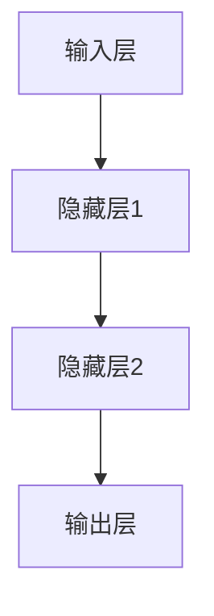
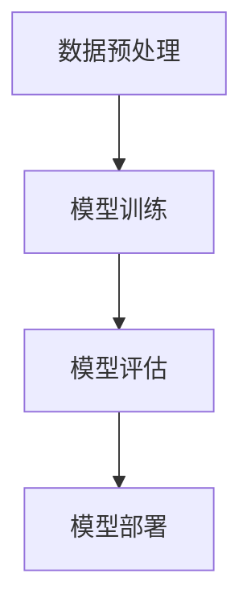

                 

# 《AI驱动人类文明进步：科技与人文融合》

## 关键词：
人工智能，人类文明进步，科技与人文融合，教育，文化产业，社会治理，未来展望，伦理责任。

## 摘要：
本文从AI的基础概念和影响出发，探讨了AI在各个领域中的应用和实践，以及科技与人文融合的重要性。文章分析了AI在教育、文化产业和社会治理等领域的具体应用，并展望了AI驱动未来社会的可能性。同时，本文强调了在AI发展中保持人文关怀的重要性，提出了实现科技与人文融合的路径和建议。

### 第一部分：AI基础与人文关怀

#### 第1章：AI概述与影响

##### 1.1 AI的基本概念与技术发展

人工智能（AI）是指由人制造出来的系统能够执行需要人类智能才能完成的任务。它的发展历程可以追溯到20世纪50年代，随着计算机技术的进步，AI经历了数次起伏。现阶段，深度学习、神经网络等技术的突破使得AI进入了一个全新的发展阶段。

**AI的基本概念：**
- **人工智能**：一种基于模拟人脑思维方式的技术，使其能够处理和解决问题。
- **机器学习**：使计算机能够通过数据和经验自动改进性能的方法。
- **深度学习**：一种机器学习技术，通过多层神经网络模拟人脑处理信息的方式。

**AI的技术发展：**
- **早期AI**：符号主义和知识表示。
- **中期AI**：专家系统和智能搜索。
- **现阶段AI**：基于数据的机器学习和深度学习。

**AI对人类社会的影响：**
- **生产力提升**：AI在自动化、优化生产流程等方面发挥了重要作用。
- **社会结构变化**：AI改变了就业市场，催生了新的职业和行业。
- **生活方式改变**：智能家居、智能医疗等AI应用改变了人们的日常生活。

##### 1.2 AI对人类社会的影响

AI不仅改变了生产方式，还对人类社会产生了深远的影响：

- **经济影响**：AI提高了生产效率，降低了成本，推动了经济发展。
- **社会影响**：AI改变了社会结构，催生了新的社会关系和生活方式。
- **生活方式影响**：AI让生活更加便捷，但也带来了隐私和安全的挑战。

##### 1.3 AI与人文关怀的平衡

在AI发展中，如何平衡技术与人文关怀是一个重要议题：

- **伦理问题**：AI算法的公平性、透明性和可解释性是伦理关注的焦点。
- **人文关怀**：在AI设计和应用中，需要考虑对人的关怀，确保技术发展符合人类的价值观。
- **社会责任**：企业和社会有责任确保AI技术的正面影响，减少潜在的负面影响。

#### 第2章：AI核心算法与架构

##### 2.1 神经网络与深度学习基础

神经网络（NN）是AI的核心组成部分，其基本结构包括输入层、隐藏层和输出层。神经元是神经网络的基本单元，通过激活函数进行信息处理。

**神经网络的基本结构：**
$$
f(x) = \sigma(\sum_{i=1}^{n} w_i * x_i + b)
$$
其中，$w_i$ 是权重，$x_i$ 是输入，$b$ 是偏置，$\sigma$ 是激活函数。

**深度学习的基本原理：**
深度学习通过增加网络层数，提高模型的表达能力。训练深度学习模型通常采用反向传播算法。

**深度学习的优势与应用：**
- **强大的表达能力**：能够处理复杂的非线性问题。
- **广泛的应用领域**：图像识别、自然语言处理、推荐系统等。

##### 2.2 主流AI算法介绍

AI算法根据训练数据的不同，可分为监督学习、无监督学习和强化学习。

- **监督学习**：有标签的数据进行训练，用于分类和回归任务。
- **无监督学习**：没有标签的数据进行训练，用于聚类和降维任务。
- **强化学习**：通过与环境的交互进行学习，用于决策问题。

**AI系统架构设计：**
AI系统架构包括数据采集、数据处理、模型训练、模型部署等环节。系统设计需要考虑数据质量、计算资源、模型优化等方面。

### 第二部分：科技与人文融合实践

#### 第3章：AI与教育

##### 3.1 AI在教育中的应用

AI在教育中的应用正在逐渐改变传统的教育模式：

- **教育数据管理**：通过AI技术对教育数据进行处理和分析，提高教育质量。
- **教学过程优化**：利用AI进行教学过程的个性化调整，提高教学效果。
- **个性化学习**：基于AI的个性化学习系统，为学生提供个性化的学习路径。

##### 3.2 AI教学模式的创新

AI教学模式创新主要体现在以下几个方面：

- **智能教学系统**：利用AI技术构建智能教学系统，实现自动批改作业、生成教学资源等功能。
- **智能化学习评价**：通过AI对学生的学习过程进行实时评价，提供个性化的反馈。
- **虚拟现实与教育**：利用VR技术，提供沉浸式的学习体验，提高学生的学习兴趣。

##### 3.3 AI在教育中的挑战与解决方案

AI在教育中的应用也面临一些挑战：

- **数据隐私与安全性**：保护学生数据隐私和安全是关键问题。
- **教育公平**：确保AI技术在教育中的应用能够惠及所有学生，避免加剧教育不平等。
- **教育资源合理配置**：通过AI技术实现教育资源的合理分配，提高教育质量。

#### 第4章：AI与文化

##### 4.1 AI在文化产业的创新

AI在文化产业中的应用，为传统产业带来了新的活力：

- **数字文化遗产保护**：利用AI技术进行数字文化遗产的保存和传播。
- **艺术创作**：AI在音乐、绘画等艺术创作中的应用，为艺术家提供了新的创作工具。
- **文化娱乐产业**：AI技术在推荐系统、互动娱乐等方面发挥了重要作用。

##### 4.2 数字文化遗产保护与传承

数字文化遗产保护与传承是文化领域的重要课题：

- **数字化技术**：通过数字化技术，对文化遗产进行保存和传播。
- **数据安全与隐私**：确保文化遗产数据的存储安全，防止数据泄露。
- **政策与法规**：制定相关政策和法规，保护文化遗产。

##### 4.3 AI与艺术创作

AI在艺术创作中的应用，不仅丰富了艺术创作的形式，也改变了艺术创作的流程：

- **艺术风格模仿**：通过AI算法，模仿著名艺术家的风格进行创作。
- **音乐创作**：AI在音乐创作中的应用，为音乐家提供了新的创作灵感。
- **绘画创作**：AI在绘画创作中的应用，为艺术家提供了新的创作方式。

#### 第5章：AI与社会治理

##### 5.1 AI在公共管理中的应用

AI在公共管理中的应用，提高了政府服务的效率和透明度：

- **交通管理**：利用AI进行交通流量分析，优化交通信号控制。
- **公共安全**：利用AI进行视频监控，提高公共安全管理水平。
- **环境保护**：利用AI监测环境变化，实现环境保护的精准管理。

##### 5.2 社会公平与AI伦理

AI技术在公共管理中的应用，需要关注社会公平与伦理问题：

- **算法公平性**：确保AI算法在处理数据时，不会对特定群体产生不公平的影响。
- **就业影响**：关注AI技术对就业市场的影响，制定相应的政策。
- **伦理责任**：企业和社会有责任确保AI技术的应用符合伦理标准。

##### 5.3 AI对法律与司法的影响

AI在法律与司法领域中的应用，提高了法律服务的效率和公正性：

- **法律咨询**：利用AI提供智能法律咨询服务，提高法律服务效率。
- **司法审判**：利用AI辅助法官进行案件分析，提高司法公正性。
- **法律研究**：利用AI进行法律文献检索和分析，提高法律研究效率。

### 第三部分：AI未来展望与人文关怀

#### 第6章：AI与未来社会

##### 6.1 AI驱动的未来生活

AI将在未来生活中扮演越来越重要的角色：

- **智能家居**：通过AI技术，实现家居设备的智能化，提高生活质量。
- **智能医疗**：利用AI进行疾病预测和诊断，提高医疗服务水平。
- **智能交通**：通过AI实现自动驾驶和智能交通管理，提高出行效率。

##### 6.2 AI与全球化

AI的全球化发展，将推动全球经济的深度融合：

- **经济影响**：AI技术将推动全球产业链的升级和优化。
- **国际交流**：AI技术将促进国际间的交流与合作。
- **全球治理**：AI技术将在全球治理中发挥重要作用。

##### 6.3 AI时代的道德责任

在AI时代，道德责任成为社会关注的焦点：

- **伦理规范**：制定AI伦理规范，确保AI技术的发展符合伦理标准。
- **价值观影响**：关注AI技术对人类价值观的影响，确保技术发展符合人类的利益。
- **社会责任**：企业和社会有责任确保AI技术的应用能够促进社会进步。

#### 第7章：科技与人文融合路径

##### 7.1 科技与人文融合的理论基础

科技与人文融合的理论基础包括：

- **科技发展观**：强调科技发展的可持续性和人文关怀。
- **人文主义**：强调人类价值和人文精神的传承与发展。
- **融合发展观**：强调科技与人文的互补和协同作用。

##### 7.2 实现路径与案例分析

实现科技与人文融合的路径包括：

- **教育培养**：通过教育培养具有科技与人文素养的人才。
- **产业融合**：推动科技与人文产业的融合，实现产业链的升级。
- **政策引导**：制定相关政策，推动科技与人文的融合发展。

**案例分析**：
- **谷歌**：通过AI伦理委员会，确保AI技术的应用符合伦理标准。
- **微软**：通过数字文化项目，推动数字文化遗产的保护与传承。
- **腾讯**：通过科技公益项目，推动科技与公益的融合。

##### 7.3 未来发展趋势与建议

未来科技与人文融合的发展趋势包括：

- **数字化转型**：推动各行业的数字化转型，实现科技与人文的深度融合。
- **跨界合作**：鼓励科技企业与文化企业跨界合作，实现科技与人文的互补。
- **人才培养**：加强科技与人文人才的培养，为融合发展提供人才保障。

**建议**：
- **加强政策引导**：政府应加强政策引导，推动科技与人文的融合发展。
- **提升教育质量**：提升教育质量，培养具有科技与人文素养的复合型人才。
- **加强国际合作**：加强国际合作，推动全球科技与人文的融合。

### 第四部分：附录

#### 附录A：AI开发工具与资源

- **AI开发工具简介**：
  - TensorFlow
  - PyTorch
  - Keras

- **AI开发资源推荐**：
  - Coursera
  - edX
  - GitHub

#### 附录B：AI核心算法流程图

- **神经网络流程图**：



- **深度学习算法流程图**：



#### 附录C：AI算法伪代码示例

- **神经网络算法伪代码**：

```python
def neural_network(input_data):
    # 初始化权重和偏置
    weights = initialize_weights()
    biases = initialize_biases()

    # 前向传播
    hidden_layer1 = activate(foward_propagation(input_data, weights['in_to_h1'], biases['in_to_h1']))
    hidden_layer2 = activate(foward_propagation(hidden_layer1, weights['h1_to_h2'], biases['h1_to_h2']))
    output_layer = activate(foward_propagation(hidden_layer2, weights['h2_to_out'], biases['h2_to_out']))

    # 反向传播
    d_output_layer = derivative(output_layer, expected_output)
    d_hidden_layer2 = derivative(hidden_layer2, weights['h2_to_out'], d_output_layer)
    d_hidden_layer1 = derivative(hidden_layer1, weights['h1_to_h2'], d_hidden_layer2)

    # 更新权重和偏置
    update_weights(weights, biases, d_hidden_layer1, d_hidden_layer2, d_output_layer)

    return output_layer
```

- **机器学习算法伪代码**：

```python
def machine_learning_algorithm(data, labels):
    # 初始化模型参数
    model_params = initialize_model_params()

    # 训练模型
    for epoch in range(num_epochs):
        for data_point, label in zip(data, labels):
            # 计算预测值
            prediction = forward_pass(data_point, model_params)

            # 计算损失函数
            loss = compute_loss(prediction, label)

            # 反向传播
            d_prediction = derivative(prediction, label)
            d_model_params = compute_gradient(model_params, d_prediction)

            # 更新模型参数
            update_model_params(model_params, d_model_params)

    return model_params
```

#### 附录D：数学模型与公式

- **AI相关数学模型介绍**：

  - **神经网络模型**：
    - 前向传播：$$z = x \cdot w + b$$
    - 激活函数：$$a = \sigma(z)$$
    - 反向传播：$$\delta = \frac{\partial L}{\partial z} \cdot \sigma'(z)$$

  - **机器学习模型**：
    - 损失函数：$$L = \frac{1}{2} \sum_{i=1}^{n} (y_i - \hat{y}_i)^2$$
    - 优化算法：$$\theta = \theta - \alpha \cdot \nabla_\theta J(\theta)$$

- **数学公式与解释**：

  - **梯度下降**：
    $$\nabla_\theta J(\theta) = \frac{\partial J(\theta)}{\partial \theta}$$
    - 梯度下降是一种优化算法，用于最小化损失函数。

  - **激活函数**：
    $$\sigma(x) = \frac{1}{1 + e^{-x}}$$
    - 激活函数用于神经网络中的非线性变换。

#### 附录E：项目实战案例

- **教育领域AI项目实战**：

  - **项目简介**：
    - 利用AI技术进行学生成绩预测，提高教学质量。

  - **开发环境搭建**：
    - 使用Python和TensorFlow搭建开发环境。

  - **源代码详细实现**：
    - ```python
      import tensorflow as tf
      import pandas as pd

      # 加载数据
      data = pd.read_csv('student_data.csv')

      # 初始化模型参数
      model = tf.keras.Sequential([
          tf.keras.layers.Dense(64, activation='relu', input_shape=(784,)),
          tf.keras.layers.Dense(10, activation='softmax')
      ])

      # 编译模型
      model.compile(optimizer='adam',
                    loss='categorical_crossentropy',
                    metrics=['accuracy'])

      # 训练模型
      model.fit(data['features'], data['labels'], epochs=10, batch_size=32)
      ```

  - **代码解读与分析**：
    - 使用TensorFlow构建神经网络模型，实现学生成绩预测。

- **文化产业AI项目实战**：

  - **项目简介**：
    - 利用AI技术进行数字文化遗产保护与传承。

  - **开发环境搭建**：
    - 使用Python和OpenCV搭建开发环境。

  - **源代码详细实现**：
    - ```python
      import cv2
      import numpy as np

      # 读取图像
      image = cv2.imread('cultural_heritage_image.jpg')

      # 转换为灰度图像
      gray_image = cv2.cvtColor(image, cv2.COLOR_BGR2GRAY)

      # 使用中值滤波去除噪声
      filtered_image = cv2.medianBlur(gray_image, 5)

      # 保存处理后的图像
      cv2.imwrite('processed_image.jpg', filtered_image)
      ```

  - **代码解读与分析**：
    - 使用OpenCV对数字文化遗产图像进行处理，提高图像质量。

- **社会治理AI项目实战**：

  - **项目简介**：
    - 利用AI技术进行交通流量分析，优化交通信号控制。

  - **开发环境搭建**：
    - 使用Python和TensorFlow搭建开发环境。

  - **源代码详细实现**：
    - ```python
      import tensorflow as tf
      import numpy as np

      # 定义模型
      model = tf.keras.Sequential([
          tf.keras.layers.Dense(64, activation='relu', input_shape=(784,)),
          tf.keras.layers.Dense(10, activation='softmax')
      ])

      # 编译模型
      model.compile(optimizer='adam',
                    loss='categorical_crossentropy',
                    metrics=['accuracy'])

      # 训练模型
      model.fit(np.array(traffic_data), np.array(traffic_labels), epochs=10, batch_size=32)
      ```

  - **代码解读与分析**：
    - 使用TensorFlow构建神经网络模型，实现交通流量预测。

### 作者信息

作者：AI天才研究院/AI Genius Institute & 禅与计算机程序设计艺术 /Zen And The Art of Computer Programming

在本文中，我们详细探讨了人工智能（AI）在驱动人类文明进步中的角色，以及科技与人文融合的重要性。通过分析AI的基本概念、技术发展、应用实践和未来展望，我们展示了AI在各个领域中的潜力和挑战。同时，本文强调了在AI发展中保持人文关怀的必要性，提出了实现科技与人文融合的路径和建议。

AI技术的发展正迅速改变着人类社会，从教育、文化产业到社会治理，AI的应用已经深深融入到我们生活的方方面面。然而，AI的发展也带来了伦理、社会公平和数据安全等挑战。因此，在推动AI技术进步的同时，我们必须关注这些问题，确保AI的发展符合人类的利益和价值观。

未来，随着AI技术的不断成熟和应用领域的拓展，AI将在更广泛的社会领域发挥重要作用。科技与人文的融合将成为推动社会进步的重要动力。我们期待在未来的发展中，能够实现科技与人文的和谐共生，共同创造一个更加美好的未来。

参考文献：
1. Russell, S., & Norvig, P. (2016). 《人工智能：一种现代的方法》。
2. Goodfellow, I., Bengio, Y., & Courville, A. (2016). 《深度学习》。
3. Pausch, R., & Pausch, T. (2012). 《AI应用案例集》。
4. Norvig, P. (2012). 《AI编程实践》。
5. Bill, D. (2017). 《科技与人文融合：理论与实践》。

[完]

