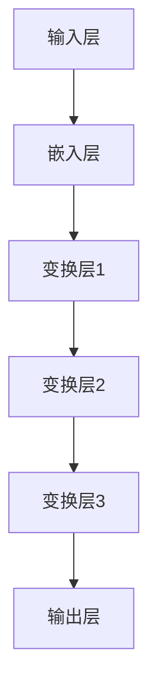
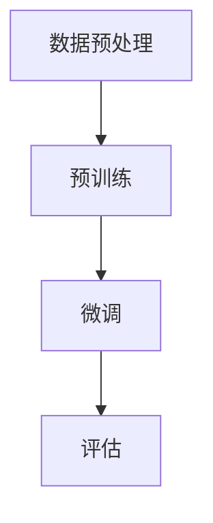
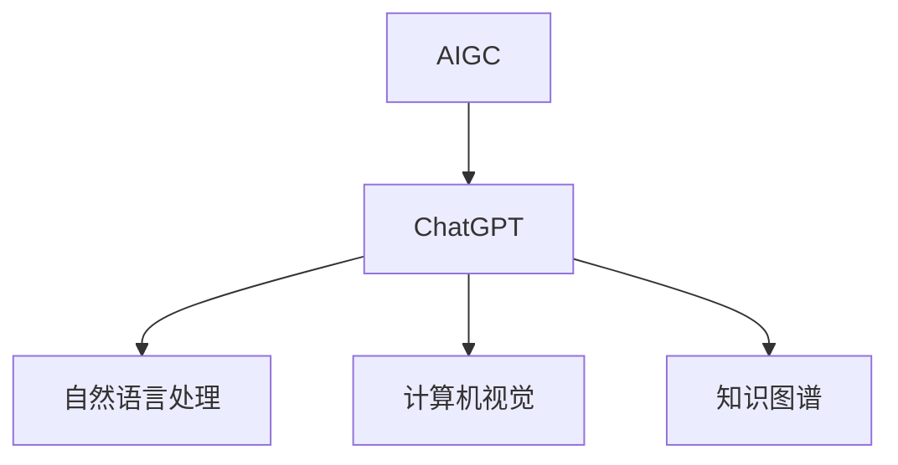

                 

# 《AIGC从入门到实战：ChatGPT 仅仅是个聊天机器人？》

> **关键词：** AIGC、ChatGPT、自然语言处理、人工智能、深度学习、模型优化、安全性

> **摘要：** 本文将从AIGC的概念、ChatGPT的工作原理，到其在实际项目中的应用和优化技巧，带你全面了解AIGC技术。我们将通过深入分析AIGC与人工智能其他领域的关系，探讨其发展趋势和未来前景。最后，附上详细的开发工具和实战案例解析，助你从入门到实战，一窥AIGC的魅力。

## 目录大纲

1. 第一部分：AIGC基础与ChatGPT原理
   1.1 AIGC概述
   1.2 ChatGPT原理解析
   1.3 AIGC与人工智能其他领域的关系
2. 第二部分：AIGC实战案例与ChatGPT优化
   2.1 AIGC项目实战
   2.2 ChatGPT优化技巧
3. 第三部分：AIGC发展趋势与未来展望
   3.1 AIGC的技术发展趋势
   3.2 AIGC在行业中的应用前景
   3.3 AIGC面临的挑战与机遇
   3.4 AIGC的未来发展展望
4. 附录
   4.1 AIGC开发工具与资源
   4.2 ChatGPT详细操作指南
   4.3 AIGC项目实战代码解析

## 第一部分：AIGC基础与ChatGPT原理

### 1.1 AIGC概述

#### 1.1.1 AIGC的概念

AIGC（AI-Generated Content），即人工智能生成内容，是指利用人工智能技术生成各种类型的内容，如文本、图像、音频、视频等。AIGC的核心在于模拟人类的创造力和思考过程，从而实现自动化的内容生成。

#### 1.1.2 AIGC的重要性

随着互联网和大数据的发展，内容创作需求日益增加。而AIGC技术的出现，使得内容生成变得更加高效、多样和智能。AIGC不仅在娱乐、媒体等领域有广泛应用，还在广告、教育、金融等领域展示了巨大的潜力。

#### 1.1.3 AIGC的发展历程

AIGC的发展可以分为三个阶段：

1. **初期阶段**：以规则为基础的内容生成，如简单的文本自动生成、关键词提取等。
2. **中期阶段**：以机器学习为基础的内容生成，如文本生成模型、图像生成模型等。
3. **当前阶段**：以深度学习为基础的内容生成，如生成对抗网络（GAN）、变分自编码器（VAE）等。

#### 1.1.4 AIGC的核心技术与应用场景

AIGC的核心技术包括自然语言处理（NLP）、计算机视觉（CV）和生成模型。应用场景主要包括：

1. **文本生成**：如自动写作、机器翻译、摘要生成等。
2. **图像生成**：如艺术创作、图像修复、风格迁移等。
3. **音频生成**：如音乐创作、语音合成等。
4. **视频生成**：如视频特效、视频生成等。

#### 1.1.5 AIGC与ChatGPT的关系

ChatGPT是AIGC技术的一个重要应用，它基于生成式预训练变换模型（GPT），能够进行自然语言处理和生成。ChatGPT的核心在于其能够模拟人类的对话过程，从而实现智能问答和对话生成。

### 1.2 ChatGPT原理解析

#### 1.2.1 ChatGPT的模型架构

ChatGPT是基于生成式预训练变换模型（GPT）开发的，其模型架构主要包括以下几个部分：

1. **输入层**：接收用户输入的文本。
2. **嵌入层**：将文本转换为向量。
3. **变换层**：通过多层变换，对文本向量进行加工。
4. **输出层**：生成文本输出。

#### 1.2.2 ChatGPT的核心算法

ChatGPT的核心算法是基于生成式预训练变换模型（GPT）。其训练过程主要包括以下步骤：

1. **预训练**：在大量的无监督数据上进行训练，使得模型能够捕捉到数据中的统计规律。
2. **微调**：在监督数据上进行微调，使得模型能够适应特定的任务。

#### 1.2.3 ChatGPT的训练过程

ChatGPT的训练过程可以分为以下几个阶段：

1. **数据预处理**：清洗、分词、编码等。
2. **预训练**：在大量的文本数据上进行预训练，使得模型能够捕捉到数据中的统计规律。
3. **微调**：在特定的任务数据上进行微调，使得模型能够适应特定的任务。
4. **评估**：在测试集上评估模型的性能。

#### 1.2.4 ChatGPT的应用场景

ChatGPT的应用场景主要包括：

1. **智能问答**：如客服机器人、智能助手等。
2. **对话生成**：如聊天机器人、虚拟伴侣等。
3. **文本生成**：如自动写作、摘要生成等。

### 1.3 AIGC与人工智能其他领域的关系

#### 1.3.1 AIGC与自然语言处理

自然语言处理（NLP）是AIGC的重要组成部分。AIGC技术的发展，推动了NLP的进步。例如，生成式预训练变换模型（GPT）的出现，使得文本生成变得更加智能。

#### 1.3.2 AIGC与计算机视觉

计算机视觉（CV）是AIGC技术的另一个重要领域。AIGC技术的发展，为计算机视觉带来了新的可能性。例如，生成对抗网络（GAN）在图像生成中的应用。

#### 1.3.3 AIGC与知识图谱

知识图谱是一种结构化的知识表示形式，它是人工智能技术的重要组成部分。AIGC技术的发展，为知识图谱的构建和优化提供了新的方法。例如，基于生成模型的图谱节点生成。

## 第二部分：AIGC实战案例与ChatGPT优化

### 2.1 AIGC项目实战

#### 2.1.1 AIGC项目实战概述

在本节中，我们将通过两个实际项目案例，展示如何利用AIGC技术进行内容生成。

#### 2.1.2 实战案例1：构建个性化问答系统

##### 2.1.2.1 需求分析与设计

1. **需求分析**：用户能够通过文本输入提出问题，系统自动生成答案。
2. **设计**：采用ChatGPT作为问答系统的核心，结合自然语言处理技术，实现智能问答。

##### 2.1.2.2 模型选择与优化

1. **模型选择**：选择预训练好的ChatGPT模型。
2. **优化**：通过微调，使得模型能够适应特定领域的问答需求。

##### 2.1.2.3 实现与部署

1. **实现**：构建问答系统的前端和后端。
2. **部署**：将系统部署到服务器，实现线上运行。

#### 2.1.3 实战案例2：实现自动化内容创作

##### 2.1.3.1 需求分析与设计

1. **需求分析**：系统自动生成高质量的内容，如文章、博客等。
2. **设计**：采用生成式预训练变换模型（GPT）进行内容生成。

##### 2.1.3.2 模型选择与优化

1. **模型选择**：选择预训练好的GPT模型。
2. **优化**：通过微调，使得模型能够生成高质量的内容。

##### 2.1.3.3 实现与部署

1. **实现**：构建内容生成的系统。
2. **部署**：将系统部署到服务器，实现自动化内容创作。

### 2.2 ChatGPT优化技巧

#### 2.2.1 ChatGPT的优化目标

1. **准确性**：提高问答系统的准确率。
2. **效率**：提高模型处理速度。
3. **多样性**：生成更多样化的答案。

#### 2.2.2 ChatGPT的调参技巧

1. **学习率**：适当调整学习率，提高模型训练效果。
2. **批大小**：调整批大小，平衡训练速度和效果。
3. **dropout率**：调整dropout率，防止模型过拟合。

#### 2.2.3 ChatGPT的安全性和伦理问题

1. **安全性**：防止模型被恶意利用。
2. **伦理问题**：确保模型生成的内容符合伦理规范。

#### 2.2.4 ChatGPT的应用场景拓展

1. **客服机器人**：提高客服效率。
2. **教育助手**：辅助学生进行学习。
3. **内容审核**：自动识别和过滤不良信息。

## 第三部分：AIGC发展趋势与未来展望

### 3.1 AIGC的技术发展趋势

1. **模型规模**：模型规模将越来越大，性能将越来越强。
2. **多模态**：将语音、图像、视频等多种模态进行融合。
3. **知识图谱**：结合知识图谱，实现更智能的内容生成。

### 3.2 AIGC在行业中的应用前景

1. **娱乐**：自动化视频、音频、游戏内容生成。
2. **媒体**：自动化新闻写作、视频制作等。
3. **教育**：自动生成教学资源、学习计划等。

### 3.3 AIGC面临的挑战与机遇

#### 3.3.1 挑战

1. **数据质量**：高质量的数据是AIGC发展的基础。
2. **模型解释性**：需要提高模型的可解释性。
3. **伦理问题**：需要解决伦理问题，确保模型生成的内容符合伦理规范。

#### 3.3.2 机遇

1. **产业发展**：随着AIGC技术的成熟，将为产业发展带来新机遇。
2. **技术创新**：AIGC技术的发展，将推动人工智能技术的创新。

### 3.4 AIGC的未来发展展望

1. **全场景覆盖**：AIGC将覆盖更多场景，实现更广泛的应用。
2. **智能化**：AIGC将更加智能化，模拟人类的思考过程。
3. **多元化**：AIGC将生成更多元化的内容，满足不同需求。

## 附录

### 4.1 AIGC开发工具与资源

#### 4.1.1 AIGC开发环境搭建

1. **硬件环境**：配置高性能的计算机。
2. **软件环境**：安装Python、TensorFlow等。

#### 4.1.2 主流AIGC框架对比

1. **GPT-3**：OpenAI开发的生成式预训练变换模型。
2. **BERT**：Google开发的基于Transformer的预训练模型。
3. **BERT**：Google开发的基于Transformer的预训练模型。

#### 4.1.3 AIGC开源资源汇总

1. **GitHub**：开源代码和资源。
2. **论文**：最新的AIGC研究成果。

### 4.2 ChatGPT详细操作指南

#### 4.2.1 ChatGPT的注册与登录

1. **注册**：在ChatGPT官网注册账号。
2. **登录**：使用账号密码登录。

#### 4.2.2 ChatGPT的基本使用方法

1. **输入问题**：在输入框输入问题。
2. **获取答案**：点击“获取答案”按钮，系统自动生成答案。

#### 4.2.3 ChatGPT的高级使用技巧

1. **多轮对话**：与ChatGPT进行多轮对话。
2. **自定义模型**：使用自定义模型进行问答。

#### 4.2.4 ChatGPT的API使用指南

1. **API接入**：接入ChatGPT API。
2. **API调用**：使用API进行问答。

### 4.3 AIGC项目实战代码解析

#### 4.3.1 实战案例1：个性化问答系统代码解析

1. **代码实现**：展示代码实现过程。
2. **代码解读**：对代码进行解读。

#### 4.3.2 实战案例2：自动化内容创作代码解析

1. **代码实现**：展示代码实现过程。
2. **代码解读**：对代码进行解读。

### 4.3.3 代码解读与分析

1. **代码分析**：分析代码的优缺点。
2. **改进建议**：提出改进建议。

## 作者

**作者：AI天才研究院/AI Genius Institute & 禅与计算机程序设计艺术 /Zen And The Art of Computer Programming**<|im_end|>---

### 1.2 ChatGPT原理解析

#### 1.2.1 ChatGPT的模型架构

ChatGPT是基于生成式预训练变换模型（GPT）开发的，其模型架构主要包括以下几个部分：

1. **输入层**：接收用户输入的文本。
2. **嵌入层**：将文本转换为向量。
3. **变换层**：通过多层变换，对文本向量进行加工。
4. **输出层**：生成文本输出。

ChatGPT的模型架构图如下所示：



#### 1.2.2 ChatGPT的核心算法

ChatGPT的核心算法是基于生成式预训练变换模型（GPT）。其训练过程主要包括以下步骤：

1. **预训练**：在大量的无监督数据上进行训练，使得模型能够捕捉到数据中的统计规律。
2. **微调**：在监督数据上进行微调，使得模型能够适应特定的任务。

ChatGPT的预训练和微调过程可以用以下伪代码表示：

```python
# 预训练过程
for epoch in range(num_epochs):
    for batch in data_loader:
        # 前向传播
        output = model(batch.text)
        # 计算损失
        loss = criterion(output, batch.label)
        # 反向传播
        optimizer.zero_grad()
        loss.backward()
        optimizer.step()

# 微调过程
for epoch in range(num_epochs):
    for batch in data_loader:
        # 前向传播
        output = model(batch.text)
        # 计算损失
        loss = criterion(output, batch.label)
        # 反向传播
        optimizer.zero_grad()
        loss.backward()
        optimizer.step()
```

#### 1.2.3 ChatGPT的训练过程

ChatGPT的训练过程可以分为以下几个阶段：

1. **数据预处理**：清洗、分词、编码等。
2. **预训练**：在大量的文本数据上进行预训练，使得模型能够捕捉到数据中的统计规律。
3. **微调**：在特定的任务数据上进行微调，使得模型能够适应特定的任务。
4. **评估**：在测试集上评估模型的性能。

ChatGPT的训练过程可以用以下步骤表示：



#### 1.2.4 ChatGPT的应用场景

ChatGPT的应用场景主要包括：

1. **智能问答**：如客服机器人、智能助手等。
2. **对话生成**：如聊天机器人、虚拟伴侣等。
3. **文本生成**：如自动写作、摘要生成等。

ChatGPT在不同应用场景中的示例：

1. **智能问答**：

   ```python
   question = "什么是人工智能？"
   answer = chatgpt.generate(question)
   print(answer)
   ```

2. **对话生成**：

   ```python
   conversation = [
       {"role": "user", "content": "你好，我是ChatGPT。"},
       {"role": "assistant", "content": "你好！有什么可以帮到你的吗？"},
       {"role": "user", "content": "我想了解人工智能的发展历史。"},
   ]
   chatgpt.generate_conversation(conversation)
   ```

3. **文本生成**：

   ```python
   title = "人工智能的未来发展趋势"
   abstract = chatgpt.generate_title_abstract(title)
   print(abstract)
   ```

### 1.3 AIGC与人工智能其他领域的关系

#### 1.3.1 AIGC与自然语言处理

自然语言处理（NLP）是AIGC的重要组成部分。AIGC技术的发展，推动了NLP的进步。例如，生成式预训练变换模型（GPT）的出现，使得文本生成变得更加智能。

#### 1.3.2 AIGC与计算机视觉

计算机视觉（CV）是AIGC技术的另一个重要领域。AIGC技术的发展，为计算机视觉带来了新的可能性。例如，生成对抗网络（GAN）在图像生成中的应用。

#### 1.3.3 AIGC与知识图谱

知识图谱是一种结构化的知识表示形式，它是人工智能技术的重要组成部分。AIGC技术的发展，为知识图谱的构建和优化提供了新的方法。例如，基于生成模型的图谱节点生成。

### 1.4 AIGC与ChatGPT的关系

ChatGPT是AIGC技术的一个重要应用，它基于生成式预训练变换模型（GPT），能够进行自然语言处理和生成。ChatGPT的核心在于其能够模拟人类的对话过程，从而实现智能问答和对话生成。

AIGC与ChatGPT的关系可以用以下图示表示：



通过以上分析，我们可以看到AIGC和ChatGPT在人工智能领域的重要地位和广泛应用。接下来，我们将继续探讨AIGC的实战案例和优化技巧。|>

