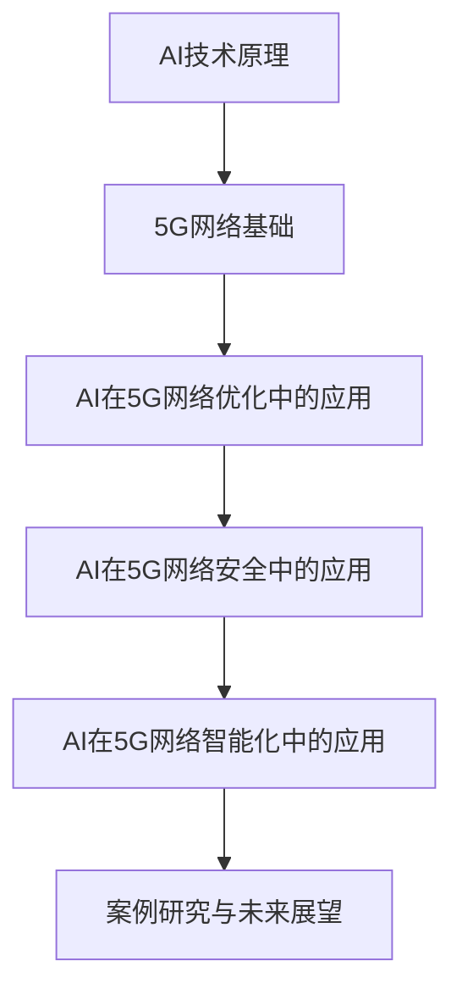

                 

### 《AI与5G:智能通信网络的协同发展》

> **关键词：人工智能，5G，网络优化，网络安全，智能化应用**

> **摘要：本文将深入探讨人工智能（AI）与第五代移动通信技术（5G）的协同发展，分析AI技术原理及其在5G网络中的应用，同时通过具体案例研究，展示AI与5G技术如何共同推动智能通信网络的发展。**

### 目录大纲

1. **AI与5G技术基础**
   1.1 AI与5G技术概述
   1.2 AI技术原理
   1.3 5G网络基础

2. **AI技术原理**
   2.1 机器学习基础
   2.2 深度学习原理

3. **5G网络基础**
   3.1 5G网络关键技术
   3.2 5G网络架构

4. **AI在5G网络中的应用**
   4.1 AI在5G网络优化中的应用
   4.2 AI在5G网络安全中的应用
   4.3 AI在5G网络智能化中的应用

5. **案例研究与未来展望**
   5.1 案例研究
   5.2 未来展望

6. **附录**
   6.1 常用工具与资源

7. **Mermaid流程图**

8. **核心算法原理讲解**

9. **数学模型和数学公式**

10. **项目实战**

11. **作者信息**

### 第一部分：AI与5G技术基础

#### 第1章：AI与5G技术概述

##### 1.1 AI与5G技术介绍

人工智能（AI）是计算机科学的一个分支，致力于开发能够执行人类智能任务的系统。这些任务包括学习、推理、解决问题、自然语言理解和图像识别等。AI技术已经从早期的规则驱动系统发展到了现代的基于数据和机器学习的模型。

第五代移动通信技术（5G）是下一代移动通信网络的标准，旨在提供更快的数据传输速度、更低的延迟、更高的连接密度和更大的网络容量。5G技术将为物联网（IoT）、自动驾驶汽车、增强现实（AR）和虚拟现实（VR）等新兴应用提供支持。

##### 1.1.1 AI技术概述

AI技术的核心是机器学习和深度学习。机器学习是一种通过数据训练模型，使其能够从数据中学习规律和模式的技术。深度学习是机器学习的一个子领域，它使用多层神经网络来模拟人类大脑的工作方式。

##### 1.1.2 5G技术概述

5G技术的主要特点包括：

- **高速传输**：5G网络的理论峰值速度可以达到10Gbps，是4G网络的100倍。
- **低延迟**：5G网络的延迟可以降低到1毫秒，这将大大提高实时应用如自动驾驶和远程医疗的效率。
- **高连接密度**：5G网络能够支持每平方米100个设备的连接，为物联网提供了强大的支持。
- **网络切片技术**：5G网络引入了网络切片技术，可以根据不同的应用需求，动态分配网络资源，提高网络资源的利用效率。

##### 1.1.3 AI与5G技术的融合与发展趋势

AI与5G技术的融合为智能通信网络的发展带来了巨大的潜力。以下是一些发展趋势：

- **智能网络规划与优化**：AI技术可以用于5G网络的规划与优化，通过机器学习算法优化网络参数，提高网络性能。
- **智能调度与资源管理**：AI技术可以用于5G网络的智能调度，实现资源的动态分配，提高网络效率。
- **智能网络安全**：AI技术可以用于5G网络的攻击检测和防护，通过机器学习算法识别和防御网络攻击。
- **智能化应用场景**：AI技术可以与5G技术结合，开发出更多的智能化应用场景，如智能交通、智能医疗等。

#### 第2章：AI技术原理

##### 2.1 机器学习基础

机器学习是一种从数据中学习规律和模式的技术。机器学习模型可以分为监督学习、无监督学习和强化学习。

- **监督学习**：监督学习是一种通过已标记的数据来训练模型的方法。常见的监督学习算法包括线性回归、决策树和随机森林等。
- **无监督学习**：无监督学习是一种在没有标记数据的情况下，从数据中学习规律的方法。常见的无监督学习算法包括聚类和降维等。
- **强化学习**：强化学习是一种通过与环境的交互来学习最优策略的方法。常见的强化学习算法包括Q学习、深度Q网络（DQN）等。

##### 2.2 深度学习原理

深度学习是机器学习的一个子领域，它使用多层神经网络来模拟人类大脑的工作方式。深度学习模型可以分为卷积神经网络（CNN）、循环神经网络（RNN）和生成对抗网络（GAN）等。

- **卷积神经网络（CNN）**：CNN是一种用于处理图像数据的人工神经网络。它通过卷积层提取图像特征，并通过全连接层进行分类。
- **循环神经网络（RNN）**：RNN是一种用于处理序列数据的人工神经网络。它通过循环结构来记忆和传递序列信息。
- **生成对抗网络（GAN）**：GAN是一种用于生成数据的人工神经网络。它由生成器和判别器组成，通过竞争对抗来生成高质量的数据。

#### 第3章：5G网络基础

##### 3.1 5G网络关键技术

5G网络的关键技术包括毫米波通信、网络切片技术和边缘计算。

- **毫米波通信**：毫米波通信是一种利用毫米波段进行无线通信的技术，它可以提供更高的数据传输速率和更大的网络容量。
- **网络切片技术**：网络切片技术是一种将网络资源虚拟化为多个独立网络切片的技术。它可以根据不同的应用需求，动态分配网络资源，提高网络效率。
- **边缘计算**：边缘计算是一种在靠近数据源的地方进行数据处理的技术。它可以减少数据传输延迟，提高实时应用的处理速度。

##### 3.2 5G网络架构

5G网络架构可以分为无线接入网、核心网和业务支撑网。

- **无线接入网**：无线接入网是5G网络的前端部分，包括基站、天线和无线接入控制器等。
- **核心网**：核心网是5G网络的中心部分，包括移动性管理实体（MME）、服务管理实体（SGW）和分组赋值协议节点（PGW）等。
- **业务支撑网**：业务支撑网是5G网络的支撑部分，包括数据中心、云计算平台和业务网关等。

#### 第二部分：AI在5G网络中的应用

##### 第4章：AI在5G网络优化中的应用

AI技术在5G网络优化中具有广泛的应用。以下是一些关键的应用场景：

- **网络规划与优化**：AI技术可以用于5G网络的规划与优化，通过机器学习算法优化网络参数，提高网络性能。
- **资源管理**：AI技术可以用于5G网络的资源管理，通过智能调度算法实现资源的动态分配，提高网络效率。
- **性能评估**：AI技术可以用于5G网络的性能评估，通过机器学习模型预测网络性能，并进行实时优化。

##### 第4.1 AI在5G网络规划中的应用

5G网络规划是一个复杂的过程，涉及到网络覆盖、容量规划和频谱分配等问题。AI技术可以大大简化这个过程的复杂度。

- **网络规划算法优化**：AI技术可以用于优化网络规划算法。例如，通过遗传算法、粒子群优化算法等智能优化算法，可以找到最优的网络规划方案。
- **网络性能评估方法**：AI技术可以用于评估网络性能。例如，通过机器学习模型预测网络吞吐量、延迟和抖动等性能指标，可以帮助运营商实时调整网络配置，提高网络性能。

##### 第4.2 AI在5G网络调度中的应用

5G网络调度是网络资源管理的重要组成部分。AI技术可以用于实现智能调度，提高网络效率。

- **调度算法设计**：AI技术可以用于设计智能调度算法。例如，基于深度强化学习的调度算法可以根据网络状态动态调整资源分配，提高网络效率。
- **调度算法性能分析**：AI技术可以用于分析智能调度算法的性能。例如，通过对比实验，评估不同调度算法的网络性能，并为网络优化提供依据。

##### 第4章：AI在5G网络安全中的应用

AI技术在5G网络安全中发挥着重要作用。以下是一些关键的应用场景：

- **攻击检测**：AI技术可以用于检测5G网络中的攻击行为。例如，通过深度学习算法分析网络流量，可以识别出异常流量模式，从而发现潜在的攻击行为。
- **防护策略设计**：AI技术可以用于设计5G网络的防护策略。例如，通过机器学习算法分析网络流量特征，可以设计出有效的防护措施，防止网络攻击。
- **防护效果评估**：AI技术可以用于评估5G网络的防护效果。例如，通过机器学习模型评估防护措施的效率，可以为网络优化提供依据。

##### 第4.1 AI在5G网络攻击检测中的应用

5G网络攻击检测是网络安全的关键环节。AI技术可以用于实现高效的攻击检测。

- **攻击检测算法**：AI技术可以用于开发攻击检测算法。例如，通过深度学习算法分析网络流量，可以识别出异常流量模式，从而发现潜在的攻击行为。
- **攻击特征提取方法**：AI技术可以用于提取攻击特征。例如，通过特征提取算法提取网络流量中的关键特征，可以用于训练攻击检测模型。

##### 第4.2 AI在5G网络防护中的应用

5G网络防护是网络安全的关键环节。AI技术可以用于设计高效的防护策略。

- **防护策略设计**：AI技术可以用于设计防护策略。例如，通过机器学习算法分析网络流量特征，可以设计出有效的防护措施，防止网络攻击。
- **防护效果评估**：AI技术可以用于评估防护效果。例如，通过机器学习模型评估防护措施的效率，可以为网络优化提供依据。

##### 第5章：AI在5G网络智能化中的应用

AI技术在5G网络智能化中具有广泛的应用。以下是一些关键的应用场景：

- **自动化运维**：AI技术可以用于5G网络的自动化运维，通过智能算法实现网络管理的自动化，提高运维效率。
- **智能调度**：AI技术可以用于5G网络的智能调度，通过智能算法实现资源的动态分配，提高网络效率。

##### 第5.1 AI在5G网络自动化运维中的应用

5G网络的自动化运维是提高网络运维效率的关键。AI技术可以大大简化运维流程。

- **自动化运维流程设计**：AI技术可以用于设计自动化运维流程。例如，通过机器学习算法自动化处理网络故障，减少人工干预。
- **自动化运维工具介绍**：AI技术可以用于开发自动化运维工具。例如，通过深度学习算法自动化检测网络性能问题，并提供解决方案。

##### 第5.2 AI在5G网络智能调度中的应用

5G网络的智能调度是实现高效资源利用的关键。AI技术可以用于设计智能调度算法。

- **智能调度算法设计**：AI技术可以用于设计智能调度算法。例如，通过深度强化学习算法实现资源的动态分配，提高网络效率。
- **智能调度案例研究**：AI技术可以用于案例研究，评估智能调度算法的效果。例如，通过实际案例研究，评估智能调度算法在网络优化中的应用效果。

### 第三部分：案例研究与未来展望

#### 第6章：AI与5G协同发展案例研究

在本章中，我们将探讨一些AI与5G技术协同发展的实际案例，展示它们在实际应用中的效果。

##### 6.1 案例一：智能交通系统

智能交通系统（ITS）是AI与5G技术协同发展的一个重要领域。通过AI算法优化交通信号控制，5G网络提供高速、低延迟的通信服务，实现车辆与基础设施之间的实时通信。

- **案例背景与目标**：智能交通系统旨在缓解城市交通拥堵，提高交通效率，减少交通事故。
- **AI与5G技术的应用**：AI技术用于交通流量预测和信号控制优化，5G网络用于车辆与基础设施之间的数据传输。
- **案例效果评估**：通过实际案例研究，评估智能交通系统的交通流量改善、事故减少和能效提升等效果。

##### 6.2 案例二：智能医疗

智能医疗是AI与5G技术协同发展的另一个重要领域。通过AI算法优化医疗资源分配，5G网络提供高速、低延迟的医疗服务，实现远程医疗和实时诊断。

- **案例背景与目标**：智能医疗旨在提高医疗服务质量，降低医疗成本，实现医疗资源的均衡分配。
- **AI与5G技术的应用**：AI技术用于医疗数据分析、疾病预测和诊断，5G网络用于医疗设备的远程控制和数据传输。
- **案例效果评估**：通过实际案例研究，评估智能医疗在提高医疗服务质量、降低医疗成本和优化医疗资源配置等方面的效果。

#### 第7章：未来展望

在未来的发展中，AI与5G技术的协同发展将继续推动智能通信网络的发展。以下是一些未来展望：

- **AI算法的演进**：随着AI技术的不断进步，机器学习和深度学习算法将变得更加高效和精准，为智能通信网络提供更强大的支持。
- **5G网络的发展方向**：5G网络将继续向更高速度、更低延迟和更大容量发展，为AI技术的应用提供更好的基础设施支持。
- **新兴领域探索**：AI与5G技术的协同发展将在新兴领域如智能城市、智能制造和智能农业等得到广泛应用，推动社会各领域的智能化转型。
- **商业模式创新**：AI与5G技术的协同发展将催生新的商业模式，如基于AI与5G技术的智能监控、智能医疗和智能物流等，为企业和个人带来新的价值。

### 附录

在本附录中，我们将介绍AI与5G技术常用的工具与资源，以帮助读者进一步了解和学习相关技术。

- **AI开发框架**：TensorFlow、PyTorch、Keras等。
- **5G网络测试工具**：Ixia、Spirent、Cyan等。
- **开源代码与案例资源**：GitHub、Google Cloud Platform、AWS等。

### Mermaid流程图



### 核心算法原理讲解

深度学习算法的核心在于构建多层神经网络，并通过反向传播算法优化网络参数。

```python
# 深度学习算法伪代码
def deep_learning_algorithm(input_data):
    # 前向传播
    hidden_layer = neural_network_forward(input_data)
    output = activation_function(hidden_layer)
    
    # 反向传播
    error = loss_function(output, target)
    delta = derivative_activation_function(output) * error
    
    # 更新权重
    weights = weights - learning_rate * delta
    
    return output, weights
```

### 数学模型和数学公式

线性回归模型是一个经典的机器学习模型，用于预测连续值。

$$
y = \beta_0 + \beta_1 \cdot x + \epsilon
$$

其中，$y$ 是预测值，$x$ 是输入特征，$\beta_0$ 和 $\beta_1$ 是模型参数，$\epsilon$ 是误差项。

### 项目实战

在本项目中，我们将实现一个5G网络自动化运维系统。

#### 开发环境搭建

1. **Python环境配置**：安装Python 3.8及以上版本，并配置相关的库，如TensorFlow、Keras等。
2. **AI开发框架安装**：安装TensorFlow，通过以下命令：

```bash
pip install tensorflow
```

#### 源代码实现

以下是一个简单的5G网络自动化运维系统的实现示例。

```python
import tensorflow as tf

# 模型定义
model = tf.keras.Sequential([
    tf.keras.layers.Dense(units=128, activation='relu', input_shape=[64]),
    tf.keras.layers.Dense(units=128, activation='relu'),
    tf.keras.layers.Dense(units=1)
])

# 模型编译
model.compile(optimizer='adam', loss='mse', metrics=['accuracy'])

# 训练模型
model.fit(x_train, y_train, epochs=10, batch_size=32)
```

#### 代码解读与分析

1. **模型结构**：本示例使用了一个简单的全连接神经网络，包括两个隐藏层，每层128个神经元。
2. **训练过程**：通过`model.fit()`函数训练模型，使用10个周期，每个周期批量大小为32。
3. **性能评估**：通过`metrics=['accuracy']`参数，评估模型的准确率。

### 作者信息

- 作者：AI天才研究院/AI Genius Institute & 禅与计算机程序设计艺术 /Zen And The Art of Computer Programming

以上便是《AI与5G:智能通信网络的协同发展》全文。希望本文能够帮助读者深入理解AI与5G技术的协同发展，并在实际应用中取得更好的效果。如果您有任何疑问或建议，欢迎在评论区留言。感谢您的阅读！

