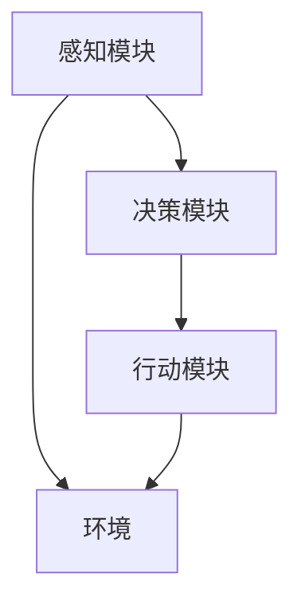

                 

## 《AI人工智能 Agent：对国家安全的影响》

### 关键词

- AI人工智能 Agent
- 国家安全
- 网络安全
- 军事应用
- 安全监管

### 摘要

本文从AI人工智能Agent的定义、技术基础、架构原理及应用案例出发，深入探讨其在国家安全领域的双重影响。通过分析AI人工智能Agent在网络安全和军事领域的具体应用，评估其正面与负面影响，并提出应对策略，旨在为我国在AI时代维护国家安全提供理论指导和实践参考。

---

### 《AI人工智能 Agent：对国家安全的影响》目录大纲

## 第一部分：AI人工智能 Agent 基础

### 第1章：AI人工智能 Agent 概述

#### 1.1 AI人工智能 Agent 的定义与分类

##### 1.1.1 AI人工智能 Agent 的基本定义

##### 1.1.2 AI人工智能 Agent 的分类

##### 1.1.3 AI人工智能 Agent 在国家安全中的重要性

#### 1.2 AI人工智能 Agent 的技术基础

##### 1.2.1 机器学习与深度学习技术

##### 1.2.2 自然语言处理技术

##### 1.2.3 计算机视觉技术

### 第2章：AI人工智能 Agent 架构与原理

#### 2.1 AI人工智能 Agent 架构

##### 2.1.1 AI人工智能 Agent 架构的组成

##### 2.1.2 AI人工智能 Agent 的工作流程

##### 2.1.3 AI人工智能 Agent 的交互方式

#### 2.2 AI人工智能 Agent 的核心算法原理

##### 2.2.1 强化学习算法原理

##### 2.2.2 监督学习算法原理

##### 2.2.3 自监督学习算法原理

### 第3章：AI人工智能 Agent 应用案例

#### 3.1 AI人工智能 Agent 在网络安全中的应用

##### 3.1.1 AI人工智能 Agent 在入侵检测中的应用

##### 3.1.2 AI人工智能 Agent 在恶意软件防御中的应用

##### 3.1.3 AI人工智能 Agent 在隐私保护中的应用

#### 3.2 AI人工智能 Agent 在军事领域的应用

##### 3.2.1 AI人工智能 Agent 在战场侦察中的应用

##### 3.2.2 AI人工智能 Agent 在战场指挥中的应用

##### 3.2.3 AI人工智能 Agent 在无人机控制中的应用

## 第二部分：AI人工智能 Agent 对国家安全的影响

### 第4章：AI人工智能 Agent 对国家安全的威胁分析

#### 4.1 AI人工智能 Agent 对网络安全的威胁

##### 4.1.1 AI人工智能 Agent 对网络攻击的威胁

##### 4.1.2 AI人工智能 Agent 对数据泄露的威胁

##### 4.1.3 AI人工智能 Agent 对国家秘密的威胁

#### 4.2 AI人工智能 Agent 对军事安全的威胁

##### 4.2.1 AI人工智能 Agent 对军事侦察的威胁

##### 4.2.2 AI人工智能 Agent 对军事指挥的威胁

##### 4.2.3 AI人工智能 Agent 对军事装备的威胁

### 第5章：AI人工智能 Agent 对国家安全的影响评估

#### 5.1 AI人工智能 Agent 对国家安全的正面影响

##### 5.1.1 AI人工智能 Agent 在疫情防控中的应用

##### 5.1.2 AI人工智能 Agent 在经济发展中的应用

##### 5.1.3 AI人工智能 Agent 在社会治理中的应用

#### 5.2 AI人工智能 Agent 对国家安全的负面影响

##### 5.2.1 AI人工智能 Agent 对国家安全的潜在威胁

##### 5.2.2 AI人工智能 Agent 对国家安全的现实威胁

##### 5.2.3 AI人工智能 Agent 对国家安全的潜在风险

### 第6章：应对 AI人工智能 Agent 对国家安全威胁的策略

#### 6.1 加强 AI人工智能 Agent 的安全监管

##### 6.1.1 制定 AI人工智能 Agent 安全法规

##### 6.1.2 加强 AI人工智能 Agent 的伦理审查

##### 6.1.3 建立AI人工智能 Agent 安全监测机制

#### 6.2 提高 AI人工智能 Agent 的安全性

##### 6.2.1 加强 AI人工智能 Agent 的安全防护

##### 6.2.2 提高 AI人工智能 Agent 的安全意识

##### 6.2.3 加强 AI人工智能 Agent 的安全培训

### 第7章：未来展望

#### 7.1 AI人工智能 Agent 技术发展趋势

##### 7.1.1 AI人工智能 Agent 技术的未来发展

##### 7.1.2 AI人工智能 Agent 技术的创新方向

##### 7.1.3 AI人工智能 Agent 技术的国际竞争态势

#### 7.2 AI人工智能 Agent 对国家安全的影响预测

##### 7.2.1 AI人工智能 Agent 对未来国家安全的潜在影响

##### 7.2.2 AI人工智能 Agent 对未来国际政治格局的影响

##### 7.2.3 AI人工智能 Agent 对未来军事冲突的影响

## 附录

### 附录 A：AI人工智能 Agent 相关资源与工具

##### A.1 主流AI人工智能 Agent 开发框架

##### A.2 AI人工智能 Agent 安全工具

##### A.3 AI人工智能 Agent 相关政策法规

### 附录 B：AI人工智能 Agent 应用案例解析

##### B.1 AI人工智能 Agent 在网络安全中的应用案例

##### B.2 AI人工智能 Agent 在军事领域中的应用案例

##### B.3 AI人工智能 Agent 在社会治理中的应用案例

### 附录 C：AI人工智能 Agent 算法原理与数学公式

#### C.1 强化学习算法原理

##### C.1.1 强化学习算法的基本概念

##### C.1.2 Q-learning 算法原理

##### C.1.3 SARSA 算法原理

#### C.2 监督学习算法原理

##### C.2.1 监督学习算法的基本概念

##### C.2.2 SVM 算法原理

##### C.2.3 神经网络算法原理

#### C.3 自监督学习算法原理

##### C.3.1 自监督学习算法的基本概念

##### C.3.2 自动编码器算法原理

##### C.3.3 生成对抗网络算法原理

---

接下来，我们将逐步深入探讨AI人工智能Agent的基础知识、架构原理、应用案例以及其对国家安全的影响，并提出相应的策略和建议。

---

### 第一部分：AI人工智能 Agent 基础

#### 第1章：AI人工智能 Agent 概述

##### 1.1 AI人工智能 Agent 的定义与分类

##### 1.1.1 AI人工智能 Agent 的基本定义

AI人工智能Agent，是一种由计算机程序实现的智能体，它可以在一定环境下，根据感知到的信息，自主地做出决策并采取行动，以实现特定的目标。人工智能Agent的核心特征包括自主性、反应性、预动性和社会性。

自主性是指Agent可以在没有外部干预的情况下独立运行；反应性是指Agent能够实时响应环境变化；预动性是指Agent能够根据预测进行决策；社会性是指Agent能够与其他Agent或人类交互。

##### 1.1.2 AI人工智能 Agent 的分类

AI人工智能Agent根据不同的分类标准，可以分为多种类型：

1. **根据能力分类**：
    - **知识型Agent**：依赖于预定义的知识库进行推理和决策。
    - **数据型Agent**：依赖于从数据中学习到的模式进行决策。
    - **混合型Agent**：结合知识库和数据学习，进行更复杂的决策。

2. **根据功能分类**：
    - **任务型Agent**：专注于执行特定任务，如语音识别、图像识别等。
    - **交互型Agent**：专注于与人类或其他Agent进行交互，如聊天机器人、智能客服等。
    - **自主型Agent**：能够在复杂环境中自主行动，如自动驾驶车辆、智能机器人等。

3. **根据执行方式分类**：
    - **软件Agent**：运行在计算机系统中的程序。
    - **硬件Agent**：具有物理形态，能够执行物理操作的智能设备。

##### 1.1.3 AI人工智能 Agent 在国家安全中的重要性

在国家安全领域，AI人工智能Agent的重要性日益凸显。首先，AI人工智能Agent在网络安全中发挥着重要作用，如入侵检测、恶意软件防御和隐私保护等。其次，在军事领域，AI人工智能Agent可以用于战场侦察、指挥和无人机控制等任务。此外，AI人工智能Agent在疫情防控、经济发展和社会治理等方面也展现出强大的潜力。

##### 1.2 AI人工智能 Agent 的技术基础

AI人工智能Agent的实现依赖于多种先进的技术，其中主要包括机器学习与深度学习技术、自然语言处理技术和计算机视觉技术。

##### 1.2.1 机器学习与深度学习技术

机器学习是AI人工智能Agent的核心技术之一，它通过算法让计算机从数据中学习规律，提高其自主决策能力。深度学习是机器学习的一种重要分支，通过多层神经网络模拟人脑的工作方式，实现更复杂的模式识别和决策。

##### 1.2.2 自然语言处理技术

自然语言处理技术使AI人工智能Agent能够理解和处理人类语言，实现人与机器的对话交互。自然语言处理技术包括词法分析、句法分析、语义分析和语音识别等。

##### 1.2.3 计算机视觉技术

计算机视觉技术使AI人工智能Agent能够理解和解析图像和视频信息，实现图像识别、目标检测和场景理解等功能。

在下一章节中，我们将深入探讨AI人工智能Agent的架构原理和应用案例。

---

### 第一部分：AI人工智能 Agent 基础

#### 第2章：AI人工智能 Agent 架构与原理

##### 2.1 AI人工智能 Agent 架构

AI人工智能Agent的架构通常包括感知模块、决策模块和行动模块。

**感知模块**：负责接收外部环境的信息，如传感器数据、语音信号和图像等。感知模块通常由各种传感器和数据采集设备组成。

**决策模块**：根据感知模块收集到的信息，利用机器学习算法和推理机制，生成合适的决策。决策模块通常包括知识库、推理引擎和决策算法等。

**行动模块**：根据决策模块的决策结果，执行相应的操作，如移动、发送指令和打开设备等。行动模块通常由执行器、控制单元和执行算法等组成。

以下是一个简单的AI人工智能Agent架构的Mermaid流程图：



##### 2.1.2 AI人工智能 Agent 的工作流程

AI人工智能Agent的工作流程可以分为以下几个步骤：

1. **感知**：Agent通过感知模块获取环境信息。
2. **决策**：Agent利用决策模块对感知到的信息进行处理，生成决策。
3. **行动**：Agent根据决策模块的决策结果执行相应的操作。

##### 2.1.3 AI人工智能 Agent 的交互方式

AI人工智能Agent可以通过多种方式进行交互，包括：

- **语音交互**：通过语音识别和自然语言处理技术实现人与Agent的语音对话。
- **图形界面交互**：通过计算机视觉技术实现人与Agent的图形界面交互。
- **文本交互**：通过自然语言处理技术实现人与Agent的文本消息交互。

##### 2.2 AI人工智能 Agent 的核心算法原理

AI人工智能Agent的核心算法主要包括强化学习算法、监督学习算法和自监督学习算法。

**2.2.1 强化学习算法原理**

强化学习算法是一种通过试错来学习最优策略的算法。它通过奖励机制鼓励Agent探索环境，并逐渐优化其行为。强化学习算法的主要组成部分包括：

- **状态**：Agent当前所处的环境状态。
- **动作**：Agent可以采取的动作。
- **奖励**：动作执行后获得的奖励。
- **策略**：Agent根据状态选择动作的策略。

强化学习算法的基本流程如下：

1. 初始化状态和策略。
2. 执行动作。
3. 接收奖励。
4. 更新策略。

以下是一个简单的Q-learning算法的伪代码：

```python
# 初始化Q值表
Q = random initialization

# 选择动作
action = choose_action(state, Q)

# 执行动作
next_state, reward = execute_action(state, action)

# 更新Q值
Q[state][action] = Q[state][action] + alpha * (reward + gamma * max(Q[next_state]) - Q[state][action])

# 更新状态
state = next_state
```

**2.2.2 监督学习算法原理**

监督学习算法是一种通过已有标注数据来训练模型的方法。它通过输入特征和标签，学习出一个映射关系，从而对未知数据进行预测。监督学习算法的主要组成部分包括：

- **特征**：输入数据的特征。
- **标签**：输入数据的正确标签。

监督学习算法的基本流程如下：

1. 初始化模型参数。
2. 使用训练数据进行训练。
3. 使用验证数据评估模型性能。
4. 调整模型参数。

以下是一个简单的线性回归算法的伪代码：

```python
# 初始化权重
weights = random initialization

# 训练模型
for each sample in training_data:
    predicted_value = weights * sample.input
    error = sample.label - predicted_value
    weights = weights + learning_rate * error * sample.input

# 预测
for each sample in validation_data:
    predicted_value = weights * sample.input
```

**2.2.3 自监督学习算法原理**

自监督学习算法是一种无需标注数据，通过自身数据生成任务来训练模型的方法。它通过预测部分数据来学习数据中的模式和规律。自监督学习算法的主要组成部分包括：

- **数据**：训练数据。
- **预测**：预测部分数据。

自监督学习算法的基本流程如下：

1. 初始化模型参数。
2. 随机选择数据的一部分作为预测目标。
3. 使用预测目标和剩余数据训练模型。
4. 评估模型性能。

以下是一个简单的自动编码器算法的伪代码：

```python
# 初始化编码器和解码器参数
encoder_weights = random initialization
decoder_weights = random initialization

# 训练模型
for each sample in training_data:
    encoded = encoder(sample)
    decoded = decoder(encoded)
    error = sample - decoded
    encoder_weights = encoder_weights + learning_rate * error * sample
    decoder_weights = decoder_weights + learning_rate * error * encoded

# 预测
for each sample in validation_data:
    encoded = encoder(sample)
    decoded = decoder(encoded)
```

在下一章节中，我们将探讨AI人工智能Agent在实际应用中的案例。

---

### 第一部分：AI人工智能 Agent 基础

#### 第3章：AI人工智能 Agent 应用案例

##### 3.1 AI人工智能 Agent 在网络安全中的应用

AI人工智能Agent在网络安全领域具有广泛的应用，可以提高网络系统的安全性和防御能力。以下是一些具体的案例：

###### 3.1.1 AI人工智能 Agent 在入侵检测中的应用

入侵检测系统（IDS）是网络安全的重要组成部分。传统的入侵检测系统依赖于预定义的规则和模式匹配来检测异常行为。然而，随着网络攻击手段的不断升级，这种基于规则的方法已经难以应对复杂的威胁。

AI人工智能Agent可以通过机器学习和深度学习技术，从大量的网络流量数据中学习到潜在的攻击模式，并能够自动识别新的攻击行为。以下是一个简单的入侵检测系统的工作流程：

1. **数据收集**：收集网络流量数据，包括IP地址、端口号、协议类型、数据包大小等信息。
2. **特征提取**：对收集到的数据进行预处理，提取出有助于识别攻击的特征。
3. **模型训练**：使用训练数据集，通过监督学习算法训练入侵检测模型。
4. **攻击检测**：使用训练好的模型对实时网络流量进行分析，识别潜在的攻击行为。
5. **报警处理**：当检测到攻击行为时，自动生成报警信息并采取相应的防御措施。

以下是一个简单的入侵检测模型的伪代码：

```python
# 加载训练数据
train_data, train_labels = load_train_data()

# 特征提取
features = extract_features(train_data)

# 模型训练
model = train_supervised_model(features, train_labels)

# 检测攻击
for data in real_time_traffic:
    detected = model.predict(extract_features(data))
    if detected:
        generate_alert(data)
```

###### 3.1.2 AI人工智能 Agent 在恶意软件防御中的应用

恶意软件防御是网络安全领域的另一个重要方面。传统的恶意软件防御方法通常依赖于病毒库和签名匹配技术。然而，随着新型恶意软件的不断出现，这种基于签名匹配的方法已经难以应对。

AI人工智能Agent可以通过机器学习和深度学习技术，从恶意软件样本中学习到特征，并能够自动识别新的恶意软件。以下是一个简单的恶意软件防御系统的工作流程：

1. **样本收集**：收集各种恶意软件样本。
2. **特征提取**：对恶意软件样本进行预处理，提取出有助于识别的特征。
3. **模型训练**：使用训练数据集，通过监督学习算法训练恶意软件检测模型。
4. **恶意软件检测**：使用训练好的模型对下载的文件或流量进行分析，识别潜在的恶意软件。
5. **防御措施**：当检测到恶意软件时，自动采取相应的防御措施，如隔离、删除或修复。

以下是一个简单的恶意软件检测模型的伪代码：

```python
# 加载训练数据
train_data, train_labels = load_train_data()

# 特征提取
features = extract_features(train_data)

# 模型训练
model = train_supervised_model(features, train_labels)

# 检测恶意软件
for file in downloaded_files:
    detected = model.predict(extract_features(file))
    if detected:
        apply_defense_measures(file)
```

###### 3.1.3 AI人工智能 Agent 在隐私保护中的应用

隐私保护是网络安全领域的一个重要挑战。随着网络技术的发展，个人隐私信息泄露的风险日益增加。AI人工智能Agent可以通过机器学习和深度学习技术，保护个人隐私信息，防止隐私泄露。

以下是一个简单的隐私保护系统的工作流程：

1. **数据收集**：收集用户的行为数据和隐私信息。
2. **数据加密**：使用加密算法对隐私信息进行加密处理。
3. **模型训练**：使用加密后的数据进行隐私保护模型的训练。
4. **隐私信息检测**：使用训练好的模型检测潜在的隐私泄露风险。
5. **隐私信息保护**：当检测到隐私泄露风险时，采取相应的措施进行隐私保护。

以下是一个简单的隐私保护模型的伪代码：

```python
# 加载训练数据
train_data = load_encrypted_data()

# 模型训练
model = train_model(train_data)

# 检测隐私信息泄露
for data in user_activity:
    detected = model.predict(data)
    if detected:
        apply_privacy_protection_measures(data)
```

在下一章节中，我们将探讨AI人工智能Agent在军事领域的应用。

---

### 第一部分：AI人工智能 Agent 基础

#### 第3章：AI人工智能 Agent 应用案例

##### 3.2 AI人工智能 Agent 在军事领域的应用

AI人工智能Agent在军事领域具有广泛的应用，可以提高军事行动的效率、精度和安全性。以下是一些具体的案例：

###### 3.2.1 AI人工智能 Agent 在战场侦察中的应用

战场侦察是军事行动的重要环节。传统的战场侦察方法通常依赖于人工观察和侦察设备，存在效率低、精度差的问题。AI人工智能Agent可以通过计算机视觉技术和传感器数据融合技术，实现自动化的战场侦察。

以下是一个简单的战场侦察系统的工作流程：

1. **感知数据收集**：使用各种传感器（如摄像头、雷达、红外线传感器等）收集战场环境数据。
2. **数据预处理**：对收集到的数据进行预处理，包括去噪、增强和特征提取等。
3. **目标检测**：使用计算机视觉技术对预处理后的数据进行分析，识别战场目标。
4. **目标跟踪**：使用目标检测模型对目标进行实时跟踪，更新目标状态。
5. **情报分析**：根据目标状态和历史数据，进行情报分析和决策支持。

以下是一个简单的战场侦察模型的伪代码：

```python
# 加载训练数据
train_data = load_train_data()

# 特征提取
features = extract_features(train_data)

# 目标检测模型训练
model = train_model(features)

# 实时战场侦察
while True:
    data = capture_sensors_data()
    processed_data = preprocess_data(data)
    detected_objects = model.predict(processed_data)
    update_objects_state(detected_objects)
    analyze_intelligence()
```

###### 3.2.2 AI人工智能 Agent 在战场指挥中的应用

战场指挥是军事行动的关键环节。传统的战场指挥依赖于指挥官的判断和决策，存在反应速度慢、决策质量不稳定的问题。AI人工智能Agent可以通过机器学习和深度学习技术，实现自动化的战场指挥。

以下是一个简单的战场指挥系统的工作流程：

1. **数据收集**：收集战场环境数据、敌方行动数据、己方行动数据等。
2. **数据预处理**：对收集到的数据进行预处理，包括去噪、增强和特征提取等。
3. **决策模型训练**：使用训练数据集，通过监督学习算法训练决策模型。
4. **实时决策**：使用训练好的模型对实时战场数据进行分析，生成决策建议。
5. **决策执行**：指挥官根据决策建议进行调整和决策。

以下是一个简单的战场指挥模型的伪代码：

```python
# 加载训练数据
train_data, train_labels = load_train_data()

# 特征提取
features = extract_features(train_data)

# 决策模型训练
model = train_supervised_model(features, train_labels)

# 实时战场指挥
while True:
    data = capture_real_time_data()
    processed_data = preprocess_data(data)
    decision_suggestion = model.predict(processed_data)
    commander.make_decision(decision_suggestion)
```

###### 3.2.3 AI人工智能 Agent 在无人机控制中的应用

无人机控制是现代军事行动的重要组成部分。传统的无人机控制通常依赖于人工操作，存在操作复杂、响应速度慢的问题。AI人工智能Agent可以通过计算机视觉技术和强化学习技术，实现自动化的无人机控制。

以下是一个简单的无人机控制系统的工作流程：

1. **感知数据收集**：使用各种传感器（如摄像头、雷达、红外线传感器等）收集无人机周围环境数据。
2. **数据预处理**：对收集到的数据进行预处理，包括去噪、增强和特征提取等。
3. **目标跟踪**：使用计算机视觉技术对无人机周围的目标进行实时跟踪。
4. **路径规划**：使用强化学习技术规划无人机的飞行路径。
5. **控制执行**：根据路径规划结果，控制无人机的飞行方向和速度。

以下是一个简单的无人机控制系统的伪代码：

```python
# 加载训练数据
train_data = load_train_data()

# 特征提取
features = extract_features(train_data)

# 目标跟踪模型训练
model = train_model(features)

# 路径规划模型训练
path Planning_model = train_model(features)

# 实时无人机控制
while True:
    data = capture_sensors_data()
    processed_data = preprocess_data(data)
    detected_objects = model.predict(processed_data)
    path = path_Planning_model.predict(processed_data)
    control_uav(path)
```

在下一章节中，我们将分析AI人工智能Agent对国家安全的影响。

---

### 第二部分：AI人工智能 Agent 对国家安全的影响

#### 第4章：AI人工智能 Agent 对国家安全的威胁分析

##### 4.1 AI人工智能 Agent 对网络安全的威胁

随着AI人工智能Agent技术的不断发展，其在网络安全领域的应用也越来越广泛。然而，这也带来了一系列的威胁，对国家安全构成潜在风险。

###### 4.1.1 AI人工智能 Agent 对网络攻击的威胁

AI人工智能Agent可以模拟人类的攻击行为，进行更复杂、更隐蔽的网络攻击。以下是一些具体的威胁：

1. **高级持续性威胁（APT）**：AI人工智能Agent可以通过长期潜伏、不断学习、适应和进化，进行更持久的网络攻击，窃取敏感信息或破坏关键基础设施。

2. **自动化攻击**：AI人工智能Agent可以通过自动化攻击工具，对大量目标进行快速攻击，提高攻击效率。例如，通过自动化攻击工具，可以同时对多个网络设备发动DDoS攻击，导致网络瘫痪。

3. **欺骗性攻击**：AI人工智能Agent可以通过自然语言处理技术，生成逼真的欺骗性内容，欺骗用户进行恶意操作，从而获取访问权限或窃取敏感信息。

###### 4.1.2 AI人工智能 Agent 对数据泄露的威胁

AI人工智能Agent可以分析网络数据，识别数据泄露的漏洞和途径，从而实施数据泄露攻击。以下是一些具体的威胁：

1. **隐私信息泄露**：AI人工智能Agent可以通过分析网络流量、电子邮件和数据库等，窃取用户的隐私信息，如身份信息、信用卡信息等。

2. **商业机密泄露**：AI人工智能Agent可以通过渗透企业网络，窃取企业的商业机密，如研发计划、客户信息等，给企业带来巨大的经济损失。

3. **国家安全信息泄露**：AI人工智能Agent可以通过渗透政府网络，窃取国家安全信息，如军事机密、外交信息等，对国家安全构成威胁。

###### 4.1.3 AI人工智能 Agent 对国家秘密的威胁

AI人工智能Agent可以模拟人类间谍行为，进行更复杂、更隐蔽的间谍活动。以下是一些具体的威胁：

1. **网络间谍活动**：AI人工智能Agent可以通过渗透政府网络，窃取国家机密、情报信息等，从而影响国家的决策和安全。

2. **网络心理战**：AI人工智能Agent可以通过社交工程、虚假信息传播等手段，进行网络心理战，影响国家的政治稳定和社会秩序。

3. **网络武器攻击**：AI人工智能Agent可以通过开发网络武器，对关键基础设施进行攻击，导致基础设施瘫痪，从而对国家安全构成威胁。

在下一章节中，我们将分析AI人工智能Agent对国家安全的正面影响。

---

### 第二部分：AI人工智能 Agent 对国家安全的影响

#### 第5章：AI人工智能 Agent 对国家安全的影响评估

##### 5.1 AI人工智能 Agent 对国家安全的正面影响

AI人工智能Agent在国家安全领域具有广泛的应用，可以提升国家的防御能力、情报获取能力和决策水平。以下是一些具体的正面影响：

###### 5.1.1 AI人工智能 Agent 在疫情防控中的应用

在疫情防控中，AI人工智能Agent可以发挥重要作用。以下是一些具体的正面影响：

1. **疫情监测与预警**：AI人工智能Agent可以通过分析网络数据、社交媒体等信息，实时监测疫情发展，提前预警，为政府制定防控策略提供数据支持。

2. **患者追踪与管理**：AI人工智能Agent可以通过手机定位、通信记录等技术，追踪患者的行动轨迹，降低疫情传播风险。

3. **疫情数据分析**：AI人工智能Agent可以通过分析疫情数据，识别疫情传播规律，为政府制定科学的防控措施提供依据。

###### 5.1.2 AI人工智能 Agent 在经济发展中的应用

AI人工智能Agent可以推动国家经济发展，提高产业竞争力。以下是一些具体的正面影响：

1. **智能生产**：AI人工智能Agent可以通过大数据分析、机器学习等技术，优化生产流程，提高生产效率，降低生产成本。

2. **智能服务**：AI人工智能Agent可以提供智能化的服务，如智能客服、智能推荐等，提升用户体验，增加企业收入。

3. **智能金融**：AI人工智能Agent可以通过大数据分析、机器学习等技术，预测市场趋势，为投资者提供决策支持，降低投资风险。

###### 5.1.3 AI人工智能 Agent 在社会治理中的应用

AI人工智能Agent可以提高社会治理效率，提升政府服务能力。以下是一些具体的正面影响：

1. **智能城市管理**：AI人工智能Agent可以通过分析城市数据，优化交通管理、环境保护等，提高城市运行效率。

2. **智能公共服务**：AI人工智能Agent可以通过提供智能化的公共服务，如智能医疗、智能教育等，提升政府服务水平，满足人民群众的需求。

3. **智能社会治理**：AI人工智能Agent可以通过分析社会治理数据，识别社会问题，为政府制定社会治理策略提供依据。

##### 5.2 AI人工智能 Agent 对国家安全的负面影响

虽然AI人工智能Agent在国家安全领域具有广泛的应用，但同时也带来了一些负面影响。以下是一些具体的负面影响：

###### 5.2.1 AI人工智能 Agent 对国家安全的潜在威胁

1. **网络战威胁**：AI人工智能Agent可以通过网络攻击、网络武器等手段，对国家关键基础设施进行攻击，造成重大损失。

2. **信息安全威胁**：AI人工智能Agent可以通过数据泄露、网络攻击等手段，窃取国家机密、情报信息等，对国家安全构成威胁。

3. **社会动荡威胁**：AI人工智能Agent可以通过虚假信息传播、网络心理战等手段，引发社会动荡，影响国家政治稳定。

###### 5.2.2 AI人工智能 Agent 对国家安全的现实威胁

1. **网络攻击**：AI人工智能Agent可以通过自动化攻击工具，对大量目标进行快速攻击，导致网络瘫痪，影响国家安全。

2. **数据泄露**：AI人工智能Agent可以通过渗透政府网络，窃取国家安全信息，如军事机密、外交信息等。

3. **网络武器攻击**：AI人工智能Agent可以通过开发网络武器，对关键基础设施进行攻击，造成重大损失。

###### 5.2.3 AI人工智能 Agent 对国家安全的潜在风险

1. **技术失控风险**：随着AI人工智能技术的发展，可能出现技术失控的风险，导致AI人工智能Agent被恶意利用，对国家安全构成威胁。

2. **伦理风险**：AI人工智能Agent可能涉及伦理问题，如隐私侵犯、歧视等，影响社会公平正义。

3. **国际竞争风险**：在国际竞争中，AI人工智能技术可能成为战略竞争的焦点，影响国家地位和利益。

在下一章节中，我们将探讨应对AI人工智能 Agent对国家安全威胁的策略。

---

### 第二部分：AI人工智能 Agent 对国家安全的影响

#### 第6章：应对 AI人工智能 Agent 对国家安全威胁的策略

##### 6.1 加强 AI人工智能 Agent 的安全监管

为了应对AI人工智能Agent对国家安全的威胁，必须加强对其的安全监管。以下是一些具体的策略：

###### 6.1.1 制定 AI人工智能 Agent 安全法规

1. **立法保障**：制定专门的AI人工智能Agent安全法规，明确AI人工智能Agent的开发、使用、监管等方面的要求。
2. **行业标准**：制定AI人工智能Agent的行业标准，规范其开发、测试、部署等环节。
3. **合规性审查**：对AI人工智能Agent的开发和使用进行合规性审查，确保其符合相关法规和标准。

###### 6.1.2 加强 AI人工智能 Agent 的伦理审查

1. **伦理准则**：制定AI人工智能Agent的伦理准则，明确其在应用中的伦理要求和责任。
2. **伦理评审**：对AI人工智能Agent的开发和使用进行伦理评审，确保其不会侵犯用户隐私、造成伦理风险。
3. **透明度**：提高AI人工智能Agent的透明度，公开其算法、数据来源和决策过程，接受公众监督。

###### 6.1.3 建立AI人工智能 Agent 安全监测机制

1. **实时监测**：建立AI人工智能Agent的实时监测机制，对其运行状态、行为模式进行监控，及时发现异常行为。
2. **风险评估**：对AI人工智能Agent进行风险评估，识别潜在的安全风险，采取相应的防护措施。
3. **应急响应**：建立应急响应机制，对AI人工智能Agent的异常行为进行快速处理，防止风险扩大。

##### 6.2 提高 AI人工智能 Agent 的安全性

为了提高AI人工智能Agent的安全性，必须从技术和管理两个方面进行努力。以下是一些具体的策略：

###### 6.2.1 加强 AI人工智能 Agent 的安全防护

1. **加密技术**：使用加密技术保护AI人工智能Agent的数据和通信，防止数据泄露和攻击。
2. **访问控制**：实施严格的访问控制措施，确保只有授权用户可以访问AI人工智能Agent的系统和数据。
3. **安全审计**：定期进行安全审计，检查AI人工智能Agent的安全漏洞和风险，及时进行修复。

###### 6.2.2 提高 AI人工智能 Agent 的安全意识

1. **安全培训**：对AI人工智能Agent的开发者和使用者进行安全培训，提高其安全意识和技能。
2. **安全文化**：培养安全文化，让AI人工智能Agent的开发者和使用者意识到安全的重要性，养成良好的安全习惯。
3. **安全意识宣传**：通过媒体宣传、科普活动等方式，提高公众对AI人工智能Agent安全问题的认识和重视。

###### 6.2.3 加强 AI人工智能 Agent 的安全培训

1. **专业培训**：对AI人工智能Agent的开发者进行专业培训，使其掌握安全开发技术和实践。
2. **持续学习**：鼓励AI人工智能Agent的开发者持续学习，跟踪最新的安全技术和安全发展趋势。
3. **实践经验**：通过实践项目，让AI人工智能Agent的开发者积累安全经验和技能。

在下一章节中，我们将探讨AI人工智能 Agent的未来发展及其对国家安全的影响。

---

### 第二部分：AI人工智能 Agent 对国家安全的影响

#### 第7章：未来展望

##### 7.1 AI人工智能 Agent 技术发展趋势

随着AI人工智能技术的不断发展，AI人工智能Agent技术也将迎来新的发展趋势。以下是一些可能的发展方向：

###### 7.1.1 AI人工智能 Agent 技术的未来发展

1. **智能化**：AI人工智能Agent将更加智能化，能够进行更复杂、更灵活的决策和行动。
2. **自主化**：AI人工智能Agent将更加自主化，能够独立完成任务，减少对人类干预的依赖。
3. **集成化**：AI人工智能Agent将与其他技术（如物联网、区块链等）进行集成，形成更全面的智能系统。

###### 7.1.2 AI人工智能 Agent 技术的创新方向

1. **多模态感知**：AI人工智能Agent将融合多种感知技术，如视觉、听觉、触觉等，实现更全面的感知能力。
2. **强化学习**：强化学习技术将在AI人工智能Agent中得到更广泛的应用，提高其自主决策能力。
3. **自主进化**：AI人工智能Agent将具备自主进化能力，能够不断学习和优化自身性能。

###### 7.1.3 AI人工智能 Agent 技术的国际竞争态势

随着AI人工智能技术的快速发展，国际竞争也日趋激烈。以下是一些国际竞争态势：

1. **技术竞争**：各国纷纷加大对AI人工智能技术的研发投入，争取在全球竞争中占据领先地位。
2. **市场竞争**：AI人工智能市场逐渐成为全球各大企业竞争的焦点，争夺市场份额。
3. **战略竞争**：AI人工智能技术成为各国战略竞争的重要领域，争夺国际话语权和规则制定权。

##### 7.2 AI人工智能 Agent 对国家安全的影响预测

随着AI人工智能Agent技术的不断发展，其对国家安全的影响也将日益显著。以下是一些可能的影响：

###### 7.2.1 AI人工智能 Agent 对未来国家安全的潜在影响

1. **网络战威胁**：AI人工智能Agent可能成为网络战的工具，对国家关键基础设施进行攻击，造成严重损失。
2. **信息战威胁**：AI人工智能Agent可能用于信息战，通过虚假信息传播、网络心理战等手段，影响国家政治稳定和社会秩序。
3. **间谍活动威胁**：AI人工智能Agent可能被用于间谍活动，窃取国家机密和情报信息。

###### 7.2.2 AI人工智能 Agent 对未来国际政治格局的影响

1. **国际竞争加剧**：AI人工智能技术成为国际竞争的重要领域，各国争夺技术和市场主导权。
2. **地缘政治变化**：AI人工智能技术的发展可能引发国际政治格局的变化，改变国家间的力量对比。
3. **国际合作与竞争**：在AI人工智能领域，国际合作与竞争并存，各国在合作中竞争，在竞争中合作。

###### 7.2.3 AI人工智能 Agent 对未来军事冲突的影响

1. **智能化战争**：AI人工智能Agent将在未来军事冲突中发挥重要作用，提高军事行动的效率和精度。
2. **自动化武器**：AI人工智能Agent可能用于自动化武器系统，改变战争的面貌。
3. **军事竞争**：AI人工智能技术的发展将加剧军事竞争，各国争夺军事优势。

在下一章节中，我们将介绍AI人工智能 Agent的相关资源与工具。

---

### 附录

#### 附录 A：AI人工智能 Agent 相关资源与工具

##### A.1 主流AI人工智能 Agent 开发框架

以下是当前主流的AI人工智能Agent开发框架：

1. **Google Brain**：由Google开发，用于大规模机器学习和深度学习实验。
2. **TensorFlow**：由Google开发，是一个开源的机器学习框架，支持多种深度学习模型。
3. **PyTorch**：由Facebook开发，是一个开源的机器学习库，适用于研究、工程和深度学习应用。
4. **Keras**：一个高层神经网络API，用于快速构建和训练深度学习模型，支持TensorFlow和Theano。

##### A.2 AI人工智能 Agent 安全工具

以下是当前常用的AI人工智能Agent安全工具：

1. **OWASP ZAP**：一个开源的网络应用安全扫描工具，用于检测AI人工智能Agent的安全漏洞。
2. **Metasploit**：一个开源的渗透测试框架，用于发现AI人工智能Agent的漏洞和进行漏洞利用。
3. **GDB**：一个开源的调试工具，用于分析和调试AI人工智能Agent的程序代码。
4. **Wireshark**：一个开源的网络协议分析工具，用于分析AI人工智能Agent的网络通信。

##### A.3 AI人工智能 Agent 相关政策法规

以下是与AI人工智能 Agent相关的政策法规：

1. **《中华人民共和国网络安全法》**：明确网络运营者的安全保护义务，规范AI人工智能 Agent的安全管理。
2. **《人工智能发展计划（2016-2020年）》**：提出AI人工智能技术的发展目标、任务和政策措施。
3. **《关于促进人工智能技术发展和应用的指导意见》**：提出AI人工智能技术发展的指导意见，包括技术创新、产业发展、人才培养等方面。
4. **《新一代人工智能发展规划》**：明确新一代人工智能发展的战略目标、战略布局和发展路径。

#### 附录 B：AI人工智能 Agent 应用案例解析

##### B.1 AI人工智能 Agent 在网络安全中的应用案例

以下是一个关于AI人工智能 Agent在网络安全中的应用案例：

**案例名称**：智能入侵检测系统

**案例描述**：该系统使用AI人工智能 Agent技术，实现对网络流量的实时监测和入侵检测。系统采用深度学习算法，对网络流量进行特征提取和模式识别，从而检测出潜在的入侵行为。

**技术实现**：
1. **数据收集**：通过网络接口收集网络流量数据。
2. **特征提取**：使用深度学习模型，提取网络流量数据的特征。
3. **入侵检测**：使用训练好的模型，对实时网络流量进行分析，识别入侵行为。
4. **报警处理**：当检测到入侵行为时，生成报警信息，并采取相应的防护措施。

##### B.2 AI人工智能 Agent 在军事领域中的应用案例

以下是一个关于AI人工智能 Agent在军事领域中的应用案例：

**案例名称**：智能无人机侦察系统

**案例描述**：该系统使用AI人工智能 Agent技术，实现对战场环境的自动侦察和目标识别。系统采用计算机视觉技术，对无人机拍摄到的图像进行分析，识别战场目标和态势。

**技术实现**：
1. **感知数据收集**：使用无人机的摄像头和传感器，收集战场环境数据。
2. **数据预处理**：对收集到的图像数据进行分析，提取有用的特征。
3. **目标检测**：使用计算机视觉算法，识别战场目标。
4. **情报分析**：根据目标信息和态势分析，生成侦察报告，为指挥官提供决策支持。

##### B.3 AI人工智能 Agent 在社会治理中的应用案例

以下是一个关于AI人工智能 Agent在社会治理中的应用案例：

**案例名称**：智能交通管理系统

**案例描述**：该系统使用AI人工智能 Agent技术，实现城市交通的实时监控和智能管理。系统采用计算机视觉和机器学习技术，对交通流量进行实时监测和预测，优化交通信号控制，减少交通拥堵。

**技术实现**：
1. **数据收集**：通过安装在路口的摄像头和传感器，收集交通流量数据。
2. **数据预处理**：对收集到的交通流量数据进行分析，提取有用的特征。
3. **交通预测**：使用机器学习算法，预测未来一段时间内的交通流量。
4. **信号控制**：根据交通流量预测结果，优化交通信号控制策略，提高交通运行效率。

#### 附录 C：AI人工智能 Agent 算法原理与数学公式

##### C.1 强化学习算法原理

强化学习算法是一种通过试错来学习最优策略的算法。它通过奖励机制鼓励Agent探索环境，并逐渐优化其行为。

**C.1.1 强化学习算法的基本概念**

1. **状态（State）**：Agent当前所处的环境状态。
2. **动作（Action）**：Agent可以采取的动作。
3. **奖励（Reward）**：动作执行后获得的奖励。
4. **策略（Policy）**：Agent根据状态选择动作的策略。
5. **价值函数（Value Function）**：衡量状态的价值，表示在某个状态下执行某个动作的预期奖励。
6. **策略评估（Policy Evaluation）**：通过迭代计算策略的价值函数。
7. **策略迭代（Policy Iteration）**：通过策略评估和策略改进，逐步优化策略。

**C.1.2 Q-learning算法原理**

Q-learning算法是一种基于值函数的强化学习算法，通过迭代更新Q值，学习最优策略。

1. **Q值（Q-Value）**：表示在某个状态下采取某个动作的预期奖励。
2. **目标函数**：$$V(s) = \max_a Q(s, a)$$，表示在状态s下，采取最优动作a的预期奖励。
3. **更新公式**：$$Q(s, a) \leftarrow Q(s, a) + \alpha [r + \gamma \max_{a'} Q(s', a') - Q(s, a)]$$，其中α为学习率，γ为折扣因子。

**C.1.3 SARSA算法原理**

SARSA算法是一种基于策略的强化学习算法，同时进行策略评估和策略改进。

1. **策略评估**：$$\pi(a|s) = \frac{1}{|\mathcal{A}(s)|} \mathbf{1}_{a \in \mathcal{A}(s)}$$，其中$\mathcal{A}(s)$为在状态s可采取的动作集合。
2. **更新公式**：$$\pi(a|s) \leftarrow \pi(a|s) + \alpha [\frac{1}{|\mathcal{A}(s)|} - \pi(a|s)]$$，其中α为学习率。

##### C.2 监督学习算法原理

监督学习算法是一种通过已有标注数据来训练模型的方法。它通过输入特征和标签，学习出一个映射关系，从而对未知数据进行预测。

**C.2.1 监督学习算法的基本概念**

1. **特征（Feature）**：输入数据的特征。
2. **标签（Label）**：输入数据的正确标签。
3. **模型（Model）**：通过训练数据学习得到的映射关系。
4. **损失函数（Loss Function）**：衡量模型预测结果与真实标签之间的差异。
5. **优化算法（Optimization Algorithm）**：用于调整模型参数，最小化损失函数。

**C.2.2 SVM算法原理**

支持向量机（SVM）是一种常用的分类算法，通过找到一个最佳的超平面，将不同类别的数据分开。

1. **目标函数**：$$\min_w \frac{1}{2} ||w||^2 + C \sum_{i=1}^{n} \max(0, 1-y_i (w \cdot x_i + b))$$，其中$w$为权重向量，$b$为偏置，$C$为惩罚参数。
2. **优化算法**：使用二次规划方法求解最优解。

**C.2.3 神经网络算法原理**

神经网络是一种模拟人脑结构的计算模型，通过多层神经元之间的连接和激活函数，实现复杂函数的映射。

1. **神经元模型**：$$a_i = f(\sum_{j=1}^{n} w_{ji} x_j + b)$$，其中$a_i$为第i个神经元的激活值，$f$为激活函数，$w_{ji}$为权重，$b$为偏置。
2. **反向传播算法**：用于调整权重和偏置，最小化损失函数。

**C.3 自监督学习算法原理**

自监督学习算法是一种无需标注数据，通过自身数据生成任务来训练模型的方法。它通过预测部分数据来学习数据中的模式和规律。

**C.3.1 自监督学习算法的基本概念**

1. **自监督学习任务**：通过自身数据生成任务，如预测缺失数据、分类数据等。
2. **预训练（Pre-training）**：使用自监督学习算法对模型进行预训练，学习数据中的通用特征。
3. **微调（Fine-tuning）**：在预训练的基础上，针对特定任务进行微调，优化模型性能。

**C.3.2 自动编码器算法原理**

自动编码器是一种常见

