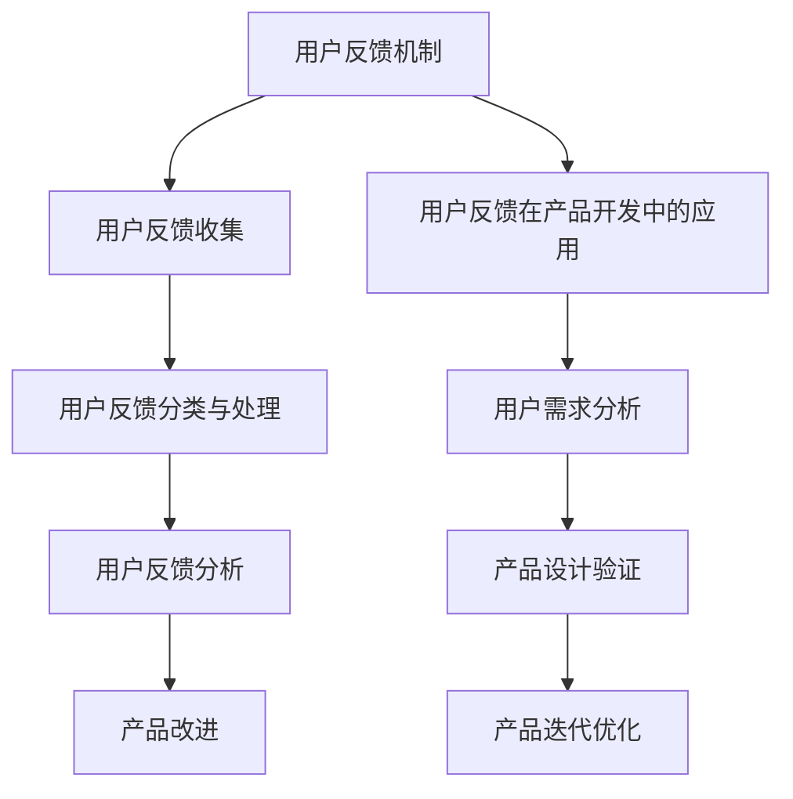

                 

# 《AI创业公司如何建立有效的用户反馈机制》

## 关键词

- 用户反馈机制
- AI创业公司
- 产品改进
- 用户参与度
- 数据分析
- 敏捷开发

## 摘要

本文旨在探讨AI创业公司如何建立有效的用户反馈机制。通过分析用户反馈机制的基础知识、实施与优化策略，以及用户反馈在产品开发中的应用，本文为创业公司提供了实用的指导和建议。同时，通过实际案例和核心技术讲解，展示了用户反馈机制在实践中的具体应用和实现方法，以帮助创业公司更好地理解和运用用户反馈机制，实现产品与市场的同步发展。

---

## 《AI创业公司如何建立有效的用户反馈机制》目录大纲

### 第一部分：用户反馈机制的基础知识

### 第二部分：用户反馈机制的实施与优化

### 第三部分：用户反馈机制在产品开发中的应用

### 第四部分：用户反馈机制的案例分析

### 第五部分：用户反馈机制的技术实现

### 第六部分：用户反馈机制的未来发展趋势

### 附录

---

## 第一部分：用户反馈机制的基础知识

### 第1章：用户反馈机制概述

#### 1.1 用户反馈机制的重要性

在AI创业公司的产品开发过程中，用户反馈机制具有至关重要的作用。首先，用户反馈是产品改进的重要信息来源，通过收集和分析用户反馈，企业可以更好地了解用户的需求和期望，从而针对性地进行产品优化。其次，用户反馈有助于提升用户参与度和满意度，增强用户对产品的忠诚度和粘性。此外，用户反馈还可以为企业的市场策略和决策提供数据支持，帮助企业更好地应对市场变化和竞争压力。

#### 1.2 用户反馈与产品改进的关系

用户反馈与产品改进之间存在着密切的关联。用户反馈提供了产品实际使用情况的第一手资料，帮助企业发现产品存在的问题和不足。通过分析用户反馈，企业可以找出产品的瓶颈和改进方向，从而制定有效的产品优化策略。此外，用户反馈还可以帮助企业预测潜在的市场需求，指导产品功能的拓展和升级。因此，用户反馈不仅是产品改进的驱动力，也是产品创新的重要源泉。

#### 1.3 用户反馈在企业决策中的应用

用户反馈在企业决策中发挥着重要作用。一方面，用户反馈可以提供市场调研的数据支持，帮助企业在产品定位、市场推广等方面做出更为科学的决策。另一方面，用户反馈可以反映企业的服务水平和管理质量，为企业的战略调整和运营优化提供依据。此外，用户反馈还可以作为企业内部考核和激励的依据，激励员工不断提高服务质量和创新能力。

### 第2章：用户反馈机制的组成部分

#### 2.1 用户反馈收集方法

用户反馈收集是用户反馈机制的核心环节。常见的用户反馈收集方法包括：

- 用户反馈问卷：通过设计问卷，收集用户对产品的意见和需求，适用于大规模用户群体的数据收集。
- 用户反馈论坛：建立专门的论坛，鼓励用户分享使用体验和问题，适用于深入交流和互动。
- 社交媒体反馈：利用社交媒体平台，实时收集用户对产品的评价和反馈，适用于快速响应和互动。
- 客户支持系统反馈：通过客户支持系统，记录和处理用户的问题和建议，适用于问题解决和跟踪。

#### 2.2 用户反馈分类与处理流程

用户反馈分类和处理流程是确保用户反馈得到有效利用的重要保障。用户反馈的分类主要包括：

- 功能需求：用户对产品功能的期望和改进建议。
- 用户体验：用户在使用产品过程中遇到的问题和不满。
- 性能问题：产品性能方面的缺陷和瓶颈。
- 其他反馈：不属于上述类别的其他用户反馈。

用户反馈处理流程包括：

- 反馈收集：通过多种渠道收集用户反馈。
- 反馈筛选：对收集到的反馈进行初步筛选，去除无效或重复的反馈。
- 反馈分类：根据反馈内容对反馈进行分类。
- 反馈处理：对分类后的反馈进行分析和处理，制定相应的改进措施。
- 反馈反馈：将处理结果反馈给用户，并跟踪反馈的落实情况。

#### 2.3 用户反馈分析的指标体系

用户反馈分析的指标体系是衡量用户反馈效果的重要工具。常见的用户反馈分析指标包括：

- 用户满意度：反映用户对产品的整体满意度。
- 用户参与度：反映用户对产品互动的积极性。
- 反馈响应时间：反映企业对用户反馈的响应速度。
- 反馈解决率：反映企业解决用户问题的能力。

通过建立完善的用户反馈指标体系，企业可以更好地了解用户反馈的效果，持续优化用户反馈机制。

---

## 第二部分：用户反馈机制的实施与优化

### 第3章：用户反馈机制的实施策略

#### 3.1 用户反馈机制设计原则

在设计用户反馈机制时，应遵循以下原则：

- 灵活性：用户反馈机制应具备灵活性，以适应不同场景和需求。
- 响应速度：确保用户反馈能够得到及时响应，提高用户满意度。
- 持续改进：不断优化用户反馈机制，提升反馈效果。

#### 3.2 用户反馈机制实施步骤

实施用户反馈机制通常包括以下步骤：

1. 制定用户反馈计划：明确用户反馈的目标、范围和方法。
2. 确定反馈收集流程：设计反馈收集渠道和流程，确保数据的有效性和完整性。
3. 建立反馈处理团队：组建专业的反馈处理团队，负责反馈的收集、分类、处理和反馈。
4. 落实反馈机制：将用户反馈机制融入企业日常运营，确保反馈得到有效利用。

#### 3.3 用户反馈机制的优化策略

用户反馈机制的优化策略包括：

- 反馈机制的效果评估：定期评估反馈机制的效果，发现问题和不足，进行优化。
- 用户参与度提升方法：通过互动、激励等方式提高用户参与度。
- 反馈机制的自动化：利用数据分析、人工智能等技术实现反馈机制的自动化，提高效率。

---

### 第4章：用户反馈机制在产品开发中的应用

#### 4.1 用户反馈在产品开发过程中的作用

用户反馈在产品开发过程中具有重要作用，主要体现在以下几个方面：

- 用户需求分析：通过用户反馈了解用户需求，为产品规划提供依据。
- 产品设计验证：通过用户反馈验证产品设计是否符合用户期望，及时发现和解决问题。
- 产品迭代优化：根据用户反馈进行产品迭代，不断提升用户体验。

#### 4.2 用户反馈驱动的产品开发流程

用户反馈驱动的产品开发流程主要包括以下步骤：

1. 用户需求收集与分析：通过多种渠道收集用户需求，进行数据分析和归类。
2. 产品规划与设计：根据用户需求进行产品规划，制定设计方案。
3. 产品测试与迭代：在产品测试阶段，收集用户反馈，进行问题定位和优化。
4. 产品上线与反馈收集：产品上线后，持续收集用户反馈，进行后续优化和迭代。

#### 4.3 用户反馈在敏捷开发中的应用

在敏捷开发中，用户反馈具有重要作用，主要体现在以下几个方面：

- 用户反馈与敏捷开发流程的结合：将用户反馈融入敏捷开发流程，实现快速响应和迭代。
- 用户反馈在迭代评审中的作用：在迭代评审阶段，通过用户反馈评估产品改进效果，指导下一迭代计划。
- 用户反馈在持续集成中的应用：通过用户反馈实时监控产品性能，实现持续集成和优化。

---

### 第5章：用户反馈机制的案例分析

#### 5.1 案例一：某互联网公司用户反馈机制的实施与效果

**案例背景：**

某互联网公司致力于开发一款智能家居产品，市场竞争激烈，用户体验至关重要。公司希望通过建立有效的用户反馈机制，提升产品质量和用户满意度。

**反馈机制设计：**

1. 设立用户反馈问卷，涵盖产品功能、用户体验、性能问题等多个方面。
2. 建立用户反馈论坛，鼓励用户分享使用体验和问题。
3. 利用社交媒体平台收集用户反馈，实现实时互动。
4. 客户支持系统自动记录和处理用户反馈。

**实施效果分析：**

1. 用户满意度显著提升：通过及时收集和处理用户反馈，产品问题得到有效解决，用户满意度提高。
2. 产品质量持续优化：用户反馈成为产品改进的重要依据，推动产品质量不断提升。
3. 用户参与度增强：用户通过反馈论坛和社交媒体积极参与产品改进，增强对产品的认同感和忠诚度。

#### 5.2 案例二：某AI创业公司如何利用用户反馈优化产品

**案例背景：**

某AI创业公司开发一款智能语音助手产品，希望通过用户反馈优化产品功能和使用体验，提升市场竞争力。

**用户反馈收集与分析：**

1. 通过用户反馈问卷收集用户对产品功能的评价和使用体验。
2. 利用用户行为数据分析用户使用产品的场景和偏好。
3. 通过社交媒体收集用户对产品的意见和建议。

**产品优化措施：**

1. 根据用户反馈优化产品功能，提升用户操作便捷性。
2. 针对用户使用场景和偏好，调整语音助手的语言模型和算法。
3. 加强产品测试，确保产品质量和稳定性。

---

## 第三部分：用户反馈机制的技术实现

### 第6章：用户反馈系统的架构设计

用户反馈系统的架构设计主要包括以下几个方面：

#### 6.1 数据存储与处理

- 使用数据库（如MySQL、MongoDB等）存储用户反馈数据。
- 设计数据表结构，包括反馈内容、用户信息、反馈状态等字段。
- 实现数据插入、查询、更新和删除等基本操作。

#### 6.2 系统安全性设计

- 实现用户认证和授权机制，确保用户隐私和数据安全。
- 对用户反馈数据加密存储，防止数据泄露。
- 定期备份数据，确保数据完整性。

#### 6.3 用户交互界面设计

- 设计简洁直观的用户交互界面，方便用户提交反馈。
- 实现多渠道反馈收集，包括Web端、移动端和第三方平台。
- 提供实时反馈处理状态查询功能，提升用户体验。

### 第7章：用户反馈数据处理与分析

用户反馈数据处理与分析主要包括以下几个方面：

#### 7.1 数据清洗与预处理

- 对收集到的用户反馈数据进行清洗，去除无效数据。
- 对用户反馈内容进行分词、词频统计等预处理，为后续分析提供基础。

#### 7.2 数据分析与挖掘

- 利用自然语言处理（NLP）技术，对用户反馈内容进行情感分析、主题挖掘等。
- 建立用户画像，分析用户行为和需求。
- 预测用户流失和满意度，为产品优化提供依据。

#### 7.3 用户画像构建

- 根据用户反馈和行为数据，构建用户画像。
- 利用机器学习算法，对用户进行分类和聚类。
- 为不同类型的用户制定个性化的产品优化策略。

### 第8章：用户反馈系统的技术挑战与解决方案

用户反馈系统的技术实现面临以下挑战：

#### 8.1 数据量处理

- 随着用户数量的增加，数据量呈指数级增长，对系统性能和处理速度提出较高要求。
- **解决方案：**采用分布式存储和计算技术，如Hadoop、Spark等，实现海量数据的处理和分析。

#### 8.2 数据实时性要求

- 用户反馈需要实时处理和分析，以满足快速响应和优化需求。
- **解决方案：**采用实时数据流处理技术，如Apache Kafka、Flink等，实现数据的实时收集和处理。

#### 8.3 用户隐私保护

- 用户反馈涉及用户隐私，需要确保数据安全和个人隐私保护。
- **解决方案：**对用户数据进行加密存储和传输，遵守相关隐私保护法律法规，如《通用数据保护条例》（GDPR）等。

---

## 第四部分：用户反馈机制的未来发展趋势

### 第9章：用户反馈机制的发展方向

用户反馈机制的未来发展趋势主要体现在以下几个方面：

#### 9.1 人工智能技术在用户反馈中的应用

- 利用自然语言处理（NLP）技术，对用户反馈进行自动化分类和分析。
- 应用机器学习算法，对用户反馈进行预测和趋势分析。
- 通过人工智能技术，实现用户反馈的智能化处理和优化。

#### 9.2 跨平台用户反馈机制建设

- 建立多渠道、跨平台的用户反馈机制，实现用户反馈的全覆盖。
- 利用社交媒体、移动应用等多种渠道，收集用户反馈。
- 通过跨平台数据整合，提升用户反馈的准确性和全面性。

#### 9.3 社区化用户反馈机制探索

- 构建用户社区，鼓励用户互动和共享反馈。
- 利用社区化平台，促进用户参与和产品改进。
- 通过社区化反馈机制，提升用户满意度和忠诚度。

### 第10章：用户反馈机制对企业的战略影响

用户反馈机制对企业战略的影响主要体现在以下几个方面：

#### 10.1 用户反馈在创新决策中的作用

- 通过用户反馈，了解市场需求和用户期望，为产品创新提供依据。
- 利用用户反馈，发现产品潜在问题，推动产品改进和创新。

#### 10.2 用户反馈在市场竞争中的优势

- 快速响应用户需求，提升产品竞争力。
- 通过用户反馈，发现市场机会，抢占市场先机。

#### 10.3 用户反馈在企业文化建设中的价值

- 倡导用户参与，提升企业文化氛围。
- 通过用户反馈，建立用户与企业之间的信任和合作关系。

---

## 附录

### 附录A：用户反馈机制实施指南

#### 用户反馈收集表模板

1. 用户姓名：
2. 联系方式：
3. 产品名称：
4. 使用场景：
5. 反馈内容：
6. 反馈时间：

#### 用户反馈分析报告模板

1. 反馈数量统计：
   - 总反馈数：
   - 功能需求反馈数：
   - 用户体验反馈数：
   - 性能问题反馈数：
   - 其他反馈数：

2. 用户满意度评分：
   - 平均满意度评分：
   - 满意度分布情况：

3. 用户参与度分析：
   - 用户活跃度：
   - 用户贡献度：

4. 反馈处理情况：
   - 已处理反馈数：
   - 未处理反馈数：
   - 反馈处理周期：

#### 用户反馈处理流程图

1. 用户提交反馈
2. 反馈收集
3. 反馈分类
4. 反馈处理
5. 反馈反馈
6. 反馈跟踪

### 附录B：用户反馈机制工具推荐

#### 用户反馈收集工具列表

1. 爱分析（Aifengxi）
2. 周报宝（Zhaobao）
3. 反馈宝（Fankui宝）

#### 数据分析平台列表

1. 百分点（Baichu）
2. 明道（Mingdao）
3. 表格云（Biyanhua）

#### 客户管理系统（CRM）列表

1. 金数据（Jindata）
2. 客户宝（Khubao）
3. 用客CRM（YongkeCRM）

### 附录C：相关法规与政策

#### 用户隐私保护法律法规

1. 《中华人民共和国网络安全法》
2. 《中华人民共和国数据安全法》
3. 《中华人民共和国个人信息保护法》

#### 数据安全与合规要求

1. ISO/IEC 27001信息安全管理体系认证
2. GDPR（欧盟通用数据保护条例）
3. CCPA（美国加利福尼亚州消费者隐私法案）

#### 企业用户反馈机制建设政策指南

1. 企业用户反馈机制建设指导意见
2. 企业用户反馈机制建设指南
3. 企业用户反馈机制建设实施方案

---

## 用户反馈机制中的核心概念与联系 Mermaid 流程图



---

## 用户反馈机制中的核心算法原理讲解及伪代码

#### 1. 用户反馈分类算法

伪代码：

```python
def classify_feedback(feedback_list):
    category_dict = {}
    for feedback in feedback_list:
        content = feedback['content']
        if "功能需求" in content:
            category_dict[feedback['id']] = "功能需求"
        elif "用户体验" in content:
            category_dict[feedback['id']] = "用户体验"
        elif "性能问题" in content:
            category_dict[feedback['id']] = "性能问题"
        else:
            category_dict[feedback['id']] = "其他"
    return category_dict
```

#### 2. 用户反馈分析算法

伪代码：

```python
def analyze_feedback(feedback_list):
    sentiment_dict = {}
    for feedback in feedback_list:
        content = feedback['content']
        sentiment = get_sentiment(content)
        if sentiment not in sentiment_dict:
            sentiment_dict[sentiment] = 0
        sentiment_dict[sentiment] += 1
    return sentiment_dict

def get_sentiment(content):
    words = content.split()
    sentiment_score = 0
    for word in words:
        if word in positive_words:
            sentiment_score += 1
        elif word in negative_words:
            sentiment_score -= 1
    if sentiment_score > 0:
        return "正面"
    elif sentiment_score < 0:
        return "负面"
    else:
        return "中性"
```

#### 3. 用户满意度评分模型

数学模型：

$$
S = \frac{P \cdot R \cdot T}{100}
$$

其中，$S$ 表示用户满意度评分，$P$ 表示产品性能得分，$R$ 表示用户期望得分，$T$ 表示总评分。

#### 4. 用户参与度计算模型

数学模型：

$$
I = \frac{U \cdot V}{100}
$$

其中，$I$ 表示用户参与度，$U$ 表示用户活跃度得分，$V$ 表示用户贡献度得分。

---

## 项目实战

### 1. 用户反馈收集系统实现

**开发环境：**Python + Flask + MongoDB + Elasticsearch

**项目架构：**

- **前端：** 使用Flask框架搭建用户反馈收集前端，提供简洁易用的用户界面。
- **后端：** 使用MongoDB存储用户反馈数据，使用Elasticsearch进行实时搜索和分析。

**代码实现示例：**

```python
# Flask路由设置
@app.route('/submit_feedback', methods=['POST'])
def submit_feedback():
    feedback_data = request.form.to_dict()
    feedback_data['timestamp'] = datetime.now()
    feedback_data['status'] = '待处理'
    feedback_collection.insert_one(feedback_data)
    return jsonify({'status': 'success'})

# 数据处理函数
def analyze_feedback(feedback_list):
    sentiment_dict = {}
    for feedback in feedback_list:
        content = feedback['content']
        sentiment = get_sentiment(content)
        if sentiment not in sentiment_dict:
            sentiment_dict[sentiment] = 0
        sentiment_dict[sentiment] += 1
    return sentiment_dict

def get_sentiment(content):
    words = content.split()
    sentiment_score = 0
    for word in words:
        if word in positive_words:
            sentiment_score += 1
        elif word in negative_words:
            sentiment_score -= 1
    if sentiment_score > 0:
        return "正面"
    elif sentiment_score < 0:
        return "负面"
    else:
        return "中性"
```

**代码解读与分析：**

- 使用Flask处理用户提交的反馈数据，将反馈数据存储到MongoDB数据库，并设置时间戳和状态，便于后续处理和管理。
- 使用Elasticsearch进行用户反馈数据的实时搜索和分析，帮助团队快速定位和解决问题，提升产品用户体验。

---

## 详细解释说明

### 用户反馈收集系统设计

- **前端设计**：前端界面简洁易用，用户可以快速提交反馈，反馈数据通过API传送到后端服务器进行处理和存储。
- **数据存储**：后端使用MongoDB数据库存储用户反馈数据，数据库设计包括反馈内容、用户信息、反馈状态等字段，确保数据完整性和可靠性。
- **数据处理**：后端服务器接收反馈数据后，进行预处理和存储，同时利用Elasticsearch进行实时搜索和分析，帮助团队快速识别和解决问题。

### 用户反馈数据的处理和分析

- **数据清洗**：对用户反馈数据中的无效数据进行清洗，去除重复和无关信息，确保数据的准确性和一致性。
- **数据分析**：利用自然语言处理（NLP）技术，对用户反馈内容进行情感分析和主题挖掘，获取用户满意度、需求趋势等关键信息。
- **数据可视化**：通过数据可视化工具，将分析结果以图表形式展示，帮助团队直观了解用户反馈情况，为产品改进提供依据。

### 用户反馈机制的优势和挑战

- **优势**：用户反馈机制可以实时收集用户需求，快速响应产品问题，提升用户体验，增强用户满意度。同时，用户反馈数据可以作为产品创新的依据，指导企业进行产品优化和功能拓展。
- **挑战**：用户反馈数据的处理和分析需要投入大量人力和物力，如何有效利用用户反馈数据，提高数据利用率和转化率是关键挑战。此外，用户隐私保护和数据安全也是需要关注的重要问题。

---

### 总结

用户反馈机制在AI创业公司的产品开发过程中具有至关重要的作用。通过建立有效的用户反馈机制，企业可以更好地了解用户需求，优化产品设计，提升用户体验，实现产品与市场的同步发展。本文从用户反馈机制的基础知识、实施与优化策略、产品开发应用、案例分析、技术实现等多个方面，全面探讨了如何建立有效的用户反馈机制。同时，通过项目实战和详细解释说明，展示了用户反馈机制在实践中的具体应用和实现方法。希望本文能为AI创业公司提供有益的参考和指导。

---

**作者：AI天才研究院/AI Genius Institute & 禅与计算机程序设计艺术 /Zen And The Art of Computer Programming**

