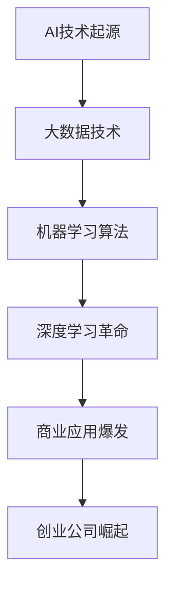

                 

### 《AI创业公司如何进行风险管理？》

> **关键词**：（AI创业公司、风险管理、数据质量、算法偏差、可持续性、伦理风险）

> **摘要**：本文深入探讨了AI创业公司在面临快速发展的商业环境和技术挑战时，如何进行有效的风险管理。文章首先概述了AI创业公司的商业环境与挑战，然后详细分析了AI技术风险类型，包括数据质量风险、算法偏差与偏见、可持续性与伦理风险。接着，文章介绍了风险管理的核心概念、流程和方法，以及数据风险管理和算法偏差与偏见管理的具体实践。随后，文章讨论了可持续性与伦理风险控制，并提供了风险管理策略与计划的制定与执行方法。通过三个实际案例的分析，文章总结了AI创业公司的风险管理最佳实践，并对未来趋势进行了展望。

---

### 第1章：AI创业公司的环境与挑战

#### 1.1 AI创业公司面临的商业环境

AI技术的快速发展为创业公司提供了前所未有的商业机会。然而，在这个充满机遇的环境中，AI创业公司也面临着诸多挑战。首先，AI技术的快速发展使得市场进入壁垒提高。AI创业公司需要大量的资金、先进的技术和优秀的人才来开展业务。此外，市场竞争压力巨大，技术迭代速度快，客户需求变化频繁，使得创业公司必须保持高度的敏捷性和创新能力。

为了更好地理解AI创业公司的商业环境，我们可以使用Mermaid流程图来展示AI技术发展历程与商业应用场景。

在AI技术发展的过程中，大数据技术为数据分析和机器学习提供了基础，机器学习算法使得计算机能够从数据中学习并作出决策，而深度学习革命则使得AI在图像识别、自然语言处理等领域取得了突破性进展。这些技术的商业应用场景不断涌现，如智能客服、自动驾驶、医疗诊断等，为AI创业公司带来了巨大的市场机会。

#### 1.2 AI创业公司面临的挑战

AI创业公司面临的技术风险主要体现在以下几个方面：

1. **数据依赖性**：AI系统的性能高度依赖于数据质量。数据质量和数据隐私问题是AI创业公司必须面对的核心挑战。数据完整性、准确性、一致性和时效性等质量指标直接影响AI算法的输出结果。

2. **算法风险**：算法偏差、不确定性和稳定性是AI创业公司面临的重要风险。算法偏差可能导致错误决策，影响业务发展。算法的不确定性和稳定性则可能导致系统崩溃或性能下降。

除了技术风险，AI创业公司还面临业务风险：

1. **市场定位与产品策略**：AI创业公司需要准确识别市场需求，制定符合市场趋势的产品策略。市场定位不准确或产品策略不当可能导致市场份额流失。

2. **运营管理**：AI创业公司的运营管理涉及资金流、供应链和团队管理等多个方面。资金不足、供应链不稳定或团队管理不当都可能对公司的稳定运营造成负面影响。

#### 1.3 AI创业公司的风险管理重要性

风险管理在AI创业公司中扮演着至关重要的角色。首先，有效的风险管理可以保障企业的可持续发展，避免因风险事件导致重大损失。其次，风险管理有助于提高企业的决策效率，通过准确的风险评估和应对策略，使企业在复杂多变的市场环境中保持竞争优势。

在AI创业公司中，风险管理的挑战与机遇并存。复杂性和不确定性要求创业公司持续关注和调整风险管理策略。同时，技术创新和商业模式创新为风险管理提供了新的工具和方法，有助于提升企业的风险管理能力。

### 第2章：AI技术风险类型

#### 2.1 技术风险分类

AI技术风险可以分为多个类型，其中最常见的包括数据风险、算法风险、硬件风险和网络安全风险。

1. **数据风险**：数据风险包括数据完整性、可用性、隐私等方面的问题。数据完整性风险指数据缺失、异常值或重复值等问题；可用性风险指数据无法及时获取或使用；隐私风险指个人数据的泄露和滥用。

2. **算法风险**：算法风险包括算法偏差、不确定性和稳定性等方面的问题。算法偏差可能导致模型对某些群体的歧视；不确定性指模型无法准确预测未知情况；稳定性指模型在不同数据集或环境下的性能表现。

3. **硬件风险**：硬件风险包括硬件故障、设备老化等问题。硬件故障可能导致系统崩溃或性能下降；设备老化则可能影响系统的稳定性和可靠性。

4. **网络安全风险**：网络安全风险包括数据泄露、恶意攻击等问题。数据泄露可能导致敏感信息被未授权访问；恶意攻击则可能破坏系统或造成数据丢失。

#### 2.2 数据质量风险

数据质量风险对AI创业公司的成功至关重要。以下从数据质量的影响因素和质量管理方法两个方面进行探讨。

##### 2.2.1 数据质量影响因素

1. **数据完整性**：数据完整性指数据的完整性程度，包括数据的缺失值、异常值和重复值。数据缺失可能导致模型无法准确学习，异常值和重复值则可能影响模型的泛化能力。

2. **数据准确性**：数据准确性指数据是否真实、可靠。错误数据或重复数据会影响模型的训练和预测结果，降低模型的性能。

3. **数据一致性**：数据一致性指不同来源的数据是否在格式、单位等方面保持一致。不一致的数据会导致模型无法正确处理，影响模型的输出结果。

4. **数据时效性**：数据时效性指数据的更新速度。过时的数据可能导致模型无法反映最新的业务情况，影响决策的准确性。

##### 2.2.2 数据质量管理方法

1. **数据清洗**：数据清洗是数据质量管理的重要步骤，主要包括去除重复数据、处理缺失值和异常值。去除重复数据可以减少数据冗余，提高模型训练效率；处理缺失值和异常值可以降低数据质量风险，提高模型的泛化能力。

2. **数据标准化**：数据标准化是指将不同来源的数据转换为统一的格式和单位，以便于模型处理和分析。数据标准化可以消除数据之间的差异，提高模型的鲁棒性。

3. **数据质量管理工具**：常用的数据质量管理工具有数据质量管理平台（如Informatica、Talend）、数据清洗工具（如OpenRefine、DataWrangler）等。这些工具可以帮助企业实时监测和改进数据质量。

#### 2.3 算法偏差与偏见

算法偏差与偏见是AI技术在应用过程中可能遇到的问题。以下从算法偏差的类型、偏见检测与校正方法以及算法透明性与可解释性三个方面进行探讨。

##### 2.3.1 算法偏差的类型

1. **统计偏差**：统计偏差包括样本选择偏差和数据分布偏差。样本选择偏差指数据集样本不具代表性，可能导致模型在特定群体上的性能不佳；数据分布偏差指数据集与真实世界的数据分布差异，可能导致模型泛化能力下降。

2. **决策偏差**：决策偏差包括算法设计偏差和人为干预偏差。算法设计偏差指算法参数设置不当，可能导致模型产生偏差；人为干预偏差指人为调整算法结果，可能导致模型输出结果与真实情况不符。

##### 2.3.2 偏见检测与校正方法

1. **统计方法**：统计方法包括假设检验和偏差分析。假设检验可以通过比较算法在不同数据集上的性能来检测偏差；偏差分析可以比较不同算法在相同数据集上的偏差。

2. **机器学习方法**：机器学习方法包括偏差校正算法和对抗性样本生成。偏差校正算法可以通过训练数据自动校正偏差；对抗性样本生成可以生成对抗性样本以检测和校正算法偏见。

##### 2.3.3 算法透明性与可解释性

1. **算法透明性**：算法透明性包括算法公开和算法解释。算法公开指公开算法源代码和参数设置，以便于其他研究人员进行评估和改进；算法解释指提供算法运行过程的详细解释，使决策者能够理解算法的决策逻辑。

2. **可解释性方法**：可解释性方法包括特征重要性和决策路径解释。特征重要性分析可以识别模型对特征的依赖程度，帮助决策者理解算法的决策依据；决策路径解释可以可视化算法决策过程，使决策者能够了解算法如何处理数据。

#### 2.4 可持续性与伦理风险

可持续性与伦理风险是AI创业公司需要关注的重要问题。以下从可持续性的定义与要素、伦理风险管理策略以及可持续发展实践案例三个方面进行探讨。

##### 2.4.1 可持续性的定义与要素

1. **可持续性的定义**：可持续性是指在满足当前需求的同时，不损害未来世代满足其需求的能力。

2. **可持续性的要素**：
   - **环境可持续性**：包括资源利用、碳排放等环境问题。
   - **社会可持续性**：包括公平性、社会责任等社会问题。

##### 2.4.2 伦理风险管理策略

1. **伦理决策框架**：伦理决策框架包括道德原则和伦理审查。道德原则如公平、尊重、责任等；伦理审查是指设立内部审查委员会，对算法决策过程和结果进行伦理评估。

2. **伦理风险管理实践**：伦理风险管理实践包括透明度、培训与教育等。透明度指公开伦理风险管理过程和决策；培训与教育指提高员工伦理意识，使其在算法设计和应用过程中遵循伦理原则。

##### 2.4.3 可持续发展实践案例

1. **节能降耗**：数据中心能效优化是可持续发展的重要实践之一。通过优化硬件配置、改进冷却系统、采用节能技术等措施，可以降低数据中心的能耗。

2. **社会责任**：参与公益活动、支持社区发展是企业履行社会责任的重要方式。通过公益活动，企业可以提高品牌形象，增强员工归属感；支持社区发展，企业可以促进社会和谐，实现可持续发展。

### 第3章：风险管理的核心概念

#### 3.1 风险管理的定义与目标

风险管理是一种系统化、结构化的方法，用于识别、评估、控制和监测风险，以最小化潜在损失和最大化机会。在AI创业公司中，风险管理尤为重要，因为它可以帮助企业应对技术风险、业务风险和其他潜在挑战。

##### 3.1.1 风险管理的定义

风险管理是一个综合性的过程，涉及以下几个关键步骤：

1. **识别风险**：识别企业可能面临的各种风险，包括内部和外部风险。
2. **评估风险**：对识别出的风险进行定量和定性评估，确定其严重性和可能性。
3. **应对策略**：根据风险评估结果，制定应对策略，包括风险规避、风险转移、风险缓解等。
4. **监控与报告**：持续监控风险状况，定期向管理层报告风险管理进展。

##### 3.1.2 风险管理的目标

风险管理的目标是：

1. **减少损失**：通过有效的风险管理措施，避免或减少风险事件带来的负面影响。
2. **提高机会**：识别和利用潜在机会，为企业创造价值。

#### 3.2 风险管理流程

风险管理流程是企业确保风险管理有效性的关键。以下是典型的风险管理流程：

1. **风险评估**：识别和评估潜在风险，确定其严重性和可能性。风险评估可以采用定量评估（如概率分析、决策树分析）和定性评估（如专家评估、风险矩阵）相结合的方法。

2. **风险应对策略**：根据风险评估结果，制定应对策略。风险应对策略包括风险规避、风险转移、风险缓解等。风险规避指避免或减少风险事件的发生；风险转移指通过保险或合同将风险转移给其他实体；风险缓解指降低风险事件的影响和损失。

3. **实施与监控**：执行风险管理计划，并持续监控风险状况。监控可以采用实时监测、定期评估和报告等方式。监控有助于及时发现新的风险，并根据实际情况调整风险管理策略。

#### 3.3 风险评估方法

风险评估是风险管理的重要环节，旨在识别和评估潜在风险。以下是几种常用的风险评估方法：

1. **定量评估方法**：

   - **概率分析**：计算风险发生的概率和潜在损失，帮助确定风险优先级。
   - **决策树分析**：通过构建决策树，分析不同决策路径的风险和收益，帮助制定应对策略。

2. **定性评估方法**：

   - **专家评估**：利用专家意见评估风险，适用于难以量化评估的风险。
   - **风险矩阵**：将风险按照严重性和可能性分类，帮助确定风险优先级和应对策略。

### 第4章：数据风险管理

数据风险管理是AI创业公司风险管理的重要组成部分，涉及数据质量控制、数据隐私保护和数据质量管理工具与技术。

#### 4.1 数据质量控制

数据质量控制是确保数据质量和可靠性的关键步骤。以下是数据质量控制的几个关键方面：

1. **数据完整性**：确保数据完整性，避免数据缺失或重复。数据缺失可能导致模型无法准确训练或预测；数据重复可能导致模型过度拟合。

2. **数据准确性**：确保数据的准确性，避免错误数据或重复数据。错误数据可能影响模型的训练和预测结果，降低模型的性能。

3. **数据一致性**：确保不同来源的数据在格式、单位等方面保持一致。不一致的数据可能导致模型无法正确处理，影响模型的输出结果。

4. **数据时效性**：确保数据的时效性，避免过时数据。过时数据可能导致模型无法反映最新的业务情况，影响决策的准确性。

##### 4.1.1 数据质量管理方法

1. **数据清洗**：数据清洗是数据质量管理的重要步骤，主要包括以下几种方法：

   - **去除重复数据**：识别和删除重复的数据记录。
   - **处理缺失值**：根据数据的特点和需求，对缺失值进行填充或删除。
   - **异常值处理**：识别和处理异常数据，如异常值、错误值等。

2. **数据标准化**：数据标准化是指将不同来源的数据转换为统一的格式和单位。数据标准化的目的是消除数据之间的差异，提高模型的鲁棒性。

3. **数据质量管理工具**：数据质量管理工具可以帮助企业实时监测和改进数据质量。常用的数据质量管理工具有：

   - **数据质量管理平台**：提供数据质量监控与改进功能。
   - **数据清洗工具**：自动识别和修复数据错误。

##### 4.1.2 数据质量管理工具与技术

1. **数据质量管理平台**：数据质量管理平台提供数据质量监控与改进功能，帮助企业实时监测和改进数据质量。常用的数据质量管理平台有：

   - **Informatica**：提供全面的数据质量管理功能，包括数据质量监测、数据清洗和数据标准化等。
   - **Talend**：提供数据质量管理工具，支持实时数据质量管理。

2. **数据清洗工具**：数据清洗工具可以帮助企业自动识别和修复数据错误。常用的数据清洗工具有：

   - **OpenRefine**：开源的数据清洗工具，支持多种数据格式，提供灵活的数据清洗功能。
   - **DataWrangler**：开源的数据清洗工具，提供数据预处理、转换和可视化功能。

#### 4.2 数据隐私保护

数据隐私保护是数据风险管理的关键方面，特别是在涉及个人数据的场景中。以下是数据隐私保护的关键原则和实施方法：

##### 4.2.1 数据隐私保护原则

1. **最小化收集**：仅收集必要的个人信息，避免收集无关或过多的数据。
2. **去识别化**：对个人信息进行去识别化处理，使其无法与特定个体关联。
3. **安全存储**：使用加密技术保护数据安全，确保数据在存储和传输过程中不被未授权访问。

##### 4.2.2 数据隐私保护技术

1. **数据加密**：数据加密是保护数据隐私的有效方法。常用的数据加密技术包括：

   - **对称加密**：使用相同的密钥进行加密和解密。
   - **非对称加密**：使用一对密钥进行加密和解密，其中一对密钥用于加密，另一对密钥用于解密。

2. **访问控制**：设置访问权限和用户认证，确保只有授权用户才能访问敏感数据。常用的访问控制技术包括：

   - **基于角色的访问控制（RBAC）**：根据用户的角色和权限分配访问权限。
   - **基于属性的访问控制（ABAC）**：根据用户属性（如部门、职位等）分配访问权限。

#### 4.3 数据质量管理工具与技术

数据质量管理工具和技术可以帮助企业实时监测和改进数据质量。以下是几种常用的数据质量管理工具和技术：

##### 4.3.1 常见数据质量管理工具

1. **数据质量管理平台**：数据质量管理平台提供数据质量监控与改进功能，支持实时数据质量管理。常用的数据质量管理平台包括：

   - **Informatica**：提供全面的数据质量管理功能。
   - **Talend**：提供数据质量管理工具，支持实时数据质量管理。

2. **数据清洗工具**：数据清洗工具可以帮助企业自动识别和修复数据错误。常用的数据清洗工具有：

   - **OpenRefine**：开源的数据清洗工具。
   - **DataWrangler**：开源的数据清洗工具。

##### 4.3.2 数据质量改进技术

1. **机器学习**：机器学习可以用于自动识别和修复数据错误。常用的机器学习方法包括：

   - **异常检测**：识别和处理异常数据。
   - **缺失值填补**：根据数据的特点和模式自动填补缺失值。

2. **数据质量监控**：数据质量监控可以实时监测数据质量状况，及时发现和纠正数据质量问题。常用的数据质量监控工具包括：

   - **Zabbix**：开源的数据质量监控工具。
   - **Prometheus**：开源的数据质量监控工具。

### 第5章：算法偏差与偏见管理

算法偏差与偏见是AI技术在应用过程中可能遇到的问题，它们可能导致模型产生不公平、歧视性的决策。因此，算法偏差与偏见管理成为AI创业公司风险管理的重要组成部分。

#### 5.1 算法偏差的类型

算法偏差可以分为统计偏差和决策偏差。

##### 5.1.1 统计偏差

统计偏差是指由于数据集或算法设计不当导致的偏差。常见的统计偏差包括：

1. **样本选择偏差**：样本选择偏差指数据集样本不具代表性，导致模型在特定群体上的性能不佳。例如，如果数据集中男性样本比例过高，可能导致模型对女性样本的识别能力较差。

2. **数据分布偏差**：数据分布偏差指数据集与真实世界的数据分布差异，导致模型泛化能力下降。例如，如果数据集过于集中于某一地区或行业，可能导致模型在其他地区或行业的性能不佳。

##### 5.1.2 决策偏差

决策偏差是指由于算法设计或人为干预导致的偏差。常见的决策偏差包括：

1. **算法设计偏差**：算法设计偏差指算法参数设置不当，导致模型产生偏差。例如，如果算法对某些特征的权重设置过高，可能导致模型对这部分特征的依赖性过大。

2. **人为干预偏差**：人为干预偏差指人为调整算法结果，导致模型输出结果与真实情况不符。例如，如果算法设计者故意调整某些参数以符合自己的偏见，可能导致模型产生歧视性的决策。

#### 5.2 偏见检测与校正方法

为了解决算法偏差与偏见问题，可以采用以下几种方法进行偏见检测与校正。

##### 5.2.1 偏见检测方法

1. **假设检验**：假设检验可以通过比较模型在不同数据集上的性能来检测偏差。例如，可以通过比较模型在训练集和测试集上的表现，来检测是否存在样本选择偏差或数据分布偏差。

2. **偏差分析**：偏差分析可以比较不同算法在相同数据集上的偏差。例如，可以通过比较线性回归模型和决策树模型在相同数据集上的性能，来检测是否存在算法设计偏差。

##### 5.2.2 偏见校正方法

1. **偏差校正算法**：偏差校正算法可以通过训练数据自动校正偏差。例如，可以使用回归算法校正样本选择偏差，使用加权平均算法校正数据分布偏差。

2. **对抗性样本生成**：对抗性样本生成可以生成对抗性样本以检测和校正算法偏见。例如，可以使用生成对抗网络（GAN）生成对抗性样本，从而检测和校正模型的偏见。

#### 5.3 算法透明性与可解释性

算法透明性与可解释性是算法偏差与偏见管理的重要方面。通过提高算法的透明性与可解释性，可以增强算法的信任度，并有助于发现和纠正偏差。

##### 5.3.1 算法透明性

算法透明性包括算法公开和算法解释。算法公开是指公开算法源代码和参数设置，以便其他研究人员进行评估和改进。算法解释是指提供算法运行过程的详细解释，使决策者能够理解算法的决策逻辑。

##### 5.3.2 算法可解释性方法

1. **特征重要性分析**：特征重要性分析可以识别模型对特征的依赖程度，帮助决策者理解算法的决策依据。例如，可以使用特征重要指数（Feature Importance Index）分析模型对各个特征的权重。

2. **决策路径解释**：决策路径解释可以可视化算法决策过程，使决策者能够了解算法如何处理数据。例如，可以使用决策树的可视化工具来展示算法的决策路径。

### 第6章：可持续性与伦理风险控制

可持续性与伦理风险控制是AI创业公司需要关注的重要问题。随着AI技术的广泛应用，其对环境和社会的影响日益显著。因此，AI创业公司需要采取有效的可持续性与伦理风险控制措施，确保其业务发展不会对环境和社会造成负面影响。

#### 6.1 环境与社会影响

AI创业公司在环境和社会方面的影响主要表现在以下几个方面：

##### 6.1.1 环境影响

1. **资源利用**：AI创业公司需要大量计算资源来训练和运行模型，这可能导致能源消耗和资源浪费。例如，数据中心的建设和运营需要大量电力，而服务器和设备的更新换代也会产生电子废物。

2. **碳排放**：数据中心和设备的能源消耗会导致大量的碳排放，加剧全球气候变化问题。此外，AI创业公司在物流和交通方面的活动也可能增加碳排放。

##### 6.1.2 社会影响

1. **就业机会**：AI技术的发展和应用可能对就业市场产生深远影响。一方面，AI技术可以提高生产效率，减少某些工作岗位的需求；另一方面，AI技术也会创造新的就业机会，如AI工程师、数据科学家等。

2. **社会公平**：AI技术的应用可能加剧社会不公平现象。例如，如果AI系统在决策过程中存在偏见，可能会导致某些群体受到不公平对待。此外，AI技术的普及也可能导致社会阶层分化，加剧贫富差距。

#### 6.2 伦理风险管理策略

为了有效控制可持续性与伦理风险，AI创业公司可以采取以下伦理风险管理策略：

##### 6.2.1 伦理决策框架

1. **道德原则**：AI创业公司应遵循一系列道德原则，如公平、尊重、责任等。这些原则可以为企业的决策和行为提供指导，确保AI技术的应用不会对人类和社会造成负面影响。

2. **伦理审查**：AI创业公司应设立内部伦理审查委员会，对算法设计、模型训练和应用过程进行伦理评估。伦理审查可以确保企业在应用AI技术时遵循道德原则，并避免潜在的伦理风险。

##### 6.2.2 伦理风险管理实践

1. **透明度**：AI创业公司应公开其AI技术的应用过程和决策逻辑，提高算法的透明性。透明度可以增强公众对AI技术的信任，并有助于发现和纠正潜在的伦理问题。

2. **培训与教育**：AI创业公司应加强对员工在伦理方面的培训和教育，提高员工的伦理意识和责任感。通过培训和教育，员工可以更好地理解和遵守道德原则，并在工作中避免伦理风险。

#### 6.3 可持续发展实践案例

为了更好地理解可持续性与伦理风险控制实践，以下介绍几个实际的案例：

##### 6.3.1 节能降耗

1. **案例背景**：某AI创业公司意识到其数据中心的高能耗问题，决定采取一系列措施降低能耗。

2. **案例分析**：公司采取了以下措施：

   - **能效优化**：通过改进硬件配置和冷却系统，提高数据中心的能源利用效率。
   - **节能技术**：采用智能监控系统，实时监测和调整能耗，降低不必要的能源消耗。

3. **挑战与应对**：公司面临的挑战包括硬件更新成本高、能效优化技术的选择等。公司通过与技术供应商合作，共同开发节能解决方案，并逐步实施，取得了显著成效。

##### 6.3.2 社会责任

1. **案例背景**：某AI创业公司致力于通过技术手段解决社会问题，决定参与公益活动，支持社区发展。

2. **案例分析**：公司采取了以下措施：

   - **公益活动**：组织员工参与环保、教育等公益活动，提高员工的社会责任感。
   - **社区支持**：与当地社区合作，提供技术支持和资源，帮助解决社区问题。

3. **挑战与应对**：公司面临的挑战包括活动组织、资源分配等。公司通过建立健全的公益活动管理机制，确保活动顺利进行，并积极与社区建立合作关系，取得了良好的效果。

### 第7章：风险管理策略与计划

风险管理策略与计划是AI创业公司确保稳定运营和持续发展的重要保障。一个全面有效的风险管理策略与计划应包括风险管理策略的制定、风险缓解措施的执行以及风险管理计划的执行与监控。

#### 7.1 风险管理策略制定

风险管理策略的制定是风险管理过程的第一步，其核心目标是识别和评估潜在风险，并根据风险评估结果制定相应的应对策略。以下是风险管理策略制定的关键步骤：

1. **识别风险**：通过访谈、调查问卷、风险评估会议等方式，全面识别企业可能面临的各种风险，包括技术风险、市场风险、运营风险等。

2. **评估风险**：对识别出的风险进行定量和定性评估，确定其严重性和可能性。定量评估可以使用概率分析、决策树分析等方法；定性评估可以采用专家评估、风险矩阵等方法。

3. **制定策略**：根据风险评估结果，制定相应的风险管理策略。风险管理策略包括风险规避、风险转移、风险缓解等。风险规避是指避免或减少风险事件的发生；风险转移是指通过保险或合同将风险转移给其他实体；风险缓解是指降低风险事件的影响和损失。

4. **实施与监控**：将制定的风险管理策略转化为具体的行动计划，并持续监控风险管理效果。监控可以采用实时监测、定期评估和报告等方式，确保风险管理策略得到有效执行。

#### 7.2 风险缓解措施

风险缓解措施是风险管理策略的具体实施手段，其目标是降低风险事件的影响和损失。以下是一些常见风险缓解措施：

1. **风险规避**：通过改变业务策略或操作流程，避免或减少风险事件的发生。例如，通过分散供应商，减少对单一供应商的依赖。

2. **风险转移**：通过购买保险或签订合同，将风险转移给其他实体。例如，为关键项目购买保险，以应对可能的意外损失。

3. **风险缓解**：采取具体措施降低风险事件的影响和损失。例如，建立应急预案，以应对突发事件；定期进行安全培训，提高员工的风险意识和应对能力。

#### 7.3 风险管理计划执行与监控

风险管理计划的执行与监控是确保风险管理策略得到有效实施的关键。以下是风险管理计划执行与监控的关键步骤：

1. **责任分配**：明确各部门和人员在风险管理计划中的职责和任务，确保风险管理计划得到有效执行。

2. **培训与教育**：对员工进行风险管理培训，提高员工的风险管理意识和能力。培训内容应包括风险识别、风险评估、风险应对策略等。

3. **执行与监控**：制定具体的执行计划，确保风险管理措施得到有效实施。监控可以采用实时监测、定期评估和报告等方式，及时发现和纠正风险问题。

4. **定期评估**：定期对风险管理计划进行评估，检查风险管理策略和措施的执行效果，并根据评估结果进行调整。

### 第8章：AI创业公司风险管理案例分析

为了更好地理解AI创业公司在风险管理方面的实践，以下将通过三个实际案例，分析AI创业公司面临的风险及应对措施。

#### 8.1 案例一：数据分析公司数据泄露事件

**案例背景**：某数据分析公司在一次数据备份过程中，未采取适当的数据加密措施，导致客户数据泄露。

**案例分析**：

- **原因分析**：数据泄露事件的主要原因包括：
  - **数据加密不足**：公司未对敏感数据进行加密存储。
  - **安全意识不足**：员工对数据安全的重要性认识不足，未采取必要的数据保护措施。

- **应对措施**：
  - **加强数据加密**：公司采取措施加强数据加密，确保敏感数据在存储和传输过程中得到充分保护。
  - **提高安全意识**：公司组织员工进行数据安全培训，提高员工的数据安全意识。

**案例分析**：

- **效果评估**：通过加强数据加密和安全意识培训，公司有效地降低了数据泄露的风险，提升了数据安全性。

#### 8.2 案例二：图像识别公司算法偏差问题

**案例背景**：某图像识别公司在一次产品测试中，发现其算法存在偏差，导致部分用户被错误识别。

**案例分析**：

- **原因分析**：算法偏差问题的原因包括：
  - **数据集不平衡**：训练数据集中部分类别的数据量不足，导致算法对某些类别识别能力较差。
  - **算法设计缺陷**：算法在处理某些特殊情况时存在缺陷，导致错误识别。

- **应对措施**：
  - **数据集平衡**：公司采取措施平衡数据集，增加少数类别数据的样本量，以提高算法的泛化能力。
  - **算法优化**：公司对算法进行优化，修复处理特殊情况的缺陷。

**案例分析**：

- **效果评估**：通过数据集平衡和算法优化，公司有效地解决了算法偏差问题，提升了产品的准确性和可靠性。

#### 8.3 案例三：智能家居公司隐私保护实践

**案例背景**：某智能家居公司因用户隐私数据泄露，面临严重的声誉风险和法律责任。

**案例分析**：

- **原因分析**：隐私数据泄露的主要原因包括：
  - **数据收集不当**：公司在用户注册和设备连接过程中，未采取适当的数据收集策略，导致收集了过多不必要的用户数据。
  - **安全措施不足**：公司未采取有效的数据加密和安全存储措施，导致用户隐私数据易受攻击。

- **应对措施**：
  - **优化数据收集**：公司优化用户数据收集策略，仅收集必要的数据，减少不必要的用户信息收集。
  - **加强数据加密**：公司采取措施加强数据加密，确保用户隐私数据在存储和传输过程中得到充分保护。

**案例分析**：

- **效果评估**：通过优化数据收集和加强数据加密，公司有效地降低了隐私数据泄露的风险，提升了用户隐私保护水平。

### 第9章：风险管理最佳实践

在AI创业公司的风险管理实践中，成功与失败往往取决于对风险管理策略和措施的有效应用。以下总结了AI创业公司的风险管理最佳实践，包括成功实践和失败教训，以及风险管理工具与技术的推荐。

#### 9.1 风险管理最佳实践总结

##### 9.1.1 成功实践

1. **数据质量管理**：AI创业公司应重视数据质量管理，通过数据清洗、标准化和监控等手段，确保数据的质量和可靠性。成功的数据质量管理可以显著提升模型的性能和决策的准确性。

2. **算法偏差管理**：为了减少算法偏差，AI创业公司应采用多种方法进行偏见检测与校正。成功的管理算法偏差可以避免模型产生歧视性决策，提升算法的公正性和透明性。

3. **可持续性与伦理风险管理**：AI创业公司应将可持续性与伦理风险管理纳入企业战略，采取具体措施降低环境和社会影响，提升企业的社会责任形象。

##### 9.1.2 失败教训

1. **风险管理不足**：缺乏有效的风险评估与应对措施，导致AI创业公司在面临风险时无法及时应对，造成重大损失。

2. **应急准备不足**：未能建立完善的应急预案，导致在突发事件发生时无法迅速采取措施，加剧了风险的影响。

3. **持续改进不足**：风险管理策略和措施缺乏持续改进，导致风险管理的有效性逐渐降低，无法适应不断变化的市场环境。

#### 9.2 风险管理工具与技术推荐

##### 9.2.1 数据质量管理工具

1. **数据质量管理平台**：如Informatica、Talend等，提供数据质量监控与改进功能。

2. **数据清洗工具**：如OpenRefine、DataWrangler等，自动识别和修复数据错误。

##### 9.2.2 算法偏差管理工具

1. **偏差检测工具**：如AI Fairness 360、Google What-if Tool等，自动检测算法偏差。

2. **偏差校正工具**：如偏差校正算法、对抗性样本生成等，自动校正算法偏差。

##### 9.2.3 可持续性与伦理风险管理工具

1. **环境监测工具**：如IBM Watson Intelligent Compliance Manager等，监测企业的环境和社会影响。

2. **伦理审查工具**：如Google AI Ethics Board Toolkit等，提供伦理审查框架和工具。

#### 9.3 风险管理持续改进策略

##### 9.3.1 持续改进机制

1. **定期评估**：定期对风险管理效果进行评估，识别和纠正存在的问题。

2. **反馈与调整**：根据评估结果，及时调整风险管理策略和措施，确保其适应业务环境的变化。

##### 9.3.2 创新驱动

1. **技术创新**：采用新技术提升风险管理效率和效果，如大数据分析、人工智能等。

2. **知识共享**：促进风险管理经验交流与共享，提升整个团队的风险管理能力。

### 第10章：结语与展望

#### 10.1 AI创业公司风险管理的未来趋势

随着AI技术的快速发展，AI创业公司风险管理将面临新的挑战和机遇。以下是未来AI创业公司风险管理的几个趋势：

1. **技术进步**：大数据、云计算和人工智能等技术的进步将为风险管理提供更强大的工具和方法。例如，基于机器学习的风险评估模型将更加精准和高效。

2. **法规与伦理**：随着AI技术的广泛应用，相关法规和伦理规范将逐步完善。例如，数据保护法规和算法透明性要求将提高，推动AI创业公司在风险管理方面的合规性和透明度。

3. **全球化**：AI创业公司的业务范围将逐渐全球化，风险管理将需要考虑不同国家和地区的法律法规和市场需求。

#### 10.2 风险管理在AI创业公司中的重要性

风险管理在AI创业公司中具有至关重要的地位。以下是风险管理在AI创业公司中的重要性：

1. **降低风险**：有效的风险管理可以减少AI创业公司面临的风险，避免因风险事件导致重大损失。

2. **提高竞争力**：通过准确的风险评估和应对策略，AI创业公司可以在复杂多变的市场环境中保持竞争优势。

3. **保障可持续发展**：风险管理有助于AI创业公司实现可持续发展，确保其长期稳定运营。

### 附录

#### 附录A：常用风险管理术语解释

- **风险管理**：通过识别、评估、控制和监测风险，以最小化潜在损失和最大化机会的过程。
- **风险评估**：识别和评估潜在风险的过程。
- **风险规避**：避免或减少风险事件的发生。
- **风险转移**：通过保险或合同将风险转移给其他实体。
- **风险缓解**：降低风险事件的影响和损失。
- **数据隐私**：保护个人数据不被未授权访问或使用。
- **算法偏差**：算法输出结果与真实情况存在偏差。

#### 附录B：参考书目与资源链接

- **《人工智能：一种现代的方法》（第3版）** 作者：Stuart Russell & Peter Norvig
  - 链接：[Amazon](https://www.amazon.com/dp/0262033847)
- **《人工智能伦理学》** 作者：Luciano Floridi & James W. Linderman
  - 链接：[Amazon](https://www.amazon.com/dp/0262049964)
- **《数据质量管理：技术、策略与案例》** 作者：John G. Westland
  - 链接：[Amazon](https://www.amazon.com/dp/1118999706)

#### 附录C：风险管理工具列表

- **Data质量管理平台**：如Informatica, Talend, IBM InfoSphere
- **算法偏差检测工具**：如AI Fairness 360, Google What-if Tool
- **数据隐私保护工具**：如Google隐私沙箱，Microsoft隐私防护工具

#### 附录D：案例研究代码与数据集

- **案例一：数据分析公司数据泄露事件**
  - **代码**：Python脚本，用于模拟数据泄露事件
  - **数据集**：模拟用户数据集
- **案例二：图像识别公司算法偏差问题**
  - **代码**：Python脚本，用于模拟图像识别算法的偏差校正
  - **数据集**：模拟图像数据集，包含标签和标注信息
- **案例三：智能家居公司隐私保护实践**
  - **代码**：Python脚本，用于演示用户隐私数据加密
  - **数据集**：模拟智能家居用户数据集，包含用户隐私信息

---

**作者**：AI天才研究院/AI Genius Institute & 禅与计算机程序设计艺术 /Zen And The Art of Computer Programming

