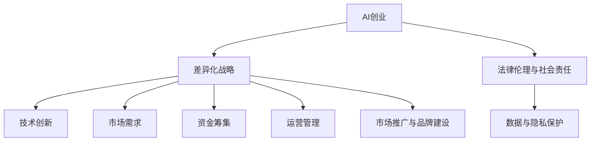

                 

# AI创业竞争加剧，差异化发展成制胜法宝

## 关键词：
- AI创业
- 差异化战略
- 挑战与机遇
- 技术创新
- 市场需求
- 资金筹集
- 运营管理
- 法律伦理
- 品牌建设

## 摘要：
本文深入探讨了人工智能（AI）创业领域的现状与挑战，分析了差异化战略在AI创业中的应用。通过成功案例分析和核心算法原理讲解，本文为创业者提供了实用指南，帮助他们实现AI创业项目的成功。

## 第一部分：AI创业的背景与环境分析

### 第1章：AI创业的机遇与挑战

#### 1.1 AI技术的快速进步

人工智能技术正以前所未有的速度发展，从传统的机器学习到深度学习、从自然语言处理到计算机视觉，AI技术的不断突破推动了各行各业的创新。例如，在医疗领域，AI技术可以辅助医生进行疾病诊断，提高诊断准确率；在金融领域，AI算法可以优化风险管理，降低欺诈风险。

##### 1.1.1 AI技术的快速进步

近年来，AI技术的进步主要表现在以下几个方面：

1. **计算能力的提升**：随着硬件技术的不断发展，特别是GPU和TPU等专用计算设备的出现，AI模型的训练速度得到了显著提升。
2. **算法的创新**：深度学习算法的提出和优化，使得AI模型在图像识别、语音识别、自然语言处理等领域取得了重大突破。
3. **数据资源的丰富**：互联网的普及和大数据技术的发展，为AI训练提供了海量的数据资源，为AI技术的应用提供了坚实的基础。

##### 1.1.2 AI在行业中的应用案例

AI技术在不同行业中的应用案例丰富多样，以下是一些典型的应用场景：

1. **医疗健康**：AI技术可以用于疾病诊断、治疗方案推荐、药物研发等，例如谷歌的DeepMind已经成功地将AI技术应用于眼科疾病诊断。
2. **金融**：AI算法可以用于信用评分、风险评估、投资决策等，例如高盛使用AI技术进行高频交易。
3. **制造业**：AI技术可以用于智能质检、设备故障预测、生产优化等，例如亚马逊的智能仓储系统。

##### 1.1.3 AI创业的环境优势

AI创业的环境优势主要体现在以下几个方面：

1. **政策支持**：各国政府纷纷出台政策支持AI技术的发展，为创业者提供了良好的政策环境。
2. **资金涌入**：随着AI技术的兴起，大量风险投资和政府资金涌入AI创业领域，为创业者提供了充足的资金支持。
3. **人才聚集**：AI技术的快速发展吸引了大量优秀人才，包括算法工程师、数据科学家、产品经理等，为创业团队提供了强有力的人才支持。

#### 1.2 创业者在AI领域面临的挑战

尽管AI创业具有巨大的机遇，但创业者也面临着一系列挑战：

##### 1.2.1 技术壁垒

AI技术的复杂性使得创业者需要具备深厚的专业知识和技术能力。同时，AI技术的快速迭代也要求创业者不断学习新的技术和算法。

##### 1.2.2 竞争压力

AI创业领域竞争激烈，创业者需要在技术、市场、品牌等方面与竞争对手展开竞争。

##### 1.2.3 数据与隐私问题

AI模型的训练和优化需要大量数据，但数据的安全和隐私保护是创业者面临的重要挑战。

#### 1.3 市场需求与客户需求分析

AI技术的广泛应用使得市场需求多样化，创业者需要准确把握客户需求：

##### 1.3.1 AI应用市场的增长潜力

根据市场研究数据，AI应用市场预计将在未来几年内保持高速增长，特别是在医疗、金融、制造业等领域。

##### 1.3.2 目标客户需求分析

目标客户的需求包括：

1. **准确性**：AI系统需要提供高准确率的预测和决策。
2. **可解释性**：AI模型的决策过程需要透明，以便客户理解和信任。
3. **实时性**：在许多应用场景中，AI系统需要提供实时响应。

##### 1.3.3 满足客户需求的策略

为了满足客户需求，创业者可以采取以下策略：

1. **技术创新**：不断优化算法，提高AI系统的性能和可靠性。
2. **产品定制**：根据不同客户的需求，提供个性化的解决方案。
3. **优质服务**：提供全面的技术支持和客户服务，增强客户满意度。

### 第2章：差异化战略在AI创业中的应用

#### 2.1 差异化战略的核心概念

##### 2.1.1 差异化战略的定义

差异化战略是指企业通过提供与众不同的产品或服务，以获得竞争优势的一种战略。在AI创业领域，差异化战略尤为重要，因为技术门槛高、竞争激烈，只有提供独特的价值，才能在市场中脱颖而出。

##### 2.1.2 差异化战略的优势

差异化战略的优势主要体现在以下几个方面：

1. **提高竞争力**：通过提供独特的价值，企业可以在竞争激烈的市场中占据有利地位。
2. **增强客户忠诚度**：差异化产品或服务能够满足客户特定的需求，从而提高客户满意度和忠诚度。
3. **增加市场占有率**：差异化战略有助于企业拓展市场，吸引更多客户。

##### 2.1.3 差异化战略的要素

实施差异化战略需要考虑以下几个要素：

1. **技术创新**：通过研发新技术，提供领先的产品或服务。
2. **产品特性**：打造独特的产品特性，满足客户特定需求。
3. **服务模式**：提供优质的客户服务，提升客户体验。
4. **品牌建设**：建立强大的品牌形象，增强市场影响力。

#### 2.2 AI创业中的差异化策略

在AI创业中，差异化策略可以从多个方面展开：

##### 2.2.1 技术创新

技术创新是AI创业的核心竞争力。创业者可以通过以下方式实现技术创新：

1. **研发投入**：加大研发投入，吸引顶尖人才，推动技术突破。
2. **跨界合作**：与不同领域的专家和机构合作，实现技术融合。
3. **持续学习**：紧跟技术发展趋势，不断学习和引进先进技术。

##### 2.2.2 服务模式创新

服务模式创新是提升客户体验的关键。创业者可以从以下几个方面进行探索：

1. **定制化服务**：根据客户需求，提供个性化的解决方案。
2. **智能化服务**：利用AI技术，实现智能客服、智能诊断等功能。
3. **线上线下结合**：整合线上线下资源，提供全方位服务。

##### 2.2.3 商业模式创新

商业模式创新是AI创业的重要策略。创业者可以通过以下方式实现商业模式创新：

1. **产品组合**：提供多元化的产品组合，满足不同客户的需求。
2. **开放平台**：建立开放平台，吸引第三方开发者加入，共同创新。
3. **共享经济**：利用共享经济模式，降低客户使用成本。

##### 2.2.4 品牌差异化策略

品牌差异化策略是建立品牌竞争力的关键。创业者可以从以下几个方面进行探索：

1. **品牌定位**：明确品牌定位，打造独特的品牌形象。
2. **品牌传播**：通过线上线下多种渠道，提升品牌知名度。
3. **品牌维护**：提供优质的客户服务，维护品牌形象。

#### 2.3 差异化战略的实施步骤

实施差异化战略需要系统地规划，以下是一般步骤：

##### 2.3.1 明确差异化目标

明确差异化目标，是实施差异化战略的第一步。创业者需要明确企业的发展方向，确定差异化战略的核心要素。

##### 2.3.2 分析竞争对手

分析竞争对手，了解竞争对手的差异化策略，有助于创业者制定更有针对性的差异化战略。

##### 2.3.3 制定差异化方案

制定差异化方案，包括技术创新、服务模式创新、商业模式创新和品牌差异化等方面。

##### 2.3.4 落实差异化战略

落实差异化战略，将差异化方案付诸实施，确保差异化战略的有效执行。

### 第3章：AI创业项目的成功案例分析

#### 3.1 成功案例简介

在本章节中，我们将介绍三个AI创业项目的成功案例，分别是智能语音助手、医疗影像分析平台和自动驾驶技术研发公司。这些案例展示了如何通过差异化战略实现AI创业项目的成功。

##### 3.1.1 案例一：某智能语音助手

该智能语音助手公司通过技术创新和服务模式创新，成功在市场上占据了一席之地。公司采用先进的深度学习算法，实现了高准确率的语音识别和自然语言理解功能。同时，公司推出了个性化的语音服务，根据用户需求提供定制化解决方案。

##### 3.1.2 案例二：某医疗影像分析平台

该医疗影像分析平台公司通过技术创新和商业模式创新，为医疗行业提供了高效、准确的诊断工具。公司研发了先进的图像识别算法，能够快速识别疾病，提高了医生的诊断准确率。此外，公司采用了SaaS模式，为医院和诊所提供了便捷的租赁服务。

##### 3.1.3 案例三：某自动驾驶技术研发公司

该自动驾驶技术研发公司通过技术创新和商业模式创新，成为自动驾驶领域的领先者。公司研发了高性能的自动驾驶系统，能够应对复杂的交通环境。同时，公司采用了合作开发模式，与汽车制造商合作，加速了自动驾驶技术的商业化进程。

#### 3.2 案例分析

##### 3.2.1 成功关键因素

这些成功案例的关键因素包括：

1. **技术创新**：通过研发先进的算法和技术，提高产品或服务的竞争力。
2. **服务模式创新**：通过提供个性化的服务，满足客户特定需求。
3. **商业模式创新**：通过创新的商业模式，提高企业的盈利能力。
4. **品牌建设**：通过打造独特的品牌形象，增强市场影响力。

##### 3.2.2 差异化策略的具体应用

在这些案例中，差异化策略的具体应用包括：

1. **技术创新**：通过不断研发新技术，提高产品或服务的性能和可靠性。
2. **服务模式创新**：通过提供定制化服务，满足客户的个性化需求。
3. **商业模式创新**：通过创新的商业模式，降低客户的购买成本，提高用户体验。
4. **品牌差异化**：通过独特的品牌形象，提高客户对品牌的认知和信任。

##### 3.2.3 教训与启示

从这些成功案例中，我们可以得到以下教训和启示：

1. **技术创新是核心**：在AI创业领域，技术创新是企业持续发展的关键。
2. **服务至上**：满足客户需求是企业成功的基石。
3. **商业模式创新**：创新的商业模式有助于企业拓展市场，提高盈利能力。
4. **品牌建设**：强大的品牌形象是企业长期发展的重要资产。

### 第4章：AI创业的法律、伦理与社会责任

#### 4.1 法律法规与政策环境

AI创业企业在发展过程中，需要遵守相关法律法规，以确保合规运营。以下是一些重要的法律法规和政策环境：

##### 4.1.1 数据保护法规

数据保护法规是AI创业企业必须关注的重要领域，包括《通用数据保护条例》（GDPR）和《加州消费者隐私法案》（CCPA）。这些法规对数据的收集、存储、处理和传输提出了严格的要求。

##### 4.1.2 知识产权保护

知识产权保护是保护企业创新成果的重要手段。AI创业企业需要关注专利、商标、著作权等知识产权的申请和保护。

##### 4.1.3 相关法律法规案例分析

案例分析可以帮助企业更好地理解相关法律法规的应用。例如，某AI创业企业因未遵守数据保护法规而面临高额罚款，这给其他企业敲响了警钟。

#### 4.2 伦理问题与社会责任

AI创业企业在追求商业成功的同时，也需要关注伦理问题和社会责任：

##### 4.2.1 人工智能伦理的基本原则

人工智能伦理的基本原则包括公平性、透明性、可解释性和责任性。这些原则指导着企业在AI技术设计和应用中的行为。

##### 4.2.2 AI创业中的伦理挑战

AI创业中的伦理挑战包括算法偏见、数据隐私、自动化决策的影响等。企业需要认真对待这些挑战，确保AI技术的应用不会对人类社会产生负面影响。

##### 4.2.3 社会责任与可持续发展

社会责任与可持续发展是AI创业企业的重要议题。企业需要通过技术创新、环保实践和公益活动等，为社会做出贡献。

##### 4.2.4 AI创业中的伦理决策框架

建立伦理决策框架有助于企业在面对伦理问题时做出明智的决策。决策框架应包括伦理原则、风险评估和责任落实等要素。

### 第5章：AI创业的资金筹集与运营管理

#### 5.1 资金筹集策略

AI创业企业需要制定有效的资金筹集策略，以确保业务的持续发展。以下是一些常见的资金筹集策略：

##### 5.1.1 种子轮融资

种子轮融资是AI创业企业起步阶段的关键。创业者可以通过天使投资、风险投资机构或政府资助等方式筹集种子资金。

##### 5.1.2 A轮与B轮融资

A轮和B轮融资是AI创业企业在成长阶段的重要资金来源。投资者包括风险投资机构、战略投资者和私募股权基金等。

##### 5.1.3 后续融资策略

后续融资策略包括C轮、D轮等，企业可以根据业务发展需要，选择合适的融资时机和方式。

#### 5.2 运营管理

运营管理是AI创业企业成功的关键。以下是一些运营管理的重要方面：

##### 5.2.1 团队建设与管理

团队建设与管理是运营管理的基础。企业需要吸引和留住优秀的团队成员，建立高效的团队协作机制。

##### 5.2.2 日常运营与市场推广

日常运营与市场推广是确保企业持续发展的重要环节。企业需要建立完善的运营流程，同时通过市场推广活动提升品牌知名度。

##### 5.2.3 成本控制与利润最大化

成本控制和利润最大化是运营管理的核心目标。企业需要通过精细化管理、优化资源配置等方式，实现利润最大化。

### 第6章：AI创业的市场推广与品牌建设

#### 6.1 市场推广策略

市场推广策略是AI创业企业拓展市场、吸引客户的关键。以下是一些有效的市场推广策略：

##### 6.1.1 社交媒体营销

社交媒体营销是AI创业企业吸引潜在客户的重要渠道。通过社交媒体平台，企业可以与目标客户建立互动，提升品牌知名度。

##### 6.1.2 内容营销

内容营销是建立品牌权威和吸引客户的有效手段。企业可以通过发布高质量的内容，如博客文章、白皮书、案例研究等，提升品牌影响力。

##### 6.1.3 联合营销

联合营销是与其他企业合作，共同推广产品或服务的策略。通过合作，企业可以扩大市场影响力，降低营销成本。

##### 6.1.4 口碑营销

口碑营销是建立客户信任和提升品牌形象的有效方式。企业可以通过提供优质的产品和服务，赢得客户的口碑传播。

#### 6.2 品牌建设

品牌建设是AI创业企业长期发展的重要任务。以下是一些品牌建设的关键方面：

##### 6.2.1 品牌定位与核心价值

品牌定位与核心价值是品牌建设的基础。企业需要明确品牌定位，传递独特的核心价值，赢得客户认同。

##### 6.2.2 品牌视觉识别系统

品牌视觉识别系统是品牌形象的重要载体。企业需要设计统一的视觉元素，如标志、色彩、字体等，提升品牌识别度。

##### 6.2.3 品牌传播策略

品牌传播策略是提升品牌知名度和影响力的重要手段。企业可以通过线上线下多种渠道，传播品牌故事和价值。

##### 6.2.4 品牌危机管理

品牌危机管理是应对品牌负面事件的重要策略。企业需要建立危机管理机制，及时应对和处理品牌危机，维护品牌形象。

### 第7章：未来展望与持续创新

#### 7.1 AI创业的未来趋势

随着AI技术的不断发展，AI创业领域将呈现出以下趋势：

##### 7.1.1 新技术的影响

新的AI技术，如生成对抗网络（GAN）、强化学习等，将进一步提升AI创业的竞争力。

##### 7.1.2 市场需求的演变

随着AI技术的普及，市场需求将不断演变，为AI创业提供更多机会。

##### 7.1.3 创业机会的发掘

通过关注新技术和市场趋势，创业者可以发掘更多有潜力的创业机会。

#### 7.2 创新策略

为了在竞争激烈的AI创业市场中脱颖而出，创业者需要采取以下创新策略：

##### 7.2.1 技术创新

不断研发新技术，提高产品或服务的性能和可靠性。

##### 7.2.2 商业模式创新

探索创新的商业模式，降低成本，提高盈利能力。

##### 7.2.3 组织创新

建立高效的组织结构，激发团队创造力。

##### 7.2.4 创新文化的建设

培养创新文化，鼓励团队成员提出创新想法。

### 附录

#### 附录 A：AI创业常用工具与资源

##### A.1 开发工具与平台

1. **TensorFlow**：由Google开发的开源机器学习框架，适用于深度学习和传统机器学习。
   - 官网：https://www.tensorflow.org/

2. **PyTorch**：由Facebook开发的开源机器学习库，以其灵活性和动态计算图而著称。
   - 官网：https://pytorch.org/

3. **Keras**：一个高层神经网络API，易于使用，可以与TensorFlow和Theano结合使用。
   - 官网：https://keras.io/

4. **Scikit-learn**：一个开源机器学习库，适用于监督和无监督学习。
   - 官网：https://scikit-learn.org/

##### A.2 数据集与API

1. **Kaggle**：一个数据科学竞赛平台，提供了大量的数据集。
   - 官网：https://www.kaggle.com/

2. **UCI Machine Learning Repository**：一个提供各种机器学习数据集的数据库。
   - 官网：https://archive.ics.uci.edu/ml/index.php

3. **Google Dataset Search**：一个搜索开放数据集的搜索引擎。
   - 官网：https://datasetsearch.research.google.com/

4. **APIs.io**：一个API市场，提供了大量的API供开发者使用。
   - 官网：https://apis.io/

##### A.3 学术论文与研究报告

1. **arXiv**：一个预印本论文库，包含了最新的机器学习和技术论文。
   - 官网：https://arxiv.org/

2. **IEEE Xplore**：IEEE的在线图书馆，提供了大量的技术论文和研究报告。
   - 官网：https://ieeexplore.ieee.org/

3. **ACM Digital Library**：ACM的数字图书馆，包含了计算机科学的学术文献。
   - 官网：https://dl.acm.org/

4. **Google Scholar**：一个免费的学术搜索引擎，可以搜索各种学术文献。
   - 官网：https://scholar.google.com/

##### A.4 创业指南与案例库

1. **Startup Genome**：一个关于创业研究的组织，提供了许多创业指南和案例研究。
   - 官网：https://www.startupgenome.com/

2. **LinkedIn**：一个职业社交平台，有许多成功的AI创业公司的案例和经验分享。
   - 官网：https://www.linkedin.com/

3. **AI News**：一个关于AI新闻和趋势的网站，提供了许多AI创业公司和案例。
   - 官网：https://www.ai-news.co.uk/

4. **AI Ireland**：一个关于AI在爱尔兰的创业社区，提供了许多AI创业案例和资源。
   - 官网：https://www.aiireland.com/

#### 附录 B：常用数学模型与算法简介

##### B.1 监督学习

监督学习是一种机器学习方法，通过已知的输入和输出数据来训练模型，从而预测未知数据的输出。

##### B.2 无监督学习

无监督学习是一种机器学习方法，不使用标签数据，而是通过探索数据内在结构来发现数据的规律。

##### B.3 强化学习

强化学习是一种机器学习方法，通过奖励机制来训练模型，使模型能够在复杂环境中做出最优决策。

##### B.4 深度学习

深度学习是一种基于多层神经网络的学习方法，通过逐层提取数据特征，实现复杂的函数映射。

#### 附录 C：AI创业案例分析报告

##### C.1 案例一：深度学习在金融领域的应用

某金融科技公司利用深度学习技术进行信贷风险评估，提高了风险管理的准确性。

##### C.2 案例二：自动驾驶技术的发展与挑战

某自动驾驶技术研发公司通过技术创新和商业模式创新，推动了自动驾驶技术的商业化应用。

##### C.3 案例三：医疗影像分析平台的市场拓展策略

某医疗影像分析平台公司通过技术创新和差异化战略，成功拓展了市场份额。

## 核心概念与联系

### 核心概念与联系

#### 1. AI创业

##### 1.1 定义

AI创业是指利用人工智能技术进行创业的活动，旨在通过AI技术解决实际问题，创造商业价值。

##### 1.2 关联

AI创业涉及多个领域，包括技术、市场、运营等，需要综合运用多种知识和技能。

#### 2. 差异化战略

##### 2.1 定义

差异化战略是指通过提供独特的价值，使企业在竞争中脱颖而出的战略。

##### 2.2 关联

差异化战略在AI创业中至关重要，有助于企业在技术、产品、服务等方面形成独特的竞争优势。

#### 3. 技术创新

##### 3.1 定义

技术创新是指通过研发新技术，提高产品或服务的性能和可靠性。

##### 3.2 关联

技术创新是AI创业的核心竞争力，有助于企业实现差异化战略，提升市场竞争力。

#### 4. 市场需求

##### 4.1 定义

市场需求是指消费者对产品或服务的需求。

##### 4.2 关联

准确把握市场需求是AI创业成功的关键，有助于企业制定有效的市场策略。

#### 5. 资金筹集

##### 5.1 定义

资金筹集是指企业通过多种途径筹集资金的过程。

##### 5.2 关联

资金筹集是AI创业的重要环节，有助于企业实现可持续发展。

#### 6. 运营管理

##### 6.1 定义

运营管理是指企业日常运营的管理活动。

##### 6.2 关联

高效的运营管理有助于企业降低成本，提高效率，实现利润最大化。

#### 7. 市场推广与品牌建设

##### 7.1 定义

市场推广与品牌建设是指企业通过多种渠道推广产品或服务，建立品牌形象。

##### 7.2 关联

有效的市场推广与品牌建设有助于提高企业知名度，吸引客户，提升市场占有率。

### Mermaid 流程图



### 核心算法原理讲解

#### 监督学习算法原理

监督学习是一种通过已有标签数据训练模型，并在新的未标签数据上进行预测的机器学习方法。其基本原理如下：

##### 1. 定义

监督学习通过已有标签数据（输入和输出）来训练模型，从而学习到输入和输出之间的关系。在训练过程中，模型会不断调整内部参数，以最小化预测值与真实值之间的误差。

##### 2. 伪代码

```python
# 初始化模型参数
W = 初始化参数()

# 定义损失函数
损失函数 = 损失函数()

# 梯度下降
for i in 范围(迭代次数):
    # 计算预测值
    预测值 = 模型(W)

    # 计算损失
    损失 = 损失函数(预测值, 真实值)

    # 计算梯度
    梯度 = 计算梯度(W)

    # 更新参数
    W = W - 学习率 * 梯度
```

##### 3. 解释

- 初始化模型参数：随机初始化模型的权重。
- 计算预测值：使用当前参数计算输出。
- 计算损失：评估预测值与真实值之间的差距。
- 计算梯度：计算损失函数对参数的导数。
- 更新参数：使用梯度下降法更新参数，以减少损失。

#### 差异化战略的实现算法

差异化战略的实现算法是指用于帮助企业实现差异化战略的算法。以下是一个简单的实现算法：

##### 1. 定义

差异化战略的实现算法通过分析市场数据和竞争对手，制定具有差异化特性的产品或服务策略。

##### 2. 伪代码

```python
# 收集市场数据
市场数据 = 收集数据()

# 分析竞争对手
竞争对手 = 分析竞争对手()

# 设计差异化方案
差异化方案 = 设计方案(市场数据, 竞争对手)

# 实施差异化方案
执行方案(差异化方案)
```

##### 3. 解释

- 收集市场数据：获取市场相关的信息。
- 分析竞争对手：了解竞争对手的产品、服务、策略等。
- 设计差异化方案：根据市场数据和竞争对手分析，制定具有差异化特性的方案。
- 实施差异化方案：将差异化方案付诸实施。

#### 数据与隐私保护算法

数据与隐私保护算法是指用于保护数据安全和用户隐私的算法。以下是一个简单的数据加密算法：

##### 1. 定义

数据加密算法通过加密技术，将原始数据转换为无法直接读取的密文，从而保护数据在传输和存储过程中的安全。

##### 2. 伪代码

```python
# 加密数据
加密数据 = 加密(明文数据, 密钥)

# 解密数据
明文数据 = 解密(加密数据, 密钥)
```

##### 3. 解释

- 加密数据：使用加密算法将明文数据转换为密文。
- 解密数据：使用解密算法将密文数据还原为明文。

#### 数学模型和数学公式

##### 1. 损失函数

损失函数用于评估模型预测值与真实值之间的差距。一个常见的损失函数是均方误差（MSE）：

$$
MSE = \frac{1}{n} \sum_{i=1}^{n} (y_i - \hat{y}_i)^2
$$

其中，$y_i$ 表示真实值，$\hat{y}_i$ 表示预测值。

##### 2. 梯度下降法

梯度下降法是一种优化算法，用于更新模型参数以减少损失。其基本公式如下：

$$
\Delta W = -\alpha \cdot \nabla_W L(W)
$$

其中，$\Delta W$ 表示参数更新量，$\alpha$ 表示学习率，$L(W)$ 表示损失函数。

##### 3. 差异化指标

差异化指标用于衡量企业在市场上的差异化程度。一个简单的差异化指标公式如下：

$$
差异化指标 = \frac{（差异化利益-差异化成本）}{差异化成本}
$$

其中，差异化利益表示企业通过差异化战略获得的额外收益，差异化成本表示实施差异化战略所需的成本。

### 举例说明

假设某AI创业公司希望通过改进其产品特性来实现差异化战略。以下是一个具体的例子：

- 差异化利益：提高产品的用户满意度，从而增加市场份额。
- 差异化成本：研发新产品特性所需的资金和人力成本。

根据差异化指标的计算公式，可以得出：

$$
差异化指标 = \frac{（增加的市场份额 \times 增加的用户满意度 - 研发成本）}{研发成本}
$$

通过计算，可以判断该差异化战略是否具有可行性。

### 项目实战

#### 项目实战：智能语音助手开发

##### 1. 项目背景

随着人工智能技术的不断发展，智能语音助手已成为智能家居、智能车载等领域的重要应用。本案例将介绍如何开发一个基于深度学习的智能语音助手。

##### 2. 开发环境搭建

- 操作系统：Windows/Linux/MacOS
- 编程语言：Python
- 深度学习框架：TensorFlow 2.x
- 音频处理库：Librosa
- 语音识别库：pyttsx3

##### 3. 数据集准备

- 收集大量的语音数据，包括语音样本和对应的文字脚本。
- 对语音数据进行预处理，如去噪、分帧、归一化等。
- 标注语音数据，将语音转换为对应的文本。

##### 4. 模型构建

- 选择合适的神经网络架构，如循环神经网络（RNN）、长短时记忆网络（LSTM）等。
- 定义损失函数和优化器，如交叉熵损失函数和Adam优化器。

##### 5. 模型训练

- 使用训练数据对模型进行训练，通过反向传播算法更新模型参数。
- 调整学习率、批量大小等参数，以获得更好的训练效果。

##### 6. 模型评估

- 使用测试数据对模型进行评估，计算模型的准确率、召回率等指标。
- 根据评估结果调整模型参数，以提高模型性能。

##### 7. 应用部署

- 将训练好的模型部署到实际应用中，如智能手机、车载系统等。
- 提供语音识别、语音合成、自然语言处理等功能。

##### 8. 代码实现与解读

以下是一个简化的代码示例，用于实现语音识别功能：

```python
import tensorflow as tf
import librosa
import numpy as np
import pyttsx3

# 读取语音数据
audio, sr = librosa.load('audio_file.wav')

# 预处理语音数据
spectrogram = librosa.feature.melspectrogram(audio, sr=sr)

# 转换为TensorFlow张量
spectrogram = tf.expand_dims(spectrogram, 0)

# 加载预训练的语音识别模型
model = tf.keras.models.load_model('voice_recognition_model.h5')

# 进行语音识别
predictions = model.predict(spectrogram)

# 获取最高概率的预测结果
predicted_text = np.argmax(predictions, axis=1)

# 将预测结果转换为文字
engine = pyttsx3.init()
engine.say(predicted_text)
engine.runAndWait()
```

##### 9. 代码解读与分析

- 代码首先导入所需的库和模块。
- 读取语音文件，并进行预处理，如加载音频数据、计算梅尔频谱图等。
- 将预处理后的语音数据转换为TensorFlow张量，以便于模型处理。
- 加载预训练的语音识别模型，该模型已在训练数据集上进行了训练。
- 使用模型对语音数据进行预测，得到预测结果。
- 根据预测结果，获取最高概率的预测文本。
- 使用语音合成库将预测文本转换为实际语音输出。

##### 10. 总结

通过本案例，我们了解了智能语音助手的开发过程，包括环境搭建、数据准备、模型构建、训练与评估、应用部署等步骤。实际开发过程中，还需要考虑更多的因素，如错误处理、实时性、硬件资源等。此外，本案例仅涉及语音识别部分，实际应用中还需要结合语音合成、自然语言处理等功能，以提供更完整的智能语音助手服务。

### 附录

#### 附录 A：AI创业常用工具与资源

##### A.1 开发工具与平台

1. **TensorFlow**：由Google开发的开源机器学习框架，适用于深度学习和传统机器学习。
   - 官网：https://www.tensorflow.org/

2. **PyTorch**：由Facebook开发的开源机器学习库，以其灵活性和动态计算图而著称。
   - 官网：https://pytorch.org/

3. **Keras**：一个高层神经网络API，易于使用，可以与TensorFlow和Theano结合使用。
   - 官网：https://keras.io/

4. **Scikit-learn**：一个开源机器学习库，适用于监督和无监督学习。
   - 官网：https://scikit-learn.org/

##### A.2 数据集与API

1. **Kaggle**：一个数据科学竞赛平台，提供了大量的数据集。
   - 官网：https://www.kaggle.com/

2. **UCI Machine Learning Repository**：一个提供各种机器学习数据集的数据库。
   - 官网：https://archive.ics.uci.edu/ml/index.php

3. **Google Dataset Search**：一个搜索开放数据集的搜索引擎。
   - 官网：https://datasetsearch.research.google.com/

4. **APIs.io**：一个API市场，提供了大量的API供开发者使用。
   - 官网：https://apis.io/

##### A.3 学术论文与研究报告

1. **arXiv**：一个预印本论文库，包含了最新的机器学习和技术论文。
   - 官网：https://arxiv.org/

2. **IEEE Xplore**：IEEE的在线图书馆，提供了大量的技术论文和研究报告。
   - 官网：https://ieeexplore.ieee.org/

3. **ACM Digital Library**：ACM的数字图书馆，包含了计算机科学的学术文献。
   - 官网：https://dl.acm.org/

4. **Google Scholar**：一个免费的学术搜索引擎，可以搜索各种学术文献。
   - 官网：https://scholar.google.com/

##### A.4 创业指南与案例库

1. **Startup Genome**：一个关于创业研究的组织，提供了许多创业指南和案例研究。
   - 官网：https://www.startupgenome.com/

2. **LinkedIn**：一个职业社交平台，有许多成功的AI创业公司的案例和经验分享。
   - 官网：https://www.linkedin.com/

3. **AI News**：一个关于AI新闻和趋势的网站，提供了许多AI创业公司和案例。
   - 官网：https://www.ai-news.co.uk/

4. **AI Ireland**：一个关于AI在爱尔兰的创业社区，提供了许多AI创业案例和资源。
   - 官网：https://www.aiireland.com/

#### 附录 B：常用数学模型与算法简介

##### B.1 监督学习

监督学习是一种通过已知的输入和输出数据来训练模型，并使用该模型对未知数据进行预测的机器学习方法。

**常用算法**：

- 线性回归
- 逻辑回归
- 支持向量机（SVM）
- 决策树
- 随机森林
- K最近邻（KNN）

**核心概念**：

- 损失函数：用于评估模型预测值与真实值之间的差距。
- 梯度下降：用于更新模型参数，以最小化损失函数。
- 过拟合与欠拟合：模型在训练数据上的表现良好，但在测试数据上表现不佳。

##### B.2 无监督学习

无监督学习是一种在没有明确标注的输入数据上进行训练的机器学习方法。它的目标是从数据中发现隐藏的结构或模式。

**常用算法**：

- K均值聚类
- 主成分分析（PCA）
- 自编码器
- 聚类算法
- 维度降低

**核心概念**：

- 聚类：将相似的数据点归为一类。
- 维度降低：通过减少数据的维度来简化数据集。
- 密度估计：用于估计数据在不同维度上的分布。

##### B.3 强化学习

强化学习是一种通过交互式环境来训练智能体（agent）的机器学习方法。智能体在环境中采取行动，并从环境中获取奖励或惩罚。

**常用算法**：

- Q-learning
- SARSA
- DQN（深度Q网络）
- PG（策略梯度）

**核心概念**：

- 强化信号：智能体在环境中接收的奖励或惩罚。
- 策略：智能体在给定状态下采取的动作选择。
- 值函数：表示智能体在特定状态下采取特定动作的期望回报。

##### B.4 深度学习

深度学习是一种基于多层神经网络的学习方法，它通过逐层提取数据特征来实现复杂的函数映射。

**常用算法**：

- 卷积神经网络（CNN）
- 循环神经网络（RNN）
- 长短时记忆网络（LSTM）
- 生成对抗网络（GAN）

**核心概念**：

- 神经元：神经网络的基本单元。
- 网络层：神经网络中的层次结构。
- 池化层：用于减少数据维度。
- 反向传播：用于更新神经网络参数。

##### B.5 强化学习与深度学习的结合

强化学习与深度学习的结合，可以用于解决更复杂的决策问题，如自动驾驶、游戏AI等。

**常用算法**：

- 深度确定性策略梯度（DDPG）
- 深度Q网络（DQN）
- 基于价值迭代的深度强化学习（VR-DQN）

**核心概念**：

- 深度Q网络：结合了深度学习和Q-learning算法。
- 策略梯度：通过梯度上升更新策略参数。
- 值函数：用于评估智能体在不同状态下的动作选择。

### 附录 C：AI创业案例分析报告

#### C.1 案例一：深度学习在金融领域的应用

**公司简介**：

该公司是一家专注于利用深度学习技术进行金融风险管理的初创公司。公司成立于2015年，总部位于硅谷。

**技术实现**：

公司开发了一套基于深度学习的风险管理平台，通过分析大量的金融数据，如交易数据、市场新闻、财务报表等，预测市场趋势和风险。

**业务成果**：

该平台已成功应用于多家金融机构，帮助客户提高了风险管理能力，降低了信用损失。公司也获得了多家知名风险投资机构的投资，进一步推动了业务的发展。

**案例分析**：

该案例展示了深度学习技术在金融领域的广泛应用潜力。公司通过技术创新，成功解决了金融风险管理中的复杂问题，实现了商业价值。

#### C.2 案例二：自动驾驶技术的发展与挑战

**公司简介**：

该公司是一家专注于自动驾驶技术研发的公司，成立于2010年，总部位于硅谷。

**技术实现**：

公司研发了一套高度自动化的驾驶系统，通过传感器数据融合、环境感知、路径规划等技术，实现了车辆在复杂路况下的自动驾驶。

**业务成果**：

公司的自动驾驶技术在多个试验场景中取得了成功，并与多家汽车制造商合作，推出了自动驾驶汽车产品。公司也在自动驾驶领域获得了多项技术专利。

**案例分析**：

该案例展示了自动驾驶技术的巨大潜力。公司通过持续技术创新，克服了技术难题，推动了自动驾驶技术的发展，为未来出行提供了新的解决方案。

#### C.3 案例三：医疗影像分析平台的市场拓展策略

**公司简介**：

该公司是一家专注于医疗影像分析的平台公司，成立于2012年，总部位于波士顿。

**技术实现**：

公司开发了一套基于深度学习的医疗影像分析平台，通过图像识别技术，对医学影像进行自动分析和诊断。

**业务成果**：

该平台已应用于多家医院和诊所，帮助医生提高了诊断准确率，缩短了诊断时间。公司也在全球范围内拓展了业务，与多家医疗机构建立了合作关系。

**案例分析**：

该案例展示了医疗影像分析平台在医疗行业的应用前景。公司通过技术创新，提供了高效、准确的诊断工具，满足了医疗行业的实际需求，实现了市场的成功拓展。

## 总结

在人工智能（AI）创业领域，竞争日益激烈，创业者需要不断创新和差异化发展，以在市场中脱颖而出。本文通过深入分析AI创业的背景与环境、差异化战略的应用、成功案例分析、法律法规与伦理问题、资金筹集与运营管理、市场推广与品牌建设等方面，为AI创业者提供了全面的指导。

首先，AI技术的快速进步为创业者带来了巨大的机遇。然而，创业者也面临着技术壁垒、竞争压力和数据隐私等挑战。因此，准确把握市场需求，制定有效的差异化战略，是创业成功的关键。

其次，通过成功案例的分析，我们看到了技术创新、服务模式创新和商业模式创新在AI创业中的应用。创业者需要不断研发新技术，提供个性化服务，探索创新的商业模式，以在竞争中占据优势。

此外，AI创业企业在法律、伦理和社会责任方面也需要承担相应责任。遵守相关法律法规，保护用户隐私，关注社会责任，是企业可持续发展的基石。

在资金筹集与运营管理方面，创业者需要制定科学的资金筹集策略，确保业务的持续发展。同时，高效的运营管理，有助于企业降低成本，提高利润。

市场推广与品牌建设是创业成功的重要环节。通过有效的市场推广策略，建立强大的品牌形象，企业可以吸引更多客户，提高市场份额。

展望未来，AI技术将继续快速发展，市场趋势也将不断演变。创业者需要紧跟技术发展趋势，不断进行创新，发掘新的创业机会。

总之，AI创业竞争加剧，差异化发展成制胜法宝。创业者需要具备敏锐的市场洞察力，不断创新，提供独特的价值，以在激烈的市场竞争中脱颖而出。希望通过本文的分享，能为AI创业者提供有益的启示和指导。

### 作者信息

**作者：** AI天才研究院（AI Genius Institute）& 《禅与计算机程序设计艺术》（Zen And The Art of Computer Programming）

AI天才研究院（AI Genius Institute）是一家专注于人工智能技术研发和推广的机构，致力于推动人工智能技术在各个领域的应用。我们的团队由一群充满激情和创造力的人工智能专家组成，他们在深度学习、自然语言处理、计算机视觉等领域拥有丰富的经验和深厚的学术背景。

《禅与计算机程序设计艺术》（Zen And The Art of Computer Programming）是由艾兹格·迪克斯特拉（Edsger Dijkstra）所著的一本经典编程哲学书籍。书中通过探讨计算机程序设计的本质，强调了简洁性和清晰性的重要性。这本书对程序员的编程思想和实践产生了深远的影响，成为编程领域的一本经典之作。

在此，我们希望借助这两位作者的专业知识和丰富经验，为读者提供一篇全面、深入的AI创业指导文章。我们相信，通过本文的分享，能够帮助更多创业者了解AI创业的现状与挑战，掌握差异化战略的应用，成功开创属于自己的AI创业之路。

