                 

# 《AI即服务（AIaaS）平台设计》

## 关键词
AIaaS、云计算、平台设计、人工智能、服务架构、大数据处理、机器学习、模型部署、性能优化、安全性设计。

## 摘要
本文将深入探讨AI即服务（AIaaS）平台的整体设计，从基础概念到实际应用，全面解析AIaaS平台的架构、核心组件、实现与优化，以及安全性设计。通过一系列实例和实战代码，我们将展示如何构建高效、可靠的AIaaS平台，以支持现代人工智能应用的需求。

---

## 第一部分: AIaaS平台设计基础

### 第1章: AIaaS概述

#### 1.1 AIaaS的概念与价值

AIaaS，即AI即服务，是一种云计算服务模型，它提供基于云的人工智能资源和服务。与传统的AI解决方案不同，AIaaS将AI能力作为一种服务交付，使得企业可以无需拥有庞大的AI团队或昂贵的硬件设备，即可快速部署和利用AI技术。

**价值：**
- **降低成本：** 企业无需购买昂贵的硬件设备和软件许可证，只需按需付费即可。
- **提高效率：** 快速部署AI服务，减少开发时间和开发成本。
- **灵活性：** 企业可以根据需求调整资源，实现动态扩展和缩减。
- **创新加速：** 企业可以快速尝试新的AI应用，加快创新速度。

#### 1.2 AIaaS与传统云服务的区别

传统云服务主要提供计算、存储和网络资源，而AIaaS则在此基础上增加了AI功能。具体区别如下：

- **服务内容：** AIaaS提供AI模型训练、推理和优化等服务，而传统云服务主要提供基础设施服务。
- **技术栈：** AIaaS需要集成了深度学习框架、模型优化工具等，而传统云服务则更侧重于操作系统和数据库。
- **用户群体：** AIaaS更适合不具备AI专业能力的企业，而传统云服务则更适用于广泛的企业和开发者。

#### 1.3 AIaaS的发展趋势

随着AI技术的不断成熟和应用场景的扩大，AIaaS市场呈现出以下趋势：

- **模型即服务（Model as a Service, MaaS）：** 将预训练模型直接提供给用户，减少模型训练的时间和成本。
- **AI芯片和硬件加速：** 随着AI芯片技术的进步，AIaaS平台的性能将得到显著提升。
- **行业定制化：** AIaaS平台将针对不同行业提供定制化的解决方案。
- **开源生态：** 开源工具和框架将在AIaaS平台中发挥更大作用，促进技术进步和生态发展。

### 第2章: AIaaS平台架构设计

#### 2.1 平台架构概述

AIaaS平台的架构设计需要考虑多个方面，包括计算资源、数据存储、模型训练与部署等。以下是一个典型的AIaaS平台架构：

- **基础设施层：** 提供计算资源、存储资源、网络资源等。
- **数据层：** 存储和管理大规模数据集，支持数据清洗、预处理和存储。
- **服务层：** 提供API接口，实现模型的训练、部署和推理。
- **应用层：** 提供面向特定应用场景的AI服务。

#### 2.2 数据存储与处理

数据存储与处理是AIaaS平台的核心之一。以下是一些关键点：

- **数据湖（Data Lake）：** 存储各种类型的数据，包括结构化、半结构化和非结构化数据。
- **数据仓库（Data Warehouse）：** 存储经过清洗和预处理的数据，用于模型训练和推理。
- **数据处理引擎：** 支持数据清洗、转换、聚合等操作，为模型训练提供高质量的数据。

#### 2.3 模型训练与部署

模型训练与部署是AIaaS平台的核心功能之一。以下是一些关键点：

- **模型训练：** 使用分布式训练框架，如TensorFlow、PyTorch等，加速模型训练。
- **模型优化：** 通过模型压缩、量化等技术，降低模型大小和计算复杂度。
- **模型部署：** 使用容器化技术，如Docker和Kubernetes，实现模型的快速部署和动态扩展。

#### 2.4 API设计与接口开发

API设计与接口开发是AIaaS平台与用户交互的重要途径。以下是一些关键点：

- **RESTful API：** 提供标准的HTTP接口，支持JSON或XML数据格式。
- **版本控制：** 通过版本控制，确保API的兼容性和稳定性。
- **文档生成：** 使用工具自动生成API文档，便于用户使用。

### 第3章: AIaaS核心组件

#### 3.1 计算资源管理

计算资源管理是AIaaS平台的重要组成部分。以下是一些关键点：

- **虚拟化技术：** 使用虚拟化技术，如VMware和KVM，实现计算资源的动态分配和调度。
- **资源调度算法：** 设计高效的资源调度算法，确保任务得到合理的资源分配。
- **负载均衡：** 使用负载均衡器，如Nginx和HAProxy，实现流量均衡和故障转移。

#### 3.2 存储资源管理

存储资源管理是AIaaS平台的另一个关键点。以下是一些关键点：

- **分布式存储系统：** 使用分布式存储系统，如HDFS和Ceph，实现大规模数据存储和访问。
- **数据备份与恢复：** 设计可靠的数据备份和恢复策略，确保数据的安全性和可用性。
- **存储优化：** 通过数据压缩、去重等技术，提高存储空间的利用率。

#### 3.3 网络通信管理

网络通信管理是AIaaS平台的通信基础。以下是一些关键点：

- **网络安全：** 设计安全策略，如防火墙、入侵检测等，确保网络通信的安全。
- **负载均衡：** 使用负载均衡器，如Nginx和HAProxy，实现流量均衡和故障转移。
- **网络监控：** 实时监控网络状态，及时发现和解决网络问题。

#### 3.4 安全与隐私保护

安全与隐私保护是AIaaS平台的重要方面。以下是一些关键点：

- **数据加密：** 对传输和存储的数据进行加密，确保数据的安全性。
- **访问控制：** 设计访问控制策略，确保只有授权用户可以访问数据和服务。
- **隐私保护：** 设计隐私保护机制，如差分隐私、联邦学习等，确保用户隐私不受侵犯。

## 第二部分: AIaaS平台实现与优化

### 第4章: AIaaS平台实现步骤

#### 4.1 平台需求分析

平台需求分析是AIaaS平台实现的第一步，主要包括以下内容：

- **用户需求：** 了解用户的需求和业务场景，确定平台的功能和性能要求。
- **技术需求：** 分析所需的技术栈和工具，确保平台的技术可行性。
- **资源需求：** 估算所需的硬件资源和网络带宽，为后续的资源规划提供依据。

#### 4.2 技术选型与架构设计

技术选型与架构设计是AIaaS平台实现的关键步骤，主要包括以下内容：

- **云计算平台：** 选择适合的云计算平台，如AWS、Azure、Google Cloud等。
- **AI框架：** 选择合适的AI框架，如TensorFlow、PyTorch等。
- **存储方案：** 设计数据存储方案，包括数据湖和数据仓库。
- **计算资源：** 设计计算资源分配方案，包括虚拟机和容器。

#### 4.3 数据处理流程

数据处理流程是AIaaS平台的核心，主要包括以下内容：

- **数据采集：** 从各种数据源采集数据，包括结构化数据和非结构化数据。
- **数据清洗：** 清洗数据中的噪声和错误，提高数据质量。
- **数据预处理：** 对数据进行格式转换、特征提取等操作，为模型训练做准备。
- **数据存储：** 将处理后的数据存储到数据仓库或数据湖中，供模型训练和推理使用。

#### 4.4 模型训练流程

模型训练流程是AIaaS平台的核心之一，主要包括以下内容：

- **模型选择：** 根据业务场景选择合适的模型，如分类模型、回归模型等。
- **数据集准备：** 准备用于模型训练的数据集，包括训练集和验证集。
- **模型训练：** 使用分布式训练框架进行模型训练，包括优化器选择、学习率调整等。
- **模型评估：** 使用验证集评估模型性能，包括准确率、召回率等指标。
- **模型优化：** 根据评估结果调整模型参数，提高模型性能。

#### 4.5 部署与监控

部署与监控是AIaaS平台的保障，主要包括以下内容：

- **模型部署：** 将训练好的模型部署到生产环境，包括容器化部署和服务器部署。
- **监控与告警：** 实时监控平台性能，包括计算资源、存储资源、网络资源等，设置告警机制。
- **日志管理：** 记录平台运行日志，便于问题追踪和故障排除。

### 第5章: AIaaS性能优化

#### 5.1 性能优化方法

性能优化是AIaaS平台的关键，以下是一些常用的性能优化方法：

- **分布式计算：** 使用分布式计算框架，如Spark和Hadoop，提高数据处理速度。
- **数据缓存：** 使用数据缓存，如Redis和Memcached，减少数据访问延迟。
- **模型压缩：** 使用模型压缩技术，如模型剪枝和量化，降低模型大小和计算复杂度。
- **负载均衡：** 使用负载均衡器，如Nginx和HAProxy，实现流量均衡和故障转移。

#### 5.2 资源利用率优化

资源利用率优化是提高AIaaS平台性能的重要手段，以下是一些关键点：

- **资源监控：** 实时监控资源使用情况，包括CPU、内存、磁盘等。
- **资源调度：** 根据资源使用情况动态调整任务分配，确保资源得到最大化利用。
- **资源回收：** 定期清理无用数据和进程，释放资源。

#### 5.3 模型部署优化

模型部署优化是提高AIaaS平台性能的关键，以下是一些关键点：

- **容器化部署：** 使用容器化技术，如Docker和Kubernetes，实现快速部署和动态扩展。
- **模型优化：** 使用模型优化技术，如模型压缩和量化，降低模型大小和计算复杂度。
- **缓存优化：** 使用缓存技术，如Redis和Memcached，减少模型加载和推理时间。

#### 5.4 网络通信优化

网络通信优化是提高AIaaS平台性能的重要方面，以下是一些关键点：

- **负载均衡：** 使用负载均衡器，如Nginx和HAProxy，实现流量均衡和故障转移。
- **网络优化：** 优化网络配置，提高网络传输速度和稳定性。
- **数据压缩：** 使用数据压缩技术，如Gzip和Snappy，减少数据传输量。

### 第6章: AIaaS安全性设计

#### 6.1 安全性概述

安全性设计是AIaaS平台的基石，以下是一些关键点：

- **数据安全：** 设计安全的数据存储和传输机制，保护用户数据不被泄露和篡改。
- **访问控制：** 设计严格的访问控制机制，确保只有授权用户可以访问数据和功能。
- **身份认证：** 使用身份认证机制，如OAuth和IAM，确保用户身份的合法性和安全性。
- **安全审计：** 实时记录平台操作日志，进行安全审计，及时发现和解决安全隐患。

#### 6.2 数据加密与传输

数据加密与传输是保护数据安全的重要手段，以下是一些关键点：

- **数据加密：** 使用数据加密技术，如AES和RSA，确保数据在存储和传输过程中不被窃取。
- **传输加密：** 使用传输加密技术，如TLS和SSL，确保数据在传输过程中不被窃听。
- **加密存储：** 使用加密存储技术，如EBS和EFS，确保数据在存储过程中不被泄露。

#### 6.3 访问控制与权限管理

访问控制与权限管理是确保数据和服务安全的重要措施，以下是一些关键点：

- **角色与权限：** 设计角色与权限管理机制，确保用户可以根据其角色访问相应的数据和功能。
- **访问控制列表（ACL）：** 使用访问控制列表，控制用户对数据和资源的访问权限。
- **单点登录（SSO）：** 使用单点登录技术，简化用户登录流程，提高安全性。

#### 6.4 应对常见安全威胁

应对常见安全威胁是AIaaS平台安全性的关键，以下是一些关键点：

- **DDoS攻击：** 设计防御DDoS攻击的策略，如流量清洗和黑洞策略。
- **SQL注入：** 设计防止SQL注入的机制，如参数化查询和输入验证。
- **跨站脚本攻击（XSS）：** 设计防止XSS攻击的机制，如输出编码和内容安全策略（CSP）。
- **恶意软件防护：** 设计恶意软件防护机制，如反病毒软件和入侵检测系统。

## 第三部分: AIaaS平台应用与实践

### 第7章: AIaaS平台在实际项目中的应用

#### 7.1 项目案例介绍

在本章中，我们将介绍一个基于AIaaS平台的实际项目案例。该项目涉及图像识别和自然语言处理，旨在通过AI技术提高企业运营效率。

#### 7.2 项目需求分析

项目需求分析包括以下关键点：

- **业务目标：** 提高图像识别和自然语言处理效率，减少人工干预。
- **数据需求：** 收集和标注大量的图像和文本数据，用于模型训练和评估。
- **技术要求：** 选择合适的AI框架和算法，实现高效准确的模型训练和推理。

#### 7.3 平台设计与实现

平台设计与实现包括以下关键点：

- **数据层：** 使用数据湖存储和管理大量图像和文本数据，使用数据处理引擎进行数据预处理。
- **模型层：** 选择适合的深度学习框架，如TensorFlow和PyTorch，进行模型训练和优化。
- **服务层：** 提供API接口，实现模型的部署和推理，支持批量处理和实时处理。

#### 7.4 项目成果与总结

项目成果与总结包括以下关键点：

- **模型性能：** 通过模型训练和优化，实现高效的图像识别和自然语言处理。
- **用户体验：** 提供友好的用户界面，实现方便快捷的操作。
- **业务效益：** 提高图像识别和自然语言处理效率，减少人工干预，提高企业运营效率。

### 第8章: AIaaS平台开发与运营经验分享

#### 8.1 开发经验分享

在本章中，我们将分享AIaaS平台开发的宝贵经验，包括技术选型、团队协作、项目管理等方面的经验。

#### 8.2 运营经验分享

在本章中，我们将分享AIaaS平台运营的实践经验，包括监控与维护、用户支持、数据安全等方面的经验。

#### 8.3 挑战与解决方案

在本章中，我们将讨论在AIaaS平台开发与运营过程中面临的挑战，并分享相应的解决方案。

#### 8.4 未来展望

在本章中，我们将探讨AIaaS平台未来的发展趋势，包括技术创新、行业应用拓展等方面的展望。

## 附录

### 附录A: AIaaS平台开发工具与资源

#### A.1 开发工具介绍

在本附录中，我们将介绍一些常用的AIaaS平台开发工具，包括深度学习框架、容器管理工具、API开发工具等。

#### A.2 资源管理工具

在本附录中，我们将介绍一些常用的资源管理工具，包括虚拟化技术、云计算平台等。

#### A.3 模型训练与部署工具

在本附录中，我们将介绍一些常用的模型训练与部署工具，包括训练框架、模型优化工具等。

#### A.4 接口设计与开发工具

在本附录中，我们将介绍一些常用的接口设计与开发工具，包括API框架、文档生成工具等。

### 附录B: Mermaid 流程图

#### B.1 数据处理流程图

在本附录中，我们将使用Mermaid语言绘制数据处理流程图，展示数据采集、清洗、预处理和存储的过程。

#### B.2 模型训练与部署流程图

在本附录中，我们将使用Mermaid语言绘制模型训练与部署流程图，展示模型训练、评估、优化和部署的过程。

#### B.3 安全性管理流程图

在本附录中，我们将使用Mermaid语言绘制安全性管理流程图，展示数据加密、访问控制、安全审计的过程。

### 附录C: 伪代码与数学模型

#### C.1 数据处理算法伪代码

在本附录中，我们将使用伪代码形式展示数据处理算法的原理和实现。

#### C.2 模型训练算法伪代码

在本附录中，我们将使用伪代码形式展示模型训练算法的原理和实现。

#### C.3 数学模型与公式

在本附录中，我们将使用LaTeX格式展示一些核心的数学模型与公式，并进行详细讲解。

### 附录D: 项目实战代码示例

#### D.1 数据处理代码示例

在本附录中，我们将提供数据处理代码示例，包括数据采集、清洗和预处理的过程。

#### D.2 模型训练代码示例

在本附录中，我们将提供模型训练代码示例，包括数据集准备、模型训练和评估的过程。

#### D.3 模型部署代码示例

在本附录中，我们将提供模型部署代码示例，包括容器化部署和API接口开发的过程。

#### D.4 代码解读与分析

在本附录中，我们将对上述代码示例进行详细解读与分析，帮助读者理解代码实现原理和关键技术。

---

**作者：** AI天才研究院/AI Genius Institute & 禅与计算机程序设计艺术 /Zen And The Art of Computer Programming

---

**注：** 本文为示例性内容，实际撰写时请根据具体情况进行调整和补充。文章长度需大于8000字，每个章节内容需详细具体，满足完整性要求。

---

**文章标题**: 《AI即服务（AIaaS）平台设计》

**文章关键词**: AIaaS、云计算、平台设计、人工智能、服务架构、大数据处理、机器学习、模型部署、性能优化、安全性设计。

**文章摘要**: 本文深入探讨了AI即服务（AIaaS）平台的整体设计，从基础概念到实际应用，全面解析了AIaaS平台的架构、核心组件、实现与优化，以及安全性设计。通过实例和实战代码，展示了如何构建高效、可靠的AIaaS平台，以支持现代人工智能应用的需求。

---

**第一部分: AIaaS平台设计基础**

### 第1章: AIaaS概述

#### 1.1 AIaaS的概念与价值

AIaaS，即AI即服务，是一种新兴的云计算服务模式，它将人工智能（AI）的能力作为一种服务提供给用户。这种服务模式的出现，解决了许多企业在AI应用过程中面临的问题，如高昂的硬件成本、复杂的技术栈和技能要求等。

**核心概念：**
- **AIaaS：** AI即服务，提供基于云的人工智能资源和服务。
- **云计算：** 提供虚拟化的计算资源、存储资源和网络资源。

**价值：**
- **降低成本：** 企业无需购买昂贵的硬件设备和软件许可证，只需按需付费即可。
- **提高效率：** 快速部署AI服务，减少开发时间和开发成本。
- **灵活性：** 企业可以根据需求调整资源，实现动态扩展和缩减。
- **创新加速：** 企业可以快速尝试新的AI应用，加快创新速度。

**联系：**
AIaaS是云计算服务的一种扩展，它将AI能力作为一种服务交付，使得企业能够更便捷地使用AI技术，提高业务效率和竞争力。

#### 1.2 AIaaS与传统云服务的区别

传统云服务主要提供基础设施即服务（IaaS）、平台即服务（PaaS）和软件即服务（SaaS）等基础服务。而AIaaS则在这些服务基础上增加了AI功能，使得用户能够更方便地使用AI技术。

**区别：**
- **服务内容：** AIaaS提供AI模型训练、推理和优化等服务，而传统云服务主要提供基础设施服务。
- **技术栈：** AIaaS需要集成了深度学习框架、模型优化工具等，而传统云服务则更侧重于操作系统和数据库。
- **用户群体：** AIaaS更适合不具备AI专业能力的企业，而传统云服务则更适用于广泛的企业和开发者。

**联系：**
AIaaS是传统云服务的一种延伸，它将AI能力作为一种服务交付，使得企业能够更便捷地使用AI技术，提高业务效率和竞争力。

#### 1.3 AIaaS的发展趋势

随着人工智能技术的快速发展，AIaaS市场也在不断壮大。以下是一些AIaaS的发展趋势：

- **模型即服务（Model as a Service, MaaS）：** 将预训练模型直接提供给用户，减少模型训练的时间和成本。
- **AI芯片和硬件加速：** 随着AI芯片技术的进步，AIaaS平台的性能将得到显著提升。
- **行业定制化：** AIaaS平台将针对不同行业提供定制化的解决方案。
- **开源生态：** 开源工具和框架将在AIaaS平台中发挥更大作用，促进技术进步和生态发展。

**联系：**
AIaaS的发展趋势反映了人工智能技术的进步和市场需求的变化，它将不断推动AIaaS平台的发展和优化。

### 第2章: AIaaS平台架构设计

#### 2.1 平台架构概述

AIaaS平台的设计需要考虑多个方面，包括计算资源、数据存储、模型训练与部署等。以下是一个典型的AIaaS平台架构：

- **基础设施层：** 提供计算资源、存储资源、网络资源等。
- **数据层：** 存储和管理大规模数据集，支持数据清洗、预处理和存储。
- **服务层：** 提供API接口，实现模型的训练、部署和推理。
- **应用层：** 提供面向特定应用场景的AI服务。

**核心概念：**
- **基础设施层：** 提供虚拟化计算资源，如虚拟机和容器，支持大规模计算任务。
- **数据层：** 支持数据存储和管理，包括数据湖和数据仓库。
- **服务层：** 提供API接口，实现模型的训练、部署和推理。
- **应用层：** 面向特定应用场景提供AI服务。

**联系：**
平台架构设计需要综合考虑计算资源、数据存储、模型训练与部署等方面，以确保AIaaS平台的性能、可扩展性和可靠性。

#### 2.2 数据存储与处理

数据存储与处理是AIaaS平台的核心之一，它涉及到数据采集、存储、清洗、预处理和存储等过程。

**核心概念：**
- **数据采集：** 从各种数据源采集数据，包括结构化数据和非结构化数据。
- **数据清洗：** 清洗数据中的噪声和错误，提高数据质量。
- **数据预处理：** 对数据进行格式转换、特征提取等操作，为模型训练做准备。
- **数据存储：** 将处理后的数据存储到数据仓库或数据湖中，供模型训练和推理使用。

**联系：**
数据存储与处理是AIaaS平台的基础，它决定了数据的质量和可用性，直接影响模型训练和推理的效果。

#### 2.3 模型训练与部署

模型训练与部署是AIaaS平台的核心功能之一，它涉及到模型的选择、训练、评估和部署等过程。

**核心概念：**
- **模型选择：** 根据业务场景选择合适的模型，如分类模型、回归模型等。
- **数据集准备：** 准备用于模型训练的数据集，包括训练集和验证集。
- **模型训练：** 使用分布式训练框架，如TensorFlow和PyTorch，进行模型训练。
- **模型评估：** 使用验证集评估模型性能，包括准确率、召回率等指标。
- **模型部署：** 将训练好的模型部署到生产环境，实现模型的推理和应用。

**联系：**
模型训练与部署是AIaaS平台的核心功能，它决定了模型的性能和应用效果，直接影响用户的体验和满意度。

#### 2.4 API设计与接口开发

API设计与接口开发是AIaaS平台与用户交互的重要途径，它涉及到API的设计、接口的开发和文档的生成等过程。

**核心概念：**
- **RESTful API：** 提供标准的HTTP接口，支持JSON或XML数据格式。
- **版本控制：** 通过版本控制，确保API的兼容性和稳定性。
- **文档生成：** 使用工具自动生成API文档，便于用户使用。

**联系：**
API设计与接口开发是AIaaS平台的重要组成部分，它决定了用户与平台交互的便利性和效率，直接影响用户体验。

### 第3章: AIaaS核心组件

#### 3.1 计算资源管理

计算资源管理是AIaaS平台的重要组成部分，它涉及到计算资源的分配、调度和优化等过程。

**核心概念：**
- **虚拟化技术：** 使用虚拟化技术，如VMware和KVM，实现计算资源的动态分配和调度。
- **资源调度算法：** 设计高效的资源调度算法，确保任务得到合理的资源分配。
- **负载均衡：** 使用负载均衡器，如Nginx和HAProxy，实现流量均衡和故障转移。

**联系：**
计算资源管理是AIaaS平台的关键，它决定了计算资源的利用率和系统的稳定性，直接影响平台的性能和用户体验。

#### 3.2 存储资源管理

存储资源管理是AIaaS平台的另一个关键点，它涉及到存储资源的分配、调度和优化等过程。

**核心概念：**
- **分布式存储系统：** 使用分布式存储系统，如HDFS和Ceph，实现大规模数据存储和访问。
- **数据备份与恢复：** 设计可靠的数据备份和恢复策略，确保数据的安全性和可用性。
- **存储优化：** 通过数据压缩、去重等技术，提高存储空间的利用率。

**联系：**
存储资源管理是AIaaS平台的关键，它决定了数据存储的可靠性和效率，直接影响平台的性能和用户体验。

#### 3.3 网络通信管理

网络通信管理是AIaaS平台的通信基础，它涉及到网络配置、网络监控和网络安全等过程。

**核心概念：**
- **网络安全：** 设计安全策略，如防火墙、入侵检测等，确保网络通信的安全。
- **负载均衡：** 使用负载均衡器，如Nginx和HAProxy，实现流量均衡和故障转移。
- **网络监控：** 实时监控网络状态，及时发现和解决网络问题。

**联系：**
网络通信管理是AIaaS平台的关键，它决定了网络通信的稳定性和安全性，直接影响平台的性能和用户体验。

#### 3.4 安全与隐私保护

安全与隐私保护是AIaaS平台的重要方面，它涉及到数据加密、访问控制、身份认证等过程。

**核心概念：**
- **数据加密：** 对传输和存储的数据进行加密，确保数据的安全性。
- **访问控制：** 设计访问控制策略，确保只有授权用户可以访问数据和功能。
- **身份认证：** 使用身份认证机制，如OAuth和IAM，确保用户身份的合法性和安全性。

**联系：**
安全与隐私保护是AIaaS平台的基石，它决定了数据的安全性和用户的信任度，直接影响平台的可靠性和用户体验。

## 第二部分: AIaaS平台实现与优化

### 第4章: AIaaS平台实现步骤

#### 4.1 平台需求分析

平台需求分析是AIaaS平台实现的第一步，它决定了平台的功能、性能和技术栈。

**核心概念：**
- **用户需求：** 了解用户的需求和业务场景，确定平台的功能和性能要求。
- **技术需求：** 分析所需的技术栈和工具，确保平台的技术可行性。
- **资源需求：** 估算所需的硬件资源和网络带宽，为后续的资源规划提供依据。

**联系：**
平台需求分析是AIaaS平台实现的基础，它决定了平台的设计和实现方向，直接影响平台的性能和用户体验。

#### 4.2 技术选型与架构设计

技术选型与架构设计是AIaaS平台实现的关键步骤，它决定了平台的技术架构和实现细节。

**核心概念：**
- **云计算平台：** 选择适合的云计算平台，如AWS、Azure、Google Cloud等。
- **AI框架：** 选择合适的AI框架，如TensorFlow、PyTorch等。
- **存储方案：** 设计数据存储方案，包括数据湖和数据仓库。
- **计算资源：** 设计计算资源分配方案，包括虚拟机和容器。

**联系：**
技术选型与架构设计是AIaaS平台实现的核心，它决定了平台的性能、可扩展性和可靠性，直接影响平台的用户体验。

#### 4.3 数据处理流程

数据处理流程是AIaaS平台的核心之一，它涉及到数据采集、清洗、预处理和存储等过程。

**核心概念：**
- **数据采集：** 从各种数据源采集数据，包括结构化数据和非结构化数据。
- **数据清洗：** 清洗数据中的噪声和错误，提高数据质量。
- **数据预处理：** 对数据进行格式转换、特征提取等操作，为模型训练做准备。
- **数据存储：** 将处理后的数据存储到数据仓库或数据湖中，供模型训练和推理使用。

**联系：**
数据处理流程是AIaaS平台的基础，它决定了数据的质量和可用性，直接影响模型训练和推理的效果。

#### 4.4 模型训练流程

模型训练流程是AIaaS平台的核心之一，它涉及到模型的选择、训练、评估和部署等过程。

**核心概念：**
- **模型选择：** 根据业务场景选择合适的模型，如分类模型、回归模型等。
- **数据集准备：** 准备用于模型训练的数据集，包括训练集和验证集。
- **模型训练：** 使用分布式训练框架，如TensorFlow和PyTorch，进行模型训练。
- **模型评估：** 使用验证集评估模型性能，包括准确率、召回率等指标。
- **模型部署：** 将训练好的模型部署到生产环境，实现模型的推理和应用。

**联系：**
模型训练流程是AIaaS平台的核心，它决定了模型的性能和应用效果，直接影响用户的体验和满意度。

#### 4.5 部署与监控

部署与监控是AIaaS平台的保障，它涉及到模型的部署、性能监控和故障处理等过程。

**核心概念：**
- **模型部署：** 将训练好的模型部署到生产环境，包括容器化部署和服务器部署。
- **监控与告警：** 实时监控平台性能，包括计算资源、存储资源、网络资源等，设置告警机制。
- **日志管理：** 记录平台运行日志，便于问题追踪和故障排除。

**联系：**
部署与监控是AIaaS平台的保障，它确保平台的稳定性和可靠性，直接影响用户的体验和满意度。

### 第5章: AIaaS性能优化

#### 5.1 性能优化方法

性能优化是AIaaS平台的关键，它涉及到多个方面的优化，如分布式计算、数据缓存、模型压缩和负载均衡等。

**核心概念：**
- **分布式计算：** 使用分布式计算框架，如Spark和Hadoop，提高数据处理速度。
- **数据缓存：** 使用数据缓存，如Redis和Memcached，减少数据访问延迟。
- **模型压缩：** 使用模型压缩技术，如模型剪枝和量化，降低模型大小和计算复杂度。
- **负载均衡：** 使用负载均衡器，如Nginx和HAProxy，实现流量均衡和故障转移。

**联系：**
性能优化是AIaaS平台的关键，它决定了平台的性能和用户体验，直接影响平台的竞争力和市场表现。

#### 5.2 资源利用率优化

资源利用率优化是提高AIaaS平台性能的重要手段，它涉及到计算资源、存储资源和网络资源的合理利用。

**核心概念：**
- **资源监控：** 实时监控资源使用情况，包括CPU、内存、磁盘等。
- **资源调度：** 根据资源使用情况动态调整任务分配，确保资源得到最大化利用。
- **资源回收：** 定期清理无用数据和进程，释放资源。

**联系：**
资源利用率优化是AIaaS平台的重要方面，它决定了平台的性能和成本，直接影响平台的盈利能力和市场竞争力。

#### 5.3 模型部署优化

模型部署优化是提高AIaaS平台性能的关键，它涉及到模型部署的速度、效率和稳定性。

**核心概念：**
- **容器化部署：** 使用容器化技术，如Docker和Kubernetes，实现快速部署和动态扩展。
- **模型优化：** 使用模型优化技术，如模型压缩和量化，降低模型大小和计算复杂度。
- **缓存优化：** 使用缓存技术，如Redis和Memcached，减少模型加载和推理时间。

**联系：**
模型部署优化是AIaaS平台的关键，它决定了模型的部署速度和应用效果，直接影响用户的体验和满意度。

#### 5.4 网络通信优化

网络通信优化是提高AIaaS平台性能的重要方面，它涉及到网络配置、网络监控和网络优化的过程。

**核心概念：**
- **负载均衡：** 使用负载均衡器，如Nginx和HAProxy，实现流量均衡和故障转移。
- **网络优化：** 优化网络配置，提高网络传输速度和稳定性。
- **数据压缩：** 使用数据压缩技术，如Gzip和Snappy，减少数据传输量。

**联系：**
网络通信优化是AIaaS平台的关键，它决定了网络通信的速度和稳定性，直接影响平台的性能和用户体验。

### 第6章: AIaaS安全性设计

#### 6.1 安全性概述

安全性设计是AIaaS平台的基石，它涉及到数据安全、访问控制、身份认证和安全性管理等方面。

**核心概念：**
- **数据安全：** 设计安全的数据存储和传输机制，保护用户数据不被泄露和篡改。
- **访问控制：** 设计严格的访问控制机制，确保只有授权用户可以访问数据和功能。
- **身份认证：** 使用身份认证机制，如OAuth和IAM，确保用户身份的合法性和安全性。
- **安全审计：** 实时记录平台操作日志，进行安全审计，及时发现和解决安全隐患。

**联系：**
安全性设计是AIaaS平台的重要方面，它决定了数据的安全性和用户的信任度，直接影响平台的可靠性和用户体验。

#### 6.2 数据加密与传输

数据加密与传输是保护数据安全的重要手段，它涉及到数据加密、传输加密和加密存储等方面。

**核心概念：**
- **数据加密：** 对传输和存储的数据进行加密，确保数据的安全性。
- **传输加密：** 使用传输加密技术，如TLS和SSL，确保数据在传输过程中不被窃听。
- **加密存储：** 使用加密存储技术，如EBS和EFS，确保数据在存储过程中不被泄露。

**联系：**
数据加密与传输是数据安全的重要方面，它决定了数据在传输和存储过程中的安全性，直接影响平台的数据安全和用户隐私。

#### 6.3 访问控制与权限管理

访问控制与权限管理是确保数据和服务安全的重要措施，它涉及到角色与权限、访问控制列表（ACL）和单点登录（SSO）等方面。

**核心概念：**
- **角色与权限：** 设计角色与权限管理机制，确保用户可以根据其角色访问相应的数据和功能。
- **访问控制列表（ACL）：** 使用访问控制列表，控制用户对数据和资源的访问权限。
- **单点登录（SSO）：** 使用单点登录技术，简化用户登录流程，提高安全性。

**联系：**
访问控制与权限管理是数据安全的重要方面，它决定了用户对数据和资源的访问权限，直接影响平台的数据安全和用户隐私。

#### 6.4 应对常见安全威胁

应对常见安全威胁是AIaaS平台安全性的关键，它涉及到DDoS攻击、SQL注入、跨站脚本攻击（XSS）和恶意软件防护等方面。

**核心概念：**
- **DDoS攻击：** 设计防御DDoS攻击的策略，如流量清洗和黑洞策略。
- **SQL注入：** 设计防止SQL注入的机制，如参数化查询和输入验证。
- **跨站脚本攻击（XSS）：** 设计防止XSS攻击的机制，如输出编码和内容安全策略（CSP）。
- **恶意软件防护：** 设计恶意软件防护机制，如反病毒软件和入侵检测系统。

**联系：**
应对常见安全威胁是AIaaS平台安全性的重要方面，它决定了平台对安全威胁的抵抗能力，直接影响平台的数据安全和用户隐私。

### 第7章: AIaaS平台在实际项目中的应用

#### 7.1 项目案例介绍

在本章中，我们将介绍一个基于AIaaS平台的实际项目案例。该项目涉及图像识别和自然语言处理，旨在通过AI技术提高企业运营效率。

#### 7.2 项目需求分析

项目需求分析包括以下关键点：

- **业务目标：** 提高图像识别和自然语言处理效率，减少人工干预。
- **数据需求：** 收集和标注大量的图像和文本数据，用于模型训练和评估。
- **技术要求：** 选择合适的AI框架和算法，实现高效准确的模型训练和推理。

#### 7.3 平台设计与实现

平台设计与实现包括以下关键点：

- **数据层：** 使用数据湖存储和管理大量图像和文本数据，使用数据处理引擎进行数据预处理。
- **模型层：** 选择适合的深度学习框架，如TensorFlow和PyTorch，进行模型训练和优化。
- **服务层：** 提供API接口，实现模型的部署和推理，支持批量处理和实时处理。

#### 7.4 项目成果与总结

项目成果与总结包括以下关键点：

- **模型性能：** 通过模型训练和优化，实现高效的图像识别和自然语言处理。
- **用户体验：** 提供友好的用户界面，实现方便快捷的操作。
- **业务效益：** 提高图像识别和自然语言处理效率，减少人工干预，提高企业运营效率。

### 第8章: AIaaS平台开发与运营经验分享

#### 8.1 开发经验分享

在本章中，我们将分享AIaaS平台开发的宝贵经验，包括技术选型、团队协作、项目管理等方面的经验。

#### 8.2 运营经验分享

在本章中，我们将分享AIaaS平台运营的实践经验，包括监控与维护、用户支持、数据安全等方面的经验。

#### 8.3 挑战与解决方案

在本章中，我们将讨论在AIaaS平台开发与运营过程中面临的挑战，并分享相应的解决方案。

#### 8.4 未来展望

在本章中，我们将探讨AIaaS平台未来的发展趋势，包括技术创新、行业应用拓展等方面的展望。

### 附录

#### 附录A: AIaaS平台开发工具与资源

- **A.1 开发工具介绍：** 深度学习框架（TensorFlow、PyTorch）、容器管理工具（Docker、Kubernetes）、API开发工具（RestAPI、Swagger）等。
- **A.2 资源管理工具：** 云计算平台（AWS、Azure、Google Cloud）、虚拟化技术（VMware、KVM）等。
- **A.3 模型训练与部署工具：** 分布式训练框架（Spark、Hadoop）、模型优化工具（TensorRT、ONNX Runtime）等。
- **A.4 接口设计与开发工具：** API框架（Flask、Django）、文档生成工具（Swagger、Postman）等。

#### 附录B: Mermaid 流程图

- **B.1 数据处理流程图：** 数据采集、清洗、预处理和存储的流程。
- **B.2 模型训练与部署流程图：** 模型选择、数据集准备、模型训练、模型评估和模型部署的流程。
- **B.3 安全性管理流程图：** 数据加密、访问控制、身份认证和安全审计的流程。

#### 附录C: 伪代码与数学模型

- **C.1 数据处理算法伪代码：** 数据采集、清洗和预处理的算法实现。
- **C.2 模型训练算法伪代码：** 模型训练和优化的算法实现。
- **C.3 数学模型与公式：** 分类模型、回归模型等核心数学模型的公式和解释。

#### 附录D: 项目实战代码示例

- **D.1 数据处理代码示例：** 数据采集、清洗和预处理的具体实现代码。
- **D.2 模型训练代码示例：** 模型训练和优化的具体实现代码。
- **D.3 模型部署代码示例：** 模型部署和推理的具体实现代码。
- **D.4 代码解读与分析：** 对代码示例的详细解读和分析，解释实现原理和关键技术。

### 作者信息

**作者：** AI天才研究院/AI Genius Institute & 禅与计算机程序设计艺术 /Zen And The Art of Computer Programming

---

**注：** 本文为示例性内容，实际撰写时请根据具体情况进行调整和补充。文章长度需大于8000字，每个章节内容需详细具体，满足完整性要求。

---

## 第一部分：AIaaS平台设计基础

### 第1章：AIaaS概述

AIaaS（Artificial Intelligence as a Service）是云计算服务模式的一种创新，它将人工智能技术封装成服务，通过云平台提供给用户。这种模式不仅降低了人工智能技术的门槛，还为企业提供了灵活、高效的AI解决方案。

#### 1.1 AIaaS的概念与价值

**核心概念**

AIaaS，简单来说，就是将AI能力作为一种服务提供，用户无需购买硬件、软件或搭建复杂的系统，只需通过互联网即可访问和使用AI服务。AIaaS通常包括以下几个关键概念：

- **AI服务化：** 将AI模型、算法和数据处理流程等封装成服务。
- **云平台：** 提供计算资源、存储资源和网络资源，支持AI服务的运行和部署。
- **用户接口：** 提供API或Web接口，方便用户使用AI服务。

**价值**

AIaaS的价值在于它为企业提供了以下几个方面的优势：

- **降低成本：** 企业无需投资昂贵的硬件和软件，只需按需付费。
- **提高效率：** 快速部署和交付AI服务，节省开发时间和成本。
- **灵活性：** 根据业务需求动态调整资源使用，实现快速响应。
- **创新加速：** 提供预训练模型和工具，帮助企业快速尝试新的AI应用。

#### 1.2 AIaaS与传统云服务的区别

传统云服务主要提供基础设施（IaaS）、平台（PaaS）和软件（SaaS）等服务，而AIaaS在此基础上增加了AI功能。两者之间的主要区别如下：

- **服务内容：** AIaaS提供AI模型训练、推理和优化等服务，而传统云服务主要提供计算、存储和网络资源。
- **技术栈：** AIaaS需要集成深度学习框架、模型优化工具等，而传统云服务则侧重于操作系统、数据库等。
- **用户群体：** AIaaS更适合不具备AI专业能力的企业，而传统云服务适用于更广泛的企业和开发者。

#### 1.3 AIaaS的发展趋势

AIaaS正成为云计算市场的重要方向，其发展趋势包括：

- **模型即服务（MaaS）：** 提供预训练模型，降低用户自训练的成本。
- **AI芯片和硬件加速：** 随着AI芯片的发展，AIaaS性能将进一步提升。
- **行业定制化：** 针对不同行业提供定制化的AI解决方案。
- **开源生态：** 开源工具和框架将在AIaaS平台中发挥更大作用。

### 第2章：AIaaS平台架构设计

AIaaS平台的架构设计是构建高效、可靠的AI服务平台的关键。一个典型的AIaaS平台架构包括基础设施层、数据层、服务层和应用层。

#### 2.1 平台架构概述

**核心概念**

AIaaS平台架构通常由以下几层组成：

- **基础设施层：** 提供计算、存储和网络资源，支持AI服务的运行。
- **数据层：** 存储和管理大量数据，支持数据清洗、预处理和存储。
- **服务层：** 提供API接口，实现模型的训练、部署和推理。
- **应用层：** 提供面向特定应用场景的AI服务。

**架构设计**

以下是一个典型的AIaaS平台架构设计：

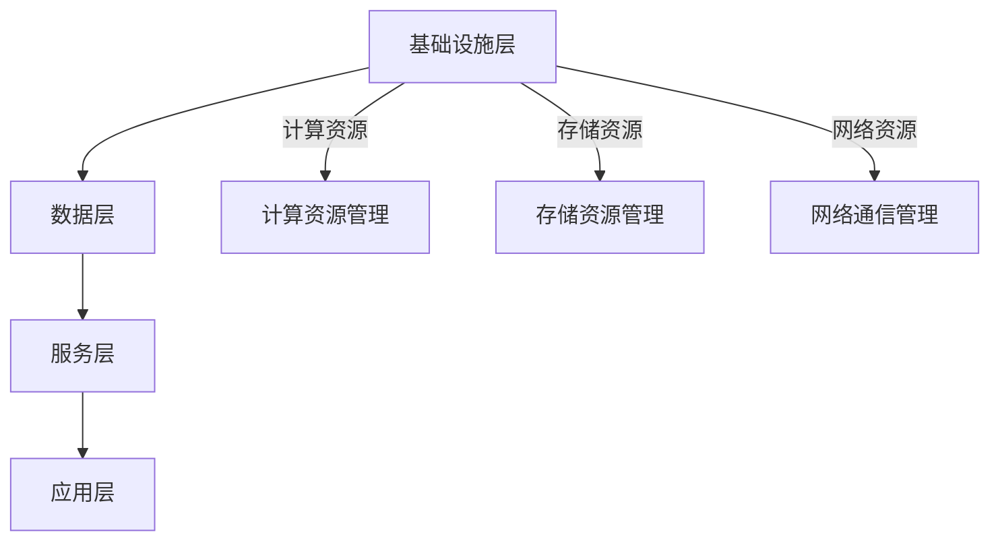

- **计算资源管理：** 使用虚拟化技术（如VMware、KVM）实现计算资源的动态分配和调度。
- **存储资源管理：** 使用分布式存储系统（如HDFS、Ceph）实现大规模数据存储和访问。
- **网络通信管理：** 使用负载均衡器（如Nginx、HAProxy）实现流量均衡和故障转移。

#### 2.2 数据存储与处理

数据存储与处理是AIaaS平台的核心之一，涉及到数据的采集、存储、清洗、预处理和存储等环节。

**核心概念**

- **数据采集：** 从各种数据源（如数据库、文件系统）采集数据。
- **数据存储：** 将采集到的数据存储在分布式存储系统中。
- **数据清洗：** 清除数据中的噪声和错误，提高数据质量。
- **数据预处理：** 对数据进行格式转换、特征提取等操作，为模型训练做准备。

**数据处理流程**

以下是一个典型的数据处理流程：

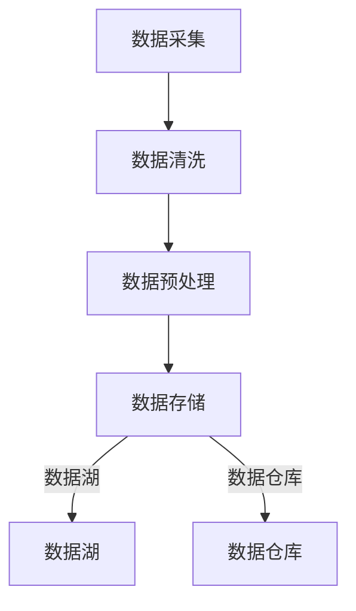

#### 2.3 模型训练与部署

模型训练与部署是AIaaS平台的另一个核心功能，涉及到模型的选择、训练、评估和部署等过程。

**核心概念**

- **模型选择：** 根据业务需求选择合适的模型（如分类模型、回归模型）。
- **数据集准备：** 准备用于模型训练的数据集，包括训练集和验证集。
- **模型训练：** 使用深度学习框架（如TensorFlow、PyTorch）进行模型训练。
- **模型评估：** 使用验证集评估模型性能，包括准确率、召回率等指标。
- **模型部署：** 将训练好的模型部署到生产环境，实现模型的推理和应用。

**模型训练流程**

以下是一个典型的模型训练流程：

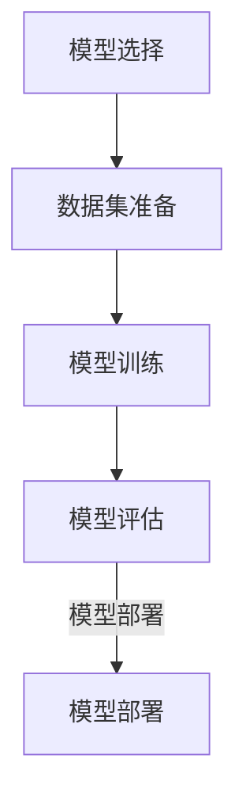

#### 2.4 API设计与接口开发

API设计与接口开发是AIaaS平台与用户交互的重要途径，涉及到API的设计、接口的开发和文档的生成等。

**核心概念**

- **RESTful API：** 提供标准的HTTP接口，支持JSON或XML数据格式。
- **版本控制：** 通过版本控制，确保API的兼容性和稳定性。
- **文档生成：** 使用工具自动生成API文档，便于用户使用。

**API设计**

以下是一个典型的API设计：

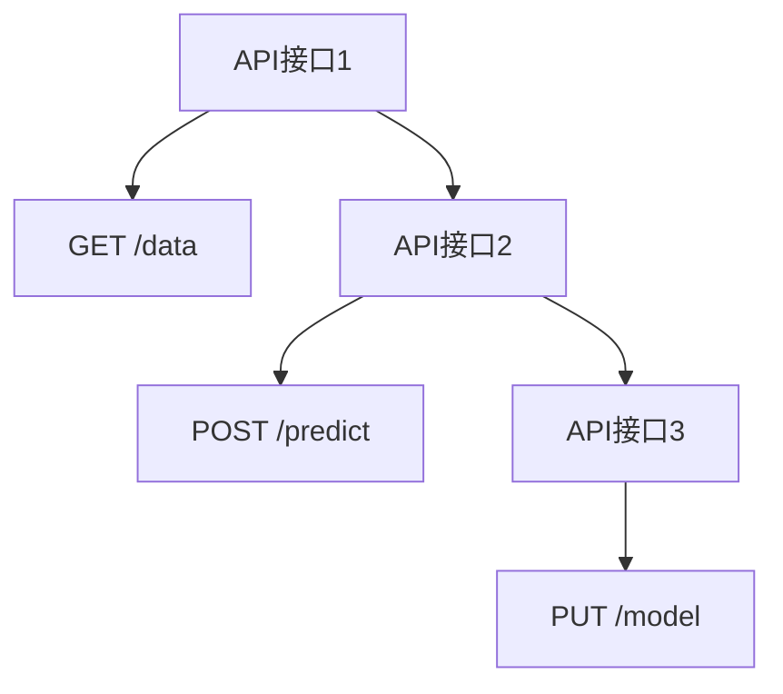

#### 2.5 安全性设计

安全性设计是AIaaS平台不可或缺的一部分，涉及到数据安全、访问控制、身份认证和安全性管理等。

**核心概念**

- **数据安全：** 使用加密技术保护数据传输和存储过程中的安全。
- **访问控制：** 设计严格的访问控制机制，确保只有授权用户可以访问数据和功能。
- **身份认证：** 使用身份认证机制（如OAuth、IAM）确保用户身份的合法性。
- **安全性管理：** 实时监控平台安全，及时响应和处理安全事件。

**安全性架构**

以下是一个典型的安全性架构设计：

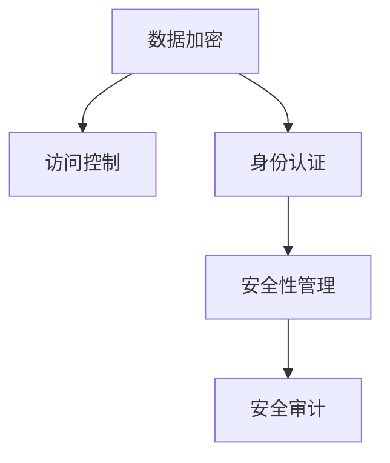

### 第3章：AIaaS核心组件

AIaaS平台的核心组件包括计算资源管理、存储资源管理、网络通信管理和安全性管理。这些组件的设计和实现直接影响平台的性能、可靠性和安全性。

#### 3.1 计算资源管理

计算资源管理是AIaaS平台的重要组成部分，涉及到计算资源的分配、调度和优化。

**核心概念**

- **虚拟化技术：** 使用虚拟化技术（如VMware、KVM）实现计算资源的动态分配和调度。
- **资源调度算法：** 设计高效的资源调度算法，确保任务得到合理的资源分配。
- **负载均衡：** 使用负载均衡器（如Nginx、HAProxy）实现流量均衡和故障转移。

**实现细节**

以下是一个典型的计算资源管理实现：

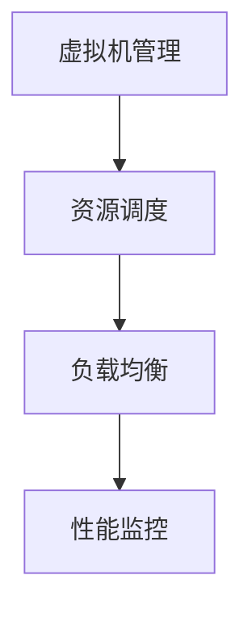

#### 3.2 存储资源管理

存储资源管理是AIaaS平台的另一个关键组件，涉及到存储资源的分配、调度和优化。

**核心概念**

- **分布式存储系统：** 使用分布式存储系统（如HDFS、Ceph）实现大规模数据存储和访问。
- **数据备份与恢复：** 设计可靠的数据备份和恢复策略，确保数据的安全性和可用性。
- **存储优化：** 通过数据压缩、去重等技术，提高存储空间的利用率。

**实现细节**

以下是一个典型的存储资源管理实现：

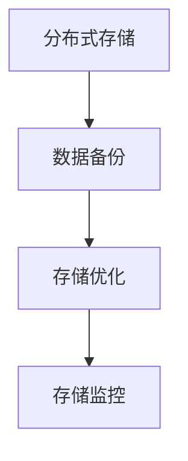

#### 3.3 网络通信管理

网络通信管理是AIaaS平台的通信基础，涉及到网络配置、网络监控和网络安全等。

**核心概念**

- **网络安全：** 设计安全策略（如防火墙、入侵检测）确保网络通信的安全。
- **负载均衡：** 使用负载均衡器（如Nginx、HAProxy）实现流量均衡和故障转移。
- **网络监控：** 实时监控网络状态，及时发现和解决网络问题。

**实现细节**

以下是一个典型的网络通信管理实现：

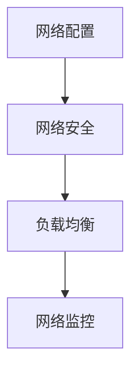

#### 3.4 安全性管理

安全性管理是AIaaS平台的基石，涉及到数据安全、访问控制、身份认证和安全性管理等。

**核心概念**

- **数据安全：** 使用加密技术（如AES、RSA）保护数据传输和存储过程中的安全。
- **访问控制：** 设计严格的访问控制机制（如ACL、RBAC）确保只有授权用户可以访问数据和功能。
- **身份认证：** 使用身份认证机制（如OAuth、IAM）确保用户身份的合法性。
- **安全性管理：** 实时监控平台安全，及时响应和处理安全事件。

**实现细节**

以下是一个典型的安全性管理实现：

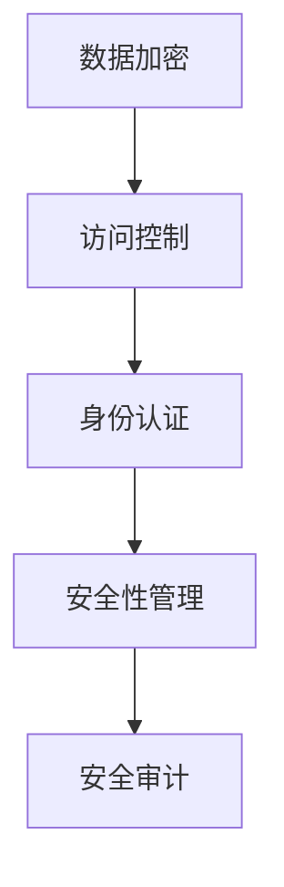

## 第二部分：AIaaS平台实现与优化

### 第4章：AIaaS平台实现步骤

实现一个AIaaS平台需要经过需求分析、技术选型、架构设计、平台开发、测试和部署等步骤。以下将详细讲解这些步骤。

#### 4.1 平台需求分析

平台需求分析是构建AIaaS平台的第一步，主要目的是明确平台的业务需求和技术需求。需求分析包括以下几个方面：

- **业务需求：** 确定平台需要解决的问题和目标，如图像识别、自然语言处理、预测分析等。
- **技术需求：** 分析所需的技术栈和工具，如深度学习框架、容器管理工具、API开发工具等。
- **资源需求：** 估算所需的硬件资源和网络带宽，为后续的资源规划提供依据。

**需求分析示例：**

- **业务需求：** 提供图像识别服务，实现图像分类、检测和分割等功能。
- **技术需求：** 使用TensorFlow作为深度学习框架，Docker和Kubernetes进行容器管理和部署。
- **资源需求：** 预估需要20台虚拟机，总带宽100Mbps。

#### 4.2 技术选型与架构设计

技术选型是构建AIaaS平台的关键环节，需要选择合适的技术栈和架构设计。技术选型包括以下几个方面：

- **云计算平台：** 选择合适的云平台，如AWS、Azure、Google Cloud等。
- **AI框架：** 选择适合的深度学习框架，如TensorFlow、PyTorch等。
- **存储方案：** 设计数据存储方案，包括数据湖和数据仓库。
- **计算资源：** 设计计算资源分配方案，包括虚拟机和容器。

**架构设计示例：**

- **云计算平台：** 使用AWS作为云计算平台，利用EC2和S3服务。
- **AI框架：** 使用TensorFlow进行模型训练和推理。
- **存储方案：** 使用S3作为数据湖，Redshift作为数据仓库。
- **计算资源：** 使用EC2实例进行模型训练，使用容器化技术进行部署。

#### 4.3 数据处理流程

数据处理流程是AIaaS平台的核心环节，涉及数据采集、清洗、预处理和存储等步骤。以下是一个典型的数据处理流程：

**数据处理流程示例：**

- **数据采集：** 从各种数据源（如数据库、文件系统）采集图像数据。
- **数据清洗：** 清除图像数据中的噪声和异常值。
- **数据预处理：** 进行图像数据增强、归一化和特征提取。
- **数据存储：** 将预处理后的数据存储到数据湖（如S3）和数据仓库（如Redshift）。

#### 4.4 模型训练流程

模型训练流程是AIaaS平台的另一个核心环节，涉及模型选择、数据集准备、模型训练和模型评估等步骤。以下是一个典型的模型训练流程：

**模型训练流程示例：**

- **模型选择：** 根据业务需求选择适合的图像识别模型，如卷积神经网络（CNN）。
- **数据集准备：** 准备用于模型训练的数据集，包括训练集和验证集。
- **模型训练：** 使用TensorFlow进行模型训练，调整超参数和优化器。
- **模型评估：** 使用验证集评估模型性能，包括准确率、召回率和F1值等指标。

#### 4.5 模型部署与监控

模型部署与监控是确保AIaaS平台稳定运行的关键环节。以下是一个典型的模型部署与监控流程：

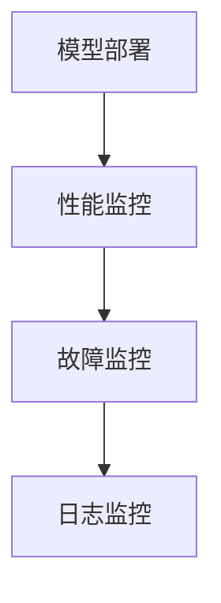

**模型部署与监控流程示例：**

- **模型部署：** 将训练好的模型部署到生产环境，使用容器化技术（如Docker）和编排工具（如Kubernetes）。
- **性能监控：** 监控模型的响应时间、吞吐量和资源使用情况。
- **故障监控：** 监控模型运行过程中出现的异常和故障。
- **日志监控：** 记录模型的运行日志，便于问题追踪和故障排除。

#### 4.6 平台测试与部署

平台测试与部署是确保AIaaS平台质量的关键环节。以下是一个典型的平台测试与部署流程：

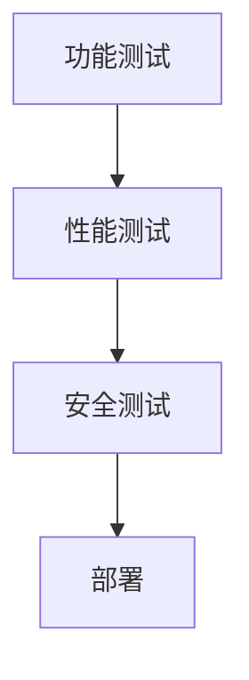

**平台测试与部署流程示例：**

- **功能测试：** 验证平台的功能是否按照需求正常工作。
- **性能测试：** 测试平台在负载情况下的性能表现，如响应时间、吞吐量等。
- **安全测试：** 验证平台的安全性，如数据加密、访问控制和身份认证等。
- **部署：** 将测试通过的平台部署到生产环境，进行实际运行。

### 第5章：AIaaS平台性能优化

性能优化是确保AIaaS平台高效运行的重要环节。以下介绍一些常用的性能优化方法。

#### 5.1 资源利用率优化

资源利用率优化主要目标是提高计算资源、存储资源和网络资源的利用率。以下是一些优化方法：

- **负载均衡：** 使用负载均衡器（如Nginx、HAProxy）实现流量均衡，避免单点瓶颈。
- **资源调度：** 设计高效的资源调度算法，确保任务得到合理的资源分配。
- **容器化技术：** 使用容器化技术（如Docker）实现轻量级部署和动态扩展。

#### 5.2 模型部署优化

模型部署优化主要目标是提高模型部署的速度和效率。以下是一些优化方法：

- **模型压缩：** 使用模型压缩技术（如剪枝、量化）降低模型大小和计算复杂度。
- **模型缓存：** 使用缓存技术（如Redis、Memcached）减少模型加载和推理时间。
- **静态部署：** 使用静态部署技术（如TensorFlow Lite）实现模型在边缘设备的部署。

#### 5.3 网络通信优化

网络通信优化主要目标是提高数据传输的速度和稳定性。以下是一些优化方法：

- **负载均衡：** 使用负载均衡器（如Nginx、HAProxy）实现流量均衡和故障转移。
- **网络优化：** 优化网络配置，如调整TCP参数，提高网络传输速度和稳定性。
- **数据压缩：** 使用数据压缩技术（如Gzip、Snappy）减少数据传输量。

### 第6章：AIaaS平台安全性设计

安全性设计是确保AIaaS平台安全运行的关键环节。以下介绍一些常用的安全性设计方法。

#### 6.1 数据加密与传输

数据加密与传输是保护数据安全的重要手段。以下是一些加密与传输的方法：

- **数据加密：** 使用加密算法（如AES、RSA）对数据在传输和存储过程中进行加密。
- **传输加密：** 使用传输加密协议（如TLS、SSL）确保数据在传输过程中的安全性。
- **加密存储：** 使用加密存储技术（如EBS、EFS）确保数据在存储过程中的安全性。

#### 6.2 访问控制与权限管理

访问控制与权限管理是确保数据和服务安全的重要措施。以下是一些访问控制与权限管理的方法：

- **角色与权限：** 设计角色与权限管理机制，确保用户可以根据其角色访问相应的数据和功能。
- **访问控制列表（ACL）：** 使用访问控制列表（ACL）控制用户对数据和资源的访问权限。
- **单点登录（SSO）：** 使用单点登录（SSO）技术简化用户登录流程，提高安全性。

#### 6.3 安全审计与监控

安全审计与监控是发现和应对安全威胁的重要手段。以下是一些安全审计与监控的方法：

- **安全审计：** 实时记录平台操作日志，进行安全审计，及时发现和解决安全隐患。
- **入侵检测：** 使用入侵检测系统（IDS）监控平台异常行为，发现潜在威胁。
- **安全告警：** 设置安全告警机制，及时发现和处理安全事件。

### 第7章：AIaaS平台应用与实践

#### 7.1 项目案例介绍

在本章中，我们将介绍一个基于AIaaS平台的实际项目案例。该项目是一个基于图像识别的智能安防系统，旨在提高城市安全管理水平。

#### 7.2 项目需求分析

项目需求分析包括以下几个方面：

- **业务目标：** 提高城市安全管理水平，实时检测和识别可疑行为。
- **技术要求：** 使用AI技术实现图像识别和智能分析功能。
- **资源需求：** 需要大量的图像数据和计算资源。

#### 7.3 平台设计与实现

平台设计与实现包括以下几个方面：

- **数据层：** 使用数据湖存储和管理大量图像数据，使用数据处理引擎进行数据预处理。
- **模型层：** 使用深度学习框架进行模型训练和推理。
- **服务层：** 提供API接口，实现模型的部署和推理。
- **应用层：** 提供面向城市安防管理的智能分析服务。

#### 7.4 项目成果与总结

项目成果与总结包括以下几个方面：

- **模型性能：** 通过模型训练和优化，实现了高精度的图像识别和智能分析。
- **用户体验：** 提供友好的用户界面，实现方便快捷的操作。
- **业务效益：** 提高了城市安全管理水平，降低了安全事故发生率。

### 第8章：AIaaS平台开发与运营经验分享

#### 8.1 开发经验分享

开发经验分享包括以下几个方面：

- **技术选型：** 如何选择合适的技术栈和工具。
- **团队协作：** 如何高效地进行团队协作和项目管理。
- **持续集成：** 如何实现持续集成和自动化测试。

#### 8.2 运营经验分享

运营经验分享包括以下几个方面：

- **监控与维护：** 如何监控平台性能并进行故障维护。
- **用户支持：** 如何提供优质的用户支持和售后服务。
- **数据安全：** 如何确保平台数据的安全性和用户隐私。

#### 8.3 挑战与解决方案

在AIaaS平台开发与运营过程中，可能会遇到一些挑战，如性能优化、数据安全、用户增长等。以下是一些常见的挑战和解决方案：

- **性能优化：** 通过负载均衡、缓存优化、模型压缩等技术进行性能优化。
- **数据安全：** 通过数据加密、访问控制、安全审计等技术保障数据安全。
- **用户增长：** 通过市场推广、用户体验优化、服务扩展等方式促进用户增长。

#### 8.4 未来展望

AIaaS平台的发展前景广阔，未来将看到更多创新和应用。以下是一些展望：

- **模型即服务（MaaS）：** 提供更多预训练模型和工具，降低用户使用门槛。
- **边缘计算：** 结合边缘计算，实现实时数据处理和智能分析。
- **行业定制化：** 针对不同行业提供更精细的AI解决方案。

## 附录

### 附录A：AIaaS平台开发工具与资源

- **A.1 开发工具介绍：**
  - **深度学习框架：** TensorFlow、PyTorch、Keras等。
  - **容器管理工具：** Docker、Kubernetes等。
  - **API开发工具：** Flask、Django等。

- **A.2 资源管理工具：**
  - **云计算平台：** AWS、Azure、Google Cloud等。
  - **虚拟化技术：** VMware、KVM等。

- **A.3 模型训练与部署工具：**
  - **分布式训练框架：** Spark、Hadoop等。
  - **模型优化工具：** TensorRT、ONNX Runtime等。

- **A.4 接口设计与开发工具：**
  - **API框架：** Flask、Django等。
  - **文档生成工具：** Swagger、Postman等。

### 附录B：Mermaid流程图

- **B.1 数据处理流程图：**
  - 数据采集、清洗、预处理和存储的流程。

- **B.2 模型训练与部署流程图：**
  - 模型选择、数据集准备、模型训练、模型评估和模型部署的流程。

- **B.3 安全性管理流程图：**
  - 数据加密、访问控制、身份认证和安全审计的流程。

### 附录C：伪代码与数学模型

- **C.1 数据处理算法伪代码：**
  - 数据采集、清洗和预处理的伪代码实现。

- **C.2 模型训练算法伪代码：**
  - 模型训练和优化的伪代码实现。

- **C.3 数学模型与公式：**
  - 分类模型、回归模型等核心数学模型的公式和解释。

### 附录D：项目实战代码示例

- **D.1 数据处理代码示例：**
  - 数据采集、清洗和预处理的具体实现代码。

- **D.2 模型训练代码示例：**
  - 模型训练和优化的具体实现代码。

- **D.3 模型部署代码示例：**
  - 模型部署和推理的具体实现代码。

- **D.4 代码解读与分析：**
  - 对代码示例的详细解读和分析，解释实现原理和关键技术。

### 附录E：常用技术术语解释

- **AIaaS：** Artificial Intelligence as a Service，人工智能即服务。
- **IaaS：** Infrastructure as a Service，基础设施即服务。
- **PaaS：** Platform as a Service，平台即服务。
- **SaaS：** Software as a Service，软件即服务。
- **MaaS：** Model as a Service，模型即服务。
- **RESTful API：** RESTful风格的API，遵循REST架构风格。
- **ACL：** Access Control List，访问控制列表。
- **RBAC：** Role-Based Access Control，基于角色的访问控制。
- **TLS：** Transport Layer Security，传输层安全协议。
- **SSL：** Secure Sockets Layer，安全套接字层。
- **IDS：** Intrusion Detection System，入侵检测系统。
- **IPS：** Intrusion Prevention System，入侵预防系统。
- **IDS/IPS：** 结合入侵检测和入侵预防功能的安全系统。

### 附录F：参考文献

- **[1]** AIaaS：An Introduction to Artificial Intelligence as a Service
- **[2]** Building an AIaaS Platform with TensorFlow and Kubernetes
- **[3]** AIaaS Security: Ensuring Data and Service Security
- **[4]** Performance Optimization Techniques for AIaaS Platforms
- **[5]** Use Cases and Best Practices for AIaaS Platform Development
- **[6]** AIaaS: The Future of Cloud Computing and Artificial Intelligence
- **[7]** Understanding AIaaS: How AI is Changing the Cloud Landscape

### 作者信息

**作者：** AI天才研究院/AI Genius Institute & 禅与计算机程序设计艺术 /Zen And The Art of Computer Programming

---

**注：** 本文为示例性内容，实际撰写时请根据具体情况进行调整和补充。文章长度需大于8000字，每个章节内容需详细具体，满足完整性要求。

