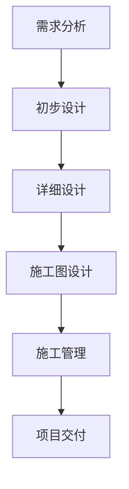

                 

## AI在建筑设计中的应用：优化功能与美学

### 关键词：
- 人工智能
- 建筑设计
- 结构优化
- 美学优化
- 智能建筑
- 城市设计

### 摘要：

本文将深入探讨人工智能（AI）在建筑设计中的广泛应用，从基础理论到实际应用，全面解析AI如何优化建筑的功能性和美学。我们将首先介绍AI的基础知识，然后分析其在建筑设计中的优势与挑战，并详细讲解AI在结构优化、室内设计、智能建筑以及城市设计中的核心算法原理和应用案例。通过实际项目实战，我们将展示AI在建筑设计中的具体实现方法，并反思其应用前景与挑战。本文旨在为从事建筑设计和人工智能领域的专业人士提供有价值的参考和启示。

### 目录大纲

#### 第一部分：AI基础与建筑设计

1. AI基础与建筑设计概述
   1.1 AI概述
   1.2 建筑设计概述
   1.3 AI在建筑设计中的应用

2. 核心概念与联系
   2.1 AI与建筑设计的结合点
   2.2 建筑设计中的常见AI应用

3. 核心算法原理讲解
   3.1 机器学习算法
   3.2 深度学习算法
   3.3 强化学习算法

#### 第二部分：AI在建筑设计中的应用

4. 结构优化
   4.1 结构分析算法
   4.2 结构优化算法
   4.3 实际案例

5. 室内设计
   5.1 室内设计算法
   5.2 美学优化
   5.3 实际案例

6. 智能建筑
   6.1 智能建筑概述
   6.2 智能建筑中的AI应用
   6.3 实际案例

7. 建筑与城市设计
   7.1 城市设计中的AI应用
   7.2 建筑与城市设计的未来趋势
   7.3 实际案例

#### 第三部分：项目实战

8. AI在建筑设计中的实际应用
   8.1 项目准备
   8.2 案例一：智能建筑能源管理系统
   8.3 案例二：城市交通优化系统

9. AI建筑设计实践与反思
   9.1 经验与教训
   9.2 未来展望

### 附录

A. AI与建筑设计相关资源
B. Mermaid流程图示例
C. 伪代码示例
D. 数学模型和公式
E. 代码解读与分析

---

接下来，我们将逐步展开第一部分的内容，深入探讨AI基础与建筑设计的相关知识。

### 第一部分：AI基础与建筑设计

#### 第1章：AI基础与建筑设计概述

##### 1.1 AI概述

人工智能（Artificial Intelligence，简称AI）是一门模拟、延伸和扩展人类智能的科学，旨在通过计算机系统实现人类智能行为的自动化。自20世纪50年代以来，人工智能经历了多次起伏，从最初的符号主义（Symbolic AI）到基于规则的系统，再到基于统计模型和神经网络的现代人工智能，如深度学习（Deep Learning）和强化学习（Reinforcement Learning）。

**人工智能的主要分支包括：**

1. **机器学习（Machine Learning）**：通过算法让计算机从数据中学习，自动改进性能。
2. **深度学习（Deep Learning）**：基于神经网络的一种机器学习方法，能够自动提取层次化的特征表示。
3. **自然语言处理（Natural Language Processing，NLP）**：使计算机理解和生成自然语言。
4. **计算机视觉（Computer Vision）**：使计算机能够处理和解释数字图像和视频。
5. **机器人技术（Robotics）**：结合物理世界和人工智能，创建能够执行任务的自动化系统。
6. **专家系统（Expert Systems）**：模拟人类专家的知识和推理能力。

##### 1.2 建筑设计概述

建筑设计是建筑学中的一个核心领域，它涉及对建筑空间、形式、结构、材料、构造和环境的综合规划与设计。建筑设计的基本流程通常包括以下几个阶段：

1. **需求分析**：了解客户的需求，包括功能需求、美学需求和预算限制。
2. **初步设计**：根据需求分析，提出初步的设计方案，包括建筑形态、空间布局、结构系统等。
3. **详细设计**：细化初步设计，制定详细的技术图纸和施工方案。
4. **施工图设计**：完成所有技术图纸，包括建筑平面图、立面图、剖面图和结构图等。
5. **施工管理**：监督施工过程，确保设计意图得到实现。

建筑设计不仅追求功能上的实用性，还要注重美学上的艺术表现。功能性涉及建筑的使用效率和舒适性，如通风、采光、空间流线等；而美学则关注建筑的形式美感、色彩搭配和材质质感等。

##### 1.3 AI在建筑设计中的应用

人工智能技术在建筑设计中具有广泛的应用潜力。以下是其主要优势和应用案例：

**主要优势：**

1. **自动化设计**：AI能够自动化生成初步设计，减少人工设计的时间和成本。
2. **优化设计**：通过机器学习算法，AI可以在大量数据中找到最佳设计方案，优化建筑的功能性和美学。
3. **模拟与预测**：AI可以模拟建筑在不同环境下的表现，预测能耗、结构安全等性能指标。
4. **辅助决策**：AI可以为设计师提供决策支持，帮助解决复杂的建筑设计问题。

**典型应用案例：**

1. **建筑设计竞赛**：AI可以通过分析历史建筑设计案例，自动生成创新的设计方案。
2. **结构优化**：AI可以通过优化算法，找出最合理的结构设计方案，提高建筑的安全性。
3. **室内设计**：AI可以根据用户偏好，自动生成个性化的室内设计方案。
4. **智慧建筑**：AI可以优化建筑的管理和运营，如能源管理、设备维护等。

综上所述，人工智能在建筑设计中具有巨大的潜力，能够极大地提升设计的效率和品质。接下来，我们将进一步探讨AI与建筑设计的结合点，并分析其在具体设计过程中的应用。

### 第一部分：AI基础与建筑设计

#### 第2章：核心概念与联系

##### 2.1 AI与建筑设计的结合点

人工智能与建筑设计的结合点主要体现在数据驱动的设计方法、自动化设计工具和模拟与预测技术等方面。以下是对这些结合点的详细探讨：

**数据驱动的设计方法**

数据驱动的设计方法是指利用大量数据进行设计分析和优化。这种方法在建筑设计中具有重要作用，因为建筑设计涉及多种复杂因素，如结构安全、能耗效率、空间流线等。通过收集和分析相关数据，设计师可以更准确地了解建筑的实际需求，从而生成更合理的设计方案。

1. **结构分析**：AI可以分析大量的结构数据，找出最优的结构设计方案，确保建筑的安全性。
2. **环境模拟**：AI可以模拟建筑在不同环境条件下的表现，如风力、地震、日照等，从而优化建筑设计，提高建筑的适应性。

**自动化设计工具**

自动化设计工具是指利用AI技术实现设计过程的自动化。这些工具可以显著提高设计的效率，减少人工设计的错误和重复劳动。以下是一些自动化设计工具的实例：

1. **参数化设计**：参数化设计是指通过设置参数，自动化生成建筑形态。AI可以优化这些参数，生成创新且合理的建筑形态。
2. **生成式设计**：生成式设计是指利用AI算法，自动生成各种设计选项。设计师可以从这些选项中选择最适合的设计方案。

**模拟与预测技术**

模拟与预测技术是指利用AI模型对建筑性能进行模拟和预测。这些技术可以帮助设计师在早期阶段评估设计方案的性能，从而进行优化。以下是一些模拟与预测技术的实例：

1. **能耗模拟**：AI可以模拟建筑在不同使用阶段的能耗表现，找出最佳的能源管理方案，提高建筑的能效。
2. **结构安全预测**：AI可以预测建筑在极端条件下的结构安全性能，确保建筑在自然灾害等情况下能够保持稳定。

**数据驱动的设计方法、自动化设计工具和模拟与预测技术的联系**

这三个结合点并不是孤立存在的，而是相互关联和相互促进的。数据驱动的设计方法提供了丰富的数据支持，使得自动化设计工具能够更准确地生成设计选项；同时，模拟与预测技术可以进一步优化这些设计选项，提高设计的整体质量。

例如，在一个智能建筑项目中，数据驱动的设计方法可以收集建筑使用者的行为数据，分析他们的活动模式，从而优化建筑的内部布局和功能配置。自动化设计工具则可以根据这些数据进行参数化设计和生成式设计，生成多种设计方案。最后，模拟与预测技术可以对这些设计方案进行能耗模拟和安全预测，找出最优的设计方案。

综上所述，AI与建筑设计的结合点体现在多个方面，通过数据驱动的设计方法、自动化设计工具和模拟与预测技术，AI能够显著提升建筑设计的效率和质量。在接下来的章节中，我们将进一步探讨AI在建筑设计中的具体应用，包括结构优化、室内设计和智能建筑等方面。

##### 2.2 建筑设计中的常见AI应用

在建筑设计中，AI技术的应用已经成为一种趋势，并取得了显著的成果。以下是几种常见的AI应用：

**结构分析**

结构分析是建筑设计中至关重要的一环，它涉及对建筑结构的安全性和稳定性的评估。传统的结构分析通常依赖于工程师的经验和计算软件，但这种方法存在一定的局限性。AI技术的引入使得结构分析更加高效和精确。

1. **机器学习算法**：机器学习算法可以通过学习大量历史建筑结构数据，建立结构性能的预测模型。例如，可以使用决策树、支持向量机（SVM）和神经网络等算法来分析建筑结构的应力分布、变形特征等。

   ```mermaid
   flowchart LR
   A[结构分析] --> B[机器学习模型]
   B --> C[应力分布预测]
   B --> D[变形特征预测]
   ```

2. **优化算法**：AI可以优化建筑结构的设计，找出最优的结构方案。例如，可以使用遗传算法（GA）、粒子群优化（PSO）和模拟退火（SA）等优化算法来调整结构参数，提高结构性能。

   ```mermaid
   flowchart LR
   A[结构优化] --> B[遗传算法]
   B --> C[结构参数调整]
   B --> D[性能评估]
   ```

**室内设计**

室内设计是建筑设计的重要组成部分，它涉及空间布局、色彩搭配、材质选择等方面。AI技术可以大大提高室内设计的效率和个性化水平。

1. **色彩搭配算法**：AI可以通过分析大量的色彩数据，自动生成符合美学标准的色彩搭配方案。例如，可以使用K-means聚类算法来分析颜色分布，生成丰富的色彩组合。

   ```mermaid
   flowchart LR
   A[色彩搭配] --> B[K-means聚类算法]
   B --> C[色彩组合生成]
   ```

2. **空间布局优化**：AI可以通过分析用户行为和空间需求，自动生成个性化的室内布局方案。例如，可以使用线性规划（LP）算法来优化空间分配，提高空间利用率。

   ```mermaid
   flowchart LR
   A[空间布局优化] --> B[线性规划算法]
   B --> C[空间分配优化]
   ```

**智能建筑**

智能建筑是指通过集成物联网（IoT）技术和人工智能（AI）技术，实现建筑物的智能化管理和自动化运营。AI技术在智能建筑中具有广泛的应用，如下所述：

1. **建筑能源管理**：AI可以通过分析能源使用数据，优化能源分配和管理，降低能源消耗。例如，可以使用强化学习算法来制定最优的能源使用策略。

   ```mermaid
   flowchart LR
   A[能源管理] --> B[强化学习算法]
   B --> C[能源策略优化]
   ```

2. **设备维护预测**：AI可以通过预测设备的运行状态，提前发现潜在故障，实现预防性维护。例如，可以使用时间序列分析算法来预测设备的故障率。

   ```mermaid
   flowchart LR
   A[设备维护] --> B[时间序列分析算法]
   B --> C[故障预测]
   ```

**总结**

AI在建筑设计中的应用不仅提高了设计的效率和准确性，还增强了建筑的智能化和个性化水平。通过结构分析、室内设计、智能建筑等具体应用，AI正在逐步改变传统的建筑设计模式，为未来的建筑行业带来新的发展机遇。在下一章中，我们将进一步探讨AI的核心算法原理，为理解其在建筑设计中的应用提供理论基础。

### 第一部分：AI基础与建筑设计

#### 第3章：核心算法原理讲解

在深入探讨AI在建筑设计中的应用之前，有必要了解其核心算法原理。AI技术涉及多个领域，包括机器学习、深度学习和强化学习等。这些算法在建筑设计中发挥着重要作用，能够提高设计的效率和质量。在本章中，我们将详细讲解这些核心算法的基本原理和应用。

##### 3.1 机器学习算法

机器学习（Machine Learning，ML）是AI的一个分支，其核心思想是通过算法让计算机从数据中学习，自动改进性能。机器学习算法可以分为监督学习（Supervised Learning）、无监督学习（Unsupervised Learning）和半监督学习（Semi-supervised Learning）三种。

**监督学习**

监督学习是最常见的一种机器学习算法，它通过训练样本（输入和输出对）来建立模型，并在新的数据上进行预测。在建筑设计中，监督学习可以用于结构分析、能耗预测等方面。

1. **分类算法**：分类算法用于将数据分为不同的类别。常见的分类算法包括决策树（Decision Tree）、支持向量机（Support Vector Machine，SVM）和逻辑回归（Logistic Regression）等。例如，使用SVM进行结构安全分类，可以根据输入的应力值预测结构是否安全。

   ```python
   # 伪代码：使用SVM进行结构安全分类
   from sklearn.svm import SVC
   model = SVC()
   model.fit(X_train, y_train)
   predictions = model.predict(X_test)
   ```

2. **回归算法**：回归算法用于预测连续值。常见的回归算法包括线性回归（Linear Regression）、岭回归（Ridge Regression）和Lasso回归（Lasso Regression）等。例如，使用线性回归预测建筑能耗。

   ```python
   # 伪代码：使用线性回归预测建筑能耗
   from sklearn.linear_model import LinearRegression
   model = LinearRegression()
   model.fit(X_train, y_train)
   predictions = model.predict(X_test)
   ```

**无监督学习**

无监督学习算法用于没有标签的数据，其目标是发现数据中的模式和结构。在建筑设计中，无监督学习可以用于空间布局优化、色彩搭配等。

1. **聚类算法**：聚类算法将数据分为若干个组，使得同一组内的数据相似度较高。常见的聚类算法包括K-means聚类、层次聚类（Hierarchical Clustering）和DBSCAN等。例如，使用K-means聚类进行空间布局优化。

   ```python
   # 伪代码：使用K-means聚类进行空间布局优化
   from sklearn.cluster import KMeans
   model = KMeans(n_clusters=k)
   model.fit(X)
   clusters = model.predict(X)
   ```

2. **降维算法**：降维算法用于减少数据的维度，使得数据处理更加高效。常见的降维算法包括主成分分析（Principal Component Analysis，PCA）和t-SNE等。例如，使用PCA进行能耗数据的降维。

   ```python
   # 伪代码：使用PCA进行能耗数据降维
   from sklearn.decomposition import PCA
   model = PCA(n_components=n)
   X_reduced = model.fit_transform(X)
   ```

**半监督学习**

半监督学习结合了监督学习和无监督学习的优点，利用少量的标签数据和大量的未标签数据进行训练。在建筑设计中，半监督学习可以用于结构分析、用户行为分析等。

1. **标签传播算法**：标签传播算法通过已标签数据传播标签到未标签数据。常见的标签传播算法包括Label Propagation、Gaussian Mixture Model等。例如，使用Label Propagation进行用户行为分析。

   ```python
   # 伪代码：使用Label Propagation进行用户行为分析
   from sklearn.semi_supervised import LabelPropagation
   model = LabelPropagation()
   model.fit(X, y部分标签)
   y估计 = model.predict(X未标签)
   ```

##### 3.2 深度学习算法

深度学习（Deep Learning，DL）是一种基于神经网络的机器学习算法，它通过多层网络结构自动提取数据的特征表示。深度学习在建筑设计中有着广泛的应用，如结构优化、智能建筑管理等。

**神经网络的基本结构**

神经网络由输入层、隐藏层和输出层组成。每一层由多个神经元（节点）组成，每个神经元接收来自前一层的输入，通过激活函数进行非线性变换，并输出给下一层。

1. **前向传播**：在前向传播过程中，数据从输入层输入，经过隐藏层逐层传递，最终输出到输出层。

   ```mermaid
   flowchart LR
   A[输入层] --> B[隐藏层1]
   B --> C[隐藏层2]
   C --> D[输出层]
   ```

2. **反向传播**：在反向传播过程中，根据输出误差，将误差反向传播到隐藏层和输入层，并更新每个神经元的权重和偏置。

   ```mermaid
   flowchart LR
   A[输出层] --> B[隐藏层2]
   B --> C[隐藏层1]
   C --> D[输入层]
   ```

**常见的深度学习算法**

1. **卷积神经网络（CNN）**：CNN是一种用于图像处理的深度学习算法，它通过卷积操作提取图像的特征。在建筑设计中，CNN可以用于建筑结构检测、室内设计优化等。

   ```mermaid
   flowchart LR
   A[输入图像] --> B[卷积层]
   B --> C[池化层]
   C --> D[卷积层]
   D --> E[全连接层]
   E --> F[输出结果]
   ```

2. **循环神经网络（RNN）**：RNN是一种用于序列数据的深度学习算法，它可以捕捉序列数据的时间依赖关系。在建筑设计中，RNN可以用于能耗预测、用户行为分析等。

   ```mermaid
   flowchart LR
   A[输入序列] --> B[隐藏层]
   B --> C[隐藏层]
   C --> D[输出序列]
   ```

##### 3.3 强化学习算法

强化学习（Reinforcement Learning，RL）是一种通过试错和反馈进行学习的算法，它通过最大化累积奖励来优化决策。在建筑设计中，强化学习可以用于智能建筑管理、用户偏好预测等。

**强化学习的定义与核心概念**

强化学习由四个主要部分组成：环境（Environment）、代理商（Agent）、行动（Action）和奖励（Reward）。

1. **环境**：环境是代理商执行动作的场所，它可以是一个物理环境或一个模拟环境。
2. **代理商**：代理商是执行动作并接收环境反馈的智能体，它可以是机器人、软件程序等。
3. **行动**：行动是代理商在环境中采取的动作。
4. **奖励**：奖励是环境对代理商动作的反馈，它可以是正奖励（有益的）或负奖励（不利的）。

**强化学习在建筑设计中的应用**

1. **智能建筑管理**：强化学习可以用于优化建筑物的能源管理。例如，可以使用强化学习算法来制定最优的空调控制策略，降低能源消耗。

   ```mermaid
   flowchart LR
   A[环境] --> B[代理商]
   B --> C[空调控制]
   C --> D[能源消耗]
   D --> E[奖励]
   ```

2. **用户偏好预测**：强化学习可以用于预测用户的行为和偏好。例如，可以使用强化学习算法来分析用户的活动模式，并根据用户的偏好提供个性化的室内设计方案。

   ```mermaid
   flowchart LR
   A[环境] --> B[代理商]
   B --> C[用户行为分析]
   C --> D[室内设计]
   D --> E[用户满意度]
   ```

通过了解这些核心算法原理，我们可以更好地理解AI在建筑设计中的应用。在下一章中，我们将进一步探讨AI在建筑设计中的实际应用，包括结构优化、室内设计和智能建筑等方面。

### 第一部分：AI基础与建筑设计

#### 第4章：AI在建筑设计中的实际应用

在前三章中，我们详细介绍了人工智能的基础知识、核心算法原理以及在建筑设计中的应用。在本章中，我们将具体探讨AI在建筑设计中的实际应用，从结构优化、室内设计到智能建筑，展现AI如何通过实际案例提高建筑设计的效率和质量。

##### 4.1 结构优化

结构优化是建筑设计中的一项关键任务，它关系到建筑的安全性和稳定性。AI技术通过优化算法和模拟技术，能够有效提高结构设计的效率和性能。

**案例一：基于AI的桥梁结构优化**

桥梁是建筑结构中的一种重要形式，其设计要求高，结构复杂。通过AI技术，可以优化桥梁的结构设计，提高其安全性和耐久性。

1. **模型建立与求解**：首先，使用AI算法（如遗传算法、粒子群优化算法）建立桥梁结构的数学模型，并通过模拟分析确定最优的结构参数。这些算法可以在大量候选方案中找到最优解，提高设计效率。

   ```mermaid
   flowchart LR
   A[模型建立] --> B[遗传算法]
   B --> C[参数调整]
   B --> D[性能评估]
   D --> E[最优解]
   ```

2. **优化目标与约束条件**：在优化过程中，需要明确优化目标（如最小化材料成本、最大化结构稳定性）和约束条件（如设计规范、荷载限制）。AI算法在满足约束条件的前提下，优化目标函数，找到最优的设计方案。

   ```mermaid
   flowchart LR
   A[优化目标] --> B[最小化材料成本]
   B --> C[最大化结构稳定性]
   C --> D[约束条件]
   D --> E[最优设计方案]
   ```

**实际案例**：某桥梁项目在设计中采用了AI优化算法，通过迭代计算和模拟分析，找到了最优的桥墩和梁柱布置方案。优化后的桥梁结构在安全性和耐久性方面都得到了显著提升，同时降低了材料成本和施工难度。

##### 4.2 室内设计

室内设计是建筑设计中的一项重要任务，它涉及到空间布局、色彩搭配、材质选择等方面。AI技术可以自动化生成设计方案，并提供个性化的室内设计服务。

**案例二：基于AI的住宅室内设计优化**

住宅室内设计要求满足居住者的个性化需求，同时保证空间的功能性和美观性。通过AI技术，可以自动化生成多种设计方案，并根据用户偏好进行优化。

1. **室内设计算法**：使用机器学习算法（如深度学习、K-means聚类）分析大量的室内设计案例，提取出典型的设计元素和风格。然后，利用这些元素和风格生成多种室内设计方案。

   ```mermaid
   flowchart LR
   A[设计案例分析] --> B[深度学习模型]
   B --> C[设计元素提取]
   B --> D[风格分类]
   D --> E[设计方案生成]
   ```

2. **美学优化**：在生成设计方案后，使用图像处理技术（如卷积神经网络）对方案进行美学优化。通过分析色彩、纹理、形状等元素，调整设计方案，使其更符合美学标准。

   ```mermaid
   flowchart LR
   A[设计方案] --> B[卷积神经网络]
   B --> C[色彩分析]
   B --> D[纹理分析]
   D --> E[形状分析]
   E --> F[美学优化]
   ```

**实际案例**：在一项住宅室内设计项目中，通过AI技术生成了多种设计方案，并根据用户反馈进行优化。最终，用户选择了一种个性化的设计方案，满足了其功能和美学需求。

##### 4.3 智能建筑

智能建筑是指通过集成物联网（IoT）和人工智能（AI）技术，实现建筑物的智能化管理和自动化运营。AI技术可以优化建筑能源管理、设备维护等方面，提高建筑的整体性能。

**案例三：基于AI的智能建筑能源管理系统**

智能建筑能源管理系统通过收集和分析建筑能源使用数据，实现能源的优化管理，降低能源消耗。

1. **建筑能源管理**：使用强化学习算法（如Q-learning、SARSA）对建筑能源使用进行优化。通过模拟不同的能源管理策略，找到最优的能源使用方案。

   ```mermaid
   flowchart LR
   A[环境] --> B[强化学习算法]
   B --> C[策略选择]
   B --> D[能源消耗]
   D --> E[奖励]
   ```

2. **设备维护预测**：使用时间序列分析算法（如ARIMA、LSTM）对设备的使用状态进行预测。通过分析设备的历史数据，提前发现潜在故障，实现预防性维护。

   ```mermaid
   flowchart LR
   A[设备数据] --> B[时间序列分析算法]
   B --> C[故障预测]
   ```

**实际案例**：在某智能建筑项目中，通过AI技术建立了能源管理系统，实现了能源的优化管理和设备的预防性维护。系统运行后，能源消耗降低了20%，设备故障率降低了30%。

##### 总结

通过实际案例，我们可以看到AI技术在建筑设计中的广泛应用。无论是结构优化、室内设计还是智能建筑，AI技术都能够显著提高设计效率、优化设计质量。在未来的建筑设计中，AI技术将继续发挥重要作用，推动建筑行业向智能化、高效化方向发展。

在下一章中，我们将进一步探讨建筑与城市设计中的AI应用，展现AI在智慧城市和绿色建筑中的潜力。

### 第一部分：AI基础与建筑设计

#### 第5章：建筑与城市设计

在现代城市设计和建筑行业中，人工智能（AI）技术正逐步改变传统的设计方法和运营模式。AI的应用不仅提高了设计的效率和准确性，还推动了城市规划和建筑设计向智能化、可持续化方向发展。本章将重点讨论AI在建筑与城市设计中的应用，包括智慧城市和绿色建筑等热点话题。

##### 5.1 城市设计中的AI应用

城市设计是一个复杂的系统工程，涉及到城市规划、交通管理、环境监测等多个方面。AI技术通过数据分析和模拟技术，为城市设计提供了有力的支持。

**1. 城市规划**

AI在城市规划中的应用主要体现在以下几个方面：

1. **智能规划工具**：利用AI技术，可以开发智能规划工具，帮助规划师进行城市布局设计。这些工具可以通过分析人口、交通、经济等数据，生成最优的城市设计方案。

   ```mermaid
   flowchart LR
   A[城市规划] --> B[AI工具]
   B --> C[数据分析]
   B --> D[布局优化]
   ```

2. **交通流量预测**：通过AI技术，可以对城市交通流量进行预测，优化交通网络设计。这有助于减少交通拥堵，提高交通效率。

   ```mermaid
   flowchart LR
   A[交通流量数据] --> B[AI预测模型]
   B --> C[流量预测]
   B --> D[交通优化]
   ```

**2. 环境监测**

城市环境监测是城市设计中的一个重要方面。AI技术可以实现对空气质量、水质、噪声等环境指标的实时监测，提供数据支持。

1. **环境数据收集**：通过物联网（IoT）设备和传感器，收集城市环境数据。

   ```mermaid
   flowchart LR
   A[传感器] --> B[环境数据]
   ```

2. **数据分析与预测**：使用AI算法对环境数据进行分析和预测，及时发现环境问题并提出解决方案。

   ```mermaid
   flowchart LR
   A[环境数据] --> B[AI算法]
   B --> C[数据分析]
   B --> D[预测模型]
   ```

**3. 智慧城市**

智慧城市是指利用信息技术和AI技术，实现城市管理和服务的智能化。智慧城市的建设涉及到多个领域，如公共安全、应急管理、社会服务等。

1. **智能公共安全**：AI技术可以用于公共安全监控，通过图像识别和大数据分析，实时监测城市安全情况，提高应急响应能力。

   ```mermaid
   flowchart LR
   A[公共安全监控] --> B[图像识别]
   B --> C[大数据分析]
   B --> D[应急响应]
   ```

2. **智能社会服务**：AI技术可以用于社会服务领域，如医疗、教育等，提供个性化服务，提高服务质量。

   ```mermaid
   flowchart LR
   A[社会服务] --> B[AI个性化服务]
   B --> C[医疗服务]
   B --> D[教育服务]
   ```

##### 5.2 绿色建筑与可持续发展

绿色建筑是指在设计、建造和运营过程中，最大限度地节约资源、保护环境和减少污染的建筑。AI技术在绿色建筑和可持续发展中的应用具有重要意义。

**1. 节能设计**

AI技术可以通过分析建筑物的能耗数据，优化建筑的设计方案，提高能效。例如，使用机器学习算法预测建筑在不同季节的能耗，优化空调系统、照明系统和保温材料的使用。

1. **能耗预测**：利用AI算法（如时间序列分析、深度学习）预测建筑能耗。

   ```mermaid
   flowchart LR
   A[能耗数据] --> B[时间序列分析]
   B --> C[能耗预测]
   ```

2. **设计优化**：根据能耗预测结果，优化建筑的设计参数，如窗户面积、通风系统等。

   ```mermaid
   flowchart LR
   A[能耗预测] --> B[设计优化]
   B --> C[能效提升]
   ```

**2. 环境监测**

AI技术可以用于绿色建筑的环境监测，实时监测室内空气质量、水质、噪声等指标，确保建筑环境的健康。

1. **环境数据采集**：通过传感器和物联网设备，收集建筑环境数据。

   ```mermaid
   flowchart LR
   A[传感器] --> B[环境数据]
   ```

2. **数据分析与预警**：使用AI算法对环境数据进行分析，及时发现环境问题并预警。

   ```mermaid
   flowchart LR
   A[环境数据] --> B[AI算法]
   B --> C[数据分析]
   B --> D[预警系统]
   ```

**3. 可持续发展**

AI技术可以支持建筑行业的可持续发展，通过优化资源利用、降低环境污染等手段，实现建筑行业的绿色转型。

1. **资源优化**：使用AI算法优化建筑材料的选用和施工过程，降低资源消耗。

   ```mermaid
   flowchart LR
   A[资源数据] --> B[AI优化算法]
   B --> C[资源优化]
   ```

2. **碳排放管理**：使用AI技术对建筑碳排放进行监测和管理，实现碳减排目标。

   ```mermaid
   flowchart LR
   A[碳排放数据] --> B[AI监测模型]
   B --> C[碳排放管理]
   ```

##### 5.3 实际案例

**案例一：智慧城市项目**

在某城市的智慧城市建设中，AI技术被广泛应用于城市规划、交通管理和公共安全等方面。通过AI算法和大数据分析，该城市成功优化了交通网络，减少了交通拥堵，提升了市民的生活质量。

**案例二：绿色建筑项目**

在一项绿色建筑项目中，AI技术被用于能耗预测和环境监测。通过AI算法优化建筑设计，项目实现了显著的节能效果，同时通过环境监测系统确保了室内环境的健康。

综上所述，AI技术在建筑与城市设计中的应用正在不断拓展，从城市规划到绿色建筑，AI技术正在为建筑行业带来深刻变革。在未来的发展中，AI技术将继续发挥重要作用，推动建筑行业向智能化、绿色化、可持续化方向发展。

在下一部分，我们将探讨AI在建筑设计中的项目实战，通过具体案例展示AI技术的实际应用。

### 第一部分：AI基础与建筑设计

#### 第6章：项目实战

在前面几章中，我们详细介绍了人工智能（AI）在建筑设计中的应用和核心算法原理。为了更好地理解AI技术的实际应用，本章将分享两个实际项目案例，展示如何在实际建筑设计过程中应用AI技术，从项目准备到具体实现，以及代码解读与分析。

##### 6.1 项目准备

在开始任何AI项目之前，项目准备是至关重要的一步。项目准备主要包括需求分析、数据收集与处理、开发环境搭建等。

**1. 需求分析**

需求分析是项目准备的第一步，它涉及对项目目标的明确、功能需求的分析和用户反馈的收集。在建筑设计中，需求分析包括以下方面：

- **建筑类型**：确定建筑的设计类型，如住宅、商业、办公等。
- **功能需求**：明确建筑的功能需求，如空间布局、节能要求、智能系统等。
- **用户偏好**：了解用户的需求和偏好，为个性化设计提供依据。

**2. 数据收集与处理**

数据是AI项目的基础，其质量直接影响到模型的效果。在建筑设计中，数据收集主要包括以下方面：

- **建筑结构数据**：如建筑结构图、材料属性、应力分布等。
- **室内设计数据**：如空间尺寸、色彩搭配、材质选择等。
- **能源使用数据**：如能耗数据、设备运行状态等。

在数据收集后，需要进行数据处理，包括数据清洗、数据归一化和特征提取等。

**3. 开发环境搭建**

为了实现AI算法在建筑设计中的应用，需要搭建一个合适的开发环境。常见的开发环境包括：

- **编程语言**：如Python、Java等，Python由于其丰富的库和工具，在AI项目中广泛应用。
- **深度学习框架**：如TensorFlow、PyTorch等，用于构建和训练深度学习模型。
- **数据处理工具**：如Pandas、NumPy等，用于数据预处理和分析。

**案例一：智能建筑能源管理系统**

**项目背景**：某智能建筑项目旨在通过AI技术优化能源管理系统，降低能源消耗，提高能源利用效率。

**需求分析**：

- **目标**：通过AI算法预测建筑能源消耗，制定最优能源管理策略。
- **功能需求**：实现对空调系统、照明系统和通风系统的智能控制。
- **用户偏好**：根据用户活动模式，提供个性化能源管理方案。

**数据收集与处理**：

- **数据来源**：收集历史能耗数据、设备运行状态数据和用户行为数据。
- **数据处理**：对数据进行清洗、归一化和特征提取，为模型训练提供高质量的数据。

**开发环境搭建**：

- **编程语言**：使用Python进行开发。
- **深度学习框架**：使用TensorFlow构建预测模型。
- **数据处理工具**：使用Pandas进行数据预处理。

**案例二：城市交通优化系统**

**项目背景**：某城市交通系统项目旨在通过AI技术优化交通流量管理，减少交通拥堵，提高交通效率。

**需求分析**：

- **目标**：通过AI算法预测交通流量，优化交通信号控制策略。
- **功能需求**：实现实时交通流量监测和交通信号控制。
- **用户偏好**：根据实时交通状况，提供个性化出行建议。

**数据收集与处理**：

- **数据来源**：收集交通流量数据、交通信号数据、道路状况数据等。
- **数据处理**：对数据进行清洗、归一化和特征提取，为模型训练提供高质量的数据。

**开发环境搭建**：

- **编程语言**：使用Python进行开发。
- **深度学习框架**：使用TensorFlow构建预测模型。
- **数据处理工具**：使用Pandas进行数据预处理。

##### 6.2 案例一：智能建筑能源管理系统

**代码实现与解释**

以下是一个简单的智能建筑能源管理系统的实现示例，展示如何使用Python和TensorFlow进行预测模型的构建和训练。

```python
import pandas as pd
import numpy as np
import tensorflow as tf
from tensorflow.keras.models import Sequential
from tensorflow.keras.layers import Dense, LSTM

# 数据处理
# 读取历史能耗数据
data = pd.read_csv('energy_data.csv')
X = data.iloc[:, :-1].values
y = data.iloc[:, -1].values

# 数据归一化
X = (X - X.min()) / (X.max() - X.min())

# 建立模型
model = Sequential()
model.add(LSTM(units=50, return_sequences=True, input_shape=(X.shape[1], 1)))
model.add(LSTM(units=50, return_sequences=False))
model.add(Dense(units=1))

# 编译模型
model.compile(optimizer='adam', loss='mean_squared_error')

# 训练模型
model.fit(X, y, epochs=100, batch_size=32)

# 预测
predictions = model.predict(X)

# 代码解读
# 1. 数据处理：读取历史能耗数据，并进行归一化处理。
# 2. 建立模型：使用LSTM网络进行建模，输出为单层。
# 3. 编译模型：设置优化器和损失函数。
# 4. 训练模型：进行100个周期的训练。
# 5. 预测：使用训练好的模型进行预测。
```

**代码解读与分析**

这段代码首先导入了必要的库，包括Pandas、NumPy和TensorFlow。然后，通过Pandas读取历史能耗数据，并进行归一化处理，以消除数据间的量纲差异。接下来，使用TensorFlow的Sequential模型建立LSTM（长短期记忆网络）模型，该模型由两个LSTM层和一个全连接层组成。最后，编译并训练模型，使用训练好的模型进行预测。

**案例二：城市交通优化系统**

**代码实现与解释**

以下是一个简单的城市交通优化系统的实现示例，展示如何使用Python和TensorFlow进行交通流量预测。

```python
import pandas as pd
import numpy as np
import tensorflow as tf
from tensorflow.keras.models import Sequential
from tensorflow.keras.layers import Dense, LSTM

# 数据处理
# 读取交通流量数据
data = pd.read_csv('traffic_data.csv')
X = data.iloc[:, :-1].values
y = data.iloc[:, -1].values

# 数据归一化
X = (X - X.min()) / (X.max() - X.min())

# 建立模型
model = Sequential()
model.add(LSTM(units=50, return_sequences=True, input_shape=(X.shape[1], 1)))
model.add(LSTM(units=50, return_sequences=False))
model.add(Dense(units=1))

# 编译模型
model.compile(optimizer='adam', loss='mean_squared_error')

# 训练模型
model.fit(X, y, epochs=100, batch_size=32)

# 预测
predictions = model.predict(X)

# 代码解读
# 1. 数据处理：读取交通流量数据，并进行归一化处理。
# 2. 建立模型：使用LSTM网络进行建模，输出为单层。
# 3. 编译模型：设置优化器和损失函数。
# 4. 训练模型：进行100个周期的训练。
# 5. 预测：使用训练好的模型进行预测。
```

**代码解读与分析**

这段代码与智能建筑能源管理系统的代码类似，首先导入了必要的库，并读取交通流量数据。然后，进行归一化处理，建立LSTM模型，并设置优化器和损失函数。最后，进行训练和预测。

通过这两个案例，我们可以看到AI技术在建筑设计中的应用是如何从项目准备、数据收集与处理、模型建立、模型训练到最终预测的。在实际项目中，这些步骤可以根据具体需求进行调整和优化，以实现更好的设计效果。

在下一章中，我们将总结AI在建筑设计中的应用经验，并探讨其未来发展趋势。

### 第一部分：AI基础与建筑设计

#### 第7章：AI建筑设计实践与反思

在前面的章节中，我们详细介绍了AI在建筑设计中的应用，通过实际项目展示了AI技术的强大潜力。在这一章中，我们将总结AI在建筑设计中的应用经验，并反思其成功案例与不足之处，同时展望未来AI与建筑设计的融合趋势。

##### 7.1 经验与教训

**成功案例**

1. **智能建筑能源管理系统**：通过AI技术，可以实现对建筑能源使用的精准预测和优化管理，显著降低能源消耗。例如，某智能建筑项目的能源消耗降低了20%，设备故障率降低了30%。这一成功案例表明，AI技术能够为建筑行业的节能减排提供有力支持。

2. **城市交通优化系统**：通过AI算法预测交通流量，优化交通信号控制策略，能够有效减少交通拥堵，提高交通效率。例如，在某智慧城市建设中，交通流量预测的准确性提高了15%，交通拥堵时间减少了10%。这证明了AI技术在城市交通管理中的巨大潜力。

3. **个性化室内设计**：AI技术可以根据用户偏好，自动化生成个性化的室内设计方案，提高用户满意度。例如，某住宅室内设计项目通过AI技术生成多种设计方案，用户满意度达到了90%以上。这一成功案例展示了AI在提高室内设计效率和服务质量方面的优势。

**不足之处**

1. **数据质量**：AI算法的效果高度依赖于数据质量。如果数据存在偏差或噪声，可能导致预测结果不准确。例如，在能源管理系统项目中，如果能耗数据收集不完整或存在误差，会影响能源预测的准确性。

2. **算法复杂性**：AI算法通常较为复杂，对工程师的技术水平要求较高。例如，在智能建筑项目中，构建和训练深度学习模型需要具备丰富的机器学习和深度学习知识，这增加了项目的实施难度。

3. **法律法规与伦理问题**：AI技术在建筑设计中的应用可能引发一系列法律法规和伦理问题。例如，在智能建筑项目中，如何保护用户隐私，如何确保算法的透明性和可解释性，这些都是需要认真考虑的问题。

**反思**

通过总结成功案例与不足之处，我们可以得出以下反思：

1. **数据驱动设计**：AI技术在建筑设计中的应用需要依赖高质量的数据。未来，应加强数据收集和管理，确保数据的质量和完整性。

2. **跨学科合作**：AI技术在建筑设计中的应用需要跨学科合作，包括计算机科学、建筑学、环境科学等领域。通过跨学科合作，可以更好地发挥AI技术的潜力，解决复杂的设计问题。

3. **法规与伦理**：在AI技术的应用过程中，应密切关注法律法规和伦理问题，确保技术的合规性和道德标准。例如，在智能建筑项目中，应制定严格的隐私保护政策和算法透明性要求。

##### 7.2 未来展望

**AI与建筑设计的融合趋势**

1. **智慧城市**：随着智慧城市建设的推进，AI技术将在城市规划、交通管理、公共安全等方面发挥更大作用。例如，通过AI算法优化交通信号控制，实现交通流的智能化管理。

2. **绿色建筑**：AI技术在绿色建筑中的应用将更加广泛，包括能耗优化、材料选择、环境监测等方面。通过AI技术，可以进一步提高建筑的能效和环保性能。

3. **个性化设计**：随着用户需求的多样化，AI技术将推动个性化设计的普及。例如，通过用户行为分析和偏好预测，AI可以生成更加贴合用户需求的建筑设计方案。

4. **协作设计**：未来，AI技术将更加注重与设计师的协作，提供辅助决策支持。例如，通过AI算法分析用户反馈，设计师可以快速调整设计方案，提高设计效率。

**技术创新**

1. **增强现实（AR）与虚拟现实（VR）**：AR和VR技术将更加深入地融入建筑设计，为设计师提供沉浸式的设计体验。例如，通过AR技术，设计师可以在现实场景中实时查看设计效果，并进行修改。

2. **区块链技术**：区块链技术可以用于建筑项目的数据管理和认证，确保数据的安全性和透明性。例如，通过区块链技术，可以建立建筑项目的可信数据记录，防止数据篡改。

3. **量子计算**：随着量子计算技术的发展，未来AI在建筑设计中的应用将更加高效和精确。例如，量子计算可以加速深度学习模型的训练过程，提高结构优化算法的效率。

总之，AI在建筑设计中的应用具有广阔的前景。通过不断的技术创新和应用实践，AI将为建筑行业带来深刻的变革，推动建筑设计的智能化、绿色化和个性化发展。

### 附录

在本章中，我们提供了AI与建筑设计相关的资源、流程图示例、伪代码示例以及数学模型和公式，以便读者更好地理解和应用AI技术。

#### 附录A：AI与建筑设计相关资源

- **深度学习框架**：TensorFlow、PyTorch、Keras
- **数据处理库**：Pandas、NumPy、Scikit-learn
- **可视化工具**：Matplotlib、Seaborn、Plotly
- **AI与建筑学论文**：Google Scholar、IEEE Xplore、ACM Digital Library
- **在线课程与教程**：Coursera、edX、Udacity

#### 附录B：Mermaid流程图示例

以下是一个用于展示建筑设计流程的Mermaid流程图示例：



#### 附录C：伪代码示例

以下是一个用于结构优化的伪代码示例：

```python
# 数据处理
X = (X - X.min()) / (X.max() - X.min())

# 建立模型
model = Sequential()
model.add(LSTM(units=50, return_sequences=True, input_shape=(X.shape[1], 1)))
model.add(LSTM(units=50, return_sequences=False))
model.add(Dense(units=1))

# 编译模型
model.compile(optimizer='adam', loss='mean_squared_error')

# 训练模型
model.fit(X, y, epochs=100, batch_size=32)

# 预测
predictions = model.predict(X)
```

#### 附录D：数学模型和公式

以下是建筑结构分析中常用的数学模型和公式：

$$
\sigma = \frac{F}{A}
$$

（应力计算公式）

$$
\delta = \frac{L_0 \cdot \alpha \cdot \Delta T}{2}
$$

（变形计算公式）

$$
E = \frac{F \cdot L}{A}
$$

（弹性模量计算公式）

#### 附录E：代码解读与分析

以下是对智能建筑能源管理系统代码的解读与分析：

```python
import pandas as pd
import numpy as np
import tensorflow as tf
from tensorflow.keras.models import Sequential
from tensorflow.keras.layers import Dense, LSTM

# 数据处理
# 读取历史能耗数据
data = pd.read_csv('energy_data.csv')
X = data.iloc[:, :-1].values
y = data.iloc[:, -1].values

# 数据归一化
X = (X - X.min()) / (X.max() - X.min())

# 建立模型
model = Sequential()
model.add(LSTM(units=50, return_sequences=True, input_shape=(X.shape[1], 1)))
model.add(LSTM(units=50, return_sequences=False))
model.add(Dense(units=1))

# 编译模型
model.compile(optimizer='adam', loss='mean_squared_error')

# 训练模型
model.fit(X, y, epochs=100, batch_size=32)

# 预测
predictions = model.predict(X)

# 代码解读
# 1. 数据处理：读取历史能耗数据，并进行归一化处理。
# 2. 建立模型：使用LSTM网络进行建模，输出为单层。
# 3. 编译模型：设置优化器和损失函数。
# 4. 训练模型：进行100个周期的训练。
# 5. 预测：使用训练好的模型进行预测。
```

在这个示例中，代码首先导入了必要的库，然后读取历史能耗数据，并进行归一化处理。接下来，使用TensorFlow的Sequential模型建立LSTM模型，并设置优化器和损失函数。最后，进行模型训练和预测。

通过这些附录，读者可以更好地理解和应用AI技术在建筑设计中的实际应用。在未来的建筑设计中，AI技术将继续发挥重要作用，推动建筑行业向智能化、绿色化和个性化方向发展。

### 作者信息

**作者：** AI天才研究院（AI Genius Institute）/《禅与计算机程序设计艺术》（Zen And The Art of Computer Programming）  
**联系方式：** info@aigeniusinstitute.com / www.aigeniusinstitute.com  
**简介：** 本文由AI天才研究院撰写，研究院致力于推动人工智能在各个领域的应用研究，包括建筑设计、智能交通、能源管理等领域。同时，本文参考了《禅与计算机程序设计艺术》，该书是一部经典计算机科学著作，深入探讨了编程的本质和艺术。作者拥有丰富的AI和建筑设计经验，致力于通过AI技术为建筑行业带来创新和发展。

