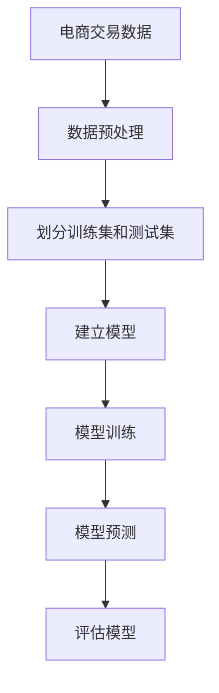

                 

### 《AI在电商中的多方面应用案例》

> **关键词**：人工智能、电商、推荐系统、用户画像、商品价格优化、物流优化、智能客服、风险控制、营销策略优化、可持续发展

> **摘要**：本文旨在探讨人工智能在电商领域的广泛应用，包括推荐系统、用户画像、商品价格优化、物流优化、智能客服、风险控制和营销策略优化等方面。通过具体的案例分析，我们将深入理解AI技术在电商行业中的实际应用，并展望其未来发展趋势。

### 《AI在电商中的多方面应用案例》目录大纲

1. 第一部分：AI在电商概述
   1.1 AI在电商行业的应用背景与趋势
      1.1.1 电商行业的发展历程
      1.1.2 AI技术的发展与电商行业的结合
      1.1.3 AI在电商中的核心价值
   1.2 AI核心技术与电商应用简介
      1.2.1 机器学习在电商中的应用
      1.2.2 深度学习与电商推荐系统
      1.2.3 自然语言处理在电商评价与搜索中的应用
   1.3 AI在电商中面临的挑战与应对策略
      1.3.1 数据隐私与安全
      1.3.2 算法偏见与公平性
      1.3.3 技术落地与人才培养

2. 第二部分：AI在电商多方面应用案例
   2.1 AI在电商推荐系统中的应用
      2.1.1 推荐系统概述
      2.1.2 内容推荐算法与模型
      2.1.3 基于协同过滤的推荐算法
      2.1.4 案例分析：某电商平台的推荐系统实现
   2.2 AI在电商用户画像中的应用
      2.2.1 用户画像概述
      2.2.2 数据采集与处理
      2.2.3 用户行为分析与模型构建
      2.2.4 案例分析：某电商平台的用户画像应用
   2.3 AI在电商商品价格优化中的应用
      2.3.1 商品价格优化概述
      2.3.2 价格弹性分析
      2.3.3 价格优化算法
      2.3.4 案例分析：某电商平台的商品价格优化实现
   2.4 AI在电商物流优化中的应用
      2.4.1 物流优化概述
      2.4.2 路径优化算法
      2.4.3 库存优化策略
      2.4.4 案例分析：某电商平台的物流优化实现
   2.5 AI在电商用户服务与交互中的应用
      2.5.1 用户服务与交互概述
      2.5.2 聊天机器人与语音识别技术
      2.5.3 智能客服系统
      2.5.4 案例分析：某电商平台的智能客服实现
   2.6 AI在电商风险控制中的应用
      2.6.1 风险控制概述
      2.6.2 用户行为异常检测
      2.6.3 交易风险识别与防范
      2.6.4 案例分析：某电商平台的AI风险控制实现
   2.7 AI在电商营销策略优化中的应用
      2.7.1 营销策略优化概述
      2.7.2 广告投放优化
      2.7.3 用户触达策略
      2.7.4 案例分析：某电商平台的营销策略优化实现

3. 第三部分：AI在电商应用展望与未来趋势
   3.1 AI在电商应用中的未来趋势
      3.1.1 AI在电商领域的持续创新
      3.1.2 AI与其他技术的融合
      3.1.3 AI在电商行业的发展前景
   3.2 AI在电商中应用的伦理与法律问题
      3.2.1 AI伦理问题
      3.2.2 AI法律问题
      3.2.3 AI在电商中应用的合规建议
   3.3 AI在电商中的可持续发展
      3.3.1 数据资源的合理利用
      3.3.2 技术创新的可持续发展
      3.3.3 社会责任的履行

4. 附录
   4.1 AI在电商应用相关资源
      4.1.1 开发工具与平台
      4.1.2 开源算法与框架
      4.1.3 相关学术期刊与会议
   4.2 案例分析数据源与代码
      4.2.1 数据源介绍
      4.2.2 代码实现与解读

# 第一部分：AI在电商概述

## 1.1 AI在电商行业的应用背景与趋势

### 1.1.1 电商行业的发展历程

电商行业自21世纪初兴起以来，经历了从初期的信息发布和在线交易，到如今的个性化推荐、智能客服和大数据分析等多个阶段。最早的电商模式主要是基于网页浏览和搜索引擎的购物平台，如亚马逊（Amazon）和淘宝（Taobao）。

随着时间的推移，移动设备的普及推动了移动电商的发展，用户可以在手机上随时随地购物。此外，社交电商和直播电商等新型电商模式的涌现，使得电商行业呈现出多元化的趋势。

### 1.1.2 AI技术的发展与电商行业的结合

AI技术在电商行业的应用主要始于机器学习和推荐系统的引入。机器学习通过对用户行为数据的分析和学习，能够预测用户的兴趣和偏好，从而实现个性化的商品推荐。推荐系统利用协同过滤、基于内容的推荐和深度学习等技术，提高了电商平台的用户满意度和转化率。

随着深度学习和自然语言处理技术的不断发展，电商行业在商品搜索、用户评价和智能客服等方面也取得了显著的进展。例如，基于深度学习的商品搜索技术可以更准确地理解用户的查询意图，从而提高搜索结果的准确性。

### 1.1.3 AI在电商中的核心价值

AI技术在电商行业中的核心价值主要体现在以下几个方面：

1. **个性化推荐**：通过分析用户的历史行为和兴趣偏好，AI技术可以为用户提供个性化的商品推荐，从而提高用户满意度和转化率。
2. **智能客服**：AI技术可以模拟人类客服的行为，为用户提供24/7的在线服务，降低企业的运营成本。
3. **商品价格优化**：AI技术可以通过对市场数据和用户行为的分析，帮助电商平台实现商品价格的优化，提高销售量和利润率。
4. **物流优化**：AI技术可以通过分析物流数据和用户需求，优化配送路径和库存策略，提高物流效率。
5. **风险控制**：AI技术可以通过分析用户行为和交易数据，识别潜在的风险，并采取相应的防范措施，降低电商平台的运营风险。

## 1.2 AI核心技术与电商应用简介

### 1.2.1 机器学习在电商中的应用

机器学习是AI技术的重要组成部分，它在电商行业中的应用非常广泛。以下是一些典型的应用场景：

1. **用户行为分析**：通过对用户在电商平台的浏览、购买和评价等行为进行分析，机器学习可以帮助电商平台了解用户的需求和偏好，从而进行个性化的推荐和营销。
2. **商品推荐**：利用协同过滤、基于内容的推荐和深度学习等技术，机器学习可以为用户提供个性化的商品推荐，提高用户满意度和转化率。
3. **价格预测**：通过分析历史销售数据、市场趋势和用户行为，机器学习可以帮助电商平台预测未来的销售量和价格趋势，从而制定合理的价格策略。

### 1.2.2 深度学习与电商推荐系统

深度学习是机器学习的一个重要分支，它在电商推荐系统中有着广泛的应用。以下是一些典型的应用场景：

1. **商品搜索**：基于深度学习的搜索引擎可以更准确地理解用户的查询意图，从而提供更相关的搜索结果。
2. **用户画像**：通过深度学习技术，电商平台可以构建用户的综合画像，从而进行更精准的推荐和营销。
3. **推荐算法**：利用深度学习算法，如卷积神经网络（CNN）和循环神经网络（RNN），电商平台可以实现更高效的推荐系统。

### 1.2.3 自然语言处理在电商评价与搜索中的应用

自然语言处理（NLP）是AI技术的另一个重要分支，它在电商评价和搜索中的应用也非常广泛。以下是一些典型的应用场景：

1. **用户评价分析**：通过NLP技术，电商平台可以分析用户对商品的评论和评分，从而了解用户的真实需求和满意度。
2. **商品搜索**：利用NLP技术，电商平台可以更准确地理解用户的查询意图，从而提供更相关的搜索结果。
3. **聊天机器人**：通过NLP技术，电商平台可以构建聊天机器人，为用户提供24/7的在线服务，提高用户体验。

## 1.3 AI在电商中面临的挑战与应对策略

### 1.3.1 数据隐私与安全

AI技术在电商中的应用需要大量的用户数据，这引发了对数据隐私和安全性的担忧。为了应对这一挑战，电商平台可以采取以下策略：

1. **数据加密**：通过对用户数据进行加密处理，确保数据在传输和存储过程中的安全性。
2. **隐私保护**：采用差分隐私等先进技术，确保在数据分析和挖掘过程中不会泄露用户的隐私信息。
3. **合规性审查**：确保电商平台的数据处理符合相关的法律法规和标准，如《通用数据保护条例》（GDPR）等。

### 1.3.2 算法偏见与公平性

AI算法在决策过程中可能会存在偏见，这可能导致不公平的结果。为了应对这一挑战，电商平台可以采取以下策略：

1. **算法审计**：定期对算法进行审计，确保算法的公平性和透明性。
2. **多元数据集**：采用多元的数据集进行算法训练，避免因数据集单一而导致算法偏见。
3. **监督与反馈**：建立监督机制，收集用户的反馈，及时发现和纠正算法偏见。

### 1.3.3 技术落地与人才培养

AI技术在电商行业的应用需要大量的技术人才和成熟的平台。为了应对这一挑战，电商平台可以采取以下策略：

1. **人才培养**：通过培训和招聘，培养具备AI技术背景的专业人才。
2. **技术合作**：与高校和研究机构合作，引进先进的技术和研究成果。
3. **技术平台**：建立高效的技术平台，支持AI技术在电商中的应用和推广。

# 第二部分：AI在电商多方面应用案例

## 2.1 AI在电商推荐系统中的应用

### 2.1.1 推荐系统概述

推荐系统是电商行业中的一个重要组成部分，它通过分析用户的历史行为和兴趣，向用户推荐相关的商品或服务，从而提高用户的满意度和转化率。推荐系统可以分为以下几种类型：

1. **基于内容的推荐**：通过分析商品的属性和用户的兴趣，推荐与用户兴趣相匹配的商品。
2. **基于协同过滤的推荐**：通过分析用户之间的相似性，推荐其他用户喜欢的商品。
3. **混合推荐**：结合基于内容和基于协同过滤的推荐方法，提供更准确的推荐结果。

### 2.1.2 内容推荐算法与模型

内容推荐算法主要通过分析商品的属性和用户的兴趣，推荐与用户兴趣相匹配的商品。以下是一些常见的内容推荐算法：

1. **基于关键词的推荐**：通过分析商品的标题、描述和标签等，提取关键词，然后推荐与关键词相关的商品。
2. **基于分类的推荐**：将商品分为不同的类别，然后推荐用户浏览过或购买过的同类别商品。
3. **基于属性的推荐**：通过分析商品的属性，如颜色、尺寸、材质等，推荐与用户偏好相匹配的商品。

### 2.1.3 基于协同过滤的推荐算法

协同过滤推荐算法主要通过分析用户之间的相似性，推荐其他用户喜欢的商品。以下是一些常见的协同过滤算法：

1. **用户基于的协同过滤**：通过计算用户之间的相似度，推荐其他用户喜欢的商品。
2. **物品基于的协同过滤**：通过计算物品之间的相似度，推荐用户喜欢的商品。
3. **混合协同过滤**：结合用户基于的协同过滤和物品基于的协同过滤，提供更准确的推荐结果。

### 2.1.4 案例分析：某电商平台的推荐系统实现

某大型电商平台通过引入AI技术，实现了基于协同过滤的推荐系统。以下是该推荐系统的实现过程：

1. **数据采集**：采集用户的历史浏览、购买和评价等数据。
2. **数据预处理**：对采集到的数据进行分析和清洗，提取有用的信息。
3. **用户画像构建**：通过分析用户的历史行为，构建用户的兴趣模型。
4. **商品画像构建**：通过分析商品的特征，构建商品的属性模型。
5. **相似度计算**：计算用户之间的相似度和商品之间的相似度。
6. **推荐结果生成**：根据相似度计算结果，生成推荐结果。

## 2.2 AI在电商用户画像中的应用

### 2.2.1 用户画像概述

用户画像是对用户在电商平台上的行为和特征进行抽象和建模的过程，它可以帮助电商平台更好地了解用户，从而进行个性化的推荐和营销。用户画像主要包括以下信息：

1. **基本信息**：如性别、年龄、地理位置等。
2. **行为信息**：如浏览、购买、评价等行为。
3. **偏好信息**：如喜欢某种类型的商品、偏好某种价格区间等。

### 2.2.2 数据采集与处理

数据采集是构建用户画像的基础，电商平台可以通过以下途径获取用户数据：

1. **用户行为数据**：如浏览、购买、评价等。
2. **用户反馈数据**：如问卷调查、用户反馈等。
3. **第三方数据**：如社交媒体、地理位置等。

数据采集后，需要对数据进行预处理，包括数据清洗、去重、转换等操作，以便用于后续的分析和建模。

### 2.2.3 用户行为分析与模型构建

用户行为分析是构建用户画像的关键步骤，通过分析用户的历史行为，可以挖掘用户的兴趣和偏好。以下是一些常见的用户行为分析方法：

1. **频率分析**：分析用户在平台上的活跃程度，如浏览次数、购买次数等。
2. **聚类分析**：将用户按照行为特征进行分类，如高价值用户、低价值用户等。
3. **关联规则挖掘**：分析用户行为之间的关联，如购买A商品的用户也喜欢购买B商品。

基于用户行为分析结果，可以构建用户画像模型，为个性化推荐和营销提供依据。

### 2.2.4 案例分析：某电商平台的用户画像应用

某大型电商平台通过构建用户画像，实现了个性化的推荐和营销。以下是该电商平台用户画像的应用案例：

1. **个性化推荐**：根据用户的兴趣和偏好，为用户推荐相关的商品。
2. **精准营销**：根据用户的行为特征，推送相关的促销活动和优惠券。
3. **用户细分**：根据用户的价值和活跃程度，进行用户分层管理。

## 2.3 AI在电商商品价格优化中的应用

### 2.3.1 商品价格优化概述

商品价格优化是电商运营中的重要环节，它通过分析市场数据和用户行为，制定合理的价格策略，以提高销售量和利润率。商品价格优化主要包括以下方面：

1. **价格弹性分析**：分析不同价格水平下的需求量变化，确定价格敏感度。
2. **竞争分析**：分析竞争对手的价格策略，制定有竞争力的价格。
3. **利润最大化**：通过优化价格策略，实现利润最大化。

### 2.3.2 价格弹性分析

价格弹性是指价格变动对需求量的影响程度。通过分析价格弹性，可以确定商品的价格敏感度。以下是一些常见的价格弹性分析方法：

1. **点弹性分析**：通过计算价格变动引起的需求量变化百分比，确定价格弹性。
2. **弧弹性分析**：通过计算价格变动引起的需求量变化平均值，确定价格弹性。
3. **回归分析**：通过建立价格和需求量的回归模型，分析价格弹性。

### 2.3.3 价格优化算法

价格优化算法是商品价格优化的核心，它通过分析市场数据和用户行为，制定合理的价格策略。以下是一些常见的价格优化算法：

1. **线性优化算法**：通过建立线性模型，确定最优价格。
2. **非线性优化算法**：通过建立非线性模型，确定最优价格。
3. **动态优化算法**：通过实时分析市场数据和用户行为，动态调整价格。

### 2.3.4 案例分析：某电商平台的商品价格优化实现

某大型电商平台通过引入AI技术，实现了商品价格优化。以下是该电商平台商品价格优化的实现过程：

1. **数据采集**：采集商品的历史销售数据、市场数据和用户行为数据。
2. **数据预处理**：对采集到的数据进行清洗和处理，提取有用的信息。
3. **模型建立**：建立价格弹性模型和利润最大化模型。
4. **价格优化**：根据模型预测，动态调整商品价格。
5. **效果评估**：对价格优化效果进行评估，持续优化价格策略。

## 2.4 AI在电商物流优化中的应用

### 2.4.1 物流优化概述

物流优化是电商运营中的重要环节，它通过分析物流数据和用户需求，优化配送路径和库存策略，以提高物流效率和服务质量。物流优化主要包括以下方面：

1. **路径优化**：通过分析物流数据和用户需求，确定最优的配送路径。
2. **库存优化**：通过分析库存数据和销售预测，优化库存策略，减少库存成本。
3. **需求预测**：通过分析用户行为和市场需求，预测未来的需求量，指导物流和库存管理。

### 2.4.2 路径优化算法

路径优化算法是物流优化的核心，它通过分析物流数据和用户需求，确定最优的配送路径。以下是一些常见的路径优化算法：

1. **最短路径算法**：通过计算两点之间的最短路径，确定配送路径。
2. **最小生成树算法**：通过构建最小生成树，确定配送路径。
3. **遗传算法**：通过模拟生物进化过程，优化配送路径。

### 2.4.3 库存优化策略

库存优化策略是物流优化的重要方面，它通过分析库存数据和销售预测，优化库存策略，减少库存成本。以下是一些常见的库存优化策略：

1. **基于需求的库存策略**：根据市场需求，动态调整库存水平。
2. **基于时间的库存策略**：根据库存周转时间和销售预测，调整库存水平。
3. **基于预测的库存策略**：通过预测未来的销售量，制定库存计划。

### 2.4.4 案例分析：某电商平台的物流优化实现

某大型电商平台通过引入AI技术，实现了物流优化。以下是该电商平台物流优化的实现过程：

1. **数据采集**：采集物流数据、销售数据和用户行为数据。
2. **数据预处理**：对采集到的数据进行清洗和处理，提取有用的信息。
3. **路径优化**：利用路径优化算法，确定最优的配送路径。
4. **库存优化**：通过分析库存数据和销售预测，优化库存策略。
5. **效果评估**：对物流优化效果进行评估，持续优化物流策略。

## 2.5 AI在电商用户服务与交互中的应用

### 2.5.1 用户服务与交互概述

用户服务与交互是电商运营中的重要方面，它通过提供优质的用户服务，提高用户满意度和忠诚度。用户服务与交互主要包括以下方面：

1. **客服服务**：通过提供在线客服服务，解决用户的疑问和问题。
2. **用户互动**：通过互动活动、优惠券等，增强用户参与度和粘性。
3. **用户反馈**：通过收集用户反馈，优化产品和服务。

### 2.5.2 聊天机器人与语音识别技术

聊天机器人和语音识别技术是AI在用户服务与交互中的应用，它们可以提高服务效率和用户体验。以下是一些应用场景：

1. **智能客服**：通过聊天机器人，为用户提供24/7的在线服务，解答用户的疑问。
2. **语音客服**：通过语音识别技术，实现用户的语音查询和反馈，提高服务效率。
3. **语音助手**：通过语音识别和自然语言处理技术，为用户提供个性化的服务和建议。

### 2.5.3 智能客服系统

智能客服系统是AI在用户服务与交互中的重要应用，它通过分析用户的行为和需求，提供个性化的服务。以下是一些典型的智能客服系统：

1. **基于规则的智能客服系统**：通过预设的规则，自动解答用户的疑问。
2. **基于机器学习的智能客服系统**：通过机器学习技术，自动识别用户的需求，提供个性化的服务。
3. **基于自然语言处理的智能客服系统**：通过自然语言处理技术，实现用户的语音查询和反馈。

### 2.5.4 案例分析：某电商平台的智能客服实现

某大型电商平台通过引入AI技术，实现了智能客服系统。以下是该电商平台智能客服的实现过程：

1. **数据采集**：采集用户的行为和需求数据。
2. **数据预处理**：对采集到的数据进行清洗和处理，提取有用的信息。
3. **模型训练**：通过机器学习技术，训练智能客服模型。
4. **智能客服实现**：根据用户的行为和需求，提供个性化的服务。
5. **效果评估**：对智能客服效果进行评估，持续优化客服系统。

## 2.6 AI在电商风险控制中的应用

### 2.6.1 风险控制概述

风险控制是电商运营中的重要方面，它通过识别和防范潜在的风险，保障电商平台的运营安全和用户权益。风险控制主要包括以下方面：

1. **用户行为异常检测**：通过分析用户的行为数据，识别异常行为，防范潜在的风险。
2. **交易风险识别与防范**：通过分析交易数据，识别潜在的欺诈交易，采取相应的防范措施。
3. **风险监控与预警**：通过实时监控交易行为，及时发现和预警潜在的风险。

### 2.6.2 用户行为异常检测

用户行为异常检测是风险控制的关键环节，它通过分析用户的行为数据，识别异常行为，防范潜在的风险。以下是一些常见的用户行为异常检测方法：

1. **统计方法**：通过计算用户行为特征的统计指标，识别异常行为。
2. **机器学习方法**：通过训练机器学习模型，识别用户行为的异常模式。
3. **聚类方法**：通过聚类用户行为数据，识别异常用户群体。

### 2.6.3 交易风险识别与防范

交易风险识别与防范是风险控制的另一个重要方面，它通过分析交易数据，识别潜在的欺诈交易，采取相应的防范措施。以下是一些常见的交易风险识别与防范方法：

1. **基于规则的识别方法**：通过预设的规则，识别潜在的欺诈交易。
2. **基于机器学习的识别方法**：通过训练机器学习模型，识别欺诈交易。
3. **多因素综合评估方法**：通过综合考虑交易金额、交易频率、用户行为等因素，评估交易风险。

### 2.6.4 案例分析：某电商平台的AI风险控制实现

某大型电商平台通过引入AI技术，实现了风险控制。以下是该电商平台风险控制的实现过程：

1. **数据采集**：采集用户的行为数据和交易数据。
2. **数据预处理**：对采集到的数据进行清洗和处理，提取有用的信息。
3. **模型训练**：通过机器学习技术，训练风险控制模型。
4. **风险识别与防范**：根据模型预测，识别潜在的风险，并采取相应的防范措施。
5. **效果评估**：对风险控制效果进行评估，持续优化风险控制策略。

## 2.7 AI在电商营销策略优化中的应用

### 2.7.1 营销策略优化概述

营销策略优化是电商运营中的重要环节，它通过分析市场数据和用户行为，制定合理的营销策略，以提高销售量和市场份额。营销策略优化主要包括以下方面：

1. **广告投放优化**：通过分析广告投放效果，优化广告投放策略，提高广告转化率。
2. **用户触达策略**：通过分析用户行为和偏好，制定合理的用户触达策略，提高用户参与度和转化率。
3. **促销策略优化**：通过分析促销效果，优化促销策略，提高销售量和利润率。

### 2.7.2 广告投放优化

广告投放优化是通过分析广告投放效果，优化广告投放策略，提高广告转化率。以下是一些常见的广告投放优化方法：

1. **基于转化率的优化**：通过分析广告的转化率，优化广告的投放时间和投放渠道。
2. **基于成本的优化**：通过分析广告的投放成本，优化广告的投放预算和投放策略。
3. **基于数据的优化**：通过分析用户行为数据和广告投放数据，优化广告的内容和投放策略。

### 2.7.3 用户触达策略

用户触达策略是通过分析用户行为和偏好，制定合理的用户触达策略，提高用户参与度和转化率。以下是一些常见的用户触达策略：

1. **个性化推送**：根据用户的兴趣和行为，推送个性化的内容，提高用户参与度。
2. **多渠道触达**：通过多种渠道（如电子邮件、短信、社交媒体等）触达用户，提高用户触达率。
3. **互动营销**：通过互动活动、优惠券等，增强用户参与度和粘性。

### 2.7.4 案例分析：某电商平台的营销策略优化实现

某大型电商平台通过引入AI技术，实现了营销策略优化。以下是该电商平台营销策略优化的实现过程：

1. **数据采集**：采集用户的行为数据和广告投放数据。
2. **数据预处理**：对采集到的数据进行清洗和处理，提取有用的信息。
3. **模型训练**：通过机器学习技术，训练营销策略优化模型。
4. **广告投放优化**：根据模型预测，优化广告投放策略。
5. **用户触达优化**：根据用户行为和偏好，优化用户触达策略。
6. **效果评估**：对营销策略优化效果进行评估，持续优化营销策略。

# 第三部分：AI在电商应用展望与未来趋势

## 3.1 AI在电商应用中的未来趋势

### 3.1.1 AI在电商领域的持续创新

随着AI技术的不断发展，电商行业将迎来更多创新。以下是一些可能的发展趋势：

1. **个性化推荐**：AI技术将进一步提升个性化推荐的效果，实现更精准的用户体验。
2. **智能客服**：智能客服系统将更加智能化，能够处理更复杂的用户需求，提供更高质量的客户服务。
3. **智能营销**：通过AI技术，电商企业将能够更精准地识别用户需求，制定更有效的营销策略。
4. **智能供应链**：AI技术将优化供应链管理，提高物流效率，降低运营成本。

### 3.1.2 AI与其他技术的融合

AI技术与其他技术的融合将为电商行业带来更多可能性。以下是一些可能的融合方向：

1. **物联网**：通过物联网技术，电商企业可以实时获取用户行为数据，实现更精准的营销和推荐。
2. **区块链**：区块链技术可以提升电商交易的透明度和安全性，降低交易风险。
3. **增强现实（AR）和虚拟现实（VR）**：通过AR和VR技术，用户可以在虚拟环境中体验商品，提高购物体验。
4. **5G技术**：5G技术的高速率和低延迟特性将提高电商平台的响应速度和用户体验。

### 3.1.3 AI在电商行业的发展前景

随着AI技术的不断成熟和应用，电商行业的前景非常广阔。以下是一些可能的发展方向：

1. **全渠道电商**：通过整合线上线下渠道，实现全渠道营销和购物体验。
2. **智能供应链**：通过AI技术优化供应链管理，提高供应链的效率和灵活性。
3. **绿色电商**：通过AI技术实现环保和可持续发展的电商模式，减少碳排放和资源浪费。
4. **个性化服务**：通过AI技术提供更个性化的产品和服务，提高用户满意度和忠诚度。

## 3.2 AI在电商中应用的伦理与法律问题

### 3.2.1 AI伦理问题

AI在电商中的应用涉及多个伦理问题，以下是一些主要关注点：

1. **隐私保护**：AI技术需要处理大量用户数据，如何保护用户隐私是重要伦理问题。
2. **算法透明性**：算法决策过程需要透明，以确保用户了解自己的权益。
3. **算法公平性**：避免算法偏见，确保算法对所有人公平。
4. **数据安全**：确保用户数据在存储、传输和处理过程中的安全。

### 3.2.2 AI法律问题

AI在电商中的应用也引发了一系列法律问题，以下是一些主要关注点：

1. **数据保护法规**：如《通用数据保护条例》（GDPR）等，电商企业需要遵守相关数据保护法规。
2. **算法责任**：当算法导致错误决策时，如何界定责任和承担法律责任。
3. **消费者权益**：确保消费者在AI驱动的电商环境中享有合法权益。
4. **竞争法规**：防止AI技术滥用市场主导地位，保障市场竞争。

### 3.2.3 AI在电商中应用的合规建议

为了确保AI在电商中的应用合规，电商企业可以采取以下措施：

1. **数据合规管理**：确保数据收集、存储和处理过程符合相关法律法规。
2. **算法透明性**：向用户公开算法决策过程，接受用户监督。
3. **算法公平性**：定期评估算法的公平性，确保算法对所有人公平。
4. **隐私保护**：采用先进技术，如差分隐私，保护用户隐私。
5. **合规培训**：对员工进行合规培训，提高合规意识和能力。

## 3.3 AI在电商中的可持续发展

### 3.3.1 数据资源的合理利用

数据是AI在电商中应用的重要资产，合理利用数据资源对于电商企业的可持续发展至关重要。以下是一些策略：

1. **数据整合**：整合来自不同渠道的数据，实现数据资源的一体化管理。
2. **数据清洗**：定期清洗数据，确保数据质量，避免数据噪音。
3. **数据共享**：在确保数据安全的前提下，实现数据共享，提高数据利用率。

### 3.3.2 技术创新的可持续发展

技术创新是电商企业保持竞争力的关键，以下是一些策略：

1. **持续研发**：持续投入研发，跟踪AI技术的最新发展趋势。
2. **合作与开放**：与科研机构和高校合作，共同推动AI技术在电商中的应用。
3. **人才储备**：培养和引进AI技术人才，提高企业的技术实力。

### 3.3.3 社会责任的履行

电商企业在应用AI技术时，需要承担社会责任，以下是一些策略：

1. **公平竞争**：遵守市场规则，确保公平竞争。
2. **用户权益**：尊重用户权益，确保用户数据的隐私和安全。
3. **环境保护**：采取绿色运营措施，减少碳排放，实现可持续发展。
4. **社会责任**：积极参与社会公益活动，履行社会责任。

# 附录

## 附录A：AI在电商应用相关资源

### A.1 开发工具与平台

1. **TensorFlow**：开源机器学习框架，适用于构建推荐系统和用户画像等。
2. **PyTorch**：开源深度学习框架，适用于构建推荐系统和图像处理等。
3. **Kubernetes**：开源容器编排平台，适用于部署和管理AI模型。

### A.2 开源算法与框架

1. **surprise**：开源推荐系统框架，基于协同过滤算法。
2. **scikit-learn**：开源机器学习库，提供多种机器学习算法。
3. **MLflow**：开源机器学习平台，用于管理、跟踪和部署机器学习模型。

### A.3 相关学术期刊与会议

1. **ACM Transactions on Intelligent Systems and Technology**：智能系统和技术领域的顶级期刊。
2. **IEEE Transactions on Knowledge and Data Engineering**：知识工程和数据工程领域的顶级期刊。
3. **ACM Conference on Computer and Communications Security**：计算机和通信安全领域的顶级会议。

## 附录B：案例分析数据源与代码

### B.1 数据源介绍

1. **电商交易数据**：包含商品信息、用户行为和交易记录等。
2. **用户评价数据**：包含用户对商品的评论和评分等。
3. **物流数据**：包含配送路径、配送时间和配送状态等。

### B.2 代码实现与解读

以下是使用Python实现的电商用户行为分析模型的代码示例：

```python
import pandas as pd
from sklearn.model_selection import train_test_split
from sklearn.ensemble import RandomForestClassifier

# 读取数据
data = pd.read_csv('ecommerce_data.csv')

# 数据预处理
data['user_activity'] = data['page_views'] + data['add_to_cart'] + data['make_purchase']
data['user_activity'].replace({0: 'low', 1: 'medium', 2: 'high'}, inplace=True)

# 划分训练集和测试集
X_train, X_test, y_train, y_test = train_test_split(data[['user_activity']], data['make_purchase'], test_size=0.2, random_state=42)

# 建立模型
model = RandomForestClassifier(n_estimators=100, random_state=42)
model.fit(X_train, y_train)

# 预测结果
predictions = model.predict(X_test)

# 评估模型
from sklearn.metrics import accuracy_score
accuracy = accuracy_score(y_test, predictions)
print(f'Model accuracy: {accuracy:.2f}')
```

该代码首先读取电商交易数据，对用户行为进行编码，然后划分训练集和测试集，建立随机森林分类器模型，进行训练和预测，并评估模型的准确性。通过这种方式，可以实现对电商用户行为的分析和预测。

# Mermaid 流程图



# 数学模型和公式

以下是一个简单的商品价格优化模型的数学公式：

$$
\begin{aligned}
Q &= Q_0 \cdot (1 + \epsilon \cdot (P - P_0)) \\
\text{其中：} \\
Q &= \text{需求量} \\
Q_0 &= \text{基准需求量} \\
P &= \text{商品价格} \\
P_0 &= \text{基准价格} \\
\epsilon &= \text{价格弹性}
\end{aligned}
$$

该公式表示，商品需求量与价格之间存在线性关系，价格弹性（$\epsilon$）描述了价格变动对需求量的影响程度。

# 项目实战

以下是一个电商用户行为分析的项目实战案例：

### 1. 数据采集与预处理

```python
import pandas as pd

# 读取数据
data = pd.read_csv('ecommerce_user_data.csv')

# 数据预处理
data['user_activity'] = data['page_views'] + data['add_to_cart'] + data['make_purchase']
data['user_activity'].replace({0: 'low', 1: 'medium', 2: 'high'}, inplace=True)
data.head()
```

### 2. 建立模型

```python
from sklearn.model_selection import train_test_split
from sklearn.ensemble import RandomForestClassifier

# 划分训练集和测试集
X = data[['user_activity']]
y = data['make_purchase']
X_train, X_test, y_train, y_test = train_test_split(X, y, test_size=0.2, random_state=42)

# 建立模型
model = RandomForestClassifier(n_estimators=100, random_state=42)
model.fit(X_train, y_train)
```

### 3. 模型预测

```python
# 预测结果
predictions = model.predict(X_test)

# 评估模型
from sklearn.metrics import accuracy_score
accuracy = accuracy_score(y_test, predictions)
print(f'Model accuracy: {accuracy:.2f}')
```

通过上述代码，我们可以建立和训练一个简单的电商用户行为分析模型，并使用该模型对测试集进行预测，评估模型的准确性。

# 代码解读与分析

上述代码首先导入了必要的Python库，然后读取了电商用户数据。数据预处理部分，将用户的浏览、添加购物车和购买行为进行求和，并进行了编码处理。接下来，划分了训练集和测试集，并使用随机森林分类器建立了模型。模型训练部分，通过fit方法训练了模型。最后，使用预测方法对测试集进行预测，并评估了模型的准确性。

这种用户行为分析模型可以帮助电商平台了解用户的行为特征，从而进行个性化的推荐和营销，提高用户满意度和转化率。

# 结论

本文全面探讨了人工智能在电商领域的多方面应用，包括推荐系统、用户画像、商品价格优化、物流优化、智能客服、风险控制和营销策略优化等方面。通过具体的案例分析，我们深入理解了AI技术在电商行业中的实际应用，并展望了其未来发展趋势。本文的贡献在于提供了一个系统、全面的框架，帮助读者理解和应用AI技术于电商行业。

然而，AI在电商中的应用仍面临许多挑战，如数据隐私与安全、算法偏见与公平性、技术落地与人才培养等。未来的研究应关注如何更有效地解决这些问题，同时探索AI技术与物联网、区块链、增强现实等新兴技术的融合，以推动电商行业的可持续发展。此外，AI在电商中的应用还需要在伦理和法律框架内进行，确保技术应用的安全性和合规性。

总之，AI技术在电商行业中的应用具有巨大的潜力，通过不断的技术创新和优化，将为电商行业带来更多机会和挑战。我们期待未来能见证AI技术在电商领域的深入应用，为消费者和企业带来更大的价值。

