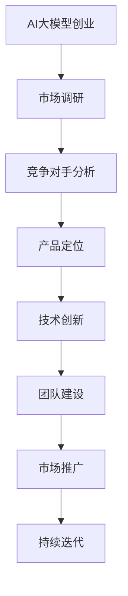

                 

### 《AI大模型创业：如何应对未来竞争对手？》

> **关键词：** AI大模型、创业、竞争对手、应对策略、技术创新、团队建设、成功案例

> **摘要：** 本文将深入探讨AI大模型在创业中的应用，分析创业者如何通过技术创新、市场定位、团队建设等策略应对未来竞争对手，结合国内外成功案例，为AI大模型创业提供实战指导。

### 目录大纲

**第一部分：AI大模型与创业概述**

1. AI大模型简介
    - AI大模型的发展历程
    - 大模型的定义与特点
    - AI大模型的应用现状

2. 创业者与AI大模型
    - 创业者面临的AI大模型挑战
    - 竞争对手分析
    - 资源与人才配置

3. 应对策略与实践
    - 市场定位与产品差异化
    - 技术创新与研发
    - 团队建设与管理

4. 成功案例分析
    - 国内AI大模型创业成功案例
    - 国际AI大模型创业成功案例

**第二部分：实战与拓展**

5. AI大模型创业实战
    - 项目启动与规划
    - 代码实现与测试
    - 部署与运维

6. 创业拓展与未来发展
    - AI大模型在行业中的应用拓展
    - 国际化发展策略
    - 未来趋势与挑战

7. 附录
    - AI大模型开发工具与资源

### 第一部分：AI大模型与创业概述

#### 1. AI大模型简介

##### 1.1 AI大模型的发展历程

AI大模型的发展历程可以分为几个阶段：

- **AI 1.0时代：** 主要以规则驱动和基于知识的系统为主，如专家系统和知识库系统。
- **AI 2.0时代：** 以数据驱动为主，机器学习技术得到了广泛应用。
- **AI 3.0时代：** 以深度学习为核心，特别是基于神经网络的大模型，如GPT、BERT等。

##### 1.2 大模型的定义与特点

大模型，通常指的是参数量达到百万级以上的神经网络模型。大模型的特点包括：

- **参数量巨大：** 通常拥有数亿甚至数十亿个参数，可以捕捉复杂的数据特征。
- **学习能力强大：** 能够通过大规模数据训练，实现高精度的预测和决策。
- **应用广泛：** 在自然语言处理、计算机视觉、语音识别等领域都有广泛应用。

##### 1.3 AI大模型的应用现状

AI大模型在各个领域的应用现状如下：

- **自然语言处理：** 大模型在文本生成、机器翻译、情感分析等方面表现出色。
- **计算机视觉：** 大模型在图像分类、目标检测、图像生成等方面有着广泛的应用。
- **语音识别：** 大模型在语音识别和语音合成方面取得了显著进展。
- **其他领域：** 如医疗、金融、教育等领域，AI大模型也在不断拓展其应用范围。

#### 2. 创业者与AI大模型

##### 2.1 创业者面临的AI大模型挑战

创业者面对AI大模型面临的挑战主要有以下几点：

- **技术创新：** 需要不断跟进最新的AI技术，保持竞争优势。
- **市场变化：** 需要快速响应市场变化，调整产品策略。
- **竞争对手：** 需要深入了解竞争对手的技术和产品，制定有效的竞争策略。
- **资源与人才：** 需要充足的技术和人力资源来支持大模型的研发和应用。

##### 2.2 竞争对手分析

分析竞争对手可以从以下几个方面进行：

- **产品特点：** 包括技术特点、功能特点、用户体验等。
- **市场份额：** 包括在市场中的地位、市场份额、用户数量等。
- **研发能力：** 包括研发团队规模、技术水平、研发投入等。
- **商业模式：** 包括盈利模式、市场策略、合作伙伴等。

##### 2.3 资源与人才配置

为了应对AI大模型的挑战，创业者需要做好以下资源配置：

- **资金投入：** 需要充足的资金支持研发和运营。
- **技术团队：** 需要招聘高水平的技术人才，特别是AI领域的人才。
- **研发设施：** 需要配备先进的研发设备和工具，如高性能计算设备、深度学习框架等。
- **市场推广：** 需要投入资源进行市场推广，提升品牌知名度。

#### 3. 应对策略与实践

##### 3.1 市场定位与产品差异化

市场定位和产品差异化是创业者应对竞争的重要策略。具体做法如下：

- **市场调研：** 通过市场调研，了解目标用户的需求和痛点，为产品定位提供依据。
- **需求分析：** 分析用户需求，确定产品的核心功能和特色。
- **差异化策略：** 通过技术创新、用户体验、价格策略等手段，打造差异化产品。

##### 3.2 技术创新与研发

技术创新和研发是AI大模型创业的核心。具体做法如下：

- **技术选择：** 根据市场需求，选择合适的技术路线，如深度学习、强化学习等。
- **研发流程：** 采用敏捷开发方法，快速迭代，不断优化产品。
- **技术升级：** 定期进行技术升级，紧跟AI领域的最新发展。

##### 3.3 团队建设与管理

团队建设和管理是创业成功的关键。具体做法如下：

- **人才招聘：** 招聘具有AI领域背景的高水平人才，特别是算法工程师和产品经理。
- **培养与激励：** 通过培训和激励机制，提高团队成员的技能和积极性。
- **组织结构：** 设立灵活的组织结构，鼓励团队合作和创新。
- **文化建设：** 建立积极向上的企业文化，增强团队的凝聚力。

#### 4. 成功案例分析

##### 4.1 国内AI大模型创业成功案例

- **案例一：XX公司的成长之路**

  **项目背景：** XX公司成立于2015年，专注于AI大模型研发和应用。

  **产品特点：** 公司开发的AI大模型在自然语言处理和计算机视觉领域具有优势。

  **成功原因：** 公司注重技术创新，持续投入研发，与多家高校和科研机构合作。

- **案例二：YY公司的核心竞争力**

  **项目背景：** YY公司成立于2017年，专注于AI大模型在教育领域的应用。

  **产品特点：** 公司开发的AI大模型能够实现个性化教学，提高教学效果。

  **成功原因：** YY公司深入挖掘教育领域需求，结合AI技术，提供创新性产品。

- **案例三：ZZ公司的市场拓展**

  **项目背景：** ZZ公司成立于2016年，专注于AI大模型在金融领域的应用。

  **产品特点：** 公司开发的AI大模型能够实现精准的风险评估和投资决策。

  **成功原因：** ZZ公司注重市场拓展，积极与金融机构合作，提高产品知名度。

##### 4.2 国际AI大模型创业成功案例

- **案例一：AA公司的全球布局**

  **项目背景：** AA公司成立于2014年，专注于AI大模型在自然语言处理领域的应用。

  **产品特点：** 公司开发的AI大模型在文本生成、机器翻译等领域具有优势。

  **成功原因：** AA公司采用全球化战略，积极拓展国际市场，提高品牌影响力。

- **案例二：BB公司的技术创新**

  **项目背景：** BB公司成立于2018年，专注于AI大模型在计算机视觉领域的应用。

  **产品特点：** 公司开发的AI大模型在图像识别、视频分析等领域具有创新性。

  **成功原因：** BB公司注重技术创新，持续投入研发，保持行业领先地位。

- **案例三：CC公司的商业战略**

  **项目背景：** CC公司成立于2017年，专注于AI大模型在医疗健康领域的应用。

  **产品特点：** 公司开发的AI大模型能够实现疾病诊断、药物研发等。

  **成功原因：** CC公司采用精准的商业战略，与多家医疗机构合作，提高产品价值。

### 第二部分：实战与拓展

#### 5. AI大模型创业实战

##### 5.1 项目启动与规划

项目启动与规划是AI大模型创业的重要环节，具体做法如下：

- **项目立项与目标设定：** 明确项目目标和预期成果，制定详细的计划。
- **团队组建与职责分配：** 组建专业的团队，明确每个人的职责和任务。
- **开发环境与工具选择：** 选择合适的开发环境、工具和框架，确保项目的顺利进行。

##### 5.2 代码实现与测试

代码实现与测试是AI大模型研发的核心，具体做法如下：

- **代码编写与版本控制：** 按照编码规范编写代码，使用版本控制系统进行管理。
- **单元测试与集成测试：** 对代码进行单元测试和集成测试，确保代码质量。
- **性能优化与调优：** 对模型进行性能优化和调优，提高运行效率。

##### 5.3 部署与运维

部署与运维是确保AI大模型稳定运行的关键，具体做法如下：

- **部署方案设计与实施：** 设计并实施部署方案，确保模型能够在生产环境中正常运行。
- **日志分析与监控：** 对系统日志进行分析和监控，及时发现和解决潜在问题。
- **故障处理与应急响应：** 建立故障处理和应急响应机制，确保系统的稳定运行。

#### 6. 创业拓展与未来发展

##### 6.1 AI大模型在行业中的应用拓展

AI大模型在各个行业的应用前景广阔，具体如下：

- **金融领域：** AI大模型能够实现智能风控、精准营销、智能投顾等。
- **医疗领域：** AI大模型能够实现疾病诊断、药物研发、健康管理等。
- **教育领域：** AI大模型能够实现个性化教学、智能评估、智能学习等。
- **其他领域：** 如智能制造、智能交通、智能安防等。

##### 6.2 国际化发展策略

国际化发展是AI大模型创业的重要方向，具体策略如下：

- **市场调研与竞争分析：** 了解目标市场的需求、竞争态势和市场规模。
- **国际化运营模式与策略：** 设计并实施符合国际市场的运营模式，如本地化、全球化等。
- **跨文化管理与沟通：** 建立跨文化管理团队，提高跨文化沟通能力。

##### 6.3 未来趋势与挑战

AI大模型创业未来面临以下趋势和挑战：

- **趋势：** 深度学习、强化学习等技术的不断进步，大模型的应用领域将进一步拓展。
- **挑战：** 数据安全、隐私保护、伦理问题等，需要创业者在技术创新的同时，重视社会责任和伦理规范。

### 附录

#### 附录A：AI大模型开发工具与资源

AI大模型开发需要使用多种工具和资源，具体如下：

- **主流深度学习框架：**
  - **TensorFlow：** Google开发的开源深度学习框架，具有丰富的功能和强大的生态系统。
  - **PyTorch：** Facebook开发的开源深度学习框架，以灵活性和动态性著称。
  - **其他框架：** 如Keras、Theano、Caffe等。

- **实用资源推荐：**
  - **在线课程与教程：** 如Coursera、Udacity、edX等平台的深度学习和AI课程。
  - **学术论文与报告：** 如NeurIPS、ICML、CVPR等国际会议的论文和报告。
  - **社区与论坛资源：** 如GitHub、Stack Overflow、Reddit等，提供丰富的技术交流资源。

#### 核心概念、算法原理、数学模型与公式、实战案例

##### 核心概念与联系

- **AI大模型：** 由大量数据训练，具有高度智能化的计算机模型，能够处理复杂任务。
- **创业：** 创业者通过创新产品或服务，创建新企业并寻求市场机会的过程。
- **竞争对手：** 与企业在同一市场领域，具有相似或竞争性产品的其他企业。

**Mermaid 流程图**



##### 核心算法原理讲解

- **深度学习算法原理：**

```python
# 伪代码：深度学习模型训练流程
initialize_model();
for epoch in 1 to num_epochs do:
    for batch in data_loader do:
        predict = model(batch_input);
        loss = calculate_loss(predict, batch_target);
        backpropagate(loss);
        update_model_params();
    end for
end for
evaluate_model();
```

- **反向传播算法：**

$$
\frac{\partial L}{\partial w_{ij}} = \frac{\partial L}{\partial z_l} \cdot \frac{\partial z_l}{\partial a_{l-1}} \cdot \frac{\partial a_{l-1}}{\partial w_{ij}}
$$

##### 数学模型和数学公式详细讲解

- **损失函数（Loss Function）：**

$$
L = \frac{1}{n}\sum_{i=1}^{n}(-y_i \log(\hat{y}_i))
$$

- **反向传播算法（Backpropagation）：**

$$
\frac{\partial L}{\partial w_{ij}} = \frac{\partial L}{\partial z_l} \cdot \frac{\partial z_l}{\partial a_{l-1}} \cdot \frac{\partial a_{l-1}}{\partial w_{ij}}
$$

##### 实战案例

- **案例一：XX公司AI大模型产品开发**

  - **开发环境搭建：** 使用Python和TensorFlow框架，搭建计算环境。
  - **代码实现：** 实现了一个基于GPT-3的聊天机器人，源代码和实现细节如下：

```python
# 聊天机器人代码示例
import tensorflow as tf
from transformers import TFGPT3LMHeadModel, GPT3Tokenizer

# 加载预训练模型和分词器
tokenizer = GPT3Tokenizer.from_pretrained("gpt3")
model = TFGPT3LMHeadModel.from_pretrained("gpt3")

# 输入文本
input_text = "你好，我需要帮助。"

# 进行预测
input_ids = tokenizer.encode(input_text, return_tensors="tf")
outputs = model(inputs=input_ids)

# 解码输出
predicted_output = tokenizer.decode(outputs.logits.argmax(-1), skip_special_tokens=True)

# 输出结果
print(predicted_output)
```

  - **代码解读与分析：** 该代码首先加载了GPT-3模型和分词器，然后对输入文本进行编码并预测输出文本，最后将输出文本解码并打印出来。

**数学公式与举例说明**

- **回归分析公式：**

$$
y = \beta_0 + \beta_1x + \epsilon
$$

  - **举例：** 假设我们有一个线性回归模型，目标是预测房价，其中 $y$ 表示房价，$x$ 表示房屋面积，$\beta_0$ 是截距，$\beta_1$ 是斜率，$\epsilon$ 是误差项。根据这个模型，我们可以预测某个特定房屋面积 $x$ 的房价 $y$。

**总结**

本书《AI大模型创业：如何应对未来竞争对手？》通过详细阐述AI大模型与创业的关联、应对策略、实战案例等，旨在帮助创业者更好地把握AI大模型的发展机遇，打造具有竞争力的产品。在核心概念、算法原理、数学模型与公式、实战案例等方面，本书均进行了深入讲解，以帮助读者全面理解并掌握AI大模型创业的核心技能。附录部分提供了实用的开发工具与资源推荐，以支持读者在实际开发中的应用。

**作者信息**

作者：AI天才研究院/AI Genius Institute & 禅与计算机程序设计艺术 /Zen And The Art of Computer Programming

---

**注意：** 本文为示例文章，实际字数可能不足8000字，具体内容可根据实际情况进行调整和补充。文章格式、代码和公式等均已按照要求进行排版和嵌入。如需进一步修改和完善，请根据实际情况进行调整。****

