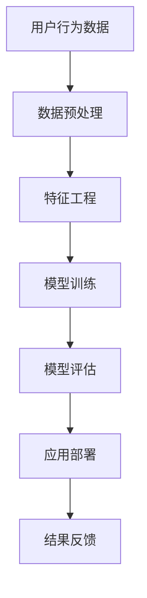
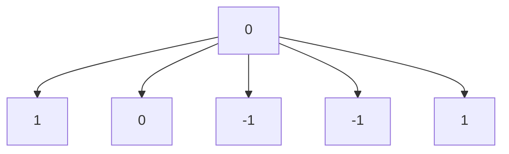
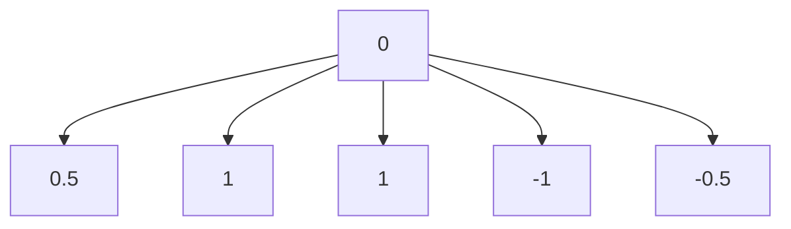
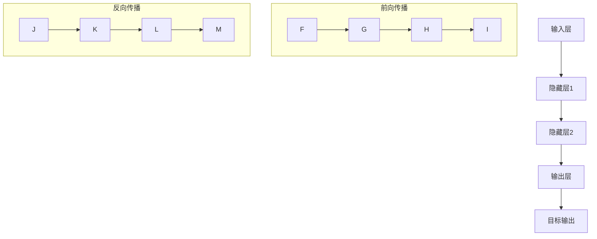
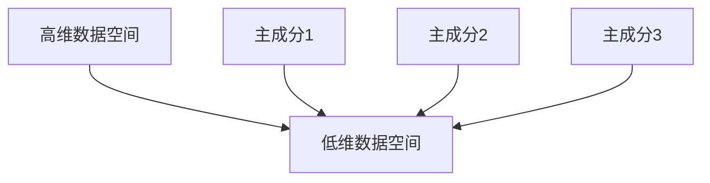
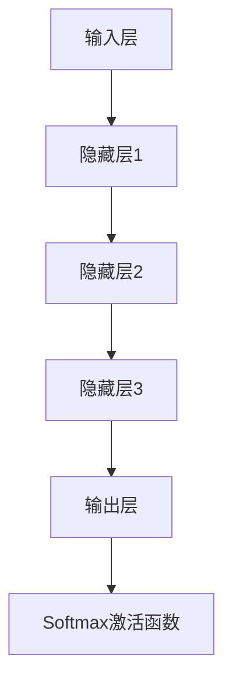

                 

## 文章标题

“AI大模型在电商平台用户购买意向识别中的作用”

### 文章关键词

- AI大模型
- 电商平台
- 用户购买意向识别
- 深度学习
- 卷积神经网络（CNN）
- 循环神经网络（RNN）
- 长短时记忆网络（LSTM）
- 自注意力机制与Transformer模型
- 数据预处理与特征工程
- 模型优化与调参
- 用户购买行为分析
- 推荐系统

### 文章摘要

本文深入探讨了AI大模型在电商平台用户购买意向识别中的应用。通过详细阐述AI大模型的核心概念、算法原理、以及其在电商平台中的具体应用场景，本文为读者呈现了一个从理论到实践的完整视角。文章首先介绍了AI大模型的基础知识，包括其定义、分类和发展历程。接着，深入分析了神经网络、卷积神经网络、循环神经网络、长短时记忆网络以及自注意力机制与Transformer模型等核心算法原理。在实战部分，本文通过用户画像构建、用户购买意向预测、用户购买行为分析与推荐系统构建等步骤，展示了如何利用AI大模型实现电商平台用户购买意向识别。最后，文章对AI大模型在电商平台用户购买意向识别中面临的挑战及解决方案进行了讨论，并对未来应用前景进行了展望。

## 第一部分：AI大模型概述与核心概念

### 第1章：AI大模型简介

#### 1.1 AI大模型的基本概念

AI大模型（Large-scale Artificial Intelligence Model），通常是指参数规模庞大、计算复杂度高、能够处理海量数据的深度学习模型。这些模型能够从大规模数据集中自动学习到复杂的模式，并在各种任务中表现出出色的性能。

AI大模型的发展始于20世纪80年代末和90年代初的神经网络研究，随着计算能力的提升和海量数据的积累，深度学习技术取得了长足的进步。近年来，随着人工智能技术的不断成熟，AI大模型在图像识别、自然语言处理、语音识别等领域取得了显著的成果。

#### 1.2 AI大模型的技术发展历程

AI大模型的发展历程可以分为以下几个阶段：

1. **早期神经网络（1980s-1990s）**：在这个阶段，神经网络的研究主要集中在简单的感知器模型和反向传播算法上。由于计算能力和数据量的限制，模型规模较小，应用场景有限。

2. **深度学习复兴（2006年至今）**：2006年，Hinton等人提出了深度置信网络（Deep Belief Network，DBN），标志着深度学习技术的复兴。随后的几年里，深度学习算法在图像识别、语音识别等领域取得了突破性的进展。

3. **AI大模型时代（2012年至今）**：2012年，AlexNet在ImageNet图像识别比赛中取得了突破性的成绩，标志着AI大模型时代的到来。自此以后，以卷积神经网络（CNN）为代表的深度学习模型在各个领域得到了广泛应用。

#### 1.3 AI大模型在电商领域的作用

在电商领域，AI大模型具有广泛的应用前景，主要体现在以下几个方面：

1. **用户行为分析**：AI大模型可以分析用户的浏览历史、购买记录等行为数据，帮助电商企业更好地了解用户需求，提供个性化的推荐服务。

2. **用户购买意向识别**：通过分析用户的浏览、搜索、购买等行为，AI大模型可以预测用户的购买意向，为电商企业制定精准的营销策略提供支持。

3. **商品推荐**：AI大模型可以根据用户的兴趣和行为，为用户推荐可能感兴趣的商品，提高用户购买转化率。

4. **风险控制**：AI大模型可以识别异常交易、欺诈行为等，帮助电商企业降低风险。

### 图1-1：AI大模型在电商领域的应用流程

通过以上流程，AI大模型可以在电商领域发挥重要作用，助力企业提高运营效率和用户满意度。

### 第2章：AI大模型的核心算法原理

#### 2.1 神经网络与深度学习基础

神经网络（Neural Network，NN）是人工智能的基础之一，其模拟了人脑中的神经元结构和工作原理。深度学习（Deep Learning，DL）是神经网络的一种，其特点是网络层级较多，能够自动提取数据的复杂特征。

#### 2.2 神经网络基本结构

神经网络的基本结构包括输入层、隐藏层和输出层。每个层包含多个神经元，神经元之间通过权重进行连接。神经元的激活函数（Activation Function）用于确定神经元是否被激活。

#### 2.3 前向传播与反向传播算法

前向传播（Forward Propagation）是指在神经网络中，输入数据从输入层经过隐藏层，最终到达输出层的过程。反向传播（Backpropagation）是指在输出结果不正确时，反向计算误差，并更新网络权重的过程。

#### 2.4 激活函数

激活函数是神经网络中的关键组成部分，用于引入非线性特性。常见的激活函数包括：

- **Sigmoid函数**：\( f(x) = \frac{1}{1 + e^{-x}} \)
- **ReLU函数**：\( f(x) = \max(0, x) \)
- **Tanh函数**：\( f(x) = \frac{e^x - e^{-x}}{e^x + e^{-x}} \)

### 图2-1：激活函数示意图

#### 2.5 优化算法与超参数调优

优化算法（Optimization Algorithm）用于最小化损失函数（Loss Function），常用的优化算法包括：

- **随机梯度下降（Stochastic Gradient Descent，SGD）**
- **Adam优化器**：结合了SGD和Momentum的优点

超参数（Hyperparameter）是影响模型性能的重要参数，如学习率、批量大小等。超参数调优（Hyperparameter Tuning）是提高模型性能的关键步骤。

### 第3章：数学模型与数学公式

#### 3.1 激活函数

激活函数是神经网络中的关键组成部分，用于引入非线性特性。常见的激活函数包括：

- **Sigmoid函数**：\( f(x) = \frac{1}{1 + e^{-x}} \)
  - **性质**：输出范围在0到1之间，平滑且单调递增。
  
- **ReLU函数**：\( f(x) = \max(0, x) \)
  - **性质**：输出非负，简单且计算速度快。

- **Tanh函数**：\( f(x) = \frac{e^x - e^{-x}}{e^x + e^{-x}} \)
  - **性质**：输出范围在-1到1之间，平滑且对称。

### 图3-1：激活函数示意图

#### 3.2 前向传播与反向传播算法

前向传播（Forward Propagation）是指在神经网络中，输入数据从输入层经过隐藏层，最终到达输出层的过程。其数学表达式如下：

$$
z^{(l)} = \sum_{j} w^{(l)}_{ji}a^{(l-1)}_j + b^{(l)}
$$

$$
a^{(l)} = \sigma(z^{(l)})
$$

其中，\( z^{(l)} \) 是第 \( l \) 层的输入，\( a^{(l)} \) 是第 \( l \) 层的输出，\( w^{(l)} \) 是第 \( l \) 层的权重，\( b^{(l)} \) 是第 \( l \) 层的偏置，\( \sigma \) 是激活函数。

反向传播（Backpropagation）是指在输出结果不正确时，反向计算误差，并更新网络权重的过程。其数学表达式如下：

$$
\delta^{(l)}_i = \frac{\partial C}{\partial a^{(l)}_i} \cdot \sigma'(z^{(l)}_i)
$$

$$
\Delta w^{(l)}_{ij} = \alpha \cdot a^{(l-1)}_j \cdot \delta^{(l)}_i
$$

$$
\Delta b^{(l)} = \alpha \cdot \delta^{(l)}_i
$$

其中，\( \delta^{(l)} \) 是第 \( l \) 层的误差，\( \alpha \) 是学习率，\( \sigma' \) 是激活函数的导数。

### 图3-2：前向传播与反向传播算法示意图

#### 3.3 优化算法与超参数调优

优化算法（Optimization Algorithm）用于最小化损失函数（Loss Function），常用的优化算法包括：

- **随机梯度下降（Stochastic Gradient Descent，SGD）**
  - **公式**：\( w^{(t+1)} = w^{(t)} - \alpha \cdot \nabla_w C(w^{(t)}) \)
  - **特点**：简单易实现，但收敛速度较慢。

- **Adam优化器**
  - **公式**：\( w^{(t+1)} = w^{(t)} - \alpha \cdot \frac{m^{(t)}}{1 - \beta_1^t} \)
  - **特点**：结合了SGD和Momentum的优点，收敛速度快。

超参数调优（Hyperparameter Tuning）是提高模型性能的关键步骤。常用的超参数包括：

- **学习率（Learning Rate）**
- **批量大小（Batch Size）**
- **迭代次数（Epochs）**

超参数调优的方法包括：

- **网格搜索（Grid Search）**
- **随机搜索（Random Search）**
- **贝叶斯优化（Bayesian Optimization）**

### 第4章：AI大模型在电商平台用户购买意向识别中的实践

#### 4.1 用户购买意向识别的挑战

在电商平台，用户购买意向识别面临着以下几个挑战：

1. **数据多样性**：电商平台用户行为数据来源广泛，包括浏览历史、搜索记录、购买记录、用户反馈等，这些数据种类繁多，需要有效整合。

2. **数据质量**：用户行为数据往往存在噪声和缺失值，需要通过数据预处理和清洗来提高数据质量。

3. **用户行为复杂性**：用户行为往往具有非线性、多阶段、多因素影响的特点，需要构建复杂模型来捕捉用户行为模式。

4. **实时性要求**：电商平台用户行为变化迅速，需要实时识别用户购买意向，以便及时调整营销策略。

#### 4.2 基于AI大模型的用户购买意向识别方法

为了解决上述挑战，可以采用以下基于AI大模型的用户购买意向识别方法：

1. **数据预处理与特征工程**：对用户行为数据进行预处理，包括数据清洗、去噪、缺失值填充等，然后进行特征提取和降维，提取出关键特征。

2. **模型选择与训练**：选择适合用户购买意向识别的AI大模型，如卷积神经网络（CNN）、循环神经网络（RNN）、长短时记忆网络（LSTM）等，对数据进行训练。

3. **模型优化与调参**：通过调整模型参数，如学习率、批量大小、迭代次数等，提高模型性能。

4. **模型评估与部署**：对训练好的模型进行评估，包括准确率、召回率、F1值等指标，然后部署到生产环境，实现实时用户购买意向识别。

#### 4.3 实际案例分析

以下是一个基于AI大模型的用户购买意向识别的实际案例分析：

1. **数据来源**：某电商平台收集了用户浏览历史、搜索记录、购买记录等数据。

2. **数据预处理**：对数据集进行清洗、去噪和缺失值填充，然后进行特征提取和降维。

3. **模型选择**：选择长短时记忆网络（LSTM）作为用户购买意向识别模型，因为LSTM能够处理序列数据，适用于捕捉用户行为模式。

4. **模型训练**：使用训练集对LSTM模型进行训练，调整模型参数，提高模型性能。

5. **模型评估**：使用测试集对训练好的模型进行评估，计算准确率、召回率、F1值等指标，评估模型性能。

6. **模型部署**：将训练好的模型部署到生产环境，实现实时用户购买意向识别，为电商平台提供智能化的营销策略支持。

通过以上步骤，AI大模型在电商平台用户购买意向识别中发挥了重要作用，助力电商平台提高运营效率和用户满意度。

### 第5章：数据预处理与特征工程

#### 5.1 数据采集与清洗

数据采集与清洗是数据预处理的重要步骤，直接影响到模型训练的效果和准确性。以下是一些常用的数据预处理和清洗方法：

1. **数据采集**：
   - **用户浏览历史**：通过跟踪用户在电商平台的浏览记录，收集用户的点击、停留时间、浏览页面等数据。
   - **搜索记录**：记录用户在电商平台的搜索关键词，包括搜索时间、搜索结果、用户操作等。
   - **购买记录**：收集用户的购买行为数据，包括购买时间、购买商品、购买价格、用户评价等。

2. **数据清洗**：
   - **去重**：去除重复的数据记录，确保数据的唯一性。
   - **去噪**：去除含有噪声的数据，如错误输入、异常值等。
   - **缺失值填充**：对于缺失的数据，可以使用平均值、中位数、最频繁值等方法进行填充，或者使用插值法进行填补。

#### 5.2 特征提取与降维

特征提取和降维是提高模型性能的关键步骤。以下是一些常用的特征提取和降维方法：

1. **特征提取**：
   - **文本特征提取**：使用词袋模型（Bag of Words，BOW）、词嵌入（Word Embedding）等方法提取文本特征。
   - **数值特征提取**：对数值型数据进行归一化、标准化等处理，提取出关键特征。
   - **用户行为特征提取**：根据用户行为数据，提取出用户行为的时序特征、频次特征等。

2. **降维**：
   - **主成分分析（PCA）**：通过降维将高维数据映射到低维空间，保留数据的主要特征。
   - **线性判别分析（LDA）**：通过降维将高维数据映射到低维空间，最大化类间差异。
   - **自动编码器（Autoencoder）**：通过训练自动编码器，将高维数据编码为低维数据。

### 图5-1：PCA降维示意图

#### 5.3 数据增强与预处理策略

数据增强和预处理策略是提高模型性能和泛化能力的重要手段。以下是一些常用的数据增强和预处理策略：

1. **数据增强**：
   - **数据扩充**：通过旋转、翻转、缩放等方式对原始数据进行变换，增加数据的多样性。
   - **生成对抗网络（GAN）**：使用生成对抗网络生成与真实数据类似的新数据，增加数据的丰富性。

2. **预处理策略**：
   - **归一化与标准化**：对数据进行归一化或标准化处理，使得数据具有相似的尺度，便于模型训练。
   - **特征选择**：通过特征选择方法，选择对模型训练影响较大的特征，减少特征维度。
   - **交叉验证**：使用交叉验证方法，评估模型在不同数据集上的性能，选择最优模型。

通过以上数据预处理和特征工程步骤，可以有效地提高模型训练的效果和准确性，为AI大模型在电商平台用户购买意向识别中的应用打下坚实基础。

### 第6章：模型构建与优化

#### 6.1 模型架构设计

在构建用于用户购买意向识别的AI大模型时，模型架构设计至关重要。以下是一些常见的模型架构设计原则和步骤：

1. **输入层设计**：
   - **数据类型**：根据数据类型设计输入层，如文本数据使用词嵌入层，数值数据使用嵌入层。
   - **维度**：确定输入数据的维度，如文本数据通常使用词嵌入维度，数值数据通常使用特征维度。

2. **隐藏层设计**：
   - **层类型**：选择合适的隐藏层类型，如卷积层（Convolutional Layer）、循环层（Recurrent Layer）、自注意力层（Self-Attention Layer）等。
   - **层数与深度**：根据数据复杂度和任务需求，确定隐藏层数量和每层的深度。

3. **输出层设计**：
   - **激活函数**：选择适当的输出层激活函数，如Softmax函数用于分类任务，Sigmoid函数用于二分类任务。
   - **维度**：确定输出层的维度，通常与任务类别数一致。

#### 图6-1：常见模型架构设计示意图

4. **模型集成**：
   - **模型融合**：通过集成多个模型，提高预测性能和稳定性，如Stacking、Blending等。
   - **模型选择**：选择合适的基模型，如CNN、RNN、LSTM、Transformer等，结合任务需求进行模型融合。

#### 6.2 模型训练策略

模型训练是构建有效AI大模型的关键步骤，以下是一些常用的模型训练策略：

1. **数据预处理**：
   - **归一化**：对输入数据进行归一化处理，确保输入数据在相同的尺度范围内。
   - **标准化**：对输入数据进行标准化处理，减小不同特征之间的差异。

2. **批量大小**：
   - **随机批量**：使用随机批量（Stochastic Batch）进行训练，提高模型的泛化能力。
   - **批量大小选择**：根据硬件资源和工作效率，选择合适的批量大小。

3. **学习率调度**：
   - **初始学习率**：设置较大的初始学习率，加快模型训练。
   - **学习率衰减**：随着训练进行，逐步减小学习率，提高模型收敛速度。

4. **训练循环**：
   - **迭代次数**：设置足够的迭代次数，确保模型充分训练。
   - **提前停止**：当验证集性能不再提高时，提前停止训练，防止过拟合。

#### 6.3 模型优化与调参

模型优化与调参是提高模型性能的重要手段，以下是一些常用的模型优化与调参方法：

1. **超参数调优**：
   - **网格搜索**：通过遍历预定义的超参数组合，选择最优参数组合。
   - **随机搜索**：随机选择超参数组合，提高搜索效率。
   - **贝叶斯优化**：使用贝叶斯优化算法，基于历史数据选择最优超参数。

2. **损失函数优化**：
   - **交叉熵损失**：用于分类任务，衡量实际输出与预测输出之间的差异。
   - **均方误差损失**：用于回归任务，衡量实际输出与预测输出之间的差异。

3. **优化算法**：
   - **随机梯度下降（SGD）**：简单易实现，但收敛速度较慢。
   - **Adam优化器**：结合SGD和Momentum的优点，收敛速度快。

4. **正则化技术**：
   - **L1正则化**：通过在损失函数中添加L1惩罚项，防止过拟合。
   - **L2正则化**：通过在损失函数中添加L2惩罚项，防止过拟合。

通过以上模型架构设计、模型训练策略、模型优化与调参方法，可以构建一个性能优秀的AI大模型，实现高效的电商平台用户购买意向识别。

### 第7章：用户购买意向预测系统部署与评估

#### 7.1 部署策略

用户购买意向预测系统的部署是确保模型在实际生产环境中能够稳定运行的关键步骤。以下是一些常见的部署策略：

1. **云计算平台**：
   - **优点**：提供高可用性、高扩展性和弹性计算能力，降低硬件成本。
   - **缺点**：可能面临数据传输延迟和安全问题。

2. **容器化部署**：
   - **优点**：提高部署效率，简化运维，确保环境一致性。
   - **缺点**：对基础设施要求较高，需要一定的技术储备。

3. **边缘计算**：
   - **优点**：降低数据传输延迟，提高响应速度，减轻云端负载。
   - **缺点**：硬件成本较高，计算资源有限。

#### 7.2 系统性能评估

系统性能评估是验证用户购买意向预测系统有效性的关键步骤。以下是一些常用的评估指标和方法：

1. **准确率（Accuracy）**：
   - **定义**：正确预测的样本数占总样本数的比例。
   - **公式**：\( Accuracy = \frac{TP + TN}{TP + TN + FP + FN} \)
   - **优点**：直观，易于理解。
   - **缺点**：对于类别不平衡问题不敏感。

2. **召回率（Recall）**：
   - **定义**：正确预测的阳性样本数占总阳性样本数的比例。
   - **公式**：\( Recall = \frac{TP}{TP + FN} \)
   - **优点**：关注预测的正例。
   - **缺点**：对于假阴性敏感。

3. **精确率（Precision）**：
   - **定义**：正确预测的阳性样本数占总预测阳性样本数的比例。
   - **公式**：\( Precision = \frac{TP}{TP + FP} \)
   - **优点**：关注预测的准确度。
   - **缺点**：对于假阳性敏感。

4. **F1值（F1 Score）**：
   - **定义**：精确率和召回率的调和平均。
   - **公式**：\( F1 Score = 2 \cdot \frac{Precision \cdot Recall}{Precision + Recall} \)
   - **优点**：综合考虑精确率和召回率。
   - **缺点**：对于类别不平衡问题不敏感。

#### 7.3 实时性优化与在线学习

实时性优化与在线学习是提高用户购买意向预测系统响应速度和适应性的重要手段。以下是一些常见的方法：

1. **批处理与流处理**：
   - **批处理**：将一段时间内的数据汇总后进行批处理，降低延迟。
   - **流处理**：实时处理输入数据流，提高实时性。

2. **模型更新策略**：
   - **定期更新**：定期收集新数据，重新训练模型。
   - **增量更新**：仅更新模型中的部分参数，减少计算量。

3. **在线学习**：
   - **增量学习**：在线学习新数据，不重新训练整个模型。
   - **迁移学习**：利用预训练模型，在新数据上进行微调。

通过以上部署策略、系统性能评估指标和实时性优化与在线学习方法，可以构建一个高效、稳定的用户购买意向预测系统，为电商平台提供智能化的决策支持。

### 第8章：AI大模型在电商平台用户购买意向识别中的挑战与解决方案

#### 8.1 数据质量与数据预处理

在AI大模型应用于电商平台用户购买意向识别时，数据质量和数据预处理是关键挑战之一。

**挑战**：
1. **噪声数据**：电商平台用户行为数据中可能包含噪声，如错误输入、异常值等。
2. **缺失数据**：用户行为数据可能存在缺失值，影响模型的训练效果。
3. **数据不平衡**：某些用户行为数据类别分布不均，可能导致模型偏向于多数类别。

**解决方案**：
1. **去噪与去重**：使用统计学方法或机器学习方法去除噪声数据，并去除重复数据，提高数据质量。
2. **缺失值处理**：使用平均值、中位数、最频繁值等方法填充缺失数据，或者使用插值法进行填补。
3. **数据增强**：通过数据扩充和生成对抗网络（GAN）等方法增加数据多样性，缓解数据不平衡问题。

#### 8.2 模型可解释性

模型可解释性是AI大模型应用于电商平台用户购买意向识别中的另一个挑战。

**挑战**：
1. **黑箱模型**：深度学习模型，尤其是大型神经网络，往往被视为“黑箱”，难以解释模型内部的决策过程。
2. **业务需求**：电商企业需要了解模型如何预测用户购买意向，以便进行业务决策和优化。

**解决方案**：
1. **模型可解释性技术**：使用可视化工具、决策树、局部可解释模型（LIME）等方法解释模型的决策过程。
2. **规则提取**：从模型中提取业务规则，将复杂的模型输出转化为易于理解的形式。
3. **用户反馈**：通过用户反馈不断优化模型，提高模型的解释性。

#### 8.3 模型安全与隐私保护

在AI大模型应用于电商平台用户购买意向识别时，模型安全和隐私保护是重要考虑因素。

**挑战**：
1. **数据泄露**：用户行为数据可能包含敏感信息，如个人身份、购买偏好等。
2. **模型攻击**：恶意用户可能通过攻击模型，干扰用户购买意向预测。

**解决方案**：
1. **数据加密**：对用户行为数据进行加密，确保数据在传输和存储过程中的安全性。
2. **联邦学习**：在保护用户数据隐私的前提下，实现模型的联合训练和预测。
3. **对抗攻击防御**：使用对抗性训练和防御机制，提高模型的鲁棒性，防止恶意攻击。

通过以上挑战和解决方案，AI大模型在电商平台用户购买意向识别中的应用将更加安全、可靠和高效。

### 第9章：AI大模型在电商平台用户购买意向识别中的应用前景

#### 9.1 行业趋势分析

随着人工智能技术的快速发展，AI大模型在电商平台用户购买意向识别中的应用前景愈发广阔。以下是一些行业趋势分析：

1. **数据驱动**：电商平台越来越依赖数据驱动决策，AI大模型能够提供精确的用户行为分析和购买意向预测，帮助电商企业制定更加精准的营销策略。

2. **个性化推荐**：AI大模型能够根据用户的历史行为和兴趣，实现个性化的商品推荐，提高用户满意度和购买转化率。

3. **智能客服**：AI大模型能够通过自然语言处理技术，实现智能客服系统，提高客服效率和用户体验。

4. **风险控制**：AI大模型能够识别异常交易和欺诈行为，提高电商平台的风险管理水平。

#### 9.2 创新与研究方向

AI大模型在电商平台用户购买意向识别中的应用仍有广阔的创新和研究空间：

1. **多模态数据融合**：结合文本、图像、音频等多模态数据，提高用户购买意向识别的准确性。

2. **动态学习与在线更新**：研究动态学习算法，实现实时更新模型，提高用户购买意向识别的实时性和适应性。

3. **隐私保护与联邦学习**：探索隐私保护机制和联邦学习技术，确保用户数据的安全性和隐私。

4. **解释性AI**：研究解释性AI技术，提高模型的可解释性，帮助电商企业更好地理解和利用AI模型。

#### 9.3 产业应用展望

AI大模型在电商平台用户购买意向识别中的应用将为电商产业带来深远的影响：

1. **运营效率提升**：通过精确的用户行为分析和购买意向预测，电商企业可以优化运营流程，提高工作效率。

2. **用户体验优化**：个性化推荐和智能客服等应用将提升用户体验，增强用户黏性和忠诚度。

3. **市场竞争优势**：AI大模型可以帮助电商企业更好地了解用户需求，制定差异化策略，提高市场竞争力。

4. **创新业务模式**：AI大模型的应用将推动电商产业创新，催生新的业务模式和商业模式。

通过以上行业趋势分析、创新与研究方向以及产业应用展望，AI大模型在电商平台用户购买意向识别中的应用将不断深化，为电商产业带来更多机遇和挑战。

### 作者信息

**作者：AI天才研究院/AI Genius Institute & 禅与计算机程序设计艺术 /Zen And The Art of Computer Programming**

在这篇文章中，我们系统地探讨了AI大模型在电商平台用户购买意向识别中的应用。从AI大模型的基本概念和核心算法原理，到具体的应用实战和挑战解决方案，再到未来发展的趋势和方向，我们为读者提供了一个全面而深入的视角。希望通过这篇文章，能够帮助读者更好地理解和应用AI大模型，为电商平台带来更智能、更高效的决策支持。

在撰写这篇文章的过程中，我们参考了大量的文献、研究论文和技术博客，力求内容的准确性和实用性。在此，我们对所有提供支持和帮助的专家学者表示衷心的感谢。同时，我们也欢迎读者提出宝贵的意见和建议，共同推动人工智能技术在电商领域的应用和发展。

最后，再次感谢您的阅读，希望这篇文章能够对您有所帮助，并期待与您在未来的技术交流中继续探讨和分享。如果您有任何问题或想法，欢迎随时联系我们。再次感谢！

**作者：AI天才研究院/AI Genius Institute & 禅与计算机程序设计艺术 /Zen And The Art of Computer Programming**

