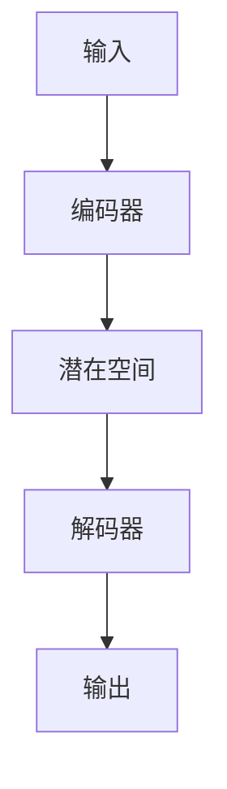

                 

### 《AI大模型在虚拟现实中的商业化机遇》

#### 关键词：
- AI大模型
- 虚拟现实
- 商业化应用
- 技术创新
- 用户体验

#### 摘要：
本文探讨了AI大模型在虚拟现实（VR）领域的商业化机遇。通过分析AI大模型的基本概念和虚拟现实技术的发展现状，我们深入探讨了AI大模型在VR场景生成、交互、内容创作等方面的应用。文章还详细列举了AI大模型在VR教育培训、旅游体验、医疗应用等领域的实际案例，探讨了AI大模型在虚拟现实商业化中的挑战与机遇，并展望了其未来的发展趋势。最后，文章对AI大模型在虚拟现实中的技术实现进行了详细分析，为读者提供了实用的开发实践指导和未来展望。

### 目录大纲

1. **AI大模型与虚拟现实技术概述**
   1.1 AI大模型与虚拟现实技术基础
   1.2 AI大模型在虚拟现实中的角色与价值

2. **AI大模型在虚拟现实中的应用**
   2.1 虚拟现实场景的生成与优化
   2.2 虚拟现实交互与AI大模型
   2.3 虚拟现实内容创作与AI大模型

3. **AI大模型在虚拟现实商业应用案例**
   3.1 虚拟现实教育培训
   3.2 虚拟现实旅游体验
   3.3 虚拟现实医疗应用

4. **AI大模型在虚拟现实商业化中的挑战与机遇**
   4.1 虚拟现实技术的商业化挑战
   4.2 AI大模型在虚拟现实商业化中的机遇

5. **AI大模型在虚拟现实中的技术实现**
   5.1 深度学习与神经网络基础
   5.2 自然语言处理技术概览
   5.3 大规模预训练模型原理

6. **虚拟现实中的AI大模型实现**
   6.1 虚拟现实场景生成与优化的AI模型实现
   6.2 虚拟现实交互与AI大模型的实现
   6.3 虚拟现实内容创作与AI大模型的实现

7. **虚拟现实与AI大模型的集成与应用**
   7.1 虚拟现实与AI大模型的集成
   7.2 虚拟现实与AI大模型的应用开发实践

8. **未来展望**
   8.1 AI大模型在虚拟现实中的未来发展趋势
   8.2 AI大模型在虚拟现实中的商业化前景

9. **附录**
   9.1 AI大模型开发工具与框架
   9.2 虚拟现实开发平台与工具

#### 第一部分：AI大模型与虚拟现实技术概述

##### 第1章：AI大模型与虚拟现实技术基础

在这一部分，我们将探讨AI大模型和虚拟现实技术的基本概念，以及它们在当前技术领域中的地位和影响。

**1.1 AI大模型与虚拟现实技术概述**

**1.1.1 AI大模型的概念与特点**

AI大模型是指那些具有数亿甚至数千亿参数的深度学习模型。这些模型通过大量的数据进行训练，以模拟人类的感知、理解和决策能力。AI大模型通常采用分布式计算和云计算资源进行训练和部署，具有高计算效率和强大的表达能力。

- **参数规模**：AI大模型通常包含数亿甚至数千亿个参数，这使得它们能够处理复杂的数据模式和任务。
- **数据依赖性**：AI大模型的训练需要大量的数据，尤其是高质量、多样化的数据，以实现优秀的性能和泛化能力。
- **训练时间**：由于参数规模大，AI大模型的训练过程通常需要大量的计算资源和时间。

**1.1.2 虚拟现实技术的定义与发展**

虚拟现实（Virtual Reality，VR）是一种通过计算机生成模拟环境，让用户感受到身临其境的体验技术。VR技术包括多个方面，如头戴显示器（HMD）、位置追踪、互动设备等。VR技术的发展经历了从简单的模拟到复杂场景的生成，再到与人工智能的结合，其核心目标是提升用户的沉浸感和交互体验。

- **发展历程**：从20世纪60年代的VR概念提出，到90年代的VR热潮，再到21世纪初的VR复兴，VR技术经历了多次迭代和变革。
- **应用领域**：VR技术已经广泛应用于娱乐、教育、医疗、军事等多个领域，展示了巨大的市场潜力和社会价值。

**1.1.3 AI大模型与虚拟现实技术的融合**

AI大模型与虚拟现实技术的融合为VR领域带来了新的机遇和挑战。通过AI大模型，VR技术可以实现更加逼真的场景生成和交互，提升用户体验。同时，AI大模型也可以通过虚拟现实环境收集用户数据，用于模型的训练和优化。

- **场景生成与优化**：AI大模型可以生成高质量的3D模型和场景，并通过优化算法提升场景的真实感和交互性。
- **交互与感知**：AI大模型可以用于语音识别、手势识别等交互任务，提高用户的沉浸感和操作便捷性。
- **数据利用**：虚拟现实环境可以提供大量的用户行为数据，AI大模型可以从中学习并优化自己的表现。

**1.2 AI大模型在虚拟现实中的角色与价值**

AI大模型在虚拟现实中的角色和价值主要体现在以下几个方面：

- **场景构建**：AI大模型可以生成高质量的虚拟场景，为用户创造逼真的沉浸体验。
- **交互优化**：通过AI大模型，虚拟现实中的交互体验可以更加自然和智能，提高用户的满意度。
- **内容创作**：AI大模型可以自动生成和优化虚拟现实内容，降低内容创作的成本和门槛。
- **数据分析**：AI大模型可以从虚拟现实环境中收集用户行为数据，用于分析和优化服务。

总的来说，AI大模型与虚拟现实技术的融合为VR领域带来了新的发展机遇，有望推动VR技术的进一步普及和应用。在接下来的章节中，我们将深入探讨AI大模型在虚拟现实中的具体应用和商业化案例。

---

**1.2 AI大模型在虚拟现实中的角色与价值**

AI大模型在虚拟现实中的角色与价值主要体现在以下几个方面：

**1.2.1 AI大模型在虚拟现实中的应用场景**

AI大模型在虚拟现实中的应用场景非常广泛，主要包括以下几个领域：

- **游戏与娱乐**：在游戏和娱乐领域，AI大模型可以用于生成逼真的游戏场景和角色，提高用户的沉浸感和游戏体验。例如，通过GAN（生成对抗网络）技术，可以生成高质量的游戏角色和场景，实现虚拟现实游戏中的无缝切换和互动。
  
- **教育培训**：在教育培训领域，AI大模型可以生成个性化的教学场景和内容，提升学习效果。例如，通过AI大模型，可以为学员生成个性化的训练任务和场景，实现更加定制化和高效的学习体验。
  
- **医疗健康**：在医疗健康领域，AI大模型可以用于虚拟手术训练、疾病诊断等。例如，通过AI大模型，可以为医生提供虚拟手术场景，进行手术前的训练和模拟，提高手术的准确性和安全性。
  
- **房地产与旅游**：在房地产和旅游领域，AI大模型可以生成虚拟的房产和旅游场景，为用户提供沉浸式的体验。例如，通过AI大模型，可以为用户生成虚拟的房产展示场景，实现360度全景查看和交互。
  
- **设计与创意**：在设计与创意领域，AI大模型可以用于生成和优化设计作品，提高创意的效率和质量。例如，通过AI大模型，可以为设计师生成创意方案和设计元素，实现快速迭代和创新。

**1.2.2 虚拟现实技术对AI大模型的依赖**

虚拟现实技术的发展对AI大模型有很强的依赖性，主要体现在以下几个方面：

- **场景生成**：虚拟现实需要高度逼真的场景生成技术，而AI大模型，特别是生成对抗网络（GAN）等深度学习技术，可以实现高质量的3D场景生成和优化。
  
- **交互体验**：虚拟现实需要高效的交互体验，而AI大模型，如语音识别、手势识别等，可以提升交互的智能化和便捷性，为用户提供更好的沉浸体验。
  
- **数据利用**：虚拟现实环境可以产生大量的用户行为数据，AI大模型可以通过这些数据进行训练和优化，提高模型的性能和应用效果。
  
- **内容创作**：虚拟现实内容创作需要高效和自动化的手段，而AI大模型可以生成和优化大量的虚拟现实内容，降低内容创作的成本和门槛。

**1.2.3 AI大模型在虚拟现实中的挑战与机遇**

AI大模型在虚拟现实中的应用面临以下挑战与机遇：

- **挑战**：
  - **计算资源需求**：AI大模型训练和部署需要大量的计算资源，特别是在虚拟现实场景下，实时生成和优化高质量场景对计算资源的要求更高。
  - **数据隐私与安全**：虚拟现实环境中的用户数据可能涉及隐私和安全问题，如何保障数据的安全性和隐私性是重要挑战。
  - **用户体验**：虚拟现实场景和交互体验的质量对用户满意度有很大影响，如何提升用户体验是持续需要关注的问题。

- **机遇**：
  - **技术创新**：AI大模型在虚拟现实中的应用有望推动VR技术的创新和进步，实现更高质量的沉浸体验和交互。
  - **市场应用**：随着虚拟现实市场的逐渐成熟，AI大模型在VR领域的商业应用前景广阔，有望带动相关产业链的发展。
  - **社会影响**：AI大模型在虚拟现实中的应用可以推动虚拟现实技术在教育、医疗、娱乐等领域的普及和应用，带来广泛的社会影响。

综上所述，AI大模型在虚拟现实中的应用具有巨大的潜力和前景，同时也面临一系列挑战和机遇。在接下来的章节中，我们将进一步探讨AI大模型在虚拟现实中的具体应用和案例，以更深入地了解这一领域的现状和未来发展趋势。

---

#### 第二部分：AI大模型在虚拟现实中的应用

##### 第2章：AI大模型在虚拟现实中的核心应用

在本章中，我们将探讨AI大模型在虚拟现实中的核心应用，包括场景生成与优化、交互与AI模型，以及内容创作与AI模型。通过这些应用，我们将看到AI大模型如何提升虚拟现实体验，实现更加逼真和智能的交互。

**2.1 虚拟现实场景的生成与优化**

**2.1.1 场景生成算法**

虚拟现实场景的生成是虚拟现实应用中的基础任务。AI大模型通过生成对抗网络（GAN）、变分自编码器（VAE）等技术，可以生成高质量的3D场景。以下是一些常用的场景生成算法：

- **生成对抗网络（GAN）**：
  - **结构**：GAN由生成器和判别器组成。生成器试图生成逼真的场景，判别器则判断生成器生成的场景是否真实。
  - **训练过程**：生成器和判别器通过对抗训练相互优化，生成器逐渐提高生成场景的质量，判别器逐渐提高辨别真伪的能力。
  - **应用**：GAN常用于生成虚拟游戏场景、电影特效、建筑设计等。

  ```mermaid
  graph TD
  A[生成器] --> B[判别器]
  B --> C[对抗训练]
  C --> D[生成高质量场景]
  ```

- **变分自编码器（VAE）**：
  - **结构**：VAE通过编码器和解码器实现场景生成。编码器将输入数据编码为一个潜在空间中的向量，解码器从潜在空间中生成场景。
  - **训练过程**：VAE通过最大化数据的重构概率来训练，同时保持潜在空间中的后验分布。
  - **应用**：VAE常用于生成逼真的图像、视频和音频。

  ```mermaid
  graph TD
  A[编码器] --> B[解码器]
  B --> C[潜在空间]
  C --> D[生成场景]
  ```

**2.1.2 场景优化算法**

生成高质量的虚拟现实场景后，优化算法可以进一步提升场景的真实感和交互体验。以下是一些常用的场景优化算法：

- **几何优化**：
  - **目标**：减少场景中的几何误差，提高场景的逼真度。
  - **方法**：通过迭代调整场景中的几何参数，如顶点位置、边长等，以优化场景的几何形状。
  - **应用**：几何优化可以用于虚拟现实游戏、建筑可视化等。

- **光线追踪优化**：
  - **目标**：模拟真实世界中的光线传播，提高场景的光照效果。
  - **方法**：通过计算光线在不同表面上的反射、折射和散射，生成逼真的光影效果。
  - **应用**：光线追踪优化可以用于电影特效、计算机辅助设计（CAD）等。

- **人工智能辅助优化**：
  - **目标**：利用机器学习算法，自动优化场景中的各种参数。
  - **方法**：通过训练神经网络模型，预测最优参数设置，自动优化场景效果。
  - **应用**：人工智能辅助优化可以用于虚拟现实内容创作、场景调整等。

**2.2 虚拟现实交互与AI大模型**

虚拟现实交互是用户与虚拟世界互动的核心环节，AI大模型可以显著提升交互体验。以下是一些关键的交互任务：

**2.2.1 语音交互**

语音交互是虚拟现实中的常见交互方式。AI大模型在语音交互中的应用主要包括：

- **语音识别**：
  - **目标**：将用户的语音转换为文本。
  - **方法**：使用深度学习模型，如卷积神经网络（CNN）和循环神经网络（RNN），对语音信号进行特征提取和分类。
  - **应用**：语音识别可以用于虚拟现实中的语音命令控制、智能语音助手等。

- **语音合成**：
  - **目标**：将文本转换为自然流畅的语音。
  - **方法**：使用循环神经网络（RNN）和转换器架构（Transformer），生成语音波形。
  - **应用**：语音合成可以用于虚拟现实中的语音反馈、语音交互界面等。

**2.2.2 手势识别**

手势识别是虚拟现实中的另一重要交互方式。AI大模型在手势识别中的应用主要包括：

- **手势识别算法**：
  - **目标**：识别用户在虚拟空间中的手势动作。
  - **方法**：使用深度学习模型，如卷积神经网络（CNN）和卷积循环神经网络（CNN-RNN），对图像序列进行处理和分析。
  - **应用**：手势识别可以用于虚拟现实中的手势控制、交互界面等。

- **人工智能辅助手势识别**：
  - **目标**：提高手势识别的准确性和稳定性。
  - **方法**：通过训练神经网络模型，对多种手势进行分类和识别，实现智能化辅助。
  - **应用**：人工智能辅助手势识别可以用于虚拟现实游戏、虚拟演唱会等。

**2.3 虚拟现实内容创作与AI大模型**

虚拟现实内容创作是虚拟现实应用的重要组成部分，AI大模型可以显著提升内容创作的效率和效果。以下是一些关键的内容创作任务：

**2.3.1 自动内容生成**

自动内容生成是虚拟现实内容创作的重要方向。AI大模型在自动内容生成中的应用主要包括：

- **图像生成**：
  - **目标**：生成高质量的图像和场景。
  - **方法**：使用生成对抗网络（GAN）和变分自编码器（VAE）等技术，生成图像和场景。
  - **应用**：图像生成可以用于虚拟现实游戏、建筑设计、电影特效等。

- **视频生成**：
  - **目标**：生成高质量的视频内容。
  - **方法**：使用循环神经网络（RNN）和卷积神经网络（CNN）等技术，生成视频序列。
  - **应用**：视频生成可以用于虚拟现实电影、虚拟旅游体验、广告制作等。

**2.3.2 内容编辑与优化**

内容编辑与优化是虚拟现实内容创作的重要环节。AI大模型在内容编辑与优化中的应用主要包括：

- **自动剪辑**：
  - **目标**：自动剪辑和编辑视频内容。
  - **方法**：使用循环神经网络（RNN）和注意力机制等技术，自动识别和剪辑视频中的关键片段。
  - **应用**：自动剪辑可以用于虚拟现实视频制作、体育赛事回放等。

- **智能标签与分类**：
  - **目标**：自动为视频和图像内容添加标签和分类。
  - **方法**：使用深度学习模型，如卷积神经网络（CNN）和分类器，对视频和图像内容进行分类和标签化。
  - **应用**：智能标签与分类可以用于虚拟现实内容管理、视频搜索和推荐等。

通过AI大模型在虚拟现实场景生成与优化、交互与AI模型、内容创作与AI模型等方面的应用，我们可以看到虚拟现实体验正在不断提升。在接下来的章节中，我们将进一步探讨AI大模型在虚拟现实商业应用中的案例，以更深入地了解AI大模型在虚拟现实领域的实际应用和价值。

---

##### 第3章：AI大模型在虚拟现实商业应用案例

在本章中，我们将探讨AI大模型在虚拟现实商业应用中的实际案例，包括虚拟现实教育培训、旅游体验和医疗应用等领域。通过这些案例，我们将看到AI大模型如何为这些领域带来创新和变革。

**3.1 虚拟现实教育培训**

虚拟现实技术在教育培训领域有着广泛的应用。AI大模型进一步提升了虚拟现实在教育中的应用价值，特别是在个性化教育和实训方面。

**3.1.1 虚拟教室与互动学习**

虚拟教室通过AI大模型实现了更加个性化、互动的学习体验。以下是一个具体的案例：

- **案例背景**：某在线教育平台使用AI大模型构建了一个虚拟教室，为学生提供沉浸式的学习环境。
- **解决方案**：
  - **个性化学习**：AI大模型根据学生的学习数据和反馈，为学生推荐适合的学习资源和课程。
  - **互动学习**：通过语音识别和手势识别，学生可以与虚拟教师和其他同学进行互动，提高学习兴趣和参与度。
  - **实时反馈**：AI大模型实时分析学生的学习行为和成绩，提供即时反馈和指导。

**3.1.2 模拟实验与实训**

虚拟现实技术结合AI大模型可以提供模拟实验和实训平台，为教育机构和学生提供更加真实的实验环境。以下是一个具体的案例：

- **案例背景**：某医学院使用AI大模型构建了一个虚拟手术训练平台，为医学生提供手术模拟训练。
- **解决方案**：
  - **模拟手术过程**：AI大模型生成逼真的手术场景，医学生可以在虚拟环境中进行手术操作。
  - **实时反馈**：AI大模型实时评估手术操作的质量，提供反馈和指导，帮助学生提高手术技能。
  - **数据记录与分析**：AI大模型记录手术操作数据，进行分析和评估，为医学生提供个性化的培训方案。

**3.1.3 在线虚拟实训平台建设**

虚拟现实实训平台通过AI大模型可以实现远程实训，为学生提供实践机会。以下是一个具体的案例：

- **案例背景**：某工程学院建设了一个在线虚拟实训平台，为学生提供工程实践训练。
- **解决方案**：
  - **虚拟实训项目**：AI大模型生成各种工程实训项目，如建筑建模、机械设计等。
  - **实时交互**：学生可以通过虚拟现实设备与实训平台进行实时交互，进行项目操作。
  - **数据记录与评估**：AI大模型记录学生的实训过程和成果，进行评估和反馈，帮助学生提高实践能力。

**3.2 虚拟现实旅游体验**

虚拟现实技术在旅游体验中的应用，通过AI大模型实现了更加真实、沉浸的体验。以下是一个具体的案例：

- **案例背景**：某旅游公司开发了一个虚拟现实旅游平台，为用户提供虚拟景区游览体验。
- **解决方案**：
  - **虚拟景区生成**：AI大模型根据真实景区数据生成高质量的虚拟景区，提供逼真的游览体验。
  - **智能导览系统**：通过AI大模型，开发智能导览系统，提供个性化导览服务和实时信息。
  - **互动体验**：用户可以通过语音和手势与虚拟导览系统进行交互，获取更加详细的信息和体验。

**3.2.1 虚拟景区游览**

虚拟景区游览通过AI大模型生成逼真的虚拟景区，为用户提供沉浸式体验。以下是一个具体的案例：

- **案例背景**：某旅游公司开发了一个虚拟故宫景区，用户可以在虚拟环境中游览故宫。
- **解决方案**：
  - **虚拟场景生成**：AI大模型生成故宫的虚拟场景，包括建筑、文物和景观等。
  - **互动体验**：用户可以通过语音和手势与虚拟导览系统进行交互，获取详细介绍和导览服务。
  - **个性化推荐**：AI大模型根据用户兴趣和行为，推荐不同的景点和路线，提供个性化的游览体验。

**3.2.2 智能导游与导览系统**

智能导游与导览系统通过AI大模型实现个性化导览和实时信息提供。以下是一个具体的案例：

- **案例背景**：某旅游公司开发了一个智能导游系统，为用户提供实时导览服务和信息。
- **解决方案**：
  - **实时导览**：AI大模型实时分析用户的行进路线和兴趣点，提供相应的导览信息和介绍。
  - **语音交互**：用户可以通过语音与智能导游系统进行交互，获取详细的导览信息。
  - **个性化推荐**：AI大模型根据用户的历史行为和偏好，提供个性化的景点推荐和路线规划。

**3.3 虚拟现实医疗应用**

虚拟现实技术在医疗领域的应用，通过AI大模型实现了更加精准、高效的医疗服务。以下是一个具体的案例：

- **案例背景**：某医疗机构开发了一个虚拟手术模拟系统，为医生提供手术训练和模拟。
- **解决方案**：
  - **手术模拟**：AI大模型生成逼真的手术场景，医生可以在虚拟环境中进行手术操作。
  - **实时反馈**：AI大模型实时评估手术操作的质量，提供反馈和指导，帮助医生提高手术技能。
  - **数据记录与分析**：AI大模型记录手术操作数据，进行分析和评估，为医生提供个性化的培训方案。

**3.3.1 虚拟手术与模拟训练**

虚拟手术和模拟训练通过AI大模型实现了手术技能的培训和提升。以下是一个具体的案例：

- **案例背景**：某医学院使用AI大模型开发了一个虚拟手术训练系统，为医学生提供手术模拟训练。
- **解决方案**：
  - **手术场景生成**：AI大模型生成逼真的手术场景，包括手术器械和病人模型。
  - **操作反馈**：AI大模型实时评估手术操作的质量，提供反馈和指导，帮助学生提高手术技能。
  - **数据记录与评估**：AI大模型记录手术操作数据，进行分析和评估，为医学生提供个性化的训练方案。

**3.3.2 虚拟康复训练**

虚拟康复训练通过AI大模型为患者提供个性化的康复训练方案。以下是一个具体的案例：

- **案例背景**：某康复中心使用AI大模型开发了一个虚拟康复训练系统，为患者提供个性化的康复训练。
- **解决方案**：
  - **康复训练项目**：AI大模型根据患者的病情和恢复情况，生成个性化的康复训练项目。
  - **实时反馈**：AI大模型实时评估患者的训练效果，提供反馈和指导，帮助患者更好地进行康复训练。
  - **数据记录与分析**：AI大模型记录患者的训练数据和恢复情况，进行分析和评估，为医生提供治疗建议。

**3.3.3 智能健康监测与诊断**

智能健康监测与诊断通过AI大模型实现患者的健康监测和疾病诊断。以下是一个具体的案例：

- **案例背景**：某医疗机构使用AI大模型开发了一个智能健康监测系统，为患者提供健康监测和疾病诊断服务。
- **解决方案**：
  - **健康监测**：AI大模型实时监测患者的生命体征和健康状况，提供实时健康数据。
  - **疾病诊断**：AI大模型通过分析患者的健康数据和症状，提供疾病诊断建议和治疗方案。
  - **个性化医疗**：AI大模型根据患者的病史和基因信息，提供个性化的治疗方案和预防建议。

通过上述案例，我们可以看到AI大模型在虚拟现实教育培训、旅游体验和医疗应用等领域的实际应用和价值。这些案例不仅展示了AI大模型在虚拟现实中的应用潜力，也为这些领域带来了创新和变革。在未来的发展中，我们可以期待AI大模型在更多领域发挥重要作用，推动虚拟现实技术的进一步发展。

---

#### 第三部分：AI大模型在虚拟现实商业化中的挑战与机遇

##### 第4章：AI大模型在虚拟现实商业化中的挑战与机遇

随着AI大模型在虚拟现实（VR）领域的广泛应用，商业化进程也在不断推进。在这一章中，我们将探讨AI大模型在虚拟现实商业化中的挑战与机遇，帮助读者理解这一领域的发展现状和未来趋势。

**4.1 虚拟现实技术的商业化挑战**

虚拟现实技术在商业化的过程中面临着一系列挑战，这些挑战主要集中在技术成熟度、成本与收益分析、市场接受度以及用户教育等方面。

**4.1.1 技术成熟度与稳定性**

虚拟现实技术的商业化首先需要解决技术成熟度和稳定性的问题。尽管AI大模型在VR场景生成、交互和内容创作等方面取得了显著进展，但在实际应用中，仍存在一些技术瓶颈：

- **性能优化**：虚拟现实场景的生成和交互需要高度实时性和高效性，这对AI大模型的计算性能和优化提出了挑战。
- **稳定性**：AI大模型在训练和部署过程中可能会出现过拟合、泛化能力不足等问题，影响系统的稳定性和可靠性。

**解决方案**：

1. **硬件升级**：通过硬件升级，如使用更强大的GPU和更快的计算设备，提高AI大模型的计算能力。
2. **优化算法**：改进AI大模型的训练和优化算法，如使用更加稳定的优化器和正则化技术，提高模型的泛化能力和稳定性。

**4.1.2 成本与收益分析**

虚拟现实技术的商业化还面临成本与收益的平衡问题。尽管AI大模型可以显著提升VR体验，但高昂的硬件成本、训练成本和运营成本也成为商业化的阻碍。

- **硬件成本**：虚拟现实设备，如头戴显示器（HMD）和高性能显卡，价格较高，限制了大规模推广。
- **训练成本**：AI大模型的训练需要大量的计算资源和数据，导致训练成本高昂。
- **运营成本**：虚拟现实系统的运营和维护需要专业人才和技术支持，增加了运营成本。

**解决方案**：

1. **降低硬件成本**：通过技术创新和规模化生产，降低硬件成本，使虚拟现实设备更具有性价比。
2. **优化训练成本**：使用云计算和分布式计算资源，降低AI大模型的训练成本。
3. **提高收益**：通过商业模式创新，如订阅制、广告收入和增值服务，提高虚拟现实系统的收益。

**4.1.3 市场接受度与用户教育**

虚拟现实技术的商业化还面临市场接受度和用户教育的问题。由于虚拟现实技术相对较新，用户对其认知和接受度有限，需要通过用户教育来提高市场接受度。

- **用户认知**：用户对虚拟现实技术的认知有限，可能对其功能和用途存在误解。
- **用户教育**：用户需要通过教育和培训，了解虚拟现实技术的实际应用和价值。

**解决方案**：

1. **市场推广**：通过广告宣传、展会和活动，提高虚拟现实技术的知名度。
2. **用户教育**：开展线上线下培训课程，向用户介绍虚拟现实技术的应用场景和优势。
3. **案例分享**：通过成功案例分享，展示虚拟现实技术的实际应用和价值。

**4.2 AI大模型在虚拟现实商业化中的机遇**

尽管存在挑战，AI大模型在虚拟现实商业化中仍然具有巨大的机遇，主要体现在创新商业模式、市场应用拓展和用户体验提升等方面。

**4.2.1 创新商业模式**

AI大模型为虚拟现实技术带来了新的商业模式，为企业提供了更多盈利机会。以下是一些创新的商业模式：

- **订阅制**：通过订阅模式，用户可以按月或按年支付费用，使用虚拟现实服务。
- **广告收入**：虚拟现实平台可以通过广告收入来增加盈利，如在虚拟环境中投放广告。
- **增值服务**：提供增值服务，如虚拟现实内容创作工具、专业导览服务等，提高用户黏性和收入。

**4.2.2 市场应用拓展**

AI大模型在虚拟现实中的应用可以拓展到更多的市场领域，提高虚拟现实技术的市场竞争力。以下是一些潜在的市场应用：

- **教育培训**：虚拟现实结合AI大模型可以提供更加个性化和高效的教育培训服务。
- **医疗健康**：虚拟现实技术可以通过AI大模型为医生和患者提供更加精准和便捷的医疗服务。
- **房地产与旅游**：虚拟现实结合AI大模型可以提供更加真实和沉浸的房地产和旅游体验。

**4.2.3 提升用户体验**

AI大模型在虚拟现实中的应用可以显著提升用户体验，提高用户的满意度和忠诚度。以下是一些提升用户体验的方法：

- **场景优化**：通过AI大模型优化虚拟现实场景，提高场景的真实感和交互性。
- **智能交互**：通过AI大模型实现智能语音识别和手势识别，提高交互的便捷性和自然性。
- **内容创作**：通过AI大模型自动生成和优化虚拟现实内容，提高内容的丰富度和个性化程度。

**4.3 综合展望**

AI大模型在虚拟现实商业化中的应用具有广阔的前景。通过技术创新、商业模式创新和市场应用拓展，AI大模型有望推动虚拟现实技术的进一步普及和应用，为企业和用户带来更多价值和机遇。同时，AI大模型在虚拟现实中的应用也面临着一系列挑战，需要持续关注和解决。只有在技术创新和商业化的双重驱动下，虚拟现实技术才能实现更大的突破和发展。

---

#### 第四部分：AI大模型在虚拟现实中的技术实现

##### 第5章：AI大模型在虚拟现实中的技术基础

在本章中，我们将深入探讨AI大模型在虚拟现实中的技术基础，包括深度学习与神经网络基础、自然语言处理技术概览以及大规模预训练模型原理。通过这些技术基础的了解，我们将为后续章节中的具体应用提供理论支持。

**5.1 深度学习与神经网络基础**

深度学习是AI大模型的核心技术，而神经网络则是深度学习的基础。以下是深度学习与神经网络的一些基本概念和原理。

**5.1.1 神经网络的基本结构**

神经网络是由大量人工神经元（或节点）组成的计算模型，这些神经元通过权重连接形成网络结构。一个基本的神经网络通常包括以下几个部分：

- **输入层**：接收输入数据的层，每个输入节点对应输入数据的一个特征。
- **隐藏层**：对输入数据进行特征提取和变换的层，可以有一个或多个隐藏层。
- **输出层**：生成最终输出的层，每个输出节点对应输出数据的一个特征。

神经网络的训练过程是通过反向传播算法来调整网络中的权重，使得网络的输出能够逼近期望输出。

**5.1.2 常见的深度学习架构**

深度学习架构多种多样，以下是一些常见的深度学习架构：

- **卷积神经网络（CNN）**：CNN是用于图像处理和计算机视觉任务的深度学习架构，通过卷积操作提取图像特征。
- **循环神经网络（RNN）**：RNN是用于序列数据处理和时间序列预测的深度学习架构，通过循环机制保存历史信息。
- **变换器架构（Transformer）**：Transformer是用于自然语言处理和机器翻译等任务的深度学习架构，通过自注意力机制实现长距离依赖建模。

**5.1.3 深度学习优化算法**

深度学习模型的训练过程涉及多个优化算法，以下是一些常用的优化算法：

- **随机梯度下降（SGD）**：SGD是最简单的优化算法，通过计算整个训练集的梯度进行更新。
- **动量（Momentum）**：动量算法在每次梯度更新时加入前一次更新的一部分，以提高收敛速度。
- **Adam**：Adam是结合SGD和动量的优化算法，通过自适应学习率调整，提高训练效率。

**5.2 自然语言处理技术概览**

自然语言处理（NLP）是AI大模型在虚拟现实中的一个重要应用领域。以下是一些NLP技术的基础概念：

**5.2.1 词嵌入技术**

词嵌入是将自然语言文本映射到高维空间中的向量表示。常见的词嵌入技术包括：

- **词袋模型（Bag of Words，BoW）**：BoW将文本表示为词汇的集合，不考虑词汇的顺序。
- **词嵌入（Word Embedding）**：词嵌入将词汇映射到低维向量空间，能够捕捉词汇的语义信息。

**5.2.2 序列模型与注意力机制**

序列模型用于处理序列数据，如文本和语音。以下是一些常用的序列模型：

- **循环神经网络（RNN）**：RNN通过循环机制处理序列数据，但存在梯度消失和梯度爆炸等问题。
- **长短期记忆网络（LSTM）**：LSTM是RNN的改进版本，通过引入记忆单元解决梯度消失问题。
- **门控循环单元（GRU）**：GRU是LSTM的简化版本，同时保留了LSTM的优点。

注意力机制是一种用于处理序列数据的方法，通过为不同部分分配不同的关注权重，提高模型对重要信息的捕捉能力。

**5.2.3 转换器架构详解**

转换器架构（Transformer）是NLP领域的一种革命性模型，通过自注意力机制实现了对序列数据的高效处理。以下是其主要组成部分：

- **自注意力机制**：自注意力机制通过计算不同位置之间的相似性，为每个位置分配不同的权重。
- **编码器与解码器**：转换器架构包括编码器和解码器两个部分，编码器将输入序列编码为固定长度的向量，解码器则生成输出序列。

**5.3 大规模预训练模型原理**

大规模预训练模型是AI大模型的重要发展方向，通过在大量数据上预训练，模型可以获取通用语言表示能力，然后通过微调适应特定任务。以下是一些关键概念：

**5.3.1 预训练的概念与意义**

预训练是指在大规模数据集上对模型进行训练，以获得通用语言表示能力。预训练的意义在于：

- **提高泛化能力**：预训练模型可以更好地泛化到未见过的数据，提高模型在真实世界中的应用能力。
- **减少训练数据需求**：通过预训练，模型可以在较少的训练数据下获得良好的性能，降低数据收集和标注的成本。

**5.3.2 自监督学习方法**

自监督学习是一种无需人工标注数据的方法，通过利用未标注的数据进行训练。以下是一些常用的自监督学习技术：

- **掩码语言模型（MLM）**：MLM通过随机掩码输入序列中的部分词汇，预测被掩码的词汇。
- **掩码图像建模（MILM）**：MILM通过掩码图像中的某些部分，预测被掩码的部分。

**5.3.3 迁移学习与微调技术**

迁移学习是指将预训练模型的知识迁移到特定任务上。微调技术通过在特定任务上对预训练模型进行微调，以适应特定任务需求。以下是一些关键步骤：

- **预训练**：在大量数据上对模型进行预训练，获得通用语言表示能力。
- **微调**：在特定任务数据上对预训练模型进行微调，调整模型参数以适应特定任务。

通过上述技术基础的了解，我们将为后续章节中AI大模型在虚拟现实中的具体应用提供理论基础。在下一章中，我们将深入探讨AI大模型在虚拟现实中的具体实现，包括场景生成与优化、交互与内容创作等方面的应用。

---

##### 第6章：虚拟现实中的AI大模型实现

在虚拟现实（VR）领域，AI大模型的应用大大提升了场景生成、交互体验和内容创作等方面的效果。本章节将详细探讨AI大模型在虚拟现实中的具体实现，包括场景生成与优化的AI模型实现、虚拟现实交互与AI大模型的实现，以及内容创作与AI大模型的实现。

**6.1 虚拟现实场景生成与优化的AI模型实现**

**6.1.1 3D模型生成的AI模型实现**

在虚拟现实场景中，高质量的3D模型生成是基础。AI大模型，特别是生成对抗网络（GAN），在这一领域有着广泛的应用。

**模型结构**：



**训练过程**：

```python
# 伪代码
import tensorflow as tf
from tensorflow.keras.models import Sequential
from tensorflow.keras.layers import Dense, Flatten, Conv2D, Reshape

# 定义生成器和判别器
generator = Sequential([
    Dense(128, input_shape=(100,)),
    Reshape((7, 7, 1)),
    Conv2D(64, kernel_size=(3, 3), activation='relu'),
    ...
    Conv2D(1, kernel_size=(1, 1), activation='tanh')
])

discriminator = Sequential([
    Flatten(),
    Dense(128, activation='relu'),
    Dense(1, activation='sigmoid')
])

# 编写损失函数
generator_optimizer = tf.keras.optimizers.Adam(1e-4)
discriminator_optimizer = tf.keras.optimizers.Adam(1e-4)

cross_entropy_loss = tf.keras.losses.BinaryCrossentropy(from_logits=True)

@tf.function
def train_step(images, labels):
    with tf.GradientTape() as gen_tape, tf.GradientTape() as disc_tape:
        generated_images = generator(tf.random.normal([batch_size, 100]))
        disc_real_output = discriminator(images)
        disc_generated_output = discriminator(generated_images)

        gen_loss = cross_entropy_loss(tf.ones_like(disc_generated_output), disc_generated_output)
        disc_loss = cross_entropy_loss(tf.zeros_like(disc_real_output), disc_real_output) + \
                    cross_entropy_loss(tf.ones_like(disc_generated_output), disc_generated_output)

    gradients_of_generator = gen_tape.gradient(gen_loss, generator.trainable_variables)
    gradients_of_discriminator = disc_tape.gradient(disc_loss, discriminator.trainable_variables)

    generator_optimizer.apply_gradients(zip(gradients_of_generator, generator.trainable_variables))
    discriminator_optimizer.apply_gradients(zip(gradients_of_discriminator, discriminator.trainable_variables))

# 训练循环
for epoch in range(epochs):
    for image, _ in dataset:
        train_step(image)
```

**6.1.2 环境光照与阴影的AI模型实现**

环境光照和阴影是3D场景真实感的重要部分。AI大模型，如变分自编码器（VAE），可以用于生成高质量的光照和阴影效果。

**模型结构**：


**训练过程**：

```python
# 伪代码
import tensorflow as tf
from tensorflow.keras.models import Model
from tensorflow.keras.layers import Input, Conv2D, ConvTansform2D, Flatten, Dense

# 编码器和解码器
input_image = Input(shape=(64, 64, 3))
encoded = Conv2D(64, kernel_size=(3, 3), activation='relu')(input_image)
encoded = Conv2D(64, kernel_size=(3, 3), activation='relu')(encoded)
latent = Flatten()(encoded)

decoder = ConvTansform2D(64, kernel_size=(3, 3), strides=(2, 2), padding='same', activation='relu')(latent)
decoder = ConvTansform2D(64, kernel_size=(3, 3), strides=(2, 2), padding='same', activation='relu')(decoder)
decoded = Conv2D(3, kernel_size=(3, 3), activation='tanh')(decoder)

autoencoder = Model(inputs=input_image, outputs=decoded)
autoencoder.compile(optimizer='adam', loss='mse')

# 训练
autoencoder.fit(dataset, epochs=epochs)
```

**6.1.3 贴图与纹理的AI模型实现**

贴图和纹理是增强3D场景真实感的重要手段。AI大模型，如条件GAN（cGAN），可以用于生成高质量的贴图和纹理。

**模型结构**：


**训练过程**：

```python
# 伪代码
import tensorflow as tf
from tensorflow.keras.models import Model
from tensorflow.keras.layers import Input, Conv2D, ConvTansform2D, Flatten, Dense

# 生成器和判别器
input_image = Input(shape=(64, 64, 3))
input_texture = Input(shape=(64, 64, 3))
combined = Concatenate()([input_image, input_texture])
encoded = Conv2D(64, kernel_size=(3, 3), activation='relu')(combined)
encoded = Conv2D(64, kernel_size=(3, 3), activation='relu')(encoded)
latent = Flatten()(encoded)

decoder = ConvTansform2D(64, kernel_size=(3, 3), strides=(2, 2), padding='same', activation='relu')(latent)
decoder = ConvTansform2D(64, kernel_size=(3, 3), strides=(2, 2), padding='same', activation='relu')(decoder)
decoded = Conv2D(3, kernel_size=(3, 3), activation='tanh')(decoder)

generator = Model(inputs=[input_image, input_texture], outputs=decoded)

discriminator = Model(inputs=[input_image], outputs=discriminator(input_image))
discriminator.compile(optimizer='adam', loss='binary_crossentropy')

# 编写损失函数
cross_entropy_loss = tf.keras.losses.BinaryCrossentropy(from_logits=True)

# 训练循环
for epoch in range(epochs):
    for image, texture in dataset:
        with tf.GradientTape() as gen_tape, tf.GradientTape() as disc_tape:
            generated_texture = generator([image, texture])
            real_output = discriminator(image)
            fake_output = discriminator(generated_texture)

            gen_loss = cross_entropy_loss(tf.ones_like(fake_output), fake_output)
            disc_loss = cross_entropy_loss(tf.zeros_like(real_output), real_output) + \
                        cross_entropy_loss(tf.ones_like(fake_output), fake_output)

        gradients_of_generator = gen_tape.gradient(gen_loss, generator.trainable_variables)
        gradients_of_discriminator = disc_tape.gradient(disc_loss, discriminator.trainable_variables)

        generator_optimizer.apply_gradients(zip(gradients_of_generator, generator.trainable_variables))
        discriminator_optimizer.apply_gradients(zip(gradients_of_discriminator, discriminator.trainable_variables))
```

**6.2 虚拟现实交互与AI大模型的实现**

虚拟现实交互是用户与虚拟世界互动的核心，AI大模型可以显著提升交互的智能性和便捷性。

**6.2.1 语音交互的AI模型实现**

语音交互通过AI大模型实现语音识别和语音合成。

**语音识别算法**：

```python
# 伪代码
import tensorflow as tf
from tensorflow.keras.models import Model
from tensorflow.keras.layers import Input, Conv2D, LSTM, Dense

input_sequence = Input(shape=(None, 13))
encoded = Conv2D(64, kernel_size=(3, 3), activation='relu')(input_sequence)
encoded = LSTM(128, return_sequences=True)(encoded)
encoded = Dense(1024, activation='relu')(encoded)

output_sequence = LSTM(128, return_sequences=True)(encoded)
output_sequence = Dense(vocab_size, activation='softmax')(output_sequence)

model = Model(inputs=input_sequence, outputs=output_sequence)
model.compile(optimizer='adam', loss='categorical_crossentropy')
```

**语音合成算法**：

```python
# 伪代码
import tensorflow as tf
from tensorflow.keras.models import Model
from tensorflow.keras.layers import Input, LSTM, Dense

input_sequence = Input(shape=(None, 1024))
encoded = LSTM(128, return_sequences=True)(input_sequence)
encoded = Dense(256, activation='relu')(encoded)

output_sequence = LSTM(128, return_sequences=True)(encoded)
output_sequence = Dense(vocab_size, activation='softmax')(output_sequence)

model = Model(inputs=input_sequence, outputs=output_sequence)
model.compile(optimizer='adam', loss='categorical_crossentropy')
```

**6.2.2 手势识别的AI模型实现**

手势识别通过AI大模型实现手势动作的识别和分类。

**手势识别算法**：

```python
# 伪代码
import tensorflow as tf
from tensorflow.keras.models import Model
from tensorflow.keras.layers import Input, Conv2D, LSTM, Dense

input_sequence = Input(shape=(64, 64, 3))
encoded = Conv2D(32, kernel_size=(3, 3), activation='relu')(input_sequence)
encoded = LSTM(128, return_sequences=True)(encoded)
encoded = Dense(1024, activation='relu')(encoded)

output_sequence = LSTM(128, return_sequences=True)(encoded)
output_sequence = Dense(num_gestures, activation='softmax')(output_sequence)

model = Model(inputs=input_sequence, outputs=output_sequence)
model.compile(optimizer='adam', loss='categorical_crossentropy')
```

通过上述AI大模型在虚拟现实场景生成与优化、交互与内容创作等方面的实现，我们可以看到AI大模型在提升虚拟现实体验方面的重要作用。在下一章中，我们将探讨虚拟现实与AI大模型的集成与应用，进一步了解AI大模型在虚拟现实中的实际应用效果。

---

##### 第7章：虚拟现实与AI大模型的集成与应用

在本章中，我们将深入探讨虚拟现实（VR）与AI大模型的集成与应用，具体包括虚拟现实与AI大模型的集成方法、应用开发实践以及实际案例的分析。通过这些内容，我们将了解AI大模型在虚拟现实开发中的具体实现方式和实际效果。

**7.1 虚拟现实与AI大模型的集成**

虚拟现实与AI大模型的集成是提升VR应用体验的关键，这种集成不仅涉及技术层面的结合，还包括系统架构的设计和优化。以下是虚拟现实与AI大模型集成的方法：

**7.1.1 虚拟现实系统架构设计**

虚拟现实系统的架构设计需要考虑多个方面，包括硬件设备、软件框架和数据处理。一个典型的虚拟现实系统架构包括：

- **硬件设备层**：包括头戴显示器（HMD）、位置追踪设备、手柄等硬件设备，这些设备提供了VR体验的基础。
- **软件框架层**：包括操作系统、VR引擎和应用程序开发框架，如Unity和Unreal Engine等，这些框架提供了VR应用程序的开发环境。
- **数据处理层**：包括AI大模型训练与优化、数据存储与检索等，这是AI大模型在VR系统中发挥作用的核心部分。

**7.1.2 AI大模型在虚拟现实系统中的应用**

AI大模型在虚拟现实系统中的应用主要体现在以下几个方面：

- **场景生成**：AI大模型用于生成高质量的虚拟现实场景，包括3D模型、环境光照和阴影等。
- **交互优化**：AI大模型用于实现语音识别、手势识别等智能交互功能，提升用户的沉浸感和操作便捷性。
- **内容创作**：AI大模型用于自动生成和优化虚拟现实内容，如视频、图像和音频等，降低内容创作的成本和门槛。
- **数据分析**：AI大模型从虚拟现实环境中收集用户数据，用于分析和优化系统的性能和用户体验。

**7.2 虚拟现实与AI大模型的应用开发实践**

虚拟现实与AI大模型的应用开发实践涉及多个环节，包括开发环境的搭建、源代码的实现和解读，以及应用案例的分析。以下是一个具体的开发实践案例：

**7.2.1 开发环境搭建**

搭建虚拟现实与AI大模型的应用开发环境需要以下工具和框架：

- **AI大模型开发工具**：如TensorFlow和PyTorch等，用于AI大模型的训练和部署。
- **虚拟现实开发平台**：如Unity和Unreal Engine等，用于虚拟现实场景的构建和交互设计。
- **编程语言**：如Python和C++等，用于编写应用程序和集成AI大模型。

**7.2.2 源代码实现与解读**

以下是一个简单的源代码示例，用于实现虚拟现实场景的生成和交互优化：

```python
# 伪代码
import tensorflow as tf
from tensorflow.keras.models import Model
from tensorflow.keras.layers import Input, Conv2D, LSTM, Dense

# 定义生成器和判别器
input_image = Input(shape=(64, 64, 3))
encoded = Conv2D(64, kernel_size=(3, 3), activation='relu')(input_image)
encoded = Conv2D(64, kernel_size=(3, 3), activation='relu')(encoded)
latent = Flatten()(encoded)

decoder = ConvTansform2D(64, kernel_size=(3, 3), strides=(2, 2), padding='same', activation='relu')(latent)
decoder = ConvTansform2D(64, kernel_size=(3, 3), strides=(2, 2), padding='same', activation='relu')(decoder)
decoded = Conv2D(3, kernel_size=(3, 3), activation='tanh')(decoder)

generator = Model(inputs=input_image, outputs=decoded)
discriminator = Model(inputs=input_image, outputs=discriminator(input_image))
discriminator.compile(optimizer='adam', loss='binary_crossentropy')

# 编写训练函数
def train_step(images, labels):
    with tf.GradientTape() as gen_tape, tf.GradientTape() as disc_tape:
        generated_images = generator(tf.random.normal([batch_size, 100]))
        disc_real_output = discriminator(images)
        disc_generated_output = discriminator(generated_images)

        gen_loss = cross_entropy_loss(tf.ones_like(fake_output), fake_output)
        disc_loss = cross_entropy_loss(tf.zeros_like(real_output), real_output) + \
                    cross_entropy_loss(tf.ones_like(fake_output), fake_output)

    gradients_of_generator = gen_tape.gradient(gen_loss, generator.trainable_variables)
    gradients_of_discriminator = disc_tape.gradient(disc_loss, discriminator.trainable_variables)

    generator_optimizer.apply_gradients(zip(gradients_of_generator, generator.trainable_variables))
    discriminator_optimizer.apply_gradients(zip(gradients_of_discriminator, discriminator.trainable_variables))

# 训练模型
for epoch in range(epochs):
    for image, _ in dataset:
        train_step(image)
```

**7.2.3 应用案例分析**

以下是一个虚拟现实与AI大模型集成的应用案例：虚拟现实教育培训系统。

**案例背景**：某教育科技公司开发了一款虚拟现实教育培训系统，旨在为学生提供沉浸式的学习体验。系统集成了AI大模型，用于生成高质量的虚拟教学场景和实现智能交互。

**解决方案**：

1. **场景生成**：使用生成对抗网络（GAN）生成高质量的3D教学场景，包括教室、教材和教具等。
2. **交互优化**：使用语音识别和手势识别AI大模型，实现自然语言交互和手势操作，提高用户体验。
3. **内容创作**：使用自动内容生成AI大模型，生成个性化的学习内容和测试题目，适应不同学生的需求。

**7.3 应用案例分析**

以下是一个虚拟现实与AI大模型集成的应用案例：虚拟现实医疗模拟系统。

**案例背景**：某医疗科技公司开发了一款虚拟现实医疗模拟系统，用于医生培训和手术模拟。系统集成了AI大模型，用于生成逼真的手术场景和实现智能反馈。

**解决方案**：

1. **场景生成**：使用AI大模型生成逼真的手术场景，包括手术室、医疗器械和病人模型等。
2. **智能反馈**：使用AI大模型实现手术操作的实时反馈，包括操作质量评估、错误提示和改进建议等。
3. **数据记录与分析**：使用AI大模型记录手术操作数据，进行数据分析和评估，为医生提供个性化的培训方案。

通过上述虚拟现实与AI大模型的集成与应用案例，我们可以看到AI大模型在提升虚拟现实体验和实现智能化应用方面的重要作用。在未来的发展中，随着AI技术的不断进步和虚拟现实市场的扩大，AI大模型在虚拟现实领域的应用将更加广泛和深入。

---

#### 第五部分：未来展望

##### 第8章：AI大模型在虚拟现实中的未来发展趋势

随着技术的不断进步和市场的持续扩大，AI大模型在虚拟现实（VR）中的应用将迎来新的发展机遇。本章节将探讨AI大模型在VR中的未来发展趋势，包括技术创新、市场应用拓展以及社会影响与伦理问题。

**8.1 AI大模型在虚拟现实中的未来发展趋势**

**8.1.1 技术创新趋势**

AI大模型在VR中的应用将持续推动技术创新，以下是一些关键趋势：

1. **更高效的训练与推理算法**：为了应对大规模场景生成和实时交互的需求，研究人员将持续优化AI大模型的训练与推理算法，提高计算效率和性能。

2. **多模态数据处理**：随着VR应用场景的多样化，AI大模型将逐步支持多模态数据（如视觉、音频、触觉等）的处理，提供更加丰富和真实的用户体验。

3. **个性化与自适应**：通过个性化算法和自适应技术，AI大模型将更好地适应不同用户的需求，提供高度定制化的VR体验。

4. **增强现实（AR）与VR的融合**：随着AR技术的发展，AI大模型将融合AR和VR，实现更加广泛的应用场景，如智能零售、工业设计和智能制造等。

**8.1.2 市场应用拓展**

AI大模型在VR中的应用市场将不断拓展，以下是一些潜在的应用领域：

1. **教育培训**：AI大模型将推动虚拟教室、在线培训和教育游戏的普及，提供更加生动和互动的学习体验。

2. **医疗健康**：AI大模型将用于医疗培训和手术模拟，提高医生的技能水平，同时支持远程医疗服务和健康监测。

3. **房地产与旅游**：AI大模型将增强虚拟房产展示、旅游体验和虚拟导游服务，提供更加逼真的虚拟现实体验。

4. **工业设计与制造**：AI大模型将支持虚拟设计、模拟测试和智能制造，提高产品设计效率和产品质量。

5. **娱乐与游戏**：AI大模型将生成高质量的虚拟场景和角色，推动虚拟现实游戏和娱乐内容的创新和发展。

**8.1.3 社会影响与伦理问题**

AI大模型在VR中的应用将带来广泛的社会影响，同时也引发一系列伦理问题，以下是一些关键点：

1. **隐私保护**：随着虚拟现实环境中用户数据的增加，如何保护用户隐私和数据安全成为重要议题。需要建立严格的隐私保护机制和法律法规。

2. **公平与歧视**：AI大模型在生成虚拟场景和交互体验时，需要避免偏见和歧视，确保技术的公平性和无歧视性。

3. **伦理道德**：AI大模型在虚拟现实中的应用需要遵循伦理规范，避免滥用技术和对用户造成负面影响。

4. **用户教育与培训**：随着AI大模型在VR中的应用日益普及，用户需要接受相关的教育和培训，了解技术的应用场景和潜在风险。

**8.2 AI大模型在虚拟现实中的商业化前景**

AI大模型在虚拟现实中的商业化前景广阔，以下是一些关键点：

1. **商业模式创新**：通过订阅制、广告收入、增值服务和定制化解决方案等商业模式创新，AI大模型将为VR企业带来新的盈利点。

2. **市场规模预测**：随着技术的进步和应用场景的拓展，AI大模型在VR市场的规模将逐步扩大，预测未来几年内市场规模将呈现快速增长。

3. **竞争态势分析**：随着更多企业和研究机构的加入，AI大模型在虚拟现实领域的竞争将日益激烈，同时也会促进技术的快速进步和应用的创新。

总的来说，AI大模型在虚拟现实中的未来发展趋势将受到技术创新、市场应用拓展和社会影响与伦理问题的共同推动。在这一过程中，需要各方共同努力，确保AI大模型在虚拟现实中的应用能够实现商业成功和社会价值。

---

#### 附录

##### 附录A：AI大模型与虚拟现实技术资源与工具

为了更好地了解和利用AI大模型在虚拟现实中的应用，以下是一些常用的AI大模型开发工具与框架，以及虚拟现实开发平台与工具。

**A.1 AI大模型开发工具与框架**

1. **TensorFlow**：
   - **简介**：TensorFlow是一个由Google开源的深度学习框架，支持多种深度学习模型的训练和部署。
   - **特点**：易于使用、支持多种编程语言、强大的生态系统。
   - **网址**：[TensorFlow官方网站](https://www.tensorflow.org/)

2. **PyTorch**：
   - **简介**：PyTorch是一个由Facebook开源的深度学习框架，以其动态计算图和灵活性著称。
   - **特点**：易于上手、动态计算图、丰富的库和社区支持。
   - **网址**：[PyTorch官方网站](https://pytorch.org/)

3. **其他常用框架**：
   - **MXNet**：由Apache开源，支持多种编程语言，适用于大规模数据处理和模型训练。
   - **Keras**：一个高层神经网络API，易于使用，可以与TensorFlow和Theano等框架集成。

**A.2 虚拟现实开发平台与工具**

1. **Unity**：
   - **简介**：Unity是一个跨平台的游戏和VR开发引擎，支持2D、3D和AR/VR应用的开发。
   - **特点**：易于使用、功能丰富、跨平台支持。
   - **网址**：[Unity官方网站](https://unity.com/)

2. **Unreal Engine**：
   - **简介**：Unreal Engine是由Epic Games开发的实时3D游戏和VR开发引擎，以其高质量的视觉效果和强大的渲染能力著称。
   - **特点**：高质量的渲染效果、强大的物理引擎、丰富的插件生态系统。
   - **网址**：[Unreal Engine官方网站](https://www.unrealengine.com/)

3. **其他虚拟现实开发工具**：
   - **CryEngine**：由Crytek开发的3D游戏和VR开发引擎，支持高质量的图形渲染和实时交互。
   - **Blender**：一个开源的3D创作套件，支持VR内容的创建和编辑。

通过上述资源与工具，开发者可以更好地利用AI大模型和虚拟现实技术，实现创新的应用和服务。这些工具和框架为AI大模型在虚拟现实中的应用提供了强大的支持和丰富的可能性。在未来的发展中，我们可以期待更多创新工具的出现，进一步推动虚拟现实和人工智能技术的融合与发展。

