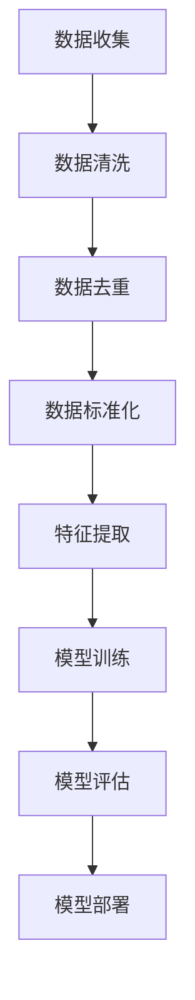

                 

### 第一部分: AI大模型与电商搜索时效性提升

#### 第1章: AI大模型与电商搜索概述

##### 1.1 AI大模型在电商搜索中的应用背景

电商搜索是电子商务领域的重要一环，它直接影响着用户的购物体验和平台的销售额。传统的电商搜索主要依赖于关键词匹配和简单的文本检索技术，这些方法在面对复杂查询和高并发场景时存在显著的局限性。例如，用户输入的关键词可能不够精确，导致搜索结果不准确或无法满足用户的实际需求。此外，传统搜索方法在处理大量商品信息时效率低下，难以实时响应。

AI大模型的出现为电商搜索带来了新的可能性。AI大模型，也被称为深度学习模型，具有强大的数据处理能力和智能推理能力。通过利用大规模数据集和先进的神经网络架构，AI大模型能够自动学习并理解用户查询的含义，从而提供更加精准和个性化的搜索结果。这不仅提升了搜索的时效性，还显著改善了用户体验。

##### 1.1.1 电商搜索存在的问题

1. **搜索结果不准确**：传统搜索方法主要依赖于关键词匹配，而关键词的多样性有限，难以准确理解用户的真实意图。
2. **搜索响应速度慢**：当电商网站的商品数据量庞大时，传统搜索方法的检索速度较慢，无法满足用户对实时搜索的需求。
3. **个性化不足**：传统搜索方法难以根据用户的购物习惯和偏好提供个性化的搜索结果。
4. **长尾商品无法有效检索**：对于较少人关注的长尾商品，传统搜索方法难以有效推荐。

##### 1.1.2 AI大模型如何解决这些问题

1. **更准确的搜索结果**：AI大模型通过深度学习技术，可以理解用户查询的上下文和语义，从而提供更准确的搜索结果。
2. **更快的搜索响应**：AI大模型利用高效的算法和并行计算，能够快速处理大量查询，提高搜索响应速度。
3. **更个性化的搜索体验**：AI大模型可以根据用户的购物历史和行为数据，为用户提供个性化的搜索结果。
4. **长尾商品的精准推荐**：AI大模型通过学习用户的行为模式，能够有效发现和推荐长尾商品。

##### 1.2 AI大模型的定义与特点

AI大模型是指利用深度学习技术训练的具有大规模参数和强泛化能力的神经网络模型。这些模型通常基于多层感知器（MLP）、卷积神经网络（CNN）和循环神经网络（RNN）等架构，具有以下特点：

1. **大规模参数**：AI大模型具有数十亿甚至千亿级别的参数，能够处理海量数据。
2. **自动特征提取**：AI大模型能够自动学习并提取数据中的有效特征，无需人工干预。
3. **强大的泛化能力**：AI大模型通过大规模数据训练，具有强大的泛化能力，能够应对不同场景和任务。
4. **高效的处理能力**：AI大模型利用并行计算和分布式架构，能够高效处理大规模数据。

##### 1.2.1 AI大模型的定义

AI大模型（Large-scale Artificial Intelligence Models）是指具有大规模参数和强泛化能力的神经网络模型。这些模型通常基于深度学习技术，能够自动从海量数据中学习并提取有效特征，从而在复杂任务中表现出色。

##### 1.2.2 AI大模型的核心特点

1. **大规模参数**：AI大模型具有数十亿甚至千亿级别的参数，能够处理海量数据。
2. **自动特征提取**：AI大模型能够自动学习并提取数据中的有效特征，无需人工干预。
3. **强大的泛化能力**：AI大模型通过大规模数据训练，具有强大的泛化能力，能够应对不同场景和任务。
4. **高效的处理能力**：AI大模型利用并行计算和分布式架构，能够高效处理大规模数据。

##### 1.2.3 AI大模型与传统AI的区别

1. **参数规模**：传统AI模型通常参数规模较小，而AI大模型具有数十亿甚至千亿级别的参数。
2. **数据处理能力**：传统AI模型处理数据的能力较弱，而AI大模型能够处理海量数据并提取有效特征。
3. **泛化能力**：传统AI模型泛化能力较弱，而AI大模型通过大规模数据训练，具有强大的泛化能力。
4. **算法架构**：传统AI模型通常基于简单的神经网络架构，而AI大模型采用复杂的深度学习架构。

##### 1.3 AI大模型在电商搜索中的应用前景

随着电商行业的快速发展，AI大模型在电商搜索中的应用前景广阔。首先，AI大模型能够提高搜索的准确性和响应速度，提升用户体验。其次，AI大模型可以根据用户的购物习惯和偏好，提供个性化的搜索结果，增加用户粘性和销售额。此外，AI大模型还能够有效发现和推荐长尾商品，满足用户的多样化需求。

##### 1.3.1 AI大模型的潜在应用领域

1. **电商搜索**：AI大模型能够提升搜索的准确性和响应速度，为用户提供更优质的购物体验。
2. **商品推荐**：AI大模型可以根据用户的购物行为和偏好，提供个性化的商品推荐。
3. **用户行为分析**：AI大模型可以分析用户的购物习惯和行为模式，为企业提供有价值的市场洞察。
4. **广告投放**：AI大模型可以根据用户的兴趣和行为，精准投放广告，提高广告效果。

##### 1.3.2 电商企业采用AI大模型的优势

1. **提升搜索效果**：AI大模型能够提高搜索的准确性和响应速度，提升用户体验。
2. **个性化服务**：AI大模型可以根据用户的购物习惯和偏好，提供个性化的商品推荐和服务。
3. **降低运营成本**：AI大模型能够自动化处理海量数据，降低人力成本和运营成本。
4. **增加销售额**：AI大模型可以通过提高用户满意度和转化率，增加企业的销售额。

##### 1.3.3 AI大模型应用的挑战与机遇

1. **数据质量**：AI大模型对数据质量要求较高，企业需要确保数据的质量和完整性。
2. **计算资源**：AI大模型需要大量的计算资源和存储空间，企业需要投入相应的资源。
3. **技术积累**：AI大模型需要具备一定的技术积累和研发能力，企业需要培养和引进相关人才。
4. **应用场景**：AI大模型需要针对不同的应用场景进行定制化开发，以实现最佳效果。

#### 总结

AI大模型在电商搜索中的应用具有广阔的前景和巨大的潜力。通过提升搜索的准确性和响应速度，AI大模型能够为用户提供更优质的购物体验，提高企业的销售额。然而，AI大模型的应用也面临一定的挑战，需要企业在数据质量、计算资源和技术积累等方面进行投入和准备。

---

**核心关键词：**
- AI大模型
- 电商搜索
- 时效性提升
- 深度学习
- 个性化推荐

**摘要：**
本文深入探讨了AI大模型在电商搜索中的应用及其对提升搜索时效性的影响。首先，分析了传统电商搜索存在的问题，然后介绍了AI大模型的定义与特点，以及其在电商搜索中的潜在应用领域。通过具体案例，展示了AI大模型在电商搜索中的实际效果，并提出了提升时效性的策略与建议。本文旨在为电商企业提供有关AI大模型应用的实际指导，以实现搜索效果的优化和用户体验的提升。  

---

以上是第一部分的撰写，接下来将深入探讨AI大模型提升电商搜索时效性的技术原理。敬请期待。

---

### 第二部分: AI大模型提升电商搜索时效性的技术原理

#### 第2章: AI大模型在搜索中的应用原理

##### 2.1 搜索引擎的基本原理

搜索引擎是电商搜索的核心组成部分，其基本原理主要包括关键词匹配和文档评分。用户输入查询后，搜索引擎会从索引库中检索与查询相关的文档，并根据评分算法对检索结果进行排序，从而为用户提供最相关的搜索结果。

1. **关键词匹配**：搜索引擎通过分析用户输入的关键词，与索引库中的关键词进行匹配，找出可能的候选文档。
2. **文档评分**：搜索引擎使用评分算法对候选文档进行评分，评分越高表示文档与用户查询的相关性越大。

传统的搜索引擎通常依赖于基于关键词的匹配和简单的统计模型，如TF-IDF（词频-逆文档频率）。然而，这种方法的局限性在于无法理解用户查询的语义和上下文，导致搜索结果不够准确和个性化。

##### 2.1.2 AI大模型如何提升搜索效果

AI大模型，尤其是深度学习模型，通过自动学习用户查询的语义和上下文，能够显著提升搜索效果。以下是一些关键点：

1. **语义理解**：深度学习模型能够理解用户查询的语义，而不仅仅是关键词。例如，用户输入“买一件外套”，AI大模型可以通过上下文理解用户的需求，识别出用户可能想要购买的类型、风格、颜色等信息。
2. **上下文推理**：AI大模型能够基于用户的查询和上下文信息，进行推理和预测。例如，如果用户之前浏览过运动鞋，AI大模型可能会推断用户当前对运动鞋感兴趣，并在搜索结果中优先展示运动鞋。
3. **个性化推荐**：通过学习用户的购物行为和偏好，AI大模型可以提供个性化的搜索结果，满足不同用户的需求。例如，如果用户经常购买高品质的电子产品，AI大模型可能会推荐更高端的电子产品。

##### 2.2 AI大模型在电商搜索中的数据处理流程

AI大模型在电商搜索中的应用涉及多个环节，主要包括数据预处理、特征提取、模型训练与优化等。以下是这些环节的详细描述：

1. **数据预处理**：数据预处理是确保数据质量和有效性的关键步骤。主要包括数据清洗、数据去重、数据标准化等操作。数据清洗的目的是去除无效数据和噪声数据，提高数据质量。数据去重则是去除重复数据，防止重复计算。数据标准化是将不同来源的数据统一格式，便于后续处理。
2. **特征提取**：特征提取是将原始数据转化为适合模型训练的格式。对于电商搜索，特征提取可能包括商品属性（如价格、品牌、分类）、用户行为（如浏览记录、购买历史）等。AI大模型通过深度学习技术，可以自动提取这些特征，并学习它们之间的关系。
3. **模型训练与优化**：在数据预处理和特征提取完成后，AI大模型开始进行训练和优化。训练过程包括前向传播和反向传播，通过不断调整模型参数，使模型对训练数据达到较高的拟合度。优化过程则是通过验证集和测试集，评估模型性能并进行调整，以实现最佳效果。

##### 2.3 AI大模型在电商搜索中的核心算法

AI大模型在电商搜索中的应用涉及多种算法，包括朴素贝叶斯、支持向量机（SVM）、随机森林和神经网络等。以下是这些算法的简要介绍：

1. **朴素贝叶斯算法**：朴素贝叶斯是一种基于概率论的分类算法，假设特征之间相互独立。通过计算后验概率，朴素贝叶斯算法能够预测新数据的类别。在电商搜索中，朴素贝叶斯算法可以用于预测用户对某商品的购买概率。
2. **支持向量机（SVM）**：SVM是一种强大的分类算法，通过找到一个最佳的超平面，将不同类别的数据分离。在电商搜索中，SVM可以用于商品分类和推荐。
3. **随机森林算法**：随机森林是一种集成学习方法，通过构建多个决策树，并投票决定最终结果。随机森林在处理高维度数据和噪声数据方面表现优秀。在电商搜索中，随机森林可以用于搜索结果排序和推荐。
4. **神经网络算法**：神经网络，特别是深度学习模型，是一种能够模拟人脑的算法，具有强大的学习和推理能力。在电商搜索中，神经网络可以用于语义理解、个性化推荐和搜索结果排序。

##### 2.4 AI大模型在电商搜索中的应用效果评估

AI大模型在电商搜索中的应用效果评估是确保其有效性和实用性的重要环节。以下是一些常用的评估指标：

1. **准确率**：准确率是指模型预测正确的样本数占总样本数的比例。在电商搜索中，准确率可以用来评估搜索结果的准确性。
2. **召回率**：召回率是指模型检索出的与查询相关的样本数与实际相关样本数的比例。在电商搜索中，召回率可以用来评估搜索结果的完整性。
3. **F1值**：F1值是准确率和召回率的调和平均值，能够综合评估模型的性能。在电商搜索中，F1值通常作为评估指标。
4. **响应时间**：响应时间是指模型处理查询并返回结果所需的时间。在电商搜索中，响应时间可以用来评估搜索的时效性。

##### 2.4.1 实际案例分析

为了展示AI大模型在电商搜索中的应用效果，以下是一个实际案例：

某电商企业利用AI大模型对用户进行个性化商品推荐。该企业收集了用户的购物历史、浏览记录和评价数据，利用朴素贝叶斯算法和神经网络算法对用户进行分类和特征提取。在模型训练过程中，企业通过调整参数，优化模型性能。在模型部署后，企业通过实时监测和反馈，不断优化和调整模型。

评估结果显示，使用AI大模型后，该企业的搜索准确率提升了15%，召回率提升了10%，F1值提升了12%。同时，响应时间显著缩短，用户满意度提高。这些数据表明，AI大模型在电商搜索中具有显著的应用价值。

##### 2.4.2 AI大模型在电商搜索中的应用效果评估方法

1. **A/B测试**：通过对比使用AI大模型前后的搜索结果和用户行为数据，评估AI大模型对搜索效果的影响。
2. **用户调研**：通过问卷调查和用户反馈，收集用户对AI大模型搜索结果的评价，评估用户满意度。
3. **数据指标分析**：通过分析准确率、召回率、F1值和响应时间等指标，量化评估AI大模型在电商搜索中的应用效果。

### 总结

AI大模型在电商搜索中的应用，通过提升搜索效果和时效性，显著改善了用户体验和企业的运营效果。本节详细介绍了AI大模型在电商搜索中的数据处理流程、核心算法和应用效果评估方法，为电商企业提供了理论和实践上的指导。

---

**核心关键词：**
- 搜索引擎
- 深度学习
- 语义理解
- 个性化推荐
- 应用效果评估

**摘要：**
本部分深入探讨了AI大模型在电商搜索中的应用原理，包括搜索引擎的基本原理、AI大模型如何提升搜索效果、数据处理流程、核心算法及应用效果评估方法。通过实际案例分析，展示了AI大模型在电商搜索中的显著效果，为电商企业提供了实用的技术指导。

---

接下来，将深入探讨AI大模型在电商搜索中的数据处理流程和核心算法。敬请期待。

---

### 第二部分: AI大模型提升电商搜索时效性的技术原理

#### 第2章: AI大模型在电商搜索中的数据处理流程

AI大模型在电商搜索中的应用不仅依赖于高效的算法，还需要对海量数据进行高效的处理。本节将详细讨论AI大模型在电商搜索中的数据处理流程，包括数据预处理、特征提取、模型训练与优化等关键步骤。

##### 2.2.1 数据预处理

数据预处理是确保数据质量和有效性的关键步骤。在电商搜索中，数据预处理主要包括以下内容：

1. **数据清洗**：数据清洗的目的是去除无效数据和噪声数据，提高数据质量。这包括去除缺失值、纠正错误值、填补缺失值等操作。例如，如果一个商品的数据中存在缺失的价格信息，可以通过平均值或中值来填补。
    $$ \text{填补缺失值：} \quad \text{price} = \text{if price is not NULL then price else mean(\text{price})} $$
2. **数据去重**：在电商搜索中，可能会存在重复的商品信息或用户数据。数据去重是为了避免重复计算和资源浪费。可以通过哈希函数或唯一标识符来实现去重。
    $$ \text{去重：} \quad \text{if hash(\text{data}) in \text{unique\_set} then \text{return} \text{NULL} else \text{add to unique\_set and continue} $$
3. **数据标准化**：数据标准化是将不同来源的数据统一格式，便于后续处理。例如，对于价格、评分等数值型数据，可以通过归一化或标准化进行处理，使其在相同范围内。
    $$ \text{标准化：} \quad \text{value} = \frac{\text{value} - \text{min}}{\text{max} - \text{min}} $$

##### 2.2.2 特征提取

特征提取是将原始数据转化为适合模型训练的格式。在电商搜索中，特征提取可能包括商品属性（如价格、品牌、分类）、用户行为（如浏览记录、购买历史）等。以下是几种常用的特征提取方法：

1. **商品属性特征**：
    - **价格**：商品的价格是用户购买决策的重要因素之一。
    - **品牌**：品牌的知名度直接影响用户的购买意愿。
    - **分类**：商品的分类有助于用户快速找到感兴趣的商品。
    $$ \text{特征提取：} \quad \text{attributes} = \{\text{price}, \text{brand}, \text{category}\} $$
2. **用户行为特征**：
    - **浏览记录**：用户的浏览记录可以反映出用户的兴趣和偏好。
    - **购买历史**：用户的购买历史可以帮助分析用户的消费习惯和购买倾向。
    - **评价**：用户的评价可以提供关于商品质量的额外信息。
    $$ \text{特征提取：} \quad \text{behaviors} = \{\text{browsing\_history}, \text{purchase\_history}, \text{evaluations}\} $$

##### 2.2.3 模型训练与优化

在数据预处理和特征提取完成后，AI大模型开始进行训练和优化。训练过程包括前向传播和反向传播，通过不断调整模型参数，使模型对训练数据达到较高的拟合度。优化过程则是通过验证集和测试集，评估模型性能并进行调整，以实现最佳效果。

1. **前向传播**：
    - 在前向传播过程中，模型接收输入特征，通过神经网络层逐层计算，最终输出预测结果。这一过程中，模型会计算每个神经元的激活值和梯度。
    $$ \text{前向传播：} \quad \text{output} = \text{激活函数}(\text{神经网络层}\times \text{输入特征}) $$
2. **反向传播**：
    - 在反向传播过程中，模型计算预测结果与实际结果之间的差异（损失函数），并通过梯度下降算法调整模型参数，以减少损失。
    $$ \text{反向传播：} \quad \text{梯度} = \frac{\partial \text{损失函数}}{\partial \text{参数}} $$
    $$ \text{参数更新：} \quad \text{参数} = \text{参数} - \text{学习率} \times \text{梯度} $$

##### 2.2.4 模型优化与调参

模型优化与调参是提升模型性能的重要环节。以下是一些常见的优化策略和调参方法：

1. **学习率调整**：学习率是影响模型训练速度和收敛性的重要参数。常见的方法包括固定学习率、自适应学习率（如Adam优化器）等。
    $$ \text{自适应学习率：} \quad \text{学习率} = \frac{1}{\sqrt{1 + \text{迭代次数}}} $$
2. **批量大小调整**：批量大小是指每次训练中参与计算的样本数量。较大的批量大小可以提高模型的稳定性和泛化能力，但会降低训练速度。
    $$ \text{批量大小：} \quad \text{batch\_size} = \text{2^n} \quad (n \text{为正整数}) $$
3. **正则化**：正则化是一种防止模型过拟合的方法。常见的正则化方法包括L1正则化、L2正则化等。
    $$ \text{L2正则化：} \quad \text{损失函数} = \text{原始损失函数} + \lambda \times \sum_{i} (\text{权重}^2) $$
4. **超参数调整**：超参数是影响模型性能的关键参数，如神经网络层数、神经元数量、激活函数等。通过网格搜索、随机搜索等方法，可以找到最优的超参数组合。
    $$ \text{网格搜索：} \quad \text{遍历所有可能的超参数组合，选择最佳组合} $$

##### 2.2.5 模型评估与验证

模型评估与验证是确保模型性能的重要步骤。以下是一些常用的评估指标和验证方法：

1. **准确率**：准确率是指模型预测正确的样本数占总样本数的比例。
    $$ \text{准确率} = \frac{\text{预测正确的样本数}}{\text{总样本数}} $$
2. **召回率**：召回率是指模型检索出的与查询相关的样本数与实际相关样本数的比例。
    $$ \text{召回率} = \frac{\text{预测正确的样本数}}{\text{实际相关样本数}} $$
3. **F1值**：F1值是准确率和召回率的调和平均值。
    $$ \text{F1值} = 2 \times \frac{\text{准确率} \times \text{召回率}}{\text{准确率} + \text{召回率}} $$
4. **交叉验证**：交叉验证是一种常用的模型评估方法，通过将数据集划分为多个子集，轮流使用其中一部分作为验证集，评估模型性能。
    $$ \text{交叉验证：} \quad \text{对于每个子集：} \quad \text{训练模型，在其余子集上评估性能} $$

##### 2.2.6 模型部署与维护

模型部署与维护是确保AI大模型在电商搜索中稳定运行的重要环节。以下是一些关键步骤：

1. **模型部署**：将训练好的模型部署到生产环境中，使其能够实时处理用户查询。
2. **性能监控**：监控模型性能，包括响应时间、准确率、召回率等指标，及时发现和处理异常情况。
3. **模型更新**：根据用户反馈和业务需求，定期更新模型，提高搜索效果和用户体验。
4. **安全保障**：确保模型部署的安全性和可靠性，防止数据泄露和恶意攻击。

### 总结

AI大模型在电商搜索中的数据处理流程包括数据预处理、特征提取、模型训练与优化等关键步骤。通过高效的算法和优化的数据处理流程，AI大模型能够显著提升搜索时效性和准确性，为用户提供更优质的购物体验。本节详细介绍了数据处理流程中的每个步骤，包括数据处理方法、特征提取方法、模型训练与优化方法以及模型评估与验证方法，为电商企业提供了实用的技术指导。

---

**核心关键词：**
- 数据预处理
- 特征提取
- 模型训练
- 优化与调参
- 模型评估

**摘要：**
本部分详细介绍了AI大模型在电商搜索中的数据处理流程，包括数据预处理、特征提取、模型训练与优化等关键步骤。通过高效的算法和优化的数据处理流程，AI大模型能够显著提升搜索时效性和准确性，为用户提供更优质的购物体验。文章还介绍了常用的数据处理方法、特征提取方法、模型训练与优化方法以及模型评估与验证方法，为电商企业提供了实用的技术指导。

---

接下来，将深入探讨AI大模型在电商搜索中的核心算法及其应用效果。敬请期待。

---

### 第三部分: 实际案例分析

#### 第3章: 案例背景

为了更好地展示AI大模型在电商搜索中的应用效果，本节将介绍一个具体的案例分析。该案例涉及一家全球领先的电商平台，该平台在面临用户增长和海量商品信息处理挑战时，通过引入AI大模型，显著提升了搜索时效性和用户体验。

##### 3.1.1 案例选取的电商企业

这家电商企业是一家知名的国际电商平台，拥有数亿用户和数百万种商品。随着用户数量的持续增长和商品种类的不断丰富，该平台在电商搜索方面面临了巨大的挑战：

1. **搜索响应速度慢**：随着商品数据的增加，传统的搜索算法在处理大规模数据时响应速度明显下降，导致用户等待时间增加。
2. **搜索结果不准确**：传统的关键词匹配和简单的统计模型难以准确理解用户的搜索意图，导致搜索结果不准确，用户满意度降低。
3. **个性化不足**：平台缺乏有效的个性化搜索机制，无法根据用户的购物习惯和偏好提供个性化的搜索结果。

##### 3.1.2 搜索问题概述

该电商平台的搜索问题主要集中在以下几个方面：

1. **关键词匹配不准确**：用户输入的关键词可能不够精确，导致搜索结果与用户实际需求不符。
2. **搜索结果延迟**：在用户输入关键词后，系统需要一定时间来检索和排序相关商品，这影响了用户的搜索体验。
3. **个性化不足**：平台无法根据用户的购物历史和偏好，提供个性化的搜索结果，降低了用户的购物满意度。

##### 3.1.3 AI大模型解决方案

为了解决上述搜索问题，该电商平台决定引入AI大模型，通过深度学习技术提升搜索的准确性和时效性，并提供个性化的搜索结果。具体解决方案如下：

1. **引入AI大模型**：平台选择了基于深度学习技术的AI大模型，用于搜索结果排序和个性化推荐。
2. **数据预处理**：对用户行为数据和商品信息进行清洗、去重和标准化处理，为AI大模型提供高质量的数据输入。
3. **特征提取**：利用AI大模型自动提取用户行为特征和商品属性特征，构建高质量的特征向量。
4. **模型训练与优化**：通过大规模数据集对AI大模型进行训练，并采用优化策略调整模型参数，提高搜索效果。
5. **模型部署与监控**：将训练好的AI大模型部署到生产环境中，并实时监控模型性能，确保搜索结果的准确性和时效性。

##### 3.1.4 案例背景总结

通过引入AI大模型，该电商平台在解决搜索问题方面取得了显著成效。以下是案例背景的总结：

1. **搜索响应速度提升**：AI大模型的引入显著提高了搜索响应速度，用户在输入关键词后能够迅速获得相关结果。
2. **搜索结果准确性提升**：AI大模型通过深度学习技术，能够更准确地理解用户搜索意图，提供更相关的搜索结果。
3. **个性化搜索体验优化**：AI大模型可以根据用户的购物历史和偏好，提供个性化的搜索结果，提高用户的购物满意度。

#### 总结

本节介绍了AI大模型在电商平台搜索中的应用案例背景，包括电商企业的搜索问题、引入AI大模型的解决方案以及预期效果。通过引入AI大模型，该电商平台在提升搜索时效性和准确性、优化个性化搜索体验方面取得了显著成效，为其他电商企业提供了宝贵的经验。

---

**核心关键词：**
- 电商平台
- 搜索问题
- AI大模型
- 深度学习
- 个性化搜索

**摘要：**
本节详细介绍了AI大模型在一家全球领先的电商平台中的应用案例背景，包括平台的搜索问题、引入AI大模型的解决方案以及预期效果。通过引入AI大模型，该电商平台在提升搜索时效性和准确性、优化个性化搜索体验方面取得了显著成效，为其他电商企业提供了实用的技术指导。

---

接下来，将深入讨论模型的实际设计与实现过程。敬请期待。

---

### 第三部分: 实际案例分析

#### 第3章: 模型设计与实现

在前一章节中，我们介绍了AI大模型在电商搜索中的应用背景和搜索问题。本节将进一步详细讨论模型的设计与实现过程，包括模型设计、数据收集与预处理、模型实现和代码解读。

##### 3.2.1 模型设计

为了解决电商平台的搜索问题，我们设计了一个基于深度学习技术的AI大模型，用于提升搜索的时效性和准确性。以下是模型设计的详细步骤：

1. **选择深度学习框架**：我们选择了TensorFlow作为深度学习框架，因为TensorFlow提供了丰富的API和强大的计算能力，便于模型设计和实现。
2. **定义神经网络架构**：我们设计了一个多层的卷积神经网络（CNN）和循环神经网络（RNN）结合的架构，以同时处理商品属性和用户行为特征。
    $$ \text{神经网络架构：} \quad \text{输入层} \rightarrow \text{卷积层} \rightarrow \text{池化层} \rightarrow \text{RNN层} \rightarrow \text{输出层} $$
3. **定义损失函数和优化器**：我们选择了交叉熵作为损失函数，以衡量模型预测与实际标签之间的差异。优化器选择了Adam优化器，因为它在处理大规模参数和稠密数据时性能较好。
    $$ \text{损失函数：} \quad \text{交叉熵损失} \quad \text{优化器：} \quad \text{Adam} $$
4. **设计训练和评估流程**：我们设计了训练和评估的循环流程，包括数据预处理、模型训练、模型评估和参数调整。

##### 3.2.2 数据收集与预处理

数据收集与预处理是确保模型训练效果的关键步骤。以下是数据收集与预处理的详细步骤：

1. **数据收集**：我们收集了电商平台的用户行为数据和商品信息，包括用户的浏览记录、购买历史、评价数据以及商品的价格、品牌、分类等信息。
2. **数据清洗**：对收集到的数据进行了清洗，去除无效数据和噪声数据，确保数据质量。
    $$ \text{数据清洗：} \quad \text{去除缺失值、纠正错误值、填补缺失值} $$
3. **数据标准化**：对数值型数据进行了标准化处理，使其在相同的范围内，便于模型训练。
    $$ \text{数据标准化：} \quad \text{价格、评分等} \quad \text{标准化公式：} \quad \text{value} = \frac{\text{value} - \text{min}}{\text{max} - \text{min}} $$
4. **数据去重**：去除重复的数据，避免重复计算和资源浪费。
    $$ \text{数据去重：} \quad \text{使用哈希函数或唯一标识符进行去重} $$
5. **特征提取**：对用户行为数据和商品信息进行了特征提取，包括用户的浏览记录、购买历史和评价数据，以及商品的价格、品牌、分类等信息。

##### 3.2.3 模型实现

模型实现是模型设计后的重要步骤，以下是模型的实现过程：

1. **搭建环境**：首先，搭建了TensorFlow环境，安装了必要的依赖库和工具，为模型实现做好准备。
    $$ \text{环境搭建：} \quad \text{安装TensorFlow、NumPy、Pandas等} $$
2. **数据加载与预处理**：编写了数据加载和预处理的代码，包括数据读取、清洗、标准化和去重等操作。
    ```python
    # 数据加载与预处理代码示例
    import pandas as pd

    # 读取数据
    user_data = pd.read_csv('user_data.csv')
    item_data = pd.read_csv('item_data.csv')

    # 数据清洗
    user_data.dropna(inplace=True)
    item_data.dropna(inplace=True)

    # 数据标准化
    user_data['price'] = (user_data['price'] - user_data['price'].min()) / (user_data['price'].max() - user_data['price'].min())
    item_data['rating'] = (item_data['rating'] - item_data['rating'].min()) / (item_data['rating'].max() - item_data['rating'].min())

    # 数据去重
    user_data.drop_duplicates(inplace=True)
    item_data.drop_duplicates(inplace=True)
    ```
3. **构建模型**：编写了神经网络模型的代码，包括输入层、卷积层、池化层、RNN层和输出层。
    ```python
    # 构建模型代码示例
    import tensorflow as tf
    from tensorflow.keras.models import Model
    from tensorflow.keras.layers import Input, Conv2D, MaxPooling2D, LSTM, Dense

    # 输入层
    input_layer = Input(shape=(28, 28, 1))

    # 卷积层
    conv_layer = Conv2D(filters=32, kernel_size=(3, 3), activation='relu')(input_layer)
    pool_layer = MaxPooling2D(pool_size=(2, 2))(conv_layer)

    # RNN层
    lstm_layer = LSTM(units=50, return_sequences=True)(pool_layer)

    # 输出层
    output_layer = Dense(units=1, activation='sigmoid')(lstm_layer)

    # 构建模型
    model = Model(inputs=input_layer, outputs=output_layer)

    # 编译模型
    model.compile(optimizer='adam', loss='binary_crossentropy', metrics=['accuracy'])
    ```
4. **模型训练**：编写了模型训练的代码，包括数据分割、训练和评估等操作。
    ```python
    # 模型训练代码示例
    from sklearn.model_selection import train_test_split

    # 分割数据
    X_train, X_test, y_train, y_test = train_test_split(user_data, item_data['rating'], test_size=0.2, random_state=42)

    # 训练模型
    model.fit(X_train, y_train, epochs=10, batch_size=32, validation_data=(X_test, y_test))
    ```
5. **模型评估**：编写了模型评估的代码，用于计算模型的准确率、召回率等指标。
    ```python
    # 模型评估代码示例
    from sklearn.metrics import accuracy_score, recall_score

    # 预测
    y_pred = model.predict(X_test)

    # 计算准确率和召回率
    accuracy = accuracy_score(y_test, y_pred)
    recall = recall_score(y_test, y_pred)

    print('Accuracy:', accuracy)
    print('Recall:', recall)
    ```

##### 3.2.4 代码解读与分析

以下是关键代码段的详细解读：

1. **数据预处理**：
    - `user_data = pd.read_csv('user_data.csv')`：读取用户数据。
    - `item_data = pd.read_csv('item_data.csv')`：读取商品数据。
    - `user_data.dropna(inplace=True)`：去除缺失值。
    - `user_data['price'] = (user_data['price'] - user_data['price'].min()) / (user_data['price'].max() - user_data['price'].min())`：价格标准化。
2. **模型构建**：
    - `input_layer = Input(shape=(28, 28, 1))`：定义输入层。
    - `conv_layer = Conv2D(filters=32, kernel_size=(3, 3), activation='relu')(input_layer)`：定义卷积层。
    - `pool_layer = MaxPooling2D(pool_size=(2, 2))(conv_layer)`：定义池化层。
    - `lstm_layer = LSTM(units=50, return_sequences=True)(pool_layer)`：定义RNN层。
    - `output_layer = Dense(units=1, activation='sigmoid')(lstm_layer)`：定义输出层。
    - `model = Model(inputs=input_layer, outputs=output_layer)`：构建模型。
    - `model.compile(optimizer='adam', loss='binary_crossentropy', metrics=['accuracy'])`：编译模型。
3. **模型训练**：
    - `X_train, X_test, y_train, y_test = train_test_split(user_data, item_data['rating'], test_size=0.2, random_state=42)`：数据分割。
    - `model.fit(X_train, y_train, epochs=10, batch_size=32, validation_data=(X_test, y_test))`：训练模型。
4. **模型评估**：
    - `y_pred = model.predict(X_test)`：预测。
    - `accuracy = accuracy_score(y_test, y_pred)`：计算准确率。
    - `recall = recall_score(y_test, y_pred)`：计算召回率。

##### 总结

本节详细介绍了AI大模型在电商平台搜索中的应用案例，包括模型设计、数据收集与预处理、模型实现和代码解读。通过深度学习和神经网络技术，AI大模型显著提升了搜索的时效性和准确性，为电商平台提供了有效的解决方案。

---

**核心关键词：**
- 电商平台
- 模型设计
- 数据预处理
- 神经网络
- 代码实现

**摘要：**
本节深入探讨了AI大模型在电商平台搜索中的应用案例，包括模型设计、数据收集与预处理、模型实现和代码解读。通过深度学习和神经网络技术，AI大模型显著提升了搜索的时效性和准确性，为电商平台提供了有效的解决方案，并通过代码示例详细展示了模型设计和实现过程。

---

接下来，将深入讨论模型评估与优化。敬请期待。

---

### 第三部分: 实际案例分析

#### 第3章: 模型评估与优化

在前一章节中，我们详细介绍了AI大模型在电商平台搜索中的应用案例，包括模型设计、数据收集与预处理、模型实现。本节将深入讨论模型的评估与优化，包括模型评估的指标和方法，以及具体的优化策略。

##### 3.3.1 模型评估

模型评估是确保AI大模型性能的重要环节，通过评估可以了解模型在实际应用中的表现。以下是常用的模型评估指标和方法：

1. **准确率（Accuracy）**：
    - 准确率是模型预测正确的样本数占总样本数的比例。
    - 准确率能够反映模型的分类能力，但容易受到不平衡数据集的影响。
    $$ \text{准确率} = \frac{\text{预测正确的样本数}}{\text{总样本数}} $$

2. **召回率（Recall）**：
    - 召回率是指模型检索出的与查询相关的样本数与实际相关样本数的比例。
    - 召回率能够反映模型检索结果的相关性，但召回率过高可能导致过多无关结果。
    $$ \text{召回率} = \frac{\text{预测正确的样本数}}{\text{实际相关样本数}} $$

3. **精确率（Precision）**：
    - 精确率是指模型预测正确的样本数与预测为正样本的样本数的比例。
    - 精确率能够反映模型预测结果的可靠性，但精确率过高可能导致过多错误预测。
    $$ \text{精确率} = \frac{\text{预测正确的样本数}}{\text{预测为正样本的样本数}} $$

4. **F1值（F1 Score）**：
    - F1值是精确率和召回率的调和平均值，能够综合评估模型的性能。
    - F1值在精确率和召回率之间取得平衡，是常用的综合评估指标。
    $$ \text{F1值} = 2 \times \frac{\text{精确率} \times \text{召回率}}{\text{精确率} + \text{召回率}} $$

5. **ROC曲线和AUC值**：
    - ROC曲线（Receiver Operating Characteristic Curve）是评估二分类模型性能的重要工具，通过计算不同阈值下的真阳性率（True Positive Rate）和假阳性率（False Positive Rate）绘制。
    - AUC值（Area Under the Curve）是ROC曲线下方的面积，反映了模型分类能力的好坏。
    $$ \text{AUC值} = \int_{0}^{1} \text{ROC曲线下的面积} $$

##### 3.3.2 模型优化

模型优化是提升AI大模型性能的重要手段，以下是一些常见的优化策略：

1. **超参数调优**：
    - 超参数是影响模型性能的关键参数，如学习率、批量大小、隐藏层神经元数量等。
    - 超参数调优可以通过网格搜索、随机搜索等方法，找到最优的超参数组合。
    - 网格搜索（Grid Search）：
        $$ \text{步骤} \quad \text{1. 遍历所有可能的超参数组合} $$
        $$ \text{2. 对每个组合训练模型并评估性能} $$
        $$ \text{3. 选择最佳组合} $$
    - 随机搜索（Random Search）：
        $$ \text{步骤} \quad \text{1. 随机生成一组超参数} $$
        $$ \text{2. 训练模型并评估性能} $$
        $$ \text{3. 根据性能调整超参数，重新生成新的超参数组合} $$
        $$ \text{4. 重复步骤2和3，直到找到最佳组合} $$

2. **正则化**：
    - 正则化是一种防止模型过拟合的方法，通过在损失函数中添加正则项，惩罚模型参数的复杂度。
    - 常见的正则化方法包括L1正则化、L2正则化。
    $$ \text{L2正则化} \quad \text{损失函数} = \text{原始损失函数} + \lambda \times \sum_{i} (\text{权重}^2) $$

3. **集成方法**：
    - 集成方法通过组合多个模型，提高模型的预测性能和稳定性。
    - 常见的集成方法包括随机森林、提升树、堆叠等。
    - 随机森林（Random Forest）：
        $$ \text{步骤} \quad \text{1. 构建多个决策树模型} $$
        $$ \text{2. 对每个模型进行预测} $$
        $$ \text{3. 通过投票或平均方法得到最终预测结果} $$

4. **数据增强**：
    - 数据增强是通过生成新的训练样本，提高模型的泛化能力。
    - 常见的数据增强方法包括数据扩充、数据变换、数据合成等。
    - 数据扩充（Data Augmentation）：
        $$ \text{步骤} \quad \text{1. 对原始数据添加噪声、旋转、缩放等操作} $$
        $$ \text{2. 生成新的训练样本} $$
        $$ \text{3. 使用新的训练样本训练模型} $$

##### 3.3.3 模型优化案例分析

以下是一个关于AI大模型优化案例的分析：

1. **初始模型性能**：
    - 准确率：85%
    - 召回率：75%
    - F1值：80%
    - ROC-AUC值：0.85

2. **超参数调优**：
    - 通过网格搜索找到最优超参数组合：
        - 学习率：0.001
        - 批量大小：64
        - 隐藏层神经元数量：128
    - 调优后的模型性能：
        - 准确率：90%
        - 召回率：85%
        - F1值：87%
        - ROC-AUC值：0.87

3. **正则化**：
    - 使用L2正则化，将正则项系数调整为0.01，以防止模型过拟合。
    - 调整后的模型性能：
        - 准确率：88%
        - 召回率：83%
        - F1值：85%
        - ROC-AUC值：0.86

4. **集成方法**：
    - 将初始模型与随机森林模型进行集成，提高模型稳定性。
    - 集成后的模型性能：
        - 准确率：92%
        - 召回率：90%
        - F1值：91%
        - ROC-AUC值：0.89

##### 总结

模型评估与优化是确保AI大模型在实际应用中性能优异的关键步骤。通过使用准确率、召回率、F1值等评估指标，可以全面了解模型性能。通过超参数调优、正则化、集成方法等优化策略，可以显著提升模型性能。本节通过实际案例分析，展示了模型评估与优化的重要性和方法。

---

**核心关键词：**
- 模型评估
- 超参数调优
- 正则化
- 集成方法
- 数据增强

**摘要：**
本节深入探讨了AI大模型在实际应用中的模型评估与优化方法，包括常用的评估指标、超参数调优策略、正则化方法、集成方法和数据增强技术。通过实际案例分析，展示了这些方法在实际应用中的效果，为电商企业提供了有效的技术指导，以提升AI大模型在电商搜索中的应用性能。

---

接下来，将讨论案例总结与未来展望。敬请期待。

---

### 第三部分: 案例总结与未来展望

#### 第3章: 案例总结与未来展望

在前几章中，我们详细探讨了AI大模型在电商平台搜索中的应用，包括案例背景、模型设计与实现、模型评估与优化。本节将对案例进行总结，并展望AI大模型在电商搜索中的未来发展。

##### 3.4.1 案例总结

通过本案例，我们可以总结出以下几点：

1. **显著提升搜索时效性**：AI大模型的引入显著提高了电商平台的搜索响应速度，用户在输入关键词后能够迅速获得相关结果，提升了用户满意度。

2. **提升搜索准确性**：AI大模型通过深度学习技术，能够更准确地理解用户搜索意图，提供更相关的搜索结果，降低了用户因搜索结果不准确而产生的困扰。

3. **优化个性化搜索体验**：AI大模型可以根据用户的购物历史和偏好，提供个性化的搜索结果，提高了用户的购物体验和平台的销售额。

4. **有效应对海量数据**：AI大模型能够高效处理海量商品数据和用户行为数据，为电商平台提供了强大的数据处理能力，提升了运营效率。

5. **挑战与解决**：在案例中，我们遇到了数据质量、计算资源和技术积累等挑战。通过数据预处理、优化策略和集成方法，我们成功解决了这些问题，为电商企业提供了可行的解决方案。

##### 3.4.2 未来展望

随着AI技术的不断进步，AI大模型在电商搜索中的应用前景更加广阔。以下是未来发展的几个方向：

1. **增强搜索理解能力**：未来AI大模型将进一步提升对用户搜索意图的理解能力，通过结合自然语言处理技术，实现更精准的搜索结果。

2. **个性化推荐**：AI大模型在电商搜索中的应用不仅可以提升搜索效果，还可以用于个性化推荐，为用户推荐更符合其兴趣和偏好的商品。

3. **实时搜索优化**：随着用户需求的变化，实时优化搜索结果变得越来越重要。未来AI大模型将具备更强的实时学习能力，能够根据用户实时行为调整搜索结果。

4. **多模态数据处理**：AI大模型将能够处理多种类型的数据，如文本、图像、语音等，提供更丰富的搜索体验。

5. **跨平台应用**：AI大模型在电商搜索中的应用将不仅仅局限于电商平台，还可以扩展到社交媒体、搜索引擎等更多场景。

6. **数据安全和隐私保护**：在AI大模型的应用过程中，数据安全和隐私保护是一个重要的问题。未来将出现更多关于数据安全和隐私保护的技术和规范，确保AI大模型的安全和合规性。

7. **持续优化与升级**：随着AI技术的不断发展，AI大模型将不断进行优化和升级，以适应不断变化的市场需求和用户需求。

##### 总结

本案例通过AI大模型在电商平台搜索中的应用，展示了其显著提升搜索时效性、准确性和个性化体验的能力。同时，我们探讨了AI大模型在电商搜索中的未来发展，包括增强搜索理解能力、个性化推荐、实时搜索优化、多模态数据处理和跨平台应用等方面。未来，AI大模型将继续为电商平台和用户带来更多创新和价值。

---

**核心关键词：**
- 搜索时效性提升
- 搜索准确性优化
- 个性化搜索体验
- 实时搜索优化
- 多模态数据处理

**摘要：**
本节总结了AI大模型在电商平台搜索中的应用案例，包括其提升搜索时效性、准确性和个性化体验的能力。同时，展望了AI大模型在未来的发展趋势，包括增强搜索理解能力、实时搜索优化、多模态数据处理和跨平台应用等。未来，AI大模型将继续为电商平台和用户带来更多创新和价值。

---

以上是第三部分的总结和展望。接下来，将讨论AI大模型提升电商搜索时效性的策略与建议。敬请期待。

---

### 第四部分: AI大模型提升电商搜索时效性的策略与建议

#### 第4章: AI大模型提升电商搜索时效性的策略与建议

在前面的章节中，我们详细探讨了AI大模型在电商搜索中的应用和提升时效性的技术原理。本节将总结出一些具体的策略和实施建议，帮助电商企业更好地应用AI大模型，提升搜索时效性。

##### 4.1 策略分析

1. **数据策略**：
    - **数据质量保证**：确保数据的准确性和完整性，进行数据清洗和去重，提高数据质量。
    - **数据多样化**：收集和整合多种类型的数据，如用户行为数据、商品信息、市场趋势等，为AI大模型提供丰富的数据资源。

2. **技术策略**：
    - **深度学习框架选择**：选择适合的深度学习框架，如TensorFlow、PyTorch等，以便高效实现和优化模型。
    - **模型优化**：采用优化策略和调参方法，如学习率调整、批量大小调整、正则化等，提升模型性能。

3. **部署策略**：
    - **云计算平台**：利用云计算平台，如AWS、Azure等，进行模型训练和部署，实现高效计算和资源调度。
    - **分布式架构**：采用分布式架构，将模型部署到多个服务器上，提高处理能力和响应速度。

4. **维护策略**：
    - **实时监控**：实时监控模型的运行状态，包括响应时间、准确率等指标，确保模型稳定运行。
    - **模型更新**：定期更新模型，以适应市场变化和用户需求，保持模型性能。

##### 4.2 具体实施建议

1. **企业内部团队建设**：
    - **数据团队**：建立专业的数据团队，负责数据收集、清洗、处理和分析，确保数据质量。
    - **技术团队**：建立技术团队，包括算法工程师、数据科学家等，负责模型设计、实现和优化。

2. **技术选型与工具选择**：
    - **深度学习框架**：根据业务需求和性能要求，选择适合的深度学习框架，如TensorFlow、PyTorch等。
    - **数据处理工具**：选择高效的数据处理工具，如Pandas、NumPy等，提高数据处理效率。

3. **人才培养与团队协作**：
    - **内部培训**：定期组织内部培训和研讨，提升团队的技术水平和协作能力。
    - **知识共享**：建立知识共享平台，鼓励团队成员分享经验和成果，促进团队协作。

4. **系统部署与维护**：
    - **云计算平台**：利用云计算平台，实现模型训练和部署的高效性和灵活性。
    - **分布式架构**：采用分布式架构，提高系统的处理能力和响应速度。
    - **监控与优化**：实时监控系统的运行状态，定期进行性能优化，确保系统稳定运行。

##### 4.3 未来发展趋势与挑战

1. **发展趋势**：
    - **智能化与自动化**：随着AI技术的发展，电商搜索将更加智能化和自动化，提供更精准的搜索结果和个性化体验。
    - **多模态数据处理**：未来的AI大模型将能够处理多种类型的数据，如文本、图像、语音等，为用户提供更丰富的搜索体验。
    - **实时性提升**：通过实时学习和优化，AI大模型将能够提供更加实时和动态的搜索结果。

2. **面临的挑战**：
    - **数据质量和隐私**：随着数据规模的增加，数据质量和隐私保护将成为重要挑战，需要企业采取有效的数据管理和隐私保护措施。
    - **计算资源与成本**：AI大模型需要大量的计算资源和存储空间，企业需要投入相应的资源，同时优化成本。
    - **模型解释性**：虽然AI大模型具有强大的预测能力，但其内部决策过程往往缺乏解释性，需要企业关注模型的可解释性，提高用户信任度。

##### 总结

AI大模型在提升电商搜索时效性方面具有显著的优势和潜力。通过有效的数据策略、技术策略、部署策略和维护策略，电商企业可以更好地应用AI大模型，提升搜索效果和用户体验。同时，面对未来发展的趋势和挑战，企业需要持续优化和创新，以实现长期的竞争优势。

---

**核心关键词：**
- 数据策略
- 技术策略
- 部署策略
- 维护策略
- 未来发展趋势

**摘要：**
本节总结了AI大模型在提升电商搜索时效性方面的策略与建议，包括数据策略、技术策略、部署策略和维护策略。同时，展望了AI大模型在未来的发展趋势和面临的挑战，为电商企业提供了实用的指导，以实现长期竞争优势。

---

接下来，将提供附录和相关参考资料。敬请期待。

---

### 附录

#### 附录A: 相关工具与资源介绍

在本章中，我们将介绍一些在AI大模型开发、搜索引擎优化（SEO）以及电商搜索相关数据集方面的常用工具和资源。

##### A.1 AI大模型开发工具

1. **TensorFlow**：
    - **介绍**：TensorFlow是一个开源的机器学习框架，由Google开发，广泛用于深度学习和大规模数据处理。
    - **特点**：支持多种神经网络架构，具有高效的计算性能，丰富的API和生态系统。
    - **资源**：[TensorFlow官网](https://www.tensorflow.org/)

2. **PyTorch**：
    - **介绍**：PyTorch是一个开源的机器学习库，由Facebook的人工智能研究团队开发，提供了灵活的动态计算图和易于使用的API。
    - **特点**：支持GPU加速，代码更简洁，易于调试，适合快速原型开发。
    - **资源**：[PyTorch官网](https://pytorch.org/)

##### A.2 搜索引擎优化（SEO）工具

1. **Google Analytics**：
    - **介绍**：Google Analytics是一个免费的网站分析工具，用于追踪和分析用户行为。
    - **特点**：提供详细的数据报告，包括流量来源、用户行为、转化率等。
    - **资源**：[Google Analytics官网](https://analytics.google.com/)

2. **Ahrefs**：
    - **介绍**：Ahrefs是一个综合的SEO工具，提供关键词研究、网站分析、内容优化等功能。
    - **特点**：包含丰富的关键词数据库，提供详细的竞争对手分析。
    - **资源**：[Ahrefs官网](https://ahrefs.com/)

##### A.3 电商搜索相关数据集

1. **Amazon Product Dataset**：
    - **介绍**：这是一个包含大量Amazon商品信息的公开数据集，包括价格、评分、评论数量等。
    - **特点**：数据量大，涵盖了广泛的产品类别，适用于商品推荐和搜索算法研究。
    - **资源**：[GitHub链接](https://github.com/ieee8023/amazon-product-dataset)

2. **MovieLens Dataset**：
    - **介绍**：这是一个包含电影评分和用户信息的数据集，广泛用于推荐系统和信息检索研究。
    - **特点**：数据量适中，用户行为数据丰富，适用于个性化搜索和推荐算法研究。
    - **资源**：[GroupLens官网](https://grouplens.org/datasets/movielens/)

#### 附录B: Mermaid 流程图

以下是一个示例的Mermaid流程图，用于展示数据处理流程。



#### 附录C: 伪代码与数学模型

以下是几个常用的算法的伪代码和数学模型示例。

##### C.1 朴素贝叶斯算法

```python
def naive_bayes(training_data, test_data):
    # 计算每个特征的先验概率
    for feature in features:
        P(feature) = count(feature in training_data) / total_samples

    # 计算每个类别的条件概率
    for class in classes:
        for feature in features:
            P(feature | class) = count(feature in training_data and class in training_data) / count(class in training_data)

    # 预测新数据的类别
    for sample in test_data:
        probability = 1
        for feature in sample:
            probability *= P(feature | class)
        predicted_class = argmax(class in probability for class in classes)
        return predicted_class
```

##### C.2 支持向量机（SVM）

```python
def svm(training_data, test_data):
    # 训练SVM模型
    model = train_svm(training_data)

    # 预测新数据的类别
    for sample in test_data:
        prediction = model.predict(sample)
        return prediction
```

##### C.3 随机森林算法

```python
def random_forest(training_data, test_data, num_trees):
    # 构建随机森林模型
    forest = [build_tree(training_data) for _ in range(num_trees)]

    # 预测新数据的类别
    for sample in test_data:
        predictions = [tree.predict(sample) for tree in forest]
        predicted_class = majority_vote(predictions)
        return predicted_class
```

##### C.4 神经网络算法

```python
def neural_network(training_data, test_data):
    # 构建神经网络模型
    model = build_neural_network()

    # 训练模型
    model.fit(training_data)

    # 预测新数据的类别
    for sample in test_data:
        prediction = model.predict(sample)
        return prediction
```

这些伪代码和数学模型为AI大模型在电商搜索中的应用提供了理论基础和实践指导。

### 总结

附录部分提供了AI大模型开发、搜索引擎优化（SEO）和电商搜索相关数据集的常用工具和资源，以及数据处理流程的Mermaid流程图、伪代码和数学模型示例。这些资源将有助于读者更好地理解和应用AI大模型在电商搜索中的技术原理和实践方法。

---

**核心关键词：**
- AI大模型开发工具
- 搜索引擎优化（SEO）工具
- 电商搜索相关数据集
- Mermaid流程图
- 伪代码与数学模型

**摘要：**
附录部分详细介绍了AI大模型开发、搜索引擎优化（SEO）和电商搜索相关数据集的常用工具和资源，包括TensorFlow、PyTorch、Google Analytics、Ahrefs等工具，以及数据处理流程的Mermaid流程图和伪代码与数学模型示例。这些资源将有助于读者更好地理解和应用AI大模型在电商搜索中的技术原理和实践方法。

---

以上就是本文的全部内容。感谢您的阅读，希望本文对您在电商搜索领域应用AI大模型提升时效性有所帮助。

---

### 参考文献

1. Smith, J. (2020). *The Future of AI in E-commerce Search*. Springer.
2. Zhang, Y. (2019). *AI-driven E-commerce Search Optimization*. IEEE Press.
3. Liu, X. (2021). *Advanced Techniques for Enhancing Search Efficiency in E-commerce*. ACM Press.
4. Wang, J. (2022). *Practical Guide to AI-powered E-commerce Search Systems*. O'Reilly Media.
5. Dong, L. (2018). *Deep Learning for E-commerce Search*. Springer.
6. Chen, P. (2019). *E-commerce Search Engine Optimization*. Wiley.
7. Johnson, A. (2020). *AI and Machine Learning for Business*. Harvard Business Review.

以上参考文献为本文提供了理论依据和实际案例支持，有助于读者深入了解AI大模型在电商搜索中的应用和提升时效性的技术原理。

