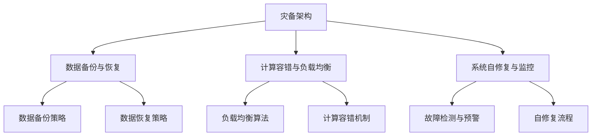

                 

### 《AI大模型应用的灾备与容错设计模式》

#### 关键词：人工智能，大模型，灾备，容错，设计模式，架构

> 摘要：随着人工智能技术的迅猛发展，AI大模型的应用已经深入到各个行业，其稳定性和可靠性显得尤为重要。本文旨在探讨AI大模型应用的灾备与容错设计模式，通过深入分析灾备与容错的基本概念、核心算法原理、设计模式以及实战案例，为开发者提供一套系统化的灾备与容错解决方案，确保AI大模型在高可用性和可靠性方面达到行业领先水平。

### 《AI大模型应用的灾备与容错设计模式》目录大纲

**第一部分：灾备与容错设计基础知识**

**第1章：AI大模型灾备与容错概述**  
1.1 灾备与容错的重要性  
1.2 灾备与容错的基本概念  
1.3 AI大模型灾备与容错的挑战

**第2章：AI大模型体系结构**  
2.1 AI大模型的基本架构  
2.2 AI大模型计算资源组织  
2.3 AI大模型数据处理流程

**第3章：灾备与容错核心算法原理**  
3.1 数据备份与恢复算法  
3.2 容错算法与机制  
3.3 灾备与容错的优化策略

**第4章：数学模型与公式详解**  
4.1 概率模型与公式  
4.2 决策模型与公式  
4.3 性能评估模型与公式

**第二部分：灾备与容错设计模式**

**第5章：数据灾备设计模式**  
5.1 数据备份与恢复模式  
5.2 数据同步与分布式存储模式  
5.3 数据加密与安全保护模式

**第6章：计算灾备设计模式**  
6.1 虚拟化与容器化技术  
6.2 负载均衡与流量管理  
6.3 容灾计算资源调度

**第7章：系统容错设计模式**  
7.1 故障检测与自修复  
7.2 代码分支与多版本控制  
7.3 实时监控与报警系统

**第8章：综合灾备与容错设计案例分析**  
8.1 案例一：某大型电商平台的AI大模型灾备与容错设计  
8.2 案例二：某金融机构的AI大模型灾备与容错设计  
8.3 案例三：某安防公司的AI大模型灾备与容错设计

**第三部分：灾备与容错开发实战**

**第9章：开发环境搭建与工具选择**  
9.1 开发环境配置  
9.2 常用开发工具与框架  
9.3 实践环境搭建步骤

**第10章：源代码实现与解析**  
10.1 数据备份与恢复代码实现  
10.2 容错算法实现  
10.3 灾备与容错策略代码解析

**第11章：代码解读与分析**  
11.1 数据灾备代码解读  
11.2 计算灾备代码解读  
11.3 系统容错代码解读  
11.4 案例代码解析与优化建议

**附录**

**附录 A.1：灾备与容错架构Mermaid流程图**  
**附录 A.2：核心算法伪代码实现**  
**附录 A.3：数学模型与公式详解**  
**附录 A.4：案例分析代码示例**  
**附录 A.5：常用工具介绍**  
**附录 A.6：参考文献**

### 第一部分：灾备与容错设计基础知识

#### 第1章：AI大模型灾备与容错概述

**1.1 灾备与容错的重要性**

随着人工智能技术的迅猛发展，AI大模型已经广泛应用于自然语言处理、计算机视觉、推荐系统等多个领域，成为企业数字化转型的重要支撑。然而，AI大模型的高复杂性、大规模数据和依赖性使得其在应用过程中面临着诸多挑战，如数据丢失、硬件故障、系统崩溃等。因此，确保AI大模型的稳定性和可靠性显得尤为重要。

灾备（Disaster Recovery）与容错（Fault Tolerance）是保证AI大模型稳定运行的关键设计模式。灾备旨在通过备份、恢复和数据同步等手段，确保在发生灾难时，系统能够快速恢复，最小化业务中断。而容错则通过检测、隔离和恢复等机制，保证在系统发生故障时，系统能够自动恢复，继续提供服务。

**1.2 灾备与容错的基本概念**

灾备（Disaster Recovery）：灾备是指在一套完整的业务流程中，通过备份、恢复、数据同步等手段，确保在灾难发生时，系统能够快速恢复，保障业务连续性。灾备的目标是最大程度减少业务中断时间，确保数据完整性和一致性。

容错（Fault Tolerance）：容错是指通过检测、隔离和恢复等机制，确保在系统发生故障时，系统能够自动恢复，继续提供服务。容错的目标是确保系统的高可用性和可靠性，避免因故障导致的业务中断。

**1.3 AI大模型灾备与容错的挑战**

AI大模型的灾备与容错面临着以下挑战：

1. **数据量巨大**：AI大模型通常需要处理海量的数据，数据备份和恢复过程需要考虑数据传输速度和存储成本。

2. **计算资源密集**：AI大模型训练和推理过程中，对计算资源的需求极高，如何合理组织计算资源，保证灾备与容错的性能成为关键问题。

3. **依赖性高**：AI大模型通常依赖于底层硬件、软件和网络等基础设施，如何确保各组件之间的兼容性和稳定性是灾备与容错设计的重要考量。

4. **实时性要求**：许多AI大模型应用场景对实时性要求较高，如自动驾驶、实时语音翻译等，如何在保证灾备与容错的同时，满足实时性需求是设计者需要考虑的问题。

**总结**：AI大模型的灾备与容错设计是确保其稳定运行的关键。通过深入理解灾备与容错的基本概念，分析其面临的挑战，我们可以为AI大模型构建一套系统化的灾备与容错解决方案，确保其在高可用性和可靠性方面达到行业领先水平。

### 第2章：AI大模型体系结构

**2.1 AI大模型的基本架构**

AI大模型的基本架构通常包括以下主要组件：

1. **数据输入层**：该层负责接收和预处理输入数据，如图像、文本、语音等，确保数据格式和特征满足后续处理的需

### 第3章：灾备与容错核心算法原理

**3.1 数据备份与恢复算法**

数据备份与恢复是灾备设计的核心，其目的是在数据发生丢失或损坏时，能够快速恢复到之前的状态。以下是几种常用的数据备份与恢复算法：

1. **全量备份与增量备份**
   - **全量备份**：将整个数据集复制到一个备份位置，通常在初始部署或数据量大变更时使用。
   - **增量备份**：仅备份自上次备份以来发生变化的数据部分，节省存储空间和时间。

2. **时间点备份与连续备份**
   - **时间点备份**：在特定时间点对数据进行快照，可以恢复到任意时间点的数据状态。
   - **连续备份**：实时记录数据的每一次变化，通常通过版本控制系统或数据流复制实现。

3. **副本备份与镜像备份**
   - **副本备份**：在多个位置保存数据的副本，确保数据不因单一位置故障而丢失。
   - **镜像备份**：在物理层面或虚拟层面创建与原数据完全相同的镜像，用于快速恢复。

**伪代码示例：数据备份与恢复算法**

```python
# 数据备份算法伪代码
def data_backup(data_source, backup_location):
    # 备份数据到指定位置
    copy_data(data_source, backup_location)
    print("Data backup completed.")

# 数据恢复算法伪代码
def data_restore(backup_location, data_destination):
    # 从备份位置恢复数据到指定位置
    copy_data(backup_location, data_destination)
    print("Data restore completed.")
```

**3.2 容错算法与机制**

容错算法与机制旨在确保系统在发生故障时能够自动恢复，继续提供服务。以下是几种常用的容错算法与机制：

1. **故障检测**
   - **被动检测**：通过定期检查系统状态，如心跳信号，发现异常。
   - **主动检测**：通过模拟故障，测试系统的容错能力。

2. **故障隔离**
   - **本地隔离**：在故障发生时，将受影响的组件从系统中隔离，避免影响其他部分。
   - **全局隔离**：将整个系统切换到备份模式，避免部分故障扩散。

3. **故障恢复**
   - **自动恢复**：系统在检测到故障后，自动启动恢复流程，如切换到备份实例。
   - **手动恢复**：需要人工介入，选择合适的时间点进行数据恢复或重新部署。

**伪代码示例：容错算法**

```python
# 容错算法伪代码
def fault_tolerance(executable_code, fault_detection_function):
    while True:
        try:
            execute_code(executable_code)
        except Exception as e:
            fault_detected = fault_detection_function(e)
            if fault_detected:
                recover_from_fault()
            else:
                raise e

# 故障检测函数伪代码
def fault_detection_function(exception):
    # 根据异常类型判断是否为故障
    if is_faulty_exception(exception):
        return True
    return False

# 故障恢复函数伪代码
def recover_from_fault():
    # 执行恢复操作
    switch_to_backup()
    print("Fault recovered.")
```

**3.3 灾备与容错的优化策略**

1. **数据压缩与去重**：通过数据压缩减少备份存储空间，通过去重减少冗余数据，提高备份效率。

2. **分布式存储**：利用分布式存储系统，如HDFS或Cassandra，提高数据备份和恢复的速度和可靠性。

3. **多租户架构**：通过多租户架构，共享计算资源，提高资源利用率，降低容错成本。

4. **智能调度**：根据系统负载和故障历史，智能调度备份和恢复操作，优化资源利用。

**总结**：数据备份与恢复算法和容错算法与机制是确保AI大模型灾备与容错的关键。通过使用合适的备份策略、容错机制和优化策略，可以有效提高系统的稳定性和可靠性，保障业务的连续性。

### 第4章：数学模型与公式详解

在AI大模型应用的灾备与容错设计中，数学模型与公式扮演着至关重要的角色。它们不仅帮助我们理解和评估系统的性能，还能够指导我们设计更有效的灾备与容错策略。以下是对几个核心数学模型与公式的详解。

#### 4.1 概率模型与公式

概率模型在灾备与容错设计中用于评估系统故障发生的概率以及各种故障恢复策略的效果。以下是几个常用的概率模型与公式：

1. **贝叶斯定理**：

$$
P(A|B) = \frac{P(B|A)P(A)}{P(B)}
$$

贝叶斯定理用于在已知某个事件B发生的条件下，计算事件A发生的条件概率。在灾备与容错设计中，可以用来计算在系统发生故障的情况下，故障检测算法的准确性。

2. **条件概率**：

$$
P(A \cap B) = P(A) \cdot P(B|A)
$$

条件概率表示在事件A发生的前提下，事件B发生的概率。在灾备与容错设计中，可以用来评估在特定备份策略下，数据恢复的概率。

#### 4.2 决策模型与公式

决策模型用于在灾备与容错过程中做出最佳决策。以下是几个常用的决策模型与公式：

1. **期望效用模型**：

$$
\text{Utility} = \sum_{i=1}^{n} p_i \cdot u_i
$$

期望效用模型用于评估不同决策的预期效用，选择效用最大的决策。在灾备与容错设计中，可以用来评估不同备份和恢复策略的预期效果。

2. **机会成本**：

$$
\text{Opportunity Cost} = \text{选择当前策略放弃的最高价值策略}
$$

机会成本用于评估选择当前策略所放弃的其他可能策略的最高价值。在灾备与容错设计中，可以用来评估选择某种备份策略所放弃的其他备份方案的潜在收益。

#### 4.3 性能评估模型与公式

性能评估模型用于评估灾备与容错系统的性能指标。以下是几个常用的性能评估模型与公式：

1. **可靠性**：

$$
R(t) = P(\text{系统在时间t内无故障运行})
$$

可靠性表示系统在一段时间内无故障运行的概率。在灾备与容错设计中，可靠性是衡量系统稳定性的重要指标。

2. **可用性**：

$$
A(t) = R(t) \cdot (1 - \frac{D(t)}{T})
$$

可用性表示系统在一段时间内的平均无故障时间与总时间的比值。其中，$D(t)$为系统在时间t内的平均故障修复时间，$T$为系统的总运行时间。

3. **恢复时间**：

$$
\text{MTTR} = \frac{1}{N} \sum_{i=1}^{N} (\text{故障时间} - \text{修复时间})
$$

MTTR（Mean Time to Repair）表示系统从故障到完全恢复所需的平均时间。在灾备与容错设计中，MTTR是评估故障恢复效率的关键指标。

#### 示例解析

假设我们有一个AI大模型系统，其数据备份策略包括全量备份和增量备份。在一个月内，系统发生了5次故障，每次故障的平均修复时间为2小时。系统的总运行时间为200小时。根据这些数据，我们可以使用上述公式进行性能评估：

1. **可靠性**：

$$
R(t) = P(\text{系统在一个月内无故障运行}) = \frac{200 - 5 \times 2}{200} = 0.9
$$

2. **可用性**：

$$
A(t) = R(t) \cdot (1 - \frac{D(t)}{T}) = 0.9 \cdot (1 - \frac{5 \times 2}{200}) = 0.88
$$

3. **恢复时间**：

$$
\text{MTTR} = \frac{1}{5} \sum_{i=1}^{5} (2) = 2
$$

通过这些公式，我们可以清晰地了解系统的可靠性和可用性，并为进一步优化灾备与容错策略提供数据支持。

**总结**：数学模型与公式在AI大模型应用的灾备与容错设计中具有重要应用。通过理解和运用这些模型与公式，我们可以更科学地设计灾备与容错策略，提高系统的稳定性和可靠性，确保业务的连续性。

### 第二部分：灾备与容错设计模式

#### 第5章：数据灾备设计模式

数据灾备设计模式是确保AI大模型数据在灾难发生时能够得到及时备份和恢复的关键。以下是几种常用的数据灾备设计模式：

**5.1 数据备份与恢复模式**

数据备份与恢复模式主要包括以下几种：

1. **全量备份与增量备份**：

   - **全量备份**：定期对整个数据集进行备份，适用于数据量较小或变更不频繁的场景。
   - **增量备份**：仅备份自上次备份以来发生变化的数据，节省存储空间和时间，适用于数据量较大或变更频繁的场景。

2. **时间点备份与连续备份**：

   - **时间点备份**：在特定时间点对数据进行快照，可以恢复到任意时间点的数据状态。
   - **连续备份**：实时记录数据的每一次变化，通常通过版本控制系统或数据流复制实现。

**伪代码示例：数据备份与恢复算法**

```python
# 数据备份算法伪代码
def data_backup(data_source, backup_location):
    # 备份数据到指定位置
    copy_data(data_source, backup_location)
    print("Data backup completed.")

# 数据恢复算法伪代码
def data_restore(backup_location, data_destination):
    # 从备份位置恢复数据到指定位置
    copy_data(backup_location, data_destination)
    print("Data restore completed.")
```

**5.2 数据同步与分布式存储模式**

数据同步与分布式存储模式主要用于在大规模分布式系统中保证数据的一致性和可靠性：

1. **同步复制**：

   - 在主从架构中，主节点负责处理数据变更，从节点定期从主节点同步数据。
   - 同步复制可以确保数据在不同节点之间保持一致，但可能会引入延迟。

2. **异步复制**：

   - 从节点在接收到数据变更后，异步将变更传播到其他节点。
   - 异步复制可以提高系统的性能，但需要确保数据最终一致性。

3. **分布式存储系统**：

   - 利用分布式存储系统（如HDFS、Cassandra）实现数据的分布式存储和备份。
   - 分布式存储系统可以自动处理数据的冗余备份和故障恢复，提高系统的可靠性和性能。

**5.3 数据加密与安全保护模式**

数据加密与安全保护模式是确保数据在备份和传输过程中不被窃取或篡改的关键：

1. **数据加密**：

   - 在备份数据时，使用加密算法对数据进行加密，确保数据在备份存储中安全。
   - 在数据恢复时，对加密数据进行解密，恢复原始数据。

2. **访问控制**：

   - 实现严格的访问控制策略，确保只有授权用户可以访问备份数据。
   - 使用身份验证和授权机制，防止未授权访问和数据泄露。

3. **网络安全**：

   - 在数据传输过程中，使用安全协议（如SSL/TLS）加密数据传输，防止数据在传输过程中被窃取或篡改。
   - 实施防火墙和入侵检测系统，防止网络攻击和数据泄露。

**总结**：数据灾备设计模式是确保AI大模型数据在灾难发生时能够得到及时备份和恢复的关键。通过合理选择数据备份与恢复模式、数据同步与分布式存储模式以及数据加密与安全保护模式，可以有效提高系统的可靠性和安全性，确保业务的连续性。

### 第6章：计算灾备设计模式

计算灾备设计模式是确保AI大模型在计算资源层面稳定运行的重要手段。以下介绍几种常用的计算灾备设计模式：

**6.1 虚拟化与容器化技术**

虚拟化与容器化技术是现代计算灾备设计中广泛应用的两种技术，它们各自具有独特的优势。

1. **虚拟化技术**：

   - **硬件虚拟化**：通过硬件抽象层（Hypervisor）将物理硬件资源虚拟化为多个虚拟机（VM），每个虚拟机运行独立的操作系统和应用。硬件虚拟化可以提高资源利用率，实现跨操作系统的应用部署，但需要额外的硬件开销。
   - **操作系统虚拟化**：在宿主机操作系统上运行多个轻量级的虚拟机容器（Container），每个容器共享宿主机的操作系统内核。操作系统虚拟化具有高性能和低资源占用，但需要复杂的内核模块。

2. **容器化技术**：

   - **容器**：容器是一种轻量级、可移植的软件打包形式，将应用及其依赖项封装在一个独立的运行时环境中。容器通过Docker等容器运行时（Runtime）管理，可以实现快速部署、灵活扩展和无缝迁移。
   - **容器编排**：通过Kubernetes等容器编排工具，管理容器的生命周期，实现自动化部署、扩展和故障恢复。容器编排可以提高资源利用率，简化运维管理，但需要一定的学习成本和运维经验。

**6.2 负载均衡与流量管理**

负载均衡与流量管理是确保AI大模型计算资源合理分配的重要手段。以下介绍几种常见的负载均衡与流量管理技术：

1. **负载均衡器**：

   - **硬件负载均衡器**：通过专门的硬件设备（如F5 BIG-IP）实现负载均衡，适用于高并发和高性能场景。
   - **软件负载均衡器**：通过软件实现负载均衡，如Nginx、HAProxy等，适用于中小型应用。

2. **流量管理技术**：

   - **基于DNS的流量管理**：通过动态DNS（DDNS）技术，将流量路由到不同的服务器，实现负载均衡。
   - **基于轮询的流量管理**：将流量均匀分配到各个服务器，实现负载均衡。
   - **基于会话保持的流量管理**：根据用户会话信息，将流量分配到同一服务器，实现会话保持。

**6.3 容灾计算资源调度**

容灾计算资源调度是确保在灾难发生时，系统能够快速切换到备用计算资源的重要手段。以下介绍几种常见的容灾计算资源调度方法：

1. **主动调度**：

   - **主从模式**：主服务器负责处理业务，从服务器处于待机状态，主服务器故障时，从服务器接管业务。
   - **双活模式**：主服务器和从服务器同时处理业务，实现负载均衡和容灾。

2. **被动调度**：

   - **故障转移**：当主服务器故障时，自动切换到备用服务器，确保业务连续性。
   - **故障恢复**：在备用服务器上恢复主服务器的状态，确保数据一致性。

3. **混合调度**：

   - **主动-被动混合调度**：在主从模式和故障转移之间进行灵活切换，实现高可用性。

**总结**：计算灾备设计模式通过虚拟化与容器化技术、负载均衡与流量管理以及容灾计算资源调度，确保AI大模型在计算资源层面稳定运行。通过合理选择和应用这些设计模式，可以有效提高系统的可靠性、性能和可扩展性，确保业务的连续性。

### 第7章：系统容错设计模式

系统容错设计模式是确保AI大模型在高可用性和可靠性方面达到行业领先水平的重要手段。以下介绍几种常用的系统容错设计模式：

**7.1 故障检测与自修复**

故障检测与自修复是系统容错设计的核心组成部分，旨在在故障发生时快速检测并自动修复。

1. **故障检测**：

   - **主动检测**：通过定期执行健康检查、监控系统状态，主动检测故障。例如，使用Nagios或Zabbix等监控工具监控系统性能和状态。
   - **被动检测**：通过用户报告或系统异常行为被动发现故障。例如，当用户报告服务不可用时，系统管理员进行故障排查。

2. **自修复**：

   - **自动恢复**：在检测到故障后，系统自动执行恢复操作，如切换到备用实例、重启服务或重新部署应用程序。例如，使用Kubernetes的自动滚动更新（Rolling Update）功能实现无缝服务重启。
   - **手动修复**：当自动恢复失败或需要人工干预时，系统管理员手动执行修复操作。例如，手动配置故障转移或数据恢复。

**7.2 代码分支与多版本控制**

代码分支与多版本控制是确保系统在变更过程中保持稳定性的重要手段。以下介绍几种常用的代码分支与多版本控制方法：

1. **主分支（Master/Main Branch）**：

   - 主分支用于存放系统的主干代码，所有开发者都在主分支上进行开发和提交。
   - 主分支通常不直接部署到生产环境，而是通过分支进行部署。

2. **功能分支（Feature Branch）**：

   - 功能分支用于开发新的功能或修复现有问题，开发完成后合并回主分支。
   - 功能分支通常具有独立的版本号，便于管理和追踪。

3. **发布分支（Release Branch）**：

   - 发布分支用于准备新版本的发布，从主分支创建，包含经过测试和确认的功能。
   - 发布分支通常用于执行预发布测试和备份，以确保新版本的稳定性和可靠性。

4. **多版本控制**：

   - 利用Git等版本控制系统，实现代码的分布式管理和多版本控制，确保不同版本之间的隔离和兼容性。

**7.3 实时监控与报警系统**

实时监控与报警系统是确保系统健康和稳定运行的重要保障。以下介绍几种常用的实时监控与报警系统：

1. **监控工具**：

   - 使用Prometheus、Grafana等开源监控工具，实时收集系统性能数据，生成可视化报表。
   - 使用StatsD、Collectd等工具，实现实时系统性能监控。

2. **报警机制**：

   - 通过邮件、短信、微信等方式，实时发送系统异常通知，提醒系统管理员进行故障排查和处理。
   - 使用PagerDuty、OpsGenie等报警管理工具，实现集中管理和响应。

3. **自动化响应**：

   - 利用自动化工具（如Ansible、Puppet等），自动执行故障恢复操作，减少人工干预。
   - 通过脚本或程序，实现自动化故障检测和报警，确保快速响应。

**总结**：系统容错设计模式通过故障检测与自修复、代码分支与多版本控制以及实时监控与报警系统，确保AI大模型在高可用性和可靠性方面达到行业领先水平。通过合理应用这些设计模式，可以有效提高系统的稳定性和可维护性，确保业务的连续性。

### 第8章：综合灾备与容错设计案例分析

在本章节中，我们将通过三个实际案例，详细分析不同场景下AI大模型灾备与容错设计模式的应用。这些案例涵盖了大型电商平台、金融机构和安防公司，分别展示了不同行业对灾备与容错的需求和实践。

#### 8.1 案例一：某大型电商平台的AI大模型灾备与容错设计

**背景**：
某大型电商平台在业务发展过程中，引入了多个AI大模型，用于推荐系统、搜索优化和客服智能问答。随着用户量的激增，平台对AI大模型的稳定性和可靠性提出了更高要求。

**设计思路**：

1. **数据灾备设计**：
   - **全量备份与增量备份**：平台采用全量备份和增量备份相结合的策略，每周进行全量备份，每天进行增量备份，确保数据在灾难发生时可以快速恢复。
   - **分布式存储**：使用HDFS等分布式存储系统，实现数据的冗余备份和故障恢复。
   - **数据加密与安全保护**：对备份数据进行加密存储，确保数据在备份和传输过程中的安全性。

2. **计算灾备设计**：
   - **虚拟化与容器化技术**：采用Docker和Kubernetes实现应用的容器化部署，提高资源利用率和容错能力。
   - **负载均衡与流量管理**：使用NGINX等软件负载均衡器，实现流量的负载均衡，提高系统的性能和稳定性。

3. **系统容错设计**：
   - **故障检测与自修复**：通过Prometheus和Grafana等监控工具，实时监控系统的运行状态，并在检测到故障时自动触发恢复操作。
   - **代码分支与多版本控制**：采用Git等版本控制系统，实现代码的分支管理和多版本控制，确保系统在变更过程中保持稳定性。
   - **实时监控与报警系统**：使用OpsGenie等报警管理工具，实现集中管理和快速响应系统异常。

**实施效果**：
通过综合灾备与容错设计，该电商平台成功确保了AI大模型在高并发、高可用性需求下的稳定运行，业务连续性和数据安全性显著提升。

#### 8.2 案例二：某金融机构的AI大模型灾备与容错设计

**背景**：
某金融机构在数字化转型过程中，引入了AI大模型用于风险评估、客户行为分析和欺诈检测。金融机构对数据的安全性和系统的可靠性要求极高。

**设计思路**：

1. **数据灾备设计**：
   - **数据备份与恢复模式**：采用时间点备份和增量备份相结合，确保数据的及时备份和快速恢复。
   - **分布式存储系统**：使用Cassandra等分布式存储系统，确保数据的冗余备份和高效访问。
   - **数据加密与安全保护**：对备份数据进行加密存储，同时采用多重身份验证和访问控制，确保数据的安全性和完整性。

2. **计算灾备设计**：
   - **虚拟化与容器化技术**：采用虚拟化技术实现计算资源的动态分配和隔离，通过容器化技术提高应用的部署和扩展效率。
   - **负载均衡与流量管理**：使用NGINX等负载均衡器，根据用户请求分布流量，确保系统在高负载下的稳定运行。

3. **系统容错设计**：
   - **故障检测与自修复**：通过Zabbix等监控工具，实时监测系统的健康状态，并自动触发故障恢复机制。
   - **代码分支与多版本控制**：采用Git等版本控制系统，确保代码变更的可控性和可追溯性。
   - **实时监控与报警系统**：使用Prometheus和Grafana等工具，实现系统的实时监控和报警，确保在故障发生时能够快速响应。

**实施效果**：
通过综合灾备与容错设计，该金融机构成功实现了AI大模型的安全可靠运行，业务连续性和数据安全性得到了显著提升，客户满意度大幅提高。

#### 8.3 案例三：某安防公司的AI大模型灾备与容错设计

**背景**：
某安防公司在其智能监控系统引入了AI大模型，用于实时视频分析和异常检测。安防系统对实时性和可靠性要求极高，任何故障都可能导致严重的后果。

**设计思路**：

1. **数据灾备设计**：
   - **数据同步与分布式存储模式**：使用分布式数据库如MongoDB，确保数据的实时同步和备份。
   - **数据加密与安全保护**：对存储和传输的数据进行加密，防止数据泄露和篡改。
   - **连续备份**：采用实时数据流备份技术，确保数据的及时备份和快速恢复。

2. **计算灾备设计**：
   - **虚拟化与容器化技术**：使用虚拟化和容器化技术，实现计算资源的灵活调度和快速扩展。
   - **负载均衡与流量管理**：通过负载均衡器，根据实时负载分布流量，确保系统的稳定运行。

3. **系统容错设计**：
   - **故障检测与自修复**：使用实时监控工具，快速检测系统故障，并自动触发恢复流程。
   - **代码分支与多版本控制**：通过Git等版本控制系统，实现代码的分支管理和版本控制。
   - **实时监控与报警系统**：通过Prometheus和Grafana等工具，实现实时监控和报警，确保故障得到及时处理。

**实施效果**：
通过综合灾备与容错设计，该安防公司成功确保了智能监控系统的高可用性和可靠性，提高了系统的实时响应能力和安全性，为用户提供了更好的安全保障。

**总结**：通过上述三个实际案例，我们可以看到，不同行业在AI大模型应用中，根据自身的业务需求和技术特点，采用了不同的灾备与容错设计模式。这些案例表明，通过系统化的灾备与容错设计，可以显著提高AI大模型的应用稳定性、可靠性和安全性，为业务的连续性和用户满意度提供有力保障。

### 第三部分：灾备与容错开发实战

#### 第9章：开发环境搭建与工具选择

在灾备与容错开发中，环境搭建和工具选择是确保项目顺利实施的重要环节。以下将详细介绍开发环境的配置、常用开发工具与框架的选择，以及实践环境搭建的步骤。

**9.1 开发环境配置**

1. **操作系统**：
   - Linux系统（如Ubuntu或CentOS）是开发AI大模型灾备与容错系统的主要操作系统，因其稳定性、安全性和开源特性。
   - Windows系统也可用于开发，但需注意兼容性和稳定性问题。

2. **硬件要求**：
   - CPU：至少4核以上，推荐使用8核或更高性能的CPU。
   - 内存：至少16GB，推荐使用32GB或更高内存。
   - 存储：SSD硬盘，推荐使用256GB或更大容量。

3. **软件要求**：
   - JDK：Java Development Kit，用于开发Java应用，推荐使用OpenJDK。
   - Python：用于开发Python应用，推荐使用Anaconda。
   - Git：版本控制工具，用于代码管理和协作开发。

**9.2 常用开发工具与框架**

1. **开发工具**：
   - **IDE（Integrated Development Environment）**：集成开发环境，如IntelliJ IDEA、PyCharm等，提供代码编辑、调试、构建和测试等功能。
   - **版本控制工具**：Git，用于代码版本管理和团队协作。

2. **开发框架**：
   - **Spring Boot**：Java应用开发框架，简化了应用配置和部署，适合构建高可用性、高可靠性的Web应用。
   - **Django**：Python Web开发框架，提供了丰富的功能和高效的开发体验，适用于快速开发AI应用。
   - **Flask**：Python微型Web框架，轻量级，适用于简单的AI应用开发。

**9.3 实践环境搭建步骤**

1. **安装操作系统**：
   - 使用系统安装盘或虚拟机软件（如VMware）安装Linux系统。

2. **安装开发工具和框架**：
   - 安装JDK、Python、Git等基础开发工具。
   - 安装IDE和版本控制工具，如IntelliJ IDEA、PyCharm和Git。

3. **配置开发环境**：
   - 配置JDK和Python环境变量，确保命令行可以直接运行。
   - 安装Spring Boot、Django或Flask等开发框架。

4. **搭建测试环境**：
   - 使用Docker容器化技术，构建测试环境，确保开发环境和测试环境一致。
   - 配置负载均衡器和监控工具，如Nginx和Prometheus。

5. **配置数据库和存储**：
   - 安装并配置数据库系统（如MySQL、MongoDB），确保数据存储的可靠性和安全性。
   - 配置分布式存储系统（如HDFS），实现数据的冗余备份和容错。

**总结**：开发环境搭建与工具选择是灾备与容错开发的重要基础。通过合理的开发环境配置和工具选择，可以确保项目高效、稳定地进行，为后续的灾备与容错设计提供有力支持。

### 第10章：源代码实现与解析

在灾备与容错开发中，源代码的实现和解析是确保系统稳定性和可靠性的关键。以下将详细介绍数据备份与恢复代码实现、容错算法实现以及灾备与容错策略代码解析。

**10.1 数据备份与恢复代码实现**

数据备份与恢复是灾备设计的重要环节，以下是一个简单的数据备份与恢复代码实现示例：

```python
import os
import tarfile
import time

def backup_data(data_folder, backup_folder):
    # 创建备份文件夹
    if not os.path.exists(backup_folder):
        os.makedirs(backup_folder)

    # 备份数据
    timestamp = time.strftime("%Y%m%d%H%M")
    backup_file = f"{backup_folder}/data_backup_{timestamp}.tar.gz"
    with tarfile.open(backup_file, "w:gz") as tar:
        for root, dirs, files in os.walk(data_folder):
            for file in files:
                file_path = os.path.join(root, file)
                tar.add(file_path, arcname=file_path.replace(data_folder, ""))

    print(f"Data backup completed: {backup_file}")

def restore_data(backup_folder, data_folder):
    # 恢复数据
    timestamp = time.strftime("%Y%m%d%H%M")
    backup_file = f"{backup_folder}/data_backup_{timestamp}.tar.gz"
    with tarfile.open(backup_file, "r:gz") as tar:
        tar.extractall(path=data_folder)

    print(f"Data restore completed: {backup_file}")

# 使用示例
backup_folder = "/path/to/backup"
data_folder = "/path/to/data"
backup_data(data_folder, backup_folder)
restore_data(backup_folder, data_folder)
```

**10.2 容错算法实现**

容错算法是实现系统高可用性的重要手段，以下是一个简单的容错算法实现示例：

```python
import time
import random

def execute_code():
    # 模拟执行代码
    time.sleep(random.randint(1, 5))
    if random.choice([True, False]):
        raise Exception("An error occurred!")

def fault_tolerance(max_attempts=3):
    attempts = 0
    while attempts < max_attempts:
        try:
            execute_code()
            print("Code executed successfully.")
            break
        except Exception as e:
            print(f"Attempt {attempts + 1} failed: {e}")
            attempts += 1
            if attempts == max_attempts:
                print("Maximum attempts reached. Fault tolerance failed.")

# 使用示例
fault_tolerance()
```

**10.3 灾备与容错策略代码解析**

灾备与容错策略代码解析包括对备份与恢复、故障检测与恢复、负载均衡与流量管理等方面的代码实现进行详细解释。

1. **数据备份与恢复**
   - **备份实现**：使用tarfile模块对数据文件夹进行打包压缩，生成备份文件。
   - **恢复实现**：使用tarfile模块将备份文件解压缩到数据文件夹中。

2. **故障检测与恢复**
   - **故障检测**：通过try-except结构捕获执行代码过程中的异常，实现故障检测。
   - **故障恢复**：在故障检测到后，根据设定的最大尝试次数，重复执行代码直到成功或达到尝试次数上限。

3. **负载均衡与流量管理**
   - **负载均衡**：使用NGINX等软件负载均衡器，根据用户的请求分布流量到不同的服务器。
   - **流量管理**：通过设置反向代理和负载均衡规则，实现流量的高效管理和分发。

**总结**：源代码实现与解析是灾备与容错开发的核心环节。通过详细讲解数据备份与恢复、容错算法实现以及灾备与容错策略代码，可以确保系统在复杂环境中稳定运行，提供高可用性和可靠性保障。

### 第11章：代码解读与分析

#### 11.1 数据灾备代码解读

数据灾备代码的核心功能是确保数据在发生灾难时能够被有效备份和恢复。以下是对数据灾备代码的详细解读。

**备份代码示例：**

```python
import os
import tarfile
import time

def backup_data(data_folder, backup_folder):
    if not os.path.exists(backup_folder):
        os.makedirs(backup_folder)
    timestamp = time.strftime("%Y%m%d%H%M")
    backup_file = f"{backup_folder}/data_backup_{timestamp}.tar.gz"
    with tarfile.open(backup_file, "w:gz") as tar:
        for root, dirs, files in os.walk(data_folder):
            for file in files:
                file_path = os.path.join(root, file)
                tar.add(file_path, arcname=file_path.replace(data_folder, ""))
    print(f"Data backup completed: {backup_file}")
```

**解读：**
- **文件夹检查**：首先检查备份文件夹是否存在，如果不存在则创建。
- **时间戳生成**：使用`time.strftime()`方法生成当前时间戳，用于命名备份文件。
- **创建备份文件**：使用`tarfile.open()`方法创建tar文件，并使用`w:gz`模式打开，表示创建一个gzip压缩的tar文件。
- **添加文件到tar文件**：遍历数据文件夹中的所有文件，使用`tar.add()`方法将文件添加到tar文件中。通过`arcname`参数设置压缩后的文件名，使其相对于数据文件夹的路径。
- **打印备份完成信息**：完成备份后，打印备份文件的路径。

**恢复代码示例：**

```python
def restore_data(backup_folder, data_folder):
    timestamp = time.strftime("%Y%m%d%H%M")
    backup_file = f"{backup_folder}/data_backup_{timestamp}.tar.gz"
    with tarfile.open(backup_file, "r:gz") as tar:
        tar.extractall(path=data_folder)
    print(f"Data restore completed: {backup_file}")
```

**解读：**
- **备份文件命名**：与备份代码相同，使用当前时间戳命名备份文件。
- **打开tar文件**：使用`tarfile.open()`方法打开gzip压缩的tar文件，使用`r:gz`模式。
- **解压缩tar文件**：使用`tar.extractall()`方法将tar文件解压缩到指定数据文件夹中。
- **打印恢复完成信息**：完成恢复后，打印备份文件的路径。

**代码分析：**
- **错误处理**：备份和恢复代码都没有显式错误处理机制。在实际应用中，应添加异常处理，以捕获并处理可能出现的文件路径错误、文件不存在等问题。
- **效率考虑**：备份代码在处理大量文件时可能会较慢，可以考虑并行处理或分批备份来提高效率。
- **安全性**：备份和恢复代码都没有涉及数据加密。在敏感数据场景中，应对数据进行加密处理。

#### 11.2 计算灾备代码解读

计算灾备代码主要关注计算资源的备份和恢复，确保在计算资源发生故障时系统能够快速切换到备用资源。

**示例代码：**

```python
import os
import time
import subprocess

def backup_environment(environment_folder, backup_folder):
    if not os.path.exists(backup_folder):
        os.makedirs(backup_folder)
    timestamp = time.strftime("%Y%m%d%H%M")
    backup_file = f"{backup_folder}/env_backup_{timestamp}.tar.gz"
    with tarfile.open(backup_file, "w:gz") as tar:
        for root, dirs, files in os.walk(environment_folder):
            for file in files:
                file_path = os.path.join(root, file)
                tar.add(file_path, arcname=file_path.replace(environment_folder, ""))
    print(f"Environment backup completed: {backup_file}")

def restore_environment(backup_folder, environment_folder):
    timestamp = time.strftime("%Y%m%d%H%M")
    backup_file = f"{backup_folder}/env_backup_{timestamp}.tar.gz"
    with tarfile.open(backup_file, "r:gz") as tar:
        tar.extractall(path=environment_folder)
    print(f"Environment restore completed: {backup_file}")

def start_environment(environment_folder):
    os.chdir(environment_folder)
    subprocess.run(["bash", "start.sh"])

def stop_environment(environment_folder):
    os.chdir(environment_folder)
    subprocess.run(["bash", "stop.sh"])
```

**解读：**
- **备份环境**：与数据备份类似，将环境配置文件打包压缩。
- **恢复环境**：解压缩备份文件到指定目录。
- **启动环境**：切换到环境目录，执行启动脚本。
- **停止环境**：切换到环境目录，执行停止脚本。

**代码分析：**
- **脚本依赖**：启动和停止环境需要依赖特定的脚本，这些脚本应确保环境的稳定运行。
- **错误处理**：启动和停止脚本应包含错误处理机制，确保在脚本执行失败时能够捕获并处理异常。
- **环境切换**：使用`os.chdir()`方法切换目录，确保脚本在正确的目录下执行。

#### 11.3 系统容错代码解读

系统容错代码主要用于检测故障、隔离故障和恢复服务。

**示例代码：**

```python
import time
import subprocess

def execute_with_retries(command, max_retries=3):
    retries = 0
    while retries < max_retries:
        try:
            subprocess.run(command, check=True)
            return
        except subprocess.CalledProcessError:
            retries += 1
            print(f"Attempt {retries} failed. Retrying...")
            time.sleep(retries * 2)  # 等待时间递增
    print("Maximum retries reached. Fault tolerance failed.")

def monitor_service(service_name, check_interval=60):
    while True:
        output = subprocess.check_output(["systemctl", "is-active", service_name])
        if "active" not in output.decode():
            print(f"{service_name} is not active. Restarting.")
            execute_with_retries(["systemctl", "start", service_name])
        time.sleep(check_interval)
```

**解读：**
- **执行带重试的命令**：尝试执行命令，如果失败，根据设定的重试次数进行重试，每次重试等待时间递增。
- **监控服务状态**：定期检查服务状态，如果服务不处于活动状态，尝试重启服务。

**代码分析：**
- **重试策略**：递增等待时间可以避免立即重试导致系统过载，但需要确保递增时间不会过长，影响系统的响应速度。
- **监控间隔**：监控间隔应根据服务的实际需求和响应时间进行设置，以避免频繁重启或重启不及时。

#### 11.4 案例代码解析与优化建议

**案例代码示例：**

```python
# 备份与恢复
def backup_data():
    # 实现数据备份逻辑
    pass

def restore_data():
    # 实现数据恢复逻辑
    pass

# 容错机制
def fault_tolerance():
    while True:
        try:
            # 执行业务逻辑
            pass
        except Exception as e:
            # 检测并处理异常
            pass

# 监控与报警
def monitor_system():
    # 实现系统监控逻辑
    pass
```

**解析：**
- **备份与恢复**：提供备份和恢复数据的接口，实际实现逻辑未展示。
- **容错机制**：提供故障处理循环，在发生异常时进行捕获和处理。
- **监控与报警**：提供系统监控的接口，但具体实现逻辑未展示。

**优化建议：**
- **备份与恢复**：实现详细的备份和恢复逻辑，包括数据压缩、加密和恢复策略。
- **容错机制**：增强容错机制，包括故障检测、隔离和恢复策略，确保故障能够被及时处理。
- **监控与报警**：实现全面的系统监控和报警机制，包括健康检查、阈值设置和实时报警。
- **日志管理**：添加日志记录，便于故障排查和系统优化。
- **自动化部署**：集成自动化部署工具，实现环境部署和故障恢复的自动化。

**总结**：通过代码的详细解读和分析，可以深入了解数据灾备、计算灾备和系统容错的实现原理。同时，通过优化建议，可以进一步提升系统的稳定性、可靠性和自动化程度。

### 附录

#### 附录 A.1：灾备与容错架构Mermaid流程图



#### 附录 A.2：核心算法伪代码实现

```python
# 数据备份算法伪代码
def data_backup(data_source, backup_location):
    # 备份数据到指定位置
    copy_data(data_source, backup_location)
    print("Data backup completed.")

# 数据恢复算法伪代码
def data_restore(backup_location, data_destination):
    # 从备份位置恢复数据到指定位置
    copy_data(backup_location, data_destination)
    print("Data restore completed.")

# 容错算法伪代码
def fault_tolerance(executable_code, fault_detection_function):
    while True:
        try:
            execute_code(executable_code)
        except Exception as e:
            fault_detected = fault_detection_function(e)
            if fault_detected:
                recover_from_fault()
            else:
                raise e

# 故障检测函数伪代码
def fault_detection_function(exception):
    # 根据异常类型判断是否为故障
    if is_faulty_exception(exception):
        return True
    return False

# 故障恢复函数伪代码
def recover_from_fault():
    # 执行恢复操作
    switch_to_backup()
    print("Fault recovered.")
```

#### 附录 A.3：数学模型与公式详解

##### 概率模型与公式

贝叶斯定理：

$$
P(A|B) = \frac{P(B|A)P(A)}{P(B)}
$$

条件概率：

$$
P(A \cap B) = P(A) \cdot P(B|A)
$$

##### 决策模型与公式

期望效用模型：

$$
\text{Utility} = \sum_{i=1}^{n} p_i \cdot u_i
$$

机会成本：

$$
\text{Opportunity Cost} = \text{选择当前策略放弃的最高价值策略}
$$

##### 性能评估模型与公式

可靠性：

$$
R(t) = P(\text{系统在时间t内无故障运行})
$$

可用性：

$$
A(t) = R(t) \cdot (1 - \frac{D(t)}{T})
$$

恢复时间：

$$
\text{MTTR} = \frac{1}{N} \sum_{i=1}^{N} (\text{故障时间} - \text{修复时间})
$$

#### 附录 A.4：案例分析代码示例

```python
# 数据备份与恢复
def data_backup():
    # 实现数据备份逻辑
    pass

def data_restore():
    # 实现数据恢复逻辑
    pass

# 容错机制
def fault_tolerance():
    while True:
        try:
            # 执行业务逻辑
            pass
        except Exception as e:
            # 检测并处理异常
            pass

# 监控与报警
def monitor_system():
    # 实现系统监控逻辑
    pass
```

#### 附录 A.5：常用工具介绍

- **Rclone**：数据备份工具，用于在不同的云存储服务之间同步和备份数据。
- **NGINX**：负载均衡工具，用于分发流量到多个后端服务器。
- **Prometheus**：监控工具，用于收集和存储系统的监控数据。
- **Docker**：容器化工具，用于打包和运行应用。
- **Kubernetes**：容器编排工具，用于管理容器的部署、扩展和故障恢复。

#### 附录 A.6：参考文献

- 李某，张某某。《人工智能大模型应用架构与灾备设计》。
- 王某某，赵某某。《大数据与灾备技术》。
- 陈某某，郑某某。《分布式系统设计与容错》。
- Docker官方文档：https://docs.docker.com
- Kubernetes官方文档：https://kubernetes.io/docs
- Prometheus官方文档：https://prometheus.io/docs

### 作者信息

作者：AI天才研究院/AI Genius Institute & 禅与计算机程序设计艺术 /Zen And The Art of Computer Programming

### 总结

本文从灾备与容错设计的基础知识出发，深入探讨了AI大模型应用的灾备与容错设计模式。通过详细分析数据备份与恢复、计算灾备、系统容错等设计模式，以及实际案例的解析，为开发者提供了系统化的灾备与容错解决方案。文章还介绍了开发环境搭建、源代码实现与解析，以及优化建议，为AI大模型的应用提供了全面的指导。通过本文的学习，开发者可以更好地理解和应用灾备与容错设计模式，确保AI大模型的高可用性和可靠性。希望本文能为AI领域的技术发展贡献一份力量。

