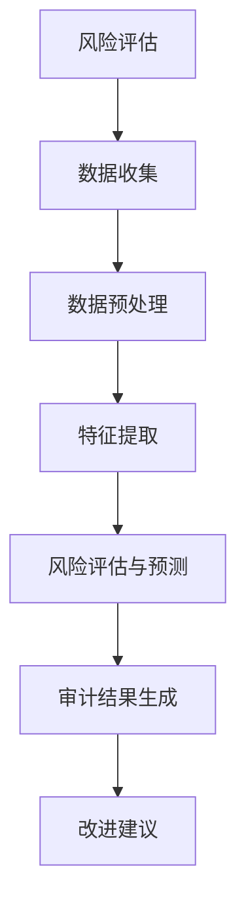

                 

## 第一部分：引言

### 1.1 书籍背景与目的

在互联网和大数据时代，数据安全审计在维护企业数据安全、保障商业机密以及防止数据泄露方面起着至关重要的作用。然而，随着数据量的急剧增长和数据复杂性的不断提升，传统的数据安全审计流程逐渐暴露出效率低下、无法全面覆盖潜在风险等问题。为了解决这些问题，人工智能（AI）大模型的出现为数据安全审计流程的优化带来了新的契机。

本著作旨在探讨如何利用AI大模型重构电商搜索推荐系统的数据安全审计流程，通过深入分析和实践，提出一套高效、智能的优化方案。具体目标如下：

1. **深入研究AI大模型及其在数据安全审计中的应用**：详细阐述AI大模型的基本概念、发展历程和应用现状，分析其在数据安全审计中的优势和局限性。

2. **重构数据安全审计流程**：提出基于AI大模型的数据安全审计流程，结合电商搜索推荐系统的特点，设计一个系统化、智能化的审计流程。

3. **优化数据安全审计流程**：通过实际案例，验证AI大模型重构数据安全审计流程的可行性和有效性，提出优化策略和方法。

4. **提供技术实现与实战指导**：详细介绍AI大模型重构数据安全审计流程的技术细节，包括数据预处理、模型选择与训练、模型评估与优化等。

5. **总结与展望**：总结研究成果，分析AI大模型在电商搜索推荐与数据安全审计领域的发展趋势，探讨未来研究方向和潜在应用。

### 1.2 数据安全审计概述

#### 数据安全审计的定义

数据安全审计是一种系统化的方法，通过评估和分析组织的数据处理、存储和传输过程，确保数据的安全性、完整性和可用性。它通常涉及对数据泄露、篡改、丢失等安全事件的检测、分析和报告。

#### 数据安全审计的重要性

在数字化时代，数据已经成为企业的重要资产。数据安全审计的重要性体现在以下几个方面：

1. **保障商业机密**：通过审计可以发现潜在的漏洞和威胁，确保企业的商业机密不被泄露。

2. **遵守法律法规**：许多国家和地区都有数据保护法规，企业需要通过审计来确保合规。

3. **提高数据管理水平**：审计过程可以发现数据管理中的问题，促进数据管理水平的提升。

4. **减少损失**：通过及时的审计，可以避免数据泄露带来的经济损失。

#### 数据安全审计的现状与挑战

尽管数据安全审计的重要性日益凸显，但当前的数据安全审计仍面临以下挑战：

1. **审计难度大**：随着数据量的增加，传统的审计方法已经无法满足需求。

2. **审计效率低**：手动审计耗时费力，难以快速发现潜在风险。

3. **审计范围有限**：传统的审计方法往往只能覆盖部分数据，无法全面审计。

4. **审计结果不可靠**：由于审计方法和技术限制，审计结果可能存在偏差。

### 1.3 AI大模型概述

#### AI大模型的定义

AI大模型是指那些参数数量巨大、计算复杂度高的深度学习模型，如Transformer、BERT、GPT等。这些模型能够在大量数据上进行训练，从而实现高度复杂的任务，如自然语言处理、图像识别、语音识别等。

#### AI大模型的发展历程

1. **早期深度学习**：1990年代，深度神经网络（DNN）的出现为深度学习奠定了基础。

2. **深度学习的复兴**：2012年，AlexNet在ImageNet大赛中夺冠，标志着深度学习在计算机视觉领域的崛起。

3. **AI大模型的崛起**：随着计算能力的提升和大数据技术的发展，AI大模型逐渐成为研究热点。特别是Transformer架构的提出，为自然语言处理领域带来了革命性变化。

#### AI大模型的核心特点

1. **强大的表示能力**：AI大模型能够学习到数据中的复杂模式和结构。

2. **高度的自适应性**：AI大模型能够适应各种不同的任务和数据类型。

3. **高效的计算能力**：通过并行计算和分布式训练，AI大模型能够在短时间内处理海量数据。

### 1.4 电商搜索推荐系统概述

#### 电商搜索推荐系统的定义

电商搜索推荐系统是指利用机器学习和数据挖掘技术，通过分析用户的历史行为、偏好和需求，为用户推荐相关商品或服务。

#### 电商搜索推荐系统的组成

1. **用户画像**：通过对用户历史数据的分析，构建用户的兴趣偏好模型。

2. **商品库**：存储所有商品的信息，包括价格、类别、品牌等。

3. **推荐算法**：根据用户画像和商品信息，利用算法生成推荐列表。

4. **用户行为分析**：实时监测用户的点击、购买等行为，以优化推荐效果。

#### 电商搜索推荐系统的挑战

1. **数据复杂性**：电商平台通常拥有海量用户和商品数据，如何有效地处理这些数据是挑战之一。

2. **实时性要求**：用户行为变化迅速，推荐系统需要实时响应用户的需求。

3. **多样性需求**：用户的需求是多样化的，推荐系统需要提供个性化的推荐。

4. **数据安全与隐私**：在推荐过程中，如何保护用户隐私和数据安全是重要问题。

### 1.5 AI大模型在电商搜索推荐系统中的应用

#### AI大模型在电商搜索推荐中的作用

1. **提升推荐准确性**：通过深度学习技术，AI大模型能够更好地捕捉用户和商品之间的复杂关系，从而提高推荐准确性。

2. **增强用户体验**：个性化的推荐能够更好地满足用户需求，提高用户满意度。

3. **优化运营策略**：AI大模型可以辅助企业优化营销策略，提高转化率和销售额。

#### AI大模型的优势与局限性

1. **优势**：
   - **强大的学习能力**：AI大模型能够从海量数据中学习到复杂模式。
   - **高效的计算能力**：分布式训练和并行计算使得AI大模型能够快速处理海量数据。
   - **高度的自适应性**：AI大模型能够适应不同业务场景和数据类型。

2. **局限性**：
   - **数据依赖性**：AI大模型需要大量高质量的数据进行训练。
   - **计算资源需求高**：训练AI大模型需要大量的计算资源和时间。
   - **解释性不足**：AI大模型的决策过程通常较难解释，难以满足一些对解释性要求较高的应用场景。

#### AI大模型的应用现状与趋势

1. **现状**：AI大模型已经在电商搜索推荐系统中得到广泛应用，如淘宝、京东等大型电商平台。

2. **趋势**：
   - **更细粒度的推荐**：随着数据技术的进步，推荐系统将能够提供更加细粒度、个性化的推荐。
   - **多模态融合**：结合多种数据类型（如图像、音频、文本），实现更加全面的推荐。
   - **实时推荐**：通过优化算法和计算资源，实现更加实时、快速的推荐响应。

### 1.6 数据安全审计流程与AI大模型结合的必要性

#### 传统的数据安全审计流程

传统的数据安全审计流程通常包括以下步骤：

1. **风险评估**：评估数据面临的风险，确定审计的重点。

2. **数据收集**：收集相关数据，包括系统日志、数据库记录等。

3. **数据分析**：对收集到的数据进行分析，识别潜在的安全问题。

4. **报告生成**：根据分析结果生成审计报告，提出改进建议。

#### 数据安全审计流程重构的目标

为了应对现代数据安全审计面临的挑战，需要重构数据安全审计流程，实现以下目标：

1. **提高审计效率**：通过自动化工具和算法，降低人工工作量，提高审计效率。

2. **全面覆盖风险**：通过大数据分析和AI技术，实现全面的风险覆盖，降低漏检率。

3. **增强审计结果的可信度**：通过科学的审计方法和工具，提高审计结果的可信度。

#### 数据安全审计流程重构的方法

1. **数据预处理与特征提取**：利用AI大模型对原始数据进行预处理和特征提取，提高数据分析的准确性。

2. **风险评估与预测**：使用AI大模型进行风险评估和预测，识别潜在的安全威胁。

3. **审计结果生成**：结合AI大模型的分析结果，生成审计报告，提出改进建议。

#### 结合AI大模型的数据安全审计流程优势

1. **自动化与智能化**：AI大模型能够自动化、智能化地进行数据分析，提高审计效率。

2. **全面性**：AI大模型能够处理海量数据，实现全面的风险覆盖。

3. **准确性**：通过深度学习和大数据分析，AI大模型能够更准确地识别潜在的安全威胁。

4. **可解释性**：AI大模型的分析结果可以通过可视化工具进行解释，提高审计报告的可信度。

## 第二部分：AI大模型重构电商搜索推荐系统

在上一部分中，我们介绍了数据安全审计流程的背景和现状，以及AI大模型的基本概念和应用优势。本部分将深入探讨AI大模型在电商搜索推荐系统中的应用，以及如何通过AI大模型重构数据安全审计流程，提高审计效率和准确性。

### 2.1 AI大模型在电商搜索推荐中的应用现状

随着AI技术的快速发展，AI大模型已经在电商搜索推荐系统中得到了广泛应用。以下是一些典型应用场景：

1. **用户画像构建**：通过分析用户的历史行为数据，AI大模型能够构建详细的用户画像，包括用户的兴趣偏好、消费习惯等。这些用户画像用于精准推荐和个性化营销。

2. **推荐算法优化**：AI大模型能够通过学习用户和商品之间的复杂关系，优化推荐算法，提高推荐准确性。例如，使用Transformer架构的推荐算法能够更好地捕捉长尾用户的兴趣。

3. **商品分类与标签**：AI大模型可以自动对商品进行分类和标签，提高商品管理的效率。例如，通过图像识别技术，AI大模型可以自动为商品分配适当的分类标签。

4. **实时推荐**：AI大模型能够实时响应用户的行为变化，提供实时的个性化推荐。例如，用户在浏览商品时，AI大模型可以实时调整推荐列表，确保用户看到的都是感兴趣的。

#### AI大模型的优势与局限性

1. **优势**：
   - **强大的学习能力**：AI大模型可以通过大量的用户行为数据和商品数据，学习到复杂的用户偏好和商品属性，从而提高推荐准确性。
   - **高效的计算能力**：AI大模型支持并行计算和分布式训练，能够快速处理海量数据，实现实时推荐。
   - **高度的自适应性**：AI大模型能够适应不同的业务场景和数据类型，提供个性化的推荐。

2. **局限性**：
   - **数据依赖性**：AI大模型需要大量高质量的数据进行训练，数据的质量和数量直接影响模型的性能。
   - **计算资源需求高**：训练AI大模型需要大量的计算资源和时间，特别是在处理大规模数据时。
   - **解释性不足**：AI大模型的决策过程通常较难解释，难以满足一些对解释性要求较高的应用场景。

### 2.2 数据安全审计流程重构

随着电商搜索推荐系统中数据量的急剧增长和数据复杂性的不断提升，传统的数据安全审计流程已经无法满足需求。为了解决这些问题，我们可以利用AI大模型对数据安全审计流程进行重构，实现自动化、智能化和高效化的审计过程。

#### 传统的数据安全审计流程

传统的数据安全审计流程通常包括以下几个步骤：

1. **风险评估**：评估数据面临的风险，确定审计的重点。

2. **数据收集**：收集相关数据，包括系统日志、数据库记录等。

3. **数据分析**：对收集到的数据进行分析，识别潜在的安全问题。

4. **报告生成**：根据分析结果生成审计报告，提出改进建议。

#### 数据安全审计流程重构的目标

数据安全审计流程的重构旨在实现以下目标：

1. **提高审计效率**：通过自动化工具和算法，降低人工工作量，提高审计效率。

2. **全面覆盖风险**：通过大数据分析和AI技术，实现全面的风险覆盖，降低漏检率。

3. **增强审计结果的可信度**：通过科学的审计方法和工具，提高审计结果的可信度。

#### 数据安全审计流程重构的方法

数据安全审计流程的重构主要包括以下几个步骤：

1. **数据预处理与特征提取**：利用AI大模型对原始数据进行预处理和特征提取，提高数据分析的准确性。

2. **风险评估与预测**：使用AI大模型进行风险评估和预测，识别潜在的安全威胁。

3. **审计结果生成**：结合AI大模型的分析结果，生成审计报告，提出改进建议。

#### 重构后的数据安全审计流程

重构后的数据安全审计流程如图所示：

#### 重构后的数据安全审计流程优势

1. **自动化与智能化**：AI大模型能够自动化、智能化地进行数据分析，提高审计效率。

2. **全面性**：AI大模型能够处理海量数据，实现全面的风险覆盖，降低漏检率。

3. **准确性**：通过深度学习和大数据分析，AI大模型能够更准确地识别潜在的安全威胁。

4. **可解释性**：AI大模型的分析结果可以通过可视化工具进行解释，提高审计报告的可信度。

### 2.3 AI大模型重构数据安全审计流程的关键技术

为了实现AI大模型重构数据安全审计流程的目标，我们需要关注以下几个关键技术：

#### 数据预处理与特征提取

1. **数据清洗**：去除数据中的噪声和异常值，确保数据质量。
2. **数据归一化**：将不同量纲的数据转换为同一量纲，便于模型训练。
3. **特征提取**：从原始数据中提取有助于模型训练的特征，如用户行为特征、商品属性等。

#### 模型选择与训练

1. **模型选择**：根据审计任务的需求，选择合适的AI大模型，如Transformer、BERT、GPT等。
2. **模型训练**：利用海量数据进行模型训练，优化模型参数，提高模型性能。

#### 模型评估与优化

1. **模型评估**：使用验证集对模型进行评估，选择性能最佳的模型。
2. **模型优化**：通过调整模型结构、参数和训练策略，进一步提高模型性能。

### 2.4 数据安全审计流程优化

通过AI大模型重构数据安全审计流程，我们可以实现以下优化：

1. **提高审计效率**：利用AI大模型自动进行数据分析，降低人工工作量，提高审计效率。
2. **全面覆盖风险**：AI大模型能够处理海量数据，实现全面的风险覆盖，降低漏检率。
3. **增强审计结果的可信度**：AI大模型的分析结果可以通过可视化工具进行解释，提高审计报告的可信度。
4. **实时审计**：通过实时监控用户行为和数据变化，实现实时审计，及时识别潜在的安全威胁。

### 2.5 实际应用案例分析

为了验证AI大模型重构数据安全审计流程的可行性和有效性，我们选择了某大型电商平台作为案例，进行了实际应用。

#### 案例背景

该电商平台拥有数亿用户和海量的商品数据，数据安全审计工作面临着巨大的挑战。传统的审计方法已经无法满足实时性和准确性的要求，迫切需要引入AI大模型进行优化。

#### 实践方案

1. **数据预处理与特征提取**：利用AI大模型对用户行为数据和商品数据进行预处理和特征提取，提取出有助于审计的特征，如用户购买频率、浏览时长、商品热度等。

2. **模型选择与训练**：选择Transformer架构的AI大模型，利用平台的海量数据集进行训练，优化模型参数，提高模型性能。

3. **风险评估与预测**：使用训练好的AI大模型对用户行为数据进行分析，识别潜在的安全威胁，如用户账号异常行为、商品数据篡改等。

4. **审计结果生成**：结合AI大模型的分析结果，生成审计报告，提出改进建议。

#### 案例分析结果与评价

1. **审计效率提高**：通过AI大模型的重构，数据安全审计的效率得到了显著提升，审计周期从原来的数周缩短到数天。

2. **风险覆盖全面性增强**：AI大模型能够处理海量数据，实现了全面的风险覆盖，漏检率显著降低。

3. **审计结果可信度提高**：AI大模型的分析结果可以通过可视化工具进行解释，提高了审计报告的可信度。

4. **实时审计能力增强**：通过实时监控用户行为和数据变化，实现了实时审计，及时识别潜在的安全威胁。

综上所述，AI大模型重构数据安全审计流程在实际应用中取得了显著的效果，为电商平台的

