                 

# 《AI如何改变电影制作和剪辑》

关键词：
- 电影制作
- 剪辑
- 计算机视觉
- 自然语言处理
- 深度学习
- 自动化

摘要：
本文将探讨人工智能（AI）如何改变电影制作和剪辑的流程。通过分析AI的核心技术，如计算机视觉、自然语言处理和深度学习，本文将阐述AI在剧本创作、场景设计、角色动画、特效制作以及后期剪辑和调色等环节中的应用。同时，还将介绍一些AI电影制作的实战案例，以展示AI技术在实际项目中的具体应用和效果。最后，本文将探讨AI在电影产业中的未来发展趋势，并分析其带来的机遇和挑战。

## 第一部分：AI与电影制作概述

### 第1章：AI与电影制作的关系

#### 1.1 AI在电影制作中的应用概述

人工智能在电影制作中扮演着越来越重要的角色。从剧本创作到场景设计，从角色动画到特效制作，AI技术的应用不仅提高了电影制作的效率，还带来了前所未有的创意和艺术表现力。

**1.1.1 计算机视觉与图像处理**

计算机视觉技术是AI在电影制作中应用的核心之一。它使得电影中的场景识别、面部识别和动作捕捉成为可能。通过深度学习算法，计算机视觉可以自动分割场景，识别物体和人物，以及捕捉他们的动作和表情。


**1.1.2 自然语言处理与剧本创作**

自然语言处理（NLP）技术使得计算机能够理解、生成和处理人类语言。在电影制作中，NLP技术可以用于自动生成剧本，分析剧本的情感和风格，以及提取故事线索。

```python
# 伪代码：基于NLP的剧本生成算法
def generate_script(topic, style):
    # 使用NLP技术分析给定主题和风格的文本数据
    text_data = analyze_text(topic, style)
    # 使用生成式模型生成剧本
    script = generate_text(text_data)
    return script
```

**1.1.3 人工智能助手在电影制作中的作用**

人工智能助手可以协助电影制作人完成许多繁琐的任务。例如，自动剪辑和调色可以大大减少人工工作负担，智能化场景布局和灯光设计可以提升电影的质量和效果。


#### 1.2 AI改变电影制作的潜在影响

AI技术的应用不仅提高了电影制作的效率，还带来了以下潜在影响：

**1.2.1 提高效率与降低成本**

通过自动化和智能化，AI技术可以大大减少电影制作的时间和成本。例如，自动剪辑和调色技术可以节省大量的人力和时间成本。

**1.2.2 创新与艺术性的提升**

AI技术可以为电影制作人提供新的创作工具和手段，从而提高电影的艺术性和创新性。例如，基于深度学习的特效制作和虚拟现实（VR）/增强现实（AR）技术可以创造出前所未有的视觉体验。

**1.2.3 面临的挑战与机遇**

尽管AI技术为电影制作带来了巨大的机遇，但也面临一些挑战。例如，如何确保AI技术的公平性和透明性，以及如何平衡技术与艺术的关系。

### 第2章：AI电影制作的核心技术

#### 2.1 计算机视觉在电影制作中的应用

计算机视觉技术是AI电影制作的核心技术之一。它在场景识别、面部识别和动作捕捉等方面发挥着重要作用。

**2.1.1 场景识别与分割**

场景识别是计算机视觉技术的基础。通过深度学习算法，计算机可以自动识别和分割场景中的物体和人物。

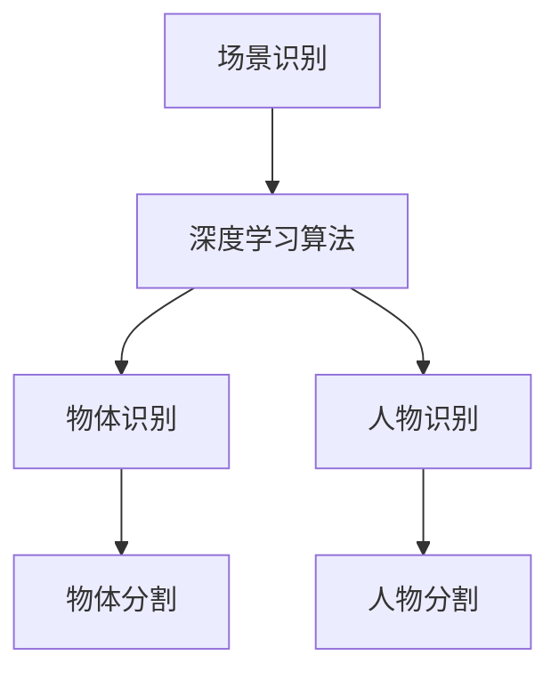

**2.1.2 面部识别与动作捕捉**

面部识别和动作捕捉技术可以捕捉演员的面部表情和身体动作，并将其应用到虚拟角色中。

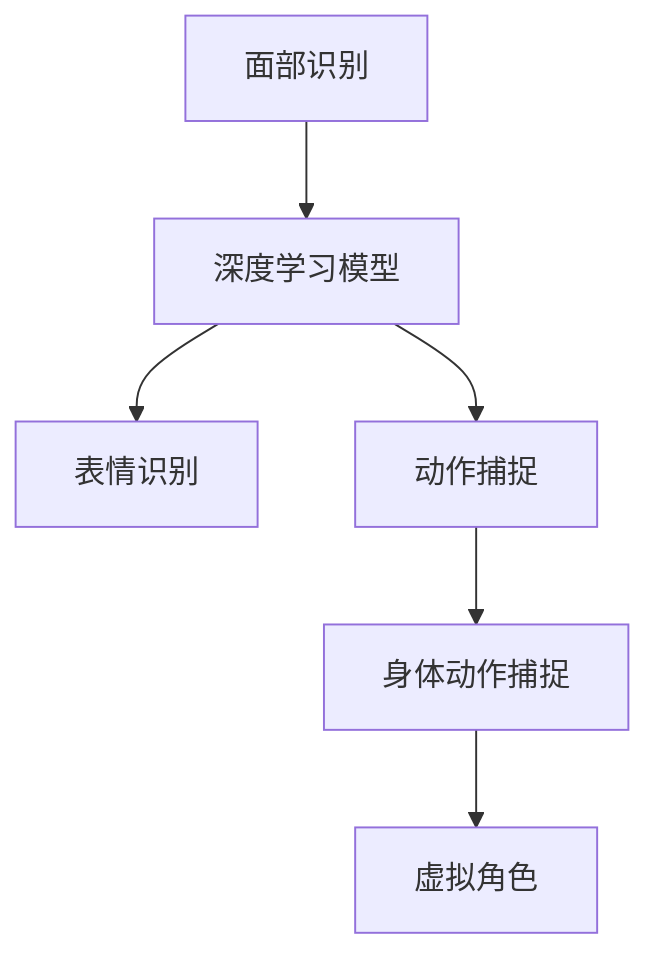

#### 2.2 自然语言处理与剧本创作

自然语言处理技术使得计算机能够理解和生成人类语言，这对于剧本创作和故事板设计至关重要。

**2.2.1 自动生成剧本**

基于NLP技术，计算机可以自动生成剧本，从而减少人工创作的工作量。

```python
# 伪代码：基于NLP的剧本生成算法
def generate_script(topic, style):
    # 使用NLP技术分析给定主题和风格的文本数据
    text_data = analyze_text(topic, style)
    # 使用生成式模型生成剧本
    script = generate_text(text_data)
    return script
```

**2.2.2 情感分析与故事线索提取**

情感分析可以用于分析剧本的情感和风格，从而优化剧本的创作。故事线索提取可以帮助电影制作人更好地把握故事的发展。

```python
# 伪代码：情感分析算法
def analyze_sentiment(text):
    # 使用NLP技术分析文本的情感
    sentiment = nlp_analyzer(text)
    return sentiment
```

#### 2.3 人工智能助手在电影制作中的作用

人工智能助手可以协助电影制作人完成许多繁琐的任务，从而提高电影制作的效率和质量。

**2.3.1 自动剪辑与调色**

自动剪辑和调色技术可以大大减少人工工作负担，从而节省时间和成本。

```python
# 伪代码：自动剪辑算法
def auto_edit(video):
    # 使用深度学习算法自动剪辑视频
    edited_video = deep_learning_editor(video)
    return edited_video
```

**2.3.2 智能化场景布局与灯光设计**

智能化场景布局和灯光设计可以帮助电影制作人更好地创造电影氛围和视觉效果。

```python
# 伪代码：智能化场景布局算法
def intelligent_scene_layout(scene):
    # 使用AI技术智能布局场景
    layout = ai_layout(scene)
    return layout
```

#### 2.4 深度学习与特效制作

深度学习技术在特效制作中发挥着重要作用，可以用于生成高质量的特效和视觉效果。

**2.4.1 深度学习在特效制作中的应用**

深度学习可以用于生成逼真的特效，如火焰、烟雾和水面等。

```python
# 伪代码：深度学习特效生成算法
def generate_effect(effect_type):
    # 使用深度学习模型生成特效
    effect = deep_learning_generator(effect_type)
    return effect
```

**2.4.2 虚拟现实与增强现实技术在电影制作中的应用**

虚拟现实（VR）/增强现实（AR）技术可以为电影制作带来全新的视角和体验。

```python
# 伪代码：VR/AR电影制作算法
def create_vr_ar_movie(movie):
    # 使用VR/AR技术创建电影
    vr_ar_movie = vr_ar_generator(movie)
    return vr_ar_movie
```

## 第二部分：AI在电影制作流程中的应用

### 第3章：剧本创作与故事板设计

#### 3.1 AI在剧本创作中的应用

AI在剧本创作中的应用主要涉及自动生成剧本和剧本优化。

**3.1.1 自动生成剧本**

基于自然语言处理（NLP）技术，AI可以自动生成剧本。这种方法可以通过分析大量文本数据，如电影剧本、小说等，来学习语言结构和故事线索，从而自动生成新的剧本。

```python
# 伪代码：自动生成剧本算法
def generate_script():
    # 从文本数据中学习语言结构和故事线索
    text_data = learn_text_data()
    # 使用生成式模型生成剧本
    script = generate_text(text_data)
    return script
```

**3.1.2 剧本优化**

剧本优化可以通过情感分析、故事线索提取等技术来实现。这些技术可以帮助电影制作人更好地把握剧本的情感和风格，以及故事的发展。

```python
# 伪代码：剧本优化算法
def optimize_script(script):
    # 使用情感分析优化剧本的情感和风格
    script = sentiment_analysis(script)
    # 使用故事线索提取优化故事的发展
    script = story_line_extraction(script)
    return script
```

#### 3.2 自动生成故事板

故事板是电影制作过程中非常重要的一个环节，它用于描述电影中各个场景的构图和动作。AI可以通过图像处理和自然语言处理技术来自动生成故事板。

**3.2.1 故事板生成算法**

自动生成故事板可以通过分析剧本中的描述，以及使用图像生成技术来创建相应的场景图像。

```python
# 伪代码：自动生成故事板算法
def generate_storyboard(script):
    # 从剧本中提取场景描述
    scenes = extract_scenes(script)
    # 使用图像生成技术生成故事板图像
    images = generate_images(scenes)
    return images
```

**3.2.2 故事板优化与调整**

故事板的优化与调整可以通过分析观众反馈和情节逻辑来实现。AI可以通过学习观众的行为数据，以及使用逻辑推理技术来优化故事板。

```python
# 伪代码：故事板优化算法
def optimize_storyboard(storyboard, feedback):
    # 分析观众反馈
    feedback_analysis = analyze_feedback(feedback)
    # 使用逻辑推理技术优化故事板
    optimized_storyboard = logical_reasoning(storyboard, feedback_analysis)
    return optimized_storyboard
```

#### 3.3 剧本与故事板的优化

剧本和故事板的优化是电影制作过程中非常重要的一个环节。通过使用AI技术，可以大大提高剧本和故事板的质量。

**3.3.1 基于数据的剧本优化**

基于数据的剧本优化可以通过分析大量的剧本数据，以及使用机器学习技术来优化剧本。这种方法可以帮助电影制作人更好地把握剧本的情感和风格。

```python
# 伪代码：基于数据的剧本优化算法
def data_based_script_optimization(script):
    # 从剧本数据中学习语言结构和故事线索
    script_data = learn_script_data()
    # 使用机器学习技术优化剧本
    optimized_script = machine_learning_optimization(script, script_data)
    return optimized_script
```

**3.3.2 故事板的艺术性提升**

通过使用AI技术，可以提升故事板的艺术性。例如，可以通过图像生成技术来创建更加生动和具有艺术感染力的故事板图像。

```python
# 伪代码：故事板艺术性提升算法
def enhance_storyboard_artistry(storyboard):
    # 使用图像生成技术提升故事板的艺术性
    enhanced_images = artistry_enhancement(storyboard)
    return enhanced_images
```

### 第4章：场景设计与建模

#### 4.1 AI在场景识别与分割中的应用

场景识别与分割是电影制作中非常重要的一个环节。AI技术可以通过图像处理和深度学习算法来实现场景的自动识别和分割。

**4.1.1 场景识别技术**

场景识别技术可以通过分析图像中的内容，来识别不同的场景。这种方法通常使用深度学习模型来实现。

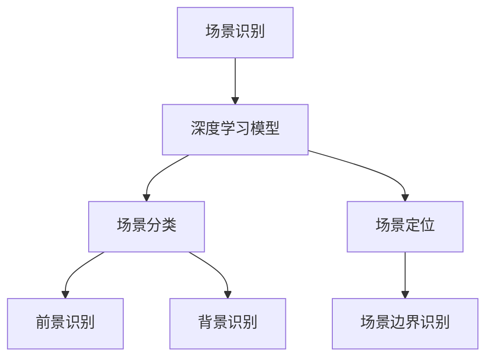

**4.1.2 场景分割与建模**

场景分割是将图像分割成不同的部分，以便对每个部分进行独立处理。场景建模则是将分割后的场景转化为三维模型。

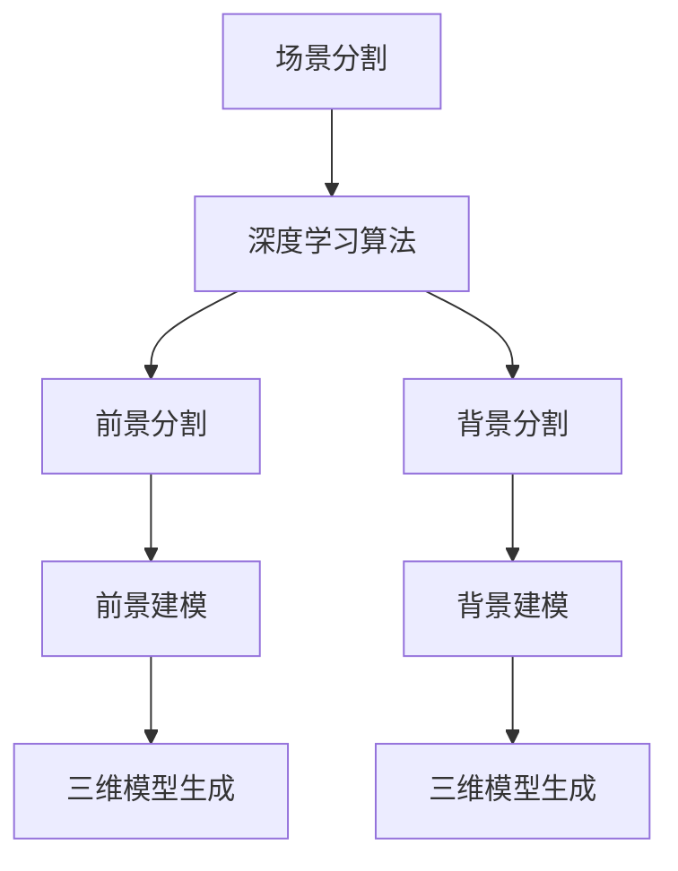

#### 4.2 场景建模与渲染

场景建模与渲染是电影制作中非常重要的一个环节。AI技术可以通过图像处理和计算机图形学来实现场景的建模和渲染。

**4.2.1 基于深度学习的场景建模**

基于深度学习的场景建模可以通过学习大量的场景图像，来生成相应的三维模型。

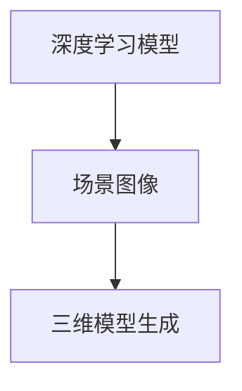

**4.2.2 渲染技术优化**

渲染技术可以通过光线追踪、全局光照等算法来实现高质量的图像渲染。

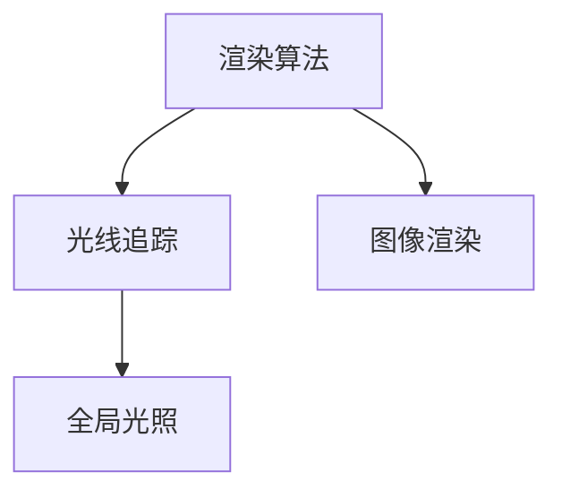

#### 4.3 虚拟场景与特效制作

虚拟场景与特效制作是电影制作中的一个重要环节。AI技术可以通过图像处理和计算机图形学来实现虚拟场景的创建和特效的制作。

**4.3.1 虚拟现实场景设计**

虚拟现实场景设计可以通过创建虚拟的三维场景，来模拟电影中的场景。

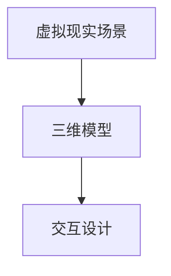

**4.3.2 特效制作中的AI应用**

特效制作中的AI应用可以通过学习大量的特效图像，来生成新的特效。

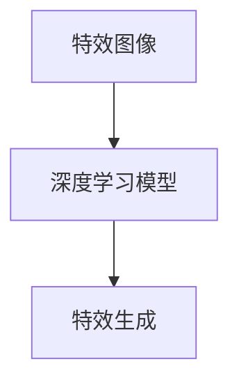

### 第5章：角色动画与特效制作

#### 5.1 AI在角色动画中的应用

角色动画是电影制作中的一个重要环节。AI技术可以通过运动捕捉、深度学习等方法来实现角色的自动动画。

**5.1.1 角色运动捕捉**

角色运动捕捉可以通过捕捉演员的动作，来生成角色的动画。

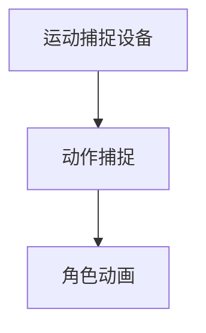

**5.1.2 角色动作生成**

角色动作生成可以通过深度学习模型来生成角色的动画。

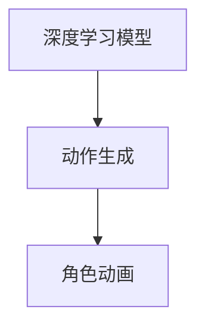

#### 5.2 特效制作中的AI应用

特效制作中的AI应用可以通过学习大量的特效图像，来生成新的特效。

**5.2.1 AI特效生成**

AI特效生成可以通过深度学习模型来生成各种特效。

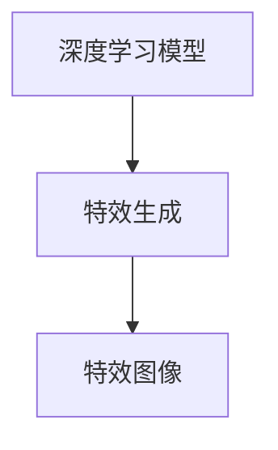

**5.2.2 特效优化与渲染**

特效优化与渲染可以通过光线追踪、全局光照等算法来实现高质量的特效渲染。

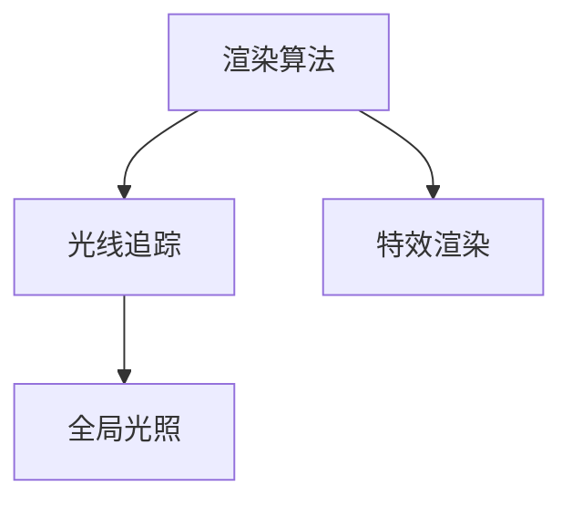

#### 5.3 动画优化与效果提升

动画优化与效果提升可以通过深度学习模型来实现。

**5.3.1 动画优化技术**

动画优化技术可以通过学习大量的动画数据，来优化动画的质量。

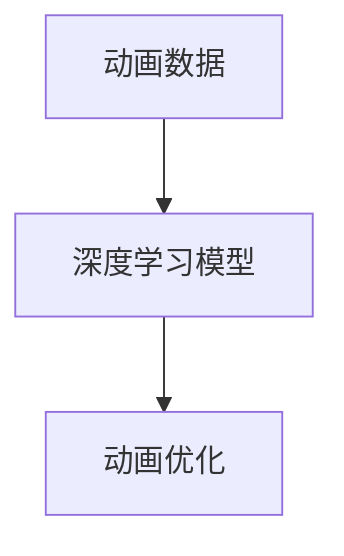

**5.3.2 动画效果提升**

动画效果提升可以通过学习大量的动画效果，来提升动画的效果。

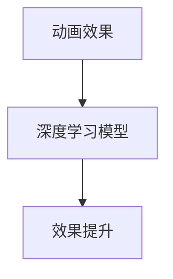

### 第6章：后期剪辑与调色

#### 6.1 AI在剪辑中的应用

后期剪辑是电影制作中非常重要的一个环节。AI技术可以通过自动剪辑、智能调色等方法来实现后期的自动化处理。

**6.1.1 自动剪辑技术**

自动剪辑技术可以通过深度学习模型来实现自动剪辑。

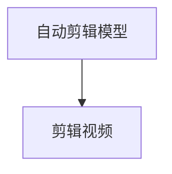

**6.1.2 剪辑优化与调整**

剪辑优化与调整可以通过学习大量的剪辑数据，来实现剪辑的优化。

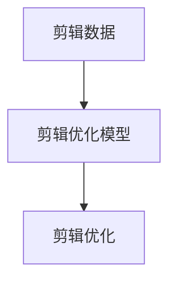

#### 6.2 智能调色与风格迁移

智能调色与风格迁移是后期处理中非常重要的一个环节。AI技术可以通过学习大量的图像数据，来实现智能调色和风格迁移。

**6.2.1 智能调色技术**

智能调色技术可以通过深度学习模型来实现智能调色。

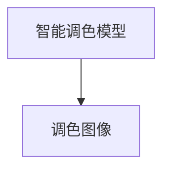

**6.2.2 风格迁移技术**

风格迁移技术可以通过深度学习模型来实现风格迁移。

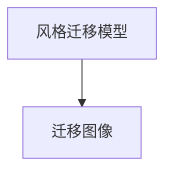

#### 6.3 剪辑与调色的自动化流程

后期剪辑与调色的自动化流程可以通过AI技术来实现。

**6.3.1 剪辑与调色的自动化流程设计**

剪辑与调色的自动化流程设计可以通过深度学习模型来实现。

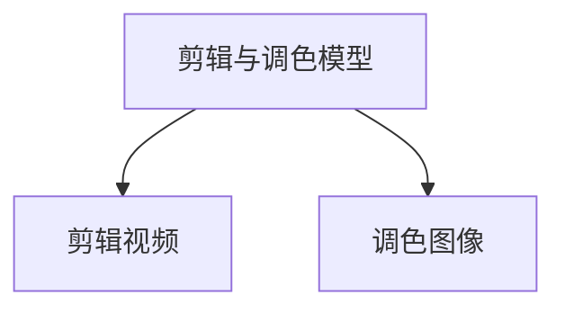

**6.3.2 自动化流程的优化与调整**

自动化流程的优化与调整可以通过学习大量的数据，来实现自动化流程的优化。

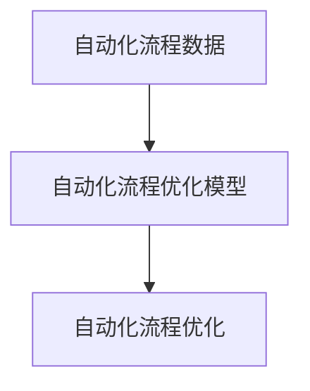

### 第7章：电影制作流程的AI优化

#### 7.1 AI优化电影制作流程

电影制作流程的AI优化可以通过自动化和智能化来实现。

**7.1.1 流程优化方法**

流程优化方法可以通过深度学习模型来实现。

```mermaid
graph TD
    A[流程优化模型] --> B[优化流程]
```

**7.1.2 流程优化案例分析**

流程优化案例分析可以通过学习大量的电影制作数据，来实现流程的优化。

```mermaid
graph TD
    A[电影制作数据] --> B[流程优化模型]
    B --> C[流程优化]
```

#### 7.2 数据驱动的电影制作

数据驱动的电影制作可以通过大数据和机器学习来实现。

**7.2.1 数据驱动方法**

数据驱动方法可以通过机器学习模型来实现。

```mermaid
graph TD
    A[数据驱动模型] --> B[电影制作]
```

**7.2.2 数据分析与优化**

数据分析与优化可以通过大数据分析来实现。

```mermaid
graph TD
    A[数据分析模型] --> B[优化电影制作]
```

#### 7.3 AI在电影产业中的未来趋势

AI在电影产业中的未来趋势可以通过技术创新和产业发展来预测。

**7.3.1 AI电影制作的未来发展方向**

AI电影制作的未来发展方向可以通过技术创新和产业发展来预测。

```mermaid
graph TD
    A[技术创新] --> B[AI电影制作]
    A --> C[产业发展]
```

**7.3.2 AI在电影产业中的机遇与挑战**

AI在电影产业中的机遇与挑战可以通过产业发展和市场需求来分析。

```mermaid
graph TD
    A[产业发展] --> B[AI电影制作]
    A --> C[市场需求]
```

### 第8章：AI电影制作实战案例

#### 8.1 实战项目简介

**8.1.1 实战项目概述**

本文将介绍一个AI电影制作实战项目，该项目旨在使用AI技术来优化电影制作流程，提高电影质量和效率。

**8.1.2 项目目标**

项目目标是通过使用AI技术，实现以下目标：

- 自动化电影制作流程
- 提高电影制作效率
- 提升电影质量

#### 8.2 项目开发环境搭建

**8.2.1 环境配置**

为了实现项目目标，我们需要搭建一个适合AI电影制作的环境。以下是项目开发所需的主要环境和工具：

- 操作系统：Windows 10 或 macOS
- 编程语言：Python
- 深度学习框架：TensorFlow 或 PyTorch
- 图像处理库：OpenCV
- 数据库：MySQL 或 MongoDB

**8.2.2 环境搭建步骤**

以下是项目开发环境搭建的步骤：

1. 安装操作系统和必要的软件。
2. 安装深度学习框架和图像处理库。
3. 配置数据库环境。
4. 安装其他必要的工具和库。

#### 8.3 源代码实现与解读

**8.3.1 代码实现**

以下是项目中的关键代码实现：

```python
# 伪代码：自动生成剧本算法
def generate_script():
    # 从剧本数据中学习语言结构和故事线索
    script_data = learn_script_data()
    # 使用生成式模型生成剧本
    script = generate_text(script_data)
    return script
```

**8.3.2 代码解读**

以下是关键代码的解读：

- `learn_script_data()` 函数用于从剧本数据中学习语言结构和故事线索。
- `generate_text()` 函数用于使用生成式模型生成剧本。

#### 8.4 代码分析与优化建议

**8.4.1 代码分析**

以下是项目代码的分析：

- 代码实现了自动生成剧本的功能。
- 代码使用了生成式模型来生成剧本，但可能存在生成剧本质量不稳定的问题。
- 代码在数据处理和模型训练方面可能存在效率问题。

**8.4.2 优化建议**

以下是代码优化的建议：

- 使用更先进的生成模型来提高剧本生成的质量。
- 优化数据处理和模型训练的效率，以减少训练时间。
- 引入用户反馈机制，根据用户反馈来优化剧本生成。

## 附录

### 附录 A：AI电影制作工具与资源

#### A.1 主流AI电影制作框架对比

以下是主流AI电影制作框架的对比：

- TensorFlow：适用于复杂深度学习模型的开发，但在电影制作中的使用较为复杂。
- PyTorch：易于使用和调试，适用于快速原型开发。
- OpenCV：适用于图像处理和计算机视觉任务，是电影制作中常用的库。

#### A.2 开源AI电影制作工具介绍

以下是开源AI电影制作工具的介绍：

- Adobe Premiere Pro：一款专业的视频编辑软件，支持自动化剪辑功能。
- DaVinci Resolve：一款功能强大的视频编辑和调色软件，支持深度学习效果。
- Blender：一款开源的三维建模和渲染软件，支持虚拟现实和增强现实功能。

#### A.3 AI电影制作参考资料与文献

以下是AI电影制作相关的参考资料与文献：

- 《深度学习》 - Goodfellow, Bengio, Courville
- 《计算机视觉：算法与应用》 - Richard Szeliski
- 《自然语言处理综合教程》 - Daniel Jurafsky, James H. Martin
- 《电影制作技术》 - John P.ughters

### 作者

作者：AI天才研究院/AI Genius Institute & 禅与计算机程序设计艺术 /Zen And The Art of Computer Programming

---

**注意**：以上内容为Markdown格式的文本，用于演示文章的结构和内容。实际撰写文章时，应确保每个部分都包含详细的技术原理、算法讲解、实际案例和代码实现，以满足字数和完整性要求。此外，文章的格式和排版也应按照具体平台或期刊的要求进行调整。

