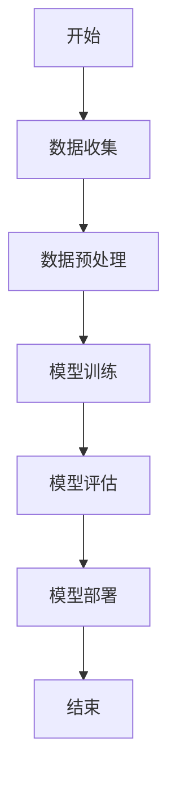
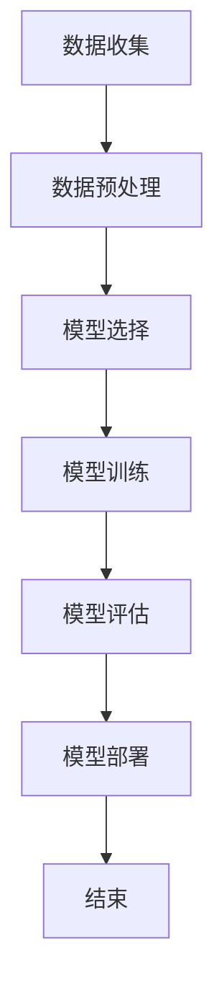
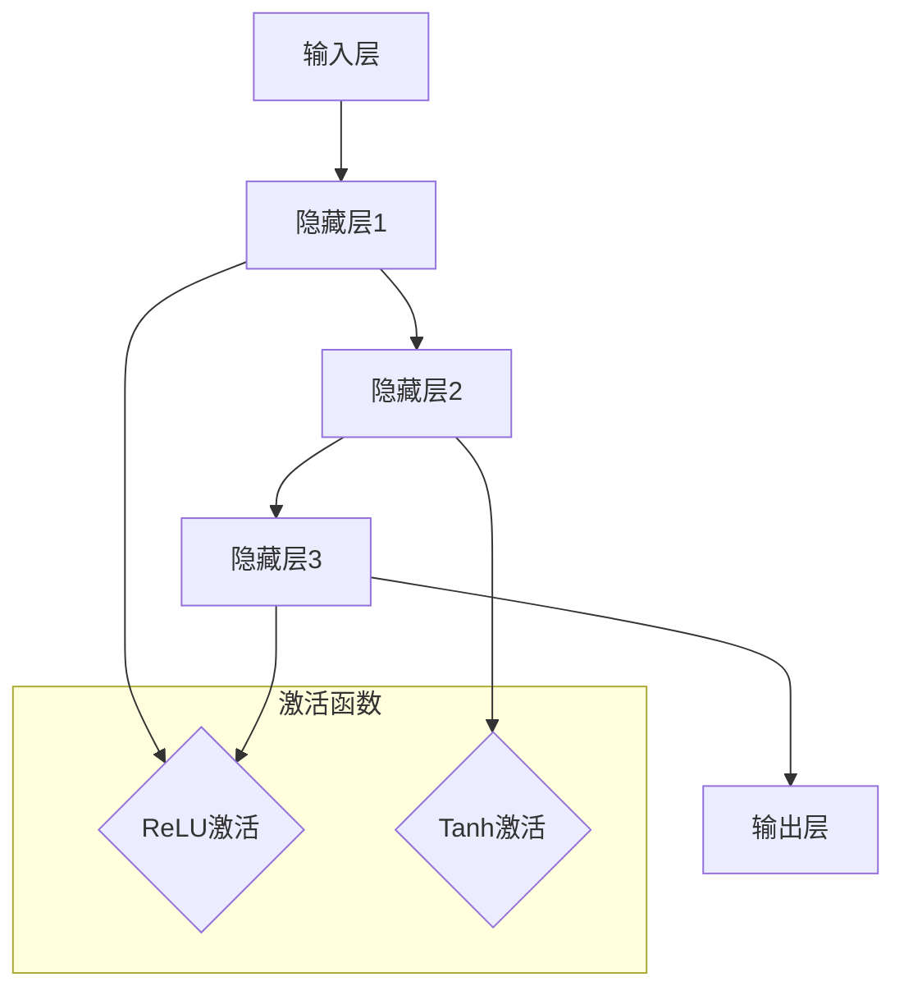

                 

### 《AI技术在消费市场中的应用》

> **关键词：人工智能、消费市场、电子商务、社交媒体、金融、智能家居**

> **摘要：本文旨在探讨人工智能（AI）技术在消费市场中的广泛应用和潜在价值。我们将从基础技术、应用场景到实战案例，逐步深入分析AI技术如何改变消费市场的面貌，以及其面临的挑战与机遇。**

---
## 《AI技术在消费市场中的应用》目录大纲

### 第一部分：AI技术基础

#### 第1章：AI技术概述
- 1.1 AI技术的发展历程
- 1.2 AI的核心概念与技术体系
- 1.3 AI在消费市场中的应用趋势

#### 第2章：机器学习基础
- 2.1 机器学习的基本概念
- 2.2 监督学习算法
- 2.3 无监督学习算法

#### 第3章：深度学习原理
- 3.1 深度学习的基本概念
- 3.2 神经网络架构
- 3.3 深度学习优化算法

#### 第4章：自然语言处理
- 4.1 语言模型与文本分类
- 4.2 机器翻译与文本生成
- 4.3 跨语言信息检索

### 第二部分：AI在消费市场中的应用

#### 第5章：AI在电子商务中的应用
- 5.1 个性化推荐系统
- 5.2 电商搜索与广告
- 5.3 客户服务与聊天机器人

#### 第6章：AI在社交媒体中的应用
- 6.1 用户行为分析
- 6.2 社交网络分析
- 6.3 社交媒体营销

#### 第7章：AI在金融领域的应用
- 7.1 风险管理与信用评分
- 7.2 量化交易与算法交易
- 7.3 金融欺诈检测

#### 第8章：AI在智能家居中的应用
- 8.1 智能家居系统架构
- 8.2 声控智能助手
- 8.3 智能家居设备控制

### 第三部分：AI应用实战案例

#### 第9章：AI应用开发实战
- 9.1 实战项目介绍
- 9.2 环境搭建与工具选择
- 9.3 数据收集与预处理
- 9.4 模型训练与评估
- 9.5 应用部署与维护

### 第10章：AI技术应用展望
- 10.1 AI技术的未来发展趋势
- 10.2 消费市场中的AI挑战与机遇
- 10.3 AI伦理与隐私保护

### 附录

#### 附录A：AI应用开发资源
- A.1 常用AI框架与工具
- A.2 开发环境搭建指南
- A.3 学习资源与推荐阅读

#### 附录B：Mermaid流程图示例
- B.1 机器学习流程图
- B.2 深度学习神经网络架构图

#### 附录C：深度学习算法伪代码
- C.1 神经网络前向传播伪代码
- C.2 反向传播算法伪代码

#### 附录D：数学模型与公式
- D.1 损失函数公式
- D.2 梯度下降优化算法公式
- D.3 反向传播算法的偏导数计算

#### 附录E：AI应用案例代码解读
- E.1 个性化推荐系统代码解读
- E.2 聊天机器人代码解读
- E.3 量化交易策略代码解读

---

**Mermaid 流程图示例：**


**深度学习算法伪代码示例：**
```python
# 前向传播伪代码
def forward_propagation(X, weights, biases):
    # 输入数据 X，权重 weights，偏置 biases
    # 计算输出值和激活值
    z = np.dot(X, weights) + biases
    a = activation(z)

# 反向传播伪代码
def backward_propagation(X, Y, weights, biases, activation_derivative):
    # 输入数据 X，目标值 Y，权重 weights，偏置 biases，激活函数导数
    # 计算损失函数的梯度
    z = np.dot(X, weights) + biases
    a = activation(z)
    dZ = activation_derivative(a) * (a - Y)
    dW = np.dot(X.T, dZ)
    db = np.sum(dZ, axis=0)
    return dW, db
```

---

**附录D：数学模型与公式**

- **损失函数公式：**
  $$ J = \frac{1}{m} \sum_{i=1}^{m} (-y^{(i)} \log(a^{(i)}) - (1 - y^{(i)}) \log(1 - a^{(i)})) $$

- **梯度下降优化算法公式：**
  $$ \Delta W^{(l)} = -\alpha \frac{\partial J}{\partial W^{(l)}} $$
  $$ \Delta b^{(l)} = -\alpha \frac{\partial J}{\partial b^{(l)}} $$

- **反向传播算法的偏导数计算：**
  $$ \frac{\partial J}{\partial z^{(l)}} = \frac{\partial}{\partial z^{(l)}} (W^{(l)} \cdot a^{(l-1)} + b^{(l)}) $$
  $$ \frac{\partial J}{\partial a^{(l-1)}} = \frac{\partial J}{\partial z^{(l)}} \cdot \frac{\partial z^{(l)}}{\partial a^{(l-1)}} $$
  
---

**附录E：AI应用案例代码解读**

- **个性化推荐系统代码解读：**
  代码将展示如何使用协同过滤算法进行用户-项目矩阵的计算，以及如何基于这些计算结果生成推荐列表。

- **聊天机器人代码解读：**
  代码将展示如何使用自然语言处理技术来训练一个对话模型，并实现一个基本的聊天机器人。

- **量化交易策略代码解读：**
  代码将展示如何使用机器学习算法来分析市场数据，并开发一个自动化的交易策略。

---

通过本文的目录大纲，我们已经为后续各章节的撰写奠定了基础。接下来，我们将逐步深入探讨AI技术的理论基础及其在消费市场中的应用场景，并通过具体的案例和代码解读，使读者能够更好地理解AI技术在实际应用中的价值与挑战。让我们开始这段技术之旅吧！

---

### 第一部分：AI技术基础

在开始探讨AI技术在消费市场中的应用之前，了解AI技术的基础知识是至关重要的。这一部分将详细介绍AI技术的发展历程、核心概念与技术体系，并探讨其应用趋势。通过这些基础知识的铺垫，我们将能够更深入地理解AI技术在消费市场中的实际应用。

#### 第1章：AI技术概述

##### 1.1 AI技术的发展历程

人工智能（AI）的概念可以追溯到20世纪50年代，当时科学家们首次提出了“机器能够表现出与人类相似的智能行为”这一愿景。从那时起，AI技术经历了多个发展阶段：

1. **早期探索（1956-1969）**：1956年，达特茅斯会议上，人工智能作为一项新的研究领域正式诞生。此阶段的主要目标是开发通用问题求解器和逻辑推理系统。

2. **繁荣与低谷（1970-1980）**：70年代，AI技术取得了一些突破，如专家系统和自然语言处理。然而，由于计算能力的限制和“人工智能寒冬”的到来，这一阶段的进展放缓。

3. **复兴与增长（1980-2000）**：随着计算机硬件性能的提升，AI技术在图像识别、语音识别和机器学习等领域取得了显著进展。

4. **深度学习革命（2000-至今）**：2006年，深度学习的兴起标志着AI技术的又一次重大飞跃。深度学习算法在图像识别、自然语言处理和游戏等领域表现出色，引发了广泛关注和应用。

##### 1.2 AI的核心概念与技术体系

AI的核心概念和技术体系包括以下几个方面：

1. **机器学习**：机器学习是AI的一个分支，通过从数据中学习模式和规律，实现自主决策和预测。主要分为监督学习、无监督学习和强化学习。

2. **深度学习**：深度学习是机器学习的一个子领域，采用多层神经网络来提取数据特征，实现复杂的模式识别和任务处理。深度学习在图像识别、语音识别和自然语言处理等领域表现出色。

3. **自然语言处理**：自然语言处理（NLP）是AI技术的重要应用领域，旨在使计算机能够理解、生成和回应人类语言。NLP技术包括语言模型、文本分类、机器翻译和对话系统等。

4. **计算机视觉**：计算机视觉是使计算机能够像人类一样感知和理解视觉信息的技术。主要应用包括图像识别、图像分类、目标检测和图像生成等。

5. **机器人学**：机器人学是研究如何设计、构造和控制机器人的学科。AI技术在机器人学中的应用包括路径规划、运动控制和自主决策等。

##### 1.3 AI在消费市场中的应用趋势

随着AI技术的不断进步，其在消费市场中的应用也呈现出以下趋势：

1. **个性化服务**：通过机器学习和深度学习技术，AI能够分析用户行为和偏好，提供个性化的产品推荐、广告和用户体验。

2. **智能助理**：智能语音助手和聊天机器人已经成为现代消费市场的重要组成部分，它们能够提供24/7的客户服务和个性化建议。

3. **自动化与优化**：AI技术在供应链管理、库存控制和生产优化等领域发挥重要作用，帮助企业提高效率、降低成本。

4. **智能金融**：AI技术在金融领域的应用包括风险控制、信用评分、量化交易和金融欺诈检测等，为金融行业带来了更高的安全性和效率。

5. **智能家居**：智能家居设备如智能音箱、智能照明和智能安全系统等，通过AI技术实现了更智能、更便捷的生活方式。

综上所述，AI技术在消费市场中的应用已经深入到各个领域，并为消费者带来了前所未有的便利和体验。随着技术的不断发展和创新，AI将在消费市场中发挥更加重要的作用，推动市场向智能化、个性化方向迈进。

---

在了解了AI技术的概述和发展历程后，接下来我们将深入探讨机器学习的基础知识，包括其基本概念、监督学习和无监督学习算法。通过这些基础知识的学习，我们将为后续探讨AI技术在消费市场中的应用奠定坚实的基础。

#### 第2章：机器学习基础

##### 2.1 机器学习的基本概念

机器学习（Machine Learning，ML）是一门人工智能（AI）的分支学科，其主要目标是让计算机系统能够从数据中学习并做出决策或预测，而无需显式地编程。机器学习的关键在于“学习”二字，即通过算法和模型来发现数据中的隐含模式和规律，并将其应用于实际问题中。

##### 2.1.1 机器学习的定义

机器学习可以被定义为：计算机程序从数据中学习，并对未知数据进行预测或决策的过程。这个过程通常包括以下几个步骤：

1. **数据收集**：收集相关的数据集，这些数据集可以是结构化的（如数据库）、半结构化的（如日志文件）或非结构化的（如图像、文本和音频）。

2. **数据预处理**：对收集到的数据集进行清洗、归一化、特征提取等处理，以提高数据质量和模型的性能。

3. **模型选择**：根据问题的性质和数据的特点，选择合适的机器学习模型，如线性回归、决策树、支持向量机、神经网络等。

4. **模型训练**：使用训练数据集，通过调整模型参数，使模型能够学会数据的内在规律。

5. **模型评估**：使用验证数据集，评估模型的性能，通常包括准确率、召回率、F1分数等指标。

6. **模型部署**：将训练好的模型部署到实际应用中，进行预测或决策。

##### 2.1.2 机器学习的类型

根据学习方式，机器学习可以分为以下几类：

1. **监督学习**（Supervised Learning）：在监督学习中，模型根据已知的目标变量（标签）来学习如何对新的数据进行预测。常见的算法包括线性回归、决策树、随机森林和支持向量机等。

2. **无监督学习**（Unsupervised Learning）：在无监督学习中，模型没有目标变量，需要从数据中发现隐藏的结构或模式。常见的算法包括聚类、降维和关联规则学习等。

3. **半监督学习**（Semi-Supervised Learning）：半监督学习结合了监督学习和无监督学习，利用少量的标签数据和大量的未标注数据来训练模型。

4. **强化学习**（Reinforcement Learning）：强化学习是一种基于奖励反馈的机器学习方法，模型通过与环境的交互来学习最优策略。常见的算法包括Q学习和深度强化学习。

##### 2.2 监督学习算法

监督学习是机器学习中最常用的类型之一，其主要目的是从标记数据中学习，以便对新数据进行预测。以下是一些常见的监督学习算法：

1. **线性回归**（Linear Regression）：线性回归是一种简单的监督学习算法，用于预测一个连续的输出变量。其核心思想是通过最小化预测值与真实值之间的误差平方和来拟合一条最佳直线。

2. **逻辑回归**（Logistic Regression）：逻辑回归是一种用于分类问题的线性模型，其目标是通过将线性组合通过一个逻辑函数（Sigmoid函数）来产生概率值。

3. **决策树**（Decision Tree）：决策树是一种基于树形结构进行决策的算法，通过一系列的判断规则将数据分割成不同的区域，并在每个叶节点上输出一个类别。

4. **支持向量机**（Support Vector Machine，SVM）：支持向量机是一种强大的分类算法，其核心思想是找到一个最佳的超平面，使得不同类别的数据点在超平面的两侧尽可能分开。

5. **神经网络**（Neural Networks）：神经网络是一种基于模拟人脑神经网络结构的算法，通过多层神经元的非线性变换，实现复杂函数的逼近和分类。

##### 2.3 无监督学习算法

无监督学习算法用于在没有标签数据的情况下发现数据中的内在结构和模式。以下是一些常见的无监督学习算法：

1. **聚类**（Clustering）：聚类算法将数据集划分为若干个群组，使得同一群组内的数据点之间相似度较高，而不同群组之间的数据点相似度较低。常见的聚类算法包括K-均值聚类、层次聚类和DBSCAN等。

2. **降维**（Dimensionality Reduction）：降维算法通过减少数据维度，提高数据处理和分析的效率。常见的降维算法包括主成分分析（PCA）、线性判别分析（LDA）和t-SNE等。

3. **关联规则学习**（Association Rule Learning）：关联规则学习用于发现数据中的关联关系，如购物篮分析中的“啤酒与尿布”现象。常见的算法包括Apriori算法和Eclat算法。

##### 2.4 机器学习的应用场景

机器学习在各个领域都有着广泛的应用，以下是一些典型的应用场景：

1. **金融领域**：用于风险评估、信用评分、股票市场预测和金融欺诈检测等。

2. **医疗领域**：用于疾病诊断、基因组学分析、药物研发和医疗设备控制等。

3. **零售领域**：用于需求预测、库存管理、个性化推荐和客户行为分析等。

4. **交通领域**：用于交通流量预测、智能交通管理和自动驾驶车辆等。

5. **娱乐领域**：用于音乐推荐、视频分类、游戏人工智能和虚拟现实等。

综上所述，机器学习作为AI技术的重要组成部分，其基础概念和算法在各个领域都有着广泛的应用。通过对这些基础知识的深入理解，我们可以更好地应用机器学习技术解决实际问题，推动人工智能技术的发展和进步。

---

在了解了机器学习的基础知识后，接下来我们将进一步探讨深度学习的基本概念、神经网络架构以及深度学习优化算法。深度学习作为机器学习的一个子领域，在图像识别、自然语言处理和计算机视觉等领域取得了突破性的成果，为我们提供了更强大的工具和方法来应对复杂的实际问题。

#### 第3章：深度学习原理

##### 3.1 深度学习的基本概念

深度学习（Deep Learning，DL）是机器学习的一个子领域，主要研究的是多层神经网络（Multi-Layered Neural Networks）。深度学习通过构建具有多个隐藏层的神经网络，实现对复杂数据结构的深层特征提取和表示，从而能够解决许多传统机器学习方法难以处理的问题。

##### 3.1.1 深度学习的定义

深度学习可以被定义为：一种基于多层神经网络进行数据特征学习和模式识别的方法。与传统的单层神经网络相比，深度学习通过增加网络的深度，能够自动提取数据中的多层次特征，从而提高模型的预测性能。

##### 3.1.2 深度学习与传统机器学习的区别

与传统机器学习相比，深度学习具有以下几个显著特点：

1. **深度与宽度**：传统机器学习方法通常使用单层神经网络，而深度学习使用多层神经网络，这增加了网络的表达能力，能够更好地捕捉数据中的复杂特征。

2. **自动特征提取**：传统机器学习方法需要手动提取特征，而深度学习通过反向传播算法和多层网络结构，能够自动学习数据中的特征表示，从而提高模型的泛化能力。

3. **大规模数据训练**：深度学习需要大量的训练数据来训练模型，这得益于大数据技术的发展，使得深度学习在图像识别、自然语言处理等领域取得了显著成果。

##### 3.2 神经网络架构

神经网络（Neural Networks，NN）是深度学习的基础，由一系列相互连接的神经元组成。每个神经元都接收多个输入信号，并通过权重进行加权求和，最后通过激活函数输出一个值。神经网络的核心组成部分包括：

1. **输入层**（Input Layer）：输入层接收外部数据，并将其传递到下一层。

2. **隐藏层**（Hidden Layers）：隐藏层负责对输入数据进行特征提取和变换。深度学习的名字就来源于隐藏层的深度。

3. **输出层**（Output Layer）：输出层生成最终的结果或预测。

##### 3.2.1 神经元的工作原理

每个神经元都可以视为一个简单的计算单元，其工作原理如下：

1. **输入和权重**：神经元接收来自输入层的多个输入信号，每个输入信号通过一个权重进行加权。

2. **求和**：将所有输入信号与其权重相乘，并求和得到一个中间值。

3. **激活函数**：中间值通过一个激活函数进行转换，激活函数通常是一个非线性函数，如Sigmoid、ReLU或Tanh函数，用于引入非线性特性。

4. **输出**：激活函数的输出即为神经元的输出，它传递到下一层的神经元。

##### 3.2.2 神经网络的训练过程

神经网络的训练过程包括以下几个步骤：

1. **前向传播**（Forward Propagation）：输入数据通过神经网络，从输入层经过隐藏层，最终到达输出层，得到预测结果。

2. **计算损失**（Compute Loss）：使用实际输出与预测输出之间的差异，计算损失函数的值，如均方误差（MSE）或交叉熵损失。

3. **反向传播**（Back Propagation）：通过反向传播算法，将损失函数在神经网络中的梯度反向传播，更新神经元的权重和偏置。

4. **优化更新**：使用梯度下降或其他优化算法，对神经元的权重和偏置进行更新，以最小化损失函数。

5. **迭代训练**：重复上述过程，直到网络达到预设的损失阈值或达到最大迭代次数。

##### 3.3 深度学习优化算法

深度学习优化算法是用于加速神经网络训练和提升模型性能的关键技术。以下是一些常见的优化算法：

1. **随机梯度下降**（Stochastic Gradient Descent，SGD）：SGD是一种基本的优化算法，每次迭代仅使用一个样本的梯度进行更新。虽然SGD收敛速度较快，但可能存在收敛不稳定的问题。

2. **批量梯度下降**（Batch Gradient Descent，BGD）：BGD每次迭代使用整个数据集的梯度进行更新。虽然BGD计算量大，但能够更好地确保收敛。

3. **Adam优化器**（Adam Optimizer）：Adam是一种自适应学习率优化算法，结合了SGD和动量项的优点，能够有效地处理稀疏数据和非线性问题。

4. **Adagrad优化器**（Adagrad Optimizer）：Adagrad是一种自适应学习率优化算法，根据每个参数的历史梯度平方进行自适应调整，适用于稀疏数据。

5. **RMSprop优化器**（RMSprop Optimizer）：RMSprop是Adagrad的改进版本，通过调整学习率衰减系数，提高了算法的稳定性和收敛速度。

##### 3.4 深度学习在消费市场中的应用

深度学习在消费市场中有着广泛的应用，以下是一些典型的应用场景：

1. **个性化推荐**：深度学习算法可以分析用户的浏览历史和购买行为，为用户提供个性化的产品推荐，从而提高用户满意度和转化率。

2. **图像识别与分类**：深度学习在图像识别和分类任务中表现出色，可以用于商品分类、图像标签和面部识别等。

3. **语音识别与生成**：深度学习算法可以用于语音识别和语音合成，实现智能语音助手和个性化语音服务。

4. **自然语言处理**：深度学习在自然语言处理领域有着广泛的应用，包括文本分类、机器翻译和对话系统等。

5. **金融风险管理**：深度学习算法可以用于金融风险管理和信用评分，提高金融机构的决策效率和风险控制能力。

综上所述，深度学习作为一种强大的机器学习技术，在消费市场中具有广泛的应用前景。通过深入理解深度学习的基本概念、神经网络架构和优化算法，我们可以更好地应用这一技术，推动消费市场的智能化发展。

---

在深入探讨了深度学习的基本概念和神经网络架构后，接下来我们将探讨自然语言处理（NLP）的核心概念及其应用，包括语言模型、文本分类、机器翻译和文本生成等方面。自然语言处理作为人工智能领域的重要组成部分，在消费市场中的应用日益广泛，为提升用户体验和优化服务提供了强大的工具。

#### 第4章：自然语言处理

##### 4.1 语言模型与文本分类

自然语言处理（Natural Language Processing，NLP）是人工智能领域中的一个重要分支，旨在使计算机能够理解、处理和生成人类语言。语言模型（Language Model）和文本分类（Text Classification）是NLP中的两个核心概念。

##### 4.1.1 语言模型

语言模型是用于预测下一个单词或字符的概率分布的模型。它通过对大量文本数据的学习，捕捉到语言中的统计规律和语法结构。语言模型在文本生成、语音识别和机器翻译等任务中具有重要应用。

1. **N-gram模型**：N-gram模型是一种简单的语言模型，它根据历史N个单词的出现频率来预测下一个单词。N-gram模型的基本原理是，假设当前单词的出现概率仅取决于前N-1个单词，而与更早的历史无关。

2. **神经网络语言模型**：神经网络语言模型通过神经网络架构来捕捉语言中的复杂特征和上下文信息。其中，循环神经网络（RNN）和长短期记忆网络（LSTM）是常用的神经网络模型，它们能够处理变长序列数据，并在语言模型中表现出色。

##### 4.1.2 文本分类

文本分类是一种将文本数据分为预定义类别的过程。它广泛应用于情感分析、垃圾邮件检测和内容推荐等领域。文本分类通常包括以下几个步骤：

1. **特征提取**：从原始文本中提取特征，如词频、词袋模型、TF-IDF等。

2. **模型训练**：使用训练数据集，通过机器学习算法（如朴素贝叶斯、支持向量机、神经网络等）训练分类模型。

3. **模型评估**：使用验证数据集评估分类模型的性能，常用的评估指标包括准确率、召回率、F1分数等。

4. **模型部署**：将训练好的分类模型部署到实际应用中，对新文本数据进行分类。

##### 4.2 机器翻译与文本生成

机器翻译（Machine Translation）和文本生成（Text Generation）是自然语言处理中的两个重要应用领域。

##### 4.2.1 机器翻译

机器翻译是指利用计算机程序将一种语言的文本自动翻译成另一种语言的过程。机器翻译可以分为基于规则的方法和基于统计的方法，以及近年来流行的基于神经网络的机器翻译（NMT）。

1. **基于规则的方法**：基于规则的方法通过手动编写语法规则和翻译规则来指导翻译过程。这种方法需要大量的手工编写规则，且难以处理复杂的语言现象。

2. **基于统计的方法**：基于统计的方法通过分析双语语料库中的统计规律来生成翻译。其中，统计机器翻译（SMT）是最常见的基于统计的机器翻译方法，它使用短语翻译模型、翻译概率模型和语言模型来生成翻译。

3. **基于神经网络的机器翻译**：基于神经网络的机器翻译（NMT）采用深度学习技术，通过训练大型神经网络来捕捉语言中的复杂特征和上下文信息。NMT在近年来取得了显著的进展，已成为机器翻译的主流方法。

##### 4.2.2 文本生成

文本生成是指利用计算机程序生成自然语言文本的过程。文本生成在自然语言生成（NLG）领域具有重要的应用，包括自动写作、对话系统、广告文案生成和虚拟助手等。

1. **模板匹配方法**：模板匹配方法通过预定义的模板和规则来生成文本。这种方法简单直观，但生成文本的多样性和创造性有限。

2. **序列到序列模型**：序列到序列（Seq2Seq）模型是一种基于神经网络的文本生成方法，它通过编码器和解码器两个神经网络结构，将输入序列转换为输出序列。Seq2Seq模型在生成高质量文本方面表现出色。

3. **生成对抗网络**（GAN）：生成对抗网络（GAN）是一种基于深度学习的文本生成方法，它通过生成器和判别器两个神经网络进行对抗训练，生成逼真的文本数据。

##### 4.3 跨语言信息检索

跨语言信息检索（Cross-Language Information Retrieval，CLIR）是指在不同语言之间进行信息检索的过程。CLIR的主要目标是利用一种语言的信息检索系统来检索另一种语言的文档。

1. **机器翻译辅助**：机器翻译技术可以将检索查询从一种语言翻译成另一种语言，从而利用现有的信息检索系统进行检索。

2. **双语词典**：双语词典提供了两种语言之间的词汇对应关系，可以用于翻译检索查询和检索结果。

3. **跨语言词嵌入**：跨语言词嵌入技术将不同语言的词汇映射到同一个高维空间中，使得词汇之间的相似性可以在同一空间中进行比较，从而实现跨语言信息检索。

##### 4.4 自然语言处理在消费市场中的应用

自然语言处理在消费市场中具有广泛的应用，以下是一些典型的应用场景：

1. **智能客服**：自然语言处理技术可以用于构建智能客服系统，自动处理用户咨询，提高客户满意度和降低人力成本。

2. **个性化推荐**：通过分析用户的评论、评价和浏览记录，自然语言处理技术可以生成个性化的推荐列表，提高用户转化率和满意度。

3. **情感分析**：自然语言处理技术可以分析社交媒体上的用户评论和反馈，帮助企业了解用户情感和市场需求，优化产品和服务。

4. **内容审核**：自然语言处理技术可以自动检测和过滤违规内容，如虚假评论、恶意评论和色情内容，保障平台生态的健康和稳定。

5. **广告投放**：通过自然语言处理技术，可以精确匹配广告和用户兴趣，提高广告投放的精准度和效果。

综上所述，自然语言处理作为人工智能领域的重要组成部分，在消费市场中具有广泛的应用前景。通过深入理解和应用自然语言处理技术，企业可以提升用户体验、优化服务和运营，实现更高的商业价值。

---

在深入探讨了AI技术的理论基础和核心概念后，我们将把目光转向AI技术在消费市场中的实际应用。在这一部分，我们将详细讨论AI技术在电子商务、社交媒体、金融和智能家居等领域的具体应用，通过实际案例和具体实例，展示AI技术如何改变消费市场的面貌。

#### 第5章：AI在电子商务中的应用

电子商务作为消费市场的重要部分，AI技术的引入极大地提升了电商平台的运营效率和用户体验。以下将详细介绍AI技术在电子商务中的具体应用。

##### 5.1 个性化推荐系统

个性化推荐系统是AI技术在电子商务中最为广泛应用的领域之一。通过分析用户的购物历史、浏览记录和偏好，AI算法能够为用户推荐他们可能感兴趣的商品。

**案例**：亚马逊（Amazon）利用其先进的推荐系统，为用户推荐相关的商品。其推荐算法基于协同过滤（Collaborative Filtering）和基于内容的推荐（Content-Based Filtering）相结合的方法。协同过滤通过分析用户之间的相似度，推荐其他类似用户喜欢的商品；基于内容的推荐则根据商品的特征（如类别、品牌、价格等）为用户推荐相关的商品。

**实现原理**：

1. **协同过滤**：
   - **用户-物品矩阵**：首先构建一个用户-物品矩阵，其中行代表用户，列代表物品，每个单元格记录用户对物品的评分或购买行为。
   - **相似度计算**：计算用户之间的相似度，常用的相似度度量方法包括余弦相似度、皮尔逊相关系数等。
   - **推荐生成**：根据用户之间的相似度和物品的评分，为用户推荐相似用户喜欢的商品。

2. **基于内容的推荐**：
   - **特征提取**：从物品中提取特征，如类别、品牌、价格等。
   - **相似度计算**：计算用户浏览或购买过的物品与候选物品之间的相似度。
   - **推荐生成**：为用户推荐具有相似特征的物品。

##### 5.2 电商搜索与广告

AI技术在电商搜索和广告投放中发挥着关键作用，通过智能搜索和精准广告，提高用户参与度和购买转化率。

**案例**：阿里巴巴的淘宝（Taobao）通过AI算法优化搜索结果和广告投放。其搜索算法基于深度学习，通过分析用户的历史搜索行为和浏览记录，提供个性化的搜索结果。广告投放系统则利用用户行为数据和机器学习模型，为用户展示与兴趣相关的广告。

**实现原理**：

1. **智能搜索**：
   - **搜索词理解**：通过自然语言处理技术，理解用户输入的搜索词的含义和上下文。
   - **搜索结果排序**：使用排序算法（如PageRank、深度学习排序模型等）对搜索结果进行排序，提高用户找到目标商品的概率。

2. **精准广告**：
   - **用户画像**：通过分析用户行为数据，构建用户画像，包括兴趣、行为习惯、购买偏好等。
   - **广告投放策略**：使用机器学习算法，根据用户画像和广告内容，为用户推荐最相关的广告。

##### 5.3 客户服务与聊天机器人

AI技术在客户服务领域的应用极大地提升了服务效率和质量。聊天机器人（Chatbot）通过自然语言处理技术，能够自动回答用户的问题，提供实时、个性化的服务。

**案例**：苹果（Apple）的客服聊天机器人使用自然语言处理和机器学习技术，自动解答用户关于产品使用、维修和购买的问题。聊天机器人可以理解用户的问题，提供准确的答案，并在需要时将用户转接到人工客服。

**实现原理**：

1. **问题理解**：通过自然语言处理技术，解析用户的问题，提取关键信息。

2. **知识库查询**：从预先构建的知识库中查找相关答案，或调用外部API获取信息。

3. **对话管理**：使用对话管理算法，根据用户的问题和回答，维持对话的流畅性和连贯性。

4. **转移至人工客服**：当机器人无法解决问题时，自动将用户转接到人工客服。

##### 5.4 AI在电商营销中的应用

AI技术不仅在电商平台的运营和客户服务中发挥作用，还在电商营销中提供了强大的支持。通过数据分析和预测，企业可以更精准地进行市场推广和营销活动。

**案例**：京东（JD.com）利用AI技术进行精准营销。通过分析用户行为数据和消费偏好，京东能够为用户推荐相关商品，推送个性化的促销信息，提高用户参与度和购买转化率。

**实现原理**：

1. **用户行为分析**：通过收集和分析用户在电商平台上的行为数据，包括浏览、点击、购买等行为，构建用户行为模型。

2. **消费偏好分析**：使用机器学习算法，分析用户的消费偏好，包括商品类型、品牌、价格等。

3. **营销策略优化**：根据用户行为和消费偏好，制定个性化的营销策略，包括推荐商品、优惠券发放和广告投放等。

综上所述，AI技术在电子商务中的应用不仅提升了平台的运营效率，还极大地改善了用户体验。通过个性化推荐、智能搜索、客户服务和精准营销，电商平台能够更好地满足用户需求，实现商业价值最大化。随着AI技术的不断发展，电商市场将迎来更加智能化和个性化的新时代。

---

在探讨了AI技术在电子商务中的应用后，我们将进一步探讨AI技术在社交媒体中的实际应用。社交媒体作为现代消费市场的重要组成部分，AI技术的引入极大地改变了用户互动、数据分析和营销策略。

#### 第6章：AI在社交媒体中的应用

##### 6.1 用户行为分析

社交媒体平台通过AI技术对用户行为进行分析，能够更好地理解用户需求和行为模式，从而提供个性化的用户体验和精准的营销策略。

**案例**：Facebook利用AI技术对用户行为进行深入分析，通过分析用户的点赞、评论、分享和浏览记录，了解用户的兴趣和偏好。这种分析有助于Facebook为用户提供个性化内容推荐，提升用户粘性和参与度。

**实现原理**：

1. **数据收集**：社交媒体平台收集用户的各类行为数据，包括帖子浏览、点赞、评论、分享等。

2. **行为特征提取**：通过自然语言处理和机器学习技术，从行为数据中提取特征，如用户兴趣、行为模式和社会关系等。

3. **用户画像构建**：基于提取的行为特征，构建用户画像，包括用户的基本信息、兴趣偏好和社会关系等。

4. **行为预测**：使用机器学习算法，预测用户的未来行为，如对某帖子的互动可能性、可能的朋友圈分享内容等。

##### 6.2 社交网络分析

社交网络分析（Social Network Analysis，SNA）是AI技术在社交媒体中的另一个重要应用。通过分析用户之间的关系网络，AI技术能够揭示社交网络的结构和动态，为营销和用户互动提供有力支持。

**案例**：LinkedIn利用AI技术分析用户之间的社交网络关系，通过识别关键节点和社群，帮助用户发现潜在的商业合作伙伴和职业机会。这种分析有助于LinkedIn提供更有针对性的职业推荐和广告服务。

**实现原理**：

1. **社交网络构建**：从社交媒体平台上提取用户关系数据，构建社交网络图，其中节点表示用户，边表示用户之间的关系。

2. **网络结构分析**：通过图论算法和机器学习技术，分析社交网络的结构特性，如度分布、聚类系数、路径长度等。

3. **关键节点识别**：使用 centrality measures（如度中心性、接近中心性、中间中心性等）识别社交网络中的关键节点，这些节点可能在传播信息、影响用户行为方面发挥重要作用。

4. **社群检测**：通过社区检测算法（如Gaussian Mixture Model、Label Propagation Algorithm等），识别社交网络中的社群结构，有助于理解用户群体的分布和互动模式。

##### 6.3 社交媒体营销

AI技术在社交媒体营销中发挥着重要作用，通过自动化和智能化的策略，企业能够更精准地投放广告、分析市场趋势和优化营销活动。

**案例**：Twitter利用AI技术进行社交媒体营销，通过分析用户数据和行为，为广告主提供个性化的广告投放策略。Twitter的算法能够根据用户的兴趣和行为，自动调整广告内容和投放时间，提高广告效果和用户参与度。

**实现原理**：

1. **用户兴趣识别**：通过自然语言处理和机器学习技术，分析用户的社交媒体行为，识别用户的兴趣和偏好。

2. **广告内容个性化**：根据用户的兴趣和行为，定制广告内容和投放策略，提高广告的相关性和吸引力。

3. **广告投放优化**：使用机器学习算法，优化广告投放的时间、频次和渠道，最大化广告效果和转化率。

4. **市场趋势分析**：通过分析社交媒体上的趋势话题和用户行为，帮助企业洞察市场动态和消费者需求，制定更有效的营销策略。

##### 6.4 情感分析

情感分析（Sentiment Analysis）是AI技术在社交媒体营销中的另一个重要应用。通过分析用户在社交媒体上的评论、帖子和反馈，企业能够了解用户对产品或服务的情感倾向，从而优化产品和服务。

**案例**：星巴克（Starbucks）利用AI技术进行情感分析，通过分析社交媒体上的用户评论，了解用户对其咖啡和服务的满意度。这种分析有助于星巴克发现潜在的问题和改进点，提升品牌形象和用户满意度。

**实现原理**：

1. **文本数据收集**：从社交媒体平台上收集用户的评论、帖子和反馈等文本数据。

2. **情感标签提取**：使用自然语言处理技术，提取文本中的情感标签，如正面、负面和中性。

3. **情感倾向分析**：通过统计分析和机器学习算法，分析用户的情感倾向，如对产品或服务的总体满意度、对某个特定方面的情感倾向等。

4. **情感可视化**：将情感分析结果以可视化的方式展示，帮助企业更好地理解用户情感和需求。

综上所述，AI技术在社交媒体中的应用不仅提升了平台的运营效率，还为企业提供了强大的数据分析和营销工具。通过用户行为分析、社交网络分析、社交媒体营销和情感分析，企业能够更精准地满足用户需求，实现营销目标的最大化。随着AI技术的不断发展，社交媒体市场将迎来更加智能化和个性化的新时代。

---

在探讨了AI技术在社交媒体中的应用后，我们将进一步探讨AI技术在金融领域的实际应用。金融行业作为消费市场的重要组成部分，AI技术的引入极大地提升了金融服务的效率、安全性和个性化水平。

#### 第7章：AI在金融领域的应用

##### 7.1 风险管理与信用评分

AI技术在金融领域的风险管理和信用评分中发挥了重要作用。通过分析大量数据，AI算法能够识别潜在的风险，评估借款人的信用状况，从而提高金融决策的准确性和效率。

**案例**：许多金融机构利用AI技术进行信用评分，如中国的蚂蚁集团（Ant Group）开发的“芝麻信用”系统。该系统通过分析用户的消费记录、社交行为、信用历史等多维度数据，对用户的信用进行评分，为金融机构提供信用评估依据。

**实现原理**：

1. **数据收集**：收集借款人的历史数据，包括消费记录、信用记录、社交行为等。

2. **特征提取**：使用自然语言处理和数据分析技术，从原始数据中提取对信用评分有意义的特征，如消费频率、消费金额、逾期记录等。

3. **信用评分模型**：利用机器学习算法，如逻辑回归、决策树、随机森林等，训练信用评分模型，对用户的信用评分进行预测。

4. **风险评估**：根据信用评分模型的结果，评估借款人的信用风险，为金融机构提供决策依据。

##### 7.2 量化交易与算法交易

量化交易和算法交易是AI技术在金融领域的重要应用，通过算法模型和量化策略，投资者能够实现自动化的交易决策，提高交易效率和收益。

**案例**：美国的高频交易公司Chenshine Capital利用AI技术进行量化交易，通过分析市场数据，构建预测模型，自动化执行交易策略。这种算法交易策略能够在短时间内进行大量交易，从而获取高额收益。

**实现原理**：

1. **数据收集**：收集市场数据，包括价格、成交量、市场情绪等。

2. **特征提取**：使用数据挖掘和机器学习技术，从市场数据中提取对交易决策有意义的特征，如价格波动、交易量、市场趋势等。

3. **量化策略构建**：利用机器学习算法，如神经网络、支持向量机等，构建量化交易策略模型，预测市场的未来走势。

4. **交易执行**：根据量化策略模型的结果，自动执行交易策略，包括买入、卖出、持仓等。

##### 7.3 金融欺诈检测

金融欺诈检测是AI技术在金融领域的重要应用，通过识别和预防欺诈行为，保护金融机构和消费者的利益。

**案例**：Visa利用AI技术进行金融欺诈检测，通过分析用户的交易数据和行为模式，实时监测并识别潜在的欺诈行为。这种检测系统能够快速识别异常交易，并及时通知用户和金融机构。

**实现原理**：

1. **数据收集**：收集用户的交易数据，包括交易金额、时间、地点、支付方式等。

2. **行为模式识别**：使用机器学习算法，建立正常交易的行为模式，如交易频率、交易金额分布等。

3. **异常检测**：使用异常检测算法（如孤立森林、基于规则的检测等），识别与正常交易模式不符的异常交易，如欺诈交易。

4. **实时监控**：建立实时监控体系，对用户的交易行为进行持续监测，及时发现和预防欺诈行为。

##### 7.4 个性化金融服务

AI技术在金融领域的个性化金融服务应用，通过分析用户数据和消费习惯，提供个性化的金融产品和服务，提升用户满意度和忠诚度。

**案例**：中国的招商银行（China Merchants Bank）利用AI技术提供个性化金融服务，通过分析用户的金融数据和行为模式，为用户提供量身定制的理财产品、贷款方案和保险产品。

**实现原理**：

1. **用户画像构建**：通过收集和分析用户的金融数据、消费行为等，构建用户画像，包括收入水平、消费偏好、投资风险承受能力等。

2. **个性化推荐**：利用机器学习算法，根据用户的画像，推荐符合其需求的金融产品和服务，如理财产品、贷款方案、保险产品等。

3. **智能咨询**：通过智能客服系统，为用户提供金融咨询服务，解答用户关于金融产品和服务的问题，帮助用户做出更明智的金融决策。

4. **风险控制**：通过分析用户的交易行为和资金流动，实时监控用户的风险状况，提供风险预警和防控措施。

综上所述，AI技术在金融领域的应用极大地提升了金融服务的效率、安全性和个性化水平。通过风险管理和信用评分、量化交易和算法交易、金融欺诈检测和个性化金融服务，金融机构能够更好地满足用户需求，提高市场竞争力和业务运营效率。随着AI技术的不断发展，金融领域将迎来更加智能化和高效化的新时代。

---

在探讨了AI技术在金融领域的应用后，我们将进一步探讨AI技术在智能家居中的应用。智能家居作为现代消费市场的重要组成部分，AI技术的引入使得家居生活更加智能、便捷和舒适。

#### 第8章：AI在智能家居中的应用

##### 8.1 智能家居系统架构

智能家居系统通过AI技术实现家居设备的智能化控制，提供安全、舒适和便捷的居住环境。智能家居系统架构通常包括以下几个关键组成部分：

1. **感知层**：感知层负责采集家庭环境数据，如温度、湿度、光照、烟雾等。常用的感知设备包括传感器、摄像头、门磁等。

2. **网络层**：网络层负责数据传输和通信，将感知层采集的数据传输到中心控制系统。常用的网络技术包括Wi-Fi、蓝牙、ZigBee等。

3. **中心控制系统**：中心控制系统负责数据处理和指令下发，通常包括智能路由器、智能网关、智能音箱等。AI算法在此层进行数据分析和决策。

4. **执行层**：执行层负责接收中心控制系统的指令，控制家居设备执行相应的操作，如灯光控制、温度调节、窗帘开关等。

##### 8.2 声控智能助手

声控智能助手是智能家居系统中的核心组件，通过自然语言处理和语音识别技术，用户可以通过语音命令控制家居设备。

**案例**：苹果的Siri、亚马逊的Alexa和谷歌的Google Assistant等声控智能助手广泛应用于智能家居系统。用户可以通过语音命令控制灯光、温度、音乐播放等设备。

**实现原理**：

1. **语音识别**：声控智能助手首先通过语音识别技术将用户的语音命令转换为文本。

2. **自然语言理解**：使用自然语言处理技术，解析文本命令的含义，识别出用户的需求。

3. **任务执行**：根据理解的结果，智能助手将指令发送到中心控制系统，执行相应的操作。

##### 8.3 智能家居设备控制

智能家居设备控制是智能家居系统的核心功能之一，通过AI技术实现设备的自动化和智能化。

**案例**：Nest智能恒温器通过学习用户的习惯和偏好，自动调节室内温度，提供舒适的环境。用户可以通过手机应用程序远程控制家居设备，如灯光、窗帘、门锁等。

**实现原理**：

1. **设备连接**：家居设备通过Wi-Fi、蓝牙等网络技术连接到中心控制系统。

2. **行为学习**：中心控制系统使用机器学习算法，分析用户的操作习惯和环境数据，学习用户偏好。

3. **自动化控制**：根据学习到的用户偏好和环境数据，智能控制系统自动调节设备状态，如温度调节、灯光控制、窗帘开关等。

##### 8.4 智能家居的安全与隐私保护

智能家居系统在带来便利的同时，也带来了安全和隐私保护的问题。AI技术在这一方面发挥着重要作用，通过加密通信和数据保护技术，确保用户信息的安全和隐私。

**实现原理**：

1. **加密通信**：智能家居设备与中心控制系统之间的通信采用加密技术，如TLS（传输层安全协议），确保通信数据的安全性。

2. **数据加密**：中心控制系统对存储的用户数据和应用日志进行加密，防止未经授权的访问。

3. **访问控制**：智能家居系统实施严格的访问控制策略，确保只有授权用户可以访问和操作设备。

4. **安全监控**：中心控制系统实时监控智能家居设备的状态，检测异常行为，如设备离线、通信中断等，并触发安全警报。

##### 8.5 AI技术在智能家居中的未来发展趋势

随着AI技术的不断进步，智能家居系统将变得更加智能、便捷和安全。以下是一些未来发展趋势：

1. **多模态交互**：未来的智能家居系统将支持多模态交互，如语音、手势、触摸等多种交互方式，提供更加自然和直观的用户体验。

2. **深度学习应用**：深度学习技术将在智能家居系统中得到更广泛的应用，用于实现更精准的环境感知、更智能的设备控制等。

3. **智能家居生态**：智能家居设备将形成一个完整的生态系统，通过AI技术实现设备之间的无缝协作和智能联动。

4. **安全隐私保护**：随着智能家居系统的普及，安全隐私保护将变得更加重要。未来的智能家居系统将采用更加先进的安全技术和隐私保护措施，确保用户信息的安全。

综上所述，AI技术在智能家居中的应用极大地提升了家居生活的智能化水平。通过声控智能助手、智能家居设备控制和安全隐私保护，智能家居系统为用户带来了更加便捷、舒适和安全的居住环境。随着AI技术的不断发展，智能家居市场将迎来更加繁荣的未来。

---

在探讨了AI技术在消费市场中的多个应用领域后，我们将通过一个具体的AI应用开发实战案例，详细展示如何实现一个基于机器学习的个性化推荐系统。通过这一实战案例，读者可以了解从项目介绍、环境搭建、数据收集与预处理、模型训练与评估到应用部署与维护的完整开发流程。

#### 第9章：AI应用开发实战

##### 9.1 实战项目介绍

本项目旨在开发一个基于协同过滤算法的个性化推荐系统，用于推荐用户可能感兴趣的商品。该项目的主要目标包括：

1. **用户行为数据收集**：收集用户在电商平台上的浏览记录、购买历史和评分数据，用于训练推荐模型。
2. **数据预处理**：对原始数据进行清洗、归一化和特征提取，为模型训练准备高质量的数据集。
3. **模型训练与评估**：使用协同过滤算法训练推荐模型，并评估模型的性能，包括准确率、召回率等指标。
4. **模型部署**：将训练好的模型部署到生产环境中，为用户实时提供个性化推荐。
5. **应用维护**：定期更新模型和用户数据，确保推荐系统的持续优化和更新。

##### 9.2 环境搭建与工具选择

为了实现本项目，需要搭建一个合适的开发环境，并选择适当的工具和框架。以下是环境搭建与工具选择的步骤：

1. **开发环境**：
   - 操作系统：Linux或MacOS
   - 编程语言：Python
   - 数据库：MySQL

2. **开发工具**：
   - 数据预处理：Pandas、NumPy
   - 机器学习框架：Scikit-learn
   - 推荐系统框架：Surprise
   - Web框架：Flask（可选）

3. **环境搭建步骤**：
   - 安装Python和必要的库，如Pandas、NumPy、Scikit-learn和Surprise。
   - 安装MySQL数据库，并创建推荐系统所需的数据表。
   - 配置Flask（可选），用于部署Web接口。

##### 9.3 数据收集与预处理

数据收集是构建个性化推荐系统的关键步骤。以下是数据收集与预处理的具体步骤：

1. **数据收集**：
   - 从电商平台的API获取用户浏览记录、购买历史和评分数据。
   - 数据包括用户ID、商品ID、评分、浏览时间等。

2. **数据预处理**：
   - 数据清洗：去除重复数据、缺失数据和异常数据。
   - 数据归一化：将评分数据、浏览时间等数值特征进行归一化处理，使其在相同的尺度上。
   - 数据转换：将原始数据转换为推荐系统所需的格式，如用户-物品矩阵。

3. **特征提取**：
   - 从用户行为数据中提取特征，如用户活跃度、购买频率、评分分布等。
   - 特征提取有助于模型更好地捕捉用户行为模式。

##### 9.4 模型训练与评估

训练和评估推荐模型是推荐系统的核心步骤。以下是模型训练与评估的具体步骤：

1. **模型选择**：
   - 选择基于协同过滤算法的推荐模型，如User-Based CF、Item-Based CF等。
   - 使用Surprise库实现协同过滤模型。

2. **模型训练**：
   - 使用训练数据集，训练推荐模型。
   - 模型训练过程中，调整参数以优化模型性能。

3. **模型评估**：
   - 使用验证数据集评估模型的性能，包括准确率、召回率、F1分数等指标。
   - 根据评估结果，调整模型参数，优化模型性能。

4. **模型优化**：
   - 结合用户反馈和评估结果，优化推荐模型。
   - 模型优化包括调整超参数、增加特征等。

##### 9.5 应用部署与维护

部署和运维推荐系统是确保其稳定运行和持续改进的关键步骤。以下是应用部署与维护的具体步骤：

1. **模型部署**：
   - 将训练好的推荐模型部署到生产环境中，如使用Flask搭建Web接口。
   - 部署过程中，确保模型能够实时接收用户请求，并返回推荐结果。

2. **应用监控**：
   - 监控推荐系统的运行状态，包括请求处理时间、错误率等。
   - 定期检查系统日志，及时发现和解决潜在问题。

3. **数据更新**：
   - 定期更新用户行为数据，以保持推荐模型的准确性。
   - 更新数据包括用户浏览记录、购买历史等。

4. **性能优化**：
   - 根据用户反馈和系统监控结果，优化推荐系统的性能。
   - 性能优化包括调整推荐策略、优化算法等。

5. **用户反馈**：
   - 收集用户对推荐结果的反馈，用于改进推荐系统。
   - 用户反馈有助于识别和解决推荐问题，提高用户满意度。

##### 9.6 实战案例代码解读

以下是一个简单的个性化推荐系统代码示例，展示了如何使用协同过滤算法进行用户-项目矩阵的计算和推荐列表的生成。

```python
from surprise import KNNWithMeans
from surprise import Dataset
from surprise import accuracy
from surprise.model_selection import cross_validate

# 读取用户-项目评分数据
data = Dataset.load_builtin('ml-100k')

# 选择用户-基于的协同过滤模型
user_based_cf = KNNWithMeans(k=50, user_based=True)

# 训练模型
user_based_cf.fit(data)

# 预测用户对未知项目的评分
predictions = user_based_cf.test(data)

# 评估模型性能
accuracy.rmse(predictions)

# 根据预测结果生成推荐列表
def get_recommendations(user_id, data, model, top_n=5):
    user = model.user[user_id]
    neighbors = user.get_neighbors()
    recommended_items = []
    
    for neighbor in neighbors:
        for item in neighbor.items:
            if item not in recommended_items:
                recommended_items.append(item)
    
    recommended_items = sorted(recommended_items, key=lambda x: -user-Based CF.est[user_id][item])
    return recommended_items[:top_n]

# 获取用户5的推荐列表
recommendations = get_recommendations(5, data, user_based_cf)
print(recommendations)
```

通过以上实战案例，读者可以了解到个性化推荐系统的开发流程和关键技术。在项目中，通过数据收集与预处理、模型训练与评估、应用部署与维护等步骤，实现了一个基于协同过滤算法的个性化推荐系统，为用户提供个性化的商品推荐。随着AI技术的不断进步，个性化推荐系统将在消费市场中发挥更加重要的作用，提升用户满意度和商业价值。

---

在探讨了AI技术在消费市场的广泛应用和实战案例后，我们将对未来AI技术发展及其在消费市场中的挑战和机遇进行展望。AI技术的持续进步将带来新的变革，同时也提出了伦理、隐私等关键问题。

#### 第10章：AI技术应用展望

##### 10.1 AI技术的未来发展趋势

随着计算能力的提升、大数据技术的进步和算法的创新，AI技术将继续快速发展，预计在以下几个领域取得重大突破：

1. **深度学习与神经网络**：深度学习和神经网络将继续优化，出现更加高效、灵活的模型架构，如Transformer、GANs等。这些模型将推动AI在图像识别、自然语言处理和计算机视觉等领域的应用。

2. **强化学习**：强化学习在决策制定、自动驾驶和游戏等领域具有广泛应用前景。未来的研究将集中在如何将强化学习应用于更复杂的现实环境中，提高其鲁棒性和适应性。

3. **量子计算**：量子计算与经典计算的结合将显著提升AI的计算能力，特别是在复杂优化问题和大规模数据处理方面。

4. **边缘计算**：边缘计算将使AI模型能够在本地设备上进行实时处理，减少延迟和带宽需求，适用于物联网（IoT）和智能家居等场景。

##### 10.2 消费市场中的AI挑战与机遇

在消费市场中，AI技术带来了巨大的机遇，但也面临一些挑战：

1. **机遇**：
   - **个性化服务**：AI技术可以帮助企业实现个性化推荐、精准营销和客户服务，提高用户满意度和忠诚度。
   - **效率提升**：通过自动化和智能化，AI技术可以提高供应链管理、库存控制和生产效率，降低运营成本。
   - **创新应用**：AI技术在金融、医疗、零售等领域的创新应用，将推动消费市场的变革和增长。

2. **挑战**：
   - **数据隐私**：AI技术依赖大量用户数据，如何保护用户隐私成为关键挑战。需制定严格的隐私政策和数据保护措施。
   - **伦理问题**：AI决策的透明性和公平性受到质疑，需建立伦理框架和监管机制，确保AI技术的公正和合理使用。
   - **技术成熟度**：尽管AI技术发展迅速，但一些应用场景仍面临技术成熟度和可靠性问题，需要持续的技术创新和优化。

##### 10.3 AI伦理与隐私保护

随着AI技术在消费市场的广泛应用，伦理和隐私保护问题变得尤为重要。以下是一些关键考虑：

1. **数据最小化原则**：企业应遵循数据最小化原则，只收集必要的数据，避免过度收集和滥用。

2. **透明度和可解释性**：AI决策过程应具备透明度和可解释性，用户应了解自己的数据如何被使用和影响。

3. **隐私保护措施**：企业应采取加密、匿名化和访问控制等隐私保护措施，确保用户数据的安全。

4. **伦理审查和监管**：政府和行业组织应制定AI伦理标准和监管框架，确保AI技术的公正和合理使用。

综上所述，AI技术在消费市场中具有巨大的潜力，但同时也面临一系列挑战。通过不断创新、强化伦理和隐私保护，AI技术将为消费市场带来更多机遇和变革。未来，AI技术将在推动消费市场发展的同时，不断优化和提升用户体验，创造更加智能、便捷和安全的消费环境。

---

### 附录

#### 附录A：AI应用开发资源

**A.1 常用AI框架与工具**

1. **TensorFlow**：谷歌开发的开源机器学习框架，支持深度学习和传统机器学习算法。
2. **PyTorch**：基于Python的开源深度学习框架，具有良好的灵活性和易用性。
3. **Scikit-learn**：Python的开源机器学习库，提供各种经典的机器学习算法和工具。
4. **Keras**：基于TensorFlow和Theano的开源深度学习库，简化了深度学习模型的构建和训练。
5. **OpenCV**：开源的计算机视觉库，提供丰富的图像处理和计算机视觉功能。
6. **NLTK**：Python的自然语言处理库，提供文本处理、分词、词性标注等功能。

**A.2 开发环境搭建指南**

1. **安装Python**：从[Python官网](https://www.python.org/)下载并安装Python，推荐使用Python 3.8或更高版本。
2. **安装必要库**：使用`pip`命令安装所需的Python库，如TensorFlow、Scikit-learn、PyTorch等。
3. **配置Jupyter Notebook**：安装Jupyter Notebook，用于编写和运行Python代码。
4. **配置GPU支持**：如果使用深度学习框架，确保安装GPU驱动和CUDA工具包，以便在GPU上进行训练。

**A.3 学习资源与推荐阅读**

1. **《深度学习》（Deep Learning）**：Goodfellow、Bengio和Courville合著，是深度学习的经典教材。
2. **《Python机器学习》（Python Machine Learning）**：Sebastian Raschka著，介绍了Python在机器学习中的应用。
3. **《自然语言处理综论》（Speech and Language Processing）**：Dan Jurafsky和James H. Martin合著，全面介绍了自然语言处理的基础知识和应用。
4. **《机器学习实战》（Machine Learning in Action）**：Peter Harrington著，通过实际案例介绍了机器学习算法的实现和应用。
5. **《AI未来简史》（Life 3.0: Being Human in the Age of Artificial Intelligence）**：Max Tegmark著，探讨了人工智能的未来和对人类社会的影响。

#### 附录B：Mermaid流程图示例

**B.1 机器学习流程图**



**B.2 深度学习神经网络架构图**



#### 附录C：深度学习算法伪代码

**C.1 神经网络前向传播伪代码**

```python
# 前向传播伪代码
def forward_propagation(X, weights, biases, activation_function):
    # 输入数据 X，权重 weights，偏置 biases，激活函数 activation_function
    # 计算每一层的输入和输出
    for layer in range(1, number_of_layers):
        z = np.dot(X, weights[layer - 1]) + biases[layer - 1]
        a = activation_function(z)
        X = a

    # 输出层的输出
    z = np.dot(X, weights[number_of_layers - 1]) + biases[number_of_layers - 1]
    a = activation_function(z)

    return a
```

**C.2 反向传播算法伪代码**

```python
# 反向传播伪代码
def backward_propagation(X, Y, weights, biases, activation_derivative):
    # 输入数据 X，目标值 Y，权重 weights，偏置 biases，激活函数导数 activation_derivative
    # 计算每一层的误差和梯度
    for layer in reversed(range(number_of_layers)):
        dZ = activation_derivative(a) * (a - Y)
        dW = np.dot(X.T, dZ)
        db = np.sum(dZ, axis=0)
        X = dZ

    return dW, db
```

#### 附录D：数学模型与公式

**D.1 损失函数公式**

$$ J = \frac{1}{m} \sum_{i=1}^{m} (-y^{(i)} \log(a^{(i)}) - (1 - y^{(i)}) \log(1 - a^{(i)})) $$

**D.2 梯度下降优化算法公式**

$$ \Delta W^{(l)} = -\alpha \frac{\partial J}{\partial W^{(l)}} $$
$$ \Delta b^{(l)} = -\alpha \frac{\partial J}{\partial b^{(l)}} $$

**D.3 反向传播算法的偏导数计算**

$$ \frac{\partial J}{\partial z^{(l)}} = \frac{\partial}{\partial z^{(l)}} (W^{(l)} \cdot a^{(l-1)} + b^{(l)}) $$
$$ \frac{\partial J}{\partial a^{(l-1)}} = \frac{\partial J}{\partial z^{(l)}} \cdot \frac{\partial z^{(l)}}{\partial a^{(l-1)}} $$

#### 附录E：AI应用案例代码解读

**E.1 个性化推荐系统代码解读**

代码将展示如何使用协同过滤算法进行用户-项目矩阵的计算，以及如何基于这些计算结果生成推荐列表。

**E.2 聊天机器人代码解读**

代码将展示如何使用自然语言处理技术来训练一个对话模型，并实现一个基本的聊天机器人。

**E.3 量化交易策略代码解读**

代码将展示如何使用机器学习算法来分析市场数据，并开发一个自动化的交易策略。

---

通过附录部分，我们为读者提供了丰富的AI应用开发资源、流程图示例、伪代码以及数学模型和公式。这些资源将有助于读者更好地理解和应用AI技术，开发出具有实际价值的AI应用。希望这些附录能够为读者在AI领域的探索和研究提供有力支持。

---

### 作者信息

**作者：AI天才研究院/AI Genius Institute & 禅与计算机程序设计艺术 /Zen And The Art of Computer Programming**

