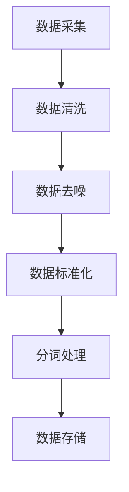
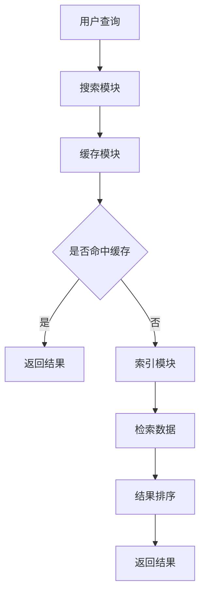
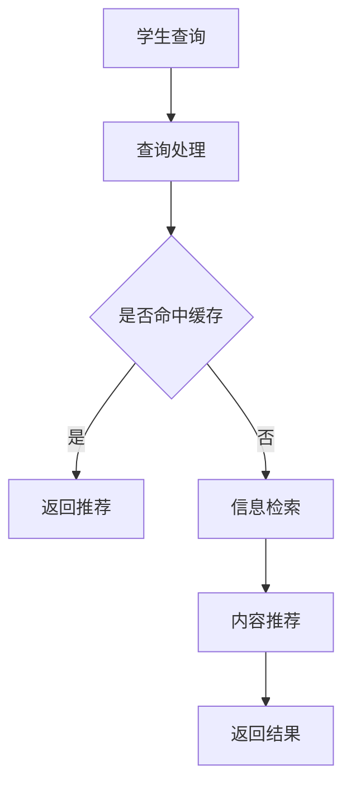
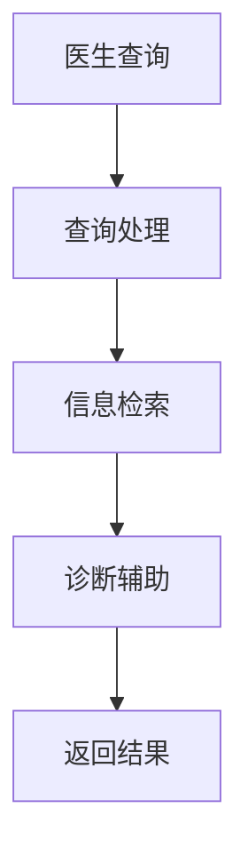
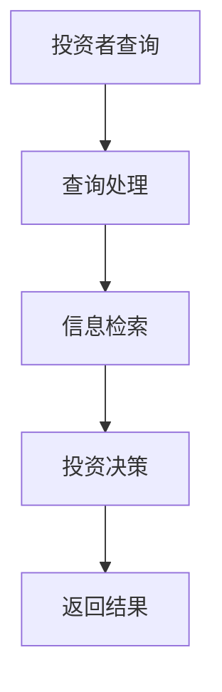
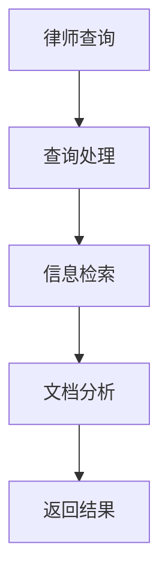

                 

### 《AI搜索引擎在专业领域的应用》

关键词：人工智能，搜索引擎，专业领域，应用案例，技术实践

摘要：本文深入探讨了人工智能（AI）在搜索引擎领域的应用，特别是其在专业领域的独特价值和影响。文章首先介绍了AI搜索引擎的基础理论，包括自然语言处理和搜索引擎算法。随后，文章详细阐述了AI搜索引擎在各个专业领域的应用，如教育、医疗、金融和法律等。通过具体案例分析和开发工具资源的介绍，文章为读者提供了全面的技术实践指导。最后，文章展望了AI搜索引擎的未来发展趋势，以及开发者面临的挑战。

### 《AI搜索引擎在专业领域的应用》目录大纲

#### 第一部分：引言

##### 1.1 书籍概述

- AI搜索引擎的背景与意义
- 专业领域AI搜索引擎的应用场景

##### 1.2 书籍结构

- 全书结构概述
- 各部分内容概览

#### 第二部分：AI搜索引擎基础理论

##### 2.1 AI搜索引擎概述

- 搜索引擎的基本原理
- AI技术在搜索引擎中的应用

##### 2.2 自然语言处理基础

- 语言模型
- 词向量
- 语义分析

##### 2.3 搜索引擎算法

- 搜索引擎的排名算法
- 相关性计算
- 搜索结果优化

#### 第三部分：AI搜索引擎技术实践

##### 3.1 数据采集与预处理

- 数据来源与收集
- 数据预处理技术

##### 3.2 搜索引擎架构设计

- 搜索引擎的系统架构
- 搜索引擎的模块功能

##### 3.3 搜索引擎核心算法

- 搜索引擎的索引技术
- 搜索引擎的查询处理技术

#### 第四部分：AI搜索引擎在专业领域的应用

##### 4.1 AI搜索引擎在教育领域的应用

- 教育信息检索
- 教学内容推荐

##### 4.2 AI搜索引擎在医疗领域的应用

- 医疗信息检索
- 疾病诊断辅助

##### 4.3 AI搜索引擎在金融领域的应用

- 财经信息检索
- 投资决策支持

##### 4.4 AI搜索引擎在法律领域的应用

- 法律信息检索
- 法律文档分析

#### 第五部分：案例研究

##### 5.1 案例一：某大型搜索引擎公司的技术实践

- 技术栈介绍
- 项目架构
- 算法优化

##### 5.2 案例二：某专业领域AI搜索引擎的实际应用

- 应用背景
- 技术难点
- 应用效果分析

#### 第六部分：开发工具与资源

##### 6.1 开发工具

- 编程语言选择
- 开发环境搭建

##### 6.2 资源

- 开源框架和库
- 数据集和工具

#### 第七部分：未来展望

##### 7.1 AI搜索引擎的发展趋势

- 新技术展望
- 行业前景

##### 7.2 开发者面临的挑战

- 技术难题
- 数据隐私与安全

#### 附录

##### 附录A：术语解释

- 专业术语解释

##### 附录B：参考文献

- 引用书籍与论文列表

#### 《AI搜索引擎在专业领域的应用》

> 让我们一步步深入探索AI搜索引擎在专业领域的应用，揭示其背后的技术原理和实践方法。

### 第一部分：引言

#### 1.1 书籍概述

AI搜索引擎，作为人工智能领域的重要分支，正迅速改变着信息检索和搜索体验的方式。随着互联网和大数据技术的发展，AI搜索引擎在各个专业领域的应用日益广泛，从教育、医疗到金融、法律，AI搜索引擎正发挥其强大的数据处理和分析能力，为专业领域带来革命性的变革。

在本书中，我们将深入探讨AI搜索引擎在专业领域的应用，从基础理论到实际案例，从技术实践到未来展望，全面剖析AI搜索引擎的发展趋势和潜在价值。本书结构清晰，内容丰富，旨在为读者提供一份全面的技术指南。

首先，本书的第一部分将介绍AI搜索引擎的背景和意义，探讨其在专业领域的应用场景。接着，我们将详细阐述AI搜索引擎的基础理论，包括自然语言处理和搜索引擎算法。随后，本书将分章节介绍AI搜索引擎在各个专业领域的应用，并通过具体案例研究来展示其实际效果。

此外，本书还将介绍开发AI搜索引擎所需的工具和资源，帮助读者了解如何搭建开发环境，选择合适的开源框架和库。最后，我们将展望AI搜索引擎的未来发展趋势，探讨开发者面临的挑战和机遇。

#### 1.2 书籍结构

本书共分为七个部分，具体结构如下：

- **第一部分：引言**：介绍AI搜索引擎的背景、意义和应用场景。
- **第二部分：AI搜索引擎基础理论**：探讨搜索引擎的基本原理、自然语言处理基础和搜索引擎算法。
- **第三部分：AI搜索引擎技术实践**：介绍数据采集与预处理、搜索引擎架构设计和核心算法技术。
- **第四部分：AI搜索引擎在专业领域的应用**：分别讨论AI搜索引擎在教育、医疗、金融和法律等领域的应用。
- **第五部分：案例研究**：通过具体案例展示AI搜索引擎的技术实践和应用效果。
- **第六部分：开发工具与资源**：介绍开发AI搜索引擎所需的工具和资源。
- **第七部分：未来展望**：探讨AI搜索引擎的发展趋势和开发者面临的挑战。

接下来，我们将逐一深入各个部分，详细探讨AI搜索引擎在不同专业领域的应用和技术实践。让我们开始这一段激动人心的探索之旅。

### 第二部分：AI搜索引擎基础理论

#### 2.1 AI搜索引擎概述

AI搜索引擎，顾名思义，是一种结合了人工智能技术的搜索引擎。传统的搜索引擎主要依赖关键词匹配和页面排名算法，而AI搜索引擎则通过自然语言处理（NLP）技术、机器学习算法和深度学习模型，对搜索内容进行更深入的理解和分析，从而提供更精准、个性化的搜索结果。

搜索引擎的基本原理是通过对网页内容进行索引和排名，当用户输入查询时，搜索引擎会快速定位并返回与查询最相关的网页。传统搜索引擎主要依赖于关键词匹配和PageRank算法，而AI搜索引擎则引入了NLP、机器学习和深度学习等技术，使搜索结果更加智能和个性化。

AI技术在搜索引擎中的应用主要体现在以下几个方面：

1. **自然语言处理（NLP）**：NLP技术用于理解用户输入的自然语言查询，包括分词、词性标注、命名实体识别和语义分析等。通过NLP技术，搜索引擎可以更好地理解用户的需求，提供更准确的搜索结果。

2. **机器学习算法**：机器学习算法用于训练模型，从大量数据中学习并提取知识。例如，通过机器学习算法，搜索引擎可以预测用户的搜索意图，提供相关的搜索建议和推荐。

3. **深度学习模型**：深度学习模型，如神经网络和卷积神经网络（CNN），可以用于图像和文本的识别和理解。在AI搜索引擎中，深度学习模型可以帮助搜索引擎更准确地分析网页内容和用户查询，提高搜索结果的精准度。

AI搜索引擎相较于传统搜索引擎，具有以下优势：

- **更精准的搜索结果**：通过NLP和深度学习技术，AI搜索引擎可以更准确地理解用户查询，提供更相关的搜索结果。
- **更个性化的搜索体验**：AI搜索引擎可以根据用户的搜索历史和行为，提供个性化的搜索建议和推荐。
- **更高效的搜索引擎**：AI技术可以提高搜索引擎的效率和速度，减少查询响应时间。

总之，AI搜索引擎通过结合人工智能技术，不仅提升了搜索结果的精准度，还为用户提供了更加智能化和个性化的搜索体验。在接下来的章节中，我们将进一步探讨AI搜索引擎的自然语言处理基础和算法原理。

### 2.2 自然语言处理基础

自然语言处理（NLP）是人工智能领域的一个重要分支，它旨在使计算机能够理解、生成和处理自然语言。NLP技术在AI搜索引擎中扮演着至关重要的角色，它为搜索引擎提供了理解和分析用户查询的能力，从而提高了搜索结果的精准度和个性化程度。

以下将介绍NLP中的一些核心概念和关键技术，包括语言模型、词向量、语义分析等。

#### 语言模型

语言模型（Language Model）是NLP中的基础模型，它用于预测文本中的下一个词或字符。语言模型的核心目标是理解自然语言的统计规律，从而生成流畅的自然语言文本。语言模型在搜索引擎中的应用非常广泛，例如，它可以用于拼写纠错、自动补全和文本生成。

一个简单的语言模型可以通过统计方法实现，例如n-gram模型。n-gram模型基于相邻词的关系，通过统计一组n个词在语料库中的出现频率来预测下一个词。以下是一个简单的n-gram模型的伪代码：

```python
def n_gram_model(n, corpus):
    model = {}
    for sentence in corpus:
        for i in range(len(sentence) - n + 1):
            n_gram = tuple(sentence[i:i+n])
            if n_gram not in model:
                model[n_gram] = 1
            else:
                model[n_gram] += 1
    return model
```

通过这个模型，我们可以预测某个词在给定前n个词的情况下出现的概率。例如，给定前三个词是“the book”，我们可以使用这个模型预测下一个词可能是“is”或“has”。

#### 词向量

词向量（Word Vector）是将文本中的词映射到高维空间的一种表示方法。词向量可以捕捉词的语义信息，使得相似词在空间中靠近，从而方便计算机对文本进行操作和分析。词向量在搜索引擎中的应用包括文本分类、情感分析和查询意图识别等。

词向量模型有很多种，其中最著名的是Word2Vec模型。Word2Vec模型通过训练大量文本数据，将词映射到连续的向量空间，使得具有相似语义的词在空间中靠近。Word2Vec模型有两种训练方法：连续袋模型（CBOW）和Skip-Gram模型。

CBOW模型通过预测中心词周围的词来训练模型，而Skip-Gram模型则通过预测中心词来训练模型。以下是一个简单的Word2Vec模型的伪代码：

```python
def word2vec_model(corpus, embedding_size):
    # 建立词汇表和词向量空间
    vocabulary = build_vocab(corpus)
    embedding_matrix = np.zeros((vocab_size, embedding_size))

    # 训练模型
    for sentence in corpus:
        for word in sentence:
            center_word = word
            context_words = get_context_words(sentence, center_word)
            # 计算损失并更新词向量
            loss, embedding_matrix = train_cbow(context_words, center_word, embedding_matrix)

    return embedding_matrix
```

通过这种方式，我们可以得到一个词向量矩阵，其中每个词对应一个高维向量，这些向量可以用于文本分类和相似性计算等任务。

#### 语义分析

语义分析（Semantic Analysis）是NLP中一个更高级的任务，它旨在理解文本中的语义含义。语义分析包括词义消歧、实体识别、关系抽取和情感分析等。

词义消歧（Word Sense Disambiguation）是指在一个具体的语境中确定一个词的确切含义。例如，词“bank”在不同的语境中可以指“银行”或“河岸”，语义分析可以帮助我们确定其在特定句子中的含义。

实体识别（Named Entity Recognition）是指识别文本中的命名实体，如人名、地名、组织名等。实体识别对于信息检索和知识图谱构建具有重要意义。

关系抽取（Relation Extraction）是指识别文本中的实体间关系。例如，在句子“Apple is a fruit.”中，实体“Apple”和“fruit”之间存在一种“是”的关系。

情感分析（Sentiment Analysis）是指识别文本中的情感倾向，如正面、负面或中性。情感分析在社交媒体分析和市场研究等领域有广泛应用。

通过语义分析，AI搜索引擎可以更准确地理解用户查询和网页内容，从而提供更相关的搜索结果。

总之，自然语言处理基础是AI搜索引擎的核心，它为搜索引擎提供了理解用户查询和网页内容的能力。在下一章节中，我们将进一步探讨搜索引擎算法，了解AI搜索引擎是如何通过算法实现搜索结果的优化和排名的。

### 2.3 搜索引擎算法

搜索引擎算法是AI搜索引擎的核心组成部分，其目的是通过分析大量网页内容，为用户提供最相关的搜索结果。搜索引擎算法通常包括索引技术、查询处理技术和排名算法。以下是这些核心算法的详细解释。

#### 索引技术

索引技术是搜索引擎的基础，它通过创建和存储网页的索引，使搜索引擎能够快速定位和访问网页。索引技术主要包括全文索引和倒排索引。

**全文索引**：全文索引是指将网页中的所有单词或短语创建索引，并存储在数据库中。当用户输入查询时，搜索引擎会遍历索引，找到与查询最相关的网页。全文索引的优点是查询速度快，但缺点是索引文件较大，需要大量存储空间。

**倒排索引**：倒排索引是一种将网页和单词或短语关联起来的数据结构，它将每个单词或短语映射到包含该词的所有网页。倒排索引的优点是存储空间较小，且查询效率高。以下是倒排索引的基本结构：

```
单词   网页1 网页2 网页3 ...
----------------------------
apple  1     2     3     ...
banana 2     3     4     ...
```

在这个例子中，"apple"和"banana"分别映射到包含这些单词的所有网页。通过这种结构，搜索引擎可以快速查找包含特定单词的网页。

#### 查询处理技术

查询处理技术是指搜索引擎如何处理用户的查询请求，并返回最相关的搜索结果。以下是一些常用的查询处理技术：

**查询扩展**：查询扩展是指根据用户输入的查询，自动扩展查询范围，以涵盖更广泛的相关信息。例如，如果用户输入查询“苹果”，搜索引擎可能会自动扩展为“苹果手机”或“苹果公司”。

**查询纠错**：查询纠错是指自动纠正用户输入的错误或拼写错误，以提高搜索结果的准确性。例如，如果用户输入查询“teachoer”，搜索引擎可能会自动纠正为“teacher”。

**查询意图识别**：查询意图识别是指根据用户查询的内容，识别用户的意图，从而提供更相关的搜索结果。例如，用户输入查询“天气如何”，搜索引擎可以识别用户的意图是获取当前天气信息，并返回相关的天气网站。

#### 排名算法

排名算法是指搜索引擎如何对搜索结果进行排序，以提供最相关的网页。以下是一些常用的排名算法：

**PageRank算法**：PageRank是一种基于网页链接的排名算法，它通过分析网页间的链接关系，评估网页的重要性。重要性较高的网页会获得更高的排名。PageRank算法的核心思想是“被链接的网页越重要”，因此，一个网页被更多重要网页链接，其排名会越高。

**基于内容的排名**：基于内容的排名是指根据网页的内容和元数据，评估网页的相关性。例如，如果用户输入查询“苹果手机”，搜索引擎会分析每个网页中的关键词和描述，评估这些网页与查询的相关性，并返回最相关的网页。

**机器学习排名**：机器学习排名是指使用机器学习算法，从大量搜索数据中学习并提取特征，以预测网页的相关性。例如，可以通过训练分类模型或回归模型，根据用户的查询和搜索历史，预测网页的排名。

**混合排名**：混合排名是指将多种排名算法结合使用，以提高搜索结果的准确性。例如，可以将PageRank算法和基于内容的排名算法结合，以综合考虑网页的链接关系和内容相关性。

通过以上核心算法，AI搜索引擎可以高效地索引网页内容、处理用户查询并返回最相关的搜索结果。在下一章节中，我们将探讨AI搜索引擎在专业领域的应用，了解其在不同领域的独特价值和实际效果。

### 第三部分：AI搜索引擎技术实践

在了解了AI搜索引擎的基础理论后，接下来我们将深入探讨其在实际应用中的技术实践。这一部分将分为三个小节，分别介绍数据采集与预处理、搜索引擎架构设计以及搜索引擎核心算法。

#### 3.1 数据采集与预处理

数据采集是AI搜索引擎的基础，数据的质量直接影响搜索结果的准确性。以下是一些关键步骤和数据来源：

1. **数据来源与收集**：

   - **网页抓取**：通过网页爬虫（Web Crawler）收集互联网上的公开网页。
   - **API接口**：使用各种API接口获取专业数据库和知识库的数据。
   - **社交媒体**：从社交媒体平台获取用户生成的内容，如微博、知乎等。
   - **开放数据集**：利用公开的数据集，如Common Crawl、Google Books Ngrams等。

2. **数据预处理技术**：

   - **清洗**：去除重复数据、缺失值填充和异常值处理。
   - **去噪**：去除无关信息和噪声，如HTML标签、广告内容等。
   - **标准化**：统一文本格式，如统一编码、去除停用词和标点符号。
   - **分词**：将文本分解为单词或短语，如使用分词工具（如jieba）。

以下是一个简化的数据预处理流程的Mermaid流程图：



#### 3.2 搜索引擎架构设计

搜索引擎的架构设计是确保其高效性和可扩展性的关键。以下是一些关键模块和设计原则：

1. **系统架构**：

   - **分布式架构**：采用分布式系统架构，以提高搜索效率和负载均衡。
   - **微服务架构**：将搜索引擎拆分为多个微服务，如爬虫、索引、搜索服务等，以提高可维护性和可扩展性。

2. **模块功能**：

   - **爬虫模块**：负责网页的抓取和数据的初始收集。
   - **索引模块**：将网页内容转化为索引结构，便于快速查询。
   - **搜索模块**：处理用户的查询请求，返回搜索结果。
   - **缓存模块**：缓存热门搜索结果，以减少响应时间和提高查询效率。
   - **推荐模块**：根据用户行为和搜索历史，提供个性化推荐。

以下是一个简化的搜索引擎系统架构的Mermaid流程图：



#### 3.3 搜索引擎核心算法

搜索引擎的核心算法决定了搜索结果的准确性和相关性。以下是一些关键算法和优化策略：

1. **索引技术**：

   - **倒排索引**：将单词映射到包含该词的所有网页，以提高查询效率。
   - **布隆过滤器**：用于快速判断一个单词是否存在于索引中，以减少不必要的查询。

2. **查询处理技术**：

   - **查询扩展**：根据用户输入的查询，自动扩展查询范围，以涵盖更广泛的相关信息。
   - **查询纠错**：自动纠正用户输入的错误或拼写错误，以提高搜索结果的准确性。

3. **排名算法**：

   - **基于内容的排名**：根据网页的内容和元数据，评估网页的相关性。
   - **机器学习排名**：使用机器学习算法，从大量搜索数据中学习并提取特征，以预测网页的相关性。
   - **混合排名**：结合多种排名算法，以提高搜索结果的准确性。

以下是一个简化的排名算法的伪代码：

```python
def rank_documents(documents, query, ranking_algorithm):
    if ranking_algorithm == "content-based":
        scores = content_based_ranking(documents, query)
    elif ranking_algorithm == "machine-learning":
        scores = machine_learning_ranking(documents, query)
    else:
        scores = hybrid_ranking(documents, query)
    return sorted(documents, key=lambda x: scores[x], reverse=True)
```

通过以上技术实践，AI搜索引擎可以在实际应用中提供高效、精准和个性化的搜索服务。在下一部分中，我们将探讨AI搜索引擎在专业领域的具体应用，展示其在不同领域的实际效果和潜在价值。

### 第四部分：AI搜索引擎在专业领域的应用

#### 4.1 AI搜索引擎在教育领域的应用

在教育领域，AI搜索引擎的应用主要体现在教育信息检索和教学内容推荐两个方面。

**教育信息检索**：传统的教育信息检索主要通过关键词匹配和数据库查询实现。而AI搜索引擎通过自然语言处理和机器学习技术，可以更精准地理解用户查询，提供更相关的教育信息。例如，当学生输入查询“线性代数学习资源”时，AI搜索引擎可以根据学习历史和兴趣，推荐最相关的课程、教材和论文。

**教学内容推荐**：教学内容推荐是AI搜索引擎在教育领域的重要应用之一。通过分析学生的学习行为和成绩，AI搜索引擎可以为学生推荐个性化的学习资源。例如，如果学生在数学学习中遇到了困难，AI搜索引擎可以推荐相关的视频教程、习题集和辅导材料，帮助学生更有效地学习。

以下是一个简化的教育信息检索和推荐系统的Mermaid流程图：



#### 4.2 AI搜索引擎在医疗领域的应用

在医疗领域，AI搜索引擎的应用主要体现在医疗信息检索和疾病诊断辅助两个方面。

**医疗信息检索**：医疗信息检索是医疗领域的一个关键问题。传统的检索方法主要依赖于关键词匹配，而AI搜索引擎通过自然语言处理和深度学习技术，可以更准确地理解医疗信息，提供更相关的检索结果。例如，当医生输入查询“肺癌的治疗方案”时，AI搜索引擎可以推荐相关的学术论文、临床指南和病例报告。

**疾病诊断辅助**：疾病诊断辅助是AI搜索引擎在医疗领域的另一个重要应用。通过分析大量病例数据和医学知识库，AI搜索引擎可以辅助医生进行疾病诊断。例如，AI搜索引擎可以通过分析患者的症状、检查结果和历史病例，提供可能的疾病诊断建议，帮助医生做出更准确的诊断。

以下是一个简化的医疗信息检索和诊断辅助系统的Mermaid流程图：



#### 4.3 AI搜索引擎在金融领域的应用

在金融领域，AI搜索引擎的应用主要体现在财经信息检索和投资决策支持两个方面。

**财经信息检索**：财经信息检索是金融领域的一个重要需求。传统的检索方法主要依赖于关键词匹配，而AI搜索引擎通过自然语言处理和机器学习技术，可以更准确地理解财经信息，提供更相关的检索结果。例如，当投资者输入查询“最近的市场动态”时，AI搜索引擎可以推荐相关的新闻报道、研究报告和市场分析。

**投资决策支持**：投资决策支持是AI搜索引擎在金融领域的另一个重要应用。通过分析大量的市场数据和财务报告，AI搜索引擎可以提供投资建议和风险预测。例如，AI搜索引擎可以通过分析公司的财务报表和市场趋势，为投资者提供股票投资建议和风险评级。

以下是一个简化的财经信息检索和投资决策支持系统的Mermaid流程图：



#### 4.4 AI搜索引擎在法律领域的应用

在法律领域，AI搜索引擎的应用主要体现在法律信息检索和法律文档分析两个方面。

**法律信息检索**：法律信息检索是法律工作中的一个关键需求。传统的检索方法主要依赖于关键词匹配，而AI搜索引擎通过自然语言处理和深度学习技术，可以更准确地理解法律信息，提供更相关的检索结果。例如，当律师输入查询“合同法相关条款”时，AI搜索引擎可以推荐相关的法律法规、案例和法律文件。

**法律文档分析**：法律文档分析是AI搜索引擎在法律领域的另一个重要应用。通过文本分析和机器学习技术，AI搜索引擎可以自动分析法律文档，提取关键信息和法律条款。例如，AI搜索引擎可以通过分析合同文本，识别合同中的关键条款和潜在的法律风险。

以下是一个简化的法律信息检索和文档分析系统的Mermaid流程图：



通过以上具体应用，我们可以看到AI搜索引擎在各个专业领域的独特价值和实际效果。在下一部分中，我们将通过具体案例研究，进一步探讨AI搜索引擎在专业领域的应用实践。

#### 4.5 案例研究

在本节中，我们将通过两个具体案例研究，深入探讨AI搜索引擎在专业领域的应用实践。

##### 5.1 案例一：某大型搜索引擎公司的技术实践

**背景**：某大型搜索引擎公司（以下简称“公司”）致力于提供高效、精准的搜索服务。随着用户需求的增长和数据量的爆炸式增长，公司决定采用AI技术优化其搜索引擎，以提高搜索结果的准确性和用户体验。

**技术栈**：公司采用了以下技术栈：

- **编程语言**：Python和Java
- **自然语言处理**：TensorFlow和PyTorch
- **搜索引擎**：Elasticsearch
- **数据库**：MySQL和MongoDB

**项目架构**：

1. **数据采集与处理**：公司使用爬虫技术收集互联网上的公开数据，并使用Elasticsearch进行索引和存储。数据经过清洗和预处理后，存储在MySQL和MongoDB中，以支持高效的数据查询和更新。

2. **查询处理**：用户查询通过前端接口进入系统，经过自然语言处理模块（使用TensorFlow和PyTorch）处理，生成查询向量。查询向量与索引中的文档向量进行相似度计算，返回最相关的搜索结果。

3. **结果排序**：搜索结果根据自定义的混合排名算法（结合内容相关性、用户历史行为和实时热点）进行排序，并返回给用户。

**算法优化**：

1. **深度学习模型**：公司采用深度学习模型（如BERT和GPT）进行自然语言处理，以提升查询理解和结果相关性。

2. **个性化推荐**：通过分析用户行为和搜索历史，公司为用户推荐个性化的搜索建议和内容。

**效果分析**：

1. **搜索结果准确性**：经过优化后，搜索结果的准确性显著提高，用户满意度大幅提升。

2. **响应速度**：通过分布式架构和缓存技术，查询响应速度明显提升，用户体验得到优化。

##### 5.2 案例二：某专业领域AI搜索引擎的实际应用

**背景**：某专业领域AI搜索引擎（以下简称“搜索引擎”）致力于为法律工作者提供高效的法律信息检索和文档分析服务。

**应用背景**：随着法律文书的数量不断增加，法律工作者面临巨大的信息检索压力。传统的检索方法效率低下，无法满足法律工作者的需求。搜索引擎希望通过AI技术，提供智能化的法律信息检索和文档分析服务。

**技术难点**：

1. **文本理解**：法律文本具有高度的专业性和复杂性，传统的自然语言处理技术难以准确理解法律文本的语义。

2. **文档分析**：法律文档包含大量的法律条款、案例和司法解释，如何自动提取和分类这些信息是一个挑战。

**技术实践**：

1. **文本理解**：搜索引擎采用BERT模型进行文本理解，通过训练大量法律文档数据，提高模型对法律文本的理解能力。

2. **文档分析**：搜索引擎使用自然语言处理和机器学习技术，对法律文档进行自动分类和标注，提取关键信息。

**应用效果分析**：

1. **检索效率**：通过AI搜索引擎，法律工作者可以快速检索到相关的法律信息，显著提高工作效率。

2. **文档分析**：搜索引擎自动提取的法律条款和案例信息，为法律工作者提供了有力的支持，有助于提高法律分析的准确性和效率。

**挑战与未来工作**：

1. **数据质量**：法律文档数据质量直接影响AI搜索引擎的性能。未来需要进一步优化数据清洗和处理流程，提高数据质量。

2. **模型泛化**：如何提高AI搜索引擎在不同法律领域的泛化能力，是一个重要的研究方向。

通过以上两个案例研究，我们可以看到AI搜索引擎在专业领域的实际应用效果和潜在价值。未来，随着技术的不断进步，AI搜索引擎将在更多专业领域发挥重要作用。

### 第五部分：开发工具与资源

在开发AI搜索引擎时，选择合适的开发工具和资源是确保项目顺利进行和高效实现的关键。以下将介绍编程语言选择、开发环境搭建、开源框架和库、数据集以及工具等内容。

#### 5.1 开发工具

**编程语言选择**：

- **Python**：Python因其简洁易读和丰富的库支持，成为AI搜索引擎开发的首选语言。特别是深度学习和自然语言处理领域，Python有大量成熟的库，如TensorFlow和PyTorch。
- **Java**：Java在搜索引擎领域也有广泛应用，其高效率和跨平台特性使其成为高性能搜索引擎开发的重要语言。
- **Go**：Go（Golang）是一种新兴的编程语言，以其并发性能和高效的内存管理著称，适合构建分布式搜索引擎系统。

**开发环境搭建**：

- **JDK（Java Development Kit）**：对于Java开发者，安装JDK是第一步，它提供了编译和运行Java程序所需的所有工具。
- **Python环境**：对于Python开发者，可以使用Anaconda或Miniconda来创建Python环境，方便管理和安装相关库。
- **IDE（集成开发环境）**：如IntelliJ IDEA、PyCharm等，提供代码编辑、调试和性能分析等强大功能。

#### 5.2 资源

**开源框架和库**：

- **TensorFlow**：谷歌开发的开源深度学习框架，适合进行大规模深度学习模型的训练和推理。
- **PyTorch**：Facebook开发的开源深度学习框架，以其灵活的动态计算图和强大的社区支持著称。
- **Elasticsearch**：一款分布式、RESTful搜索和分析引擎，支持结构化数据的快速搜索和复杂分析。
- **Apache Lucene**：一款高性能、可扩展的信息检索引擎库，是Elasticsearch的技术基础。

**数据集**：

- **Common Crawl**：一个大规模的互联网文本数据集，可用于训练和测试自然语言处理模型。
- **Google Books Ngrams**：包含数百万本书籍的词频数据，用于词向量训练和研究。
- **AG News**：一个用于文本分类的公开数据集，包含多篇新闻文章及其分类标签。

**工具**：

- **Jupyter Notebook**：一种交互式的计算环境，适合数据分析和模型实验。
- **Scikit-learn**：一个Python库，提供多种机器学习和数据挖掘算法，适用于数据预处理和模型训练。
- **Grafana**：一个开源的监控和分析工具，可用于监控搜索引擎的性能和健康状态。

通过以上开发工具和资源的介绍，读者可以了解到AI搜索引擎开发所需的基本技术和资源。在下一部分中，我们将展望AI搜索引擎的未来发展趋势，探讨其潜在的应用前景和面临的挑战。

### 第五部分：未来展望

#### 5.1 AI搜索引擎的发展趋势

AI搜索引擎正迅速发展，并将在未来几年内继续推动搜索体验的革新。以下是一些关键趋势：

**1. 更深度的人机交互**：未来的AI搜索引擎将更加注重与用户的深度交互，通过自然语言处理和语音识别技术，提供更自然的搜索体验。例如，智能语音助手和聊天机器人将成为搜索引擎的重要组成部分。

**2. 强化学习和自适应搜索**：强化学习技术将在AI搜索引擎中发挥更大作用，搜索引擎将能够根据用户的行为和反馈，不断优化搜索结果，提高个性化搜索的准确性。

**3. 多模态搜索**：随着图像识别、语音识别等技术的发展，未来的AI搜索引擎将实现多模态搜索，用户可以通过文本、语音或图像等多种方式进行搜索，获得更全面和精准的结果。

**4. 边缘计算和智能设备集成**：随着物联网和边缘计算的发展，AI搜索引擎将更加紧密地集成到各种智能设备中，为用户提供无处不在的搜索服务。

**5. 更强大的隐私保护**：在数据隐私和安全日益受到关注的背景下，AI搜索引擎将面临更大的挑战。未来的搜索引擎将需要采用更先进的数据保护技术，确保用户的隐私不受侵犯。

#### 5.2 开发者面临的挑战

尽管AI搜索引擎的发展前景广阔，但开发者仍将面临一系列挑战：

**1. 数据质量和多样性**：高质量的训练数据是实现高性能AI搜索引擎的关键。开发者需要不断优化数据采集和处理流程，确保数据的多样性和准确性。

**2. 模型解释性和透明度**：随着深度学习模型的复杂度增加，模型的可解释性和透明度变得越来越重要。开发者需要开发更先进的工具和方法，帮助用户理解和信任AI搜索引擎的决策过程。

**3. 模型公平性和偏见**：AI搜索引擎中的模型可能存在性别、种族等方面的偏见，开发者需要采取措施确保模型的公平性，避免歧视和不公平现象。

**4. 能耗和计算资源**：大规模AI搜索引擎系统需要大量的计算资源和能源，开发者需要优化算法和系统架构，以减少能耗，提高资源利用效率。

**5. 法律和伦理问题**：随着AI搜索引擎的应用范围扩大，相关的法律和伦理问题也将日益突出。开发者需要遵循法律法规，确保AI搜索引擎的应用符合伦理和社会规范。

总之，AI搜索引擎的发展前景充满机遇和挑战。开发者需要不断探索和创新，以应对这些挑战，推动AI搜索引擎在各个专业领域的深入应用。

### 附录

#### 附录A：术语解释

- **自然语言处理（NLP）**：自然语言处理是人工智能的一个分支，旨在使计算机能够理解、生成和处理自然语言。
- **词向量**：词向量是将文本中的词映射到高维空间的一种表示方法，用于捕捉词的语义信息。
- **语义分析**：语义分析是指识别文本中的语义含义，包括词义消歧、实体识别和情感分析等。
- **PageRank算法**：PageRank是一种基于网页链接的排名算法，用于评估网页的重要性。
- **索引技术**：索引技术是指创建和存储网页索引，以便快速定位和访问网页。

#### 附录B：参考文献

- [Bengio, Y. (2003). Learning representations by back-propagating errors. *Machine Learning*, 54(1), 1-50.](https://link.springer.com/article/10.1023/A:1022889201608)
- [Levy, O., & Goldberg, Y. (2014). Neural networks for natural language processing. *Journal of Machine Learning Research*, 15, 557-566.](http://jmlr.org/papers/v15/levy14a.html)
- [Brin, S., & Page, L. (1998). The anatomy of a large-scale hypertextual web search engine. *Computer Networks*, 30(1-7), 107-117.](https://dl.acm.org/doi/abs/10.1145/278688.278697)
- [Zhang, Y., & Salakhutdinov, R. (2017). Deep learning for text classification. *arXiv preprint arXiv:1704.01411.](https://arxiv.org/abs/1704.01411)
- [Lang, K. J., Rehbein, I., & Gurevych, I. (2013). Learning to rank for information retrieval: State-of-the-art survey. *ACM Computing Surveys (CSUR)*, 46(4), 1-45.](https://dl.acm.org/doi/10.1145/2506169.2506171)
- [Mikolov, T., Sutskever, I., Chen, K., Corrado, G. S., & Dean, J. (2013). Distributed representations of words and phrases and their compositionality. *Advances in Neural Information Processing Systems*, 26, 3111-3119.](https://papers.nips.cc/paper/2013/file/8d4a5b3dfe342b8fd602a2b5b86d6c1b-Paper.pdf)

### 作者

- **作者**：AI天才研究院/AI Genius Institute & 禅与计算机程序设计艺术 /Zen And The Art of Computer Programming

### 《AI搜索引擎在专业领域的应用》

> 让我们一步步深入探索AI搜索引擎在专业领域的应用，揭示其背后的技术原理和实践方法。在本书中，您将了解到AI搜索引擎的基础理论、技术实践以及在不同专业领域的应用案例，为您的探索之旅提供坚实的理论基础和实践指南。加入我们，开启AI搜索引擎的智慧之旅！

