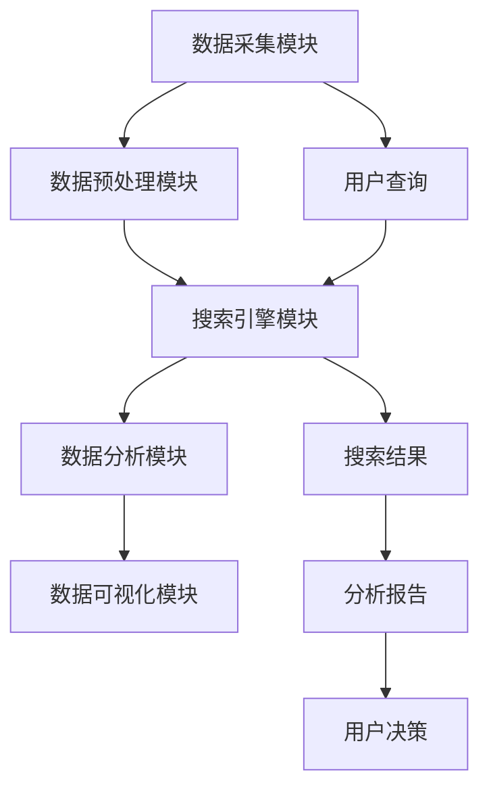

                 

### 《AI搜索数据分析系统的应用案例》

> **关键词：** AI搜索，数据分析系统，应用案例，核心技术，项目实战，优化与未来趋势

> **摘要：** 本文将深入探讨AI搜索数据分析系统的应用案例。首先，我们将介绍AI搜索数据分析系统的基本概念和作用。随后，通过详细解析其核心算法原理、数学模型以及实际项目案例，我们将会展示如何在实际场景中应用这些技术。最后，我们将讨论系统的优化策略及其未来发展趋势。

---

# 《AI搜索数据分析系统的应用案例》目录大纲

## 第一部分: AI搜索数据分析系统概述

### 第1章: AI搜索数据分析系统简介

#### 1.1 AI搜索数据分析系统的概念

#### 1.2 AI搜索数据分析系统的作用

#### 1.3 AI搜索数据分析系统的发展历程

### 第2章: AI搜索数据分析系统的核心概念与联系

#### 2.1 AI搜索数据分析系统的主要模块

#### 2.2 AI搜索数据分析系统的工作流程

#### 2.3 AI搜索数据分析系统的核心概念关联图 (使用Mermaid绘制)

## 第二部分: AI搜索数据分析系统的核心技术原理

### 第3章: 核心算法原理讲解

#### 3.1 搜索算法原理

##### 3.1.1 搜索算法的基本概念

##### 3.1.2 常见的搜索算法

##### 3.1.3 搜索算法的优化策略

#### 3.2 数据分析算法原理

##### 3.2.1 数据分析算法的基本概念

##### 3.2.2 常见的数据分析算法

##### 3.2.3 数据分析算法的优化策略

### 第4章: 数学模型和数学公式

#### 4.1 搜索相关数学模型

##### 4.1.1 搜索的相似度计算模型

##### 4.1.2 搜索的排名模型

##### 4.1.3 搜索的优化模型

#### 4.2 数据分析相关数学模型

##### 4.2.1 数据分析的聚类模型

##### 4.2.2 数据分析的分群模型

##### 4.2.3 数据分析的预测模型

## 第三部分: AI搜索数据分析系统的应用实践

### 第5章: 项目实战

#### 5.1 项目背景

#### 5.2 项目需求分析

#### 5.3 系统架构设计

##### 5.3.1 搜索模块设计

##### 5.3.2 数据分析模块设计

##### 5.3.3 系统集成与优化

### 第6章: 代码实际案例与详细解释说明

#### 6.1 搜索模块代码案例

##### 6.1.1 开发环境搭建

##### 6.1.2 源代码详细实现

##### 6.1.3 代码解读与分析

#### 6.2 数据分析模块代码案例

##### 6.2.1 开发环境搭建

##### 6.2.2 源代码详细实现

##### 6.2.3 代码解读与分析

### 第7章: AI搜索数据分析系统的优化与未来趋势

#### 7.1 系统优化策略

##### 7.1.1 性能优化

##### 7.1.2 可扩展性优化

##### 7.1.3 安全性优化

#### 7.2 AI搜索数据分析系统的未来发展趋势

##### 7.2.1 AI搜索技术的创新方向

##### 7.2.2 数据分析技术的创新方向

##### 7.2.3 系统整合与协同发展

## 附录

### 附录 A: AI搜索数据分析系统开发工具与资源

##### A.1 主流深度学习框架对比

##### A.2 数据分析常用工具

##### A.3 开发资源推荐

---

## 第一部分: AI搜索数据分析系统概述

### 第1章: AI搜索数据分析系统简介

在数字时代，信息检索和数据分析已成为企业和研究机构的关键需求。AI搜索数据分析系统应运而生，它结合了人工智能和数据分析技术，提供了一种智能化的信息检索和数据分析解决方案。本章将介绍AI搜索数据分析系统的基本概念、作用及其发展历程。

#### 1.1 AI搜索数据分析系统的概念

AI搜索数据分析系统是指一种利用人工智能技术进行信息检索和数据挖掘分析的系统。它集成了自然语言处理、机器学习、深度学习等人工智能技术，通过对海量数据进行智能分析和处理，提供高效的搜索和数据分析服务。

#### 1.2 AI搜索数据分析系统的作用

AI搜索数据分析系统在企业运营、学术研究、政府决策等多个领域都有着广泛的应用。其主要作用包括：

1. **信息检索：** 快速、准确地在海量数据中检索用户所需的信息。
2. **数据挖掘：** 从大量数据中发现有价值的信息和模式。
3. **智能推荐：** 根据用户的行为和偏好，为其推荐相关内容。
4. **决策支持：** 提供数据驱动的决策支持，助力企业或机构做出更加明智的决策。

#### 1.3 AI搜索数据分析系统的发展历程

AI搜索数据分析系统的发展经历了几个重要阶段：

1. **初始阶段：** 主要是基于传统数据库搜索技术的应用。
2. **成长阶段：** 引入了自然语言处理和机器学习技术，使得搜索结果更加准确和智能。
3. **成熟阶段：** 深度学习技术的引入，使得系统能够处理更加复杂的数据，提供更加个性化的服务。
4. **未来展望：** 随着技术的不断进步，AI搜索数据分析系统将更加智能化，支持更多样化的应用场景。

### 第2章: AI搜索数据分析系统的核心概念与联系

要深入理解AI搜索数据分析系统，我们需要明确其核心概念和组成部分，并了解它们之间的关联。

#### 2.1 AI搜索数据分析系统的主要模块

AI搜索数据分析系统主要由以下几个模块组成：

1. **数据采集模块：** 负责从各种数据源收集数据。
2. **数据预处理模块：** 对采集到的数据进行清洗、格式化和标准化处理。
3. **搜索引擎模块：** 使用人工智能算法，快速准确地检索用户所需信息。
4. **数据分析模块：** 利用数据分析算法，从海量数据中提取有价值的信息。
5. **数据可视化模块：** 将分析结果以图表、图形等形式直观展示。

#### 2.2 AI搜索数据分析系统的工作流程

AI搜索数据分析系统的工作流程如下：

1. **数据采集：** 通过API、Web爬虫等方式收集数据。
2. **数据预处理：** 清洗、格式化和标准化数据，使其适合分析。
3. **搜索引擎：** 根据用户查询，使用搜索算法快速定位相关信息。
4. **数据分析：** 应用数据分析算法，提取数据中的潜在信息和规律。
5. **数据可视化：** 将分析结果以图表等形式展示，便于用户理解和决策。

#### 2.3 AI搜索数据分析系统的核心概念关联图

以下是一个简化的AI搜索数据分析系统的核心概念关联图，使用Mermaid语法绘制：

---

在接下来的章节中，我们将进一步探讨AI搜索数据分析系统的核心技术原理，并通过实际项目案例展示其应用效果。希望读者能够通过本文对AI搜索数据分析系统有一个全面而深入的理解。

