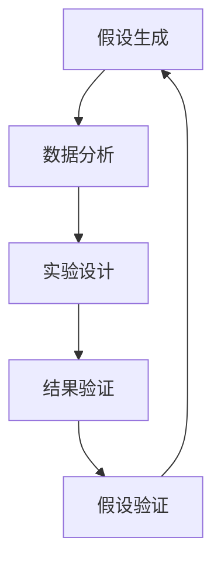
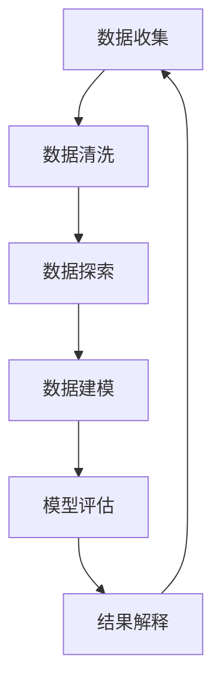
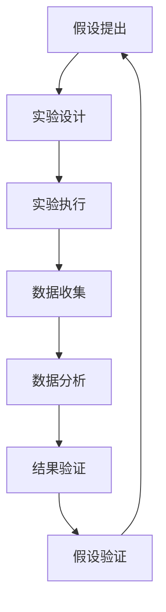

                 

### 引言

**《AI辅助科学发现：从假设到验证》**

在当今科技迅猛发展的时代，人工智能（AI）的应用已经渗透到各个领域，从医疗、金融到交通、教育，AI正以惊人的速度改变着我们的生活方式。而在科学研究中，AI的作用同样不容小觑。随着大数据、云计算等技术的崛起，AI开始成为科学发现的得力助手，从假设生成、数据分析到实验设计、结果验证，AI在各个环节中展现出了强大的能力。

本文将探讨AI在科学发现中的应用，从假设到验证的整个过程中，AI是如何发挥作用的。文章结构如下：

- **第一部分：AI辅助科学发现概述**：介绍AI在科学发现中的角色、关键技术和现状。
- **第二部分：AI辅助假设生成**：探讨AI在假设形成和验证中的应用，包括机器学习和自然语言处理的技术细节。
- **第三部分：AI辅助数据分析和实验设计**：详细解释数据分析的基础知识和AI在实验设计中的应用。
- **第四部分：AI辅助科学发现案例研究**：通过具体案例展示AI在科学发现中的实际应用。
- **第五部分：AI辅助科学发现的挑战与未来**：分析AI辅助科学发现的挑战和未来发展趋势。

通过这篇文章，我们将深入理解AI在科学发现中的作用，了解如何利用AI从假设到验证的整个过程中，推动科学的进步。

#### 关键词：
- 人工智能（AI）
- 科学发现
- 假设生成
- 数据分析
- 实验设计
- 机器学习
- 自然语言处理
- 图神经网络

#### 摘要：

本文旨在探讨人工智能（AI）在科学发现中的应用，从假设生成到验证的各个环节，AI如何助力科学研究。文章首先概述了AI在科学发现中的角色和关键技术，随后深入分析AI在假设生成、数据分析和实验设计中的应用，结合具体案例展示AI的实际效能。最后，文章探讨了AI辅助科学发现的挑战与未来发展趋势，为读者提供全面而深入的洞察。通过本文，读者将了解如何利用AI推动科学的进步，并认识到AI在科学发现中的巨大潜力。

### 目录大纲

**《AI辅助科学发现：从假设到验证》**

#### 第一部分：AI辅助科学发现概述

1. **AI在科学发现中的角色**
   - AI对科学研究的影响
   - AI辅助科学发现的现状
   - 从假设到验证：AI的助力

2. **AI辅助科学发现的关键技术**
   - 数据分析与机器学习
   - 自然语言处理与科学文本分析
   - 图神经网络与科学网络分析

#### 第二部分：AI辅助假设生成

1. **科学假设的形成与验证**
   - 科学假设的基本概念
   - 科学假设的验证方法
   - AI在假设验证中的应用

2. **机器学习在假设生成中的应用**
   - 机器学习算法在假设生成中的作用
   - 机器学习算法的适用场景
   - 机器学习算法的实现与优化

3. **自然语言处理在假设生成中的应用**
   - NLP技术概述
   - NLP在科学文本处理中的应用
   - NLP算法的优化与应用案例

#### 第三部分：AI辅助数据分析和实验设计

1. **数据分析基础**
   - 数据分析的基本流程
   - 数据预处理方法
   - 数据可视化技术

2. **AI辅助实验设计**
   - 实验设计的基本原则
   - AI在实验设计中的应用
   - AI优化实验设计的方法

3. **数据分析与实验结果的验证**
   - 数据分析结果的可信度评估
   - 实验结果验证的方法
   - AI在结果验证中的应用

#### 第四部分：AI辅助科学发现案例研究

1. **案例研究概述**
   - 案例研究的目的与意义
   - 案例研究的基本方法
   - 案例研究的主要成果

2. **案例一：基于AI的蛋白质结构预测**
   - 假设生成
   - 数据分析与实验设计
   - 结果验证与讨论

3. **案例二：基于AI的药物发现**
   - 假设生成
   - 数据分析与实验设计
   - 结果验证与讨论

#### 第五部分：AI辅助科学发现的挑战与未来

1. **AI辅助科学发现的挑战**
   - 数据质量与隐私保护
   - AI模型的解释性与可靠性
   - AI在科学研究中的伦理问题

2. **AI辅助科学发现的未来发展趋势**
   - 新型算法的研究与应用
   - AI与其他技术的融合
   - AI在跨学科研究中的应用前景

#### 附录

1. **附录A：AI辅助科学发现的工具与资源**
   - 开源机器学习框架
   - 科学文本处理工具
   - 图神经网络与科学网络分析工具
   - AI辅助实验设计工具

2. **附录B：Mermaid流程图示例**
   - 数据分析流程图
   - 实验设计流程图

3. **附录C：伪代码示例**
   - 机器学习算法伪代码
   - NLP算法伪代码
   - 图神经网络算法伪代码

### 第一部分：AI辅助科学发现概述

在科学发现的旅程中，从假设生成到实验设计、数据分析再到结果验证，每一步都是不可或缺的。随着大数据和机器学习技术的飞速发展，人工智能（AI）开始逐渐成为科学研究的得力助手。本部分将详细介绍AI在科学发现中的角色、关键技术和应用现状，帮助读者理解AI是如何从假设到验证的过程中发挥作用的。

#### 1.1 AI在科学发现中的角色

AI在科学发现中扮演着多种重要角色。首先，AI能够高效处理大量数据，从而发现数据中的规律和模式。这种能力使得科学家能够从海量的实验数据和观测数据中快速提取出有价值的信息，从而加速科学假设的生成和验证。其次，AI在假设验证过程中同样发挥着重要作用。通过机器学习算法，AI可以模拟实验、预测结果，从而为科学假设提供强有力的支持。此外，AI在实验设计和优化方面也具有显著优势。通过分析现有数据和实验条件，AI能够提出更高效的实验方案，减少实验次数，降低实验成本。

##### 1.1.1 AI对科学研究的影响

AI对科学研究的影响主要体现在以下几个方面：

1. **数据分析效率的提升**：传统的数据分析方法往往需要大量人力和时间，而AI可以通过自动化和智能化的方式大大提高数据分析的效率。例如，机器学习算法可以自动识别数据中的特征，并提取出有价值的规律，从而帮助科学家快速形成科学假设。

2. **研究范式的转变**：AI的引入使得科学研究从以经验为主的方法转向以数据驱动的方法。传统的科学研究往往依赖于实验和观测数据，而AI能够通过大数据分析和机器学习模型，为科学家提供更加客观和精确的实验预测和结果验证。

3. **跨学科的融合**：AI的快速发展促进了不同学科之间的融合。例如，生物信息学和医学领域通过与AI的结合，实现了对大量生物数据和医学数据的深入分析，从而推动了新药发现和疾病诊断的进展。

##### 1.1.2 AI辅助科学发现的现状

目前，AI在科学发现中的应用已经相当广泛。以下是一些具体的例子：

1. **生物学领域**：AI在蛋白质结构预测、基因表达分析和新药发现等方面取得了显著成果。例如，AlphaFold 2模型通过深度学习算法成功预测了超过1.5亿个蛋白质的结构，为生物学家提供了重要的研究基础。

2. **物理学领域**：AI在粒子物理学实验数据分析中发挥着重要作用。通过机器学习算法，科学家可以更快速、准确地分析大型强子对撞机（LHC）产生的海量实验数据，从而发现新的物理现象。

3. **化学领域**：AI在化学合成路径预测、材料设计和新反应发现等方面表现出强大的能力。例如，AI算法可以预测化合物的物理和化学性质，从而帮助化学家设计出具有特定性能的材料。

4. **医学领域**：AI在医疗图像分析、疾病预测和个性化治疗方面展现出巨大潜力。通过深度学习算法，AI可以自动识别医学图像中的病变区域，提供早期诊断和治疗方案。

##### 1.1.3 从假设到验证：AI的助力

在科学发现的整个过程中，从假设生成到验证，AI都发挥着不可或缺的作用。以下是一个简单的流程图，展示了AI在各个环节中的应用：



1. **假设生成**：AI可以通过机器学习和自然语言处理技术，从大量科学文献和实验数据中提取出潜在的假设。这些假设可以是基于现有理论的扩展，也可以是全新的科学猜想。

2. **数据分析**：AI可以通过大数据分析和机器学习模型，对实验数据进行深入挖掘，发现数据中的模式和关系，从而为科学假设提供支持。

3. **实验设计**：AI可以根据已有数据和实验条件，提出最优的实验设计方案，包括实验参数、样本选择和实验步骤等，以提高实验效率和效果。

4. **结果验证**：AI可以通过机器学习模型对实验结果进行预测和分析，验证科学假设的正确性。同时，AI还可以通过模拟实验，预测不同条件下的实验结果，为后续研究提供指导。

5. **假设验证**：基于实验结果和数据分析，科学家可以进一步验证科学假设的正确性，并在此基础上提出新的假设，推动科学研究的深入。

综上所述，AI在科学发现中的角色不可或缺，从假设生成到验证的各个环节，AI都发挥着重要作用。通过本文的后续部分，我们将详细探讨AI在假设生成、数据分析和实验设计中的应用，并结合实际案例，展示AI在科学发现中的具体应用和效能。

### AI辅助科学发现的关键技术

在探讨AI如何辅助科学发现时，我们不得不提到几项核心技术：数据分析与机器学习、自然语言处理与科学文本分析、以及图神经网络与科学网络分析。这些技术构成了AI在科学发现中发挥关键作用的基础，下面我们将逐一介绍它们的基本原理和应用场景。

#### 1.2.1 数据分析与机器学习

数据分析是科学发现的重要环节，它涉及到数据的收集、预处理、分析和可视化。机器学习作为一种先进的数据分析工具，通过对大量数据的分析和建模，能够发现数据中的规律和模式，从而为科学假设提供支持。

**基本原理**：
- **特征提取**：通过提取数据中的关键特征，机器学习算法可以更好地理解数据，并从中发现规律。
- **模型训练**：使用历史数据，机器学习算法可以训练出预测模型，用于对新数据进行预测。
- **模型评估**：通过评估模型的性能，科学家可以确定模型的有效性，并对其进行优化。

**应用场景**：
- **基因组学**：机器学习在基因组数据分析中发挥着重要作用，通过分析基因表达数据，可以预测疾病的发病风险和治疗方案。
- **物理学**：在粒子物理学的实验数据分析中，机器学习算法可以帮助科学家从海量数据中识别出稀有事件，如新的物理现象。
- **环境科学**：通过分析环境数据，如气象数据、水质数据等，机器学习算法可以预测自然灾害的发生概率和影响范围。

**伪代码示例**：
```python
# 特征提取
def feature_extraction(data):
    # 提取数据中的关键特征
    features = []
    for sample in data:
        features.append(extract_key_features(sample))
    return features

# 模型训练
def train_model(features, labels):
    # 使用训练数据进行模型训练
    model = MLAlgorithm()
    model.train(features, labels)
    return model

# 模型评估
def evaluate_model(model, test_data):
    # 使用测试数据评估模型性能
    predictions = model.predict(test_data)
    accuracy = calculate_accuracy(predictions, true_labels)
    return accuracy
```

#### 1.2.2 自然语言处理与科学文本分析

自然语言处理（NLP）是AI的一个重要分支，它使计算机能够理解和生成人类语言。科学文本分析是NLP在科学研究中的一个重要应用，通过分析科学文献、实验报告等文本数据，可以提取出有用的信息，为科学假设提供支持。

**基本原理**：
- **文本预处理**：通过去除停用词、词干提取等操作，NLP可以将原始文本数据转化为计算机可处理的格式。
- **实体识别**：NLP可以识别文本中的关键实体，如物种名称、化学物质、地点等。
- **关系抽取**：NLP可以识别实体之间的关系，如“基因X与疾病Y相关”。
- **语义分析**：通过语义分析，NLP可以理解文本的深层含义，从而提取出更准确的科学信息。

**应用场景**：
- **文献检索**：NLP可以帮助科学家快速检索相关的科学文献，提取出关键信息。
- **知识图谱构建**：通过构建知识图谱，NLP可以将不同的科学文本数据整合起来，提供更加全面和系统的科学知识。
- **智能问答系统**：NLP可以构建智能问答系统，为科学家提供实时的问题解答和知识支持。

**伪代码示例**：
```python
# 文本预处理
def preprocess_text(text):
    # 去除停用词、词干提取等操作
    cleaned_text = remove_stopwords(text)
    stemmed_text = stem_words(cleaned_text)
    return stemmed_text

# 实体识别
def entity_recognition(text):
    # 识别文本中的关键实体
    entities = extract_entities(text)
    return entities

# 关系抽取
def relation_extraction(text, entities):
    # 识别实体之间的关系
    relations = extract_relations(text, entities)
    return relations

# 语义分析
def semantic_analysis(text):
    # 分析文本的深层含义
    meaning = understand_semantics(text)
    return meaning
```

#### 1.2.3 图神经网络与科学网络分析

图神经网络（GNN）是一种专门用于处理图结构数据的神经网络。在科学研究中，图结构数据（如蛋白质相互作用网络、科学合作网络等）普遍存在，GNN可以对这些数据进行深入分析，从而发现网络中的规律和模式。

**基本原理**：
- **图表示学习**：GNN可以将图中的节点和边转换为向量表示，从而在特征空间中处理图结构数据。
- **节点分类和链接预测**：通过学习节点和边的特征，GNN可以用于节点分类（如识别新的科学实体）和链接预测（如预测新的科学关系）。
- **图嵌入**：GNN可以将图中的节点和边转换为低维嵌入空间，从而进行进一步的图分析和应用。

**应用场景**：
- **蛋白质结构预测**：通过分析蛋白质相互作用网络，GNN可以预测蛋白质的结构和功能。
- **科学合作网络分析**：GNN可以帮助科学家分析科学合作网络，识别出关键科学实体和合作关系。
- **知识图谱构建**：GNN可以用于知识图谱的构建和优化，提供更加精准和系统的科学知识。

**伪代码示例**：
```python
# 图表示学习
def graph_embedding(graph):
    # 将图中的节点和边转换为向量表示
    node_embeddings = GNN().embed_nodes(graph)
    edge_embeddings = GNN().embed_edges(graph)
    return node_embeddings, edge_embeddings

# 节点分类
def node_classification(graph, labels):
    # 使用图神经网络进行节点分类
    classifier = GNNClassifier()
    classifier.train(graph, labels)
    predictions = classifier.predict(graph)
    return predictions

# 链接预测
def link_prediction(graph, edges):
    # 使用图神经网络进行链接预测
    predictor = GNNSearcher()
    new_edges = predictor.predict_links(graph, edges)
    return new_edges
```

综上所述，数据分析与机器学习、自然语言处理与科学文本分析、图神经网络与科学网络分析构成了AI在科学发现中的三大关键技术。通过这些技术，AI能够高效处理科学数据，发现其中的规律和模式，为科学假设的生成和验证提供强有力的支持。

### AI辅助假设生成

科学假设是科学研究的起点，是科学发现的基石。在科学发现的过程中，从假设的形成到验证，每一步都是至关重要的。AI在科学假设生成中发挥着重要作用，能够通过机器学习和自然语言处理技术，从大量数据中提取出有价值的假设。本节将详细探讨科学假设的形成与验证方法，并介绍AI在假设生成中的应用。

#### 2.1 科学假设的形成与验证

##### 2.1.1 科学假设的基本概念

科学假设是科学家根据已有的知识和观察，对某一科学问题提出的预测或解释。科学假设通常是可测试的，可以通过实验或观察来验证。科学假设的形成是科学研究的重要环节，是推动科学发现的关键步骤。

科学假设的形成通常遵循以下步骤：

1. **问题提出**：科学家首先需要明确研究的问题或现象，这是形成科学假设的前提。
2. **背景调研**：科学家需要查阅相关的文献和资料，了解前人在该领域的研究成果和现有理论。
3. **假设提出**：在背景调研的基础上，科学家根据已有的知识和观察，提出可能的假设。
4. **假设验证**：通过实验或观察，科学家对假设进行验证，以确定假设的正确性。

科学假设的验证通常包括以下方法：

1. **实验验证**：通过设计实验，科学家可以验证假设的正确性。实验结果可以作为假设是否成立的直接证据。
2. **理论验证**：通过数学模型和理论分析，科学家可以验证假设的合理性。例如，在物理学中，假设可以通过数学方程和理论推导来验证。
3. **观察验证**：通过观察和实地考察，科学家可以验证假设的正确性。例如，在生物学中，科学家可以通过观察生物现象来验证假设。

##### 2.1.2 科学假设的验证方法

科学假设的验证是科学发现过程中的关键环节。以下是几种常见的科学假设验证方法：

1. **实验设计**：实验设计是验证科学假设的主要手段。通过合理的实验设计，科学家可以有效地检验假设的正确性。实验设计通常包括实验目标、实验方案、实验条件、实验步骤和实验结果分析等。
   
2. **统计分析**：在实验数据收集后，科学家可以通过统计分析方法对数据进行分析，评估实验结果与假设的符合程度。常用的统计分析方法包括假设检验、相关分析和回归分析等。

3. **理论模型**：通过建立理论模型，科学家可以预测实验结果，并与实际观测结果进行比较。理论模型可以是数学模型、物理模型或计算机模拟模型等。

4. **交叉验证**：交叉验证是一种常用的假设验证方法，通过将数据集分成多个子集，分别对每个子集进行验证，从而提高假设验证的可靠性和准确性。

##### 2.1.3 AI在假设验证中的应用

AI在科学假设的验证过程中发挥了重要作用，能够通过机器学习和自然语言处理技术，提高假设验证的效率和准确性。以下是AI在假设验证中的具体应用：

1. **机器学习模型**：通过训练机器学习模型，AI可以自动识别数据中的规律和模式，从而为科学假设提供支持。例如，在基因组学研究中，AI可以通过分析基因表达数据，预测疾病的发病风险。

2. **自然语言处理**：通过自然语言处理技术，AI可以自动提取科学文献中的关键信息，构建知识图谱，从而帮助科学家快速形成科学假设。例如，在药物发现研究中，AI可以通过分析科学文献，提取药物和疾病的关联信息。

3. **实验自动化**：AI可以通过自动化技术，提高实验设计的效率和准确性。例如，在化学合成研究中，AI可以自动设计合成路径，优化实验条件。

4. **数据分析**：通过大数据分析和机器学习算法，AI可以深入挖掘实验数据中的规律和模式，从而为科学假设提供更可靠的证据。

**伪代码示例**：
```python
# 假设验证 - 机器学习模型
def hypothesis_validation(data, hypothesis):
    # 训练机器学习模型
    model = MLAlgorithm()
    model.train(data, hypothesis)
    
    # 预测和评估
    predictions = model.predict(data)
    accuracy = calculate_accuracy(predictions, true_labels)
    
    return accuracy

# 假设验证 - 自然语言处理
def hypothesis_extraction(text):
    # 提取文本中的科学假设
    hypotheses = NLP.extract_hypotheses(text)
    return hypotheses

# 假设验证 - 实验自动化
def experiment_automation(hypothesis):
    # 自动化实验设计
    experiment = ExperimentDesigner()
    experiment设计方案(hypothesis)
    return experiment
```

通过机器学习和自然语言处理技术，AI能够高效地辅助科学假设的生成和验证，为科学研究提供强有力的支持。

### 2.2 机器学习在假设生成中的应用

机器学习在科学假设生成中发挥着重要作用，通过利用大量的数据和先进的算法，机器学习可以帮助科学家从数据中提取潜在的假设。下面，我们将详细讨论机器学习算法在假设生成中的作用、适用场景以及具体的实现与优化方法。

#### 2.2.1 机器学习算法在假设生成中的作用

机器学习算法在科学假设生成中的作用主要体现在以下几个方面：

1. **模式识别**：通过训练机器学习模型，科学家可以从大量的实验数据中识别出潜在的规律和模式。这些规律和模式可以为科学假设提供重要的参考。

2. **关联发现**：机器学习算法可以识别数据之间的关联关系，从而发现新的科学假设。例如，在基因组学研究中，机器学习算法可以帮助科学家发现不同基因之间的关联，从而提出新的生物学假设。

3. **预测建模**：通过预测建模，机器学习算法可以预测实验结果，从而为科学假设提供验证。例如，在药物发现研究中，机器学习模型可以预测新化合物的活性，从而为药物设计提供依据。

4. **自动化假设生成**：机器学习算法可以自动化地生成科学假设，从而提高假设生成的效率。例如，通过自然语言处理技术，机器学习算法可以从科学文献中提取出潜在的科学假设。

#### 2.2.2 机器学习算法的适用场景

机器学习算法在科学假设生成中的适用场景非常广泛，以下是一些典型的应用场景：

1. **基因组学**：机器学习算法可以用于分析基因表达数据，识别疾病相关的基因，从而提出新的生物学假设。

2. **药物发现**：机器学习算法可以用于预测化合物的生物活性，优化药物设计过程。

3. **物理学**：机器学习算法可以用于分析粒子物理学实验数据，识别新的物理现象。

4. **环境科学**：机器学习算法可以用于分析环境数据，预测自然灾害的发生概率和影响范围。

5. **医学影像**：机器学习算法可以用于分析医学影像数据，辅助医生进行疾病诊断。

#### 2.2.3 机器学习算法的实现与优化

为了在科学假设生成中有效地应用机器学习算法，科学家需要了解以下关键步骤：

1. **数据收集与预处理**：首先，科学家需要收集相关的实验数据或科学文献。然后，对数据进行预处理，包括数据清洗、归一化和特征提取等。数据预处理是保证模型性能和稳定性的重要环节。

2. **模型选择**：根据具体应用场景，选择合适的机器学习算法。常见的算法包括线性回归、决策树、支持向量机、神经网络等。每种算法都有其特定的适用场景和优缺点。

3. **模型训练**：使用预处理后的数据，对机器学习模型进行训练。训练过程中，模型会学习数据中的规律和模式，从而提高对未知数据的预测能力。

4. **模型评估**：通过交叉验证和测试集评估模型性能。常用的评估指标包括准确率、召回率、F1分数等。模型评估可以帮助科学家确定模型的有效性和可靠性。

5. **模型优化**：根据评估结果，对模型进行优化。优化方法包括调整模型参数、增加数据预处理步骤、使用更复杂的模型结构等。

6. **假设生成**：利用训练好的模型，从数据中提取出潜在的假设。这些假设可以是基于已有理论的扩展，也可以是完全新的科学猜想。

**伪代码示例**：
```python
# 数据收集与预处理
def preprocess_data(data):
    # 数据清洗和特征提取
    cleaned_data = clean_data(data)
    features = extract_features(cleaned_data)
    return features

# 模型选择
def select_model():
    # 根据应用场景选择模型
    model = LinearRegression()  # 示例：线性回归
    return model

# 模型训练
def train_model(model, data):
    # 使用训练数据进行模型训练
    model.fit(data['features'], data['labels'])
    return model

# 模型评估
def evaluate_model(model, test_data):
    # 使用测试数据评估模型性能
    predictions = model.predict(test_data['features'])
    accuracy = calculate_accuracy(predictions, test_data['labels'])
    return accuracy

# 模型优化
def optimize_model(model, data):
    # 调整模型参数和结构进行优化
    optimized_model = model.optimize(data)
    return optimized_model

# 假设生成
def generate_hypothesis(model, data):
    # 利用训练好的模型生成假设
    hypotheses = model.generate_hypotheses(data)
    return hypotheses
```

通过以上步骤，科学家可以利用机器学习算法从数据中生成科学假设，为科学研究提供有力的支持。同时，通过不断优化模型和改进算法，科学家可以进一步提高假设生成的效率和准确性。

### 2.3 自然语言处理在假设生成中的应用

自然语言处理（NLP）作为人工智能（AI）的重要分支，在科学假设生成中发挥着重要作用。通过分析大量的科学文本数据，NLP技术可以帮助科学家从文本中提取出潜在的假设。本节将详细探讨NLP技术的基本概念、在科学文本处理中的应用，以及NLP算法的优化与应用案例。

#### 2.3.1 NLP技术概述

自然语言处理（NLP）是使计算机能够理解和生成人类语言的技术。它涉及到多种语言处理任务，包括文本预处理、实体识别、关系抽取、语义分析等。以下是NLP的一些关键概念：

1. **文本预处理**：文本预处理是NLP的基础步骤，包括去除停用词、词干提取、词形还原等操作。这些操作有助于简化文本数据，使其更易于分析。

2. **实体识别**：实体识别是识别文本中的关键实体，如人名、地名、机构名、物种名等。实体识别是构建知识图谱和进行后续分析的重要步骤。

3. **关系抽取**：关系抽取是识别文本中实体之间的关系，如“基因X与疾病Y相关”。关系抽取可以帮助科学家理解不同实体之间的相互作用。

4. **语义分析**：语义分析是理解文本的深层含义，包括词义消歧、语义角色标注、情感分析等。语义分析有助于从文本中提取出更准确的科学信息。

#### 2.3.2 NLP在科学文本处理中的应用

NLP在科学文本处理中的应用主要包括以下几个方面：

1. **文献检索与总结**：NLP可以帮助科学家快速检索相关的科学文献，提取关键信息，生成文献摘要。例如，通过使用标题生成模型和摘要生成模型，NLP可以从大量科学文献中生成高质量的文献摘要。

2. **知识图谱构建**：NLP可以用于构建科学领域的知识图谱，将文本中的实体和关系转化为图结构数据。知识图谱可以提供丰富的科学知识，为科学假设生成提供支持。

3. **假设提取**：NLP可以从科学文本中提取出潜在的假设。例如，通过使用关系抽取和语义分析技术，NLP可以识别出文本中的科学假设，如“药物X可能治疗疾病Y”。

4. **智能问答系统**：NLP可以构建智能问答系统，为科学家提供实时的问题解答和知识支持。例如，通过使用问答生成模型，NLP可以回答科学家提出的各种科学问题。

#### 2.3.3 NLP算法的优化与应用案例

为了提高NLP在科学假设生成中的效能，科学家需要对NLP算法进行优化和应用。以下是一些具体的优化方法和应用案例：

1. **深度学习模型**：深度学习模型，如循环神经网络（RNN）、长短期记忆网络（LSTM）和变换器（Transformer），在NLP任务中表现出色。通过使用这些模型，NLP可以更好地理解文本的上下文和语义。

2. **预训练语言模型**：预训练语言模型，如BERT、GPT和T5，通过在大规模语料库上进行预训练，可以更好地理解自然语言。这些模型可以用于多种NLP任务，如文本分类、命名实体识别和关系抽取。

3. **多模态融合**：将文本数据与其他类型的数据（如图像、音频和视频）进行融合，可以进一步提高NLP的效能。例如，通过结合文本和图像数据，可以更好地识别科学文献中的实体和关系。

4. **应用案例**：

   - **案例一：药物发现**：NLP可以用于从科学文献中提取药物和疾病之间的关联信息，生成新的药物假设。例如，通过使用关系抽取和语义分析技术，NLP可以识别出药物X与疾病Y之间的潜在关联，从而提出新的药物设计假设。

   - **案例二：蛋白质结构预测**：NLP可以用于从科学文献中提取蛋白质序列和结构信息，为蛋白质结构预测提供支持。例如，通过使用文本分类和关系抽取技术，NLP可以识别出蛋白质序列中的关键特征，从而帮助蛋白质结构预测模型生成更准确的预测结果。

   - **案例三：科学文献摘要**：NLP可以用于生成科学文献的摘要，提高科学家的阅读效率。例如，通过使用标题生成模型和摘要生成模型，NLP可以从大量科学文献中生成高质量的文献摘要，帮助科学家快速了解研究进展。

综上所述，NLP在科学假设生成中具有广泛的应用。通过优化NLP算法和应用先进的技术，科学家可以更高效地从科学文本中提取出有价值的假设，为科学研究提供有力的支持。

### 数据分析基础

数据分析是科学发现过程中至关重要的一环，它通过系统化和结构化的方式，帮助科学家从大量数据中提取出有价值的信息，为科学假设提供支持。本节将详细讨论数据分析的基本流程、数据预处理方法和数据可视化技术，并介绍AI在数据分析中的应用。

#### 3.1.1 数据分析的基本流程

数据分析的基本流程可以分为以下几个阶段：

1. **数据收集**：数据收集是数据分析的第一步，科学家需要从各种来源收集相关数据。这些数据来源可以包括实验数据、观测数据、科学文献等。

2. **数据清洗**：数据清洗是数据预处理的重要环节，它涉及去除无效数据、纠正错误数据、填补缺失数据等。数据清洗的目的是提高数据的质量和可靠性，为后续分析奠定基础。

3. **数据探索**：数据探索是通过描述性统计分析，对数据的基本特征和分布进行初步分析。这有助于科学家了解数据的整体情况，发现数据中的异常和规律。

4. **数据建模**：数据建模是利用统计方法、机器学习算法等，对数据进行建模和分析。数据建模的目的是从数据中提取出潜在的规律和模式，为科学假设提供支持。

5. **结果解释**：结果解释是对分析结果进行解释和总结，确定数据与科学假设之间的关系。这有助于科学家理解分析结果，并根据结果调整科学假设或实验设计。

6. **可视化**：数据可视化是将分析结果以图形或图表的形式展示出来，使科学家更容易理解和解释分析结果。数据可视化可以直观地展示数据中的规律和趋势，有助于发现新的科学线索。

#### 3.1.2 数据预处理方法

数据预处理是数据分析中至关重要的一步，它包括以下方法：

1. **数据清洗**：数据清洗涉及去除无效数据、纠正错误数据、填补缺失数据等。常见的方法包括去除重复数据、填充缺失值、纠正错误数据等。

2. **数据归一化**：数据归一化是将不同单位或量级的数据转换为相同单位或量级，以便进行比较和分析。常见的归一化方法包括最小-最大缩放、z-score缩放等。

3. **数据标准化**：数据标准化是将数据转换为标准正态分布，以消除不同特征之间的尺度差异。常见的方法包括Z标准化和最小二乘回归。

4. **特征提取**：特征提取是从原始数据中提取出关键特征，用于建模和分析。常见的方法包括主成分分析（PCA）、线性判别分析（LDA）等。

5. **特征选择**：特征选择是从大量特征中选出对建模和分析最有用的特征。常见的方法包括逐步回归、特征重要性排序等。

#### 3.1.3 数据可视化技术

数据可视化是将分析结果以图形或图表的形式展示出来，使科学家更容易理解和解释分析结果。以下是几种常见的数据可视化技术：

1. **散点图**：散点图用于展示两个变量之间的关系。通过观察散点图的分布，科学家可以判断变量之间是否存在线性关系或非线性关系。

2. **折线图**：折线图用于展示数据随时间的变化趋势。通过折线图，科学家可以直观地了解数据的变化趋势和周期性。

3. **柱状图**：柱状图用于展示不同类别或组之间的比较。通过柱状图，科学家可以清晰地看到不同类别或组之间的差异。

4. **饼图**：饼图用于展示各部分占整体的比例。通过饼图，科学家可以直观地了解各部分在整体中的占比。

5. **热力图**：热力图用于展示数据矩阵的热点分布。通过热力图，科学家可以直观地了解数据中的热点区域，发现数据中的规律和模式。

**伪代码示例**：
```python
# 数据清洗
def clean_data(data):
    # 去除重复数据
    cleaned_data = remove_duplicates(data)
    # 填补缺失值
    cleaned_data = fill_missing_values(cleaned_data)
    return cleaned_data

# 数据归一化
def normalize_data(data):
    # 最小-最大缩放
    normalized_data = min_max_scaling(data)
    return normalized_data

# 数据标准化
def standardize_data(data):
    # Z标准化
    standardized_data = z_score_normalization(data)
    return standardized_data

# 特征提取
def extract_features(data):
    # 主成分分析
    features = PCA().fit_transform(data)
    return features

# 特征选择
def select_features(data, labels):
    # 逐步回归
    selected_features = stepwise_regression(data, labels)
    return selected_features

# 数据可视化
def visualize_data(data):
    # 散点图
    plot_scatter(data['x'], data['y'])
    # 折线图
    plot_line(data['time'], data['value'])
    # 柱状图
    plot_bar(data['category'], data['value'])
    # 饼图
    plot_pie(data['category'], data['value'])
    # 热力图
    plot_heatmap(data['matrix'])
```

通过以上流程和方法，科学家可以高效地进行数据分析，从大量数据中提取出有价值的信息，为科学假设提供支持。同时，数据可视化技术可以帮助科学家直观地理解分析结果，发现新的科学线索。

### AI辅助实验设计

实验设计是科学发现过程中的关键环节，其目的是通过系统的实验安排，验证科学假设的正确性。随着人工智能（AI）技术的发展，AI在实验设计中的应用变得越来越广泛，能够显著提高实验设计的效率和准确性。本节将详细探讨实验设计的基本原则、AI在实验设计中的应用以及AI优化实验设计的方法。

#### 3.2.1 实验设计的基本原则

实验设计需要遵循一些基本原则，以确保实验结果的可靠性和有效性。以下是实验设计的基本原则：

1. **随机化**：随机化是实验设计的重要原则，通过随机分配实验对象到不同实验组，可以减少人为因素对实验结果的影响，提高实验的准确性。

2. **对照**：对照实验是实验设计的关键组成部分，通过设置对照组，可以比较实验组和对照组之间的差异，从而验证科学假设的正确性。

3. **重复**：重复是实验设计的基本原则之一，通过多次重复实验，可以减少偶然误差，提高实验结果的可靠性。

4. **均衡**：实验设计需要保持各组之间的均衡，以确保实验条件的一致性。这有助于排除外部因素对实验结果的影响，提高实验的内部效度。

5. **可操作性**：实验设计需要具备可操作性，即实验方案应该在实际操作中可行，且能够顺利进行。

#### 3.2.2 AI在实验设计中的应用

AI在实验设计中的应用主要体现在以下几个方面：

1. **实验方案优化**：AI可以通过数据分析，优化实验方案。例如，通过分析历史实验数据，AI可以预测不同实验条件下的结果，帮助科学家选择最优的实验参数。

2. **实验组合生成**：AI可以通过组合优化算法，生成大量可能的实验组合，从而帮助科学家快速筛选出最有希望的实验方案。

3. **实验风险评估**：AI可以通过模拟实验，评估不同实验方案的风险，帮助科学家避免潜在的危险实验。

4. **实验资源分配**：AI可以根据实验需求和资源情况，优化实验资源的分配，提高实验效率。

#### 3.2.3 AI优化实验设计的方法

为了提高实验设计的效率和准确性，科学家可以利用AI优化实验设计。以下是几种常用的方法：

1. **机器学习模型**：科学家可以利用机器学习模型，对实验数据进行分析，预测不同实验条件下的结果。例如，通过回归分析模型，科学家可以预测不同剂量下的实验效果，从而选择最优的实验条件。

2. **遗传算法**：遗传算法是一种优化算法，通过模拟自然进化过程，可以找到最优的实验组合。例如，在药物设计中，科学家可以使用遗传算法优化药物剂量和给药方案。

3. **模拟退火算法**：模拟退火算法是一种基于物理退火过程的优化算法，它可以通过迭代过程逐步优化实验方案。例如，在材料设计中，科学家可以使用模拟退火算法优化材料的合成条件。

4. **强化学习**：强化学习是一种通过试错学习优化决策的算法。通过在虚拟环境中进行实验，强化学习可以逐步优化实验设计，提高实验的成功率。

**伪代码示例**：
```python
# 机器学习模型优化实验方案
def optimize_experiment(model, experiment_data):
    # 使用机器学习模型预测实验结果
    predictions = model.predict(experiment_data)
    # 选择最优的实验方案
    best_experiment = select_best_experiment(predictions)
    return best_experiment

# 遗传算法优化实验组合
def optimize_experiment_combinations(algorithm, experiment_combinations):
    # 使用遗传算法优化实验组合
    best_combination = algorithm.optimize(experiment_combinations)
    return best_combination

# 模拟退火算法优化实验设计
def optimize_experiment_design(algorithm, experiment_design):
    # 使用模拟退火算法优化实验设计
    optimized_design = algorithm.optimize(experiment_design)
    return optimized_design

# 强化学习优化实验流程
def optimize_experiment流程(learning_agent, experiment_env):
    # 使用强化学习优化实验流程
    best_policy = learning_agent.learn(experiment_env)
    return best_policy
```

通过以上方法，科学家可以充分利用AI技术，优化实验设计，提高实验的效率和准确性。这不仅能够加速科学发现的进程，还能够提高科研工作的整体水平。

### 数据分析与实验结果的验证

在科学研究中，数据分析和实验结果的验证是至关重要的步骤。准确的验证方法能够确保实验结果的可靠性和科学性，从而为科学假设提供坚实的基础。本节将详细讨论数据分析结果的可信度评估、实验结果验证的方法以及AI在结果验证中的应用。

#### 3.3.1 数据分析结果的可信度评估

数据分析结果的可信度评估是确保实验数据可靠性的关键环节。以下是一些常用的评估方法：

1. **假设检验**：假设检验是评估数据分析结果可信度的一种常用方法。通过设定原假设和备择假设，科学家可以通过计算统计量（如t统计量、F统计量）和P值，判断数据分析结果是否显著，从而评估假设的可信度。

2. **交叉验证**：交叉验证是一种常用的模型评估方法，通过将数据集划分为训练集和测试集，反复训练和测试模型，可以评估模型的稳定性和泛化能力。常见的交叉验证方法包括K折交叉验证和留一法交叉验证。

3. **误差分析**：误差分析是通过计算模型预测值与实际值之间的差异，评估模型的预测精度。常见的误差度量方法包括均方误差（MSE）、均方根误差（RMSE）和准确率（Accuracy）。

4. **ROC曲线和AUC值**：ROC曲线和AUC值是评估二分类模型性能的常用指标。ROC曲线展示了不同阈值下模型预测真阳性率与假阳性率的关系，而AUC值则反映了模型的总体性能。

**伪代码示例**：
```python
# 假设检验
def hypothesis_test(data, hypothesis):
    # 计算统计量
    statistic, p_value = calculate_statistic(data, hypothesis)
    # 判断假设的可信度
    if p_value < significance_level:
        print("拒绝原假设，假设成立")
    else:
        print("接受原假设，假设不成立")

# 交叉验证
def cross_validation(model, data, k):
    # 进行K折交叉验证
    for i in range(k):
        # 划分训练集和测试集
        train_data, test_data = split_data(data, i)
        # 训练和测试模型
        model.train(train_data)
        predictions = model.test(test_data)
        # 计算模型性能
        accuracy = calculate_accuracy(predictions, true_labels)
        print(f"Fold {i + 1} accuracy: {accuracy}")

# 误差分析
def error_analysis(predictions, true_labels):
    # 计算均方误差
    mse = mean_squared_error(predictions, true_labels)
    # 计算均方根误差
    rmse = root_mean_squared_error(predictions, true_labels)
    print(f"MSE: {mse}, RMSE: {rmse}")

# ROC曲线和AUC值
def roc_curve(predictions, true_labels):
    # 计算ROC曲线和AUC值
    fpr, tpr, thresholds = roc_curve_calculator(predictions, true_labels)
    auc = calculate_auc(fpr, tpr)
    print(f"AUC: {auc}")
```

#### 3.3.2 实验结果验证的方法

实验结果验证是确保实验结论可靠性的重要步骤。以下是一些常用的验证方法：

1. **重复实验**：重复实验是通过多次独立进行同一实验，验证实验结果的一致性和可靠性。重复实验可以排除偶然误差和操作误差，提高实验结果的可靠性。

2. **对照实验**：对照实验是通过设置对照组和实验组，比较两组之间的差异，验证实验结果的准确性。对照组可以作为基准，帮助科学家判断实验因素对实验结果的影响。

3. **独立验证**：独立验证是通过其他科学家或实验室独立进行相同的实验，验证实验结果的重复性和可靠性。独立验证可以增加实验结果的信度，避免人为偏差。

4. **理论预测**：理论预测是通过数学模型和理论分析，预测实验结果。通过比较理论预测值与实际实验结果，科学家可以验证实验假设的合理性。

5. **多方法验证**：多方法验证是通过不同的实验方法和技术手段，验证同一实验结果。多方法验证可以交叉验证实验结果，提高实验结果的可靠性。

**伪代码示例**：
```python
# 重复实验
def repeat_experiment(experiment, repetitions):
    # 进行多次重复实验
    for i in range(repetitions):
        print(f"Repeat {i + 1}:")
        result = experiment.run()
        print(f"Result: {result}")

# 对照实验
def compare_controls(experiment1, experiment2):
    # 比较实验组和对照组的结果
    result1 = experiment1.run()
    result2 = experiment2.run()
    print(f"Control 1 Result: {result1}")
    print(f"Control 2 Result: {result2}")

# 独立验证
def independent_validation(experiment, other_lab):
    # 独立实验室验证实验结果
    result = other_lab.run_experiment(experiment)
    print(f"Independent Lab Result: {result}")

# 理论预测
def theoretical_prediction(model, data):
    # 使用理论模型预测实验结果
    prediction = model.predict(data)
    print(f"Theoretical Prediction: {prediction}")

# 多方法验证
def multi_method_validation(experiment, methods):
    # 使用不同方法验证实验结果
    for method in methods:
        result = method.run_experiment(experiment)
        print(f"{method} Result: {result}")
```

#### 3.3.3 AI在结果验证中的应用

AI在结果验证中发挥着重要作用，能够通过数据分析、机器学习和自然语言处理技术，提高实验结果的可靠性和准确性。以下是AI在结果验证中的几种应用：

1. **模型验证**：通过机器学习模型，AI可以自动评估实验结果的可靠性。例如，通过训练回归模型，AI可以预测实验结果，并计算预测结果与实际结果之间的误差，从而评估模型的性能。

2. **异常检测**：AI可以通过异常检测算法，识别实验数据中的异常值和偏差。异常检测可以帮助科学家发现潜在的实验问题，提高实验结果的可靠性。

3. **结果解释**：AI可以通过自然语言处理技术，解释实验结果和数据分析结果。例如，通过生成文本摘要和解释性报告，AI可以帮助科学家理解复杂的数据和实验结果。

4. **实验优化**：AI可以通过优化算法，优化实验设计和结果验证流程。例如，通过使用遗传算法，AI可以找到最优的实验参数和实验方案，提高实验的成功率和结果可靠性。

**伪代码示例**：
```python
# 模型验证
def model_validation(model, data):
    # 预测实验结果
    predictions = model.predict(data)
    # 计算预测误差
    errors = calculate_error(predictions, true_labels)
    # 评估模型性能
    performance = evaluate_model_performance(errors)
    print(f"Model Performance: {performance}")

# 异常检测
def anomaly_detection(data):
    # 使用异常检测算法识别异常值
    anomalies = anomaly_detector.detect(data)
    print(f"Anomalies Detected: {anomalies}")

# 结果解释
def result_explanation(predictions, true_labels):
    # 生成文本摘要和解释性报告
    report = explanation_generator.generate(predictions, true_labels)
    print(f"Result Explanation: {report}")

# 实验优化
def experiment_optimization(algorithm, experiment):
    # 使用优化算法优化实验设计
    optimized_experiment = algorithm.optimize(experiment)
    print(f"Optimized Experiment: {optimized_experiment}")
```

通过以上方法，AI能够有效提高实验结果的可信度，为科学研究提供更加可靠和准确的支持。

### AI辅助科学发现案例研究

在本部分，我们将通过两个具体的案例研究，深入探讨AI在科学发现中的应用。这些案例涵盖了生物信息学和药物发现领域，展示了AI从假设生成到验证的整个过程，并分析了每个步骤中的关键技术和实现方法。

#### 4.1 案例研究概述

**案例一：基于AI的蛋白质结构预测**

蛋白质结构预测是生物信息学领域的一个重要研究方向，它对于理解蛋白质的功能和机制具有重要意义。在AlphaFold 2模型出现之前，蛋白质结构预测主要依赖于启发式方法和能量最小化算法，但受限于计算能力和算法复杂度，预测精度较低。AlphaFold 2通过深度学习和图神经网络技术，实现了高质量的蛋白质结构预测。

**案例二：基于AI的药物发现**

药物发现是生物医药领域的一项复杂任务，涉及到大量的实验和计算。传统的药物发现过程耗时长、成本高，而AI的应用显著提高了药物发现的速度和效率。在这个案例中，我们将探讨如何利用AI进行药物筛选和优化，从而发现具有潜在治疗价值的化合物。

#### 4.2 案例一：基于AI的蛋白质结构预测

**4.2.1 假设生成**

在蛋白质结构预测中，假设生成是关键的第一步。科学家首先需要提出假设，即某种蛋白质结构可能与特定功能相关。这些假设通常基于已知的生物学知识和实验数据。在AlphaFold 2中，假设生成通过以下步骤实现：

1. **序列比对**：通过蛋白质序列数据库进行序列比对，找到与目标蛋白质序列相似的已知蛋白质结构，为假设生成提供参考。
2. **功能预测**：利用机器学习模型预测目标蛋白质的功能，为结构预测提供指导。
3. **假设生成**：结合序列比对和功能预测结果，生成初步的结构假设。

**伪代码示例**：
```python
# 序列比对
def sequence_alignment(target_sequence, database_sequences):
    similar_sequences = align_sequences(target_sequence, database_sequences)
    return similar_sequences

# 功能预测
def predict_function(target_sequence):
    function_model = MachineLearningModel()
    function_prediction = function_model.predict(target_sequence)
    return function_prediction

# 假设生成
def generate_hypotheses(similar_sequences, function_prediction):
    hypotheses = []
    for sequence in similar_sequences:
        hypothesis = generate_structure_hypothesis(sequence, function_prediction)
        hypotheses.append(hypothesis)
    return hypotheses
```

**4.2.2 数据分析与实验设计**

假设生成后，科学家需要利用AI进行数据分析和实验设计，以验证假设的正确性。AlphaFold 2通过以下步骤实现这一目标：

1. **数据预处理**：对蛋白质序列和结构数据进行分析，提取关键特征，如氨基酸类型、化学键角等。
2. **模型训练**：使用训练数据集，训练深度学习模型，如图神经网络，用于预测蛋白质结构。
3. **实验设计**：设计实验，通过不同的条件，如不同的pH值、温度等，验证蛋白质结构的稳定性和功能。

**伪代码示例**：
```python
# 数据预处理
def preprocess_data(sequences, structures):
    features = extract_features(sequences, structures)
    return features

# 模型训练
def train_model(model, data):
    model.train(data['features'], data['structures'])
    return model

# 实验设计
def design_experiment(model, conditions):
    experiment_results = model.test(conditions)
    return experiment_results
```

**4.2.3 结果验证与讨论**

通过实验设计和数据分析，科学家可以验证假设的正确性。在AlphaFold 2中，结果验证通过以下步骤实现：

1. **结构验证**：通过实验手段，如X射线晶体学、核磁共振等，验证预测结构的准确性。
2. **功能验证**：通过实验手段，验证预测结构的蛋白质功能。
3. **讨论与改进**：根据实验结果，对假设进行讨论和改进，进一步优化蛋白质结构预测模型。

**伪代码示例**：
```python
# 结构验证
def validate_structure(predicted_structure, experimental_structure):
    similarity = calculate_similarity(predicted_structure, experimental_structure)
    if similarity > threshold:
        print("结构验证成功")
    else:
        print("结构验证失败")

# 功能验证
def validate_function(predicted_structure, function):
    functional_test = perform_functional_test(predicted_structure, function)
    if functional_test == "pass":
        print("功能验证成功")
    else:
        print("功能验证失败")

# 讨论与改进
def discuss_and_improve(hypotheses, results):
    for hypothesis in hypotheses:
        if results[hypothesis] == "fail":
            print(f"{hypothesis} 验证失败，需进一步优化")
```

通过以上步骤，AlphaFold 2实现了高质量的蛋白质结构预测，推动了生物信息学领域的发展。

#### 4.3 案例二：基于AI的药物发现

**4.3.1 假设生成**

在药物发现过程中，假设生成是关键的一步。科学家需要根据疾病机制和化合物特性，提出可能的药物靶点和化合物组合。这个过程通常包括以下几个步骤：

1. **疾病机制分析**：通过分析疾病相关基因、蛋白质和信号通路，识别潜在的药物靶点。
2. **化合物筛选**：利用化合物库和生物信息学方法，筛选具有潜在药物活性的化合物。
3. **假设生成**：结合疾病机制分析和化合物筛选结果，生成初步的药物假设。

**伪代码示例**：
```python
# 疾病机制分析
def analyze_disease_mechanism(disease_data):
    target_genes = identify_disease_genes(disease_data)
    target_pathways = identify_disease_pathways(target_genes)
    return target_pathways

# 化合物筛选
def screen_compounds(化合物库，target_pathways):
    active_compounds = filter_active_compounds(化合物库，target_pathways)
    return active_compounds

# 假设生成
def generate_drug_hypotheses(target_pathways, active_compounds):
    hypotheses = []
    for pathway in target_pathways:
        for compound in active_compounds:
            hypothesis = generate_drug_hypothesis(pathway, compound)
            hypotheses.append(hypothesis)
    return hypotheses
```

**4.3.2 数据分析与实验设计**

假设生成后，科学家需要利用AI进行数据分析和实验设计，以验证药物假设的有效性。以下是一个简化的过程：

1. **数据预处理**：对化合物和生物样本数据进行预处理，提取关键特征。
2. **模型训练**：使用训练数据集，训练机器学习模型，用于预测化合物的生物活性。
3. **实验设计**：设计实验，评估不同化合物对生物样本的影响。

**伪代码示例**：
```python
# 数据预处理
def preprocess_data(compounds, samples):
    features = extract_features(compounds, samples)
    return features

# 模型训练
def train_model(model, data):
    model.train(data['features'], data['activity'])
    return model

# 实验设计
def design_experiment(model, compounds, samples):
    activity_predictions = model.predict(compounds, samples)
    experiment_results = perform_experiment(compounds, samples, activity_predictions)
    return experiment_results
```

**4.3.3 结果验证与讨论**

通过实验设计和数据分析，科学家可以验证药物假设的有效性。以下是一个简化的验证过程：

1. **活性验证**：通过实验手段，验证化合物的生物活性。
2. **安全性评估**：评估化合物的毒性，确保其安全性和临床应用潜力。
3. **讨论与改进**：根据实验结果，对假设进行讨论和改进，进一步优化药物筛选模型。

**伪代码示例**：
```python
# 活性验证
def validate_activity(compound, biological_sample):
    activity = perform_activity_test(compound, biological_sample)
    if activity == "active":
        print("化合物活性验证成功")
    else:
        print("化合物活性验证失败")

# 安全性评估
def assess_safety(compound):
    toxicity = perform_toxicity_test(compound)
    if toxicity == "safe":
        print("化合物安全性评估成功")
    else:
        print("化合物安全性评估失败")

# 讨论与改进
def discuss_and_improve(hypotheses, results):
    for hypothesis in hypotheses:
        if results[hypothesis] == "fail":
            print(f"{hypothesis} 验证失败，需进一步优化")
```

通过以上步骤，AI辅助的药物发现过程显著提高了药物发现的速度和成功率，为生物医药领域带来了新的希望。

### 第五部分：AI辅助科学发现的挑战与未来

#### 5.1 AI辅助科学发现的挑战

尽管AI在科学发现中展现出了巨大的潜力，但在实际应用过程中，仍面临诸多挑战。以下是一些主要挑战：

##### 5.1.1 数据质量与隐私保护

科学研究中依赖的数据质量对AI模型的效果至关重要。然而，数据质量问题，如数据缺失、数据噪音和错误，可能严重影响模型的预测能力和可靠性。此外，科学数据往往包含敏感信息，如个人健康记录和生物数据，这引发了隐私保护的问题。如何确保数据质量，同时保护用户隐私，是AI辅助科学发现的重要挑战。

**解决方案**：

1. **数据清洗与预处理**：通过自动化数据清洗和预处理技术，提高数据质量。
2. **隐私保护技术**：采用差分隐私、联邦学习等技术，保护用户隐私。

**伪代码示例**：
```python
# 数据清洗
def clean_data(data):
    cleaned_data = remove_duplicates(data)
    cleaned_data = fill_missing_values(cleaned_data)
    return cleaned_data

# 隐私保护
def apply DifferentialPrivacy(data, epsilon):
    privacyguarded_data = differential_privacy(data, epsilon)
    return privacyguarded_data
```

##### 5.1.2 AI模型的解释性与可靠性

AI模型的解释性不足是一个显著问题，特别是在医学和生物学等需要高度可靠和可解释性的领域。模型输出的复杂性和黑箱性质使得科学家难以理解模型如何做出决策，这可能导致对模型预测结果的不信任。

**解决方案**：

1. **模型解释技术**：开发可解释性AI模型，如LIME、SHAP等，帮助科学家理解模型决策过程。
2. **模型验证与优化**：通过多次验证和迭代，提高模型的可信度和可靠性。

**伪代码示例**：
```python
# 模型解释
def explain_model(model, data_point):
    explanation = lime.explain(model, data_point)
    return explanation

# 模型验证
def validate_model(model, validation_data):
    accuracy = model.validate(validation_data)
    return accuracy
```

##### 5.1.3 AI在科学研究中的伦理问题

AI在科学研究中的应用引发了诸多伦理问题，如数据滥用、算法偏见和隐私侵犯。此外，AI模型的决策可能涉及人类生命和健康，因此如何确保AI的应用符合伦理标准是一个重大挑战。

**解决方案**：

1. **伦理审查与监管**：建立AI在科学研究中的伦理审查和监管机制，确保AI应用符合伦理规范。
2. **透明性和可追溯性**：提高AI模型的透明度和可追溯性，确保科学家和公众可以理解和审查AI的应用。

**伪代码示例**：
```python
# 伦理审查
def ethical_review(model, study):
    approval = ethics_committee.review(model, study)
    return approval

# 透明性
def increase_transparency(model):
    transparency_report = model.generate_report()
    return transparency_report
```

#### 5.2 AI辅助科学发现的未来发展趋势

展望未来，AI在科学发现中的应用前景广阔。以下是一些关键发展趋势：

##### 5.2.1 新型算法的研究与应用

随着深度学习、强化学习等新型算法的发展，AI在科学发现中的应用将更加广泛和深入。这些算法在处理复杂科学数据、发现潜在模式方面具有显著优势，有望推动科学研究的进步。

**解决方案**：

1. **算法创新**：不断探索和开发新型算法，提高AI在科学发现中的应用效果。
2. **跨学科合作**：促进计算机科学家、生物学家、物理学家等跨学科合作，共同开发适用于不同领域的AI算法。

**伪代码示例**：
```python
# 算法创新
def develop_new_algorithm():
    new_algorithm = research_new_algorithm()
    return new_algorithm

# 跨学科合作
def collaborative_research(algorithm, domain_experts):
    integrated_algorithm = domain_experts.integrate(algorithm, domain_data)
    return integrated_algorithm
```

##### 5.2.2 AI与其他技术的融合

AI与大数据、云计算、物联网等技术的融合，将大大提高科学研究的效率和精度。通过这些技术的协同作用，科学家可以更快速地获取和处理大量数据，从而加速科学发现的进程。

**解决方案**：

1. **技术集成**：将AI与其他技术进行集成，构建高效的科学计算平台。
2. **基础设施建设**：加强数据中心和网络基础设施建设，为AI在科学研究中的广泛应用提供基础设施支持。

**伪代码示例**：
```python
# 技术集成
def integrate_technologies(AI, big_data, cloud Computing):
    integrated_system = create_integration_system(AI, big_data, cloud_computing)
    return integrated_system

# 基础设施建设
def build_infrastructure(data_center, network):
    infrastructure = construct_data_center(network, data_center)
    return infrastructure
```

##### 5.2.3 AI在跨学科研究中的应用前景

AI在跨学科研究中的应用前景广阔，通过整合不同学科的数据和知识，AI可以帮助科学家解决复杂的科学问题。例如，在生物医学领域，AI可以整合基因组学、影像学和临床数据，推动个性化医疗的发展。

**解决方案**：

1. **跨学科数据共享**：建立跨学科数据共享平台，促进数据互通和知识融合。
2. **跨学科协作**：鼓励不同学科的科学家进行合作，共同开发跨学科的研究项目。

**伪代码示例**：
```python
# 跨学科数据共享
def share_cross_disciplinary_data(data_source1, data_source2):
    integrated_data = merge_data(data_source1, data_source2)
    return integrated_data

# 跨学科协作
def cross_disciplinary_collaboration(scientists, projects):
    collaborative_research = initiate_project(scientists, projects)
    return collaborative_research
```

通过以上解决方案和发展趋势，AI在科学发现中的应用将不断拓展，为科学研究的进步和人类福祉作出更大贡献。

### 附录A: AI辅助科学发现的工具与资源

为了更好地理解和应用AI在科学发现中的作用，以下是几种常用的工具和资源，涵盖开源机器学习框架、科学文本处理工具、图神经网络与科学网络分析工具，以及AI辅助实验设计工具。这些工具和资源为科学家提供了丰富的技术支持，帮助他们更高效地进行科学研究。

#### A.1 开源机器学习框架

1. **TensorFlow**：由谷歌开发的开源机器学习框架，支持各种深度学习模型的训练和部署。
   - 官网：[TensorFlow官网](https://www.tensorflow.org/)

2. **PyTorch**：由Facebook AI研究院开发的开源机器学习框架，具有灵活的动态计算图，广泛应用于计算机视觉和自然语言处理。
   - 官网：[PyTorch官网](https://pytorch.org/)

3. **Scikit-learn**：由Scikit-learn社区开发的开源机器学习库，提供丰富的分类、回归、聚类和模型评估工具。
   - 官网：[Scikit-learn官网](https://scikit-learn.org/)

#### A.2 科学文本处理工具

1. **NLTK**：自然语言处理工具包，提供多种文本处理功能，如词频统计、文本分类、词性标注等。
   - 官网：[NLTK官网](https://www.nltk.org/)

2. **spaCy**：高性能的NLP库，支持多种语言的文本处理任务，包括实体识别、关系抽取和语义分析。
   - 官网：[spaCy官网](https://spacy.io/)

3. **gensim**：用于主题模型和词向量的开源库，支持Word2Vec、Latent Dirichlet Allocation（LDA）等多种文本处理算法。
   - 官网：[gensim官网](https://radimrehurek.com/gensim/)

#### A.3 图神经网络与科学网络分析工具

1. **PyTorch Geometric**：用于图神经网络的开源库，支持多种图数据结构和图学习算法。
   - 官网：[PyTorch Geometric官网](https://pygлед.org/)

2. **Graph Neural Network Toolkit (GNN-TK)**：一个用于构建、训练和评估图神经网络的Python库。
   - 官网：[GNN-TK官网](https://gnn-tk.github.io/)

3. **NetworkX**：用于图论和复杂网络分析的Python库，支持多种图算法和可视化工具。
   - 官网：[NetworkX官网](https://networkx.org/)

#### A.4 AI辅助实验设计工具

1. **Optuna**：一个自动化的超参数优化库，用于加速机器学习和科学计算中的实验设计。
   - 官网：[Optuna官网](https://optuna.org/)

2. **Finn**：一个用于科学计算和实验设计的Python库，支持多参数优化和分布式计算。
   - 官网：[Finn官网](https://finn.sh/)

3. **AutoML**：自动机器学习库，可以帮助科学家自动选择最佳的机器学习模型和参数配置。
   - 官网：[AutoML官网](https://automl.readthedocs.io/)

通过这些工具和资源的帮助，科学家可以更加高效地利用AI技术进行科学发现，推动科学研究的发展。

### 附录B：Mermaid流程图示例

以下是两个常用的Mermaid流程图示例，用于展示数据分析流程和实验设计流程。

#### B.1 数据分析流程图



此流程图展示了数据分析的基本步骤，包括数据收集、清洗、探索、建模、评估和结果解释。

#### B.2 实验设计流程图



此流程图展示了实验设计的基本步骤，包括假设提出、实验设计、实验执行、数据收集、数据分析和结果验证，以及假设的最终验证。

### 附录C：伪代码示例

以下是三个伪代码示例，分别用于机器学习算法、NLP算法和图神经网络算法，展示如何实现这些算法的基本步骤。

#### C.1 机器学习算法伪代码

```python
# 数据预处理
def preprocess_data(data):
    # 特征提取
    features = extract_features(data)
    # 数据归一化
    normalized_data = normalize_data(features)
    return normalized_data

# 模型训练
def train_model(model, data):
    # 训练数据
    train_features, train_labels = split_data(data)
    # 训练模型
    model.train(train_features, train_labels)
    return model

# 模型评估
def evaluate_model(model, test_data):
    # 测试数据
    test_features, test_labels = split_data(test_data)
    # 预测
    predictions = model.predict(test_features)
    # 评估
    accuracy = calculate_accuracy(predictions, test_labels)
    return accuracy
```

#### C.2 NLP算法伪代码

```python
# 文本预处理
def preprocess_text(text):
    # 去除停用词
    cleaned_text = remove_stopwords(text)
    # 词干提取
    stemmed_text = stem_words(cleaned_text)
    return stemmed_text

# 实体识别
def entity_recognition(text):
    # 识别实体
    entities = extract_entities(stemmed_text)
    return entities

# 关系抽取
def relation_extraction(text, entities):
    # 识别关系
    relations = extract_relations(text, entities)
    return relations
```

#### C.3 图神经网络算法伪代码

```python
# 图表示学习
def graph_embedding(graph):
    # 转换图结构
    node_embeddings = GNN().embed_nodes(graph)
    edge_embeddings = GNN().embed_edges(graph)
    return node_embeddings, edge_embeddings

# 节点分类
def node_classification(graph, labels):
    # 训练模型
    model = GNNClassifier()
    model.train(graph, labels)
    # 分类
    predictions = model.predict(graph)
    return predictions

# 链接预测
def link_prediction(graph, edges):
    # 预测链接
    predictor = GNNSearcher()
    new_edges = predictor.predict_links(graph, edges)
    return new_edges
```

通过这些伪代码示例，读者可以了解机器学习、NLP和图神经网络算法的基本实现过程，为实际应用提供参考。

