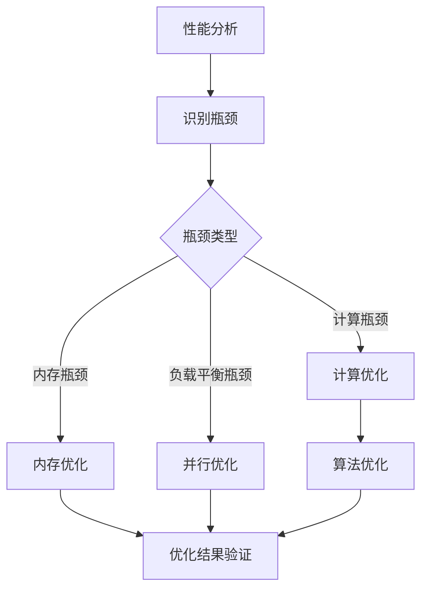

                 

### 《CUDA核函数优化：释放GPU AI计算的全部潜力》

> **关键词：CUDA、GPU、AI、计算优化、核函数、并行计算**

> **摘要：**
本文章将深入探讨CUDA核函数优化，旨在帮助开发者释放GPU在AI计算中的全部潜力。文章首先介绍CUDA和GPU加速基础，随后深入剖析CUDA编程核心概念和算法原理，接着详细讲解核函数性能分析、内存优化、并行优化、数学优化等方面的策略，并通过实际案例展示CUDA在AI领域的应用，最后展望GPU与AI的未来发展趋势。通过系统的分析和讲解，本文旨在为读者提供全面的CUDA核函数优化指导，助力高效AI计算实现。

### 《CUDA核函数优化：释放GPU AI计算的全部潜力》目录大纲

#### 第一部分：CUDA与GPU加速基础

##### 第1章：CUDA基础

1.1 CUDA架构与编程模型
1.2 GPU并行计算原理
1.3 CUDA开发环境搭建
1.4 CUDA内存管理

##### 第2章：CUDA编程核心概念

2.1 CUDA线程与线程组
2.2 内存层次与数据传输
2.3 共享内存与原子操作
2.4 锁与同步

##### 第3章：CUDA核心算法原理

3.1 矩阵乘法算法
3.2 向量加法算法
3.3 快速傅里叶变换算法

##### 第4章：CUDA数学库与优化

4.1 CUDA数学库介绍
4.2 数学库优化策略
4.3 数学库示例程序

#### 第二部分：CUDA核函数优化

##### 第5章：核函数性能分析

5.1 核函数性能指标
5.2 性能瓶颈分析
5.3 性能调优策略

##### 第6章：内存优化

6.1 内存层次结构
6.2 内存访问模式
6.3 内存优化技巧
6.4 内存优化示例

##### 第7章：并行优化

7.1 并行度与负载平衡
7.2 多线程优化
7.3 GPU多核心优化
7.4 并行优化示例

##### 第8章：数学优化

8.1 数学运算优化策略
8.2 向量化与SIMD优化
8.3 稀疏矩阵运算优化
8.4 数学优化示例

##### 第9章：实战应用

9.1 AI应用场景概述
9.2 深度学习框架在CUDA中的实现
9.3 GPU加速深度学习案例
9.4 GPU加速自然语言处理案例

##### 第10章：未来展望

10.1 GPU与AI发展展望
10.2 CUDA未来趋势
10.3 GPU加速AI的挑战与机遇

#### 附录

### 附录A：CUDA开发资源与工具

A.1 CUDA官方文档与教程
A.2 主流CUDA开发工具
A.3 CUDA社区与论坛
A.4 开发者经验分享

### 附录B：CUDA核函数优化流程图

B.1 核函数优化流程图

---

### 引言

随着人工智能（AI）的迅猛发展，GPU（图形处理单元）在AI计算中的应用变得越来越重要。GPU具有强大的并行处理能力，能够显著提高AI算法的计算效率，特别是在深度学习、图像处理和科学计算等领域。而CUDA（Compute Unified Device Architecture）作为NVIDIA推出的并行计算平台和编程语言，已经成为开发者在GPU上实现高性能计算的重要工具。

CUDA的核心思想是将计算任务分解为多个小型计算单元，这些单元可以并行执行，从而实现高效的计算。CUDA核函数（Kernel Function）是CUDA编程的基本单位，用于执行在GPU上运行的并行计算任务。核函数的性能直接影响到GPU的整体计算效率，因此优化核函数成为提高AI计算性能的关键。

本文将围绕CUDA核函数优化展开讨论，旨在帮助开发者深入理解CUDA架构和编程模型，掌握CUDA核心算法原理，以及通过具体的优化策略提升核函数的性能。文章将分为以下几个部分：

1. **CUDA与GPU加速基础**：介绍CUDA架构与编程模型，GPU并行计算原理，CUDA开发环境搭建以及CUDA内存管理。
2. **CUDA编程核心概念**：讲解CUDA线程与线程组，内存层次与数据传输，共享内存与原子操作，锁与同步等核心概念。
3. **CUDA核心算法原理**：剖析矩阵乘法、向量加法和快速傅里叶变换等核心算法原理，并使用伪代码详细阐述。
4. **CUDA数学库与优化**：介绍CUDA数学库，探讨数学库优化策略，并提供示例程序。
5. **CUDA核函数优化**：分析核函数性能指标，探讨性能瓶颈分析，详细讲解内存优化、并行优化和数学优化策略。
6. **实战应用**：展示CUDA在AI领域的实际应用，包括深度学习和自然语言处理案例。
7. **未来展望**：讨论GPU与AI的发展趋势，CUDA的未来趋势以及GPU加速AI的挑战与机遇。

通过本文的逐步分析和讲解，读者将能够全面掌握CUDA核函数优化技巧，为高效AI计算奠定坚实基础。接下来的章节将逐一深入探讨这些主题。

---

### 第一部分：CUDA与GPU加速基础

#### 第1章：CUDA基础

##### 1.1 CUDA架构与编程模型

CUDA是NVIDIA推出的并行计算平台和编程语言，专为GPU计算设计。CUDA架构包括以下关键组成部分：

1. **计算网格（Compute Grid）**：类似于传统计算机的网格架构，由多个计算块（Blocks）组成。每个计算块包含多个线程（Threads）。
2. **线程块（Thread Block）**：计算块中的一组线程，通常包含多个线程，每个线程在块内有一个唯一的线程索引。
3. **线程（Thread）**：执行计算任务的基本单元，可以独立执行计算。

CUDA编程模型采用数据并行和任务并行的思想，通过将任务分解为多个线程，并行执行。以下是一个简单的CUDA核函数示例：

```cuda
__global__ void vectorAdd(float *A, float *B, float *C, int numElements)
{
    int i = blockDim.x * blockIdx.x + threadIdx.x;
    if (i < numElements)
    {
        C[i] = A[i] + B[i];
    }
}
```

在这个示例中，`vectorAdd` 是一个核函数，它通过GPU计算向量加法。`__global__` 表示这个函数将在GPU上以并行方式执行。`blockDim` 和 `blockIdx` 分别表示线程块的大小和索引，`threadIdx` 表示线程在块内的索引。通过使用这些索引，每个线程可以独立访问其对应的数据，并在全局内存中更新结果。

##### 1.2 GPU并行计算原理

GPU并行计算的核心原理是将计算任务分解为多个并行的小任务，这些小任务可以独立执行，并且在同一时间由多个计算单元（线程）同时处理。以下是GPU并行计算的关键点：

1. **并行处理**：GPU包含成千上万个计算单元，可以同时执行多个计算任务。这种并行处理能力使得GPU在处理大规模数据时比CPU更加高效。
2. **任务调度**：CUDA通过线程块和线程的调度，将任务分配给GPU计算单元。每个线程块可以包含多个线程，线程块之间可以并行执行。
3. **内存层次结构**：GPU具有多层内存层次结构，包括全局内存、共享内存和寄存器。不同层次的内存具有不同的带宽和访问速度，优化内存访问模式可以提高性能。

##### 1.3 CUDA开发环境搭建

要开始使用CUDA进行开发，需要搭建相应的开发环境。以下是搭建CUDA开发环境的基本步骤：

1. **安装CUDA Toolkit**：从NVIDIA官网下载并安装CUDA Toolkit，包括编译器、调试器和数学库等。
2. **配置编译器**：配置CUDA编译器（如`nvcc`），确保其能够识别和编译CUDA代码。
3. **安装开发环境**：安装支持CUDA的集成开发环境（如Visual Studio、Eclipse等），以便进行代码编写、编译和调试。
4. **设置环境变量**：设置CUDA相关的环境变量，如`CUDA_HOME`和`PATH`，以便在命令行中执行CUDA命令。

以下是一个简单的CUDA环境变量配置示例：

```shell
export CUDA_HOME=/usr/local/cuda
export PATH=$PATH:$CUDA_HOME/bin
export LD_LIBRARY_PATH=$CUDA_HOME/lib64:$LD_LIBRARY_PATH
```

##### 1.4 CUDA内存管理

CUDA内存管理是CUDA编程的重要组成部分，涉及到内存分配、数据传输和内存释放等操作。以下是CUDA内存管理的基本概念和操作：

1. **内存分配**：使用`cudaMalloc()`函数在GPU上分配内存，使用`cudaMallocHost()`函数在主机（CPU）上分配内存。
2. **数据传输**：使用`cudaMemcpy()`函数在主机和GPU之间传输数据。根据数据传输的方向和类型，可以使用不同的传输函数，如`cudaMemcpyHostToDevice()`和`cudaMemcpyDeviceToHost()`。
3. **内存释放**：使用`cudaFree()`函数释放GPU和主机上的内存。

以下是一个简单的CUDA内存管理示例：

```cuda
float *d_A, *d_B, *d_C;
float *h_A, *h_B, *h_C;

// 分配主机内存
h_A = (float *)malloc(numElements * sizeof(float));
h_B = (float *)malloc(numElements * sizeof(float));
h_C = (float *)malloc(numElements * sizeof(float));

// 分配GPU内存
cudaMalloc((void **)&d_A, numElements * sizeof(float));
cudaMalloc((void **)&d_B, numElements * sizeof(float));
cudaMalloc((void **)&d_C, numElements * sizeof(float));

// 复制数据到GPU
cudaMemcpy(d_A, h_A, numElements * sizeof(float), cudaMemcpyHostToDevice);
cudaMemcpy(d_B, h_B, numElements * sizeof(float), cudaMemcpyHostToDevice);

// 执行核函数
vectorAdd<<<gridSize, blockSize>>>(d_A, d_B, d_C, numElements);

// 复制结果回主机
cudaMemcpy(h_C, d_C, numElements * sizeof(float), cudaMemcpyDeviceToHost);

// 释放内存
free(h_A);
free(h_B);
free(h_C);
cudaFree(d_A);
cudaFree(d_B);
cudaFree(d_C);
```

通过以上内容，读者可以初步了解CUDA基础，包括架构、编程模型、开发环境搭建和内存管理。接下来，我们将深入探讨CUDA编程的核心概念和算法原理，帮助读者更深入地理解CUDA编程。

---

#### 第2章：CUDA编程核心概念

在理解CUDA基础之后，接下来我们将探讨CUDA编程的核心概念，这些概念包括CUDA线程与线程组、内存层次与数据传输、共享内存与原子操作，以及锁与同步。掌握这些核心概念对于编写高效的CUDA代码至关重要。

##### 2.1 CUDA线程与线程组

CUDA线程是CUDA编程的基本执行单元，每个线程独立执行指令，并且可以并行工作。CUDA将线程组织成线程块（Thread Block），每个线程块包含多个线程。线程块和线程的关系可以用一个二维网格来表示，其中每个线程块是一个单元，而线程是单元中的点。

1. **线程索引**：每个线程都有一个唯一的线程索引，通常由三个维度的索引组成：`blockIdx.x`、`blockIdx.y`、`blockIdx.z`和`threadIdx.x`、`threadIdx.y`、`threadIdx.z`。这些索引用于确定线程在网格中的位置和线程块内线程的位置。
2. **线程块大小**：线程块的大小由`blockDim`和`gridSize`定义，其中`blockDim`表示线程块中线程的数量，`gridSize`表示整个计算网格中线程块的数量。
3. **线程并行性**：CUDA利用线程的并行性来提高计算效率。每个线程独立执行相同的任务，但使用不同的数据。通过合理设计线程块和线程的数量，可以实现高效的并行计算。

以下是一个简单的CUDA线程和线程组示例：

```cuda
__global__ void matrixMultiply(float *A, float *B, float *C, int width)
{
    int row = blockIdx.y * blockDim.y + threadIdx.y;
    int col = blockIdx.x * blockDim.x + threadIdx.x;

    if (row < width && col < width)
    {
        float value = 0.0f;
        for (int k = 0; k < width; ++k)
        {
            value += A[row * width + k] * B[k * width + col];
        }
        C[row * width + col] = value;
    }
}
```

在这个矩阵乘法示例中，每个线程计算矩阵C的一个元素，通过线程索引确定其在矩阵中的位置。

##### 2.2 内存层次与数据传输

CUDA内存层次结构包括寄存器、共享内存、全局内存和纹理内存。不同类型的内存具有不同的带宽和访问速度，优化内存访问模式可以提高性能。

1. **寄存器**：寄存器是CPU和GPU中最快、最昂贵的内存类型。线程可以直接访问寄存器，但寄存器的大小有限，因此通常只用于存储少量的临时变量。
2. **共享内存**：共享内存是线程块内的共享资源，所有线程块内的线程都可以访问。共享内存的带宽较高，但容量有限。通过合理使用共享内存，可以减少全局内存访问，提高计算效率。
3. **全局内存**：全局内存是GPU上的主存储器，所有线程都可以访问。全局内存的带宽相对较低，但容量较大。全局内存常用于存储大型数据和中间结果。
4. **纹理内存**：纹理内存是一种特殊的内存类型，用于存储纹理数据（如图像数据）。纹理内存具有高效的读取和过滤功能，常用于图像处理和纹理映射。

CUDA提供了多种数据传输函数，用于在主机和GPU之间传输数据。常用的数据传输函数包括`cudaMemcpy()`、`cudaMemset()`和`cudaMemmove()`。以下是一个简单的数据传输示例：

```cuda
float *d_A, *d_B, *d_C;
float *h_A, *h_B, *h_C;

// 分配主机内存
h_A = (float *)malloc(width * width * sizeof(float));
h_B = (float *)malloc(width * width * sizeof(float));
h_C = (float *)malloc(width * width * sizeof(float));

// 分配GPU内存
cudaMalloc((void **)&d_A, width * width * sizeof(float));
cudaMalloc((void **)&d_B, width * width * sizeof(float));
cudaMalloc((void **)&d_C, width * width * sizeof(float));

// 复制数据到GPU
cudaMemcpy(d_A, h_A, width * width * sizeof(float), cudaMemcpyHostToDevice);
cudaMemcpy(d_B, h_B, width * width * sizeof(float), cudaMemcpyHostToDevice);

// 执行核函数
matrixMultiply<<<gridSize, blockSize>>>(d_A, d_B, d_C, width);

// 复制结果回主机
cudaMemcpy(h_C, d_C, width * width * sizeof(float), cudaMemcpyDeviceToHost);

// 释放内存
free(h_A);
free(h_B);
free(h_C);
cudaFree(d_A);
cudaFree(d_B);
cudaFree(d_C);
```

通过合理选择内存类型和优化数据传输，可以显著提高CUDA程序的性能。

##### 2.3 共享内存与原子操作

共享内存是CUDA编程中常用的内存类型，它允许线程块内的线程共享数据。使用共享内存可以减少全局内存访问，提高计算效率。以下是一些使用共享内存的技巧：

1. **局部性**：共享内存具有很高的局部性，这意味着在共享内存中存储的数据通常被多个线程访问。通过合理组织数据，可以最大限度地利用共享内存的局部性。
2. **数据分块**：将数据分块存储在共享内存中，可以减少每个线程的内存访问冲突，提高计算效率。
3. **循环展开**：通过循环展开减少循环迭代次数，可以减少线程之间的同步次数，提高计算效率。

原子操作是CUDA编程中用于线程之间同步和避免数据竞争的重要机制。以下是一些常用的原子操作：

1. **原子加**：用于线程之间同步更新共享内存中的数据。
2. **原子交换**：用于线程之间交换共享内存中的数据。
3. **原子比较并交换**：用于线程之间同步更新共享内存中的数据，并比较新值和旧值。

以下是一个简单的共享内存和原子操作示例：

```cuda
__global__ void atomicExample(float *d_data, int n)
{
    int i = blockDim.x * blockIdx.x + threadIdx.x;
    __shared__ float s_data[256];

    if (i < n)
    {
        s_data[threadIdx.x] = d_data[i];
    }

    __syncthreads();

    if (threadIdx.x == 0)
    {
        float sum = 0.0f;
        for (int i = 0; i < blockDim.x; ++i)
        {
            sum += s_data[i];
        }

        atomicAdd(&d_data[0], sum);
    }
}
```

在这个示例中，线程首先将数据存储到共享内存中，然后通过原子操作同步更新全局内存中的数据。

##### 2.4 锁与同步

在CUDA编程中，锁（Lock）和同步（Synchronization）是用于线程之间同步和避免数据竞争的重要机制。以下是一些常用的锁和同步机制：

1. **内置锁（Mutex）**：内置锁是一种用于保护共享资源的同步机制。线程在使用共享资源之前必须获取锁，使用完毕后释放锁。
2. **条件锁（Condition Variable）**：条件锁是一种用于线程之间同步的机制，允许线程在满足特定条件时等待或唤醒其他线程。
3. **屏障（Barrier）**：屏障是一种用于线程之间同步的机制，所有线程必须到达屏障处才能继续执行。

以下是一个简单的锁和同步示例：

```cuda
#include <cuda_runtime.h>

__global__ void lockExample(float *d_data, int n)
{
    int i = blockDim.x * blockIdx.x + threadIdx.x;
    __shared__ int s_lock;

    if (i == 0)
    {
        s_lock = 1;
    }
    __syncthreads();

    while (s_lock != 0)
    {
        if (threadIdx.x == 0)
        {
            s_lock = atomicExch(&d_data[0], 0);
        }
        __syncthreads();
    }

    if (i < n)
    {
        d_data[i] *= d_data[i];
    }
}
```

在这个示例中，线程首先使用内置锁保护共享资源，然后通过同步机制确保线程之间的一致性。

通过以上内容，读者可以初步了解CUDA编程的核心概念，包括CUDA线程与线程组、内存层次与数据传输、共享内存与原子操作，以及锁与同步。掌握这些核心概念对于编写高效的CUDA代码至关重要。在接下来的章节中，我们将深入探讨CUDA核心算法原理，帮助读者更深入地理解CUDA编程。

---

#### 第3章：CUDA核心算法原理

在理解了CUDA编程的核心概念之后，我们需要进一步探讨CUDA在实际计算中的应用，这包括矩阵乘法、向量加法和快速傅里叶变换等核心算法的原理。通过详细讲解这些算法，我们将展示如何使用伪代码来实现这些算法，并提供数学模型和公式。

##### 3.1 矩阵乘法算法

矩阵乘法是线性代数中最基本的运算之一，也是许多科学计算和机器学习算法中的关键步骤。在CUDA中，矩阵乘法可以通过并行计算来实现，从而显著提高计算效率。

**算法原理：**

给定两个矩阵A（m×n）和B（n×k），矩阵乘法C（m×k）的计算公式为：

\[ C_{ij} = \sum_{k=1}^{n} A_{ik} \times B_{kj} \]

在CUDA中，我们可以将矩阵乘法分解为多个线程块来并行计算。以下是一个简单的矩阵乘法伪代码：

```cuda
__global__ void matrixMultiply(float *A, float *B, float *C, int m, int n, int k)
{
    int row = blockIdx.y * blockDim.y + threadIdx.y;
    int col = blockIdx.x * blockDim.x + threadIdx.x;

    if (row < m && col < k)
    {
        float value = 0.0f;
        for (int k = 0; k < n; ++k)
        {
            value += A[row * n + k] * B[k * k + col];
        }
        C[row * k + col] = value;
    }
}
```

**数学模型和公式：**

矩阵乘法的数学公式可以表示为：

\[ C = AB \]

其中，\( A \) 和 \( B \) 是输入矩阵，\( C \) 是输出矩阵。

##### 3.2 向量加法算法

向量加法是线性代数中的基本运算，在机器学习和数据科学中广泛应用。在CUDA中，向量加法可以通过并行计算来实现。

**算法原理：**

给定两个向量A和B，长度为n，向量加法的结果C可以通过以下公式计算：

\[ C_i = A_i + B_i \]

在CUDA中，每个线程可以负责计算向量的一个元素。以下是一个简单的向量加法伪代码：

```cuda
__global__ void vectorAdd(float *A, float *B, float *C, int n)
{
    int i = blockDim.x * blockIdx.x + threadIdx.x;

    if (i < n)
    {
        C[i] = A[i] + B[i];
    }
}
```

**数学模型和公式：**

向量加法的数学公式可以表示为：

\[ C = A + B \]

其中，\( A \) 和 \( B \) 是输入向量，\( C \) 是输出向量。

##### 3.3 快速傅里叶变换算法

快速傅里叶变换（FFT）是信号处理中的重要算法，用于将时域信号转换为频域信号。在CUDA中，FFT可以通过并行计算来实现，从而提高计算效率。

**算法原理：**

快速傅里叶变换的递推公式如下：

\[ X_k = \sum_{j=0}^{n-1} C_j \times W_{kn}^{2j} \]

其中，\( X_k \) 是输出频域信号，\( C_j \) 是输入时域信号，\( W_{kn} \) 是傅里叶变换的旋转因子。

在CUDA中，FFT可以通过分治策略来实现。以下是一个简单的FFT伪代码：

```cuda
__global__ void fft(float *X, float *C, int n)
{
    // 伪代码，具体实现需分阶段完成
    // ...
}
```

**数学模型和公式：**

快速傅里叶变换的数学公式可以表示为：

\[ X = C \times W_n \]

其中，\( X \) 是输出频域信号，\( C \) 是输入时域信号，\( W_n \) 是傅里叶变换的旋转因子。

通过以上内容，我们详细讲解了CUDA核心算法原理，包括矩阵乘法、向量加法和快速傅里叶变换。这些算法在CUDA中的实现展示了如何通过并行计算来提高计算效率。接下来，我们将进一步探讨CUDA数学库与优化，帮助读者更好地利用CUDA进行高性能计算。

---

#### 第4章：CUDA数学库与优化

CUDA数学库（CUBLAS、CUFFT、CUTLASS等）是NVIDIA提供的一套高性能数学库，用于在GPU上执行矩阵运算、傅里叶变换和向量运算等。这些库通过优化的底层实现，能够显著提高GPU在数学计算中的性能。在本章中，我们将介绍CUDA数学库的基本使用方法，探讨优化策略，并提供示例程序。

##### 4.1 CUDA数学库介绍

1. **CUBLAS**：CUBLAS是一个用于线性代数计算的数学库，支持矩阵乘法、向量乘法、矩阵向量乘法等基本运算。CUBLAS提供了高效且易于使用的接口，使得开发者能够轻松地在CUDA应用程序中集成线性代数运算。
   
2. **CUFFT**：CUFFT是NVIDIA提供的FFT（快速傅里叶变换）库，支持一维、二维和三维FFT运算。CUFFT使用快速傅里叶变换算法，能够显著提高信号处理的计算效率。

3. **CUTLASS**：CUTLASS是一个用于张量运算的库，支持矩阵乘法、矩阵向量乘法、向量加法等运算。CUTLASS利用了CUDA的并行计算能力，提供了灵活且高效的张量运算接口。

##### 4.2 数学库优化策略

为了最大化GPU的计算性能，使用CUDA数学库时需要考虑以下优化策略：

1. **内存访问优化**：优化内存访问模式，减少全局内存的访问冲突和延迟。通过使用共享内存和纹理内存，可以提高内存访问的速度。

2. **并行度优化**：合理设置线程块的大小和数量，确保每个线程块能够充分利用GPU的计算资源。同时，要考虑负载平衡，避免线程之间的工作量不均。

3. **运算优化**：优化运算顺序，减少不必要的计算和内存访问。例如，通过矩阵分块，可以减少数据传输的开销，提高计算效率。

4. **预计算和缓存**：预计算一些中间结果，并利用GPU缓存，可以减少计算时间和内存访问。

##### 4.3 数学库示例程序

以下是一些简单的示例程序，展示如何使用CUDA数学库进行矩阵运算和FFT运算。

**示例1：使用CUBLAS进行矩阵乘法**

```cuda
#include <stdio.h>
#include <cuda_runtime.h>
#include <cublas_v2.h>

int main()
{
    // 初始化CUBLAS库
    cublasHandle_t handle;
    cublasCreate(&handle);

    // 创建矩阵A和B
    float *d_A, *d_B;
    int m = 1024, n = 1024, k = 1024;
    size_t size_A = m * k * sizeof(float);
    size_t size_B = n * k * sizeof(float);

    // 分配GPU内存
    cudaMalloc(&d_A, size_A);
    cudaMalloc(&d_B, size_B);

    // 初始化矩阵数据
    float *h_A = (float *)malloc(size_A);
    float *h_B = (float *)malloc(size_B);
    for (int i = 0; i < m * k; ++i)
    {
        h_A[i] = 1.0f;
    }
    for (int i = 0; i < n * k; ++i)
    {
        h_B[i] = 2.0f;
    }

    // 复制数据到GPU
    cudaMemcpy(d_A, h_A, size_A, cudaMemcpyHostToDevice);
    cudaMemcpy(d_B, h_B, size_B, cudaMemcpyHostToDevice);

    // 执行矩阵乘法
    float *d_C;
    size_t size_C = m * n * sizeof(float);
    cudaMalloc(&d_C, size_C);
    float alpha = 1.0f, beta = 0.0f;
    cublasSgemm(handle, CUBLAS_OP_N, CUBLAS_OP_N, m, n, k, &alpha, d_A, k, d_B, k, &beta, d_C, n);

    // 复制结果回主机
    float *h_C = (float *)malloc(size_C);
    cudaMemcpy(h_C, d_C, size_C, cudaMemcpyDeviceToHost);

    // 释放内存
    free(h_A);
    free(h_B);
    free(h_C);
    cudaFree(d_A);
    cudaFree(d_B);
    cudaFree(d_C);
    cublasDestroy(handle);

    return 0;
}
```

**示例2：使用CUFFT进行FFT运算**

```cuda
#include <stdio.h>
#include <cuda_runtime.h>
#include <cufft.h>

int main()
{
    // 初始化CUFFT库
    cufftHandle plan;
    cufftCreate(&plan);

    // 设置FFT大小
    int n = 1024;
    cufftType type = CUFFT_R2C;
    size_t size = n * sizeof(cufftComplex);

    // 分配GPU内存
    cufftComplex *d_A, *d_B;
    cufftComplex *h_A = (cufftComplex *)malloc(size);
    cufftComplex *h_B = (cufftComplex *)malloc(size);

    // 初始化输入数据
    for (int i = 0; i < n; ++i)
    {
        h_A[i].x = i;
        h_A[i].y = 0.0f;
    }

    // 复制数据到GPU
    cufftComplex *d_h_A = (cufftComplex *)malloc(size);
    cudaMemcpy(d_h_A, h_A, size, cudaMemcpyHostToDevice);

    // 执行FFT运算
    cufftExecC2C(plan, d_h_A, d_B, type, CUFFT_FORWARD);

    // 复制结果回主机
    cufftComplex *h_B = (cufftComplex *)malloc(size);
    cudaMemcpy(h_B, d_B, size, cudaMemcpyDeviceToHost);

    // 释放内存
    free(h_A);
    free(h_B);
    cufftDestroy(plan);

    return 0;
}
```

通过以上示例，我们可以看到如何使用CUDA数学库进行基本的数学运算。在实际应用中，开发者可以根据具体需求选择合适的数学库，并通过优化策略提高计算性能。接下来，我们将深入探讨CUDA核函数优化，帮助读者进一步提高GPU计算的效率。

---

#### 第5章：CUDA核函数性能分析

在CUDA编程中，核函数（Kernel Function）是执行并行计算的核心单元。优化核函数性能对于提高整个程序的计算效率至关重要。本章节将详细分析核函数性能的各个方面，包括性能指标、性能瓶颈分析以及性能调优策略。

##### 5.1 核函数性能指标

核函数性能可以通过多个指标来衡量，这些指标包括：

1. **执行时间**：核函数从开始执行到完成的时间。执行时间是衡量核函数性能最重要的指标之一。
2. **吞吐量**：单位时间内完成的操作数量。吞吐量与执行时间和并行度密切相关。
3. **利用率**：GPU的计算资源（如核心、内存等）的使用率。高利用率意味着GPU资源被充分利用。
4. **内存带宽**：单位时间内内存的读写速度。内存带宽是影响核函数性能的关键因素。
5. **内存占用**：核函数在GPU内存中占用的空间。内存占用过大会导致性能下降。

##### 5.2 性能瓶颈分析

性能瓶颈是指限制程序性能的关键因素。在优化核函数性能时，识别并解决性能瓶颈至关重要。常见的性能瓶颈包括：

1. **内存访问冲突**：当多个线程同时访问同一内存位置时，可能导致数据竞争和性能下降。
2. **内存带宽限制**：当数据传输速度低于计算速度时，内存带宽成为性能瓶颈。
3. **计算资源竞争**：当多个核函数或线程竞争GPU计算资源时，可能导致资源利用率下降。
4. **同步开销**：线程之间的同步操作（如`__syncthreads()`）可能增加执行时间。

为了分析性能瓶颈，可以使用以下工具：

1. **CUDA Visual Profiler**：NVIDIA提供的可视化性能分析工具，可以提供详细的性能统计数据和热点图。
2. **nvprof**：NVIDIA提供的命令行性能分析工具，可以生成性能统计报告。
3. **nvcc编译器的`-Xcompiler`选项**：可以使用`-Xcompiler`选项在编译时添加性能分析指令，如`-fprofile-generate`和`-fprofile-use`。

以下是一个简单的性能分析示例：

```shell
nvprof ./your_cuda_program
```

通过使用上述工具，可以识别程序中的性能瓶颈，并制定相应的优化策略。

##### 5.3 性能调优策略

优化核函数性能的策略包括内存优化、并行优化和算法优化等。以下是一些常用的性能调优策略：

1. **内存优化**：
   - **减少内存访问冲突**：通过合理设计线程布局和内存访问模式，减少内存访问冲突。例如，使用`__threadfence()`和`__syncthreads()`确保线程之间的内存访问顺序。
   - **优化内存带宽**：使用共享内存和纹理内存，减少全局内存访问。通过数据预处理和内存复用，减少不必要的内存分配和释放操作。

2. **并行优化**：
   - **负载平衡**：确保每个线程块的工作量大致相同，避免某些线程块完成时间过长，影响整体性能。
   - **线程数量优化**：合理设置线程数量，避免过度并行化导致资源竞争和调度开销。通过调整线程块大小和线程数量，找到最优的并行度。
   - **并行算法优化**：使用向量化指令和SIMD操作，提高并行计算效率。通过矩阵分块和并行算法的优化，减少数据传输和内存访问的开销。

3. **算法优化**：
   - **算法选择**：根据具体应用场景选择合适的算法。例如，对于大数据集，选择更高效的算法（如快速傅里叶变换FFT）。
   - **算法并行化**：将算法分解为多个可并行执行的任务，充分利用GPU的并行计算能力。通过任务分解和并行算法设计，提高计算效率。

以下是一个简单的性能优化示例：

```cuda
__global__ void optimizedVectorAdd(float *A, float *B, float *C, int n)
{
    int i = blockIdx.x * blockDim.x + threadIdx.x;
    int stride = blockDim.x * gridDim.x;

    for (; i < n; i += stride)
    {
        C[i] = A[i] + B[i];
    }
}
```

在这个优化示例中，通过减少循环迭代次数和增加线程数量，提高了计算效率和吞吐量。

通过以上内容，我们详细分析了CUDA核函数性能的各个方面，包括性能指标、性能瓶颈分析和性能调优策略。掌握这些优化策略有助于开发者提高GPU计算性能，释放GPU在AI计算中的全部潜力。接下来，我们将进一步探讨内存优化策略，帮助读者进一步提升核函数性能。

---

#### 第6章：内存优化

在CUDA编程中，内存优化是提升核函数性能的关键因素之一。由于GPU的内存层次结构和工作模式与CPU不同，优化内存访问模式可以有效提高计算效率。本章节将详细介绍内存层次结构、内存访问模式、内存优化技巧，并通过具体示例展示内存优化的应用。

##### 6.1 内存层次结构

GPU的内存层次结构包括多个层次，从高性能、低容量的寄存器到低性能、高容量的全局内存。以下是GPU内存层次结构的简要概述：

1. **寄存器**：寄存器是GPU上最快的内存类型，每个线程可以独立访问。寄存器的容量非常有限，通常只用于存储少量临时变量。优化寄存器使用可以提高线程的执行效率。

2. **共享内存**：共享内存是线程块内的共享资源，所有线程块内的线程都可以访问。共享内存的带宽较高，但容量有限。通过合理使用共享内存，可以减少全局内存访问，提高计算效率。

3. **全局内存**：全局内存是GPU上的主存储器，所有线程都可以访问。全局内存的带宽相对较低，但容量较大。全局内存常用于存储大型数据和中间结果。优化全局内存访问模式，如减少内存访问冲突，可以提高性能。

4. **纹理内存**：纹理内存是一种特殊的内存类型，用于存储纹理数据（如图像数据）。纹理内存具有高效的读取和过滤功能，常用于图像处理和纹理映射。优化纹理内存的使用，如使用纹理优化功能，可以提高性能。

##### 6.2 内存访问模式

GPU内存访问模式对性能有重要影响。以下是一些常见的内存访问模式：

1. **局部性**：内存访问的局部性是指线程或线程块在短时间内频繁访问相同或邻近的内存位置。局部性分为数据局部性和指令局部性。数据局部性优化通过预取和缓存技术，减少内存访问延迟。指令局部性优化通过指令重排，减少指令流水线的阻塞。

2. **内存访问模式**：内存访问模式包括顺序访问、随机访问和缓存访问。顺序访问通过预取技术，提高内存访问速度。随机访问可能导致内存访问冲突，降低性能。缓存访问利用GPU缓存机制，减少内存带宽压力，提高性能。

3. **内存对齐**：内存对齐是指数据在内存中的存储方式，对齐方式会影响内存访问速度。在CUDA编程中，数据通常按照32位或128位对齐，这有助于提高内存访问效率。

##### 6.3 内存优化技巧

以下是一些常见的内存优化技巧：

1. **减少全局内存访问**：通过使用共享内存和纹理内存，减少全局内存访问。例如，将经常访问的数据存储在共享内存中，减少全局内存的读写操作。

2. **预取技术**：使用预取技术，提前加载即将访问的内存数据，减少内存访问延迟。CUDA提供了`cudaMemPrefetchAsync()`函数，可以在后台预取数据。

3. **内存复用**：通过内存复用，减少内存分配和释放操作。例如，重用已分配的内存，而不是频繁地分配和释放。

4. **数据对齐**：确保数据按照32位或128位对齐，提高内存访问速度。

5. **减少内存访问冲突**：通过合理设计线程布局和内存访问模式，减少内存访问冲突。例如，使用线程束（thread group）将相邻线程映射到相邻内存位置。

6. **优化内存带宽**：通过数据预处理和内存复用，优化内存带宽的使用。例如，将数据分块存储在共享内存中，减少全局内存访问。

##### 6.4 内存优化示例

以下是一个简单的内存优化示例，展示如何通过共享内存优化向量加法核函数：

```cuda
__global__ void optimizedVectorAdd(float *A, float *B, float *C, int n)
{
    __shared__ float s_A[128];
    __shared__ float s_B[128];

    int i = blockIdx.x * blockDim.x + threadIdx.x;
    int tid = threadIdx.x;

    // 上步加载共享内存
    if (i < n)
    {
        s_A[tid] = A[i];
        s_B[tid] = B[i];
    }
    __syncthreads();

    // 核函数计算
    if (i < n)
    {
        C[i] = s_A[tid] + s_B[tid];
    }
}
```

在这个示例中，通过使用共享内存，减少了全局内存的访问。每个线程将自身的元素加载到共享内存中，然后进行计算，这有助于提高内存访问速度和性能。

通过以上内容，我们详细介绍了CUDA内存优化，包括内存层次结构、内存访问模式、内存优化技巧以及具体示例。掌握这些内存优化策略，可以显著提高GPU计算性能，为AI计算提供更强大的支持。接下来，我们将探讨并行优化策略，帮助读者进一步提升GPU计算效率。

---

#### 第7章：并行优化

在CUDA编程中，并行优化是提高计算效率的关键步骤。通过合理设计线程布局和负载平衡，可以充分利用GPU的并行计算能力。本章将深入探讨并行优化的各个方面，包括并行度与负载平衡、多线程优化、GPU多核心优化以及具体的优化示例。

##### 7.1 并行度与负载平衡

并行度是指一个程序中可以并行执行的任务数量。在CUDA中，并行度通过线程的数量和线程块的配置来实现。负载平衡是指确保每个线程块的工作量大致相同，避免某些线程块完成时间过长，影响整体性能。

**并行度与负载平衡的关键点：**

1. **线程数量优化**：选择合适的线程数量，避免过度并行化导致资源竞争和调度开销。可以通过实验和性能分析找到最优的线程数量。

2. **线程块大小**：线程块大小（block size）影响并行度。较大的线程块可以容纳更多线程，提高并行度，但也会增加内存访问冲突和同步开销。因此，需要权衡线程块大小和并行度。

3. **负载平衡**：确保每个线程块的工作量大致相同。可以通过动态负载分配或静态负载分配来实现。动态负载分配可以根据实时负载调整线程块的大小，而静态负载分配则通过合理设计线程布局实现。

**示例：线程数量和线程块大小的优化**

以下是一个简单的例子，展示如何通过调整线程数量和线程块大小来优化并行度：

```cuda
__global__ void optimizedVectorAdd(float *A, float *B, float *C, int n)
{
    int i = blockIdx.x * blockDim.x + threadIdx.x;
    int stride = blockDim.x * gridDim.x;

    for (; i < n; i += stride)
    {
        C[i] = A[i] + B[i];
    }
}
```

在这个示例中，通过调整`blockDim`和`gridDim`，可以控制线程数量和线程块大小，从而实现并行度优化。

##### 7.2 多线程优化

多线程优化是指通过优化线程的调度和执行，提高计算效率。以下是一些多线程优化的策略：

1. **线程束（Warps）调度**：线程束是GPU上执行的基本单元。确保线程束的调度效率，减少线程束之间的切换开销。可以通过调整线程束的数量和大小，优化线程束调度。

2. **线程级并行**：确保每个线程能够高效地利用GPU资源。可以通过优化线程的工作负载和内存访问模式，提高线程的执行效率。

3. **循环展开**：减少循环迭代次数，提高并行度。通过循环展开，可以减少循环控制逻辑的开销，提高计算效率。

**示例：线程束调度优化**

以下是一个简单的例子，展示如何通过优化线程束调度来提高多线程性能：

```cuda
__global__ void optimizedMatrixMultiply(float *A, float *B, float *C, int width)
{
    __shared__ float s_A[256];
    __shared__ float s_B[256];

    int row = blockIdx.y * blockDim.y + threadIdx.y;
    int col = blockIdx.x * blockDim.x + threadIdx.x;
    int index = row * width + col;

    if (row < width && col < width)
    {
        float value = 0.0f;
        for (int k = 0; k < width; ++k)
        {
            s_A[threadIdx.y] = A[row * width + k];
            s_B[threadIdx.x] = B[k * width + col];
            __syncthreads();

            value += s_A[threadIdx.y] * s_B[threadIdx.x];
        }
        C[index] = value;
    }
}
```

在这个示例中，通过共享内存和线程束调度优化，提高了矩阵乘法的并行度。

##### 7.3 GPU多核心优化

GPU多核心优化是指通过优化不同GPU核心之间的负载分配和任务调度，提高整体计算效率。以下是一些GPU多核心优化的策略：

1. **多GPU编程**：通过在多个GPU之间分配任务，实现并行计算。可以使用CUDA的`cudaSetDevice()`函数切换GPU，并在多个GPU上执行相同或不同的任务。

2. **核心选择**：根据任务特点和GPU架构，选择合适的GPU核心。例如，对于计算密集型任务，可以选择高性能的核心；对于内存密集型任务，可以选择内存带宽更高的核心。

3. **负载分配**：通过动态负载分配，将任务分配给不同GPU核心，实现负载平衡。可以使用CUDA的`cudaMemcpyPeer()`和`cudaMemcpyPeerAsync()`函数，在GPU之间传输数据。

**示例：多GPU编程**

以下是一个简单的多GPU编程示例，展示如何使用多个GPU核心执行矩阵乘法：

```cuda
int main()
{
    int devices[] = {0, 1};
    int num_devices = sizeof(devices) / sizeof(devices[0]);

    for (int i = 0; i < num_devices; ++i)
    {
        cudaSetDevice(devices[i]);

        // 分配和初始化内存
        float *d_A, *d_B, *d_C;
        size_t size = width * width * sizeof(float);

        cudaMalloc(&d_A, size);
        cudaMalloc(&d_B, size);
        cudaMalloc(&d_C, size);

        // 复制数据到GPU
        cudaMemcpy(d_A, h_A, size, cudaMemcpyHostToDevice);
        cudaMemcpy(d_B, h_B, size, cudaMemcpyHostToDevice);

        // 执行矩阵乘法
        matrixMultiply<<<gridSize, blockSize>>>(d_A, d_B, d_C, width);

        // 复制结果回主机
        cudaMemcpy(h_C, d_C, size, cudaMemcpyDeviceToHost);

        // 释放内存
        cudaFree(d_A);
        cudaFree(d_B);
        cudaFree(d_C);
    }

    return 0;
}
```

在这个示例中，通过在多个GPU核心上分配任务，实现了并行计算。

通过以上内容，我们详细探讨了CUDA并行优化的各个方面，包括并行度与负载平衡、多线程优化和GPU多核心优化。掌握这些优化策略，可以显著提高GPU计算性能，为AI计算提供更强大的支持。接下来，我们将进一步探讨数学优化策略，帮助读者进一步提高GPU计算效率。

---

#### 第8章：数学优化

在CUDA编程中，数学优化是提高核函数性能的重要手段。通过优化数学运算，可以减少计算时间，提高GPU的利用率。本章将详细介绍数学优化策略，包括数学运算优化、向量化与SIMD优化、稀疏矩阵运算优化，并展示相应的优化示例。

##### 8.1 数学运算优化策略

数学运算优化策略包括以下几个方面：

1. **减少计算复杂度**：简化数学运算，减少计算步骤。例如，通过矩阵分解，将复杂的矩阵乘法分解为更简单的运算。

2. **优化运算顺序**：调整运算顺序，减少不必要的计算。例如，先计算结果所需的中间变量，再进行最终计算。

3. **利用GPU特性**：利用GPU的并行计算能力，将数学运算分解为多个并行任务。例如，通过矩阵分块，将矩阵乘法分解为多个小矩阵乘法。

4. **内存访问优化**：优化内存访问模式，减少内存带宽压力。例如，使用共享内存和纹理内存，减少全局内存访问。

5. **算法选择**：根据具体应用场景，选择高效的算法。例如，对于大数据集，选择快速傅里叶变换（FFT）等高效算法。

##### 8.2 向量化与SIMD优化

向量化（Vectorization）和单指令多数据流（SIMD）优化是提高数学运算性能的有效手段。以下是一些优化策略：

1. **向量化**：将单个指令扩展到多个数据元素上，提高计算效率。CUDA自动向量化提供了自动向量化支持，开发者只需编写向量化代码，编译器会自动优化。

2. **SIMD优化**：通过单指令多数据流（SIMD）操作，将多个数据元素并行处理。CUDA提供了SIMD指令集，如`__shfl()`、`__shfl_up_sync()`等，用于线程之间的数据交换和同步。

3. **向量指令集**：使用GPU的向量指令集，如`__vadd()`、`__vmul()`等，直接在汇编级别进行向量运算，提高计算效率。

**示例：向量化与SIMD优化**

以下是一个简单的示例，展示如何通过向量化与SIMD优化向量加法：

```cuda
__global__ void vectorAdd(float *A, float *B, float *C, int n)
{
    int i = blockDim.x * blockIdx.x + threadIdx.x;
    int stride = blockDim.x * gridDim.x;

    for (; i < n; i += stride)
    {
        float4 a = vload4(i, A);
        float4 b = vload4(i, B);
        float4 c = a + b;
        vstore4(c, i, C);
    }
}
```

在这个示例中，通过使用`vload4()`和`vstore4()`函数，实现了向量加法的向量化与SIMD优化。

##### 8.3 稀疏矩阵运算优化

稀疏矩阵运算优化是提高GPU计算性能的关键。以下是一些优化策略：

1. **稀疏存储**：使用稀疏存储格式，如压缩稀疏行（Compressed Sparse Row，CSR）格式，减少存储空间占用，提高计算效率。

2. **稀疏矩阵乘法**：通过稀疏矩阵乘法算法，如稀疏矩阵-稀疏矩阵乘法（SSSP）和稀疏矩阵-稠密矩阵乘法（SDM），减少计算复杂度。

3. **矩阵分块**：将稀疏矩阵分块，通过并行计算提高计算效率。

4. **内存访问优化**：优化内存访问模式，减少内存带宽压力。例如，使用共享内存和纹理内存，减少全局内存访问。

**示例：稀疏矩阵乘法优化**

以下是一个简单的示例，展示如何通过稀疏矩阵乘法优化：

```cuda
__global__ void sparseMatrixMultiply(float *A, float *B, float *C, int m, int n, int k)
{
    int row = blockIdx.y * blockDim.y + threadIdx.y;
    int col = blockIdx.x * blockDim.x + threadIdx.x;

    if (row < m && col < k)
    {
        float value = 0.0f;
        for (int k = 0; k < n; ++k)
        {
            value += A[row * n + k] * B[k * k + col];
        }
        C[row * k + col] = value;
    }
}
```

在这个示例中，通过使用稀疏矩阵乘法算法，实现了稀疏矩阵运算的优化。

通过以上内容，我们详细介绍了数学优化策略，包括数学运算优化、向量化与SIMD优化和稀疏矩阵运算优化。掌握这些优化策略，可以显著提高GPU计算性能，为AI计算提供更强大的支持。接下来，我们将通过实际案例展示CUDA在AI领域的应用。

---

#### 第9章：实战应用

CUDA在AI领域具有广泛的应用，特别是在深度学习和自然语言处理等方面。通过CUDA的并行计算能力，开发者可以实现高效的AI计算，加速模型的训练和推理。本章将介绍CUDA在AI领域的应用，包括AI应用场景概述、深度学习框架在CUDA中的实现，以及GPU加速深度学习和自然语言处理的具体案例。

##### 9.1 AI应用场景概述

AI应用场景主要包括以下方面：

1. **图像处理**：包括图像分类、目标检测、图像生成等。GPU的并行计算能力使其成为图像处理的重要工具。
2. **自然语言处理**：包括文本分类、情感分析、机器翻译等。自然语言处理任务的并行特性使其非常适合GPU加速。
3. **语音识别**：包括语音识别、说话人识别等。语音识别任务的计算复杂度较高，GPU可以显著提高处理速度。
4. **深度学习**：包括神经网络训练和推理。深度学习模型通常具有大量参数和多层神经网络，适合GPU加速。

##### 9.2 深度学习框架在CUDA中的实现

深度学习框架如TensorFlow、PyTorch等，已经提供了在CUDA中的实现。这些框架通过自动调优和底层优化，使得开发者能够方便地在GPU上运行深度学习模型。以下是一些深度学习框架在CUDA中的实现要点：

1. **自动调优**：框架通过自动调优，根据GPU的配置和性能，选择最优的计算模式。例如，TensorFlow的CUDA自动调优功能会根据GPU型号和内存带宽，选择最佳的线程配置。
2. **底层优化**：框架通过底层优化，提高GPU的计算效率。例如，TensorFlow的CUDA后端会自动优化内存访问模式，减少内存带宽压力。
3. **动态调度**：框架通过动态调度，根据计算负载和资源情况，动态调整线程配置和内存访问模式。例如，PyTorch的CUDNN库会根据数据类型和计算模式，动态选择最优的运算指令。

##### 9.3 GPU加速深度学习案例

以下是一个简单的GPU加速深度学习案例，展示如何使用CUDA和深度学习框架加速神经网络训练。

**案例：使用TensorFlow加速神经网络训练**

1. **环境搭建**：安装CUDA Toolkit和TensorFlow GPU版本。
2. **模型定义**：定义一个简单的神经网络模型，包括输入层、隐藏层和输出层。
3. **数据预处理**：将数据集预处理为GPU可用的格式，并进行批处理。
4. **模型训练**：使用`tf.config.run_functions_eagerly()`函数，将模型训练过程设置为Eager Execution模式，以便在GPU上执行。
5. **模型评估**：评估模型性能，包括准确率、损失函数等。

以下是一个简单的TensorFlow训练案例：

```python
import tensorflow as tf

# 定义模型
model = tf.keras.Sequential([
    tf.keras.layers.Dense(128, activation='relu', input_shape=(784,)),
    tf.keras.layers.Dense(10, activation='softmax')
])

# 编译模型
model.compile(optimizer='adam',
              loss='categorical_crossentropy',
              metrics=['accuracy'])

# 加载数据
(x_train, y_train), (x_test, y_test) = tf.keras.datasets.mnist.load_data()
x_train = x_train.astype('float32') / 255
x_test = x_test.astype('float32') / 255
x_train = x_train.reshape((-1, 784))
x_test = x_test.reshape((-1, 784))

# 增加一个占位符维度
x_train = tf.expand_dims(x_train, -1)
x_test = tf.expand_dims(x_test, -1)

# 将标签转换为one-hot编码
y_train = tf.keras.utils.to_categorical(y_train, 10)
y_test = tf.keras.utils.to_categorical(y_test, 10)

# 训练模型
model.fit(x_train, y_train, epochs=5, batch_size=128, validation_split=0.1)

# 评估模型
test_loss, test_acc = model.evaluate(x_test, y_test)
print('Test accuracy:', test_acc)
```

在这个案例中，通过使用TensorFlow的CUDA后端，实现了GPU加速神经网络训练。通过自动调优和底层优化，模型在GPU上运行更加高效。

##### 9.4 GPU加速自然语言处理案例

以下是一个简单的GPU加速自然语言处理案例，展示如何使用CUDA和深度学习框架加速文本分类。

**案例：使用PyTorch加速文本分类**

1. **环境搭建**：安装CUDA和PyTorch GPU版本。
2. **数据预处理**：加载并预处理文本数据，包括词汇表构建和句子编码。
3. **模型定义**：定义一个简单的文本分类模型，包括嵌入层、卷积层和全连接层。
4. **训练模型**：使用GPU加速模型训练，包括数据加载、前向传播和反向传播。
5. **模型评估**：评估模型性能，包括准确率、损失函数等。

以下是一个简单的PyTorch训练案例：

```python
import torch
import torch.nn as nn
import torch.optim as optim

# 定义模型
class TextClassifier(nn.Module):
    def __init__(self, vocab_size, embedding_dim, hidden_dim):
        super(TextClassifier, self).__init__()
        self.embedding = nn.Embedding(vocab_size, embedding_dim)
        self.conv1 = nn.Conv2d(1, hidden_dim, kernel_size=3, padding=1)
        self.fc1 = nn.Linear(hidden_dim * 4, 2)

    def forward(self, sentences):
        embedded = self.embedding(sentences).view(-1, 1, 100, 100)
        conv_output = self.conv1(embedded)
        hidden = torch.max(conv_output, 2)[0]
        out = self.fc1(hidden)
        return out

# 加载数据
data = torch.load('data.pth')
train_data, test_data = data['train'], data['test']

# 训练模型
model = TextClassifier(vocab_size, embedding_dim, hidden_dim)
model.cuda()

optimizer = optim.Adam(model.parameters(), lr=0.001)
criterion = nn.CrossEntropyLoss()

for epoch in range(num_epochs):
    for sentences, labels in train_data:
        sentences = sentences.cuda()
        labels = labels.cuda()
        optimizer.zero_grad()
        output = model(sentences)
        loss = criterion(output, labels)
        loss.backward()
        optimizer.step()

    with torch.no_grad():
        for sentences, labels in test_data:
            sentences = sentences.cuda()
            labels = labels.cuda()
            output = model(sentences)
            loss = criterion(output, labels)
            print('Test loss:', loss.item())

print('Training completed')
```

在这个案例中，通过使用PyTorch的CUDA后端，实现了GPU加速文本分类。通过自动调优和底层优化，模型在GPU上运行更加高效。

通过以上实战案例，我们可以看到CUDA在AI领域的广泛应用和强大性能。通过深入理解和应用CUDA核函数优化技巧，开发者可以显著提高AI计算效率，推动AI技术的发展。

---

### 第10章：未来展望

随着人工智能（AI）技术的不断发展和应用需求的增加，GPU加速AI计算变得越来越重要。在未来，GPU与AI的发展将继续深度融合，为AI计算带来更多机遇和挑战。

#### 10.1 GPU与AI发展展望

1. **硬件性能提升**：GPU制造商持续提升GPU的性能，包括更高的计算能力、更大的内存容量和更优的能耗比。这为AI计算提供了更强的硬件支持，使得GPU能够处理更复杂的模型和更大的数据集。

2. **新型GPU架构**：新型GPU架构，如NVIDIA的 Ampere架构和AMD的RDNA架构，将进一步提高GPU的并行计算能力和能效比。这些新型GPU架构将为AI计算提供更强大的支持。

3. **深度学习优化**：深度学习框架和编译器将不断优化，以充分利用GPU的计算能力。例如，TensorFlow和PyTorch等框架将引入更多自动优化技术，提高深度学习模型的GPU加速性能。

4. **异构计算**：异构计算将越来越受到重视。随着CPU和GPU在计算能力上的差异，如何更好地利用这两种计算资源的优势，实现高效的异构计算，将成为未来的研究热点。

#### 10.2 CUDA未来趋势

1. **更多语言支持**：随着AI技术的发展，越来越多的编程语言和框架将支持CUDA，如Python的PyTorch和C++的TensorRT等。这将使得更多的开发者能够利用CUDA进行GPU加速计算。

2. **性能优化工具**：NVIDIA将继续推出更多性能优化工具，如CUDA Visual Profiler和nvprof等，帮助开发者更有效地分析和优化GPU性能。

3. **开源生态**：CUDA的开源生态将继续发展，包括更多的开源库、工具和教程，这将进一步降低GPU编程的门槛，促进GPU计算的应用。

#### 10.3 GPU加速AI的挑战与机遇

1. **数据隐私与安全**：随着AI技术的发展，数据隐私和安全成为重要问题。如何在保障数据隐私的前提下，实现高效的GPU加速计算，是一个重要的挑战。

2. **能耗优化**：GPU计算的高能耗是一个亟待解决的问题。如何通过技术创新和优化策略，降低GPU加速AI的能耗，是一个重要的研究方向。

3. **大规模部署**：在工业界和学术界，如何将GPU加速AI技术大规模部署，实现高效、稳定和可靠的AI计算，是一个重要的挑战。

4. **人才培养**：随着GPU加速AI技术的发展，对相关人才的需求也在不断增加。培养具备GPU编程和优化技能的专业人才，是推动GPU加速AI发展的关键。

总之，未来GPU与AI的发展将继续深度融合，带来更多机遇和挑战。通过不断创新和优化，GPU加速AI计算将在各领域发挥更加重要的作用。

---

### 附录A：CUDA开发资源与工具

#### A.1 CUDA官方文档与教程

NVIDIA官方提供了丰富的CUDA文档和教程，包括入门指南、参考手册、编程指南和示例代码。这些资源对于初学者和专业开发者都非常有用。以下是CUDA官方文档的访问链接：

- **CUDA官方文档**：[https://docs.nvidia.com/cuda/](https://docs.nvidia.com/cuda/)
- **CUDA编程指南**：[https://docs.nvidia.com/cuda/cuda-c-programming-guide/](https://docs.nvidia.com/cuda/cuda-c-programming-guide/)

#### A.2 主流CUDA开发工具

以下是一些主流的CUDA开发工具，这些工具可以帮助开发者更有效地编写、调试和优化CUDA代码：

- **CUDA Toolkit**：NVIDIA提供的一整套CUDA开发工具，包括编译器（nvcc）、调试器（cuda-gdb）、性能分析器（nvprof、nsight）等。
- **CUDA X GPU Accelerated Libraries**：包括CUBLAS、CUFFT、cuDNN等数学库，用于加速线性代数、傅里叶变换和深度学习计算。
- **Visual Studio**：微软提供的集成开发环境，支持CUDA开发。通过Visual Studio的CUDA扩展，可以方便地编写和调试CUDA代码。
- **Eclipse**：开源的集成开发环境，通过安装CUDA插件，可以支持CUDA开发。

#### A.3 CUDA社区与论坛

CUDA社区和论坛是开发者交流和学习的宝贵资源。以下是一些CUDA相关的社区和论坛：

- **NVIDIA Developer Forums**：[https://forums.nvidia.com/](https://forums.nvidia.com/)
- **CUDA Zone**：[https://developer.nvidia.com/cuda-zone](https://developer.nvidia.com/cuda-zone)
- **Stack Overflow**：[https://stackoverflow.com/questions/tagged/cuda](https://stackoverflow.com/questions/tagged/cuda)

#### A.4 开发者经验分享

许多CUDA开发者分享了他们的经验和技巧，通过阅读他们的博客和文章，可以学习到更多实用的CUDA编程技巧。以下是一些优秀的CUDA开发者博客：

- **Michael Dawson's Blog**：[http://www.eterationsoftware.com/michaels-blog/](http://www.eterationsoftware.com/michaels-blog/)
- **Shane Cook's CUDA Blog**：[http://www.shanecook.com/](http://www.shanecook.com/)
- **NVIDIA Developer Blog**：[https://developer.nvidia.com/blog/](https://developer.nvidia.com/blog/)

通过利用这些资源，开发者可以更好地掌握CUDA编程，优化核函数性能，为AI计算提供强大的支持。

---

### 附录B：CUDA核函数优化流程图

以下是一个简单的CUDA核函数优化流程图，展示了从性能分析到优化的各个步骤：



- **性能分析**：使用性能分析工具（如CUDA Visual Profiler）对核函数执行性能进行分析。
- **识别瓶颈**：根据性能分析结果，识别出性能瓶颈，如内存访问冲突、计算资源竞争等。
- **内存优化**：针对内存瓶颈，进行内存优化，如减少内存访问冲突、优化内存访问模式等。
- **计算优化**：针对计算瓶颈，进行计算优化，如减少计算复杂度、优化算法等。
- **并行优化**：针对负载平衡瓶颈，进行并行优化，如调整线程数量和线程块大小、优化负载平衡等。
- **优化结果验证**：通过性能测试，验证优化结果，确保性能提升。

通过以上步骤，开发者可以逐步优化CUDA核函数性能，为AI计算提供更强大的支持。希望这个流程图能帮助开发者更好地理解和实施CUDA核函数优化策略。

