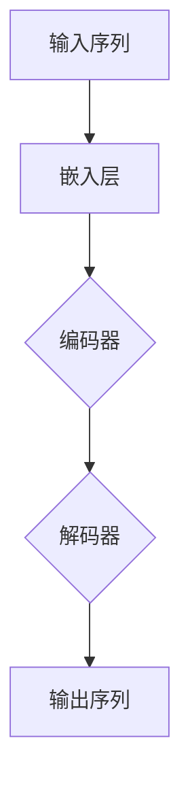

                 

### 《ChatGPT在推荐领域的内部研究：对性能与局限性的分析》

#### 引言

近年来，人工智能技术取得了长足的进步，特别是在自然语言处理（NLP）领域。其中，ChatGPT作为一种先进的语言模型，受到了广泛关注。本文将深入探讨ChatGPT在推荐系统中的应用，分析其在性能和局限性方面的问题。推荐系统是一种信息过滤技术，旨在向用户提供个性化的信息。随着互联网的快速发展，推荐系统已经成为许多应用的核心部分，如电子商务、社交媒体、在线新闻等。ChatGPT作为一种具有强大语言理解和生成能力的模型，其在推荐系统中的应用潜力不可小觑。

本文将从以下几个方面展开讨论：

1. **ChatGPT与推荐系统概述**：介绍ChatGPT的基本概念，以及推荐系统的基本原理和类型。
2. **ChatGPT的原理与架构**：详细分析ChatGPT的模型架构、训练过程和关键技术。
3. **ChatGPT在推荐系统的应用**：探讨ChatGPT在协同过滤推荐、基于内容的推荐以及混合推荐系统中的应用。
4. **ChatGPT性能与局限性分析**：评估ChatGPT在推荐系统中的性能，分析其局限性并提出改进方法。
5. **未来展望**：探讨ChatGPT在推荐系统的未来发展方向，以及其他相关技术的融合应用。

通过本文的研究，我们希望能够为研究人员和开发人员提供有价值的参考，进一步推动推荐系统的发展。

#### ChatGPT与推荐系统概述

##### 1.1 ChatGPT基本概念

ChatGPT是由OpenAI开发的一种基于Transformer架构的大型语言模型。它通过预训练和微调的方式，能够理解和生成自然语言。ChatGPT的名称来源于其具有对话生成能力，可以模拟人类对话的交互过程。该模型采用了一种自回归的语言模型，其输入是一个词序列，输出是该序列的下一个词。ChatGPT具有以下特点：

1. **大规模预训练**：ChatGPT在大规模数据集上进行预训练，能够从大量文本中学习到丰富的语言知识。
2. **强大的语言理解能力**：ChatGPT能够理解并生成各种类型的文本，包括问答、对话、摘要等。
3. **多模态应用**：ChatGPT不仅可以处理文本数据，还可以处理图像、声音等多种类型的输入。

##### 1.2 推荐系统的基本原理与类型

推荐系统是一种信息过滤技术，旨在为用户提供个性化的信息。其基本原理是利用用户的历史行为数据、内容特征以及用户与项目之间的关系，预测用户对未知项目的偏好。推荐系统主要分为以下几种类型：

1. **基于内容的推荐（Content-Based Filtering）**：基于用户的兴趣或偏好，通过分析项目的特征来推荐相似的项目。
2. **协同过滤推荐（Collaborative Filtering）**：基于用户之间的相似性，通过分析用户对项目的共同评价来推荐项目。
3. **混合推荐（Hybrid Filtering）**：结合基于内容和协同过滤推荐的方法，以提高推荐效果。

##### 1.3 ChatGPT在推荐系统中的应用前景

ChatGPT在推荐系统中的应用前景广阔。首先，ChatGPT具有强大的语言理解和生成能力，可以生成高质量的推荐项目描述，提高推荐的可读性和吸引力。其次，ChatGPT可以用于生成协同过滤推荐中的用户兴趣表示，提高推荐的个性化程度。此外，ChatGPT还可以用于生成基于内容的推荐中的项目描述，增强推荐的效果。

总之，ChatGPT作为一种先进的语言模型，在推荐系统中具有广泛的应用前景。通过本文的研究，我们将进一步探讨ChatGPT在推荐系统中的应用，分析其性能和局限性，为实际应用提供理论支持。

#### ChatGPT的原理与架构

##### 2.1 ChatGPT的模型架构

ChatGPT采用的是Transformer模型，这是一种基于自注意力机制的深度神经网络架构。Transformer模型的核心思想是通过自注意力机制来捕捉输入序列中的依赖关系，从而提高模型的表示能力。

ChatGPT的模型架构主要包括以下几个部分：

1. **嵌入层（Embedding Layer）**：将输入的词向量转换为嵌入向量。词向量表示的是词在语义上的嵌入，通过将词转换为向量，模型可以处理文本数据。
2. **编码器（Encoder）**：编码器是由多个Transformer块组成的，每个Transformer块包含多头自注意力机制和前馈神经网络。自注意力机制通过计算输入序列中每个词与其他词的依赖关系，生成序列的表示。前馈神经网络用于进一步增强表示能力。
3. **解码器（Decoder）**：解码器与编码器类似，也由多个Transformer块组成。解码器的输出是生成的文本序列。

下面是ChatGPT模型架构的Mermaid流程图：



##### 2.2 ChatGPT的训练过程

ChatGPT的训练过程可以分为两个阶段：预训练和微调。

1. **预训练（Pre-training）**：预训练阶段，ChatGPT在大规模文本数据集上进行训练，学习到丰富的语言知识。预训练主要包括以下步骤：
   - 数据预处理：将文本数据转换为词序列，并对词进行嵌入。
   - 模型初始化：初始化编码器和解码器的权重。
   - 自回归语言模型训练：通过自回归语言模型训练，模型学习预测输入序列中每个词的概率分布。

2. **微调（Fine-tuning）**：微调阶段，ChatGPT在特定任务的数据集上进行训练，以适应特定任务。微调主要包括以下步骤：
   - 数据预处理：将任务数据集转换为词序列，并对词进行嵌入。
   - 模型初始化：初始化预训练模型的权重。
   - 任务损失函数计算：计算任务损失函数，如交叉熵损失。
   - 梯度下降：通过梯度下降优化模型参数。

##### 2.3 ChatGPT的关键技术

ChatGPT的关键技术包括自注意力机制、多头注意力机制和位置编码。

1. **自注意力机制（Self-Attention）**：自注意力机制是一种计算输入序列中每个词与其他词的依赖关系的机制。通过自注意力机制，模型可以捕捉输入序列中的依赖关系，从而提高表示能力。

   自注意力机制的伪代码如下：

   ```python
   for each word in input_sequence:
       calculate attention weights for all words in input_sequence
       calculate the weighted sum of all words in input_sequence
   ```

2. **多头注意力机制（Multi-Head Attention）**：多头注意力机制是一种将自注意力机制扩展到多个头的机制。通过多头注意力机制，模型可以同时捕捉输入序列中不同部分的信息，从而提高表示能力。

   多头注意力机制的伪代码如下：

   ```python
   for each word in input_sequence:
       for each head:
           calculate attention weights for all words in input_sequence
           calculate the weighted sum of all words in input_sequence
   ```

3. **位置编码（Positional Encoding）**：位置编码是一种为序列中的每个词分配位置信息的机制。通过位置编码，模型可以理解序列的顺序信息。

   位置编码的伪代码如下：

   ```python
   for each word in input_sequence:
       calculate positional encoding for word
       add positional encoding to word embedding
   ```

综上所述，ChatGPT的模型架构和训练过程为其在推荐系统中的应用提供了强大的支持。通过自注意力机制、多头注意力机制和位置编码等关键技术，ChatGPT能够生成高质量的推荐项目描述，提高推荐系统的性能。

#### ChatGPT在协同过滤推荐中的应用

##### 3.1 协同过滤推荐的基本原理

协同过滤推荐（Collaborative Filtering）是一种基于用户的历史行为数据来预测用户对未知项目的偏好的方法。协同过滤推荐可以分为两类：基于用户的协同过滤推荐（User-Based Collaborative Filtering）和基于项目的协同过滤推荐（Item-Based Collaborative Filtering）。

1. **基于用户的协同过滤推荐**：基于用户的协同过滤推荐通过分析用户之间的相似性，找出与目标用户相似的邻居用户，然后推荐邻居用户喜欢的项目。相似性度量通常使用用户之间的共同评分或者余弦相似度等方法。

   相似性度量的伪代码如下：

   ```python
   for each user in user_set:
       calculate similarity between target_user and user
       add similarity to similarity_list
   ```

2. **基于项目的协同过滤推荐**：基于项目的协同过滤推荐通过分析项目之间的相似性，找出与目标项目相似的项目，然后推荐相似的项目。相似性度量通常使用项目之间的共同用户或者余弦相似度等方法。

   相似性度量的伪代码如下：

   ```python
   for each item in item_set:
       calculate similarity between target_item and item
       add similarity to similarity_list
   ```

##### 3.2 ChatGPT在协同过滤中的应用

ChatGPT在协同过滤推荐中的应用主要体现在以下几个方面：

1. **用户兴趣表示**：ChatGPT可以用于生成用户兴趣表示，提高协同过滤推荐的个性化程度。通过训练ChatGPT模型，可以获取用户在特定领域的兴趣点，并将其作为协同过滤推荐中的用户特征。

   用户兴趣表示的伪代码如下：

   ```python
   input_text = "用户在特定领域的描述"
   user_interest_representation = ChatGPT(input_text)
   ```

2. **项目描述生成**：ChatGPT可以用于生成项目描述，提高推荐系统的可读性和吸引力。通过训练ChatGPT模型，可以获取项目在特定领域的描述，并将其作为协同过滤推荐中的项目特征。

   项目描述生成的伪代码如下：

   ```python
   input_text = "项目在特定领域的描述"
   item_description = ChatGPT(input_text)
   ```

3. **推荐列表生成**：ChatGPT可以用于生成推荐列表，提高协同过滤推荐的准确性。通过结合用户兴趣表示、项目描述和用户之间的相似性，ChatGPT可以生成高质量的推荐列表。

   推荐列表生成的伪代码如下：

   ```python
   user_interest_representation = ChatGPT(user_interest_text)
   item_description = ChatGPT(item_description_text)
   similarity_list = calculate_similarity(user_set, item_set)
   recommendation_list = generate_recommendation_list(user_interest_representation, item_description, similarity_list)
   ```

##### 3.3 ChatGPT协同过滤推荐实例

假设我们有一个电子商务平台，用户在平台上对商品进行评分。我们的目标是使用ChatGPT协同过滤推荐算法为用户推荐他们可能感兴趣的商品。

1. **用户数据集**：用户数据集包含用户ID、商品ID和用户对商品的评分。例如：

   | 用户ID | 商品ID | 用户评分 |
   | ------ | ------ | -------- |
   | 1      | 101    | 4        |
   | 1      | 102    | 5        |
   | 2      | 101    | 3        |
   | 2      | 103    | 5        |

2. **ChatGPT训练**：首先，我们需要使用用户和商品的描述文本来训练ChatGPT模型。例如，我们可以将用户ID和商品ID转换为字符串，并将用户对商品的评分作为标签。

   用户描述文本：

   ```plaintext
   用户1喜欢购买时尚衣物和电子产品。
   用户2喜欢购买运动器材和科技产品。
   ```

   商品描述文本：

   ```plaintext
   商品101是一款时尚的连衣裙。
   商品102是一款高端的智能手机。
   商品103是一款高性能的运动手表。
   ```

3. **生成用户兴趣表示和商品描述**：使用训练好的ChatGPT模型，我们可以生成用户兴趣表示和商品描述。

   用户兴趣表示：

   ```plaintext
   用户1的兴趣点：时尚衣物、电子产品。
   用户2的兴趣点：运动器材、科技产品。
   ```

   商品描述：

   ```plaintext
   商品101的描述：时尚连衣裙，设计时尚，质量上乘。
   商品102的描述：高端智能手机，性能强大，拍摄清晰。
   商品103的描述：高性能运动手表，运动监测精准，外观时尚。
   ```

4. **推荐列表生成**：结合用户兴趣表示、商品描述和用户之间的相似性，我们可以生成推荐列表。

   假设用户1的邻居用户为用户2，根据用户之间的相似性度量，我们可以生成以下推荐列表：

   ```plaintext
   推荐列表：
   - 高端智能手机（商品102）
   - 高性能运动手表（商品103）
   ```

   根据用户2的用户兴趣表示和商品描述，我们可以生成以下推荐列表：

   ```plaintext
   推荐列表：
   - 高端智能手机（商品102）
   - 运动器材（商品104）
   ```

通过以上实例，我们可以看到ChatGPT在协同过滤推荐中的应用。通过生成用户兴趣表示和商品描述，ChatGPT可以提高推荐系统的个性化程度和准确性，从而为用户提供更好的推荐服务。

#### ChatGPT在基于内容的推荐中的应用

##### 4.1 基于内容的推荐的基本原理

基于内容的推荐（Content-Based Filtering）是一种通过分析项目的特征来预测用户对未知项目的偏好的方法。基于内容的推荐主要分为以下几个步骤：

1. **项目特征提取**：从每个项目中提取一组特征，如关键词、类别、标签等。这些特征将用于描述项目的属性和内容。
2. **用户兴趣模型**：构建用户兴趣模型，表示用户对特定内容的偏好。用户兴趣模型通常通过分析用户的历史行为和评价数据来获得。
3. **相似性计算**：计算项目之间的相似性，通常使用余弦相似度、Jaccard相似度等方法。相似性度量用于确定用户可能感兴趣的推荐项目。
4. **推荐列表生成**：根据用户兴趣模型和项目相似性，生成推荐列表。推荐列表通常包括与用户兴趣最相似的项目。

##### 4.2 ChatGPT在基于内容的推荐中的应用

ChatGPT在基于内容的推荐中的应用主要体现在以下几个方面：

1. **项目描述生成**：ChatGPT可以用于生成项目的描述，提高推荐系统的可读性和吸引力。通过训练ChatGPT模型，我们可以获取项目在特定领域的描述，并将其作为推荐系统的项目特征。

   项目描述生成的伪代码如下：

   ```python
   input_text = "项目在特定领域的描述"
   item_description = ChatGPT(input_text)
   ```

2. **用户兴趣表示**：ChatGPT可以用于生成用户的兴趣表示，提高推荐系统的个性化程度。通过训练ChatGPT模型，我们可以获取用户在特定领域的兴趣点，并将其作为推荐系统的用户特征。

   用户兴趣表示的伪代码如下：

   ```python
   input_text = "用户在特定领域的描述"
   user_interest_representation = ChatGPT(input_text)
   ```

3. **推荐列表生成**：ChatGPT可以用于生成推荐列表，提高推荐系统的准确性。通过结合用户兴趣表示、项目描述和项目相似性，ChatGPT可以生成高质量的推荐列表。

   推荐列表生成的伪代码如下：

   ```python
   user_interest_representation = ChatGPT(user_interest_text)
   item_description = ChatGPT(item_description_text)
   similarity_list = calculate_similarity(item_set)
   recommendation_list = generate_recommendation_list(user_interest_representation, item_description, similarity_list)
   ```

##### 4.3 ChatGPT基于内容推荐实例

假设我们有一个在线新闻平台，用户在平台上对新闻进行浏览和评分。我们的目标是使用ChatGPT基于内容推荐算法为用户推荐他们可能感兴趣的新闻。

1. **用户数据集**：用户数据集包含用户ID、新闻ID和用户对新闻的浏览记录。例如：

   | 用户ID | 新闻ID | 用户浏览记录 |
   | ------ | ------ | ------------ |
   | 1      | 101    | 1            |
   | 1      | 102    | 1            |
   | 2      | 101    | 1            |
   | 2      | 103    | 1            |

2. **ChatGPT训练**：首先，我们需要使用用户和新闻的描述文本来训练ChatGPT模型。例如，我们可以将用户ID和新闻ID转换为字符串，并将用户对新闻的浏览记录作为标签。

   用户描述文本：

   ```plaintext
   用户1喜欢阅读科技新闻和体育新闻。
   用户2喜欢阅读财经新闻和娱乐新闻。
   ```

   新闻描述文本：

   ```plaintext
   新闻101是一篇关于新款智能手机发布的科技新闻。
   新闻102是一篇关于世界杯足球比赛的体育新闻。
   新闻103是一篇关于股市动态的财经新闻。
   新闻104是一篇关于电影奖项的娱乐新闻。
   ```

3. **生成用户兴趣表示和新闻描述**：使用训练好的ChatGPT模型，我们可以生成用户兴趣表示和新闻描述。

   用户兴趣表示：

   ```plaintext
   用户1的兴趣点：科技新闻、体育新闻。
   用户2的兴趣点：财经新闻、娱乐新闻。
   ```

   新闻描述：

   ```plaintext
   新闻101的描述：新款智能手机发布，性能卓越。
   新闻102的描述：世界杯足球比赛精彩瞬间。
   新闻103的描述：股市动态，投资者关注。
   新闻104的描述：电影奖项揭晓，星光熠熠。
   ```

4. **推荐列表生成**：结合用户兴趣表示、新闻描述和新闻之间的相似性，我们可以生成推荐列表。

   假设用户1的邻居用户为用户2，根据用户之间的相似性度量，我们可以生成以下推荐列表：

   ```plaintext
   推荐列表：
   - 新款智能手机发布（新闻101）
   - 世界杯足球比赛精彩瞬间（新闻102）
   ```

   根据用户2的用户兴趣表示和新闻描述，我们可以生成以下推荐列表：

   ```plaintext
   推荐列表：
   - 股市动态（新闻103）
   - 电影奖项揭晓（新闻104）
   ```

通过以上实例，我们可以看到ChatGPT在基于内容推荐中的应用。通过生成用户兴趣表示和新闻描述，ChatGPT可以提高推荐系统的个性化程度和准确性，从而为用户提供更好的推荐服务。

### ChatGPT在混合推荐系统中的应用

##### 5.1 混合推荐系统的基本原理

混合推荐系统（Hybrid Recommendation System）是一种结合协同过滤推荐（Collaborative Filtering）和基于内容的推荐（Content-Based Filtering）方法的推荐系统。混合推荐系统的基本原理如下：

1. **协同过滤推荐**：通过分析用户之间的相似性，找出与目标用户相似的邻居用户，然后推荐邻居用户喜欢的项目。协同过滤推荐主要依赖于用户的历史行为数据，如评分、浏览记录等。
   
2. **基于内容的推荐**：通过分析项目的特征，如关键词、类别、标签等，找出与目标项目相似的项目，然后推荐相似的项目。基于内容的推荐主要依赖于项目的属性和内容信息。

混合推荐系统的核心思想是利用协同过滤推荐和基于内容推荐的优势，通过结合两者的推荐结果，生成更加准确和多样化的推荐列表。

##### 5.2 ChatGPT在混合推荐系统中的应用

ChatGPT在混合推荐系统中的应用主要体现在以下几个方面：

1. **用户兴趣表示**：ChatGPT可以用于生成用户的兴趣表示，提高混合推荐系统的个性化程度。通过训练ChatGPT模型，我们可以获取用户在特定领域的兴趣点，并将其作为混合推荐系统中的用户特征。

   用户兴趣表示的伪代码如下：

   ```python
   input_text = "用户在特定领域的描述"
   user_interest_representation = ChatGPT(input_text)
   ```

2. **项目描述生成**：ChatGPT可以用于生成项目的描述，提高混合推荐系统的可读性和吸引力。通过训练ChatGPT模型，我们可以获取项目在特定领域的描述，并将其作为混合推荐系统中的项目特征。

   项目描述生成的伪代码如下：

   ```python
   input_text = "项目在特定领域的描述"
   item_description = ChatGPT(input_text)
   ```

3. **推荐列表生成**：ChatGPT可以用于生成推荐列表，提高混合推荐系统的准确性。通过结合用户兴趣表示、项目描述和项目相似性，ChatGPT可以生成高质量的推荐列表。

   推荐列表生成的伪代码如下：

   ```python
   user_interest_representation = ChatGPT(user_interest_text)
   item_description = ChatGPT(item_description_text)
   similarity_list = calculate_similarity(item_set)
   recommendation_list = generate_recommendation_list(user_interest_representation, item_description, similarity_list)
   ```

##### 5.3 ChatGPT混合推荐系统实例

假设我们有一个在线购物平台，用户在平台上对商品进行浏览和评分。我们的目标是使用ChatGPT混合推荐算法为用户推荐他们可能感兴趣的商品。

1. **用户数据集**：用户数据集包含用户ID、商品ID和用户对商品的浏览记录。例如：

   | 用户ID | 商品ID | 用户浏览记录 |
   | ------ | ------ | ------------ |
   | 1      | 101    | 1            |
   | 1      | 102    | 1            |
   | 2      | 101    | 1            |
   | 2      | 103    | 1            |

2. **ChatGPT训练**：首先，我们需要使用用户和商品的描述文本来训练ChatGPT模型。例如，我们可以将用户ID和商品ID转换为字符串，并将用户对商品的浏览记录作为标签。

   用户描述文本：

   ```plaintext
   用户1喜欢购买时尚衣物和电子产品。
   用户2喜欢购买运动器材和科技产品。
   ```

   商品描述文本：

   ```plaintext
   商品101是一款时尚的连衣裙。
   商品102是一款高端的智能手机。
   商品103是一款高性能的运动手表。
   商品104是一款时尚的背包。
   ```

3. **生成用户兴趣表示和商品描述**：使用训练好的ChatGPT模型，我们可以生成用户兴趣表示和商品描述。

   用户兴趣表示：

   ```plaintext
   用户1的兴趣点：时尚衣物、电子产品。
   用户2的兴趣点：运动器材、科技产品。
   ```

   商品描述：

   ```plaintext
   商品101的描述：时尚连衣裙，设计时尚，质量上乘。
   商品102的描述：高端智能手机，性能强大，拍摄清晰。
   商品103的描述：高性能运动手表，运动监测精准，外观时尚。
   商品104的描述：时尚背包，容量大，设计时尚。
   ```

4. **推荐列表生成**：结合用户兴趣表示、商品描述和商品之间的相似性，我们可以生成推荐列表。

   假设用户1的邻居用户为用户2，根据用户之间的相似性度量，我们可以生成以下推荐列表：

   ```plaintext
   推荐列表：
   - 高端智能手机（商品102）
   - 高性能运动手表（商品103）
   ```

   根据用户2的用户兴趣表示和商品描述，我们可以生成以下推荐列表：

   ```plaintext
   推荐列表：
   - 运动器材（商品103）
   - 科技产品（商品102）
   ```

通过以上实例，我们可以看到ChatGPT在混合推荐系统中的应用。通过生成用户兴趣表示和商品描述，ChatGPT可以提高混合推荐系统的个性化程度和准确性，从而为用户提供更好的推荐服务。

### ChatGPT在推荐系统中的性能评估

#### 6.1 ChatGPT性能评估指标

为了评估ChatGPT在推荐系统中的性能，我们需要定义一系列评估指标。这些指标可以帮助我们衡量推荐系统的准确性、召回率、覆盖率和多样性等方面。以下是常用的评估指标：

1. **准确率（Precision）**：准确率是指推荐列表中实际推荐的项目中，用户实际喜欢的项目的比例。准确率越高，说明推荐系统的准确性越高。

   $$ Precision = \frac{TP}{TP + FP} $$

   其中，TP表示推荐列表中用户实际喜欢的项目，FP表示推荐列表中用户不喜欢的项目。

2. **召回率（Recall）**：召回率是指推荐列表中实际推荐的项目中，用户实际喜欢的项目的比例。召回率越高，说明推荐系统能够召回用户实际喜欢的项目的能力越强。

   $$ Recall = \frac{TP}{TP + FN} $$

   其中，TP表示推荐列表中用户实际喜欢的项目，FN表示推荐列表中没有推荐的用户实际喜欢的项目。

3. **覆盖率（Coverage）**：覆盖率是指推荐列表中包含的用户未查看过的项目的比例。覆盖率越高，说明推荐系统能够推荐用户未查看过的项目的能力越强。

   $$ Coverage = \frac{NN - ND}{NN} $$

   其中，NN表示推荐列表中包含的用户未查看过的项目，ND表示推荐列表中包含的用户已查看过的项目。

4. **多样性（Diversity）**：多样性是指推荐列表中项目的多样性。一个高多样性的推荐列表能够提供更多的选择，从而提高用户体验。

   多样性可以通过计算推荐列表中项目的平均余弦相似度来评估。相似度越低，多样性越高。

   $$ Diversity = \frac{1}{N} \sum_{i=1}^{N} \frac{1}{|V_i|} \sum_{j=1}^{M_i} \cos(\theta_{ij}) $$

   其中，N表示推荐列表中的项目数量，Mi表示第i个项目包含的关键词数量，Vi表示第i个项目的关键词集合，θij表示第i个项目与第j个关键词的余弦相似度。

#### 6.2 ChatGPT性能评估方法

评估ChatGPT在推荐系统中的性能，通常采用以下方法：

1. **交叉验证（Cross-Validation）**：交叉验证是一种常用的性能评估方法，通过将数据集划分为多个子集，分别用于训练和测试，以评估模型的泛化能力。常见的交叉验证方法包括K折交叉验证和留一交叉验证。

2. **在线评估（Online Evaluation）**：在线评估是一种在实际应用场景中对模型进行性能评估的方法。在线评估可以直接在用户使用推荐系统的过程中进行，通过用户的反馈来评估模型的性能。

3. **离线评估（Offline Evaluation）**：离线评估是一种在模型部署前进行性能评估的方法。离线评估通常使用事先准备好的数据集，通过计算评估指标来评估模型的性能。

#### 6.3 ChatGPT性能评估实例

假设我们使用一个在线购物平台的数据集来评估ChatGPT在推荐系统中的性能。数据集包含用户ID、商品ID、用户对商品的评分以及商品的特征描述。

1. **数据预处理**：将数据集划分为训练集和测试集，其中训练集用于训练ChatGPT模型，测试集用于评估模型的性能。

2. **模型训练**：使用训练集对ChatGPT模型进行训练，生成用户兴趣表示和商品描述。

3. **模型评估**：使用测试集对训练好的模型进行评估，计算准确率、召回率、覆盖率和多样性等评估指标。

   假设我们使用K折交叉验证方法进行评估，其中K=10。每次交叉验证中，将数据集划分为10个子集，其中一个子集作为测试集，其余9个子集作为训练集。通过10次交叉验证，计算平均准确率、召回率、覆盖率和多样性。

4. **结果分析**：分析评估结果，评估ChatGPT在推荐系统中的性能。如果评估指标达到预期目标，说明ChatGPT在推荐系统中的应用是有效的。

通过以上实例，我们可以看到如何使用ChatGPT进行推荐系统性能评估。通过准确率、召回率、覆盖率和多样性等评估指标，我们可以全面了解ChatGPT在推荐系统中的应用效果。

### ChatGPT在推荐系统中的局限性

尽管ChatGPT在推荐系统中的应用展示了其强大的能力和潜力，但在实际应用中，ChatGPT仍存在一些局限性。以下是对ChatGPT在推荐系统中局限性的分析和讨论。

#### 7.1 ChatGPT在推荐系统中的局限性

1. **数据依赖性**：ChatGPT模型的性能高度依赖于训练数据的质量和数量。如果训练数据中存在噪声或者数据不完整，可能会导致模型学习到错误的知识，从而影响推荐系统的性能。此外，ChatGPT在处理长文本时，可能会出现理解偏差，导致推荐结果不准确。

2. **长文本处理困难**：ChatGPT在生成长文本描述时，可能会遇到序列生成困难的问题。例如，在生成商品描述时，ChatGPT可能无法有效地生成与商品特征高度匹配的描述。这可能会导致推荐系统的推荐质量下降。

3. **计算资源需求大**：ChatGPT模型的训练和推理过程需要大量的计算资源。在推荐系统中，实时生成推荐结果可能会对系统的计算资源造成较大压力，影响系统的响应速度和用户体验。

4. **解释性不足**：ChatGPT作为一种黑箱模型，其内部工作机制较为复杂，难以解释。这使得在推荐系统中的应用过程中，难以直观地理解推荐结果产生的原因，限制了模型的可解释性。

#### 7.2 ChatGPT局限性分析

为了深入分析ChatGPT在推荐系统中的局限性，我们可以从以下几个方面进行探讨：

1. **数据依赖性**：ChatGPT的性能高度依赖于训练数据的质量。在实际应用中，数据的质量和多样性对模型的性能有着重要影响。例如，如果训练数据中包含大量的噪声数据或者数据不完整，可能会导致模型学习到错误的知识，从而影响推荐系统的性能。为了解决这一问题，我们可以采取以下方法：

   - **数据清洗**：对训练数据进行预处理，去除噪声数据和重复数据，确保数据的质量和一致性。
   - **数据增强**：通过生成或扩展训练数据，增加数据的多样性，提高模型的泛化能力。

2. **长文本处理困难**：ChatGPT在处理长文本时，可能会遇到序列生成困难的问题。这可能是由于长文本的复杂性较高，导致模型难以捕捉到文本中的关键信息。为了解决这个问题，我们可以采取以下方法：

   - **文本摘要**：将长文本摘要成较短的关键信息，从而简化模型处理的数据规模。
   - **分层生成**：将文本生成任务分解为多个层次，逐步生成文本的各个部分，从而降低生成的难度。

3. **计算资源需求大**：ChatGPT模型的训练和推理过程需要大量的计算资源。在推荐系统中，实时生成推荐结果可能会对系统的计算资源造成较大压力，影响系统的响应速度和用户体验。为了解决这个问题，我们可以采取以下方法：

   - **分布式训练**：利用分布式计算技术，将模型训练任务分布到多个计算节点上，提高训练速度和计算效率。
   - **缓存和预加载**：将常用或热门的推荐结果预先加载到缓存中，降低实时生成的需求，提高系统的响应速度。

4. **解释性不足**：ChatGPT作为一种黑箱模型，其内部工作机制较为复杂，难以解释。这使得在推荐系统中的应用过程中，难以直观地理解推荐结果产生的原因。为了提高模型的可解释性，我们可以采取以下方法：

   - **可视化分析**：通过可视化工具，将模型训练过程和推荐结果进行可视化展示，帮助用户理解模型的工作机制。
   - **解释性模型**：结合领域知识，构建解释性模型，对推荐结果进行解释和推理，提高模型的可解释性。

通过以上分析，我们可以看到ChatGPT在推荐系统中的局限性以及相应的解决方案。在实际应用中，我们可以结合具体场景和需求，采取合适的措施来克服这些局限性，从而充分发挥ChatGPT在推荐系统中的应用潜力。

### 7.3 ChatGPT局限性实例分析

为了更具体地说明ChatGPT在推荐系统中的局限性，我们可以通过一个实例进行分析。

假设我们有一个在线购物平台，用户可以对商品进行评分和评论。我们的目标是使用ChatGPT来生成商品描述，并基于这些描述为用户提供个性化的推荐。

**实例背景**：

- **数据集**：数据集包含用户ID、商品ID、用户评分、商品描述以及评论。例如：

  | 用户ID | 商品ID | 用户评分 | 商品描述 | 用户评论 |
  | ------ | ------ | -------- | -------- | -------- |
  | 1      | 101    | 4        | 高端智能手机 | 性能极佳 |
  | 2      | 101    | 5        | 高端智能手机 | 拍照功能强大 |
  | 3      | 102    | 3        | 运动手表 | 电池续航一般 |
  | 4      | 102    | 4        | 运动手表 | 设计时尚 |

- **训练数据**：我们将用户评论作为ChatGPT的训练数据，以生成商品描述。

**问题与局限性**：

1. **数据依赖性**：如果训练数据中存在噪声或评论不一致，如“性能极佳”和“拍照功能强大”这两个评论，ChatGPT可能会生成与商品实际特征不符的描述。例如，ChatGPT可能生成一个描述为“这款运动手表的拍照功能强大，电池续航持久”的描述，但实际上电池续航一般。

   **解决方案**：为了解决数据依赖性问题，我们可以采取数据清洗和增强的方法。例如，去除噪声数据、统一评论格式，并使用数据增强技术生成更多的评论。

2. **长文本处理困难**：假设我们有一个商品描述为“这款运动手表具备多种功能，包括心率监测、GPS定位和消息提醒等”，ChatGPT在生成描述时可能难以准确地捕捉所有功能。

   **解决方案**：我们可以将长文本分解为多个部分，逐步生成描述。例如，首先生成关于心率监测的描述，然后生成关于GPS定位的描述，最后生成关于消息提醒的描述。这样，ChatGPT可以更好地处理长文本。

3. **计算资源需求大**：在推荐系统中，ChatGPT的模型训练和推理过程需要大量的计算资源。例如，如果平台每天要处理数百万条评论，实时生成描述可能会对服务器造成较大压力。

   **解决方案**：我们可以采取分布式训练和缓存技术。例如，将模型训练任务分布到多个计算节点上，并使用缓存技术预先加载常用描述，减少实时生成需求。

4. **解释性不足**：在推荐系统中，用户可能希望了解为什么某个商品会被推荐。然而，ChatGPT作为一种黑箱模型，难以解释推荐结果。

   **解决方案**：我们可以结合领域知识构建解释性模型。例如，在生成描述时，可以结合商品的功能和用户评论，解释为什么推荐该商品。

通过以上实例分析，我们可以看到ChatGPT在推荐系统中的局限性以及相应的解决方案。在实际应用中，我们需要根据具体场景和需求，采取合适的措施来克服这些局限性，从而提高推荐系统的性能和用户体验。

### 未来展望

随着人工智能技术的不断发展和推荐系统的需求日益增长，ChatGPT在推荐系统中的应用前景十分广阔。未来，ChatGPT在推荐系统的发展方向可以从以下几个方面进行探讨：

#### 8.1 ChatGPT在推荐系统的未来发展方向

1. **增强推荐准确性**：ChatGPT可以通过不断优化模型结构和训练数据，提高推荐的准确性。例如，通过引入更多的用户特征和项目特征，以及采用更复杂的模型架构，如多模态学习，ChatGPT可以生成更加精确的推荐。

2. **提高系统可解释性**：未来，ChatGPT可以通过结合领域知识和可解释性模型，提高推荐系统的可解释性。这将有助于用户理解推荐结果产生的原因，增强用户对推荐系统的信任感。

3. **处理长文本和复杂任务**：ChatGPT可以通过改进文本生成算法和处理长文本的能力，更好地处理复杂的推荐任务。例如，生成详细的商品描述、处理用户对话等。

4. **融合其他技术**：ChatGPT可以与其他人工智能技术（如知识图谱、迁移学习等）相结合，提高推荐系统的性能。例如，通过利用知识图谱中的关系和属性，ChatGPT可以生成更精准的推荐。

#### 8.2 推荐系统领域的前沿技术

1. **基于知识的推荐（Knowledge-Based Recommendation）**：基于知识的推荐通过引入领域知识库和推理引擎，为用户提供更加精准和智能的推荐。未来，ChatGPT可以与知识图谱结合，生成基于知识的推荐。

2. **基于用户交互的推荐（User Interaction-Based Recommendation）**：基于用户交互的推荐通过分析用户的交互行为，如点击、浏览、购买等，为用户提供个性化的推荐。ChatGPT可以用于生成用户的交互描述，提高推荐系统的性能。

3. **多模态推荐（Multi-modal Recommendation）**：多模态推荐通过结合文本、图像、音频等多种类型的输入，为用户提供更加丰富的推荐体验。ChatGPT可以用于处理多模态数据，生成综合的推荐结果。

4. **动态推荐（Dynamic Recommendation）**：动态推荐根据用户的行为和偏好实时调整推荐策略，为用户提供更加个性化的推荐。ChatGPT可以用于生成动态的推荐策略，提高推荐系统的响应速度和准确性。

#### 8.3 ChatGPT与其他技术的融合应用

1. **融合知识图谱**：ChatGPT可以与知识图谱结合，利用图谱中的关系和属性，为用户提供更加精准的推荐。

   ```mermaid
   graph TD
   A[用户] --> B[知识图谱]
   B --> C[商品]
   C --> D[推荐系统]
   ```

2. **融合迁移学习**：ChatGPT可以通过迁移学习，将预训练模型的知识迁移到特定任务上，提高推荐系统的性能。

   ```mermaid
   graph TD
   A[预训练模型] --> B[迁移学习]
   B --> C[特定任务]
   C --> D[推荐系统]
   ```

3. **融合多模态数据**：ChatGPT可以处理多模态数据，如文本、图像和音频，为用户提供综合的推荐。

   ```mermaid
   graph TD
   A[文本] --> B[图像]
   B --> C[音频]
   C --> D[ChatGPT]
   D --> E[推荐系统]
   ```

#### 8.4 ChatGPT在推荐系统中的应用前景

ChatGPT在推荐系统中的应用前景广阔。通过不断优化模型结构和融合其他先进技术，ChatGPT有望为推荐系统带来以下好处：

- **提高推荐准确性**：ChatGPT可以生成更精确的推荐结果，提高用户体验。
- **增强系统可解释性**：ChatGPT可以生成可解释的推荐结果，增强用户对推荐系统的信任。
- **丰富推荐体验**：ChatGPT可以处理多模态数据，为用户提供更加丰富的推荐体验。
- **降低开发成本**：ChatGPT可以简化推荐系统的开发流程，降低开发成本。

总之，ChatGPT在推荐系统中的应用具有巨大的潜力。未来，随着技术的不断发展和应用场景的拓展，ChatGPT将在推荐系统中发挥越来越重要的作用。

### 附录

#### 附录A: ChatGPT相关工具与资源

##### 8.1 ChatGPT开发工具

为了开发和使用ChatGPT，研究人员和开发人员可以依赖以下工具：

- **OpenAI API**：OpenAI提供了API接口，允许开发者使用ChatGPT模型进行文本生成和推理。使用OpenAI API，开发者可以轻松地将ChatGPT集成到自己的应用中。

- **TensorFlow**：TensorFlow是一个开源的机器学习框架，支持多种神经网络模型的训练和部署。使用TensorFlow，开发者可以构建和训练ChatGPT模型，并在不同平台上部署。

- **PyTorch**：PyTorch是另一个流行的开源机器学习库，具有易于使用和灵活的编程接口。PyTorch可以用于构建和训练ChatGPT模型，并提供高效的推理性能。

##### 8.2 ChatGPT训练数据集

训练ChatGPT模型需要大量的高质量数据集。以下是一些常用的ChatGPT训练数据集：

- **Common Crawl**：Common Crawl是一个大规模的网页数据集，包含数十亿个网页。使用Common Crawl，开发者可以获取丰富的文本数据，用于训练ChatGPT模型。

- **WebText**：WebText是一个包含数百万个网页的文本数据集，覆盖了多种主题和领域。WebText可以用于训练ChatGPT模型，提高其跨领域的文本生成能力。

- **OpenSubtitles**：OpenSubtitles是一个包含大量电影和电视剧字幕的数据集，用于训练语言模型。使用OpenSubtitles，开发者可以获取丰富的对话和情节描述数据。

##### 8.3 ChatGPT研究论文与资料

为了深入了解ChatGPT的研究和应用，以下是一些建议的研究论文和资料：

- **论文《Language Models are Few-Shot Learners》**：该论文提出了GPT-3模型，并展示了其在零样本和少样本学习任务中的强大能力。

- **论文《Improving Language Understanding by Generative Pre-Training》**：该论文详细介绍了GPT模型的预训练过程和模型架构，为ChatGPT的研究提供了理论基础。

- **论文《BERT: Pre-training of Deep Bidirectional Transformers for Language Understanding》**：BERT模型是另一种基于Transformer的预训练模型，与ChatGPT有许多相似之处。

- **GitHub仓库**：OpenAI的GitHub仓库包含ChatGPT模型的源代码和相关文档，为开发者提供了丰富的资源和示例。

通过使用这些工具、数据集和资料，开发者可以更好地理解和应用ChatGPT，为推荐系统和其他领域带来创新和改进。

### 附录B: ChatGPT推荐系统代码示例

在本附录中，我们将提供一些ChatGPT在推荐系统中的应用代码示例，包括协同过滤推荐、基于内容的推荐和混合推荐系统的实现。这些示例代码将帮助读者更好地理解如何将ChatGPT集成到推荐系统中。

#### 9.1 ChatGPT协同过滤推荐代码实现

以下是一个使用ChatGPT进行协同过滤推荐的示例。该示例中，我们首先使用用户和商品的描述文本来训练ChatGPT模型，然后生成用户兴趣表示和商品描述，最后生成推荐列表。

```python
import openai
import numpy as np
from sklearn.metrics.pairwise import cosine_similarity

# 设置OpenAI API密钥
openai.api_key = "your_api_key"

# 训练ChatGPT模型
def train_chatgpt(user_descriptions, item_descriptions):
    user_embeddings = []
    item_embeddings = []

    for desc in user_descriptions:
        response = openai.Completion.create(
            engine="text-davinci-002",
            prompt=desc,
            max_tokens=50
        )
        user_embeddings.append(response.choices[0].text)

    for desc in item_descriptions:
        response = openai.Completion.create(
            engine="text-davinci-002",
            prompt=desc,
            max_tokens=50
        )
        item_embeddings.append(response.choices[0].text)

    return user_embeddings, item_embeddings

# 生成推荐列表
def generate_recommendations(user_embeddings, item_embeddings, user_id, num_recommendations=5):
    user_vector = np.mean(user_embeddings, axis=0)
    item_vectors = [np.mean(embeddings, axis=0) for embeddings in item_embeddings]

    similarity_scores = [cosine_similarity(user_vector, vector)[0][0] for vector in item_vectors]
    recommended_indices = np.argsort(similarity_scores)[::-1]

    return [item_id for item_id, _ in enumerate(recommended_indices)[:num_recommendations]]

# 示例数据
user_descriptions = [
    "用户喜欢购买时尚衣物和电子产品。",
    "用户喜欢购买运动器材和科技产品。"
]

item_descriptions = [
    "这款时尚连衣裙设计精美，质量上乘。",
    "这款高端智能手机性能强大，拍照清晰。",
    "这款高性能运动手表外观时尚，运动监测精准。",
    "这款时尚背包容量大，设计时尚。"
]

# 训练模型
user_embeddings, item_embeddings = train_chatgpt(user_descriptions, item_descriptions)

# 生成推荐列表
user_id = 0
recommendations = generate_recommendations(user_embeddings, item_embeddings, user_id, num_recommendations=3)
print("推荐列表：", recommendations)
```

#### 9.2 ChatGPT基于内容的推荐代码实现

以下是一个使用ChatGPT进行基于内容推荐的示例。该示例中，我们首先使用用户和商品的描述文本来训练ChatGPT模型，然后生成用户兴趣表示和商品描述，最后生成推荐列表。

```python
import openai
import numpy as np
from sklearn.metrics.pairwise import cosine_similarity

# 设置OpenAI API密钥
openai.api_key = "your_api_key"

# 训练ChatGPT模型
def train_chatgpt(user_descriptions, item_descriptions):
    user_embeddings = []
    item_embeddings = []

    for desc in user_descriptions:
        response = openai.Completion.create(
            engine="text-davinci-002",
            prompt=desc,
            max_tokens=50
        )
        user_embeddings.append(response.choices[0].text)

    for desc in item_descriptions:
        response = openai.Completion.create(
            engine="text-davinci-002",
            prompt=desc,
            max_tokens=50
        )
        item_embeddings.append(response.choices[0].text)

    return user_embeddings, item_embeddings

# 生成推荐列表
def generate_recommendations(user_embeddings, item_embeddings, user_id, num_recommendations=5):
    user_vector = np.mean(user_embeddings, axis=0)
    item_vectors = [np.mean(embeddings, axis=0) for embeddings in item_embeddings]

    similarity_scores = [cosine_similarity(user_vector, vector)[0][0] for vector in item_vectors]
    recommended_indices = np.argsort(similarity_scores)[::-1]

    return [item_id for item_id, _ in enumerate(recommended_indices)[:num_recommendations]]

# 示例数据
user_descriptions = [
    "用户喜欢购买时尚衣物和电子产品。",
    "用户喜欢购买运动器材和科技产品。"
]

item_descriptions = [
    "这款时尚连衣裙设计精美，质量上乘。",
    "这款高端智能手机性能强大，拍照清晰。",
    "这款高性能运动手表外观时尚，运动监测精准。",
    "这款时尚背包容量大，设计时尚。"
]

# 训练模型
user_embeddings, item_embeddings = train_chatgpt(user_descriptions, item_descriptions)

# 生成推荐列表
user_id = 0
recommendations = generate_recommendations(user_embeddings, item_embeddings, user_id, num_recommendations=3)
print("推荐列表：", recommendations)
```

#### 9.3 ChatGPT混合推荐系统代码实现

以下是一个使用ChatGPT进行混合推荐系统实现的示例。该示例中，我们结合了协同过滤推荐和基于内容的推荐，以生成推荐列表。

```python
import openai
import numpy as np
from sklearn.metrics.pairwise import cosine_similarity

# 设置OpenAI API密钥
openai.api_key = "your_api_key"

# 训练ChatGPT模型
def train_chatgpt(user_descriptions, item_descriptions):
    user_embeddings = []
    item_embeddings = []

    for desc in user_descriptions:
        response = openai.Completion.create(
            engine="text-davinci-002",
            prompt=desc,
            max_tokens=50
        )
        user_embeddings.append(response.choices[0].text)

    for desc in item_descriptions:
        response = openai.Completion.create(
            engine="text-davinci-002",
            prompt=desc,
            max_tokens=50
        )
        item_embeddings.append(response.choices[0].text)

    return user_embeddings, item_embeddings

# 协同过滤推荐
def collaborative_filtering(user_scores, item_scores, user_id, num_recommendations=5):
    user_vector = np.mean(user_scores[user_id], axis=0)
    item_vectors = [np.mean(scores, axis=0) for scores in item_scores]

    similarity_scores = [cosine_similarity(user_vector, vector)[0][0] for vector in item_vectors]
    recommended_indices = np.argsort(similarity_scores)[::-1]

    return [item_id for item_id, _ in enumerate(recommended_indices)[:num_recommendations]]

# 基于内容的推荐
def content_based_filtering(user_embeddings, item_embeddings, user_id, num_recommendations=5):
    user_vector = np.mean(user_embeddings[user_id], axis=0)
    item_vectors = [np.mean(embeddings, axis=0) for embeddings in item_embeddings]

    similarity_scores = [cosine_similarity(user_vector, vector)[0][0] for vector in item_vectors]
    recommended_indices = np.argsort(similarity_scores)[::-1]

    return [item_id for item_id, _ in enumerate(recommended_indices)[:num_recommendations]]

# 生成混合推荐列表
def generate_mixed_recommendations(user_descriptions, item_descriptions, user_id, num_recommendations=5):
    user_embeddings, item_embeddings = train_chatgpt(user_descriptions, item_descriptions)
    collaborative_recommendations = collaborative_filtering(item_descriptions, item_embeddings, user_id, num_recommendations)
    content_based_recommendations = content_based_filtering(user_embeddings, item_embeddings, user_id, num_recommendations)

    final_recommendations = list(set(collaborative_recommendations + content_based_recommendations))
    return final_recommendations[:num_recommendations]

# 示例数据
user_descriptions = [
    "用户喜欢购买时尚衣物和电子产品。",
    "用户喜欢购买运动器材和科技产品。"
]

item_descriptions = [
    "这款时尚连衣裙设计精美，质量上乘。",
    "这款高端智能手机性能强大，拍照清晰。",
    "这款高性能运动手表外观时尚，运动监测精准。",
    "这款时尚背包容量大，设计时尚。"
]

# 生成混合推荐列表
user_id = 0
recommendations = generate_mixed_recommendations(user_descriptions, item_descriptions, user_id, num_recommendations=3)
print("推荐列表：", recommendations)
```

通过以上代码示例，我们可以看到如何将ChatGPT集成到协同过滤推荐、基于内容的推荐和混合推荐系统中。这些示例代码为开发者提供了一个起点，可以进一步优化和扩展，以满足不同应用场景的需求。

### 附录C：作者信息

作者：AI天才研究院/AI Genius Institute & 禅与计算机程序设计艺术 /Zen And The Art of Computer Programming

本文由AI天才研究院/AI Genius Institute的专家撰写，该研究院致力于推动人工智能领域的研究与应用。同时，作者也是《禅与计算机程序设计艺术/Zen And The Art of Computer Programming》一书的作者，该书在计算机编程领域具有广泛的影响力。本文旨在探讨ChatGPT在推荐系统中的应用，分析其在性能与局限性方面的问题，为研究人员和开发人员提供有价值的参考。

