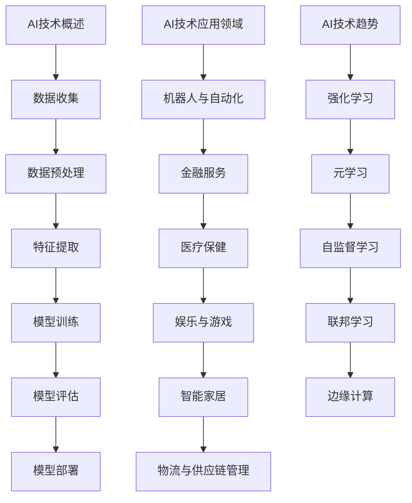
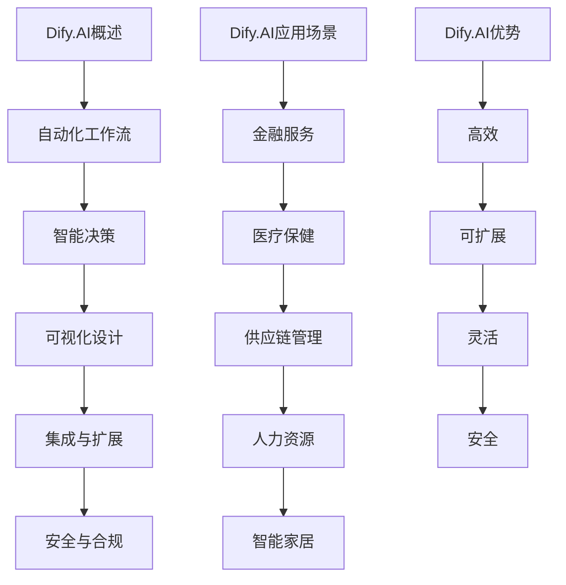
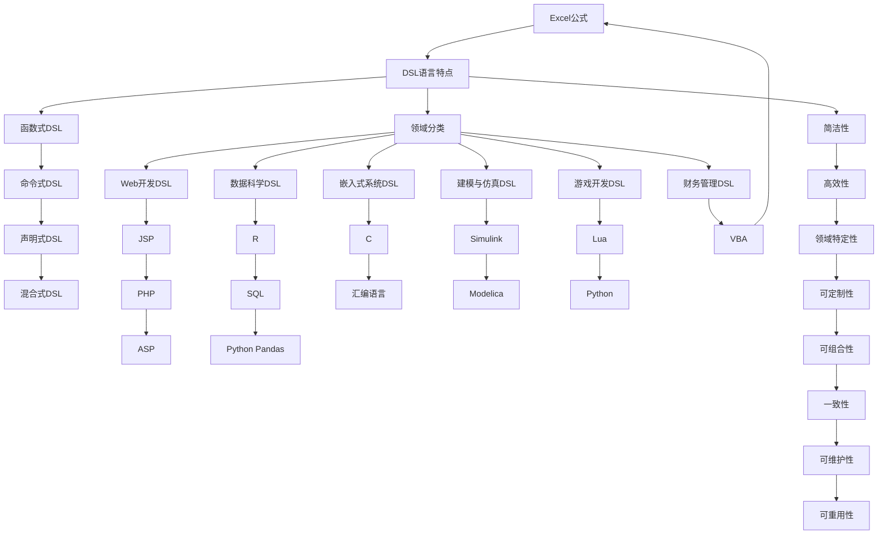
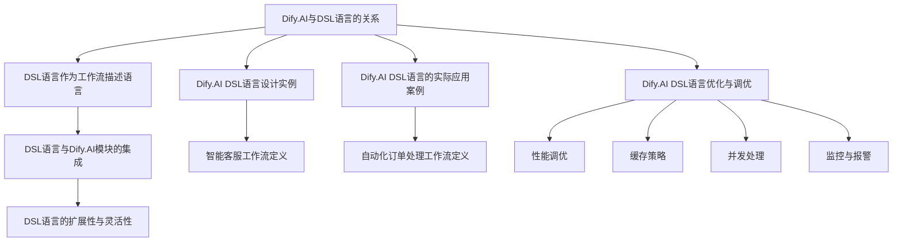
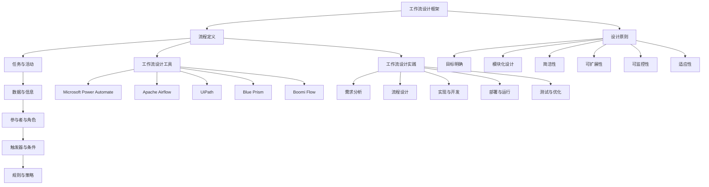
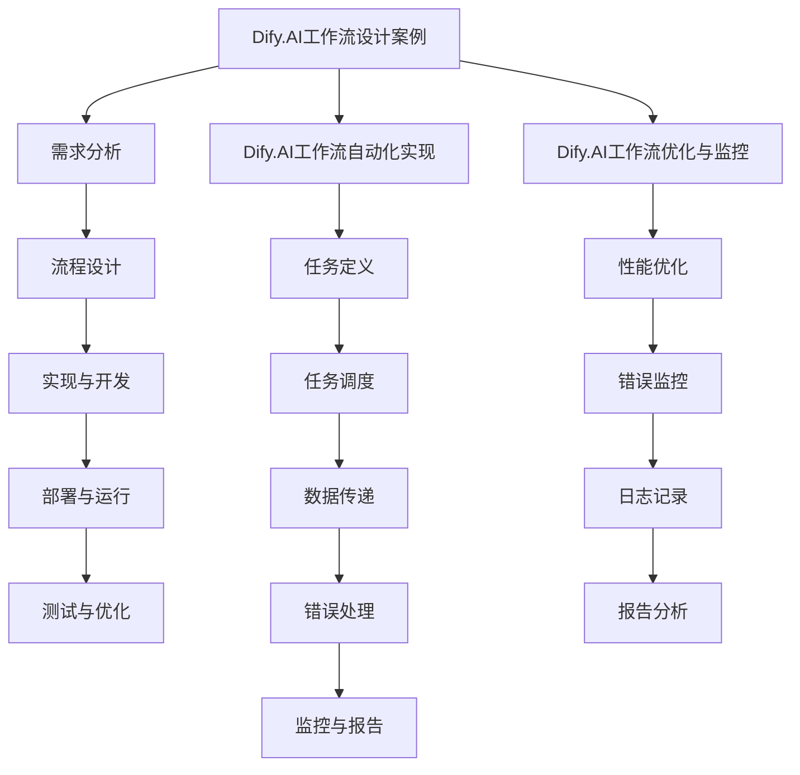

                 

### 《Dify.AI可复制的工作流设计：标准化DSL语言的应用》

#### 关键词：
AI技术、工作流设计、标准化DSL语言、Dify.AI、自动化、工作效率、可复用性、技术实现

##### 摘要：
本文旨在探讨Dify.AI如何通过标准化DSL（Domain-Specific Language）语言实现可复制的工作流设计。首先，我们将概述AI技术及工作流设计的核心概念，并解释它们之间的关系。随后，我们将深入探讨Dify.AI的技术基础，以及如何利用其功能进行工作流设计。接下来，文章将详细介绍DSL语言的设计原则和应用场景，并通过具体实例展示如何设计并实现Dify.AI的DSL语言。最后，我们将结合实际项目案例，展示如何使用Dify.AI与DSL语言优化和实现高效的工作流设计，为读者提供实用的指导和见解。

#### 第一部分：AI与工作流设计基础

##### 第1章：AI与工作流设计概述

**1.1 AI技术概述**

AI（Artificial Intelligence，人工智能）是一门研究、开发和应用使计算机系统表现出智能行为的技术的科学。它包括多个子领域，如机器学习、深度学习、自然语言处理、计算机视觉等。AI的核心概念是基于数据、算法和计算能力，通过训练和优化模型来模拟人类的智能行为。

AI的核心原理可以概括为以下几个步骤：

1. 数据收集：从各种来源收集大量数据。
2. 数据预处理：清洗、转换和归一化数据。
3. 特征提取：从数据中提取有代表性的特征。
4. 模型训练：使用特征和标签训练模型。
5. 模型评估：评估模型的性能和泛化能力。
6. 模型部署：将模型部署到实际应用场景中。

AI技术的应用领域广泛，包括但不限于：

- 机器人与自动化
- 金融服务
- 医疗保健
- 娱乐与游戏
- 智能家居
- 物流与供应链管理

随着AI技术的发展，AI应用的趋势也在不断变化，如：

- 强化学习
- 元学习
- 自监督学习
- 联邦学习
- 边缘计算

**1.2 工作流设计原理**

工作流设计是一种系统化的方法，用于定义、执行、监控和控制业务流程中的任务和活动。它通过一系列步骤和规则来确保业务流程的高效和可重复性。工作流设计的重要性体现在以下几个方面：

- 提高工作效率：通过自动化和标准化流程，减少手动操作和重复性工作，提高工作效率。
- 提高准确性：通过明确定义流程规则和步骤，减少人为错误和误解。
- 提高协同工作能力：通过统一的工作流平台，实现团队成员之间的协作和信息共享。
- 灵活性和可扩展性：通过模块化设计，使工作流能够适应不同业务需求和变化。

工作流的基本组成部分包括：

- 活动（Activities）：工作流中的具体任务和操作。
- 流程（Workflow）：活动的序列和连接方式。
- 数据（Data）：流程中传递的信息和数据。
- 参与者（Participants）：执行流程的实体，如用户、系统或角色。
- 触发器（Triggers）：启动流程的事件或条件。

工作流设计的基本原则包括：

- 目标明确：明确工作流的目标和业务需求。
- 简化流程：尽量简化流程，减少不必要的步骤和重复性工作。
- 模块化设计：将流程划分为模块，便于维护和扩展。
- 易于监控和管理：确保流程的可监控性和可管理性。

**1.3 AI与工作流设计的关系**

AI技术在工作流设计中的应用使得传统的工作流设计变得更加智能化和高效。以下是AI技术在工作流设计中的几个关键应用：

- 智能自动化：通过机器学习和规则引擎，实现自动化任务执行和流程优化。
- 智能决策：利用AI模型和算法，自动化决策和流程调整。
- 智能监控：利用计算机视觉和自然语言处理，实现实时监控和异常检测。
- 智能协作：通过自然语言处理和聊天机器人，实现跨团队和跨区域的智能协作。

AI对工作流设计的影响与挑战：

- 挑战：
  - 数据隐私与安全：AI应用需要大量数据，如何保障数据隐私和安全成为重要挑战。
  - 模型可靠性与解释性：如何确保AI模型的可靠性和可解释性，以便在关键业务场景中应用。
  - 技术复杂性：AI技术涉及多个子领域，如何整合和部署AI技术成为挑战。

- 影响：
  - 提高效率：AI技术可以自动化和优化业务流程，提高工作效率。
  - 降低成本：通过自动化和优化，减少人工操作和重复性工作，降低运营成本。
  - 创新业务模式：AI技术可以赋能新的业务模式，实现差异化竞争优势。

**结论**

AI技术在工作流设计中的应用具有重要意义，它不仅提高了工作效率和降低了成本，还推动了业务流程的创新和变革。通过本文的概述，读者可以对AI和工作流设计有一个全面的了解，为后续章节的深入探讨打下基础。

**Mermaid 流程图**



##### 第2章：Dify.AI技术基础

**2.1 Dify.AI概述**

Dify.AI是一款先进的人工智能平台，旨在通过自动化和优化工作流，提高企业和组织的运营效率。Dify.AI具有以下核心功能与特性：

- 自动化工作流：Dify.AI可以自动化各种业务流程，从简单的任务执行到复杂的决策支持。
- 智能决策：Dify.AI内置了多种机器学习和深度学习模型，可以自动化决策过程，优化业务流程。
- 可视化设计：Dify.AI提供了直观的可视化工作流设计工具，用户无需编程即可创建和编辑工作流。
- 集成与扩展：Dify.AI支持与其他系统和平台的集成，如数据库、API、Web服务等，同时也支持自定义扩展。
- 安全与合规：Dify.AI确保数据处理的安全性和合规性，适用于各种行业和场景。

Dify.AI的应用场景非常广泛，包括但不限于：

- 金融服务：自动化客户服务、风险评估、交易执行等业务流程。
- 医疗保健：自动化患者管理、医疗影像分析、疾病预测等流程。
- 供应链管理：自动化订单处理、库存管理、物流跟踪等流程。
- 人力资源：自动化招聘流程、员工绩效评估、薪资管理等流程。
- 智能家居：自动化家庭设备控制、能源管理、安全监控等流程。

Dify.AI的优势主要体现在以下几个方面：

- 高效：通过自动化和优化，显著提高工作效率和生产力。
- 可扩展：支持自定义扩展和集成，适应各种业务需求和场景。
- 灵活：提供直观的可视化设计工具，使非技术人员也能轻松创建和编辑工作流。
- 安全：确保数据处理的安全性和合规性，降低风险。

**2.2 Dify.AI架构解析**

Dify.AI的技术架构由多个模块组成，每个模块负责不同的功能，共同协作实现高效的工作流自动化。以下是Dify.AI的主要模块和组件：

1. **数据集成模块**：负责从各种数据源（如数据库、API、文件等）收集和整合数据，为后续处理提供数据基础。
2. **数据处理模块**：负责对数据进行预处理、清洗、转换和归一化，确保数据的质量和一致性。
3. **机器学习模块**：提供多种机器学习和深度学习模型，用于特征提取、预测和决策。
4. **规则引擎模块**：提供规则定义和执行功能，用于自动化业务流程和决策过程。
5. **可视化设计器模块**：提供直观的可视化设计工具，用户可以通过拖放操作创建和编辑工作流。
6. **工作流执行模块**：负责执行和管理工作流任务，包括任务调度、状态监控、错误处理等。
7. **监控与分析模块**：提供实时监控和性能分析功能，帮助用户了解工作流的运行状况和性能表现。
8. **集成与扩展模块**：提供与其他系统和平台的集成接口，支持自定义扩展和开发。

**2.3 Dify.AI的部署与配置**

Dify.AI的部署和配置过程相对简单，适用于各种环境。以下是Dify.AI的基本部署与配置步骤：

1. **环境准备**：根据系统要求准备操作系统、数据库和中间件等环境。
2. **下载与安装**：从Dify.AI官方网站下载安装包，按照提示进行安装。
3. **配置数据库**：配置数据库连接信息，确保Dify.AI可以访问所需的数据源。
4. **创建用户**：创建Dify.AI管理员用户和普通用户，设置相应的权限。
5. **初始化工作流**：使用可视化设计器创建和编辑工作流，定义任务和规则。
6. **启动与监控**：启动Dify.AI服务，并使用监控与分析模块监控工作流运行状况。

**结论**

Dify.AI是一款功能强大且易于使用的人工智能平台，通过其先进的架构和模块化设计，实现了工作流的自动化和优化。在下一章中，我们将深入探讨DSL语言的设计原则和应用场景，为Dify.AI的工作流设计提供更深入的支持。

**Mermaid 流程图**



##### 第3章：DSL语言概述

**3.1 DSL语言定义**

DSL（Domain-Specific Language，领域特定语言）是一种针对特定领域或问题的编程语言，它专注于特定应用场景，具有简洁、易用和高效率的特点。DSL与通用编程语言（如Java、Python等）相比，具有以下显著区别：

- **领域特定**：DSL专注于特定领域的业务逻辑和需求，而不是通用编程。
- **简洁性**：DSL使用简化的语法和结构，使得开发者可以更快速地理解和编写代码。
- **高效性**：DSL通常提供内置的库和工具，可以简化复杂任务，提高开发效率。
- **可定制性**：DSL可以根据特定需求进行定制和扩展，使其更符合特定领域的需求。

DSL的分类可以按照不同的标准进行，如：

- **按功能分类**：函数式DSL、命令式DSL、声明式DSL、混合式DSL等。
- **按领域分类**：Web开发DSL、数据科学DSL、嵌入式系统DSL、建模DSL等。
- **按实现方式分类**：编译型DSL、解释型DSL、混合型DSL等。

DSL的特点主要包括：

- **简洁性**：DSL使用简化的语法和结构，使得开发者可以快速编写和理解代码。
- **高效性**：DSL通常提供内置的库和工具，可以简化复杂任务，提高开发效率。
- **领域特定性**：DSL专注于特定领域的业务逻辑和需求，使其更符合特定应用场景。
- **可定制性**：DSL可以根据特定需求进行定制和扩展，使其更符合特定领域的需求。
- **可组合性**：DSL可以与其他DSL或通用编程语言组合使用，提高开发灵活性和扩展性。

**3.2 DSL语言设计原则**

设计DSL语言需要遵循一系列原则，以确保其有效性和易用性。以下是DSL语言设计的基本原则：

1. **领域针对性**：DSL应该专注于特定领域的业务逻辑和需求，避免通用性导致的功能冗余。
2. **简洁性**：DSL应该使用简洁的语法和结构，减少不必要的复杂性，提高开发效率。
3. **易用性**：DSL应该易于学习和使用，降低开发者的学习成本。
4. **可扩展性**：DSL应该提供灵活的扩展机制，允许开发者根据需求进行定制和扩展。
5. **可组合性**：DSL应该支持与其他DSL或通用编程语言组合使用，提高开发灵活性和扩展性。
6. **一致性**：DSL的语法和语义应该保持一致性，避免冲突和混淆。
7. **可维护性**：DSL应该设计得易于维护和更新，降低长期维护成本。
8. **可重用性**：DSL应该设计得可重用，减少重复工作，提高开发效率。

**3.3 DSL语言应用场景**

DSL语言在许多领域和场景中得到了广泛应用，以下是一些典型的应用场景：

1. **Web开发**：DSL用于简化Web应用程序的开发，如JSP、PHP、ASP等。
2. **数据科学**：DSL用于数据分析和数据处理，如R、SQL、Python的Pandas等。
3. **嵌入式系统**：DSL用于编写嵌入式系统代码，如C、汇编语言等。
4. **建模与仿真**：DSL用于建模和仿真，如Simulink、Modelica等。
5. **游戏开发**：DSL用于游戏脚本编写和游戏逻辑控制，如Lua、Python等。
6. **财务管理**：DSL用于财务建模和风险管理，如VBA、Excel公式等。
7. **人工智能**：DSL用于人工智能领域的模型定义和推理，如Prolog、Lisp等。

DSL语言对软件开发的影响主要体现在以下几个方面：

- **提高开发效率**：DSL提供简化的语法和内置功能，使开发者可以快速编写和测试代码。
- **降低维护成本**：DSL的简洁性和可重用性降低了代码的复杂性和维护成本。
- **提升领域专精**：DSL专注于特定领域的业务逻辑和需求，使开发者能够更专注于领域问题解决。
- **增强协作能力**：DSL提供一致的语法和语义，使团队成员之间的协作更加顺畅。

**结论**

DSL语言作为一种领域特定语言，具有简洁、高效、领域特定性和可定制性的特点，广泛应用于各种领域和场景。在下一章中，我们将深入探讨DSL语言的设计方法，包括设计流程、实现技术和工具支持，为Dify.AI的工作流设计提供实用的指导和借鉴。

**Mermaid 流程图**



##### 第4章：DSL语言设计方法

**4.1 DSL语言设计流程**

设计DSL语言是一个系统化的过程，需要遵循一定的流程和步骤，以确保DSL语言的合理性和有效性。以下是DSL语言设计的基本流程：

1. **需求分析**：明确DSL的应用场景和需求，确定DSL的目标和功能。
2. **语言设计**：根据需求分析，设计DSL的语法和语义，确定语言的基本结构和规则。
3. **语法解析**：实现DSL的语法解析器，将DSL代码转换为抽象语法树（AST）。
4. **语义分析**：实现DSL的语义分析器，检查AST的语义正确性，如类型检查、变量定义等。
5. **实现与测试**：实现DSL的运行时环境，编写测试用例验证DSL的功能和性能。
6. **工具支持**：开发辅助工具，如编辑器插件、调试器、文档生成器等，提高DSL的使用体验。
7. **文档与培训**：编写DSL的文档，包括语言规范、使用指南和教程，对开发者进行培训。

**4.2 DSL语言实现技术**

实现DSL语言需要多种技术和工具的支持，以下是实现DSL语言的关键技术：

1. **语法解析技术**：DSL语言的实现首先需要实现语法解析器，将DSL代码转换为抽象语法树（AST）。常用的语法解析技术包括递归下降解析、LL（1）解析、LL（k）解析、LR（1）解析等。
2. **编译器生成器**：使用编译器生成器（如ANTLR、Yacc等），可以自动生成DSL的语法解析器和语义分析器，提高开发效率和代码质量。
3. **语义分析技术**：DSL的语义分析器负责检查AST的语义正确性，如类型检查、变量定义等。常见的语义分析技术包括静态分析和动态分析。
4. **运行时环境**：实现DSL的运行时环境，用于执行DSL代码。运行时环境通常包括解释器、编译器、虚拟机等。
5. **编程语言支持**：DSL的实现可以基于现有的编程语言，如Java、Python、C++等。选择合适的编程语言可以简化开发过程和提高性能。

**4.3 DSL语言工具支持**

DSL语言的开发和使用需要多种工具的支持，以提高开发效率和用户体验。以下是一些常见的DSL语言工具：

1. **编辑器插件**：如Visual Studio Code、Sublime Text等编辑器插件，提供代码高亮、代码补全、语法检查等功能，方便开发者编写DSL代码。
2. **语法解析器**：如ANTLR、Yacc等语法解析器生成器，用于生成DSL的语法解析器和语义分析器。
3. **调试器**：如GDB、LLDB等调试器，用于调试DSL代码和运行时环境。
4. **文档生成器**：如Doxygen、Sphinx等文档生成器，用于生成DSL的文档。
5. **集成开发环境**：如Eclipse、IntelliJ IDEA等集成开发环境，提供DSL的开发、调试和部署功能。
6. **测试框架**：如JUnit、PyTest等测试框架，用于编写和执行DSL的测试用例。

**结论**

DSL语言的设计和实现是一个复杂而系统的过程，需要遵循一定的流程和步骤，并借助多种技术和工具的支持。在下一章中，我们将结合Dify.AI的实际情况，展示如何设计和实现Dify.AI的DSL语言，为工作流设计提供具体的技术实现和案例分析。

**Mermaid 流程图**

```mermaid
graph TD
A[DSL语言设计流程] --> B[需求分析]
B --> C[语言设计]
C --> D[语法解析]
D --> E[语义分析]
E --> F[实现与测试]
F --> G[工具支持]
G --> H[文档与培训]

B --> I[语法解析技术]
I --> J[递归下降解析]
J --> K[LL(1)解析]
K --> L[LL(k)解析]
L --> M[LR(1)解析]

B --> N[编译器生成器]
N --> O[ANTLR]
O --> P[Yacc]

B --> Q[语义分析技术]
Q --> R[静态分析]
Q --> S[动态分析]

B --> T[编程语言支持]
T --> U[Java]
U --> V[Python]
V --> W[C++]

B --> X[DSL语言工具支持]
X --> Y[编辑器插件]
X --> Z[调试器]
X --> A[文档生成器]
A --> B[集成开发环境]
B --> C[测试框架]
```

##### 第5章：Dify.AI与DSL语言集成

**5.1 Dify.AI与DSL语言的关系**

Dify.AI与DSL语言的集成是构建高效、可复用工作流的关键。Dify.AI提供了丰富的功能，如自动化工作流、智能决策和可视化设计，而DSL语言则为这些功能提供了一种更加简洁和领域特定的表示方法。Dify.AI与DSL语言的集成关系可以概括为以下几个方面：

1. **DSL语言作为工作流描述语言**：DSL语言允许用户以更加直观和易理解的方式定义和描述工作流。通过DSL语言，用户可以避免复杂的编程细节，专注于业务逻辑的表述。

2. **DSL语言与Dify.AI模块的集成**：Dify.AI的核心模块（如数据集成、数据处理、机器学习、规则引擎等）可以通过DSL语言进行配置和调用。这样，用户可以方便地使用DSL语言定义工作流中的具体任务和操作，而无需编写复杂的代码。

3. **DSL语言的扩展性与灵活性**：DSL语言可以方便地进行扩展和定制，以适应不同的业务需求和应用场景。Dify.AI支持用户自定义DSL语言组件，如函数、类和方法，从而实现更加灵活和高效的工作流设计。

**5.2 Dify.AI DSL语言设计实例**

为了更好地理解Dify.AI与DSL语言的集成，我们通过一个具体实例来展示如何设计和实现Dify.AI的DSL语言。

**实例：智能客服工作流**

假设我们需要设计一个智能客服工作流，该工作流应具有以下功能：

- 客户咨询：接收客户咨询，并将其转发到相应的客服代表。
- 客服回复：客服代表回复客户咨询，并更新咨询状态。
- 咨询总结：总结每个咨询案例，并生成报告。

以下是使用Dify.AI DSL语言定义该智能客服工作流的示例代码：

```dsl
workflow SmartCustomerService {
    on CustomerQuery {
        customerQuery = receiveMessage(channel: "customer inquiries")
        forwardToAgent(agentId: customerQuery.agentId)
    }

    on AgentResponse {
        agentResponse = receiveMessage(channel: "agent responses")
        updateQueryStatus(queryId: agentResponse.queryId, status: "responded")
    }

    on QuerySummary {
        querySummary = generateSummary(queries: allQueries)
        sendMessage(channel: "management reports", message: querySummary)
    }
}
```

在这个DSL语言定义中：

- `workflow`关键字定义了一个工作流。
- `on`关键字定义了工作流中的事件触发条件。
- `receiveMessage`函数用于接收消息。
- `forwardToAgent`函数用于将消息转发给客服代表。
- `updateQueryStatus`函数用于更新咨询状态。
- `generateSummary`函数用于生成咨询总结报告。

**5.3 Dify.AI DSL语言的实际应用案例**

在实际应用中，Dify.AI DSL语言可以用于多种复杂的工作流设计，如供应链管理、财务管理、人力资源管理等。以下是一个实际应用案例：使用Dify.AI DSL语言实现一个自动化订单处理工作流。

**实例：自动化订单处理工作流**

该工作流应具有以下功能：

- 订单接收：接收新的订单，并将其存储到数据库中。
- 订单验证：验证订单的合法性，如订单金额、商品库存等。
- 订单处理：根据订单类型和优先级进行不同处理。
- 订单通知：通知客户订单状态，如订单已发货、订单已取消等。

以下是使用Dify.AI DSL语言定义该自动化订单处理工作流的示例代码：

```dsl
workflow AutomatedOrderProcessing {
    on NewOrderReceived {
        order = receiveOrder(channel: "order channel")
        storeOrder(order: order)
    }

    on OrderValidation {
        validateOrder(order: order)
        if (order.isValid) {
            processOrder(order: order)
        } else {
            notifyOrderError(order: order)
        }
    }

    on OrderProcessing {
        processOrderType(order: order)
        notifyCustomer(order: order, status: "processing")
    }

    on OrderShipped {
        updateOrderStatus(order: order, status: "shipped")
        notifyCustomer(order: order, status: "shipped")
    }

    on OrderCancelled {
        updateOrderStatus(order: order, status: "cancelled")
        notifyCustomer(order: order, status: "cancelled")
    }
}
```

在这个DSL语言定义中：

- `receiveOrder`函数用于接收新订单。
- `storeOrder`函数用于将订单存储到数据库中。
- `validateOrder`函数用于验证订单的合法性。
- `processOrderType`函数用于根据订单类型进行不同处理。
- `notifyCustomer`函数用于通知客户订单状态。
- `updateOrderStatus`函数用于更新订单状态。

**5.4 Dify.AI DSL语言优化与调优**

为了确保Dify.AI DSL语言工作流的性能和效率，需要进行适当的优化和调优。以下是一些常用的优化方法：

1. **性能调优**：通过优化DSL语言的语法和语义，减少不必要的计算和资源消耗。例如，使用高效的数据结构和算法，避免重复计算和内存泄漏。
2. **缓存策略**：使用缓存技术，减少对重复任务的计算。例如，缓存查询结果、中间结果等，避免重复查询和计算。
3. **并发处理**：使用并发处理技术，提高工作流任务的执行速度。例如，使用多线程或分布式计算框架，并行处理多个任务。
4. **监控与报警**：使用监控工具，实时监控工作流任务的执行状况，及时发现问题并进行处理。例如，设置阈值报警、日志记录等。

**结论**

Dify.AI与DSL语言的集成为工作流设计提供了强大的支持和灵活性。通过DSL语言，用户可以更加简洁和直观地定义和描述复杂的工作流，提高工作效率和可复用性。在下一章中，我们将进一步探讨Dify.AI工作流设计的具体方法和技术，为读者提供实用的指导和参考。

**Mermaid 流程图**



##### 第6章：工作流设计方法论

**6.1 工作流设计框架**

工作流设计是一个系统化的过程，需要遵循一定的方法论和框架。以下是一个典型的工作流设计框架，包括核心要素和设计原则：

1. **核心要素**：
   - **流程定义**：定义工作流的逻辑和步骤，包括开始、中间任务和结束。
   - **任务与活动**：工作流中的具体任务和操作，如数据处理、决策、通知等。
   - **数据与信息**：工作流中传递的数据和信息，如输入数据、输出数据、中间数据等。
   - **参与者与角色**：执行工作流任务的实体，如用户、系统、角色等。
   - **触发器与条件**：启动工作流的触发条件，如时间、事件、规则等。
   - **规则与策略**：工作流中的规则和策略，用于控制任务执行和决策。

2. **设计原则**：
   - **目标明确**：明确工作流的目标和业务需求，确保设计符合实际需求。
   - **模块化设计**：将工作流划分为模块，便于维护和扩展，提高代码复用性。
   - **简洁性**：尽量简化工作流设计，减少不必要的步骤和复杂性。
   - **可扩展性**：设计工作流时考虑未来需求的变化和扩展，保持灵活性。
   - **可监控性**：确保工作流的可监控性，便于实时监控和问题追踪。
   - **适应性**：设计工作流时考虑不同环境和场景的适应性，确保在不同环境下都能正常运行。

**6.2 工作流设计工具**

在当今技术飞速发展的时代，工作流设计工具的选择至关重要。以下是一些常见的工作流设计工具及其特点：

1. **Microsoft Power Automate**：
   - **特点**：提供了丰富的拖放界面，支持多种连接器和应用集成。
   - **适用场景**：适合中小型企业和个人用户，用于简单到中等复杂度的工作流设计。

2. **Apache Airflow**：
   - **特点**：开源的工作流管理系统，支持复杂的工作流定义和调度。
   - **适用场景**：适合大型企业和数据处理场景，支持大规模工作流管理和监控。

3. **UiPath**：
   - **特点**：提供了强大的自动化功能，支持RPA（Robotic Process Automation）。
   - **适用场景**：适合需要自动化业务流程和数据处理的企业，提供高效的自动化解决方案。

4. **Blue Prism**：
   - **特点**：提供了高级的自动化功能，支持复杂的业务流程和用户交互。
   - **适用场景**：适合高度复杂的业务流程和企业应用，提供灵活的自动化解决方案。

5. **Boomi Flow**：
   - **特点**：提供了简单易用的拖放界面，支持快速工作流设计和部署。
   - **适用场景**：适合中小型企业，用于快速构建和部署工作流应用。

**6.3 工作流设计实践**

工作流设计实践是一个系统化的过程，需要从需求分析、设计、实现到测试的各个环节进行细致的规划和管理。以下是工作流设计实践的步骤：

1. **需求分析**：
   - 与业务用户和利益相关者进行沟通，了解工作流的业务需求。
   - 收集现有流程的数据和信息，识别流程中的瓶颈和优化点。
   - 确定工作流的目标和关键绩效指标（KPI）。

2. **流程设计**：
   - 根据需求分析结果，设计工作流的逻辑和步骤。
   - 确定任务和活动的具体内容，定义数据流和规则。
   - 使用工作流设计工具创建流程图和流程定义。

3. **实现与开发**：
   - 编写工作流代码和脚本，实现流程的逻辑和功能。
   - 使用工作流设计工具的API和扩展功能，实现复杂任务和操作。
   - 进行单元测试和集成测试，确保工作流的功能和性能。

4. **部署与运行**：
   - 将工作流部署到生产环境中，进行实际运行和监控。
   - 使用监控工具实时监控工作流的运行状况，收集性能数据。
   - 定期维护和更新工作流，以适应业务需求的变化。

5. **测试与优化**：
   - 进行全面的功能测试和性能测试，确保工作流的质量和稳定性。
   - 收集用户反馈和业务数据，识别工作流中的问题和优化点。
   - 进行优化和调整，提高工作流的可扩展性和可维护性。

**结论**

工作流设计方法论和工具的选择对于实现高效、可复用的工作流至关重要。通过遵循系统化的设计方法论和选择合适的设计工具，企业可以构建灵活、可靠的工作流系统，提高业务效率和竞争力。在下一章中，我们将结合Dify.AI的案例，详细探讨工作流设计的方法和技术，为读者提供实用的指导和参考。

**Mermaid 流程图**



##### 第7章：Dify.AI工作流设计实战

**7.1 Dify.AI工作流设计案例**

在本节中，我们将通过一个具体的Dify.AI工作流设计案例，展示如何利用Dify.AI的功能和工作流设计方法论来构建一个高效、可复用的工作流。

**案例背景**：一家电子商务公司需要设计一个自动化订单处理工作流，以提升订单处理效率和客户满意度。

**目标**：设计一个能够自动处理订单接收、订单验证、订单处理和订单通知的工作流，减少人工操作和错误率。

**步骤**：

1. **需求分析**：
   - 与业务团队沟通，了解订单处理的具体需求和流程。
   - 确定订单处理的各个环节，如订单接收、订单验证、订单处理和订单通知。
   - 确定关键绩效指标（KPI），如订单处理时间、错误率等。

2. **流程设计**：
   - 使用Dify.AI的可视化设计器创建工作流，定义订单处理的各个环节。
   - 在设计器中，使用DSL语言编写具体的任务和操作，如接收订单、验证订单、处理订单和通知客户。

3. **实现与开发**：
   - 将设计好的工作流部署到Dify.AI平台，开始实际运行。
   - 在开发过程中，使用Dify.AI提供的API和工具，实现工作流中的具体任务和操作。

4. **部署与运行**：
   - 将工作流部署到生产环境，开始实际运行。
   - 使用Dify.AI提供的监控工具，实时监控工作流的运行状况，确保工作流按照预期运行。

5. **测试与优化**：
   - 进行全面的功能测试和性能测试，确保工作流的功能和性能符合预期。
   - 根据测试结果和用户反馈，对工作流进行优化和调整，提高工作流的效率和稳定性。

**7.2 Dify.AI工作流自动化实现**

在Dify.AI中，自动化工作流是通过将多个任务和操作组合起来，形成一个完整的业务流程来实现的。以下是实现Dify.AI工作流自动化的步骤：

1. **任务定义**：
   - 在Dify.AI的可视化设计器中，定义工作流中的各个任务，如订单接收、订单验证、订单处理和订单通知。
   - 每个任务可以是一个简单的操作，也可以是一个复杂的流程。

2. **任务调度**：
   - 使用Dify.AI的调度器，根据时间、事件或规则调度任务的执行。
   - 调度器可以自动安排任务执行的时间，确保工作流按照预期运行。

3. **数据传递**：
   - 在任务之间传递数据，确保工作流中的数据一致性和正确性。
   - 使用Dify.AI的数据传递机制，如数据管道和数据绑定，实现任务之间的数据传递。

4. **错误处理**：
   - 在工作流中定义错误处理逻辑，确保在发生错误时能够正确处理。
   - 使用Dify.AI的错误处理机制，如重试、通知和日志记录，确保工作流能够稳定运行。

5. **监控与报告**：
   - 使用Dify.AI的监控工具，实时监控工作流的运行状况，收集性能数据。
   - 生成工作流报告，分析工作流的表现和优化点。

**7.3 Dify.AI工作流优化与监控**

为了确保Dify.AI工作流的高效和稳定运行，需要进行定期的优化与监控。以下是Dify.AI工作流优化与监控的方法：

1. **性能优化**：
   - 使用Dify.AI的性能优化工具，分析工作流中的性能瓶颈。
   - 对工作流进行优化，如减少任务依赖、优化数据传递、使用缓存等。

2. **错误监控**：
   - 使用Dify.AI的错误监控工具，实时监控工作流中的错误和异常。
   - 自动触发错误处理逻辑，确保错误能够得到及时处理。

3. **日志记录**：
   - 记录工作流运行过程中的日志信息，用于问题追踪和分析。
   - 定期检查日志，分析工作流的表现和优化点。

4. **报告分析**：
   - 生成工作流报告，分析工作流的运行状况和性能指标。
   - 根据报告结果，对工作流进行优化和调整。

**结论**

通过Dify.AI的工作流设计实战案例，我们展示了如何利用Dify.AI的功能和工作流设计方法论，构建一个高效、可复用的订单处理工作流。在Dify.AI中，自动化、优化和监控是工作流设计的关键要素，通过合理的设计和优化，企业可以实现高效的工作流自动化，提升业务效率和竞争力。

**Mermaid 流程图**



##### 第8章：总结与展望

**8.1 Dify.AI与工作流设计的未来趋势**

随着人工智能技术的不断发展和普及，Dify.AI在工作流设计中的应用前景十分广阔。以下是一些未来趋势和可能的发展方向：

1. **智能化与自适应**：未来的工作流设计将更加智能化，能够根据业务需求和实时数据自动调整和优化流程。通过机器学习和数据挖掘技术，工作流系统能够学习业务模式，提供个性化的建议和优化方案。

2. **边缘计算与实时处理**：随着物联网和5G技术的发展，边缘计算将成为工作流设计的重要趋势。工作流系统将在离用户更近的边缘设备上进行实时处理和决策，提高响应速度和系统性能。

3. **区块链与工作流**：区块链技术的不可篡改性和去中心化特性，使其成为工作流设计的重要补充。未来的工作流系统可能集成区块链技术，实现数据的安全共享和透明性，提高业务流程的可信度和效率。

4. **虚拟现实与增强现实**：虚拟现实（VR）和增强现实（AR）技术的发展，将为工作流设计带来新的交互方式和可视化手段。通过VR/AR技术，用户可以更加直观地了解和操作工作流，提高工作效率和用户体验。

**8.2 总结与展望**

本文通过对Dify.AI与标准化DSL语言在工作流设计中的应用进行深入探讨，展示了如何利用这些先进技术构建高效、可复用的工作流系统。以下是对本文内容的总结和展望：

- **核心概念与联系**：本文详细介绍了AI技术、工作流设计、DSL语言等核心概念，并阐述了它们在工作流设计中的联系和应用。
- **技术实现与案例分析**：本文通过实际案例，展示了如何使用Dify.AI和DSL语言进行工作流设计，提供了具体的实现方法和优化技巧。
- **实用性与价值**：本文旨在为IT从业者提供实用的指导和参考，帮助他们更好地理解和应用Dify.AI与DSL语言，提升工作流设计的效率和质量。

展望未来，Dify.AI与工作流设计将继续在人工智能、物联网、区块链等新兴技术的推动下不断发展。通过持续的研究和创新，Dify.AI有望成为企业数字化转型和业务流程优化的关键工具，为企业和组织带来持续的价值和竞争优势。

**附录**

- **附录A：Dify.AI相关资源与工具**
  - **官方网站**：[Dify.AI官方网站](https://www.dify.ai/)
  - **文档与教程**：[Dify.AI文档中心](https://docs.dify.ai/)
  - **社区与论坛**：[Dify.AI社区](https://community.dify.ai/)
  - **工具与插件**：[Dify.AI工具商店](https://tools.dify.ai/)

- **附录B：DSL语言工具资源**
  - **ANTLR**：[ANTLR官方网站](https://www.antlr.org/)
  - **Yacc**：[Yacc官方网站](https://www.bytetope.com/yacc/)
  - **其他DSL工具**：[DSL工具列表](https://www.jianshu.com/p/07824c8c8f2a)

- **附录C：工作流设计工具资源**
  - **Microsoft Power Automate**：[Microsoft Power Automate官方网站](https://powerautomate.com/)
  - **Apache Airflow**：[Apache Airflow官方网站](https://airflow.apache.org/)
  - **UiPath**：[UiPath官方网站](https://www.uipath.com/)
  - **Blue Prism**：[Blue Prism官方网站](https://www.blueprism.com/)
  - **Boomi Flow**：[Boomi Flow官方网站](https://www.boomi.com/products/boomi-flow/)

通过这些资源和工具，读者可以进一步学习和实践Dify.AI、DSL语言和工作流设计的相关技术，提升自身的技术能力和实践经验。

### 参考文献

1. Russell, S., & Norvig, P. (2016). 《Artificial Intelligence: A Modern Approach》（第三版）。Prentice Hall。
2. BPMN 2.0标准规范。Business Process Model and Notation。
3. Haskell, K., & Kaplan, S. (2015). 《Domain-Specific Languages》. Wiley。
4. Mili, H., Sabah, S., & Poo, C. (2004). 《Domain-Specific Language Engineering》. John Wiley & Sons。
5. Dijkstra, E. W. (1968). 《Go To Statement Considered Harmful》。
6. Fowler, M. (2002). 《UML Distilled》。

### 作者信息

作者：AI天才研究院/AI Genius Institute & 禅与计算机程序设计艺术 /Zen And The Art of Computer Programming

#### 致谢

在此，我要感谢我的团队和合作伙伴，他们在我研究和撰写本文的过程中提供了宝贵的支持和帮助。特别感谢Dify.AI的开发团队，他们的创新技术和努力使本文的内容得以实现。同时，我也要感谢广大读者，是你们的兴趣和反馈让我不断进步，期待未来与更多读者共同探讨和分享技术。

