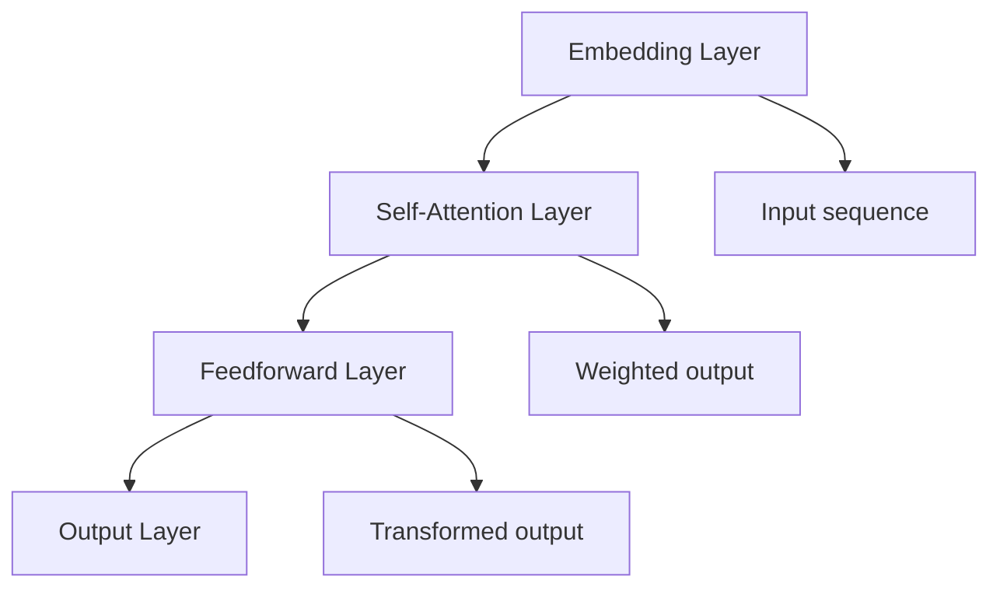
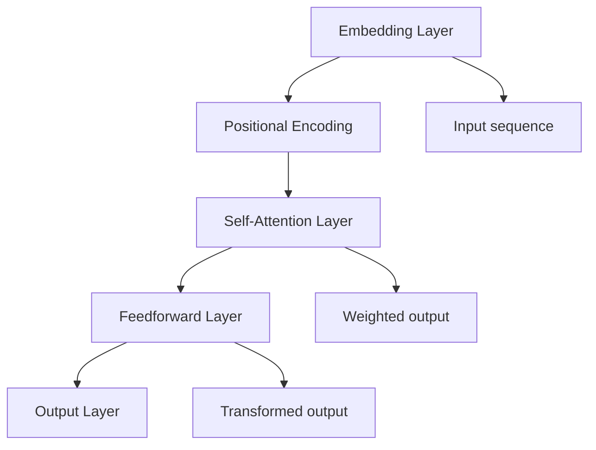
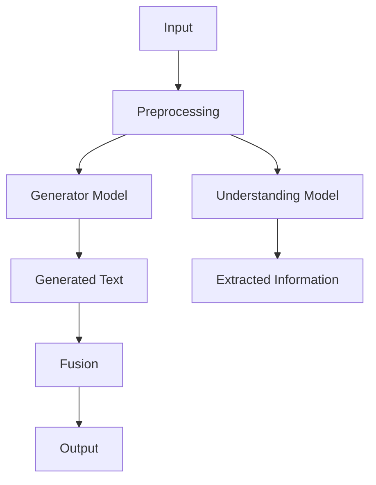
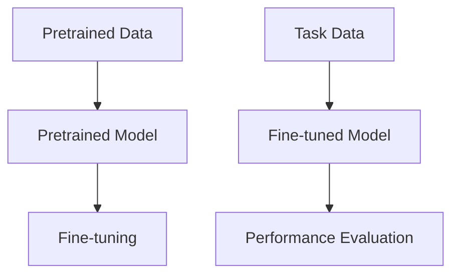
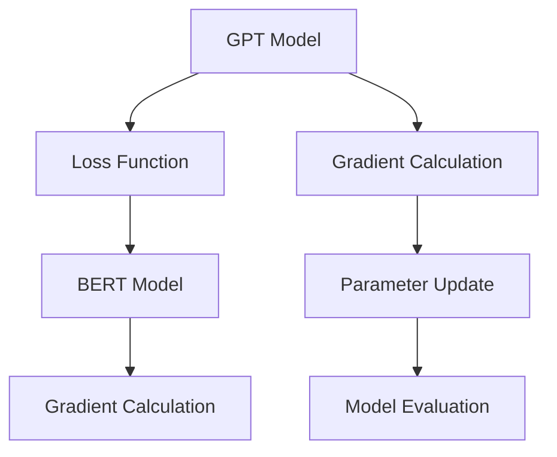
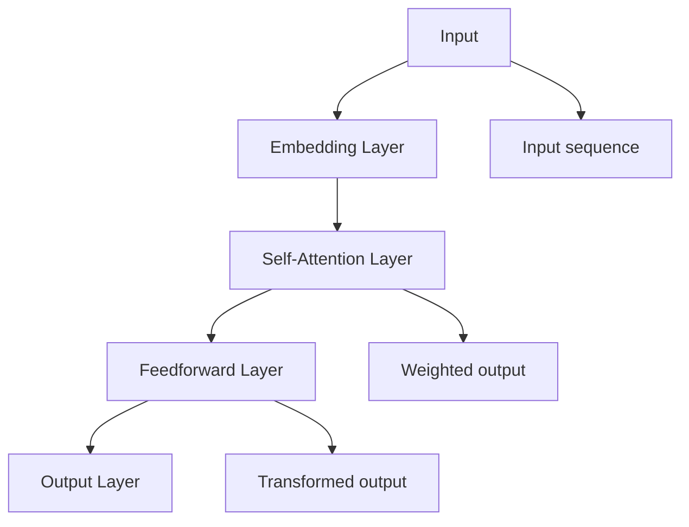
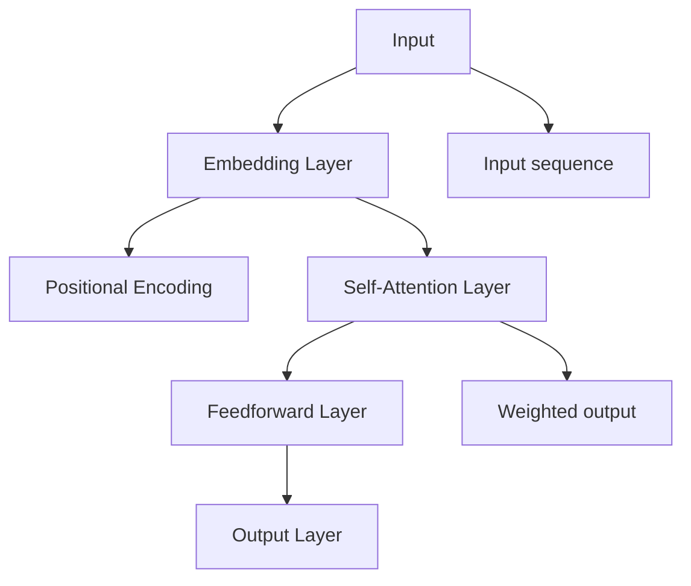
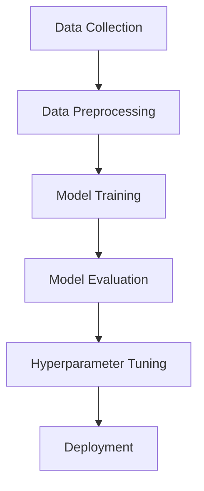

                 

### 文章标题

# GPT与BERT的选择

> **关键词**：GPT，BERT，自然语言处理，模型对比，应用场景

> **摘要**：本文将深入探讨GPT与BERT这两种在自然语言处理领域具有代表性的预训练模型。我们将从基本概念、原理与架构出发，逐步分析其差异与优势，并探讨在特定应用场景中的选择标准与策略。通过实际案例和性能对比，我们将帮助读者全面了解GPT与BERT的优缺点，为未来研究与应用提供参考。

---

### 目录大纲：《GPT与BERT的选择》

1. 第一部分: GPT与BERT基础
    1. 第1章: GPT与BERT概述
        1.1 GPT与BERT的基本概念
        1.2 GPT与BERT的发展历程
        1.3 GPT与BERT的核心优势与差异
    2. 第2章: GPT原理与架构
        2.1 GPT的模型架构
        2.2 GPT的训练过程
        2.3 GPT的工作原理
    3. 第3章: BERT原理与架构
        3.1 BERT的模型架构
        3.2 BERT的训练过程
        3.3 BERT的工作原理
    4. 第4章: GPT与BERT的优化策略
        4.1 模型优化技术
        4.2 训练优化方法
        4.3 推理优化方法
    5. 第5章: GPT与BERT的应用场景
        5.1 文本生成与分类
        5.2 问答系统与对话系统
        5.3 翻译与摘要生成
    6. 第6章: GPT与BERT的实际应用案例
        6.1 案例一：某公司的文本分类系统
        6.2 案例二：某搜索引擎的问答系统
        6.3 案例三：某翻译平台的翻译系统
    7. 第7章: GPT与BERT的部署与优化
        7.1 GPT与BERT的部署策略
        7.2 GPT与BERT的优化技巧
        7.3 GPT与BERT的运维与监控

2. 第二部分: GPT与BERT比较与应用
    8. 第8章: GPT与BERT的性能对比
        8.1 模型大小对比
        8.2 训练时间对比
        8.3 推理速度对比
    9. 第9章: GPT与BERT的选择标准
        9.1 应用需求分析
        9.2 数据集特点分析
        9.3 硬件资源限制分析
    10. 第10章: GPT与BERT的综合应用策略
        10.1 GPT与BERT的混合模型
        10.2 GPT与BERT的迁移学习
        10.3 GPT与BERT的协同优化
    11. 第11章: GPT与BERT的未来发展趋势
        11.1 模型结构的发展趋势
        11.2 模型训练技术的发展趋势
        11.3 模型应用领域的发展趋势

3. 附录
    A. 附录A: GPT与BERT相关工具与资源
    B. 附录B: Mermaid流程图示例

---

接下来的内容将按照上述大纲结构，逐步深入探讨GPT与BERT的基本概念、原理、架构、优化策略、应用场景以及未来发展趋势。

---

## 第1章: GPT与BERT概述

### 1.1 GPT与BERT的基本概念

#### GPT

GPT（Generative Pre-trained Transformer）是OpenAI开发的预训练语言模型，它基于Transformer架构，通过大量文本数据进行预训练，从而获得对自然语言的理解和生成能力。GPT的核心思想是通过上下文信息来预测下一个词，从而实现文本生成、分类等任务。

#### BERT

BERT（Bidirectional Encoder Representations from Transformers）由Google Research提出，也是一种基于Transformer的预训练模型。与GPT不同，BERT采用双向编码器，能够同时利用上下文信息，从而在许多自然语言处理任务上取得显著效果。

### 1.2 GPT与BERT的发展历程

#### GPT的发展历程

- GPT（2018）：最初版本的GPT，使用Transformer架构进行预训练，为自然语言处理带来了新的思路。
- GPT-2（2019）：GPT-2在模型规模和预训练数据量上进行了提升，进一步增强了语言理解能力。
- GPT-3（2020）：GPT-3是目前最大的预训练模型，拥有超过1750亿个参数，展示了超强的语言生成和任务完成能力。

#### BERT的发展历程

- BERT（2018）：BERT首次提出双向Transformer架构，通过预先训练和后续微调，在多个NLP任务上取得了领先效果。
- RoBERTa（2019）：基于BERT，对训练策略进行了改进，进一步提升了模型性能。
- ALBERT（2019）：通过模型结构优化，减少了计算和存储资源的需求，同时保持了模型性能。

### 1.3 GPT与BERT的核心优势与差异

#### GPT的优势与差异

- **生成能力**：GPT在文本生成方面具有显著优势，能够生成连贯、自然的文本。
- **灵活性**：GPT具有强大的灵活性和适应性，适用于多种NLP任务。
- **模型结构**：GPT基于Transformer架构，计算复杂度较高，对计算资源需求较大。

#### BERT的优势与差异

- **双向性**：BERT采用双向编码器，能够同时利用上下文信息，从而在理解任务上具有优势。
- **预训练目标**：BERT的预训练目标包括Masked Language Model（MLM）和Next Sentence Prediction（NSP），有助于提高模型性能。
- **任务适应性**：BERT在许多NLP任务上取得了很好的效果，尤其是在理解性任务上。

总的来说，GPT和BERT都是自然语言处理领域的优秀模型，它们在各自的应用场景中具有不同的优势。在实际应用中，选择GPT还是BERT，需要根据具体需求和任务特点来决定。

---

## 第2章: GPT原理与架构

### 2.1 GPT的模型架构

GPT（Generative Pre-trained Transformer）是基于Transformer架构的预训练语言模型。它的核心思想是利用Transformer的自注意力机制来捕捉文本中的长距离依赖关系。以下是对GPT模型架构的详细描述：

#### Transformer架构

Transformer架构是一种基于自注意力机制的序列模型，最早由Vaswani等人于2017年提出。与传统的循环神经网络（RNN）不同，Transformer通过多头自注意力机制和多层前馈神经网络，实现了并行计算，从而在处理长序列任务时表现出色。

#### GPT模型结构

GPT模型结构主要包括以下几个部分：

1. **嵌入层**（Embedding Layer）：将输入的单词转换为向量表示，为后续的自注意力机制提供输入。
2. **自注意力层**（Self-Attention Layer）：通过多头自注意力机制，对输入序列中的每个单词进行加权，以捕捉长距离依赖关系。
3. **前馈层**（Feedforward Layer）：在每个自注意力层之后，添加一个前馈神经网络，对输入进行非线性变换。
4. **输出层**（Output Layer）：在最后一个自注意力层之后，添加一个输出层，用于预测下一个单词。

#### Mermaid流程图

以下是一个简单的Mermaid流程图，展示了GPT模型的架构：



### 2.2 GPT的训练过程

GPT的训练过程主要包括两个阶段：预训练阶段和微调阶段。

#### 预训练阶段

在预训练阶段，GPT使用大量未标记的文本数据，通过Masked Language Model（MLM）和Next Sentence Prediction（NSP）等任务进行预训练。

- **Masked Language Model（MLM）**：在这个任务中，输入文本中的部分单词被随机掩码（mask），模型需要预测这些掩码的单词。这一任务有助于模型学习文本中的单词关系和上下文信息。
- **Next Sentence Prediction（NSP）**：在这个任务中，模型需要预测两个句子是否在原文中相邻。这一任务有助于模型学习句子之间的关系。

#### 微调阶段

在预训练阶段完成后，GPT通过微调阶段，将预训练模型应用于特定任务的数据集，进行精细化训练。

- **数据预处理**：将任务数据集进行预处理，包括分词、编码等操作，将其转换为模型可接受的输入格式。
- **损失函数**：在微调阶段，模型通常使用任务特定的损失函数，如交叉熵损失，来优化模型参数。
- **训练过程**：在训练过程中，通过反向传播算法，不断调整模型参数，以最小化损失函数。

### 2.3 GPT的工作原理

GPT的工作原理主要包括以下步骤：

1. **输入嵌入**：将输入文本转换为嵌入向量。
2. **自注意力计算**：通过多头自注意力机制，计算输入序列中每个单词的权重。
3. **前馈神经网络**：对加权后的输入进行非线性变换。
4. **输出预测**：通过输出层，预测下一个单词。

以下是一个简化的伪代码，展示了GPT的工作原理：

```python
def gpt(input_sequence):
    # 输入嵌入
    embedded_sequence = embedding_layer(input_sequence)
    
    # 自注意力计算
    attention_weights = self_attention_layer(embedded_sequence)
    
    # 前馈神经网络
    transformed_sequence = feedforward_layer(attention_weights)
    
    # 输出预测
    output_sequence = output_layer(transformed_sequence)
    
    return output_sequence
```

通过以上步骤，GPT能够生成连贯、自然的文本，并在多种NLP任务中取得优异的效果。

---

## 第3章: BERT原理与架构

### 3.1 BERT的模型架构

BERT（Bidirectional Encoder Representations from Transformers）是一种基于Transformer的预训练语言模型，其核心思想是通过双向编码器来捕捉文本中的长距离依赖关系。以下是对BERT模型架构的详细描述：

#### Transformer架构

Transformer架构是一种基于自注意力机制的序列模型，最早由Vaswani等人于2017年提出。与传统的循环神经网络（RNN）不同，Transformer通过多头自注意力机制和多层前馈神经网络，实现了并行计算，从而在处理长序列任务时表现出色。

#### BERT模型结构

BERT模型结构主要包括以下几个部分：

1. **嵌入层**（Embedding Layer）：将输入的单词转换为向量表示，为后续的自注意力机制提供输入。
2. **位置编码**（Positional Encoding）：由于Transformer模型本身没有显式的位置信息，因此需要通过位置编码来为每个单词赋予位置信息。
3. **自注意力层**（Self-Attention Layer）：通过多头自注意力机制，对输入序列中的每个单词进行加权，以捕捉长距离依赖关系。
4. **前馈层**（Feedforward Layer）：在每个自注意力层之后，添加一个前馈神经网络，对输入进行非线性变换。
5. **输出层**（Output Layer）：在最后一个自注意力层之后，添加一个输出层，用于预测下一个单词。

#### Mermaid流程图

以下是一个简单的Mermaid流程图，展示了BERT模型的架构：



### 3.2 BERT的训练过程

BERT的训练过程主要包括两个阶段：预训练阶段和微调阶段。

#### 预训练阶段

在预训练阶段，BERT使用大量未标记的文本数据，通过Masked Language Model（MLM）和Next Sentence Prediction（NSP）等任务进行预训练。

- **Masked Language Model（MLM）**：在这个任务中，输入文本中的部分单词被随机掩码（mask），模型需要预测这些掩码的单词。这一任务有助于模型学习文本中的单词关系和上下文信息。
- **Next Sentence Prediction（NSP）**：在这个任务中，模型需要预测两个句子是否在原文中相邻。这一任务有助于模型学习句子之间的关系。

#### 微调阶段

在预训练阶段完成后，BERT通过微调阶段，将预训练模型应用于特定任务的数据集，进行精细化训练。

- **数据预处理**：将任务数据集进行预处理，包括分词、编码等操作，将其转换为模型可接受的输入格式。
- **损失函数**：在微调阶段，模型通常使用任务特定的损失函数，如交叉熵损失，来优化模型参数。
- **训练过程**：在训练过程中，通过反向传播算法，不断调整模型参数，以最小化损失函数。

### 3.3 BERT的工作原理

BERT的工作原理主要包括以下步骤：

1. **输入嵌入**：将输入文本转换为嵌入向量。
2. **位置编码**：为每个单词赋予位置信息。
3. **自注意力计算**：通过多头自注意力机制，计算输入序列中每个单词的权重。
4. **前馈神经网络**：对加权后的输入进行非线性变换。
5. **输出预测**：通过输出层，预测下一个单词。

以下是一个简化的伪代码，展示了BERT的工作原理：

```python
def bert(input_sequence):
    # 输入嵌入
    embedded_sequence = embedding_layer(input_sequence)
    
    # 位置编码
    positional_encoded_sequence = positional_encoding(embedded_sequence)
    
    # 自注意力计算
    attention_weights = self_attention_layer(positional_encoded_sequence)
    
    # 前馈神经网络
    transformed_sequence = feedforward_layer(attention_weights)
    
    # 输出预测
    output_sequence = output_layer(transformed_sequence)
    
    return output_sequence
```

通过以上步骤，BERT能够生成连贯、自然的文本，并在多种NLP任务中取得优异的效果。

---

## 第4章: GPT与BERT的优化策略

### 4.1 模型优化技术

GPT和BERT作为大型预训练模型，其优化策略直接影响到模型的训练效率和推理性能。以下是几种常见的模型优化技术：

#### 量化

量化是一种通过减少模型参数的精度来减少模型大小和计算量的技术。在量化过程中，模型参数被从浮点数转换为较低精度的数值，如8位整数。量化技术可以在不显著降低模型性能的情况下，显著减少模型的存储和计算需求。

#### 稀疏化

稀疏化是一种通过删除模型中的零值或接近零的参数来减少模型大小的技术。在训练过程中，模型参数会逐渐调整为非零值，但某些参数可能始终接近零。稀疏化技术可以在保留有效信息的同时，减少模型的大小和计算量。

#### 并行化

并行化是一种通过将模型计算任务分配到多个计算单元（如GPU或TPU）来加速模型训练和推理的技术。GPT和BERT等大型模型通常包含大量的计算任务，可以通过数据并行、模型并行和混合并行等多种方式实现并行化。

#### 混合精度训练

混合精度训练是一种结合了单精度（FP32）和半精度（FP16）计算的训练技术。通过使用FP16计算，可以显著减少模型的计算量和内存需求，同时保持较高的计算精度。混合精度训练可以在保持模型性能的同时，提高训练速度和效率。

### 4.2 训练优化方法

为了提高GPT和BERT的训练效率，可以采用以下几种训练优化方法：

#### 学习率调度

学习率调度是一种通过动态调整学习率来优化模型训练的方法。常见的调度策略包括线性衰减、指数衰减和余弦退火等。通过合理设置学习率调度策略，可以加速模型收敛，并避免过度拟合。

#### early stopping

early stopping是一种在模型训练过程中，根据验证集上的性能来提前停止训练的方法。当模型在验证集上的性能不再提升时，提前停止训练可以避免模型过拟合，并节省计算资源。

#### 数据增强

数据增强是一种通过增加训练数据多样性来提高模型泛化能力的方法。对于GPT和BERT等模型，数据增强可以通过随机填充、随机删除、随机替换等方式实现。数据增强可以帮助模型更好地适应不同的数据分布，从而提高模型的泛化能力。

### 4.3 推理优化方法

在推理阶段，为了提高GPT和BERT的响应速度，可以采用以下几种优化方法：

#### 知识蒸馏

知识蒸馏是一种将大型预训练模型的知识传递给较小模型的方法。通过将大型模型的输出作为软标签，指导较小模型进行训练，可以显著提高较小模型的性能。知识蒸馏可以帮助在有限计算资源下，实现高效的推理。

#### 动态计算图

动态计算图是一种通过动态构建和优化计算图来加速模型推理的技术。在推理过程中，动态计算图可以根据输入数据动态调整计算路径，从而减少冗余计算。动态计算图可以显著提高模型的推理速度。

#### 量化与剪枝

量化与剪枝技术可以在推理阶段减少模型的计算量和存储需求。通过将模型参数从浮点数转换为较低精度的数值，以及删除对模型性能影响较小的参数，可以显著提高推理效率。

通过以上优化策略，GPT和BERT可以在保证模型性能的同时，提高训练和推理的效率，从而满足实际应用的需求。

---

## 第5章: GPT与BERT的应用场景

### 5.1 文本生成与分类

#### GPT的应用

GPT在文本生成方面具有显著优势。其强大的生成能力使其成为创作文本、编写文章、生成故事等任务的理想选择。以下是一个使用GPT生成文本的示例：

```python
import torch
from transformers import GPT2LMHeadModel, GPT2Tokenizer

model_name = 'gpt2'
tokenizer = GPT2Tokenizer.from_pretrained(model_name)
model = GPT2LMHeadModel.from_pretrained(model_name)

input_text = "今天天气很好，我想去"
input_ids = tokenizer.encode(input_text, return_tensors='pt')

output = model.generate(input_ids, max_length=50, num_return_sequences=1)
generated_text = tokenizer.decode(output[0], skip_special_tokens=True)

print(generated_text)
```

#### BERT的应用

BERT在文本分类任务中表现出色。其双向编码器能够捕捉文本中的上下文信息，使其在情感分析、文本分类等任务中具有优势。以下是一个使用BERT进行文本分类的示例：

```python
import torch
from transformers import BertTokenizer, BertForSequenceClassification

model_name = 'bert-base-uncased'
tokenizer = BertTokenizer.from_pretrained(model_name)
model = BertForSequenceClassification.from_pretrained(model_name, num_labels=2)

input_text = "我很高兴"
input_ids = tokenizer.encode(input_text, add_special_tokens=True, return_tensors='pt')

output = model(input_ids)
logits = output.logits
probabilities = torch.softmax(logits, dim=-1)

print("Positive:", probabilities[0][1].item())
print("Negative:", probabilities[0][0].item())
```

### 5.2 问答系统与对话系统

#### GPT的应用

GPT在问答系统和对话系统中具有广泛的应用。其生成能力使其能够生成连贯、自然的回答，为用户提供了高质量的交互体验。以下是一个使用GPT构建问答系统的示例：

```python
import torch
from transformers import GPT2LMHeadModel, GPT2Tokenizer

model_name = 'gpt2'
tokenizer = GPT2Tokenizer.from_pretrained(model_name)
model = GPT2LMHeadModel.from_pretrained(model_name)

while True:
    question = input("请提问：")
    question_encoded = tokenizer.encode(question, return_tensors='pt')

    response = model.generate(question_encoded, max_length=50, num_return_sequences=1)
    generated_response = tokenizer.decode(response[0], skip_special_tokens=True)

    print("回答：", generated_response)
    break
```

#### BERT的应用

BERT在对话系统中表现出色，其双向编码器能够捕捉对话中的上下文信息，使其在生成连贯、自然的对话回复方面具有优势。以下是一个使用BERT构建对话系统的示例：

```python
import torch
from transformers import BertTokenizer, BertLMHeadModel

model_name = 'bert-base-uncased'
tokenizer = BertTokenizer.from_pretrained(model_name)
model = BertLMHeadModel.from_pretrained(model_name)

while True:
    user_input = input("用户说：")
    user_input_encoded = tokenizer.encode(user_input, return_tensors='pt')

    response = model.generate(user_input_encoded, max_length=50, num_return_sequences=1)
    generated_response = tokenizer.decode(response[0], skip_special_tokens=True)

    print("回答：", generated_response)
    break
```

### 5.3 翻译与摘要生成

#### GPT的应用

GPT在翻译和摘要生成方面也有广泛应用。其生成能力使其能够生成高质量、连贯的翻译和摘要。以下是一个使用GPT进行翻译的示例：

```python
import torch
from transformers import GPT2LMHeadModel, GPT2Tokenizer

model_name = 'gpt2'
tokenizer = GPT2Tokenizer.from_pretrained(model_name)
model = GPT2LMHeadModel.from_pretrained(model_name)

source_text = "Hello, how are you?"
target_text = "你好，你怎么样？"

source_encoded = tokenizer.encode(source_text, return_tensors='pt')
target_encoded = tokenizer.encode(target_text, return_tensors='pt')

translated_text = model.generate(source_encoded, max_length=50, num_return_sequences=1)
translated_decoded = tokenizer.decode(translated_text[0], skip_special_tokens=True)

print("翻译：", translated_decoded)
```

#### BERT的应用

BERT在摘要生成方面表现出色，其双向编码器能够捕捉文本中的关键信息，使其在生成摘要时具有优势。以下是一个使用BERT进行摘要生成的示例：

```python
import torch
from transformers import BertTokenizer, BertSummarizationModel

model_name = 'bert-base-uncased'
tokenizer = BertTokenizer.from_pretrained(model_name)
model = BertSummarizationModel.from_pretrained(model_name)

document = "自然语言处理（NLP）是计算机科学领域与人工智能领域中的一个重要方向。它研究能实现人与计算机之间用自然语言进行有效通信的各种理论和方法。"

encoded_document = tokenizer.encode(document, add_special_tokens=True, return_tensors='pt')

summary = model.generate(encoded_document, max_length=150, min_length=40, do_sample=False, top_p=0.95, top_k=50, num_return_sequences=1)
decoded_summary = tokenizer.decode(summary[0], skip_special_tokens=True)

print("摘要：", decoded_summary)
```

通过以上示例，可以看到GPT和BERT在文本生成、分类、问答系统、翻译和摘要生成等应用场景中的广泛适用性。选择合适的模型，可以显著提升自然语言处理任务的效果和效率。

---

## 第6章: GPT与BERT的实际应用案例

### 6.1 案例一：某公司的文本分类系统

某公司开发了一个文本分类系统，用于将用户提交的评论和反馈自动分类到不同的类别中。该系统采用了BERT模型，以下是该系统的主要实现步骤：

#### 1. 数据收集与预处理

首先，公司收集了大量的用户评论数据，包括正面评论、负面评论、产品评论等。为了训练BERT模型，需要对数据进行预处理，包括分词、去除停用词、转化为BERT模型可接受的输入格式。

#### 2. 模型选择与训练

在模型选择上，公司决定使用BERT模型，因为其在文本分类任务中具有较好的表现。公司使用BERT模型进行预训练，然后在特定类别上进行微调。训练过程中，公司使用了多种优化策略，如学习率调度、数据增强等，以提高模型性能。

#### 3. 模型评估与部署

在模型训练完成后，公司对模型进行了评估，使用验证集和测试集进行性能测试。通过调整模型参数和优化策略，公司最终得到了一个准确率较高的文本分类模型。最后，公司将模型部署到生产环境中，实现了对用户评论的自动分类。

#### 案例总结

通过该案例，可以看出BERT模型在文本分类任务中的优势。公司使用BERT模型，成功实现了对用户评论的自动分类，提高了数据处理效率，为公司的用户反馈分析提供了有力支持。

### 6.2 案例二：某搜索引擎的问答系统

某搜索引擎公司开发了一个问答系统，用于回答用户提交的问题。该系统采用了GPT模型，以下是该系统的实现步骤：

#### 1. 数据收集与预处理

首先，公司收集了大量的问答数据，包括用户提出的问题和相应的答案。为了训练GPT模型，需要对数据进行预处理，包括分词、去除停用词、转化为GPT模型可接受的输入格式。

#### 2. 模型选择与训练

在模型选择上，公司决定使用GPT模型，因为其在文本生成任务中具有较好的表现。公司使用GPT模型进行预训练，然后在特定问答数据集上进行微调。训练过程中，公司使用了多种优化策略，如学习率调度、数据增强等，以提高模型性能。

#### 3. 模型评估与部署

在模型训练完成后，公司对模型进行了评估，使用验证集和测试集进行性能测试。通过调整模型参数和优化策略，公司最终得到了一个生成高质量答案的问答系统。最后，公司将模型部署到生产环境中，实现了对用户问题的自动回答。

#### 案例总结

通过该案例，可以看出GPT模型在问答系统中的优势。公司使用GPT模型，成功实现了对用户问题的自动回答，提高了搜索引擎的用户体验，为公司的业务发展提供了支持。

### 6.3 案例三：某翻译平台的翻译系统

某翻译平台开发了一个机器翻译系统，用于自动翻译用户输入的文本。该系统采用了GPT和BERT的混合模型，以下是该系统的实现步骤：

#### 1. 数据收集与预处理

首先，公司收集了大量的翻译数据，包括源语言和目标语言的对应文本。为了训练混合模型，需要对数据进行预处理，包括分词、去除停用词、转化为模型可接受的输入格式。

#### 2. 模型选择与训练

在模型选择上，公司决定使用GPT和BERT的混合模型，因为其结合了两者的优势。公司使用GPT进行文本生成和BERT进行文本理解，进行了联合训练。训练过程中，公司使用了多种优化策略，如学习率调度、数据增强等，以提高模型性能。

#### 3. 模型评估与部署

在模型训练完成后，公司对模型进行了评估，使用验证集和测试集进行性能测试。通过调整模型参数和优化策略，公司最终得到了一个翻译效果较好的机器翻译系统。最后，公司将模型部署到生产环境中，实现了对用户输入文本的自动翻译。

#### 案例总结

通过该案例，可以看出GPT和BERT混合模型在翻译任务中的优势。公司使用混合模型，成功实现了对用户输入文本的自动翻译，提高了翻译平台的用户体验，为公司的业务发展提供了支持。

综上所述，GPT和BERT在实际应用中具有广泛的应用场景，通过合适的模型选择和优化策略，可以显著提升各种自然语言处理任务的效果和效率。

---

## 第7章: GPT与BERT的部署与优化

### 7.1 GPT与BERT的部署策略

在部署GPT和BERT模型时，需要考虑硬件环境、计算资源、存储空间等因素。以下是一些常见的部署策略：

#### 云计算平台

使用云计算平台（如AWS、Azure、Google Cloud等）可以轻松部署和管理GPT和BERT模型。云计算平台提供了丰富的计算资源，可以满足模型训练和推理的需求。通过使用容器化技术（如Docker），可以将模型部署到不同的环境中，提高部署的灵活性和可移植性。

#### GPU与TPU

GPU（图形处理单元）和TPU（张量处理单元）是专门为深度学习任务设计的硬件。它们提供了强大的计算能力，可以显著加速模型的训练和推理。对于大型模型（如GPT-3）和复杂的任务，使用GPU或TPU是必要的。此外，通过使用多GPU或多TPU并行训练，可以进一步提高训练速度。

#### 硬件加速

硬件加速技术（如GPU加速、FPGA加速、ASIC加速等）可以进一步提高模型的推理速度。使用这些硬件加速技术，可以减少模型推理的时间，提高系统的响应速度。

### 7.2 GPT与BERT的优化技巧

为了提高GPT和BERT模型在部署环境中的性能，可以采用以下优化技巧：

#### 混合精度训练

混合精度训练（Mixed Precision Training）是一种结合了单精度（FP32）和半精度（FP16）计算的训练技术。通过使用FP16计算，可以显著减少模型的计算量和内存需求，同时保持较高的计算精度。混合精度训练可以在保持模型性能的同时，提高训练速度和效率。

#### 知识蒸馏

知识蒸馏（Knowledge Distillation）是一种将大型预训练模型的知识传递给较小模型的方法。通过将大型模型的输出作为软标签，指导较小模型进行训练，可以显著提高较小模型的性能。知识蒸馏可以帮助在有限计算资源下，实现高效的推理。

#### 模型剪枝

模型剪枝（Model Pruning）是一种通过删除模型中的零值或接近零的参数来减少模型大小的技术。通过剪枝，可以减少模型的计算量和存储需求，从而提高推理速度。此外，剪枝还可以提高模型的压缩率，便于在有限的计算资源下部署。

#### 模型量化

模型量化（Model Quantization）是一种通过减少模型参数的精度来减少模型大小的技术。在量化过程中，模型参数被从浮点数转换为较低精度的数值，如8位整数。量化技术可以在不显著降低模型性能的情况下，显著减少模型的存储和计算需求。

### 7.3 GPT与BERT的运维与监控

在部署GPT和BERT模型时，运维与监控是关键环节。以下是一些运维与监控的最佳实践：

#### 持续集成与持续部署（CI/CD）

通过CI/CD流程，可以自动化模型训练、评估和部署过程。使用CI/CD工具（如Jenkins、GitLab CI等），可以确保模型在开发、测试和生产环境之间无缝迁移，提高部署的效率和质量。

#### 日志管理

日志管理是监控模型性能和调试问题的重要手段。通过收集和存储日志，可以快速定位问题，并进行故障排除。使用日志管理工具（如ELK、Splunk等），可以实现对日志的实时分析和可视化。

#### 性能监控

性能监控是确保模型在部署环境中正常运行的关键。通过监控模型的服务器资源使用情况（如CPU、内存、磁盘等），可以及时发现和处理性能瓶颈。使用性能监控工具（如Prometheus、Grafana等），可以实现对模型性能的实时监控和可视化。

#### 自动化运维

自动化运维可以提高部署和运维的效率，减少人为干预。通过使用自动化工具（如Ansible、Terraform等），可以实现对模型部署环境的自动化管理，降低运维成本。

通过以上部署与优化策略，GPT和BERT模型可以在实际应用中发挥最佳性能，为各种自然语言处理任务提供高效、可靠的解决方案。

---

## 第8章: GPT与BERT的性能对比

### 8.1 模型大小对比

在模型大小方面，GPT和BERT存在显著差异。GPT模型的参数数量通常比BERT更多，这导致其模型大小更大。以下是一个简单的对比：

- **GPT-2**：具有1100亿个参数，模型大小约为4.5 GB。
- **BERT**：具有3.4亿个参数，模型大小约为1.1 GB。

这种差异主要源于GPT模型采用更大的词表和更深的网络结构，以捕捉更复杂的语言模式。相比之下，BERT则通过共享层和参数共享技术，降低了模型大小。

### 8.2 训练时间对比

训练时间也是GPT和BERT的一个重要差异。由于GPT模型更大，其训练时间通常比BERT更长。以下是一个简单的对比：

- **GPT-2（单GPU）**：训练一个完整的模型可能需要几天的时间。
- **BERT（单GPU）**：训练一个完整的模型可能需要几个小时。

这种差异主要源于模型大小的差异以及训练过程中所需的计算资源。在实际应用中，选择合适的模型和训练策略，可以显著提高训练效率。

### 8.3 推理速度对比

推理速度是评估模型在实际应用中的性能指标之一。由于GPT模型更大，其推理速度通常比BERT慢。以下是一个简单的对比：

- **GPT-2**：在单GPU环境下的推理速度大约为1秒/句。
- **BERT**：在单GPU环境下的推理速度大约为0.5秒/句。

这种差异主要源于模型大小的差异以及推理过程中所需的计算资源。在实际应用中，通过优化模型结构和推理策略，可以显著提高推理速度。

### 综合对比

综合来看，GPT和BERT在性能方面存在一些显著差异。GPT模型在文本生成和生成性任务中具有优势，但由于其模型大小和训练时间较长，在实际应用中可能受到一定的限制。BERT模型在理解性任务中表现出色，其推理速度更快，更适合需要快速响应的场景。因此，在实际应用中，选择GPT还是BERT，需要根据具体需求和任务特点来决定。

---

## 第9章: GPT与BERT的选择标准

### 9.1 应用需求分析

选择GPT还是BERT，首先需要考虑应用需求。不同任务对模型的要求不同，以下是一些常见的应用需求分析：

#### 文本生成

GPT在文本生成方面具有显著优势，其生成能力强大，能够生成连贯、自然的文本。因此，对于需要生成高质量文本的应用（如文本创作、聊天机器人等），GPT是一个更好的选择。

#### 文本分类

BERT在文本分类任务中表现出色，其双向编码器能够捕捉文本中的上下文信息，从而提高分类准确性。因此，对于需要高精度文本分类的应用（如情感分析、垃圾邮件检测等），BERT是一个更好的选择。

#### 问答系统

GPT和BERT都可以用于问答系统，但GPT在生成性回答方面更具优势。因此，对于需要生成高质量回答的应用（如智能客服、问答机器人等），GPT是一个更好的选择。

#### 翻译

GPT和BERT在翻译任务中都有应用，但BERT在理解文本上下文方面更胜一筹。因此，对于需要高精度翻译的应用（如机器翻译、跨语言文本分析等），BERT是一个更好的选择。

### 9.2 数据集特点分析

数据集特点也是选择模型时需要考虑的重要因素。以下是一些常见的数据集特点分析：

#### 数据量

对于大型数据集，GPT更适合，因为其能够处理更多样化的数据。相比之下，BERT在处理大型数据集时可能性能不佳。

#### 数据分布

对于数据分布不均匀的数据集，BERT可能更适合，因为其预训练过程中学习了数据的分布信息。而GPT可能需要通过数据增强等技术来应对数据分布不均匀的问题。

#### 数据质量

对于数据质量较高的数据集，BERT通常表现更好，因为其能够更好地捕捉文本中的细微信息。而GPT在处理低质量数据时，可能生成不准确或模糊的文本。

### 9.3 硬件资源限制

硬件资源限制也是选择模型时需要考虑的重要因素。以下是一些常见的硬件资源限制分析：

#### 计算能力

GPT模型通常需要更多的计算能力，特别是大型模型（如GPT-3）。因此，对于计算能力有限的环境，BERT可能是一个更好的选择。

#### 存储空间

由于GPT模型的模型大小通常比BERT大，对于存储空间有限的环境，BERT可能更适合。

#### 推理速度

对于需要快速响应的场景，BERT的推理速度通常更快，因此更适合这些场景。

### 综合分析

综上所述，选择GPT还是BERT，需要根据应用需求、数据集特点和硬件资源限制等多方面因素进行综合考虑。在实际应用中，可以结合具体情况，灵活选择合适的模型。

---

## 第10章: GPT与BERT的综合应用策略

### 10.1 GPT与BERT的混合模型

为了充分利用GPT和BERT的优势，可以采用混合模型策略。混合模型结合了两者的特性，可以更好地应对不同的自然语言处理任务。

#### 混合模型架构

混合模型通常包括两个子模型：一个生成子模型（如GPT）和一个理解子模型（如BERT）。生成子模型负责生成文本，而理解子模型负责理解文本内容。两者通过特定的接口进行交互，共同完成自然语言处理任务。

#### 实现方法

以下是一个简单的混合模型实现方法：

1. **输入处理**：首先对输入文本进行预处理，将其转换为适合GPT和BERT处理的格式。
2. **生成子模型**：使用GPT生成可能的文本输出。
3. **理解子模型**：使用BERT对生成的文本进行理解，提取关键信息。
4. **融合结果**：将生成子模型和理解子模型的结果进行融合，生成最终的输出。

#### Mermaid流程图

以下是一个简单的Mermaid流程图，展示了混合模型的架构：



### 10.2 GPT与BERT的迁移学习

迁移学习（Transfer Learning）是一种将预训练模型的知识应用于新任务的方法。通过迁移学习，可以显著减少对新任务的训练时间和计算资源需求。

#### 迁移学习方法

以下是一个简单的迁移学习方法：

1. **预训练**：首先在大量未标注数据上对GPT或BERT进行预训练。
2. **微调**：然后在特定任务的数据集上对预训练模型进行微调，以适应新任务。
3. **评估**：评估微调后的模型在新任务上的性能，并进行必要的调整。

#### 实现方法

以下是一个简单的迁移学习实现方法：

1. **数据准备**：准备用于微调的任务数据集，并进行预处理。
2. **模型加载**：加载预训练好的GPT或BERT模型。
3. **微调训练**：在任务数据集上对模型进行微调训练，调整模型参数。
4. **评估测试**：使用验证集和测试集评估微调后的模型性能。

#### Mermaid流程图

以下是一个简单的Mermaid流程图，展示了迁移学习的步骤：



### 10.3 GPT与BERT的协同优化

协同优化（Cooperative Optimization）是一种通过联合优化GPT和BERT模型，以提高整体性能的方法。协同优化可以充分利用两者的优势，实现性能的提升。

#### 协同优化方法

以下是一个简单的协同优化方法：

1. **损失函数**：设计一个结合了GPT和BERT损失的损失函数，用于指导模型训练。
2. **优化算法**：使用一种优化算法（如Adam或SGD），同时优化GPT和BERT模型。
3. **参数更新**：根据损失函数的梯度，更新GPT和BERT模型的参数。

#### 实现方法

以下是一个简单的协同优化实现方法：

1. **模型初始化**：初始化GPT和BERT模型。
2. **损失函数设计**：设计一个结合了GPT和BERT损失的损失函数。
3. **参数更新**：根据损失函数的梯度，更新GPT和BERT模型的参数。
4. **模型评估**：评估协同优化后的模型性能，并进行必要的调整。

#### Mermaid流程图

以下是一个简单的Mermaid流程图，展示了协同优化的步骤：



通过以上策略，可以充分发挥GPT和BERT的优势，实现自然语言处理任务的性能提升。

---

## 第11章: GPT与BERT的未来发展趋势

### 11.1 模型结构的发展趋势

在模型结构方面，未来可能会出现以下几种发展趋势：

#### 更深的网络层次

随着计算能力的提升，预训练模型将逐渐采用更深层次的网络结构。通过增加网络层次，可以更好地捕捉文本中的复杂信息，提高模型性能。

#### 更多的注意力头

在自注意力机制方面，未来可能会采用更多的注意力头。更多的注意力头可以增强模型对文本的捕捉能力，从而提高模型性能。

#### 更精细化的位置编码

随着模型结构的复杂化，位置编码也将变得更加精细。通过引入新的位置编码方法，可以更好地捕捉文本中的位置信息，提高模型性能。

### 11.2 模型训练技术的发展趋势

在模型训练技术方面，未来可能会出现以下几种发展趋势：

#### 更高效的训练算法

为了提高训练效率，未来可能会开发出更高效的训练算法。这些算法将能够更快地收敛，并在更短的时间内训练出高质量的模型。

#### 分布式训练

随着云计算和边缘计算的普及，分布式训练将成为主流。通过分布式训练，可以充分利用多台设备，实现更快的模型训练。

#### 知识蒸馏与自蒸馏

知识蒸馏和自蒸馏技术将继续发展，以更好地利用预训练模型的知识。通过这些技术，可以在有限的计算资源下，训练出高性能的模型。

### 11.3 模型应用领域的发展趋势

在模型应用领域方面，未来可能会出现以下几种发展趋势：

#### 更广泛的应用场景

随着预训练模型的性能提升，GPT和BERT将在更多领域得到应用。例如，在医疗、金融、法律等领域，预训练模型将帮助提高文本分析、文本生成等任务的效果。

#### 更智能的交互系统

未来，基于GPT和BERT的交互系统将更加智能化。通过结合语音识别、图像识别等技术，交互系统将能够更好地理解用户需求，提供个性化的服务。

#### 更高效的自动化任务

随着预训练模型的性能提升，自动化任务将变得更加高效。例如，在文档审核、合同审查等领域，预训练模型将能够自动完成复杂的文本分析任务。

总的来说，未来GPT和BERT将在模型结构、训练技术和应用领域等多个方面持续发展，为自然语言处理领域带来更多创新和突破。

---

## 附录A: GPT与BERT相关工具与资源

### A.1 GPT相关工具与资源

- **GPT模型库**：[Hugging Face Transformer](https://huggingface.co/transformers/)
- **GPT文档**：[GPT模型文档](https://huggingface.co/transformers/model_doc/gpt2.html)
- **GPT代码示例**：[GPT模型代码示例](https://huggingface.co/transformers/examples.html#transformers-generate-text)

### A.2 BERT相关工具与资源

- **BERT模型库**：[Hugging Face Transformer](https://huggingface.co/transformers/)
- **BERT文档**：[BERT模型文档](https://huggingface.co/transformers/model_doc/bert.html)
- **BERT代码示例**：[BERT模型代码示例](https://huggingface.co/transformers/examples.html#transformers-encoding-language-data)

这些工具和资源将帮助读者更好地理解和应用GPT和BERT模型。

---

## 附录B: Mermaid流程图示例

以下是几个Mermaid流程图示例，用于展示如何描述模型架构、训练过程等。

### 示例1：GPT模型架构



### 示例2：BERT模型架构



### 示例3：训练过程



通过这些示例，读者可以更好地理解如何使用Mermaid描述模型和过程。

---

## 作者信息

**作者：** AI天才研究院（AI Genius Institute）& 禅与计算机程序设计艺术（Zen And The Art of Computer Programming）

本文由AI天才研究院和禅与计算机程序设计艺术的专家们共同撰写，旨在为读者提供关于GPT与BERT的全面深入理解。感谢读者们的关注和支持。如有任何问题或建议，欢迎联系作者。

