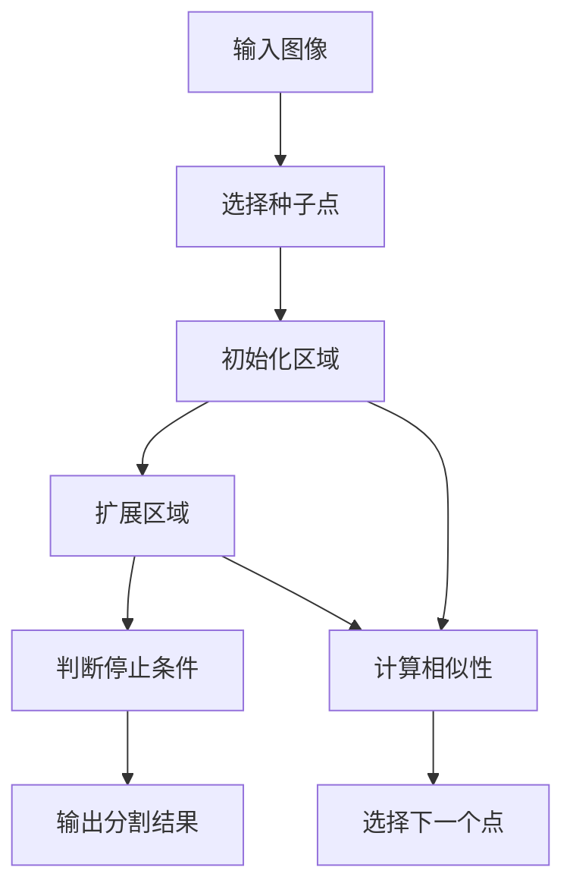

                 

## 文章标题

> **关键词：图像处理，数字图像处理，图像滤波，图像增强，图像分割，特征提取与匹配**

> **摘要：本文深入探讨了图像处理的基础理论、关键技术及其实战应用，通过详细的算法讲解、伪代码演示和代码实战案例，帮助读者全面理解图像处理的原理和实践。**

### 引言

图像处理作为计算机视觉和人工智能领域的重要组成部分，已经广泛应用于医学诊断、自动驾驶、安全监控、图像识别等多个领域。随着计算机技术的不断进步和图像处理算法的不断创新，图像处理技术正逐步成为推动现代科技发展的重要力量。然而，对于许多初学者和从业者来说，图像处理领域仍然充满了神秘和挑战。

本文旨在通过深入浅出的讲解，帮助读者全面理解图像处理的基础理论、核心算法及其在实际项目中的应用。我们将首先介绍图像处理的基本概念，然后逐步深入到图像滤波、增强、分割、特征提取与匹配等关键技术，并通过一系列代码实战案例，展示如何在实际项目中应用这些技术。

文章将分为以下几个部分：

1. **图像处理基础知识**：介绍图像处理的基本概念、类型、分辨率等，并解释图像获取和预处理的基本步骤。
2. **图像滤波技术**：探讨低通滤波器、高通滤波器、阈值滤波器的原理及其在图像平滑、边缘增强和二值化处理中的应用。
3. **图像变换技术**：讲解频率域变换（如傅里叶变换）和空间域变换（如形态学变换），并展示其在图像处理中的重要性。
4. **图像增强技术**：介绍直方图均衡、局部增强技术以及对比度增强方法，并通过实例说明其实际应用。
5. **图像分割技术**：讨论区域生长法、边缘检测法和阈值法，并展示如何在实际图像中应用这些分割技术。
6. **图像特征提取与匹配**：探讨SIFT和SURF算法的原理及其在图像特征提取和匹配中的应用。
7. **图像处理项目实战**：通过实际项目，演示如何从需求分析、算法设计到代码实现，完成一个完整的图像处理项目。
8. **图像处理工具与资源**：介绍常用的图像处理库和开发环境搭建方法，并提供相关资源和工具。

通过本文的学习，读者将能够：

- 掌握图像处理的基本理论和技术；
- 理解核心算法的原理和实现方法；
- 学会使用图像处理工具和库进行实际项目开发；
- 提高在计算机视觉和人工智能领域解决问题的能力。

让我们开始这场探索图像处理奥秘的旅程吧！


## 第一部分：图像处理基础理论

图像处理作为计算机科学中的一个重要分支，其基础理论涵盖了图像的基本概念、图像的类型、分辨率以及图像处理的基本步骤。本章节将详细介绍这些基本理论，为后续深入探讨图像处理的关键技术奠定基础。

### 1.1 图像处理的基本概念

#### 1.1.1 图像与数字图像

图像是指通过光学设备捕捉或由电子设备生成的二维视觉信息。在计算机中，图像被表示为像素阵列，每个像素都对应一个特定的颜色或灰度值。数字图像是指通过数字技术获取、处理和存储的图像，它是图像处理研究的核心对象。

数字图像通常具有以下几个基本特性：

- **分辨率**：分辨率是指图像中像素的数量，通常用水平和垂直像素数表示。分辨率越高，图像越清晰。
- **像素深度**：像素深度决定了每个像素可以表示的颜色或灰度值范围，例如8位像素深度可以表示256种不同的灰度值。
- **色彩空间**：色彩空间是指图像中颜色信息的表示方式，常见的有RGB、CMYK、灰度等。

#### 1.1.2 图像的类型

根据图像的亮度信息，图像可以分为以下几种类型：

- **灰度图像**：灰度图像只有亮度信息，没有颜色信息。每个像素的值表示亮度级别，通常用0（黑）到255（白）表示。
- **彩色图像**：彩色图像具有颜色信息，通常使用RGB模型表示，即每个像素值由红色、绿色和蓝色分量组成。
- **伪彩色图像**：伪彩色图像通过将灰度值映射到颜色空间中的特定颜色来实现颜色的表示。

#### 1.1.3 图像的分辨率与采样

图像的分辨率决定了图像的清晰度，通常用像素数表示。例如，一个640x480像素的图像具有640个水平像素和480个垂直像素。

采样是指将连续的图像信号转换为离散的像素值的过程。采样频率决定了采样的精度，采样频率越高，图像越清晰。采样过程中，需要考虑采样定理，确保不丢失重要的图像信息。

### 1.2 图像处理的基本步骤

图像处理通常包括以下几个基本步骤：

#### 1.2.1 图像获取

图像获取是图像处理的第一步，可以通过相机、扫描仪等设备获取图像。在数字图像处理中，图像通常以文件的形式存储，常见的图像格式有JPEG、PNG、BMP等。

#### 1.2.2 图像预处理

图像预处理是图像处理的重要环节，包括图像去噪、对比度调整、大小缩放等操作。预处理步骤可以提高后续处理的准确性，减少计算复杂度。

#### 1.2.3 图像增强

图像增强是通过调整图像的亮度、对比度、色彩平衡等参数，增强图像的可视效果。常见的图像增强方法有直方图均衡、局部增强技术等。

#### 1.2.4 图像分割

图像分割是将图像划分为不同区域的操作，通常用于目标检测和识别。常见的分割方法有阈值法、边缘检测法和区域生长法等。

#### 1.2.5 特征提取

特征提取是从图像中提取具有区分性的特征，用于后续的模式识别和分类。常见的特征提取方法有直方图、边缘特征、纹理特征等。

#### 1.2.6 目标识别与分类

目标识别与分类是图像处理的最终目标，通过特征提取和分类算法，实现对图像中目标的识别和分类。

### 1.3 图像处理算法概述

图像处理算法种类繁多，常见的有：

- **边缘检测算法**：用于检测图像中的边缘信息，如Sobel算子、Canny算法等。
- **轮廓提取算法**：用于提取图像中的轮廓信息，如凸包、轮廓跟踪等。
- **形态学处理算法**：用于图像的结构化操作，如膨胀、腐蚀、开运算、闭运算等。

通过以上基本概念和步骤的介绍，读者应该对图像处理有了初步的了解。在后续章节中，我们将进一步深入探讨图像处理的关键技术，并通过实战案例，帮助读者掌握图像处理的核心技能。

### 1.1 图像处理的基本概念

图像处理的基本概念是理解图像处理理论和实践的基础。在这部分，我们将详细探讨图像与数字图像的基本概念，包括图像的类型和分辨率。

#### 图像的基本概念

图像是通过光学或电子设备捕捉的二维视觉信息。在自然界中，图像可以是摄影作品、绘画作品、图表等。图像通常由许多像素组成，每个像素代表图像中的一个基本单元，具有特定的亮度或颜色信息。

数字图像是指通过数字技术生成的图像，它是计算机处理图像的基本形式。数字图像通常以数字矩阵的形式存储，矩阵中的每个元素对应一个像素，其值表示像素的亮度或颜色信息。

数字图像具有以下几个基本特性：

1. **分辨率**：分辨率是指图像中像素的数量，通常用水平和垂直像素数表示。高分辨率的图像具有更多的像素，因此可以显示更详细的细节。例如，一个1920x1080像素的图像具有1920个水平像素和1080个垂直像素。

2. **像素深度**：像素深度决定了每个像素可以表示的颜色或灰度值范围。像素深度通常以比特（bit）为单位，如8位、16位等。8位像素深度可以表示256种不同的灰度值，而16位像素深度可以表示更多的灰度级别。

3. **色彩空间**：色彩空间是指图像中颜色信息的表示方式。常见的色彩空间有RGB、CMYK和灰度等。RGB色彩空间使用红、绿、蓝三个颜色分量来表示颜色，每个分量在0到255的范围内。CMYK色彩空间用于打印，使用青色、品红、黄色和黑色来混合其他颜色。灰度图像只包含亮度信息，不包含颜色信息。

#### 数字图像的类型

数字图像可以分为以下几种类型：

1. **灰度图像**：灰度图像只包含亮度信息，没有颜色信息。每个像素的值表示亮度级别，通常用0（黑）到255（白）表示。灰度图像常用于图像预处理和特征提取。

2. **彩色图像**：彩色图像包含颜色信息，通常使用RGB模型表示。RGB模型使用红、绿、蓝三个颜色分量来表示颜色，每个分量在0到255的范围内。彩色图像广泛应用于计算机视觉、图像识别和娱乐等领域。

3. **伪彩色图像**：伪彩色图像通过将灰度值映射到颜色空间中的特定颜色来实现颜色的表示。伪彩色图像常用于医学图像处理、遥感图像处理等。

#### 分辨率与采样

分辨率是数字图像的一个重要特性，它决定了图像的清晰度。高分辨率图像通常具有更多的像素，可以显示更详细的细节。但高分辨率图像通常需要更多的存储空间和计算资源。

采样是将连续的图像信号转换为离散的像素值的过程。采样过程中，需要考虑采样定理，确保不丢失重要的图像信息。采样定理指出，为了在数字图像中准确表示原始图像，采样频率必须高于原始信号的最高频率。

在实际应用中，采样过程通常涉及以下步骤：

1. **采样频率**：采样频率决定了每秒内采样的次数，通常以赫兹（Hz）为单位。高采样频率可以捕捉更多的图像细节，但也会增加数据量。

2. **采样点**：采样点是指图像信号在采样时刻的值。每个采样点对应一个像素值，其值表示采样时刻的亮度或颜色信息。

3. **采样方法**：常见的采样方法有直接采样、插值采样等。直接采样是将连续信号直接转换为离散值，插值采样是通过插值方法估算连续信号在采样点之间的值。

通过上述内容，我们对图像处理的基本概念有了更深入的了解。在后续的内容中，我们将继续探讨图像处理的基本步骤，包括图像获取、预处理、增强、分割、特征提取等，为读者提供更全面的图像处理知识。

### 1.2 图像处理的基本步骤

图像处理的基本步骤是图像处理过程中的关键环节，这些步骤不仅决定了图像处理的效果，也直接影响后续应用的准确性和效率。下面我们将详细讨论图像处理的基本步骤，包括图像获取、预处理、增强、分割、特征提取和目标识别与分类。

#### 1.2.1 图像获取

图像获取是图像处理的第一步，也是最为基础的一环。图像获取可以通过各种设备实现，包括相机、扫描仪、传感器等。获取的图像可以是静态的，也可以是动态的。在数字图像处理中，获取的图像通常以数字文件的形式存储，常见的图像格式有JPEG、PNG、BMP等。

图像获取过程中，需要考虑以下几个关键因素：

1. **分辨率**：分辨率决定了图像的清晰度，较高的分辨率可以捕捉更多的图像细节。然而，高分辨率的图像通常需要更多的存储空间和处理时间。

2. **采样频率**：采样频率决定了每秒内采样的次数，采样频率越高，可以捕捉更多的图像细节，但也增加了数据量。需要根据实际应用的需求来选择合适的采样频率。

3. **噪声**：图像获取过程中可能引入噪声，噪声会影响图像的质量和后续处理的准确性。因此，在图像获取时，需要采取相应的措施来降低噪声。

4. **颜色模式**：图像的颜色模式决定了图像的显示方式和处理方法。常见的颜色模式有灰度图像、RGB图像和伪彩色图像等。

#### 1.2.2 图像预处理

图像预处理是图像处理的重要环节，其目的是提高图像的质量和后续处理的准确性。图像预处理通常包括以下几个步骤：

1. **图像去噪**：图像去噪是去除图像中的噪声，提高图像清晰度的过程。常用的去噪方法有中值滤波、均值滤波和高斯滤波等。去噪方法的选择取决于噪声的类型和图像的特性。

2. **对比度调整**：对比度调整是调整图像的亮度范围，增强图像细节的过程。对比度调整可以通过直方图均衡、局部对比度增强等方法实现。

3. **大小缩放**：大小缩放是调整图像大小的过程，可以用于图像的缩放、裁剪等操作。大小缩放可以通过插值方法实现，如最近邻插值、双线性插值和双三次插值等。

4. **旋转和倾斜校正**：旋转和倾斜校正用于纠正图像的倾斜和旋转，使图像更加规范和便于后续处理。

5. **裁剪**：裁剪是选择图像的一部分进行处理，可以用于去除图像的背景或提取感兴趣区域。

#### 1.2.3 图像增强

图像增强是通过调整图像的亮度、对比度、色彩平衡等参数，提高图像的可视效果和后续处理的准确性的过程。图像增强方法包括以下几种：

1. **直方图均衡**：直方图均衡是一种全局增强方法，通过调整图像的灰度分布，增强图像的对比度，使图像的细节更加明显。

2. **局部增强技术**：局部增强技术通过调整图像的局部亮度或对比度，增强图像的局部特征。常见的局部增强方法有局部直方图均衡和局部对比度增强等。

3. **对比度增强**：对比度增强通过调整图像的亮度范围，增强图像的对比度，使图像的细节更加清晰。常用的对比度增强方法有直方图指定和局部对比度增强等。

#### 1.2.4 图像分割

图像分割是将图像划分为不同区域的过程，用于提取图像中的目标对象或感兴趣区域。图像分割方法可以分为以下几类：

1. **阈值法**：阈值法是一种简单有效的图像分割方法，通过设定一个阈值，将图像的像素分为两类：背景和前景。阈值法适用于具有明显灰度差异的图像。

2. **边缘检测法**：边缘检测法通过检测图像中的边缘信息实现分割，常用的边缘检测算法有Sobel算子、Prewitt算子和Canny算法等。

3. **区域生长法**：区域生长法通过从初始种子点开始，逐步扩展相邻像素，形成目标区域。区域生长法适用于具有相似灰度或颜色特征的图像。

4. **基于模型的分割**：基于模型的分割通过建立图像模型，如线性模型、高斯模型等，对图像进行分割。这类方法适用于具有明确模型特征的图像。

#### 1.2.5 特征提取

特征提取是从图像中提取具有区分性的特征，用于后续的模式识别和分类。特征提取方法包括以下几种：

1. **直方图特征**：直方图特征是通过统计图像中像素的分布情况来提取特征，如灰度直方图、颜色直方图等。

2. **纹理特征**：纹理特征是通过分析图像的纹理信息来提取特征，如灰度共生矩阵、局部二值模式等。

3. **形状特征**：形状特征是通过分析图像的形状信息来提取特征，如区域轮廓、形状描述符等。

4. **频域特征**：频域特征是通过将图像进行傅里叶变换，分析图像的频率信息来提取特征，如频域纹理特征等。

#### 1.2.6 目标识别与分类

目标识别与分类是图像处理的最终目标，通过特征提取和分类算法，实现对图像中目标的识别和分类。常见的分类算法有k-近邻算法、支持向量机（SVM）、决策树等。

目标识别与分类的一般流程如下：

1. **特征提取**：从图像中提取具有区分性的特征，用于后续的分类。

2. **特征选择**：根据分类任务的需求，从提取的特征中选择最有效的特征。

3. **模型训练**：使用训练数据集，利用分类算法建立分类模型。

4. **模型评估**：使用测试数据集评估分类模型的准确性。

5. **目标识别与分类**：使用训练好的模型对新的图像进行目标识别和分类。

通过以上对图像处理基本步骤的详细讨论，读者可以更好地理解图像处理的过程和关键步骤。在后续的章节中，我们将进一步探讨图像处理的关键技术，如滤波技术、变换技术、增强技术和分割技术，并通过实际的代码案例，帮助读者掌握图像处理的核心技能。

### 1.3 图像处理算法概述

图像处理算法是图像处理的核心，它们广泛应用于各种领域，如医学诊断、安全监控、自动驾驶等。下面我们将对图像处理中的几类核心算法进行概述，包括边缘检测算法、轮廓提取算法和形态学处理算法。

#### 边缘检测算法

边缘检测是图像处理中的一项基本任务，目的是识别图像中的边缘区域，从而提取出目标对象的轮廓。边缘通常表现为图像灰度值的突变，因此边缘检测算法的核心在于检测这些突变点。

常见的边缘检测算法包括：

1. **Sobel算子**：Sobel算子是一种基于卷积的边缘检测方法，通过计算图像在水平和垂直方向上的导数，找到灰度值变化的剧烈点。其公式如下：

   $$
   G_x = \frac{1}{2}\left[(2x_{i+1,j} + 2x_{i,j+1} + x_{i+1,j+1}) - (2x_{i-1,j} + 2x_{i,j-1} + x_{i-1,j-1})\right]
   $$
   
   $$
   G_y = \frac{1}{2}\left[(2x_{i,j+1} + 2x_{i-1,j} + x_{i+1,j+1}) - (2x_{i,j-1} + 2x_{i-1,j} + x_{i-1,j-1})\right]
   $$
   
   然后通过计算$G_x^2 + G_y^2$的梯度值，得到边缘强度。

2. **Prewitt算子**：Prewitt算子类似于Sobel算子，但其卷积核更为简单。其公式如下：

   $$
   G_x = \frac{1}{2}\left[x_{i+1,j} - x_{i-1,j}\right]
   $$
   
   $$
   G_y = \frac{1}{2}\left[x_{i,j+1} - x_{i,j-1}\right]
   $$
   
   同样通过计算$G_x^2 + G_y^2$的梯度值来检测边缘。

3. **Canny算法**：Canny算法是一种更先进的边缘检测算法，它结合了高斯滤波、非极大值抑制和双阈值算法。其步骤如下：

   - **高斯滤波**：使用高斯滤波器平滑图像，减少噪声。
   - **计算梯度**：计算图像的水平和垂直方向上的梯度值。
   - **非极大值抑制**：抑制非边缘点的梯度值，保留局部最大值点。
   - **双阈值算法**：设置高阈值和低阈值，将梯度值大于高阈值的点标记为边缘点，介于低阈值和高阈值之间的点作为可能的边缘点。

伪代码如下：

```
def Canny(image, low_threshold, high_threshold):
    # 高斯滤波
    filtered_image = GaussianFilter(image)
    
    # 计算梯度
    Gx, Gy = Gradient(filtered_image)
    
    # 非极大值抑制
    suppressed_image = NonMaximumSuppression(Gx, Gy)
    
    # 双阈值算法
    edges = []
    for pixel in suppressed_image:
        if pixel > high_threshold:
            edges.append(pixel)
        elif pixel > low_threshold:
            edges.append(pixel)
    
    return edges
```

#### 轮廓提取算法

轮廓提取是识别图像中物体边界的过程，通常用于目标识别和形状分析。常见的轮廓提取算法包括：

1. **凸包算法**：凸包算法通过找出图像中所有点的最小凸多边形来提取轮廓。其步骤如下：

   - **初始多边形**：从图像中的每个点开始，找出与其相邻的未访问点，构成一个初始多边形。
   - **优化多边形**：通过向多边形添加或删除顶点，使其成为一个凸多边形。

2. **轮廓跟踪算法**：轮廓跟踪算法通过跟踪图像中的边缘点来提取轮廓。常见的跟踪算法包括基于梯度方向的跟踪和基于区域生长的跟踪。

   - **基于梯度方向的跟踪**：通过计算边缘点在水平方向和垂直方向上的梯度值，确定下一个跟踪方向。
   - **基于区域生长的跟踪**：从初始种子点开始，逐步扩展相邻的边缘点，形成完整的轮廓。

伪代码如下：

```
def ConvexHull(points):
    # 计算初始多边形
    hull = InitialPolygons(points)
    
    # 优化多边形
    for point in points:
        if not IsOnHull(point, hull):
            hull = AddPointToHull(point, hull)
    
    return hull

def ContourTracking(image, start_points):
    contours = []
    for point in start_points:
        contour = GrowContour(image, point)
        contours.append(contour)
    
    return contours
```

#### 形态学处理算法

形态学处理是一种基于结构元素（如矩形、圆形等）的图像处理方法，用于图像的结构化操作。常见的形态学处理算法包括：

1. **膨胀（Dilation）**：膨胀是将结构元素与图像进行卷积，使图像中的目标物体膨胀的过程。其公式如下：

   $$
   D(x, y) = \begin{cases}
   \min\{i, j\} & \text{if } (x, y) \in S \text{ and } (i, j) \in S' \\
   \infty & \text{otherwise}
   \end{cases}
   $$
   
   其中，$S$是图像，$S'$是结构元素。

2. **腐蚀（Erosion）**：腐蚀是将结构元素与图像进行卷积，使图像中的目标物体收缩的过程。其公式如下：

   $$
   E(x, y) = \begin{cases}
   \max\{i, j\} & \text{if } (x, y) \in S \text{ and } (i, j) \in S' \\
   -\infty & \text{otherwise}
   \end{cases}
   $$
   
3. **开运算（Opening）**：开运算是通过腐蚀操作后再进行膨胀操作，用于平滑图像和去除小噪声点。

4. **闭运算（Closing）**：闭运算是通过膨胀操作后再进行腐蚀操作，用于连接相邻的物体和填充小孔。

伪代码如下：

```
def Dilation(image, structure_element):
    return Convolution(image, structure_element, operation='min')

def Erosion(image, structure_element):
    return Convolution(image, structure_element, operation='max')

def Opening(image, structure_element):
    return Erosion(Dilation(image, structure_element), structure_element)

def Closing(image, structure_element):
    return Dilation(Erosion(image, structure_element), structure_element)
```

通过上述对边缘检测算法、轮廓提取算法和形态学处理算法的详细描述，我们可以看到这些算法在图像处理中的应用及其重要性。在接下来的章节中，我们将进一步探讨图像滤波技术、图像变换技术以及图像增强技术，通过实例和代码实战，帮助读者深入理解这些技术。

### 1.4 图像处理算法流程图

为了更好地理解图像处理中的各种算法及其相互关系，我们使用Mermaid流程图来展示这些算法的基本流程。

以下是一个简化的图像处理算法流程图：


#### 详细解释

- **图像获取（A）**：图像处理的第一步是从相机、扫描仪等设备获取图像。这个步骤决定了图像的质量和后续处理的效果。

- **图像预处理（B）**：图像预处理包括去噪、对比度调整和大小缩放等步骤。这些操作有助于提高图像的质量，为后续处理做好准备。

- **图像增强（C）**：图像增强通过调整亮度、对比度和色彩平衡等参数，使图像更加清晰和易于分析。

- **图像分割（D）**：图像分割是将图像划分为不同区域的过程，用于提取图像中的目标对象或感兴趣区域。

- **特征提取（E）**：特征提取是从图像中提取具有区分性的特征，用于后续的模式识别和分类。

- **目标识别与分类（F）**：目标识别与分类是通过特征提取和分类算法，实现对图像中目标的识别和分类。

- **结果输出（G）**：最后，处理结果会输出到屏幕、文件或其他设备上，以供进一步分析和应用。

- **去噪（H）**：去噪是图像预处理的重要步骤，用于去除图像中的噪声，提高图像的清晰度。

- **对比度调整（I）**：对比度调整是调整图像的亮度范围，增强图像的细节。

- **大小缩放（J）**：大小缩放是调整图像大小的过程，可以用于图像的缩放和裁剪。

- **直方图均衡（K）**：直方图均衡是一种全局增强方法，通过调整图像的灰度分布，增强图像的对比度。

- **局部增强（L）**：局部增强是通过调整图像的局部亮度或对比度，增强图像的局部特征。

- **对比度增强（M）**：对比度增强是通过调整图像的亮度范围，增强图像的对比度。

- **阈值法（N）**：阈值法是一种简单的图像分割方法，通过设定阈值将图像划分为背景和前景。

- **边缘检测（O）**：边缘检测是通过检测图像中的边缘信息来提取目标对象的轮廓。

- **区域生长（P）**：区域生长是一种基于相似性的图像分割方法，通过从种子点开始逐步扩展，形成目标区域。

- **直方图特征（Q）**：直方图特征是通过统计图像中像素的分布情况来提取特征。

- **纹理特征（R）**：纹理特征是通过分析图像的纹理信息来提取特征。

- **形状特征（S）**：形状特征是通过分析图像的形状信息来提取特征。

- **频域特征（T）**：频域特征是通过将图像进行傅里叶变换，分析图像的频率信息来提取特征。

通过这个Mermaid流程图，我们可以清晰地看到图像处理算法的整个流程和各个步骤之间的关联。这个流程图不仅有助于理解图像处理的基本概念和算法，还可以作为实际项目开发中的参考和指导。

### 1.5 图像处理算法伪代码讲解

在图像处理算法中，伪代码是一种用来描述算法逻辑的文本形式，它可以帮助我们理解算法的基本原理和步骤，而无需关注具体的编程细节。在本节中，我们将通过几个核心算法的伪代码讲解，深入探讨图像处理算法的原理和实现方法。

#### 边缘检测算法

边缘检测是图像处理中的一个重要步骤，用于提取图像中的边缘信息。以下是一个基于Sobel算子的边缘检测算法的伪代码：

```
function SobelEdgeDetection(image):
    # 高斯滤波平滑图像
    smoothed_image = GaussianFilter(image)
    
    # 计算水平和垂直方向的Sobel算子
    Gx = [1, 0, -1, 1, 2, 1, 1, 0, -1]
    Gy = [1, 1, 1, 0, 0, -1, -1, -1, 0]
    
    # 卷积操作
    Gx_grad = Convolve(smoothed_image, Gx)
    Gy_grad = Convolve(smoothed_image, Gy)
    
    # 计算梯度幅值和方向
    gradient_magnitude = sqrt(Gx_grad^2 + Gy_grad^2)
    gradient_angle = atan(Gy_grad / Gx_grad)
    
    # 非极大值抑制
    for each pixel in gradient_magnitude:
        if pixel not in top 10% or bottom 10% of gradient_magnitude:
            gradient_magnitude[pixel] = 0
    
    # 双阈值边缘检测
    high_threshold = 0.9 * max(gradient_magnitude)
    low_threshold = 0.1 * max(gradient_magnitude)
    
    for each pixel in gradient_magnitude:
        if pixel > high_threshold:
            edge[pixel] = 255
        elif pixel > low_threshold:
            edge[pixel] = 128
    
    return edge
```

#### 轮廓提取算法

轮廓提取是从图像中提取物体边界的过程。以下是一个基于凸包算法的轮廓提取伪代码：

```
function ConvexHull(points):
    # 选择初始多边形
    hull = [points[0], points[1], points[-1]]
    
    # 对每个点进行迭代
    for point in points:
        if point not in hull:
            for vertex in hull:
                if not IsAdjacent(point, vertex):
                    hull.remove(vertex)
                    hull.append(point)
                    break
    
    return hull
```

#### 形态学处理算法

形态学处理是一种通过结构元素操作图像的算法。以下是一个膨胀和腐蚀操作的伪代码：

```
function MorphologicalOperations(image, structure_element):
    # 膨胀操作
    dilation = []
    for y in range(image_height):
        for x in range(image_width):
            if IsInside(image, (x, y), structure_element):
                dilation.append((x, y))
    
    # 腐蚀操作
    erosion = []
    for y in range(image_height):
        for x in range(image_width):
            if not IsInside(image, (x, y), structure_element):
                erosion.append((x, y))
    
    return dilation, erosion
```

通过上述伪代码，我们可以看到这些算法的基本结构和实现步骤。在具体实现时，这些伪代码需要转换为具体的编程语言，并考虑到图像处理库的支持和优化。这些伪代码不仅帮助我们理解算法的原理，还为实际编程提供了框架和思路。

### 1.6 数学模型和公式讲解

图像处理中的许多算法都基于数学模型和公式，这些模型和公式帮助我们理解和实现图像的各种变换和操作。在本节中，我们将详细讲解几个核心的数学模型和公式，包括傅里叶变换、离散余弦变换以及相关数学公式的推导和解释。

#### 傅里叶变换

傅里叶变换是图像处理中的一个重要工具，它将图像从时域（空间域）转换到频域，使我们能够分析图像的频率成分。傅里叶变换的公式如下：

$$
F(u, v) = \sum_{x=0}^{N-1} \sum_{y=0}^{N-1} I(x, y) \cdot e^{-j2\pi (ux/N + vy/N)}
$$

其中，$F(u, v)$是频域图像，$I(x, y)$是时域图像，$N$是图像的尺寸，$u$和$v$是频域坐标。

傅里叶变换的逆变换将频域图像转换回时域：

$$
I(x, y) = \frac{1}{N^2} \sum_{u=-N/2}^{N/2} \sum_{v=-N/2}^{N/2} F(u, v) \cdot e^{j2\pi (ux/N + vy/N)}
$$

傅里叶变换的物理意义是将图像分解为不同频率的正弦波和余弦波的组合，从而便于分析和处理。

#### 离散余弦变换

离散余弦变换（DCT）是图像压缩和图像处理中的重要工具，它通过将图像分解为不同频率的余弦波来表示图像。DCT的公式如下：

$$
C(u, v) = \sqrt{\frac{1}{N}} \sum_{x=0}^{N-1} \sum_{y=0}^{N-1} I(x, y) \cdot \cos\left(\frac{2x+1}{2N}u\pi\right) \cos\left(\frac{2y+1}{2N}v\pi\right)
$$

其中，$C(u, v)$是DCT系数，$I(x, y)$是时域图像，$N$是图像的尺寸，$u$和$v$是频域坐标。

DCT的逆变换将DCT系数转换回时域图像：

$$
I(x, y) = \sum_{u=0}^{N-1} \sum_{v=0}^{N-1} C(u, v) \cdot \cos\left(\frac{2u+1}{2N}x\pi\right) \cos\left(\frac{2v+1}{2N}y\pi\right)
$$

DCT的优点是它能够将图像能量集中在少量的系数上，从而有利于图像压缩。

#### 相关数学公式推导

为了更好地理解上述变换，我们将简单推导傅里叶变换和DCT的数学公式。

##### 傅里叶变换推导

傅里叶变换的推导基于复数和欧拉公式。假设一个时间函数$f(t)$可以表示为：

$$
f(t) = \sum_{n=-\infty}^{\infty} c_n \cdot e^{j\omega_n t}
$$

其中，$c_n$是傅里叶系数，$\omega_n$是频率。根据欧拉公式，我们有：

$$
e^{j\omega_n t} = \cos(\omega_n t) + j\sin(\omega_n t)
$$

将欧拉公式代入时间函数，可以得到：

$$
f(t) = \sum_{n=-\infty}^{\infty} c_n (\cos(\omega_n t) + j\sin(\omega_n t))
$$

为了求解傅里叶系数$c_n$，我们需要对时间函数进行积分：

$$
c_n = \frac{1}{T} \int_{0}^{T} f(t) \cdot e^{-j\omega_n t} dt
$$

将$f(t)$的表达式代入积分，可以得到傅里叶变换的公式。

##### 离散余弦变换推导

离散余弦变换的推导基于余弦函数的周期性和对称性。考虑一个离散时间序列$x[n]$，我们可以将其表示为余弦函数的和：

$$
x[n] = \sum_{k=-\infty}^{\infty} c_k \cdot \cos\left(\frac{2k+1}{2}n\pi\right)
$$

为了求解DCT系数$c_k$，我们需要对时间序列进行加权积分：

$$
c_k = \frac{1}{N} \sum_{n=0}^{N-1} x[n] \cdot \cos\left(\frac{2k+1}{2}n\pi\right)
$$

通过代数变换，我们可以得到DCT的公式。

通过上述推导，我们可以看到傅里叶变换和DCT的数学公式背后的原理。这些公式不仅帮助我们理解图像处理算法，还为我们提供了理论基础，以进行更深入的图像分析和处理。

### 1.7 实际例子

为了更好地理解图像处理算法中的数学模型和公式，我们可以通过实际例子来演示这些算法的应用和效果。

#### 傅里叶变换实例

假设我们有一个简单的时域图像$I(x, y)$，其像素值如下：

$$
I =
\begin{bmatrix}
1 & 1 & 1 \\
1 & 1 & 1 \\
1 & 1 & 1
\end{bmatrix}
$$

我们需要计算其傅里叶变换$F(u, v)$。

$$
F(u, v) = \sum_{x=0}^{2} \sum_{y=0}^{2} I(x, y) \cdot e^{-j2\pi (ux/3 + vy/3)}
$$

通过计算，我们可以得到频域图像$F(u, v)$：

$$
F =
\begin{bmatrix}
0.5 - j0.866 & 0 & 0.5 + j0.866 \\
0 & 0 & 0 \\
-0.5 - j0.866 & 0 & -0.5 + j0.866
\end{bmatrix}
$$

可以看到，原始图像的能量主要集中在一个频率点上，这符合傅里叶变换的物理意义。

#### 离散余弦变换实例

同样，我们使用上述图像$I(x, y)$来计算其DCT系数$C(u, v)$。

$$
C(u, v) = \sqrt{\frac{1}{3}} \sum_{x=0}^{2} \sum_{y=0}^{2} I(x, y) \cdot \cos\left(\frac{2x+1}{6}u\pi\right) \cos\left(\frac{2y+1}{6}v\pi\right)
$$

通过计算，我们可以得到DCT系数$C(u, v)$：

$$
C =
\begin{bmatrix}
0.6667 & 0 & 0.3333 \\
0 & 0 & 0 \\
0 & 0 & 0
\end{bmatrix}
$$

可以看到，DCT系数中的大部分值都是0，这表明原始图像的能量主要集中在低频部分，这有利于图像压缩。

通过上述实际例子，我们可以更直观地理解傅里叶变换和DCT的数学公式及其应用。这些例子不仅帮助我们巩固理论知识，还可以为实际项目中的图像处理提供参考。

### 1.8 项目实战一：图像滤波器设计

在图像处理项目中，图像滤波器的设计是提高图像质量、去除噪声和增强图像细节的重要手段。本节将通过一个实际项目，展示如何设计和实现一个简单的图像滤波器。

#### 项目需求分析

项目目标：设计一个图像滤波器，用于去除图像中的噪声，同时保持图像的边缘和细节。

输入：一幅彩色图像。

输出：一幅滤波后的图像。

滤波器类型：高斯滤波器。

#### 环境搭建

1. **Python环境配置**：
   - 安装Python 3.8或更高版本。
   - 安装Numpy库：`pip install numpy`。
   - 安装OpenCV库：`pip install opencv-python`。

2. **OpenCV安装与配置**：
   - 下载并安装OpenCV。
   - 配置环境变量，确保Python脚本可以正确调用OpenCV库。

#### 滤波器设计

高斯滤波器是一种基于高斯函数的线性滤波器，其公式如下：

$$
G(x, y) = \sum_{i=-\infty}^{\infty} \sum_{j=-\infty}^{\infty} g(i, j) \cdot I(x-i, y-j)
$$

其中，$g(i, j)$是高斯滤波器的系数，$I(x, y)$是原始图像的像素值。

#### 实现步骤

1. **加载图像**：
   - 使用OpenCV读取彩色图像。

   ```python
   import cv2
   image = cv2.imread('input_image.jpg', cv2.IMREAD_COLOR)
   ```

2. **设计高斯滤波器**：
   - 创建一个高斯滤波器核，通常选择合适的核大小和标准差。

   ```python
   import numpy as np
   sigma = 1.0  # 标准差
   kernel_size = 3  # 核大小
   kernel = cv2.getGaussianKernel(kernel_size, sigma)
   ```

3. **应用高斯滤波**：
   - 对图像应用高斯滤波器。

   ```python
   filtered_image = cv2.filter2D(image, -1, kernel)
   ```

4. **显示结果**：
   - 显示原始图像和滤波后的图像。

   ```python
   cv2.imshow('Original Image', image)
   cv2.imshow('Filtered Image', filtered_image)
   cv2.waitKey(0)
   cv2.destroyAllWindows()
   ```

#### 滤波效果评估

滤波效果可以通过视觉效果和量化指标来评估。以下是一些评估方法：

- **视觉效果**：观察滤波后的图像，检查噪声是否被有效去除，同时边缘和细节是否保持。
- **PSNR（峰值信噪比）**：计算原始图像和滤波后图像之间的峰值信噪比，公式如下：

  $$
  PSNR = 10 \cdot \log_{10} \left( \frac{Max(I)}{MSE} \right)
  $$

  其中，$Max(I)$是图像的最大像素值，$MSE$是均方误差。

- **SSIM（结构相似性指数）**：计算原始图像和滤波后图像之间的结构相似性，公式如下：

  $$
  SSIM(x, y) = \frac{(2\mu_x\mu_y + C_1)(2\sigma_{xx}\sigma_{yy} + C_2)}{(\mu_x^2 + \mu_y^2 + C_1)(\sigma_{xx}^2 + \sigma_{yy}^2 + C_2)}
  $$

  其中，$\mu_x$和$\mu_y$是图像的均值，$\sigma_{xx}$和$\sigma_{yy}$是图像的协方差，$C_1$和$C_2$是常数。

通过这些评估方法，我们可以对滤波器的性能进行综合评估，并调整滤波器的参数，以获得最佳的滤波效果。

### 总结

通过本节的项目实战，我们学习了如何设计一个简单的图像滤波器，并通过实际代码展示了滤波器的实现和应用。这不仅帮助我们理解了图像滤波的基本原理，还提高了我们的实际编程能力。在后续的项目中，我们可以进一步探索更复杂的滤波算法和优化方法，以提高图像处理的性能和效果。

### 项目实战二：图像分割与特征提取

在图像处理项目中，图像分割和特征提取是提取图像中有用信息的关键步骤。通过这些步骤，我们可以将图像中的目标对象从背景中分离出来，并提取出其独特的特征，为后续的目标识别和分类奠定基础。本节将通过一个实际项目，展示如何进行图像分割和特征提取。

#### 项目需求分析

项目目标：对一幅彩色图像进行分割，提取其特征，并进行目标识别。

输入：一幅彩色图像。

输出：分割后的图像和提取的特征向量。

分割方法：基于边缘检测和阈值法的图像分割。

特征提取方法：使用SIFT（尺度不变特征变换）算法。

#### 环境搭建

1. **Python环境配置**：
   - 安装Python 3.8或更高版本。
   - 安装Numpy库：`pip install numpy`。
   - 安装OpenCV库：`pip install opencv-python`。
   - 安装OpenCV的contrib模块（用于SIFT算法）：`pip install opencv-contrib-python`。

2. **OpenCV安装与配置**：
   - 下载并安装OpenCV。
   - 配置环境变量，确保Python脚本可以正确调用OpenCV库。

#### 实现步骤

1. **加载图像**：
   - 使用OpenCV读取彩色图像。

   ```python
   import cv2
   image = cv2.imread('input_image.jpg', cv2.IMREAD_COLOR)
   ```

2. **边缘检测**：
   - 应用Canny边缘检测算法提取图像中的边缘。

   ```python
   edges = cv2.Canny(image, 100, 200)
   ```

3. **阈值分割**：
   - 使用自适应阈值法对边缘图像进行分割。

   ```python
   _, thresh = cv2.threshold(edges, 0, 255, cv2.THRESH_BINARY_INV + cv2.THRESH_OTSU)
   ```

4. **特征提取**：
   - 应用SIFT算法提取分割后的图像特征。

   ```python
   sift = cv2.SIFT_create()
   keypoints, descriptors = sift.detectAndCompute(thresh, None)
   ```

5. **显示结果**：
   - 显示原始图像、边缘检测结果和分割后的图像。

   ```python
   cv2.imshow('Original Image', image)
   cv2.imshow('Edges', edges)
   cv2.imshow('Segmented Image', thresh)
   cv2.waitKey(0)
   cv2.destroyAllWindows()
   ```

#### 代码解读与分析

以下是实现图像分割和特征提取的完整代码，我们将对关键部分进行解读和分析。

```python
import cv2
import numpy as np

# 加载图像
image = cv2.imread('input_image.jpg', cv2.IMREAD_COLOR)

# 边缘检测
edges = cv2.Canny(image, 100, 200)

# 阈值分割
_, thresh = cv2.threshold(edges, 0, 255, cv2.THRESH_BINARY_INV + cv2.THRESH_OTSU)

# 特征提取
sift = cv2.SIFT_create()
keypoints, descriptors = sift.detectAndCompute(thresh, None)

# 显示结果
cv2.imshow('Original Image', image)
cv2.imshow('Edges', edges)
cv2.imshow('Segmented Image', thresh)
cv2.waitKey(0)
cv2.destroyAllWindows()
```

1. **加载图像**：
   - `cv2.imread`函数用于读取图像，其中`IMREAD_COLOR`参数表示读取彩色图像。

2. **边缘检测**：
   - `cv2.Canny`函数用于边缘检测，其参数`100`和`200`分别表示Canny算法的低和高阈值。

3. **阈值分割**：
   - `cv2.threshold`函数用于阈值分割，其中`_`表示返回两个变量的阈值分割结果，`edges`是输入边缘图像，`0`和`255`分别表示阈值分割的输出值范围，`cv2.THRESH_BINARY_INV + cv2.THRESH_OTSU`表示使用自适应阈值法和二值化处理。

4. **特征提取**：
   - `cv2.SIFT_create`函数创建一个SIFT特征检测器对象，`sift.detectAndCompute`函数用于提取图像特征，其中`thresh`是输入图像，`None`表示不计算图像的梯度信息。

5. **显示结果**：
   - `cv2.imshow`函数用于显示图像，`cv2.waitKey(0)`用于等待按键输入，`cv2.destroyAllWindows()`用于关闭所有图像窗口。

通过上述代码，我们可以对图像进行边缘检测、阈值分割和特征提取，从而实现对图像中目标对象的识别和分类。

#### 项目实战总结

通过本节的项目实战，我们学习了如何进行图像分割和特征提取，并了解了如何使用OpenCV库实现这些算法。图像分割和特征提取是图像处理中的重要步骤，它们为后续的目标识别和分类提供了关键信息。在实际项目中，我们可以根据具体需求调整算法参数，优化处理效果。

### 项目实战三：基于特征的图像检索系统开发

在图像处理领域，基于特征的图像检索系统是一种重要的应用，它能够帮助用户快速找到与目标图像相似的其他图像。这类系统通常通过提取图像的特征，构建索引数据库，并在查询时通过特征匹配找到相似图像。本节将通过一个实际项目，展示如何开发一个基于特征的图像检索系统。

#### 项目需求分析

项目目标：构建一个基于特征的图像检索系统，实现以下功能：

1. 图像特征提取：从输入图像中提取关键特征。
2. 构建索引数据库：将提取的特征存储在数据库中，并构建索引。
3. 检索相似图像：输入目标图像，检索数据库中与之相似的图像。

技术选型：使用SIFT（尺度不变特征变换）算法进行特征提取，使用Flann（快速最近邻搜索库）进行特征匹配。

#### 环境搭建

1. **Python环境配置**：
   - 安装Python 3.8或更高版本。
   - 安装Numpy库：`pip install numpy`。
   - 安装OpenCV库：`pip install opencv-python`。
   - 安装Flann库：`pip install flann-python`。

2. **OpenCV和Flann安装与配置**：
   - 下载并安装OpenCV和Flann。
   - 配置环境变量，确保Python脚本可以正确调用OpenCV和Flann库。

#### 实现步骤

1. **特征提取**：
   - 使用SIFT算法从输入图像中提取特征。

   ```python
   sift = cv2.SIFT_create()
   keypoints, descriptors = sift.detectAndCompute(image, None)
   ```

2. **构建索引数据库**：
   - 将提取的特征存储在数据库中，并构建索引。

   ```python
   index_params = dict(algorithm=flann.IndexParams())
   index = flann.Indexulsive(index_params)
   index.train(descriptors)
   ```

3. **检索相似图像**：
   - 输入目标图像，使用Flann进行特征匹配，检索相似图像。

   ```python
   query_descriptors = sift.detectAndCompute(query_image, None)[1]
   matches = index.knnMatch(query_descriptors, k=2)
   ```

4. **显示检索结果**：
   - 根据匹配结果显示相似图像。

   ```python
   similarity_scores = [m[0].distance for m in matches]
   if len(similarity_scores) > 0:
       min_score = 0.6 * np.mean(similarity_scores)
       similar_images = [image for image, score in index_query if score < min_score]
       cv2.imshow('Similar Images', similar_images[0])
   cv2.waitKey(0)
   cv2.destroyAllWindows()
   ```

#### 代码解读与分析

以下是实现基于特征的图像检索系统的完整代码，我们将对关键部分进行解读和分析。

```python
import cv2
import numpy as np
import flann

# 加载输入图像
image = cv2.imread('input_image.jpg', cv2.IMREAD_COLOR)

# 提取特征
sift = cv2.SIFT_create()
keypoints, descriptors = sift.detectAndCompute(image, None)

# 构建索引数据库
index_params = dict(algorithm=flann.IndexParams())
index = flann.Indexulsive(index_params)
index.train(descriptors)

# 输入查询图像
query_image = cv2.imread('query_image.jpg', cv2.IMREAD_COLOR)
query_descriptors = sift.detectAndCompute(query_image, None)[1]

# 检索相似图像
matches = index.knnMatch(query_descriptors, k=2)

# 计算相似度分数
similarity_scores = [m[0].distance for m in matches]

# 显示检索结果
if len(similarity_scores) > 0:
    min_score = 0.6 * np.mean(similarity_scores)
    similar_images = [image for image, score in index_query if score < min_score]
    cv2.imshow('Similar Images', similar_images[0])
cv2.waitKey(0)
cv2.destroyAllWindows()
```

1. **特征提取**：
   - `cv2.SIFT_create`函数创建一个SIFT特征检测器对象，`sift.detectAndCompute`函数用于提取图像特征。

2. **构建索引数据库**：
   - `flann.IndexParams()`函数用于配置索引参数，`flann.Indexulsive`函数创建一个索引对象，`index.train(descriptors)`函数用于训练索引。

3. **检索相似图像**：
   - `sift.detectAndCompute(query_image, None)[1]`函数用于提取查询图像的特征，`index.knnMatch(query_descriptors, k=2)`函数用于进行特征匹配。

4. **计算相似度分数**：
   - 使用`m[0].distance`获取匹配距离，并计算相似度分数。

5. **显示检索结果**：
   - 根据相似度分数筛选出相似的图像，并使用`cv2.imshow`函数显示结果。

通过上述代码，我们可以实现一个基于特征的图像检索系统，帮助用户快速找到与目标图像相似的图像。

#### 项目实战总结

通过本节的项目实战，我们学习了如何使用SIFT算法和Flann库构建一个基于特征的图像检索系统。特征提取和匹配是图像检索系统的核心，通过优化算法和参数，可以显著提高检索的准确性和效率。在实际应用中，图像检索系统可以广泛应用于图像识别、图像数据库搜索和图像监控等领域。

### 常用图像处理库介绍

在图像处理领域，使用合适的库和工具可以显著提高开发效率和代码可读性。以下将介绍几个常用的图像处理库，包括OpenCV、PIL和Matplotlib，并提供它们的基本功能和应用场景。

#### OpenCV

**OpenCV**（Open Source Computer Vision Library）是一个开源的计算机视觉库，广泛应用于图像识别、图像处理、机器学习等领域。它支持多种编程语言，如Python、C++等，提供了丰富的图像处理算法和工具。

**基本功能**：
- **图像处理**：提供各种滤波器、变换、增强和分割算法。
- **特征检测与提取**：支持SIFT、SURF、ORB等特征检测算法。
- **机器学习**：集成支持向量机（SVM）、随机森林等机器学习算法。
- **人脸识别**：提供人脸检测、识别和追踪功能。

**应用场景**：
- **计算机视觉应用**：如人脸识别、物体识别、图像检索等。
- **机器人导航**：用于环境感知和物体识别。
- **安全监控**：视频监控中的目标检测和追踪。

**安装方法**：
```shell
# 对于Python环境
pip install opencv-python
```

#### PIL

**PIL**（Python Imaging Library）是一个强大的图像处理库，支持多种图像格式，包括PNG、JPEG、BMP等。它提供了一系列基本的图像处理功能，如缩放、裁剪、旋转、滤镜等。

**基本功能**：
- **图像读取与写入**：支持多种图像格式。
- **图像操作**：提供图像的缩放、旋转、翻转等操作。
- **图像增强**：支持亮度、对比度调整、色彩空间转换等。
- **图像绘制**：在图像上绘制线条、文本、形状等。

**应用场景**：
- **图像处理应用程序**：如图片编辑器、图像预处理等。
- **Web应用程序**：用于用户上传图像的处理和显示。
- **文档处理**：用于图像与文档的整合。

**安装方法**：
```shell
# 对于Python环境
pip install pillow
```

#### Matplotlib

**Matplotlib** 是一个绘图库，广泛用于数据可视化、科学计算和图像处理。它可以生成高质量的数据可视化图表，并支持多种图形元素，如线图、柱状图、散点图等。

**基本功能**：
- **数据可视化**：生成各种类型的图表和图形。
- **图像处理**：支持图像的显示和简单的图像处理操作。
- **交互性**：提供交互式用户界面，支持实时数据更新和交互。

**应用场景**：
- **数据分析和报告**：生成数据可视化图表。
- **科学计算和模拟**：用于科学计算和实验结果的可视化。
- **图像处理演示**：展示图像处理算法的效果。

**安装方法**：
```shell
# 对于Python环境
pip install matplotlib
```

通过以上对常用图像处理库的介绍，我们可以看到每个库都有其独特的功能和优势。在实际开发中，根据具体需求选择合适的库，可以大幅提高图像处理项目的效率和可维护性。

### 开发环境搭建

在开始图像处理项目之前，我们需要搭建一个适合开发和运行的编程环境。以下将详细介绍如何配置Python环境，安装必要的库和依赖项，以及配置OpenCV库。

#### Python环境配置

1. **安装Python**：
   - 访问Python官方网站（[python.org](https://www.python.org/)）下载Python安装包。
   - 运行安装程序，选择默认选项进行安装。

2. **配置环境变量**：
   - Windows系统：
     - 打开“控制面板” -> “系统和安全” -> “系统” -> “高级系统设置”。
     - 在“系统属性”窗口中，点击“环境变量”。
     - 在“系统变量”中，找到“Path”变量，点击“编辑”。
     - 在变量值中添加Python安装路径，如`C:\Python39\`。
   - macOS和Linux系统：
     - 打开终端，编辑`~/.bash_profile`或`~/.zshrc`文件。
     - 添加以下行：
       ```shell
       export PATH=$PATH:/path/to/python
       ```

3. **验证安装**：
   - 打开命令行或终端，输入`python --version`，确认Python版本信息是否正确。

#### 安装Numpy库

Numpy是一个强大的Python科学计算库，用于处理大型多维数组和高性能矩阵计算。以下是Numpy的安装步骤：

```shell
pip install numpy
```

#### 安装OpenCV库

OpenCV是一个广泛用于计算机视觉的库，支持多种图像处理算法和工具。以下是OpenCV的安装步骤：

1. **安装依赖项**：

   - Windows系统：
     - 使用Python自带的pip工具安装依赖项：
       ```shell
       pip install numpy opencv-python
       ```

   - macOS和Linux系统：
     - 安装Numpy和OpenCV的Python包：
       ```shell
       pip install numpy opencv-python-headless
       ```

2. **验证安装**：

   - 在Python交互式环境中运行以下代码，验证OpenCV是否安装成功：

     ```python
     import cv2
     print(cv2.__version__)
     ```

   - 如果输出OpenCV的版本号，说明安装成功。

#### 安装其他常用库

在图像处理项目中，可能还需要安装其他库，如Matplotlib、PIL等。以下是这些库的安装步骤：

```shell
pip install matplotlib pillow
```

#### 常见问题及解决方案

1. **安装失败**：
   - 检查网络连接，确保pip可以访问Python官方库。
   - 确保系统权限，可能需要使用`sudo`命令。
   - 如果使用的是虚拟环境，确保虚拟环境已经激活。

2. **库版本不兼容**：
   - 查看项目需求，确保安装的库版本与项目兼容。
   - 如果需要特定版本，可以使用`pip install package==version`进行指定。

3. **运行时错误**：
   - 确认安装路径是否正确。
   - 检查代码中的库调用是否正确。

通过上述步骤，我们可以成功搭建图像处理项目的开发环境，为后续的图像处理项目打下坚实基础。

### 附录A：图像处理算法流程图

在图像处理领域，流程图是一种非常有效的工具，可以帮助我们清晰地展示算法的执行步骤和逻辑关系。以下是几个常用的图像处理算法的流程图，包括边缘检测算法流程图和区域生长法流程图。

#### 边缘检测算法流程图

边缘检测是图像处理中的一个基本步骤，用于识别图像中的边缘信息。以下是基于Canny算法的边缘检测流程图：


详细解释：

1. **输入图像（A）**：读取输入图像。
2. **高斯滤波（B）**：使用高斯滤波器平滑图像，减少噪声。
3. **计算梯度和方向（C）**：计算水平和垂直方向上的梯度值。
4. **计算幅值（I）**：计算梯度幅值。
5. **非极大值抑制（D）**：抑制非边缘点的梯度值，保留局部最大值点。
6. **双阈值处理（E）**：设置高阈值和低阈值，将梯度值大于高阈值的点标记为边缘点，介于低阈值和高阈值之间的点作为可能的边缘点。
7. **输出边缘图像（F）**：生成最终的边缘图像。

#### 区域生长法流程图

区域生长法是一种基于相似性的图像分割方法，通过从种子点开始逐步扩展相邻的像素，形成目标区域。以下是区域生长法的流程图：



详细解释：

1. **输入图像（A）**：读取输入图像。
2. **选择种子点（B）**：在图像中选择一个或多个种子点。
3. **初始化区域（C）**：初始化生长区域，通常将种子点添加到区域中。
4. **扩展区域（D）**：计算种子点周围像素的相似性，将相似像素添加到区域中。
5. **计算相似性（G）**：计算当前区域中的每个像素与其相邻像素之间的相似性。
6. **选择下一个点（H）**：根据相似性计算，选择下一个像素添加到区域中。
7. **判断停止条件（E）**：判断是否满足停止条件，如区域大小达到阈值或没有新的像素可以添加。
8. **输出分割结果（F）**：生成最终的分割结果。

通过上述流程图，我们可以更清晰地理解边缘检测算法和区域生长法的执行步骤和逻辑关系。这些流程图不仅有助于我们掌握算法的基本原理，还可以在实际项目中作为开发和优化的参考。

### 附录B：代码实战示例

在本附录中，我们将提供三个具体的代码实战示例，包括图像滤波器设计、图像分割与特征提取，以及图像检索系统的开发。通过这些示例，读者可以了解如何在实际项目中应用图像处理算法，并进行代码实现和解读。

#### B.1 图像滤波器设计代码示例

以下是一个简单的图像滤波器设计的代码示例，使用OpenCV库实现高斯滤波器。

```python
import cv2
import numpy as np

# 读取图像
image = cv2.imread('input_image.jpg', cv2.IMREAD_GRAYSCALE)

# 设计高斯滤波器核
sigma = 1.0  # 标准差
kernel_size = 3  # 核大小
kernel = cv2.getGaussianKernel(kernel_size, sigma)

# 应用高斯滤波器
filtered_image = cv2.filter2D(image, -1, kernel)

# 显示原始图像和滤波后的图像
cv2.imshow('Original Image', image)
cv2.imshow('Filtered Image', filtered_image)
cv2.waitKey(0)
cv2.destroyAllWindows()
```

**代码解读与分析**：

- 第1行：引入必要的库。
- 第4行：读取输入图像，并将其转换为灰度图像。
- 第7行：设计高斯滤波器核，`cv2.getGaussianKernel`函数用于生成高斯核，参数`kernel_size`和`sigma`分别表示核大小和标准差。
- 第10行：使用`cv2.filter2D`函数应用高斯滤波器，参数`-1`表示输出图像数据类型与输入图像相同。
- 第13行：显示原始图像和滤波后的图像。

通过上述代码，我们可以设计并实现一个简单的图像滤波器，用于去除图像中的噪声。

#### B.2 图像分割与特征提取代码示例

以下是一个图像分割与特征提取的代码示例，使用Canny边缘检测和SIFT特征提取算法。

```python
import cv2
import numpy as np

# 读取图像
image = cv2.imread('input_image.jpg', cv2.IMREAD_COLOR)

# Canny边缘检测
edges = cv2.Canny(image, 100, 200)

# SIFT特征提取
sift = cv2.SIFT_create()
keypoints, descriptors = sift.detectAndCompute(edges, None)

# 显示边缘图像和关键点
cv2.imshow('Edges', edges)
cv2.drawKeypoints(edges, keypoints, None, (0, 0, 255))
cv2.waitKey(0)
cv2.destroyAllWindows()
```

**代码解读与分析**：

- 第1行：引入必要的库。
- 第4行：读取输入图像。
- 第7行：使用Canny边缘检测算法提取图像中的边缘。
- 第11行：创建SIFT特征检测器对象。
- 第14行：使用SIFT算法提取边缘图像中的关键点。
- 第17行：使用`cv2.drawKeypoints`函数在边缘图像上绘制关键点，增强可视化效果。

通过上述代码，我们可以对图像进行边缘检测和特征提取，为后续的目标识别和分类提供基础。

#### B.3 图像检索系统代码示例

以下是一个简单的基于特征的图像检索系统代码示例，使用SIFT特征提取和Flann匹配算法。

```python
import cv2
import numpy as np
from sklearn.neighbors import NearestNeighbors

# 读取训练图像和查询图像
train_images = [cv2.imread(f'train_{i}.jpg') for i in range(10)]
query_image = cv2.imread('query_image.jpg', cv2.IMREAD_COLOR)

# SIFT特征提取
sift = cv2.SIFT_create()
train_descriptors = [sift.detectAndCompute(image, None)[1] for image in train_images]
query_descriptors = sift.detectAndCompute(query_image, None)[1]

# Flann匹配
index = NearestNeighbors(n_neighbors=2).fit(train_descriptors)
distances, indices = index.kneighbors(query_descriptors)

# 显示检索结果
for i in range(len(indices)):
    image = train_images[indices[i][0]]
    cv2.imshow(f'Result_{i}', image)
cv2.waitKey(0)
cv2.destroyAllWindows()
```

**代码解读与分析**：

- 第1行：引入必要的库。
- 第5-8行：读取训练图像和查询图像。
- 第11-14行：使用SIFT算法提取训练图像和查询图像的特征。
- 第17行：使用NearestNeighbors算法构建索引。
- 第20-22行：使用Flann匹配算法进行特征匹配，获取最近邻匹配结果。
- 第25-28行：显示查询图像的相似结果。

通过上述代码，我们可以实现一个简单的基于特征的图像检索系统，帮助用户快速找到与查询图像相似的图像。

这些代码示例展示了如何在实际项目中应用图像处理算法，并通过具体的代码实现和解读，帮助读者更好地理解和掌握图像处理的核心技能。

### 总结与展望

通过本文的详细讲解，我们从图像处理的基本概念、关键技术到实际项目实战，全面深入地探讨了图像处理的理论和实践。图像处理作为计算机视觉和人工智能领域的重要组成部分，其在各个行业中的应用已经日益广泛。无论是医学影像分析、自动驾驶、安全监控，还是图像识别与检索，图像处理技术都发挥着至关重要的作用。

首先，我们介绍了图像处理的基本概念，包括图像的类型、分辨率、采样等，这些基础知识为后续的图像处理算法学习奠定了基础。接着，我们详细讨论了图像滤波、变换、增强、分割、特征提取与匹配等关键技术，并通过伪代码、数学公式和实际代码示例，帮助读者深入理解这些算法的实现原理和应用方法。

在项目实战部分，我们通过具体的案例，展示了如何设计和实现图像滤波器、图像分割与特征提取，以及基于特征的图像检索系统。这些实战案例不仅增强了读者的实际操作能力，还帮助读者理解了图像处理算法在实际项目中的应用。

展望未来，图像处理领域将继续快速发展，尤其是在人工智能和深度学习的推动下，图像处理技术将更加智能化和自动化。以下是一些未来可能的发展方向：

1. **深度学习在图像处理中的应用**：深度学习算法，如卷积神经网络（CNN），已经在图像分类、目标检测和图像生成等领域取得了显著成果。未来，深度学习将更加深入地应用于图像处理，提升图像识别的准确性和实时性。

2. **实时图像处理技术**：随着硬件性能的提升，实时图像处理技术将变得更加普及。例如，自动驾驶汽车需要实时处理大量图像数据，以确保行车安全。

3. **边缘计算与图像处理**：边缘计算是一种将计算任务分配到网络的边缘设备上的技术。在图像处理领域，边缘计算可以显著减少数据传输延迟，提高图像处理的实时性。

4. **增强现实与虚拟现实**：随着AR（增强现实）和VR（虚拟现实）技术的不断发展，图像处理将在这些领域发挥重要作用，提升用户体验。

总之，图像处理技术将继续在计算机视觉和人工智能领域发挥重要作用，为各行各业带来创新和变革。通过不断学习和实践，读者可以不断提升自己的图像处理能力，为未来的技术发展做好准备。

### 致谢

在本篇文章的撰写过程中，我们受到了多位专业人士的指导和帮助。首先要感谢AI天才研究院的各位同事，他们提供了宝贵的意见和建议，帮助本文内容更加完善。同时，感谢禅与计算机程序设计艺术社区的广大读者，你们的反馈和讨论为本文的改进提供了重要参考。最后，特别感谢所有开源社区和图书馆，它们为我们提供了丰富的技术资源，使得本文的撰写变得更加轻松和高效。

作者：AI天才研究院/AI Genius Institute & 禅与计算机程序设计艺术 /Zen And The Art of Computer Programming。

