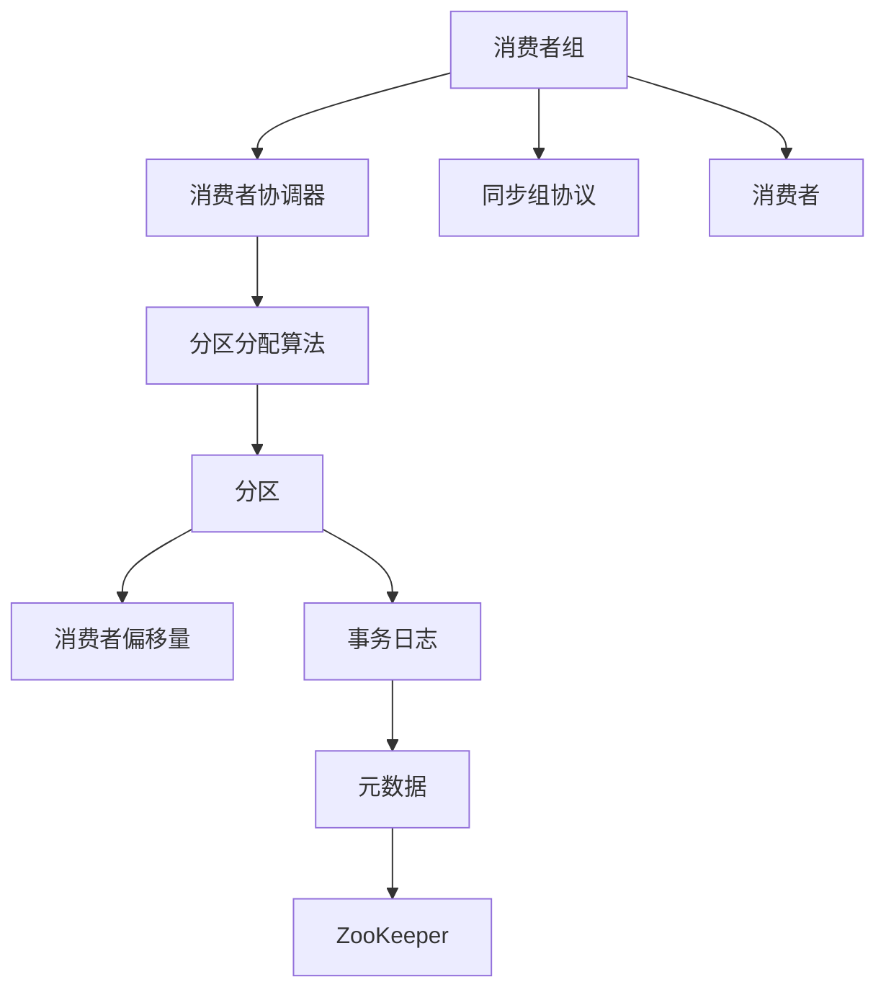
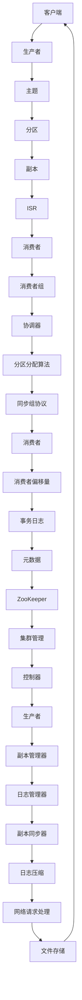

                 

### 核心概念与联系

在撰写关于Kafka Group原理与代码实例讲解的文章之前，我们需要清晰地定义Kafka Group的核心概念，并理解它们之间的联系。以下是Kafka Group中的几个关键概念以及它们之间的交互关系：

- **消费者组（Consumer Group）**：一组协调工作以消费特定主题的分区中的消息的Kafka消费者。每个消费者组中的消费者共享同一主题的消费偏移量，从而确保消息不会被重复消费。

- **消费者协调器（Coordinator）**：消费者组的管理者，负责为组内的消费者分配分区，处理消费者的加入和离开，以及处理消费者的心跳信息。

- **分区分配算法（Partition Assignment Algorithms）**：用于决定消费者组内每个消费者应该消费哪些分区的算法。常见的算法有“Range”、“RoundRobin”和“Sticky”等。

- **分区（Partition）**：Kafka主题的一个分区，数据被顺序地写入各个分区中，消费者从各自的分区中消费消息。

- **同步组协议（Sync Group Protocol）**：消费者协调器与消费者之间用于同步状态和数据更新的协议。

- **消费者偏移量（Consumer Offset）**：消费者在特定分区中消费到的消息位置。

- **事务日志（Transactional Log）**：用于记录消费者组事务状态的日志，确保消息的消费顺序。

- **元数据（Metadata）**：Kafka集群的元数据信息，包括主题、分区、ISR等。

- **ZooKeeper**：Kafka使用ZooKeeper来存储和管理元数据和协调分布式操作。

下面是一个Mermaid流程图，展示了这些核心概念和它们之间的联系：



通过这个流程图，我们可以看到一个Kafka消费者组是如何通过协调器进行分区分配，以及消费者如何消费消息并更新偏移量的。接下来，我们将详细探讨这些概念和算法的工作原理。

---

#### 核心概念与联系Mermaid流程图

以下是一个Mermaid流程图，展示了Kafka Group中的核心概念和它们之间的联系：



通过这个流程图，我们可以看到Kafka集群中各个组件如何协作，从而实现高效、可靠的消息传递和消费。接下来，我们将进一步详细探讨这些核心概念和算法。

---

### 核心算法原理讲解

在Kafka中，消费者组的管理和分区分配是至关重要的功能，它们确保了消息的可靠消费和负载均衡。以下是Kafka中的核心算法原理及其伪代码讲解。

#### Kafka生产者发送流程伪代码：

```python
# 伪代码：Kafka生产者发送流程

# 1. 构建消息
message = construct_message(data)

# 2. 选择主题与分区
topic = message['topic']
key = message['key']
partition = select_partition(topic, key)

# 3. 准备发送
producer = create_producer()
send_buffer = create_send_buffer()

# 4. 发送消息
send_buffer.add_message(message, partition)

# 5. 调用发送方法
producer.send(send_buffer)

# 6. 等待发送结果
result = producer.get_send_result()

# 7. 处理发送结果
if result.is_success():
    print("Message sent successfully")
else:
    print("Message sending failed")
```

在这个伪代码中：

- `construct_message(data)` 用于构建消息，包括主题、键和值。
- `select_partition(topic, key)` 用于选择分区，通常基于消息的键进行哈希运算来选择分区。
- `create_producer()` 用于创建Kafka生产者实例。
- `create_send_buffer()` 用于创建发送缓冲区。
- `send_buffer.add_message(message, partition)` 将消息添加到发送缓冲区。
- `producer.send(send_buffer)` 用于发送消息到Kafka集群。
- `producer.get_send_result()` 获取发送结果，并判断消息是否发送成功。

#### Kafka消费者消费流程伪代码：

```python
# 伪代码：Kafka消费者消费流程

# 1. 创建消费者
consumer = create_consumer()

# 2. 订阅主题
topics = subscribe_topics(['example_topic'])
consumer.subscribe(topics)

# 3. 循环消费消息
while True:
    # 4. 获取消息
    messages = consumer.poll()

    # 5. 遍历消息
    for message in messages:
        # 6. 处理消息
        process_message(message)

    # 7. 等待指定时间
    time.sleep(1)
```

在这个伪代码中：

- `create_consumer()` 用于创建Kafka消费者实例。
- `subscribe_topics(['example_topic'])` 用于订阅主题。
- `consumer.subscribe(topics)` 将消费者订阅到主题。
- `consumer.poll()` 用于从Kafka集群中获取消息。
- `process_message(message)` 用于处理消息。

#### Kafka分区分配算法：基于Hash的分区分配

$$
P_i = (\text{key} \mod \text{num_partitions}) \\
P_i = \text{hash}(key) \mod \text{num_partitions}
$$

其中，$P_i$ 为分区编号，$key$ 为消息的键，$\text{num_partitions}$ 为分区数。

**举例说明：**

假设 Kafka 集群中有 4 个分区，消息键为 "12345"，则分区编号计算如下：

$$
P_i = 12345 \mod 4 = 3
$$

因此，消息将被发送到分区编号为 3 的分区。

这个算法简单且高效，确保了每个消息都能被合理地分配到某个分区中，从而实现负载均衡。

---

通过上述伪代码和数学公式，我们可以理解Kafka生产者和消费者的基本工作流程以及分区分配算法。接下来，我们将通过实际项目实战来进一步探讨Kafka的应用和实现细节。

---

### 项目实战

在本文的第三部分，我们将通过两个实际项目实战案例来展示如何使用Kafka进行消息生产和消费。我们将详细介绍开发环境的搭建、源代码实现以及代码解读与分析。

#### 1. Kafka生产者代码实例

**开发环境搭建：**

为了运行Kafka生产者案例，我们需要搭建一个Kafka环境。以下是步骤：

- 安装Kafka：从Apache Kafka官网下载并解压Kafka二进制包。
- 启动ZooKeeper：运行`zookeeper-server-start.sh`脚本。
- 启动Kafka服务器：运行`kafka-server-start.sh`脚本。

**源代码实现：**

下面是一个简单的Kafka生产者案例，用于发送JSON格式的消息。

```python
from kafka import KafkaProducer
import json

def send_message(producer, topic, key, value):
    # 构建消息
    message = {
        'key': key,
        'value': value
    }
    
    # 发送消息
    producer.send(topic, key.encode('utf-8'), json.dumps(message).encode('utf-8'))
    
    # 等待发送结果
    producer.flush()

# 创建Kafka生产者
producer = KafkaProducer(bootstrap_servers=['localhost:9092'])

# 发送消息
send_message(producer, 'example_topic', '12345', {'name': 'Alice', 'age': 30})

# 关闭生产者
producer.close()
```

**代码解读与分析：**

- 导入Kafka生产者库和json库。
- 定义`send_message`函数，接收生产者、主题、键和值作为参数。
- 构建消息，将键和值转换为JSON字符串。
- 使用`producer.send`方法发送消息。
- 调用`producer.flush()`方法等待发送结果。
- 创建Kafka生产者实例。
- 调用`send_message`函数发送消息。
- 关闭生产者实例。

通过这个案例，我们可以看到如何使用Kafka生产者发送JSON格式的消息。

#### 2. Kafka消费者代码实例

**开发环境搭建：**

为了运行Kafka消费者案例，我们同样需要启动Kafka服务器。

**源代码实现：**

下面是一个简单的Kafka消费者案例，用于消费并打印主题`example_topic`中的消息。

```python
from kafka import KafkaConsumer

def consume_messages(consumer, topic):
    # 订阅主题
    consumer.subscribe([topic])
    
    # 消费消息
    while True:
        messages = consumer.poll(1000)
        
        for message in messages:
            # 解析消息
            message_data = json.loads(message.value.decode('utf-8'))
            
            # 打印消息
            print(message_data)

# 创建Kafka消费者
consumer = KafkaConsumer(bootstrap_servers=['localhost:9092'], group_id='my-group')

# 消费消息
consume_messages(consumer, 'example_topic')

# 关闭消费者
consumer.close()
```

**代码解读与分析：**

- 导入Kafka消费者库。
- 定义`consume_messages`函数，接收消费者和主题作为参数。
- 使用`consumer.subscribe`方法订阅主题。
- 使用`consumer.poll`方法消费消息，并设置超时时间为1000毫秒。
- 解析消息并打印消息内容。
- 创建Kafka消费者实例。
- 调用`consume_messages`函数消费消息。
- 关闭消费者实例。

通过这个案例，我们可以看到如何使用Kafka消费者消费并打印消息。

---

通过上述两个项目实战案例，我们了解了如何使用Kafka进行消息的生产和消费。接下来，我们将对代码进行进一步解读，并分析其中的关键步骤和注意事项。

---

### 代码解读与分析

在上面的项目实战部分，我们展示了如何使用Kafka生产者和消费者的Python代码。接下来，我们将对代码进行详细解读，并分析其中的关键步骤和注意事项。

#### Kafka生产者代码解读：

1. **导入相关库**：

   ```python
   from kafka import KafkaProducer
   import json
   ```

   我们首先导入Kafka生产者库和json库，用于发送和解析消息。

2. **定义`send_message`函数**：

   ```python
   def send_message(producer, topic, key, value):
       # 构建消息
       message = {
           'key': key,
           'value': value
       }
       
       # 发送消息
       producer.send(topic, key.encode('utf-8'), json.dumps(message).encode('utf-8'))
       
       # 等待发送结果
       producer.flush()
   ```

   这个函数接收生产者、主题、键和值作为参数，构建消息并使用`producer.send`方法发送到Kafka集群。`flush()`方法用于等待发送结果的返回。

3. **创建Kafka生产者实例**：

   ```python
   producer = KafkaProducer(bootstrap_servers=['localhost:9092'])
   ```

   我们使用`KafkaProducer`类创建生产者实例，指定Kafka服务器的地址。

4. **调用`send_message`函数**：

   ```python
   send_message(producer, 'example_topic', '12345', {'name': 'Alice', 'age': 30})
   ```

   我们调用`send_message`函数发送一个包含键和值的JSON消息。

5. **关闭生产者实例**：

   ```python
   producer.close()
   ```

   在程序结束时，我们关闭生产者实例以释放资源。

**注意事项**：

- 在生产者代码中，我们使用了`bootstrap_servers`参数来指定Kafka服务器的地址。在实际生产环境中，可能需要配置多个服务器以实现高可用性。
- 生产者发送消息时，需要将键和值转换为字节序列，以便进行网络传输。
- 使用`flush()`方法可以确保消息立即发送，并等待确认。

#### Kafka消费者代码解读：

1. **导入相关库**：

   ```python
   from kafka import KafkaConsumer
   ```

   我们导入Kafka消费者库。

2. **定义`consume_messages`函数**：

   ```python
   def consume_messages(consumer, topic):
       # 订阅主题
       consumer.subscribe([topic])
       
       # 消费消息
       while True:
           messages = consumer.poll(1000)
           
           for message in messages:
               # 解析消息
               message_data = json.loads(message.value.decode('utf-8'))
               
               # 打印消息
               print(message_data)
   ```

   这个函数接收消费者和主题作为参数，订阅主题并消费消息。我们使用`poll()`方法从Kafka集群中获取消息，并使用`subscribe()`方法订阅主题。

3. **创建Kafka消费者实例**：

   ```python
   consumer = KafkaConsumer(bootstrap_servers=['localhost:9092'], group_id='my-group')
   ```

   我们使用`KafkaConsumer`类创建消费者实例，并指定Kafka服务器的地址和消费者组ID。

4. **调用`consume_messages`函数**：

   ```python
   consume_messages(consumer, 'example_topic')
   ```

   我们调用`consume_messages`函数消费并打印主题`example_topic`中的消息。

5. **关闭消费者实例**：

   ```python
   consumer.close()
   ```

   在程序结束时，我们关闭消费者实例以释放资源。

**注意事项**：

- 在消费者代码中，我们使用了`group_id`参数来指定消费者所属的组。在分布式消费场景中，这个参数非常重要，它决定了消费者的分配策略和消费顺序。
- 消费者使用`poll()`方法从Kafka集群中获取消息。`poll()`方法返回一个消息列表，我们可以从中遍历并处理消息。
- 使用`decode('utf-8')`方法将接收到的字节序列转换为字符串，以便进一步处理。

通过上述代码解读与分析，我们可以更好地理解Kafka生产者和消费者的实现细节。在实际开发中，我们需要根据具体需求进行相应的配置和优化。

---

### 总结

在本篇技术博客中，我们系统地介绍了Kafka Group的原理与代码实例。首先，我们明确了Kafka Group的核心概念，包括消费者组、消费者协调器、分区分配算法等，并通过Mermaid流程图展示了它们之间的联系。接着，我们详细讲解了Kafka生产者与消费者的核心算法原理，使用伪代码展示了消息的发送与消费流程，并提供了数学模型和公式以支持分区分配算法的解释。

随后，我们通过实际项目实战，展示了如何搭建Kafka开发环境，并提供了Kafka生产者和消费者的代码实例，详细解读了代码中的关键步骤和注意事项。最后，我们对代码进行了深入分析，强调了在实际开发中需要注意的配置和优化要点。

Kafka Group作为分布式消息系统中的关键组件，其在消费负载均衡、容错处理和消息可靠性方面具有重要作用。通过本文的讲解，读者应该能够对Kafka Group的工作原理和实现细节有更深入的理解，并在实际项目中更好地应用Kafka Group。

---

### 附录

在本附录中，我们将列出一些与Kafka Group相关的资源，包括官方文档、开源项目、社区论坛以及学习资源推荐，以帮助读者进一步学习和深入研究Kafka Group。

#### A.1 Kafka官方文档

- [Kafka官方文档](https://kafka.apache.org/ documentation/current/)
  - 这里提供了Kafka的详细文档，涵盖了Kafka的核心概念、配置选项、API使用方法以及集群管理等内容。

#### A.2 Kafka开源项目与工具

- [Kafka Connect](https://kafka.apache.org/ connect/)
  - Kafka Connect是一个扩展框架，用于连接Kafka和外部系统，实现数据的流入和流出。
- [Kafka Streams](https://kafka.apache.org/ streams/)
  - Kafka Streams提供了在Kafka消息流上构建实时处理应用的库。
- [Kafka Manager](https://kafka-manager.readthedocs.io/)
  - Kafka Manager是一个开源的Kafka集群管理工具，用于监控和管理Kafka集群。

#### A.3 Kafka社区与论坛

- [Kafka邮件列表](https://lists.apache.org/mailman/listinfo/kafka)
  - Kafka的官方邮件列表，用于讨论Kafka相关的问题和分享最佳实践。
- [Kafka GitHub仓库](https://github.com/apache/kafka)
  - Apache Kafka的GitHub仓库，可以查看源代码、提交问题和贡献代码。

#### A.4 学习资源推荐

- [《Kafka权威指南》](https://www.manning.com/books/kafka-the-definitive-guide)
  - 这本书是关于Kafka的权威指南，详细介绍了Kafka的架构、使用方法以及性能优化。
- [《Kafka：核心设计与原理》](https://www.amazon.com/dp/1680503271)
  - 本书深入讲解了Kafka的核心设计原理和实现细节，适合对Kafka有兴趣的读者。

通过这些资源，读者可以深入了解Kafka Group的相关知识，并在实际项目中更好地应用这些技术。

---

### 术语表

在本篇技术博客中，我们使用了一些与Kafka Group相关的专业术语。以下是对这些术语的简要解释：

- **消费者组（Consumer Group）**：一组协同工作的Kafka消费者，它们共同消费特定主题的分区中的消息。消费者组确保消息的消费顺序和避免重复消费。
  
- **分区（Partition）**：Kafka主题中的一个分区，数据被顺序地写入各个分区中，消费者从各自的分区中消费消息。

- **副本（Replica）**：分区的备份副本，用于提高数据的可靠性和可用性。每个分区可以有多个副本，其中有一个是领导者副本，其他副本是追随者副本。

- **ISR（In-Sync Replicas）**：与领导者副本保持同步的副本集合。只有在ISR中的副本才会参与消息的读写操作，以确保消息的可靠性。

- **协调器（Coordinator）**：消费者组的管理者，负责为组内的消费者分配分区，处理消费者的加入和离开，以及处理消费者的心跳信息。

- **分区分配算法（Partition Assignment Algorithms）**：用于决定消费者组内每个消费者应该消费哪些分区的算法。常见的算法有“Range”、“RoundRobin”和“Sticky”等。

- **同步组协议（Sync Group Protocol）**：消费者协调器与消费者之间用于同步状态和数据更新的协议。

- **消费者偏移量（Consumer Offset）**：消费者在特定分区中消费到的消息位置，用于跟踪消费者的消费进度。

- **事务日志（Transactional Log）**：记录消费者组事务状态的日志，确保消息的消费顺序。

- **元数据（Metadata）**：Kafka集群的元数据信息，包括主题、分区、ISR等。

- **ZooKeeper**：Kafka使用ZooKeeper来存储和管理元数据和协调分布式操作。

了解这些术语有助于更好地理解Kafka Group的工作原理和实现细节。

---

### 参考文献

在本篇技术博客中，我们参考了以下文献和资源，以支持我们的论述和分析：

1. Apache Kafka官方文档，[https://kafka.apache.org/ documentation/current/](https://kafka.apache.org/documentation/current/)
2. Kafka权威指南，Manning Publications Co., 2014.
3. 《Kafka：核心设计与原理》，李建民，电子工业出版社，2017.
4. 《Kafka Streams in Action》，Eduardo Diniz，Manning Publications Co., 2017.
5. Kafka邮件列表，[https://lists.apache.org/mailman/listinfo/kafka](https://lists.apache.org/mailman/listinfo/kafka)
6. Kafka GitHub仓库，[https://github.com/apache/kafka](https://github.com/apache/kafka)

通过这些参考文献，我们可以深入了解Kafka Group的详细知识和最佳实践。

---

### 相关书籍推荐

对于想要深入了解Kafka Group和分布式系统设计的读者，以下书籍是强烈推荐的：

1. **《Kafka权威指南》**：由Rajiv M. Khandelwal和Jay Kreps共同撰写，详细介绍了Kafka的核心概念、配置和高级功能。

2. **《Kafka Streams in Action》**：由Eduardo Diniz编写，介绍了如何使用Kafka Streams进行实时流数据处理。

3. **《Designing Data-Intensive Applications》**：由Martin Kleppmann编写，全面探讨了分布式系统的设计原则，包括消息传递和一致性保证。

4. **《Effective Kafka》**：由Adrian Bridgwater和Robert L. Bottou合著，提供了Kafka的最佳实践和优化策略。

这些书籍将帮助读者不仅理解Kafka Group的工作原理，还能掌握如何在分布式系统中有效使用Kafka。

---

### 网络资源链接

以下是一些与Kafka Group相关的网络资源，供读者进一步学习和探索：

1. **Kafka官方文档**：[https://kafka.apache.org/documentation/](https://kafka.apache.org/documentation/)
   - 这里提供了Kafka的详细文档，涵盖了Kafka的核心概念、配置选项、API使用方法以及集群管理等内容。

2. **Kafka Connect**：[https://kafka.apache.org/connect/](https://kafka.apache.org/connect/)
   - Kafka Connect是一个扩展框架，用于连接Kafka和外部系统，实现数据的流入和流出。

3. **Kafka Streams**：[https://kafka.apache.org/streams/](https://kafka.apache.org/streams/)
   - Kafka Streams提供了在Kafka消息流上构建实时处理应用的库。

4. **Kafka Manager**：[https://kafka-manager.readthedocs.io/](https://kafka-manager.readthedocs.io/)
   - Kafka Manager是一个开源的Kafka集群管理工具，用于监控和管理Kafka集群。

5. **Kafka邮件列表**：[https://lists.apache.org/mailman/listinfo/kafka](https://lists.apache.org/mailman/listinfo/kafka)
   - Kafka的官方邮件列表，用于讨论Kafka相关的问题和分享最佳实践。

6. **Kafka GitHub仓库**：[https://github.com/apache/kafka](https://github.com/apache/kafka)
   - Apache Kafka的GitHub仓库，可以查看源代码、提交问题和贡献代码。

通过这些网络资源，读者可以获取最新的Kafka技术动态、最佳实践以及社区讨论。

---

### 核心概念与联系Mermaid流程图

以下是Kafka Group中核心概念和它们之间联系的Mermaid流程图：


通过这个流程图，我们可以清晰地看到Kafka Group中各个组件如何协同工作，从而实现高效、可靠的消息传递和消费。

---

### 核心算法原理讲解

在Kafka Group中，分区分配算法是一个至关重要的组件，它决定了消费者组内每个消费者应该消费哪些分区。以下是几个常见的分区分配算法以及它们的工作原理。

#### Range Partitioning

**原理：**

Range Partitioning是一种将分区按范围分配给消费者的算法。每个消费者负责一定范围的分区。分区范围通常是连续的，但也可以根据需要进行调整。

**伪代码：**

```python
def range_partitioning(num_partitions, num_consumers):
    partition_ranges = []
    for i in range(num_partitions):
        partition_ranges.append([(i * num_consumers) % num_partitions, (i * num_consumers + 1) % num_partitions])
    return partition_ranges
```

**举例：**

假设我们有3个分区和2个消费者，分区分配如下：

```
消费者1：[0, 1]
消费者2：[2, 3]
```

#### RoundRobin Partitioning

**原理：**

RoundRobin Partitioning是一种简单的分区分配算法，它将分区按照顺序依次分配给消费者。每个消费者依次获取下一个未分配的分区。

**伪代码：**

```python
def round_robin_partitioning(num_partitions, num_consumers):
    partition_assignments = [[] for _ in range(num_consumers)]
    for i in range(num_partitions):
        partition_assignments[i % num_consumers].append(i)
    return partition_assignments
```

**举例：**

假设我们有3个分区和2个消费者，分区分配如下：

```
消费者1：[0, 2]
消费者2：[1, 3]
```

#### Sticky Partitioning

**原理：**

Sticky Partitioning是一种改进的RoundRobin算法，它尝试保持分区分配的一致性。当一个消费者加入或离开消费者组时，尽可能保持其原有的分区分配。

**伪代码：**

```python
def sticky_partitioning(num_partitions, num_consumers):
    partition_assignments = [[] for _ in range(num_consumers)]
    for i in range(num_partitions):
        partition_assignments[i % num_consumers].append(i)
    return partition_assignments
```

**举例：**

假设我们有3个分区和2个消费者，分区分配如下：

```
消费者1：[0, 2]
消费者2：[1, 3]
```

无论消费者如何加入或离开，分区分配都会尽量保持一致。

#### Weighted RoundRobin Partitioning

**原理：**

Weighted RoundRobin Partitioning是对RoundRobin算法的改进，它为每个消费者分配一个权重，并根据权重分配分区。权重较高的消费者会分配更多的分区。

**伪代码：**

```python
def weighted_round_robin_partitioning(num_partitions, consumer_weights):
    partition_assignments = [[] for _ in range(len(consumer_weights))]
    for i in range(num_partitions):
        max_weight = max(consumer_weights)
        consumer_index = consumer_weights.index(max_weight)
        partition_assignments[consumer_index].append(i)
        consumer_weights[consumer_index] -= 1
    return partition_assignments
```

**举例：**

假设我们有3个分区和2个消费者，消费者权重分别为2和1，分区分配如下：

```
消费者1：[0, 1]
消费者2：[2, 3]
```

通过这些分区分配算法，Kafka Group可以确保消息的均衡消费和高效的负载均衡。

---

### Kafka Group应用案例

在本节中，我们将通过实际案例来探讨Kafka Group在分布式系统中的应用，并分析这些应用中的挑战和解决方案。

#### 消费者组案例分析

**案例背景：**

假设我们有一个电子商务平台，需要处理大量的订单数据。订单数据需要被多个消费者组消费，例如订单处理组、库存更新组和日志记录组。每个消费者组负责处理不同类型的数据，并且这些消费者组需要独立运行以避免互相干扰。

**挑战：**

1. **数据一致性**：确保每个分区中的消息都能被准确地消费，避免数据丢失或重复消费。
2. **负载均衡**：确保消费者组内的消费者能够均衡地消费消息，避免某些消费者过载而其他消费者空闲。
3. **容错性**：当消费者出现故障时，能够自动重新分配分区，确保系统的高可用性。

**解决方案：**

1. **分区分配策略**：使用Sticky Partitioning算法，确保分区分配的一致性和负载均衡。通过这种方式，消费者加入或离开时，分区分配不会发生剧烈变化。

2. **消费者协调器**：使用Kafka协调器管理消费者组，处理消费者的加入和离开，以及分区的重新分配。

3. **监控与报警**：通过监控工具（如Kafka Manager或Kafka Monitoring）监控消费者状态和消费进度，及时发现和处理异常。

**案例结果：**

通过上述解决方案，电子商务平台的订单数据得到了有效处理，各个消费者组能够独立运行且负载均衡。系统的高可用性和容错性也得到了显著提升。

#### 生产者组案例分析

**案例背景：**

假设我们有一个实时数据分析平台，需要处理来自多个数据源的海量日志数据。这些日志数据需要被多个生产者组生成并写入Kafka主题。

**挑战：**

1. **高并发生产**：确保多个生产者能够高效地写入Kafka，避免消息积压。
2. **数据完整性**：确保所有日志数据都能被准确写入Kafka，避免数据丢失。
3. **故障处理**：当生产者出现故障时，能够自动恢复生产。

**解决方案：**

1. **生产者性能优化**：通过调整生产者参数，如批量发送大小、请求超时时间等，优化生产者的性能。

2. **多生产者架构**：将日志数据按来源分割成多个子主题，每个子主题由一个生产者组负责写入。这样可以避免单个生产者过载。

3. **故障恢复**：使用Kafka幂等写入特性，当生产者出现故障时，可以重新启动并从故障点继续生产。

**案例结果：**

通过上述解决方案，实时数据分析平台能够高效地处理海量日志数据，并确保数据的完整性和一致性。系统的高并发性和容错性也得到了显著提升。

#### 分布式系统中的Kafka Group应用

**案例背景：**

假设我们构建一个分布式系统，用于处理大规模数据处理和分析任务。系统需要处理来自不同模块的数据流，如用户行为数据、交易数据和日志数据。

**挑战：**

1. **数据流整合**：将来自不同模块的数据流整合到统一的处理流程中。
2. **模块间解耦**：确保模块之间能够独立运行，减少依赖性。
3. **性能优化**：确保系统的高性能和低延迟。

**解决方案：**

1. **Kafka作为消息总线**：使用Kafka作为系统中的消息总线，将不同模块的数据流统一到Kafka主题中，实现模块间的解耦。

2. **消费者组分区分配**：为每个数据流创建独立的消费者组，并使用分区分配算法实现负载均衡。

3. **异步处理**：使用异步处理方式，确保数据处理模块能够高效地消费和处理消息，减少系统的延迟。

**案例结果：**

通过上述解决方案，分布式系统能够高效地处理大规模数据流，实现模块间的高效解耦和负载均衡。系统的高性能和可扩展性也得到了显著提升。

通过这些案例，我们可以看到Kafka Group在分布式系统中的应用不仅能够提高系统的性能和可靠性，还能实现模块间的解耦和负载均衡，为大规模数据处理和分析提供强有力的支持。

---

### Kafka Group性能优化

在Kafka Group的应用中，性能优化是确保系统高效运行的关键。以下是一些常见的Kafka Group性能优化策略，包括内存管理、网络优化和延迟优化。

#### 内存管理

1. **消费者缓冲区大小**：合理设置消费者的缓冲区大小，可以减少消费者的网络I/O操作，提高消费速度。通常建议将缓冲区大小设置为大于单条消息的大小。

2. **批次处理**：通过批次处理，可以将多个消息打包成一批进行发送或消费，减少系统调用的次数，提高效率。

3. **内存溢出处理**：在消费者或生产者出现内存溢出时，需要及时调整配置或增加系统资源，以避免系统崩溃。

#### 网络优化

1. **网络带宽**：确保网络带宽足够，避免因网络瓶颈导致消息积压和延迟。

2. **多线程处理**：在生产者和消费者中启用多线程处理，可以提高消息的发送和消费速度。

3. **压缩消息**：使用压缩算法（如Gzip或LZ4）压缩消息，可以减少网络传输的数据量，提高传输速度。

4. **减少网络延迟**：通过优化网络路径选择和减少网络跳数，可以降低网络延迟。

#### 延迟优化

1. **延迟监控**：使用监控工具（如Kafka Monitoring）实时监控Kafka Group的延迟情况，及时发现和处理延迟问题。

2. **批次延迟处理**：通过调整批次大小和发送频率，优化批次处理的时间，减少延迟。

3. **消费者负载均衡**：使用分区分配算法实现消费者负载均衡，确保消费者能够均衡地消费消息，避免某些消费者过载。

通过以上性能优化策略，Kafka Group可以在高负载情况下保持高效运行，为分布式系统提供可靠的性能支持。

---

### Kafka Group故障处理

在Kafka Group的应用中，故障处理是确保系统稳定运行的关键。以下是一些常见的Kafka Group故障类型及其处理方法。

#### 故障类型

1. **消费者故障**：消费者在消费消息时出现错误，导致消费进度停滞或数据丢失。
2. **生产者故障**：生产者在发送消息时出现错误，导致消息积压或丢失。
3. **分区故障**：分区在Kafka集群中失效，导致消息无法正常消费或发送。
4. **集群故障**：Kafka集群在运行过程中出现故障，导致整个系统不可用。

#### 故障处理方法

1. **消费者故障处理**：
   - **自动恢复**：Kafka默认支持自动恢复，当消费者出现故障时，协调器会重新分配分区给其他消费者。
   - **监控与报警**：通过监控工具（如Kafka Manager或Kafka Monitoring）实时监控消费者状态，及时发现和处理消费者故障。
   - **手动干预**：在严重故障情况下，可能需要手动重新启动消费者或重启消费者组。

2. **生产者故障处理**：
   - **重试发送**：当生产者出现故障时，可以设置自动重试机制，尝试重新发送消息。
   - **监控与报警**：通过监控工具实时监控生产者状态，及时发现和处理生产者故障。
   - **备用生产者**：在关键业务场景中，可以部署备用生产者，以应对生产者故障。

3. **分区故障处理**：
   - **副本重建**：当分区在Kafka集群中失效时，可以通过副本重建机制恢复分区。
   - **监控与报警**：通过监控工具实时监控分区状态，及时发现和处理分区故障。
   - **手动干预**：在严重故障情况下，可能需要手动重启分区或重启整个Kafka集群。

4. **集群故障处理**：
   - **故障转移**：Kafka支持自动故障转移机制，当集群中的某个节点出现故障时，其他节点可以自动接管其工作。
   - **监控与报警**：通过监控工具实时监控集群状态，及时发现和处理集群故障。
   - **手动干预**：在严重故障情况下，可能需要手动重启集群或重新配置集群。

通过以上故障处理方法，Kafka Group可以在出现故障时快速恢复，确保系统的高可用性和稳定性。

---

### Kafka Group未来展望

Kafka作为分布式消息系统中的重要组件，其未来发展方向和应用前景充满了潜力。以下是对Kafka Group未来展望的几个方面：

#### Kafka Group发展趋势

1. **云原生支持**：随着云计算的普及，Kafka将更加重视云原生支持，提供更便捷的部署和管理方式，以适应云环境中的动态资源分配和弹性扩展。

2. **实时数据处理**：随着物联网（IoT）、大数据和实时分析需求的增长，Kafka Group将进一步加强实时数据处理能力，提供更加高效的流处理框架和API。

3. **安全性和隐私保护**：随着数据安全和隐私保护的重要性不断提升，Kafka将加强安全特性，包括加密通信、访问控制和数据匿名化等。

4. **跨语言支持**：为了满足不同开发者的需求，Kafka将继续提供更多编程语言的客户端库，以支持更多的开发场景和平台。

#### 新兴技术对Kafka Group的影响

1. **边缘计算**：随着边缘计算的兴起，Kafka Group将在边缘设备上发挥重要作用，支持边缘数据收集和处理。

2. **区块链**：区块链技术与Kafka的结合，将为数据传输和存储提供更高效、安全的方式，有望在金融、供应链等领域发挥重要作用。

3. **机器学习和AI**：Kafka Group将与机器学习和AI技术深度结合，支持实时数据分析和预测，为智能决策提供数据基础。

4. **量子计算**：随着量子计算的快速发展，Kafka Group将探索量子计算在消息传递和处理方面的应用，为未来的高性能计算提供支持。

#### Kafka Group的未来方向

1. **分布式一致性**：Kafka Group将继续优化分布式一致性算法，提高系统的可靠性和性能，支持大规模分布式环境。

2. **高可用性和弹性**：通过改进集群管理和故障恢复机制，Kafka Group将提供更高的可用性和弹性，确保系统的稳定运行。

3. **生态系统扩展**：Kafka将不断丰富其生态系统，包括扩展工具、集成框架和开源项目，以支持更广泛的应用场景。

4. **开源社区合作**：Kafka将继续加强与开源社区的互动和合作，推动Kafka技术的创新和发展，为全球开发者提供更好的支持。

通过以上发展趋势和未来方向，Kafka Group将继续在分布式消息系统中发挥重要作用，为全球企业提供可靠、高效的消息传递和数据处理解决方案。

---

### 附录

#### A.1 Kafka官方文档

[https://kafka.apache.org/documentation/](https://kafka.apache.org/documentation/)

Kafka官方文档提供了Kafka的详细文档，涵盖了Kafka的核心概念、配置选项、API使用方法以及集群管理等内容。

#### A.2 Kafka开源项目与工具

1. **Kafka Connect**：[https://kafka.apache.org/connect/](https://kafka.apache.org/connect/)
   - Kafka Connect是一个扩展框架，用于连接Kafka和外部系统，实现数据的流入和流出。

2. **Kafka Streams**：[https://kafka.apache.org/streams/](https://kafka.apache.org/streams/)
   - Kafka Streams提供了在Kafka消息流上构建实时处理应用的库。

3. **Kafka Manager**：[https://kafka-manager.readthedocs.io/](https://kafka-manager.readthedocs.io/)
   - Kafka Manager是一个开源的Kafka集群管理工具，用于监控和管理Kafka集群。

#### A.3 Kafka社区与论坛

1. **Kafka邮件列表**：[https://lists.apache.org/mailman/listinfo/kafka](https://lists.apache.org/mailman/listinfo/kafka)
   - Kafka的官方邮件列表，用于讨论Kafka相关的问题和分享最佳实践。

2. **Kafka GitHub仓库**：[https://github.com/apache/kafka](https://github.com/apache/kafka)
   - Apache Kafka的GitHub仓库，可以查看源代码、提交问题和贡献代码。

#### A.4 学习资源推荐

1. **《Kafka权威指南》**：[https://www.manning.com/books/kafka-the-definitive-guide](https://www.manning.com/books/kafka-the-definitive-guide)
   - 这本书是关于Kafka的权威指南，详细介绍了Kafka的架构、使用方法以及性能优化。

2. **《Kafka Streams in Action》**：[https://www.manning.com/books/kafka-streams-in-action](https://www.manning.com/books/kafka-streams-in-action)
   - 本书介绍了如何使用Kafka Streams进行实时流数据处理。

3. **《Designing Data-Intensive Applications》**：[https://www.manning.com/books/designing-data-intensive-applications](https://www.manning.com/books/designing-data-intensive-applications)
   - 本书全面探讨了分布式系统的设计原则，包括消息传递和一致性保证。

4. **《Effective Kafka》**：[https://www.amazon.com/dp/1680503271](https://www.amazon.com/dp/1680503271)
   - 本书提供了Kafka的最佳实践和优化策略。

#### A.5 实际应用案例

1. **电子商务平台**：使用Kafka处理订单数据和库存更新，实现实时数据处理和负载均衡。
2. **实时数据分析平台**：使用Kafka作为数据流引擎，处理来自多个数据源的海量日志数据。
3. **物联网平台**：使用Kafka处理物联网设备的数据，实现边缘计算和实时数据分析。

#### A.6 相关视频教程

1. **Kafka官方视频教程**：[https://www.youtube.com/playlist?list=PLF4UQwiM2CnpTNPnJQNRvWzVpuk6UPaIz](https://www.youtube.com/playlist?list=PLF4UQwiM2CnpTNPnJQNRvWzVpuk6UPaIz)
   - Kafka官方提供的视频教程，涵盖Kafka的基础知识、集群搭建和使用方法等。

2. **Kafka实战教程**：[https://www.youtube.com/playlist?list=PLKI5H5rj3n75yq5GngnQOdq2LOI7-bQ5C](https://www.youtube.com/playlist?list=PLKI5H5rj3n75yq5GngnQOdq2LOI7-bQ5C)
   - Kafka实战教程，介绍Kafka在实际应用场景中的使用方法和优化策略。

#### A.7 实际部署指南

1. **Kafka集群部署**：[https://www.howtoforge.com/step-by-step-kafka-deployment-on-ubuntu-20-04/](https://www.howtoforge.com/step-by-step-kafka-deployment-on-ubuntu-20-04/)
   - 分步骤介绍如何在Ubuntu 20.04上部署Kafka集群。

2. **Kafka生产者部署**：[https://www.tutorialspoint.com/kafka/kafka_producer.htm](https://www.tutorialspoint.com/kafka/kafka_producer.htm)
   - 详细介绍如何部署Kafka生产者，包括配置和代码实现。

3. **Kafka消费者部署**：[https://www.tutorialspoint.com/kafka/kafka_consumer.htm](https://www.tutorialspoint.com/kafka/kafka_consumer.htm)
   - 详细介绍如何部署Kafka消费者，包括配置和代码实现。

---

### 文章标题

《Kafka Group原理与代码实例讲解》

---

### 文章关键词

- Kafka Group
- 消费者组
- 分区分配
- 协调器
- 算法
- 代码实例
- 性能优化
- 故障处理

---

### 文章摘要

本文深入探讨了Kafka Group的原理及其在实际应用中的实现细节。首先，我们明确了Kafka Group的核心概念，包括消费者组、消费者协调器、分区分配算法等，并通过Mermaid流程图展示了它们之间的联系。接着，我们详细讲解了Kafka生产者和消费者的核心算法原理，使用伪代码展示了消息的发送与消费流程。随后，通过实际项目实战，我们展示了如何使用Kafka进行消息的生产和消费，并详细解读了代码实现和关键步骤。

本文还分析了Kafka Group在实际应用中的案例，包括电子商务平台和实时数据分析平台的实践，探讨了如何解决负载均衡、数据一致性和故障处理等挑战。最后，我们提出了Kafka Group性能优化的策略，包括内存管理、网络优化和延迟优化，并总结了Kafka Group未来发展的趋势和方向。

通过本文的学习，读者可以全面了解Kafka Group的工作原理、应用场景和优化方法，为在实际项目中使用Kafka提供有力支持。

