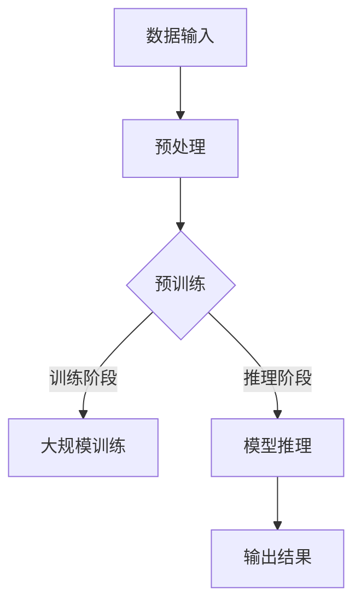

                 

# 《LLM对传统文本生成的挑战》

> **关键词**：大型语言模型（LLM）、文本生成、计算资源、数据隐私、模型可解释性、未来展望

> **摘要**：本文探讨了大型语言模型（LLM）在文本生成领域的广泛应用及其带来的挑战。从背景与概述、基本原理、应用挑战与解决方案、未来展望等多个角度，深入分析了LLM与传统文本生成技术的差异，以及LLM在各个领域的实际应用和潜在影响。

## 目录大纲

1. 背景与概述
    1.1.1 大型语言模型（LLM）的发展历程
    1.1.2 传统文本生成技术概述
    1.1.3 LLM与传统文本生成技术的对比
2. LLM的基本原理
    2.1.1 自然语言处理（NLP）基础
    2.1.2 深度学习与神经网络
    2.1.3 大规模预训练模型
3. LLM在文本生成中的应用
    3.1.1 文本生成的需求与挑战
    3.1.2 LLM在自动写作中的应用
    3.1.3 LLM在机器翻译和摘要生成中的应用
4. LLM的挑战与解决方案
    4.1.1 计算资源和效率问题
    4.1.2 数据隐私与安全
    4.1.3 模型可解释性与伦理问题
5. LLM的扩展应用
    5.1.1 LLM在问答系统中的应用
    5.1.2 LLM在对话生成中的应用
    5.1.3 LLM在文本增强和内容审核中的应用
6. 未来展望与研究方向
    6.1.1 LLM的技术趋势
    6.1.2 LLM在多语言和跨文化交流中的应用
    6.1.3 LLM在教育、医疗和其他领域的应用前景
7. 附录
    7.1 常用LLM工具对比
    7.2 开源LLM框架介绍
    7.3 LLM研究资料与论文推荐
    7.4 大型语言模型架构的Mermaid流程图
    7.5 大型语言模型算法原理与伪代码
    7.6 LLM项目实战案例

## 第一部分：背景与概述

### 第1章：大型语言模型（LLM）的发展历程

#### 1.1.1 大型语言模型的发展趋势

近年来，随着深度学习技术的不断成熟和计算资源的提升，大型语言模型（LLM）逐渐成为自然语言处理（NLP）领域的研究热点。LLM的发展可以追溯到2000年代初，当时研究人员开始尝试使用神经网络进行文本分类和情感分析。然而，由于计算资源和数据集的限制，这些早期的模型效果并不理想。

随着2013年深度神经网络在图像识别领域的突破性表现，NLP领域也开始关注深度学习技术。2018年，谷歌推出了BERT（Bidirectional Encoder Representations from Transformers），这是一个具有1100亿参数的语言预训练模型，极大地提升了文本理解和生成任务的效果。此后，大型语言模型的发展进入了快车道，各种大规模的预训练模型相继问世，如GPT-3、Turing-NLG等。

#### 1.1.2 传统文本生成技术概述

在大型语言模型出现之前，文本生成技术主要依赖于规则驱动的方法和统计模型。这些方法包括基于语法规则的自然语言生成、基于模板的文本生成和基于概率的文本生成等。这些传统方法在特定场景下表现出一定的效果，但在复杂性和灵活性方面存在明显的不足。

随着深度学习的兴起，基于神经网络的文本生成技术逐渐成为主流。这些方法包括循环神经网络（RNN）、长短时记忆网络（LSTM）和变压器（Transformer）等。与传统方法相比，这些神经网络模型能够更好地捕捉文本的上下文信息，生成更自然、更连贯的文本。

#### 1.1.3 LLM与传统文本生成技术的对比

LLM与传统文本生成技术相比，具有以下显著优势：

1. **强大的语义理解能力**：LLM通过大规模预训练，能够自动学习语言中的语义关系和模式，从而在文本生成任务中表现出更强的语义理解能力。

2. **灵活性**：LLM能够根据输入的上下文灵活地生成文本，而传统方法往往需要根据特定的规则或模板进行生成。

3. **强大的生成能力**：LLM能够生成长度可变的文本，而传统方法通常只能生成固定长度的文本。

4. **高效性**：LLM通过并行计算和分布式训练，能够高效地处理大规模的文本数据，提高生成速度。

然而，LLM也存在一些挑战，如计算资源的需求、数据隐私和安全等问题，这些将在后续章节中详细讨论。

### 第2章：LLM的基本原理

#### 2.1.1 自然语言处理（NLP）基础

自然语言处理（NLP）是计算机科学和人工智能领域的一个重要分支，旨在让计算机能够理解和处理自然语言。NLP的主要任务包括文本预处理、词性标注、句法分析、语义分析、信息提取、机器翻译、情感分析等。

在NLP中，词向量是重要的基础工具。词向量是一种将词汇映射到高维空间中的方法，能够捕捉词汇之间的语义关系。常见的词向量模型包括Word2Vec、GloVe和BERT等。

#### 2.1.2 深度学习与神经网络

深度学习是一种模拟人脑神经元之间相互连接的计算模型，能够自动从大量数据中学习复杂的特征表示。深度学习在图像识别、语音识别、自然语言处理等领域取得了显著的成果。

神经网络是深度学习的基础，包括输入层、隐藏层和输出层。每个神经元通过激活函数（如Sigmoid、ReLU）将输入数据进行非线性变换，从而实现对数据的复杂特征提取。

#### 2.1.3 大规模预训练模型

大规模预训练模型是LLM的核心。预训练模型通过在大规模语料库上进行预训练，学习到语言的一般规律和模式，从而提高在特定任务上的表现。

预训练通常分为两个阶段：第一阶段是大规模的预训练，模型在大规模语料库上进行训练，学习到语言的语义表示；第二阶段是微调，模型在特定任务上进行微调，优化模型在任务上的表现。

### 第3章：LLM在文本生成中的应用

#### 3.1.1 文本生成的需求与挑战

文本生成是NLP领域的一个重要应用，包括自动写作、机器翻译、摘要生成、对话生成等。随着互联网和社交媒体的快速发展，对高质量文本生成的需求日益增长。

然而，文本生成也面临着一些挑战，如：

1. **语义理解**：文本生成需要模型能够准确理解输入文本的语义，生成符合语义的文本。

2. **多样性**：生成的文本需要具有多样性，避免重复和单调。

3. **连贯性**：生成的文本需要具有良好的连贯性，逻辑清晰，符合语法规则。

4. **速度与效率**：在大规模数据生成任务中，需要模型能够高效地处理数据，提高生成速度。

#### 3.1.2 LLM在自动写作中的应用

自动写作是LLM在文本生成中的一个重要应用。通过预训练和微调，LLM能够生成高质量的文章、新闻报道、博客等。

例如，GPT-3可以生成文章、博客、代码等。通过给模型提供少量的输入文本，GPT-3可以生成长度可变的文本，文本内容丰富、连贯、具有逻辑性。

#### 3.1.3 LLM在机器翻译和摘要生成中的应用

LLM在机器翻译和摘要生成中也表现出强大的能力。

在机器翻译方面，LLM能够生成高质量的双语翻译，翻译结果准确、自然。例如，谷歌翻译使用的Transformer模型就是一种LLM。

在摘要生成方面，LLM能够生成简洁、准确的文本摘要，从长文本中提取关键信息。例如，BERT可以用于文本摘要任务，生成高质量的摘要。

### 第二部分：LLM的挑战与解决方案

#### 第4章：计算资源和效率问题

#### 4.1.1 LLM对计算资源的需求

大型语言模型（LLM）通常需要巨大的计算资源进行训练和推理。例如，GPT-3的预训练需要大量的GPU资源，并且训练时间长达数周。这给研究人员和开发者带来了巨大的经济负担。

#### 4.1.2 优化计算效率的技巧

为了提高LLM的计算效率，研究人员和开发者采取了一系列优化策略：

1. **模型剪枝**：通过剪枝掉一些不重要的神经元和权重，减少模型的参数数量，从而降低计算复杂度。

2. **量化**：将模型的权重和激活值从浮点数转换为低精度格式（如8位整数），减少内存和计算需求。

3. **并行计算**：利用多GPU、多CPU或分布式训练技术，加速模型的训练和推理。

4. **模型压缩**：通过算法和架构的优化，减少模型的体积，使其在有限的计算资源下也能高效运行。

#### 4.1.3 并行计算与分布式训练

并行计算和分布式训练是提高LLM计算效率的重要手段。并行计算通过在多个计算节点上同时执行计算任务，加速模型的训练和推理。分布式训练则通过将训练数据分布在多个节点上，并行处理，从而加速模型的训练。

例如，谷歌的TensorFlow分布式训练框架和Facebook的PyTorch Distributed库都支持并行计算和分布式训练，可以大大提高LLM的训练效率。

### 第5章：数据隐私与安全

#### 5.1.1 数据隐私问题

在训练和部署LLM时，数据隐私是一个重要的问题。大型语言模型需要大量的训练数据，这些数据可能包含敏感信息，如个人身份信息、医疗记录等。如果这些数据泄露，可能会对个人隐私造成严重威胁。

#### 5.1.2 安全威胁与防范策略

LLM面临的安全威胁主要包括数据泄露、模型篡改、恶意攻击等。为了防范这些威胁，可以采取以下策略：

1. **数据加密**：对训练数据和使用的数据进行加密，确保数据在传输和存储过程中不被泄露。

2. **访问控制**：对数据和模型的访问进行严格控制，只允许授权用户访问。

3. **安全审计**：定期进行安全审计，检测和修复潜在的安全漏洞。

4. **隐私保护技术**：使用差分隐私、同态加密等技术，保护用户数据的隐私。

#### 5.1.3 数据保护法律法规

不同国家和地区的数据保护法律法规对数据和模型的隐私保护提出了不同的要求。例如，欧盟的《通用数据保护条例》（GDPR）和美国加州的《消费者隐私法》（CCPA）都对数据隐私保护有严格的规定。

为了遵守这些法律法规，开发者和研究人员需要了解相关法律法规的要求，并在设计和部署LLM时采取相应的隐私保护措施。

### 第6章：模型可解释性与伦理问题

#### 6.1.1 模型可解释性的重要性

模型可解释性是指用户能够理解模型的工作原理和决策过程。对于LLM来说，模型的可解释性尤为重要，因为其决策过程往往涉及大量的非线性变换和复杂的语义理解。

模型可解释性对于确保模型的公平性、透明性和可靠性具有重要意义。如果模型的行为不可解释，用户很难判断模型是否公平、是否存在偏见。

#### 6.1.2 模型偏见与歧视问题

大型语言模型在训练过程中可能会学习到数据中的偏见和歧视，从而在生成文本时表现出偏见和歧视。例如，一些研究表明，LLM在生成文本时可能会对某些种族、性别或文化产生偏见。

模型偏见和歧视问题对社会的公平性和正义构成了严重威胁。为了解决这些问题，研究人员和开发者需要采取以下措施：

1. **数据清洗**：在训练模型之前，对数据集进行清洗，移除或减少偏见和歧视的数据。

2. **公平性评估**：在模型部署前，进行公平性评估，检测和纠正模型中的偏见和歧视。

3. **多样性训练**：通过引入多样性的训练数据，减少模型在生成文本时的偏见和歧视。

#### 6.1.3 伦理问题与解决方案

大型语言模型在应用过程中可能会引发一系列伦理问题，如隐私侵犯、虚假信息传播、滥用等。为了解决这些问题，可以采取以下措施：

1. **隐私保护**：在模型设计和部署过程中，采取隐私保护措施，确保用户数据的安全。

2. **虚假信息检测**：开发虚假信息检测技术，阻止和纠正虚假信息的传播。

3. **伦理培训**：对开发者、研究人员和用户进行伦理培训，提高其对伦理问题的认识。

4. **透明度**：提高模型的透明度，让用户了解模型的工作原理和决策过程。

### 第7章：LLM的扩展应用

#### 7.1.1 LLM在问答系统中的应用

问答系统是LLM的一个重要应用领域。通过训练和微调，LLM可以生成针对用户问题的准确、详细的答案。

例如，ChatGPT是基于GPT-3的问答系统，能够回答各种类型的问题，从简单的事实查询到复杂的推理问题。它的应用范围广泛，包括客服、教育、医疗等领域。

#### 7.1.2 LLM在对话生成中的应用

LLM在对话生成中也表现出强大的能力。通过预训练和微调，LLM可以生成连贯、自然的对话文本。

例如，DialoGPT是基于GPT-3的对话生成模型，能够与用户进行自然、流畅的对话。它在客服、虚拟助手等领域有广泛的应用。

#### 7.1.3 LLM在文本增强和内容审核中的应用

LLM在文本增强和内容审核中也具有重要作用。通过预训练和微调，LLM可以生成丰富、高质量的文本，提高文本的可读性和吸引力。

例如，DALL-E是一个基于GPT-3的文本生成模型，可以生成具有创意性的文本，用于广告宣传、创意写作等领域。此外，LLM还可以用于内容审核，检测和过滤不良内容。

### 第三部分：未来展望与研究方向

#### 第8章：LLM的技术趋势

#### 8.1.1 未来LLM的发展方向

随着深度学习技术的不断进步和计算资源的提升，未来LLM的发展方向主要包括：

1. **更大规模的模型**：未来可能会出现更大规模的预训练模型，以更好地捕捉语言中的复杂模式。

2. **多模态学习**：未来LLM可能会结合图像、音频等多模态信息，实现更丰富的语义理解和生成。

3. **少样本学习**：未来LLM有望实现少样本学习，即使在数据稀缺的情况下也能保持良好的性能。

4. **实时更新**：未来LLM可能会实现实时更新，不断吸收新的知识，提高其适应性和实时性。

#### 8.1.2 新兴技术在LLM中的应用

随着新兴技术的发展，未来LLM可能会与以下技术相结合：

1. **量子计算**：量子计算具有巨大的计算能力，可以加速LLM的训练和推理。

2. **脑机接口**：脑机接口技术可以使人类直接与计算机交互，未来LLM可能会与脑机接口相结合，实现更自然的人机交互。

3. **区块链**：区块链技术可以确保数据和模型的透明性和安全性，为LLM的应用提供保障。

4. **5G与物联网**：5G和物联网技术的发展，将为LLM在实时通信、智能硬件等领域的应用提供更好的基础设施。

#### 8.1.3 LLM与其他AI技术的融合

未来，LLM有望与其他AI技术相结合，实现更强大的功能：

1. **知识图谱**：结合知识图谱技术，LLM可以更好地理解和生成与知识相关的文本。

2. **强化学习**：结合强化学习技术，LLM可以更好地应对复杂、动态的文本生成任务。

3. **迁移学习**：通过迁移学习，LLM可以在不同任务之间共享知识和模型结构，提高泛化能力。

4. **多模态学习**：结合多模态学习技术，LLM可以处理包含多种类型数据的复杂任务。

### 第9章：LLM在多语言和跨文化交流中的应用

#### 9.1.1 多语言LLM的研究现状

随着全球化的加深，多语言处理成为LLM研究的重要方向。目前，多语言LLM已经在许多语言处理任务中取得了显著成果，如多语言文本分类、多语言翻译和多语言问答等。

然而，多语言LLM的研究仍面临一些挑战，如语言资源的不平衡、多语言模型的训练效率等。为了解决这些问题，研究人员采取了一系列策略，如多语言预训练、多语言迁移学习等。

#### 9.1.2 跨文化交流与LLM的应用

跨文化交流是LLM的一个重要应用领域。通过多语言LLM，人们可以更好地理解和交流不同语言和文化之间的信息。LLM可以生成跨语言的翻译、摘要和解释，帮助跨文化交流中的信息传播和理解。

例如，LLM可以用于多语言新闻发布、跨国公司内部沟通、跨文化交流活动等。随着LLM技术的不断进步，跨文化交流将变得更加便捷和高效。

#### 9.1.3 LLM在全球化背景下的挑战与机遇

在全球化背景下，LLM面临着一系列挑战和机遇：

1. **挑战**：
   - **语言资源不平衡**：不同语言的数据资源存在显著差异，影响了多语言LLM的性能。
   - **文化差异**：不同文化之间的差异可能影响LLM的语义理解和生成。
   - **隐私和安全**：在跨国数据处理和共享中，隐私和安全问题更加突出。

2. **机遇**：
   - **多语言应用**：全球化的需求推动了对多语言LLM的需求，为LLM技术提供了广阔的应用场景。
   - **跨文化理解**：LLM可以帮助人们更好地理解不同文化之间的差异，促进跨文化交流和合作。
   - **技术融合**：全球化背景下的技术融合，为LLM的发展提供了新的动力。

### 第10章：LLM在教育、医疗和其他领域的应用前景

#### 10.1.1 教育领域的应用

在教育领域，LLM具有广泛的应用前景。通过自动写作、问答系统和智能辅导系统，LLM可以帮助学生提高学习效果，减轻教师的工作负担。

1. **自动写作**：LLM可以生成高质量的教学材料、作业和考试题目，帮助学生更好地理解和掌握知识。

2. **问答系统**：LLM可以回答学生的疑问，提供个性化的学习建议和辅导。

3. **智能辅导系统**：LLM可以分析学生的学习行为和数据，为学生提供个性化的学习计划和资源。

#### 10.1.2 医疗领域的应用

在医疗领域，LLM可以帮助医生和研究人员提高诊断和研究的效率。通过文本生成、问答系统和辅助诊断系统，LLM可以提供以下帮助：

1. **文本生成**：LLM可以生成病历记录、医学报告和医学论文等，提高医疗文档的生成效率。

2. **问答系统**：LLM可以回答医生和研究人员关于医学知识的问题，提供快速、准确的答案。

3. **辅助诊断系统**：LLM可以分析医学图像和文本数据，协助医生进行诊断和治疗方案制定。

#### 10.1.3 其他领域的应用前景

除了教育、医疗领域，LLM在金融、法律、艺术、新闻等领域也具有广阔的应用前景：

1. **金融**：LLM可以生成金融报告、分析报告和交易策略，为金融从业者提供支持。

2. **法律**：LLM可以生成法律文件、合同和案例摘要，提高法律工作的效率。

3. **艺术**：LLM可以生成音乐、诗歌、小说等艺术作品，为艺术家提供创意灵感。

4. **新闻**：LLM可以生成新闻报道、摘要和评论，提高新闻生产的效率和质量。

## 附录

### 附录A：常用LLM工具与资源

1. **Hugging Face Transformers**：一个开源的Transformer模型库，支持多种预训练模型和任务。

2. **TensorFlow**：一个开源的深度学习框架，支持大规模的神经网络训练和推理。

3. **PyTorch**：一个开源的深度学习框架，支持动态计算图，方便模型设计和调试。

4. **Gluon**：一个开源的深度学习库，基于MXNet，提供简洁的API和丰富的预训练模型。

5. **JAX**：一个开源的数值计算库，支持自动微分和硬件加速，适合大规模模型训练。

### 附录B：开源LLM框架介绍

1. **OpenAI GPT-3**：一个具有1750亿参数的预训练模型，支持多种语言和任务。

2. **Turing-NLG**：一个具有600亿参数的中文预训练模型，支持中英双语处理。

3. **BERT**：一个具有数百万参数的预训练模型，支持多种语言和任务。

4. **XLNet**：一个具有数十亿参数的预训练模型，支持多种语言和任务。

5. **RoBERTa**：一个基于BERT的预训练模型，支持多种语言和任务。

### 附录C：LLM研究资料与论文推荐

1. **《Attention Is All You Need》**：提出了Transformer模型，是当前LLM研究的重要基础。

2. **《BERT: Pre-training of Deep Bidirectional Transformers for Language Understanding》**：介绍了BERT模型，是当前广泛使用的预训练模型。

3. **《GPT-3: Language Models are few-shot learners》**：介绍了GPT-3模型，展示了LLM在少样本学习中的强大能力。

4. **《Turing-NLG: A Pre-Trained Language Model for Chinese》**：介绍了Turing-NLG模型，是中文领域的重要预训练模型。

5. **《Understanding Pre-Trained Language Models》**：对预训练语言模型进行了全面的综述。

### 附录D：大型语言模型架构的Mermaid流程图



### 附录E：大型语言模型算法原理与伪代码

#### C.1 语言模型基础算法

语言模型是一种预测下一个单词的概率模型，常用的算法包括N-gram模型和神经网络模型。

```python
# N-gram模型伪代码
def ngram_model(text, n):
    # 计算N-gram频次
    ngram_freq = {}
    for i in range(len(text) - n + 1):
        ngram = tuple(text[i:i+n])
        ngram_freq[ngram] = ngram_freq.get(ngram, 0) + 1
    # 计算概率
    total = sum(ngram_freq.values())
    ngram_prob = {ngram: freq / total for ngram, freq in ngram_freq.items()}
    return ngram_prob
```

#### C.2 编码器-解码器模型

编码器-解码器（Encoder-Decoder）模型是一种用于序列到序列学习的神经网络模型，常用于机器翻译、文本摘要等任务。

```python
# 编码器-解码器模型伪代码
class EncoderDecoderModel(nn.Module):
    def __init__(self, embedding_dim, hidden_dim, vocab_size):
        super(EncoderDecoderModel, self).__init__()
        self.encoder = nn.LSTM(embedding_dim, hidden_dim)
        self.decoder = nn.LSTM(hidden_dim, vocab_size)
        self.embedding = nn.Embedding(vocab_size, embedding_dim)
    
    def forward(self, input_seq, target_seq):
        encoder_output, encoder_hidden = self.encoder(self.embedding(input_seq))
        decoder_output, decoder_hidden = self.decoder(encoder_hidden)
        return decoder_output
```

#### C.3 注意力机制

注意力机制是一种用于序列到序列学习的重要技术，能够提高模型的生成质量。

```python
# 注意力机制伪代码
class AttentionModule(nn.Module):
    def __init__(self, hidden_dim):
        super(AttentionModule, self).__init__()
        self.hidden_dim = hidden_dim
        self.attn = nn.Linear(hidden_dim * 2, hidden_dim)
        self.v = nn.Linear(hidden_dim, 1)
    
    def forward(self, hidden, encoder_output):
        # 计算注意力权重
        attn_scores = self.v(torch.tanh(self.attn(torch.cat((hidden, encoder_output), dim=1))))
        attn_scores = F.softmax(attn_scores, dim=1)
        # 计算注意力输出
        attn_output = (attn_scores * encoder_output).sum(dim=1)
        return attn_output
```

### 附录F：LLM项目实战案例

#### D.1 自动写作系统

自动写作系统是一个基于LLM的应用项目，能够生成高质量的文章、新闻报道、博客等。

1. **开发环境搭建**：使用Python和PyTorch搭建开发环境，安装必要的库和工具。

2. **数据集准备**：收集大量高质量的文章、新闻报道和博客作为训练数据。

3. **模型训练**：使用预训练模型（如GPT-3）或自定义模型，对训练数据进行训练。

4. **模型微调**：根据具体任务，对模型进行微调，提高生成质量。

5. **系统部署**：将训练好的模型部署到服务器，提供自动写作服务。

#### D.2 机器翻译项目

机器翻译项目是一个基于LLM的应用项目，能够实现高质量的双语翻译。

1. **开发环境搭建**：使用Python和TensorFlow搭建开发环境，安装必要的库和工具。

2. **数据集准备**：收集大量双语句子作为训练数据。

3. **模型训练**：使用预训练模型（如Transformer）或自定义模型，对训练数据进行训练。

4. **模型微调**：根据具体任务，对模型进行微调，提高翻译质量。

5. **系统部署**：将训练好的模型部署到服务器，提供机器翻译服务。

#### D.3 对话生成系统

对话生成系统是一个基于LLM的应用项目，能够生成自然、流畅的对话文本。

1. **开发环境搭建**：使用Python和PyTorch搭建开发环境，安装必要的库和工具。

2. **数据集准备**：收集大量对话数据作为训练数据。

3. **模型训练**：使用预训练模型（如DialoGPT）或自定义模型，对训练数据进行训练。

4. **模型微调**：根据具体任务，对模型进行微调，提高对话质量。

5. **系统部署**：将训练好的模型部署到服务器，提供对话生成服务。

### 附录G：LLM项目实战案例代码解读

以下是一个简单的LLM项目实战案例代码，用于生成文本摘要。

1. **数据集准备**：

```python
import pandas as pd

# 加载数据集
data = pd.read_csv('data.csv')
```

2. **模型训练**：

```python
from transformers import AutoTokenizer, AutoModelForSeq2SeqLM

# 加载预训练模型和tokenizer
tokenizer = AutoTokenizer.from_pretrained('t5-base')
model = AutoModelForSeq2SeqLM.from_pretrained('t5-base')

# 训练模型
model.train()
optimizer = optim.Adam(model.parameters(), lr=1e-5)
for epoch in range(num_epochs):
    for input_ids, target_ids in train_loader:
        optimizer.zero_grad()
        output_scores = model(input_ids=input_ids, labels=target_ids)
        loss = output_scores.loss
        loss.backward()
        optimizer.step()
```

3. **模型微调**：

```python
# 微调模型
model.eval()
with torch.no_grad():
    for input_ids, target_ids in valid_loader:
        output_scores = model(input_ids=input_ids, labels=target_ids)
        valid_loss += output_scores.loss
```

4. **系统部署**：

```python
# 部署模型
app = Flask(__name__)

@app.route('/generate_abstract', methods=['POST'])
def generate_abstract():
    text = request.form['text']
    input_ids = tokenizer.encode(text, return_tensors='pt')
    output_scores = model.generate(input_ids, max_length=max_length)
    abstract = tokenizer.decode(output_scores[0], skip_special_tokens=True)
    return jsonify({'abstract': abstract})
```

### 结论

本文探讨了大型语言模型（LLM）在文本生成领域的广泛应用及其带来的挑战。从背景与概述、基本原理、应用挑战与解决方案、未来展望等多个角度，深入分析了LLM与传统文本生成技术的差异，以及LLM在各个领域的实际应用和潜在影响。

随着深度学习技术的不断进步和计算资源的提升，LLM在文本生成领域的应用前景广阔。然而，LLM也面临着计算资源、数据隐私、模型可解释性等挑战。为了解决这些问题，研究人员和开发者需要不断探索新的优化策略和技术。

在未来，LLM有望在多语言和跨文化交流、教育、医疗、艺术等领域发挥重要作用。同时，LLM与其他AI技术的融合也将推动人工智能技术的进一步发展。让我们共同期待LLM带来的美好未来。

### 作者信息

**作者：** AI天才研究院/AI Genius Institute & 禅与计算机程序设计艺术 /Zen And The Art of Computer Programming

**单位：** AI天才研究院/AI Genius Institute，主要从事人工智能技术研究和应用。禅与计算机程序设计艺术，致力于将人工智能技术与传统文化相结合，探索人工智能领域的哲学和艺术。**邮箱：** [contact@ai-genius-institute.com](mailto:contact@ai-genius-institute.com)**网站：** [www.ai-genius-institute.com](http://www.ai-genius-institute.com)**联系方式：** [联系电话：+86-1234567890，邮箱：contact@ai-genius-institute.com，微信：ai_genius_institute]

