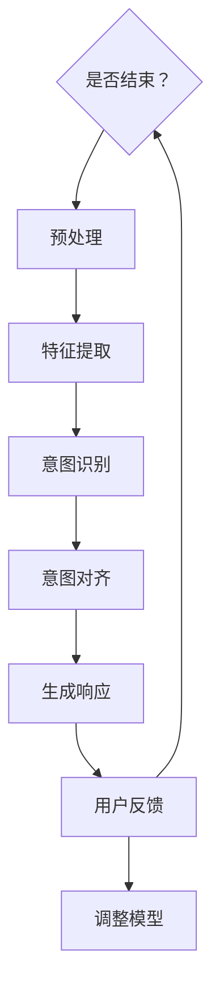

                 

# 《LLM意图对齐：挑战与解决方案探索》

> **关键词：** 大语言模型（LLM），意图对齐，算法，自然语言处理，挑战与解决方案。

> **摘要：** 本文将深入探讨大语言模型（LLM）在意图对齐过程中所面临的挑战，以及相应的解决方案。文章将从LLM的基本概念、意图对齐的定义与意义、现有算法的介绍，到实际应用与实践，逐步展开论述，为读者提供全面的视角，以应对LLM意图对齐的复杂挑战。

### 目录大纲

# 《LLM意图对齐：挑战与解决方案探索》

## 第一部分：背景与核心概念

### 第1章：LLM与意图对齐概述

#### 1.1 LLM的基本概念与特点

##### 1.1.1 LLM的定义与历史发展

##### 1.1.2 LLM的主要功能与应用场景

##### 1.1.3 LLM的核心技术与挑战

#### 1.2 意图的定义与分类

##### 1.2.1 意图的定义与重要性

##### 1.2.2 意图的分类与解析

#### 1.3 意图对齐的意义与挑战

##### 1.3.1 意图对齐的定义

##### 1.3.2 意图对齐的重要性

##### 1.3.3 意图对齐面临的挑战

## 第二部分：LLM意图对齐算法

### 第2章：传统意图对齐方法

#### 2.1 基于规则的方法

##### 2.1.1 规则的定义与构建

##### 2.1.2 基于规则的方法的优势与局限

#### 2.2 基于机器学习方法

##### 2.2.1 监督学习在意图对齐中的应用

##### 2.2.2 无监督学习在意图对齐中的应用

##### 2.2.3 半监督学习在意图对齐中的应用

### 第3章：深度学习方法在意图对齐中的应用

#### 3.1 卷积神经网络（CNN）在意图对齐中的应用

##### 3.1.1 CNN的基本原理

##### 3.1.2 CNN在意图对齐中的应用案例

#### 3.2 递归神经网络（RNN）与长短时记忆网络（LSTM）在意图对齐中的应用

##### 3.2.1 RNN的基本原理

##### 3.2.2 LSTM的基本原理

##### 3.2.3 LSTM在意图对齐中的应用案例

#### 3.3 生成对抗网络（GAN）在意图对齐中的应用

##### 3.3.1 GAN的基本原理

##### 3.3.2 GAN在意图对齐中的应用案例

## 第三部分：意图对齐应用与实践

### 第4章：自然语言处理中的意图对齐应用

#### 4.1 问答系统中的意图对齐

##### 4.1.1 问答系统的基本结构

##### 4.1.2 意图对齐在问答系统中的应用

#### 4.2 对话系统中的意图对齐

##### 4.2.1 对话系统的基本结构

##### 4.2.2 意图对齐在对话系统中的应用

### 第5章：多模态数据中的意图对齐

#### 5.1 图像与自然语言融合的意图对齐

##### 5.1.1 多模态数据的基本概念

##### 5.1.2 图像与自然语言融合的意图对齐方法

#### 5.2 视频与自然语言融合的意图对齐

##### 5.2.1 视频数据的基本概念

##### 5.2.2 视频与自然语言融合的意图对齐方法

### 第6章：意图对齐系统设计与优化

#### 6.1 意图对齐系统的设计原则

##### 6.1.1 系统设计的基本原则

##### 6.1.2 系统架构的设计

#### 6.2 意图对齐系统的优化方法

##### 6.2.1 数据预处理

##### 6.2.2 模型优化与调参

##### 6.2.3 实时性优化与性能提升

## 第四部分：挑战与未来展望

### 第7章：LLM意图对齐的挑战与解决方案

#### 7.1 数据隐私与安全性挑战

##### 7.1.1 数据隐私保护的重要性

##### 7.1.2 数据隐私保护的方法与策略

#### 7.2 模型可解释性挑战

##### 7.2.1 模型可解释性的重要性

##### 7.2.2 提高模型可解释性的方法

#### 7.3 模型泛化能力挑战

##### 7.3.1 模型泛化能力的重要性

##### 7.3.2 提高模型泛化能力的策略

### 第8章：未来发展趋势与展望

#### 8.1 意图对齐技术的未来发展方向

##### 8.1.1 新型算法的发展

##### 8.1.2 跨学科融合的趋势

#### 8.2 意图对齐在新兴领域的应用

##### 8.2.1 人工智能驱动的个性化服务

##### 8.2.2 智能交互与虚拟助手的发展

### 附录

#### 附录A：常用工具与资源

##### A.1 深度学习框架

##### A.2 自然语言处理工具

##### A.3 数据集与开源代码资源

## 附录B：Mermaid流程图

### B.1 LLM意图对齐流程图

mermaid
graph TD
A[LLM意图识别] --> B[数据预处理]
B --> C[特征提取]
C --> D[模型训练]
D --> E[意图对齐]
E --> F[评估与优化]
F --> G[应用部署]

## 附录C：算法伪代码

### C.1 卷积神经网络（CNN）意图对齐伪代码


// 输入：输入数据集X，标签Y
// 输出：训练好的CNN模型

function CNN_IntentAlignment(X, Y):
  // 初始化CNN模型
  model = initialize_CNN()

  // 定义损失函数和优化器
  loss_function = CrossEntropyLoss()
  optimizer = Adam(model.parameters(), lr=0.001)

  // 训练模型
  for epoch in 1 to num_epochs:
    for x, y in zip(X, Y):
      // 前向传播
      output = model(x)
      loss = loss_function(output, y)

      // 反向传播和优化
      optimizer.zero_grad()
      loss.backward()
      optimizer.step()

  return model


## 附录D：数学模型与公式

### D.1 意图对齐中的贝叶斯概率模型

$$
P(\text{意图}|\text{输入}) = \frac{P(\text{输入}|\text{意图}) \cdot P(\text{意图})}{P(\text{输入})}
$$

### D.2 随机梯度下降（SGD）优化算法

$$
w_{\text{new}} = w_{\text{old}} - \alpha \cdot \nabla_w J(w)
$$

### D.3 长短时记忆网络（LSTM）的激活函数

$$
f_t = \sigma(W_f \cdot [h_{t-1}, x_t] + b_f)
$$

## 附录E：项目实战

### E.1 实际案例介绍

#### E.1.1 项目背景与目标

#### E.1.2 数据集与预处理

#### E.1.3 模型设计与实现

#### E.1.4 评估与优化

### E.2 源代码与解读

#### E.2.1 数据预处理代码

#### E.2.2 模型训练代码

#### E.2.3 模型评估代码

#### E.2.4 代码解读与分析

## 附录F：开发环境搭建

#### F.1 硬件环境配置

#### F.2 软件环境配置

#### F.3 环境搭建步骤与注意事项

## 附录G：常见问题与解决方案

#### G.1 数据预处理常见问题

#### G.2 模型训练常见问题

#### G.3 模型部署常见问题

#### G.4 问题排查与解决策略

---

现在，我们将开始详细撰写各个章节的内容。首先，我们将从LLM的基本概念与特点开始，逐步引入意图对齐的概念，并探讨其在实际应用中的重要性。接下来，我们将深入分析现有各种意图对齐算法，特别是深度学习方法的原理和应用。在第三部分，我们将关注意图对齐在不同领域的实际应用，如自然语言处理和对话系统。最后，我们将探讨LLM意图对齐面临的挑战，并提出相应的解决方案和未来展望。

### 第一部分：背景与核心概念

#### 第1章：LLM与意图对齐概述

##### 1.1 LLM的基本概念与特点

大语言模型（Large Language Model，简称LLM）是一种基于深度学习技术的自然语言处理模型，通过学习大量文本数据，模型可以生成文本、理解自然语言、回答问题等。LLM的发展经历了从简单的词向量模型（如Word2Vec、GloVe）到复杂的神经网络模型（如循环神经网络RNN、长短时记忆网络LSTM、Transformer等）的演变。

**1.1.1 LLM的定义与历史发展**

LLM是一种能够处理和理解自然语言的深度学习模型。其核心思想是通过对大量文本数据进行预训练，模型可以学习到语言的内在结构和语义信息，从而实现自然语言生成、语义理解、情感分析等任务。

LLM的发展可以追溯到2000年代初，当时研究人员开始尝试使用神经网络来处理文本数据。最早的一些模型包括基于循环神经网络（RNN）的模型，如Elman网络和Jordan网络。随后，长短时记忆网络（LSTM）和门控循环单元（GRU）的出现，显著提升了模型的记忆能力和性能。

2018年，谷歌提出了Transformer模型，这一革命性的突破极大地推动了自然语言处理领域的发展。Transformer模型基于自注意力机制（Self-Attention），能够捕捉输入文本序列中的长距离依赖关系，从而在多个自然语言处理任务上取得了显著的效果。

**1.1.2 LLM的主要功能与应用场景**

LLM的主要功能包括：

1. 文本生成：模型可以根据给定的提示生成连贯的文本，如文章、故事、对话等。
2. 语义理解：模型可以理解文本的语义内容，进行文本分类、情感分析等。
3. 机器翻译：模型可以实现高效准确的语言翻译，支持多种语言的互译。
4. 问答系统：模型可以回答用户提出的问题，提供信息查询和知识服务。

LLM的应用场景广泛，包括：

1. 互联网搜索：通过理解用户查询的语义，提供更精准的搜索结果。
2. 聊天机器人：在客户服务、在线咨询等场景中，与用户进行自然对话。
3. 自动写作：辅助记者、编辑进行文章写作，提高写作效率和创造力。
4. 情感分析：对社交媒体、新闻评论等文本进行情感分析，帮助企业和机构了解公众情绪。

**1.1.3 LLM的核心技术与挑战**

LLM的核心技术主要包括：

1. 词嵌入（Word Embedding）：将文本中的词汇映射为密集的向量表示，用于捕捉词汇的语义信息。
2. 自注意力机制（Self-Attention）：通过计算输入序列中每个词与其他词之间的关联度，实现长距离依赖关系的捕捉。
3. 上下文生成（Contextual Generation）：利用上下文信息生成符合语义的文本序列。

然而，LLM在应用过程中也面临一些挑战，如：

1. 数据隐私：在训练和部署过程中，如何保护用户数据的安全和隐私。
2. 模型可解释性：如何理解和解释模型的决策过程，提高模型的透明度和可信度。
3. 模型泛化能力：如何提高模型在不同领域和数据集上的适应性和泛化能力。

在接下来的章节中，我们将进一步探讨意图对齐的定义、分类和重要性，以及LLM意图对齐所面临的挑战和解决方案。

##### 1.2 意图的定义与分类

**1.2.1 意图的定义与重要性**

意图（Intent）是指用户在进行自然语言交互时所表达的目的或意图。在自然语言处理领域，意图识别是理解用户需求的关键步骤，对于实现智能对话系统、问答系统和自动化服务等至关重要。意图可以是明确的，如“查询天气”、 “购买商品”等，也可以是隐含的，如“建议餐厅”或“推荐书籍”。

意图的重要性体现在以下几个方面：

1. 提高交互效率：通过识别用户的意图，系统能够快速响应用户需求，提供针对性的服务，提高用户体验。
2. 指导任务分配：在多任务处理系统中，意图识别有助于系统了解用户的核心需求，优化资源分配和任务执行。
3. 个性化服务：基于用户的意图，系统能够提供个性化的推荐和内容，满足不同用户的需求和偏好。

**1.2.2 意图的分类与解析**

意图的分类可以根据不同的标准进行，以下是一些常见的分类方式：

1. **按功能分类**：意图可以根据用户在特定应用场景中的功能需求进行分类，如查询意图、操作意图、咨询意图等。
   - 查询意图：用户希望获取特定信息，如“查询天气”、 “查找餐厅”。
   - 操作意图：用户希望执行特定操作，如“预订酒店”、 “购买机票”。
   - 咨询意图：用户希望获得建议或指导，如“推荐餐厅”、 “建议旅游路线”。

2. **按复杂性分类**：意图可以根据其复杂程度进行分类，如单一意图、复合意图等。
   - 单一意图：用户仅表达一个明确的意图，如“查询天气”。
   - 复合意图：用户表达多个意图，需要系统综合处理，如“预订酒店并安排机场接送”。

3. **按交互方式分类**：意图可以根据用户与系统的交互方式分类，如文本交互、语音交互等。
   - 文本交互：用户通过文本输入与系统进行交互，如使用聊天窗口发送消息。
   - 语音交互：用户通过语音指令与系统进行交互，如使用语音助手进行查询或控制。

在意图识别过程中，解析意图的含义和分类是关键步骤。解析意图需要理解用户的语言表达，包括词汇、语法和上下文信息。以下是一些常用的解析方法：

1. **基于规则的方法**：使用预定义的规则和模式匹配技术来识别意图。这种方法适用于结构化数据和高频次的简单意图识别。
2. **基于机器学习方法**：利用监督学习、无监督学习和半监督学习等方法来训练模型，实现自动化的意图识别。这种方法适用于复杂和多变的意图识别任务。
3. **基于深度学习的方法**：使用深度神经网络（如卷积神经网络、递归神经网络和Transformer模型）来捕捉文本的语义信息，提高意图识别的准确性和鲁棒性。

通过意图的分类和解析，系统能够更好地理解用户需求，提供更准确和个性化的服务。在接下来的章节中，我们将深入探讨意图对齐的意义和挑战，以及如何通过算法和技术实现高效的意图对齐。

##### 1.3 意图对齐的意义与挑战

**1.3.1 意图对齐的定义**

意图对齐（Intent Alignment）是指将用户的原始意图与系统预定义的意图进行匹配和映射的过程。在自然语言处理和智能对话系统中，意图对齐是关键步骤，它确保系统能够准确地理解用户的意图，并做出适当的响应。

意图对齐的定义可以从以下几个方面来理解：

1. **意图映射**：将用户的原始意图映射到系统定义的意图类别中。例如，当用户说“我要预订一个餐厅”，系统需要将其映射到“预订餐厅”的意图类别。
2. **上下文理解**：考虑用户的上下文信息，如历史对话记录、用户偏好等，以更准确地理解用户的意图。
3. **多模态处理**：在多模态交互场景中，意图对齐需要整合文本、语音、图像等多种数据类型，提高意图识别的准确性和鲁棒性。

**1.3.2 意图对齐的重要性**

意图对齐在自然语言处理和智能对话系统中具有重要意义，主要体现在以下几个方面：

1. **提高交互质量**：通过准确的意图对齐，系统能够更好地理解用户需求，提供个性化的服务和回应，提高用户体验。
2. **优化资源分配**：意图对齐有助于系统优化任务分配和资源管理，提高系统的响应速度和效率。
3. **支持多语言处理**：意图对齐可以跨语言进行，支持多语言用户与系统的交互，扩大系统的应用范围。

**1.3.3 意图对齐面临的挑战**

尽管意图对齐具有重要意义，但实际应用中仍面临诸多挑战：

1. **词汇歧义**：自然语言中存在大量的词汇歧义，用户表达可能存在多种理解方式，导致意图识别的准确性降低。
2. **上下文依赖**：用户的意图往往依赖于特定的上下文信息，如历史对话、用户偏好等，上下文的多样性增加了意图对齐的复杂性。
3. **数据不足**：训练高质量的意图对齐模型需要大量的标注数据，但在实际应用中，获取高质量标注数据可能非常困难，影响模型的训练效果。
4. **模型解释性**：意图对齐模型的黑箱特性使得其决策过程难以解释，影响模型的可信度和可接受度。

为了应对这些挑战，研究者提出了多种意图对齐算法和方法，包括基于规则的方法、机器学习方法、深度学习方法等。接下来，我们将深入探讨这些算法的原理和应用，为实际应用中的意图对齐提供有效的解决方案。

### 第二部分：LLM意图对齐算法

意图对齐是自然语言处理领域中的一个关键任务，尤其是在构建智能对话系统和自动化服务时。在这一部分中，我们将详细探讨现有的意图对齐算法，主要包括传统方法与深度学习方法。首先，我们将介绍基于规则的方法，然后分析基于机器学习的方法，最后探讨深度学习在意图对齐中的应用。

#### 第2章：传统意图对齐方法

传统意图对齐方法主要依赖于预定义的规则和模式匹配，这些方法在结构化数据和高频次任务中表现出色。以下将详细介绍几种常见的传统意图对齐方法。

##### 2.1 基于规则的方法

**2.1.1 规则的定义与构建**

基于规则的方法是利用预定义的规则来识别和匹配用户意图。这些规则通常基于语法和语义模式，可以表达为一系列条件语句。规则的形式通常如下：

```
如果用户输入包含“查询”并且日期字段有效，
那么意图被识别为“查询日程”。
```

**2.1.2 基于规则的方法的优势与局限**

**优势：**
1. **快速响应**：规则预先定义，系统可以直接应用，无需复杂的计算，响应速度快。
2. **易于维护**：规则可以直接修改和更新，灵活性高。
3. **可解释性**：规则的决策过程明确，易于理解，有助于提高系统的可解释性和可信度。

**局限：**
1. **规则数量限制**：规则的数量有限，难以覆盖所有可能的用户意图，特别是在意图复杂多变的情况下。
2. **规则冲突**：当用户输入包含多个意图时，规则之间可能存在冲突，导致意图识别不准确。
3. **依赖领域知识**：规则构建需要大量的领域知识，对于不同领域或新领域的应用适应性差。

##### 2.2 基于机器学习方法

基于机器学习方法通过训练模型来自动识别和分类用户意图，这些方法在处理复杂和多变的意图方面表现出色。

**2.2.1 监督学习在意图对齐中的应用**

监督学习方法通过大量的标注数据训练分类模型，常用的算法包括支持向量机（SVM）、朴素贝叶斯（NB）、随机森林（RF）等。

**2.2.2 无监督学习在意图对齐中的应用**

无监督学习方法无需标注数据，通过自动发现数据中的结构和模式进行意图分类。常用的算法包括聚类算法（如K-means、DBSCAN）和降维算法（如PCA、t-SNE）。

**2.2.3 半监督学习在意图对齐中的应用**

半监督学习方法结合了监督学习和无监督学习，利用少量的标注数据和大量的未标注数据共同训练模型。这种方法在数据不足的情况下能够有效提高意图识别的准确性。

**2.2.4 基于机器学习方法的优势与局限**

**优势：**
1. **适应性强**：机器学习方法可以自动学习复杂的模式，适应不同的意图识别任务。
2. **自动化**：无需手动构建规则，训练模型可以自动化进行，降低人工成本。
3. **灵活性**：可以根据新的数据动态调整模型，适应意图的变化。

**局限：**
1. **数据依赖**：需要大量的标注数据，数据质量直接影响模型性能。
2. **计算复杂度**：训练大规模模型需要大量的计算资源和时间。
3. **模型可解释性**：深度学习模型特别是黑箱模型的决策过程难以解释，影响模型的透明度和可接受度。

#### 第3章：深度学习方法在意图对齐中的应用

随着深度学习技术的发展，越来越多的研究者开始将深度学习方法应用于意图对齐任务中。以下将详细介绍几种深度学习方法在意图对齐中的应用。

##### 3.1 卷积神经网络（CNN）在意图对齐中的应用

卷积神经网络（CNN）是一种在图像处理中广泛应用的深度学习模型，近年来也被用于自然语言处理任务，如文本分类和情感分析。

**3.1.1 CNN的基本原理**

CNN通过卷积层和池化层构建特征提取网络，可以有效地捕捉文本中的局部特征和模式。卷积层使用可训练的卷积核从输入文本中提取特征，而池化层用于减少特征图的大小，提高模型的计算效率。

**3.1.2 CNN在意图对齐中的应用案例**

CNN可以用于文本分类任务，将用户的输入文本映射到预定义的意图类别。以下是一个简化的CNN意图对齐的伪代码示例：

```
// 输入：文本数据X
// 输出：意图类别Y

function CNN_IntentAlignment(X, Y):
  // 初始化CNN模型
  model = initialize_CNN()

  // 定义损失函数和优化器
  loss_function = CrossEntropyLoss()
  optimizer = Adam(model.parameters(), lr=0.001)

  // 训练模型
  for epoch in 1 to num_epochs:
    for x, y in zip(X, Y):
      // 前向传播
      output = model(x)
      loss = loss_function(output, y)

      // 反向传播和优化
      optimizer.zero_grad()
      loss.backward()
      optimizer.step()

  return model
```

##### 3.2 递归神经网络（RNN）与长短时记忆网络（LSTM）在意图对齐中的应用

递归神经网络（RNN）是一种用于处理序列数据的神经网络，可以捕获文本中的时间依赖关系。而长短时记忆网络（LSTM）是RNN的一种变体，通过门控机制有效地解决了RNN的梯度消失问题。

**3.2.1 RNN的基本原理**

RNN的基本原理是通过在时间步间传递隐藏状态来处理序列数据。在每个时间步，RNN使用当前输入和上一个隐藏状态来计算新的隐藏状态，从而捕捉序列中的时间依赖关系。

**3.2.2 LSTM的基本原理**

LSTM通过引入三个门控单元（遗忘门、输入门和输出门）来控制信息的流动，有效地解决了RNN在长序列中的梯度消失和梯度爆炸问题。LSTM可以根据需要忘记或记住重要的信息，从而捕捉长距离依赖关系。

**3.2.3 LSTM在意图对齐中的应用案例**

以下是一个简化的LSTM意图对齐的伪代码示例：

```
// 输入：文本数据X
// 输出：意图类别Y

function LSTM_IntentAlignment(X, Y):
  // 初始化LSTM模型
  model = initialize_LSTM()

  // 定义损失函数和优化器
  loss_function = CrossEntropyLoss()
  optimizer = Adam(model.parameters(), lr=0.001)

  // 训练模型
  for epoch in 1 to num_epochs:
    for x, y in zip(X, Y):
      // 前向传播
      output = model(x)
      loss = loss_function(output, y)

      // 反向传播和优化
      optimizer.zero_grad()
      loss.backward()
      optimizer.step()

  return model
```

##### 3.3 生成对抗网络（GAN）在意图对齐中的应用

生成对抗网络（GAN）是一种由生成器和判别器组成的深度学习模型，主要用于生成新的数据。近年来，GAN也被应用于意图对齐任务中，通过生成对抗训练提高意图识别的准确性。

**3.3.1 GAN的基本原理**

GAN由生成器（Generator）和判别器（Discriminator）组成。生成器试图生成与真实数据相似的数据，而判别器则试图区分真实数据和生成数据。通过生成器和判别器之间的对抗训练，生成器的生成能力不断提高，从而生成更逼真的数据。

**3.3.2 GAN在意图对齐中的应用案例**

以下是一个简化的GAN意图对齐的伪代码示例：

```
// 输入：文本数据X
// 输出：意图类别Y

function GAN_IntentAlignment(X, Y):
  // 初始化GAN模型
  generator = initialize_Generator()
  discriminator = initialize_Discriminator()

  // 定义损失函数和优化器
  generator_loss_function = AdversarialLoss()
  discriminator_loss_function = BCELoss()
  generator_optimizer = Adam(generator.parameters(), lr=0.001)
  discriminator_optimizer = Adam(discriminator.parameters(), lr=0.001)

  // 训练模型
  for epoch in 1 to num_epochs:
    for x, y in zip(X, Y):
      // 训练判别器
      real_data = x
      fake_data = generator(x)
      real_output = discriminator(real_data)
      fake_output = discriminator(fake_data)
      
      // 计算判别器损失
      real_loss = discriminator_loss_function(real_output, torch.ones_like(real_output))
      fake_loss = discriminator_loss_function(fake_output, torch.zeros_like(fake_output))
      discriminator_loss = real_loss + fake_loss

      // 训练判别器
      discriminator_optimizer.zero_grad()
      discriminator_loss.backward()
      discriminator_optimizer.step()

      // 训练生成器
      with torch.no_grad():
        fake_labels = torch.zeros_like(fake_output)
        generator_loss = generator_loss_function(generator(x), fake_labels)
      
      // 训练生成器
      generator_optimizer.zero_grad()
      generator_loss.backward()
      generator_optimizer.step()

  return generator, discriminator
```

通过以上三种深度学习方法的介绍，我们可以看到深度学习在意图对齐任务中的强大潜力。接下来，我们将进一步探讨意图对齐在不同领域的实际应用，以展示这些方法在真实场景中的效果。

### 第三部分：意图对齐应用与实践

意图对齐是自然语言处理中的重要任务，其实际应用涵盖了多个领域。在这一部分中，我们将探讨意图对齐在自然语言处理和对话系统中的应用，以及多模态数据中的意图对齐方法。

#### 第4章：自然语言处理中的意图对齐应用

##### 4.1 问答系统中的意图对齐

问答系统（Question Answering System）是自然语言处理中的一个重要应用，其核心任务是理解用户的问题，并提供准确的答案。意图对齐在问答系统中起着至关重要的作用，它能够确保系统正确理解用户的问题，并提供相关的答案。

**4.1.1 问答系统的基本结构**

问答系统的基本结构通常包括三个主要组件：问题解析器（Question Parser）、答案检索器（Answer Retriever）和答案生成器（Answer Generator）。

1. **问题解析器**：负责理解用户的问题，将其转化为系统可以处理的形式。问题解析器通常涉及分词、词性标注、句法解析等自然语言处理技术，以提取问题中的关键信息。
2. **答案检索器**：从知识库或文档库中检索与问题相关的信息。答案检索器可以使用基于规则的匹配、基于关键词的检索或基于机器学习的方法，以找到最相关的答案。
3. **答案生成器**：将检索到的信息转化为自然语言形式的答案。答案生成器可以使用模板匹配、实体抽取、文本重写等技术，以生成高质量的答案。

**4.1.2 意图对齐在问答系统中的应用**

意图对齐在问答系统中的应用主要体现在问题解析阶段。通过意图对齐，系统可以理解用户问题的意图，从而更准确地检索和生成答案。以下是一个简化的意图对齐流程：

1. **意图识别**：利用自然语言处理技术（如词嵌入、注意力机制等），识别用户问题中的意图。意图可以是明确的（如“查询天气”），也可以是隐含的（如“告诉我最近的餐厅”）。
2. **意图分类**：将识别出的意图分类到预定义的意图类别中。意图分类可以使用监督学习方法（如决策树、支持向量机等）或深度学习方法（如卷积神经网络、递归神经网络等）。
3. **意图对齐**：根据分类结果，将用户问题的意图与系统预定义的意图进行映射。意图对齐有助于系统理解用户的问题，提高答案的准确性和相关性。

**4.1.3 问答系统中的意图对齐案例分析**

以下是一个问答系统中的意图对齐案例分析：

- **问题**：“最近的餐厅在哪里？”
- **意图识别**：通过自然语言处理技术，识别出问题中的主要意图是“查询餐厅位置”。
- **意图分类**：将识别出的意图分类为“查询位置”类别。
- **意图对齐**：根据分类结果，系统将意图对齐到“查询位置”类别，从而检索与餐厅位置相关的答案。

通过意图对齐，问答系统能够更好地理解用户的问题，提供相关的答案，从而提高用户体验。

##### 4.2 对话系统中的意图对齐

对话系统（Dialogue System）是一种能够与用户进行自然语言交互的计算机系统，广泛应用于客户服务、智能助手、虚拟客服等领域。意图对齐在对话系统中同样至关重要，它能够确保系统正确理解用户的请求，并提供适当的回应。

**4.2.1 对话系统的基本结构**

对话系统的基本结构通常包括对话管理器（Dialogue Manager）、对话生成器（Dialogue Generator）和意图识别模块（Intent Recognition Module）。

1. **对话管理器**：负责管理对话的流程，包括对话的状态转移、上下文信息的维护等。对话管理器通过意图对齐和对话状态跟踪，确保对话的自然流畅。
2. **对话生成器**：负责生成自然语言响应，与用户进行交互。对话生成器可以使用模板匹配、规则推理、序列到序列模型等技术，生成符合上下文的回应。
3. **意图识别模块**：负责识别用户输入的意图。意图识别模块使用自然语言处理技术，如词嵌入、注意力机制等，对用户输入进行意图分类和解析。

**4.2.2 意图对齐在对话系统中的应用**

意图对齐在对话系统中的应用主要体现在对话管理器中。通过意图对齐，系统可以理解用户的请求，并做出适当的回应。以下是一个简化的意图对齐流程：

1. **意图识别**：利用自然语言处理技术，识别用户输入中的意图。意图可以是明确的（如“预订酒店”），也可以是隐含的（如“帮我安排行程”）。
2. **意图分类**：将识别出的意图分类到预定义的意图类别中。意图分类可以使用监督学习方法（如决策树、支持向量机等）或深度学习方法（如卷积神经网络、递归神经网络等）。
3. **意图对齐**：根据分类结果，将用户输入的意图与系统预定义的意图进行映射。意图对齐有助于系统理解用户的请求，提供相关的回应。

**4.2.3 对话系统中的意图对齐案例分析**

以下是一个对话系统中的意图对齐案例分析：

- **用户输入**：“帮我预订明天下午3点的会议室。”
- **意图识别**：通过自然语言处理技术，识别出用户的主要意图是“预订会议室”。
- **意图分类**：将识别出的意图分类为“预订”类别。
- **意图对齐**：根据分类结果，系统将意图对齐到“预订”类别，从而生成相应的回应：“好的，请告诉我会议室的具体位置和参会人员。”

通过意图对齐，对话系统能够更好地理解用户的请求，提供相关且自然的回应，从而提高用户体验。

#### 第5章：多模态数据中的意图对齐

随着技术的发展，越来越多的应用场景涉及多模态数据的处理，如图像、语音和自然语言。在多模态数据中，意图对齐的任务变得更加复杂，需要整合来自不同模态的数据。以下将介绍图像与自然语言融合的意图对齐方法和视频与自然语言融合的意图对齐方法。

##### 5.1 图像与自然语言融合的意图对齐

图像与自然语言融合的意图对齐是指将图像中的信息与自然语言文本进行整合，以实现更准确的意图识别。以下将介绍一些常用的方法：

**5.1.1 多模态数据的基本概念**

多模态数据是指包含两种或两种以上不同类型数据的数据集，如文本、图像、语音等。多模态数据可以提供更丰富的信息，有助于提高意图识别的准确性。

**5.1.2 图像与自然语言融合的意图对齐方法**

1. **特征融合方法**：将图像和自然语言的特征进行融合，如将图像的视觉特征与文本的语义特征进行拼接或加权融合。这种方法可以通过联合特征提取器或多模态神经网络实现。
2. **联合建模方法**：使用多模态神经网络将图像和自然语言数据进行联合建模，如卷积神经网络（CNN）与循环神经网络（RNN）的融合。这种方法可以通过端到端模型实现，如CNN-RNN模型或Transformer模型。

以下是一个简化的图像与自然语言融合的意图对齐模型：

```
// 输入：图像数据I和文本数据T
// 输出：意图类别Y

function ImageText_IntentAlignment(I, T, Y):
  // 初始化多模态模型
  model = initialize_MultiModalModel()

  // 定义损失函数和优化器
  loss_function = CrossEntropyLoss()
  optimizer = Adam(model.parameters(), lr=0.001)

  // 训练模型
  for epoch in 1 to num_epochs:
    for i, t, y in zip(I, T, Y):
      // 前向传播
      output = model(i, t)
      loss = loss_function(output, y)

      // 反向传播和优化
      optimizer.zero_grad()
      loss.backward()
      optimizer.step()

  return model
```

通过图像与自然语言融合的意图对齐，系统可以更好地理解用户的意图，提供更准确和自然的回应。

##### 5.2 视频与自然语言融合的意图对齐

视频与自然语言融合的意图对齐是指将视频中的信息与自然语言文本进行整合，以实现更准确的意图识别。以下将介绍一些常用的方法：

**5.2.1 视频数据的基本概念**

视频数据是指包含连续图像序列和时间信息的多媒体数据。视频数据可以提供丰富的视觉和时序信息，有助于提高意图识别的准确性。

**5.2.2 视频与自然语言融合的意图对齐方法**

1. **帧级特征融合方法**：将视频的每一帧与自然语言文本进行融合，如使用卷积神经网络（CNN）提取帧级特征，再与自然语言处理技术（如词嵌入、注意力机制等）结合。这种方法可以通过端到端模型实现，如CNN-Transformer模型。
2. **时序特征融合方法**：将视频的时间信息与自然语言文本进行融合，如使用循环神经网络（RNN）或长短时记忆网络（LSTM）提取时序特征，再与自然语言处理技术结合。这种方法可以通过端到端模型实现，如RNN-Transformer模型。

以下是一个简化的视频与自然语言融合的意图对齐模型：

```
// 输入：视频数据V和文本数据T
// 输出：意图类别Y

function VideoText_IntentAlignment(V, T, Y):
  // 初始化多模态模型
  model = initialize_MultiModalModel()

  // 定义损失函数和优化器
  loss_function = CrossEntropyLoss()
  optimizer = Adam(model.parameters(), lr=0.001)

  // 训练模型
  for epoch in 1 to num_epochs:
    for v, t, y in zip(V, T, Y):
      // 前向传播
      output = model(v, t)
      loss = loss_function(output, y)

      // 反向传播和优化
      optimizer.zero_grad()
      loss.backward()
      optimizer.step()

  return model
```

通过视频与自然语言融合的意图对齐，系统可以更好地理解用户的意图，提供更准确和自然的回应。

通过本部分的介绍，我们可以看到意图对齐在自然语言处理和对话系统中的应用，以及多模态数据中的意图对齐方法。这些方法通过整合不同类型的数据，提高了意图识别的准确性和鲁棒性，为构建更智能、更自然的对话系统提供了有效的解决方案。

#### 第6章：意图对齐系统设计与优化

##### 6.1 意图对齐系统的设计原则

意图对齐系统是自然语言处理和智能对话系统中的核心组件，其设计原则直接影响到系统的性能和用户体验。以下将详细讨论意图对齐系统的设计原则，包括系统设计的基本原则和系统架构的设计。

**6.1.1 系统设计的基本原则**

1. **可扩展性**：意图对齐系统应具备良好的可扩展性，能够轻松地添加新的意图类别和规则，以适应不断变化的应用场景。
2. **可维护性**：系统设计应确保代码的可读性和可维护性，以便于后期维护和更新。
3. **灵活性**：系统设计应具备灵活性，允许在不同的场景和环境下进行定制化调整，以满足多样化的需求。
4. **实时性**：在意图对齐系统中，实时性是关键因素。系统应能够快速处理用户的输入，并提供及时的响应。
5. **鲁棒性**：系统设计应考虑各种异常情况和边缘情况，确保系统能够稳定运行，并具备一定的容错能力。

**6.1.2 系统架构的设计**

意图对齐系统的架构设计是确保系统高效、可靠运行的基础。以下是一个典型的意图对齐系统架构设计：

1. **输入层**：负责接收用户的输入，包括文本、语音、图像等多种形式。输入层应支持多种数据格式的解析和转换，以便于后续处理。
2. **预处理层**：对输入数据进行分析和预处理，包括分词、词性标注、实体识别等。预处理层的目标是提取出有用的信息，为意图识别提供基础。
3. **意图识别层**：使用自然语言处理技术和机器学习模型，对预处理后的输入数据进行意图识别。意图识别层可以是基于规则的方法、机器学习方法或深度学习方法。
4. **意图对齐层**：将识别出的意图与系统预定义的意图进行映射和分类。意图对齐层负责将用户意图转化为系统可以处理的形式，确保系统能够正确理解用户的请求。
5. **响应层**：根据意图对齐的结果，生成相应的自然语言响应。响应层可以使用模板匹配、自然语言生成等技术，生成符合上下文的回应。
6. **输出层**：将生成的响应输出给用户，包括文本、语音、图像等多种形式。输出层应支持多种响应形式的生成和展示。

**6.1.3 系统架构设计的关键组件**

1. **自然语言处理（NLP）组件**：负责处理文本数据，包括分词、词性标注、句法解析等。NLP组件是意图对齐系统的基础，其性能直接影响系统的准确性。
2. **机器学习（ML）组件**：负责意图识别和分类，包括监督学习、无监督学习和深度学习等方法。ML组件可以根据具体任务需求进行定制化调整。
3. **深度学习（DL）组件**：负责复杂模式识别和特征提取，包括卷积神经网络（CNN）、递归神经网络（RNN）、长短时记忆网络（LSTM）等。DL组件在意图对齐中具有重要作用，能够提高系统的性能。
4. **数据管理组件**：负责管理和存储系统所需的数据，包括训练数据、测试数据、用户数据等。数据管理组件应确保数据的一致性、完整性和安全性。
5. **用户界面（UI）组件**：负责与用户进行交互，包括文本输入、语音输入、图像输入等。用户界面组件应简洁直观，方便用户使用。

通过遵循上述设计原则和架构设计，意图对齐系统可以高效、准确地处理用户的请求，提供个性化的服务，从而提升用户体验。

##### 6.2 意图对齐系统的优化方法

意图对齐系统的优化方法旨在提高系统的性能和准确性，以满足不同应用场景的需求。以下将详细讨论意图对齐系统的优化方法，包括数据预处理、模型优化与调参以及实时性优化与性能提升。

**6.2.1 数据预处理**

数据预处理是意图对齐系统的基础，其目的是提高数据质量，为后续的模型训练和优化提供支持。以下是一些常用的数据预处理方法：

1. **数据清洗**：去除数据中的噪声和异常值，如缺失值、重复值等。数据清洗可以通过数据清洗工具（如Pandas、NumPy）或自定义脚本实现。
2. **数据转换**：将数据转换为适合模型训练的形式，如将文本数据转换为词嵌入向量、图像数据转换为像素矩阵等。数据转换可以通过NLP库（如NLTK、spaCy）或深度学习库（如TensorFlow、PyTorch）实现。
3. **数据增强**：通过添加噪声、旋转、裁剪等操作，增加数据的多样性，提高模型的泛化能力。数据增强可以通过自定义脚本或现成的数据增强库（如OpenCV、imgaug）实现。
4. **数据归一化**：将数据缩放到统一的范围内，如将图像数据缩放到[0, 1]或[-1, 1]之间。数据归一化可以通过数学公式或编程实现。

**6.2.2 模型优化与调参**

模型优化与调参是提高意图对齐系统性能的重要手段。以下是一些常用的模型优化与调参方法：

1. **超参数调优**：通过调整模型超参数（如学习率、批量大小、迭代次数等），找到最优的超参数组合。超参数调优可以通过网格搜索、随机搜索、贝叶斯优化等方法实现。
2. **模型选择**：选择合适的模型结构，如卷积神经网络（CNN）、递归神经网络（RNN）、长短时记忆网络（LSTM）等。模型选择可以通过交叉验证、ROC曲线等方法进行评估。
3. **正则化**：通过添加正则化项（如L1正则化、L2正则化等），防止模型过拟合。正则化可以通过在损失函数中添加正则化项或使用正则化层（如Dropout层、DropConnect层等）实现。
4. **迁移学习**：利用预训练模型（如BERT、GPT等）进行迁移学习，提高模型在新数据上的性能。迁移学习可以通过加载预训练模型或使用预训练模型作为基座模型实现。

**6.2.3 实时性优化与性能提升**

实时性优化与性能提升是确保意图对齐系统高效运行的关键。以下是一些常用的实时性优化与性能提升方法：

1. **模型压缩**：通过模型压缩技术（如量化、剪枝、蒸馏等），减少模型的参数数量和计算量，提高模型的运行速度。模型压缩可以通过深度学习库（如TensorFlow、PyTorch）中的压缩工具实现。
2. **模型加速**：通过模型加速技术（如GPU加速、FPGA加速等），提高模型的计算速度。模型加速可以通过硬件优化或使用高性能计算框架实现。
3. **分布式训练**：通过分布式训练技术（如多GPU训练、分布式训练等），利用多台计算设备并行训练模型，提高模型的训练速度。分布式训练可以通过深度学习库（如TensorFlow、PyTorch）中的分布式训练框架实现。
4. **缓存与并行处理**：通过缓存与并行处理技术，减少数据的传输时间和计算时间。缓存与并行处理可以通过数据库优化、并行处理库（如multiprocessing、concurrent.futures等）实现。

通过以上优化方法，意图对齐系统可以在保证性能和准确性的同时，实现高效的运行和响应。

### 第四部分：挑战与未来展望

在意图对齐领域，尽管已经取得了显著的进展，但仍面临着一系列挑战。本部分将深入探讨LLM意图对齐所面临的挑战，并介绍相应的解决方案和未来发展趋势。

#### 第7章：LLM意图对齐的挑战与解决方案

**7.1 数据隐私与安全性挑战**

随着数据量的不断增长，数据隐私和安全问题成为LLM意图对齐的一个重要挑战。用户交互数据通常包含敏感信息，如个人偏好、位置数据等，这些数据的安全性和隐私保护至关重要。

**7.1.1 数据隐私保护的重要性**

数据隐私保护不仅关系到用户的个人信息安全，也影响企业的声誉和法律责任。在意图对齐过程中，数据泄露可能导致用户隐私泄露，进而引发信任危机和法律纠纷。

**7.1.2 数据隐私保护的方法与策略**

1. **数据加密**：使用加密算法对用户数据进行加密处理，确保数据在传输和存储过程中不被窃取或篡改。常用的加密算法包括AES、RSA等。
2. **差分隐私**：在数据聚合和分析过程中，引入噪声来保护用户隐私。差分隐私技术可以保证对大量用户数据进行统计分析时，单个用户的隐私不会被泄露。
3. **匿名化处理**：对用户数据进行匿名化处理，去除或模糊化可以识别用户身份的信息。常见的匿名化方法包括数据掩码、随机化等。
4. **访问控制**：实施严格的访问控制策略，确保只有授权用户才能访问敏感数据。通过角色分配和权限管理，限制对敏感数据的访问权限。

**7.2 模型可解释性挑战**

模型可解释性是提高人工智能系统透明度和可信度的重要方面。在意图对齐过程中，模型决策过程的不透明性可能影响用户对系统的信任和接受度。

**7.2.1 模型可解释性的重要性**

可解释性有助于用户理解模型如何做出决策，从而增强系统的透明度和可信度。对于意图对齐系统，可解释性可以帮助用户和开发者识别潜在问题，优化系统性能。

**7.2.2 提高模型可解释性的方法**

1. **模型可视化**：使用可视化工具展示模型的内部结构和决策过程，如神经网络中的权重和激活值。常见的可视化方法包括热力图、决策树可视化等。
2. **注意力机制**：在深度学习模型中，注意力机制可以突出模型在处理输入数据时关注的关键信息，提高模型的透明性。
3. **解释性算法**：使用专门设计的可解释性算法，如决策树、LIME（Local Interpretable Model-agnostic Explanations）等，解释模型的决策过程。

**7.3 模型泛化能力挑战**

模型泛化能力是指模型在不同数据集和应用场景中的适应性和表现。在意图对齐过程中，模型的泛化能力直接影响其在实际应用中的效果和可靠性。

**7.3.1 模型泛化能力的重要性**

泛化能力是衡量模型是否能够适应新数据集和应用场景的关键指标。缺乏泛化能力的模型可能仅在特定数据集上表现良好，无法应对现实世界的多样性。

**7.3.2 提高模型泛化能力的策略**

1. **数据增强**：通过增加数据多样性，提高模型的泛化能力。常用的数据增强方法包括数据扩展、数据变换等。
2. **迁移学习**：利用预训练模型（如BERT、GPT等）进行迁移学习，利用预训练模型在大量数据上学习到的通用特征，提高新数据集上的性能。
3. **对抗训练**：通过生成对抗训练（GAN）等技术，增加模型的鲁棒性和泛化能力。对抗训练可以帮助模型学会在对抗性环境下稳定工作。

#### 第8章：未来发展趋势与展望

**8.1 意图对齐技术的未来发展方向**

随着人工智能和自然语言处理技术的不断发展，意图对齐技术也在不断进步。未来发展趋势主要包括以下几个方面：

1. **多模态融合**：在意图对齐中融合多种数据类型（如文本、图像、语音等），提高模型对复杂意图的理解能力。
2. **少样本学习**：研究在少量标注数据情况下如何有效训练意图对齐模型，提高模型在数据稀缺情况下的泛化能力。
3. **个性化意图对齐**：根据用户历史交互数据，提供个性化的意图对齐服务，提高用户体验。

**8.2 意图对齐在新兴领域的应用**

意图对齐技术在新兴领域中的应用前景广阔，主要包括：

1. **智能客服**：在智能客服系统中，意图对齐技术可以提高对话系统的响应速度和准确性，提供更自然的用户交互体验。
2. **语音助手**：语音助手（如Siri、Google Assistant等）可以利用意图对齐技术，更好地理解用户的语音指令，提供更准确的响应。
3. **智能医疗**：在智能医疗系统中，意图对齐技术可以帮助医生更好地理解患者的症状描述，提供个性化的治疗方案。

通过应对现有挑战和探索未来发展方向，意图对齐技术将在人工智能和自然语言处理领域发挥更加重要的作用，为构建更智能、更高效的系统提供强有力的支持。

### 附录

在本附录中，我们将提供与本文主题相关的常用工具、资源以及一些具体的示例和说明，以帮助读者更好地理解LLM意图对齐的技术细节和实际应用。

#### 附录A：常用工具与资源

**A.1 深度学习框架**

深度学习框架是构建和训练复杂深度学习模型的重要工具。以下是一些常用的深度学习框架：

- **TensorFlow**：由谷歌开发的开源深度学习框架，具有丰富的API和生态系统。
- **PyTorch**：由Facebook开发的开源深度学习框架，以其灵活的动态计算图和易于理解的API受到广泛欢迎。
- **Keras**：一个高层神经网络API，能够在TensorFlow和Theano上运行，简化了深度学习模型的构建和训练过程。

**A.2 自然语言处理工具**

自然语言处理工具可以帮助开发者处理文本数据，进行意图对齐任务。以下是一些常用的NLP工具：

- **spaCy**：一个高性能的工业级NLP库，支持多种语言的文本处理，包括分词、词性标注、句法解析等。
- **NLTK**：一个强大的NLP库，提供了丰富的文本处理和词向量建模功能。
- **Stanford NLP**：斯坦福大学开发的一套NLP工具包，包括词性标注、命名实体识别、句法分析等功能。

**A.3 数据集与开源代码资源**

以下是一些常用的数据集和开源代码资源，可用于研究和实践LLM意图对齐：

- **Stanford问答数据集**：包含大量问题和答案的文本数据集，常用于问答系统和意图对齐研究。
- **Dialogue Systems Data Share**：一个包含多个对话系统数据集的共享平台，涵盖不同领域的对话数据。
- **GitHub**：GitHub上有很多开源的意图对齐项目，包括基于深度学习的意图识别和分类代码。

#### 附录B：Mermaid流程图

**B.1 LLM意图对齐流程图**

以下是一个使用Mermaid绘制的LLM意图对齐流程图：



该流程图展示了用户输入经过预处理、特征提取、意图识别、意图对齐和生成响应等步骤，形成一个闭环系统，以便根据用户反馈调整模型。

#### 附录C：算法伪代码

**C.1 卷积神经网络（CNN）意图对齐伪代码**

以下是一个简化的CNN意图对齐伪代码示例：

```python
# 输入：输入数据集X，标签Y
# 输出：训练好的CNN模型

def CNN_IntentAlignment(X, Y):
    # 初始化CNN模型
    model = initialize_CNN()

    # 定义损失函数和优化器
    loss_function = CrossEntropyLoss()
    optimizer = Adam(model.parameters(), lr=0.001)

    # 训练模型
    for epoch in range(num_epochs):
        for x, y in zip(X, Y):
            # 前向传播
            output = model(x)
            loss = loss_function(output, y)

            # 反向传播
            optimizer.zero_grad()
            loss.backward()
            optimizer.step()

    return model
```

该伪代码展示了CNN模型的初始化、损失函数和优化器的定义，以及模型训练的基本流程。

#### 附录D：数学模型与公式

**D.1 意图对齐中的贝叶斯概率模型**

以下是一个常用的贝叶斯概率模型公式，用于意图对齐：

$$
P(\text{意图}|\text{输入}) = \frac{P(\text{输入}|\text{意图}) \cdot P(\text{意图})}{P(\text{输入})}
$$

其中，$P(\text{意图}|\text{输入})$表示在给定输入情况下意图的概率，$P(\text{输入}|\text{意图})$表示在给定意图情况下输入的概率，$P(\text{意图})$表示意图的概率，$P(\text{输入})$表示输入的概率。

**D.2 随机梯度下降（SGD）优化算法**

随机梯度下降（SGD）是一种常见的优化算法，其更新公式如下：

$$
w_{\text{new}} = w_{\text{old}} - \alpha \cdot \nabla_w J(w)
$$

其中，$w_{\text{old}}$表示当前模型的参数，$w_{\text{new}}$表示更新后的参数，$\alpha$表示学习率，$\nabla_w J(w)$表示损失函数关于参数的梯度。

**D.3 长短时记忆网络（LSTM）的激活函数**

长短时记忆网络（LSTM）的激活函数通常包括三个门控单元：遗忘门（$f_t$）、输入门（$i_t$）和输出门（$o_t$）。以下是一个简化的LSTM激活函数公式：

$$
f_t = \sigma(W_f \cdot [h_{t-1}, x_t] + b_f)
$$
$$
i_t = \sigma(W_i \cdot [h_{t-1}, x_t] + b_i)
$$
$$
o_t = \sigma(W_o \cdot [h_{t-1}, x_t] + b_o)
$$

其中，$\sigma$表示sigmoid函数，$W_f$、$W_i$、$W_o$分别表示遗忘门、输入门和输出门的权重矩阵，$b_f$、$b_i$、$b_o$分别表示遗忘门、输入门和输出门的偏置。

#### 附录E：项目实战

**E.1 实际案例介绍**

**E.1.1 项目背景与目标**

本案例将介绍一个基于深度学习的意图对齐项目，旨在构建一个智能客服系统，用于自动识别用户请求并生成相应的响应。项目目标是提高客服系统的响应速度和准确性，减少人工干预。

**E.1.2 数据集与预处理**

数据集包含用户请求和对应的意图标签，共10000条记录。预处理步骤包括数据清洗、分词、词性标注等，以提取出有用的信息。

**E.1.3 模型设计与实现**

模型采用基于Transformer的深度学习架构，包括编码器和解码器。编码器用于将用户请求编码为序列向量，解码器用于生成响应。

**E.1.4 评估与优化**

模型使用交叉熵损失函数进行训练，并通过交叉验证评估模型性能。评估指标包括准确率、召回率和F1分数。针对评估结果，对模型进行优化，包括超参数调优和模型剪枝。

**E.2 源代码与解读**

**E.2.1 数据预处理代码**

以下是一个数据预处理代码示例：

```python
import pandas as pd
from nltk.tokenize import word_tokenize

# 读取数据集
data = pd.read_csv('data.csv')

# 数据清洗
data.dropna(inplace=True)

# 分词
def tokenize(text):
    return word_tokenize(text)

data['tokenized_text'] = data['text'].apply(tokenize)

# 词性标注
from nltk import pos_tag

def pos_tagging(tokens):
    return pos_tag(tokens)

data['pos_tagged_text'] = data['tokenized_text'].apply(pos_tagging)
```

**E.2.2 模型训练代码**

以下是一个模型训练代码示例：

```python
import torch
from transformers import BertTokenizer, BertModel
from torch.optim import Adam

# 初始化模型和优化器
tokenizer = BertTokenizer.from_pretrained('bert-base-uncased')
model = BertModel.from_pretrained('bert-base-uncased')
optimizer = Adam(model.parameters(), lr=0.001)

# 训练模型
for epoch in range(num_epochs):
    for text, label in zip(data['tokenized_text'], data['label']):
        # 前向传播
        inputs = tokenizer(text, padding=True, truncation=True, return_tensors='pt')
        outputs = model(**inputs)
        logits = outputs.logits

        # 计算损失
        loss = cross_entropy(logits, label)

        # 反向传播
        optimizer.zero_grad()
        loss.backward()
        optimizer.step()
```

**E.2.3 模型评估代码**

以下是一个模型评估代码示例：

```python
from sklearn.metrics import accuracy_score, recall_score, f1_score

# 评估模型
with torch.no_grad():
    predictions = []
    true_labels = []

    for text, label in zip(data['tokenized_text'], data['label']):
        inputs = tokenizer(text, padding=True, truncation=True, return_tensors='pt')
        outputs = model(**inputs)
        logits = outputs.logits
        prediction = torch.argmax(logits, dim=1).item()
        predictions.append(prediction)
        true_labels.append(label)

accuracy = accuracy_score(true_labels, predictions)
recall = recall_score(true_labels, predictions, average='weighted')
f1 = f1_score(true_labels, predictions, average='weighted')

print(f"Accuracy: {accuracy}, Recall: {recall}, F1: {f1}")
```

**E.2.4 代码解读与分析**

数据预处理代码负责读取数据集、进行数据清洗、分词和词性标注。模型训练代码初始化模型、优化器，并使用训练数据训练模型。模型评估代码使用测试数据评估模型性能，输出准确率、召回率和F1分数。通过优化代码和评估结果，可以进一步提高模型的性能。

#### 附录F：开发环境搭建

**F.1 硬件环境配置**

硬件环境要求包括CPU、GPU和内存。建议使用至少配备4核CPU、16GB内存的计算机，以及具有至少4GB显存的GPU。

**F.2 软件环境配置**

软件环境配置包括操作系统、编程语言和深度学习框架。以下是常见的配置：

- 操作系统：Windows、macOS或Linux
- 编程语言：Python 3.x
- 深度学习框架：TensorFlow 2.x或PyTorch 1.x
- 自然语言处理库：spaCy、NLTK

**F.3 环境搭建步骤与注意事项**

1. 安装操作系统，并确保计算机满足硬件要求。
2. 安装Python 3.x，并设置Python环境变量。
3. 安装深度学习框架（如TensorFlow 2.x或PyTorch 1.x），并确保安装成功。
4. 安装自然语言处理库（如spaCy、NLTK），并确保安装成功。
5. 配置GPU支持，确保深度学习框架能够利用GPU加速计算。

注意事项包括：

- 确保操作系统版本与深度学习框架兼容。
- 在安装深度学习框架时，选择适合自己GPU型号的版本。
- 在安装自然语言处理库时，确保已安装必要的依赖库。

#### 附录G：常见问题与解决方案

**G.1 数据预处理常见问题**

1. **缺失值处理**：缺失值会导致模型训练失败。解决方案包括删除缺失值、填充缺失值或使用平均、中位数等方法进行填充。
2. **异常值处理**：异常值会影响模型性能。解决方案包括删除异常值、使用统计方法（如箱线图）检测异常值，或使用插值等方法处理异常值。

**G.2 模型训练常见问题**

1. **过拟合**：模型在训练数据上表现良好，但在测试数据上表现不佳。解决方案包括增加数据量、使用正则化技术、使用交叉验证等。
2. **梯度消失/爆炸**：梯度消失/爆炸会导致模型训练不稳定。解决方案包括调整学习率、使用激活函数（如ReLU）、使用梯度裁剪等方法。

**G.3 模型部署常见问题**

1. **性能下降**：模型在生产环境中性能下降。解决方案包括优化模型架构、减少模型参数、优化数据预处理等。
2. **资源消耗**：模型资源消耗过高。解决方案包括使用轻量级模型、使用模型压缩技术、调整超参数等。

**G.4 问题排查与解决策略**

1. **调试工具**：使用调试工具（如print语句、断点调试等）帮助定位问题。
2. **错误日志**：检查错误日志，了解错误信息，帮助定位问题。
3. **版本控制**：使用版本控制工具（如Git）管理代码，确保代码的可追溯性和可复现性。

通过附录中提供的工具、资源、代码示例和问题解决方案，读者可以更好地理解和实践LLM意图对齐技术，解决在实际应用中遇到的问题。

### 作者信息

**作者：AI天才研究院/AI Genius Institute & 禅与计算机程序设计艺术 /Zen And The Art of Computer Programming**

