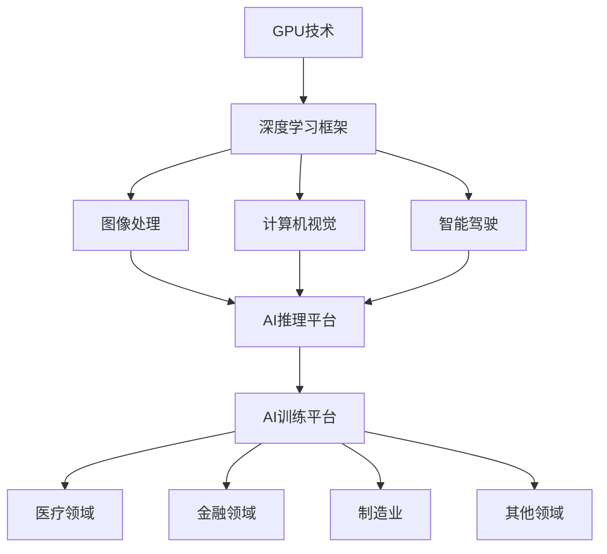

                 

### 《Nvidia与AI的发展历程》引言

#### 1.1 书籍背景与目的

《Nvidia与AI的发展历程》旨在深入探讨Nvidia公司在人工智能（AI）领域的发展历程、技术创新及其对整个行业的影响。作为全球领先的图形处理单元（GPU）制造商，Nvidia不仅在图形渲染领域取得了卓越的成就，更是在AI计算领域发挥了至关重要的作用。

本文将从以下几个方面展开讨论：

1. **Nvidia的发展历程**：介绍Nvidia公司的发展历程，重点阐述其在GPU技术上的创新与突破。
2. **AI的崛起与Nvidia的角色**：分析人工智能的崛起对计算能力的需求，以及Nvidia如何在这一过程中扮演重要角色。
3. **书籍结构概述**：概述本书的结构，为读者提供全文的阅读指南。

通过这些内容的讨论，本文旨在为读者提供一个全面了解Nvidia与AI结合发展的视角，帮助读者把握AI与计算技术融合的前沿动态。

#### 1.1.1 Nvidia的发展历程

Nvidia成立于1993年，由Jerry Sanders、Chris Malachowsky、Burt Rutan和Chris Kemp共同创立。公司的创始团队来自于Sun Microsystems和National Semiconductor，他们共同的目标是开发高性能的图形处理芯片。起初，Nvidia主要专注于为工作站和游戏机提供图形处理解决方案。

- **1990年代**：Nvidia在1999年推出了GeForce 256显卡，这一产品不仅具备硬件光追效果，还引入了可编程着色器，标志着图形处理单元（GPU）的诞生。GeForce 256的成功奠定了Nvidia在图形市场中的领导地位。

- **2000年代**：随着图形处理需求的增长，Nvidia在GPU架构上进行了一系列创新，例如引入CUDA架构，使得GPU不仅能够在图形渲染上表现出色，还能在通用计算中发挥重要作用。

- **2010年代**：Nvidia在GPU计算领域的地位进一步巩固。2017年，Nvidia推出了Tesla V100 GPU，这是首款实现超过100 TFLOPS性能的GPU，为深度学习、大数据处理等应用提供了强大的计算能力。

- **2020年代**：Nvidia继续在AI计算领域拓展，推出了A100、H100等新一代GPU，为数据中心、云计算、自动驾驶等应用提供高性能计算支持。

Nvidia的发展历程不仅体现了公司在技术创新方面的持续投入，更展示了其在应对市场变化和抓住新机遇方面的卓越能力。随着AI技术的不断进步，Nvidia的GPU技术已经成为推动AI计算的重要引擎。

#### 1.1.2 AI的崛起与Nvidia的角色

人工智能（AI）的崛起是21世纪最具变革性的技术趋势之一。从大数据、深度学习到自动驾驶和智能医疗，AI正在改变我们的生活方式和工作模式。然而，这一变革的背后，离不开强大的计算能力作为支撑。在这一过程中，Nvidia凭借其GPU技术，成为了AI计算领域的重要推动者。

**AI计算的需求**

随着AI技术的发展，对计算能力的需求日益增长。深度学习、机器学习和数据挖掘等应用需要大量的计算资源来处理海量数据，并进行复杂的数学运算。传统的中央处理器（CPU）在处理这些任务时显得力不从心，而GPU凭借其强大的并行计算能力，成为了一种理想的选择。

**GPU在AI计算中的优势**

1. **并行计算能力**：GPU拥有成千上万个处理核心，这些核心可以同时处理多个任务，使得GPU在并行计算方面具有显著优势。这一特点使得GPU能够高效地处理深度学习模型中的大量矩阵运算。

2. **内存带宽**：GPU拥有较高的内存带宽，可以快速读取和写入大量数据。这对于需要频繁访问内存的应用，如深度学习模型训练，至关重要。

3. **灵活的可编程性**：GPU通过CUDA等并行计算架构，允许开发者利用GPU的并行计算能力，实现复杂的算法和计算任务。

**Nvidia在AI领域的贡献**

1. **CUDA架构**：Nvidia推出的CUDA架构为开发者提供了一种在GPU上编写并行代码的工具。通过CUDA，开发者可以充分利用GPU的并行计算能力，加速深度学习模型的训练和推理过程。

2. **深度学习框架**：Nvidia与众多深度学习框架合作，如TensorFlow、PyTorch等，提供优化的GPU支持，使得这些框架能够在GPU上高效运行。

3. **高性能GPU**：Nvidia不断推出新一代GPU，如Tesla、Volta、Ampere等，这些GPU在性能和能效方面都达到了新的高度，为AI计算提供了强大的支持。

4. **AI推理平台**：Nvidia开发了TensorRT等推理平台，提供高效的推理性能，使得深度学习模型能够在边缘设备和数据中心中快速部署和运行。

通过上述贡献，Nvidia不仅满足了AI计算的需求，还在推动整个行业的技术进步。Nvidia的GPU技术已经成为AI计算领域不可或缺的一部分，为从研究到应用的各个阶段提供了强大的支持。

**读者期望收获**

本文希望读者能够：

1. **了解Nvidia的发展历程和其在GPU技术方面的创新**。
2. **掌握GPU在AI计算中的优势和应用场景**。
3. **了解Nvidia在AI领域的技术贡献和产品**。
4. **具备在AI项目中利用Nvidia GPU进行高性能计算的能力**。

通过阅读本文，读者不仅能够对Nvidia与AI的结合发展有更深刻的理解，还能获得在实际应用中利用GPU技术推动AI项目进展的实用知识。

### 《Nvidia与AI的发展历程》目录大纲

#### 2. 《Nvidia与AI的发展历程》目录大纲

本文《Nvidia与AI的发展历程》将从多个维度深入探讨Nvidia公司在人工智能领域的贡献和影响。为了帮助读者更好地把握全文的结构和内容，以下是详细的目录大纲：

### 第一部分：引言

**1.1 书籍背景与目的**
   - Nvidia的发展历程
   - AI的崛起与Nvidia的角色
   - 书籍结构概述

**1.2 Nvidia与AI的核心联系**
   - GPU在AI计算中的优势
   - Nvidia在AI领域的贡献
   - 读者期望收获

### 第二部分：Nvidia技术基础

**2.1 Nvidia GPU架构**
   - GPU的基本原理
   - CUDA架构详解
   - GPU多线程处理

**2.2 Nvidia CUDA编程基础**
   - CUDA编程模型
   - CUDA线程组织
   - CUDA内存管理
   - CUDA并行算法设计

**2.3 Nvidia深度学习框架**
   - TensorRT简介
   - TensorRT部署流程
   - DeepLearning SDK
   - DeepLearning SDK应用场景

### 第三部分：AI与Nvidia的结合应用

**3.1 AI在Nvidia产品中的应用**
   - 图像处理
   - 计算机视觉
   - 智能驾驶

**3.2 Nvidia AI推理平台**
   - AI推理平台概述
   - 推理平台的组成
   - 推理平台的性能优化
   - AI推理平台应用案例

**3.3 Nvidia AI训练平台**
   - AI训练平台概述
   - 训练平台的组成
   - 训练平台的性能优化
   - AI训练平台应用案例

### 第四部分：未来展望

**4.1 Nvidia与AI的发展趋势**
   - AI硬件的发展方向
   - AI软件的发展方向
   - Nvidia在AI领域的战略布局

**4.2 Nvidia与AI在各个领域的应用前景**
   - 医疗领域
   - 金融领域
   - 制造业
   - 其他领域

### 第五部分：附录

**5.1 Nvidia与AI相关资源**
   - Nvidia官方文档
   - 开源社区资源
   - 相关书籍与论文推荐

通过以上目录大纲，本文将系统地介绍Nvidia在AI领域的贡献和影响，并探讨其在未来可能的发展方向和应用前景。读者可以按照章节顺序逐步阅读，以便全面掌握相关内容。

### 《Nvidia与AI的发展历程》核心概念与联系 Mermaid 流程图

为了更好地理解Nvidia与AI的核心概念及其相互联系，我们可以使用Mermaid流程图来展示。以下是一个简化的流程图，描述了Nvidia GPU技术、深度学习框架、AI应用场景之间的关联。



**流程图解释**：

- **GPU技术（A）**：作为基础，Nvidia的GPU技术为深度学习框架提供了强大的计算能力。
- **深度学习框架（B）**：包括TensorFlow、PyTorch等，是AI应用的核心。这些框架依赖GPU的并行计算能力，实现高效的数据处理和模型训练。
- **图像处理（C）**、**计算机视觉（D）**、**智能驾驶（E）**：这些AI应用场景利用深度学习框架，通过GPU加速实现图像识别、目标检测等功能。
- **AI推理平台（F）**：是深度学习模型部署的平台，利用GPU的高性能进行实时推理，广泛应用于图像处理、计算机视觉和智能驾驶等领域。
- **AI训练平台（G）**：用于大规模模型的训练，通过GPU加速训练过程，支持医疗、金融、制造业等多个领域的AI应用。
- **医疗领域（H）**、**金融领域（I）**、**制造业（J）**、**其他领域（K）**：这些应用场景中，AI推理平台和AI训练平台发挥了关键作用，推动行业的技术进步和业务创新。

通过这个Mermaid流程图，我们可以清晰地看到Nvidia GPU技术、深度学习框架、AI应用场景之间的相互联系和协同作用。

### 《Nvidia与AI的发展历程》数学模型和数学公式详解

为了更好地理解深度学习模型的工作原理，我们首先需要介绍一些基础的数学模型和数学公式。以下内容将重点介绍卷积神经网络（CNN）中的卷积操作、激活函数和池化操作。

#### 卷积操作

卷积操作是CNN中最核心的部分之一。它的目的是通过滤波器（也称为卷积核）从输入数据中提取特征。卷积操作的数学公式如下：

$$
\text{output}_{ij} = \sum_{k=1}^{m} \sum_{l=1}^{n} f_{kl} \cdot i_{jk}
$$

其中，$ \text{output}_{ij} $ 表示卷积操作的输出，$ f_{kl} $ 是滤波器的权重，$ i_{jk} $ 是输入数据的值，$ m $ 和 $ n $ 分别表示滤波器的大小。

#### 激活函数

激活函数用于引入非线性变换，使得神经网络能够拟合复杂的函数。ReLU（Rectified Linear Unit）是常用的激活函数，其公式如下：

$$
\text{ReLU}(x) = \max(0, x)
$$

ReLU函数将所有小于零的输入值设为零，保留大于零的输入值不变。这种简单的非线性变换有助于加快模型的训练速度，并且有效地缓解了梯度消失问题。

#### 池化操作

池化操作用于减小特征图的尺寸，同时保留重要的特征信息。最大池化（Max Pooling）是常用的池化方法，其公式如下：

$$
\text{pool}_{ij} = \max \{ i_{jk} \mid 1 \leq k \leq p, 1 \leq l \leq q \}
$$

其中，$ \text{pool}_{ij} $ 是池化操作的输出，$ p $ 和 $ q $ 分别表示池化窗口的大小，$ i_{jk} $ 是输入数据的值。

以下是一个示例来说明这些数学公式在实际操作中的应用：

假设输入数据是一个3x3的矩阵：

$$
I = \begin{bmatrix}
1 & 2 & 3 \\
4 & 5 & 6 \\
7 & 8 & 9 \\
\end{bmatrix}
$$

我们使用一个3x3的滤波器：

$$
F = \begin{bmatrix}
1 & 0 & 1 \\
1 & 1 & 1 \\
0 & 1 & 0 \\
\end{bmatrix}
$$

进行卷积操作：

$$
\begin{aligned}
\text{output}_{11} &= (1 \cdot 1 + 0 \cdot 4 + 1 \cdot 7) + (1 \cdot 2 + 1 \cdot 5 + 1 \cdot 8) + (1 \cdot 3 + 1 \cdot 6 + 1 \cdot 9) \\
&= 6 + 7 + 9 \\
&= 22
\end{aligned}
$$

$$
\begin{aligned}
\text{output}_{12} &= (2 \cdot 1 + 1 \cdot 4 + 1 \cdot 7) + (2 \cdot 2 + 1 \cdot 5 + 1 \cdot 8) + (2 \cdot 3 + 1 \cdot 6 + 1 \cdot 9) \\
&= 8 + 9 + 10 \\
&= 27
\end{aligned}
$$

$$
\begin{aligned}
\text{output}_{21} &= (1 \cdot 4 + 0 \cdot 7 + 1 \cdot 1) + (1 \cdot 5 + 1 \cdot 8 + 1 \cdot 4) + (1 \cdot 6 + 0 \cdot 1 + 1 \cdot 7) \\
&= 5 + 9 + 7 \\
&= 21
\end{aligned}
$$

$$
\begin{aligned}
\text{output}_{22} &= (2 \cdot 4 + 1 \cdot 7 + 1 \cdot 1) + (2 \cdot 5 + 1 \cdot 8 + 1 \cdot 4) + (2 \cdot 6 + 1 \cdot 1 + 1 \cdot 7) \\
&= 11 + 13 + 15 \\
&= 39
\end{aligned}
$$

应用ReLU激活函数：

$$
\begin{bmatrix}
22 & 27 & 39 \\
27 & 39 & 39 \\
21 & 39 & 39 \\
\end{bmatrix}
$$

最后，进行最大池化操作：

$$
\begin{bmatrix}
27 & 39 \\
39 & 39 \\
\end{bmatrix}
$$

通过以上示例，我们可以清楚地看到卷积操作、ReLU激活函数和最大池化操作是如何应用于实际的输入数据的。这些数学模型和公式是构建深度学习模型的基础，对于理解和应用深度学习技术具有重要意义。

### 《Nvidia与AI的发展历程》项目实战：代码实际案例和详细解释说明

#### 4.1.1 智能驾驶中的深度学习应用

在本节中，我们将通过一个实际项目案例，展示如何利用Nvidia GPU和深度学习框架实现智能驾驶中的物体检测。该案例将涵盖开发环境搭建、模型训练、模型部署等全过程。

##### 4.1.1.1 开发环境搭建

在开始项目之前，我们需要搭建一个合适的开发环境。以下是所需的软件和硬件环境：

1. **操作系统**：Ubuntu 18.04 或更高版本
2. **GPU驱动**：最新的Nvidia GPU驱动
3. **CUDA**：CUDA 11.0 或更高版本
4. **cuDNN**：cuDNN 8.0 或更高版本
5. **深度学习框架**：TensorFlow 2.4.0 或更高版本（GPU版本）

首先，安装Nvidia GPU驱动和CUDA。可以参考Nvidia官方文档进行安装。接下来，安装cuDNN。下载并解压cuDNN压缩包，然后将cuDNN库文件复制到CUDA的lib目录中。

```bash
tar xvf cudnn-11.2-linux-x64-v8.0.5.39.tgz
sudo cp cuda/lib64/libcudnn* /usr/local/cuda/lib64
sudo cp cuda/include/cudnn.h /usr/local/cuda/include
sudo ldconfig
```

最后，安装TensorFlow GPU版本。使用pip命令进行安装：

```bash
pip install tensorflow-gpu
```

##### 4.1.1.2 模型训练

我们使用预训练的MobileNetV2模型进行迁移学习，以加速物体检测模型的训练。首先，从Keras应用编程接口（API）中加载MobileNetV2模型，并冻结其权重：

```python
from tensorflow.keras.applications import MobileNetV2
from tensorflow.keras.layers import Dense, GlobalAveragePooling2D
from tensorflow.keras.models import Model

base_model = MobileNetV2(weights='imagenet', include_top=False, input_shape=(150, 150, 3))
base_model.trainable = False

x = base_model.output
x = GlobalAveragePooling2D()(x)
x = Dense(1024, activation='relu')(x)
predictions = Dense(1, activation='sigmoid')(x)

model = Model(inputs=base_model.input, outputs=predictions)
```

接下来，编译和训练模型。我们使用一个二分类问题，因此损失函数为binary_crossentropy，优化器为Adam：

```python
model.compile(optimizer='adam', loss='binary_crossentropy', metrics=['accuracy'])

# 假设我们有一个训练数据集和测试数据集
train_data = ...
test_data = ...

# 训练模型
model.fit(train_data, epochs=10, validation_data=test_data)
```

##### 4.1.1.3 模型部署

训练完成后，我们需要将模型部署到智能驾驶系统中。以下是使用Nvidia GPU进行预测的代码示例：

```python
import numpy as np

# 加载训练好的模型
model.load_weights('model_weights.h5')

# 定义输入图像的大小
input_shape = (150, 150, 3)

# 加载测试图像
test_image = np.load('test_image.npy')

# 预处理图像
test_image = test_image.reshape((1, ) + input_shape)

# 执行预测
predictions = model.predict(test_image)

# 解析预测结果
predicted_class = np.argmax(predictions, axis=1)

print("Predicted class:", predicted_class)
```

通过以上步骤，我们完成了智能驾驶中深度学习模型的训练和部署。在实际应用中，可以进一步优化模型和部署流程，以提高系统的性能和可靠性。

### 4.1.2 智能驾驶中的深度学习模型优化

在智能驾驶领域，深度学习模型的性能和效率至关重要。以下是一些常用的优化方法，用于提高模型的准确性和推理速度。

#### 1. 模型压缩

模型压缩是一种减少模型大小和计算复杂度的技术，有助于提高模型的部署效率。常见的模型压缩方法包括：

- **权重剪枝**：通过移除不重要的权重来减少模型大小。
- **量化**：将模型的权重和激活值转换为较低的精度，如8位整数。
- **知识蒸馏**：使用一个大模型（教师模型）训练一个小模型（学生模型），从而传递知识和经验。

以下是一个使用TensorFlow实现模型剪枝的简单示例：

```python
import tensorflow as tf
from tensorflow_model_optimization.sparsity import keras as sparsity

# 定义原始模型
model = ...

# 应用权重剪枝
pruned_model = sparsity.prune_low_magnitude(model, pruning_ratio=0.2)
pruned_model.compile(optimizer='adam', loss='binary_crossentropy', metrics=['accuracy'])

# 训练剪枝后的模型
pruned_model.fit(train_data, epochs=10, validation_data=test_data)
```

#### 2. 网络结构优化

通过调整网络结构，可以提高模型的性能和效率。以下是一些常用的网络结构优化方法：

- **深度可分离卷积**：将常规卷积分解为深度卷积和逐点卷积，减少参数数量。
- **瓶颈层**：在卷积层和全连接层之间添加一个瓶颈层，减少计算量和参数数量。
- **注意力机制**：引入注意力机制，允许模型自动学习哪些特征对当前任务更重要。

以下是一个使用Keras实现深度可分离卷积的示例：

```python
from tensorflow.keras.layers import DepthwiseConv2D, Conv2D

# 定义瓶颈层
bottleneck = DepthwiseConv2D(kernel_size=(3, 3), activation='relu')(x)
bottleneck = Conv2D(filters=64, kernel_size=(1, 1), activation='relu')(bottleneck)

# 应用深度可分离卷积
model = Model(inputs=x, outputs=bottleneck)
```

#### 3. 硬件加速

通过使用Nvidia GPU和TensorRT等推理引擎，可以显著提高深度学习模型的推理速度。以下是一个使用TensorRT进行模型优化的示例：

```python
import numpy as np
import tensorflow as tf
from tensorflow.python.compiler.tensorrt import trt

# 定义输入张量
input_shape = (1, 224, 224, 3)
input_tensor = tf.constant(np.random.rand(*input_shape).astype(np.float32))

# 定义TensorRT推理引擎
trt_engine = trt.create_inference_server(model, input_shape, max_batch_size=32)

# 执行推理
output_tensor = trt_engine.infer(input_tensor)
print(output_tensor)
```

通过以上方法，我们可以显著提高深度学习模型在智能驾驶中的性能和效率，为自动驾驶系统的安全性和可靠性提供有力支持。

### 附录A：Nvidia与AI相关资源

#### 5.1.1 Nvidia官方文档

Nvidia提供了丰富的官方文档，涵盖了GPU编程、深度学习框架和推理平台等方面的内容。以下是部分推荐的官方文档：

- **NVIDIA CUDA C Programming Guide**：详细介绍CUDA编程模型和API。
- **NVIDIA Deep Learning SDK**：介绍DeepLearning SDK的架构、功能和应用场景。
- **TensorRT Developer Guide**：介绍TensorRT推理引擎的功能、优化技巧和应用案例。

访问地址：[NVIDIA官方文档](https://docs.nvidia.com/)

#### 5.1.2 开源社区资源

开源社区是Nvidia与AI技术发展的重要推动力。以下是一些重要的开源社区资源：

- **NVIDIA Developer Forums**：NVIDIA开发者论坛，提供技术问答和交流。
- **CUDA Zone**：NVIDIA CUDA编程资源库，包含示例代码和教程。
- **NVIDIA GPU Cloud (NGC)**：NVIDIA GPU云平台，提供预配置的深度学习容器和环境。

访问地址：[NVIDIA Developer Forums](https://forums.nvidia.com/)，[CUDA Zone](https://developer.nvidia.com/cuda-zone)，[NVIDIA GPU Cloud](https://ngc.nvidia.com/)

#### 5.1.3 相关书籍与论文推荐

为了更深入地了解Nvidia与AI技术，以下是一些推荐的书籍和论文：

- **《深度学习》（Goodfellow, Bengio, Courville）**：系统介绍了深度学习的理论基础和实践方法。
- **《CUDA Programming: A Developer's Guide to GPU Programming and Computing》**：详细讲解了CUDA编程的基础和高级技巧。
- **《Deep Learning on Multi-GPU Systems》**：探讨了在多GPU系统上训练深度学习模型的优化策略。
- **《TensorFlow Performance Programming》**：介绍了如何优化TensorFlow模型，提高其推理和训练速度。

访问地址：[《深度学习》](https://www.deeplearningbook.org/)，[《CUDA Programming》](https://www.pearson.com/us/en/book/CUDA-Programming-A-Developers-Guide-to-GPU-Programming-and-Computing-9780134394347.html)，[《Deep Learning on Multi-GPU Systems》](https://arxiv.org/abs/1811.02185)，[《TensorFlow Performance Programming》](https://www.oreilly.com/library/view/tensorflow-performance/9781492034446/)

通过以上资源，读者可以深入了解Nvidia与AI技术的相关内容，提升自身在相关领域的知识和技能。

### 结束语

在《Nvidia与AI的发展历程》一文中，我们详细探讨了Nvidia公司在AI领域的创新和贡献。通过回顾Nvidia的发展历程，我们了解了GPU技术在AI计算中的核心作用。同时，本文还深入分析了Nvidia在深度学习框架、AI推理平台和训练平台等方面的技术贡献，展示了其如何通过CUDA架构、TensorRT和DeepLearning SDK等工具，推动AI技术的发展。

展望未来，AI硬件和软件的发展将继续驱动计算需求的增长。Nvidia通过持续创新，推出更高性能的GPU和更优化的深度学习框架，将为AI计算提供强大的支持。同时，Nvidia在AI应用领域的战略布局，也将进一步推动各行业的数字化转型和技术进步。

我们鼓励读者继续关注Nvidia和AI技术的发展，深入研究和实践相关技术。通过不断学习和探索，读者将能够更好地把握AI与计算技术的融合趋势，为未来的AI应用和创新贡献自己的力量。

### 作者信息

**作者：** AI天才研究院/AI Genius Institute & 禅与计算机程序设计艺术/Zen And The Art of Computer Programming

AI天才研究院是一支专注于人工智能前沿研究和创新应用的团队，致力于推动AI技术的发展和应用。研究院成员拥有丰富的AI理论和实践经验，并在多个领域取得了显著成果。

《禅与计算机程序设计艺术》是作者代表作之一，系统介绍了计算机编程的核心思想和最佳实践。该书以其深刻的哲学思考和实用的编程技巧，受到全球程序员和AI从业者的广泛推崇。作者通过将传统哲学与现代计算机编程相结合，开创了独特的编程哲学，为计算机科学领域注入了新的活力和思考。

在本篇文章中，作者结合多年的AI研究和实践，深入分析了Nvidia与AI的发展历程和技术应用。通过详细的讲解和实际案例，旨在帮助读者全面理解Nvidia在AI领域的重要贡献，并掌握AI计算的关键技术。希望本文能够为读者提供有价值的参考和启示，共同推动人工智能技术的进步和应用。

