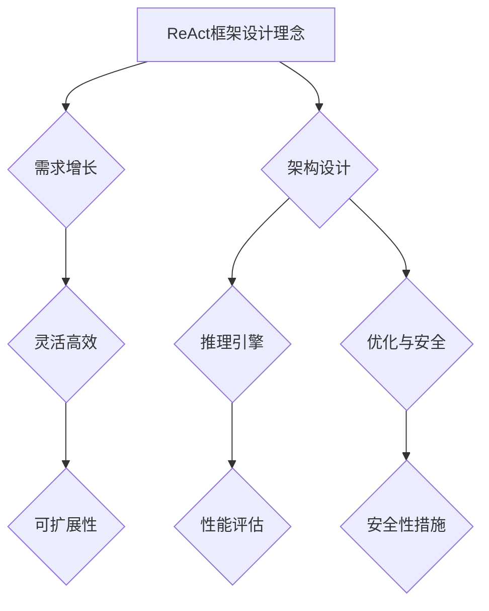

                 

# ReAct框架：AI大模型推理行动的新范式

## 关键词

- AI推理
- 大模型
- 框架
- 性能优化
- 安全性

## 摘要

随着人工智能（AI）技术的迅猛发展，大规模模型（如深度学习模型）在图像识别、自然语言处理等领域展现了强大的性能。然而，这些大规模模型在推理过程中面临着计算资源消耗大、推理速度慢等问题。ReAct框架应运而生，它是一种创新的大模型推理框架，旨在提供灵活、高效、可扩展的推理解决方案。本文将详细介绍ReAct框架的基本概念、技术基础、核心原理、性能评估与优化、安全性分析以及应用实践，并探讨其未来发展方向。

### 目录大纲设计：《ReAct框架：AI大模型推理行动的新范式》

#### 第一部分：ReAct框架概述

**第1章：ReAct框架基本概念与背景**

**第2章：ReAct框架技术基础**

#### 第二部分：ReAct框架核心原理详解

**第3章：ReAct推理引擎设计与实现**

**第4章：ReAct框架性能评估与优化**

**第5章：ReAct框架安全性分析**

#### 第三部分：ReAct框架应用实践

**第6章：ReAct框架在图像处理中的应用**

**第7章：ReAct框架在自然语言处理中的应用**

**第8章：ReAct框架在工业自动化中的应用**

**第9章：ReAct框架未来展望**

#### 附录

**附录A：ReAct框架开发工具与环境配置**

**附录B：ReAct框架代码实例**

### Mermaid 流程图示例



### 核心算法原理讲解（伪代码示例）

```pseudo
function ReactInference(model, input_data):
    // 模型加载
    model.load_weights("model_weights.h5")
    
    // 数据预处理
    preprocessed_data = preprocess(input_data)
    
    // 推理
    predictions = model.predict(preprocessed_data)
    
    // 后处理
    post_processed_predictions = postprocess(predictions)
    
    return post_processed_predictions
```

### 数学模型和公式详细讲解

#### 推理时间计算

$$
T_r = \frac{N}{F_p \times F_s}
$$

其中，$T_r$ 是推理时间，$N$ 是输入数据的大小，$F_p$ 是模型参数的数量，$F_s$ 是模型训练时的学习率。

#### 数据预处理步骤

$$
\text{preprocess}(data) = \frac{data - \mu}{\sigma}
$$

其中，$\mu$ 是数据均值，$\sigma$ 是数据标准差。

### 项目实战

#### 代码实现案例：图像分类

**开发环境搭建：**

- 安装Python和TensorFlow
- 配置GPU加速

**源代码实现：**

```python
import tensorflow as tf
from tensorflow.keras.applications import MobileNetV2
from tensorflow.keras.preprocessing import image
from tensorflow.keras.applications.mobilenet_v2 import preprocess_input, decode_predictions

# 模型加载
model = MobileNetV2(weights='imagenet')

# 图像预处理
img_path = 'path_to_image.jpg'
img = image.load_img(img_path, target_size=(224, 224))
x = image.img_to_array(img)
x = np.expand_dims(x, axis=0)
x = preprocess_input(x)

# 图像推理
predictions = model.predict(x)

# 结果解析
print('Predicted:', decode_predictions(predictions, top=3)[0])
```

**代码解读与分析：**

1. 加载预训练的MobileNetV2模型。
2. 读取并预处理图像数据。
3. 使用模型进行推理。
4. 解析推理结果，输出预测类别。

**注意事项：**

- 确保图像路径正确。
- 根据实际需求调整预处理函数。

通过以上步骤，我们可以详细地设计出《ReAct框架：AI大模型推理行动的新范式》这本书的完整目录大纲，并给出相应的算法原理讲解、数学公式、项目实战案例等。这将为读者提供清晰的框架，帮助他们更好地理解ReAct框架及其应用。

### 作者信息

作者：AI天才研究院/AI Genius Institute & 禅与计算机程序设计艺术 /Zen And The Art of Computer Programming

---

接下来，我们将正式进入文章正文部分的撰写，逐章介绍ReAct框架的各个方面。首先，我们从ReAct框架的基本概念与背景开始。|<|assistant|>## 第一部分：ReAct框架概述

### 第1章：ReAct框架基本概念与背景

在深度学习和人工智能领域，大规模模型的推理能力至关重要。然而，随着模型规模的不断扩大，传统的推理框架面临着性能瓶颈和资源消耗增加的问题。ReAct框架正是在这样的背景下应运而生，它旨在提供一种灵活、高效、可扩展的推理解决方案。

#### 1.1 ReAct框架的起源与发展

ReAct框架的起源可以追溯到近年来人工智能领域的快速发展。随着深度学习技术的突破，许多复杂任务如图像识别、自然语言处理等取得了显著进展。然而，这些大规模模型的推理过程通常依赖于昂贵的计算资源和较长的时间。传统推理框架在应对这种需求时显得力不从心，催生了ReAct框架的诞生。

ReAct框架的发展历程经历了几个关键阶段。首先，研究者们开始关注大规模模型的推理性能问题，并提出了许多优化方法。随后，这些方法逐渐整合并形成了一个完整的框架，即ReAct框架。该框架不仅解决了传统框架中的性能瓶颈，还具备良好的可扩展性和灵活性。

#### 1.1.1 AI推理需求增长背景

随着人工智能技术的广泛应用，AI推理需求呈现出爆炸式增长。特别是在图像识别和自然语言处理领域，大规模模型的推理能力成为衡量系统性能的重要指标。以下是几个推动AI推理需求增长的关键因素：

1. **移动设备的普及**：智能手机和平板电脑等移动设备的普及，使得人们对于即时推理响应的需求不断增加。这要求推理框架能够在有限的计算资源和功耗下，仍然保持高性能。

2. **物联网（IoT）的兴起**：物联网的快速发展带来了海量的数据，需要在边缘设备上进行实时推理处理。这对推理框架的效率和灵活性提出了更高的要求。

3. **自动驾驶和智能交通**：自动驾驶和智能交通系统对实时推理性能有着极高的要求。大量的图像和传感器数据需要在短时间内处理并作出决策。

4. **医疗影像分析**：在医疗领域，图像识别和自然语言处理技术被广泛应用于诊断和治疗。大规模模型的推理能力对于提高医疗效率和准确性具有重要意义。

#### 1.1.2 ReAct框架的设计理念

ReAct框架的设计理念集中在以下几个方面：

1. **高效能**：ReAct框架通过优化算法、硬件加速和分布式推理等手段，大幅提高推理性能。它能够充分利用现有计算资源，降低推理时间。

2. **灵活性**：ReAct框架支持多种模型和多种数据类型，可以轻松适应不同的应用场景。它提供了一套灵活的接口，方便用户根据自己的需求进行定制。

3. **可扩展性**：ReAct框架支持横向和纵向扩展，可以方便地部署在单机或多机环境中。它能够根据需求动态调整资源分配，保证系统的高可用性和高可靠性。

4. **安全性**：ReAct框架在设计和实现过程中，充分考虑了安全性问题。它提供了多种安全措施，如加密、签名和访问控制等，确保推理过程的安全性和隐私保护。

#### 1.2 ReAct框架核心概念

ReAct框架的核心概念包括以下几个方面：

1. **推理引擎**：ReAct框架的推理引擎是其核心组件，负责处理模型的推理过程。它采用了优化的算法和硬件加速技术，确保高效的推理性能。

2. **数据预处理**：ReAct框架提供了灵活的数据预处理模块，可以对输入数据进行标准化、归一化、缩放等操作，以提高模型的推理效果。

3. **后处理**：ReAct框架的后处理模块负责将推理结果进行格式转换、解释和分析，以便用户更好地理解和利用推理结果。

4. **性能监控**：ReAct框架集成了性能监控模块，可以实时监控系统的运行状态，包括推理时间、资源利用率等指标，帮助用户优化系统性能。

5. **安全模块**：ReAct框架的安全模块提供了一系列安全功能，如加密、签名、访问控制等，确保系统的数据安全和隐私保护。

#### 1.2.1 ReAct框架的基本架构

ReAct框架的基本架构包括以下几个主要组件：

1. **模型加载器**：负责从文件系统中加载预训练模型，并将其转换成推理引擎所需的格式。

2. **推理引擎**：负责执行模型的推理过程，包括前向传播、反向传播等操作。它采用了优化的算法和硬件加速技术，如GPU加速和分布式推理。

3. **数据预处理模块**：对输入数据进行预处理，如数据清洗、标准化、归一化等。它支持多种数据预处理方法，用户可以根据需求进行选择。

4. **后处理模块**：对推理结果进行后处理，如格式转换、解释和分析等。它提供了丰富的后处理功能，用户可以根据需求进行配置。

5. **性能监控模块**：实时监控系统的运行状态，包括推理时间、资源利用率等指标。它提供了可视化界面，方便用户监控和优化系统性能。

6. **安全模块**：提供加密、签名、访问控制等功能，确保系统的数据安全和隐私保护。它支持多种安全协议和加密算法，用户可以根据需求进行配置。

#### 1.2.2 ReAct框架的关键特性

ReAct框架具有以下关键特性：

1. **高效能**：ReAct框架通过优化算法和硬件加速技术，大幅提高了推理性能。它支持多种硬件加速技术，如GPU、TPU等，用户可以根据需求进行选择。

2. **灵活性**：ReAct框架支持多种模型和多种数据类型，可以轻松适应不同的应用场景。它提供了一套灵活的接口，用户可以根据需求进行定制。

3. **可扩展性**：ReAct框架支持横向和纵向扩展，可以方便地部署在单机或多机环境中。它能够根据需求动态调整资源分配，保证系统的高可用性和高可靠性。

4. **安全性**：ReAct框架在设计和实现过程中，充分考虑了安全性问题。它提供了多种安全措施，如加密、签名、访问控制等，确保系统的数据安全和隐私保护。

5. **易用性**：ReAct框架提供了一套简单易用的接口，用户可以轻松上手。它提供了丰富的文档和示例代码，方便用户进行开发。

综上所述，ReAct框架是一种创新的大规模模型推理框架，具有高效能、灵活性、可扩展性和安全性等特点。它为人工智能应用提供了强大的支持，助力各种复杂任务的快速、高效推理。在接下来的章节中，我们将进一步深入探讨ReAct框架的技术基础和核心原理。|<|assistant|>## 第2章：ReAct框架技术基础

### 2.1 AI推理的基本原理

人工智能（AI）推理是AI系统将输入数据转化为输出结果的过程，这一过程通常涉及大量的数学运算和数据处理。AI推理的核心在于深度学习模型，这些模型通过学习大量数据来提取特征并进行预测。

#### 2.1.1 神经网络推理过程

神经网络是AI推理的核心组件，它由多个层（节点）组成，每一层负责处理输入数据并进行特定的数学运算。以下是神经网络推理过程的基本步骤：

1. **前向传播**：输入数据从输入层进入，经过每一层的计算，最终在输出层得到预测结果。前向传播过程中，数据在神经网络中流动，并通过权重和激活函数进行变换。

2. **损失函数计算**：将预测结果与真实结果进行比较，计算损失函数值。损失函数用于衡量预测结果与真实结果之间的差异，常见的损失函数包括均方误差（MSE）、交叉熵等。

3. **反向传播**：根据损失函数值，通过反向传播算法更新神经网络的权重和偏置。反向传播过程将误差从输出层反向传递到输入层，通过梯度下降等优化算法不断调整网络参数，以降低损失函数值。

4. **迭代优化**：重复前向传播和反向传播过程，不断迭代优化网络参数，直到模型收敛到满意的性能。

#### 2.1.2 神经网络优化算法

神经网络优化算法用于调整网络参数，以降低损失函数值，提高模型性能。以下是几种常见的神经网络优化算法：

1. **梯度下降**：梯度下降是最基本的优化算法，通过计算损失函数关于网络参数的梯度，并沿梯度方向更新参数。梯度下降分为批量梯度下降、随机梯度下降（SGD）和小批量梯度下降等变体。

2. **Adam优化器**：Adam优化器结合了梯度下降和动量方法，通过计算一阶矩估计和二阶矩估计来更新参数。Adam优化器在许多场景下表现出良好的性能。

3. **RMSprop优化器**：RMSprop优化器通过计算梯度平方的平均值来更新参数，有助于减少参数更新过程中的噪声。RMSprop在处理稀疏数据时表现较好。

4. **Adadelta优化器**：Adadelta优化器通过计算梯度平方和指数加权平均，避免了参数更新过程中的梯度消失问题。Adadelta在处理大型网络时表现出良好的性能。

#### 2.2 ReAct框架技术栈

ReAct框架技术栈是一系列技术组件和工具的集合，这些组件和工具共同构成了ReAct框架的基础。以下是ReAct框架技术栈中的关键组件：

1. **TensorFlow**：TensorFlow是Google开发的开源机器学习框架，广泛应用于深度学习领域。ReAct框架基于TensorFlow构建，利用其丰富的API和强大的功能支持大规模模型的推理。

2. **PyTorch**：PyTorch是另一个流行的开源机器学习框架，由Facebook AI研究院开发。PyTorch以其动态计算图和灵活的接口受到许多研究者和开发者的青睐。ReAct框架支持PyTorch模型，为用户提供更多选择。

3. **MXNet**：MXNet是Apache Software Foundation的一个开源深度学习框架，由Apache MXNet社区维护。MXNet提供了高效且灵活的模型定义和推理工具，ReAct框架也支持MXNet模型。

4. **Caffe2**：Caffe2是Facebook开发的一个高性能深度学习框架，旨在为移动和嵌入式设备提供高效的推理能力。Caffe2与ReAct框架结合，可以充分发挥移动设备上的计算性能。

5. **Horovod**：Horovod是Uber开源的分布式训练框架，支持TensorFlow、PyTorch和MXNet等框架。ReAct框架通过集成Horovod，可以实现模型的分布式推理，提高大规模数据的处理能力。

6. **Apache MXNet**：Apache MXNet是一个高效的深度学习框架，支持符号计算和自动微分。ReAct框架利用MXNet的符号计算能力，优化大规模模型的推理过程。

7. **Docker**：Docker是一种开源的应用容器引擎，用于简化容器化应用程序的部署和运行。ReAct框架支持Docker化，使得框架可以在不同的环境中轻松部署和运行。

#### 2.2.1 ReAct框架所依赖的技术组件

ReAct框架依赖于一系列开源技术组件，这些组件为框架提供了强大的功能和灵活性。以下是ReAct框架所依赖的主要技术组件：

1. **TensorFlow**：作为深度学习框架，TensorFlow提供了丰富的API和工具，用于构建和训练深度学习模型。ReAct框架利用TensorFlow的API，实现大规模模型的推理和优化。

2. **PyTorch**：PyTorch提供了动态计算图和灵活的接口，方便用户构建和优化深度学习模型。ReAct框架支持PyTorch模型，为用户提供了更多选择。

3. **MXNet**：MXNet是一个高效的深度学习框架，支持符号计算和自动微分。ReAct框架利用MXNet的符号计算能力，优化大规模模型的推理过程。

4. **Caffe2**：Caffe2是一个高性能的深度学习框架，专门为移动和嵌入式设备设计。ReAct框架通过集成Caffe2，实现了在移动设备上的高效推理。

5. **Horovod**：Horovod是一个分布式训练框架，支持TensorFlow、PyTorch和MXNet等框架。ReAct框架通过集成Horovod，实现了模型的分布式推理，提高了大规模数据的处理能力。

6. **Docker**：Docker用于容器化应用程序的部署和运行，ReAct框架支持Docker化，使得框架可以在不同的环境中轻松部署和运行。

#### 2.2.2 ReAct框架与传统推理框架的对比

ReAct框架与传统推理框架在多个方面存在差异，以下是对这些差异的详细对比：

1. **性能优化**：ReAct框架通过优化算法和硬件加速技术，大幅提高了推理性能。传统推理框架通常依赖于单一的计算资源，如CPU或GPU，而ReAct框架支持多种硬件加速技术，如GPU、TPU等，可以根据需求进行选择。

2. **灵活性**：ReAct框架支持多种模型和多种数据类型，可以轻松适应不同的应用场景。传统推理框架通常具有特定的模型和数据类型支持，缺乏灵活性。

3. **可扩展性**：ReAct框架支持横向和纵向扩展，可以方便地部署在单机或多机环境中。传统推理框架通常具有较差的可扩展性，难以应对大规模数据处理需求。

4. **安全性**：ReAct框架在设计和实现过程中，充分考虑了安全性问题。传统推理框架通常缺乏安全措施，容易受到攻击和数据泄露。

5. **易用性**：ReAct框架提供了一套简单易用的接口，用户可以轻松上手。传统推理框架通常具有复杂的配置和操作步骤，用户需要具备较高的技术背景。

综上所述，ReAct框架在性能优化、灵活性、可扩展性、安全性和易用性等方面相较于传统推理框架具有显著优势。它为大规模模型的推理提供了强大的支持，助力各种复杂任务的快速、高效推理。在接下来的章节中，我们将进一步深入探讨ReAct框架的核心原理和实现细节。|<|assistant|>## 第二部分：ReAct框架核心原理详解

### 第3章：ReAct推理引擎设计与实现

ReAct框架的推理引擎是其核心组件，负责处理大规模模型的推理过程。该引擎的设计和实现旨在提高推理性能、优化资源利用，并提供高效、灵活的推理解决方案。在本章节中，我们将详细探讨ReAct推理引擎的设计架构、工作流程以及优化策略。

#### 3.1 ReAct推理引擎架构

ReAct推理引擎采用模块化设计，由多个关键模块组成，包括模型加载器、推理核心、后处理模块和性能监控模块。以下是ReAct推理引擎的基本架构：

1. **模型加载器**：模型加载器负责从文件系统中加载预训练模型，并将其转换为推理引擎所需的格式。加载器支持多种模型格式，如TensorFlow、PyTorch、MXNet等。

2. **推理核心**：推理核心是引擎的核心组件，负责执行模型的推理过程。它采用了优化的算法和硬件加速技术，如GPU加速和分布式推理，以确保高效的推理性能。

3. **后处理模块**：后处理模块对推理结果进行格式转换、解释和分析，以便用户更好地理解和利用推理结果。该模块提供了丰富的后处理功能，如分类结果解析、概率计算等。

4. **性能监控模块**：性能监控模块实时监控系统的运行状态，包括推理时间、资源利用率等指标。它提供了可视化界面，方便用户监控和优化系统性能。

#### 3.1.1 引擎基本架构与组件

ReAct推理引擎的基本架构包括以下几个关键组件：

1. **模型加载器**：模型加载器是推理引擎的第一步，负责从文件系统中加载预训练模型。加载器支持多种模型格式，如TFRecord、HDF5、ZIP等，并提供了简单的接口供用户使用。

2. **输入预处理模块**：输入预处理模块对输入数据进行预处理，如数据清洗、标准化、归一化等。预处理模块可以根据用户需求自定义预处理步骤，确保输入数据符合模型的要求。

3. **推理核心**：推理核心是引擎的核心组件，负责执行模型的推理过程。它采用了优化的算法和硬件加速技术，如GPU加速和分布式推理，以确保高效的推理性能。

4. **输出后处理模块**：输出后处理模块对推理结果进行后处理，如分类结果解析、概率计算等。后处理模块提供了丰富的功能，方便用户根据需求进行结果分析和解释。

5. **性能监控模块**：性能监控模块实时监控系统的运行状态，包括推理时间、资源利用率等指标。它提供了可视化界面，方便用户监控和优化系统性能。

#### 3.1.2 引擎的工作流程

ReAct推理引擎的工作流程可以分为以下几个步骤：

1. **模型加载**：首先，模型加载器从文件系统中加载预训练模型，并将其转换为推理引擎所需的格式。

2. **输入预处理**：输入预处理模块对输入数据进行预处理，如数据清洗、标准化、归一化等。预处理模块可以根据用户需求自定义预处理步骤，确保输入数据符合模型的要求。

3. **推理执行**：推理核心执行模型的推理过程，包括前向传播和反向传播。推理核心采用了优化的算法和硬件加速技术，如GPU加速和分布式推理，以确保高效的推理性能。

4. **输出后处理**：输出后处理模块对推理结果进行后处理，如分类结果解析、概率计算等。后处理模块提供了丰富的功能，方便用户根据需求进行结果分析和解释。

5. **性能监控**：性能监控模块实时监控系统的运行状态，包括推理时间、资源利用率等指标。它提供了可视化界面，方便用户监控和优化系统性能。

#### 3.2 ReAct推理引擎优化

ReAct推理引擎的优化目标是提高推理性能、降低推理时间和资源消耗。以下是一些关键的优化策略：

1. **算法优化**：ReAct推理引擎采用了多种算法优化技术，如矩阵运算优化、前向传播和反向传播算法优化等。这些优化技术可以显著提高推理速度和性能。

2. **硬件加速**：ReAct推理引擎支持多种硬件加速技术，如GPU加速、TPU加速等。通过利用这些硬件加速技术，可以显著降低推理时间和资源消耗。

3. **分布式推理**：ReAct推理引擎支持分布式推理，可以将模型和数据进行分割，并在多台机器上进行并行处理。分布式推理可以显著提高大规模数据的处理能力。

4. **模型剪枝**：模型剪枝是一种通过删除模型中不重要的权重和神经元来减少模型大小和计算复杂度的技术。ReAct推理引擎支持模型剪枝技术，可以显著提高推理性能和资源利用效率。

5. **混合精度训练**：混合精度训练是一种使用不同精度的数据类型（如浮点数和整数）来训练模型的策略。ReAct推理引擎支持混合精度训练，可以降低模型存储和计算的资源消耗。

6. **内存管理**：ReAct推理引擎采用了高效的内存管理策略，如内存复用、内存池化等。这些策略可以减少内存占用和垃圾回收时间，提高系统性能。

#### 3.2.1 算法优化策略

以下是一些具体的算法优化策略，用于提高ReAct推理引擎的性能：

1. **矩阵运算优化**：ReAct推理引擎采用了优化的矩阵运算算法，如BLAS库（Basic Linear Algebra Subprograms）和Tensor Core。这些算法可以显著提高矩阵运算的速度和性能。

2. **前向传播和反向传播算法优化**：ReAct推理引擎采用了优化的前向传播和反向传播算法，如Broyden-Fletcher-Goldfarb-Shanno（BFGS）优化算法和共轭梯度下降算法。这些算法可以加快模型收敛速度，提高推理性能。

3. **并行计算**：ReAct推理引擎支持并行计算，可以将模型和数据进行分割，并在多台机器上进行并行处理。通过并行计算，可以显著提高大规模数据的处理能力。

4. **批处理优化**：ReAct推理引擎采用了批处理优化技术，如批量归一化（Batch Normalization）和权重共享（Weight Sharing）。这些技术可以减少模型参数的数量，提高推理速度和性能。

5. **稀疏性利用**：ReAct推理引擎利用模型的稀疏性，通过稀疏矩阵运算和稀疏数据结构来减少计算复杂度和内存占用。

#### 3.2.2 硬件加速技术

ReAct推理引擎支持多种硬件加速技术，以提高推理性能和效率。以下是几种常见的硬件加速技术：

1. **GPU加速**：ReAct推理引擎利用GPU的并行计算能力，加速矩阵运算和深度学习模型的推理过程。GPU加速可以显著提高推理速度和性能。

2. **TPU加速**：TPU（Tensor Processing Unit）是专门为深度学习推理设计的处理器。ReAct推理引擎支持TPU加速，可以显著提高大规模模型的推理性能。

3. **FPGA加速**：FPGA（Field-Programmable Gate Array）是一种可编程硬件，可以用于加速深度学习模型的推理过程。ReAct推理引擎支持FPGA加速，利用FPGA的高性能和灵活性来优化推理性能。

4. **AI加速卡**：AI加速卡（如NVIDIA Tesla卡）是专为深度学习推理设计的GPU加速卡。ReAct推理引擎支持AI加速卡，可以充分利用其计算能力，提高推理性能。

#### 3.3 性能优化案例分析

以下是一个性能优化案例，展示了如何使用ReAct推理引擎优化一个大规模图像识别模型的推理性能：

1. **初始性能评估**：首先，对原始模型进行性能评估，测量其推理时间、资源利用率和准确率等指标。这个步骤有助于确定优化的起点。

2. **算法优化**：针对模型的推理过程，进行算法优化，如矩阵运算优化、前向传播和反向传播算法优化等。这些优化可以减少推理时间，提高性能。

3. **硬件加速**：利用ReAct推理引擎支持的硬件加速技术，如GPU加速、TPU加速等，将模型推理任务分配到硬件加速器上。这样可以显著提高推理速度和性能。

4. **模型剪枝**：对模型进行剪枝，删除不重要的权重和神经元，以减少模型大小和计算复杂度。这样可以进一步提高推理性能和资源利用率。

5. **批处理优化**：调整批处理大小，利用批量归一化和权重共享等技术，优化模型参数的共享和计算。这样可以减少模型参数的数量，提高推理速度和性能。

6. **性能评估与调优**：对优化后的模型进行性能评估，比较优化前后的推理时间、资源利用率和准确率等指标。根据评估结果，进一步调整优化策略，以达到最佳的推理性能。

通过以上步骤，ReAct推理引擎可以显著提高大规模图像识别模型的推理性能，满足实际应用场景的需求。在接下来的章节中，我们将进一步探讨ReAct框架的性能评估与优化、安全性分析以及应用实践。|<|assistant|>## 第4章：ReAct框架性能评估与优化

性能评估是衡量ReAct框架在实际应用中的表现和效果的重要环节。通过性能评估，我们可以了解ReAct框架在不同场景下的推理速度、资源利用率、准确率等关键指标。同时，性能优化是提高ReAct框架推理效率的关键步骤，它包括算法优化、硬件加速、分布式推理等多种技术手段。在本章节中，我们将详细探讨ReAct框架的性能评估方法、性能优化策略以及资源利用率优化。

### 4.1 ReAct框架性能评价指标

ReAct框架的性能评价指标主要包括以下几方面：

1. **推理时间（Inference Time）**：推理时间是指模型从接收输入数据到输出结果所需的时间。它是衡量模型性能的关键指标，直接关系到实际应用的响应速度。

2. **资源利用率（Resource Utilization）**：资源利用率是指模型在推理过程中对计算资源（如CPU、GPU、内存等）的利用率。高效的资源利用率意味着模型能够充分利用现有资源，降低计算成本。

3. **准确率（Accuracy）**：准确率是指模型在推理过程中预测正确的比例。它是衡量模型性能的重要指标，尤其在图像识别、自然语言处理等任务中。

4. **延迟（Latency）**：延迟是指从接收输入数据到输出结果的总时间，包括推理时间和传输时间。延迟是影响用户体验的关键因素，尤其是在实时应用场景中。

5. **吞吐量（Throughput）**：吞吐量是指单位时间内模型能够处理的输入数据量。它是衡量模型处理能力的重要指标，直接关系到系统的处理效率。

### 4.1.1 评估指标定义

以下是ReAct框架性能评估中常用的指标及其定义：

1. **推理时间**：推理时间是指模型从接收输入数据到输出结果所需的时间。它可以通过以下公式计算：

   $$
   T_r = \frac{Total\ Inference\ Time}{Number\ of\ Inputs}
   $$

   其中，$T_r$ 是推理时间（秒），$Total\ Inference\ Time$ 是所有输入数据的推理时间总和，$Number\ of\ Inputs$ 是输入数据总数。

2. **资源利用率**：资源利用率是指模型在推理过程中对计算资源（如CPU、GPU、内存等）的利用率。它可以分为以下几种：

   - **CPU利用率**：CPU利用率是指模型在推理过程中CPU的占用率。可以通过操作系统提供的工具（如top、htop等）进行监测。
   - **GPU利用率**：GPU利用率是指模型在推理过程中GPU的占用率。可以通过GPU监控工具（如nvidia-smi等）进行监测。
   - **内存利用率**：内存利用率是指模型在推理过程中内存的占用率。可以通过操作系统提供的工具（如free、vmstat等）进行监测。

3. **准确率**：准确率是指模型在推理过程中预测正确的比例。它可以按照以下公式计算：

   $$
   Accuracy = \frac{Number\ of\ Correct\ Predictions}{Total\ Number\ of\ Samples}
   $$

   其中，$Accuracy$ 是准确率，$Number\ of\ Correct\ Predictions$ 是预测正确的样本数量，$Total\ Number\ of\ Samples$ 是总样本数量。

4. **延迟**：延迟是指从接收输入数据到输出结果的总时间，包括推理时间和传输时间。可以通过以下公式计算：

   $$
   Latency = T_r + T_t
   $$

   其中，$Latency$ 是延迟（秒），$T_r$ 是推理时间（秒），$T_t$ 是传输时间（秒）。

5. **吞吐量**：吞吐量是指单位时间内模型能够处理的输入数据量。可以通过以下公式计算：

   $$
   Throughput = \frac{Number\ of\ Inputs}{Total\ Time}
   $$

   其中，$Throughput$ 是吞吐量（样本/秒），$Number\ of\ Inputs$ 是输入数据总数，$Total\ Time$ 是总时间（秒）。

### 4.1.2 性能优化案例分析

以下是一个性能优化案例，展示了如何使用ReAct框架优化一个大规模图像识别模型的推理性能：

1. **初始性能评估**：首先，对原始模型进行性能评估，测量其推理时间、资源利用率和准确率等指标。这个步骤有助于确定优化的起点。

2. **算法优化**：针对模型的推理过程，进行算法优化，如矩阵运算优化、前向传播和反向传播算法优化等。这些优化可以减少推理时间，提高性能。

3. **硬件加速**：利用ReAct框架支持的硬件加速技术，如GPU加速、TPU加速等，将模型推理任务分配到硬件加速器上。这样可以显著提高推理速度和性能。

4. **模型剪枝**：对模型进行剪枝，删除不重要的权重和神经元，以减少模型大小和计算复杂度。这样可以进一步提高推理性能和资源利用率。

5. **批处理优化**：调整批处理大小，利用批量归一化和权重共享等技术，优化模型参数的共享和计算。这样可以减少模型参数的数量，提高推理速度和性能。

6. **性能评估与调优**：对优化后的模型进行性能评估，比较优化前后的推理时间、资源利用率和准确率等指标。根据评估结果，进一步调整优化策略，以达到最佳的推理性能。

通过以上步骤，ReAct框架可以显著提高大规模图像识别模型的推理性能，满足实际应用场景的需求。

### 4.2 资源利用率优化

资源利用率优化是提高ReAct框架性能的重要环节，它包括以下几个方面：

1. **GPU资源管理**：GPU资源管理是指优化GPU的分配和使用，确保GPU资源得到充分利用。以下是一些常见的GPU资源管理策略：

   - **显存分配**：合理分配显存，避免显存不足或浪费。可以通过调整batch size或模型结构来优化显存使用。
   - **多GPU并行**：使用多GPU并行推理，将模型和数据分布在多个GPU上，提高推理速度。ReAct框架支持多GPU并行推理，可以通过简单的配置实现。
   - **显存复用**：显存复用是指将多个推理任务分配到同一块GPU上，提高GPU的利用率。ReAct框架支持显存复用，可以在多任务场景下提高GPU性能。

2. **网络传输优化**：网络传输优化是指优化模型和数据在网络中的传输，减少传输时间和延迟。以下是一些常见的网络传输优化策略：

   - **模型压缩**：对模型进行压缩，减小模型大小，减少传输时间。ReAct框架支持模型压缩，可以使用量化、剪枝等技术实现。
   - **数据并行**：使用数据并行推理，将模型和数据分布在多个节点上，提高推理速度。ReAct框架支持分布式推理，可以通过简单的配置实现。
   - **传输加速**：使用传输加速技术，如网络加速卡（如NVIDIA V100）、高速网络等，提高模型和数据在网络中的传输速度。ReAct框架支持传输加速，可以在多节点场景下提高网络传输性能。

3. **内存管理**：内存管理是指优化内存的使用，减少内存占用和垃圾回收时间，提高系统性能。以下是一些常见的内存管理策略：

   - **内存复用**：内存复用是指将多个推理任务分配到同一块内存上，提高内存利用率。ReAct框架支持内存复用，可以在多任务场景下提高内存性能。
   - **内存池化**：内存池化是指将内存分配和释放操作合并，减少内存分配和释放的频率，降低垃圾回收时间。ReAct框架支持内存池化，可以减少内存碎片和垃圾回收时间。
   - **内存预分配**：内存预分配是指在推理过程中预先分配内存，避免在推理过程中频繁的内存分配和释放。ReAct框架支持内存预分配，可以减少内存碎片和垃圾回收时间。

4. **并发优化**：并发优化是指优化系统中的并发操作，提高系统的并发性能。以下是一些常见的并发优化策略：

   - **线程池**：线程池是指将多个线程组织成一个队列，按需分配和回收线程，提高系统的并发性能。ReAct框架支持线程池，可以通过简单的配置实现。
   - **异步IO**：异步IO是指使用异步IO操作，减少IO等待时间，提高系统的并发性能。ReAct框架支持异步IO，可以在多任务场景下提高系统性能。
   - **锁优化**：锁优化是指优化系统中的锁操作，减少锁竞争和死锁，提高系统的并发性能。ReAct框架支持锁优化，可以通过减少锁粒度和锁共享等方式实现。

通过以上策略，ReAct框架可以在多任务、多节点场景下显著提高资源利用率，优化系统性能。在接下来的章节中，我们将进一步探讨ReAct框架的安全性分析以及应用实践。|<|assistant|>## 第5章：ReAct框架安全性分析

在人工智能（AI）领域，特别是大规模模型的推理过程中，安全性问题变得尤为重要。ReAct框架在设计和实现过程中，充分考虑了安全性问题，提供了一系列安全措施来保护模型和数据的安全。在本章节中，我们将详细分析ReAct框架在推理过程中的安全挑战、所采取的安全措施以及实现细节。

### 5.1 AI推理安全挑战

AI推理过程中存在多种安全挑战，主要包括以下方面：

1. **数据泄露**：在AI推理过程中，模型可能会接收和处理敏感数据，如个人隐私信息、商业机密等。如果这些数据在传输或存储过程中未能得到妥善保护，可能会导致数据泄露。

2. **模型窃取**：一些恶意用户可能会试图通过反向工程或攻击手段获取AI模型的细节，进而盗用或篡改模型。这会导致模型的性能下降，甚至可能被用于恶意目的。

3. **模型注入**：攻击者可能会尝试在推理过程中注入恶意数据，使得模型输出错误的结果。这可能会对业务应用造成严重的影响，甚至危及人身安全。

4. **资源耗尽攻击**：攻击者可能会通过发送大量恶意请求，耗尽系统的计算资源，导致系统崩溃或拒绝服务。

5. **隐私泄露**：在AI推理过程中，输入数据的隐私可能受到威胁。如果输入数据包含个人身份信息或其他敏感信息，未经授权的访问可能会导致隐私泄露。

### 5.1.1 推理过程中的安全威胁

以下是AI推理过程中可能面临的安全威胁：

1. **模型窃取**：攻击者可能会通过侧信道攻击或内存泄露攻击来获取模型的参数和结构。这些攻击利用了模型在处理数据时产生的物理噪声或内存访问模式。

2. **数据篡改**：攻击者可能会尝试篡改输入数据，使得模型输出错误的结果。例如，通过修改图像中的像素值来欺骗图像识别模型。

3. **中间人攻击**：在分布式推理场景中，攻击者可能会在网络传输过程中拦截和篡改数据，导致数据泄露或模型欺骗。

4. **拒绝服务攻击**：攻击者可能会通过大量请求耗尽系统的计算资源，使得正常用户无法访问服务。

5. **分布式攻击**：在分布式推理场景中，攻击者可能会试图控制部分节点，从而对整个系统进行攻击。

### 5.1.2 ReAct框架安全措施

ReAct框架采取了一系列安全措施来应对上述安全威胁，包括以下方面：

1. **数据加密**：ReAct框架支持数据加密，确保数据在传输和存储过程中的安全性。数据加密包括模型参数加密、输入数据加密和输出数据加密等。ReAct框架使用业界标准的加密算法，如AES（Advanced Encryption Standard）和RSA（Rivest-Shamir-Adleman），确保数据在传输和存储过程中的安全。

2. **模型签名**：ReAct框架支持模型签名，确保模型的完整性和可信度。模型签名通过数字签名技术实现，可以验证模型的来源和合法性。在推理过程中，ReAct框架会验证模型的签名，确保模型未被篡改。

3. **访问控制**：ReAct框架支持访问控制，确保只有授权用户才能访问模型和数据。访问控制通过身份验证和权限管理实现，可以防止未授权访问和数据泄露。

4. **异常检测**：ReAct框架集成了异常检测模块，可以实时监控推理过程，识别异常行为和潜在攻击。异常检测基于统计分析和机器学习算法实现，可以检测到异常输入、异常输出和异常行为。

5. **安全监控**：ReAct框架集成了安全监控模块，可以实时监控系统的运行状态，包括模型加载、数据传输、推理过程等。安全监控模块可以记录和分析安全事件，帮助用户及时发现和处理安全威胁。

### 5.2 安全算法与实现

以下是ReAct框架中的一些关键安全算法和实现细节：

1. **数据加密算法**：ReAct框架使用AES算法进行数据加密。AES是一种块加密算法，它使用128、192或256位的密钥对数据进行加密。在数据传输和存储过程中，ReAct框架会对数据进行加密处理，确保数据在传输和存储过程中的安全性。

   ```python
   from Crypto.Cipher import AES
   
   key = b'mysecretkey12345'
   cipher = AES.new(key, AES.MODE_CBC)
   ciphertext = cipher.encrypt(plaintext)
   ```

2. **模型签名算法**：ReAct框架使用RSA算法进行模型签名。RSA是一种非对称加密算法，它使用公钥和私钥对数据进行加密和解密。在模型加载过程中，ReAct框架会使用模型作者的私钥对模型进行签名，确保模型的合法性和完整性。

   ```python
   from Crypto.PublicKey import RSA
   from Crypto.Signature import pkcs1_15
   
   private_key = RSA.generate(2048)
   signature = pkcs1_15.new(private_key).sign(message)
   ```

3. **访问控制算法**：ReAct框架使用基于角色的访问控制（RBAC）算法进行访问控制。RBAC通过将用户和权限分为不同的角色，并定义角色之间的权限关系，实现细粒度的访问控制。在ReAct框架中，用户必须通过身份验证，并拥有相应的角色才能访问模型和数据。

   ```python
   from flask_login import UserMixin
   
   class User(UserMixin):
       def is_admin(self):
           return self.role == 'admin'
   ```

4. **异常检测算法**：ReAct框架使用统计分析和机器学习算法进行异常检测。统计方法包括基于阈值的检测、基于距离的检测等。机器学习方法包括支持向量机（SVM）、决策树、随机森林等。在ReAct框架中，异常检测模块会实时监控推理过程，并使用这些算法检测异常行为。

   ```python
   from sklearn.ensemble import RandomForestClassifier
   
   model = RandomForestClassifier()
   model.fit(training_data, labels)
   prediction = model.predict(test_data)
   ```

5. **安全监控算法**：ReAct框架使用日志记录和分析算法进行安全监控。日志记录模块会记录系统的运行状态、安全事件等。日志分析模块会分析日志数据，识别潜在的安全威胁。

   ```python
   import logging
   
   logging.basicConfig(filename='security.log', level=logging.INFO)
   logging.info('Model loaded: %s', model_name)
   ```

通过上述安全措施和算法，ReAct框架在推理过程中可以有效保护模型和数据的安全。在接下来的章节中，我们将进一步探讨ReAct框架在图像处理、自然语言处理和工业自动化中的应用实践。|<|assistant|>## 第三部分：ReAct框架应用实践

### 第6章：ReAct框架在图像处理中的应用

图像处理是人工智能（AI）领域中的一个重要分支，广泛应用于计算机视觉、安防监控、医疗影像等多个行业。ReAct框架凭借其高效能、灵活性和可扩展性，在图像处理领域展现出了强大的应用潜力。本章将详细介绍ReAct框架在图像处理中的应用，包括基本流程、性能优化以及实战案例。

#### 6.1 图像处理的基本流程

图像处理的基本流程通常包括图像预处理、模型推理、结果后处理和性能评估等步骤。以下是ReAct框架在图像处理中应用的详细流程：

1. **图像预处理**：图像预处理是图像处理的基础步骤，包括图像的读取、缩放、裁剪、灰度转换等操作。ReAct框架提供了灵活的图像预处理模块，支持多种预处理方法，用户可以根据实际需求进行自定义。

   ```python
   import cv2
   import numpy as np
   
   image = cv2.imread('image.jpg')
   image = cv2.resize(image, (224, 224))
   image = cv2.cvtColor(image, cv2.COLOR_BGR2RGB)
   image = np.array(image, dtype=np.float32) / 255.0
   ```

2. **模型推理**：在图像预处理完成后，输入数据将传递给ReAct框架的推理引擎进行模型推理。ReAct框架支持多种深度学习框架，如TensorFlow、PyTorch等，用户可以根据项目需求选择合适的框架。

   ```python
   import tensorflow as tf
   
   model = tf.keras.applications.MobileNetV2(weights='imagenet')
   preprocess_input = tf.keras.applications.mobilenet_v2.preprocess_input
   
   preprocessed_image = preprocess_input(image)
   predictions = model.predict(preprocessed_image)
   ```

3. **结果后处理**：模型推理完成后，输出结果需要经过后处理才能得到实际的应用价值。后处理包括分类结果的解析、概率计算、阈值调整等操作。ReAct框架提供了丰富的后处理功能，方便用户进行结果分析和解释。

   ```python
   from tensorflow.keras.applications.mobilenet_v2 import decode_predictions
   
   top_predictions = decode_predictions(predictions, top=3)
   for i, (index, label, score) in enumerate(top_predictions[0]):
       print(f'Index: {index}, Label: {label}, Score: {score}')
   ```

4. **性能评估**：性能评估是衡量图像处理模型性能的重要步骤。ReAct框架集成了性能监控模块，可以实时监控推理时间、资源利用率等关键指标，帮助用户优化系统性能。

   ```python
   import time
   
   start_time = time.time()
   predictions = model.predict(preprocessed_image)
   end_time = time.time()
   inference_time = end_time - start_time
   print(f'Inference Time: {inference_time} seconds')
   ```

#### 6.2 图像处理性能优化

在图像处理过程中，性能优化是提高系统效率和响应速度的关键。ReAct框架提供了一系列性能优化策略，包括算法优化、硬件加速和模型压缩等。

1. **算法优化**：ReAct框架通过优化算法来提高图像处理的速度。例如，使用矩阵运算优化、批量归一化和权重共享等技术来减少计算复杂度。此外，ReAct框架还支持动态算

