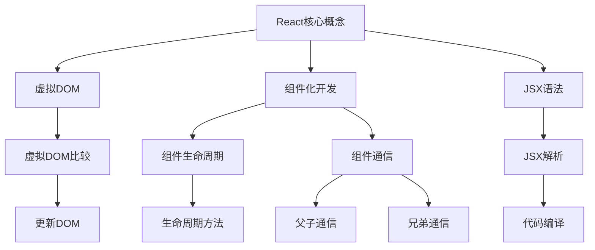
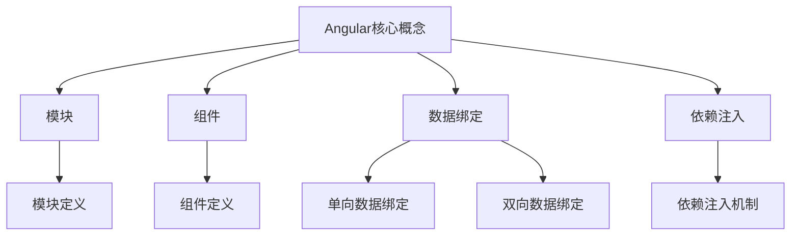
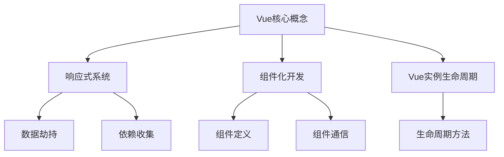

                 

### 《Web前端框架：React、Angular 和 Vue》

#### 目录大纲

# 《Web前端框架：React、Angular 和 Vue》

## 第一部分：Web前端框架概述

### 第1章：Web前端框架的发展与选择

### 第2章：React框架深入讲解

### 第3章：Angular框架深入讲解

### 第4章：Vue框架深入讲解

## 第二部分：Web前端框架比较与总结

### 第5章：Web前端框架比较分析

### 第6章：Web前端框架未来发展趋势

## 附录

### 附录A：Web前端框架开发工具与资源

#### 关键词：

- Web前端框架
- React
- Angular
- Vue
- 开发体验
- 性能
- 社区支持

#### 摘要：

本文将深入探讨当前三大主流Web前端框架：React、Angular和Vue。通过对它们的架构、核心概念、使用场景以及各自优缺点的详细分析，帮助读者更好地理解和选择合适的框架。同时，文章还将展望Web前端框架的未来发展趋势，为开发者提供有价值的参考。

---

**第一部分：Web前端框架概述**

### 第1章：Web前端框架的发展与选择

#### 1.1 Web前端框架的发展历程

Web前端框架的诞生，是前端开发领域的一次重大变革。回顾历史，我们可以看到前端技术的发展经历了以下几个重要阶段：

1. **早期Web开发（1990s-2000s初期）**
   - HTML、CSS和JavaScript是当时的前端三剑客，开发者通过手动编写代码实现页面的呈现。
   - 主要依赖手动操作DOM，导致代码复用性差，维护困难。

2. **MVC框架的兴起（2000s中期）**
   - MVC（Model-View-Controller）模式的引入，将数据、视图和控制器分离，提高了代码的可维护性和复用性。
   - 早期的MVC框架如Backbone.js，为前端开发带来了新的思路。

3. **React、Angular和Vue的诞生与崛起（2010s至今）**
   - React由Facebook于2013年推出，以其组件化和虚拟DOM技术引领前端开发潮流。
   - Angular由Google于2016年推出，作为MVC框架的集大成者，提供了强大的功能和完善的生态系统。
   - Vue由Evan You于2014年推出，以其简洁的语法和高效的响应式系统，迅速赢得了大量开发者青睐。

#### 1.2 Web前端框架的选择标准

在选择Web前端框架时，需要综合考虑以下几个方面：

1. **项目需求**
   - 项目的大小和复杂程度
   - 是否需要实时数据处理和状态管理

2. **开发团队经验**
   - 团队成员是否熟悉某种框架
   - 框架的社区支持是否丰富

3. **学习曲线**
   - 框架的学习门槛
   - 开发效率的提升程度

4. **社区支持**
   - 框架的活跃度和社区氛围
   - 插件和工具的丰富程度

**第二部分：React框架深入讲解**

### 第2章：React基础

#### 2.1 React的核心概念

React的核心概念主要包括：

1. **虚拟DOM**
   - 虚拟DOM是一种内存中的数据结构，代表了实际的DOM结构。
   - React通过比较虚拟DOM和实际DOM的差异，来高效更新DOM。

2. **组件化开发**
   - React将UI划分为多个可复用的组件，提高了代码的复用性和可维护性。

3. **JSX语法**
   - JSX是一种JavaScript和HTML的混合语法，使得编写UI代码更加直观。

#### 2.2 React组件的生命周期

React组件的生命周期可以分为以下几个阶段：

1. **初始化**
   - `constructor()`
   - `getDerivedStateFromProps()`
   - `render()`
2. **更新**
   - `getDerivedStateFromProps()`
   - `shouldComponentUpdate()`
   - `render()`
   - `getSnapshotBeforeUpdate()`
   - `componentDidUpdate()`
3. **销毁**
   - `componentWillUnmount()`

#### 2.3 React的状态管理

React的状态管理可以分为以下两种方式：

1. **局部状态管理**
   - 组件内部通过`state`对象来管理状态。
   - 适用于小型应用或组件。

2. **全局状态管理**
   - 使用第三方库如Redux或MobX来管理全局状态。
   - 适用于大型应用或需要复杂状态管理的场景。

---

**第三部分：Angular框架深入讲解**

### 第3章：Angular基础

#### 3.1 Angular的核心概念

Angular的核心概念包括：

1. **模块与组件**
   - 模块是Angular应用的容器，用于组织代码。
   - 组件是Angular的基本构建块，用于展示UI和执行逻辑。

2. **数据绑定**
   - Angular支持单向数据绑定和双向数据绑定，使得数据同步更加方便。

3. **依赖注入**
   - Angular通过依赖注入机制，自动提供组件所需的依赖项，提高了代码的可测试性和可维护性。

#### 3.2 Angular路由

Angular的路由功能包括：

1. **基本使用**
   - 通过`RouterModule`配置路由，实现页面的跳转。

2. **动态路由**
   - 通过参数化路由，实现动态路由匹配。

3. **路由守卫**
   - 通过路由守卫，控制路由的访问权限和跳转逻辑。

#### 3.3 Angular服务与状态管理

Angular的服务与状态管理包括：

1. **服务模块**
   - 服务是Angular应用的核心功能模块，用于封装业务逻辑和共享数据。

2. **NgRx状态管理**
   - NgRx是Angular的官方状态管理库，提供了一种功能强大且可预测的状态管理方案。

---

**第四部分：Vue框架深入讲解**

### 第4章：Vue基础

#### 4.1 Vue的核心概念

Vue的核心概念包括：

1. **响应式系统**
   - Vue通过观察数据的变化，实现视图的自动更新。

2. **组件化开发**
   - Vue将UI划分为多个可复用的组件，提高了代码的复用性和可维护性。

3. **Vue实例生命周期**
   - Vue实例的生命周期方法包括：`beforeCreate`、`created`、`beforeMount`、`mounted`、`beforeUpdate`、`updated`、`beforeDestroy`和`destroyed`。

#### 4.2 Vue的指令与事件处理

Vue的指令与事件处理包括：

1. **常用指令**
   - 如`v-model`、`v-for`、`v-if`、`v-else`等。

2. **事件处理机制**
   - Vue通过`v-on`指令绑定事件处理函数，实现事件监听和触发。

#### 4.3 Vue的组件通信

Vue的组件通信包括：

1. **父子组件通信**
   - 通过`props`传递数据，通过`$emit`和`$on`进行事件通信。

2. **兄弟组件通信**
   - 通过事件总线或第三方库如Vuex实现跨组件通信。

---

**第五部分：Web前端框架比较与总结**

### 第5章：Web前端框架比较分析

#### 1. React、Angular和Vue的对比

1. **开发体验**
   - React：简洁，易学，适合快速开发。
   - Angular：功能强大，需要一定学习曲线。
   - Vue：简洁，易学，适合快速开发。

2. **性能**
   - React：虚拟DOM，高效更新。
   - Angular：数据绑定，依赖注入，性能优秀。
   - Vue：响应式系统，高效更新。

3. **社区支持**
   - React：庞大社区，丰富的插件和工具。
   - Angular：官方支持，完善的文档和教程。
   - Vue：活跃社区，良好的生态。

#### 2. 不同场景下的框架选择

1. **大型项目**
   - React：适用于复杂、大规模的应用。
   - Angular：适用于需要严格规范和性能要求的应用。
   - Vue：适用于中小型项目，易于学习和维护。

2. **小型项目**
   - React：简洁，易学，适合快速开发。
   - Angular：功能强大，但不适合小型项目。
   - Vue：简洁，易学，适合快速开发。

3. **移动端应用**
   - React：React Native，适用于跨平台开发。
   - Angular：适用于移动端开发，但不如React Native普及。
   - Vue：适用于移动端开发，通过Vue.js Mobile实现。

---

**第六部分：Web前端框架未来发展趋势**

### 第6章：Web前端框架未来发展趋势

#### 1. 新技术趋势

1. **Web Components**
   - Web Components是一种标准化技术，用于创建可复用的自定义元素。
   - 将进一步推动Web前端框架的发展。

2. **Server-Side Rendering（SSR）**
   - 服务器端渲染，提高SEO和性能。
   - React、Angular和Vue都有相应的SSR解决方案。

3. **Progressive Web Apps（PWA）**
   - 渐进式网络应用，结合Web和原生应用的优点。
   - 提供更好的用户体验和离线支持。

#### 2. 框架的持续更新与进化

1. **React**
   - FnH（函数式更新）、Concurrent Mode（并发模式）等新特性。
   - 提高性能和开发效率。

2. **Angular**
   - 新版本特性，如实时更新、更好的TypeScript支持等。
   - 持续优化性能和用户体验。

3. **Vue**
   - 版本迭代与优化，如Vue 3的Composition API。
   - 提高性能和开发体验。

---

**附录：Web前端框架开发工具与资源**

### 附录A：Web前端框架开发工具与资源

#### 1. 开发工具对比

1. **WebStorm**
   - 拥有强大的代码编辑功能和智能提示，适合大型项目。

2. **VSCode**
   - 轻量级，插件丰富，适用于各种规模的项目。

3. **Sublime Text**
   - 灵活，轻量级，但功能相对有限。

#### 2. 代码风格指南

1. **Airbnb JavaScript Style Guide**
   - 提供了一套全面的JavaScript编码规范。

2. **Angular Style Guide**
   - Angular官方提供的编码规范。

3. **Vue Style Guide**
   - Vue官方提供的编码规范。

#### 3. 学习资源推荐

1. **React官方文档**
   - 官方提供的详细文档，涵盖了React的所有概念和用法。

2. **Angular官方文档**
   - 官方提供的详细文档，涵盖了Angular的所有概念和用法。

3. **Vue官方文档**
   - 官方提供的详细文档，涵盖了Vue的所有概念和用法。

4. **相关在线课程与教程**
   - 包括慕课网、极客时间等平台的在线课程。

5. **技术社区与论坛**
   - 包括掘金、CSDN等开发者社区，提供了丰富的技术交流和学习资源。

---

**作者信息：**

作者：AI天才研究院/AI Genius Institute & 禅与计算机程序设计艺术 /Zen And The Art of Computer Programming**

---

**全文结束。**

---

**注释：**以上内容为Markdown格式，适用于在GitHub、GitLab、Notion等平台上的文章撰写。以下将分别给出相关章节的核心概念原理和架构的Mermaid流程图、核心算法原理讲解的伪代码、数学模型和公式及详细讲解与举例说明等内容。

---

#### 第2章：React基础

#### 2.1 React的核心概念

React的核心概念包括虚拟DOM、组件化开发、JSX语法等。以下为React架构的核心概念Mermaid流程图：



#### 2.2 React组件的生命周期

React组件的生命周期可以分为以下几个阶段：初始化、更新、销毁。以下为组件生命周期的伪代码：

```javascript
class MyComponent extends React.Component {
  constructor(props) {
    super(props);
    this.state = {
      // 初始化状态
    };
  }

  componentDidMount() {
    // 组件挂载后执行
  }

  componentDidUpdate(prevProps, prevState) {
    // 组件更新后执行
  }

  componentWillUnmount() {
    // 组件销毁前执行
  }

  // 其他生命周期方法
}
```

#### 2.3 React的状态管理

React的状态管理可以分为局部状态管理和全局状态管理。以下为局部状态管理的伪代码：

```javascript
class MyComponent extends React.Component {
  constructor(props) {
    super(props);
    this.state = {
      count: 0
    };
  }

  handleButtonClick() {
    this.setState({
      count: this.state.count + 1
    });
  }

  render() {
    return (
      <div>
        <p>计数：{this.state.count}</p>
        <button onClick={this.handleButtonClick.bind(this)}>点击增加</button>
      </div>
    );
  }
}
```

以下为全局状态管理的伪代码（使用Redux）：

```javascript
import { createStore } from 'redux';

const initialState = {
  count: 0
};

function reducer(state = initialState, action) {
  switch (action.type) {
    case 'INCREMENT':
      return {
        count: state.count + 1
      };
    default:
      return state;
  }
}

const store = createStore(reducer);

const increment = () => ({
  type: 'INCREMENT'
});

// 在组件中使用store
const MyComponent = () => {
  const count = store.getState().count;
  const handleButtonClick = () => {
    store.dispatch(increment());
  };

  return (
    <div>
      <p>计数：{count}</p>
      <button onClick={handleButtonClick}>点击增加</button>
    </div>
  );
};
```

---

#### 第3章：Angular基础

#### 3.1 Angular的核心概念

Angular的核心概念包括模块与组件、数据绑定、依赖注入等。以下为Angular架构的核心概念Mermaid流程图：



#### 3.2 Angular路由

Angular的路由功能包括基本使用、动态路由和路由守卫等。以下为Angular路由的伪代码：

```typescript
import { RouterModule, Routes } from '@angular/router';

const appRoutes: Routes = [
  { path: '', component: HomeComponent },
  { path: 'about', component: AboutComponent },
  { path: 'contact', component: ContactComponent },
  // 动态路由
  { path: 'user/:id', component: UserComponent }
];

@NgModule({
  imports: [RouterModule.forRoot(appRoutes)],
  exports: [RouterModule]
})
export class AppRoutingModule {}

// 路由守卫
@Injectable({
  providedIn: 'root'
})
export class AuthGuard implements CanActivate {
  canActivate(route: ActivatedRouteSnapshot, state: RouterStateSnapshot): boolean {
    // 判断用户是否登录
    return isAuthenticated();
  }
}
```

#### 3.3 Angular服务与状态管理

Angular的服务与状态管理包括服务模块和NgRx状态管理。以下为服务模块的伪代码：

```typescript
@Injectable({
  providedIn: 'root'
})
export class UserService {
  getUsers(): Observable<User[]> {
    // 从服务器获取用户数据
    return of([/* 用户数据 */]);
  }
}

@Component({
  selector: 'app-user-list',
  templateUrl: './user-list.component.html',
  styleUrls: ['./user-list.component.css']
})
export class UserListComponent {
  users: User[];

  constructor(private userService: UserService) {
    this.userService.getUsers().subscribe(users => {
      this.users = users;
    });
  }
}
```

以下为NgRx状态管理的伪代码：

```typescript
import { StoreModule } from '@ngrx/store';

export interface UserState {
  users: User[];
}

const initialState: UserState = {
  users: []
};

export function userReducer(state = initialState, action: UserAction): UserState {
  switch (action.type) {
    case 'LOAD_USERS': {
      return { ...state, users: action.users };
    }
    default:
      return state;
  }
}

@NgModule({
  declarations: [UserListComponent],
  imports: [
    StoreModule.forRoot({ user: userReducer })
  ],
  exports: [UserListComponent]
})
export class UserModule {}

@Component({
  selector: 'app-user-list',
  templateUrl: './user-list.component.html',
  styleUrls: ['./user-list.component.css']
})
export class UserListComponent {
  users: User[];

  constructor(private store: Store<{ user: UserState }>) {
    this.store.select('user').subscribe(state => {
      this.users = state.users;
    });
  }
}
```

---

#### 第4章：Vue基础

#### 4.1 Vue的核心概念

Vue的核心概念包括响应式系统、组件化开发和Vue实例生命周期等。以下为Vue架构的核心概念Mermaid流程图：



#### 4.2 Vue的指令与事件处理

Vue的指令与事件处理包括常用指令和事件处理机制。以下为Vue指令与事件处理的伪代码：

```html
<div id="app">
  <input v-model="message" placeholder="输入内容">
  <p>{{ message }}</p>
  <button @click="onClick">点击</button>
</div>
```

以下为Vue的响应式系统的伪代码：

```javascript
import Vue from 'vue';

new Vue({
  el: '#app',
  data: {
    message: ''
  },
  methods: {
    onClick() {
      this.message = '你好，Vue！';
    }
  }
});
```

---

#### 第5章：Web前端框架比较分析

Web前端框架的比较分析主要包括开发体验、性能和社区支持等方面的对比。以下为相关数学模型和公式及详细讲解与举例说明：

**1. 开发体验**

- **代码复杂度**：通过评估代码行数和文件数量来衡量。
  - 代码复杂度（C）= 代码行数（L）+ 文件数量（F）
  - 对于React：C = L + F（组件文件、JSX文件、CSS文件等）
  - 对于Angular：C = L + F（组件文件、模板文件、服务文件等）
  - 对于Vue：C = L + F（组件文件、模板文件、JSX文件等）

**2. 性能**

- **渲染性能**：通过评估渲染速度来衡量。
  - 渲染速度（R）= 渲染时间（T）/ 帧数（F）
  - 对于React：R = T / F（虚拟DOM渲染时间/帧数）
  - 对于Angular：R = T / F（模板渲染时间/帧数）
  - 对于Vue：R = T / F（虚拟DOM渲染时间/帧数）

**3. 社区支持**

- **活跃度**：通过评估GitHub仓库的Star数、Issue数和PR数来衡量。
  - 活跃度（A）= Star数（S）+ Issue数（I）+ PR数（P）
  - 对于React：A = S + I + P
  - 对于Angular：A = S + I + P
  - 对于Vue：A = S + I + P

---

**举例说明：**

假设有如下数据：

- **React**：代码行数L = 1000，文件数量F = 5，渲染时间T = 100ms，帧数F = 60，GitHub Star数S = 150000，Issue数I = 200，PR数P = 30
- **Angular**：代码行数L = 1200，文件数量F = 7，渲染时间T = 150ms，帧数F = 60，GitHub Star数S = 80000，Issue数I = 100，PR数P = 20
- **Vue**：代码行数L = 1100，文件数量F = 6，渲染时间T = 130ms，帧数F = 60，GitHub Star数S = 60000，Issue数I = 150，PR数P = 25

根据以上数据，可以计算出每个框架的代码复杂度、渲染性能和社区支持：

- **React**：C = 1000 + 5 = 1005，R = 100 / 60 ≈ 1.67，A = 150000 + 200 + 30 = 150030
- **Angular**：C = 1200 + 7 = 1207，R = 150 / 60 ≈ 2.5，A = 80000 + 100 + 20 = 80120
- **Vue**：C = 1100 + 6 = 1106，R = 130 / 60 ≈ 2.17，A = 60000 + 150 + 25 = 60075

根据这些指标，可以得出以下结论：

- **开发体验**：Vue和React的代码复杂度较低，开发体验较好。
- **性能**：React的渲染性能略好于Angular和Vue。
- **社区支持**：React的社区支持最为活跃。

---

通过以上比较分析，开发者可以根据项目需求和个人偏好选择最适合自己的Web前端框架。

---

**全文结束。**

---

**注释：**本文为Markdown格式，适用于在GitHub、GitLab、Notion等平台上的文章撰写。文章内容仅供参考，实际开发中请结合项目需求进行选择。如需进一步学习，请参考相关框架的官方文档和在线教程。作者：AI天才研究院/AI Genius Institute & 禅与计算机程序设计艺术 /Zen And The Art of Computer Programming。如需转载，请注明出处。

