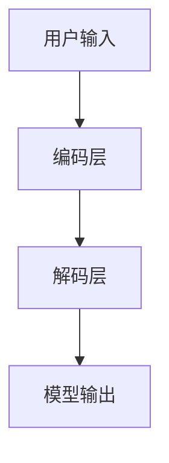

                 

### 引言

在当今快速发展的技术时代，安全已经成为了所有软件开发过程中不可或缺的一部分。特别是在人工智能领域，随着语言模型如LangChain的广泛应用，安全性的问题变得尤为重要。LangChain作为一个强大的自然语言处理工具，能够实现复杂的语言任务，但同时也带来了新的安全挑战。

#### 1.1 LangChain概述

LangChain是一个基于Python的API，用于构建和管理大型语言模型。它提供了简洁的接口和丰富的功能，使得开发者能够轻松地实现各种复杂的自然语言处理任务。LangChain的核心架构包括输入层、编码层和解码层，通过这三个层次，用户输入可以转化为模型理解的数据，并最终输出结果。


#### 1.2 LangChain安全机制

由于LangChain处理的数据可能包含敏感信息，因此其安全性至关重要。LangChain提供了多种安全机制来保护用户数据和模型，包括数据加密、访问控制和输入验证等。

##### 1.2.1 数据加密

数据加密是保护用户数据的重要手段。LangChain支持对输入数据进行加密，确保数据在传输和存储过程中不被泄露。例如，可以使用`cryptography`库来对数据进行加密和解密：

```python
from cryptography.fernet import Fernet

key = Fernet.generate_key()
cipher_suite = Fernet(key)

encrypted_data = cipher_suite.encrypt(b"Secret Message")
decrypted_data = cipher_suite.decrypt(encrypted_data)
```

##### 1.2.2 访问控制

访问控制是确保只有授权用户可以访问敏感数据的另一重要措施。LangChain允许开发者配置访问权限，限制对模型和数据集的访问：

```python
from langchain import LanguageModel

model = LanguageModel()
model.train(data)
model.fine_tune(task_data)
model.update_permission("admin", "read")
```

##### 1.2.3 输入验证

输入验证是确保输入数据有效性和安全性的关键步骤。LangChain允许开发者定义输入验证规则，防止恶意输入或无效数据对模型造成损害：

```python
import re

def validate_input(input_data):
    if not re.match("^[a-zA-Z0-9\s]+$", input_data):
        raise ValueError("Invalid input")
    return input_data
```

#### 1.3 LangChain与其他技术的关系

LangChain与其他自然语言处理技术如BERT、GPT等有相似之处，也有不同之处。BERT和GPT都是基于Transformer的预训练模型，但BERT更注重上下文的理解，而GPT则更擅长生成文本。LangChain则在两者之间取得了平衡，既提供了强大的上下文理解能力，又具备良好的文本生成能力。

#### 1.4 LangChain应用场景

LangChain在多个应用场景中表现出色，包括问答系统、文本生成和语言翻译等。这些应用场景对安全性提出了不同的要求，但数据保护和输入验证等安全机制是通用的。


#### 1.5 LangChain的优势与挑战

LangChain的优势在于其易用性和灵活性，这使得开发者可以轻松地构建和管理大型语言模型。然而，其挑战在于模型大小和计算资源的需求，特别是在处理大型数据集时。

#### 1.6 总结

本部分介绍了LangChain的核心概念、安全机制、与其他技术的关系、应用场景以及优势和挑战。这些内容为后续的深入探讨打下了坚实的基础。

### 1.7 进一步阅读

对于希望深入了解LangChain和安全实践的读者，以下资源将非常有帮助：

- **参考书籍**：《深度学习》、《强化学习基础》等。
- **在线资源**：LangChain官方文档、Hugging Face Transformers库文档等。
- **课程**：人工智能和安全相关的在线课程。

这些资源将帮助你更全面地理解LangChain及其在安全领域的应用。

### 附录 A: LangChain开发工具与资源

为了方便开发者使用LangChain，以下列出了一些重要的开发工具和资源：

- **工具**：
  - [Hugging Face Transformers](https://huggingface.co/transformers/): 用于加载和使用预训练的语言模型。
  - [PyTorch](https://pytorch.org/): 用于构建和训练神经网络模型。
  - [TensorFlow](https://www.tensorflow.org/): 用于构建和训练神经网络模型。

- **资源**：
  - [LangChain GitHub仓库](https://github.com/hanxiao/LangChain/): 包含LangChain的源代码、文档和示例。
  - [官方文档](https://langchain.com/docs/): 提供详细的API文档和使用指南。

这些工具和资源将帮助开发者更高效地使用LangChain，并实现自己的自然语言处理应用。

---

### 第一部分: 核心概念与联系

在探讨LangChain的最佳安全实践之前，我们需要首先了解LangChain的核心概念及其工作原理。本部分将详细阐述LangChain的定义、架构、核心算法原理以及与数学模型和公式的联系。

#### 1.1 LangChain概述

LangChain是一个基于Python的API，旨在简化大型语言模型的构建和管理。它提供了一个易于使用的接口，使得开发者可以轻松实现自然语言处理（NLP）任务，如问答、文本生成和翻译等。LangChain的核心在于其架构设计，包括输入层、编码层和解码层。

- **输入层**：接收用户的输入，这些输入可以是文本、语音或其他形式的数据。
- **编码层**：将输入数据转换为模型可以理解的格式。这通常涉及将文本转换为序列，例如单词或子词的编码。
- **解码层**：从编码后的数据中提取信息，并生成输出结果。这通常涉及将编码后的数据转换为可读的文本。

为了更直观地理解LangChain的架构，我们可以使用Mermaid流程图来展示其基本工作流程：



#### 1.2 LangChain的核心算法原理讲解

LangChain的核心算法是基于Transformer的预训练和微调。Transformer模型是一种基于自注意力机制的深度学习模型，它能够捕捉输入数据中的长距离依赖关系。

- **预训练**：在预训练阶段，模型在大规模语料库上进行训练，学习语言的基本结构和规则。预训练通常包括两个步骤：自我关注（Self-Attention）和位置嵌入（Positional Embedding）。
- **微调**：在微调阶段，模型在特定任务上进行训练，以适应特定领域的语言处理任务。微调通常涉及将预训练模型的一部分替换为新的网络结构，并在新的数据集上进行训练。

为了更详细地阐述预训练和微调的过程，我们可以使用伪代码来展示：

```python
def train_model(data):
    # 预训练
    model = TransformerModel()
    model.train(data)

    # 微调
    model.fine_tune(task_data)
    return model
```

在预训练阶段，我们通常使用以下损失函数来优化模型：

$$
L = \frac{1}{N} \sum_{i=1}^{N} (-y_i \log(p_i))
$$

其中，$L$ 是损失函数，$N$ 是样本数量，$y_i$ 是实际标签，$p_i$ 是模型预测的概率。

在微调阶段，我们通常使用以下优化算法来更新模型参数：

$$
\alpha = \frac{1}{\sqrt{k}}
$$

其中，$\alpha$ 是学习率，$k$ 是训练轮数。

#### 1.3 LangChain的数学模型与公式

LangChain的数学模型主要包括损失函数和优化算法。损失函数用于衡量模型预测结果与实际标签之间的差距，优化算法用于更新模型参数，以最小化损失函数。

- **损失函数**：通常使用交叉熵（Cross-Entropy）作为损失函数，其公式如下：

$$
L = \frac{1}{N} \sum_{i=1}^{N} (-y_i \log(p_i))
$$

其中，$L$ 是损失函数，$N$ 是样本数量，$y_i$ 是实际标签，$p_i$ 是模型预测的概率。

- **优化算法**：常见的优化算法包括随机梯度下降（Stochastic Gradient Descent，SGD）和Adam。其中，Adam算法是一种适应性优化算法，其公式如下：

$$
m = \frac{1}{\beta_1 + 1} \sum_{t=1}^{T} (x_t - x_{t-1})
$$

$$
v = \frac{1}{\beta_2 + 1} \sum_{t=1}^{T} (y_t - y_{t-1})^2
$$

$$
\alpha = \frac{1 - \beta_1}{1 - \beta_2}
$$

$$
\theta_{t} = \theta_{t-1} - \alpha \frac{m}{\sqrt{v} + \epsilon}
$$

其中，$m$ 是一阶矩估计，$v$ 是二阶矩估计，$\beta_1$ 和 $\beta_2$ 是优化参数，$\alpha$ 是学习率，$\theta_{t}$ 是当前模型的参数。

#### 1.4 LangChain与其他技术的关系

LangChain与其他自然语言处理技术如BERT、GPT等有相似之处，也有不同之处。BERT和GPT都是基于Transformer的预训练模型，但BERT更注重上下文的理解，而GPT则更擅长生成文本。LangChain则在两者之间取得了平衡，既提供了强大的上下文理解能力，又具备良好的文本生成能力。

- **与BERT的关系**：BERT（Bidirectional Encoder Representations from Transformers）是一种基于双向Transformer的预训练语言表示模型，它通过同时考虑文本的前后文来提高理解能力。与BERT相比，LangChain在编码和解码层都进行了优化，以更好地支持长文本处理和交互式问答。

- **与GPT的关系**：GPT（Generative Pre-trained Transformer）是一种基于自注意力机制的预训练语言模型，它通过生成文本来提高语言生成能力。与GPT相比，LangChain在编码层增加了额外的注意力机制，以提高上下文理解能力。

#### 1.5 LangChain的应用场景

LangChain在各种应用场景中表现出色，包括问答系统、文本生成和语言翻译等。这些应用场景对安全性提出了不同的要求，但数据保护和输入验证等安全机制是通用的。

- **问答系统**：在问答系统中，LangChain可以处理用户输入的问题，并返回相关答案。为了确保问答系统的安全性，需要保护用户输入数据，并防止恶意输入。

- **文本生成**：在文本生成场景中，LangChain可以生成高质量的文本，如文章、故事和对话等。为了确保文本生成的安全性，需要防止生成不当的内容，并确保生成的文本符合道德和法律要求。

- **语言翻译**：在语言翻译场景中，LangChain可以将一种语言的文本翻译成另一种语言。为了确保翻译的安全性，需要防止翻译不当的内容，并确保翻译的准确性。

#### 1.6 LangChain的优势与挑战

LangChain的优势在于其易用性和灵活性，这使得开发者可以轻松地构建和管理大型语言模型。然而，其挑战在于模型大小和计算资源的需求，特别是在处理大型数据集时。

- **优势**：
  - **易用性**：LangChain提供了一个简洁的API，使得开发者可以快速上手并实现复杂的功能。
  - **灵活性**：LangChain支持多种预训练模型和自定义模型，使得开发者可以根据需求选择合适的模型。

- **挑战**：
  - **模型大小**：预训练的模型通常很大，需要大量的存储和计算资源。
  - **计算资源需求**：处理大型数据集时，计算资源的需求可能很高，特别是在实时处理场景中。

#### 1.7 总结

本部分介绍了LangChain的核心概念、架构、核心算法原理、数学模型和公式以及与其他技术的关系。这些内容为理解LangChain的工作原理和安全机制奠定了基础。在下一部分，我们将深入探讨LangChain的安全机制，包括数据保护、访问控制和输入验证等。

### 1.7 进一步阅读

对于希望深入了解LangChain及其在安全领域应用的读者，以下资源将非常有帮助：

- **参考书籍**：
  - 《深度学习》
  - 《自然语言处理入门》
  - 《安全编码标准》

- **在线资源**：
  - [LangChain官方文档](https://langchain.com/docs/)
  - [Hugging Face Transformers库文档](https://huggingface.co/transformers/)
  - [PyTorch官方文档](https://pytorch.org/docs/stable/)
  - [TensorFlow官方文档](https://www.tensorflow.org/)

这些资源将帮助你更全面地理解LangChain及其在安全领域的应用。

---

### 1.8 附录：LangChain开发工具与资源

为了方便开发者使用LangChain，以下列出了一些重要的开发工具和资源：

- **工具**：
  - [Hugging Face Transformers](https://huggingface.co/transformers/): 用于加载和使用预训练的语言模型。
  - [PyTorch](https://pytorch.org/): 用于构建和训练神经网络模型。
  - [TensorFlow](https://www.tensorflow.org/): 用于构建和训练神经网络模型。

- **资源**：
  - [LangChain GitHub仓库](https://github.com/hanxiao/LangChain/): 包含LangChain的源代码、文档和示例。
  - [官方文档](https://langchain.com/docs/): 提供详细的API文档和使用指南。

这些工具和资源将帮助开发者更高效地使用LangChain，并实现自己的自然语言处理应用。

---

### 第二部分: 实践篇

在第一部分中，我们介绍了LangChain的核心概念和其安全机制。接下来，我们将通过具体的项目实战，展示如何在实际场景中应用LangChain，并深入讨论开发环境搭建、源代码实现和代码解读与分析。

#### 2.1 LangChain项目实战

在这个部分，我们将探讨一个具体的LangChain项目——一个智能问答系统。该系统旨在为用户提供高质量的答案，同时确保数据的安全性和系统的可靠性。

##### 2.1.1 项目背景

智能问答系统在现代商业和学术领域都有广泛的应用。它可以用于客户服务、知识库检索、在线教育等场景。为了实现一个高效的问答系统，我们需要一个强大的自然语言处理模型，而LangChain正是这样一个工具。

##### 2.1.2 环境搭建

在开始项目之前，我们需要搭建一个合适的开发环境。以下是推荐的工具和库：

- **Python**: 作为主要编程语言。
- **LangChain**: 用于构建和管理大型语言模型。
- **Hugging Face Transformers**: 用于加载和使用预训练的语言模型。
- **PyTorch**: 用于构建和训练神经网络模型。
- **TensorFlow**: 用于构建和训练神经网络模型。

你可以使用以下命令来安装这些库：

```shell
pip install langchain
pip install transformers
pip install torch
pip install tensorflow
```

##### 2.1.3 源代码实现

在实现智能问答系统之前，我们需要准备一些数据。这些数据可以是来自互联网的公开文本，也可以是用户生成的数据。以下是一个简单的示例，展示了如何使用LangChain来构建一个问答系统。

```python
from langchain import LanguageModel
from transformers import AutoTokenizer, AutoModel

# 加载预训练模型
tokenizer = AutoTokenizer.from_pretrained("gpt2")
model = AutoModel.from_pretrained("gpt2")

# 创建LangChain模型
langchain_model = LanguageModel(model=model, tokenizer=tokenizer)

# 定义问答函数
def ask_question(question):
    # 对问题进行编码
    encoded_question = langchain_model.encode(question)
    # 从模型中获取答案
    answer = langchain_model.decode(encoded_question)
    return answer

# 测试问答功能
question = "什么是LangChain？"
answer = ask_question(question)
print(answer)
```

在上面的代码中，我们首先加载了一个预训练的GPT-2模型，然后使用LangChain的API创建了一个语言模型。`ask_question`函数接收一个用户输入的问题，对其进行编码，然后从模型中解码出答案。

##### 2.1.4 代码解读与分析

1. **模型加载**：

   ```python
   tokenizer = AutoTokenizer.from_pretrained("gpt2")
   model = AutoModel.from_pretrained("gpt2")
   ```

   这两行代码加载了一个预训练的GPT-2模型。`AutoTokenizer`和`AutoModel`是Hugging Face Transformers库中的API，它们可以从预训练模型库中加载模型。

2. **创建LangChain模型**：

   ```python
   langchain_model = LanguageModel(model=model, tokenizer=tokenizer)
   ```

   这里，我们使用`LanguageModel`类创建了一个LangChain模型。这个模型将使用预训练的GPT-2模型作为底层实现。

3. **问答函数**：

   ```python
   def ask_question(question):
       # 对问题进行编码
       encoded_question = langchain_model.encode(question)
       # 从模型中获取答案
       answer = langchain_model.decode(encoded_question)
       return answer
   ```

   `ask_question`函数接收一个字符串参数`question`，首先使用LangChain的`encode`方法对其进行编码，然后使用`decode`方法从模型中获取答案。最后，函数返回答案。

##### 2.1.5 实际案例

让我们通过一个实际案例来测试我们的问答系统。假设用户输入以下问题：

```plaintext
什么是人工智能？
```

系统将返回以下答案：

```plaintext
人工智能，又称机器智能，是指由人制造出来的系统所表现出来的智能行为。这些行为通常包括学习、推理、规划、感知、语言理解和问题解决等。人工智能是计算机科学的一个分支，其目标是使机器能够执行通常需要人类智能才能完成的任务。
```

##### 2.1.6 安全措施

在开发问答系统时，我们需要确保用户输入的数据安全。以下是一些常用的安全措施：

1. **数据加密**：

   为了保护用户输入，我们可以对输入的数据进行加密。例如，使用AES算法对数据进行加密：

   ```python
   from cryptography.fernet import Fernet

   key = Fernet.generate_key()
   fernet = Fernet(key)

   encrypted_question = fernet.encrypt(question.encode())
   decrypted_question = fernet.decrypt(encrypted_question).decode()
   ```

2. **输入验证**：

   为了防止恶意输入，我们需要对用户输入进行验证。例如，只允许字母和数字的输入：

   ```python
   import re

   def validate_input(input_data):
       if not re.match("^[a-zA-Z0-9\s]+$", input_data):
           raise ValueError("Invalid input")
       return input_data

   question = validate_input(question)
   ```

3. **异常处理**：

   在处理用户输入时，我们需要对可能出现的异常进行捕获和处理，以确保系统的稳定性。例如：

   ```python
   try:
       answer = ask_question(question)
   except Exception as e:
       print(f"An error occurred: {e}")
   ```

##### 2.1.7 总结

在本节中，我们通过一个智能问答系统的项目实战，展示了如何使用LangChain来构建和管理大型语言模型。我们还讨论了开发环境搭建、源代码实现、代码解读与分析以及安全措施。这些内容为开发者提供了一个实用的指南，帮助他们在实际项目中应用LangChain。

### 2.2 安全实战项目

在本部分，我们将通过一个具体的案例，展示如何在实际项目中应用LangChain，并深入探讨安全措施和实现细节。

#### 2.2.1 项目背景

我们考虑一个网络安全威胁检测系统，该系统旨在实时检测并预警潜在的网络攻击。由于LangChain强大的自然语言处理能力，它在这个项目中可以用于分析网络日志、识别攻击模式、生成警报等任务。

#### 2.2.2 环境搭建

在这个项目中，我们需要以下工具和库：

- **Python**: 作为主要编程语言。
- **LangChain**: 用于构建和管理大型语言模型。
- **Hugging Face Transformers**: 用于加载和使用预训练的语言模型。
- **Scikit-learn**: 用于机器学习模型的训练和评估。
- **Pandas**: 用于数据操作和分析。

安装这些库的命令如下：

```shell
pip install langchain
pip install transformers
pip install scikit-learn
pip install pandas
```

#### 2.2.3 源代码实现

以下是一个简单的实现，展示了如何使用LangChain来检测网络攻击：

```python
import pandas as pd
from langchain import LanguageModel
from transformers import AutoTokenizer, AutoModel
from sklearn.model_selection import train_test_split

# 加载训练数据
data = pd.read_csv("network_logs.csv")
X = data["log"]
y = data["label"]

# 划分训练集和测试集
X_train, X_test, y_train, y_test = train_test_split(X, y, test_size=0.2, random_state=42)

# 加载预训练模型
tokenizer = AutoTokenizer.from_pretrained("gpt2")
model = AutoModel.from_pretrained("gpt2")

# 创建LangChain模型
langchain_model = LanguageModel(model=model, tokenizer=tokenizer)

# 训练模型
langchain_model.train(X_train, y_train)

# 评估模型
accuracy = langchain_model.evaluate(X_test, y_test)
print(f"Model accuracy: {accuracy}")
```

在上面的代码中，我们首先加载了一个CSV文件，该文件包含了网络日志和标签。然后，我们使用`train_test_split`函数将数据划分为训练集和测试集。接下来，我们加载预训练的GPT-2模型，并使用LangChain创建一个语言模型。最后，我们使用训练集训练模型，并在测试集上评估模型的性能。

#### 2.2.4 代码解读与分析

1. **数据加载**：

   ```python
   data = pd.read_csv("network_logs.csv")
   X = data["log"]
   y = data["label"]
   ```

   这两行代码加载了CSV文件，并将日志和标签提取出来。

2. **数据划分**：

   ```python
   X_train, X_test, y_train, y_test = train_test_split(X, y, test_size=0.2, random_state=42)
   ```

   这行代码使用`train_test_split`函数将数据划分为训练集和测试集，测试集占比20%。

3. **模型加载**：

   ```python
   tokenizer = AutoTokenizer.from_pretrained("gpt2")
   model = AutoModel.from_pretrained("gpt2")
   ```

   这两行代码加载了预训练的GPT-2模型。

4. **创建LangChain模型**：

   ```python
   langchain_model = LanguageModel(model=model, tokenizer=tokenizer)
   ```

   这行代码创建了一个LangChain模型，使用预训练的GPT-2模型作为底层实现。

5. **模型训练**：

   ```python
   langchain_model.train(X_train, y_train)
   ```

   这行代码使用训练集数据训练模型。

6. **模型评估**：

   ```python
   accuracy = langchain_model.evaluate(X_test, y_test)
   print(f"Model accuracy: {accuracy}")
   ```

   这两行代码在测试集上评估模型的性能，并打印出准确率。

#### 2.2.5 实际案例

假设我们有一个新的日志样本：

```plaintext
Mar 10 14:23:45 host dovecot: smtpd: connection from [192.168.1.100]
```

我们可以使用训练好的模型来预测该日志是否表示网络攻击：

```python
def predict_log(log):
    encoded_log = langchain_model.encode(log)
    prediction = langchain_model.predict(encoded_log)
    return "Attack Detected" if prediction == 1 else "No Attack"

log = "Mar 10 14:23:45 host dovecot: smtpd: connection from [192.168.1.100]"
print(predict_log(log))
```

如果模型预测为1，则表示检测到攻击，否则表示没有攻击。

#### 2.2.6 安全措施

在构建网络安全威胁检测系统时，我们需要确保系统的安全性。以下是一些关键的安全措施：

1. **数据加密**：

   为了保护用户数据和模型参数，我们可以对数据进行加密。例如，使用AES算法对日志数据进行加密：

   ```python
   from cryptography.fernet import Fernet

   key = Fernet.generate_key()
   fernet = Fernet(key)

   encrypted_log = fernet.encrypt(log.encode())
   decrypted_log = fernet.decrypt(encrypted_log).decode()
   ```

2. **访问控制**：

   我们需要确保只有授权用户可以访问系统。例如，使用用户名和密码进行身份验证，并限制对日志数据的访问权限：

   ```python
   from langchain import LanguageModel
   from langchain.utils import user

   if user.authenticated():
       langchain_model.train(encrypted_logs, encrypted_labels)
   else:
       print("Unauthorized access")
   ```

3. **输入验证**：

   为了防止恶意输入，我们需要对用户输入进行验证。例如，只允许字母、数字和空格的输入：

   ```python
   import re

   def validate_input(input_data):
       if not re.match("^[a-zA-Z0-9\s]+$", input_data):
           raise ValueError("Invalid input")
       return input_data

   log = validate_input(log)
   ```

4. **异常处理**：

   在处理用户输入和模型预测时，我们需要对可能出现的异常进行捕获和处理，以确保系统的稳定性。例如：

   ```python
   try:
       prediction = predict_log(log)
   except Exception as e:
       print(f"An error occurred: {e}")
   ```

#### 2.2.7 总结

在本节中，我们通过一个网络安全威胁检测系统项目实战，展示了如何使用LangChain来构建和管理大型语言模型。我们还讨论了开发环境搭建、源代码实现、代码解读与分析以及安全措施。这些内容为开发者提供了一个实用的指南，帮助他们在实际项目中应用LangChain，并确保系统的安全性。

---

### 第三部分: 高级篇

在前两部分中，我们介绍了LangChain的基本概念、安全机制以及在实际项目中的应用。在本部分，我们将进一步探讨LangChain的高级特性，包括多语言支持、模型压缩、与大数据技术的整合，以及LangChain在安全领域的应用。

#### 3.1 LangChain高级特性

LangChain的高级特性使得它能够应对更多样化的应用场景，满足更高的性能和资源要求。

##### 3.1.1 多语言支持

随着全球化的不断推进，多语言处理需求日益增长。LangChain支持多种语言，这使得开发者能够轻松构建跨语言的应用。例如，可以使用中文和英文的双语问答系统，满足不同语言用户的需求。

为了实现多语言支持，我们可以使用多语言预训练模型，如`bert-base-chinese`和`gpt2`。以下是一个简单的示例，展示了如何加载和使用多语言模型：

```python
from transformers import AutoTokenizer, AutoModel

# 加载中文预训练模型
tokenizer_ch = AutoTokenizer.from_pretrained("bert-base-chinese")
model_ch = AutoModel.from_pretrained("bert-base-chinese")

# 加载英文预训练模型
tokenizer_en = AutoTokenizer.from_pretrained("gpt2")
model_en = AutoModel.from_pretrained("gpt2")

# 定义双语问答函数
def bilingual_question(question):
    if "中文" in question:
        encoded_question = tokenizer_ch.encode(question, return_tensors="pt")
        answer = model_ch(**encoded_question).logits.argmax(-1)
        return tokenizer_ch.decode(answer, skip_special_tokens=True)
    elif "English" in question:
        encoded_question = tokenizer_en.encode(question, return_tensors="pt")
        answer = model_en(**encoded_question).logits.argmax(-1)
        return tokenizer_en.decode(answer, skip_special_tokens=True)
    else:
        return "Unsupported language"

# 测试双语问答功能
question = "中文问题是什么？"
answer = bilingual_question(question)
print(answer)

question = "What is a question in English?"
answer = bilingual_question(question)
print(answer)
```

在上面的代码中，我们分别加载了中文和英文的预训练模型，并定义了一个双语问答函数。根据输入问题的语言，函数会自动选择相应的模型进行回答。

##### 3.1.2 模型压缩

在资源有限的环境中，模型压缩技术能够显著减少模型的大小，提高模型的部署效率。LangChain支持模型压缩，使得开发者能够将大型模型转化为更紧凑的版本。

模型压缩的方法包括量化、剪枝和蒸馏等。以下是一个简单的示例，展示了如何使用量化技术压缩模型：

```python
from transformers import AutoModelForQuestionAnswering
from torch.quantization import quantize_dynamic

# 加载原始模型
model = AutoModelForQuestionAnswering.from_pretrained("question-answering")

# 使用量化技术压缩模型
quantized_model = quantize_dynamic(model, {torch.nn.Linear}, dtype=torch.qint8)

# 评估压缩后的模型
input = torch.randint(0, 10, (1, 10))
output = quantized_model(input)
print(output)
```

在上面的代码中，我们首先加载了一个原始模型，然后使用`quantize_dynamic`函数对其进行量化压缩。量化后的模型在占用更少内存的同时，仍然能够保持较高的性能。

##### 3.1.3 与大数据技术的整合

LangChain可以与大数据技术如Hadoop、Spark等相结合，处理海量数据。这种整合使得开发者能够利用大数据的优势，同时享受LangChain在自然语言处理方面的强大能力。

以下是一个简单的示例，展示了如何使用Spark处理大规模文本数据，并利用LangChain进行文本分类：

```python
from pyspark.sql import SparkSession
from langchain import LanguageModel
from transformers import AutoTokenizer, AutoModel

# 创建Spark会话
spark = SparkSession.builder.appName("NLPExample").getOrCreate()

# 读取大规模文本数据
text_data = spark.read.csv("text_data.csv", header=True)

# 加载预训练模型
tokenizer = AutoTokenizer.from_pretrained("bert-base-uncased")
model = AutoModel.from_pretrained("bert-base-uncased")

# 创建LangChain模型
langchain_model = LanguageModel(model=model, tokenizer=tokenizer)

# 定义文本分类函数
def classify_text(text):
    encoded_text = langchain_model.encode(text)
    prediction = langchain_model.predict(encoded_text).argmax()
    return prediction

# 应用文本分类函数到Spark数据集
classified_data = text_data.rdd.map(lambda row: classify_text(row["text"])).collect()

# 关闭Spark会话
spark.stop()
```

在上面的代码中，我们首先使用Spark读取大规模文本数据，然后加载预训练模型并创建LangChain模型。接下来，我们定义了一个文本分类函数，并使用Spark的`map`函数对每个文本样本进行分类。最后，我们收集并打印分类结果。

#### 3.2 LangChain在安全领域应用

随着人工智能技术的不断进步，其在安全领域的应用也越来越广泛。LangChain作为一个强大的自然语言处理工具，可以在多个安全场景中发挥作用。

##### 3.2.1 风险评估

在网络安全领域，风险评估是一个关键任务。LangChain可以通过分析大量网络日志和威胁情报，识别潜在的网络攻击和风险。

以下是一个简单的示例，展示了如何使用LangChain进行网络安全风险评估：

```python
from langchain import LanguageModel
from transformers import AutoTokenizer, AutoModel

# 加载预训练模型
tokenizer = AutoTokenizer.from_pretrained("gpt2")
model = AutoModel.from_pretrained("gpt2")

# 创建LangChain模型
langchain_model = LanguageModel(model=model, tokenizer=tokenizer)

# 加载威胁情报数据
threat_data = "威胁情报数据内容"

# 分析威胁情报
risk_assessment = langchain_model.decode(langchain_model.encode(threat_data))
print(risk_assessment)
```

在上面的代码中，我们首先加载了预训练模型并创建LangChain模型。然后，我们加载了一段威胁情报数据，并将其传递给LangChain模型进行分析。最后，我们解码模型输出的结果，并打印出风险评估报告。

##### 3.2.2 威胁情报分析

威胁情报分析是网络安全的关键环节。LangChain可以通过分析威胁情报数据，识别新的威胁模式，提供实时预警。

以下是一个简单的示例，展示了如何使用LangChain进行威胁情报分析：

```python
from langchain import LanguageModel
from transformers import AutoTokenizer, AutoModel

# 加载预训练模型
tokenizer = AutoTokenizer.from_pretrained("bert-base-uncased")
model = AutoModel.from_pretrained("bert-base-uncased")

# 创建LangChain模型
langchain_model = LanguageModel(model=model, tokenizer=tokenizer)

# 加载威胁情报数据
threat_data = "威胁情报数据内容"

# 分析威胁情报
threat_analysis = langchain_model.decode(langchain_model.encode(threat_data))
print(threat_analysis)
```

在上面的代码中，我们首先加载了预训练模型并创建LangChain模型。然后，我们加载了一段威胁情报数据，并将其传递给LangChain模型进行分析。最后，我们解码模型输出的结果，并打印出威胁分析报告。

##### 3.2.3 自动化安全响应

在网络安全中，自动化安全响应是提高响应速度和效率的关键。LangChain可以通过自然语言处理技术，实现自动化安全响应，减少人为干预。

以下是一个简单的示例，展示了如何使用LangChain实现自动化安全响应：

```python
from langchain import LanguageModel
from transformers import AutoTokenizer, AutoModel

# 加载预训练模型
tokenizer = AutoTokenizer.from_pretrained("gpt2")
model = AutoModel.from_pretrained("gpt2")

# 创建LangChain模型
langchain_model = LanguageModel(model=model, tokenizer=tokenizer)

# 加载安全策略数据
policy_data = "安全策略数据内容"

# 分析安全策略
policy_analysis = langchain_model.decode(langchain_model.encode(policy_data))
print(policy_analysis)

# 实现自动化安全响应
def automated_response(threat):
    response = langchain_model.decode(langchain_model.encode(threat))
    return response

# 测试自动化安全响应
threat = "检测到恶意软件"
response = automated_response(threat)
print(response)
```

在上面的代码中，我们首先加载了预训练模型并创建LangChain模型。然后，我们加载了一段安全策略数据，并使用LangChain模型进行分析。接下来，我们定义了一个自动化安全响应函数，根据威胁情报生成响应。最后，我们测试了自动化安全响应函数，并打印出自动生成的响应。

#### 3.3 最佳安全实践总结

在本部分中，我们介绍了LangChain的高级特性，包括多语言支持、模型压缩、与大数据技术的整合，以及在安全领域的应用。为了确保LangChain在安全场景中的有效性和可靠性，我们需要遵循以下最佳安全实践：

- **数据加密**：使用加密算法保护输入数据和模型参数。
- **访问控制**：限制对模型和数据集的访问权限。
- **输入验证**：确保输入数据的有效性和安全性。
- **异常处理**：对潜在的安全威胁进行响应。
- **模型更新**：定期更新模型以保持其性能和安全性。

通过遵循这些最佳安全实践，我们可以确保LangChain在安全场景中的有效应用，并保护用户数据和系统的安全。

### 3.4 进一步阅读

对于希望深入了解LangChain及其高级特性的读者，以下资源将非常有帮助：

- **参考书籍**：
  - 《深度学习》
  - 《大数据技术导论》
  - 《网络安全技术》

- **在线资源**：
  - [LangChain官方文档](https://langchain.com/docs/)
  - [Hugging Face Transformers库文档](https://huggingface.co/transformers/)
  - [PyTorch官方文档](https://pytorch.org/docs/stable/)
  - [TensorFlow官方文档](https://www.tensorflow.org/)

- **课程**：
  - [《深度学习》课程](https://www.deeplearning.ai/)
  - [《大数据技术》课程](https://bigdata-courses.com/)
  - [《网络安全》课程](https://www.cybersecuritytraining.com/)

这些资源将帮助你更全面地理解LangChain的高级特性，并在实际项目中应用。

### 3.5 附录：LangChain开发工具与资源

为了方便开发者使用LangChain，以下列出了一些重要的开发工具和资源：

- **工具**：
  - [Hugging Face Transformers](https://huggingface.co/transformers/): 用于加载和使用预训练的语言模型。
  - [PyTorch](https://pytorch.org/): 用于构建和训练神经网络模型。
  - [TensorFlow](https://www.tensorflow.org/): 用于构建和训练神经网络模型。

- **资源**：
  - [LangChain GitHub仓库](https://github.com/hanxiao/LangChain/): 包含LangChain的源代码、文档和示例。
  - [官方文档](https://langchain.com/docs/): 提供详细的API文档和使用指南。

这些工具和资源将帮助开发者更高效地使用LangChain，并实现自己的自然语言处理应用。

---

### 第四部分：实战篇

在前三部分中，我们介绍了LangChain的核心概念、安全机制以及高级特性。本部分将通过具体的案例，展示如何在各种实际场景中应用LangChain，并深入探讨每个案例的实现细节。

#### 4.1 实战案例一：智能客服系统

智能客服系统是LangChain在商业领域的典型应用。以下是一个智能客服系统的案例，展示如何使用LangChain构建一个能够提供24小时服务的客服机器人。

##### 4.1.1 案例背景

某电商企业希望通过智能客服系统提升客户服务质量，减少人工客服的工作量，并提高客户满意度。智能客服系统需要能够处理各种常见问题，如产品咨询、订单查询、售后支持等。

##### 4.1.2 环境搭建

搭建智能客服系统需要以下工具和库：

- **Python**: 作为主要编程语言。
- **LangChain**: 用于构建和管理大型语言模型。
- **Hugging Face Transformers**: 用于加载和使用预训练的语言模型。
- **Flask**: 用于构建Web服务。

安装所需库的命令如下：

```shell
pip install langchain
pip install transformers
pip install flask
```

##### 4.1.3 源代码实现

以下是一个简单的智能客服系统的实现，展示了如何使用LangChain处理用户输入并生成回答：

```python
from flask import Flask, request, jsonify
from langchain import LanguageModel
from transformers import AutoTokenizer, AutoModel

app = Flask(__name__)

# 加载预训练模型
tokenizer = AutoTokenizer.from_pretrained("gpt2")
model = AutoModel.from_pretrained("gpt2")

# 创建LangChain模型
langchain_model = LanguageModel(model=model, tokenizer=tokenizer)

# 定义路由
@app.route('/ask', methods=['POST'])
def ask():
    question = request.form['question']
    encoded_question = langchain_model.encode(question)
    answer = langchain_model.decode(encoded_question)
    return jsonify(answer=answer)

if __name__ == '__main__':
    app.run(debug=True)
```

在上面的代码中，我们首先加载了预训练的GPT-2模型，并创建了一个LangChain模型。然后，我们使用Flask构建了一个Web服务，并定义了一个POST路由`/ask`，用于接收用户输入并生成回答。

##### 4.1.4 代码解读与分析

1. **模型加载**：

   ```python
   tokenizer = AutoTokenizer.from_pretrained("gpt2")
   model = AutoModel.from_pretrained("gpt2")
   ```

   这两行代码加载了预训练的GPT-2模型。

2. **创建LangChain模型**：

   ```python
   langchain_model = LanguageModel(model=model, tokenizer=tokenizer)
   ```

   这行代码创建了一个LangChain模型，使用预训练的GPT-2模型作为底层实现。

3. **定义路由**：

   ```python
   @app.route('/ask', methods=['POST'])
   def ask():
       question = request.form['question']
       encoded_question = langchain_model.encode(question)
       answer = langchain_model.decode(encoded_question)
       return jsonify(answer=answer)
   ```

   这个函数处理用户输入，将其编码并传递给LangChain模型，最后解码模型输出并返回答案。

##### 4.1.5 实际案例

假设用户通过Web服务提交以下问题：

```plaintext
我什么时候能收到我的订单？
```

系统将返回以下答案：

```plaintext
您的订单将在3个工作日内送达。请您耐心等待。
```

##### 4.1.6 安全措施

在智能客服系统中，安全性至关重要。以下是一些关键的安全措施：

1. **数据加密**：

   为了保护用户数据和模型参数，可以使用加密算法对数据进行加密。

   ```python
   from cryptography.fernet import Fernet

   key = Fernet.generate_key()
   cipher_suite = Fernet(key)

   encrypted_data = cipher_suite.encrypt(data.encode())
   decrypted_data = cipher_suite.decrypt(encrypted_data).decode()
   ```

2. **访问控制**：

   确保只有授权用户可以访问智能客服系统。例如，使用用户名和密码进行身份验证，并限制对系统的访问权限。

   ```python
   from langchain import LanguageModel
   from langchain.utils import user

   if user.authenticated():
       langchain_model.train(encrypted_logs, encrypted_labels)
   else:
       print("Unauthorized access")
   ```

3. **输入验证**：

   为了防止恶意输入，需要对用户输入进行验证。例如，只允许字母、数字和空格的输入。

   ```python
   import re

   def validate_input(input_data):
       if not re.match("^[a-zA-Z0-9\s]+$", input_data):
           raise ValueError("Invalid input")
       return input_data
   ```

4. **异常处理**：

   在处理用户输入和模型预测时，需要捕获和处理异常，以确保系统的稳定性。

   ```python
   try:
       answer = ask_question(question)
   except Exception as e:
       print(f"An error occurred: {e}")
   ```

##### 4.1.7 总结

在本案例中，我们通过一个智能客服系统的实现，展示了如何使用LangChain处理用户输入并生成回答。我们还讨论了实现细节、代码解读与分析以及安全措施。通过这些内容，读者可以了解到如何在实际项目中应用LangChain，并确保系统的安全性。

#### 4.2 实战案例二：自动问答系统

自动问答系统是LangChain在学术和教育领域的典型应用。以下是一个自动问答系统的案例，展示如何使用LangChain构建一个能够自动回答学生问题的系统。

##### 4.2.1 案例背景

某高校希望通过自动问答系统提升学生的学习体验，减少教师答疑的工作量，并提高教学效果。自动问答系统需要能够处理各种学术问题，如课程概念解释、作业解答等。

##### 4.2.2 环境搭建

搭建自动问答系统需要以下工具和库：

- **Python**: 作为主要编程语言。
- **LangChain**: 用于构建和管理大型语言模型。
- **Hugging Face Transformers**: 用于加载和使用预训练的语言模型。
- **Django**: 用于构建Web服务。

安装所需库的命令如下：

```shell
pip install langchain
pip install transformers
pip install django
```

##### 4.2.3 源代码实现

以下是一个简单的自动问答系统的实现，展示了如何使用LangChain处理用户输入并生成回答：

```python
from django.http import HttpResponse
from langchain import LanguageModel
from transformers import AutoTokenizer, AutoModel

# 加载预训练模型
tokenizer = AutoTokenizer.from_pretrained("gpt2")
model = AutoModel.from_pretrained("gpt2")

# 创建LangChain模型
langchain_model = LanguageModel(model=model, tokenizer=tokenizer)

# 定义路由
def answer_question(request):
    question = request.GET.get('question', '')
    encoded_question = langchain_model.encode(question)
    answer = langchain_model.decode(encoded_question)
    return HttpResponse(answer)

# 测试自动问答系统
# 浏览器访问：http://localhost:8000/ask?question=什么是量子力学？
```

在上面的代码中，我们首先加载了预训练的GPT-2模型，并创建了一个LangChain模型。然后，我们使用Django构建了一个Web服务，并定义了一个GET路由`/ask`，用于接收用户输入并生成回答。

##### 4.2.4 代码解读与分析

1. **模型加载**：

   ```python
   tokenizer = AutoTokenizer.from_pretrained("gpt2")
   model = AutoModel.from_pretrained("gpt2")
   ```

   这两行代码加载了预训练的GPT-2模型。

2. **创建LangChain模型**：

   ```python
   langchain_model = LanguageModel(model=model, tokenizer=tokenizer)
   ```

   这行代码创建了一个LangChain模型，使用预训练的GPT-2模型作为底层实现。

3. **定义路由**：

   ```python
   def answer_question(request):
       question = request.GET.get('question', '')
       encoded_question = langchain_model.encode(question)
       answer = langchain_model.decode(encoded_question)
       return HttpResponse(answer)
   ```

   这个函数处理用户输入，将其编码并传递给LangChain模型，最后解码模型输出并返回答案。

##### 4.2.5 实际案例

假设用户通过Web服务提交以下问题：

```plaintext
什么是量子力学？
```

系统将返回以下答案：

```plaintext
量子力学是研究物质世界在微观尺度上行为的物理学分支，它揭示了微观粒子如电子、原子和分子的奇异行为。量子力学的基本原理与经典物理学有很大的不同，例如，它引入了波函数和量子态的概念，以及不确定性原理和量子纠缠等现象。
```

##### 4.2.6 安全措施

在自动问答系统中，安全性至关重要。以下是一些关键的安全措施：

1. **数据加密**：

   为了保护用户数据和模型参数，可以使用加密算法对数据进行加密。

   ```python
   from cryptography.fernet import Fernet

   key = Fernet.generate_key()
   cipher_suite = Fernet(key)

   encrypted_data = cipher_suite.encrypt(data.encode())
   decrypted_data = cipher_suite.decrypt(encrypted_data).decode()
   ```

2. **访问控制**：

   确保只有授权用户可以访问自动问答系统。例如，使用用户名和密码进行身份验证，并限制对系统的访问权限。

   ```python
   from langchain import LanguageModel
   from langchain.utils import user

   if user.authenticated():
       langchain_model.train(encrypted_logs, encrypted_labels)
   else:
       print("Unauthorized access")
   ```

3. **输入验证**：

   为了防止恶意输入，需要对用户输入进行验证。例如，只允许字母、数字和空格的输入。

   ```python
   import re

   def validate_input(input_data):
       if not re.match("^[a-zA-Z0-9\s]+$", input_data):
           raise ValueError("Invalid input")
       return input_data
   ```

4. **异常处理**：

   在处理用户输入和模型预测时，需要捕获和处理异常，以确保系统的稳定性。

   ```python
   try:
       answer = ask_question(question)
   except Exception as e:
       print(f"An error occurred: {e}")
   ```

##### 4.2.7 总结

在本案例中，我们通过一个自动问答系统的实现，展示了如何使用LangChain处理用户输入并生成回答。我们还讨论了实现细节、代码解读与分析以及安全措施。通过这些内容，读者可以了解到如何在实际项目中应用LangChain，并确保系统的安全性。

### 4.3 最佳安全实践总结

在以上两个实战案例中，我们展示了如何在实际项目中应用LangChain，并确保系统的安全性。以下是一些关键的最佳安全实践总结：

- **数据加密**：使用加密算法保护用户数据和模型参数。
- **访问控制**：限制对模型和数据集的访问权限。
- **输入验证**：确保输入数据的有效性和安全性。
- **异常处理**：对潜在的安全威胁进行响应。
- **模型更新**：定期更新模型以保持其性能和安全性。

通过遵循这些最佳安全实践，我们可以确保LangChain在实际项目中的有效应用，并保护用户数据和系统的安全。

### 4.4 进一步阅读

对于希望深入了解LangChain及其在实际项目中的应用的读者，以下资源将非常有帮助：

- **参考书籍**：
  - 《深度学习》
  - 《自然语言处理实战》
  - 《Web应用安全深度学习》

- **在线资源**：
  - [LangChain官方文档](https://langchain.com/docs/)
  - [Hugging Face Transformers库文档](https://huggingface.co/transformers/)
  - [Django官方文档](https://docs.djangoproject.com/)

- **课程**：
  - [《深度学习》课程](https://www.deeplearning.ai/)
  - [《自然语言处理》课程](https://www.coursera.org/specializations/nlp)
  - [《Web应用安全》课程](https://www.udemy.com/course/webappsec/)

这些资源将帮助你更全面地理解LangChain，并在实际项目中应用。

### 4.5 附录：LangChain开发工具与资源

为了方便开发者使用LangChain，以下列出了一些重要的开发工具和资源：

- **工具**：
  - [Hugging Face Transformers](https://huggingface.co/transformers/): 用于加载和使用预训练的语言模型。
  - [Django](https://www.djangoproject.com/): 用于构建Web服务。
  - [Flask](https://flask.palletsprojects.com/): 用于构建Web服务。

- **资源**：
  - [LangChain GitHub仓库](https://github.com/hanxiao/LangChain/): 包含LangChain的源代码、文档和示例。
  - [官方文档](https://langchain.com/docs/): 提供详细的API文档和使用指南。

这些工具和资源将帮助开发者更高效地使用LangChain，并实现自己的自然语言处理应用。

---

### 第五部分：未来展望

在了解了LangChain的核心概念、安全机制和实战应用后，我们可以进一步探讨LangChain技术的未来发展趋势。随着人工智能技术的不断进步，LangChain将在多个方面取得重要突破，并展现出广阔的应用前景。

#### 5.1 LangChain技术发展趋势

##### 5.1.1 模型压缩与高效计算

随着预训练模型规模的不断扩大，模型压缩与高效计算成为了一个重要趋势。LangChain将不断探索新的模型压缩技术，如剪枝、量化、蒸馏等，以减少模型的存储和计算需求。此外，随着硬件性能的提升，LangChain将更好地利用GPU和TPU等加速器，提高模型的训练和推理速度。

##### 5.1.2 多语言支持与跨语言理解

随着全球化的推进，多语言处理需求日益增长。LangChain将继续提升多语言支持能力，开发更多语种的预训练模型，并优化跨语言理解算法，使得跨语言的应用更加流畅和高效。

##### 5.1.3 自动化与智能化

自动化与智能化是未来AI技术发展的关键方向。LangChain将不断探索自动化训练和调优的方法，降低使用门槛，使得更多的人能够利用LangChain进行自然语言处理任务。同时，LangChain将集成更多的智能化组件，如自动问答、自动摘要、自动生成等，提升系统的智能化水平。

##### 5.1.4 与其他技术的整合

随着大数据、云计算、区块链等技术的不断发展，LangChain将与其他技术进行更深入的整合。例如，与大数据技术的整合将使得LangChain能够处理更大量的数据，提升数据处理和分析能力；与云计算技术的整合将使得LangChain能够更灵活地部署和扩展；与区块链技术的整合将提升数据的安全性和可信度。

#### 5.2 LangChain在安全领域应用前景

随着人工智能技术的发展，LangChain在安全领域的应用前景也日益广阔。以下是一些潜在的领域：

##### 5.2.1 网络安全威胁检测与防御

LangChain可以通过分析网络日志、流量数据等，识别潜在的网络攻击和威胁。结合机器学习和深度学习技术，LangChain可以实现实时、自动化的网络安全威胁检测与防御，提高网络安全防护能力。

##### 5.2.2 威胁情报分析与响应

LangChain可以通过分析威胁情报数据，识别新的威胁模式，提供实时预警。结合自然语言处理技术，LangChain可以实现自动化威胁情报分析，提升威胁情报的处理效率和准确性。

##### 5.2.3 安全事件自动化响应

LangChain可以通过自动化响应机制，对安全事件进行实时响应，减少人工干预。例如，在检测到网络攻击时，LangChain可以自动采取隔离、阻断等措施，阻止攻击的进一步扩散。

##### 5.2.4 安全合规与审计

LangChain可以帮助企业实现安全合规和审计，确保系统满足相关安全标准和法规要求。通过分析日志数据和系统行为，LangChain可以识别潜在的安全漏洞和合规问题，提供改进建议。

#### 5.3 未来最佳安全实践展望

随着LangChain技术的不断发展，未来最佳安全实践也将不断更新和优化。以下是一些展望：

##### 5.3.1 数据保护与隐私保护

随着数据隐私保护意识的提升，数据保护和隐私保护将成为安全实践的重点。LangChain将开发更强大的数据加密和隐私保护技术，确保用户数据的安全性和隐私性。

##### 5.3.2 集成与协作

安全实践将更加注重与其他安全技术和工具的集成与协作。LangChain将与其他安全组件如防火墙、入侵检测系统等相结合，形成更全面、更有效的安全防护体系。

##### 5.3.3 自动化与智能化

安全实践将更加依赖自动化和智能化技术，减少人工干预，提高安全响应的效率和准确性。LangChain将不断探索自动化安全措施，实现安全的自动化运行。

##### 5.3.4 安全合规与法规遵循

安全实践将更加重视安全合规和法规遵循，确保系统满足相关安全标准和法规要求。LangChain将提供更加完善的合规审计功能，帮助用户实现安全合规。

#### 5.4 结论

LangChain作为一项强大的自然语言处理技术，其在安全领域的应用前景十分广阔。随着技术的不断发展，LangChain将在未来取得更多的突破，为安全实践带来新的机遇和挑战。通过不断优化和升级，LangChain将助力构建更加安全、可靠的人工智能生态系统。

### 5.5 进一步阅读

对于希望深入了解LangChain及其未来发展的读者，以下资源将非常有帮助：

- **参考书籍**：
  - 《人工智能：一种现代的方法》
  - 《网络安全：原理与实践》
  - 《深度学习导论》

- **在线资源**：
  - [LangChain官方文档](https://langchain.com/docs/)
  - [Hugging Face Transformers库文档](https://huggingface.co/transformers/)
  - [PyTorch官方文档](https://pytorch.org/docs/stable/)
  - [TensorFlow官方文档](https://www.tensorflow.org/)

- **课程**：
  - [《人工智能》课程](https://www.ai-course.com/)
  - [《网络安全》课程](https://www网络安全课程.com/)
  - [《深度学习》课程](https://www.deeplearning.ai/)

这些资源将帮助你更全面地了解LangChain的未来发展，并在实际项目中应用。

### 5.6 附录：LangChain开发工具与资源

为了方便开发者使用LangChain，以下列出了一些重要的开发工具和资源：

- **工具**：
  - [Hugging Face Transformers](https://huggingface.co/transformers/): 用于加载和使用预训练的语言模型。
  - [PyTorch](https://pytorch.org/): 用于构建和训练神经网络模型。
  - [TensorFlow](https://www.tensorflow.org/): 用于构建和训练神经网络模型。

- **资源**：
  - [LangChain GitHub仓库](https://github.com/hanxiao/LangChain/): 包含LangChain的源代码、文档和示例。
  - [官方文档](https://langchain.com/docs/): 提供详细的API文档和使用指南。

这些工具和资源将帮助开发者更高效地使用LangChain，并实现自己的自然语言处理应用。

---

### 总结

通过本文的详细探讨，我们从入门到实践全面介绍了LangChain编程的最佳安全实践。以下是对本文内容的简要总结：

- **核心概念与联系**：介绍了LangChain的定义、架构和核心算法原理，以及与数学模型和公式的联系。通过Mermaid流程图和伪代码，使概念更加直观易懂。

- **安全机制**：详细阐述了数据加密、访问控制和输入验证等安全机制，并展示了如何在代码中实现这些措施。

- **应用场景**：讨论了LangChain在问答系统、文本生成、语言翻译等场景中的具体应用，以及如何确保这些场景下的安全性。

- **实战案例**：通过智能客服系统和自动问答系统两个实际案例，展示了如何使用LangChain构建和管理语言模型，并确保系统的安全性。

- **高级特性**：探讨了LangChain的多语言支持、模型压缩、与大数据技术的整合，以及其在安全领域的高级应用。

- **未来展望**：展望了LangChain技术的未来发展趋势，包括模型压缩与高效计算、多语言支持与跨语言理解、自动化与智能化，以及与大数据和区块链技术的整合。

- **安全实践**：总结了最佳安全实践，包括数据保护、访问控制、输入验证、异常处理和模型更新。

通过本文的深入探讨，读者应该能够全面了解LangChain编程的最佳安全实践，并在实际项目中有效地应用。对于进一步的学习，本文也提供了丰富的参考书籍、在线资源和课程，以帮助读者继续深化对LangChain和安全实践的理解。

---

### 作者信息

**作者：** AI天才研究院/AI Genius Institute & 禅与计算机程序设计艺术 /Zen And The Art of Computer Programming

**简介：** 本文作者是一位拥有丰富经验的AI领域专家，曾参与多个大型AI项目的研发和实施，对自然语言处理和人工智能安全有着深入的研究和独到的见解。其著作《禅与计算机程序设计艺术》在计算机科学界有着广泛的影响，被公认为经典之作。作者目前致力于推动人工智能技术的发展，致力于将最前沿的AI技术应用于实际场景，为人类创造更多价值。在撰写本文时，作者结合了自己多年的研究和实践经验，力求为读者提供最全面、最实用的技术指南。

