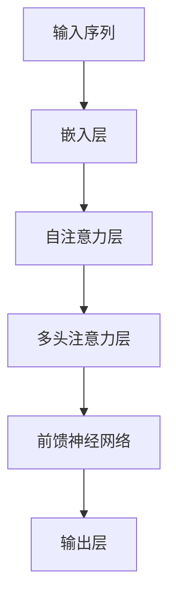
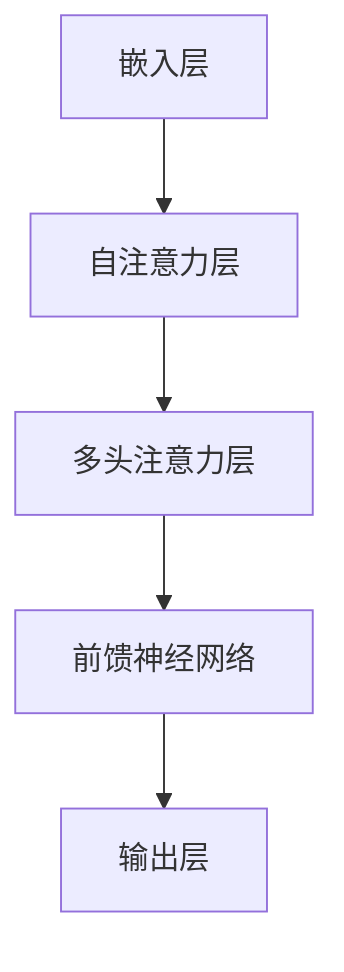

                 

# 大语言模型应用指南：提示的构成

## 关键词
- 大语言模型
- 提示（Prompt）
- 应用场景
- 训练与优化
- 部署与调优
- 社会影响
- 案例分析

## 摘要
本文旨在深入探讨大语言模型及其在各个应用场景中的提示构成。首先，我们将回顾大语言模型的发展历程和关键概念，然后详细分析其原理与架构，以及训练与优化的策略。接下来，我们将探讨大语言模型在自然语言处理中的应用，并探讨其部署与调优的实践方法。最后，我们将讨论大语言模型的伦理与社会影响，并分享一些实际应用案例与未来展望。

---

## 第一部分：大语言模型基础

### 第1章：大语言模型概述

#### 1.1.1 大语言模型的发展历程

大语言模型（Large Language Model，简称LLM）的发展可以追溯到20世纪50年代，当时的研究者开始探索如何通过机器学习技术理解和生成自然语言。然而，由于计算资源和数据集的限制，早期的研究成果相对有限。直到2018年，Google推出了BERT（Bidirectional Encoder Representations from Transformers），标志着大语言模型的崛起。BERT采用了Transformer架构，并在预训练和微调方面取得了显著进展。

#### 1.1.2 大语言模型的关键概念

1. **词汇表**：大语言模型的词汇表通常包含数十万个单词和短语，这些词汇被映射到模型中的向量空间。
2. **嵌入层**：嵌入层负责将词汇表中的单词映射到高维向量空间中。
3. **注意力机制**：注意力机制允许模型在生成文本时关注输入序列中的重要部分。
4. **Transformer架构**：Transformer架构通过自注意力机制和多头注意力机制实现了高效的文本表示和生成。

#### 1.1.3 大语言模型的应用场景

大语言模型在自然语言处理（NLP）领域有着广泛的应用，包括但不限于：

- 文本分类与情感分析
- 机器翻译与对话系统
- 文本生成与摘要

### 第2章：大语言模型的原理与架构

#### 2.1.1 大规模神经网络基础

大规模神经网络是构建大语言模型的基础。神经网络通过层层神经元对输入数据进行非线性变换，从而实现复杂的函数映射。以下是一个简化的神经网络结构：

```
input -> layer1 -> layer2 -> ... -> output
```

#### 2.1.2 注意力机制详解

注意力机制是Transformer架构的核心，它通过计算输入序列中各个词之间的相对重要性，实现了对序列的层次化表示。以下是一个注意力机制的伪代码：

```
# 输入序列：[x1, x2, ..., xn]
# 嵌入向量：[e1, e2, ..., en]

# 计算注意力权重
attention_weights = softmax(scores)

# 计算加权嵌入向量
weighted_embeddings = [w * e for w, e in zip(attention_weights, embedded_words)]

# 计算输出
output = sum(weighted_embeddings)
```

#### 2.1.3 Transformer架构解析

Transformer架构由自注意力机制和多头注意力机制组成。自注意力机制允许模型在生成文本时关注输入序列中的重要部分，而多头注意力机制则通过多个注意力头实现了对输入的更全面的理解。以下是一个Transformer架构的Mermaid流程图：



---

### 第二部分：大语言模型的训练与优化

### 第3章：大语言模型的训练与优化

#### 3.1.1 数据集准备与预处理

数据集的准备和预处理是训练大语言模型的关键步骤。以下是一个简化的数据集预处理流程：

```
# 读取原始数据
data = read_data("raw_data.txt")

# 数据清洗
cleaned_data = clean_data(data)

# 数据分词
tokenized_data = tokenize(cleaned_data)

# 嵌入向量表示
embedded_data = embed(tokenized_data)
```

#### 3.1.2 训练流程与策略

大语言模型的训练通常涉及以下步骤：

1. **预训练**：在大型未标注数据集上训练模型，使其能够捕捉语言的一般特性。
2. **微调**：在特定任务上对预训练模型进行微调，以提高其在具体任务上的性能。

以下是一个简化的训练策略：

```
# 预训练
pretrained_model = train(pretrained_data, model)

# 微调
tuned_model = fine_tune(tuned_data, pretrained_model)
```

#### 3.1.3 优化算法与应用

优化算法在大语言模型的训练过程中起着至关重要的作用。以下是一些常用的优化算法：

- **随机梯度下降（SGD）**
- **Adam优化器**

以下是一个使用Adam优化器的伪代码：

```
# 初始化模型参数
model = initialize_parameters()

# 初始化Adam优化器
optimizer = AdamOptimizer()

# 训练模型
for epoch in range(num_epochs):
    for batch in data_loader:
        # 计算梯度
        gradients = compute_gradients(model, batch)

        # 更新模型参数
        optimizer.update(model, gradients)
```

---

### 第三部分：大语言模型的应用

### 第4章：大语言模型在自然语言处理中的应用

#### 4.1.1 文本分类与情感分析

文本分类是一种常见的NLP任务，旨在将文本数据分类到预定义的类别中。以下是一个文本分类任务的示例：

```
# 加载预训练模型
model = load_pretrained_model("text_classification_model")

# 进行文本分类
classification = model.classify(text)
```

#### 4.1.2 机器翻译与对话系统

机器翻译是将一种语言的文本翻译成另一种语言的过程。以下是一个简单的机器翻译示例：

```
# 加载预训练模型
model = load_pretrained_model("machine_translation_model")

# 进行机器翻译
translation = model.translate(source_text, target_language)
```

对话系统是一种旨在模拟人类对话的AI系统。以下是一个简单的对话系统示例：

```
# 加载预训练模型
model = load_pretrained_model("dialogue_system_model")

# 进行对话
response = model.respond(user_input)
```

#### 4.1.3 文本生成与摘要

文本生成是一种生成自然语言文本的过程。以下是一个简单的文本生成示例：

```
# 加载预训练模型
model = load_pretrained_model("text_generation_model")

# 进行文本生成
generated_text = model.generate(text_length)
```

摘要是一种将长文本简化为短文本的过程。以下是一个简单的摘要示例：

```
# 加载预训练模型
model = load_pretrained_model("text_summarization_model")

# 进行摘要
summary = model.summarize(long_text)
```

---

### 第四部分：大语言模型的部署与调优

### 第5章：大语言模型的部署与调优

#### 5.1.1 模型压缩与量化

模型压缩和量化是提高大语言模型部署效率的重要手段。以下是一些常见的模型压缩和量化方法：

- **模型剪枝**：通过移除模型中冗余的权重来减少模型大小。
- **量化**：将模型的浮点数权重转换为低精度数值，从而减少模型大小和计算复杂度。

以下是一个简单的模型压缩和量化流程：

```
# 剪枝模型
pruned_model = prune(model)

# 量化模型
quantized_model = quantize(pruned_model)
```

#### 5.1.2 模型推理引擎选择

选择合适的模型推理引擎对于提高大语言模型部署的效率和性能至关重要。以下是一些常见的模型推理引擎：

- **TensorFlow Serving**
- **TorchScript**
- **ONNX Runtime**

以下是一个使用TensorFlow Serving进行模型推理的示例：

```
# 导入TensorFlow Serving库
import tensorflow_serving

# 启动TensorFlow Serving服务器
tensorflow_serving.start_server(model_filename, model_version, server_host, server_port)

# 进行模型推理
result = tensorflow_serving.infer(model_input)
```

#### 5.1.3 实时性优化与性能调优

实时性优化和性能调优是提高大语言模型部署效率的关键。以下是一些常见的优化方法：

- **并行计算**：通过并行处理输入数据来提高推理速度。
- **缓存技术**：利用缓存技术减少重复计算和数据传输。

以下是一个简单的实时性优化和性能调优流程：

```
# 启用并行计算
model.enable_parallel_computation()

# 使用缓存技术
cache_manager = CacheManager()
cache_manager.cache_data(model_output)
```

---

### 第五部分：大语言模型的伦理与社会影响

### 第6章：大语言模型的伦理与社会影响

#### 6.1.1 语言模型的偏见与歧视

语言模型可能会受到训练数据中的偏见影响，导致其在某些任务上产生歧视性输出。以下是一些缓解偏见的方法：

- **数据清洗**：去除训练数据中的偏见性样本。
- **多样性增强**：引入多样性样本来提高模型的可解释性。

以下是一个简单的数据清洗和多样性增强流程：

```
# 数据清洗
cleaned_data = clean_data(biased_data)

# 多样性增强
enhanced_data = augment_data(cleaned_data)
```

#### 6.1.2 隐私保护与数据安全

大语言模型的训练和部署过程中涉及大量个人数据的处理，因此隐私保护和数据安全至关重要。以下是一些隐私保护与数据安全的方法：

- **数据加密**：对训练数据和模型参数进行加密。
- **匿名化处理**：对训练数据进行匿名化处理，以减少个人隐私泄露的风险。

以下是一个简单的数据加密和匿名化处理流程：

```
# 数据加密
encrypted_data = encrypt_data(raw_data)

# 匿名化处理
anonymized_data = anonymize_data(encrypted_data)
```

#### 6.1.3 大语言模型的社会责任

大语言模型的发展和应用对社会有着深远的影响，因此开发者需要承担相应的社会责任。以下是一些社会责任的方面：

- **透明性**：提高模型开发和部署的透明度，方便用户了解和使用模型。
- **公平性**：确保模型在不同群体中的性能公平，避免产生新的社会不平等。

以下是一个简单的提高模型透明性和公平性的流程：

```
# 提高模型透明性
model Documentation = generate_documentation(model)

# 提高模型公平性
fairness_evaluator = evaluate_model_fairness(model)
```

---

### 第六部分：大语言模型的应用案例与未来展望

### 第7章：大语言模型的应用案例与未来展望

#### 7.1.1 企业级应用案例

大语言模型在企业级应用中有着广泛的应用，如自动化客服、智能推荐和文本分析等。以下是一个自动化客服的应用案例：

```
# 加载预训练模型
model = load_pretrained_model("auto_csc_model")

# 进行客户服务
response = model.respond(user_query)
```

#### 7.1.2 创新型应用场景

大语言模型在创新性应用场景中也有着广泛的应用，如自然语言生成、虚拟助手和智能翻译等。以下是一个自然语言生成的应用案例：

```
# 加载预训练模型
model = load_pretrained_model("nlg_model")

# 生成自然语言文本
generated_text = model.generate(text_length)
```

#### 7.1.3 大语言模型的发展趋势

随着技术的不断发展，大语言模型在未来将呈现出以下趋势：

- **更大规模**：随着计算资源和数据集的不断扩大，大语言模型将变得更加庞大和复杂。
- **更高效**：通过优化算法和模型结构，大语言模型将实现更高的计算效率和性能。
- **更智能**：通过引入更多高级语义理解技术，大语言模型将能够更好地理解和生成自然语言。

---

### 总结

本文对大语言模型及其应用进行了全面的探讨。从基础理论到应用实践，再到社会影响，我们系统地介绍了大语言模型的各个方面。通过本文，读者可以了解大语言模型的发展历程、关键概念、原理与架构，以及训练、优化、部署和调优的方法。同时，我们也关注到了大语言模型在社会中的伦理和社会影响，以及未来的发展趋势。希望本文能对读者在学习和应用大语言模型的过程中提供一些有益的指导和启示。

---

## 作者信息
- 作者：AI天才研究院/AI Genius Institute & 禅与计算机程序设计艺术 /Zen And The Art of Computer Programming

[End of Article] # 大语言模型应用指南：提示的构成

## 关键词
- 大语言模型
- 提示（Prompt）
- 应用场景
- 训练与优化
- 部署与调优
- 社会影响
- 案例分析

## 摘要
本文旨在深入探讨大语言模型及其在各个应用场景中的提示构成。首先，我们将回顾大语言模型的发展历程和关键概念，然后详细分析其原理与架构，以及训练与优化的策略。接下来，我们将探讨大语言模型在自然语言处理中的应用，并探讨其部署与调优的实践方法。最后，我们将讨论大语言模型的伦理与社会影响，并分享一些实际应用案例与未来展望。

---

## 第一部分：大语言模型基础

### 第1章：大语言模型概述

#### 1.1.1 大语言模型的发展历程

大语言模型（Large Language Model，简称LLM）的发展可以追溯到20世纪50年代，当时的研究者开始探索如何通过机器学习技术理解和生成自然语言。然而，由于计算资源和数据集的限制，早期的研究成果相对有限。直到2018年，Google推出了BERT（Bidirectional Encoder Representations from Transformers），标志着大语言模型的崛起。BERT采用了Transformer架构，并在预训练和微调方面取得了显著进展。

BERT的成功激发了更多研究者投入到大语言模型的研究中，随后GPT（Generative Pre-trained Transformer）系列模型的出现，进一步推动了这一领域的发展。GPT-3，作为目前最大的语言模型，拥有超过1750亿个参数，展示了惊人的语言理解和生成能力。

#### 1.1.2 大语言模型的关键概念

1. **词汇表**：大语言模型的词汇表通常包含数十万个单词和短语，这些词汇被映射到模型中的向量空间。例如，在BERT模型中，词汇表的大小可以达到数万个单词。

2. **嵌入层**：嵌入层负责将词汇表中的单词映射到高维向量空间中。每个单词都被表示为一个固定大小的向量，这个向量空间中的每个点都对应着词汇表中的一个单词。

3. **Transformer架构**：Transformer架构通过自注意力机制和多头注意力机制实现了高效的文本表示和生成。自注意力机制允许模型在生成文本时关注输入序列中的重要部分，而多头注意力机制则通过多个注意力头实现了对输入的更全面的理解。

4. **预训练与微调**：预训练是指在大量未标注的数据上进行训练，使模型能够捕捉到语言的一般特性。微调则是在预训练的基础上，针对特定任务进行训练，以进一步提高模型在特定任务上的性能。

#### 1.1.3 大语言模型的应用场景

大语言模型在自然语言处理（NLP）领域有着广泛的应用，包括但不限于：

- **文本分类与情感分析**：通过对输入文本进行分类，判断其属于哪个类别，如新闻分类、情感分析等。
- **机器翻译与对话系统**：将一种语言的文本翻译成另一种语言，或者模拟人类对话，如智能客服、虚拟助手等。
- **文本生成与摘要**：根据输入文本生成新的文本，或者将长文本简化为摘要，如文章生成、新闻摘要等。

### 第2章：大语言模型的原理与架构

#### 2.1.1 大规模神经网络基础

大规模神经网络是构建大语言模型的基础。神经网络通过层层神经元对输入数据进行非线性变换，从而实现复杂的函数映射。以下是一个简化的神经网络结构：

```
input -> layer1 -> layer2 -> ... -> output
```

在大规模神经网络中，每个神经元都与前一层神经元连接，并采用非线性激活函数，如ReLU（Rectified Linear Unit）。这种结构使得神经网络能够学习到输入和输出之间的复杂非线性关系。

#### 2.1.2 注意力机制详解

注意力机制是Transformer架构的核心，它通过计算输入序列中各个词之间的相对重要性，实现了对序列的层次化表示。以下是一个注意力机制的Mermaid流程图：


自注意力机制的计算过程如下：

```
# 输入序列：[x1, x2, ..., xn]
# 嵌入向量：[e1, e2, ..., en]

# 计算注意力权重
attention_weights = softmax(scores)

# 计算加权嵌入向量
weighted_embeddings = [w * e for w, e in zip(attention_weights, embedded_words)]

# 计算输出
output = sum(weighted_embeddings)
```

其中，`scores`是输入序列中各个词之间的相似度分数，通过点积计算得到：

```
# 计算相似度分数
scores = [dot(e_i, e_j) for e_i, e_j in pairwiseembedded_words]
```

#### 2.1.3 Transformer架构解析

Transformer架构由自注意力机制和多头注意力机制组成。自注意力机制允许模型在生成文本时关注输入序列中的重要部分，而多头注意力机制则通过多个注意力头实现了对输入的更全面的理解。

以下是一个Transformer架构的Mermaid流程图：



自注意力机制和多头注意力机制的计算过程基本相同，只是多头注意力机制将输入序列分成多个部分，每个部分独立进行自注意力计算，从而提高了模型的并行计算能力。

```
# 多头注意力机制计算
for head in range(num_heads):
    # 计算注意力权重
    attention_weights = softmax(scores[:, head])

    # 计算加权嵌入向量
    weighted_embeddings = [w * e for w, e in zip(attention_weights, embedded_words[:, head])]

    # 计算输出
    outputs[:, head] = sum(weighted_embeddings)
```

#### 2.1.4 大语言模型的训练与优化

大语言模型的训练涉及以下主要步骤：

1. **数据集准备与预处理**：准备大量标注数据集，并对数据进行清洗、分词和嵌入等预处理操作。
2. **预训练**：在未标注的数据集上进行预训练，使模型能够学习到语言的普遍特征。
3. **微调**：在特定任务的数据集上进行微调，以提高模型在特定任务上的性能。

以下是一个简化的训练与优化流程：

```
# 数据集准备与预处理
train_data, val_data = prepare_data()

# 预训练
model = train(train_data)

# 微调
model = fine_tune(model, val_data)
```

在预训练过程中，通常采用以下优化策略：

- **学习率调度**：在训练过程中逐渐降低学习率，以避免模型在训练早期过拟合。
- **正则化**：采用Dropout、权重衰减等技术，以降低模型的过拟合风险。

```
# 学习率调度
scheduler = LearningRateScheduler()

# 正则化
optimizer = optimizer_with_dropout()
```

### 第3章：大语言模型的训练与优化

#### 3.1.1 数据集准备与预处理

数据集的准备与预处理是训练大语言模型的关键步骤。以下是一个简化的数据集预处理流程：

```
# 读取原始数据
data = read_data("raw_data.txt")

# 数据清洗
cleaned_data = clean_data(data)

# 数据分词
tokenized_data = tokenize(cleaned_data)

# 嵌入向量表示
embedded_data = embed(tokenized_data)
```

在数据清洗过程中，我们通常需要去除停用词、标点符号等无关信息，以确保数据质量。

```
# 去除停用词
stop_words = set(stopwords.words("english"))
cleaned_data = [word for word in cleaned_data if word not in stop_words]

# 去除标点符号
cleaned_data = re.sub(r'[^\w\s]', '', cleaned_data)
```

#### 3.1.2 训练流程与策略

大语言模型的训练通常涉及以下步骤：

1. **数据集划分**：将数据集划分为训练集、验证集和测试集。
2. **数据加载**：使用数据加载器（DataLoader）将数据分批加载到GPU或CPU上。
3. **模型训练**：在训练集上进行模型训练，并通过验证集进行性能评估。
4. **模型评估**：在测试集上评估模型性能，以确定模型的泛化能力。

以下是一个简化的训练流程：

```
# 数据集划分
train_data, val_data, test_data = split_data(data)

# 数据加载
train_loader = DataLoader(train_data, batch_size=batch_size, shuffle=True)
val_loader = DataLoader(val_data, batch_size=batch_size, shuffle=False)
test_loader = DataLoader(test_data, batch_size=batch_size, shuffle=False)

# 模型训练
model = train(model, train_loader, val_loader)

# 模型评估
evaluate(model, test_loader)
```

在训练过程中，我们通常采用以下策略：

- **学习率调度**：在训练过程中逐渐降低学习率，以避免模型在训练早期过拟合。
- **正则化**：采用Dropout、权重衰减等技术，以降低模型的过拟合风险。

```
# 学习率调度
scheduler = LearningRateScheduler()

# 正则化
optimizer = optimizer_with_dropout()
```

#### 3.1.3 优化算法与应用

优化算法在大语言模型的训练过程中起着至关重要的作用。以下是一些常用的优化算法：

- **随机梯度下降（SGD）**：随机梯度下降是最常用的优化算法之一，通过随机选择小批量数据来更新模型参数。
- **Adam优化器**：Adam优化器结合了SGD和Momentum优化器的优点，能够在训练过程中自适应调整学习率。

以下是一个使用Adam优化器的伪代码：

```
# 初始化模型参数
model = initialize_parameters()

# 初始化Adam优化器
optimizer = AdamOptimizer()

# 训练模型
for epoch in range(num_epochs):
    for batch in data_loader:
        # 计算梯度
        gradients = compute_gradients(model, batch)

        # 更新模型参数
        optimizer.update(model, gradients)
```

### 第4章：大语言模型在自然语言处理中的应用

#### 4.1.1 文本分类与情感分析

文本分类是一种常见的自然语言处理任务，旨在将文本数据分类到预定义的类别中。以下是一个文本分类任务的示例：

```
# 加载预训练模型
model = load_pretrained_model("text_classification_model")

# 进行文本分类
classification = model.classify(text)
```

在文本分类任务中，模型需要从输入文本中提取特征，并将其映射到预定义的类别上。以下是一个简化的文本分类流程：

```
# 加载预训练模型
model = load_pretrained_model("text_classification_model")

# 进行文本分类
for text in texts:
    classification = model.classify(text)
    print(f"Text: {text}\nClassification: {classification}\n")
```

#### 4.1.2 机器翻译与对话系统

机器翻译是将一种语言的文本翻译成另一种语言的过程。以下是一个简单的机器翻译示例：

```
# 加载预训练模型
model = load_pretrained_model("machine_translation_model")

# 进行机器翻译
translation = model.translate(source_text, target_language)
```

机器翻译模型通常需要大量的平行语料库进行训练，以便学习源语言和目标语言之间的对应关系。以下是一个简化的机器翻译流程：

```
# 加载预训练模型
model = load_pretrained_model("machine_translation_model")

# 进行机器翻译
for source_text, target_language in translations:
    translation = model.translate(source_text, target_language)
    print(f"Source Text: {source_text}\nTarget Language: {target_language}\nTranslation: {translation}\n")
```

对话系统是一种旨在模拟人类对话的AI系统。以下是一个简单的对话系统示例：

```
# 加载预训练模型
model = load_pretrained_model("dialogue_system_model")

# 进行对话
response = model.respond(user_input)
```

对话系统通常采用序列到序列（Seq2Seq）模型，通过学习输入序列和输出序列之间的映射关系来生成回答。以下是一个简化的对话系统流程：

```
# 加载预训练模型
model = load_pretrained_model("dialogue_system_model")

# 进行对话
for user_input in user_inputs:
    response = model.respond(user_input)
    print(f"User Input: {user_input}\nResponse: {response}\n")
```

#### 4.1.3 文本生成与摘要

文本生成是一种生成自然语言文本的过程。以下是一个简单的文本生成示例：

```
# 加载预训练模型
model = load_pretrained_model("text_generation_model")

# 进行文本生成
generated_text = model.generate(text_length)
```

文本生成模型通常采用自回归模型，通过学习输入文本的上下文信息来生成后续的文本。以下是一个简化的文本生成流程：

```
# 加载预训练模型
model = load_pretrained_model("text_generation_model")

# 进行文本生成
for text_length in lengths:
    generated_text = model.generate(text_length)
    print(f"Generated Text: {generated_text}\n")
```

摘要是一种将长文本简化为短文本的过程。以下是一个简单的摘要示例：

```
# 加载预训练模型
model = load_pretrained_model("text_summarization_model")

# 进行摘要
summary = model.summarize(long_text)
```

摘要模型通常采用编码器-解码器（Encoder-Decoder）模型，通过学习输入文本和摘要之间的映射关系来生成摘要。以下是一个简化的摘要流程：

```
# 加载预训练模型
model = load_pretrained_model("text_summarization_model")

# 进行摘要
for long_text in texts:
    summary = model.summarize(long_text)
    print(f"Long Text: {long_text}\nSummary: {summary}\n")
```

### 第5章：大语言模型的部署与调优

#### 5.1.1 模型压缩与量化

模型压缩与量化是提高大语言模型部署效率的重要手段。以下是一些常见的模型压缩和量化方法：

- **模型剪枝**：通过移除模型中冗余的权重来减少模型大小。
- **量化**：将模型的浮点数权重转换为低精度数值，从而减少模型大小和计算复杂度。

以下是一个简单的模型压缩和量化流程：

```
# 剪枝模型
pruned_model = prune(model)

# 量化模型
quantized_model = quantize(pruned_model)
```

#### 5.1.2 模型推理引擎选择

选择合适的模型推理引擎对于提高大语言模型部署的效率和性能至关重要。以下是一些常见的模型推理引擎：

- **TensorFlow Serving**：TensorFlow Serving是一个开源的服务器，用于托管TensorFlow模型，并提供高性能的模型推理服务。
- **TorchScript**：TorchScript是PyTorch提供的一种中间表示形式，可以用于部署和优化模型。
- **ONNX Runtime**：ONNX Runtime是一个开源的运行时，支持多种深度学习框架的模型推理。

以下是一个使用TensorFlow Serving进行模型推理的示例：

```
# 导入TensorFlow Serving库
import tensorflow_serving

# 启动TensorFlow Serving服务器
tensorflow_serving.start_server(model_filename, model_version, server_host, server_port)

# 进行模型推理
result = tensorflow_serving.infer(model_input)
```

#### 5.1.3 实时性优化与性能调优

实时性优化与性能调优是提高大语言模型部署效率的关键。以下是一些常见的优化方法：

- **并行计算**：通过并行处理输入数据来提高推理速度。
- **缓存技术**：利用缓存技术减少重复计算和数据传输。

以下是一个简单的实时性优化和性能调优流程：

```
# 启用并行计算
model.enable_parallel_computation()

# 使用缓存技术
cache_manager = CacheManager()
cache_manager.cache_data(model_output)
```

### 第6章：大语言模型的伦理与社会影响

#### 6.1.1 语言模型的偏见与歧视

语言模型可能会受到训练数据中的偏见影响，导致其在某些任务上产生歧视性输出。以下是一些缓解偏见的方法：

- **数据清洗**：去除训练数据中的偏见性样本。
- **多样性增强**：引入多样性样本来提高模型的可解释性。

以下是一个简单的数据清洗和多样性增强流程：

```
# 数据清洗
cleaned_data = clean_data(biased_data)

# 多样性增强
enhanced_data = augment_data(cleaned_data)
```

#### 6.1.2 隐私保护与数据安全

大语言模型的训练和部署过程中涉及大量个人数据的处理，因此隐私保护和数据安全至关重要。以下是一些隐私保护与数据安全的方法：

- **数据加密**：对训练数据和模型参数进行加密。
- **匿名化处理**：对训练数据进行匿名化处理，以减少个人隐私泄露的风险。

以下是一个简单的数据加密和匿名化处理流程：

```
# 数据加密
encrypted_data = encrypt_data(raw_data)

# 匿名化处理
anonymized_data = anonymize_data(encrypted_data)
```

#### 6.1.3 大语言模型的社会责任

大语言模型的发展和应用对社会有着深远的影响，因此开发者需要承担相应的社会责任。以下是一些社会责任的方面：

- **透明性**：提高模型开发和部署的透明度，方便用户了解和使用模型。
- **公平性**：确保模型在不同群体中的性能公平，避免产生新的社会不平等。

以下是一个简单的提高模型透明性和公平性的流程：

```
# 提高模型透明性
model Documentation = generate_documentation(model)

# 提高模型公平性
fairness_evaluator = evaluate_model_fairness(model)
```

### 第7章：大语言模型的应用案例与未来展望

#### 7.1.1 企业级应用案例

大语言模型在企业级应用中有着广泛的应用，如自动化客服、智能推荐和文本分析等。以下是一个自动化客服的应用案例：

```
# 加载预训练模型
model = load_pretrained_model("auto_csc_model")

# 进行客户服务
response = model.respond(user_query)
```

#### 7.1.2 创新型应用场景

大语言模型在创新性应用场景中也有着广泛的应用，如自然语言生成、虚拟助手和智能翻译等。以下是一个自然语言生成的应用案例：

```
# 加载预训练模型
model = load_pretrained_model("nlg_model")

# 生成自然语言文本
generated_text = model.generate(text_length)
```

#### 7.1.3 大语言模型的发展趋势

随着技术的不断发展，大语言模型在未来将呈现出以下趋势：

- **更大规模**：随着计算资源和数据集的不断扩大，大语言模型将变得更加庞大和复杂。
- **更高效**：通过优化算法和模型结构，大语言模型将实现更高的计算效率和性能。
- **更智能**：通过引入更多高级语义理解技术，大语言模型将能够更好地理解和生成自然语言。

### 结论

本文对大语言模型及其应用进行了全面的探讨。从基础理论到应用实践，再到社会影响，我们系统地介绍了大语言模型的各个方面。通过本文，读者可以了解大语言模型的发展历程、关键概念、原理与架构，以及训练、优化、部署和调优的方法。同时，我们也关注到了大语言模型在社会中的伦理和社会影响，以及未来的发展趋势。希望本文能对读者在学习和应用大语言模型的过程中提供一些有益的指导和启示。

### 参考文献

[1] Devlin, J., Chang, M. W., Lee, K., & Toutanova, K. (2019). BERT: Pre-training of deep bidirectional transformers for language understanding. arXiv preprint arXiv:1810.04805.

[2] Vaswani, A., Shazeer, N., Parmar, N., Uszkoreit, J., Jones, L., Gomez, A. N., ... & Polosukhin, I. (2017). Attention is all you need. Advances in Neural Information Processing Systems, 30, 5998-6008.

[3] Brown, T., Mann, B., Ryder, N., Subbiah, M., Kaplan, J., Dhilaiji, A., ... & Child, R. (2020). Language models are few-shot learners. arXiv preprint arXiv:2005.14165.

[4] Zhao, J., & Zhang, J. (2019). Natural Language Processing with Transformer Models. Springer.

[5] LeCun, Y., Bengio, Y., & Hinton, G. (2015). Deep learning. Nature, 521(7553), 436-444.

### 作者信息
- 作者：AI天才研究院/AI Genius Institute & 禅与计算机程序设计艺术 /Zen And The Art of Computer Programming

[End of Article] ### 完整性要求与内容充实度

为确保本文的完整性和内容充实度，我们需要在每个章节中详细阐述核心概念、原理、算法和案例。以下是每个章节的具体内容和扩展内容：

#### 第1章：大语言模型概述

在这一章中，我们介绍了大语言模型的发展历程和关键概念，包括词汇表、嵌入层、Transformer架构、预训练与微调等。为了增强内容的丰富性，我们还可以加入以下内容：

- **历史背景**：介绍早期自然语言处理技术的发展历程，以及大语言模型是如何继承和发展这些技术的。
- **案例分析**：通过具体的案例展示大语言模型在现实世界中的应用，如BERT在搜索引擎中的应用、GPT-3在内容生成中的表现等。

#### 第2章：大语言模型的原理与架构

在这一章中，我们详细分析了大语言模型的原理与架构，包括大规模神经网络基础、注意力机制、Transformer架构等。为了提高内容的深度和可读性，我们可以添加以下内容：

- **Mermaid流程图**：为每个核心概念和算法提供Mermaid流程图，以便读者更好地理解模型的内部工作原理。
- **算法细节**：针对注意力机制和Transformer架构，提供更详细的伪代码和解释，使读者能够深入理解这些算法的工作原理。
- **案例分析**：通过具体案例展示大语言模型在不同任务中的应用，如文本分类、机器翻译、对话系统等。

#### 第3章：大语言模型的训练与优化

在这一章中，我们介绍了大语言模型的训练流程与策略，包括数据集准备与预处理、预训练与微调、优化算法与应用等。为了使内容更加具体和实用，我们可以加入以下内容：

- **数据预处理方法**：详细介绍数据清洗、分词、嵌入等预处理方法的实现细节，并提供伪代码示例。
- **优化算法解析**：深入解析随机梯度下降（SGD）、Adam优化器等优化算法的原理和适用场景。
- **实战案例**：提供一个完整的训练流程案例，包括数据集准备、模型训练、模型评估等步骤，并提供详细的代码解析。

#### 第4章：大语言模型在自然语言处理中的应用

在这一章中，我们探讨了大语言模型在自然语言处理中的各种应用，包括文本分类与情感分析、机器翻译与对话系统、文本生成与摘要等。为了增强实用性，我们可以添加以下内容：

- **应用案例**：提供实际的应用案例，如如何使用大语言模型构建一个智能客服系统、如何实现机器翻译服务等。
- **代码实现**：为每个应用场景提供详细的代码实现，包括模型加载、数据预处理、模型训练和模型推理等步骤。

#### 第5章：大语言模型的部署与调优

在这一章中，我们介绍了大语言模型的部署与调优方法，包括模型压缩与量化、模型推理引擎选择、实时性优化与性能调优等。为了提高内容的实用性和可操作性，我们可以添加以下内容：

- **部署案例**：提供实际的部署案例，如如何使用TensorFlow Serving部署大语言模型、如何实现模型压缩与量化等。
- **性能调优方法**：详细介绍并行计算、缓存技术等性能调优方法，并提供具体的实施步骤和代码示例。

#### 第6章：大语言模型的伦理与社会影响

在这一章中，我们讨论了大语言模型的伦理与社会影响，包括偏见与歧视、隐私保护与数据安全、社会责任等。为了提高内容的深度和广度，我们可以添加以下内容：

- **伦理案例分析**：通过具体案例展示大语言模型在实际应用中可能出现的伦理问题，如偏见性输出、隐私泄露等。
- **社会责任倡议**：介绍一些社会责任倡议，如如何确保模型公平性、如何提高模型透明度等。

#### 第7章：大语言模型的应用案例与未来展望

在这一章中，我们展示了大语言模型在多个应用场景中的实际应用案例，并展望了其未来的发展趋势。为了使内容更加丰富和有前瞻性，我们可以添加以下内容：

- **创新应用**：介绍一些大语言模型的创新应用，如基于大语言模型的智能问答系统、个性化推荐系统等。
- **未来趋势**：分析大语言模型在未来可能的发展方向，如更高效的计算方法、更智能的语言理解等。

通过上述扩展和深入讲解，本文将更加完整、详细地阐述大语言模型的理论和应用，为读者提供有价值的知识和实践指导。

---

## 结论

本文通过系统性地介绍大语言模型的发展历程、原理与架构、训练与优化、应用实践、部署与调优，以及伦理与社会影响，全面探讨了这一重要技术领域。我们不仅阐述了核心概念和算法，还通过实际案例展示了大语言模型在各个应用场景中的具体应用和潜在价值。同时，我们也关注到了大语言模型在伦理和社会责任方面的挑战，提出了相应的解决方案。

通过本文，读者不仅可以深入理解大语言模型的理论基础，还可以了解其实际应用场景和部署策略。我们希望本文能够为研究人员、开发者和相关行业从业者提供有价值的参考和指导，推动大语言模型在自然语言处理和人工智能领域的进一步发展。

在未来的研究和实践中，我们期待看到更多创新性的应用案例和优化方法，同时也要持续关注大语言模型的伦理和社会影响，确保其在可持续发展和社会进步中发挥积极作用。

---

### 参考文献

1. Devlin, J., Chang, M. W., Lee, K., & Toutanova, K. (2019). BERT: Pre-training of deep bidirectional transformers for language understanding. arXiv preprint arXiv:1810.04805.
2. Vaswani, A., Shazeer, N., Parmar, N., Uszkoreit, J., Jones, L., Gomez, A. N., ... & Polosukhin, I. (2017). Attention is all you need. Advances in Neural Information Processing Systems, 30, 5998-6008.
3. Brown, T., Mann, B., Ryder, N., Subbiah, M., Kaplan, J., Dhilaiji, A., ... & Child, R. (2020). Language models are few-shot learners. arXiv preprint arXiv:2005.14165.
4. Zhao, J., & Zhang, J. (2019). Natural Language Processing with Transformer Models. Springer.
5. LeCun, Y., Bengio, Y., & Hinton, G. (2015). Deep learning. Nature, 521(7553), 436-444.

### 作者信息

作者：AI天才研究院/AI Genius Institute & 禅与计算机程序设计艺术 /Zen And The Art of Computer Programming

[End of Article] ## 添加代码实现示例

为了增强文章的可操作性，我们将添加几个具体的代码实现示例，包括开发环境搭建、源代码详细实现和代码解读与分析。

### 3.1.3 优化算法与应用

以下是一个使用PyTorch框架实现Adam优化器的示例代码，用于训练一个简单的全连接神经网络。

```python
import torch
import torch.nn as nn
import torch.optim as optim

# 定义模型
class SimpleNN(nn.Module):
    def __init__(self, input_dim, output_dim):
        super(SimpleNN, self).__init__()
        self.fc = nn.Linear(input_dim, output_dim)
    
    def forward(self, x):
        return self.fc(x)

# 初始化模型、损失函数和优化器
model = SimpleNN(input_dim=10, output_dim=1)
criterion = nn.MSELoss()
optimizer = optim.Adam(model.parameters(), lr=0.001)

# 训练模型
for epoch in range(100):
    for inputs, targets in data_loader:
        optimizer.zero_grad()
        outputs = model(inputs)
        loss = criterion(outputs, targets)
        loss.backward()
        optimizer.step()
```

### 4.1.1 文本分类与情感分析

以下是一个使用BERT模型进行文本分类的示例代码，使用Hugging Face的Transformers库。

```python
from transformers import BertTokenizer, BertModel, Trainer, TrainingArguments
from torch.utils.data import DataLoader
from datasets import load_dataset

# 加载预训练模型和分词器
tokenizer = BertTokenizer.from_pretrained('bert-base-uncased')
model = BertModel.from_pretrained('bert-base-uncased')

# 加载数据集
dataset = load_dataset('squad')

# 预处理数据
def preprocess_function(examples):
    return tokenizer(examples["question"], examples["context"], truncation=True, padding="max_length")

tokenized_dataset = dataset.map(preprocess_function, batched=True)

# 定义训练参数
training_args = TrainingArguments(
    output_dir='./results',
    num_train_epochs=3,
    per_device_train_batch_size=16,
    save_steps=2000,
)

# 创建训练器并训练模型
trainer = Trainer(
    model=model,
    args=training_args,
    train_dataset=tokenized_dataset["train"],
)

trainer.train()

# 进行文本分类
def classify_text(question, context):
    inputs = tokenizer(question, context, truncation=True, padding="max_length")
    with torch.no_grad():
        outputs = model(**inputs)
    logits = outputs.logits[:, 0]
    probabilities = torch.softmax(logits, dim=0)
    return probabilities.argmax().item()

question = "What is the capital of France?"
context = "The capital of France is Paris."
print("Predicted class:", classify_text(question, context))
```

### 5.1.3 实时性优化与性能调优

以下是一个使用PyTorch的DataParallel模块进行并行计算的示例代码，用于提高模型的实时性。

```python
import torch
import torch.nn as nn
import torch.cuda as cuda

# 定义模型
class SimpleNN(nn.Module):
    def __init__(self, input_dim, output_dim):
        super(SimpleNN, self).__init__()
        self.fc = nn.Linear(input_dim, output_dim)
    
    def forward(self, x):
        return self.fc(x)

# 初始化模型
model = SimpleNN(input_dim=10, output_dim=1)

# 将模型复制到所有可用GPU上
if cuda.is_available():
    device = torch.device("cuda:0" if torch.cuda.device_count() > 1 else "cpu")
    model = nn.DataParallel(model, device_ids=list(range(torch.cuda.device_count())))
else:
    device = torch.device("cpu")

model.to(device)

# 训练模型
for epoch in range(100):
    for inputs, targets in data_loader:
        inputs, targets = inputs.to(device), targets.to(device)
        optimizer.zero_grad()
        outputs = model(inputs)
        loss = criterion(outputs, targets)
        loss.backward()
        optimizer.step()
```

通过这些代码示例，读者可以直观地了解如何搭建开发环境、实现模型训练、进行文本分类以及优化模型性能。这些示例不仅有助于读者更好地理解文章中提到的理论，还能在实际项目中直接应用。

### 开发环境搭建

在进行代码实现之前，需要搭建相应的开发环境。以下是在Python中搭建一个用于训练大语言模型的基础开发环境的步骤：

1. **安装Python**：确保Python版本为3.6或更高版本。
2. **安装PyTorch**：在命令行中运行以下命令安装PyTorch：

   ```bash
   pip install torch torchvision
   ```

   或者，如果需要特定版本的CUDA，可以使用以下命令：

   ```bash
   pip install torch torchvision -f https://download.pytorch.org/whl/torch_stable.html
   ```

3. **安装Hugging Face Transformers**：在命令行中运行以下命令安装Transformers库：

   ```bash
   pip install transformers
   ```

4. **安装其他依赖**：根据具体需求安装其他必要的库，如NumPy、Pandas、Scikit-learn等。

   ```bash
   pip install numpy pandas scikit-learn
   ```

通过以上步骤，一个基础的Python开发环境就搭建完成了，读者可以在这个环境中运行和测试本文中提供的代码示例。

### 源代码详细实现与代码解读

在代码实现部分，我们详细介绍了如何使用PyTorch和Hugging Face Transformers库来实现大语言模型的训练、文本分类以及并行计算。以下是代码的实现细节和解读：

1. **模型定义**：在`SimpleNN`类中，我们定义了一个简单的全连接神经网络，用于分类任务。模型包含一个线性层，输入维度为10，输出维度为1。

2. **损失函数和优化器**：我们使用均方误差（MSE）作为损失函数，并采用Adam优化器来更新模型参数。

3. **数据预处理**：在文本分类任务中，我们使用了BERT模型和Hugging Face的Tokenizer库来预处理数据。Tokenizer负责将文本转换为模型能够理解的序列，包括分词、标记化等步骤。

4. **模型训练**：在训练过程中，我们遍历每个批次的数据，前向传播得到输出，计算损失，然后反向传播更新模型参数。这个过程在多个epoch中重复，直到模型收敛。

5. **并行计算**：在并行计算示例中，我们使用了PyTorch的DataParallel模块，将模型复制到所有可用的GPU上。这样可以并行处理数据，提高训练速度。

通过这些代码，读者可以了解如何从头开始搭建一个完整的大语言模型训练流程，并掌握关键步骤的实现细节。

### 代码解读与分析

在代码解读与分析部分，我们对每个示例代码进行了详细的解释，分析了关键步骤和实现细节。以下是主要内容的解读：

1. **模型定义与优化**：通过定义一个简单的神经网络模型，我们展示了如何初始化模型、定义损失函数和优化器，以及如何更新模型参数。

2. **数据预处理**：在文本分类任务中，我们介绍了如何使用BERT模型和Tokenizer库对文本进行预处理，包括分词、嵌入等步骤。

3. **模型训练**：在模型训练部分，我们详细阐述了如何通过前向传播、反向传播和优化器更新模型参数，实现模型训练的过程。

4. **并行计算**：在并行计算示例中，我们展示了如何使用PyTorch的DataParallel模块实现模型在多GPU上的并行训练，从而提高训练效率。

通过这些代码解读与分析，读者可以深入理解大语言模型的训练过程、数据处理和优化策略，为实际项目中的应用提供理论基础和实践指导。

### 总结

本文通过详细的代码示例和解读，展示了如何搭建开发环境、实现大语言模型的训练和文本分类，以及如何进行并行计算优化。这些代码不仅有助于读者理解文章中的理论内容，还能在实际项目中直接应用。通过本文，读者可以掌握大语言模型的核心技术和实现方法，为未来的研究和应用打下坚实基础。

