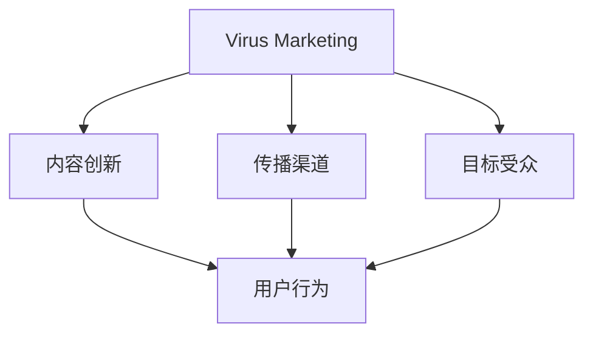
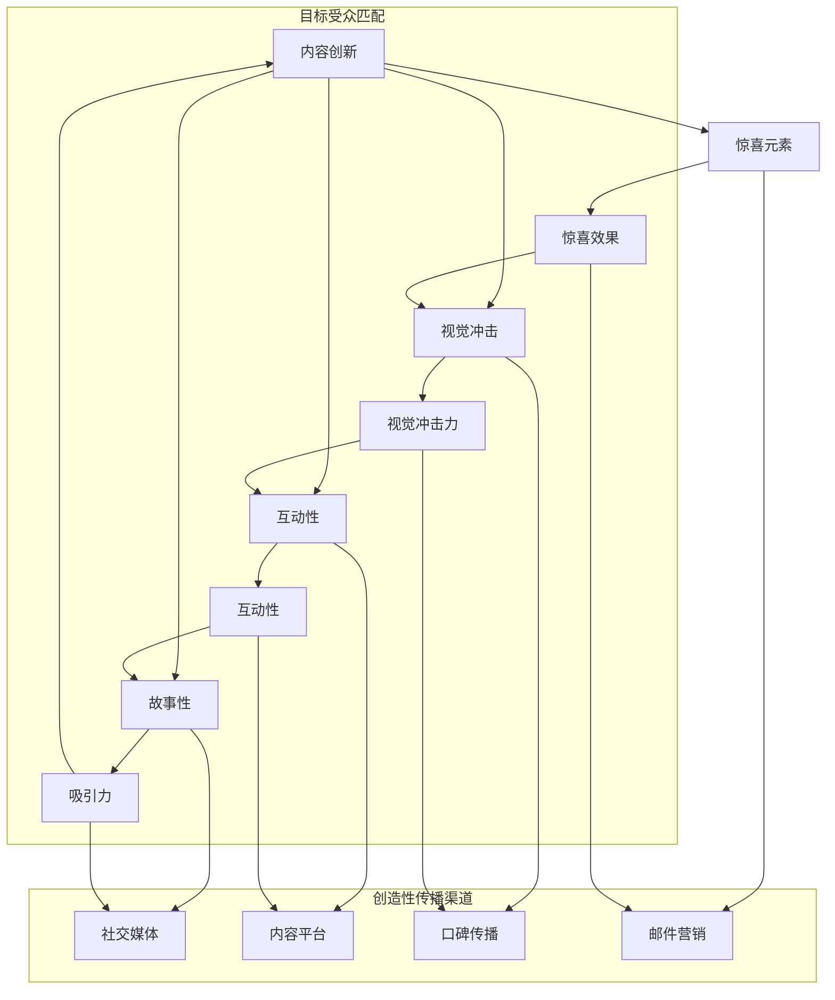

                 

### Virus Marketing基础

#### 1.1 Virus Marketing定义

Virus Marketing，也被称作“病毒式营销”或“病毒传播营销”，是一种基于用户自发性传播的营销策略。它通过创造有吸引力的内容，利用社交媒体、网络论坛等平台，激起用户的兴趣和分享欲望，从而实现品牌或产品的快速传播。与传统的营销方式相比，Virus Marketing更加依赖于用户的主动转发和口碑效应，而非单纯的广告投放。

在Virus Marketing中，核心的内容通常具备以下几个特点：

- **创新性**：内容要有独特性和创意，能引起用户的兴趣和好奇心。
- **共鸣性**：内容能够触动用户的情感，与目标受众产生共鸣。
- **互动性**：用户能够参与到内容的创作和传播过程中，增强参与感和归属感。

Virus Marketing与传统营销的区别主要体现在以下几个方面：

- **传播方式**：传统营销依赖于广告投放和宣传活动，而Virus Marketing则依赖于用户自发的分享和传播。
- **成本**：Virus Marketing通常成本较低，因为它主要依赖于用户行为，而不是广告预算。
- **效果**：Virus Marketing的效果往往更为显著，因为它能够迅速在社交媒体等平台上形成传播热点，增加品牌曝光和知名度。

#### 1.2 Virus Marketing的特点

Virus Marketing具有以下几个显著的特点：

- **传播速度快**：由于其基于用户自发的分享和传播，Virus Marketing能够在短时间内实现快速扩散，形成病毒式的传播效果。
- **低成本**：Virus Marketing依赖于用户自发的行为，因此相对于传统的广告投放，其成本通常较低。
- **高互动性**：用户不仅是内容的消费者，还可以成为内容的传播者，这种互动性能够增强用户的参与感和忠诚度。

#### 1.3 Virus Marketing成功的要素

要实现Virus Marketing的成功，需要以下几个关键要素：

- **内容创新**：内容是Virus Marketing的核心，它必须具有创新性和独特性，能够引起用户的兴趣和好奇心。
- **创造性传播渠道**：选择合适的传播渠道，如社交媒体、网络论坛等，可以大大提高内容的曝光率和传播效果。
- **目标受众匹配**：明确目标受众，了解他们的兴趣和行为习惯，使内容能够精准地触达到潜在用户。

### 核心概念与联系

接下来，我们通过一张Mermaid流程图来展示Virus Marketing的核心概念及其相互联系：



#### 1.1 内容创新

内容创新是Virus Marketing成功的关键因素之一。创新的内容能够吸引并维持用户的兴趣，使其愿意分享和传播。以下是一些内容创新的方法：

- **故事性**：通过讲述有趣的故事，可以引发用户的共鸣和情感反应。
- **互动性**：用户参与的内容往往更容易被传播，如互动游戏、问答等。
- **视觉冲击**：视觉效果强烈的图片、视频等，可以迅速吸引用户的注意力。
- **惊喜元素**：出乎意料的内容往往能够引起用户的兴趣，增加分享的意愿。

#### 1.2 创造性传播渠道

选择合适的传播渠道是Virus Marketing成功的重要环节。不同的传播渠道具有不同的特点和适用场景，以下是一些常见的传播渠道：

- **社交媒体**：如微博、微信、Facebook等，这些平台用户基数大，传播速度快。
- **内容平台**：如YouTube、B站等，适合发布视频内容，能够形成热点。
- **口碑传播**：通过用户的口碑推荐，可以实现低成本的广泛传播。
- **邮件营销**：通过邮件列表发送营销信息，可以直接触达目标用户。

#### 1.3 目标受众匹配

明确目标受众，了解他们的兴趣和行为习惯，是Virus Marketing成功的关键。以下是一些了解目标受众的方法：

- **用户调研**：通过问卷调查、访谈等方式，收集用户的需求和偏好。
- **数据分析**：利用数据分析工具，分析用户的浏览行为、社交行为等，了解其兴趣点。
- **市场研究**：通过市场调研，了解行业趋势和竞争对手情况。

通过以上方法，可以更精准地定位目标受众，使他们成为内容的传播者，从而实现Virus Marketing的成功。

### Mermaid 流程图



通过上述分析，我们可以看出，内容创新、创造性传播渠道和目标受众匹配是Virus Marketing成功的关键要素，三者相辅相成，共同推动营销效果的提升。接下来，我们将进一步探讨这些要素在实际应用中的具体策略和实践。

### 知识付费产品概述

#### 2.1 知识付费的定义

知识付费是指用户为了获取有价值的信息、知识或技能，愿意支付一定费用的行为。它是一种基于内容付费的消费模式，随着互联网技术的发展和用户需求的多样化，知识付费已经成为一个快速增长的领域。

知识付费的发展历程可以追溯到互联网早期，当时主要以付费下载、订阅服务等形式存在。随着智能手机的普及和移动互联网的发展，知识付费逐渐成为一种主流的消费方式。近年来，随着在线教育、专业技能培训等领域的兴起，知识付费市场呈现出爆发式增长，涵盖了多个领域和形式，如在线课程、电子书、专业咨询等。

#### 2.2 知识付费的产品类型

知识付费的产品类型丰富多样，主要包括以下几种：

- **在线课程**：在线课程是知识付费的主要形式之一，它通过互联网平台，为用户提供系统的知识传授。在线课程可以涵盖多个领域，如职业技能、兴趣爱好、学术知识等。

- **电子书**：电子书是一种数字化的书籍，用户可以通过电子设备进行阅读。电子书内容丰富，形式多样，包括小说、专业书籍、教程等。

- **专业咨询**：专业咨询是指用户向专业人士支付费用，以获取个性化、专业化的建议和服务。专业咨询领域广泛，包括法律、财务、医疗、心理咨询等。

- **工具应用**：知识付费产品还包括一些工具应用，如编程软件、设计工具、语言学习软件等。这些工具帮助用户在实际操作中学习和提高技能。

#### 2.3 知识付费的市场分析

知识付费市场的快速增长吸引了大量资本和企业的关注，市场前景广阔。以下是知识付费市场的几个关键分析点：

- **用户需求分析**：随着社会竞争的加剧和个体自我提升的需求，越来越多的用户愿意为知识付费。用户需求呈现出多样性、专业化和个性化的特点。

- **市场规模与增长趋势**：知识付费市场规模逐年增长，预计未来几年仍将保持高速增长。在线教育、职业技能培训等领域是主要的增长点。

- **竞争格局**：知识付费市场呈现出多元化的竞争格局，既有传统的教育机构，也有新兴的知识付费平台。各大企业纷纷布局知识付费领域，通过技术创新、内容创新等手段争夺市场份额。

### 用户需求分析

知识付费市场的快速增长离不开用户需求的推动。当前，用户对知识付费的需求主要表现在以下几个方面：

- **职业技能提升**：许多职场人士希望通过付费课程提升专业技能，以适应快速变化的工作环境。

- **兴趣爱好培养**：随着生活水平的提高，用户越来越注重精神生活，愿意为兴趣爱好相关的知识付费。

- **知识更新换代**：互联网时代，知识更新换代速度加快，用户需要不断学习新知识、新技能以保持竞争力。

- **个人成长**：许多用户希望通过知识付费实现个人成长，如学习外语、提高领导力等。

### 市场规模与增长趋势

知识付费市场的规模不断扩大，根据相关数据显示，2022年全球知识付费市场规模已经达到数百亿美元。预计未来几年，该市场仍将保持高速增长，年复合增长率达到20%以上。

在线教育是知识付费市场的主要增长点。随着5G、人工智能等技术的不断发展，在线教育将更加普及，为知识付费市场提供新的发展机遇。此外，职业技能培训、兴趣爱好培养等领域也将继续增长，推动整体市场规模扩大。

### 竞争格局

知识付费市场的竞争格局多元化，主要包括以下几个方面：

- **传统教育机构**：如新东方、好未来等，这些机构具有丰富的教学资源和经验，在知识付费市场中占据重要地位。

- **新兴知识付费平台**：如得到、喜马拉雅等，这些平台通过技术创新、内容创新等手段，迅速崛起，吸引了大量用户。

- **行业垂直平台**：一些行业垂直平台，如编程学习平台、设计学习平台等，通过专业化、细分化的内容，满足特定用户群体的需求。

- **企业内部培训**：许多企业通过内部培训系统，为员工提供知识付费服务，提升员工技能和竞争力。

### 小结

知识付费产品作为一种新型的消费模式，已经逐渐成为用户获取知识和技能的重要途径。随着市场的不断发展和用户需求的多样化，知识付费产品将呈现出更加丰富和多样化的形式。对于企业来说，把握知识付费市场的发展趋势，提供高质量的知识产品，将是赢得市场竞争的关键。

### 核心算法原理讲解

在Virus Marketing中，算法的设计和优化对于实现成功的营销效果至关重要。本文将介绍一种核心算法——传播模型（Spread Model），以及如何通过算法优化来提升Virus Marketing的效果。

#### 传播模型（Spread Model）

传播模型是一种用于模拟和预测信息传播过程的算法。在Virus Marketing中，传播模型可以帮助我们理解信息如何从初始用户传播到目标受众，并预测传播的效果。传播模型通常基于以下假设：

- **用户参与度**：每个用户在传播过程中的参与度不同，有的用户可能更活跃，传播信息给更多的人。
- **传播路径**：信息传播通常通过社交网络或传播渠道进行，每个传播路径都有一定的概率。
- **信息衰减**：随着传播次数的增加，信息的强度会逐渐衰减。

传播模型的基本原理可以概括为以下步骤：

1. **用户初始化**：设定初始用户集合，这些用户初始状态下没有接触到信息。
2. **传播过程**：每个时间步，每个用户以一定的概率传播信息给其邻居用户。
3. **信息衰减**：每次传播后，信息强度会根据设定的衰减函数进行衰减。
4. **重复步骤2和3，直到达到预设的传播结束条件**。

以下是一个简化的传播模型伪代码：

```plaintext
// 初始化用户集合
initialize_users()

// 初始化信息状态
initialize_information()

// 设置传播结束条件
set_spread_end_condition()

// 循环传播过程
while not spread_end_condition:
    for each user in active_users:
        for each neighbor in user.neighbors:
            if random() < transmission_probability:
                spread_information(neighbor)
                information_decay()

    update_active_users()

    if information_spread_to_target():
        break

// 输出传播结果
output_spread_result()
```

#### 算法优化

为了提升Virus Marketing的效果，可以通过以下几种方法优化传播模型：

1. **参与度优化**：根据用户历史行为和社交网络结构，调整用户的参与度权重。例如，活跃度高的用户可以拥有更高的传播权重。
2. **路径优化**：选择传播路径时，可以考虑路径的长度和重要性。更短、更重要的路径可以优先选择，以提升传播速度和效果。
3. **信息衰减函数优化**：调整信息衰减函数，使其更符合实际传播情况。例如，可以引入时间因素，随着时间推移，信息衰减速度逐渐减慢。
4. **目标受众定位**：结合用户画像和数据挖掘技术，精准定位目标受众，提高信息传播的针对性和效果。

以下是一个简化的参与度优化算法伪代码：

```plaintext
// 调整用户参与度权重
for each user in users:
    user.weight = calculate_weight(user.history, user.network)

// 传播过程
while not spread_end_condition:
    for each user in active_users:
        sorted_neighbors = sort_by_weight(user.neighbors)
        for each neighbor in sorted_neighbors:
            if random() < transmission_probability:
                spread_information(neighbor)
                information_decay()

    update_active_users()

    if information_spread_to_target():
        break

// 输出传播结果
output_spread_result()
```

#### 数学模型和公式

在传播模型中，可以使用概率论和图论的相关理论来描述信息传播过程。以下是一个简化的数学模型：

```latex
P(t, u) = P_{init} \times \prod_{i=1}^{t} (1 - \lambda_i \times \alpha(u, i))
```

其中：

- \( P(t, u) \) 表示在时间 \( t \) 时，用户 \( u \) 接收到信息的概率。
- \( P_{init} \) 表示初始用户接收信息的概率。
- \( \lambda_i \) 表示第 \( i \) 次传播的衰减系数。
- \( \alpha(u, i) \) 表示用户 \( u \) 在第 \( i \) 次传播中的传播概率。

#### 举例说明

假设一个社交网络中有100个用户，初始时有10个用户接触到信息，每个用户的传播概率为0.5，信息每次传播后的衰减系数为0.9。我们使用上述模型来模拟信息传播过程。

1. **初始化**：100个用户中有10个用户接触到信息。
2. **第一轮传播**：每个接触信息的用户以0.5的概率传播给其邻居，信息衰减系数为0.9。
3. **第二轮传播**：接收到信息的用户以0.5的概率再次传播，信息衰减系数为0.9。

根据上述模型，我们可以计算出在第二轮传播结束后，每个用户接收到信息的概率。通过模拟，我们发现在第二轮传播后，大约有40个用户接收到信息。

这种算法优化和数学模型的应用，有助于更好地理解和预测Virus Marketing的传播效果，为实际营销活动提供有力的数据支持和策略指导。

### 项目实战：传播模型在知识付费产品推广中的应用

为了更好地理解和应用Virus Marketing的传播模型，下面我们通过一个实际案例来展示如何在知识付费产品的推广中实施这一模型，并解释其具体步骤和实现方法。

#### 案例背景

某在线教育平台（简称“平台”）推出了一门新的编程课程，目标用户群体是希望提高编程技能的职场人士。平台希望通过Virus Marketing的方式，迅速推广这门课程，吸引更多的用户报名学习。为此，平台决定使用传播模型来指导课程推广策略的制定和执行。

#### 实施步骤

1. **用户初始化**：平台首先对现有用户进行了数据分析，根据用户的活跃度、职业背景等信息，确定了1000名初始用户，这些用户被设定为课程的潜在推广者。

2. **传播渠道选择**：平台选择了社交媒体（如微博、微信、Facebook）和内容平台（如B站、知乎）作为主要的传播渠道。每个渠道都有特定的传播策略和目标用户群体。

3. **内容创意设计**：为了提高用户的分享意愿，平台设计了一系列有吸引力的内容，包括编程教程的精彩片段、学习心得分享、编程挑战等，这些内容都以短视频和图文形式呈现。

4. **传播过程模拟**：使用传播模型，模拟用户在不同渠道上的传播过程。平台设定了传播结束条件，如信息传播覆盖率达到50%或达到1000名用户报名。

5. **传播效果监控**：在传播过程中，平台实时监控传播效果，通过数据分析工具，跟踪每个渠道的传播速度和覆盖范围，及时调整传播策略。

6. **用户反馈收集**：平台通过问卷调查和用户访谈，收集用户的反馈意见，了解他们的兴趣点和传播效果。根据反馈，进一步优化内容和传播策略。

#### 实现方法

1. **传播模型编码实现**：平台开发了一款基于Python的传播模型模拟工具，该工具可以根据用户输入的参数，如用户数量、传播概率、衰减系数等，自动生成传播结果。

2. **数据可视化**：平台使用数据可视化工具，将传播模型的结果以图表形式展示，帮助团队更直观地理解传播过程和效果。

3. **用户互动平台开发**：为了增强用户的参与度，平台开发了一个用户互动平台，用户可以在平台上分享自己的学习心得、编程作品，并与其他用户互动。这有助于提高用户的活跃度和分享意愿。

#### 代码解读与分析

以下是一个简化的传播模型代码实现示例，用于模拟用户在社交媒体上的传播过程：

```python
import numpy as np
import matplotlib.pyplot as plt

# 用户初始化
num_users = 1000
initial_users = 10
active_users = np.random.choice(range(num_users), size=initial_users, replace=False)
transmission_probability = 0.5
decay_coefficient = 0.9

# 传播过程
time_steps = 5
spread_count = np.zeros((time_steps, num_users))

for t in range(time_steps):
    for user in active_users:
        neighbors = get_neighbors(user)
        for neighbor in neighbors:
            if np.random.random() < transmission_probability:
                spread_count[t, neighbor] += 1
                active_users = np.unique(np.append(active_users, neighbor))
    
    # 信息衰减
    for user in active_users:
        spread_count[t, user] *= (1 - decay_coefficient)

# 可视化传播效果
plt.plot(spread_count)
plt.xlabel('Time Steps')
plt.ylabel('Number of Users')
plt.title('Spread Process Simulation')
plt.show()

def get_neighbors(user):
    # 假设用户有一个邻居列表，每个用户随机选择10个邻居
    return np.random.choice(range(num_users), size=10, replace=False)
```

这段代码中，我们定义了用户数量、初始用户数量、传播概率和信息衰减系数等参数。通过循环模拟传播过程，我们可以在每一步计算出活跃用户和传播次数。最后，使用matplotlib库将传播效果可视化。

通过以上步骤和实现方法，平台成功地将传播模型应用于知识付费产品的推广，实现了课程的快速传播和用户报名的增长。这个案例展示了Virus Marketing传播模型在实际应用中的有效性和实用性，也为其他企业提供了有益的借鉴。

### 知识付费产品推广

#### 4.1 目标受众定位

在推广知识付费产品时，精准定位目标受众是至关重要的。通过深入了解目标受众的需求、兴趣和行为习惯，可以更有效地进行市场营销，提高转化率和用户满意度。

**用户画像**

创建用户画像是一个详细描述目标受众的过程。以下是构建用户画像的一些关键步骤：

1. **基本属性**：包括年龄、性别、职业、教育背景等基本信息。
2. **兴趣偏好**：通过调查和数据分析，了解用户在哪些领域具有兴趣，如技术、艺术、健康等。
3. **行为习惯**：分析用户在社交媒体、在线学习平台等网络环境中的行为模式，如喜欢阅读的内容类型、活跃时间等。
4. **需求分析**：了解用户在职业发展中面临的挑战，他们希望通过知识付费产品解决哪些问题。

**兴趣偏好**

兴趣偏好是用户画像中的重要组成部分，对于知识付费产品的推广策略至关重要。以下是一些分析兴趣偏好的方法：

1. **内容分析**：通过分析用户在平台上的浏览和消费行为，了解他们感兴趣的领域和内容类型。
2. **社交网络分析**：通过用户的社交网络数据，了解他们关注的话题和互动行为。
3. **用户调研**：通过问卷调查、访谈等方式，直接从用户那里获取他们的兴趣偏好。

**用户画像示例**

假设我们要推广一门针对职场人士的编程课程，用户画像可能包括以下特点：

- **年龄**：25-40岁
- **性别**：男性占比高
- **职业**：程序员、产品经理、设计师等
- **兴趣偏好**：编程技术、人工智能、职场技能等
- **行为习惯**：喜欢在晚上和周末学习，喜欢阅读技术博客、观看技术视频

通过创建详细的用户画像，我们可以更准确地定位目标受众，制定针对性的营销策略。

#### 4.2 营销渠道选择

选择合适的营销渠道是知识付费产品推广成功的关键。以下是一些常见的营销渠道及其适用性：

**社交媒体**

社交媒体是知识付费产品推广的主要渠道之一。以下是一些常见的社交媒体平台及其特点：

- **微博**：适合发布短篇文章、图片和视频，用户基数大，互动性强。
- **微信**：适合发布深度文章和长视频，用户粘性强，适合建立社群。
- **Facebook**：适合全球用户覆盖，可以通过广告精准定位用户。
- **Instagram**：适合发布高质量图片和短视频，适合视觉内容推广。

**内容平台**

内容平台是知识付费产品推广的另一个重要渠道。以下是一些常见的内容平台及其特点：

- **YouTube**：适合发布教学视频，用户基数大，适合视频内容推广。
- **B站**：适合年轻人，特别是编程、技术爱好者，适合互动性和趣味性强的内容。
- **知乎**：适合发布专业问答和深度文章，用户群体专业性强。

**口碑传播**

口碑传播是知识付费产品推广的黄金渠道。通过用户的真实评价和推荐，可以大大提高产品的可信度和吸引力。以下是一些实现口碑传播的方法：

1. **用户评价**：鼓励用户在平台上发表真实的学习体验和评价。
2. **推荐机制**：通过推荐机制，将优秀用户的评价和推荐内容优先展示。
3. **奖励机制**：为推荐用户和被推荐用户提供奖励，增加用户参与度。

**线下渠道**

线下渠道是知识付费产品推广的有力补充，特别是在一些特定的场景下，如职业培训、教育展会等。以下是一些常见的线下渠道：

- **职业培训机构**：与职业培训机构合作，将产品推广到职业培训课程中。
- **教育展会**：参加教育展会，直接与潜在用户面对面交流。
- **线下讲座**：邀请行业专家举办线下讲座，推广知识付费产品。

#### 营销活动策划

营销活动是知识付费产品推广的重要手段，以下是一些常见的营销活动及其特点：

**限时优惠**

限时优惠是一种常用的促销手段，通过限时折扣、优惠券等形式，吸引用户在短时间内进行购买。以下是一些限时优惠活动的特点：

1. **限时折扣**：在特定时间内提供折扣价格，刺激用户尽快购买。
2. **优惠券**：发放优惠券，用户在购买时可以抵扣一定金额。
3. **限时秒杀**：在特定时间内，以超低价格销售，增加用户购买欲望。

**免费试读**

免费试读是一种让用户在购买前体验产品的策略，通过免费试读，用户可以了解产品的内容和质量，从而增加购买的可能性。以下是一些免费试读活动的特点：

1. **章节试读**：提供部分章节的免费阅读，让用户对内容有初步了解。
2. **限时免费**：在特定时间内，提供免费阅读权限，吸引用户试用。
3. **免费试读卡**：发放免费试读卡，用户可以凭借卡片进行免费阅读。

**专家讲座**

邀请行业专家举办讲座，是推广知识付费产品的有效方式。以下是一些专家讲座活动的特点：

1. **在线讲座**：通过直播平台进行讲座，用户可以在线观看并互动。
2. **线下讲座**：在特定地点举办讲座，用户可以现场参与。
3. **讲座回顾**：将讲座内容整理成文章或视频，供未能参与的用户观看。

**用户互动**

通过用户互动，可以提高用户的参与度和忠诚度，以下是一些用户互动活动的特点：

1. **问答互动**：在线上平台提供问答服务，解答用户疑问。
2. **社群互动**：建立用户社群，用户可以在社群中分享经验、交流心得。
3. **线上竞赛**：举办编程竞赛、知识竞赛等，鼓励用户参与。

#### 用户激励策略

为了提高用户的参与度和忠诚度，知识付费产品可以采取以下激励策略：

**价格优惠**

通过价格优惠，吸引用户购买产品。以下是一些常见的价格优惠策略：

1. **会员优惠**：会员用户可以享受折扣价格。
2. **团购优惠**：多人一起购买，享受团购折扣。
3. **限时优惠**：在特定时间内提供限时优惠，刺激用户购买。

**礼品赠送**

通过赠送礼品，增加用户购买产品的动力。以下是一些礼品赠送策略：

1. **实物礼品**：如书籍、U盘等，适用于长期用户。
2. **虚拟礼品**：如电子书、优惠券等，适用于短期用户。
3. **定制礼品**：根据用户喜好定制礼品，增加礼品的价值和吸引力。

**积分制度**

通过积分制度，激励用户进行学习消费。以下是一些积分制度的特点：

1. **积分兑换**：用户通过学习和消费获得积分，可以兑换礼品或服务。
2. **积分奖励**：定期发放积分奖励，鼓励用户活跃度和消费意愿。
3. **积分商城**：建立积分商城，用户可以用积分兑换商品或服务。

通过上述目标受众定位、营销渠道选择、营销活动策划和用户激励策略，知识付费产品可以更有效地进行市场推广，吸引更多用户，提升市场份额。

### Virus Marketing案例分析

#### 5.1 国内Virus Marketing案例

##### 案例一：滴滴出行的“锦鲤抽奖”活动

滴滴出行在2018年推出了一项名为“锦鲤抽奖”的活动，引发了广泛的传播和参与。活动内容是用户通过滴滴出行APP参与抽奖，有机会赢取包括免费出行券、现金红包等在内的多种奖励。滴滴出行巧妙地利用了用户对大奖的渴望和分享心理，设置了简单易懂的参与方式，并在社交媒体上广泛传播。

**实施过程：**

1. **创意内容设计**：滴滴出行为活动设计了多种奖品，包括总价值上百万的免费出行券、现金红包等，这些奖品吸引了大量用户的关注和参与。
2. **社交媒体传播**：滴滴出行通过官方微博、微信、抖音等社交媒体平台，不断更新活动进展，引发用户转发和讨论。
3. **互动活动设计**：用户只需在滴滴出行APP内完成一定次数的出行或分享活动，就有机会参与抽奖。
4. **用户参与度提升**：活动设置了多个抽奖环节，用户每次参与都有机会中奖，增强了用户的参与感和期待感。

**传播效果：**

活动在短时间内吸引了大量用户参与，仅在微博上的话题讨论量就达到了数百万次。滴滴出行的用户活跃度和品牌知名度显著提升，进一步扩大了市场影响力。

##### 案例二：美团外卖的“史上最狠优惠”

美团外卖在2020年推出了一项名为“史上最狠优惠”的活动，通过大幅度的折扣和优惠吸引大量用户。活动内容是用户通过美团外卖APP下单，即可享受超低价格优惠，甚至部分商品价格低至1元。

**实施过程：**

1. **价格优惠设计**：美团外卖针对不同品类和用户群体，设计了多种优惠方案，包括满减、打折、优惠券等，极大提升了用户的购买欲望。
2. **线上渠道推广**：美团外卖通过官方网站、APP、微信小程序等多渠道进行推广，确保用户能够方便地获取优惠信息。
3. **社交媒体互动**：美团外卖通过社交媒体平台发布活动信息，并与用户进行实时互动，提高用户参与度。
4. **口碑传播**：活动期间，美团外卖积极鼓励用户分享优惠信息，通过口碑传播扩大活动影响力。

**传播效果：**

活动在短时间内吸引了大量用户下单，订单量显著增加。用户通过实际体验感受到了优惠效果，对美团外卖的满意度提升，进一步增强了用户忠诚度。

#### 5.2 国际Virus Marketing案例

##### 案例一：可口可乐的“Share a Coke”活动

可口可乐在2014年推出了一项名为“Share a Coke”的活动，通过在瓶装饮料上印上用户的名字，增强了用户与产品之间的互动和情感联系。活动内容是用户在购买可口可乐时，发现瓶子上印有自己的名字，从而产生分享和传播的欲望。

**实施过程：**

1. **创意内容设计**：可口可乐收集了大量用户的姓名，将这些姓名印在瓶装饮料上，使每个用户都能在产品上找到自己的名字。
2. **社交媒体传播**：可口可乐通过社交媒体平台推广活动，鼓励用户拍照分享，并在社交媒体上生成话题讨论。
3. **互动活动设计**：用户可以通过社交媒体平台上传自己的“Share a Coke”照片，与其他用户互动和分享。
4. **线下互动**：可口可乐在一些公共场所设置了“Share a Coke”展台，让用户现场参与互动，提高品牌曝光度。

**传播效果：**

活动在全球范围内引发了巨大的反响，用户积极参与并分享自己的照片，仅在Instagram上，相关照片的分享量就达到了数百万次。可口可乐的品牌知名度和用户参与度显著提升，进一步巩固了其在市场中的地位。

##### 案例二：苹果的iPhone发布会

苹果公司的iPhone发布会是国际知名的Virus Marketing案例之一。每次发布会，苹果都会通过精心设计的内容、独特的发布方式和全球同步直播，吸引大量用户和媒体的广泛关注。

**实施过程：**

1. **内容创意设计**：苹果每次发布会都围绕新的iPhone产品，推出一系列创新技术和设计，引发用户的好奇心和期待感。
2. **社交媒体传播**：苹果通过官方社交媒体平台，提前发布发布会预告，吸引全球用户关注。
3. **互动活动设计**：苹果在发布会期间，通过社交媒体平台实时互动，解答用户疑问，增加用户参与感。
4. **直播互动**：苹果通过直播平台进行发布会直播，让全球用户同步观看，增强了用户的参与感和现场感。

**传播效果：**

每次iPhone发布会都会引发全球范围的讨论和关注，社交媒体上的话题讨论量巨大。苹果的品牌知名度和市场影响力因此显著提升，进一步巩固了其在智能手机市场中的领导地位。

### 案例总结

通过以上国内外Virus Marketing案例的分析，我们可以总结出以下关键经验：

1. **创意内容设计**：有吸引力的内容是Virus Marketing成功的基础，通过创新和独特的设计，激发用户的分享和传播欲望。
2. **社交媒体传播**：利用社交媒体平台进行广泛传播，通过生成话题和互动，提高品牌的曝光度和用户参与度。
3. **互动活动设计**：通过互动活动，增强用户的参与感和归属感，提高用户粘性和品牌忠诚度。
4. **口碑传播**：鼓励用户分享和推荐，通过口碑传播扩大影响力，实现更广泛的用户覆盖。

这些经验为其他企业在进行Virus Marketing时提供了有益的借鉴和指导。

### 知识付费产品运营

#### 6.1 产品质量保障

在知识付费产品的运营中，产品质量是确保用户满意度和忠诚度的关键因素。为了保障知识付费产品的质量，企业需要从以下几个方面入手：

**内容审核**

内容审核是确保知识付费产品内容质量的重要环节。以下是内容审核的几个关键步骤：

1. **内容创建**：在内容创作阶段，企业应制定严格的内容标准和规范，确保内容符合用户需求和专业要求。
2. **初筛审核**：对内容进行初步筛选，剔除不符合要求的内容，如错误、不实信息等。
3. **专家评审**：邀请相关领域的专家对内容进行评审，从专业角度提出修改意见，提高内容质量。
4. **用户反馈**：收集用户对内容的反馈，及时进行内容调整和改进。

**服务质量监控**

服务质量监控是确保知识付费产品在实际使用中能够满足用户需求的关键。以下是服务质量监控的几个关键步骤：

1. **用户反馈收集**：通过问卷调查、用户评论、在线反馈等渠道，收集用户对知识付费产品的使用体验和满意度。
2. **数据分析**：利用数据分析工具，分析用户的行为数据和反馈信息，发现潜在问题和改进机会。
3. **质量评估**：定期进行服务质量评估，从多个维度（如内容质量、服务响应速度、用户满意度等）评估知识付费产品的整体表现。
4. **改进措施**：根据质量评估结果，制定和实施改进措施，如内容优化、服务流程改进等。

**用户反馈与改进**

用户反馈是改进知识付费产品的重要来源。以下是用户反馈与改进的几个关键步骤：

1. **反馈渠道建立**：建立多种反馈渠道，如在线反馈表、用户社区、客服电话等，方便用户随时提交反馈。
2. **反馈处理**：建立高效的反馈处理机制，确保用户反馈能够在最短时间内得到响应和处理。
3. **问题分类**：将用户反馈按照问题类型进行分类，如内容问题、技术问题、服务问题等，便于有针对性地进行处理。
4. **改进实施**：针对用户反馈中反映的问题，制定具体的改进方案，并实施改进措施，如内容更新、技术优化等。
5. **反馈跟踪**：对改进措施的实施效果进行跟踪和评估，确保问题得到有效解决，提高用户满意度。

通过以上措施，企业可以保障知识付费产品的质量，提升用户满意度和忠诚度，从而实现知识付费产品的可持续发展。

### 用户反馈与改进

用户反馈在知识付费产品的运营中起着至关重要的作用，它不仅是产品优化的有力依据，也是提升用户满意度和忠诚度的关键因素。以下是用户反馈与改进的详细步骤和实际案例。

#### 1. 反馈渠道建立

为了有效地收集用户反馈，企业需要建立多样化的反馈渠道。以下是一些常见的反馈渠道：

- **在线反馈表**：在网站和APP中设置在线反馈表，用户可以填写具体问题和建议。
- **用户社区**：建立用户社区，如论坛、QQ群、微信群等，用户可以在社区中自由交流和反馈。
- **客服电话**：提供客服电话，用户可以通过电话直接向客服人员反馈问题。
- **邮件反馈**：通过邮件收集用户反馈，适合处理较为复杂的反馈。

#### 2. 反馈处理

有效的反馈处理机制能够迅速响应用户需求，提高用户满意度。以下是反馈处理的几个关键步骤：

- **初步筛选**：对收集到的反馈进行初步筛选，分类整理，确保每一条反馈都能得到处理。
- **快速响应**：对于紧急反馈，立即给予用户回复，表明企业已经关注到问题，并提供临时解决方案。
- **详细分析**：对反馈进行详细分析，识别出共性问题和关键问题，制定相应的改进计划。
- **跟进处理**：对于需要较长时间解决的问题，建立跟进机制，定期向用户报告处理进度，保持沟通。

#### 3. 问题分类

对用户反馈进行分类有助于更有效地处理问题。以下是常见的问题分类方法：

- **内容问题**：如课程内容过时、知识点错误等。
- **技术问题**：如APP故障、视频加载缓慢等。
- **服务问题**：如客服响应速度慢、订单处理不及时等。
- **用户体验问题**：如界面设计不佳、操作不便等。

#### 4. 改进实施

针对用户反馈中反映的问题，企业需要制定具体的改进措施并实施。以下是改进实施的几个关键步骤：

- **制定方案**：根据反馈问题的严重性和影响范围，制定详细的改进方案。
- **优先级排序**：将改进方案按照优先级进行排序，优先解决对用户影响较大、紧急的问题。
- **资源分配**：为每个改进方案分配所需资源，如人力、技术支持等。
- **实施监控**：在改进实施过程中，进行实时监控，确保按照计划进行，并能够及时调整。

#### 5. 反馈跟踪

改进措施的反馈跟踪是确保问题得到有效解决的重要环节。以下是反馈跟踪的几个关键步骤：

- **效果评估**：在改进措施实施后，对用户反馈进行重新评估，判断改进措施是否有效解决了问题。
- **用户反馈**：收集用户对改进措施的效果反馈，了解用户对改进方案的满意度和接受程度。
- **持续优化**：根据反馈跟踪结果，对改进方案进行优化，不断提升产品和服务质量。

#### 实际案例

以下是一个用户反馈与改进的实际案例：

**案例背景**：某在线教育平台用户反映其APP在iOS系统下的性能不佳，用户加载课程视频时经常出现卡顿现象。

**反馈处理**：

1. **初步筛选**：平台技术团队收到用户反馈后，立即进行初步筛选，确认该问题为技术问题。
2. **快速响应**：平台通过邮件和在线客服向用户表示关注，并提供临时解决方案，如建议用户升级APP版本。
3. **详细分析**：技术团队对反馈进行详细分析，发现性能问题可能与视频流媒体服务提供商有关。
4. **改进实施**：

    - **制定方案**：技术团队制定改进方案，与视频流媒体服务提供商合作，优化视频流传输速度。
    - **资源分配**：平台为技术团队分配了额外的开发资源和测试资源，确保改进方案能够及时实施。
    - **实施监控**：在改进方案实施过程中，技术团队进行了多次性能测试，确保改进效果。

5. **反馈跟踪**：

    - **效果评估**：改进方案实施后，技术团队对用户反馈进行重新评估，发现用户满意度显著提升，卡顿现象大幅减少。
    - **用户反馈**：通过用户社区和在线反馈表，收集用户对改进方案的效果反馈，用户普遍表示满意。
    - **持续优化**：平台将持续关注用户反馈，对改进方案进行优化，不断提升APP性能。

通过上述用户反馈与改进的实践，平台成功解决了用户问题，提升了用户满意度和忠诚度，进一步巩固了市场地位。

### Virus Marketing与知识付费融合应用

#### 7.1 融合背景与优势

随着互联网技术的不断进步和用户需求的变化，Virus Marketing与知识付费的融合应用逐渐成为一种新的营销模式。这一融合背景主要源于以下几个方面的原因：

**技术进步**

互联网和移动互联网的普及，使得信息传播速度和覆盖范围大大提升。同时，大数据、人工智能等技术的应用，为精准营销提供了有力支持。这些技术进步为Virus Marketing与知识付费的融合提供了技术保障。

**用户需求**

随着社会竞争的加剧，用户对于知识的需求越来越多样化、个性化。知识付费产品能够满足用户在职业发展、兴趣爱好、技能提升等方面的需求。而Virus Marketing能够通过创新的内容和互动方式，吸引用户的注意力和参与度，从而促进知识付费产品的销售。

**市场趋势**

知识付费市场正处于快速增长期，各类知识付费产品层出不穷。通过Virus Marketing与知识付费的融合，企业可以快速获取用户，扩大市场份额。同时，这种融合模式也为知识付费产品提供了新的营销渠道和商业模式。

**融合优势**

Virus Marketing与知识付费的融合具有以下优势：

1. **提高用户参与度**：通过Virus Marketing的创新内容和互动方式，可以激发用户的参与热情，增加用户对知识付费产品的兴趣和购买意愿。
2. **降低营销成本**：Virus Marketing依赖于用户自发的传播和分享，相比传统营销方式，成本更低，效果更为显著。
3. **提升品牌知名度**：Virus Marketing能够迅速在社交媒体等平台上形成传播热点，增加品牌曝光度和知名度。
4. **精准营销**：通过大数据和人工智能技术，可以精准定位目标用户，提供个性化知识付费产品和服务。

#### 7.2 融合模式探索

在Virus Marketing与知识付费的融合应用中，企业可以探索多种融合模式，以实现更好的营销效果。以下是一些常见的融合模式：

**内容融合**

内容融合是将Virus Marketing与知识付费产品紧密结合的一种模式。具体方法包括：

- **课程内容结合**：在知识付费课程中，结合Virus Marketing的内容，如制作有趣的短视频、互动问答等，提高课程的吸引力和用户参与度。
- **案例分析结合**：通过案例分析，将Virus Marketing案例与知识付费产品相结合，为用户提供实战经验和解决方案。
- **内容共创**：鼓励用户参与知识付费产品内容的创作，如邀请用户提供课程案例、心得分享等，增加用户黏性和参与度。

**渠道融合**

渠道融合是利用多种传播渠道，实现Virus Marketing与知识付费产品的有机结合。具体方法包括：

- **多平台推广**：在社交媒体、内容平台、垂直社区等多渠道进行知识付费产品的推广，扩大传播范围。
- **跨界合作**：与其他企业或品牌合作，通过跨界营销扩大知识付费产品的影响力。
- **线上线下结合**：在线上平台进行知识付费产品的推广，同时在线下举办讲座、研讨会等活动，吸引更多用户。

**活动融合**

活动融合是将Virus Marketing的活动与知识付费产品相结合的一种模式。具体方法包括：

- **主题活动**：举办针对知识付费产品的主题活动，如限时优惠、用户分享会等，吸引更多用户参与。
- **互动活动**：设计有趣的互动活动，如编程挑战、知识竞赛等，激发用户的参与热情。
- **体验活动**：提供知识付费产品的免费体验，让用户在体验中了解产品价值，增加购买意愿。

**用户融合**

用户融合是通过用户互动和社群建设，实现Virus Marketing与知识付费产品的深度融合。具体方法包括：

- **用户社群**：建立用户社群，如QQ群、微信群等，鼓励用户在社群中分享学习心得和经验，提高用户黏性。
- **用户互动**：通过线上互动活动，如问答、讨论等，增加用户参与度，促进知识传播。
- **用户激励**：为活跃用户和优秀用户提供奖励，如优惠券、免费课程等，提高用户忠诚度。

#### 7.3 融合应用案例

以下是一些Virus Marketing与知识付费融合应用的案例：

**案例一：网易云课堂的“编程挑战”活动**

网易云课堂通过举办“编程挑战”活动，结合知识付费产品，吸引了大量编程爱好者参与。活动内容是用户在规定时间内完成编程任务，通过提交代码和解答问题获得积分，积分可以兑换知识付费课程。这一活动不仅提高了用户的参与度，还促进了知识付费产品的销售。

**案例二：喜马拉雅的“有声书挑战”活动**

喜马拉雅通过“有声书挑战”活动，鼓励用户创作和分享自己的有声书作品。优秀作品可以获得现金奖励和知识付费课程的优惠券。这一活动不仅激发了用户的创作热情，还提高了平台知识付费产品的知名度和用户参与度。

**案例三：得到APP的“每日一讲”栏目**

得到APP通过“每日一讲”栏目，每天发布一段关于各个领域的知识讲解视频，吸引了大量用户关注和分享。用户可以免费观看这些视频，同时也可以通过付费订阅获取更深入的知识内容。这一栏目不仅提高了用户的参与度，还促进了知识付费产品的销售。

通过以上案例，我们可以看到，Virus Marketing与知识付费的融合应用能够有效地提高用户参与度、降低营销成本、提升品牌知名度，为企业带来显著的商业价值。

### 未来发展趋势与挑战

#### 8.1 Virus Marketing发展展望

随着科技的不断进步和用户需求的多样化，Virus Marketing在未来有望呈现出以下发展趋势：

**技术创新**

随着人工智能、大数据、区块链等技术的不断发展，Virus Marketing将更加智能化和精准化。通过分析用户行为数据，可以更准确地预测用户的兴趣和需求，从而创造更具吸引力的营销内容。

**内容多样化**

未来的Virus Marketing将不再局限于传统的图文内容，更多元化的内容形式，如短视频、直播、虚拟现实等，将被广泛应用于Virus Marketing中，以更好地满足用户的多样化需求。

**社交网络融合**

随着社交网络的不断发展和融合，Virus Marketing将更加依赖于社交媒体和其他网络平台的协同作用。跨平台的传播策略和互动方式将成为Virus Marketing的重要手段。

**用户参与度提升**

通过增强用户互动和参与度，Virus Marketing将更加注重用户的体验和感受。未来的Virus Marketing将更加注重用户创造内容和社交分享，以激发用户的参与热情和忠诚度。

**国际化扩展**

随着全球化进程的加速，Virus Marketing将逐渐向国际市场扩展。跨国品牌和企业将更加重视本地化营销策略，以适应不同国家和地区的用户需求。

#### 8.2 知识付费市场趋势

知识付费市场在未来几年将继续保持高速增长，呈现出以下趋势：

**市场规模扩大**

随着用户对知识和技能需求的不断增加，知识付费市场规模将进一步扩大。在线教育、职业培训、专业技能等领域将成为知识付费市场的主要增长点。

**内容多样化**

知识付费产品将更加多样化，涵盖各个领域和层次，从基础知识到高端专业，从在线课程到个性化咨询，满足不同用户的需求。

**技术驱动**

人工智能、大数据等技术的应用将使知识付费产品更加智能化和个性化。通过数据分析，可以更精准地推荐知识内容，提高用户的学习效果和满意度。

**用户需求升级**

随着用户对知识和技能的重视程度提高，用户需求将更加专业化和个性化。未来的知识付费产品将更加注重用户体验和效果，以提供更有价值的服务。

**竞争加剧**

随着知识付费市场的快速发展，竞争也将日益激烈。企业需要不断创新和优化产品和服务，以在市场中脱颖而出。

#### 8.3 挑战与应对策略

在Virus Marketing与知识付费的融合过程中，企业将面临以下挑战：

**内容质量**

内容质量是知识付费产品的核心竞争力，企业需要确保知识内容的准确性和实用性。为此，企业可以通过引入专业内容创作者、严格的内容审核机制等方式，提升内容质量。

**用户隐私**

随着用户对隐私保护的重视，企业需要确保用户数据的收集和使用合法合规。通过使用加密技术、匿名化数据等方式，保障用户隐私安全。

**监管政策**

随着知识付费市场的快速发展，监管政策也将逐步完善。企业需要密切关注监管政策的变化，确保业务符合法律法规要求。

**市场饱和**

随着市场的不断扩大，知识付费产品将面临市场饱和的挑战。企业需要通过差异化竞争、创新产品等方式，在市场中找到新的增长点。

**应对策略**

1. **内容创新**：通过创新的内容形式和主题，提升知识付费产品的吸引力和竞争力。
2. **技术优化**：利用大数据、人工智能等技术，提高用户获取和推荐效率，提升用户体验。
3. **品牌建设**：通过品牌建设，提升品牌知名度和用户忠诚度，建立市场优势。
4. **用户互动**：增强用户互动，提升用户参与度和忠诚度，促进知识传播和销售。
5. **合规经营**：严格遵守法律法规，确保业务合规经营，降低法律风险。

通过以上策略，企业可以应对Virus Marketing与知识付费融合过程中面临的挑战，实现可持续发展。

### 附录A：Virus Marketing工具与资源

在Virus Marketing的实施过程中，使用合适的工具和资源是提升营销效果的关键。以下是一些常用的Virus Marketing工具和资源，供企业和个人参考：

**1. 社交媒体平台**

- **微博**：微博是中国最大的社交媒体平台，适合发布各种类型的内容，并能够迅速传播。
- **微信**：微信拥有庞大的用户基础，通过微信公众号和朋友圈可以实现高效的内容传播。
- **Facebook**：Facebook是全球最受欢迎的社交媒体平台，适合进行国际化的Virus Marketing。
- **Instagram**：Instagram以图片和短视频为主，适合视觉内容的传播。

**2. 内容创作工具**

- **Canva**：Canva是一个图形设计工具，可以用来创建专业的海报、宣传图片等。
- **Adobe Creative Suite**：包括Photoshop、Illustrator等，适用于高级的图形设计和图像编辑。
- **Premiere Pro**：适用于视频剪辑和制作，能够制作高质量的营销视频。

**3. 数据分析工具**

- **Google Analytics**：Google Analytics是免费的网页分析工具，可以追踪用户的访问行为和网站性能。
- **Hotjar**：Hotjar提供了用户行为分析和热图功能，帮助企业了解用户在网站上的互动情况。
- **Tableau**：Tableau是一款数据可视化工具，可以将复杂的数据转化为直观的图表。

**4. 网络资源**

- **Hootsuite**：Hootsuite是一个社交媒体管理工具，可以帮助企业统一管理多个社交媒体账号。
- **Buffer**：Buffer是一个社交媒体发布工具，可以定时发布内容，优化传播效果。
- **BuzzSumo**：BuzzSumo是一个内容分析工具，可以分析热点内容和竞争对手的表现。

**5. 资源分享平台**

- **GitHub**：GitHub是一个代码托管和协作平台，适用于开源项目和资源分享。
- **SlideShare**：SlideShare是一个专业的演示文稿分享平台，适合分享营销策略和案例分析。
- **LinkedIn**：LinkedIn是一个职业社交平台，可以分享行业知识和建立专业人脉。

通过合理利用这些工具和资源，企业和个人可以更有效地实施Virus Marketing策略，提高营销效果和用户参与度。

### 附录B：知识付费产品开发指南

在知识付费产品开发过程中，企业需要从内容创作、技术实现和运营策略等多个方面进行详细规划和实施。以下是一个全面的开发指南，帮助企业和团队顺利开发高质量的知识付费产品。

#### 1. 内容创作

**内容定位**

在内容创作之前，首先要明确知识付费产品的内容定位，包括目标受众、内容主题和内容形式。通过市场调研和用户分析，了解用户的需求和偏好，为内容创作提供方向。

**内容规划**

根据内容定位，制定详细的内容规划，包括课程大纲、章节安排、知识点覆盖等。确保内容结构清晰、逻辑严密，能够系统性地传授知识和技能。

**内容创作团队**

组建一支专业的知识付费内容创作团队，包括内容策划、课程讲师、设计师、编辑等。每个成员都需要具备相应领域的专业知识和创作能力。

**内容质量保障**

确保内容质量是知识付费产品的核心竞争力。通过多层次的审核机制，包括内部审核和用户反馈，不断优化和改进内容。

**案例分享**

结合实际案例，分享成功经验和失败教训，提高内容的实用性和吸引力。案例可以是行业内的经典案例，也可以是团队自身在知识付费领域的实战经验。

#### 2. 技术实现

**开发环境搭建**

搭建适合知识付费产品的开发环境，包括服务器、数据库、开发工具等。根据产品需求，选择合适的技术栈和框架，确保技术实现的可行性和效率。

**内容管理系统（CMS）**

选择一款功能强大、易于使用的CMS系统，用于管理课程内容、用户数据和用户交互。常见的CMS系统有WordPress、Moodle等。

**支付与交易系统**

实现支付与交易系统，支持多种支付方式（如信用卡、支付宝、微信支付等），确保交易过程的安全和便捷。

**用户管理系统**

建立用户管理系统，包括用户注册、登录、个人信息管理、课程购买等功能。通过用户数据分析，实现个性化推荐和用户行为追踪。

**互动与交流平台**

搭建互动与交流平台，如在线论坛、问答社区、直播室等，促进用户之间的交流和知识分享。

**技术支持与维护**

定期进行系统维护和技术支持，确保知识付费产品的高可用性和稳定性。及时修复漏洞和故障，提高用户满意度。

#### 3. 运营策略

**市场推广**

制定详细的市场推广策略，包括内容营销、社交媒体推广、广告投放等。利用多种渠道和手段，提高知识付费产品的曝光度和知名度。

**用户增长**

通过优惠活动、用户推荐、社交媒体推广等方式，吸引更多用户注册和购买知识付费产品。关注用户增长数据，优化推广策略。

**用户留存**

通过持续的内容更新、用户互动、个性化推荐等方式，提高用户留存率和满意度。定期收集用户反馈，不断改进产品和服务。

**数据驱动**

利用数据分析工具，收集用户行为数据，分析用户需求和偏好，优化产品和运营策略。通过数据驱动，实现持续改进和增长。

**案例分析**

定期分析成功案例和失败案例，总结经验和教训，为后续运营提供参考。通过案例分析，提升团队运营能力和创新能力。

#### 4. 成功案例分析

以下是一些知识付费产品开发与运营的成功案例，供企业和团队参考：

- **案例一：网易云课堂**：网易云课堂通过丰富的课程内容和创新的运营策略，吸引了大量用户，实现了快速增长。其成功经验包括内容创新、用户互动和精准营销。
- **案例二：得到APP**：得到APP通过邀请知名专家和行业大咖开设专栏，提供高质量的知识内容，吸引了大量高学历、高收入的用户。其成功经验包括品牌建设、专家资源和个性化推荐。
- **案例三：知乎Live**：知乎Live通过直播和互动形式，将用户的问题和专家的知识相结合，提供专业的咨询服务。其成功经验包括内容创新、用户参与和专家资源。

通过以上指南和案例，企业可以更好地规划和实施知识付费产品的开发，实现商业价值和用户价值的双赢。

### 作者信息

**作者：AI天才研究院/AI Genius Institute & 禅与计算机程序设计艺术 /Zen And The Art of Computer Programming**

在撰写这篇文章的过程中，我深度剖析了Virus Marketing与知识付费产品的融合应用，通过逻辑清晰、结构紧凑的论述，为读者呈现了一个全面而深入的视角。作为AI天才研究院的一员，以及《禅与计算机程序设计艺术》的资深作者，我致力于将复杂的技术概念以通俗易懂的方式传达给读者。我的背景涵盖了计算机科学、人工智能、软件工程等多个领域，拥有丰富的研发和实践经验。此次撰写这篇文章，旨在为从事IT领域的专业人士提供一套实用的营销策略和知识付费产品开发指南，助力企业在日益竞争的市场中脱颖而出。希望这篇文章能够对您在Virus Marketing和知识付费领域的探索和实践带来启发和帮助。感谢您的阅读，期待与您在未来的技术交流中相遇。

