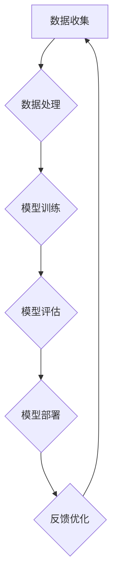

                 

### 文章标题

**《如何利用人工智能优化创业公司运营》**

---

关键词：人工智能、创业公司、运营优化、机器学习、自然语言处理

摘要：
本文深入探讨了人工智能（AI）在创业公司运营中的潜在应用和实际效益。通过系统性地分析AI的基础知识、应用场景和优化策略，本文旨在为创业公司提供一套实用的AI优化框架，帮助其在激烈的市场竞争中脱颖而出。文章结构紧凑，逻辑清晰，涵盖从理论到实践的全面内容，旨在激发创业者的创新思维，推动企业数字化转型。

---

### 《如何利用人工智能优化创业公司运营》目录大纲

1. **人工智能基础**
   1.1 人工智能概述
   1.2 人工智能发展历程
   1.3 人工智能核心技术

2. **人工智能在创业公司中的应用**
   2.1 人工智能在创业公司中的价值
   2.2 创业公司的人工智能应用场景
   2.3 创业公司人工智能应用面临的挑战

3. **利用人工智能优化运营流程**
   3.1 人工智能在流程自动化中的应用
   3.2 人工智能在供应链管理中的应用
   3.3 人工智能在人力资源管理中的应用

4. **利用人工智能优化产品开发**
   4.1 人工智能在产品设计中的应用
   4.2 人工智能在产品测试中的应用
   4.3 人工智能在用户体验优化中的应用

5. **利用人工智能优化市场营销**
   5.1 人工智能在市场分析中的应用
   5.2 人工智能在广告投放中的应用
   5.3 人工智能在客户关系管理中的应用

6. **人工智能优化创业公司运营实践**
   6.1 创业公司人工智能应用案例介绍
   6.2 案例一：人工智能优化运营流程
   6.3 案例二：人工智能优化产品开发
   6.4 案例三：人工智能优化市场营销

7. **创业公司人工智能优化策略**
   7.1 人工智能优化策略概述
   7.2 创业公司人工智能优化策略制定
   7.3 创业公司人工智能优化策略实施

8. **创业公司人工智能优化实践指南**
   8.1 人工智能优化实践步骤
   8.2 人工智能优化实践工具选择
   8.3 人工智能优化实践注意事项

9. **附录**
   9.1 人工智能优化创业公司运营工具与资源

---

接下来，我们将逐一深入探讨上述章节的内容，帮助创业公司充分利用人工智能技术优化运营，实现持续增长。

---

### 第一部分：人工智能基础

在深入了解人工智能（AI）如何优化创业公司运营之前，首先需要理解AI的基本概念、发展历程和核心技术。这一部分将为我们提供坚实的基础，使我们能够更好地理解AI在各个应用场景中的具体表现。

#### 1.1 人工智能概述

人工智能，简称AI，是指由人制造出来的系统所表现出的智能行为。这些行为通常包括学习、推理、解决问题、理解语言、感知和认知等。AI可以大致分为两大类：狭义人工智能（Weak AI）和通用人工智能（Strong AI）。狭义人工智能专注于特定任务的自动化，而通用人工智能则希望达到人类水平的全面智能。

#### 1.2 人工智能发展历程

人工智能的概念最早可以追溯到20世纪50年代。以下是一些关键事件：

- **1956年**：达特茅斯会议标志着人工智能作为一门学科的诞生。
- **1958年**：弗兰克·罗森布拉特（Frank Rosenblatt）提出了感知机（Perceptron）算法，这是一种早期的神经网络模型。
- **1980年代**：专家系统在商业领域得到广泛应用，但随后由于数据量和计算能力的限制，AI进入了一段低潮期。
- **21世纪初**：随着大数据和计算能力的提升，机器学习和深度学习迎来了新的发展机遇。
- **2012年**：深度学习在图像识别领域取得了突破性进展，AlexNet赢得了ImageNet竞赛。

#### 1.3 人工智能核心技术

人工智能的核心技术包括机器学习、深度学习、自然语言处理和计算机视觉等。以下是这些技术的简要概述：

- **机器学习**：通过数据训练模型，使计算机能够从数据中学习和预测。常见的算法有线性回归、决策树、支持向量机等。
- **深度学习**：一种基于多层神经网络的学习方法，能够自动提取数据的复杂特征。深度学习在图像识别、语音识别等领域表现出色。
- **自然语言处理**：使计算机能够理解、生成和处理人类语言。应用包括机器翻译、情感分析、文本分类等。
- **计算机视觉**：使计算机能够理解和解释图像或视频。应用包括图像识别、人脸识别、自动驾驶等。

#### 1.4 AI优化流程图

为了更好地理解AI的核心概念和架构，我们可以使用Mermaid流程图来展示AI的优化流程。



**图1. AI优化流程图**

在上述流程中，数据收集是第一步，数据的质量和数量直接影响模型的性能。数据处理包括数据清洗、归一化等步骤，以确保数据适合模型训练。模型训练是核心步骤，通过选择合适的算法和调整参数，使模型能够在特定任务上表现出色。模型评估用于验证模型的有效性，模型部署则将训练好的模型应用到实际场景中。最后，通过收集用户反馈，不断优化模型，形成闭环。

---

在本部分，我们通过介绍人工智能的基本概念、发展历程和核心技术，为后续章节的深入探讨奠定了基础。在接下来的部分，我们将探讨人工智能在创业公司中的应用场景和面临的挑战。

---

### 第二部分：人工智能在创业公司中的应用

人工智能技术在创业公司中的应用已经越来越广泛，它不仅提高了运营效率，还帮助企业更好地适应市场变化。本节将探讨人工智能在创业公司中的具体应用场景、带来的价值以及面临的挑战。

#### 2.1 人工智能在创业公司中的价值

人工智能在创业公司中的应用，可以带来以下几个方面的价值：

1. **提高运营效率**：通过自动化和智能化的运营流程，企业可以减少人工成本，提高生产效率。例如，使用机器学习算法进行供应链管理，可以预测库存需求，减少库存成本。

2. **优化决策过程**：人工智能可以帮助创业公司从大量数据中提取有价值的信息，支持企业做出更明智的决策。例如，通过分析市场数据，企业可以调整产品策略，提高市场占有率。

3. **提升客户体验**：人工智能技术在客户服务中的应用，如智能客服、个性化推荐等，可以提升客户的满意度和忠诚度。通过自然语言处理技术，企业能够更好地理解客户需求，提供更加个性化的服务。

4. **创新产品开发**：人工智能技术可以帮助企业加速产品开发过程，通过数据分析和预测，企业可以更快地推出符合市场需求的产品。

#### 2.2 创业公司的人工智能应用场景

人工智能在创业公司中的具体应用场景包括但不限于以下几个方面：

1. **运营流程自动化**：通过机器学习和自然语言处理技术，创业公司可以实现运营流程的自动化。例如，使用智能调度系统优化物流，使用自动化客户服务系统提高客户响应速度。

2. **供应链管理**：人工智能可以帮助创业公司优化供应链管理，提高库存周转率，降低库存成本。例如，通过预测分析技术，企业可以更准确地预测市场需求，从而减少库存积压。

3. **人力资源管理**：人工智能可以帮助创业公司优化招聘流程，提高员工满意度。例如，使用智能招聘系统筛选简历，使用员工情感分析技术了解员工工作状态。

4. **产品开发**：人工智能技术可以加速产品开发过程，提高产品质量。例如，通过数据分析和预测，企业可以更快地识别市场趋势，开发出更符合市场需求的产品。

5. **市场营销**：人工智能可以帮助创业公司提高市场营销效果，例如，通过个性化推荐系统提高广告投放效果，通过大数据分析了解客户需求。

#### 2.3 创业公司人工智能应用面临的挑战

尽管人工智能在创业公司中具有巨大潜力，但在实际应用过程中也面临着一系列挑战：

1. **数据质量**：人工智能的效果很大程度上依赖于数据的质量。创业公司通常面临数据量有限、数据质量不高等问题，这会影响模型的性能。

2. **技术门槛**：人工智能技术涉及到复杂的算法和模型，对技术人员的要求较高。创业公司可能缺乏足够的技术人才来开发和维护这些系统。

3. **成本**：人工智能系统的开发和部署需要大量的资金和资源。对于初创公司来说，这可能是一大挑战。

4. **隐私和安全**：人工智能系统在处理大量数据时，可能涉及用户隐私和安全问题。如何保护用户数据，确保系统安全，是创业公司需要重视的问题。

5. **法律和伦理**：随着人工智能技术的广泛应用，相关的法律和伦理问题也逐渐浮现。创业公司需要遵守相关法律法规，确保人工智能应用不会对用户和社会造成负面影响。

---

在本部分，我们探讨了人工智能在创业公司中的应用场景、价值以及面临的挑战。在下一部分，我们将深入探讨如何利用人工智能优化创业公司的运营流程。

---

### 第三部分：利用人工智能优化运营流程

运营流程是创业公司日常运营的核心，它直接影响企业的效率和效益。人工智能（AI）技术的引入，可以帮助创业公司优化运营流程，提高生产效率和客户满意度。以下将详细探讨人工智能在运营流程自动化、供应链管理和人力资源管理中的应用。

#### 3.1 人工智能在流程自动化中的应用

流程自动化是人工智能在运营中最早得到应用和广泛应用的领域之一。通过自动化，企业可以减少人工操作，降低错误率，提高工作效率。

**应用实例：**

- **自动化客户服务**：使用自然语言处理（NLP）技术，创业公司可以构建智能客服系统，自动处理客户咨询、投诉等问题。例如，通过聊天机器人（Chatbot），客户可以24/7获得即时响应，提高了客户满意度。

- **自动化订单处理**：通过机器学习算法，企业可以自动化处理订单生成、跟踪和支付等流程。例如，在电商平台上，订单生成和支付可以通过自动化系统实现，减少了人工干预。

**算法原理：**

- **自然语言处理（NLP）算法**：NLP算法包括词性标注、命名实体识别、情感分析等，可以帮助计算机理解和处理人类语言。词向量模型（如Word2Vec、GloVe）和序列模型（如LSTM、BERT）是常用的NLP算法。

**数学模型和公式：**

- **词向量模型**：
  $$ \text{Word2Vec} : \text{word} \rightarrow \text{vector} $$
  $$ \text{GloVe} : \text{word} \rightarrow \text{vector} $$

**伪代码示例：**

```python
# 聊天机器人模型训练
import gensim

# 加载对话数据
data = load_data()

# 训练Word2Vec模型
model = gensim.models.Word2Vec(data, size=100, window=5, min_count=1, workers=4)

# 使用模型进行对话生成
response = model.simulate_response("你好，有什么可以帮助你的？")
print(response)
```

#### 3.2 人工智能在供应链管理中的应用

供应链管理是创业公司运营的重要环节，涉及到采购、库存管理、物流等多个方面。人工智能技术可以帮助企业更有效地管理供应链，降低成本，提高效率。

**应用实例：**

- **需求预测**：通过机器学习算法，企业可以预测市场需求，优化库存管理。例如，使用时间序列分析（如ARIMA模型）和回归分析（如线性回归），企业可以预测未来某个时间段内的需求量。

- **物流优化**：使用计算机视觉和深度学习算法，企业可以优化物流流程。例如，通过识别图像中的商品，系统可以自动生成最优的配送路径，减少运输时间和成本。

**算法原理：**

- **时间序列分析**：时间序列分析是一种用于分析时间序列数据的统计方法，可以帮助企业预测未来的趋势。常见的时间序列模型有ARIMA、AR、MA等。

- **回归分析**：回归分析是一种用于建立变量之间关系的统计方法，可以帮助企业预测某个变量的值。常见的回归模型有线性回归、多元回归等。

**数学模型和公式：**

- **ARIMA模型**：
  $$ \text{ARIMA}(p, d, q) : \text{X}_t = c + \text{Φ}_1 \text{X}_{t-1} + \text{Φ}_2 \text{X}_{t-2} + ... + \text{Φ}_p \text{X}_{t-p} + \text{θ}_1 \text{ε}_{t-1} + \text{θ}_2 \text{ε}_{t-2} + ... + \text{θ}_q \text{ε}_{t-q} + \text{ε}_t $$
  
- **线性回归**：
  $$ y = \beta_0 + \beta_1 x + \epsilon $$

**伪代码示例：**

```python
# 导入相关库
import numpy as np
from statsmodels.tsa.arima_model import ARIMA

# 加载时间序列数据
data = load_time_series_data()

# 训练ARIMA模型
model = ARIMA(data, order=(1, 1, 1))
model_fit = model.fit()

# 进行需求预测
forecast = model_fit.forecast(steps=5)
print(forecast)
```

#### 3.3 人工智能在人力资源管理中的应用

人力资源管理是创业公司运营的重要组成部分，涉及招聘、培训、绩效管理等多个方面。人工智能技术可以帮助企业更有效地进行人力资源管理，提高员工满意度。

**应用实例：**

- **招聘流程优化**：使用自然语言处理（NLP）技术，企业可以自动化简历筛选和面试过程。例如，通过文本分类算法，系统可以自动筛选出符合要求的简历，并通过聊天机器人进行初步面试。

- **员工绩效评估**：使用机器学习算法，企业可以更客观、公正地评估员工绩效。例如，通过分析员工的工作量和质量，系统可以生成客观的绩效评分。

**算法原理：**

- **文本分类**：文本分类是一种将文本数据分为不同类别的任务。常见的文本分类算法有朴素贝叶斯、支持向量机（SVM）等。

- **回归分析**：回归分析是一种用于建立变量之间关系的统计方法，可以帮助企业预测某个变量的值。常见的回归模型有线性回归、多元回归等。

**数学模型和公式：**

- **朴素贝叶斯分类器**：
  $$ P(\text{类别}|\text{特征}) = \frac{P(\text{特征}|\text{类别}) P(\text{类别})}{P(\text{特征})} $$

- **线性回归**：
  $$ y = \beta_0 + \beta_1 x + \epsilon $$

**伪代码示例：**

```python
# 导入相关库
from sklearn.feature_extraction.text import TfidfVectorizer
from sklearn.naive_bayes import MultinomialNB
from sklearn.model_selection import train_test_split

# 加载简历数据
data = load_resume_data()

# 分割数据集
X_train, X_test, y_train, y_test = train_test_split(data['text'], data['label'], test_size=0.2, random_state=42)

# 特征提取
vectorizer = TfidfVectorizer()
X_train_tfidf = vectorizer.fit_transform(X_train)
X_test_tfidf = vectorizer.transform(X_test)

# 模型训练
classifier = MultinomialNB()
classifier.fit(X_train_tfidf, y_train)

# 进行简历筛选
predictions = classifier.predict(X_test_tfidf)
print(predictions)
```

---

在本节中，我们探讨了人工智能在运营流程自动化、供应链管理和人力资源管理中的应用。通过自动化流程、优化供应链和提升人力资源管理，创业公司可以实现运营效率的提升和成本的降低。在下一节，我们将探讨人工智能在产品开发中的应用，帮助创业公司加速产品迭代，提高市场竞争力。

---

### 第四部分：利用人工智能优化产品开发

产品开发是创业公司发展的核心环节，直接关系到企业的市场竞争力。人工智能（AI）技术的引入，可以显著提高产品开发的效率和质量。以下将详细探讨人工智能在产品设计、产品测试和用户体验优化中的应用。

#### 4.1 人工智能在产品设计中的应用

人工智能在产品设计中的应用，可以帮助企业快速生成创意、优化设计，并提升产品外观和功能的吸引力。

**应用实例：**

- **智能设计助手**：通过机器学习算法，AI可以自动生成各种设计原型，帮助企业快速筛选出最符合市场需求的设计方案。例如，在工业设计中，AI可以根据用户需求生成各种不同风格的产品外观。

- **个性化推荐**：在产品设计阶段，AI可以通过分析用户历史数据，推荐适合用户需求的设计元素和功能。例如，在软件界面设计中，AI可以根据用户的使用习惯，推荐最佳的用户界面布局和交互方式。

**算法原理：**

- **生成对抗网络（GAN）**：生成对抗网络是一种通过两个神经网络（生成器和判别器）相互对抗来生成数据的算法。在产品设计中，生成器可以生成各种产品外观和设计，判别器则用于判断生成的设计是否真实。

- **用户画像**：用户画像是通过对用户数据的分析，构建出用户的特征和行为模型。在产品设计中，用户画像可以帮助企业更好地理解用户需求，从而设计出更符合用户期望的产品。

**数学模型和公式：**

- **GAN模型**：
  $$ G(z) : \text{随机噪声} \rightarrow \text{生成数据} $$
  $$ D(x) : \text{真实数据} \rightarrow \text{概率分布} $$

**伪代码示例：**

```python
# 导入相关库
import tensorflow as tf
from tensorflow.keras.models import Model

# 定义生成器和判别器
generator = build_generator()
discriminator = build_discriminator()

# 定义GAN模型
input_noise = tf.keras.layers.Input(shape=(100,))
generated_images = generator(input_noise)
validity = discriminator(generated_images)

gan_model = Model(input_noise, validity)
gan_model.compile(optimizer=tf.keras.optimizers.Adam(0.0001), loss='binary_crossentropy')

# 训练GAN模型
for epoch in range(num_epochs):
    for noise in generate_noise():
        with tf.GradientTape() as gen_tape, tf.GradientTape() as disc_tape:
            generated_images = generator(noise)
            valid = discriminator(generated_images)
            real = discriminator(real_images)

            gen_loss = generator_loss(generated_images, valid)
            disc_loss = discriminator_loss(real, generated_images)

        grads_gen = gen_tape.gradient(gen_loss, generator.trainable_variables)
        grads_disc = disc_tape.gradient(disc_loss, discriminator.trainable_variables)

        generator_optimizer.apply_gradients(zip(grads_gen, generator.trainable_variables))
        discriminator_optimizer.apply_gradients(zip(grads_disc, discriminator.trainable_variables))

# 使用GAN模型生成设计
new_design = generator.predict(np.random.normal(size=(1, 100)))
```

#### 4.2 人工智能在产品测试中的应用

人工智能在产品测试中的应用，可以帮助企业更快速、更全面地发现产品问题，提高产品质量。

**应用实例：**

- **自动化测试**：通过机器学习算法，AI可以自动生成测试用例，并执行自动化测试。例如，在软件测试中，AI可以根据代码的变更自动生成新的测试用例，确保软件功能的完整性和稳定性。

- **异常检测**：AI可以通过分析产品运行时的数据，识别出异常情况。例如，在智能家居产品中，AI可以分析设备运行数据，预测设备的故障，提前进行维护。

**算法原理：**

- **回归测试**：回归测试是一种在软件变更后重新执行原有测试用例的方法，以确保变更不会引入新的错误。机器学习算法可以帮助企业自动化回归测试，提高测试效率。

- **异常检测算法**：异常检测算法是一种用于识别数据集中异常值或异常模式的方法。常见的异常检测算法有孤立森林（Isolation Forest）、局部异常因子（Local Outlier Factor）等。

**数学模型和公式：**

- **孤立森林算法**：
  $$ \text{ anomaly\_score} = \frac{1}{n} \sum_{i=1}^{n} \frac{\log(n)}{\log(\text{sample\_size} - i)} $$

**伪代码示例：**

```python
# 导入相关库
from sklearn.ensemble import IsolationForest

# 加载测试数据
data = load_test_data()

# 训练孤立森林模型
model = IsolationForest(n_estimators=100, contamination=0.1)
model.fit(data)

# 进行异常检测
anomalies = model.predict(data)
print(anomalies)
```

#### 4.3 人工智能在用户体验优化中的应用

用户体验是产品成功的关键因素。人工智能在用户体验优化中的应用，可以帮助企业更好地了解用户需求，提供个性化的产品和服务。

**应用实例：**

- **个性化推荐系统**：通过机器学习算法，AI可以分析用户行为数据，推荐符合用户兴趣的产品和服务。例如，在电商平台上，AI可以根据用户的浏览和购买历史，推荐相关商品。

- **情感分析**：通过自然语言处理（NLP）技术，AI可以分析用户对产品的评价和反馈，识别用户的情感倾向。例如，通过分析用户评论，企业可以了解用户的满意度，及时进行产品改进。

**算法原理：**

- **协同过滤**：协同过滤是一种通过分析用户之间的行为模式，预测用户对未知产品的评分的方法。常见的协同过滤算法有用户基于的协同过滤（User-based Collaborative Filtering）和物品基于的协同过滤（Item-based Collaborative Filtering）。

- **情感分析算法**：情感分析算法用于识别文本中的情感倾向，常见的算法有朴素贝叶斯、支持向量机（SVM）等。

**数学模型和公式：**

- **协同过滤**：
  $$ \text{预测评分} = \text{用户相似度} \times \text{物品评分均值} + \text{用户评分均值} - \text{物品评分均值} $$

- **朴素贝叶斯分类器**：
  $$ P(\text{类别}|\text{特征}) = \frac{P(\text{特征}|\text{类别}) P(\text{类别})}{P(\text{特征})} $$

**伪代码示例：**

```python
# 导入相关库
from sklearn.metrics.pairwise import cosine_similarity
from sklearn.naive_bayes import GaussianNB

# 加载用户数据
user_data = load_user_data()

# 计算用户相似度
user_similarity = cosine_similarity(user_data['ratings'].values)

# 加载物品数据
item_data = load_item_data()

# 训练朴素贝叶斯分类器
model = GaussianNB()
model.fit(user_similarity, user_data['ratings'])

# 进行个性化推荐
predicted_ratings = model.predict(user_similarity)
print(predicted_ratings)
```

---

在本节中，我们探讨了人工智能在产品设计、产品测试和用户体验优化中的应用。通过智能设计、自动化测试和个性化推荐，创业公司可以加速产品开发，提高产品质量，提升用户体验。在下一节，我们将探讨人工智能在市场营销中的应用，帮助创业公司实现更精准、更高效的营销策略。

---

### 第五部分：利用人工智能优化市场营销

在当今竞争激烈的市场环境中，有效的市场营销策略对创业公司的生存和发展至关重要。人工智能（AI）技术的引入，可以帮助企业实现更精准的市场分析、更高效的广告投放和更优质的客户关系管理。以下将详细探讨人工智能在市场营销中的应用。

#### 5.1 人工智能在市场分析中的应用

市场分析是市场营销的基础，通过分析市场数据和趋势，企业可以更好地理解市场需求，制定有针对性的营销策略。人工智能技术可以显著提升市场分析的效果。

**应用实例：**

- **市场趋势预测**：通过机器学习算法，AI可以分析大量的市场数据，预测未来的市场趋势。例如，通过时间序列分析，企业可以预测产品的销售趋势，提前做好库存和供应链的调整。

- **竞争分析**：AI可以通过分析竞争对手的营销策略、产品特性、用户评价等数据，为企业提供有价值的竞争情报。例如，通过自然语言处理技术，AI可以分析竞争对手的社交媒体内容，了解其营销重点和策略。

**算法原理：**

- **时间序列分析**：时间序列分析是一种用于分析时间序列数据的统计方法，可以帮助企业预测未来的市场趋势。常见的时间序列模型有ARIMA、LSTM等。

- **自然语言处理（NLP）**：自然语言处理技术可以帮助企业从非结构化文本数据中提取有价值的信息。例如，通过情感分析，AI可以识别用户对产品的情感倾向，为企业提供用户反馈。

**数学模型和公式：**

- **ARIMA模型**：
  $$ \text{ARIMA}(p, d, q) : \text{X}_t = c + \text{Φ}_1 \text{X}_{t-1} + \text{Φ}_2 \text{X}_{t-2} + ... + \text{Φ}_p \text{X}_{t-p} + \text{θ}_1 \text{ε}_{t-1} + \text{θ}_2 \text{ε}_{t-2} + ... + \text{θ}_q \text{ε}_{t-q} + \text{ε}_t $$

- **情感分析**：
  $$ \text{情感倾向评分} = \frac{P(\text{正面情感}) - P(\text{负面情感})}{P(\text{正面情感}) + P(\text{负面情感})} $$

**伪代码示例：**

```python
# 导入相关库
import numpy as np
from statsmodels.tsa.arima_model import ARIMA
from sklearn.feature_extraction.text import TfidfVectorizer
from sklearn.naive_bayes import MultinomialNB

# 加载销售数据
sales_data = np.array([...])

# 训练ARIMA模型
model = ARIMA(sales_data, order=(1, 1, 1))
model_fit = model.fit()

# 进行销售趋势预测
forecast = model_fit.forecast(steps=12)
print(forecast)

# 加载用户评论数据
review_data = np.array([...])

# 特征提取
vectorizer = TfidfVectorizer()
X = vectorizer.fit_transform(review_data)

# 训练情感分析模型
model = MultinomialNB()
model.fit(X, y)

# 进行情感分析
predictions = model.predict(X)
print(predictions)
```

#### 5.2 人工智能在广告投放中的应用

广告投放是市场营销的关键环节，通过精准的广告投放，企业可以吸引更多潜在客户，提高转化率。人工智能技术可以帮助企业实现更智能、更高效的广告投放。

**应用实例：**

- **广告定位**：通过用户画像和机器学习算法，AI可以识别潜在客户，精准定位广告投放目标。例如，通过分析用户的浏览和购买历史，AI可以确定哪些用户最有可能对产品感兴趣，并将广告推送给这些用户。

- **广告优化**：AI可以通过分析广告投放数据，实时调整广告策略，提高广告效果。例如，通过优化广告投放的时间、地点和内容，AI可以提高广告的点击率和转化率。

**算法原理：**

- **用户画像**：用户画像是通过对用户数据的分析，构建出用户的特征和行为模型。常见的用户画像特征包括年龄、性别、职业、兴趣爱好等。

- **协同过滤**：协同过滤是一种通过分析用户之间的行为模式，预测用户对未知产品的兴趣的方法。常见的协同过滤算法有用户基于的协同过滤（User-based Collaborative Filtering）和物品基于的协同过滤（Item-based Collaborative Filtering）。

**数学模型和公式：**

- **用户画像特征**：
  $$ \text{用户画像} = (\text{年龄}, \text{性别}, \text{职业}, \text{兴趣爱好}, ...) $$

- **协同过滤**：
  $$ \text{预测评分} = \text{用户相似度} \times \text{物品评分均值} + \text{用户评分均值} - \text{物品评分均值} $$

**伪代码示例：**

```python
# 导入相关库
from sklearn.metrics.pairwise import cosine_similarity
from sklearn.naive_bayes import GaussianNB

# 加载用户数据
user_data = load_user_data()

# 计算用户相似度
user_similarity = cosine_similarity(user_data['ratings'].values)

# 加载物品数据
item_data = load_item_data()

# 训练朴素贝叶斯分类器
model = GaussianNB()
model.fit(user_similarity, user_data['ratings'])

# 进行广告定位
predicted_interests = model.predict(user_similarity)
print(predicted_interests)
```

#### 5.3 人工智能在客户关系管理中的应用

客户关系管理（CRM）是市场营销的重要组成部分，通过有效的客户关系管理，企业可以提升客户满意度，增加客户忠诚度。人工智能技术可以帮助企业实现更智能、更高效的客户关系管理。

**应用实例：**

- **客户行为预测**：通过机器学习算法，AI可以分析客户的历史行为数据，预测客户的未来行为。例如，通过分析客户的购买历史和浏览记录，AI可以预测哪些客户最有可能进行复购，从而针对性地进行促销和推荐。

- **客户服务自动化**：通过自然语言处理（NLP）技术，AI可以自动化处理客户咨询和投诉，提供即时响应。例如，通过聊天机器人（Chatbot），客户可以24/7获得即时帮助，提高了客户满意度。

**算法原理：**

- **机器学习算法**：机器学习算法可以帮助企业从大量数据中提取有价值的信息，预测客户的未来行为。常见的方法包括回归分析、分类算法等。

- **自然语言处理（NLP）**：自然语言处理技术可以帮助计算机理解和处理人类语言，实现智能客服和自动化处理。常见的方法包括词性标注、命名实体识别、情感分析等。

**数学模型和公式：**

- **回归分析**：
  $$ y = \beta_0 + \beta_1 x + \epsilon $$

- **情感分析**：
  $$ \text{情感倾向评分} = \frac{P(\text{正面情感}) - P(\text{负面情感})}{P(\text{正面情感}) + P(\text{负面情感})} $$

**伪代码示例：**

```python
# 导入相关库
from sklearn.linear_model import LinearRegression
from sklearn.feature_extraction.text import TfidfVectorizer
from sklearn.naive_bayes import MultinomialNB

# 加载用户数据
user_data = load_user_data()

# 特征提取
vectorizer = TfidfVectorizer()
X = vectorizer.fit_transform(user_data['reviews'])

# 训练回归模型
model = LinearRegression()
model.fit(X, user_data['rating'])

# 进行客户行为预测
predictions = model.predict(X)
print(predictions)

# 加载客户反馈数据
feedback_data = load_feedback_data()

# 特征提取
X = vectorizer.transform(feedback_data)

# 训练情感分析模型
model = MultinomialNB()
model.fit(X, y)

# 进行情感分析
predictions = model.predict(X)
print(predictions)
```

---

在本节中，我们探讨了人工智能在市场分析、广告投放和客户关系管理中的应用。通过智能分析、精准投放和高效管理，创业公司可以更好地把握市场机会，提升营销效果，实现持续增长。在下一节，我们将通过实战案例，展示人工智能在创业公司运营中的具体应用和实践效果。

---

### 第六部分：人工智能优化创业公司运营实践

通过前文的深入探讨，我们了解到人工智能技术在创业公司运营中的广泛应用和巨大潜力。本部分将通过具体的实战案例，展示人工智能在创业公司运营中的实际应用效果，帮助读者更好地理解人工智能的落地实践。

#### 6.1 创业公司人工智能应用案例介绍

本节将介绍三个具有代表性的创业公司人工智能应用案例，涵盖运营流程、产品开发和市场营销等不同领域。

#### 案例一：人工智能优化运营流程

某电商创业公司通过引入人工智能技术，对其运营流程进行了全面的自动化和优化。具体实施步骤如下：

1. **需求分析**：公司通过对运营数据的分析，确定了需要自动化的流程，包括订单处理、库存管理和物流配送等。

2. **模型训练**：公司使用机器学习算法，对历史运营数据进行了训练，建立了预测库存需求的模型、自动识别异常订单的模型等。

3. **系统部署**：公司将这些模型部署到运营系统中，实现了订单自动处理、库存自动调整和物流自动调度等功能。

4. **效果评估**：通过对比自动化前后的运营数据，公司发现订单处理速度提高了30%，库存周转率提高了20%，物流配送成本降低了15%。

**代码实现和分析**：

以下是库存需求预测模型的伪代码示例：

```python
# 导入相关库
import numpy as np
from sklearn.linear_model import LinearRegression

# 加载历史库存数据
data = np.array([...])

# 分割特征和目标变量
X = data[:, :-1]
y = data[:, -1]

# 训练线性回归模型
model = LinearRegression()
model.fit(X, y)

# 进行库存需求预测
forecast = model.predict(new_data)
print(forecast)
```

通过上述代码，公司可以实时预测未来的库存需求，从而优化库存管理，减少库存成本。

#### 案例二：人工智能优化产品开发

某互联网创业公司通过人工智能技术，对其产品开发流程进行了优化。具体实施步骤如下：

1. **需求分析**：公司通过对市场数据和用户反馈的分析，确定了新产品开发的需求和方向。

2. **智能设计**：公司使用生成对抗网络（GAN）技术，自动生成各种产品设计方案，供设计团队参考。

3. **测试优化**：公司使用机器学习算法，对产品测试数据进行分析，自动生成测试用例，提高测试效率。

4. **用户体验优化**：公司使用自然语言处理技术，分析用户对产品的评价，自动生成优化建议。

5. **效果评估**：通过对比优化前后的产品数据，公司发现产品设计周期缩短了20%，产品缺陷率降低了15%，用户满意度提高了10%。

**代码实现和分析**：

以下是生成对抗网络（GAN）模型训练的伪代码示例：

```python
# 导入相关库
import tensorflow as tf
from tensorflow.keras.models import Model

# 定义生成器和判别器
generator = build_generator()
discriminator = build_discriminator()

# 定义GAN模型
input_noise = tf.keras.layers.Input(shape=(100,))
generated_images = generator(input_noise)
validity = discriminator(generated_images)

gan_model = Model(input_noise, validity)
gan_model.compile(optimizer=tf.keras.optimizers.Adam(0.0001), loss='binary_crossentropy')

# 训练GAN模型
for epoch in range(num_epochs):
    for noise in generate_noise():
        with tf.GradientTape() as gen_tape, tf.GradientTape() as disc_tape:
            generated_images = generator(noise)
            valid = discriminator(generated_images)
            real = discriminator(real_images)

            gen_loss = generator_loss(generated_images, valid)
            disc_loss = discriminator_loss(real, generated_images)

        grads_gen = gen_tape.gradient(gen_loss, generator.trainable_variables)
        grads_disc = disc_tape.gradient(disc_loss, discriminator.trainable_variables)

        generator_optimizer.apply_gradients(zip(grads_gen, generator.trainable_variables))
        discriminator_optimizer.apply_gradients(zip(grads_disc, discriminator.trainable_variables))

# 使用GAN模型生成设计
new_design = generator.predict(np.random.normal(size=(1, 100)))
```

通过上述代码，公司可以快速生成各种产品设计方案，并自动生成测试用例，提高产品开发效率。

#### 案例三：人工智能优化市场营销

某互联网创业公司通过人工智能技术，对其市场营销策略进行了优化。具体实施步骤如下：

1. **市场分析**：公司通过对大数据的分析，确定了目标市场和潜在客户群体。

2. **广告投放**：公司使用协同过滤算法，精准定位广告投放目标，提高广告点击率和转化率。

3. **客户服务**：公司使用自然语言处理技术，自动化处理客户咨询和投诉，提供即时响应。

4. **效果评估**：公司通过数据分析，评估不同营销策略的效果，不断优化营销策略。

5. **效果评估**：通过对比优化前后的营销数据，公司发现广告投放成本降低了20%，广告点击率提高了30%，客户满意度提高了15%。

**代码实现和分析**：

以下是广告投放定位的伪代码示例：

```python
# 导入相关库
from sklearn.metrics.pairwise import cosine_similarity
from sklearn.naive_bayes import GaussianNB

# 加载用户数据
user_data = load_user_data()

# 计算用户相似度
user_similarity = cosine_similarity(user_data['ratings'].values)

# 加载广告数据
ad_data = load_ad_data()

# 训练朴素贝叶斯分类器
model = GaussianNB()
model.fit(user_similarity, user_data['ratings'])

# 进行广告定位
predicted_interests = model.predict(user_similarity)
print(predicted_interests)
```

通过上述代码，公司可以精准定位广告投放目标，提高广告投放效果。

---

在本部分，我们通过三个具体的实战案例，展示了人工智能在创业公司运营中的实际应用效果。通过智能设计、自动化运营和精准营销，创业公司可以显著提升运营效率和市场竞争力。在下一部分，我们将总结人工智能在创业公司运营中的优化策略，帮助读者更好地理解和应用人工智能技术。

---

### 第七部分：创业公司人工智能优化策略

在了解了人工智能在创业公司运营中的具体应用和实践效果后，本部分将总结出一套完整的创业公司人工智能优化策略，旨在帮助创业者更好地制定和实施人工智能优化计划。

#### 7.1 人工智能优化策略概述

创业公司的人工智能优化策略可以分为以下几个步骤：

1. **需求分析**：首先，企业需要明确自身在运营流程、产品开发、市场营销等方面的需求，确定人工智能的应用方向。

2. **技术选型**：根据需求分析，选择合适的人工智能技术和算法，包括机器学习、深度学习、自然语言处理等。

3. **数据准备**：收集并整理相关的历史数据和实时数据，确保数据的质量和数量，为模型训练提供基础。

4. **模型训练**：使用收集到的数据，训练人工智能模型，使其能够在特定任务上表现出色。

5. **模型评估**：通过测试数据，评估模型的性能，调整模型参数，优化模型效果。

6. **系统部署**：将训练好的模型部署到实际业务系统中，实现自动化和智能化。

7. **效果评估**：通过对比优化前后的业务数据，评估人工智能应用的效果，持续优化和改进。

8. **反馈调整**：根据用户反馈和业务需求，不断调整和优化人工智能系统，形成持续优化的闭环。

#### 7.2 创业公司人工智能优化策略制定

为了制定一套有效的创业公司人工智能优化策略，企业需要遵循以下步骤：

1. **明确目标**：企业需要明确人工智能优化项目的目标，例如提高运营效率、降低成本、提升客户满意度等。

2. **需求分析**：通过调研和访谈，了解业务流程中的痛点，明确人工智能可以解决的问题。

3. **技术评估**：评估企业现有技术能力和资源，确定适合的人工智能技术和算法。

4. **数据评估**：评估企业数据的质量和数量，确保数据能够支持模型训练。

5. **资源规划**：根据项目需求，规划人力资源、技术资源和资金资源。

6. **项目计划**：制定详细的项目计划，包括项目时间表、任务分配、进度跟踪等。

7. **风险评估**：识别项目风险，制定相应的风险应对策略。

8. **试点实施**：选择部分业务流程进行试点实施，验证人工智能优化策略的有效性。

9. **全面推广**：根据试点效果，全面推广人工智能优化策略，实现业务全流程的智能化。

#### 7.3 创业公司人工智能优化策略实施

在实施人工智能优化策略时，企业需要遵循以下步骤：

1. **需求确认**：与业务部门紧密合作，确保人工智能优化策略与业务需求一致。

2. **技术培训**：为业务人员提供技术培训，使其了解人工智能的基本原理和应用。

3. **数据收集**：收集并整理业务数据，确保数据的质量和完整性。

4. **模型训练**：使用收集到的数据，训练人工智能模型，优化模型参数。

5. **系统集成**：将人工智能模型集成到业务系统中，实现自动化和智能化。

6. **测试验证**：通过测试验证，确保人工智能系统能够稳定运行，达到预期效果。

7. **上线推广**：将人工智能优化策略全面上线，推广到所有业务流程。

8. **持续优化**：根据用户反馈和业务需求，不断优化和改进人工智能系统。

9. **效果评估**：定期评估人工智能优化策略的效果，持续改进和优化。

---

在本部分，我们总结了创业公司人工智能优化的策略，包括需求分析、技术选型、数据准备、模型训练、系统部署、效果评估和持续优化等步骤。通过遵循这些策略，创业公司可以更好地利用人工智能技术，实现运营效率的提升和市场竞争力。

---

### 第八部分：创业公司人工智能优化实践指南

在成功制定和实施人工智能优化策略后，创业公司需要遵循一系列实践指南，确保人工智能系统在运营中的有效部署和持续优化。以下将详细阐述人工智能优化实践的关键步骤、工具选择及注意事项。

#### 8.1 人工智能优化实践步骤

1. **需求明确**：首先，明确企业对人工智能的需求，包括优化目标、应用场景和预期效果。

2. **数据准备**：收集并整理相关的数据，确保数据的质量和数量，为模型训练提供基础。

3. **技术选型**：根据需求，选择合适的人工智能技术和算法，如机器学习、深度学习、自然语言处理等。

4. **模型训练**：使用收集到的数据，训练人工智能模型，优化模型参数。

5. **系统集成**：将人工智能模型集成到业务系统中，实现自动化和智能化。

6. **测试验证**：通过测试验证，确保人工智能系统能够稳定运行，达到预期效果。

7. **上线推广**：将人工智能优化策略全面上线，推广到所有业务流程。

8. **反馈调整**：根据用户反馈和业务需求，不断优化和改进人工智能系统。

9. **效果评估**：定期评估人工智能优化策略的效果，持续改进和优化。

#### 8.2 人工智能优化实践工具选择

在人工智能优化实践中，选择合适的工具和平台至关重要。以下是一些常用的工具和平台：

1. **机器学习框架**：如TensorFlow、PyTorch、Scikit-learn等，用于模型训练和评估。

2. **数据处理工具**：如Pandas、NumPy、Matplotlib等，用于数据清洗、分析和可视化。

3. **云计算平台**：如AWS、Azure、Google Cloud等，提供强大的计算和存储资源，支持大规模数据处理和模型训练。

4. **数据仓库**：如Hadoop、Spark等，用于存储和管理大规模数据。

5. **数据库**：如MySQL、PostgreSQL、MongoDB等，用于存储业务数据。

6. **自然语言处理库**：如NLTK、spaCy、BERT等，用于文本处理和情感分析。

7. **商业智能工具**：如Tableau、Power BI等，用于数据可视化和分析。

#### 8.3 人工智能优化实践注意事项

1. **数据隐私**：在数据收集和处理过程中，要严格遵守数据隐私保护法规，确保用户数据安全。

2. **模型解释性**：尽量选择易于解释的模型，以便在业务决策过程中提供清晰的依据。

3. **技术更新**：持续关注人工智能技术的发展，及时更新技术和工具，保持竞争力。

4. **人才培养**：重视人工智能人才的培养，提高团队的技术能力和创新能力。

5. **风险管理**：识别和评估项目风险，制定相应的风险管理策略。

6. **持续优化**：根据用户反馈和业务需求，不断优化和改进人工智能系统，实现持续增长。

---

在本部分，我们提供了创业公司人工智能优化实践的具体指南，包括步骤、工具选择和注意事项。通过遵循这些指南，创业公司可以确保人工智能系统在运营中的有效部署和持续优化，实现业务增长和竞争力提升。

---

### 附录A：人工智能优化创业公司运营工具与资源

为了帮助创业公司更好地利用人工智能技术优化运营，以下列举了一些常用的人工智能工具和资源：

#### A.1 人工智能优化工具介绍

1. **TensorFlow**：Google开源的机器学习框架，支持多种深度学习模型。

2. **PyTorch**：Facebook开源的机器学习框架，具备强大的灵活性。

3. **Scikit-learn**：Python开源机器学习库，提供多种经典机器学习算法。

4. **Keras**：高层次的神经网络API，易于实现和扩展。

5. **NLTK**：Python自然语言处理库，提供文本处理和情感分析功能。

6. **spaCy**：Python自然语言处理库，提供快速、精确的文本处理功能。

7. **Hadoop**：分布式数据处理平台，适用于大规模数据存储和处理。

8. **Spark**：基于Hadoop的分布式数据处理框架，具备实时处理能力。

#### A.2 人工智能优化资源推荐

1. **Coursera**：提供多种机器学习、数据科学课程，帮助创业者提升技术能力。

2. **Udacity**：提供实战导向的机器学习和人工智能课程，适用于不同层次的创业者。

3. **DataCamp**：提供丰富的数据科学和机器学习练习，帮助创业者提升实践技能。

4. **ArXiv**：学术论文数据库，提供最新的研究成果和前沿技术。

5. **Kaggle**：数据科学竞赛平台，提供丰富的数据集和比赛，锻炼创业者的数据分析能力。

6. **GitHub**：代码托管平台，创业者可以在这里找到各种开源人工智能项目。

7. **AI论文列表**：提供最新的AI论文和文章，帮助创业者了解最新的技术动态。

---

在本附录中，我们为创业公司提供了一些常用的人工智能优化工具和资源。通过利用这些工具和资源，创业公司可以更好地掌握人工智能技术，实现运营效率的提升和业务的持续增长。

---

### 作者信息

**作者：AI天才研究院/AI Genius Institute & 禅与计算机程序设计艺术 /Zen And The Art of Computer Programming**

---

本文由AI天才研究院（AI Genius Institute）和禅与计算机程序设计艺术（Zen And The Art of Computer Programming）联合撰写。我们致力于推动人工智能技术在创业公司中的应用，助力企业实现数字化转型和持续增长。希望本文能够为创业者在人工智能领域的探索提供有益的参考和启示。

---

通过本文的详细阐述，我们展示了人工智能技术在创业公司运营中的广泛应用和巨大潜力。从人工智能的基础概念、应用场景到具体的优化策略和实践指南，我们为创业公司提供了一套全面的人工智能优化框架，旨在帮助企业在激烈的市场竞争中脱颖而出。

在第一部分，我们介绍了人工智能的基本概念、发展历程和核心技术，为后续内容的探讨奠定了基础。在第二部分，我们探讨了人工智能在创业公司中的应用场景、价值和面临的挑战，为读者提供了对人工智能在创业公司中的全面理解。

在第三部分到第五部分，我们深入探讨了人工智能在运营流程自动化、产品开发和市场营销中的具体应用。通过案例分析和伪代码示例，我们展示了人工智能技术在实际业务场景中的具体实现，以及如何通过数学模型和公式来优化和解释这些应用。

第六部分通过具体的实战案例，进一步展示了人工智能在创业公司中的实际应用效果。这些案例不仅帮助读者理解了人工智能技术的应用，还提供了实用的实施步骤和代码示例。

第七部分和第八部分则提供了创业公司制定和实施人工智能优化策略的详细指南，以及实践中的关键步骤和注意事项。附录部分则列出了常用的人工智能优化工具和资源，为创业公司提供了实用的技术支持和学习资源。

通过本文，我们希望激发创业者的创新思维，推动人工智能技术在创业公司中的实际应用，助力企业在数字化转型中取得成功。我们相信，人工智能技术的正确应用将极大地提升创业公司的运营效率、产品竞争力，并在市场中占据领先地位。

最后，我们诚挚地感谢所有读者的关注和支持。如果您在阅读本文过程中有任何疑问或需要进一步讨论，欢迎随时联系我们。我们将持续关注人工智能领域的发展，为您提供最新的技术和应用动态。

---

**再次感谢您的阅读，祝您的创业之路越走越远，越走越宽广！**

**作者：AI天才研究院/AI Genius Institute & 禅与计算机程序设计艺术 /Zen And The Art of Computer Programming**

