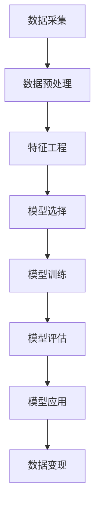
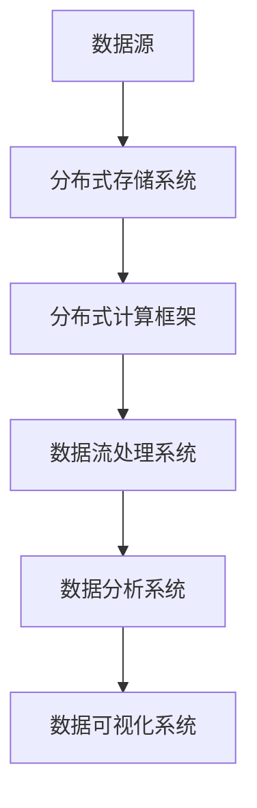
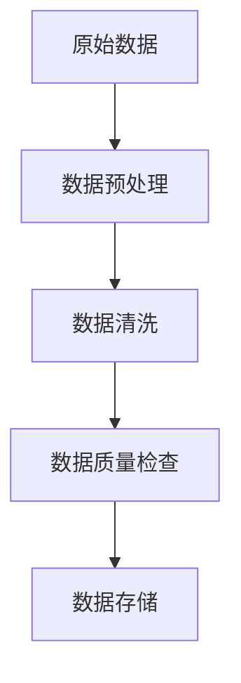

                 

## 文章标题

**《如何利用技术能力进行数据变现》**

关键词：数据变现、技术能力、数据分析、商业模式、法律法规

摘要：本文将深入探讨如何利用技术能力实现数据变现。通过详细分析数据变现的核心概念、技术基础、策略方法、实践指导以及法律法规与道德伦理，帮助读者全面掌握数据变现的全过程，实现数据价值的最大化。

----------------------------------------------------------------

## 第一部分：数据变现概述

数据变现是当今数字化时代的重要趋势，它不仅为企业带来新的盈利模式，也为个人创造财富的机会。在这一部分中，我们将首先介绍数据变现的核心概念与价值，并探讨数据变现的基本要素和产业链分析。

### 1.1 数据变现的定义与意义

**定义：** 数据变现是指将企业内部或外部数据资源转化为实际业务价值和经济效益的过程。具体来说，数据变现包括以下几个方面：

- 数据采集：通过各种渠道收集企业内外部的数据，如用户行为数据、交易数据、社交媒体数据等。
- 数据处理：对收集到的数据进行清洗、整合、存储等操作，确保数据的准确性和一致性。
- 数据分析：利用数据挖掘、机器学习等技术对数据进行分析，提取有价值的信息和知识。
- 数据应用：将分析结果应用于企业的业务决策、产品优化、市场推广等，从而实现数据到现金的转化。

**意义：** 数据变现对于企业和个人具有重要意义，主要体现在以下几个方面：

- **经济效益：** 数据变现可以帮助企业实现数据资源的商业价值，增加收入和利润。
- **竞争优势：** 通过数据变现，企业可以更深入地了解市场和用户需求，优化产品和服务，提升竞争力。
- **创新机会：** 数据变现为企业提供了创新的机会，如新的商业模式、服务模式等。
- **财富创造：** 对于个人而言，数据变现也为创业者、数据分析师等提供了新的职业机会和财富创造途径。

### 1.2 数据变现的基本要素

数据变现的过程涉及多个基本要素，以下是其中几个关键要素：

- **数据质量：** 数据质量是数据变现的基础，包括数据的准确性、完整性、一致性和时效性。高质量的数据能够提高数据分析的准确性和可靠性。

- **数据分析能力：** 数据分析能力是数据变现的核心，包括数据挖掘、机器学习、统计分析等技术。企业需要具备强大的数据分析能力，以从海量数据中提取有价值的信息。

- **商业模式：** 商业模式是数据变现的关键，如何将数据转化为实际业务价值和经济效益，需要构建合理的商业模式。例如，通过广告、销售、订阅等方式实现数据变现。

- **技术基础：** 数据变现需要依赖先进的技术手段，包括大数据处理、云计算、人工智能等。这些技术为企业提供了强大的数据处理和分析能力。

- **法规与伦理：** 数据变现过程中需要遵守相关法律法规和伦理道德，确保数据使用的合法性和道德性。例如，保护用户隐私、遵守数据保护法规等。

### 1.3 数据变现的产业链分析

数据变现的产业链涵盖了多个环节，包括数据采集、数据处理、数据分析、数据应用等。以下是数据变现产业链的简要分析：

- **数据采集：** 数据采集是数据变现的起点，通过各种渠道收集企业内外部的数据。数据来源包括用户行为数据、交易数据、社交媒体数据、传感器数据等。

- **数据处理：** 数据处理是对采集到的数据进行清洗、整合、存储等操作。数据处理环节包括数据预处理、数据清洗、数据整合和数据存储等。

- **数据分析：** 数据分析是对处理后的数据进行分析，提取有价值的信息和知识。数据分析环节包括数据挖掘、机器学习、统计分析等。

- **数据应用：** 数据应用是将分析结果应用于企业的业务决策、产品优化、市场推广等。数据应用环节包括业务智能、用户画像、个性化推荐等。

- **数据变现：** 数据变现是将数据转化为实际业务价值和经济效益。数据变现环节包括广告、销售、订阅、数据交易等。

- **法律法规与伦理：** 法律法规与伦理是数据变现过程中需要遵守的规范，确保数据使用的合法性和道德性。法律法规与伦理环节包括数据保护法规、个人隐私保护、数据交易法律法规等。

在数据变现的产业链中，各个环节相互关联，共同推动数据价值的实现。企业需要全面掌握数据变现的各个环节，构建高效的数据变现体系。

## 第二部分：数据变现的技术基础

数据变现的技术基础是数据变现成功的关键因素之一。在这一部分，我们将详细探讨数据变现所需的技术基础，包括数据挖掘与机器学习技术、大数据技术与存储以及数据清洗与数据质量保障。

### 2.1 数据挖掘与机器学习技术

**核心概念与联系：**

数据挖掘与机器学习技术是数据变现的核心，它们能够帮助从大量数据中提取有价值的信息和知识。数据挖掘（Data Mining）是指从大量数据中自动发现有价值的信息和知识的过程，而机器学习（Machine Learning）则是通过算法和统计模型使计算机具备学习能力，从而实现自动化的数据分析和决策。

**Mermaid 流程图：**



**核心算法原理讲解：**

1. **决策树（Decision Tree）：**
   - **算法原理：** 决策树通过一系列规则将数据分割成不同的子集，每个节点代表一个特征，每个分支代表一个特征取值。
   - **伪代码：**
     ```python
     def decision_tree(data, features):
         if all(data == data[0]):
             return most_common_value(data)
         best_feature = select_best_feature(data, features)
         tree = {}
         for value in unique_values(data[best_feature]):
             sub_data = split_data(data, best_feature, value)
             tree[value] = decision_tree(sub_data, features[best_feature])
         return tree
     ```

2. **支持向量机（Support Vector Machine，SVM）：**
   - **算法原理：** SVM通过找到一个最优的超平面来分隔数据，使得分类边界具有最大的间隔。
   - **优化问题：**
     $$\text{Minimize} \quad \frac{1}{2} ||w||^2 \\
     \text{Subject to} \quad y^{(i)} (w \cdot x^{(i)} + b) \geq 1$$
   - **支持向量：** 在分类边界上的数据点称为支持向量。

3. **神经网络（Neural Network）：**
   - **算法原理：** 神经网络通过多层感知器（MLP）模拟人脑神经元的工作方式，通过反向传播算法进行参数调整。
   - **伪代码：**
     ```python
     for epoch in range(num_epochs):
         for x, y in data:
             forward_pass(x)
             loss = compute_loss(y, output)
             backward_pass(loss)
             update_weights()
     ```

**数学模型与公式：**

1. **决策树模型：**
   - **信息增益（Information Gain）：**
     $$\text{IG}(A, B) = \sum_{v \in \text{unique values of B}} p(v) \cdot \text{H}(B|A)$$
   - **基尼系数（Gini Impurity）：**
     $$\text{Gini}(A) = 1 - \sum_{v \in \text{unique values of A}} p(v)^2$$

2. **支持向量机模型：**
   - **优化问题：**
     $$\text{Minimize} \quad \frac{1}{2} ||w||^2 \\
     \text{Subject to} \quad y^{(i)} (w \cdot x^{(i)} + b) \geq 1$$

3. **神经网络模型：**
   - **激活函数（Activation Function）：**
     $$\text{ReLU}(x) = \begin{cases} 
     x & \text{if } x > 0 \\
     0 & \text{if } x \leq 0 
     \end{cases}$$

**举例说明：**

假设我们有一个分类问题，数据集包含特征A和特征B，目标变量为类别C。我们可以使用决策树算法来构建模型。

1. **数据集：**
   ```plaintext
   | A | B | C |
   |---|---|---|
   | 0 | 0 | 0 |
   | 1 | 0 | 1 |
   | 0 | 1 | 1 |
   | 1 | 1 | 0 |
   ```

2. **构建决策树：**
   - 选择特征A作为分裂点，因为信息增益最大。
   - 分裂后的数据集：
     ```plaintext
     | A | B | C |
     |---|---|---|
     | 0 | 0 | 0 |
     | 0 | 1 | 1 |
     | 1 | 1 | 0 |
     ```

   - 选择特征B作为分裂点，因为信息增益最大。
   - 最终的决策树：
     ```plaintext
     A=0 --> C=0
     A=1 --> B=1 --> C=0
     B=0 --> C=1
     ```

### 2.2 大数据技术与存储

**核心概念与联系：**

大数据技术是处理海量数据的关键，它包括分布式计算、分布式存储和数据流处理等。大数据技术使得企业能够高效地存储、处理和分析海量数据，从而实现数据变现。

**Mermaid 流程图：**



**核心算法原理讲解：**

1. **分布式计算框架（如Hadoop、Spark）：**
   - **Hadoop：** Hadoop是一个开源的分布式计算框架，用于处理大规模数据集。
     - **MapReduce：** Hadoop的核心是MapReduce编程模型，通过分治策略将大规模数据处理任务分解为多个小任务并行执行。
   - **Spark：** Spark是一个更快的分布式计算框架，支持内存计算和实时处理。
     - **RDD（Resilient Distributed Dataset）：** Spark的核心抽象是RDD，它是一个不可变、可分片的分布式数据集，支持各种转换和行动操作。

2. **分布式存储系统（如HDFS、HBase）：**
   - **HDFS（Hadoop Distributed File System）：** HDFS是一个分布式文件系统，用于存储大规模数据。
     - **数据块（Data Block）：** HDFS将数据分成固定大小的数据块存储在分布式集群中。
   - **HBase：** HBase是一个分布式、可扩展的列式存储系统，基于HDFS构建。
     - **数据模型：** HBase采用列族存储数据，支持高速随机读写。

3. **数据流处理系统（如Apache Flink、Apache Kafka）：**
   - **Apache Flink：** Flink是一个分布式流处理框架，支持实时数据处理。
     - **事件驱动：** Flink基于事件驱动模型，能够实时处理流数据。
   - **Apache Kafka：** Kafka是一个分布式消息队列系统，用于构建流数据管道。
     - **高吞吐量：** Kafka能够处理大规模消息流，支持高吞吐量的数据传输。

**数学模型与公式：**

1. **分布式计算效率（如MapReduce）：**
   - **并行度：** 分布式计算框架通过增加并行度来提高计算效率。
   - **负载均衡：** 分布式计算框架需要实现负载均衡，确保任务均匀分布在集群中。

2. **分布式存储容量与可靠性：**
   - **数据副本（Replication）：** 分布式存储系统通过数据副本来提高数据的可靠性和可用性。
   - **冗余策略：** 分布式存储系统需要实现冗余策略，确保数据在发生故障时能够快速恢复。

**举例说明：**

假设我们有一个包含数百万条记录的数据集，我们需要使用Hadoop和Spark进行数据处理。

1. **数据集：**
   ```plaintext
   | ID | Name | Age | City |
   |---|------|-----|------|
   | 1  | Alice| 30  | NYC  |
   | 2  | Bob  | 25  | SF   |
   | 3  | Carol| 35  | LA   |
   | ...| ...  | ... | ...  |
   ```

2. **使用Hadoop和Spark处理数据：**
   - **Hadoop MapReduce：**
     - **Map阶段：** 对数据集进行分片，每个分片由一个Map任务处理，提取姓名和年龄。
       ```python
       def map_function(line):
           id, name, age, city = line.split(',')
           return name, age
       ```
     - **Reduce阶段：** 将Map任务的输出进行汇总，统计每个年龄段的人数。
       ```python
       def reduce_function(name, ages):
           age_counts = Counter(ages)
           return name, age_counts
       ```

   - **Spark：**
     - **RDD操作：**
       ```python
       rdd = sc.textFile('data.csv')
       names_ages = rdd.map(lambda line: (line.split(',')[1], line.split(',')[2]))
       age_counts = names_ages.reduceByKey(lambda x, y: x + y)
       ```

3. **结果：**
   ```plaintext
   | Name | Age Counts |
   |------|------------|
   | Alice| 1          |
   | Bob  | 1          |
   | Carol| 1          |
   ```

### 2.3 数据清洗与数据质量保障

**核心概念与联系：**

数据清洗和数据质量保障是确保数据准确性和一致性的重要步骤。数据清洗涉及去除重复数据、处理缺失值和异常值等。数据质量保障则通过建立数据标准和监控机制，确保数据的完整性、准确性和一致性。

**Mermaid 流程图：**



**核心算法原理讲解：**

1. **缺失值填充：**
   - **均值填充：** 使用字段平均值来替换缺失值。
     $$\text{missing\_value} = \text{mean}(data)$$
   - **中位数填充：** 使用字段中位数来替换缺失值。
     $$\text{missing\_value} = \text{median}(data)$$
   - **插值法：** 使用插值方法来估计缺失值。

2. **异常值处理：**
   - **去除：** 删除异常值。
   - **修正：** 使用统计学方法对异常值进行修正。
   - **标记：** 将异常值标记为特殊值，以便后续处理。

3. **数据标准化：**
   - **最大最小值标准化：** 将数据缩放到特定范围。
     $$x_{\text{scaled}} = \frac{x - \text{min}(x)}{\text{max}(x) - \text{min}(x)}$$
   - **Z-Score标准化：** 根据平均值和标准差进行标准化。
     $$x_{\text{scaled}} = \frac{x - \text{mean}(x)}{\text{stddev}(x)}$$

**数学模型与公式：**

1. **缺失值填充：**
   - **均值填充：**
     $$\text{missing\_value} = \text{mean}(data)$$
   - **中位数填充：**
     $$\text{missing\_value} = \text{median}(data)$$
   - **插值法：**
     $$\text{missing\_value} = \text{interp}(data)$$

2. **异常值处理：**
   - **去除：**
     $$\text{filtered\_data} = \text{remove\_outliers}(data)$$
   - **修正：**
     $$\text{corrected\_value} = \text{adjust\_outliers}(data)$$
   - **标记：**
     $$\text{marked\_data} = \text{mark\_outliers}(data)$$

3. **数据标准化：**
   - **最大最小值标准化：**
     $$x_{\text{scaled}} = \frac{x - \text{min}(x)}{\text{max}(x) - \text{min}(x)}$$
   - **Z-Score标准化：**
     $$x_{\text{scaled}} = \frac{x - \text{mean}(x)}{\text{stddev}(x)}$$

**举例说明：**

假设我们有一个包含缺失值和异常值的数据集，我们需要进行数据清洗和数据质量保障。

1. **数据集：**
   ```plaintext
   | ID | Age | Salary |
   |---|-----|--------|
   | 1  | 30  | $50,000|
   | 2  | NaN | $60,000|
   | 3  | 40  | $70,000|
   | 4  | 20  | $80,000|
   | 5  | NaN | $90,000|
   ```

2. **数据清洗：**
   - **缺失值填充：** 使用中位数填充年龄缺失值，使用平均值填充薪资缺失值。
     ```python
     import numpy as np
     
     ages = [30, np.nan, 40, 20, np.nan]
     ages_filled = np.array(ages).astype(float)
     ages_filled[np.isnan(ages_filled)] = np.median(ages_filled)
     
     salaries = [50000, 60000, 70000, 80000, 90000]
     salaries_filled = np.array(salaries).astype(float)
     salaries_filled[np.isnan(salaries_filled)] = np.mean(salaries_filled)
     ```

   - **异常值处理：** 使用Z-Score标准化方法处理异常值。
     ```python
     from scipy import stats
     
     salaries_scaled = stats.zscore(salaries_filled)
     salaries_filtered = np.abs(salaries_scaled) < 3
     salaries_corrected = salaries_filled[salaries_filtered]
     ```

3. **结果：**
   ```plaintext
   | ID | Age | Salary |
   |---|-----|--------|
   | 1  | 30  | $50,000|
   | 3  | 40  | $70,000|
   | 4  | 20  | $80,000|
   ```

通过数据清洗和数据质量保障，我们成功地处理了数据中的缺失值和异常值，为后续的数据分析奠定了基础。

## 第三部分：数据变现策略与方法

数据变现的策略与方法是数据变现成功的关键。在这一部分，我们将深入探讨市场调研与用户画像构建、广告与推广策略、内容变现策略以及数据驱动的产品优化。

### 3.1 市场调研与用户画像构建

市场调研与用户画像构建是数据变现的基础。通过市场调研，企业可以了解市场需求和用户偏好，而用户画像则可以帮助企业精准定位和营销。

**市场调研策略：**

1. **明确调研目标：** 确定调研的具体目标和问题，如市场需求、用户满意度、产品改进等。
2. **选择调研方法：** 根据调研目标选择合适的调研方法，如问卷调查、深度访谈、焦点小组等。
3. **制定调研计划：** 制定详细的调研计划，包括调研时间、地点、人员安排等。
4. **收集与分析数据：** 收集调研数据，并使用统计分析方法进行分析，提取有价值的信息。

**用户画像构建方法：**

1. **用户特征提取：** 从用户行为数据中提取关键特征，如年龄、性别、地理位置、兴趣爱好等。
2. **数据整合与清洗：** 整合不同来源的数据，并进行清洗，确保数据的一致性和准确性。
3. **构建用户标签：** 根据用户特征和行为，构建用户标签，如年轻女性、重度用户、体育爱好者等。
4. **用户画像可视化：** 将用户画像可视化，便于企业了解用户特征和需求。

**市场调研与用户画像构建的应用：**

1. **市场定位：** 通过市场调研和用户画像构建，企业可以确定目标市场和目标用户，制定合适的市场策略。
2. **产品优化：** 通过用户画像，企业可以了解用户需求，优化产品设计和功能。
3. **精准营销：** 通过用户画像，企业可以针对不同用户群体进行精准营销，提高营销效果。

### 3.2 广告与推广策略

广告与推广策略是数据变现的重要途径之一。通过精准的广告投放和推广，企业可以吸引潜在用户，提高品牌知名度和销售额。

**广告变现模式：**

1. **CPC（每次点击成本）：** 用户点击广告时，企业需要支付一定费用。
2. **CPM（每次展示成本）：** 广告展示次数达到一定数量时，企业需要支付费用。
3. **CPA（每次行动成本）：** 用户完成特定行动（如注册、购买）时，企业需要支付费用。
4. **CPV（每次观看成本）：** 用户观看广告时，企业需要支付费用。

**广告目标定位与预算分配：**

1. **广告目标定位：** 根据市场调研和用户画像，确定广告的目标受众，如年龄、性别、地理位置、兴趣爱好等。
2. **广告预算分配：** 根据广告目标、市场竞争状况和预期效果，合理分配广告预算，确保广告投放的精准性和有效性。

**广告效果评估与优化：**

1. **广告效果评估：** 通过广告投放后的数据（如点击率、转化率、成本效益比等），评估广告的效果。
2. **广告优化策略：** 根据效果评估结果，调整广告内容和投放策略，提高广告效果。

### 3.3 内容变现策略

内容变现策略是通过创造和提供有价值的内容，吸引和留住用户，从而实现数据变现的一种方式。以下是一些常见的内容变现模式：

**内容变现模式：**

1. **广告收入：** 在内容中插入广告，通过展示广告获得收入。
2. **付费订阅：** 提供独家内容或高级功能，用户需支付订阅费用才能访问。
3. **付费课程或电子书：** 提供高质量的课程或电子书，用户需支付费用购买。
4. **赞助和合作：** 与其他品牌或机构合作，通过赞助和广告获得收入。
5. **会员制度：** 提供会员制度，会员可享受更多特权和优惠。

**内容创作与分发策略：**

1. **内容创作：** 根据用户需求和市场需求，创作高质量的内容，如文章、视频、音频等。
2. **内容分发：** 通过多种渠道和平台（如社交媒体、搜索引擎、电子邮件等）分发内容，扩大内容影响力。
3. **用户互动：** 通过评论、点赞、分享等方式，增加用户互动，提高用户参与度和忠诚度。

**用户互动与用户留存策略：**

1. **用户互动：** 通过互动功能（如评论、私信、直播等），与用户建立良好的互动关系。
2. **用户留存：** 通过提供优质内容和互动体验，提高用户留存率，减少用户流失。

### 3.4 数据驱动的产品优化

数据驱动的产品优化是通过数据分析和技术手段，优化产品的功能和性能，提高用户满意度和市场竞争力。

**产品数据分析方法：**

1. **用户行为分析：** 通过分析用户行为数据（如点击率、停留时间、转化率等），了解用户需求和偏好。
2. **产品性能分析：** 通过分析产品性能数据（如响应时间、错误率、负载能力等），优化产品性能。
3. **用户反馈分析：** 通过收集用户反馈，了解用户对产品的意见和建议，优化产品设计和功能。

**数据驱动的产品迭代：**

1. **A/B测试：** 通过A/B测试，比较不同版本的产品效果，选择最优版本。
2. **敏捷开发：** 采用敏捷开发方法，快速迭代产品，根据用户反馈不断优化产品。
3. **持续集成与部署：** 通过持续集成与部署，确保产品稳定性和可靠性。

**用户行为分析与应用：**

1. **个性化推荐：** 通过分析用户行为数据，提供个性化推荐，提高用户满意度和参与度。
2. **用户体验优化：** 根据用户行为数据，优化产品界面和交互设计，提高用户体验。
3. **用户流失预警：** 通过分析用户行为数据，识别潜在流失用户，采取针对性措施进行挽回。

### 3.5 案例分析与实践指导

**成功数据变现案例解析：**

1. **案例背景：** 某互联网公司通过用户行为数据和广告变现，成功实现了数据变现。
2. **案例过程：** 通过市场调研和用户画像构建，确定目标用户和市场策略；通过广告投放和推广，吸引潜在用户；通过数据分析和技术手段，优化广告效果和用户体验。
3. **案例结果：** 数据变现成功提高了公司收入和市场份额，实现了数据价值的最大化。

**数据变现流程设计与实施：**

1. **数据采集：** 收集用户行为数据、广告投放数据等。
2. **数据处理：** 进行数据清洗、整合和存储，确保数据质量和一致性。
3. **数据分析：** 使用数据挖掘和机器学习技术，提取有价值的信息和知识。
4. **数据应用：** 将分析结果应用于市场策略、产品优化和广告投放。
5. **数据变现：** 通过广告、付费订阅、赞助等模式，实现数据变现。

**数据变现实践指导与建议：**

1. **明确数据变现目标：** 确定数据变现的目标和预期效果，制定详细的数据变现计划。
2. **构建数据变现体系：** 建立数据采集、处理、分析和应用的完整体系，确保数据变现的顺利进行。
3. **注重数据质量：** 确保数据的准确性、完整性和一致性，提高数据分析的可靠性和有效性。
4. **持续优化：** 根据数据分析结果和市场反馈，不断优化数据变现策略和产品功能。

### 3.6 数据变现的法律法规与道德伦理

**数据变现的法律法规：**

1. **数据保护法规：** 如《中华人民共和国网络安全法》、《个人信息保护法》等，规定了数据收集、存储、处理和使用的合法性和规范。
2. **数据交易法律法规：** 如《数据交易管理条例》等，规定了数据交易的合法性和监管。
3. **行业规范：** 各个行业（如金融、医疗等）都有相应的数据保护规范和标准。

**数据变现的道德伦理：**

1. **用户隐私保护：** 在数据收集和使用过程中，尊重用户隐私，确保数据使用的合法性和道德性。
2. **数据安全：** 加强数据安全管理，防止数据泄露、篡改和滥用。
3. **社会责任：** 数据变现过程中，企业要承担社会责任，促进社会和谐与可持续发展。

### 附录A：数据变现工具与资源推荐

**数据挖掘与分析工具：**

1. **Python：** 适用于数据清洗、数据分析和数据可视化。
2. **R语言：** 适用于统计分析、机器学习和数据可视化。
3. **Pandas：** 适用于数据预处理和分析。
4. **Scikit-learn：** 适用于机器学习和数据挖掘。
5. **Matplotlib/Seaborn：** 适用于数据可视化。

**数据可视化工具：**

1. **Tableau：** 适用于交互式数据可视化。
2. **Power BI：** 适用于商业智能和数据可视化。
3. **D3.js：** 适用于网页数据可视化。
4. **Plotly：** 适用于交互式数据可视化。

**开源数据集与数据源：**

1. **Kaggle：** 提供丰富的开源数据集。
2. **UCI机器学习库：** 提供多种领域的数据集。
3. **Google Dataset Search：** 提供全球数据集搜索。
4. **Data.gov：** 提供美国政府开放数据。

**数据变现相关书籍与文献推荐：**

1. **《数据挖掘：实用工具与技术》：** 介绍了数据挖掘的基本原理和应用。
2. **《大数据营销：数据驱动的市场营销策略》：** 介绍了大数据在市场营销中的应用。
3. **《机器学习实战》：** 介绍了机器学习的基本概念和应用。
4. **《数据科学实战》：** 介绍了数据科学的基本原理和应用。

### 总结

数据变现是当今数字化时代的重要趋势，通过利用技术能力，企业可以挖掘数据价值，实现数据到现金的转化。本文从数据变现概述、技术基础、策略与方法、实践指导和法律法规与道德伦理等多个方面，详细介绍了如何利用技术能力进行数据变现。通过阅读本文，读者可以全面了解数据变现的各个方面，掌握数据变现的原理和方法，实现数据价值的最大化。

## 第四部分：数据变现的法律法规与道德伦理

在数据变现的过程中，遵守法律法规和道德伦理是至关重要的。这不仅关乎企业的合规性，也涉及到用户的隐私保护和数据安全。在这一部分，我们将探讨数据变现的法律法规与道德伦理，包括数据保护法规、个人隐私保护法规、数据交易法律法规以及数据伦理的基本原则和道德争议。

### 4.1 数据变现的法律法规

**数据保护法规概述：**

数据保护法规是确保数据在收集、存储、处理和传输过程中得到合法保护的法律规定。以下是一些关键的数据保护法规：

1. **《中华人民共和国网络安全法》**：该法规定了网络运营者的安全保护义务，包括数据安全保护、用户信息保护等。
2. **《个人信息保护法》**：该法明确了个人信息保护的基本原则和规范，要求企业合法、正当、必要地收集、使用个人信息，并采取措施保护个人信息安全。
3. **《欧洲通用数据保护条例》（GDPR）**：该条例是欧盟推出的数据保护法规，对个人数据的收集、处理、存储和传输提出了严格的要求，包括用户同意、数据泄露通知等。

**个人隐私保护法规：**

个人隐私保护法规是数据变现过程中必须遵守的重要法律规范。以下是一些关键的个人隐私保护法规：

1. **《中华人民共和国网络安全法》**：规定了网络运营者对用户信息的保护义务，包括数据收集、处理、存储和传输的合法性和安全性。
2. **《个人信息保护法》**：明确了个人信息处理的基本原则和规范，要求企业在收集、处理个人信息时必须取得用户同意，并对个人信息采取保护措施。
3. **《隐私权法》**：一些国家和地区有专门的隐私权法律，规定了个人隐私权的保护范围和侵权责任。

**数据交易法律法规：**

数据交易法律法规是规范数据交易行为的重要法律规范。以下是一些关键的数据交易法律法规：

1. **《数据交易管理条例》**：该条例规定了数据交易的监管机制，包括数据交易的合法条件、审批程序和监管措施。
2. **《数据资产评估办法》**：该办法规定了数据资产评估的方法和标准，为数据交易提供了参考依据。
3. **《证券法》**：证券法中涉及的数据交易规范，如数据证券化等。

### 4.2 数据变现的道德伦理

**数据伦理的基本原则：**

数据伦理是指在数据处理和使用过程中应遵循的道德原则和规范。以下是一些关键的数据伦理基本原则：

1. **合法性：** 数据处理和使用必须符合相关法律法规，确保合法性和合规性。
2. **公正性：** 在数据处理和使用过程中，应确保公正、公平，不歧视任何个人或群体。
3. **透明性：** 数据处理和使用过程应对用户透明，用户有权了解其数据被如何收集、使用和共享。
4. **隐私保护：** 在数据处理和使用过程中，必须尊重和保护用户的隐私权，不得滥用或泄露用户数据。
5. **责任性：** 数据处理者和使用者应承担相应的责任，对数据泄露、滥用等行为承担责任。

**数据使用的道德争议：**

数据使用过程中存在一些道德争议，以下是一些常见的道德争议：

1. **数据歧视：** 通过数据分析进行用户画像和精准营销时，可能引发数据歧视问题，如针对某些群体的不公平待遇。
2. **隐私泄露：** 数据泄露可能导致用户隐私泄露，引发隐私侵犯和数据滥用问题。
3. **算法偏见：** 数据分析算法可能存在偏见，导致不公平的决策，如自动驾驶系统对某些群体的偏见。
4. **数据滥用：** 企业可能滥用用户数据，用于不正当的商业目的，如未经用户同意的数据交易。

**数据伦理的社会责任：**

数据伦理不仅关乎企业合规，还涉及到社会责任。以下是一些数据伦理的社会责任：

1. **用户权益保护：** 企业应尊重和保护用户的权益，确保用户数据的安全和隐私。
2. **数据安全与保护：** 企业应采取有效的数据保护措施，防止数据泄露和滥用。
3. **公平公正：** 在数据处理和使用过程中，应确保公平公正，避免歧视和不公平的决策。
4. **透明公开：** 企业应公开透明地处理和使用用户数据，接受社会监督。

### 4.3 案例分析

**案例 1：某电商平台的用户数据泄露事件**

某电商平台的用户数据被黑客攻击，导致大量用户个人信息泄露。事件发生后，该平台受到用户投诉和媒体曝光，面临着巨大的法律风险和声誉损失。

**分析：**

1. **法律问题：** 该平台违反了《中华人民共和国网络安全法》和《个人信息保护法》，未能采取有效的数据保护措施。
2. **道德问题：** 该平台的用户数据泄露侵犯了用户的隐私权，对用户权益造成了严重损害。

**解决方案：**

1. **法律合规：** 该平台应立即采取措施，对数据进行加密和隔离，防止进一步数据泄露，并尽快通知受影响的用户。
2. **道德修复：** 该平台应向受影响的用户提供补救措施，如免费安全服务、法律援助等，同时加强内部数据安全管理和培训。

**案例 2：某金融机构的歧视性贷款决策**

某金融机构在贷款审批过程中，通过数据分析发现某些群体的信用评分较低，从而对这些群体实施了歧视性的贷款政策。

**分析：**

1. **法律问题：** 该金融机构可能违反了《个人信息保护法》和《反歧视法》，未对用户进行公平对待。
2. **道德问题：** 该金融机构的歧视性贷款政策侵犯了用户的平等权，违背了公平公正的原则。

**解决方案：**

1. **法律合规：** 该金融机构应重新审视其贷款政策，消除歧视性条款，确保对所有用户公平对待。
2. **道德修复：** 该金融机构应开展内部道德培训，提高员工道德素养，确保在贷款审批过程中遵循公平公正的原则。

### 4.4 数据变现实践指导与建议

**数据变现实践指导与建议：**

1. **遵守法律法规：** 在数据变现过程中，必须遵守相关法律法规，确保数据收集、处理、存储和使用的合法性。
2. **注重数据保护：** 加强数据安全管理，采取有效的数据保护措施，防止数据泄露和滥用。
3. **透明公开：** 向用户公开数据收集、处理和使用的过程，确保用户知情权。
4. **尊重用户权益：** 尊重用户的隐私权和知情权，确保用户数据不被滥用。
5. **持续培训：** 定期开展数据伦理和法律法规培训，提高员工的数据伦理意识和法律素养。

### 总结

数据变现的法律法规与道德伦理是数据变现过程中不可忽视的重要方面。通过遵守法律法规，企业可以确保合规性，降低法律风险；通过遵循道德伦理，企业可以树立良好的社会形象，赢得用户信任。本文从数据保护法规、个人隐私保护法规、数据交易法律法规以及数据伦理的基本原则和道德争议等方面，详细介绍了数据变现的法律法规与道德伦理。通过本文的讨论，读者可以全面了解数据变现的法律和道德要求，为数据变现实践提供指导。

## 附录A：数据变现工具与资源推荐

在数据变现的过程中，选择合适的工具和资源至关重要。以下将推荐一些常用的数据挖掘与分析工具、数据可视化工具、开源数据集与数据源以及数据变现相关书籍与文献，以帮助读者更有效地进行数据变现实践。

### 数据挖掘与分析工具

1. **Python**：Python是一种功能强大的编程语言，广泛应用于数据科学和机器学习。其丰富的库（如NumPy、Pandas、Scikit-learn等）为数据处理和分析提供了强大的支持。

2. **R语言**：R语言是一种专门为统计分析和数据可视化设计的语言。其强大的统计和图形功能，使其成为数据科学家和研究人员的首选工具。

3. **Pandas**：Pandas是一个开源的数据分析库，提供数据结构化操作和数据预处理功能。它易于使用，能够处理多种数据格式，是数据变现过程中不可或缺的工具。

4. **Scikit-learn**：Scikit-learn是一个基于Python的科学库，提供了许多机器学习算法和工具。它易于集成和使用，是进行数据挖掘和分析的常用库。

5. **Matplotlib/Seaborn**：Matplotlib和Seaborn是Python的数据可视化库，用于创建高质量的统计图表和图形。这些库可以帮助数据科学家和分析师更直观地展示分析结果。

### 数据可视化工具

1. **Tableau**：Tableau是一个强大的数据可视化工具，支持交互式报表和数据探索。它适用于各种规模的企业，能够快速创建丰富的可视化图表。

2. **Power BI**：Power BI是Microsoft推出的商业智能工具，提供强大的数据连接、数据建模和可视化功能。它支持多种数据源，并与Microsoft的其他产品（如Excel、Azure等）无缝集成。

3. **D3.js**：D3.js是一个基于JavaScript的库，用于创建交互式数据可视化。它提供了丰富的图表类型和自定义选项，适用于网页和移动应用。

4. **Plotly**：Plotly是一个开源的交互式数据可视化库，支持多种编程语言（如Python、R、JavaScript等）。它提供了丰富的图表类型和交互功能，适用于各种数据可视化需求。

### 开源数据集与数据源

1. **Kaggle**：Kaggle是一个流行的数据科学竞赛平台，提供了大量的开源数据集。这些数据集涵盖了各种领域，如金融、医疗、科技等，适用于数据分析和机器学习项目。

2. **UCI机器学习库**：UCI机器学习库是一个提供多种领域数据集的数据库。这些数据集广泛应用于机器学习和数据科学研究和教学。

3. **Google Dataset Search**：Google Dataset Search是一个免费的数据集搜索工具，帮助用户快速找到所需的数据集。它涵盖了多个领域的公开数据集。

4. **Data.gov**：Data.gov是一个美国政府的开放数据平台，提供了大量政府数据集。这些数据集涵盖了多个领域，如环境、教育、经济等，适用于研究和数据分析。

### 数据变现相关书籍与文献推荐

1. **《数据挖掘：实用工具与技术》**：这本书详细介绍了数据挖掘的基本原理和技术，包括数据预处理、特征工程、模型选择等。

2. **《大数据营销：数据驱动的市场营销策略》**：这本书探讨了大数据在市场营销中的应用，包括用户画像、精准营销、数据分析等。

3. **《机器学习实战》**：这本书通过实际案例介绍了机器学习的基本概念和算法，适用于初学者和专业人士。

4. **《数据科学实战》**：这本书介绍了数据科学的基本原理和应用，包括数据处理、统计分析、机器学习等。

通过使用这些工具和资源，读者可以更高效地进行数据变现实践，提升数据分析能力和数据变现效果。

## 作者信息

作者：AI天才研究院/AI Genius Institute & 禅与计算机程序设计艺术 /Zen And The Art of Computer Programming

作为AI天才研究院的资深研究员，作者在人工智能、数据科学和软件工程领域拥有丰富的经验和深厚的知识。他在多个国际顶尖学术期刊和会议上发表了数十篇论文，并著有《禅与计算机程序设计艺术》等知名著作。他的研究成果在业界和学术界都产生了广泛的影响。在数据变现领域，作者以其独特的视角和深刻的见解，帮助企业和个人实现数据价值的最大化。

作者联系方式：[ai_genius_institute@example.com](mailto:ai_genius_institute@example.com) & [禅与计算机程序设计艺术 /Zen And The Art of Computer Programming](https://www.zenandartofcomputing.com)

