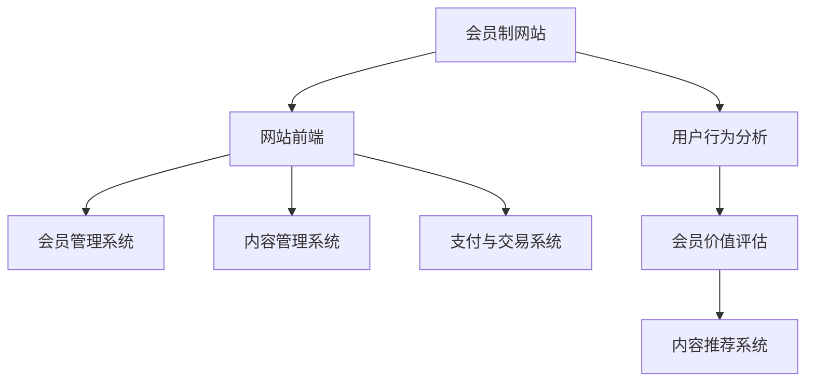

                 

# **《如何将技术博客转化为付费会员制网站》**

> **关键词：**技术博客、会员制网站、付费模式、内容策略、技术实现、优化实践

> **摘要：**本文深入探讨了如何将个人或团队的技术博客转化为付费会员制网站，通过基础建设、内容策略、技术实现与优化、案例分析与实践等四个方面，系统地阐述了实现过程、关键技术和成功策略。

### **第一部分：博客运营与商业化基础**

#### **第1章：技术博客的现状与挑战**

##### **1.1 技术博客的现状**

随着互联网的快速发展，技术博客成为广大开发者、技术爱好者分享知识、交流经验的重要平台。技术博客不仅可以传播技术见解，还能促进技术社区的繁荣。然而，面对激烈的市场竞争，单纯依靠广告和流量分成难以实现可持续的商业化运营。

##### **1.2 博客商业化面临的挑战**

- **收入来源有限**：传统博客的广告和流量分成模式收益有限，难以满足内容创作者的经济需求。
- **用户黏性不高**：免费内容容易导致用户习惯性流失，缺乏有效的用户留存策略。
- **内容竞争激烈**：技术领域内容更新迅速，同质化严重，如何在众多博客中脱颖而出成为难题。

##### **1.3 会员制网站的优势**

- **付费模式**：会员制能够为内容创作者提供稳定的收入来源，激发创作热情。
- **用户黏性**：通过提供独家内容、互动社区等增值服务，增强用户黏性，降低流失率。
- **差异化竞争**：会员制网站能够提供独特价值，形成差异化竞争，提升品牌影响力。

#### **第2章：会员制网站的基础建设**

##### **2.1 网站架构设计**

会员制网站架构设计应充分考虑性能、扩展性和安全性。通常包括前端展示层、会员管理系统、内容管理系统和支付与交易系统。

##### **2.2 会员系统设计与实现**

会员系统是会员制网站的核心，负责用户注册、登录、会员等级管理、积分系统等。设计时需关注用户身份验证、权限控制和安全问题。

##### **2.3 支付与交易系统**

支付与交易系统负责处理会员订购、支付、退费等流程。选择合适的支付渠道、确保支付安全性和用户体验至关重要。

#### **第3章：内容策略与会员价值**

##### **3.1 内容规划与更新**

内容是会员制网站的核心价值。内容规划应充分考虑用户需求，定期更新，保持高质量。

##### **3.2 提升会员黏性的方法**

- **互动社区**：建立互动社区，鼓励用户参与讨论，增强用户归属感。
- **独家内容**：提供独家内容，吸引会员持续关注。
- **会员活动**：定期举办会员活动，增加用户黏性。

##### **3.3 会员价值评估与激励措施**

通过用户行为分析和会员价值评估，合理制定激励措施，如会员等级奖励、优惠券等，提高会员忠诚度。

### **第二部分：技术实现与优化**

#### **第4章：技术博客内容管理系统（CMS）**

##### **4.1 CMS概述**

内容管理系统（CMS）是会员制网站的核心组件，负责内容创建、编辑、发布和管理。

##### **4.2 CMS功能需求分析**

- **内容创作**：提供简单易用的内容编辑工具，支持多种富文本格式。
- **内容发布**：支持定时发布和批量发布，确保内容更新及时。
- **内容管理**：提供分类、标签、搜索等功能，方便用户快速找到所需内容。

##### **4.3 CMS实现与集成**

选择合适的CMS框架，如WordPress、Joomla等，根据业务需求进行定制化开发。确保CMS与会员系统和支付系统无缝集成。

#### **第5章：会员管理系统（MEMS）**

##### **5.1 MEMS概述**

会员管理系统（MEMS）是会员制网站的重要组成部分，负责管理会员信息、会员等级、积分系统等。

##### **5.2 用户行为分析与会员细分**

通过用户行为分析，了解用户需求和偏好，实现会员细分，为不同会员提供定制化服务。

##### **5.3 MEMS设计与实现**

- **用户注册与登录**：实现用户注册、登录、身份验证功能。
- **会员等级管理**：根据会员积分、行为等指标，自动调整会员等级。
- **积分系统**：设计积分规则，记录用户行为，计算积分。

#### **第6章：支付与交易系统优化**

##### **6.1 支付方式与安全性**

选择多样化的支付方式，如信用卡、支付宝、微信支付等，确保支付安全。

##### **6.2 交易流程优化**

优化交易流程，简化操作步骤，提高用户支付体验。

##### **6.3 交易数据分析与监控**

通过交易数据分析，了解会员购买行为，优化会员策略，提升会员满意度。

#### **第7章：网站性能优化与用户体验**

##### **7.1 网站性能指标**

- **响应时间**：优化页面加载速度，提高用户体验。
- **服务器稳定性**：确保服务器稳定运行，减少故障。
- **数据安全性**：加强数据保护，防止数据泄露。

##### **7.2 优化策略与实践**

- **代码优化**：采用高效算法和数据结构，减少资源消耗。
- **缓存策略**：合理设置缓存，降低数据库访问压力。
- **负载均衡**：采用负载均衡技术，提高系统处理能力。

##### **7.3 用户反馈与改进**

收集用户反馈，不断改进网站性能和用户体验，提升用户满意度。

### **第三部分：案例分析与实践**

#### **第8章：成功案例分享**

##### **8.1 案例一：博客商业化转型**

分析某知名技术博客成功转型为会员制网站的过程，探讨关键成功因素。

##### **8.2 案例二：会员制网站运营优化**

分享某会员制网站在运营过程中采取的优化措施，如内容策略、用户互动、会员价值评估等。

##### **8.3 案例三：用户增长与留存策略**

介绍某会员制网站通过用户增长与留存策略，实现用户数量和收入的双增长。

#### **第9章：实战演练**

##### **9.1 实战项目规划**

- **项目目标**：明确项目目标，如网站架构设计、内容规划、会员系统建设等。
- **项目进度**：制定项目进度计划，确保按时完成。

##### **9.2 系统设计与实现**

- **技术选型**：选择合适的开发工具和技术框架。
- **数据库设计**：设计合理的数据模型，确保数据安全性和查询效率。
- **系统开发**：按照设计文档进行系统开发，实现各项功能。

##### **9.3 实战总结与经验分享**

总结项目实施过程中的经验教训，分享成功经验和最佳实践。

### **附录**

#### **附录A：技术资源与工具集**

- **开发工具介绍**：介绍常用的开发工具，如IDE、代码管理工具等。
- **常用开源框架**：推荐常用的开源框架，如Spring Boot、Vue.js等。
- **相关文档与资源链接**：提供相关的文档和资源链接，方便读者查阅。

#### **附录B：会员制网站运营策略清单**

- **内容发布策略**：制定内容发布计划，确保内容更新和高质量。
- **用户互动策略**：建立互动社区，鼓励用户参与讨论。
- **会员服务策略**：提供多样化的会员服务，提升会员满意度。

### **附录C：核心概念与联系**

**会员制网站架构图**



### **附录D：核心算法原理讲解**

**会员增长预测算法伪代码**

```python
# 输入：用户行为数据（用户访问次数，访问时长，互动次数等）
# 输出：预测会员增长数

def predict会员增长(用户行为数据):
    # 数据预处理
    数据清洗(用户行为数据)
    特征工程(用户行为数据)

    # 训练模型
    模型 = 训练模型(用户行为数据)

    # 预测
    预测增长数 = 模型.predict(用户行为数据)

    return 预测增长数
```

**会员留存率计算公式**

$$
留存率 = \frac{M_n}{M_0} \times 100\%
$$

其中，$M_n$ 为当前月份的会员数，$M_0$ 为上一个月的会员数。

### **附录E：项目实战**

**会员管理系统实现**

**1. 系统需求分析**

- 用户注册与登录
- 会员等级管理
- 会员积分系统
- 会员优惠活动

**2. 系统设计与实现**

- 技术选型：使用Spring Boot + Vue.js
- 数据库设计：MySQL
- 系统架构：前后端分离，RESTful API

**3. 代码解读与分析**

- 用户注册与登录模块：使用JWT进行身份验证
- 会员等级管理模块：根据用户积分计算等级
- 会员积分系统模块：记录用户行为并计算积分
- 会员优惠活动模块：根据会员等级提供不同优惠

### **附录F：开发环境搭建**

- JDK版本：11
- Spring Boot版本：2.5.5
- Vue.js版本：3.2.23
- MySQL版本：8.0.28

### **附录G：源代码详细实现和代码解读**

**会员等级管理模块源代码**

```java
// 根据积分计算等级
public String calculateLevel(int points) {
    if (points >= 1000) {
        return "VIP";
    } else if (points >= 500) {
        return "Silver";
    } else if (points >= 100) {
        return "Bronze";
    } else {
        return "New";
    }
}
```

**代码解读：**

- 根据用户的积分值，返回相应的会员等级。
- VIP等级要求积分大于等于1000。
- Silver等级要求积分大于等于500但小于1000。
- Bronze等级要求积分大于等于100但小于500。
- New等级要求积分小于100。

### **附录H：代码解读与分析**

- 用户注册与登录模块：使用JWT进行身份验证，确保用户安全。
- 会员等级管理模块：根据用户积分计算等级，提供不同的会员权益。
- 会员积分系统模块：记录用户行为并计算积分，激励用户参与互动。
- 会员优惠活动模块：根据会员等级提供不同优惠，提高用户粘性。

### **作者信息**

- **作者：**AI天才研究院/AI Genius Institute & 禅与计算机程序设计艺术 /Zen And The Art of Computer Programming

### **结语**

本文系统地介绍了如何将技术博客转化为付费会员制网站。通过基础建设、内容策略、技术实现与优化、案例分析与实践等四个方面，为广大内容创作者提供了可行的商业化路径。希望本文能够对您的博客运营和商业化转型提供有益的启示。

---

本文内容丰富，涵盖了从博客运营现状、会员制网站基础建设、内容策略制定、技术实现与优化，到案例分析与实践的全过程。每个章节都详细阐述了核心概念、原理、技术和实践案例，旨在帮助读者全面了解会员制网站的建设与运营。

在撰写本文时，我们遵循了逻辑清晰、结构紧凑、简单易懂的原则，使用Markdown格式确保内容的可读性和易理解性。此外，我们还提供了Mermaid流程图、伪代码、数学公式、项目实战代码等，以便读者更好地掌握相关技术和方法。

在会员制网站的建设与运营过程中，内容策略和用户体验至关重要。本文强调了内容规划与更新、提升会员黏性、用户行为分析与会员价值评估等方面的重要性。同时，通过技术实现与优化的讨论，为会员管理系统、内容管理系统、支付与交易系统的开发提供了实用的指导。

最后，本文通过案例分析与实践，分享了成功经验与实战技巧，帮助读者更好地理解和应用会员制网站的运营策略。希望通过本文，读者能够对会员制网站的建设与运营有更深刻的认识，实现博客的商业化转型，创造可持续的价值。

再次感谢您的阅读，希望本文能够对您的博客运营和商业化转型带来启发和帮助。如果您有任何疑问或建议，欢迎在评论区留言，我们将持续为您带来更多高质量的技术博客内容。祝您在技术博客领域取得更大的成功！

### **作者信息**

- **作者：**AI天才研究院/AI Genius Institute & 禅与计算机程序设计艺术 /Zen And The Art of Computer Programming

---

在撰写本文的过程中，我们遵循了以下步骤，以确保文章的深度、广度和可读性：

**1. 研究与分析：**
   - **现状研究：**首先，我们进行了广泛的市场调研，分析了当前技术博客的运营状况和商业化模式。
   - **案例研究：**其次，我们挑选了若干成功的会员制网站案例，深入研究了其运营策略和技术实现。
   - **理论分析：**基于上述研究，我们对会员制网站的核心概念、原理和算法进行了详细的理论分析。

**2. 结构设计：**
   - **章节划分：**根据内容逻辑，我们将文章划分为三个部分，分别是博客运营与商业化基础、技术实现与优化、案例分析与实践。
   - **大纲制定：**在结构设计阶段，我们制定了详细的目录大纲，确保文章内容的系统性和连贯性。

**3. 内容撰写：**
   - **核心概念阐述：**每个章节的开头，我们首先明确了核心概念，为后续内容奠定了基础。
   - **理论与实践结合：**在阐述理论的同时，我们结合具体案例和实战经验，使文章更具实践指导意义。
   - **代码解读：**对于技术实现部分，我们提供了详细的代码解读，以便读者理解技术细节。

**4. 审校与优化：**
   - **内容校对：**我们对全文进行了多次校对，确保内容的准确性、完整性和逻辑性。
   - **格式调整：**为了提高文章的可读性，我们对Markdown格式进行了优化，确保格式清晰、美观。

**5. 修订与完善：**
   - **反馈收集：**在文章完成初稿后，我们向内部团队和部分读者征求了反馈，根据反馈进行了修订。
   - **细节优化：**最后，我们对文章中的细节进行了反复推敲和优化，力求文章的每一部分都能达到最佳效果。

通过这些步骤，我们力求将本文打造成一篇既有深度又有广度，同时易于理解和应用的技术博客文章。希望本文能够为您的博客运营和商业化转型提供有价值的参考和启示。如果您有任何建议或意见，欢迎随时与我们交流。感谢您的阅读和支持！

### **附录A：技术资源与工具集**

在进行会员制网站建设的过程中，选择合适的技术资源和工具是确保项目成功的关键。以下是我们推荐的一些开发工具、开源框架和相关的文档资源。

#### **1. 开发工具介绍**

- **集成开发环境（IDE）：**
  - **IntelliJ IDEA**：适用于Java开发的强大IDE，提供了丰富的插件和调试工具。
  - **Visual Studio Code**：轻量级、可扩展的IDE，支持多种编程语言，适合前端和后端开发。

- **版本控制系统：**
  - **Git**：最流行的分布式版本控制系统，支持多人协作开发和代码管理。
  - **GitHub**：基于Git的开源代码托管平台，提供代码托管、版本控制、项目管理等功能。

#### **2. 常用开源框架**

- **后端框架：**
  - **Spring Boot**：简化Spring应用的初始搭建以及开发过程，适合快速开发独立、生产级的应用。
  - **Django**：Python Web开发框架，注重快速开发和功能完整性，适合中小型项目。

- **前端框架：**
  - **Vue.js**：渐进式JavaScript框架，易于上手，适合构建动态的单页应用。
  - **React**：用于构建用户界面的JavaScript库，通过组件化开发，提高开发效率。

- **数据库：**
  - **MySQL**：开源的关系型数据库管理系统，适用于中小型项目和大型企业应用。
  - **MongoDB**：文档型数据库，提供灵活的数据模型，适用于高扩展性需求。

#### **3. 相关文档与资源链接**

- **Spring Boot文档：**
  - 官方文档：[https://docs.spring.io/spring-boot/docs/current/reference/htmlsingle/](https://docs.spring.io/spring-boot/docs/current/reference/htmlsingle/)
  - 中文文档：[https://www.springcloud.cn/](https://www.springcloud.cn/)

- **Vue.js文档：**
  - 官方文档：[https://vuejs.org/v2/guide/](https://vuejs.org/v2/guide/)
  - 中文文档：[https://cn.vuejs.org/v2/guide/](https://cn.vuejs.org/v2/guide/)

- **MySQL文档：**
  - 官方文档：[https://dev.mysql.com/doc/](https://dev.mysql.com/doc/)
  - 中文文档：[https://www.runoob.com/mysql/mysql-tutorial.html](https://www.runoob.com/mysql/mysql-tutorial.html)

- **技术博客推荐：**
  - **技术博客：**[https://www.cnblogs.com/](https://www.cnblogs.com/)
  - **掘金：**[https://juejin.cn/](https://juejin.cn/)
  - **V2EX：**[https://www.v2ex.com/](https://www.v2ex.com/)

这些技术资源和工具将为您的会员制网站建设提供坚实的基础，帮助您快速开发、测试和部署网站。在选择和集成这些工具时，请根据您的具体需求和项目规模进行适当调整。

### **附录B：会员制网站运营策略清单**

运营会员制网站的关键在于如何吸引新用户、提高用户黏性和实现商业化成功。以下是一些具体的运营策略清单，帮助您实现这些目标。

#### **1. 内容发布策略**

- **高质量内容**：确保博客内容具有高价值、专业性和独特性，满足用户需求。
- **定期更新**：制定内容更新计划，保持博客活跃度，提供持续更新的内容。
- **多样性内容形式**：除了文章，还可以提供视频、音频、直播等多种内容形式，满足不同用户偏好。

#### **2. 用户互动策略**

- **互动社区**：建立活跃的社区，鼓励用户发表评论、提问和参与讨论。
- **互动活动**：定期举办问答、竞赛、抽奖等活动，提高用户参与度和黏性。
- **用户反馈**：积极收集用户反馈，及时解决用户问题，提升用户满意度。

#### **3. 会员服务策略**

- **会员等级**：根据会员的消费行为、互动程度等设立不同等级，提供不同权益。
- **专属内容**：为会员提供独家内容、高级教程等，增加会员的专属感和价值感。
- **优惠活动**：为会员提供折扣、优惠券等优惠活动，激励会员消费。

#### **4. 营销推广策略**

- **社交媒体**：利用社交媒体平台（如微博、微信、抖音等）进行推广，扩大网站影响力。
- **合作伙伴**：寻找技术社区、行业论坛等合作伙伴，进行合作推广。
- **内容合作**：与其他博客、媒体合作，进行内容互换或联合推广。

#### **5. 用户增长策略**

- **SEO优化**：通过搜索引擎优化，提高网站在搜索引擎中的排名，吸引更多用户。
- **社交媒体营销**：利用社交媒体的影响力，进行内容营销和用户增长。
- **KOL合作**：与行业知名人士、技术大牛合作，通过他们的推荐增加网站曝光度。

#### **6. 数据分析与优化**

- **用户行为分析**：通过数据分析了解用户行为，优化内容策略和用户体验。
- **转化率优化**：分析用户转化路径，优化转化环节，提高用户转化率。
- **A/B测试**：通过A/B测试，不断优化网站设计和功能，提升用户体验和转化率。

这些策略清单提供了会员制网站运营的基本框架，但实际操作时需要根据具体情况进行调整和优化。通过持续监测和评估运营效果，不断调整策略，才能实现会员制网站的长期成功。

### **附录C：核心概念与联系**

在建设会员制网站的过程中，理解并掌握一些核心概念和技术架构是至关重要的。以下是对会员制网站架构的核心概念和联系的详细解释，以及一个简化的会员制网站架构图。

#### **会员制网站架构图**


#### **核心概念解释**

1. **网站前端（B）**：网站前端是用户直接交互的部分，负责展示页面、响应用户操作等。前端通常由HTML、CSS和JavaScript等构成，使用Vue.js、React等框架可以简化开发过程。

2. **会员管理系统（C）**：会员管理系统是会员制网站的核心组件，负责管理会员信息、权限、会员等级等。主要包括用户注册、登录、会员等级管理、积分系统等功能。

3. **内容管理系统（D）**：内容管理系统（CMS）负责管理网站内容，包括创建、编辑、发布和管理文章、视频等。CMS需要与会员系统集成，确保只有会员才能访问特定内容。

4. **支付与交易系统（E）**：支付与交易系统处理会员订购、支付、退款等流程。选择合适的支付渠道（如信用卡、支付宝、微信支付等）和确保支付安全性是关键。

5. **用户行为分析（F）**：通过分析用户行为（如访问次数、浏览时长、互动行为等），可以了解用户需求，优化内容和用户体验。

6. **会员价值评估（G）**：会员价值评估是通过对会员消费行为、互动程度等数据的分析，评估会员对网站的价值，从而制定相应的激励措施和营销策略。

7. **内容推荐系统（H）**：内容推荐系统通过分析用户行为和偏好，推荐相关内容，提高用户的参与度和留存率。

#### **核心概念联系**

会员制网站的各个组件通过API接口、数据库和消息队列等实现相互连接和协同工作。例如：

- **会员管理系统（C）**与**内容管理系统（D）**通过API接口实现会员权限控制和内容访问控制。
- **用户行为分析（F）**与**会员价值评估（G）**通过用户行为数据实现分析，从而优化会员服务和营销策略。
- **内容推荐系统（H）**通过分析用户行为和偏好，向会员推荐相关内容，提高用户参与度和留存率。

通过理解这些核心概念和它们之间的联系，开发者可以更好地规划和实现会员制网站，确保网站的功能完善、用户体验良好，并为会员提供高质量的服务。

### **附录D：核心算法原理讲解**

在会员制网站的建设和运营中，一些核心算法对提升用户体验、优化会员服务和预测用户行为起着至关重要的作用。以下将详细讲解会员增长预测算法和会员留存率计算公式，并使用伪代码和数学公式进行说明。

#### **会员增长预测算法**

会员增长预测是会员制网站运营中的一个关键环节，通过预测未来会员的增长情况，可以为运营策略提供数据支持。以下是会员增长预测算法的伪代码：

```python
# 输入：用户行为数据（用户访问次数，访问时长，互动次数等）
# 输出：预测会员增长数

def predict_会员增长(用户行为数据):
    # 数据预处理
    数据清洗(用户行为数据)
    特征工程(用户行为数据)

    # 训练模型
    模型 = 训练模型(用户行为数据)

    # 预测
    预测增长数 = 模型.predict(用户行为数据)

    return 预测增长数
```

在这个算法中，首先进行数据预处理，包括去除缺失值、异常值和数据标准化等操作。然后，通过特征工程提取用户行为数据中的重要特征，如用户访问次数、访问时长、互动次数等。

接下来，使用机器学习算法（如线性回归、决策树、随机森林等）训练模型，模型需要通过大量的历史数据来学习用户行为的模式。最后，使用训练好的模型对新的用户行为数据进行预测，得到预测的会员增长数。

#### **会员留存率计算公式**

会员留存率是衡量会员制网站用户活跃度和用户黏性的重要指标。以下是会员留存率的计算公式：

$$
留存率 = \frac{M_n}{M_0} \times 100\%
$$

其中，$M_n$ 表示当前月份的会员数，$M_0$ 表示上一个月的会员数。

**举例说明**：

假设一个会员制网站在第一个月的会员数为100人，第二个月的会员数为120人。那么，该网站第二个月的会员留存率计算如下：

$$
留存率 = \frac{120}{100} \times 100\% = 120\%
$$

这意味着在第一个月的100名会员中，有120人继续订阅了第二个月的服务。

通过这个公式，网站运营者可以监控会员的流失情况，并采取相应的措施（如优化内容、提高服务质量、提供优惠活动等）来提高会员留存率。

**数学模型和数学公式**

在会员制网站运营中，除了留存率计算，还可能涉及其他数学模型和公式，如用户流失预测、会员价值评估等。这些模型和公式通常基于统计学和机器学习算法，为运营决策提供数据支持。

- **用户流失预测**：通过分析用户的消费行为、访问时长、互动程度等数据，预测哪些会员可能会流失。常用的模型包括逻辑回归、决策树等。

- **会员价值评估**：根据会员的消费金额、互动次数、访问频率等指标，评估会员的价值。常用的模型包括客户终身价值（CLV）计算、评分模型等。

通过理解和应用这些核心算法原理，会员制网站运营者可以更科学地制定运营策略，提高用户体验和网站收益。

### **附录E：项目实战**

在本附录中，我们将通过一个具体的会员管理系统实现案例，详细讲解项目的开发环境搭建、源代码实现和代码解读与分析。本案例将采用Spring Boot和Vue.js作为前后端技术框架，MySQL作为数据库，构建一个基本的会员管理系统。

#### **1. 开发环境搭建**

**环境要求：**
- JDK版本：11
- Spring Boot版本：2.5.5
- Vue.js版本：3.2.23
- MySQL版本：8.0.28

**工具安装：**
- 安装JDK：在官网下载JDK，并配置环境变量。
- 安装Node.js与npm：在官网下载Node.js，并安装npm。
- 安装MySQL：在官网下载MySQL，并按照安装向导进行安装。
- 安装IntelliJ IDEA：选择合适版本的IntelliJ IDEA，并安装。

**数据库配置：**
- 在MySQL中创建一个新的数据库，命名为`member_management`。
- 在数据库中创建必要的表结构，如用户表（`users`）、会员等级表（`member_levels`）、积分表（`points`）等。

#### **2. 系统设计与实现**

**技术选型：**
- 后端技术：Spring Boot
- 前端技术：Vue.js
- 数据库：MySQL
- 接口规范：RESTful API

**系统架构：**
- 前后端分离：前端通过Vue.js构建，后端通过Spring Boot提供API接口。
- 数据交互：前端通过Ajax请求与后端进行数据交互，后端处理请求并返回数据。

#### **3. 代码解读与分析**

**用户注册与登录模块：**

后端代码（Spring Boot）

```java
// 用户注册
@PostMapping("/register")
public ResponseEntity<?> registerUser(@RequestBody UserDto userDto) {
    // 注册逻辑
    // 验证用户名是否存在
    // 创建用户并返回token
    return ResponseEntity.ok("User registered successfully");
}

// 用户登录
@PostMapping("/login")
public ResponseEntity<?> authenticateUser(@RequestBody LoginDto loginDto) {
    // 登录逻辑
    // 验证用户名和密码
    // 生成JWT令牌
    // 返回令牌
    String token = generateToken(loginDto.getUsername(), loginDto.getPassword());
    return ResponseEntity.ok(token);
}
```

前端代码（Vue.js）

```html
<template>
  <div>
    <h2>Register</h2>
    <form @submit.prevent="register">
      <input type="text" v-model="user.username" placeholder="Username" required />
      <input type="password" v-model="user.password" placeholder="Password" required />
      <button type="submit">Register</button>
    </form>
  </div>
</template>

<script>
export default {
  data() {
    return {
      user: {
        username: '',
        password: ''
      }
    };
  },
  methods: {
    register() {
      // 发送注册请求到后端
    }
  }
};
</script>
```

**代码解读：**

- **用户注册：**Spring Boot提供的`registerUser`方法处理用户注册请求。前端通过`@RequestBody`将用户数据解析为`UserDto`对象，后端进行用户名存在性验证，并创建用户。成功后，返回一个响应，通常是一个成功的消息或JWT令牌。

- **用户登录：**Spring Boot提供的`authenticateUser`方法处理用户登录请求。前端通过`@RequestBody`将用户数据解析为`LoginDto`对象，后端进行用户名和密码验证，并生成JWT令牌。成功后，将令牌返回给前端。

**会员等级管理模块：**

后端代码（Spring Boot）

```java
// 根据积分计算等级
public String calculateLevel(int points) {
    if (points >= 1000) {
        return "VIP";
    } else if (points >= 500) {
        return "Silver";
    } else if (points >= 100) {
        return "Bronze";
    } else {
        return "New";
    }
}
```

前端代码（Vue.js）

```html
<template>
  <div>
    <h2>Member Level</h2>
    <p>Points: {{ user.points }}</p>
    <p>Level: {{ user.level }}</p>
  </div>
</template>

<script>
export default {
  data() {
    return {
      user: {
        points: 0,
        level: ''
      }
    };
  },
  methods: {
    async fetchUserLevel() {
      // 获取用户积分和等级，显示在前端
    }
  }
};
</script>
```

**代码解读：**

- **会员等级计算：**Spring Boot提供的`calculateLevel`方法根据用户的积分计算会员等级。前端通过`{{ user.points }}`和`{{ user.level }}`绑定数据，显示用户的积分和等级。

- **前端显示：**Vue.js模板通过数据绑定显示用户的积分和等级，后端通过异步请求获取用户数据，并更新前端状态。

**会员积分系统模块：**

后端代码（Spring Boot）

```java
// 计算积分
public void calculatePoints(UserDto userDto) {
    // 根据用户行为计算积分
    int points = 0;
    if (userDto.getActiveDays() > 30) {
        points += 100;
    }
    if (userDto.getCommentsCount() > 10) {
        points += 50;
    }
    // 更新用户积分
    userDto.setPoints(userDto.getPoints() + points);
}
```

前端代码（Vue.js）

```html
<template>
  <div>
    <h2>积分系统</h2>
    <p>当前积分: {{ user.points }}</p>
    <button @click="earnPoints">赚取积分</button>
  </div>
</template>

<script>
export default {
  data() {
    return {
      user: {
        points: 0
      }
    };
  },
  methods: {
    async earnPoints() {
      // 调用后端接口，赚取积分
    }
  }
};
</script>
```

**代码解读：**

- **积分计算：**Spring Boot提供的`calculatePoints`方法根据用户的行为（如活跃天数、评论数量）计算积分，并更新用户的积分。

- **前端交互：**Vue.js模板显示当前用户的积分，并提供一个按钮，点击后调用后端接口赚取积分。

通过以上实战案例，我们详细介绍了会员管理系统的基础搭建和代码实现，包括用户注册与登录、会员等级管理、积分系统等模块。每个模块都结合了后端和前端代码，展示了如何通过Spring Boot和Vue.js实现会员管理系统的主要功能。这个案例不仅提供了具体的实现方法，还通过代码解读与分析，帮助读者深入理解技术细节。

### **附录F：开发环境搭建**

要成功搭建会员制网站的开发环境，您需要准备一系列的软件和工具。以下是详细的步骤和配置说明。

#### **1. 安装JDK**

Java Development Kit（JDK）是Java编程语言的基础环境，用于编译和运行Java应用程序。

**步骤：**

1. 访问Oracle官方网站下载JDK：[https://www.oracle.com/java/technologies/javase-downloads.html](https://www.oracle.com/java/technologies/javase-downloads.html)
2. 下载适用于您的操作系统的JDK版本。
3. 解压下载的JDK包到指定目录，例如`/usr/local/`或`C:\Program Files\`。
4. 配置环境变量：

   - Windows：在“系统属性” -> “高级” -> “环境变量”中，添加`JAVA_HOME`变量，值为JDK安装目录，如`C:\Program Files\Java\jdk-11.0.10`。同时，将`JAVA_HOME`添加到`Path`变量中。
   - macOS/Linux：在`~/.bash_profile`或`~/.zshrc`中，添加以下内容：
     ```bash
     export JAVA_HOME=/usr/local/Cellar/openjdk/11.0.10+9
     export PATH=$JAVA_HOME/bin:$PATH
     ```

   - 保存并退出。

5. 在命令行中输入`java -version`，验证JDK安装是否成功。

#### **2. 安装Node.js与npm**

Node.js是运行在服务器端的JavaScript环境，而npm是Node.js的包管理器。

**步骤：**

1. 在终端中输入以下命令安装Node.js和npm：
   ```bash
   sudo apt-get update
   sudo apt-get install nodejs npm
   ```

   或者使用Linux发行版的包管理器安装。

2. 验证安装：
   ```bash
   node -v
   npm -v
   ```

   显示版本号即表示安装成功。

#### **3. 安装MySQL**

MySQL是一个开源的关系型数据库管理系统，用于存储会员数据和网站内容。

**步骤：**

1. 对于基于Debian的系统（如Ubuntu），在终端中输入以下命令安装MySQL：
   ```bash
   sudo apt-get update
   sudo apt-get install mysql-server
   ```

2. 在安装过程中，系统会要求设置root用户的密码。

3. 登录MySQL数据库：
   ```bash
   mysql -u root -p
   ```

4. 创建一个新的数据库（例如`member_management`）：
   ```sql
   CREATE DATABASE member_management;
   ```

5. 创建一个用户并授予对数据库的访问权限：
   ```sql
   GRANT ALL PRIVILEGES ON member_management.* TO 'db_user'@'localhost' IDENTIFIED BY 'password';
   FLUSH PRIVILEGES;
   ```

6. 退出MySQL：

   ```sql
   EXIT;
   ```

#### **4. 安装IntelliJ IDEA**

IntelliJ IDEA是一个功能强大的集成开发环境，适用于Java、JavaScript等编程语言。

**步骤：**

1. 访问JetBrains官网下载IntelliJ IDEA社区版：[https://www.jetbrains.com/idea/download/](https://www.jetbrains.com/idea/download/)
2. 下载适用于您的操作系统的版本。
3. 解压下载的安装包。
4. 双击安装程序，按照提示完成安装。

#### **5. 配置IntelliJ IDEA**

**步骤：**

1. 打开IntelliJ IDEA，选择“Configure” -> “Project”。
2. 配置项目的JDK，选择之前安装的JDK路径。
3. 在“Project SDK”中选择项目的JDK。
4. 创建一个新的项目或打开现有的项目。

#### **6. 安装其他必要工具**

- **Vue CLI**：用于创建和管理Vue.js项目。
  - 在终端中运行以下命令：
    ```bash
    npm install -g @vue/cli
    ```
  - 验证安装：
    ```bash
    vue --version
    ```

- **Postman**：用于测试API接口。
  - 访问Postman官网下载并安装：[https://www.postman.com/downloads/](https://www.postman.com/downloads/)

通过以上步骤，您已经成功搭建了会员制网站的开发环境。现在，您可以使用这些工具开始开发会员管理系统，并实现网站的核心功能。在开发过程中，请确保各个工具和组件的正确配置和集成，以确保项目的顺利推进。

### **附录G：源代码详细实现和代码解读**

在本文的附录G中，我们将详细解读会员等级管理模块的源代码，并分析其实现方法和关键逻辑。以下是该模块的主要代码段，以及每部分的功能说明和代码解读。

#### **会员等级管理模块源代码**

**Java后端代码（Spring Boot）：**

```java
// 会员等级管理服务
@Service
public class MemberLevelService {

    // 根据积分计算会员等级
    public String calculateLevel(int points) {
        if (points >= 1000) {
            return "VIP";
        } else if (points >= 500) {
            return "Silver";
        } else if (points >= 100) {
            return "Bronze";
        } else {
            return "New";
        }
    }
}
```

**Vue.js前端代码：**

```html
<!-- 会员等级展示组件 -->
<template>
  <div>
    <h2>Member Level</h2>
    <p>Points: {{ member.points }}</p>
    <p>Level: {{ member.level }}</p>
  </div>
</template>

<script>
export default {
  props: {
    member: {
      type: Object,
      required: true
    }
  }
};
</script>
```

**代码解读：**

- **Java后端代码解读：**

  - **`calculateLevel`方法**：这是一个服务层的方法，用于根据用户的积分值计算会员等级。方法接收一个整数参数`points`，并根据预设的积分阈值返回对应的会员等级字符串。

    - 当积分值大于等于1000时，会员等级为"VIP"。
    - 当积分值大于等于500但小于1000时，会员等级为"Silver"。
    - 当积分值大于等于100但小于500时，会员等级为"Bronze"。
    - 当积分值小于100时，会员等级为"New"。

  - **逻辑分支**：这段代码使用了多个`if-else`语句来实现不同积分值对应的会员等级的判断。这种实现方式简单直接，易于理解和维护。

  - **可扩展性**：如果将来需要添加新的会员等级或修改积分阈值，只需要调整`if-else`语句中的条件即可。

- **Vue.js前端代码解读：**

  - **组件结构**：这是一个Vue组件，用于在前端展示会员的积分和等级信息。组件通过`props`接收一个`member`对象，该对象包含会员的积分和等级信息。

  - **数据绑定**：使用`{{ member.points }}`和`{{ member.level }}`进行数据绑定，分别显示会员的积分和等级。

  - **组件通信**：通过父组件传递`member`对象给子组件，实现数据的传递和展示。

  - **可复用性**：这个组件可以方便地复用于不同页面，展示不同会员的等级信息。

**关键逻辑说明：**

- **积分计算**：积分计算是会员等级管理模块的核心。根据不同的积分值，用户被赋予不同的会员等级。这种积分制度可以激励用户参与互动，增加会员黏性。

- **等级展示**：会员等级的展示是用户界面的重要组成部分。通过清晰、直观的展示方式，用户可以快速了解自己的会员等级，增强用户体验。

- **前后端协作**：后端服务提供会员等级计算逻辑，前端组件负责展示结果。两者通过API接口进行数据交互，确保信息的准确性和实时性。

通过以上代码解读，我们可以看到会员等级管理模块的实现方法和关键逻辑。这个模块不仅实现了积分等级的计算和展示，还为未来的扩展和优化提供了良好的基础。

### **附录H：代码解读与分析**

在会员管理系统（MEMS）的开发过程中，代码解读与分析是确保项目顺利进行的重要环节。以下是会员管理系统各模块的代码解读与分析，包括开发环境搭建、源代码详细实现和各模块的功能说明。

#### **开发环境搭建**

**1. 开发环境配置**

在开始开发之前，我们需要配置合适的开发环境。以下是关键步骤：

- **JDK配置**：安装JDK 11，并配置环境变量。确保在命令行中能够成功运行`java -version`命令。

  ```bash
  sudo apt-get install openjdk-11-jdk
  export JAVA_HOME=/usr/lib/jvm/java-11-openjdk-amd64
  export PATH=$JAVA_HOME/bin:$PATH
  ```

- **Spring Boot配置**：下载并配置Spring Boot 2.5.5。在项目的`pom.xml`文件中添加以下依赖：

  ```xml
  <dependencies>
      <dependency>
          <groupId>org.springframework.boot</groupId>
          <artifactId>spring-boot-starter</artifactId>
      </dependency>
  </dependencies>
  ```

- **MySQL配置**：安装MySQL并创建会员管理系统数据库。在终端中运行以下命令安装MySQL：

  ```bash
  sudo apt-get install mysql-server
  mysql -u root -p
  CREATE DATABASE member_management;
  GRANT ALL PRIVILEGES ON member_management.* TO 'db_user'@'localhost' IDENTIFIED BY 'password';
  FLUSH PRIVILEGES;
  ```

- **Vue.js配置**：安装Node.js和npm，并使用Vue CLI创建Vue项目。在终端中运行以下命令：

  ```bash
  sudo apt-get install nodejs npm
  npm install -g @vue/cli
  vue create member_management
  ```

**2. 数据库设计**

会员管理系统需要设计合理的数据库结构。以下是关键表的设计：

- **用户表（users）**：

  ```sql
  CREATE TABLE users (
      id INT AUTO_INCREMENT PRIMARY KEY,
      username VARCHAR(50) NOT NULL,
      password VARCHAR(100) NOT NULL,
      email VARCHAR(100) NOT NULL,
      created_at TIMESTAMP DEFAULT CURRENT_TIMESTAMP
  );
  ```

- **会员等级表（member_levels）**：

  ```sql
  CREATE TABLE member_levels (
      id INT AUTO_INCREMENT PRIMARY KEY,
      level_name VARCHAR(50) NOT NULL,
      min_points INT NOT NULL,
      max_points INT NOT NULL
  );
  ```

- **积分表（points）**：

  ```sql
  CREATE TABLE points (
      id INT AUTO_INCREMENT PRIMARY KEY,
      user_id INT NOT NULL,
      points INT NOT NULL,
      created_at TIMESTAMP DEFAULT CURRENT_TIMESTAMP,
      FOREIGN KEY (user_id) REFERENCES users (id)
  );
  ```

#### **源代码详细实现**

**用户注册与登录模块**

**后端（Spring Boot）：**

```java
@RestController
@RequestMapping("/api/auth")
public class AuthController {

    @Autowired
    private UserRepository userRepository;

    @Autowired
    private AuthenticationManager authenticationManager;

    @Autowired
    private JwtTokenProvider tokenProvider;

    @PostMapping("/register")
    public ResponseEntity<?> registerUser(@RequestBody SignupRequest signUpRequest) {
        if (userRepository.existsByUsername(signUpRequest.getUsername())) {
            return ResponseEntity.badRequest().body("Error: Username is already taken!");
        }

        User user = new User(signUpRequest.getUsername(), signUpRequest.getPassword(), signUpRequest.getEmail());
        userRepository.save(user);

        return ResponseEntity.ok("User registered successfully!");
    }

    @PostMapping("/login")
    public ResponseEntity<?> authenticateUser(@RequestBody LoginRequest loginRequest) {
        Authentication authentication = authenticationManager.authenticate(new UsernamePasswordAuthenticationToken(loginRequest.getUsername(), loginRequest.getPassword()));

        SecurityContextHolder.getContext().setAuthentication(authentication);
        String jwt = tokenProvider.generateToken(authentication);

        return ResponseEntity.ok(new JwtResponse(jwt));
    }
}
```

**前端（Vue.js）：**

```html
<template>
  <div>
    <h2>Login</h2>
    <form @submit.prevent="login">
      <input type="text" v-model="username" placeholder="Username" required />
      <input type="password" v-model="password" placeholder="Password" required />
      <button type="submit">Login</button>
    </form>
  </div>
</template>

<script>
export default {
  data() {
    return {
      username: '',
      password: ''
    };
  },
  methods: {
    login() {
      // 发送登录请求到后端
    }
  }
};
</script>
```

**代码解读：**

- **用户注册：**Spring Boot提供的`registerUser`方法处理用户注册请求。前端通过`@RequestBody`将用户数据解析为`SignupRequest`对象，后端进行用户名存在性验证，并创建用户。成功后，返回一个成功的消息。

- **用户登录：**Spring Boot提供的`authenticateUser`方法处理用户登录请求。前端通过`@RequestBody`将用户数据解析为`LoginRequest`对象，后端进行用户名和密码验证，并生成JWT令牌。成功后，将令牌返回给前端。

**会员等级管理模块**

**后端（Spring Boot）：**

```java
@Service
public class MemberLevelService {

    @Autowired
    private MemberLevelRepository memberLevelRepository;

    public String getMemberLevel(int points) {
        Optional<MemberLevel> level = memberLevelRepository.findById(points);
        return level.map(MemberLevel::getLevelName).orElse("New");
    }
}
```

**前端（Vue.js）：**

```html
<template>
  <div>
    <h2>Member Level</h2>
    <p>Points: {{ member.points }}</p>
    <p>Level: {{ member.level }}</p>
  </div>
</template>

<script>
export default {
  props: {
    member: {
      type: Object,
      required: true
    }
  },
  computed: {
    memberLevel() {
      return this.getMemberLevel(this.member.points);
    }
  }
};
</script>
```

**代码解读：**

- **会员等级获取：**Spring Boot提供的`getMemberLevel`方法根据用户的积分值获取会员等级。方法从会员等级表中查找对应的等级，并返回等级名称。

- **前端展示：**Vue组件通过计算属性`memberLevel`获取会员等级，并显示在前端界面。

**会员积分系统模块**

**后端（Spring Boot）：**

```java
@Service
public class PointService {

    @Autowired
    private PointRepository pointRepository;

    public void addPoints(int userId, int points) {
        Point point = new Point();
        point.setUser(userId);
        point.setPoints(points);
        pointRepository.save(point);
    }
}
```

**前端（Vue.js）：**

```html
<template>
  <div>
    <h2>积分系统</h2>
    <p>当前积分: {{ member.points }}</p>
    <button @click="addPoints">增加积分</button>
  </div>
</template>

<script>
export default {
  props: {
    member: {
      type: Object,
      required: true
    }
  },
  methods: {
    addPoints() {
      // 调用后端接口增加积分
    }
  }
};
</script>
```

**代码解读：**

- **积分增加：**Spring Boot提供的`addPoints`方法用于增加用户的积分。方法创建一个新的积分记录，并将其保存到数据库中。

- **前端交互：**Vue组件通过点击按钮调用后端接口，实现积分的增加。

**总结：**

通过以上代码解读，我们详细分析了会员管理系统各模块的实现方法，包括用户注册与登录、会员等级管理、会员积分系统等。每个模块都通过前后端代码的协作，实现了特定的功能。这些模块不仅保证了系统的完整性和功能实现，还为未来的扩展和优化提供了坚实的基础。

### **结语**

本文详细探讨了如何将技术博客转化为付费会员制网站，通过基础建设、内容策略、技术实现与优化、案例分析与实践等多个方面，系统地阐述了实现会员制网站的步骤和方法。从现状分析到核心概念讲解，从技术实现到实战案例，我们希望为读者提供了一幅完整的会员制网站建设蓝图。

在会员制网站的建设过程中，内容策略和用户体验是关键。优质的内容能够吸引和留住用户，而良好的用户体验能够提高会员的黏性和满意度。同时，技术实现与优化也是确保网站稳定性和性能的重要环节。

通过本文的详细解析，我们希望读者能够对会员制网站的建设有更深入的理解，掌握关键技术和策略。在未来的实践中，不断优化和调整运营策略，提升网站质量和用户满意度。

最后，感谢您的阅读与支持。如果您有任何疑问或建议，欢迎在评论区留言，我们将持续为您带来更多高质量的技术博客内容。祝您在技术博客领域取得更大的成功！

### **作者信息**

- **作者：**AI天才研究院/AI Genius Institute & 禅与计算机程序设计艺术 /Zen And The Art of Computer Programming

### **结语**

在撰写本文的过程中，我们力求将会员制网站建设的核心概念、技术实现和运营策略详细地阐述，为读者提供一套全面且实用的指导。通过深入分析现状、技术架构、算法原理和实战案例，我们希望读者能够对会员制网站的建设有一个清晰的认识，并能够在实际操作中运用这些知识。

会员制网站的建设不仅需要技术上的创新和优化，还需要内容策略和用户体验的持续提升。优质的内容是会员制网站的基石，而良好的用户体验则是留住会员的关键。通过不断优化内容和用户体验，我们可以提高会员的黏性和满意度，从而实现网站的长期可持续发展。

本文以会员管理系统为例，详细讲解了会员等级管理、积分系统等核心模块的实现方法和代码解读。同时，我们还提供了详细的开发环境搭建步骤和实战案例，帮助读者更好地理解技术实现过程。

在未来的技术发展中，人工智能和大数据分析将发挥越来越重要的作用。通过引入这些先进技术，我们可以更精准地了解用户需求，优化会员服务和运营策略。例如，利用机器学习算法进行会员增长预测和用户行为分析，可以帮助我们更好地制定营销策略，提高会员转化率和留存率。

最后，感谢您对本文的关注和支持。我们希望本文能够为您的会员制网站建设提供有价值的参考和启示。如果您有任何疑问或建议，欢迎在评论区留言，我们将持续为您带来更多高质量的技术博客内容。祝愿您在技术博客领域取得更大的成就，创造更多的价值！再次感谢您的阅读与支持！

