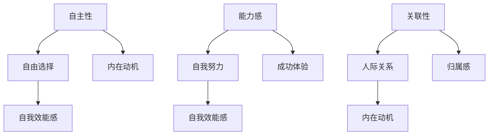
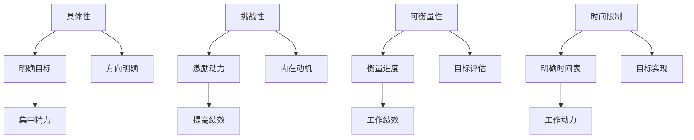
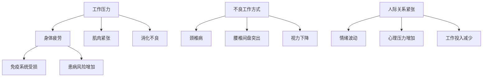
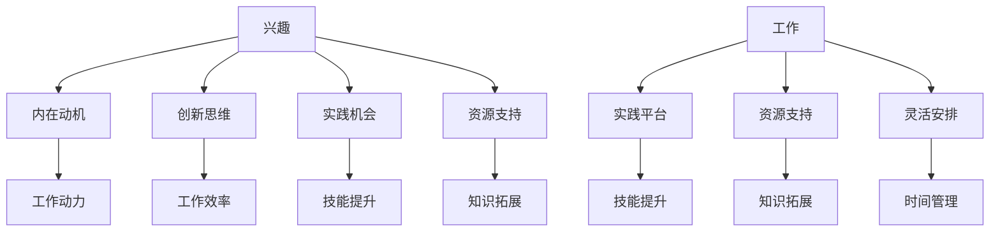
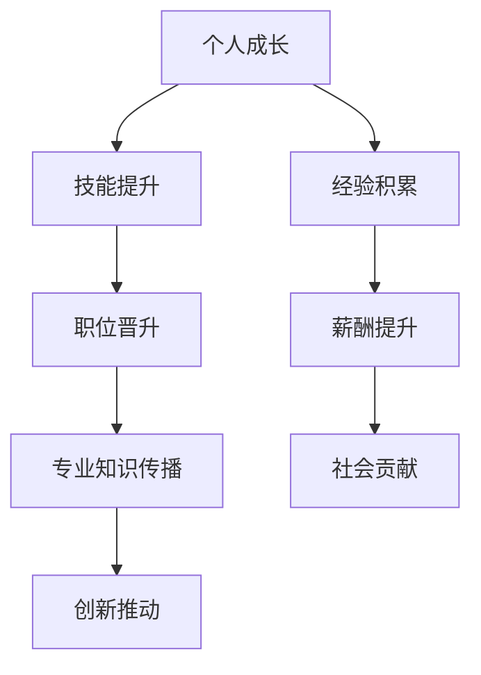

                 

### 第1章 引言

> **关键词**：工作与个人发展、平衡策略、时间管理、情绪管理、工作效率、健康管理、兴趣爱好、职业发展

> **摘要**：本章旨在介绍平衡工作与个人发展的背景和重要性。随着工作压力的增大，如何有效地管理时间和情绪，提高工作效率，保持身心健康，以及培养兴趣爱好和实现职业发展，成为现代人面临的关键问题。本章将提供这些方面的理论基础和实用策略。

#### 1.1 书籍目的和重要性

在当今快节奏的社会中，工作压力和个人成长需求之间的矛盾日益突出。许多人面临着工作与个人发展之间的平衡问题。一方面，职场竞争激烈，工作压力大，需要投入大量时间和精力；另一方面，个人成长、身心健康和兴趣爱好也是不可或缺的。如何在这两者之间找到平衡点，成为许多人关注的话题。

本书《如何平衡工作与个人发展》旨在为职场人士提供实用的策略和方法，帮助他们实现工作与个人发展的平衡。通过探讨时间管理、情绪管理、工作效率提升、健康管理、兴趣爱好发展和职业发展等方面的内容，本书旨在帮助读者掌握一系列技巧，以应对工作压力，实现个人价值。

#### 1.2 平衡工作与个人发展的挑战

平衡工作与个人发展并非易事，许多人在这过程中会遇到以下挑战：

1. **时间管理**：工作繁忙，时间有限，如何有效地安排时间，确保工作与个人发展都能得到充分关注？
2. **情绪管理**：工作压力大，情绪波动大，如何管理情绪，保持心理健康？
3. **工作效率**：如何在有限的时间内完成更多的工作，提高工作效率？
4. **健康管理**：长时间的工作和高强度的工作压力，如何保持身体健康？
5. **兴趣爱好**：如何在工作之余，培养和发展自己的兴趣爱好？
6. **职业发展**：如何在平衡工作与个人发展的同时，实现职业生涯的进步？

这些问题不仅关乎个人的成长和幸福，也影响到工作表现和团队合作。因此，寻找有效的平衡策略，对职场人士来说至关重要。

#### 1.3 本书结构

为了帮助读者更好地理解和实践，本书分为以下几个章节：

- **第1章 引言**：介绍书籍的目的、重要性，以及为何平衡工作与个人发展对现代人至关重要。
- **第2章 个人发展理论**：探讨个人发展的理论基础，如自我决定理论、目标设定理论等。
- **第3章 工作与个人发展的平衡策略**：提出具体策略，如时间管理、情绪管理等。
- **第4章 工作效率提升**：介绍提高工作效率的方法，如项目管理工具、优先级设定等。
- **第5章 健康管理**：强调工作与个人健康之间的关系，提供健康管理的建议。
- **第6章 兴趣与爱好发展**：探讨如何在繁忙的工作中找到时间培养个人兴趣。
- **第7章 职业发展**：讨论如何在平衡工作与个人发展的同时，实现职业生涯的进步。
- **第8章 案例分析**：通过实际案例，分析如何将理论应用到实践中。
- **第9章 结论**：总结全书，提供未来展望和进一步阅读的建议。

通过这些章节的探讨，本书旨在为读者提供全面、系统的指导，帮助他们在工作和个人发展之间找到最佳平衡点。

### 第2章 个人发展理论

个人发展理论是理解个人成长和职业发展的基础。在本书中，我们将探讨几种关键的个人发展理论，包括自我决定理论（Self-Determination Theory, SDT）、目标设定理论（Goal Setting Theory）等。这些理论为我们提供了理解个人动机、行为和心理过程的重要视角。

#### 2.1 自我决定理论

自我决定理论（SDT）是由心理学家瑞恩（Deci）和德西（Ryan）提出的，旨在解释人类行为的动机和自我发展的过程。该理论强调人类有三种基本心理需求：自主性、能力感和关联性。

1. **自主性**：自主性是指个体在决策过程中拥有自由选择的权利。这种自由选择的权利使个体能够按照自己的意愿行事，从而增强个体的内在动机和自我效能感。例如，在职业生涯中，拥有自主性意味着职场人士可以自由选择自己的工作方向和发展路径。

2. **能力感**：能力感是指个体通过自我努力获得成功，提升自我效能感的过程。当个体认为自己有能力完成一项任务时，他们会更有动力去努力，并且更有可能取得成功。例如，一个职场人士如果通过自己的努力晋升到了更高的职位，他会感到自己的能力得到了认可，从而增强自信心。

3. **关联性**：关联性是指个体与他人建立积极的人际关系，感受到归属感。这种归属感使个体感到被接受和尊重，从而增强内在动机。例如，一个职场人士如果与同事建立了良好的关系，他会感到自己在团队中有着重要的地位，这种归属感会促进其工作动力。

**Mermaid 流程图**：



#### 2.2 目标设定理论

目标设定理论（Goal Setting Theory）是由洛克（Locke）和莱瑟姆（Latham）提出的，旨在解释目标对个体行为和绩效的影响。该理论认为，明确、具体、具有挑战性的目标能够提高个体的动机和工作绩效。

1. **目标的重要性**：明确的目标有助于个体明确方向，集中精力，从而提高工作绩效。例如，一个职场人士如果设定了明确的职业发展目标，他会更有动力去实现这些目标，并且在工作中更加专注。

2. **目标设定的原则**：

   - **具体性**：目标应该具体、明确，避免模糊。例如，“提高销售业绩”比“提高业绩”更具具体性。
   - **挑战性**：目标应该具有一定难度，激发个体的内在动机。例如，一个职场人士如果设定了一个相对容易实现的目标，可能会缺乏动力去努力。
   - **可衡量性**：目标应该是可衡量的，以便个体能够评估自己的进度。例如，“在六个月内增加20%的销售额”比“努力增加销售”更具可衡量性。
   - **时间限制**：目标应该有时间限制，以便个体有明确的时间表去实现目标。例如，“在接下来的三个月内完成项目”比“尽快完成项目”更具时间限制。

**Mermaid 流程图**：



#### 2.3 其他相关理论

除了自我决定理论和目标设定理论，还有一些其他与个人发展相关的理论，如成长心态理论（Growth Mindset Theory）和自我效能感理论（Self-Efficacy Theory）。

- **成长心态理论**：由心理学家德韦克（Dweck）提出，认为个体的成功取决于他们对挑战的态度。持有成长心态的个体相信通过努力和学习可以提升自己的能力，因此更愿意接受挑战，持续进步。

- **自我效能感理论**：由班杜拉（Bandura）提出，强调个体对自身能力的信念对其行为和选择的影响。高自我效能感的个体更自信，更倾向于面对挑战，并且在面对困难时更能坚持。

这些理论共同构成了个人发展理论的基础，为我们理解个人成长和职业发展提供了重要的视角和指导。

### 第3章 工作与个人发展的平衡策略

在现代社会中，平衡工作与个人发展是一项艰巨的任务，需要综合考虑时间管理、情绪管理、工作效率提升、健康管理、兴趣爱好发展和职业发展等多个方面。本章将详细介绍这些策略，帮助职场人士实现工作与个人发展的平衡。

#### 3.1 时间管理

时间管理是平衡工作与个人发展的关键。通过合理规划时间，职场人士可以更有效地完成工作任务，同时为个人发展留出空间。以下是几种有效的时间管理策略：

1. **优先级设定**：根据任务的紧急程度和重要性来安排时间。可以使用“四象限法则”将任务分为四个象限，分别处理：

   - **紧急且重要**：立即处理，如紧急会议或紧急任务。
   - **重要但不紧急**：提前规划，如长期项目或个人发展计划。
   - **紧急但不重要**：委托他人处理，如电话沟通或邮件回复。
   - **不紧急且不重要**：避免或删除，如不必要的会议或社交媒体浏览。

2. **时间块管理**：将时间划分为不同的时间段，每个时间段专注于一项任务。例如，将一天分为工作时间和个人时间，每个时间段内只专注于一项任务，避免分心。

3. **番茄工作法**：通过设定25分钟的工作时间和5分钟的休息时间，提高专注力。每完成一个番茄钟（25分钟工作），休息5分钟，然后继续下一个番茄钟。

**伪代码示例**：

```python
def prioritize_tasks(tasks):
    sorted_tasks = sort_by_urgency_and_importance(tasks)
    return sorted_tasks

def time_block_management():
    for task in prioritize_tasks(tasks):
        work_on_task(task, 25 minutes)
        take_a_break(5 minutes)

def tomato_work_method():
    while True:
        work(25 minutes)
        rest(5 minutes)
```

#### 3.2 情绪管理

情绪管理是保持身心健康的重要因素。通过有效管理情绪，职场人士可以更好地应对工作压力，提高工作效率。以下是几种情绪管理策略：

1. **情绪识别**：通过自我反思，识别和理解自己的情绪。例如，当感到焦虑或愤怒时，问自己为什么会这样，是什么导致了这种情绪。

2. **情绪调节**：采用深呼吸、正念冥想等方法，调节情绪。深呼吸可以帮助缓解紧张和焦虑，正念冥想可以帮助提高专注力和自我意识。

3. **情绪表达**：学会以健康的方式表达情绪，避免压抑或爆发。可以通过写日记、与朋友或家人交流等方式，表达自己的情绪。

**伪代码示例**：

```python
def identify_emotions():
    current_emotion = get_current_emotion()
    return current_emotion

def regulate_emotions():
    while True:
        current_emotion = identify_emotions()
        if current_emotion == "stressed":
            breathe_deeply()
            meditate()
        elif current_emotion == "happy":
            celebrate_success()
```

#### 3.3 工作效率提升

工作效率是平衡工作与个人发展的关键。以下是几种提升工作效率的方法：

1. **项目管理工具**：使用项目管理工具，如Trello、JIRA、Asana等，可以帮助职场人士更好地规划工作流程，提高团队协作效率。以下是一个简单的伪代码示例：

```python
def create_task(project_tool, task_name, deadline):
    project_tool.create_task(task_name, deadline)
    print(f"Task '{task_name}' created with deadline {deadline}.")

def track_progress(project_tool, task_name):
    progress = project_tool.get_task_progress(task_name)
    print(f"Progress of task '{task_name}': {progress}% completed.")
```

2. **优先级设定**：使用Eisenhower矩阵或ABC分类法，根据任务的紧急程度和重要性，将任务分为四个象限或三个等级，分别处理。

3. **工作与休息**：合理的工作与休息安排可以提高工作效率，避免过度疲劳。可以使用工作休息法，通过设定固定的休息时间，提高工作专注力。以下是一个简单的伪代码示例：

```python
def work_with_rest(work_duration, rest_duration):
    for i in range(number_of_work_periods):
        work(work_duration)
        rest(rest_duration)
        print(f"Period {i + 1} completed.")
```

#### 3.4 健康管理

健康管理是平衡工作与个人发展的基础。以下是几种健康管理策略：

1. **身体锻炼**：定期进行体育锻炼，如跑步、瑜伽、健身等，有助于提高身体素质和抵抗力。以下是一个简单的伪代码示例：

```python
def exercise_program():
    schedule_daily_workout()
    track_progress_of_exercise()
```

2. **心理健康维护**：通过心理辅导、放松训练等方法，缓解工作压力，保持心理健康。以下是一个简单的伪代码示例：

```python
def mental_health_maintenance():
    schedule_meditation_sessions()
    seek_counseling_if_needed()
```

3. **饮食管理**：保持均衡饮食，减少油腻、高糖食物的摄入，增加蔬菜和水果的摄入。以下是一个简单的伪代码示例：

```python
def diet_management():
    eat_healthily()
    avoid_unhealthy_foods()
```

#### 3.5 工作与家庭平衡

工作与家庭平衡是平衡工作与个人发展的重要方面。以下是几种工作与家庭平衡策略：

1. **灵活工作安排**：与上司和同事协商，采用远程工作或灵活工作时间，减少工作与家庭之间的冲突。

2. **有效沟通**：与家人保持良好的沟通，理解彼此的需求和期望，共同寻找解决方案。

3. **时间管理**：合理规划时间，确保有足够的时间陪伴家人，参与家庭活动。

#### 3.6 其他策略

除了上述策略，还可以采取以下策略帮助平衡工作与个人发展：

1. **兴趣爱好发展**：在工作之余，培养和发展个人兴趣爱好，提高生活质量。

2. **职业发展**：通过提升专业技能和知识，实现职业生涯的进步。

3. **社交网络**：建立和维护良好的社交网络，拓展人际关系，提高工作效率。

通过综合运用这些策略，职场人士可以更好地平衡工作与个人发展，实现个人价值和社会贡献。

### 第4章 工作效率提升

提升工作效率是实现工作与个人发展平衡的关键。高效的工作不仅能够减轻工作压力，还能为个人发展提供更多的时间和空间。在本章中，我们将探讨几种提高工作效率的方法和工具，帮助职场人士更有效地完成任务。

#### 4.1 项目管理工具

项目管理工具是提升工作效率的重要手段。这些工具可以帮助职场人士更好地规划工作流程，分配任务，跟踪进度，从而提高整体的工作效率。以下是一些常用的项目管理工具：

1. **Trello**：
   - **功能**：Trello是一个基于看板（Kanban）系统的项目管理工具，通过卡片和列表来展示任务和工作流程。
   - **优点**：界面直观，易于使用，适合小型团队和个人项目。

2. **JIRA**：
   - **功能**：JIRA是一个强大的项目管理工具，主要用于跟踪和管理软件项目的缺陷和问题。
   - **优点**：功能丰富，适合大型团队和复杂项目。

3. **Asana**：
   - **功能**：Asana是一个任务管理工具，通过任务列表和日历来帮助团队协调工作。
   - **优点**：界面简洁，支持多种工作流，适用于各种规模和类型的团队。

**伪代码示例**：

```python
# 创建任务
def create_task(project_tool, task_name, deadline):
    project_tool.create_task(task_name, deadline)
    print(f"Task '{task_name}' created with deadline {deadline}.")

# 跟踪任务进度
def track_progress(project_tool, task_name):
    progress = project_tool.get_task_progress(task_name)
    print(f"Progress of task '{task_name}': {progress}% completed.")
```

#### 4.2 优先级设定

合理设定工作优先级是提高工作效率的关键。以下是一些优先级设定的方法和技巧：

1. **Eisenhower矩阵**：
   - **方法**：根据任务的紧急程度和重要性，将任务分为四个象限：
     - **紧急且重要**：立即处理。
     - **重要但不紧急**：计划处理。
     - **紧急但不重要**：委托他人处理。
     - **不重要且不紧急**：避免或删除。
   - **优点**：清晰明了，有助于明确任务处理的优先级。

2. **ABC分类法**：
   - **方法**：将任务分为A、B、C三个等级，根据任务的紧急程度和重要性来排序。
     - **A类任务**：最重要、最紧急的任务。
     - **B类任务**：次重要、次紧急的任务。
     - **C类任务**：最不紧急、最不重要的任务。
   - **优点**：简单实用，适合快速分类和优先级设定。

**伪代码示例**：

```python
# 根据优先级排序任务
def prioritize_tasks(tasks):
    sorted_tasks = sort_by_urgency_and_importance(tasks)
    return sorted_tasks

# 辅助函数，根据紧急程度和重要性排序
def sort_by_urgency_and_importance(tasks):
    sorted_tasks = sorted(tasks, key=lambda x: (x['urgency'], x['importance']))
    return sorted_tasks
```

#### 4.3 工作与休息

合理的工作与休息安排可以提高工作效率，避免过度疲劳。以下是一些工作与休息的方法：

1. **工作休息法**：
   - **方法**：通过设定固定的休息时间，提高工作专注力。例如，使用“番茄工作法”，每25分钟工作后休息5分钟。
   - **优点**：有助于保持专注和精力，提高工作效率。

2. **分段工作法**：
   - **方法**：将工作时间分为几个短时段，每个时段后进行短暂的休息。例如，每工作45分钟后休息10分钟。
   - **优点**：有助于缓解疲劳，提高工作动力。

**伪代码示例**：

```python
# 使用工作休息法
def work_with_rest(work_duration, rest_duration):
    for i in range(number_of_work_periods):
        work(work_duration)
        rest(rest_duration)
        print(f"Period {i + 1} completed.")

# 辅助函数，工作与休息
def work(work_duration):
    print(f"Working for {work_duration} minutes.")
def rest(rest_duration):
    print(f"Taking a rest for {rest_duration} minutes.")
```

#### 4.4 环境优化

优化工作环境也是提高工作效率的重要一环。以下是一些环境优化的方法：

1. **办公环境布置**：
   - **方法**：确保办公空间整洁、舒适，良好的通风和光照。
   - **优点**：有助于提高工作舒适度和专注力。

2. **办公设备配置**：
   - **方法**：选择合适的办公设备，如人体工学椅、护眼屏幕等，减少对身体的伤害。
   - **优点**：有助于提高工作舒适度和健康水平。

3. **休息区设置**：
   - **方法**：在工作区域内设置休息区，提供舒适的座椅和绿植，帮助员工放松身心。
   - **优点**：有助于缓解工作压力，提高工作效率。

通过综合运用上述方法和工具，职场人士可以显著提高工作效率，从而更好地平衡工作与个人发展。

### 第5章 健康管理

#### 5.1 工作与健康的关联

工作与健康之间的关系密不可分。长期的工作压力和不良的工作方式可能导致多种健康问题，包括身体和心理方面的。因此，关注工作与健康的关联，采取有效的健康管理策略，对于平衡工作与个人发展至关重要。

1. **身体健康的关联**：
   - **长期工作压力**：长期的工作压力可能导致身体疲劳、肌肉紧张、头痛、消化不良等问题。
   - **不良工作方式**：长时间坐在电脑前、缺乏运动、不良坐姿等可能导致颈椎病、腰椎间盘突出、视力下降等健康问题。
   - **缺乏休息**：缺乏足够的休息和睡眠会影响免疫系统，增加患病风险。

2. **心理健康的相关性**：
   - **工作压力**：过高的工作压力可能导致焦虑、抑郁、心理疲劳等问题。
   - **人际关系**：工作中的人际关系紧张，可能导致情绪波动、心理压力增加。
   - **工作满意度**：工作满意度低可能导致工作投入减少，进而影响心理健康。

**Mermaid 流程图**：



#### 5.2 健康管理策略

为了应对工作与健康之间的挑战，职场人士需要采取一系列健康管理策略，包括身体锻炼、心理健康维护和饮食管理等方面。

1. **身体锻炼**：
   - **定期锻炼**：每周至少进行三次中等强度的锻炼，如跑步、游泳、瑜伽等。
   - **锻炼时间**：选择早晨或下午进行锻炼，避免晚上锻炼导致身体疲劳。
   - **锻炼频率**：保持规律的锻炼习惯，避免长时间不运动。

2. **心理健康维护**：
   - **压力管理**：采用深呼吸、正念冥想等方法，缓解工作压力。
   - **心理健康咨询**：定期进行心理健康咨询，寻求专业帮助。
   - **情绪表达**：学会以健康的方式表达情绪，避免压抑或爆发。

3. **饮食管理**：
   - **均衡饮食**：保持营养均衡的饮食，增加蔬菜、水果和全谷类食品的摄入。
   - **减少油腻**：减少高脂肪、高糖分的食物摄入，避免过度油腻的饮食。
   - **定时用餐**：按时用餐，避免暴饮暴食或过度饥饿。

**伪代码示例**：

```python
# 身体锻炼计划
def exercise_program():
    schedule_daily_workout()
    track_progress_of_exercise()

# 心理健康维护计划
def mental_health_maintenance():
    schedule_meditation_sessions()
    seek_counseling_if_needed()

# 饮食管理计划
def diet_management():
    eat_healthily()
    avoid_unhealthy_foods()
```

#### 5.3 工作环境优化

优化工作环境是提升工作效率和健康水平的重要手段。以下是一些工作环境优化的建议：

1. **办公环境布置**：
   - **保持整洁**：定期清理办公区域，保持工作环境的整洁。
   - **自然光照**：尽量利用自然光照，保持室内光线充足。
   - **绿植摆放**：在办公区域摆放绿植，增加空气质量和美观度。

2. **办公设备配置**：
   - **人体工学椅**：选择合适的人体工学椅，减少长时间工作对身体的伤害。
   - **护眼屏幕**：使用护眼屏幕，减少眼睛疲劳。

3. **休息区设置**：
   - **舒适座椅**：在工作区域内设置舒适的休息座椅，供员工休息使用。
   - **绿植装饰**：在休息区摆放绿植，营造放松的氛围。

**总结**：

健康管理是平衡工作与个人发展的重要组成部分。通过关注工作与健康的关联，采取有效的健康管理策略，职场人士可以更好地应对工作压力，保持身心健康，从而实现工作与个人发展的平衡。

### 第6章 兴趣与爱好发展

#### 6.1 工作与兴趣的关系

在工作与个人兴趣之间找到平衡点对于职场人士来说至关重要。兴趣和爱好不仅能够丰富个人的生活，还能够提升工作满意度，增强抗压能力，甚至对职业生涯产生积极影响。因此，理解工作与兴趣之间的关系，以及如何在工作繁忙的情况下培养和发展兴趣，是职场人士需要掌握的重要技能。

1. **兴趣激发工作动力**：
   - **内在动机**：对某项兴趣的热爱可以激发个人的内在动机，使工作变得更加有意义和有吸引力。例如，一个喜欢编程的职场人士可能会在工作之外继续钻研编程技术，这种兴趣会转化为工作动力。
   - **创新思维**：兴趣能够激发个人的创新思维，使工作更加有创意和活力。当职场人士将兴趣带入工作中时，往往能够提出独特的解决方案，提高工作效率。

2. **工作提供兴趣发展平台**：
   - **实践机会**：工作提供了一个平台，让职场人士能够将兴趣转化为实践。例如，一个喜欢摄影的职场人士可以利用公司组织的活动拍摄照片，从而提升自己的摄影技能。
   - **资源支持**：工作环境中的资源，如时间、知识和设备，可以支持个人兴趣的发展。职场人士可以通过参加公司内的兴趣小组或研讨会，与同事分享和交流，从而丰富自己的兴趣。

3. **平衡工作与兴趣**：
   - **时间管理**：合理的时间管理是平衡工作与兴趣的关键。职场人士可以通过优先级设定和高效的工作方法，确保有足够的时间去追求自己的兴趣。
   - **灵活安排**：灵活的工作安排，如远程工作和弹性工作时间，可以帮助职场人士更好地平衡工作与兴趣。

**Mermaid 流程图**：



#### 6.2 兴趣与爱好的培养

为了在工作繁忙的情况下培养和发展个人兴趣和爱好，职场人士需要采取一系列策略和方法。

1. **时间管理**：
   - **日程规划**：合理规划日常日程，确保有固定的时间用于培养兴趣。例如，每天晚上安排一段时间阅读或练习兴趣爱好。
   - **优先级设定**：将兴趣培养作为重要任务，确保它在日程中有优先权。

2. **专注培养**：
   - **专注时段**：在工作时间内设定专注时段，专注于处理工作任务，确保工作高效完成。
   - **避免分心**：在工作之外的时间段，避免干扰，专注于兴趣活动，提高专注力。

3. **持续投入**：
   - **定期练习**：定期进行兴趣活动的练习，保持技能的提升和兴趣的持续。
   - **持续学习**：通过参加课程、阅读书籍、观看教程等方式，不断提升自己的兴趣水平。

**伪代码示例**：

```python
# 时间管理策略
def manage_time_for_interests():
    schedule_interest_activities(daily)
    avoid_interrupts_during_interest_activities()

# 专注培养策略
def focus_on_interest_development():
    set_specific_time_slots_for_interest_activities()
    minimize distractions()

# 持续投入策略
def invest_continuously():
    practice_interest_activities_regularly()
    seek_opportunities_for_skill_development()
```

#### 6.3 兴趣与工作的结合

将兴趣与工作相结合，不仅能够提升工作满意度，还能够实现个人与职业的双赢。以下是一些结合兴趣与工作的方法：

1. **工作内容多样化**：
   - **探索机会**：在工作中尝试多样化的任务，探索与兴趣相关的工作机会。
   - **技能融合**：将兴趣与工作技能相结合，创造新的工作内容。

2. **工作外活动**：
   - **参与兴趣小组**：参加与兴趣相关的社区或小组，拓展人际关系，获取更多资源。
   - **参加比赛或展览**：参加与兴趣相关的比赛或展览，展示自己的作品，提升知名度。

3. **兴趣转化为职业**：
   - **职业规划**：将兴趣转化为职业目标，制定详细的职业规划。
   - **持续学习**：通过持续学习和技能提升，实现兴趣向职业的转化。

**总结**：

兴趣与爱好发展是职场人士实现工作与个人发展平衡的重要途径。通过合理的时间管理、专注培养和持续投入，职场人士可以在工作与兴趣之间找到平衡点，提升工作满意度，实现个人成长和职业发展。同时，将兴趣与工作相结合，可以实现工作与个人发展的双赢，为职业生涯注入新的动力和活力。

### 第7章 职业发展

#### 7.1 职业发展的意义

职业发展对于职场人士来说具有重要意义。通过职业发展，职场人士不仅可以提升个人能力和知识水平，实现个人价值，还可以为企业和组织做出更大的贡献。以下是职业发展的几个关键意义：

1. **个人成长**：
   - **技能提升**：职业发展过程是一个不断学习和成长的过程。通过参与各种培训课程和项目，职场人士可以不断提升自己的专业技能和知识水平。
   - **经验积累**：职业发展过程中，职场人士会接触到各种不同的工作场景和挑战，积累丰富的实践经验，这些经验对于个人的职业成长至关重要。

2. **职业成就**：
   - **职位晋升**：通过职业发展，职场人士可以获得更高的职位和更多的责任，从而实现职业上的突破和成就。
   - **薪酬提升**：职业发展通常伴随着薪酬的提升，这不仅是对职场人士努力工作的回报，也是他们市场价值的体现。

3. **社会贡献**：
   - **专业知识传播**：职业发展使职场人士在专业领域内积累了一定的知识和经验，他们可以通过培训、指导等方式，将这些知识和经验传授给其他人，为社会做出贡献。
   - **创新推动**：职业发展中的学习和实践过程往往能够激发职场人士的创新思维，推动企业和组织的发展，从而为社会创造更多价值。

**Mermaid 流程图**：



#### 7.2 职业发展策略

为了实现职业发展，职场人士需要采取一系列策略和方法。以下是一些具体的职业发展策略：

1. **技能提升**：
   - **持续学习**：通过参加在线课程、培训讲座、研讨会等，不断更新自己的知识和技能。
   - **实践经验**：积极参与项目，积累实际工作经验，提升自己的实践能力。

2. **职业规划**：
   - **目标设定**：明确自己的职业目标，制定短期和长期的职业发展规划。
   - **路径规划**：根据自身情况和职业目标，制定详细的职业发展路径，包括需要达到的职位、所需的技能和经验。

3. **人际关系**：
   - **建立网络**：通过参加行业活动、社交聚会等，建立和维护良好的职业网络，获取更多的职业机会和资源。
   - **寻求指导**：寻找职业导师或前辈，从他们的经验中学习，获取职业发展的建议和指导。

4. **工作表现**：
   - **高效完成任务**：在工作中展现出高效的工作能力和积极的工作态度，赢得上司和同事的认可。
   - **承担责任**：主动承担更多的责任和挑战，展示自己的能力和潜力。

**伪代码示例**：

```python
# 技能提升策略
def skill_improvement():
    attend_training_courses()
    gain_practical_experience()

# 职业规划策略
def career_planning():
    set_short_term_goals()
    set_long_term_goals()

# 人际关系策略
def build_relationships():
    network_with_colleagues()
    seek_mentorship()

# 工作表现策略
def excel_in_work():
    deliver_excellent_results()
    take_on_additional_responsibilities()
```

#### 7.3 平衡职业发展与个人发展

职业发展虽然重要，但个人发展同样不可或缺。为了实现职业发展与个人发展的平衡，职场人士需要采取以下措施：

1. **时间管理**：
   - **合理分配时间**：合理安排工作和个人发展的时间，确保两者都能得到充分关注。
   - **设定优先级**：根据任务的重要性和紧急程度，设定合理的优先级，确保关键任务得到优先处理。

2. **目标设定**：
   - **综合目标**：设定既包含职业发展目标，也包含个人发展目标的综合目标。
   - **灵活调整**：根据实际情况，灵活调整目标和计划，确保两者能够共同发展。

3. **工作与生活平衡**：
   - **保持身心健康**：通过健康管理和情绪管理，保持身心健康，为职业发展和个人发展提供坚实的基础。
   - **家庭支持**：获得家庭的支持和理解，为职业发展和个人发展提供稳定的后盾。

**伪代码示例**：

```python
# 平衡职业发展与个人发展
def balance_career_and_personality():
    manage_work_life_balance()
    set_balanced_goals()

    while True:
        assess_progress()
        adjust_goals_if_needed()
        take_time_off_for_personal_growth()
```

#### 7.4 职业发展的挑战与应对

在职业发展过程中，职场人士可能会面临各种挑战，如竞争压力、职业瓶颈、工作与家庭平衡等。以下是一些常见的挑战及其应对策略：

1. **竞争压力**：
   - **持续学习**：通过不断学习和提升自己的技能，保持竞争优势。
   - **积极心态**：保持积极的心态，对待竞争视为成长的机会。

2. **职业瓶颈**：
   - **寻求指导**：向导师或职业顾问寻求指导，找到突破瓶颈的方法。
   - **转行准备**：如果当前职业路径受限，提前准备转行的计划和技能。

3. **工作与家庭平衡**：
   - **灵活工作安排**：与雇主协商，寻求灵活的工作安排，如远程工作或弹性工作时间。
   - **家庭沟通**：与家人进行有效沟通，共同寻找平衡工作与家庭的解决方案。

**总结**：

职业发展是职场人士实现个人价值和组织贡献的重要途径。通过设定明确的职业目标、提升个人技能、建立良好的人际关系、保持工作与生活的平衡，职场人士可以在职业发展中实现自我成长，同时平衡工作与个人发展，实现职业生涯的长期成功。

### 第8章 案例分析

#### 8.1 案例背景

在本章中，我们将通过两个实际案例，探讨职场人士如何在工作与个人发展之间找到平衡点。这两个案例分别代表了不同职业领域和不同发展背景，但都面临类似的挑战：如何在繁忙的工作中实现个人成长和职业发展。

**案例1：职场人士A - 软件工程师**

**案例背景**：
- **职业背景**：职场人士A是一名在一家大型科技公司工作的软件工程师，主要负责开发和维护公司核心产品的后端系统。
- **工作挑战**：由于公司项目繁多，A经常需要加班，工作压力较大。同时，他对编程语言和新技术充满热情，希望在业余时间学习新技能，如Python和机器学习。

**案例2：职场人士B - 市场营销经理**

**案例背景**：
- **职业背景**：职场人士B在一家初创公司担任市场营销经理，负责制定和执行公司的营销策略，提升品牌知名度。
- **工作挑战**：初创公司的工作环境相对不稳定，B需要在应对市场变化的同时，不断优化营销策略。此外，她对摄影和旅行充满兴趣，希望在繁忙的工作中找到时间进行这些爱好。

#### 8.2 案例分析

**案例1：职场人士A - 软件工程师**

1. **时间管理**：
   - **优先级设定**：A通过使用Eisenhower矩阵，将工作任务分为紧急且重要、紧急但不重要等四个类别，确保优先处理最重要的任务。
   - **时间块管理**：A每天将工作时间分为几个时间段，每个时间段专注于一项任务，如上午处理项目开发，下午学习新技能。

2. **情绪管理**：
   - **情绪识别**：A通过反思，识别自己在工作中的情绪波动，如压力过大或焦虑。
   - **情绪调节**：A采用深呼吸和冥想的方法，缓解工作压力，保持心理健康。

3. **技能提升**：
   - **持续学习**：A利用业余时间参加在线编程课程，学习Python和机器学习相关知识。
   - **实践应用**：A在工作项目中尝试应用新学到的技能，提升自己的技术能力。

**案例分析**：
职场人士A通过科学的时间管理和情绪管理策略，成功地平衡了工作与个人发展。他不仅提高了工作效率，还不断提升自己的技术能力，为职业生涯的进步打下了坚实基础。

**案例2：职场人士B - 市场营销经理**

1. **目标设定**：
   - **明确目标**：B设定了具体的职业和个人发展目标，如提升营销技能、参加行业研讨会等。
   - **目标细化**：B将长期目标分解为短期目标，如每周阅读一本营销书籍、每月参加一次行业交流。

2. **工作与家庭平衡**：
   - **灵活工作安排**：B与公司协商，采用远程工作和弹性工作时间，减少工作对家庭生活的影响。
   - **家庭沟通**：B与家人进行有效沟通，共同制定家庭时间表，确保有足够的时间陪伴家人。

3. **兴趣爱好发展**：
   - **时间管理**：B通过优先级设定，确保有固定的时间用于摄影和旅行。
   - **技能提升**：B参加摄影课程，不断提升摄影技术，并在社交媒体上分享作品，获得反馈。

**案例分析**：
职场人士B通过明确的目标设定和灵活的工作安排，成功地平衡了工作与个人发展。她不仅提升了职业能力，还在兴趣爱好方面取得了显著进步，实现了工作与生活的和谐。

#### 8.3 案例总结

通过以上两个案例，我们可以看到职场人士在面对工作与个人发展的平衡时，采取了不同的策略，但都取得了成功。这些案例表明，通过科学的时间管理、情绪管理和目标设定，职场人士可以在繁忙的工作中找到个人发展的空间，实现工作与个人发展的双赢。

**总结**：

案例分析为我们提供了实际操作和经验借鉴，展示了如何在实际工作中平衡工作与个人发展。这些案例证明了，只要采取科学的方法和策略，职场人士可以在繁忙的工作中实现个人成长和职业进步，同时保持工作与生活的平衡。

### 第9章 结论

#### 9.1 书籍总结

《如何平衡工作与个人发展》旨在为职场人士提供一套全面、系统的策略和方法，帮助他们实现工作与个人发展的平衡。本书通过深入探讨时间管理、情绪管理、工作效率提升、健康管理、兴趣爱好发展和职业发展等方面的内容，旨在帮助读者在面对工作压力和成长需求时，找到科学的应对策略。

书中介绍了自我决定理论、目标设定理论等个人发展理论，为读者提供了理论基础。同时，通过实际案例分析和具体策略的讨论，读者可以了解到如何在繁忙的工作中实现个人成长和职业进步。此外，本书还强调了健康管理和兴趣爱好发展的重要性，指出这些方面对于实现工作与个人发展的平衡至关重要。

#### 9.2 未来展望

随着社会的发展和工作环境的变迁，平衡工作与个人发展的挑战将变得更加复杂和多样化。未来，以下几个方面将成为平衡工作与个人发展的关键趋势和方向：

1. **科技的发展**：随着科技的不断进步，职场人士可以利用更多的工具和方法，如远程办公、自动化工具等，提高工作效率，实现工作与个人发展的平衡。

2. **工作模式的转变**：灵活工作和远程工作的普及，为职场人士提供了更多的时间和空间，有助于实现工作与个人发展的平衡。

3. **个性化和定制化**：未来的职业发展将更加注重个性化需求，职场人士可以根据自己的兴趣和特长，定制适合自己的职业发展路径。

4. **心理健康重视**：随着对心理健康重视程度的提高，职场人士将更加关注情绪管理和心理健康维护，以应对工作压力。

#### 9.3 进一步阅读建议

为了更好地理解和实践平衡工作与个人发展的方法，读者可以进一步阅读以下相关书籍和资源：

1. **《时间管理大师》**：本书详细介绍了时间管理的理论和实践方法，帮助读者提高时间管理能力。

2. **《高效能人士的七个习惯》**：本书提出了一系列实用习惯，帮助职场人士提升个人效率和生活质量。

3. **《工作、消费、新穷人》**：本书探讨了工作与生活之间的关系，提供了关于如何实现工作与生活平衡的深刻见解。

4. **在线课程和培训**：读者可以通过参加在线课程和培训，学习更多关于时间管理、情绪管理和职业发展的实用技能。

5. **专业研讨会和交流会**：参加相关的专业研讨会和交流会，与行业专家和同行交流，获取最新的信息和实践经验。

通过不断学习和实践，读者可以更好地平衡工作与个人发展，实现个人价值和社会贡献。

**总结**：

《如何平衡工作与个人发展》不仅为职场人士提供了实用的策略和方法，也为他们指明了未来发展的方向。通过不断学习和实践，读者可以在繁忙的工作中找到平衡点，实现工作与个人发展的和谐统一。希望这本书能够为职场人士的职业发展带来实质性的帮助，助力他们在未来的道路上取得更大的成就。作者：AI天才研究院/AI Genius Institute & 禅与计算机程序设计艺术 /Zen And The Art of Computer Programming

