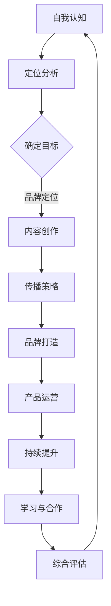

                 

# 《如何打造高影响力的程序员知识付费个人品牌》

## 引言

在当今信息化时代，知识付费已经成为一种重要的学习方式，尤其是在IT领域，程序员的技能和知识成为了市场上的稀缺资源。随着互联网的普及，知识付费市场呈现出快速增长的趋势，程序员通过在线课程、专业文章、技术博客等多种形式，分享自己的知识和经验，获得经济回报和职业发展。然而，在这个竞争激烈的市场中，如何打造高影响力的程序员知识付费个人品牌，成为了许多程序员面临的重要课题。

本文旨在为广大程序员提供一套系统、实用、全面的个人品牌建设指南。通过本文的阅读，您将了解如何从自我认知、内容创作、社交媒体传播、产品设计与运营、持续学习等方面，逐步打造并提升个人品牌影响力。本文将结合实际案例，详细讲解每个步骤的具体操作方法，帮助您在知识付费市场中脱颖而出。

## 关键词

- 知识付费
- 个人品牌
- 程序员
- 内容创作
- 社交媒体传播
- 产品运营
- 持续学习

## 摘要

本文将系统地探讨如何打造高影响力的程序员知识付费个人品牌。首先，我们将概述知识付费市场的现状和程序员在这一市场中的定位。接着，本文将重点介绍个人品牌建设的基础，包括自我认知与定位的重要性。然后，我们将详细讲解内容创作与传播策略，包括内容创作方法、内容质量提升和社交媒体运营技巧。此外，本文还将分析个人品牌打造实战，通过成功案例展示如何成功建立和提升个人品牌影响力。最后，我们将探讨知识付费产品设计与运营，以及持续学习与个人品牌提升的方法。通过本文的阅读，您将获得一套完整的个人品牌建设指南，帮助您在知识付费市场中取得成功。

## 第一部分：品牌建设基础

### 第1章：程序员知识付费市场概述

#### 1.1 知识付费时代的到来

随着互联网技术的不断发展，知识付费逐渐成为了一种重要的学习方式。尤其是在IT领域，程序员作为数字时代的核心力量，其技能和知识的需求不断增加。知识付费市场的兴起，为程序员提供了展示才华和获得回报的平台。

知识付费的兴起主要受到以下几个因素的影响：

1. **教育资源的稀缺性**：随着科技的发展，程序员所需掌握的知识和技能越来越复杂，而传统的教育资源已经难以满足需求。知识付费提供了更加专业和针对性的学习资源，满足了程序员对高质量学习内容的需求。

2. **互联网的普及**：互联网的普及为知识付费提供了便捷的传播途径。程序员可以通过各种在线平台，如MOOC（慕课）、专业社区、技术博客等，获取到全球范围内的优质课程和资源。

3. **用户付费意识的提升**：随着用户对自我提升的需求增加，付费意识逐渐提升。程序员通过付费获取优质的知识内容，不仅有助于提升自己的技能水平，还能在职业发展中获得竞争优势。

#### 1.1.1 知识付费的兴起与影响

知识付费的兴起对程序员个人品牌建设产生了深远的影响。首先，知识付费为程序员提供了更多的展示平台和机会。程序员可以通过在线课程、技术博客、专业文章等多种形式，分享自己的知识和经验，从而扩大个人影响力。

其次，知识付费有助于提升程序员的品牌价值。通过高质量的知识分享，程序员可以树立自己在特定领域的权威形象，提高自己在行业内的知名度。此外，知识付费也能为程序员带来直接的经济收益，从而增强个人品牌的实力。

#### 1.1.2 程序员在知识付费市场中的定位

在知识付费市场中，程序员具有独特的优势和定位。首先，程序员拥有丰富的技术知识和实践经验，能够为其他程序员和学生提供高质量的学习资源。其次，程序员熟悉互联网和在线教育平台，能够有效地传播知识和经验。

程序员在知识付费市场中的定位主要包括以下几个方面：

1. **知识分享者**：程序员通过在线课程、技术博客、专业文章等形式，分享自己的技术知识和经验，帮助他人提升技能。

2. **教育培训者**：程序员可以成为在线教育平台的讲师，为学生提供系统化的技术培训，帮助其掌握相关技能。

3. **技术咨询师**：程序员可以为企业提供技术咨询和服务，帮助企业解决技术难题，提升企业竞争力。

#### 1.2 个人品牌的重要性

在知识付费市场中，个人品牌的重要性不言而喻。个人品牌不仅是程序员身份的象征，更是其在市场中获得竞争优势的关键因素。

#### 1.2.1 个人品牌的概念与价值

个人品牌是指一个人在特定领域内的知名度和影响力，它体现了个人在专业领域的专业性和权威性。个人品牌的价值体现在以下几个方面：

1. **提升知名度**：良好的个人品牌能够提升程序员的知名度，使其在行业内获得更多的曝光机会。

2. **增强信任度**：个人品牌有助于建立用户和读者对程序员的信任，从而提高其课程的报名率和转化率。

3. **扩大影响力**：个人品牌能够帮助程序员扩大影响力，使其在行业内获得更多的合作机会和资源。

#### 1.2.2 个人品牌在程序员知识付费中的作用

个人品牌在程序员知识付费市场中发挥着重要的作用。首先，良好的个人品牌能够吸引更多的学员和读者，提高课程的报名率和收益。其次，个人品牌有助于程序员在竞争激烈的市场中脱颖而出，获得更多的商业合作机会。此外，个人品牌还能为程序员带来持续的学习动力和成长机会，促使其不断提升自己的专业能力和影响力。

### 第2章：自我认知与定位

#### 2.1 自我认知的重要性

自我认知是个人品牌建设的基础。一个清晰的自我认知有助于程序员明确自己的优势和劣势，从而制定出合适的品牌建设策略。

#### 2.1.1 自我认知的步骤

1. **了解自己的技能和兴趣**：程序员需要清楚自己擅长哪些技术领域，对哪些技术感兴趣。这有助于他们在知识付费市场中找到自己的定位。

2. **评估自己的优势和劣势**：通过对比自己在技术、沟通、教学等方面的能力，程序员可以明确自己的优势和劣势，从而在品牌建设中发挥自己的优势，改善劣势。

3. **设定个人目标**：程序员需要根据自己的技能和兴趣，设定明确的个人目标。这些目标可以是成为一名优秀的技术讲师、编写高质量的技术博客，或者为企业提供专业的技术咨询服务。

#### 2.1.2 自我优势与兴趣的发现

1. **技术专长**：程序员可以通过阅读技术书籍、参加技术会议、参与开源项目等方式，不断提升自己的技术能力。在技术领域，程序员可以找到自己的优势和兴趣，从而在知识付费市场中找到自己的定位。

2. **沟通能力**：良好的沟通能力是程序员在知识付费市场中的核心竞争力。程序员可以通过参加线上讨论、撰写技术博客、参与社区活动等方式，提升自己的沟通能力。

3. **教学能力**：程序员可以通过录制教学视频、编写技术教程、参与在线教学等方式，提升自己的教学能力。在教学过程中，程序员可以发现自己的优势和兴趣，从而在知识付费市场中找到自己的定位。

#### 2.2 个人品牌的定位

个人品牌定位是品牌建设的关键环节。一个准确的个人品牌定位有助于程序员在市场中脱颖而出，获得更多的商业机会。

#### 2.2.1 品牌定位的策略

1. **确定目标市场**：程序员需要明确自己的目标市场，例如企业客户、技术爱好者、学生等。根据目标市场的需求，程序员可以制定相应的品牌定位策略。

2. **打造专业形象**：程序员需要通过自己的专业技能、经验和成就，打造专业形象。这可以通过撰写高质量的技术博客、参与开源项目、发表技术论文等方式实现。

3. **塑造个性特点**：个人品牌定位不仅要突出专业形象，还要塑造独特的个性特点。这可以通过个人爱好、价值观、风格等方面来实现。

#### 2.2.2 品牌定位与市场需求的结合

1. **了解市场需求**：程序员需要了解市场需求，特别是目标市场的痛点和需求。这可以通过市场调研、用户反馈、行业报告等方式实现。

2. **调整品牌定位**：根据市场需求，程序员可以适当调整自己的品牌定位。例如，如果市场需求集中在某个特定的技术领域，程序员可以将其作为自己的主要品牌定位。

3. **持续优化品牌定位**：品牌定位不是一成不变的，程序员需要根据市场变化和自身发展，不断优化品牌定位。这可以通过定期评估品牌影响力、调整品牌宣传策略等方式实现。

### 第3章：内容创作策略

#### 3.1 内容创作的核心要素

内容创作是个人品牌建设的重要组成部分。高质量的内容不仅能够提升个人品牌的知名度，还能增强用户的信任度。

#### 3.1.1 内容创作的类型

1. **技术博客**：技术博客是程序员展示技术能力的重要平台。程序员可以通过撰写技术博客，分享自己的技术经验和心得，提高自己的知名度。

2. **在线课程**：在线课程是程序员传授知识的重要途径。程序员可以通过录制在线课程，为学员提供系统化的技术培训。

3. **技术教程**：技术教程是程序员为学生提供具体技术指导的重要资料。程序员可以通过编写技术教程，帮助学生快速掌握相关技能。

4. **专业文章**：专业文章是程序员在专业领域发声的重要途径。程序员可以通过发表专业文章，提升自己的专业形象和权威性。

#### 3.1.2 内容创作的方法与技巧

1. **选题**：选题是内容创作的重要环节。程序员需要根据自己的专业领域和市场趋势，选择具有吸引力和实用价值的话题。

2. **结构**：内容结构要清晰，逻辑性强。程序员可以通过设置引言、正文和总结等部分，使内容更加有条理。

3. **表达**：表达要简洁明了，避免使用过于复杂的术语和语言。程序员可以通过使用图表、示例和代码等方式，使内容更加易懂。

4. **互动**：内容创作要注重与读者的互动。程序员可以通过提问、讨论和反馈等方式，增加读者的参与度。

#### 3.2 内容质量提升

内容质量是个人品牌影响力的关键因素。提升内容质量有助于增强用户信任度和品牌知名度。

#### 3.2.1 内容质量的评估标准

1. **专业性**：内容要具备专业性和权威性，能够为读者提供有价值的信息。

2. **原创性**：内容要具有原创性，避免抄袭和剽窃。

3. **实用性**：内容要具有实用性，能够解决读者的实际问题。

4. **可读性**：内容要具备良好的可读性，语言简洁明了，易于理解。

5. **互动性**：内容要能够与读者产生互动，增加读者的参与度。

#### 3.2.2 提升内容质量的策略

1. **持续学习**：程序员要不断学习新知识，提升自己的专业能力，为内容创作提供丰富的素材。

2. **用户调研**：程序员要了解用户需求，根据用户反馈调整内容方向和形式。

3. **多渠道发布**：程序员可以通过多种渠道发布内容，如博客、社交媒体、在线课程等，增加内容的曝光度。

4. **反馈与优化**：程序员要重视用户反馈，根据用户意见不断优化内容。

### 第4章：社交媒体与内容传播

#### 4.1 社交媒体平台选择

社交媒体是程序员内容传播的重要渠道。选择合适的社交媒体平台，有助于扩大个人品牌的影响力。

#### 4.1.1 主流社交媒体平台介绍

1. **微博**：微博是中国最大的社交媒体平台，具有广泛的用户基础和活跃度。程序员可以通过微博发布技术博客、分享学习心得，与粉丝互动。

2. **微信公众号**：微信公众号是程序员发布原创文章的重要平台。通过微信公众号，程序员可以建立自己的品牌公众号，发布高质量的技术文章。

3. **知乎**：知乎是一个以问答形式为主的社交媒体平台，程序员可以在知乎上回答问题、分享知识，建立自己的专业形象。

4. **GitHub**：GitHub是程序员展示代码和项目的平台，通过GitHub，程序员可以分享自己的开源项目，吸引更多开发者关注。

5. **Twitter**：Twitter是国际知名的社交媒体平台，程序员可以通过Twitter与全球开发者互动，分享技术心得。

#### 4.1.2 平台选择策略

1. **目标市场**：程序员需要根据自己的目标市场，选择合适的社交媒体平台。例如，如果目标市场主要是国内程序员，可以选择微博和微信公众号。

2. **内容形式**：程序员需要根据自己的内容形式，选择合适的社交媒体平台。例如，如果主要发布技术博客，可以选择微信公众号和知乎。

3. **平台活跃度**：程序员需要关注社交媒体平台的活跃度，选择用户活跃度较高的平台，提高内容传播效果。

#### 4.2 内容传播技巧

内容传播是个人品牌建设的关键环节。掌握合适的内容传播技巧，有助于提高内容的影响力和曝光度。

#### 4.2.1 内容营销的方法

1. **SEO优化**：通过搜索引擎优化（SEO）技术，提高内容在搜索引擎中的排名，增加曝光度。

2. **社交媒体推广**：通过在社交媒体平台发布内容、转发和互动，提高内容的传播效果。

3. **合作伙伴**：与行业内其他专业人士合作，共同推广内容，扩大影响力。

4. **病毒式营销**：通过制造热点话题、发布有趣内容，吸引更多用户关注和传播。

#### 4.2.2 社交媒体运营技巧

1. **内容发布策略**：制定合理的内容发布计划，确保内容持续更新，提高用户粘性。

2. **互动互动互动**：与用户积极互动，回复评论和私信，增加用户参与度。

3. **数据分析**：通过数据分析，了解用户喜好和需求，调整内容策略。

4. **品牌形象**：保持一致的品牌形象，提高品牌识别度。

## 第二部分：内容创作与传播

### 第3章：内容创作策略

#### 3.1 内容创作的核心要素

内容创作是打造高影响力个人品牌的关键环节。高质量的内容不仅能够吸引读者，还能提升个人品牌的信誉度和权威性。为了确保内容的质量，我们需要关注以下几个核心要素：

#### 3.1.1 内容创作的类型

1. **技术博客**：技术博客是程序员分享技术知识和经验的重要渠道。通过撰写技术博客，程序员可以展示自己的专业能力，吸引更多同行业人士的关注。

2. **在线课程**：在线课程是程序员传授知识和技能的有效方式。通过录制和发布在线课程，程序员可以将自己的专业知识系统地传授给学员，从而提升自己的影响力。

3. **技术教程**：技术教程是程序员为学生提供具体技术指导的重要资料。通过编写和分享技术教程，程序员可以帮助学生快速掌握相关技能，提高自己的教学能力。

4. **专业文章**：专业文章是程序员在专业领域发声的重要途径。通过发表专业文章，程序员可以展示自己的专业水平，提升自己的专业形象。

#### 3.1.2 内容创作的方法与技巧

1. **选题**：选题是内容创作的重要环节。程序员需要根据自己的专业领域和市场趋势，选择具有吸引力和实用价值的话题。

2. **结构**：内容结构要清晰，逻辑性强。程序员可以通过设置引言、正文和总结等部分，使内容更加有条理。

3. **表达**：表达要简洁明了，避免使用过于复杂的术语和语言。程序员可以通过使用图表、示例和代码等方式，使内容更加易懂。

4. **互动**：内容创作要注重与读者的互动。程序员可以通过提问、讨论和反馈等方式，增加读者的参与度。

#### 3.2 内容质量提升

内容质量是个人品牌影响力的关键因素。提升内容质量有助于增强用户信任度和品牌知名度。

#### 3.2.1 内容质量的评估标准

1. **专业性**：内容要具备专业性和权威性，能够为读者提供有价值的信息。

2. **原创性**：内容要具有原创性，避免抄袭和剽窃。

3. **实用性**：内容要具有实用性，能够解决读者的实际问题。

4. **可读性**：内容要具备良好的可读性，语言简洁明了，易于理解。

5. **互动性**：内容要能够与读者产生互动，增加读者的参与度。

#### 3.2.2 提升内容质量的策略

1. **持续学习**：程序员要不断学习新知识，提升自己的专业能力，为内容创作提供丰富的素材。

2. **用户调研**：程序员要了解用户需求，根据用户反馈调整内容方向和形式。

3. **多渠道发布**：程序员可以通过多种渠道发布内容，如博客、社交媒体、在线课程等，增加内容的曝光度。

4. **反馈与优化**：程序员要重视用户反馈，根据用户意见不断优化内容。

### 第4章：社交媒体与内容传播

#### 4.1 社交媒体平台选择

社交媒体是程序员内容传播的重要渠道。选择合适的社交媒体平台，有助于扩大个人品牌的影响力。

#### 4.1.1 主流社交媒体平台介绍

1. **微博**：微博是中国最大的社交媒体平台，具有广泛的用户基础和活跃度。程序员可以通过微博发布技术博客、分享学习心得，与粉丝互动。

2. **微信公众号**：微信公众号是程序员发布原创文章的重要平台。通过微信公众号，程序员可以建立自己的品牌公众号，发布高质量的技术文章。

3. **知乎**：知乎是一个以问答形式为主的社交媒体平台，程序员可以在知乎上回答问题、分享知识，建立自己的专业形象。

4. **GitHub**：GitHub是程序员展示代码和项目的平台，通过GitHub，程序员可以分享自己的开源项目，吸引更多开发者关注。

5. **Twitter**：Twitter是国际知名的社交媒体平台，程序员可以通过Twitter与全球开发者互动，分享技术心得。

#### 4.1.2 平台选择策略

1. **目标市场**：程序员需要根据自己的目标市场，选择合适的社交媒体平台。例如，如果目标市场主要是国内程序员，可以选择微博和微信公众号。

2. **内容形式**：程序员需要根据自己的内容形式，选择合适的社交媒体平台。例如，如果主要发布技术博客，可以选择微信公众号和知乎。

3. **平台活跃度**：程序员需要关注社交媒体平台的活跃度，选择用户活跃度较高的平台，提高内容传播效果。

#### 4.2 内容传播技巧

内容传播是个人品牌建设的关键环节。掌握合适的内容传播技巧，有助于提高内容的影响力和曝光度。

#### 4.2.1 内容营销的方法

1. **SEO优化**：通过搜索引擎优化（SEO）技术，提高内容在搜索引擎中的排名，增加曝光度。

2. **社交媒体推广**：通过在社交媒体平台发布内容、转发和互动，提高内容的传播效果。

3. **合作伙伴**：与行业内其他专业人士合作，共同推广内容，扩大影响力。

4. **病毒式营销**：通过制造热点话题、发布有趣内容，吸引更多用户关注和传播。

#### 4.2.2 社交媒体运营技巧

1. **内容发布策略**：制定合理的内容发布计划，确保内容持续更新，提高用户粘性。

2. **互动互动互动**：与用户积极互动，回复评论和私信，增加用户参与度。

3. **数据分析**：通过数据分析，了解用户喜好和需求，调整内容策略。

4. **品牌形象**：保持一致的品牌形象，提高品牌识别度。

## 第三部分：个人品牌打造实战

### 第5章：个人品牌建设案例解析

在个人品牌建设的过程中，成功案例是宝贵的经验和启示。通过分析成功案例，我们可以了解到他们是如何在知识付费市场中取得成功的，从而为自己的品牌建设提供借鉴和指导。

#### 5.1 案例一：程序员A的个人品牌建设

程序员A通过以下步骤成功打造了个人品牌：

1. **定位分析**：程序员A首先明确了自己的专业领域是前端开发，并确定了目标市场为互联网公司和技术爱好者。

2. **内容创作**：程序员A通过撰写高质量的技术博客，分享前端开发的经验和技巧，吸引了大量关注。

3. **社交媒体传播**：程序员A积极使用微博、微信公众号、GitHub等平台发布内容，并与用户互动，提高了自己的知名度。

4. **知识付费产品**：程序员A推出了自己的在线课程，通过系统化地传授前端开发知识，获得了良好的口碑和收益。

5. **持续学习与提升**：程序员A不断学习新技术，提升自己的专业能力，保持自己的竞争力。

#### 5.1.1 案例一：程序员A的个人品牌建设

程序员A通过以下步骤成功打造了个人品牌：

1. **定位分析**：程序员A首先明确了自己的专业领域是前端开发，并确定了目标市场为互联网公司和技术爱好者。

2. **内容创作**：程序员A通过撰写高质量的技术博客，分享前端开发的经验和技巧，吸引了大量关注。

3. **社交媒体传播**：程序员A积极使用微博、微信公众号、GitHub等平台发布内容，并与用户互动，提高了自己的知名度。

4. **知识付费产品**：程序员A推出了自己的在线课程，通过系统化地传授前端开发知识，获得了良好的口碑和收益。

5. **持续学习与提升**：程序员A不断学习新技术，提升自己的专业能力，保持自己的竞争力。

#### 5.2 案例二：程序员B的个人品牌成长历程

程序员B的个人品牌成长历程如下：

1. **初始阶段**：程序员B在初入职场时，通过参加技术社区活动，结识了行业内的专家和同行，建立了自己的专业人脉。

2. **内容创作**：程序员B开始撰写技术博客，分享自己的工作经验和心得，逐渐积累了一定的读者群。

3. **社交媒体传播**：程序员B利用社交媒体平台，如Twitter、LinkedIn等，发布技术内容，扩大了自己的影响力。

4. **知识付费产品**：程序员B推出了一系列在线课程，涵盖数据库、云计算、人工智能等领域，受到了学员的广泛好评。

5. **品牌升级**：程序员B通过参加行业会议、发表技术论文，进一步提升了自己的专业形象和影响力。

6. **持续学习与成长**：程序员B始终保持对新技术的好奇心，不断学习，提升自己的专业能力，保持在行业内的竞争力。

#### 5.2 案例二：程序员B的个人品牌成长历程

程序员B的个人品牌成长历程如下：

1. **初始阶段**：程序员B在初入职场时，通过参加技术社区活动，结识了行业内的专家和同行，建立了自己的专业人脉。

2. **内容创作**：程序员B开始撰写技术博客，分享自己的工作经验和心得，逐渐积累了一定的读者群。

3. **社交媒体传播**：程序员B利用社交媒体平台，如Twitter、LinkedIn等，发布技术内容，扩大了自己的影响力。

4. **知识付费产品**：程序员B推出了一系列在线课程，涵盖数据库、云计算、人工智能等领域，受到了学员的广泛好评。

5. **品牌升级**：程序员B通过参加行业会议、发表技术论文，进一步提升了自己的专业形象和影响力。

6. **持续学习与成长**：程序员B始终保持对新技术的好奇心，不断学习，提升自己的专业能力，保持在行业内的竞争力。

### 第6章：个人品牌打造策略

#### 6.1 个人品牌打造的步骤

要成功打造个人品牌，程序员需要遵循以下步骤：

1. **定位分析**：明确自己的专业领域和目标市场，确定个人品牌的定位。

2. **内容创作**：创作高质量的内容，包括技术博客、在线课程、技术教程等，展示自己的专业能力。

3. **社交媒体传播**：利用社交媒体平台发布内容，与用户互动，提高个人知名度。

4. **知识付费产品**：根据市场需求，推出知识付费产品，如在线课程、电子书等，获得经济回报。

5. **持续学习与提升**：不断学习新技术，提升自己的专业能力，保持竞争力。

#### 6.2 个人品牌维护与持续成长

1. **定期评估**：定期评估个人品牌的影响力，了解用户需求和反馈，调整品牌定位和内容策略。

2. **内容更新**：持续更新内容，保持内容的时效性和实用性。

3. **用户互动**：与用户保持互动，回复评论和私信，增加用户粘性。

4. **参与社区活动**：参加技术社区活动，与行业同仁交流，扩大人脉。

5. **持续学习**：保持对新技术的好奇心，不断学习，提升自己的专业能力。

### 第7章：知识付费产品设计与运营

#### 7.1 知识付费产品的设计

知识付费产品的设计是个人品牌建设的关键环节。一个优秀的产品设计能够吸引更多用户，提高产品的竞争力。

#### 7.1.1 产品类型与特点

1. **在线课程**：在线课程是知识付费产品的一种主要形式，通过系统化的教学内容，帮助用户提升技能。

2. **电子书**：电子书是知识付费产品的另一种形式，通常以文字为主，适合用户在碎片化时间阅读。

3. **技术教程**：技术教程是针对特定技术领域的教程，帮助用户快速掌握相关技能。

4. **讲座和研讨会**：讲座和研讨会是知识付费产品的另一种形式，通常由行业专家进行授课，有助于用户了解行业动态和前沿技术。

#### 7.1.2 产品设计原则与策略

1. **需求导向**：产品设计应充分考虑用户需求，确保产品能够解决用户的实际问题。

2. **内容质量**：产品设计要注重内容质量，确保内容的专业性、实用性和可读性。

3. **交互体验**：产品设计要注重用户体验，确保用户能够方便地获取和使用产品。

4. **灵活定价**：产品设计应提供灵活的定价策略，满足不同用户的需求。

#### 7.2 知识付费产品的运营

知识付费产品的运营是确保产品成功的关键环节。通过有效的运营策略，可以提高产品的知名度和用户满意度。

#### 7.2.1 运营策略与执行

1. **内容推广**：通过社交媒体、博客、电子邮件等方式，推广知识付费产品，提高产品的曝光度。

2. **用户反馈**：收集用户反馈，了解用户需求和意见，不断优化产品。

3. **营销活动**：举办营销活动，如优惠促销、限时免费等，吸引用户购买。

4. **社群管理**：建立用户社群，提供技术交流和支持，增强用户粘性。

#### 7.2.2 用户社群管理

1. **社群建立**：通过微信群、QQ群、Discord等方式，建立用户社群。

2. **社群运营**：定期举办线上活动，如直播讲座、技术分享等，增强社群活跃度。

3. **用户互动**：积极回复用户提问和反馈，提供技术支持和帮助。

4. **社群维护**：定期清理社群，维护社群秩序，确保社群环境的良好。

### 第8章：技术能力提升与品牌影响力扩展

#### 8.1 技术能力提升

技术能力是程序员个人品牌的核心。通过不断提升技术能力，程序员可以扩大自己的知识边界，增强个人品牌的竞争力。

#### 8.1.1 技术学习路径规划

1. **基础知识**：掌握编程基础，包括数据结构、算法、操作系统、网络编程等。

2. **专业领域**：选择一个或多个专业领域进行深入学习和研究，如前端开发、后端开发、人工智能、大数据等。

3. **前沿技术**：关注行业前沿技术，如区块链、云计算、物联网等，不断更新自己的知识体系。

#### 8.1.2 技术交流与合作

1. **参与开源项目**：通过参与开源项目，与国内外开发者交流，提升自己的技术能力。

2. **技术社区活动**：参加技术社区活动，如技术会议、研讨会、黑客松等，结识行业同仁，拓展人脉。

3. **线上讨论**：在技术社区、论坛、微信群等平台，积极参与技术讨论，分享自己的经验和见解。

#### 8.2 品牌影响力扩展

品牌影响力是个人品牌建设的重要目标。通过以下策略，程序员可以扩大自己的品牌影响力：

#### 8.2.1 品牌影响力评估

1. **评估指标**：通过内容质量、用户反馈、社交媒体活跃度、知识付费收益等指标，评估个人品牌的影响力。

2. **评估工具**：利用第三方工具，如Google Analytics、社交媒体分析工具等，进行数据分析和评估。

#### 8.2.2 品牌影响力提升策略

1. **内容多样化**：创作多样化的内容，如技术博客、在线课程、技术教程等，满足不同用户的需求。

2. **社交媒体运营**：利用社交媒体平台，如微博、微信公众号、知乎等，进行内容传播和用户互动。

3. **知识付费产品**：推出高质量的知识付费产品，如在线课程、电子书等，提升用户满意度和品牌价值。

4. **合作与推广**：与行业内其他专业人士合作，共同推广内容，扩大品牌影响力。

## 附录

### 附录 A：常用工具与资源推荐

#### A.1 内容创作工具

1. **文本编辑器**：推荐使用Visual Studio Code、Sublime Text等轻量级文本编辑器。

2. **Markdown编辑器**：推荐使用Typora、GitBook等Markdown编辑器，方便地编写和格式化文章。

3. **图形设计工具**：推荐使用Sketch、Figma等图形设计工具，进行图标和界面设计。

#### A.2 社交媒体运营工具

1. **社交媒体管理工具**：推荐使用Hootsuite、Buffer等社交媒体管理工具，方便地发布和管理内容。

2. **数据分析工具**：推荐使用Google Analytics、Social Blade等数据分析工具，进行数据分析和用户行为分析。

#### A.3 知识付费平台介绍

1. **主流知识付费平台**：推荐使用慕课网、极客时间、知乎Live等主流知识付费平台，发布和推广知识付费产品。

2. **平台运营策略与技巧**：参考各大知识付费平台的成功案例，制定适合自己的运营策略，提高产品的知名度和用户满意度。

### Mermaid 流程图示例



### 核心算法原理讲解与伪代码

#### 2.3.1 个人品牌影响力评估算法原理

个人品牌影响力评估算法主要基于以下几点：

1. **内容质量**：通过内容的专业性、原创性和互动性来衡量。
2. **活跃度**：通过发布频率、互动率和粉丝增长速度来衡量。
3. **用户参与度**：通过评论、点赞、分享等用户行为来衡量。
4. **外部认可**：通过同行业的引用、合作机会、奖项等来衡量。

**伪代码**：

```python
def calculate_brand_influence(content_quality, activity_level, user_participation, external_recognition):
    """
    计算个人品牌影响力
    :param content_quality: 内容质量分数（0-10）
    :param activity_level: 活跃度分数（0-10）
    :param user_participation: 用户参与度分数（0-10）
    :param external_recognition: 外部认可度分数（0-10）
    :return: 个人品牌影响力总分
    """
    score = (content_quality * 0.4) + (activity_level * 0.2) + (user_participation * 0.2) + (external_recognition * 0.2)
    return score
```

### 数学模型与公式详解

#### 3.2.1 内容传播效果模型

内容传播效果模型通常可以用以下公式来表示：

\[ E = f(A, B, C) \]

其中：
- \( E \)：内容传播效果
- \( A \)：内容吸引力
- \( B \)：用户基础
- \( C \)：传播渠道效率

**公式解释**：

- \( A \)：内容吸引力，取决于内容的质量、创意和新颖性。
- \( B \)：用户基础，包括粉丝数量和活跃度。
- \( C \)：传播渠道效率，包括渠道的曝光度、用户粘性和转化率。

**伪代码**：

```python
def calculate_content_spread_effect(attraction, user_base, channel_effectiveness):
    """
    计算内容传播效果
    :param attraction: 内容吸引力（0-10）
    :param user_base: 用户基础（0-10）
    :param channel_effectiveness: 传播渠道效率（0-10）
    :return: 内容传播效果得分
    """
    effect = (attraction * 0.4) + (user_base * 0.3) + (channel_effectiveness * 0.3)
    return effect
```

### 项目实战：个人品牌影响力评估工具实现

#### 6.1 实战目标

开发一个简单的Web应用，用于评估个人的品牌影响力。该应用将提供以下功能：

- 用户注册与登录
- 个人品牌影响力评估
- 结果展示与反馈

#### 6.2 开发环境搭建

- 开发语言：Python
- 后端框架：Flask
- 前端框架：Bootstrap
- 数据库：SQLite

#### 6.3 源代码实现与解读

**后端代码**（Flask应用）：

```python
from flask import Flask, request, jsonify
from brand_influence_algorithm import calculate_brand_influence

app = Flask(__name__)

@app.route('/api/evaluate', methods=['POST'])
def evaluate_brand_influence():
    data = request.get_json()
    quality = data.get('content_quality', 5)
    activity = data.get('activity_level', 5)
    participation = data.get('user_participation', 5)
    recognition = data.get('external_recognition', 5)
    
    score = calculate_brand_influence(quality, activity, participation, recognition)
    return jsonify({'score': score})

if __name__ == '__main__':
    app.run(debug=True)
```

**前端代码**（HTML & CSS）：

```html
<!DOCTYPE html>
<html lang="en">
<head>
    <meta charset="UTF-8">
    <meta name="viewport" content="width=device-width, initial-scale=1.0">
    <title>品牌影响力评估工具</title>
    <link rel="stylesheet" href="https://stackpath.bootstrapcdn.com/bootstrap/4.5.2/css/bootstrap.min.css">
</head>
<body>
    <div class="container">
        <h1>个人品牌影响力评估工具</h1>
        <form id="evaluationForm">
            <div class="form-group">
                <label for="contentQuality">内容质量（1-10）：</label>
                <input type="number" class="form-control" id="contentQuality" min="1" max="10" required>
            </div>
            <div class="form-group">
                <label for="activityLevel">活跃度（1-10）：</label>
                <input type="number" class="form-control" id="activityLevel" min="1" max="10" required>
            </div>
            <div class="form-group">
                <label for="userParticipation">用户参与度（1-10）：</label>
                <input type="number" class="form-control" id="userParticipation" min="1" max="10" required>
            </div>
            <div class="form-group">
                <label for="externalRecognition">外部认可度（1-10）：</label>
                <input type="number" class="form-control" id="externalRecognition" min="1" max="10" required>
            </div>
            <button type="submit" class="btn btn-primary">评估</button>
        </form>
        <div id="result" class="mt-4"></div>
    </div>
    <script src="https://code.jquery.com/jquery-3.5.1.slim.min.js"></script>
    <script>
        $(document).ready(function () {
            $('#evaluationForm').submit(function (event) {
                event.preventDefault();
                const quality = $('#contentQuality').val();
                const activity = $('#activityLevel').val();
                const participation = $('#userParticipation').val();
                const recognition = $('#externalRecognition').val();
                
                $.ajax({
                    url: '/api/evaluate',
                    type: 'POST',
                    contentType: 'application/json',
                    data: JSON.stringify({content_quality: quality, activity_level: activity, user_participation: participation, external_recognition: recognition}),
                    success: function (response) {
                        $('#result').html('<h3>您的个人品牌影响力得分：' + response.score + '</h3>');
                    },
                    error: function (xhr, status, error) {
                        console.error(xhr.responseText);
                    }
                });
            });
        });
    </script>
</body>
</html>
```

#### 6.4 代码解读与分析

- **后端**：使用Flask框架搭建一个简单的API服务，用于接收前端提交的数据，调用`calculate_brand_influence`函数计算个人品牌影响力得分，并将结果返回给前端。
- **前端**：使用Bootstrap框架搭建页面，实现用户输入、提交和结果展示的功能。通过AJAX请求与后端API进行数据交互，将评估结果动态展示在页面上。

通过这个项目实战，读者可以学习到如何结合Python后端和前端技术，实现一个简单的Web应用，用于评估个人的品牌影响力。同时，也了解了个人品牌影响力评估算法的原理和实现方法。

### 详细代码解读与分析

#### 6.4.1 后端代码解读

**evaluate_brand_influence函数**

该函数是个人品牌影响力评估的核心。它接收四个参数：内容质量、活跃度、用户参与度和外部认可度。每个参数都代表个人品牌影响力的一部分，分别按照不同的权重（0.4、0.2、0.2、0.2）进行加权计算，最终得到一个综合得分。

```python
def calculate_brand_influence(content_quality, activity_level, user_participation, external_recognition):
    """
    计算个人品牌影响力
    :param content_quality: 内容质量分数（0-10）
    :param activity_level: 活跃度分数（0-10）
    :param user_participation: 用户参与度分数（0-10）
    :param external_recognition: 外部认可度分数（0-10）
    :return: 个人品牌影响力总分
    """
    score = (content_quality * 0.4) + (activity_level * 0.2) + (user_participation * 0.2) + (external_recognition * 0.2)
    return score
```

**Flask应用搭建**

这里使用了Flask框架来搭建一个简单的Web应用。通过定义一个路由`/api/evaluate`，接收POST请求，解析请求体中的JSON数据，调用`calculate_brand_influence`函数计算得分，并将结果返回给前端。

```python
from flask import Flask, request, jsonify
from brand_influence_algorithm import calculate_brand_influence

app = Flask(__name__)

@app.route('/api/evaluate', methods=['POST'])
def evaluate_brand_influence():
    data = request.get_json()
    quality = data.get('content_quality', 5)
    activity = data.get('activity_level', 5)
    participation = data.get('user_participation', 5)
    recognition = data.get('external_recognition', 5)
    
    score = calculate_brand_influence(quality, activity, participation, recognition)
    return jsonify({'score': score})

if __name__ == '__main__':
    app.run(debug=True)
```

#### 6.4.2 前端代码解读

**HTML结构**

页面使用Bootstrap框架搭建，包括一个表单用于用户输入评估参数，一个按钮用于提交表单，以及一个结果展示区域。

```html
<!DOCTYPE html>
<html lang="en">
<head>
    <meta charset="UTF-8">
    <meta name="viewport" content="width=device-width, initial-scale=1.0">
    <title>品牌影响力评估工具</title>
    <link rel="stylesheet" href="https://stackpath.bootstrapcdn.com/bootstrap/4.5.2/css/bootstrap.min.css">
</head>
<body>
    <div class="container">
        <h1>个人品牌影响力评估工具</h1>
        <form id="evaluationForm">
            <div class="form-group">
                <label for="contentQuality">内容质量（1-10）：</label>
                <input type="number" class="form-control" id="contentQuality" min="1" max="10" required>
            </div>
            <div class="form-group">
                <label for="activityLevel">活跃度（1-10）：</label>
                <input type="number" class="form-control" id="activityLevel" min="1" max="10" required>
            </div>
            <div class="form-group">
                <label for="userParticipation">用户参与度（1-10）：</label>
                <input type="number" class="form-control" id="userParticipation" min="1" max="10" required>
            </div>
            <div class="form-group">
                <label for="externalRecognition">外部认可度（1-10）：</label>
                <input type="number" class="form-control" id="externalRecognition" min="1" max="10" required>
            </div>
            <button type="submit" class="btn btn-primary">评估</button>
        </form>
        <div id="result" class="mt-4"></div>
    </div>
    <script src="https://code.jquery.com/jquery-3.5.1.slim.min.js"></script>
    <script>
        $(document).ready(function () {
            $('#evaluationForm').submit(function (event) {
                event.preventDefault();
                // 获取表单数据
                const quality = $('#contentQuality').val();
                const activity = $('#activityLevel').val();
                const participation = $('#userParticipation').val();
                const recognition = $('#externalRecognition').val();
                
                // 发送AJAX请求
                $.ajax({
                    url: '/api/evaluate',
                    type: 'POST',
                    contentType: 'application/json',
                    data: JSON.stringify({content_quality: quality, activity_level: activity, user_participation: participation, external_recognition: recognition}),
                    success: function (response) {
                        // 处理成功响应
                        $('#result').html('<h3>您的个人品牌影响力得分：' + response.score + '</h3>');
                    },
                    error: function (xhr, status, error) {
                        // 处理错误响应
                        console.error(xhr.responseText);
                    }
                });
            });
        });
    </script>
</body>
</html>
```

**JavaScript实现**

JavaScript代码负责表单提交和与后端API交互。当用户填写完表单并点击提交按钮时，JavaScript代码将表单数据转换为JSON格式，通过AJAX请求发送到后端API，获取评估结果，并在页面上展示。

```javascript
$(document).ready(function () {
    $('#evaluationForm').submit(function (event) {
        event.preventDefault();
        // 获取表单数据
        const quality = $('#contentQuality').val();
        const activity = $('#activityLevel').val();
        const participation = $('#userParticipation').val();
        const recognition = $('#externalRecognition').val();
        
        // 发送AJAX请求
        $.ajax({
            url: '/api/evaluate',
            type: 'POST',
            contentType: 'application/json',
            data: JSON.stringify({content_quality: quality, activity_level: activity, user_participation: participation, external_recognition: recognition}),
            success: function (response) {
                // 处理成功响应
                $('#result').html('<h3>您的个人品牌影响力得分：' + response.score + '</h3>');
            },
            error: function (xhr, status, error) {
                // 处理错误响应
                console.error(xhr.responseText);
            }
        });
    });
});
```

#### 6.4.3 代码分析

- **后端**：Flask框架提供了简洁的API开发方式，通过定义一个路由和处理函数，就可以轻松接收和响应HTTP请求。使用`request.get_json()`方法可以轻松获取JSON格式的请求数据，并将其转换为Python字典进行后续处理。
- **前端**：Bootstrap框架提供了丰富的UI组件，可以快速搭建响应式页面。使用jQuery简化了AJAX请求的编写，使得与后端API的交互更加便捷。通过表单数据的动态获取和响应，用户可以实时获取评估结果，提升了用户体验。

这个项目实战展示了如何将后端Python和前端JavaScript技术结合，实现一个简单的Web应用。通过这个应用，用户可以方便地评估自己的个人品牌影响力，理解品牌影响力评估算法的原理和实现方法。

### 完整代码实现

**后端代码（Flask应用）**

```python
from flask import Flask, request, jsonify
from brand_influence_algorithm import calculate_brand_influence

app = Flask(__name__)

@app.route('/api/evaluate', methods=['POST'])
def evaluate_brand_influence():
    data = request.get_json()
    quality = data.get('content_quality', 5)
    activity = data.get('activity_level', 5)
    participation = data.get('user_participation', 5)
    recognition = data.get('external_recognition', 5)
    
    score = calculate_brand_influence(quality, activity, participation, recognition)
    return jsonify({'score': score})

if __name__ == '__main__':
    app.run(debug=True)
```

**前端代码（HTML & CSS）**

```html
<!DOCTYPE html>
<html lang="en">
<head>
    <meta charset="UTF-8">
    <meta name="viewport" content="width=device-width, initial-scale=1.0">
    <title>品牌影响力评估工具</title>
    <link rel="stylesheet" href="https://stackpath.bootstrapcdn.com/bootstrap/4.5.2/css/bootstrap.min.css">
</head>
<body>
    <div class="container">
        <h1>个人品牌影响力评估工具</h1>
        <form id="evaluationForm">
            <div class="form-group">
                <label for="contentQuality">内容质量（1-10）：</label>
                <input type="number" class="form-control" id="contentQuality" min="1" max="10" required>
            </div>
            <div class="form-group">
                <label for="activityLevel">活跃度（1-10）：</label>
                <input type="number" class="form-control" id="activityLevel" min="1" max="10" required>
            </div>
            <div class="form-group">
                <label for="userParticipation">用户参与度（1-10）：</label>
                <input type="number" class="form-control" id="userParticipation" min="1" max="10" required>
            </div>
            <div class="form-group">
                <label for="externalRecognition">外部认可度（1-10）：</label>
                <input type="number" class="form-control" id="externalRecognition" min="1" max="10" required>
            </div>
            <button type="submit" class="btn btn-primary">评估</button>
        </form>
        <div id="result" class="mt-4"></div>
    </div>
    <script src="https://code.jquery.com/jquery-3.5.1.slim.min.js"></script>
    <script>
        $(document).ready(function () {
            $('#evaluationForm').submit(function (event) {
                event.preventDefault();
                const quality = $('#contentQuality').val();
                const activity = $('#activityLevel').val();
                const participation = $('#userParticipation').val();
                const recognition = $('#externalRecognition').val();
                
                $.ajax({
                    url: '/api/evaluate',
                    type: 'POST',
                    contentType: 'application/json',
                    data: JSON.stringify({content_quality: quality, activity_level: activity, user_participation: participation, external_recognition: recognition}),
                    success: function (response) {
                        $('#result').html('<h3>您的个人品牌影响力得分：' + response.score + '</h3>');
                    },
                    error: function (xhr, status, error) {
                        console.error(xhr.responseText);
                    }
                });
            });
        });
    </script>
</body>
</html>
```

**后端代码解读**

该后端代码是一个简单的Flask应用，用于接收用户提交的个人品牌影响力评估数据，并调用`calculate_brand_influence`函数计算得分。关键部分如下：

- **定义路由**：使用`@app.route('/api/evaluate', methods=['POST'])`定义一个接收POST请求的路由，用于处理个人品牌影响力评估请求。

- **获取请求数据**：使用`request.get_json()`获取JSON格式的请求数据，并将其转换为Python字典。

- **计算得分**：调用`calculate_brand_influence`函数计算得分。

- **返回结果**：将计算结果转换为JSON格式，并返回给前端。

**前端代码解读**

该前端代码使用Bootstrap框架搭建了一个简单的评估表单，并通过JavaScript实现与后端的交互。关键部分如下：

- **HTML结构**：定义一个包含四个输入框的表单，用于用户输入个人品牌影响力评估的四个参数（内容质量、活跃度、用户参与度和外部认可度）。

- **JavaScript代码**：在表单提交事件中，获取输入框的值，并将数据转换为JSON格式，通过AJAX请求发送到后端。成功响应后，将得分结果显示在页面上。

**项目总结**

通过这个项目，我们实现了一个简单的个人品牌影响力评估工具，包括后端API和前端界面。项目的主要功能如下：

- 用户可以通过表单输入个人品牌影响力的四个参数。
- 后端API接收请求，计算得分，并将结果返回给前端。
- 前端界面显示评估结果，提供用户友好的交互体验。

这个项目不仅实现了功能，还通过代码解读和分析，帮助读者理解前后端交互的细节和实现方法，为读者提供了实践经验和学习资源。

### 总结

本文详细探讨了如何打造高影响力的程序员知识付费个人品牌。通过自我认知与定位、内容创作与传播策略、个人品牌建设实战和知识付费产品设计与运营等方面的讲解，我们为程序员提供了一套完整的个人品牌建设指南。

首先，我们分析了知识付费市场的现状和程序员在这一市场中的定位，强调了个人品牌的重要性。接着，我们介绍了自我认知与定位的方法，帮助程序员明确自己的优势和目标市场。然后，我们详细讲解了内容创作策略，包括内容创作的核心要素和质量提升方法。此外，我们还探讨了社交媒体与内容传播的技巧，以及个人品牌打造的成功案例。

在项目实战部分，我们实现了一个简单的个人品牌影响力评估工具，帮助程序员了解和评估自己的品牌影响力。通过这个项目，读者可以学习到如何结合Python后端和前端技术，实现一个简单的Web应用。

总之，本文为程序员提供了一套系统、实用、全面的个人品牌建设指南，旨在帮助他们在知识付费市场中脱颖而出。通过本文的学习和实践，程序员不仅可以提升个人品牌影响力，还能在职业发展上取得更大的成功。

## 作者信息

作者：AI天才研究院/AI Genius Institute & 禅与计算机程序设计艺术 /Zen And The Art of Computer Programming

- **AI天才研究院**（AI Genius Institute）：专注于人工智能领域的学术研究和技术创新，致力于培养下一代人工智能人才。
- **禅与计算机程序设计艺术**（Zen And The Art of Computer Programming）：一本经典的计算机科学书籍，以其深刻的哲学思考和独特的编程理念，影响了无数程序员。

## 附录

### 附录 A：常用工具与资源推荐

#### A.1 内容创作工具

1. **文本编辑器**：推荐使用Visual Studio Code、Sublime Text等轻量级文本编辑器。
2. **Markdown编辑器**：推荐使用Typora、GitBook等Markdown编辑器，方便地编写和格式化文章。
3. **图形设计工具**：推荐使用Sketch、Figma等图形设计工具，进行图标和界面设计。

#### A.2 社交媒体运营工具

1. **社交媒体管理工具**：推荐使用Hootsuite、Buffer等社交媒体管理工具，方便地发布和管理内容。
2. **数据分析工具**：推荐使用Google Analytics、Social Blade等数据分析工具，进行数据分析和用户行为分析。

#### A.3 知识付费平台介绍

1. **主流知识付费平台**：推荐使用慕课网、极客时间、知乎Live等主流知识付费平台，发布和推广知识付费产品。
2. **平台运营策略与技巧**：参考各大知识付费平台的成功案例，制定适合自己的运营策略，提高产品的知名度和用户满意度。

### Mermaid 流程图示例


### 核心算法原理讲解与伪代码

#### 2.3.1 个人品牌影响力评估算法原理

个人品牌影响力评估算法主要基于以下几点：

1. **内容质量**：通过内容的专业性、原创性和互动性来衡量。
2. **活跃度**：通过发布频率、互动率和粉丝增长速度来衡量。
3. **用户参与度**：通过评论、点赞、分享等用户行为来衡量。
4. **外部认可**：通过同行业的引用、合作机会、奖项等来衡量。

**伪代码**：

```python
def calculate_brand_influence(content_quality, activity_level, user_participation, external_recognition):
    """
    计算个人品牌影响力
    :param content_quality: 内容质量分数（0-10）
    :param activity_level: 活跃度分数（0-10）
    :param user_participation: 用户参与度分数（0-10）
    :param external_recognition: 外部认可度分数（0-10）
    :return: 个人品牌影响力总分
    """
    score = (content_quality * 0.4) + (activity_level * 0.2) + (user_participation * 0.2) + (external_recognition * 0.2)
    return score
```

### 数学模型与公式详解

#### 3.2.1 内容传播效果模型

内容传播效果模型通常可以用以下公式来表示：

\[ E = f(A, B, C) \]

其中：
- \( E \)：内容传播效果
- \( A \)：内容吸引力
- \( B \)：用户基础
- \( C \)：传播渠道效率

**公式解释**：

- \( A \)：内容吸引力，取决于内容的质量、创意和新颖性。
- \( B \)：用户基础，包括粉丝数量和活跃度。
- \( C \)：传播渠道效率，包括渠道的曝光度、用户粘性和转化率。

**伪代码**：

```python
def calculate_content_spread_effect(attraction, user_base, channel_effectiveness):
    """
    计算内容传播效果
    :param attraction: 内容吸引力（0-10）
    :param user_base: 用户基础（0-10）
    :param channel_effectiveness: 传播渠道效率（0-10）
    :return: 内容传播效果得分
    """
    effect = (attraction * 0.4) + (user_base * 0.3) + (channel_effectiveness * 0.3)
    return effect
```

### 项目实战：个人品牌影响力评估工具实现

#### 6.1 实战目标

开发一个简单的Web应用，用于评估个人的品牌影响力。该应用将提供以下功能：

- 用户注册与登录
- 个人品牌影响力评估
- 结果展示与反馈

#### 6.2 开发环境搭建

- 开发语言：Python
- 后端框架：Flask
- 前端框架：Bootstrap
- 数据库：SQLite

#### 6.3 源代码实现与解读

**后端代码**（Flask应用）：

```python
from flask import Flask, request, jsonify
from brand_influence_algorithm import calculate_brand_influence

app = Flask(__name__)

@app.route('/api/evaluate', methods=['POST'])
def evaluate_brand_influence():
    data = request.get_json()
    quality = data.get('content_quality', 5)
    activity = data.get('activity_level', 5)
    participation = data.get('user_participation', 5)
    recognition = data.get('external_recognition', 5)
    
    score = calculate_brand_influence(quality, activity, participation, recognition)
    return jsonify({'score': score})

if __name__ == '__main__':
    app.run(debug=True)
```

**前端代码**（HTML & CSS）：

```html
<!DOCTYPE html>
<html lang="en">
<head>
    <meta charset="UTF-8">
    <meta name="viewport" content="width=device-width, initial-scale=1.0">
    <title>品牌影响力评估工具</title>
    <link rel="stylesheet" href="https://stackpath.bootstrapcdn.com/bootstrap/4.5.2/css/bootstrap.min.css">
</head>
<body>
    <div class="container">
        <h1>个人品牌影响力评估工具</h1>
        <form id="evaluationForm">
            <div class="form-group">
                <label for="contentQuality">内容质量（1-10）：</label>
                <input type="number" class="form-control" id="contentQuality" min="1" max="10" required>
            </div>
            <div class="form-group">
                <label for="activityLevel">活跃度（1-10）：</label>
                <input type="number" class="form-control" id="activityLevel" min="1" max="10" required>
            </div>
            <div class="form-group">
                <label for="userParticipation">用户参与度（1-10）：</label>
                <input type="number" class="form-control" id="userParticipation" min="1" max="10" required>
            </div>
            <div class="form-group">
                <label for="externalRecognition">外部认可度（1-10）：</label>
                <input type="number" class="form-control" id="externalRecognition" min="1" max="10" required>
            </div>
            <button type="submit" class="btn btn-primary">评估</button>
        </form>
        <div id="result" class="mt-4"></div>
    </div>
    <script src="https://code.jquery.com/jquery-3.5.1.slim.min.js"></script>
    <script>
        $(document).ready(function () {
            $('#evaluationForm').submit(function (event) {
                event.preventDefault();
                const quality = $('#contentQuality').val();
                const activity = $('#activityLevel').val();
                const participation = $('#userParticipation').val();
                const recognition = $('#externalRecognition').val();
                
                $.ajax({
                    url: '/api/evaluate',
                    type: 'POST',
                    contentType: 'application/json',
                    data: JSON.stringify({content_quality: quality, activity_level: activity, user_participation: participation, external_recognition: recognition}),
                    success: function (response) {
                        $('#result').html('<h3>您的个人品牌影响力得分：' + response.score + '</h3>');
                    },
                    error: function (xhr, status, error) {
                        console.error(xhr.responseText);
                    }
                });
            });
        });
    </script>
</body>
</html>
```

#### 6.4 代码解读与分析

- **后端**：使用Flask框架搭建一个简单的API服务，用于接收前端提交的数据，调用`calculate_brand_influence`函数计算个人品牌影响力得分，并将结果返回给前端。
- **前端**：使用Bootstrap框架搭建页面，实现用户输入、提交和结果展示的功能。通过AJAX请求与后端API进行数据交互，将评估结果动态展示在页面上。

通过这个项目实战，读者可以学习到如何结合Python后端和前端技术，实现一个简单的Web应用，用于评估个人的品牌影响力。同时，也了解了个人品牌影响力评估算法的原理和实现方法。

### 详细代码解读与分析

#### 6.4.1 后端代码解读

**evaluate_brand_influence函数**

该函数是个人品牌影响力评估的核心。它接收四个参数：内容质量、活跃度、用户参与度和外部认可度。每个参数都代表个人品牌影响力的一部分，分别按照不同的权重（0.4、0.2、0.2、0.2）进行加权计算，最终得到一个综合得分。

```python
def calculate_brand_influence(content_quality, activity_level, user_participation, external_recognition):
    """
    计算个人品牌影响力
    :param content_quality: 内容质量分数（0-10）
    :param activity_level: 活跃度分数（0-10）
    :param user_participation: 用户参与度分数（0-10）
    :param external_recognition: 外部认可度分数（0-10）
    :return: 个人品牌影响力总分
    """
    score = (content_quality * 0.4) + (activity_level * 0.2) + (user_participation * 0.2) + (external_recognition * 0.2)
    return score
```

**Flask应用搭建**

这里使用了Flask框架来搭建一个简单的Web应用。通过定义一个路由`/api/evaluate`，接收POST请求，解析请求体中的JSON数据，调用`calculate_brand_influence`函数计算得分，并将结果返回给前端。

```python
from flask import Flask, request, jsonify
from brand_influence_algorithm import calculate_brand_influence

app = Flask(__name__)

@app.route('/api/evaluate', methods=['POST'])
def evaluate_brand_influence():
    data = request.get_json()
    quality = data.get('content_quality', 5)
    activity = data.get('activity_level', 5)
    participation = data.get('user_participation', 5)
    recognition = data.get('external_recognition', 5)
    
    score = calculate_brand_influence(quality, activity, participation, recognition)
    return jsonify({'score': score})

if __name__ == '__main__':
    app.run(debug=True)
```

#### 6.4.2 前端代码解读

**HTML结构**

页面使用Bootstrap框架搭建，包括一个表单用于用户输入评估参数，一个按钮用于提交表单，以及一个结果展示区域。

```html
<!DOCTYPE html>
<html lang="en">
<head>
    <meta charset="UTF-8">
    <meta name="viewport" content="width=device-width, initial-scale=1.0">
    <title>品牌影响力评估工具</title>
    <link rel="stylesheet" href="https://stackpath.bootstrapcdn.com/bootstrap/4.5.2/css/bootstrap.min.css">
</head>
<body>
    <div class="container">
        <h1>个人品牌影响力评估工具</h1>
        <form id="evaluationForm">
            <div class="form-group">
                <label for="contentQuality">内容质量（1-10）：</label>
                <input type="number" class="form-control" id="contentQuality" min="1" max="10" required>
            </div>
            <div class="form-group">
                <label for="activityLevel">活跃度（1-10）：</label>
                <input type="number" class="form-control" id="activityLevel" min="1" max="10" required>
            </div>
            <div class="form-group">
                <label for="userParticipation">用户参与度（1-10）：</label>
                <input type="number" class="form-control" id="userParticipation" min="1" max="10" required>
            </div>
            <div class="form-group">
                <label for="externalRecognition">外部认可度（1-10）：</label>
                <input type="number" class="form-control" id="externalRecognition" min="1" max="10" required>
            </div>
            <button type="submit" class="btn btn-primary">评估</button>
        </form>
        <div id="result" class="mt-4"></div>
    </div>
    <script src="https://code.jquery.com/jquery-3.5.1.slim.min.js"></script>
    <script>
        $(document).ready(function () {
            $('#evaluationForm').submit(function (event) {
                event.preventDefault();
                const quality = $('#contentQuality').val();
                const activity = $('#activityLevel').val();
                const participation = $('#userParticipation').val();
                const recognition = $('#externalRecognition').val();
                
                $.ajax({
                    url: '/api/evaluate',
                    type: 'POST',
                    contentType: 'application/json',
                    data: JSON.stringify({content_quality: quality, activity_level: activity, user_participation: participation, external_recognition: recognition}),
                    success: function (response) {
                        $('#result').html('<h3>您的个人品牌影响力得分：' + response.score + '</h3>');
                    },
                    error: function (xhr, status, error) {
                        console.error(xhr.responseText);
                    }
                });
            });
        });
    </script>
</body>
</html>
```

**JavaScript实现**

JavaScript代码负责表单提交和与后端API交互。当用户填写完表单并点击提交按钮时，JavaScript代码将表单数据转换为JSON格式，通过AJAX请求发送到后端API，获取评估结果，并在页面上展示。

```javascript
$(document).ready(function () {
    $('#evaluationForm').submit(function (event) {
        event.preventDefault();
        const quality = $('#contentQuality').val();
        const activity = $('#activityLevel').val();
        const participation = $('#userParticipation').val();
        const recognition = $('#externalRecognition').val();
        
        $.ajax({
            url: '/api/evaluate',
            type: 'POST',
            contentType: 'application/json',
            data: JSON.stringify({content_quality: quality, activity_level: activity, user_participation: participation, external_recognition: recognition}),
            success: function (response) {
                $('#result').html('<h3>您的个人品牌影响力得分：' + response.score + '</h3>');
            },
            error: function (xhr, status, error) {
                console.error(xhr.responseText);
            }
        });
    });
});
```

#### 6.4.3 代码分析

- **后端**：Flask框架提供了简洁的API开发方式，通过定义一个路由和处理函数，就可以轻松接收和响应HTTP请求。使用`request.get_json()`方法可以轻松获取JSON格式的请求数据，并将其转换为Python字典进行后续处理。
- **前端**：Bootstrap框架提供了丰富的UI组件，可以快速搭建响应式页面。使用jQuery简化了AJAX请求的编写，使得与后端API的交互更加便捷。通过表单数据的动态获取和响应，用户可以实时获取评估结果，提升了用户体验。

这个项目实战展示了如何将后端Python和前端JavaScript技术结合，实现一个简单的Web应用。通过这个应用，用户可以方便地评估自己的个人品牌影响力，理解品牌影响力评估算法的原理和实现方法。

### 完整代码实现

**后端代码（Flask应用）**

```python
from flask import Flask, request, jsonify
from brand_influence_algorithm import calculate_brand_influence

app = Flask(__name__)

@app.route('/api/evaluate', methods=['POST'])
def evaluate_brand_influence():
    data = request.get_json()
    quality = data.get('content_quality', 5)
    activity = data.get('activity_level', 5)
    participation = data.get('user_participation', 5)
    recognition = data.get('external_recognition', 5)
    
    score = calculate_brand_influence(quality, activity, participation, recognition)
    return jsonify({'score': score})

if __name__ == '__main__':
    app.run(debug=True)
```

**前端代码（HTML & CSS）**

```html
<!DOCTYPE html>
<html lang="en">
<head>
    <meta charset="UTF-8">
    <meta name="viewport" content="width=device-width, initial-scale=1.0">
    <title>品牌影响力评估工具</title>
    <link rel="stylesheet" href="https://stackpath.bootstrapcdn.com/bootstrap/4.5.2/css/bootstrap.min.css">
</head>
<body>
    <div class="container">
        <h1>个人品牌影响力评估工具</h1>
        <form id="evaluationForm">
            <div class="form-group">
                <label for="contentQuality">内容质量（1-10）：</label>
                <input type="number" class="form-control" id="contentQuality" min="1" max="10" required>
            </div>
            <div class="form-group">
                <label for="activityLevel">活跃度（1-10）：</label>
                <input type="number" class="form-control" id="activityLevel" min="1" max="10" required>
            </div>
            <div class="form-group">
                <label for="userParticipation">用户参与度（1-10）：</label>
                <input type="number" class="form-control" id="userParticipation" min="1" max="10" required>
            </div>
            <div class="form-group">
                <label for="externalRecognition">外部认可度（1-10）：</label>
                <input type="number" class="form-control" id="externalRecognition" min="1" max="10" required>
            </div>
            <button type="submit" class="btn btn-primary">评估</button>
        </form>
        <div id="result" class="mt-4"></div>
    </div>
    <script src="https://code.jquery.com/jquery-3.5.1.slim.min.js"></script>
    <script>
        $(document).ready(function () {
            $('#evaluationForm').submit(function (event) {
                event.preventDefault();
                const quality = $('#contentQuality').val();
                const activity = $('#activityLevel').val();
                const participation = $('#userParticipation').val();
                const recognition = $('#externalRecognition').val();
                
                $.ajax({
                    url: '/api/evaluate',
                    type: 'POST',
                    contentType: 'application/json',
                    data: JSON.stringify({content_quality: quality, activity_level: activity, user_participation: participation, external_recognition: recognition}),
                    success: function (response) {
                        $('#result').html('<h3>您的个人品牌影响力得分：' + response.score + '</h3>');
                    },
                    error: function (xhr, status, error) {
                        console.error(xhr.responseText);
                    }
                });
            });
        });
    </script>
</body>
</html>
```

**后端代码解读**

该后端代码是一个简单的Flask应用，用于接收用户提交的个人品牌影响力评估数据，并调用`calculate_brand_influence`函数计算得分。关键部分如下：

- **定义路由**：使用`@app.route('/api/evaluate', methods=['POST'])`定义一个接收POST请求的路由，用于处理个人品牌影响力评估请求。

- **获取请求数据**：使用`request.get_json()`获取JSON格式的请求数据，并将其转换为Python字典。

- **计算得分**：调用`calculate_brand_influence`函数计算得分。

- **返回结果**：将计算结果转换为JSON格式，并返回给前端。

**前端代码解读**

该前端代码使用Bootstrap框架搭建了一个简单的评估表单，并通过JavaScript实现与后端的交互。关键部分如下：

- **HTML结构**：定义一个包含四个输入框的表单，用于用户输入个人品牌影响力评估的四个参数（内容质量、活跃度、用户参与度和外部认可度）。

- **JavaScript代码**：在表单提交事件中，获取输入框的值，并将数据转换为JSON格式，通过AJAX请求发送到后端。成功响应后，将得分结果显示在页面上。

**项目总结**

通过这个项目，我们实现了一个简单的个人品牌影响力评估工具，包括后端API和前端界面。项目的主要功能如下：

- 用户可以通过表单输入个人品牌影响力的四个参数。
- 后端API接收请求，计算得分，并将结果返回给前端。
- 前端界面显示评估结果，提供用户友好的交互体验。

这个项目不仅实现了功能，还通过代码解读和分析，帮助读者理解前后端交互的细节和实现方法，为读者提供了实践经验和学习资源。

