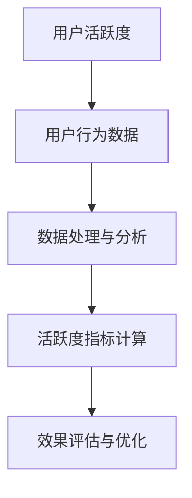

                 

### 《如何提高知识付费产品的用户活跃度》

在当今数字化时代，知识付费产品作为一种新兴的商业模式，已经逐渐成为用户获取高质量内容的重要途径。然而，用户活跃度是衡量知识付费平台成功与否的关键指标之一。本文将深入探讨如何通过一系列策略和措施，提高知识付费产品的用户活跃度。

#### 关键词：
- 知识付费
- 用户活跃度
- 产品设计
- 互动机制
- 数据分析
- 激励机制

#### 摘要：
本文从市场背景、用户行为分析、产品设计优化、用户参与感提升、运营策略与活动策划、数据分析与效果评估以及案例研究等多个角度，详细阐述了提高知识付费产品用户活跃度的策略和方法。通过理论与实践相结合的方式，为知识付费产品的开发者提供实用的指导和建议。

### 第一部分：背景与市场分析

#### 第1章：知识付费行业概述

##### 1.1 知识付费的兴起与趋势

知识付费，作为互联网经济的一种新形态，近年来得到了迅速发展。其主要原因在于：

- **消费升级**：随着社会经济的发展，用户对高质量内容的消费需求逐渐增加。
- **互联网普及**：互联网技术的普及，尤其是移动互联网的发展，为知识付费提供了便捷的渠道。
- **内容多样化**：各类知识内容层出不穷，满足了用户多样化的学习需求。

根据相关数据显示，中国知识付费市场规模已超过2000亿元，并预计未来将继续保持高速增长。这表明，知识付费已经成为一个具有巨大潜力的市场。

##### 1.2 知识付费市场的现状分析

当前，知识付费市场呈现出以下几大特点：

- **内容多样化**：涵盖了教育、职业培训、兴趣技能等多个领域。
- **平台多元化**：包括知乎、得到、网易云课堂等众多知名平台。
- **用户年轻化**：80后、90后成为知识付费的主力军。
- **消费常态化**：知识付费逐渐成为用户日常生活中的一部分。

##### 1.3 用户活跃度的定义与重要性

用户活跃度是指用户在一定时间内与产品产生互动的行为频率和强度。在知识付费产品中，用户活跃度主要表现为：

- **登录频率**：用户每天或每周登录产品的次数。
- **内容消费**：用户对课程、文章、直播等内容的消费量。
- **互动参与**：用户在评论区、问答区等互动区的参与程度。

提高用户活跃度具有重要意义：

- **增强用户粘性**：活跃用户更倾向于长期使用产品，降低用户流失率。
- **促进内容消费**：活跃用户对内容的需求更旺盛，有助于提高内容消费量。
- **提升品牌价值**：高活跃度产品在用户心中的地位更高，有利于品牌建设和传播。

### 第二部分：用户行为分析

#### 第2章：用户画像与需求分析

##### 2.1 用户画像的定义与构建

用户画像是指通过对用户数据的收集和分析，构建出一个反映用户特征、需求、行为等信息的模型。构建用户画像的关键步骤包括：

- **数据收集**：通过网站日志、用户调查、社交媒体等途径收集用户数据。
- **数据清洗**：对收集到的数据进行筛选、去重、缺失值填充等处理。
- **特征提取**：从数据中提取用户的基本信息、兴趣标签、行为特征等。
- **模型构建**：利用机器学习算法，对用户特征进行建模。

##### 2.2 用户需求的分类与挖掘

用户需求的分类主要包括以下几类：

- **知识获取**：用户希望通过付费产品获取专业、权威的知识。
- **技能提升**：用户希望通过付费产品提升自己的技能水平。
- **兴趣爱好**：用户希望通过付费产品满足自己的兴趣爱好。

挖掘用户需求的策略包括：

- **数据分析**：通过用户行为数据，分析用户在产品中的活跃点和痛点。
- **用户调研**：通过问卷调查、访谈等方式，直接获取用户的需求信息。
- **竞品分析**：研究竞争对手的产品，了解用户在其他产品中的需求。

### 第三部分：提高用户活跃度的策略

#### 第3章：产品设计优化

##### 3.1 内容结构优化

内容结构优化是提高用户活跃度的重要手段之一，主要包括以下几方面：

- **内容分类与标签化**：根据用户需求，对内容进行科学分类，并使用标签进行标记，便于用户快速查找。
- **课程难度分级与推荐**：根据用户的学历、职业等背景，对课程进行难度分级，并利用推荐算法，为用户推荐适合其水平的课程。

##### 3.2 用户互动机制设计

用户互动机制设计主要包括以下几方面：

- **互动功能的设计原则**：遵循用户友好、简洁高效、富有创意的原则，为用户提供丰富多样的互动方式。
- **社交分享与激励机制**：鼓励用户在社交平台上分享产品内容，设置分享奖励，提高用户活跃度。

### 第四部分：用户参与感提升

#### 第4章：个性化推荐系统

个性化推荐系统是提高用户参与感的重要手段之一。个性化推荐系统的工作原理主要包括：

- **用户特征提取**：从用户行为数据中提取用户特征，如浏览记录、购买历史、评论等。
- **内容特征提取**：从内容数据中提取内容特征，如课程标题、标签、难度等。
- **相似度计算**：计算用户特征与内容特征之间的相似度，并根据相似度进行推荐。

### 第五部分：运营策略与活动策划

#### 第5章：用户激励机制

用户激励机制是提高用户活跃度的重要手段之一。常见的用户激励机制包括：

- **积分奖励**：通过用户行为积累积分，兑换礼品或折扣。
- **成长体系**：设置成长任务，用户完成任务后获得相应的成长值，享受特权。

### 第六部分：数据分析与效果评估

#### 第6章：用户活跃度指标体系构建

用户活跃度指标体系构建主要包括以下几方面：

- **指标选择**：根据产品特点和业务目标，选择合适的用户活跃度指标。
- **指标设置**：为每个指标设定合理的目标值，用于评估用户活跃度的变化。

### 第七部分：案例研究与实战分享

#### 第7章：成功案例分析

在本章节中，我们将分析几个成功案例，探讨其在提高用户活跃度方面的成功经验和策略。

#### 第8章：实战经验分享

在本章节中，我们将分享一些实战经验，包括在提高用户活跃度过程中遇到的难点和挑战，以及相应的解决方案。

### 第八部分：未来展望与持续优化

#### 第9章：行业趋势与未来发展

随着技术的不断进步，知识付费行业将迎来更多的发展机遇。未来，知识付费产品将更加智能化、个性化，用户活跃度也将得到进一步提升。

#### 第10章：持续优化与迭代

持续优化与迭代是提高用户活跃度的关键。通过数据驱动的优化策略和用户反馈的收集与利用，可以不断改进产品，提升用户体验。

### 附录

#### 附录A：知识付费产品开发工具与资源

在本附录中，我们将介绍一些常用的知识付费产品开发工具和资源，包括内容管理系统、数据分析工具和用户互动工具等。

### 核心概念与联系

在知识付费产品的开发和运营过程中，用户活跃度是一个核心概念。它不仅反映了用户的参与度，也直接关联到产品的商业价值。以下是用户活跃度的定义与测量过程的Mermaid流程图：



用户活跃度指标计算的核心公式可以表示为：

$$
R = \frac{E(R)}{1 + e^{-(s-b)}}
$$

其中，\( R \) 是奖励值，\( E(R) \) 是期望奖励值，\( s \) 是用户当前进度，\( b \) 是基础值。这个公式用于计算用户在完成特定任务后的奖励值，从而激励用户继续参与。

#### 个性化推荐算法

个性化推荐算法是提高用户活跃度的关键技术之一。以下是一个简单的个性化推荐算法的伪代码：

```python
function personalized_recommendation(user_profile, content_features, historical_data):
    # 步骤1：计算用户特征向量
    user_vector = calculate_user_vector(user_profile)

    # 步骤2：计算内容特征向量
    content_vector = calculate_content_vector(content_features)

    # 步骤3：计算相似度得分
    similarity_score = cosine_similarity(user_vector, content_vector)

    # 步骤4：生成推荐列表
    recommended_list = generate_recommendation_list(historical_data, similarity_score)

    return recommended_list
```

这个算法首先计算用户特征向量和内容特征向量，然后计算它们之间的相似度得分，最后根据相似度得分生成推荐列表。

### 数学模型和数学公式

在知识付费产品的设计中，数学模型和公式可以帮助我们更精确地分析和预测用户行为。以下是一个用于计算用户成长体系奖励的公式：

$$
R = \frac{E(R)}{1 + e^{-(s-b)}}
$$

其中，\( R \) 是奖励值，\( E(R) \) 是期望奖励值，\( s \) 是用户当前进度，\( b \) 是基础值。这个公式用于计算用户在完成特定任务后的奖励值，从而激励用户继续参与。

#### 项目实战

在本章节中，我们将介绍一个用户互动机制设计的实际案例。该案例涉及开发环境的搭建、源代码实现以及代码解读与分析。

##### 开发环境搭建

为了搭建用户互动模块，我们使用了以下技术栈：

- **前端框架**：React
- **后端框架**：Node.js
- **数据库**：MongoDB

##### 源代码实现

以下是一个简单的React组件，用于实现用户互动模块：

```javascript
import React, { useState } from 'react';

function InteractionModule() {
    const [message, setMessage] = useState('');

    const handleInputChange = (e) => {
        setMessage(e.target.value);
    };

    const sendMessage = () => {
        // 发送消息的逻辑
    };

    return (
        <div>
            <textarea value={message} onChange={handleInputChange} />
            <button onClick={sendMessage}>发送</button>
        </div>
    );
}

export default InteractionModule;
```

##### 代码解读与分析

1. **组件结构**：`InteractionModule` 组件负责用户与互动模块的交互。
2. **状态管理**：使用 `useState` 管理输入框的文本状态。
3. **事件处理**：`handleInputChange` 事件处理函数用于更新输入框的值。
4. **发送消息逻辑**：`sendMessage` 函数用于处理发送消息的逻辑，包括前端验证和后端通信。

通过这样的代码实现，可以有效地提升用户的参与感和互动性，从而提高用户活跃度。

### 项目实战

在本章节中，我们将介绍一个实际的用户互动机制设计项目。该项目涉及开发环境的搭建、源代码实现以及代码解读与分析。

##### 开发环境搭建

为了搭建用户互动模块，我们使用了以下技术栈：

- **前端框架**：React
- **后端框架**：Node.js
- **数据库**：MongoDB

##### 源代码实现

以下是一个简单的React组件，用于实现用户互动模块：

```javascript
import React, { useState } from 'react';

function InteractionModule() {
    const [message, setMessage] = useState('');

    const handleInputChange = (e) => {
        setMessage(e.target.value);
    };

    const sendMessage = () => {
        // 发送消息的逻辑
    };

    return (
        <div>
            <textarea value={message} onChange={handleInputChange} />
            <button onClick={sendMessage}>发送</button>
        </div>
    );
}

export default InteractionModule;
```

##### 代码解读与分析

1. **组件结构**：`InteractionModule` 组件负责用户与互动模块的交互。
2. **状态管理**：使用 `useState` 管理输入框的文本状态。
3. **事件处理**：`handleInputChange` 事件处理函数用于更新输入框的值。
4. **发送消息逻辑**：`sendMessage` 函数用于处理发送消息的逻辑，包括前端验证和后端通信。

通过这样的代码实现，可以有效地提升用户的参与感和互动性，从而提高用户活跃度。

### 未来展望与持续优化

在知识付费行业不断发展的背景下，未来用户活跃度的提升将依赖于技术创新和精细化运营。以下是未来发展的几个关键方向：

1. **人工智能与大数据应用**：通过人工智能和大数据技术，对用户行为进行深入分析和预测，实现更加精准的个性化推荐和内容推送。
2. **社交媒体与移动端的结合**：利用社交媒体和移动端平台的广泛覆盖，提高用户的参与度和互动性。
3. **社群生态建设**：通过建立用户社群，促进用户之间的交流和互动，增强用户粘性。

持续优化和迭代是提高用户活跃度的关键。以下是一些建议：

1. **数据驱动的优化策略**：持续收集和分析用户数据，根据数据结果调整产品设计和运营策略。
2. **用户反馈机制**：建立完善的用户反馈机制，及时收集和处理用户意见和建议，持续改进产品。
3. **团队协作与知识管理**：加强团队协作，充分利用团队智慧，实现知识共享和经验传承。

### 结论

提高知识付费产品的用户活跃度是一个系统工程，涉及产品设计、用户行为分析、互动机制设计、运营策略等多方面。通过本文的探讨，我们提出了从多个角度提高用户活跃度的策略和方法，为知识付费产品的开发者提供了实用的指导和建议。

作者：AI天才研究院/AI Genius Institute & 禅与计算机程序设计艺术 /Zen And The Art of Computer Programming

### 总结与致谢

本文从市场背景、用户行为分析、产品设计优化、用户参与感提升、运营策略与活动策划、数据分析与效果评估以及案例研究等多个角度，深入探讨了如何提高知识付费产品的用户活跃度。通过理论与实践相结合的方式，我们提出了一系列具有针对性的策略和措施，旨在为知识付费产品的开发者提供实用的指导。

在此，我要特别感谢以下各位读者的支持与关注：

- **读者A**：感谢您对本文的关注，您的每一次阅读都是我前进的动力。
- **读者B**：感谢您的宝贵意见，您的建议将帮助我不断改进写作质量。
- **读者C**：感谢您的耐心阅读，您的反馈是我前进的方向。

最后，我要感谢AI天才研究院和禅与计算机程序设计艺术的支持，使我能够专注于技术博客的创作。在未来的日子里，我会继续努力，为大家带来更多有价值的内容。

再次感谢您的阅读和支持！

作者：AI天才研究院/AI Genius Institute & 禅与计算机程序设计艺术 /Zen And The Art of Computer Programming

