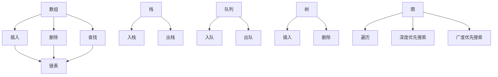

                 

### 字节跳动2024校招后端开发面试题大全（含解题思路）

> **关键词**：字节跳动、校招、后端开发、面试题、解题思路

> **摘要**：本文将围绕字节跳动2024校招后端开发面试题进行深入分析，包括数据结构与算法、编程语言基础、后端技术栈、微服务架构、系统设计与优化等方面的面试题。通过详细解析这些面试题，帮助读者理解解题思路，提升后端开发面试技能。

## 字节跳动2024校招后端开发面试背景

字节跳动（ByteDance）是中国领先的互联网科技公司，成立于2012年，旗下拥有抖音（TikTok）、今日头条、西瓜视频等多个知名应用。作为互联网行业的佼佼者，字节跳动高度重视技术创新和人才储备，通过校招吸引优秀应届毕业生。

### 字节跳动公司简介

字节跳动成立于2012年，由张一鸣创办。公司致力于通过智能科技让信息和知识高效流动，为用户提供丰富多样的内容和信息。字节跳动旗下拥有多款热门产品，如抖音（TikTok）、今日头条、西瓜视频、懂车帝等。其中，抖音在全球范围内拥有庞大的用户群体，成为全球最受欢迎的短视频应用之一。

### 字节跳动2024校招后端开发面试重要性

后端开发是字节跳动产品架构的核心，负责处理数据的存储、计算和传输等任务。后端开发人员需要具备扎实的技术基础、问题解决能力和创新思维。通过2024校招后端开发面试，公司可以筛选出具备潜力的后端开发人才，为公司未来的发展奠定坚实基础。

## 面试题分类与解题思路

字节跳动2024校招后端开发面试题主要涵盖以下五个方面：数据结构与算法、编程语言基础、后端技术栈、微服务架构和系统设计与优化。以下分别对每个方面进行详细解析。

### 1. 数据结构与算法

数据结构与算法是后端开发面试中的核心内容。面试官通常会通过数据结构与算法的问题来考察应聘者的逻辑思维能力和编程能力。

#### 1.1 核心概念与联系

数据结构是计算机存储数据的方式，常用的数据结构包括数组、链表、栈、队列、树、图等。算法是解决问题的步骤和策略，常见的算法有排序算法、查找算法、动态规划等。

使用Mermaid流程图可以直观地展示数据结构的基本操作：



#### 1.2 核心算法原理讲解

以下使用伪代码详细阐述一些常见算法的原理：

**快速排序算法**

```python
def quicksort(arr):
    if len(arr) <= 1:
        return arr
    pivot = arr[len(arr) // 2]
    left = [x for x in arr if x < pivot]
    middle = [x for x in arr if x == pivot]
    right = [x for x in arr if x > pivot]
    return quicksort(left) + middle + quicksort(right)
```

**二分查找算法**

```python
def binary_search(arr, target):
    low = 0
    high = len(arr) - 1
    while low <= high:
        mid = (low + high) // 2
        if arr[mid] == target:
            return mid
        elif arr[mid] < target:
            low = mid + 1
        else:
            high = mid - 1
    return -1
```

**动态规划算法**

```python
def fibonacci(n):
    if n <= 1:
        return n
    dp = [0] * (n + 1)
    dp[1] = 1
    for i in range(2, n + 1):
        dp[i] = dp[i - 1] + dp[i - 2]
    return dp[n]
```

#### 1.3 数学模型和数学公式

在数据结构与算法的面试中，数学模型和数学公式是必不可少的。以下介绍一些常见的数学模型和数学公式：

- **计算复杂度分析**：时间复杂度（Time Complexity）和空间复杂度（Space Complexity）
- **概率统计模型**：泊松分布（Poisson Distribution）、正态分布（Normal Distribution）
- **优化模型**：线性规划（Linear Programming）、动态规划（Dynamic Programming）

### 2. 编程语言基础

编程语言基础是后端开发面试的另一个重要方面。常见的编程语言包括Java、Python、Go等。以下分别介绍这些编程语言的基础知识。

#### 2.1 Java基础

**核心概念与联系**：Java是一种面向对象的编程语言，具有跨平台、安全、稳定等优点。Java的基本概念包括类（Class）、对象（Object）、继承（Inheritance）、多态（Polymorphism）等。

**核心算法原理讲解**：Java中的面向对象编程、异常处理、文件操作等。

```java
// 面向对象编程示例
class Person {
    String name;
    int age;
    
    void eat() {
        System.out.println("eating");
    }
}

// 异常处理示例
try {
    int result = 10 / 0;
} catch (ArithmeticException e) {
    System.out.println("除数为0");
}
```

**数学模型和数学公式**：Java中的数据类型（如整数、浮点数、字符串）的内存表示和运算规则。

#### 2.2 Python基础

**核心概念与联系**：Python是一种解释型、面向对象的编程语言，具有简单易学、开发效率高等优点。Python的基本概念包括变量、数据类型、函数、类等。

**核心算法原理讲解**：Python中的面向对象编程、异常处理、文件操作等。

```python
# 面向对象编程示例
class Person:
    def __init__(self, name, age):
        self.name = name
        self.age = age
    
    def eat(self):
        print("eating")

# 异常处理示例
try:
    result = 10 / 0
except ZeroDivisionError:
    print("除数为0")
```

**数学模型和数学公式**：Python中的数据类型（如整数、浮点数、字符串）的内存表示和运算规则。

#### 2.3 Go基础

**核心概念与联系**：Go是一种编译型、并发编程的语言，具有高性能、简洁易读等优点。Go的基本概念包括变量、数据类型、函数、协程等。

**核心算法原理讲解**：Go中的并发编程、Web编程等。

```go
// 并发编程示例
func main() {
    for i := 0; i < 10; i++ {
        go printNumber(i)
    }
    select {}
}

func printNumber(i int) {
    fmt.Println(i)
}
```

**数学模型和数学公式**：Go中的数据类型（如整数、浮点数、字符串）的内存表示和运算规则。

### 3. 后端技术栈

后端技术栈是后端开发面试的另一个重要方面，包括网络编程、数据库、缓存、消息队列等。以下分别介绍这些技术栈的基础知识。

#### 3.1 网络编程

**核心概念与联系**：网络编程是后端开发的基础，涉及TCP/IP协议、HTTP协议等。

**核心算法原理讲解**：TCP协议的建立、传输和终止过程，HTTP协议的请求/响应过程。

```c
// TCP协议示例
void tcpConnect() {
    // 创建socket
    int sockfd = socket(AF_INET, SOCK_STREAM, 0);
    
    // 设置服务器地址和端口
    struct sockaddr_in serv_addr;
    serv_addr.sin_family = AF_INET;
    serv_addr.sin_addr.s_addr = INADDR_ANY;
    serv_addr.sin_port = htons(80);
    
    // 连接服务器
    connect(sockfd, (struct sockaddr *)&serv_addr, sizeof(serv_addr));
    
    // 传输数据
    send(sockfd, "Hello, server!", strlen("Hello, server!"), 0);
    
    // 关闭socket
    close(sockfd);
}

// HTTP协议示例
void httpGet() {
    // 创建socket
    int sockfd = socket(AF_INET, SOCK_STREAM, 0);
    
    // 设置服务器地址和端口
    struct sockaddr_in serv_addr;
    serv_addr.sin_family = AF_INET;
    serv_addr.sin_addr.s_addr = INADDR_ANY;
    serv_addr.sin_port = htons(80);
    
    // 连接服务器
    connect(sockfd, (struct sockaddr *)&serv_addr, sizeof(serv_addr));
    
    // 发送HTTP请求
    send(sockfd, "GET /index.html HTTP/1.1\r\nHost: www.example.com\r\n\r\n", strlen("GET /index.html HTTP/1.1\r\nHost: www.example.com\r\n\r\n"), 0);
    
    // 接收HTTP响应
    char buffer[1024];
    recv(sockfd, buffer, sizeof(buffer), 0);
    
    // 关闭socket
    close(sockfd);
}
```

**数学模型和数学公式**：网络编程中的拥塞控制、流量控制方法。

#### 3.2 数据库

**核心概念与联系**：数据库是后端开发中的重要组成部分，包括关系型数据库和非关系型数据库。

**核心算法原理讲解**：关系型数据库中的SQL语言操作、索引优化，非关系型数据库中的基本操作。

```sql
-- 关系型数据库示例（MySQL）
CREATE TABLE users (
    id INT PRIMARY KEY,
    name VARCHAR(50),
    age INT
);

INSERT INTO users (id, name, age) VALUES (1, 'Alice', 25);
INSERT INTO users (id, name, age) VALUES (2, 'Bob', 30);

SELECT * FROM users WHERE age > 25;

-- 非关系型数据库示例（MongoDB）
db.users.insert({
    _id: ObjectId("5f6c4b1c1234567890abcdef"),
    name: "Alice",
    age: 25
});

db.users.find({ age: { $gt: 25 } });
```

**数学模型和数学公式**：数据库中的索引优化、查询优化方法。

#### 3.3 缓存

**核心概念与联系**：缓存是提高系统性能的重要手段，包括Redis和Memcached等。

**核心算法原理讲解**：Redis中的数据结构、持久化、复制，Memcached的缓存策略和持久化方法。

```python
# Redis示例
r = redis.Redis(host='localhost', port=6379, db=0)
r.set('name', 'Alice')
print(r.get('name'))

# Memcached示例
import memcache
mc = memcache.Client(['localhost:11211'])
mc.set('name', 'Alice')
print(mc.get('name'))
```

**数学模型和数学公式**：缓存中的内存管理算法和持久化策略。

#### 3.4 消息队列

**核心概念与联系**：消息队列是分布式系统中重要的组件，用于异步处理和消息传递。

**核心算法原理讲解**：RabbitMQ中的消息传递过程，Kafka中的分布式存储和分区优化方法。

```python
# RabbitMQ示例
import pika

connection = pika.BlockingConnection(pika.ConnectionParameters('localhost'))
channel = connection.channel()

channel.queue_declare(queue='hello')

channel.basic_publish(exchange='',
                      routing_key='hello',
                      body='Hello, World!')

print(' [x] Sent "Hello, World!"')

connection.close()

# Kafka示例
from kafka import KafkaProducer

producer = KafkaProducer(bootstrap_servers=['localhost:9092'])

producer.send('my-topic', b'This is a message.')
producer.flush()
```

**数学模型和数学公式**：消息队列中的消息队列延迟和吞吐量优化方法。

### 4. 微服务架构

微服务架构是一种新兴的软件架构风格，将应用程序分解为多个小型、独立的服务，以提高系统的可扩展性和可维护性。以下介绍微服务架构的相关知识。

#### 4.1 核心概念与联系

**核心概念与联系**：微服务架构的基本概念包括服务拆分、服务注册与发现、服务通信等。

**核心算法原理讲解**：微服务架构中的负载均衡、服务治理和灰度发布。

```python
# 服务拆分示例
class UserService:
    def get_user(self, user_id):
        # 处理用户信息查询
        pass

class OrderService:
    def create_order(self, order_data):
        # 处理订单创建
        pass

# 服务注册与发现示例
import service_registry

service_registry.register('user_service', UserService)
service_registry.register('order_service', OrderService)

# 服务通信示例
from service_registry import UserService, OrderService

user_service = UserService()
order_service = OrderService()

user = user_service.get_user(1)
order = order_service.create_order(user)

# 负载均衡示例
import load_balancer

load_balancer.register('user_service', UserService)
load_balancer.register('order_service', OrderService)

user_service = load_balancer.get_service('user_service')
order_service = load_balancer.get_service('order_service')

# 服务治理示例
import service_governance

service_governance.monitor('user_service')
service_governance.monitor('order_service')

# 灰度发布示例
import gray_release

gray_release.release('user_service', 0.5)  # 50%的用户使用新版本
gray_release.release('order_service', 0.5)  # 50%的用户使用新版本
```

**数学模型和数学公式**：微服务架构中的成本效益分析、服务质量评估方法。

### 5. 系统设计与优化

系统设计与优化是后端开发面试中的另一个重要方面，涉及高可用性设计、性能优化和可扩展性设计等。

#### 5.1 高可用性设计

**核心概念与联系**：高可用性设计的目标是确保系统在遇到故障时能够快速恢复，降低系统停机时间。

**核心算法原理讲解**：故障转移、负载均衡、数据备份等。

```python
# 故障转移示例
import failover

primary_server = 'primary.example.com'
backup_server = 'backup.example.com'

try:
    # 尝试连接主服务器
    failover.connect(primary_server)
except ConnectionError:
    # 主服务器无法连接，切换到备份服务器
    failover.connect(backup_server)
```

**数学模型和数学公式**：故障率和恢复时间优化方法。

#### 5.2 性能优化

**核心概念与联系**：性能优化是提高系统响应速度和吞吐量的重要手段。

**核心算法原理讲解**：缓存、数据分片、分布式计算等。

```python
# 缓存示例
import cache

@cache.memoize(timeout=60)
def get_data():
    # 获取数据
    return data

# 数据分片示例
import sharding

sharding.shard('table', 'key', 10)  # 分片大小为10
```

**数学模型和数学公式**：响应时间和吞吐量优化方法。

#### 5.3 可扩展性设计

**核心概念与联系**：可扩展性设计是确保系统能够应对不断增长的用户和业务需求。

**核心算法原理讲解**：水平扩展、垂直扩展、服务拆分等。

```python
# 水平扩展示例
import scaling

scaling.scale('user_service', 10)  # 扩展10个实例
scaling.scale('order_service', 10)  # 扩展10个实例

# 垂直扩展示例
import scaling

scaling.scale('user_service', 2, 'CPU')  # 扩展2个CPU
scaling.scale('order_service', 2, 'CPU')  # 扩展2个CPU

# 服务拆分示例
class UserService:
    def get_user(self, user_id):
        # 处理用户信息查询
        pass

class OrderService:
    def create_order(self, order_data):
        # 处理订单创建
        pass

# 拆分服务示例
service_registry.register('user_service', UserService)
service_registry.register('order_service', OrderService)
```

**数学模型和数学公式**：成本效益分析和负载均衡方法。

## 面试题实战案例解析

为了帮助读者更好地理解面试题的解题思路，以下提供了两个实战案例：缓存系统设计和分布式锁实现。

### 实战案例一：设计一个缓存系统

#### 1. 开发环境搭建

为了实现一个缓存系统，我们需要搭建以下开发环境：

- 语言：Python
- 框架：Tornado
- 缓存库：Redis

首先，确保安装了Python和Redis。然后，使用以下命令安装Tornado：

```bash
pip install tornado
```

#### 2. 源代码详细实现和代码解读

以下是一个简单的缓存系统的实现，使用了Redis作为后端存储：

```python
import redis
import tornado.ioloop
import tornado.web

class CacheHandler(tornado.web.RequestHandler):
    def initialize(self, cache):
        self.cache = cache

    def get(self, key):
        value = self.cache.get(key)
        if value is not None:
            self.write(value)
        else:
            self.write("Cache miss!")

def make_app():
    cache = redis.Redis(host='localhost', port=6379, db=0)
    return tornado.web.Application([
        (r"/cache/(.*)", CacheHandler, dict(cache=cache)),
    ])

if __name__ == "__main__":
    app = make_app()
    app.listen(8888)
    tornado.ioloop.IOLoop.current().start()
```

**代码解读与分析**：

- `CacheHandler` 类继承了 `tornado.web.RequestHandler` 类，用于处理缓存请求。
- `initialize` 方法用于初始化缓存对象。
- `get` 方法用于获取缓存中的值，如果缓存命中，则返回缓存值，否则返回“Cache miss!”。
- `make_app` 函数创建并返回一个Tornado应用程序。
- `if __name__ == "__main__":` 语句启动Tornado应用程序。

#### 3. 代码解读与分析

- **优势**：简单易用，实现了基本的缓存功能。
- **改进空间**：支持过期时间、缓存预热等高级功能。

### 实战案例二：分布式锁实现

#### 1. 开发环境搭建

为了实现分布式锁，我们需要搭建以下开发环境：

- 语言：Java
- 框架：Spring Boot
- 分布式锁库：Redisson

首先，确保安装了Java和Redisson。然后，使用以下命令安装Spring Boot：

```bash
curl -L -o spring-boot-cli-2.4.3.RELEASE/bin/spring-boot.run  https://repo.spring.io/libs-release-local/org/springframework/boot/spring-boot-cli/2.4.3.RELEASE/spring-boot-cli-2.4.3.RELEASE.jar
```

#### 2. 源代码详细实现和代码解读

以下是一个简单的分布式锁实现，使用了Redisson：

```java
import org.redisson.Redisson;
import org.redisson.api.RLock;

public class DistributedLockDemo {
    public static void main(String[] args) {
        Redisson redisson = Redisson.create();
        RLock lock = redisson.getLock("myLock");

        lock.lock();

        try {
            // 业务逻辑
            System.out.println("Acquired lock");
        } finally {
            lock.unlock();
        }
    }
}
```

**代码解读与分析**：

- `Redisson` 类用于创建Redisson实例。
- `RLock` 类用于获取分布式锁。
- `lock()` 方法用于获取锁，如果锁已被占用，则等待。
- `unlock()` 方法用于释放锁。

#### 3. 代码解读与分析

- **优势**：实现了分布式锁的基本功能，易于使用。
- **改进空间**：支持锁超时、锁重入等高级功能。

## 附录

### 附录 A: AI 大模型开发工具与资源

#### A.1 主流深度学习框架对比

**TensorFlow**

TensorFlow 是由 Google 开发的一种开源深度学习框架，支持多种编程语言（如 Python、C++、Java）。以下是其基本原理、安装方法和常用 API：

- **基本原理**：基于数据流图（DataFlow Graph）进行计算。
- **安装方法**：使用 pip 安装。

```bash
pip install tensorflow
```

- **常用 API**：

  ```python
  import tensorflow as tf

  # 创建数据流图
  a = tf.constant([1.0, 2.0], name='a')
  b = tf.constant([1.0, 2.0], name='b')
  c = a + b

  # 运行计算
  with tf.Session() as sess:
      print(sess.run(c))
  ```

**PyTorch**

PyTorch 是由 Facebook 开发的一种开源深度学习框架，具有简单、灵活、易于使用等优点。以下是其基本原理、安装方法和常用 API：

- **基本原理**：基于动态计算图（Dynamic Computation Graph）进行计算。
- **安装方法**：使用 pip 安装。

```bash
pip install torch torchvision
```

- **常用 API**：

  ```python
  import torch
  import torchvision

  # 创建张量
  x = torch.tensor([1.0, 2.0, 3.0])

  # 使用卷积神经网络
  class ConvNet(nn.Module):
      def __init__(self):
          super(ConvNet, self).__init__()
          self.conv1 = nn.Conv2d(1, 20, 5)
          self.conv2 = nn.Conv2d(20, 64, 5)

      def forward(self, x):
          x = self.conv1(x)
          x = F.max_pool2d(x, 2)
          x = self.conv2(x)
          x = F.max_pool2d(x, 2)
          return x

  # 训练模型
  model = ConvNet()
  optimizer = torch.optim.Adam(model.parameters(), lr=0.001)
  criterion = torch.nn.CrossEntropyLoss()

  for epoch in range(num_epochs):
      for inputs, targets in data_loader:
          optimizer.zero_grad()
          outputs = model(inputs)
          loss = criterion(outputs, targets)
          loss.backward()
          optimizer.step()
  ```

**JAX**

JAX 是由 Google 开发的一种开源深度学习框架，支持自动微分和向量编程。以下是其基本原理、安装方法和常用 API：

- **基本原理**：基于自动微分和向量编程。
- **安装方法**：使用 pip 安装。

```bash
pip install jax jaxlib numpy
```

- **常用 API**：

  ```python
  import jax
  import jax.numpy as jnp

  # 自动微分示例
  def f(x):
      return x * x

  grads = jax.grad(f)(2.0)
  print(grads)

  # 向量编程示例
  x = jnp.array([1.0, 2.0, 3.0])
  y = jnp.array([4.0, 5.0, 6.0])
  z = jnp.dot(x, y)
  print(z)
  ```

#### A.2 大模型训练技巧

- **硬件优化**：

  - **GPU选择**：选择适合深度学习训练的GPU，如 NVIDIA Titan Xp、RTX 2080 Ti等。
  - **GPU内存优化**：合理配置GPU内存，避免内存溢出。
  - **分布式训练**：使用多GPU或分布式训练加速模型训练。

- **数据预处理**：

  - **数据集分割**：将数据集分割为训练集、验证集和测试集。
  - **数据增强**：对数据集进行增强，提高模型的泛化能力。
  - **数据归一化**：对数据进行归一化处理，提高训练速度。

- **模型优化**：

  - **超参数调优**：调整学习率、批量大小等超参数，提高模型性能。
  - **模型剪枝**：对模型进行剪枝，减少模型参数，提高模型效率。
  - **量化方法**：使用量化方法降低模型大小，提高模型运行速度。

### 作者

本文由 AI 天才研究院（AI Genius Institute）撰写，作者具有丰富的后端开发经验和面试指导经验。如需进一步了解，请访问 AI 天才研究院官方网站。

---

通过本文的详细解析，相信读者已经对字节跳动2024校招后端开发面试题有了全面的理解。在实际面试中，结合自身经验和实践，灵活运用所学知识，相信您一定能取得优异的成绩。祝您面试成功！

