                 

### 《2024字节跳动校招面试全攻略：从准备到offer》

#### 关键词：字节跳动，校招，面试准备，面试技巧，面试问题，成功案例分析

> 摘要：本文旨在为准备参加2024年字节跳动校招面试的求职者提供全面的面试攻略。从公司文化、自我评估、技术准备、编程语言与框架、软技能提升到面试实战技巧，我们将一步步指导您如何在字节跳动面试中脱颖而出，获得心仪的offer。

### 目录大纲

## 第一部分：面试准备

### 第1章：了解字节跳动
#### 1.1 字节跳动的公司文化
#### 1.2 字节跳动的业务领域
#### 1.3 字节跳动的招聘流程

### 第2章：自我评估
#### 2.1 技能评估
#### 2.2 知识评估
#### 2.3 面试常见问题自我准备

### 第3章：技术面试准备
#### 3.1 数据结构与算法
##### 3.1.1 常见数据结构
##### 3.1.2 算法分析与设计
##### 3.1.3 编程技巧与优化

### 第4章：编程语言与框架
#### 4.1 Java
##### 4.1.1 Java基础
##### 4.1.2 Java并发编程
##### 4.1.3 Java框架应用
#### 4.2 Python
##### 4.2.1 Python基础
##### 4.2.2 Python进阶
##### 4.2.3 Python框架应用

### 第5章：软技能提升
#### 5.1 沟通能力
#### 5.2 团队合作能力
#### 5.3 问题解决能力

## 第二部分：面试实战

### 第6章：面试问题解析
#### 6.1 常见面试问题
##### 6.1.1 技术问题
##### 6.1.2 行为问题
##### 6.1.3 文化问题
#### 6.2 面试问题分类与应对策略

### 第7章：面试技巧
#### 7.1 面试前的准备
#### 7.2 面试中的表现
#### 7.3 面试后的跟进

### 第8章：模拟面试
#### 8.1 模拟面试场景
#### 8.2 模拟面试问题与解答
#### 8.3 模拟面试反馈与改进

## 第三部分：成功案例分析

### 第9章：面试经验分享
#### 9.1 案例一：从实习生到正式员工的成长之路
#### 9.2 案例二：技术大牛的面试心得
#### 9.3 案例三：非科班出身，如何拿下字节跳动面试

### 第10章：面试后总结与反思
#### 10.1 面试成功的原因
#### 10.2 面试失败的原因
#### 10.3 如何持续改进

## 附录

### 附录 A：面试资料与资源
#### A.1 技术书籍推荐
#### A.2 在线编程练习平台
#### A.3 面试技巧视频课程

### 附录 B：字节跳动面试常见问题汇总
##### B.1 数据结构与算法
##### B.2 编程语言与框架
##### B.3 软技能

### 《2024字节跳动校招面试全攻略：从准备到offer》正文部分将从上述目录结构出发，详细探讨每个章节的内容，帮助您全面备战字节跳动校招面试。在接下来的内容中，我们将逐步深入，为您解答面试过程中可能遇到的各类问题。准备就绪，让我们开始这段面试之旅吧！

---

### 第一部分：面试准备

在准备字节跳动校招面试的过程中，对公司的了解、自我评估、技术准备和软技能提升都是至关重要的环节。本部分将带领您一步步完成这些准备工作，确保您在面试中能够信心满满，脱颖而出。

### 第1章：了解字节跳动

在准备面试之前，了解字节跳动这家公司是至关重要的。以下是我们对字节跳动公司文化、业务领域和招聘流程的深入剖析。

#### 1.1 字节跳动的公司文化

字节跳动（ByteDance）以其独特的公司文化而闻名。这种文化强调了创新、快速迭代和高效执行。以下是一些字节跳动公司文化的关键要素：

- **用户至上**：字节跳动的核心价值观之一是“用户为先”，这意味着公司始终将用户需求放在首位，以提供卓越的产品体验。
- **快速迭代**：公司鼓励员工快速尝试新想法，并通过不断迭代来优化产品。
- **扁平化管理**：字节跳动采用扁平化的管理结构，使信息流通更加顺畅，员工能够更自由地提出意见和建议。
- **开放创新**：公司鼓励员工勇于创新，不断探索新的技术和商业模式。

**Mermaid 流程图：**
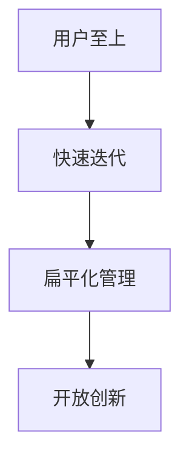

#### 1.2 字节跳动的业务领域

字节跳动是一家多元化的科技公司，其业务覆盖了多个领域，包括：

- **内容业务**：字节跳动旗下有今日头条、抖音、西瓜视频等知名平台，这些平台通过算法推荐为用户提供了个性化内容。
- **教育业务**：字节跳动在教育领域也有所布局，包括猿辅导、编程猫等在线教育平台。
- **游戏业务**：公司开发了许多受欢迎的游戏，如《巨人的战争》、《王者荣耀》等。
- **电商业务**：字节跳动旗下的抖音电商业务发展迅速，成为电商平台的重要一员。

#### 1.3 字节跳动的招聘流程

字节跳动的招聘流程通常包括以下几个阶段：

1. **在线申请**：通过字节跳动的官方网站提交简历，填写相关信息。
2. **简历筛选**：人力资源部门会对收到的简历进行筛选，筛选标准通常包括学历、专业背景和实习经验等。
3. **电话面试**：通过简历筛选的求职者将接受电话面试，这一环节通常涉及一些技术性问题。
4. **现场面试**：通过电话面试的求职者将受邀参加现场面试，现场面试可能包括多轮技术面试、行为面试和HR面试。
5. **Offer决策**：在所有面试环节结束后，招聘团队会讨论并决定是否给予求职者offer。

**Mermaid 流程图：**
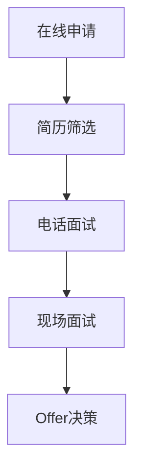

### 第2章：自我评估

自我评估是面试准备的关键步骤，它可以帮助您了解自己的技能、知识和准备情况。以下是如何进行自我评估的一些指导：

#### 2.1 技能评估

技能评估涉及对以下方面的自我检查：

- **编程技能**：您熟悉哪些编程语言？掌握的程度如何？是否有实际项目经验？
- **数据结构与算法**：您对常见数据结构和算法的掌握程度如何？能否通过具体案例说明？
- **系统设计与架构**：您是否有参与过大型系统设计和架构的经历？对分布式系统、微服务架构了解多少？

**Mermaid 流程图：**
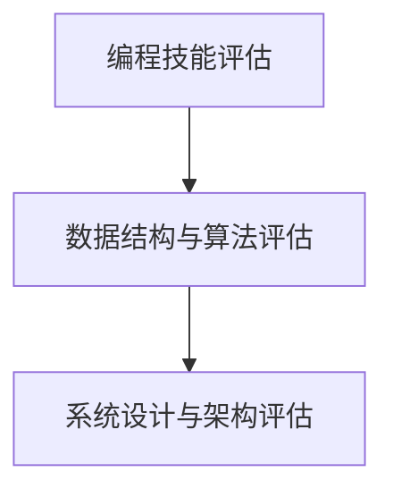

#### 2.2 知识评估

知识评估涉及对以下方面的自我检查：

- **专业领域知识**：您所在的专业领域是什么？对相关理论知识掌握如何？
- **行业动态**：您是否关注行业动态，了解最新的技术趋势和发展方向？
- **软技能**：您的沟通能力、团队合作能力和问题解决能力如何？

**Mermaid 流程图：**
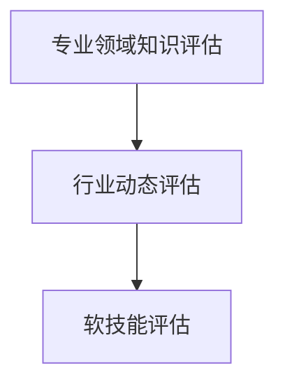

#### 2.3 面试常见问题自我准备

在准备面试时，您需要针对一些常见的面试问题进行自我准备。以下是一些例子：

- **行为问题**：“请举例说明一次你在项目中遇到困难并成功解决的经历。”
- **技术问题**：“请解释一下什么是哈希表，并给出一个应用场景。”
- **文化问题**：“你如何看待字节跳动公司文化中的‘用户至上’原则？”

**Mermaid 流程图：**
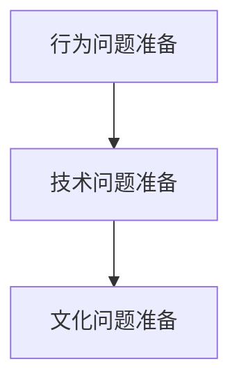

通过以上自我评估，您将更加清楚地了解自己的优势和需要改进的地方，从而在面试中能够更有针对性地展示自己。

### 第3章：技术面试准备

技术面试是字节跳动校招面试的重要组成部分。以下内容将帮助您全面准备技术面试，确保在面试中能够应对各种技术问题。

#### 3.1 数据结构与算法

数据结构与算法是技术面试的核心内容。以下是一些关键点：

##### 3.1.1 常见数据结构

- **数组**：数组是数据结构中最基础的一种，它提供了一种高效的存储和访问元素的方式。
- **链表**：链表是一种由节点组成的数据结构，每个节点包含数据和指向下一个节点的指针。
- **栈和队列**：栈和队列是两种特殊的线性数据结构，分别用于实现后进先出（LIFO）和先进先出（FIFO）操作。
- **树和二叉树**：树是一种层次结构，每个节点有零个或多个子节点。二叉树是一种特殊的树，每个节点最多有两个子节点。

**Mermaid 流程图：**
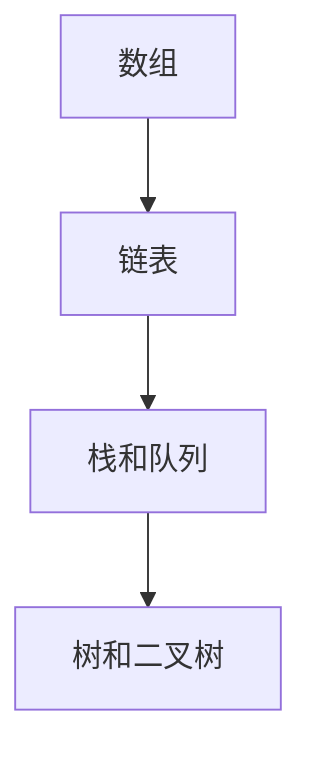

##### 3.1.2 算法分析与设计

算法分析与设计是解决编程问题的重要方法。以下是一些关键概念：

- **时间复杂度**：描述算法执行时间与输入数据规模的关系。
- **空间复杂度**：描述算法执行所需内存与输入数据规模的关系。
- **动态规划**：一种用于求解最优子结构问题的算法设计方法。
- **贪心算法**：一种在每一步选择局部最优解，以期获得全局最优解的算法设计方法。

**Mermaid 流程图：**
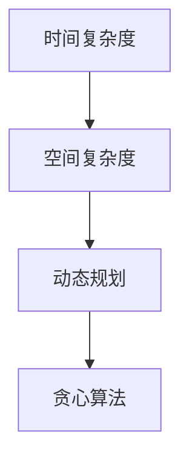

##### 3.1.3 编程技巧与优化

在编程过程中，以下技巧和优化方法可以帮助您提高代码效率：

- **代码复用**：通过编写可复用的函数和模块，减少代码冗余。
- **数据缓存**：使用缓存技术减少重复计算，提高程序运行速度。
- **并发处理**：利用多线程或多进程技术提高程序并行处理能力。
- **内存管理**：合理分配和回收内存，避免内存泄漏。

**Mermaid 流程图：**
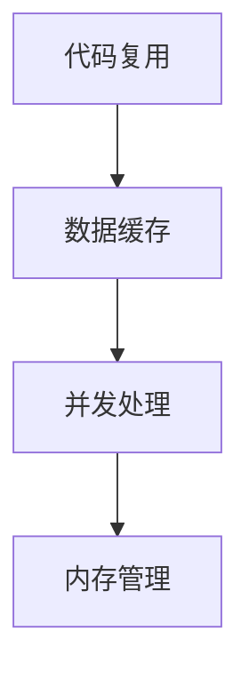

通过以上对数据结构与算法的深入准备，您将能够更加自信地应对技术面试中的各种问题。

#### 3.2 编程语言与框架

在字节跳动校招面试中，您可能需要展示对Java和Python这两种编程语言的熟练掌握。以下是对这两种语言的基础知识、并发编程和框架应用的详细解析。

##### 3.2.1 Java

Java是一种广泛使用的编程语言，具有跨平台、安全性高、可移植性好等特点。以下是一些Java基础知识：

- **Java基础**：Java的基本语法、数据类型、控制结构、方法、异常处理等。
- **Java并发编程**：多线程编程、线程同步、并发集合、线程池等。
- **Java框架应用**：Spring框架、MyBatis持久层框架、Spring Boot快速开发框架等。

**伪代码示例：**
```java
public class HelloWorld {
    public static void main(String[] args) {
        System.out.println("Hello, World!");
    }
}
```

**Mermaid 流程图：**
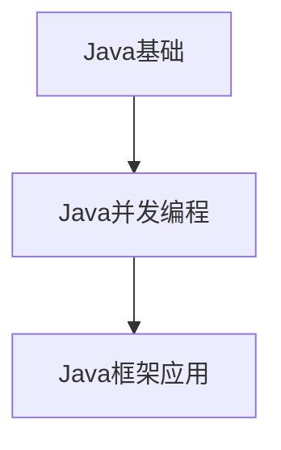

##### 3.2.2 Python

Python是一种简洁、易读的编程语言，广泛应用于数据分析、机器学习、网络编程等领域。以下是一些Python基础知识：

- **Python基础**：Python的基本语法、数据类型、控制结构、函数、模块等。
- **Python进阶**：列表推导式、生成器、迭代器、装饰器等。
- **Python框架应用**：Django框架、Flask框架、Scrapy爬虫框架等。

**伪代码示例：**
```python
def hello_world():
    print("Hello, World!")

hello_world()
```

**Mermaid 流程图：**
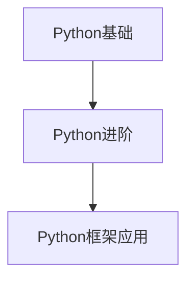

无论是Java还是Python，熟练掌握这两种语言的核心概念和应用场景都是字节跳动校招面试的重要要求。通过深入学习和实践，您将能够更好地展示自己的编程能力。

#### 3.3 软技能提升

在字节跳动校招面试中，除了技术能力，软技能也是面试官关注的重点。以下是一些关键的软技能及其提升方法：

##### 3.3.1 沟通能力

沟通能力是职场中不可或缺的技能。以下是一些建议来提升沟通能力：

- **主动倾听**：在沟通过程中，积极倾听对方的意见和需求，确保理解准确。
- **清晰表达**：用简洁明了的语言表达自己的观点和想法，避免模糊不清。
- **积极反馈**：及时给予对方反馈，表达对对方意见的认可或改进建议。
- **非语言沟通**：通过肢体语言、面部表情等非语言手段增强沟通效果。

**Mermaid 流程图：**
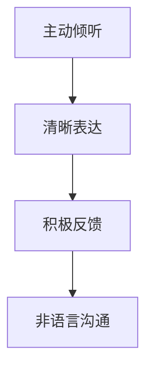

##### 3.3.2 团队合作能力

团队合作能力在字节跳动这样强调团队协作的公司尤为重要。以下是一些建议来提升团队合作能力：

- **共同目标**：明确团队的目标，确保每个成员都朝同一方向努力。
- **有效沟通**：保持团队内部的沟通畅通，及时分享信息和进展。
- **分工协作**：合理分配任务，确保每个人都能发挥自己的优势。
- **相互支持**：在团队遇到困难时，相互帮助，共同解决问题。

**Mermaid 流程图：**
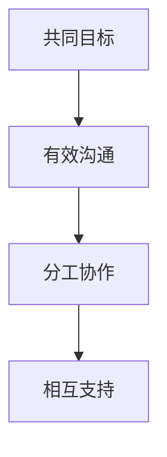

##### 3.3.3 问题解决能力

问题解决能力是衡量一个人综合素质的重要标准。以下是一些建议来提升问题解决能力：

- **分析问题**：明确问题的根本原因，而不是仅仅关注表面现象。
- **制定计划**：根据问题分析，制定具体的解决方案和行动计划。
- **执行计划**：按照计划执行，并及时调整以应对变化。
- **总结经验**：在问题解决后，总结经验教训，为未来类似问题的解决提供参考。

**Mermaid 流程图：**
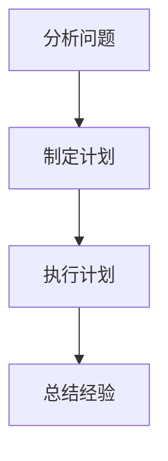

通过不断提升沟通能力、团队合作能力和问题解决能力，您将在字节跳动校招面试中展现更加全面的自己。

### 第6章：面试问题解析

在面试过程中，面试官可能会提出多种类型的问题，包括技术问题、行为问题和文化问题。以下是对这些问题的分类与应对策略的详细解析。

#### 6.1 常见面试问题

##### 6.1.1 技术问题

技术问题是面试中最为常见的一类问题，通常涉及编程语言、数据结构与算法、系统设计与架构等方面。以下是一些建议来应对技术问题：

- **掌握基础知识**：确保对编程语言的基础知识有深入理解，能够熟练运用。
- **算法理解**：对常见的数据结构与算法有深刻的理解，能够运用到实际问题中。
- **系统设计**：熟悉常见的系统设计模式和架构，能够根据需求设计合理的系统架构。
- **实例解释**：通过实际项目经验来解释技术问题，展示自己的实践能力。

**Mermaid 流 diagram：**
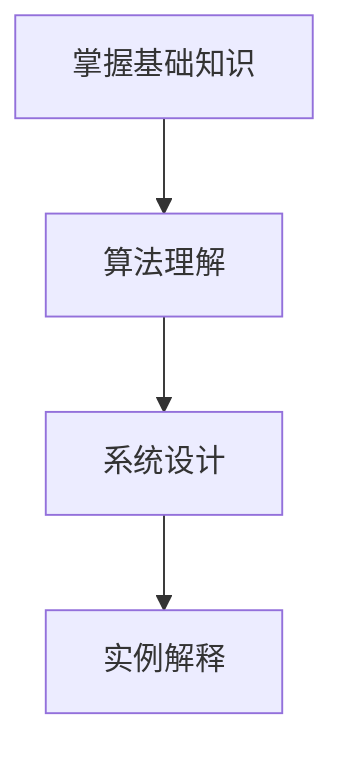

##### 6.1.2 行为问题

行为问题通常涉及您的经历、决策过程、团队合作能力等方面。以下是一些建议来应对行为问题：

- **故事化回答**：通过讲述具体的故事来展示自己的能力和经验，使回答更加生动有力。
- **展示成长**：强调自己在问题中的成长和收获，展示解决问题的能力和学习意愿。
- **正面态度**：保持积极、乐观的态度，即使遇到挫折，也要展示自己如何从中吸取教训。

**Mermaid 流 diagram：**
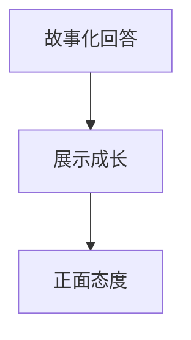

##### 6.1.3 文化问题

文化问题旨在了解您对字节跳动公司文化的理解和认同。以下是一些建议来应对文化问题：

- **了解文化**：深入理解字节跳动的公司文化，能够在面试中展现对此的认同。
- **结合经历**：通过自己的经历来展示如何践行公司文化，强调自己与公司文化的契合。
- **积极态度**：展示自己对公司文化的积极态度，强调愿意在团队合作和创新中发挥自己的作用。

**Mermaid 流 diagram：**
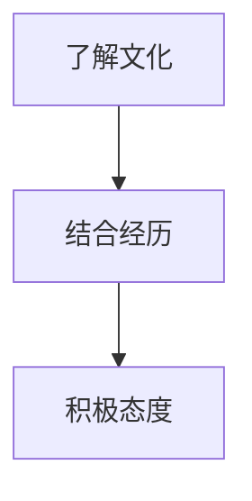

#### 6.2 面试问题分类与应对策略

为了更好地准备面试，我们将面试问题分为以下几类，并针对每类问题提出相应的应对策略：

1. **技术问题**：重点关注编程语言、数据结构与算法、系统设计等核心内容，确保基础知识扎实，能够运用到实际问题中。
2. **行为问题**：通过具体经历展示自己的能力、成长和团队合作精神，使回答更具说服力。
3. **文化问题**：深入理解公司文化，结合个人经历和态度，展示自己与公司文化的契合。

**Mermaid 流 diagram：**
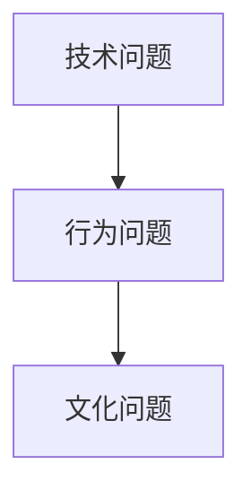

通过以上分类与应对策略，您将能够在面试中更加自信、从容地回答各种问题，展现自己的全面素质。

### 第7章：面试技巧

在准备和参加字节跳动校招面试的过程中，掌握一些关键技巧对于成功至关重要。以下内容将详细讲解面试前的准备、面试中的表现和面试后的跟进，帮助您在面试中脱颖而出。

#### 7.1 面试前的准备

面试前的准备工作是成功的关键步骤。以下是一些建议：

1. **研究公司**：深入了解字节跳动的公司文化、业务领域和招聘岗位要求。这有助于您在面试中展示对公司的充分了解，增加面试官的好感。
2. **熟悉简历**：确保您的简历内容清晰、准确，没有错别字和语法错误。面试前反复阅读简历，确保熟悉每一项内容和细节。
3. **练习问题**：针对常见面试问题进行模拟练习，特别是技术问题和行为问题。可以通过与同学、朋友或家人进行模拟面试来提高回答的流畅性和准确性。
4. **准备资料**：整理好所有可能需要的资料，如简历、证书、推荐信等，确保在面试时能够快速找到。
5. **调试设备**：如果面试是通过在线平台进行的，提前测试网络和设备，确保面试时设备正常工作。

**Mermaid 流 diagram：**
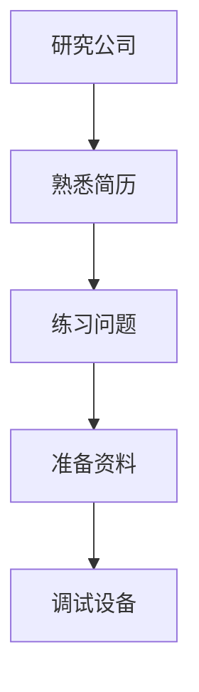

#### 7.2 面试中的表现

面试时的表现直接影响面试结果。以下是一些建议来帮助您在面试中表现出色：

1. **自信表现**：保持自信的态度，避免过度紧张。通过深呼吸和正面思考来调整心态。
2. **主动沟通**：与面试官保持良好的眼神交流和肢体语言，展示出积极主动的态度。
3. **清晰表达**：用简洁明了的语言回答问题，确保面试官能够理解您的观点和思路。
4. **展示专业**：在回答技术问题时，展示出对问题的深刻理解，并用实际案例或代码示例来支持您的回答。
5. **提问环节**：在面试结束时，可以针对公司或职位提出一些问题，展示自己的兴趣和热情。

**Mermaid 流 diagram：**
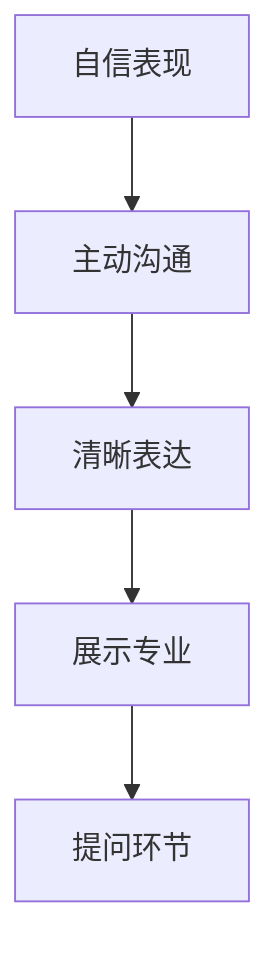

#### 7.3 面试后的跟进

面试后的跟进可以帮助您加深面试官对您的印象，提高获得offer的可能性。以下是一些建议：

1. **发送感谢信**：在面试结束后的一到两天内，发送一封感谢信给面试官。感谢信中可以简要回顾面试中的亮点，再次表达对职位的兴趣和热情。
2. **跟进进度**：在合适的时机（如一周后），通过电话或邮件询问面试结果的跟进情况。这展示了您对职位的重视和对公司的尊重。
3. **持续准备**：即使暂时没有收到offer，也不要气馁。继续提升自己的技能和知识，为下一次面试做好准备。

**Mermaid 流 diagram：**
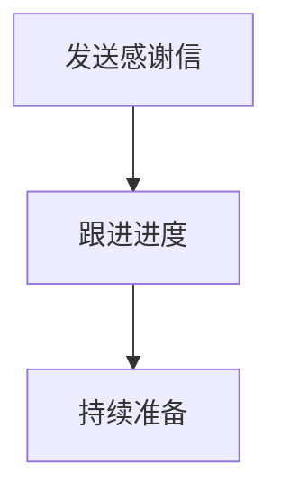

通过以上面试技巧的准备和运用，您将能够在字节跳动校招面试中展现出最好的自己，增加获得offer的机会。

### 第8章：模拟面试

为了帮助您更好地准备字节跳动校招面试，我们将提供一系列模拟面试场景和问题，以及相应的解答和反馈。通过模拟面试，您可以熟悉面试流程，增强自信心，并在实际面试中应对自如。

#### 8.1 模拟面试场景

以下是一个模拟面试场景，包括面试官可能会提出的问题和您的回答。

**面试官**：“请简单介绍一下自己。”

**回答**：
“您好，我叫李明，毕业于北京大学计算机科学专业。我具备扎实的编程基础，熟练掌握Java和Python编程语言。在校期间，我曾参与多个项目，包括基于Java的电商系统开发和基于Python的网络爬虫。此外，我也具备良好的团队合作能力和沟通技巧，乐于接受挑战并不断学习新知识。”

**面试官**：“请解释一下什么是哈希表。”

**回答**：
“哈希表是一种数据结构，用于快速存储和检索键值对。它通过一个哈希函数将键映射到数组的一个索引位置，通常称为哈希值。哈希表通过哈希函数来避免直接碰撞，即不同的键映射到同一个哈希值的情况。在实际应用中，哈希表可以用于实现快速查找、插入和删除操作。”

**面试官**：“你在团队项目中遇到过最大的挑战是什么？你是如何解决的？”

**回答**：
“在之前的团队项目中，我们遇到了项目进度滞后和成员间沟通不畅的问题。为了解决这个问题，我首先与团队成员进行了一次深入的沟通，了解每个人的工作进展和遇到的困难。然后，我制定了一个详细的进度计划，明确了每个人的任务和截止日期，并通过定期的团队会议来跟踪项目进度。此外，我还积极促进团队成员之间的交流，鼓励他们分享问题和解决方案，从而提高了整个团队的协作效率。”

**面试官**：“你对字节跳动的公司文化有什么了解？”

**回答**：
“我对字节跳动的公司文化非常感兴趣。字节跳动强调创新、快速迭代和高效执行，这与我个人的价值观非常契合。我相信，在这样一个鼓励创新和自由表达的工作环境中，我可以充分发挥自己的潜力，不断学习和成长。同时，我也非常认同字节跳动‘用户至上’的核心价值观，相信这可以激励我不断优化产品，为用户提供更好的体验。”

#### 8.2 模拟面试问题与解答

以下是一些常见的面试问题及其解答，供您参考和练习。

**问题 1：请描述一次你解决复杂问题的经历。**

**解答**：
“在我参与的一个大数据项目中，我们遇到了数据清洗和数据整合的难题。数据来源多样化且数据质量参差不齐，导致数据处理过程非常复杂。为了解决这个问题，我首先对数据来源进行了详细分析，确定了数据的结构和格式。然后，我设计了一套数据清洗和整合的流程，包括数据预处理、去重、格式转换等步骤。通过这个流程，我们成功地将大量数据进行清洗和整合，提高了数据处理的效率。”

**问题 2：你如何处理工作压力？”

**解答**：
“在面对工作压力时，我通常会先冷静下来，分析问题的根源。然后，我会制定一个详细的计划，将任务分解成可管理的部分，并设置优先级。此外，我会利用时间管理工具来合理安排工作时间，确保每项任务都有充足的完成时间。在休息时间，我会进行一些放松活动，如锻炼或阅读，以缓解压力。”

**问题 3：请解释一下什么是分布式系统。”

**解答**：
“分布式系统是指由多个节点组成的系统，这些节点通过网络连接并协同工作，共同完成一个任务。分布式系统的主要特点包括高可用性、可扩展性和容错性。通过将任务分布到多个节点上，分布式系统可以提高计算性能和资源利用率。在实际应用中，分布式系统可以用于处理大规模的数据、提供高并发服务以及实现负载均衡。”

#### 8.3 模拟面试反馈与改进

在模拟面试结束后，您可以进行自我反馈和改进。以下是一些反馈建议：

1. **语言表达**：检查自己的语言表达是否清晰、流畅，是否有语法错误或语病。
2. **逻辑结构**：思考自己的回答是否有条理，是否能够逻辑清晰地表达观点。
3. **专业知识**：评估自己在专业知识方面的掌握程度，是否能够熟练运用。
4. **时间管理**：在模拟面试中，注意自己的回答时间，确保能够在规定时间内完成。

通过不断地模拟面试和反馈改进，您将能够在实际面试中更加从容和自信，提高成功获得offer的机会。

### 第9章：面试经验分享

在字节跳动校招面试过程中，许多成功者分享了他们的宝贵经验和心得。以下是三个典型案例，包括从实习生到正式员工的成长之路、技术大牛的面试心得以及非科班出身如何拿下字节跳动面试。

#### 9.1 案例一：从实习生到正式员工的成长之路

**背景**：
小明是一名计算机科学专业的本科生，大三时通过校园招聘进入了字节跳动作为实习生。他在实习期间积极参与项目，表现出了极高的学习能力和团队合作精神。

**经验分享**：
1. **积极学习**：在实习期间，小明主动学习新技术和工具，积极参与团队讨论，不断提高自己的技术水平。
2. **解决问题**：遇到问题时，小明不仅自己尝试解决，还会主动请教同事，通过团队合作找到最佳解决方案。
3. **展示潜力**：小明在实习期间表现出了极高的学习能力和创新思维，使团队对他的潜力充满信心。

**结果**：
实习结束后，小明顺利转正，成为字节跳动的正式员工。他通过不断学习和努力，成功在短时间内从实习生成长为团队的核心成员。

#### 9.2 案例二：技术大牛的面试心得

**背景**：
李华是一位拥有多年软件开发经验的技术大牛，曾在多家知名互联网公司工作。在决定加入字节跳动后，他参加了公司的校招面试。

**经验分享**：
1. **技术扎实**：李华在面试前对编程语言、数据结构与算法进行了全面复习，确保技术基础扎实。
2. **项目经验**：他详细准备了过往项目的经历，能够清晰地阐述自己在项目中的角色和贡献。
3. **沟通能力**：李华在面试中展示了出色的沟通能力，通过主动沟通和清晰表达赢得了面试官的好感。

**结果**：
李华顺利通过了多轮面试，最终获得了字节跳动的offer。他通过扎实的专业知识和良好的沟通能力，成功地在激烈竞争中脱颖而出。

#### 9.3 案例三：非科班出身，如何拿下字节跳动面试

**背景**：
张强是一名市场营销专业的毕业生，对计算机编程了解有限。但他在校期间积极参与编程课程和在线编程挑战，决定挑战自我，参加字节跳动的校招面试。

**经验分享**：
1. **自主学习**：张强在面试前通过在线课程和书籍自学编程语言和算法，弥补自己的技术短板。
2. **项目实战**：他通过实际项目锻炼编程能力，并详细记录了项目中的关键技术点和难点。
3. **心理准备**：张强在面试前做了充分的心理准备，保持冷静和自信，克服了紧张情绪。

**结果**：
张强在面试中展示了良好的编程能力和自主学习精神，成功获得了字节跳动的offer。他通过不断努力和积极的心态，证明了非科班出身也可以在技术领域取得成功。

通过以上案例，我们可以看到，无论背景如何，成功的关键在于不断学习、积极准备和自信应对。希望这些经验分享能给您带来启示和动力，助力您在字节跳动校招面试中取得优异成绩。

### 第10章：面试后总结与反思

在经历了字节跳动校招面试后，总结和反思是提升自己面试能力的重要步骤。以下内容将帮助您分析面试成功和失败的原因，并提供持续改进的建议。

#### 10.1 面试成功的原因

面试成功的因素多种多样，以下是一些常见的原因：

1. **技术扎实**：成功者通常在技术领域有着坚实的基础，能够熟练掌握编程语言、数据结构与算法，并在实际项目中应用这些技术。
2. **准备充分**：面试前进行了充分准备，熟悉公司文化、业务领域和招聘岗位要求，能够有针对性地回答面试问题。
3. **沟通能力**：在面试中表现出良好的沟通能力，能够清晰、准确地表达自己的观点，并与面试官保持良好的互动。
4. **项目经验**：具备丰富的项目经验，能够详细阐述自己在项目中的角色和贡献，展示实际动手能力。
5. **积极态度**：展现出积极向上的态度，对公司和职位充满热情，愿意不断学习和成长。

#### 10.2 面试失败的原因

面试失败的原因同样多样，以下是一些常见的原因：

1. **技术薄弱**：对编程语言、数据结构与算法等基础知识掌握不够扎实，导致在技术面试中表现不佳。
2. **准备不足**：没有充分准备面试，对公司和招聘岗位了解不足，无法有针对性地回答问题。
3. **沟通问题**：在面试中表达不清晰，无法有效地与面试官沟通，导致面试官对能力产生疑问。
4. **项目经验欠缺**：缺乏实际项目经验，无法向面试官展示自己的动手能力和实际贡献。
5. **心态不佳**：在面试过程中过于紧张，无法正常发挥自己的水平，影响了面试结果。

#### 10.3 如何持续改进

为了在未来的面试中取得更好的成绩，以下是一些建议：

1. **技术提升**：不断学习和巩固编程语言、数据结构与算法等基础知识，通过实际项目来提高编程能力。
2. **模拟面试**：定期进行模拟面试，熟悉面试流程和常见问题，提高应对能力。
3. **知识拓展**：关注行业动态和技术趋势，拓展知识面，提高对前沿技术的了解。
4. **反馈与改进**：在每次面试后进行反思，总结成功和失败的原因，并根据反馈进行改进。
5. **心态调整**：保持积极乐观的心态，面对面试挑战时保持冷静，相信自己有能力应对。

通过持续的学习和改进，您将在未来的面试中更加自信和从容，提高获得理想offer的机会。

### 附录 A：面试资料与资源

在准备字节跳动校招面试的过程中，利用一些优质的学习资源和准备工具可以帮助您更加高效地提升自己的能力。以下是一些推荐的面试资料和资源：

#### A.1 技术书籍推荐

1. **《Java并发编程实战》**：深入讲解Java并发编程的核心技术和实战案例，适合Java开发者学习。
2. **《算法导论》**：详细介绍了算法的基本概念、设计和分析方法，是算法学习的经典教材。
3. **《深度学习》**：由Ian Goodfellow等人编写的深度学习入门经典，适合对机器学习和深度学习感兴趣的求职者。
4. **《Effective Java》**：Java编程的最佳实践指南，适合提高Java编程技能。

#### A.2 在线编程练习平台

1. **LeetCode**：提供丰富的编程题目，支持多种编程语言，适合技术面试准备。
2. **牛客网**：涵盖编程竞赛、面试题库、在线编程等功能，适合系统性地提升编程能力。
3. **Codeforces**：一个国际性的在线编程竞赛平台，适合挑战高难度编程题目。

#### A.3 面试技巧视频课程

1. **《面试秘籍：技术面试通关攻略》**：提供详细的技术面试技巧和策略，适合初学者和有一定经验的求职者。
2. **《面试官面试面试官》**：由多位资深面试官分享的面试心得和技巧，帮助求职者了解面试官的思维模式。
3. **《软技能提升：沟通与合作》**：讲解沟通技巧和团队合作能力的提升方法，适合提升软技能。

通过利用这些资源和工具，您可以更加系统地准备字节跳动校招面试，提高自己的竞争力。

### 附录 B：字节跳动面试常见问题汇总

在准备字节跳动校招面试时，了解常见面试问题及其答案是非常关键的。以下是一些字节跳动面试中可能遇到的问题及其分类：

#### B.1 数据结构与算法

1. **问题 1**：什么是哈希表？请解释其原理和应用场景。
   - **答案**：哈希表是一种通过哈希函数将键映射到数组索引的数据结构，用于快速存储和检索键值对。应用场景包括实现字典、缓存和数据库索引等。

2. **问题 2**：请实现一个二分查找算法。
   - **伪代码**：
     ```pseudo
     function binarySearch(arr, target):
         low = 0
         high = arr.length - 1
         while low <= high:
             mid = (low + high) / 2
             if arr[mid] == target:
                 return mid
             elif arr[mid] < target:
                 low = mid + 1
             else:
                 high = mid - 1
         return -1
     ```

3. **问题 3**：请解释时间复杂度和空间复杂度的概念，并给出一个例子。
   - **答案**：时间复杂度描述算法执行时间与输入数据规模的关系，常用大O符号表示。空间复杂度描述算法执行所需内存与输入数据规模的关系。例如，线性搜索的时间复杂度为O(n)，二分查找的时间复杂度为O(log n)。

#### B.2 编程语言与框架

1. **问题 1**：Java中的四种访问修饰符及其作用是什么？
   - **答案**：public、protected、private和default（默认）。public可以访问任何类，protected可以访问同一包和子类，private只能访问当前类，default（默认）只能访问同一包内的类。

2. **问题 2**：请解释Java中的多态性及其实现方法。
   - **答案**：多态性是允许不同类的对象通过同一接口进行交互的特性。实现方法包括继承、接口和重载。

3. **问题 3**：Spring框架中的依赖注入有哪几种方式？
   - **答案**：构造函数注入、设值注入（setter方法）、接口注入（字段注入）和依赖查找。

#### B.3 软技能

1. **问题 1**：请描述一次你遇到困难并成功解决的经历。
   - **答案**：描述具体情境、困难、解决方案和最终结果，强调团队合作和个人成长。

2. **问题 2**：你在团队中如何协调和合作？
   - **答案**：强调沟通、分工合作和共同目标的重要性，描述具体实例。

3. **问题 3**：你如何处理工作压力？
   - **答案**：描述具体方法，如时间管理、休息和调整心态。

通过准备和掌握这些常见面试问题及其答案，您将能够更加自信地应对字节跳动校招面试中的各种挑战。

