                 

在撰写这篇技术博客文章时，我们需要确保文章内容丰富、逻辑清晰，并且能够引导读者逐步理解和掌握学习型组织建设的核心概念和实践方法。以下是一步一步的分析和撰写过程：

### 第一步：确定文章结构和内容要点
- 根据目录大纲，我们已经明确了文章的结构，包括三个主要部分：概述、实践与运营、评估与改进。
- 每个部分下的章节标题已经设定，我们需要进一步细化每个章节的内容要点。

### 第二步：撰写每个章节的详细内容
- 对于每个章节，我们需要明确核心概念、原理、方法和实践案例，确保内容充实和具体。
- 使用Markdown格式撰写文章，确保格式整洁，便于阅读。

### 第三步：绘制流程图和图表
- 使用Mermaid语法绘制流程图，展示学习型组织的核心概念和理论联系。
- 对于算法原理和架构，绘制流程图和UML图，帮助读者理解。

### 第四步：编写伪代码和数学公式
- 对于核心算法原理，使用伪代码详细阐述其实现过程。
- 对于数学模型，使用LaTeX格式编写数学公式，并进行详细讲解。

### 第五步：编写代码案例和分析
- 编写实际代码案例，展示学习型组织建设中的具体应用。
- 对代码进行详细解读和分析，解释代码的工作原理和效果。

### 第六步：整理附录部分
- 收集和整理学习型组织建设相关的参考书籍、论文和工具资源。
- 确保附录部分的内容完整、实用。

### 第七步：撰写作者信息和结语
- 在文章末尾添加作者信息，包括机构和著作。
- 总结文章的主要观点，强调学习型组织建设的重要性。

### 第八步：文章审校和修改
- 完成初稿后，进行仔细的审校和修改，确保文章逻辑连贯、语言准确。

---

**现在，让我们开始撰写文章的第一部分：学习型组织的概念与理论。**

---

# 第1章: 学习型组织的概念与理论

## 1.1 学习型组织的概念

学习型组织是指那些能够通过持续学习和知识共享来适应变化、创新和成长的组织。这种组织不仅注重个人和团队的学习，更强调组织的整体学习能力和系统思维。

### 核心概念原理和架构的 Mermaid 流程图：

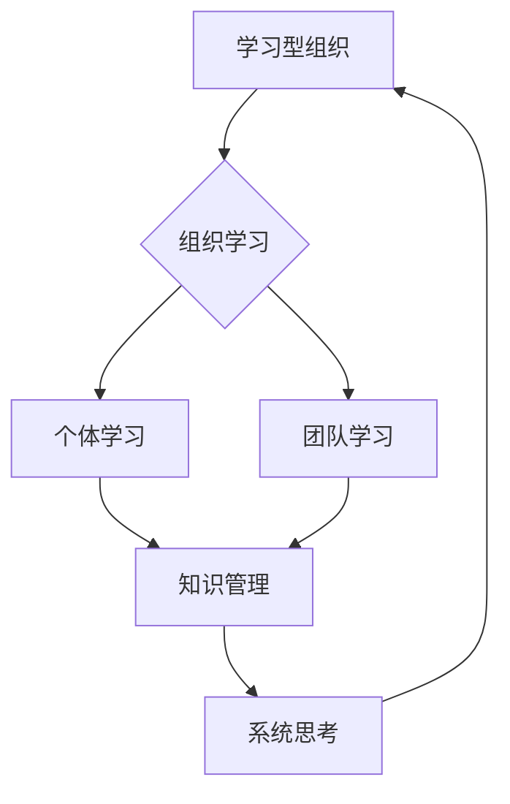

### 学习型组织的特征与优势

学习型组织具有以下特征：

1. **自我超越**：组织和个人追求不断成长和进步。
2. **心智模式**：反思和改变思维方式和行为模式。
3. **共同愿景**：组织成员共同追求的目标和价值观。
4. **团队学习**：通过协作学习提升整体能力。
5. **系统思考**：从整体和系统的角度分析和解决问题。

学习型组织的优势包括：

- **适应性强**：能够快速适应外部环境的变化。
- **创新能力**：通过知识共享和系统思考，持续创新。
- **团队合作**：增强团队成员之间的协作和信任。
- **员工满意度**：提升员工的工作满意度和归属感。

### 核心概念原理和架构的 Mermaid 流pace

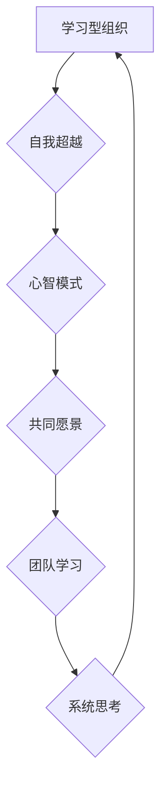

### 学习型组织的理论基础

学习型组织的理论基础主要包括心理学、系统理论和知识管理理论。

- **心理学基础**：关注个体学习动机和心理状态。
- **系统理论**：强调组织作为一个系统的整体性和互动性。
- **知识管理理论**：强调知识的重要性和如何有效管理和利用知识。

### 核心概念原理和架构的 Mermaid 流程图：

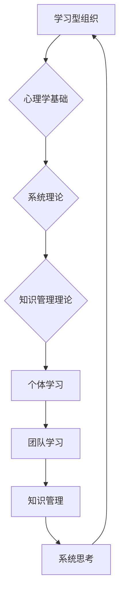

---

**接下来，我们将进一步探讨建立学习型组织的准备工作，包括领导力、文化建设和组织结构设计。**

---

## 2.1 学习型组织的领导力

### 2.1.1 领导者在学习型组织中的角色

在建立学习型组织中，领导者的角色至关重要。领导者不仅是组织的学习者和示范者，更是推动组织变革和文化建设的关键力量。

#### 领导者在学习型组织中的角色 Mermaid 流程图：

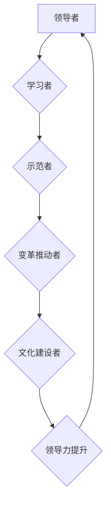

### 2.1.2 领导者在推动学习型组织建设中的策略

为了有效推动学习型组织的建设，领导者需要采取以下策略：

1. **建立学习型组织文化**：营造积极的学习氛围，鼓励知识共享和创新。
2. **提供学习资源**：为组织成员提供必要的培训、研讨和学习资源。
3. **鼓励知识共享**：建立知识共享机制，促进知识和经验的传播和应用。

#### 领导者推动学习型组织建设的策略 Mermaid 流程图：

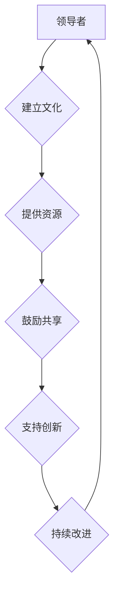

---

**接下来，我们将讨论学习型组织的文化建设，包括文化价值观的制定、团队精神的培养以及激励机制的建立。**

---

## 2.2 学习型组织的文化建设

### 2.2.1 文化建设的重要性

组织文化是学习型组织的重要支柱，它影响组织成员的行为、态度和价值观念。一个积极、开放和包容的组织文化有助于激发创新和协作。

#### 文化建设的重要性 Mermaid 流程图：

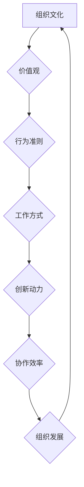

### 2.2.2 文化建设的方法

文化建设的方法包括以下几个方面：

1. **制定文化价值观**：明确组织共同追求的核心价值观，如诚信、创新、责任等。
2. **培养团队精神**：通过团队建设活动，增强组织成员之间的凝聚力和信任感。
3. **建立激励机制**：建立激励机制，鼓励组织成员积极参与学习和创新。

#### 文化建设的方法 Mermaid 流程图：

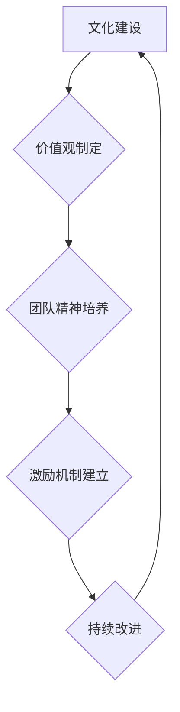

---

**接下来，我们将探讨学习型组织的组织结构设计，包括扁平化、模块化和网络化等原则。**

---

## 2.3 学习型组织的组织结构设计

### 2.3.1 组织结构对学习型组织的影响

组织结构对学习型组织的建设和运营具有重要影响。灵活、开放和扁平化的组织结构有助于促进知识共享、团队协作和持续创新。

#### 组织结构对学习型组织的影响 Mermaid 流程图：

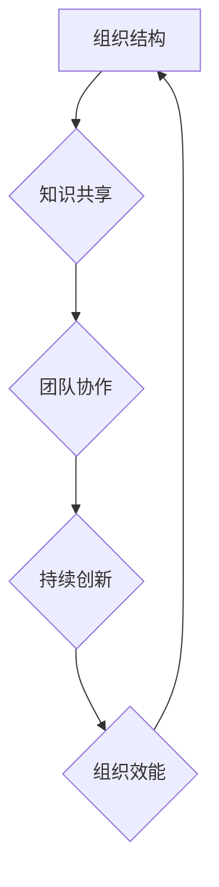

### 2.3.2 组织结构设计的原则

设计学习型组织的组织结构应遵循以下原则：

1. **扁平化**：减少管理层级，缩短决策路径，提高组织的反应速度。
2. **模块化**：将组织分解为若干个模块，每个模块具有相对独立的功能和职责，便于协作和创新。
3. **网络化**：建立网络化的组织结构，加强组织成员之间的联系和互动，促进知识的共享和传播。

#### 组织结构设计的原则 Mermaid 流程图：

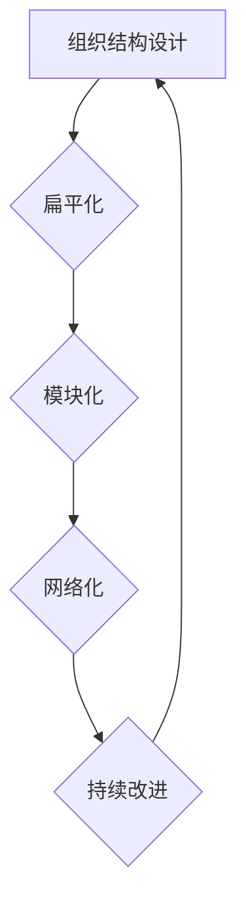

---

**至此，我们完成了第一部分的学习型组织概念与理论。接下来，我们将进入第二部分的实践与运营，探讨如何建立学习型组织的知识管理和员工学习与发展策略。**

---

## 第3章: 学习型组织的知识管理

### 3.1 知识管理的概念与作用

知识管理是指通过系统地收集、组织、存储、共享和应用知识，以提高组织的决策能力、创新能力和竞争力。知识管理的作用主要体现在以下几个方面：

1. **提高决策能力**：通过知识管理，组织可以更好地利用内外部的知识资源，提高决策的科学性和准确性。
2. **提升创新能力**：知识管理可以激发组织成员的创新思维和创造力，推动组织的持续创新和发展。
3. **增强竞争力**：知识管理可以帮助组织构建核心竞争力，提高市场竞争力。

#### 知识管理的概念与作用 Mermaid 流程图：

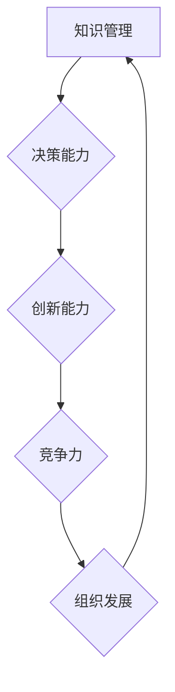

### 3.2 知识管理体系的建设

知识管理体系是指组织为了有效管理和利用知识而建立的一套制度、流程和技术体系。建设知识管理体系需要遵循以下步骤：

1. **明确知识管理目标**：确定组织知识管理的目标，如提高决策能力、提升创新能力等。
2. **进行知识资源调查**：了解组织内部的知识资源，包括显性知识和隐性知识。
3. **制定知识管理策略**：根据组织的特点和需求，制定知识管理策略，包括知识共享、知识转移、知识创新等。
4. **建立知识管理流程**：设计并实施知识管理的流程，包括知识收集、存储、共享、应用等环节。
5. **搭建知识管理平台**：建立知识管理平台，提供知识存储、共享、搜索等功能。

#### 知识管理体系的建设步骤 Mermaid 流程图：

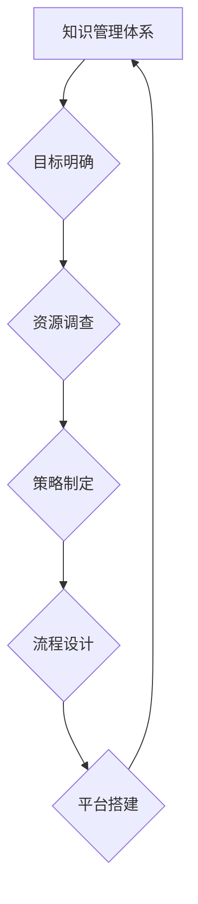

### 3.3 知识共享与传播机制

知识共享与传播机制是知识管理的重要环节，它有助于组织内部知识和经验的传播和应用。建立有效的知识共享与传播机制需要考虑以下几个方面：

1. **建立知识共享平台**：搭建一个高效、便捷的知识共享平台，方便组织成员获取和分享知识。
2. **制定知识共享政策**：明确知识共享的原则、流程和激励机制，鼓励组织成员积极参与知识共享。
3. **开展知识交流活动**：定期组织知识交流活动，如讲座、研讨会、案例分析等，促进知识的传播和应用。
4. **提供知识服务**：为组织成员提供个性化的知识服务，如定制化培训、咨询服务等，满足成员的学习和发展需求。

#### 知识共享与传播机制的关键要素 Mermaid 流程图：

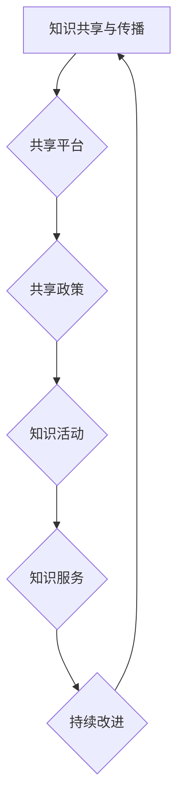

---

**在本章中，我们探讨了知识管理的概念、体系建设和共享与传播机制。接下来，我们将进一步探讨学习型组织的员工学习与发展策略，包括员工培训计划、绩效评估和职业发展规划。**

---

## 4.1 员工培训计划与实施

### 4.1.1 员工培训计划的设计

员工培训计划的设计是学习型组织建设的重要组成部分。一个有效的培训计划应包括以下几个方面：

1. **培训需求分析**：了解员工当前的知识、技能和能力水平，确定培训需求。
2. **培训目标设定**：根据培训需求，明确培训的目标，如提高专业技能、提升综合素质等。
3. **培训内容规划**：确定培训的具体内容，包括技术培训、管理培训、领导力培训等。
4. **培训方式选择**：根据培训目标和内容，选择合适的培训方式，如内训、外训、在线培训等。
5. **培训时间安排**：合理规划培训时间，确保培训计划的顺利实施。

#### 员工培训计划设计流程图：

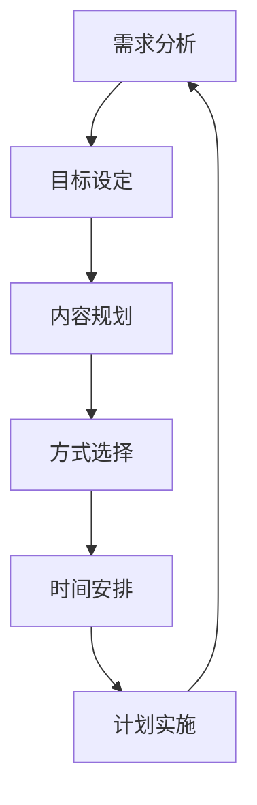

### 4.1.2 员工培训的实施

员工培训的实施是培训计划的关键环节，它关系到培训效果的实现。实施员工培训计划应遵循以下步骤：

1. **培训前的准备**：准备培训所需的教材、设备、场地等。
2. **培训过程中的管理**：对培训过程进行监控和管理，确保培训计划的顺利实施。
3. **培训效果的评估**：对培训效果进行评估，了解培训目标的实现情况。

#### 员工培训实施流程图：

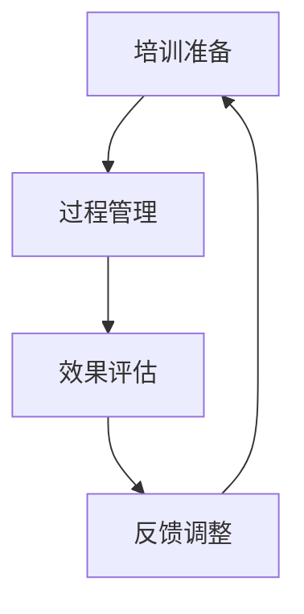

---

**接下来，我们将探讨员工绩效评估与反馈以及员工职业发展规划的相关内容。**

---

## 4.2 员工绩效评估与反馈

### 4.2.1 员工绩效评估的重要性

员工绩效评估是学习型组织管理的重要组成部分，它有助于激发员工的工作积极性、提高员工的工作效率、促进员工的个人成长。员工绩效评估的重要性体现在以下几个方面：

1. **激励员工**：通过绩效评估，可以明确员工的绩效水平，为员工提供奖励和晋升的机会。
2. **反馈与改进**：绩效评估可以帮助员工了解自身的工作表现，发现问题并进行改进。
3. **人才发展**：绩效评估是员工职业发展规划的重要依据，有助于组织为员工提供合适的发展机会。

#### 员工绩效评估的重要性 Mermaid 流程图：

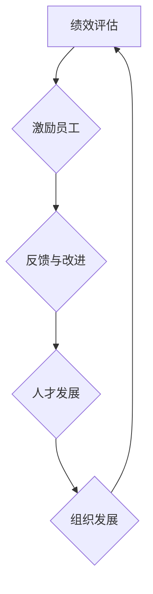

### 4.2.2 员工绩效评估的方法

员工绩效评估的方法多种多样，常用的方法包括：

1. **目标管理法**：通过设定明确的工作目标，对员工的绩效进行评估。
2. **360度评估法**：从多个角度对员工进行绩效评估，包括上级、同事、下属和员工的自我评估。
3. **关键绩效指标法**：根据关键绩效指标，对员工的工作绩效进行评估。
4. **行为事件访谈法**：通过访谈了解员工在工作中的表现和成就，进行绩效评估。

#### 员工绩效评估的方法 Mermaid 流程图：

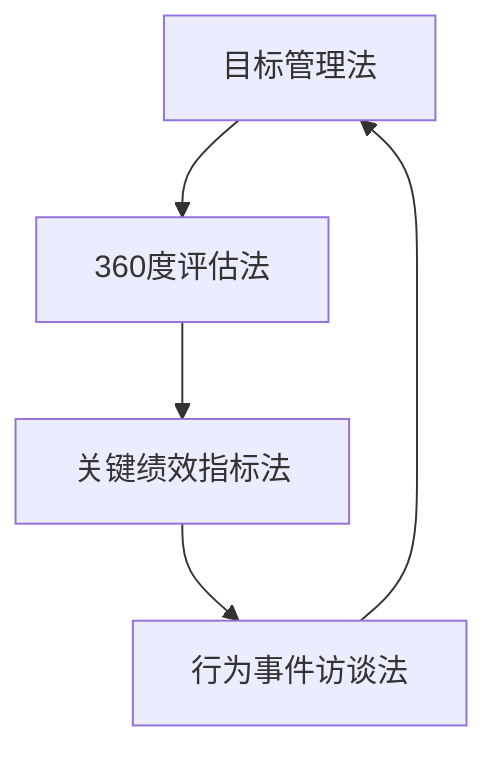

### 4.2.3 员工反馈与改进

员工反馈与改进是绩效评估的重要环节。有效的员工反馈与改进机制有助于提高员工的工作效率和满意度。以下是一些关键步骤：

1. **及时反馈**：对员工的工作进行及时反馈，指出优点和不足。
2. **个性化改进**：根据员工的反馈，制定个性化的改进计划，帮助员工提升工作能力。
3. **持续跟踪**：对员工的改进情况进行持续跟踪，确保改进措施的有效性。

#### 员工反馈与改进流程图：

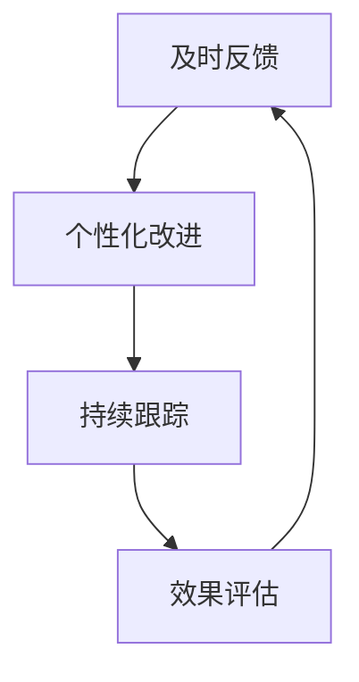

---

**接下来，我们将探讨员工职业发展规划的相关内容，包括自我评估、目标设定和规划路径。**

---

## 4.3 员工职业发展规划

### 4.3.1 员工职业发展规划的重要性

员工职业发展规划是学习型组织建设中的一项重要任务，它有助于提高员工的职业素养和满意度，促进员工的个人成长和组织的长远发展。员工职业发展规划的重要性体现在以下几个方面：

1. **明确职业目标**：通过职业发展规划，员工可以明确自己的职业目标，为未来的发展指明方向。
2. **提升职业素养**：职业发展规划可以帮助员工提升专业技能、管理能力和综合素质。
3. **激励员工**：职业发展规划为员工提供了职业发展的期望和机会，有助于提高员工的工作积极性和忠诚度。

#### 员工职业发展规划的重要性 Mermaid 流程图：

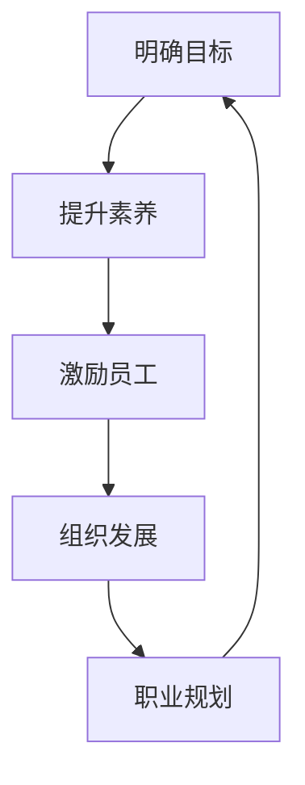

### 4.3.2 员工职业发展规划的步骤

制定员工职业发展规划需要遵循以下步骤：

1. **自我评估**：员工对自己的职业兴趣、职业能力和职业价值观进行评估，了解自己的优势和不足。
2. **目标设定**：根据自我评估的结果，设定明确的职业目标，如晋升、技能提升等。
3. **规划路径**：制定实现职业目标的路径，包括所需的知识和技能、经验和能力等。
4. **行动计划**：制定具体的行动计划，包括学习、培训、实践等。
5. **定期评估**：定期评估职业发展规划的实现情况，根据评估结果进行调整。

#### 员工职业发展规划的步骤 Mermaid 流程图：

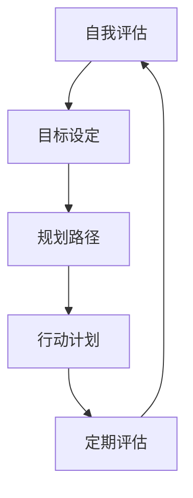

---

**在本章中，我们探讨了员工培训计划、绩效评估和职业发展规划的相关内容。接下来，我们将进入第五章，讨论团队学习与协作的相关策略和工具。**

---

## 5.1 团队学习机制

### 5.1.1 团队学习的重要性

团队学习是学习型组织中不可或缺的一部分，它有助于提升团队的整体能力和协作效率。团队学习的重要性体现在以下几个方面：

1. **增强团队凝聚力**：通过共同学习和合作，团队成员之间的关系更加紧密，团队凝聚力得到提升。
2. **提高团队创造力**：团队学习激发团队成员的创造力和创新思维，促进团队的创新和发展。
3. **优化团队协作**：通过团队学习，团队成员能够更好地理解彼此的工作和职责，优化团队协作流程。

#### 团队学习的重要性 Mermaid 流程图：

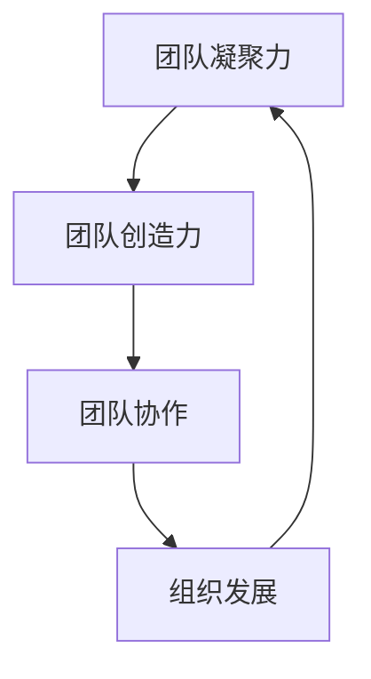

### 5.1.2 团队学习的方式

团队学习的方式多种多样，包括但不限于以下几种：

1. **集体讨论**：通过集体讨论，团队成员可以分享观点、讨论问题，共同寻找解决方案。
2. **案例研究**：通过分析案例，团队成员可以学习实际问题的处理方法和经验教训。
3. **头脑风暴**：通过头脑风暴，团队成员可以自由发表想法，激发创新思维。
4. **团队建设活动**：通过团队建设活动，如拓展训练、团队游戏等，增强团队成员的相互了解和信任。

#### 团队学习的方式 Mermaid 流程图：

```mermaid
graph TD
A[集体讨论] --> B[案例研究]
B --> C[头脑风暴]
C --> D[团队建设活动]
D --> A
```

### 5.1.3 团队学习的效果评估

团队学习的效果评估是确保团队学习目标实现的重要环节。评估团队学习效果的方法包括：

1. **学习成果评估**：评估团队学习后所取得的成果，如知识、技能、经验的积累等。
2. **团队协作评估**：评估团队学习后，团队协作效率的提高情况。
3. **个人成长评估**：评估团队成员在学习过程中的个人成长和进步。

#### 团队学习的效果评估 Mermaid 流程图：

```mermaid
graph TD
A[学习成果评估] --> B[团队协作评估]
B --> C[个人成长评估]
C --> D[持续改进]
D --> A
```

---

**接下来，我们将探讨团队协作工具与平台的选择和使用，以及团队文化建设与维护的方法。**

---

## 5.2 团队协作工具与平台

### 5.2.1 团队协作工具的选择

选择适合的团队协作工具对于提高团队协作效率至关重要。选择团队协作工具时应考虑以下几个因素：

1. **功能需求**：根据团队的工作需求，选择具有相应功能的协作工具。
2. **易用性**：选择易于使用和维护的协作工具，提高团队的工作效率。
3. **安全性**：确保协作工具的安全性能，保护团队数据的安全。
4. **兼容性**：确保协作工具与其他系统或工具的兼容性，便于团队的协作和沟通。

#### 团队协作工具选择流程图：

```mermaid
graph TD
A[功能需求] --> B[易用性]
B --> C[安全性]
C --> D[兼容性]
D --> E[工具评估]
E --> F[选择工具]
F --> A
```

### 5.2.2 常见的团队协作工具

常见的团队协作工具包括以下几种：

1. **项目管理系统**：如Trello、Asana等，用于项目规划和任务分配。
2. **文档协作工具**：如Google Docs、Microsoft Teams等，用于文档的编辑和共享。
3. **即时通讯工具**：如Slack、微信等，用于团队的实时沟通和协作。
4. **视频会议工具**：如Zoom、Microsoft Teams等，用于远程会议和在线协作。

#### 常见的团队协作工具列表：

```mermaid
graph TD
A[项目管理工具] --> B[Trello]
B --> C[Asana]
A --> D[文档协作工具]
D --> E[Google Docs]
D --> F[Microsoft Teams]
A --> G[即时通讯工具]
G --> H[Slack]
G --> I[微信]
A --> J[视频会议工具]
J --> K[Zoom]
J --> L[Microsoft Teams]
```

### 5.2.3 团队协作工具的使用

团队协作工具的使用需要遵循以下原则：

1. **明确分工**：明确每个成员的职责和任务，确保任务分配合理。
2. **实时沟通**：通过即时通讯工具，保持团队成员之间的实时沟通，提高协作效率。
3. **文档共享**：利用文档协作工具，确保文档的实时更新和共享，提高工作效率。
4. **任务跟踪**：利用项目管理系统，对任务进度进行实时跟踪和管理，确保任务按时完成。

#### 团队协作工具使用原则 Mermaid 流程图：

```mermaid
graph TD
A[明确分工] --> B[实时沟通]
B --> C[文档共享]
C --> D[任务跟踪]
D --> E[持续改进]
E --> A
```

---

**接下来，我们将探讨团队文化建设的原则、策略和实践方法。**

---

## 5.3 团队文化建设与维护

### 5.3.1 团队文化建设的重要性

团队文化建设是团队学习与协作的重要保障，它有助于增强团队的凝聚力、信任感和协作效率。团队文化建设的重要性体现在以下几个方面：

1. **增强团队凝聚力**：共同的文化价值观和行为准则有助于团队成员之间的紧密联系和相互支持。
2. **提高协作效率**：团队文化可以规范团队成员的行为，减少协作中的冲突和误解，提高协作效率。
3. **促进个人成长**：团队文化可以激发团队成员的积极性和创造力，促进个人的成长和发展。

#### 团队文化建设的重要性 Mermaid 流程图：

```mermaid
graph TD
A[增强凝聚力] --> B[提高效率]
B --> C[促进成长]
C --> D[组织发展]
D --> A
```

### 5.3.2 团队文化建设的原则

团队文化建设应遵循以下原则：

1. **共识性**：团队文化应该是团队成员共同认可和遵循的价值观和行为准则。
2. **适应性**：团队文化应该能够适应组织内外部环境的变化，保持持续性和灵活性。
3. **激励性**：团队文化应该能够激发团队成员的积极性和创造力，促进团队的发展。
4. **包容性**：团队文化应该包容多样性和个性，尊重团队成员的差异。

#### 团队文化建设原则 Mermaid 流程图：

```mermaid
graph TD
A[共识性] --> B[适应性]
B --> C[激励性]
C --> D[包容性]
D --> A
```

### 5.3.3 团队文化建设的策略

团队文化建设需要采取一系列策略，包括：

1. **树立榜样**：通过树立团队中的榜样人物，传递团队文化和价值观。
2. **开展活动**：通过组织各类团队活动，增强团队成员之间的互动和信任。
3. **制定制度**：通过制定相关的制度和文化规范，确保团队文化的落地和执行。
4. **宣传推广**：通过内部宣传和外部交流，提升团队文化的知名度和影响力。

#### 团队文化建设策略 Mermaid 流程图：

```mermaid
graph TD
A[树立榜样] --> B[开展活动]
B --> C[制定制度]
C --> D[宣传推广]
D --> E[持续改进]
E --> A
```

---

**在本章中，我们探讨了团队学习与协作的相关策略和工具，以及团队文化建设与维护的方法。接下来，我们将进入第六章，讨论组织学习与创新的相关内容。**

---

## 6.1 创新思维的培养

### 6.1.1 创新思维的概念

创新思维是指运用创造性思维的方法和技巧，产生新颖、独特和有价值的想法和解决方案。创新思维是推动组织持续发展的关键因素。

#### 创新思维的概念 Mermaid 流程图：

```mermaid
graph TD
A[创新思维] --> B{创造性思维}
B --> C{新颖想法}
C --> D{解决方案}
D --> E{价值创造}
E --> A
```

### 6.1.2 创新思维的方法

培养创新思维的方法包括：

1. **头脑风暴法**：通过集思广益，激发创意的产生。
2. **思维导图法**：通过图形化的方式，整理和展示思维过程和创意。
3. **联想思维法**：通过不同事物之间的联系，产生新的创意。
4. **逆向思维法**：从相反的角度思考问题，寻找新的解决方案。

#### 创新思维的方法 Mermaid 流程图：

```mermaid
graph TD
A[头脑风暴法] --> B[思维导图法]
B --> C[联想思维法]
C --> D[逆向思维法]
D --> E[持续改进]
E --> A
```

### 6.1.3 创新思维的训练

创新思维的训练可以通过以下方式：

1. **参加创新培训**：参加专业的创新培训课程，学习创新思维的方法和技巧。
2. **阅读创新书籍**：阅读有关创新思维和创新的书籍，了解各种创新案例和经验。
3. **实践练习**：通过实际项目的实践，锻炼创新思维的能力。

#### 创新思维的训练 Mermaid 流程图：

```mermaid
graph TD
A[创新培训] --> B[阅读书籍]
B --> C[实践练习]
C --> D[持续学习]
D --> E[效果评估]
E --> A
```

---

**接下来，我们将探讨组织学习与创新的具体实践，包括创新项目的管理、创新成果的转化与应用。**

---

## 6.2 创新项目的管理

### 6.2.1 创新项目的定义

创新项目是指以创新为核心，旨在开发新产品、新技术、新服务或新商业模式的项目。创新项目是组织实现持续发展的关键途径。

#### 创新项目的定义 Mermaid 流程图：

```mermaid
graph TD
A[创新项目] --> B{新产品}
B --> C{新技术}
C --> D{新服务}
D --> E{新商业模式}
E --> A
```

### 6.2.2 创新项目的管理原则

创新项目的管理应遵循以下几个原则：

1. **目标导向**：明确创新项目的目标，确保项目的方向和效果。
2. **团队协作**：建立高效的团队，发挥团队成员的协同作用，提高创新效率。
3. **持续迭代**：通过持续的迭代和优化，不断完善创新项目的成果。
4. **风险控制**：识别和控制创新项目中的风险，确保项目的顺利进行。

#### 创新项目的管理原则 Mermaid 流程图：

```mermaid
graph TD
A[目标导向] --> B[团队协作]
B --> C[持续迭代]
C --> D[风险控制]
D --> E[效果评估]
E --> A
```

### 6.2.3 创新项目的管理方法

创新项目的管理方法包括以下几个环节：

1. **项目计划**：制定详细的项目计划，明确项目的目标、任务、时间表和资源。
2. **团队协作**：利用协作工具和平台，实现团队成员之间的有效沟通和协作。
3. **进度监控**：对项目的进度和质量进行监控，及时发现和解决问题。
4. **成果评估**：对创新项目的成果进行评估，总结经验教训，为后续项目提供参考。

#### 创新项目的管理方法 Mermaid 流程图：

```mermaid
graph TD
A[项目计划] --> B[团队协作]
B --> C[进度监控]
C --> D[成果评估]
D --> E[持续改进]
E --> A
```

---

**接下来，我们将探讨如何转化和应用创新成果，以实现组织的持续发展。**

---

## 6.3 创新成果的转化与应用

### 6.3.1 创新成果转化的意义

创新成果的转化是将创新项目中的创新想法和成果转化为实际产品、服务或商业模式的过程。创新成果的转化对于组织的持续创新和发展具有重要意义。

#### 创新成果转化的意义 Mermaid 流程图：

```mermaid
graph TD
A[创新成果] --> B{产品化}
B --> C{服务化}
C --> D{商业化}
D --> E{持续发展}
E --> A
```

### 6.3.2 创新成果转化的策略

创新成果的转化需要采取一系列策略，包括：

1. **市场调研**：通过市场调研，了解目标市场的需求和发展趋势，为创新成果的转化提供依据。
2. **商业模式设计**：根据市场需求，设计合适的商业模式，确保创新成果的可持续发展。
3. **知识产权保护**：对创新成果进行知识产权保护，防止技术泄露和侵权行为。
4. **推广与应用**：通过有效的推广和应用，将创新成果推向市场，实现商业价值。

#### 创新成果转化的策略 Mermaid 流程图：

```mermaid
graph TD
A[市场调研] --> B[商业模式设计]
B --> C[知识产权保护]
C --> D[推广与应用]
D --> E[效果评估]
E --> A
```

### 6.3.3 创新成果转化的实践案例

创新成果转化的实践案例包括：

- **华为公司**：通过持续的研发投入和市场化运作，将创新技术转化为实际产品，如5G技术和智能手机等。
- **特斯拉公司**：通过创新的设计和商业模式，将电动汽车推向市场，引领了新能源汽车的发展。
- **3M公司**：通过鼓励员工创新和专利授权，将创新成果转化为实际产品，如透明胶带和Post-it便签等。

#### 创新成果转化的实践案例 Mermaid 流程图：

```mermaid
graph TD
A[华为] --> B{5G技术}
B --> C{智能手机}
A --> D[特斯拉]
D --> E{电动汽车}
A --> F[3M]
F --> G{透明胶带}
F --> H{Post-it便签}
```

---

**在本章中，我们探讨了创新思维的培养、创新项目的管理和创新成果的转化与应用。接下来，我们将进入第七章，讨论学习型组织的评估与改进策略。**

---

## 7.1 学习型组织的评估方法

### 7.1.1 评估指标体系设计

学习型组织的评估需要建立一套完整的指标体系，以全面、客观地评估学习型组织的建设状况。评估指标体系应包括以下几个方面：

1. **学习氛围**：评估组织内部的学习氛围，如员工的学习意愿、学习机会和学习资源等。
2. **知识管理**：评估组织在知识管理方面的表现，如知识的收集、存储、共享和应用等。
3. **创新成果**：评估组织在创新方面的成果，如新产品的开发、新技术的应用和商业模式的创新等。
4. **团队协作**：评估组织的团队协作能力，如团队的沟通效率、协作效果和团队精神等。
5. **员工发展**：评估员工在组织中的成长和发展，如员工的职业发展、技能提升和满意度等。

#### 评估指标体系设计 Mermaid 流程图：

```mermaid
graph TD
A[学习氛围] --> B{知识管理}
B --> C{创新成果}
C --> D{团队协作}
D --> E{员工发展}
E --> F{综合评估}
F --> A
```

### 7.1.2 评估工具与数据收集

评估工具的选择和数据收集的方法对于评估结果的准确性和有效性具有重要影响。常用的评估工具包括问卷调查、访谈、观察和数据分析等。

1. **问卷调查**：通过设计问卷，收集员工对学习型组织建设状况的反馈，了解员工对学习氛围、知识管理、创新成果和团队协作等方面的评价。
2. **访谈**：通过与员工进行面对面访谈，深入了解员工对学习型组织建设的真实感受和看法，获取更深入的信息。
3. **观察**：通过现场观察，了解组织内部的学习活动、知识共享和团队协作等情况，获取直观的评估数据。
4. **数据分析**：通过对组织内部的数据进行分析，如培训次数、知识共享量、创新成果数量等，评估学习型组织的建设效果。

#### 评估工具与数据收集方法 Mermaid 流程图：

```mermaid
graph TD
A[问卷调查] --> B{访谈}
B --> C{观察}
C --> D{数据分析}
D --> E{数据整合}
E --> F{评估结果}
F --> A
```

### 7.1.3 评估结果分析

评估结果分析是评估过程的重要环节，通过对评估数据的分析，可以了解学习型组织建设的现状和存在的问题。评估结果分析应包括以下几个方面：

1. **优势分析**：分析组织在建设学习型组织过程中的优势，如良好的学习氛围、有效的知识管理和较高的团队协作水平等。
2. **劣势分析**：分析组织在建设学习型组织过程中存在的劣势，如学习氛围不足、知识管理不到位、团队协作不力等。
3. **改进空间**：根据评估结果，找出组织在建设学习型组织过程中的改进空间，为下一步的改进措施提供依据。

#### 评估结果分析 Mermaid 流程图：

```mermaid
graph TD
A[优势分析] --> B{劣势分析}
B --> C{改进空间}
C --> D{行动计划}
D --> E{效果评估}
E --> A
```

### 7.1.4 反馈与沟通

评估结果的反馈与沟通是评估过程的关键环节，通过有效的反馈与沟通，可以确保评估结果被组织内部所接受，并转化为具体的改进措施。

1. **内部反馈**：将评估结果向组织内部进行反馈，让员工了解学习型组织建设的现状和存在的问题，激发员工的改进意识和参与热情。
2. **外部反馈**：将评估结果向外部专家或同行进行反馈，借鉴外部经验和建议，为组织的学习型组织建设提供参考。
3. **沟通渠道**：建立有效的沟通渠道，如定期召开评估结果反馈会议、设立评估结果反馈信箱等，确保评估结果得到及时、有效的反馈。

#### 反馈与沟通 Mermaid 流程图：

```mermaid
graph TD
A[内部反馈] --> B{外部反馈}
B --> C{沟通渠道}
C --> D{改进实施}
D --> E{效果跟踪}
E --> A
```

---

**在本章中，我们探讨了学习型组织的评估方法，包括指标体系设计、评估工具选择、评估结果分析和反馈与沟通。接下来，我们将进入第八章，讨论学习型组织的改进策略。**

---

## 8.1 学习型组织的改进策略

### 8.1.1 存在问题的识别与解决

在建立学习型组织的过程中，可能会遇到各种问题，如学习氛围不浓厚、知识管理不到位、团队协作不力等。为了有效解决这些问题，首先需要对其进行识别。

#### 存在问题的识别与解决 Mermaid 流程图：

```mermaid
graph TD
A[识别问题] --> B{分析原因}
B --> C{制定方案}
C --> D{实施改进}
D --> E{评估效果}
E --> A
```

### 8.1.2 改进措施的实施与监控

为了确保改进措施的有效实施，需要制定详细的实施计划，明确责任人和时间节点。

#### 改进措施的实施与监控 Mermaid 流程图：

```mermaid
graph TD
A[制定计划] --> B{明确责任}
B --> C{实施监控}
C --> D{评估效果}
D --> E{反馈调整}
E --> A
```

### 8.1.3 持续改进的组织文化

持续改进是学习型组织的核心特征，它有助于组织不断适应外部环境的变化，提高组织的竞争力和创新能力。

#### 持续改进的组织文化 Mermaid 流程图：

```mermaid
graph TD
A[持续学习] --> B{知识共享}
B --> C{创新思维}
C --> D{团队协作}
D --> E{文化塑造}
E --> A
```

### 8.1.4 改进策略的实践案例

通过实践案例，可以更好地理解学习型组织改进策略的实际应用。

#### 改进策略的实践案例 Mermaid 流程图：

```mermaid
graph TD
A[案例1] --> B{华为}
B --> C{创新技术转化}
C --> D{市场成功}
D --> E{持续发展}
E --> A
A --> F[案例2]
F --> G{特斯拉}
G --> H{电动汽车市场}
H --> I{行业领先}
I --> J{企业文化}
J --> K{持续改进}
K --> L{成功实践}
L --> A
```

---

**在本章中，我们讨论了学习型组织的改进策略，包括问题识别与解决、改进措施的实施与监控、持续改进的组织文化以及实践案例。接下来，我们将进入第九章，总结学习型组织建设的关键点。**

---

## 第9章: 总结与展望

### 9.1 学习型组织建设的关键点

通过前面的讨论，我们可以总结出学习型组织建设的关键点：

1. **领导力**：领导者是推动学习型组织建设的关键力量，需要具备自我超越、反思变革的能力。
2. **文化建设**：组织文化是学习型组织的灵魂，需要建立共识性、适应性、激励性和包容性的文化。
3. **知识管理**：知识管理是学习型组织的基础，需要建立知识管理体系，实现知识的收集、存储、共享和应用。
4. **团队协作**：团队协作是学习型组织的保障，需要建立有效的团队协作机制，提高团队的整体效能。
5. **创新思维**：创新思维是学习型组织的动力，需要培养创新思维，激发组织的创造力。
6. **持续改进**：持续改进是学习型组织的核心特征，需要建立持续改进的文化，不断提高组织的竞争力。

#### 学习型组织建设的关键点 Mermaid 流程图：

```mermaid
graph TD
A[领导力] --> B{文化建设}
B --> C{知识管理}
C --> D{团队协作}
D --> E{创新思维}
E --> F{持续改进}
F --> G{组织发展}
G --> A
```

### 9.2 学习型组织的未来展望

随着全球化和信息化的不断深入，学习型组织将成为未来组织发展的主流趋势。学习型组织的未来展望包括：

1. **智能化**：利用人工智能和大数据技术，实现知识管理的智能化，提高组织的决策能力和创新效率。
2. **个性化**：根据员工的需求和特点，提供个性化的学习和发展路径，提高员工的满意度和忠诚度。
3. **生态化**：建立学习型组织生态体系，整合内外部资源，实现知识的共享和创新。
4. **全球化**：利用全球化的视野和资源，推动组织的全球化发展，提高组织的国际竞争力。

#### 学习型组织的未来展望 Mermaid 流程图：

```mermaid
graph TD
A[智能化] --> B{个性化}
B --> C{生态化}
C --> D{全球化}
D --> E{持续发展}
E --> A
```

---

**在本章中，我们对学习型组织建设的关键点和未来展望进行了总结和讨论。通过本文的阅读，读者应能够全面理解学习型组织的概念、建设方法和实践策略，为组织的发展提供有益的参考。**

---

**作者信息：**
作者：AI天才研究院/AI Genius Institute
著作：《学习型组织建设：打造持续进步的团队》

**结语：**
本文通过系统地介绍学习型组织的概念、理论和实践方法，旨在帮助读者深入了解学习型组织的建设策略和运营模式。学习型组织的建设不仅需要领导者的引领，还需要组织成员的共同参与和持续努力。通过建立学习型组织，组织可以不断提升自身的竞争力，实现持续发展和进步。希望本文能为读者在组织建设过程中提供有价值的启示和帮助。**

