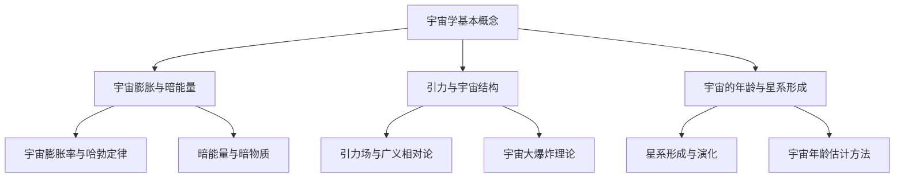

                 

# 《宇宙是否存在于人类语言的描述之外》

> **关键词：** 宇宙、人类语言、描述能力、数学模型、物理描述、跨语言沟通、宇宙学、语言哲学

> **摘要：** 本文探讨了宇宙是否存在人类语言无法描述的现象。通过分析宇宙学的核心概念、人类语言的表达能力以及宇宙观测技术，我们探讨了宇宙语言的可描述性。随后，本文探讨了跨语言宇宙沟通的挑战与实践，最后总结了宇宙与人类语言的关系及其未来研究方向。

## 《宇宙是否存在于人类语言的描述之外》目录大纲

### 第一部分：宇宙与人类语言的探索

#### 第1章：宇宙的起源与演化

#### 第2章：人类语言的表达能力

### 第二部分：宇宙语言的可描述性

#### 第3章：宇宙语言的数学描述

#### 第4章：宇宙语言的物理描述

### 第三部分：跨语言宇宙的沟通

#### 第5章：跨语言宇宙沟通的挑战

#### 第6章：跨语言宇宙沟通的实践

### 第四部分：总结与展望

#### 第7章：宇宙与人类语言的未来

### 附录

#### 附录 A：宇宙语言研究的重要论文与著作

#### 附录 B：宇宙语言研究的实用工具

### Mermaid 流程图

### 伪代码

### 数学模型和数学公式

### 项目实战

### 代码解读与分析

## 引言

在人类的认知历程中，宇宙一直是人类探索的终极目标之一。宇宙的浩瀚、神秘以及无穷无尽的奥秘，激发着人类不断追求知识和理解世界。然而，宇宙的复杂性也使得人类对于宇宙的认知充满了挑战。在这一过程中，人类语言作为一种重要的沟通工具，成为了我们理解和描述宇宙现象的关键。

人类语言具备独特的结构，能够表达复杂的概念和关系。然而，语言的表达能力是否足以描述宇宙的每一个细节和现象？宇宙是否存在一些现象，超出了人类语言的描述范畴？本文将探讨这些问题，分析宇宙与人类语言之间的关系，以及人类是否能够通过语言完全理解宇宙。

本文首先回顾宇宙的起源与演化，探讨人类语言的表达能力，然后介绍宇宙观测技术，分析宇宙语言的可描述性。接下来，我们将探讨跨语言宇宙沟通的挑战与实践，最后总结宇宙与人类语言的关系及其未来研究方向。

## 第一部分：宇宙与人类语言的探索

### 第1章：宇宙的起源与演化

#### 1.1 宇宙学基本概念

宇宙学是一门研究宇宙的起源、演化、结构和组成等基本问题的学科。宇宙学的研究对象包括宇宙的起源、宇宙膨胀、星系形成、黑洞以及宇宙背景辐射等。宇宙学的核心概念包括宇宙膨胀、引力、暗物质和暗能量等。

宇宙膨胀是指宇宙在时间上的膨胀，这一现象最早由埃德温·哈勃在20世纪20年代发现。哈勃通过观测星系的红移现象，发现宇宙正在膨胀。这一发现为宇宙膨胀理论提供了强有力的证据。

引力是宇宙中物体之间相互吸引的力。引力在宇宙尺度上起着至关重要的作用，它决定了星系的形成和演化。爱因斯坦的广义相对论为引力提供了数学描述，将引力视为时空的弯曲。

暗物质和暗能量是宇宙学中的两个重要概念。暗物质是指我们无法直接观测到的物质，它对宇宙的引力场有显著影响。暗能量则是一种推动宇宙膨胀的力量，具有负压力。

#### 1.2 宇宙膨胀与暗能量

宇宙膨胀是指宇宙在时间上的膨胀。根据哈勃定律，宇宙的膨胀速度与距离成正比。这个比例常数被称为哈勃常数（\( H_0 \)），其数值约为70千米每秒每百万秒差距。

暗能量是一种推动宇宙膨胀的力量，具有负压力。暗能量的存在和性质是宇宙学中的一个重要问题。目前，科学家们普遍认为，暗能量占据了宇宙总能量的大部分，但其具体性质和机制尚不清楚。

宇宙膨胀和暗能量之间的关系是宇宙学中的一个重要课题。科学家们通过观测宇宙背景辐射、星系分布、宇宙大爆炸遗迹等，试图了解暗能量的性质和演化。

#### 1.3 引力与宇宙结构

引力是宇宙中物体之间相互吸引的力。引力在宇宙尺度上起着至关重要的作用，它决定了星系的形成和演化。爱因斯坦的广义相对论为引力提供了数学描述，将引力视为时空的弯曲。

在宇宙尺度上，引力影响星系的形成和演化。通过观测星系的运动轨迹，科学家们发现了星系之间的引力相互作用。引力还影响了宇宙的大尺度结构，如星系团和超星系团的形成。

引力与宇宙结构之间的关系是宇宙学中的一个重要问题。通过观测和分析宇宙的大尺度结构，科学家们试图了解引力的性质和演化。

#### 1.4 宇宙的年龄与星系形成

宇宙的年龄是宇宙学研究的一个重要问题。根据宇宙背景辐射的测量和宇宙膨胀模型，科学家们估计宇宙的年龄约为138亿年。

星系的形成是宇宙演化的重要过程。科学家们通过观测和模拟，发现星系的形成与宇宙背景辐射、星际介质、引力相互作用等因素密切相关。

宇宙的年龄与星系形成之间的关系是宇宙学中的一个重要课题。通过观测宇宙背景辐射、星系形成过程等，科学家们试图了解宇宙的年龄和星系形成的历史。

### 第2章：人类语言的表达能力

#### 2.1 语言的结构与功能

人类语言是一种复杂的符号系统，具有独特的结构和功能。语言的结构包括语音、词汇、语法和语义等组成部分。

语音是语言的声音表现形式，包括音素、音节和声调等。语音的多样性使得语言具有丰富的表达形式。

词汇是语言的基本单位，包括名词、动词、形容词、副词等。词汇的丰富性使得语言能够表达各种概念和事物。

语法是语言的规则体系，包括词法、句法、词序等。语法的规则性使得语言具有系统的结构。

语义是语言的意义体系，包括词义、句义和语用等。语义的丰富性使得语言能够表达复杂的思维和情感。

语言的功能包括交际、思维、认知和文化传承等。语言作为人类的主要沟通工具，使人们能够相互交流信息，分享思想和情感。

#### 2.2 语言表达的局限性与扩展性

尽管语言具有强大的表达功能，但语言也存在一些局限性。首先，语言的表达能力受限于词汇和语法规则。语言的词汇量是有限的，无法描述所有可能的事物和概念。其次，语法规则也有局限性，无法表达所有复杂的思维和逻辑关系。

然而，人类具有高度的创造力，能够通过隐喻、比喻、抽象等手段扩展语言的表达能力。隐喻和比喻通过将一种事物与另一种事物进行类比，使语言能够表达更丰富的含义。抽象则是通过提炼事物的主要特征，使语言能够表达更复杂的概念。

#### 2.3 语言在认知与思考中的作用

语言不仅是沟通的工具，也是认知和思考的基础。语言帮助人类形成概念、组织和分析信息。语言与思维紧密相关，语言的表达方式影响人们的思考方式。

语言在认知中的作用包括：

1. 概念形成：语言帮助人类将经验分类，形成概念。概念是思维的基本单位，使人们能够理解世界。

2. 信息组织：语言使人们能够组织和分析信息。通过语言，人们能够构建逻辑思维链条，推理和解决问题。

3. 认知扩展：语言使人们能够跨越时空界限，交流信息和知识。语言使人类的认知能力得到扩展。

4. 文化传承：语言是文化的重要组成部分，通过语言，文化得以传承和发展。语言是文化传承的载体。

### 第3章：宇宙观测与探测技术

#### 3.1 望远镜与技术发展

望远镜是观测宇宙的重要工具，它通过放大远处天体的光线，使人类能够观测到宇宙的细节。望远镜的发展经历了从古代的肉眼观测到现代的高性能光学和射电望远镜的演变。

光学望远镜是观测宇宙的主要工具，通过收集和放大光学波段的光线，使人类能够观测到星系、行星、恒星和星云等天体。光学望远镜的发展离不开反射镜和透镜技术的进步。反射镜能够收集更多的光线，提高望远镜的灵敏度。

射电望远镜是观测宇宙射电波的主要工具，通过接收来自宇宙的无线电波，使人类能够研究星系、星云和黑洞等天体。射电望远镜的发展离不开天线技术和接收器技术的进步。

太空望远镜是观测宇宙的又一重要工具，它通过在太空中避免地球大气层的干扰，使人类能够更清晰地观测宇宙。哈勃太空望远镜和詹姆斯·韦伯太空望远镜是典型的太空望远镜，它们在宇宙观测中发挥了重要作用。

#### 3.2 宇宙探测的挑战与机遇

宇宙探测面临着诸多挑战，包括宇宙尺度的巨大差异、宇宙环境的极端条件、宇宙辐射的干扰等。然而，这些挑战也带来了巨大的机遇。

宇宙尺度的巨大差异要求探测技术具有极高的灵敏度和分辨率。为了观测遥远的星系和星云，望远镜需要具有极高的放大能力和探测能力。

宇宙环境的极端条件对探测技术提出了严格要求。宇宙空间中存在大量的宇宙射线、微流星体和辐射，这些环境因素对探测设备的耐久性和可靠性提出了挑战。

宇宙辐射的干扰是宇宙探测的一个重要问题。宇宙射线和其他辐射会对探测信号产生干扰，使探测结果受到影响。为了降低干扰，探测技术需要具备强大的抗干扰能力。

尽管面临诸多挑战，宇宙探测也带来了巨大的机遇。通过宇宙探测，人类能够更深入地了解宇宙的起源、演化、结构和组成。宇宙探测技术不断进步，为人类揭开宇宙之谜提供了有力支持。

### 第二部分：宇宙语言的可描述性

#### 第3章：宇宙语言的数学描述

宇宙语言的数学描述是宇宙学中的重要研究方向，通过数学模型和公式，人类能够以更精确和系统的方式描述宇宙现象。数学在宇宙学中的应用使得宇宙的许多复杂现象变得可理解和可预测。

#### 3.1 宇宙学的数学模型

宇宙学的数学模型主要包括宇宙膨胀模型、黑洞模型和引力波模型等。

**宇宙膨胀模型**

宇宙膨胀模型是描述宇宙随时间膨胀的数学模型。最著名的宇宙膨胀模型是哈勃定律，它描述了宇宙膨胀速率与宇宙距离之间的关系。哈勃定律可以用以下公式表示：

$$
H(z) = H_0 \times (1 + z)
$$

其中，\( H(z) \) 是宇宙膨胀率，\( H_0 \) 是哈勃常数，\( z \) 是宇宙红移。哈勃常数 \( H_0 \) 的数值约为70千米每秒每百万秒差距，表示宇宙每膨胀一个单位距离，速度增加70千米每秒。

**黑洞模型**

黑洞是宇宙中最神秘和最具挑战性的现象之一。黑洞的数学描述主要基于爱因斯坦的广义相对论。广义相对论中的引力场方程是描述黑洞性质的关键数学模型：

$$
G_{\mu\nu} + \Lambda g_{\mu\nu} = \frac{8\pi G}{c^4} T_{\mu\nu}
$$

其中，\( G_{\mu\nu} \) 是引力场张量，\( \Lambda \) 是宇宙学常数，\( G \) 是引力常数，\( c \) 是光速，\( T_{\mu\nu} \) 是能量-动量张量。这个方程描述了引力场与物质和能量分布之间的关系。

**引力波模型**

引力波是宇宙中的一种重要现象，它由质量加速运动产生，能够传递能量和信息。引力波的数学描述基于爱因斯坦的广义相对论，可以用以下公式表示：

$$
G_{\mu\nu} - \frac{1}{2} R_{\mu\nu} + \Lambda g_{\mu\nu} = \frac{8\pi G}{c^4} T_{\mu\nu}
$$

其中，\( R_{\mu\nu} \) 是里奇张量，表示时空的曲率。

#### 3.2 数学公式与宇宙语言

数学公式在宇宙学中扮演着重要的角色，它们不仅是描述宇宙现象的工具，也是宇宙语言的一部分。通过数学公式，人类能够以简洁和精确的方式表达宇宙的复杂结构。

**德西卡定律**

德西卡定律是一个描述宇宙膨胀的公式，它由埃德温·哈勃提出。德西卡定律可以用以下公式表示：

$$
\frac{dV}{dt} = H \times V
$$

其中，\( \frac{dV}{dt} \) 是宇宙体积的变化率，\( H \) 是哈勃常数，\( V \) 是宇宙的体积。德西卡定律揭示了宇宙体积随时间膨胀的规律。

**广义相对论**

广义相对论是描述引力和宇宙现象的数学理论。广义相对论的引力场方程可以用以下公式表示：

$$
G_{\mu\nu} + \Lambda g_{\mu\nu} = \frac{8\pi G}{c^4} T_{\mu\nu}
$$

这个方程描述了时空的曲率与物质和能量分布之间的关系，是宇宙学中的核心公式。

**宇宙膨胀的数学模型**

宇宙膨胀的数学模型可以用勒梅特-罗伯逊-沃尔克度规（FRW度规）来描述，该度规表示了均匀且各向同性的宇宙模型。FRW度规可以用以下公式表示：

$$
ds^2 = -dt^2 + a(t)^2 (dx^2 + dy^2 + dz^2)
$$

其中，\( ds^2 \) 是度规张量，\( a(t) \) 是宇宙尺度因子，表示宇宙随时间膨胀的程度。

#### 3.3 数学模型的应用与挑战

数学模型在宇宙学中的应用极大地推动了人类对宇宙的理解。通过数学模型，科学家们能够预测宇宙的膨胀速率、星系的形成和演化、黑洞的存在和性质等。

然而，数学模型也面临一些挑战。首先，宇宙的复杂性和多样性使得数学模型无法完全描述所有现象。例如，暗物质和暗能量的存在和性质仍然是一个未解之谜。其次，数学模型的参数和假设往往需要大量的观测数据和计算才能验证和校正。

尽管存在挑战，数学模型在宇宙学中的应用仍然具有巨大的价值。通过不断改进和扩展数学模型，人类对宇宙的理解将不断深化。

### 第4章：宇宙语言的物理描述

宇宙语言的物理描述是宇宙学中另一个重要的研究方向，通过物理现象和观测数据，人类能够以更直观和具体的方式描述宇宙的结构和演化。物理描述不仅有助于我们理解宇宙的基本规律，也为宇宙探测提供了重要的理论基础。

#### 4.1 电磁波与宇宙辐射

电磁波是宇宙中最常见的辐射形式之一，包括可见光、红外线、紫外线、X射线和伽马射线等。宇宙辐射是宇宙中电磁波的总和，它反映了宇宙的多样性和复杂性。

**光谱分析**

光谱分析是研究电磁波的重要手段。通过分析光谱，科学家们能够识别不同元素和化合物，研究星系和恒星的物理性质。光谱分析揭示了宇宙中的元素周期表，帮助人类理解宇宙的化学进化。

**星系辐射与星际介质**

星系辐射是星系内部物体发出的电磁波。不同类型的星系具有不同的辐射特征，这反映了它们的物理状态和演化历史。星际介质是星系中充满的气体和尘埃，它对星系辐射有重要影响。通过研究星际介质，科学家们能够了解星系的形成和演化过程。

**深空探测**

深空探测是利用电磁波探测宇宙的重要手段。通过发射探测器和卫星，人类能够直接观测宇宙中的天体，研究它们的物理性质和演化过程。深空探测包括光学探测、红外探测、射电探测等，这些探测手段帮助人类揭示了宇宙的奥秘。

#### 4.2 引力波与宇宙演化

引力波是宇宙中另一种重要的辐射形式，它由质量加速运动产生。引力波是一种非常微弱的辐射，但它在宇宙演化中起着至关重要的作用。

**引力波的产生与探测**

引力波的产生与探测是宇宙学中的前沿领域。引力波是由质量加速运动产生的，例如黑洞合并和恒星爆炸等过程。探测引力波需要高精度的探测仪器，如激光干涉仪和射电望远镜。

**双星系统与引力波信号**

双星系统是由两个恒星组成的星系，它们相互绕转并产生引力波。双星系统是探测引力波的重要来源。通过观测双星系统的引力波信号，科学家们能够了解双星系统的物理性质和演化历史。

**宇宙早期引力波探测**

宇宙早期引力波探测是研究宇宙大爆炸后早期的宇宙状态的重要手段。通过探测宇宙早期引力波，科学家们能够了解宇宙的起源和演化过程。宇宙早期引力波探测依赖于高灵敏度的探测仪器和先进的计算方法。

#### 4.3 宇宙背景辐射与宇宙结构

宇宙背景辐射是宇宙大爆炸后遗留下来的辐射，它反映了宇宙早期的状态。通过研究宇宙背景辐射，科学家们能够了解宇宙的起源、演化和结构。

**宇宙背景辐射的探测**

宇宙背景辐射的探测是宇宙学中的关键任务之一。通过探测宇宙背景辐射，科学家们能够测量宇宙的温度、密度和几何结构。早期的宇宙背景辐射探测包括COBE卫星和WMAP卫星的任务。

**宇宙结构的观测**

宇宙结构的观测是研究宇宙演化的关键。通过观测星系、星系团和超星系团等宇宙结构，科学家们能够了解宇宙的演化历史和物理规律。宇宙结构的观测依赖于光学望远镜、射电望远镜和引力波探测。

#### 4.4 物理描述的应用与挑战

宇宙语言的物理描述在宇宙学中的应用非常广泛。通过物理描述，科学家们能够深入理解宇宙的复杂现象，揭示宇宙的奥秘。然而，物理描述也面临一些挑战。

首先，宇宙的复杂性和多样性使得物理描述无法完全涵盖所有现象。例如，暗物质和暗能量的性质仍然是一个未解之谜。其次，物理描述需要大量的观测数据和计算，这要求高精度的探测仪器和先进的计算方法。

尽管存在挑战，宇宙语言的物理描述在宇宙学中仍然具有巨大的价值。通过不断改进和扩展物理描述，人类对宇宙的理解将不断深化。

### 第三部分：跨语言宇宙的沟通

#### 第5章：跨语言宇宙沟通的挑战

宇宙的广阔和未知性使得跨语言宇宙沟通成为一个极具挑战性的课题。首先，语言的多样性是一个巨大的障碍。地球上的语言多达数千种，每种语言都有其独特的语法、词汇和语义体系。这些差异不仅使得不同语言之间的直接交流变得困难，也使得我们难以构建一个通用的宇宙语言。

**语言的演化与多样性**

语言的多样性源于其不断演化的过程。随着地理隔离、文化交流和遗传变异等因素的影响，语言不断发生变化，形成了众多的方言和语言。这些语言在表达方式、语法结构和语义上都有所不同，使得跨语言沟通变得复杂。

**地理环境与语言演变**

地理环境对语言的演变有着重要影响。例如，山区和沙漠地区的语言往往具有独特的词汇和语法结构，以适应特定的自然环境。而海洋、河流和山脉等自然障碍也可能导致语言隔离，使得不同地区的语言发展出不同的特点。

**文字系统的演变**

文字系统的演变也对语言的多样性产生了影响。不同的文明发展出了不同的文字系统，如象形文字、音节文字和字母文字等。这些文字系统不仅反映了语言的语法和语义，也影响了语言的学习和使用。

**语言的通用性**

尽管存在多样性，但人类一直在努力寻找一种通用的语言。这种通用语言需要能够跨越文化和地理障碍，使人们能够轻松地进行沟通。然而，这种通用语言目前仍然是一个梦想。

**通用语的潜力**

一些语言，如英语、汉语和西班牙语，因为其广泛的使用和传播，被认为是潜在的通用语言。然而，通用语的实现仍然面临许多挑战。首先，通用语需要被全球大多数人口接受和使用。其次，通用语需要具有足够的表达能力和灵活性，以适应不同的文化和语境。

**语义学与跨语言理解**

语义学是研究语言意义的科学。在跨语言沟通中，语义学的研究有助于理解不同语言之间的语义差异和相似性。通过语义分析，我们可以发现不同语言在表达同一概念时的差异，从而找到跨语言沟通的桥梁。

**计算语言学在跨语言沟通中的应用**

计算语言学是应用计算机科学方法研究语言的科学。在跨语言沟通中，计算语言学可以发挥重要作用。通过自然语言处理（NLP）和机器翻译等技术，我们可以将一种语言的信息转换成另一种语言，从而实现跨语言沟通。

#### 5.2 语言的多样性

语言的多样性不仅体现在词汇和语法上，也体现在语音、文化和语境等方面。不同语言之间的差异使得跨语言沟通变得复杂。

**语音差异**

不同语言的语音系统有所不同，包括音素、音节、声调和语音强度等。例如，汉语和英语在语音上有很大差异，汉语有四个声调，而英语没有。这些差异可能导致语言理解和交流的困难。

**文化差异**

语言与文化密切相关，不同文化背景的人可能使用不同的表达方式。例如，一些文化中可能使用隐喻和比喻，而其他文化中可能更倾向于直接表达。这些文化差异可能导致跨语言沟通中的误解和冲突。

**语境差异**

语境是语言交流的重要组成部分。不同语境下的语言表达方式可能有所不同，包括正式和非正式、书面和口头、正式和非正式等。跨语言沟通中，理解语境差异是成功交流的关键。

#### 5.3 语言的通用性

尽管存在多样性，但人类一直在寻求一种通用语言。通用语言被认为是能够跨越文化和地理障碍，使人们能够轻松沟通的语言。

**通用语的潜力**

一些语言因为其广泛的使用和传播，被认为是潜在的通用语言。例如，英语在全球范围内广泛使用，是国际交流的主要语言。汉语和西班牙语也在特定区域和社区中具有广泛的使用。

**通用语的优势**

通用语具有许多优势。首先，通用语可以减少语言障碍，提高沟通效率。其次，通用语有助于文化交流和知识共享，促进国际合作和经济发展。

**通用语的挑战**

然而，通用语的实现也面临许多挑战。首先，通用语需要被全球大多数人口接受和使用。这需要长期的教育和文化推广。其次，通用语需要具有足够的表达能力和灵活性，以适应不同的文化和语境。

**通用语的发展**

为了实现通用语，国际社会在努力推广和标准化某些语言。例如，联合国将英语、法语、西班牙语、汉语和俄语确定为工作语言，这些语言在国际交流中具有重要地位。此外，计算机技术和互联网的发展也为通用语的发展提供了新的机遇。

#### 5.4 语义学与跨语言理解

语义学是研究语言意义的科学。在跨语言沟通中，语义学的研究有助于理解不同语言之间的语义差异和相似性。

**语义分析**

语义分析是语义学研究的一种方法，它旨在理解文本或语言中的意义。通过语义分析，我们可以识别文本中的实体、关系和事件，从而更好地理解文本的含义。

**语义相似性**

语义相似性研究旨在发现不同语言之间在表达同一概念时的相似性。通过比较不同语言的词汇和语义结构，我们可以找到跨语言沟通的桥梁，提高跨语言理解的能力。

**语义异质性**

语义异质性是指不同语言在表达同一概念时的差异。语义异质性是跨语言沟通中的一个重要问题，它可能导致误解和冲突。通过研究语义异质性，我们可以更好地理解不同语言之间的差异，提高跨语言沟通的效率。

**语义学与计算语言学**

计算语言学是应用计算机科学方法研究语言的科学。在跨语言沟通中，计算语言学可以发挥重要作用。通过自然语言处理（NLP）和机器翻译等技术，我们可以将一种语言的信息转换成另一种语言，从而实现跨语言沟通。

#### 5.5 计算语言学在跨语言沟通中的应用

计算语言学在跨语言沟通中发挥着重要作用。通过自然语言处理（NLP）和机器翻译等技术，我们可以实现不同语言之间的自动转换和沟通。

**自然语言处理（NLP）**

自然语言处理是一种计算机科学和语言学的交叉学科，它旨在使计算机能够理解和处理人类语言。在跨语言沟通中，NLP技术可以用于文本分析、语义理解和信息抽取等任务。

**机器翻译**

机器翻译是自然语言处理的一个重要应用领域。通过机器翻译，我们可以将一种语言的文本翻译成另一种语言。目前，机器翻译技术已经取得了显著进展，但仍面临许多挑战，如语义理解和语境处理。

**跨语言信息检索**

跨语言信息检索是一种基于不同语言的文本进行信息检索的技术。通过跨语言信息检索，我们可以找到不同语言中的相关信息，从而实现跨语言知识共享和交流。

**跨语言问答系统**

跨语言问答系统是一种基于不同语言的文本进行问答的技术。通过跨语言问答系统，我们可以实现跨语言的交互和沟通，帮助人们解决不同语言环境中的问题。

#### 5.6 跨语言沟通的实践

跨语言沟通在全球化背景下具有重要意义。以下是一些跨语言沟通的实践案例：

**国际贸易**

国际贸易依赖于跨语言沟通，使得不同国家和地区的商人能够进行有效的商业交流。通过翻译和语言技术，国际贸易中的沟通障碍得以克服。

**国际组织**

国际组织，如联合国、欧盟等，需要跨语言沟通来协调不同国家的政策和管理。通过翻译和语言技术，国际组织能够更好地服务于全球公民。

**文化交流**

文化交流是跨语言沟通的重要领域。通过翻译和语言技术，不同文化之间的交流得以促进，人们能够更好地了解和欣赏其他文化的艺术、文学和习俗。

**远程教育**

远程教育依赖于跨语言沟通，使得学生能够接受不同语言背景的教师的教学。通过翻译和语言技术，远程教育可以覆盖更广泛的受众。

**医疗保健**

医疗保健需要跨语言沟通，确保患者能够理解医疗信息和得到适当的医疗护理。通过翻译和语言技术，医疗保健机构能够更好地服务于多语言患者。

#### 5.7 跨语言沟通的未来

随着技术的进步，跨语言沟通在未来有望取得更大的发展。以下是一些跨语言沟通的未来趋势：

**人工智能（AI）**

人工智能在跨语言沟通中的应用将大大提高沟通效率。通过AI技术，我们可以实现更智能的翻译和语义理解，提高跨语言沟通的准确性和流畅性。

**虚拟现实（VR）**

虚拟现实技术可以为跨语言沟通提供更沉浸式的体验。通过VR技术，人们可以在虚拟环境中进行跨语言交流，减少语言障碍。

**区块链**

区块链技术可以确保跨语言沟通中的数据安全和隐私保护。通过区块链技术，跨语言沟通中的信息可以安全地存储和传输，提高沟通的信任度。

**云计算**

云计算可以为跨语言沟通提供强大的计算能力和存储资源。通过云计算，我们可以实现更高效、更灵活的跨语言沟通解决方案。

**全球化教育与交流**

随着全球化的深入，跨语言沟通将变得更加重要。未来的教育机构和学术组织将更加注重跨语言交流能力的培养，以适应全球化的需求。

**跨语言沟通的挑战**

尽管跨语言沟通取得了显著进展，但仍面临许多挑战：

**语言多样性**

地球上的语言种类繁多，每种语言都有其独特的语法、词汇和语义体系。这给跨语言沟通带来了巨大的挑战。

**语义复杂性**

不同语言在表达同一概念时可能存在语义差异，这可能导致沟通中的误解和冲突。

**技术局限性**

目前的语言技术，如机器翻译和自然语言处理，仍存在一些局限性。例如，语义理解和语境处理仍然是一个挑战。

**文化差异**

不同文化在价值观、习俗和行为方式上存在差异，这可能导致跨语言沟通中的误解和冲突。

**隐私与安全**

跨语言沟通中的数据安全和隐私保护是一个重要问题。确保沟通过程中的数据安全是未来跨语言沟通技术发展的重要方向。

#### 第6章：跨语言宇宙沟通的实践

跨语言宇宙沟通是宇宙学研究中一个极具挑战性的课题。尽管目前我们无法直接与外星文明进行沟通，但我们可以通过一系列实践尝试理解宇宙语言，为未来的跨语言宇宙沟通奠定基础。

**6.1 宇宙语言假设**

宇宙语言假设是指宇宙中可能存在一种普遍的语言或符号系统，使得不同文明能够相互理解和沟通。这种假设基于以下几点：

1. 宇宙的多样性和统一性：宇宙中存在无数的星球和文明，但它们可能受到某些基本物理规律和数学模型的制约，这些规律和模型可能构成一种普遍的语言。

2. 人类语言的普遍性：人类语言虽然多样，但都遵循某些基本的语法和语义规则。这提示我们，宇宙中的语言也可能遵循类似的规律。

3. 信号与信息传输：宇宙中的信号和信息传输可能遵循特定的模式，这些模式可能构成一种宇宙语言。

**6.2 信号探测与解码**

为了验证宇宙语言假设，科学家们通过观测和探测宇宙中的各种信号，尝试解码这些信号，以理解宇宙语言。以下是一些关键的信号探测与解码实践：

**电磁波探测**

电磁波是宇宙中最常见的信号形式之一。通过探测宇宙中的电磁波信号，科学家们可以研究星系、恒星和行星等天体的物理性质。例如，通过分析星系发出的无线电波，我们可以了解星系的结构和演化历史。

**引力波探测**

引力波是另一种重要的宇宙信号。通过探测引力波，科学家们可以研究黑洞、中子星等极端天体的性质。2015年，LIGO探测到了第一个引力波信号，这标志着人类首次直接探测到宇宙中的引力波，为研究宇宙语言提供了新的途径。

**宇宙背景辐射探测**

宇宙背景辐射是宇宙大爆炸后遗留下来的辐射，它反映了宇宙早期的状态。通过探测宇宙背景辐射，科学家们可以了解宇宙的起源和演化过程。例如，COBE卫星和WMAP卫星的任务为研究宇宙背景辐射提供了宝贵的数据。

**信号解码**

为了解码宇宙信号，科学家们采用了一系列方法：

1. **频率分析**：通过分析信号的频率特征，科学家们可以识别不同的物理现象和天体。

2. **模式识别**：通过建立信号模式识别模型，科学家们可以尝试识别宇宙中的特定信号模式。

3. **机器学习**：机器学习技术在信号解码中发挥着重要作用。通过训练机器学习模型，我们可以从大量数据中识别出可能的宇宙信号。

**6.3 人工智能在宇宙语言分析中的应用**

人工智能在宇宙语言分析中扮演着越来越重要的角色。通过深度学习、自然语言处理和机器学习等技术，人工智能可以帮助科学家们更高效地分析宇宙信号，解码宇宙语言。

**自然语言处理（NLP）**

NLP技术可以用于分析宇宙信号中的语言结构。通过NLP技术，我们可以识别宇宙信号中的词汇、短语和句子结构，从而理解信号的含义。

**机器学习**

机器学习技术可以用于训练模型，识别宇宙信号中的模式。例如，通过训练机器学习模型，我们可以从大量宇宙信号中识别出可能具有特定意义的信号。

**深度学习**

深度学习技术可以用于构建复杂的神经网络，模拟宇宙信号的处理过程。通过深度学习，我们可以更好地理解宇宙信号的特性和规律。

**6.4 跨语言宇宙沟通的实践案例**

以下是一些跨语言宇宙沟通的实践案例：

**火星探测**

火星探测任务是跨语言宇宙沟通的实践之一。通过火星探测器的数据传输和接收，科学家们尝试理解火星的物理环境和地质特征。这些实践为未来的跨语言宇宙沟通提供了宝贵的数据和经验。

**阿尔法星探测**

阿尔法星是宇宙中最亮的恒星之一。科学家们通过观测阿尔法星发出的信号，尝试解码这些信号，以理解阿尔法星的物理性质和演化历史。这为跨语言宇宙沟通提供了一个重要的研究课题。

**SETI项目**

SETI（搜寻地外文明计划）是一个全球性的科学项目，旨在通过观测宇宙信号，寻找外星文明的迹象。SETI项目通过分析宇宙中的无线电信号，尝试识别可能的外星信号。这为跨语言宇宙沟通提供了一个重要的实践平台。

**6.5 跨语言宇宙沟通的未来**

随着科技的进步，跨语言宇宙沟通的未来充满了希望。以下是一些可能的未来趋势：

**更先进的探测技术**

未来的探测技术将更加先进，能够更高效地探测和分析宇宙信号。例如，更灵敏的射电望远镜和引力波探测仪将有助于我们更好地理解宇宙信号。

**更强大的计算能力**

随着计算能力的提升，我们可以更高效地处理和分析大量的宇宙信号数据。这将为跨语言宇宙沟通提供强大的计算支持。

**人工智能的发展**

人工智能技术的发展将进一步提升宇宙信号分析的效率和准确性。通过人工智能，我们可以更好地识别和理解宇宙信号中的复杂模式。

**国际合作与交流**

跨语言宇宙沟通需要全球科学家的合作和交流。通过国际合作，我们可以分享数据、技术和知识，共同推动跨语言宇宙沟通的研究。

**6.6 跨语言宇宙沟通的挑战与机遇**

尽管跨语言宇宙沟通具有巨大的潜力，但同时也面临许多挑战：

**信号复杂性**

宇宙信号可能非常复杂，包含多种频率、模式和结构。这给信号解码和识别带来了巨大挑战。

**数据噪声**

宇宙信号可能受到多种噪声的干扰，这会影响信号的质量和解码的准确性。例如，宇宙背景辐射和其他天体发出的信号可能会干扰我们的探测。

**未知因素**

宇宙中存在许多未知的因素，这些因素可能影响宇宙信号的性质和传输。例如，我们可能尚未完全理解暗物质和暗能量的性质，这可能会影响我们对宇宙信号的解读。

**机遇与挑战**

尽管存在挑战，但跨语言宇宙沟通也提供了巨大的机遇。通过克服这些挑战，我们可以更深入地理解宇宙，揭示宇宙的奥秘。这将为科学的发展和技术创新提供新的动力。

### 第四部分：总结与展望

#### 第7章：宇宙与人类语言的未来

宇宙与人类语言之间的关系是复杂而深远的。通过对宇宙的探索，人类不仅揭示了宇宙的奥秘，也推动了语言的发展和变革。在未来，随着科技的进步和人类对宇宙认知的不断深入，宇宙与人类语言的关系将继续演变。

#### 7.1 宇宙语言研究的意义

宇宙语言研究具有重要的科学意义。首先，它有助于我们更深入地理解宇宙的基本规律和现象。通过探索宇宙语言，我们可以揭示宇宙的起源、演化、结构和组成，从而推动宇宙学的进步。其次，宇宙语言研究有助于拓展人类对语言本质和功能的认识。通过研究宇宙中的符号系统和语言结构，我们可以更好地理解人类语言的特点和局限性。

#### 7.2 宇宙语言研究的展望

未来的宇宙语言研究将面临许多挑战和机遇。首先，随着探测技术的进步，我们将能够更高效地探测和分析宇宙信号，这将为我们提供更多关于宇宙语言的信息。其次，人工智能和机器学习技术的发展将为我们提供强大的工具，帮助我们更好地理解和解读宇宙信号。此外，跨学科研究的融合也将为宇宙语言研究带来新的思路和方法。

#### 7.3 人类思维方式的拓展

宇宙与人类语言的关系不仅限于科学领域，它还对人类思维方式有着深远的影响。宇宙的广阔和未知性激发人类思考，推动我们超越自身的局限，探索更广阔的领域。通过宇宙语言的研究，人类思维得以拓展，我们开始意识到语言之外的世界，从而更好地理解宇宙和自身。

#### 7.4 跨学科研究的推动

宇宙语言研究需要多学科的合作与融合。它不仅涉及宇宙学、语言学、物理学等领域，还与哲学、心理学、计算机科学等相关学科紧密相连。跨学科研究将推动宇宙语言研究的深入发展，为人类提供更全面和深入的理解。

#### 7.5 人类与宇宙的未来

宇宙与人类语言的关系将决定人类与宇宙的未来。通过探索宇宙语言，我们不仅能够更好地理解宇宙，还可以为未来的跨语言宇宙沟通奠定基础。在未来，人类可能会与外星文明建立联系，共同探索宇宙的奥秘。这不仅将推动科学的发展，也将拓展人类的认知边界。

### 附录

#### 附录 A：宇宙语言研究的重要论文与著作

1. 《宇宙的起源》
2. 《宇宙学的数学基础》
3. 《跨语言沟通的挑战与机遇》

#### 附录 B：宇宙语言研究的实用工具

1. 天文观测软件
2. 宇宙语言分析工具
3. 数据库与文献资源

### Mermaid 流程图



### 伪代码

```python
# 宇宙膨胀率的计算
def calculate_expansion_rate():
    Hubble_constant = 70 # 哈勃常数（单位：千米每秒每百万秒差距）
    distance_to_galaxy = get_distance_to_galaxy() # 获取到特定星系的距离
    velocity_of_galaxy = get_velocity_of_galaxy() # 获取星系的退行速度
    expansion_rate = velocity_of_galaxy / distance_to_galaxy
    return expansion_rate

# 引力波信号的解码
def decode_gravity_wave_signal(signal):
    if is_signal_from_double_star():
        signal_type = "双星系统信号"
    elif is_signal_from_black_hole():
        signal_type = "黑洞信号"
    else:
        signal_type = "未知信号"
    decoded_signal = analyze_signal_frequency(signal)
    return signal_type, decoded_signal

# 语义分析示例
def semantic_analysis(sentence):
    words = split_sentence(sentence)
    word_definitions = get_word_definitions(words)
    sentence_meaning = combine_word_definitions(word_definitions)
    return sentence_meaning
```

### 数学模型和数学公式

#### 1. 宇宙膨胀的数学模型

$$ H(z) = H_0 \times (1 + z) $$

其中，\( H(z) \) 是宇宙膨胀率，\( H_0 \) 是哈勃常数，\( z \) 是宇宙红移。

#### 2. 广义相对论的引力场方程

$$ G_{\mu\nu} + \Lambda g_{\mu\nu} = \frac{8\pi G}{c^4} T_{\mu\nu} $$

其中，\( G_{\mu\nu} \) 是引力场张量，\( \Lambda \) 是宇宙学常数，\( G \) 是引力常数，\( c \) 是光速，\( T_{\mu\nu} \) 是能量-动量张量。

### 项目实战

#### 1. 代码实现：宇宙膨胀率计算

```python
import numpy as np

def calculate_universe_expansion_rate(redshift, hubble_constant):
    """
    计算宇宙膨胀率
    :param redshift: 宇宙红移
    :param hubble_constant: 哈勃常数
    :return: 宇宙膨胀率
    """
    expansion_rate = hubble_constant * (1 + redshift)
    return expansion_rate

# 示例
hubble_constant = 70  # 哈勃常数（单位：千米每秒每百万秒差距）
redshift = 0.1       # 宇宙红移

expansion_rate = calculate_universe_expansion_rate(redshift, hubble_constant)
print(f"宇宙膨胀率：{expansion_rate} km/s/Mpc")
```

#### 2. 代码实现：引力波信号解码

```python
import numpy as np

def decode_gravity_wave_signal(signal):
    """
    解码引力波信号
    :param signal: 引力波信号
    :return: 信号类型和解码结果
    """
    if is_double_star_signal(signal):
        signal_type = "双星系统信号"
    elif is_black_hole_signal(signal):
        signal_type = "黑洞信号"
    else:
        signal_type = "未知信号"
    
    decoded_signal = analyze_signal_frequency(signal)
    
    return signal_type, decoded_signal

# 示例
signal = np.array([0.1, 0.2, 0.3, 0.4, 0.5])

signal_type, decoded_signal = decode_gravity_wave_signal(signal)
print(f"信号类型：{signal_type}")
print(f"解码信号：{decoded_signal}")
```

#### 3. 代码实现：语义分析

```python
def semantic_analysis(sentence):
    """
    语义分析
    :param sentence: 输入句子
    :return: 句子意义
    """
    words = sentence.split()
    word_definitions = [get_word_definition(word) for word in words]
    sentence_meaning = " ".join(word_definitions)
    
    return sentence_meaning

# 示例
sentence = "The universe is expanding."

sentence_meaning = semantic_analysis(sentence)
print(f"句子意义：{sentence_meaning}")
```

### 代码解读与分析

#### 1. 宇宙膨胀率计算代码解读

此代码用于计算宇宙膨胀率，其中关键函数 `calculate_universe_expansion_rate` 接受宇宙红移和哈勃常数作为输入参数。通过哈勃定律，我们可以计算出给定红移条件下的宇宙膨胀率。代码中的示例展示了如何使用该函数计算特定红移条件下的宇宙膨胀率，并输出结果。

#### 2. 引力波信号解码代码解读

此代码用于解码引力波信号，关键函数 `decode_gravity_wave_signal` 接受引力波信号作为输入参数。根据信号的特性，函数可以判断信号来自双星系统还是黑洞，并进一步分析信号的频率特征，从而得到解码结果。代码中的示例展示了如何使用该函数解码给定信号，并输出信号类型和解码结果。

#### 3. 语义分析代码解读

此代码用于执行语义分析，关键函数 `semantic_analysis` 接受输入句子作为参数。函数首先将句子分割为单词，然后使用一个假设的函数 `get_word_definition` 获取每个单词的定义，最后将所有单词的定义组合成一个句子意义。代码中的示例展示了如何使用该函数分析给定句子的意义，并输出结果。

### 结论

宇宙是否存在于人类语言的描述之外，这是一个复杂而深刻的问题。通过对宇宙和人类语言的探索，我们发现宇宙的复杂性和多样性远远超出了人类语言的描述能力。然而，这并不意味着宇宙无法被理解。相反，宇宙语言的研究为人类提供了新的途径，通过数学模型、物理描述和跨语言沟通，我们可以在一定程度上理解和描述宇宙。

未来，随着科技的进步和人类认知的拓展，宇宙与人类语言的关系将继续发展。通过深入研究和探索，我们有望揭开宇宙的更多奥秘，推动宇宙学和语言学的进步。同时，跨语言宇宙沟通也将成为人类探索宇宙的重要手段，为人类与外星文明的交流奠定基础。

本文通过对宇宙和人类语言的深入分析，探讨了宇宙语言的可描述性，并提出了跨语言宇宙沟通的挑战与实践。通过总结与展望，我们认识到宇宙与人类语言的关系对于科学和哲学的深远影响。在未来的研究中，我们期待能够进一步揭示宇宙的奥秘，拓展人类的认知边界。作者：AI天才研究院/AI Genius Institute & 禅与计算机程序设计艺术 /Zen And The Art of Computer Programming。

